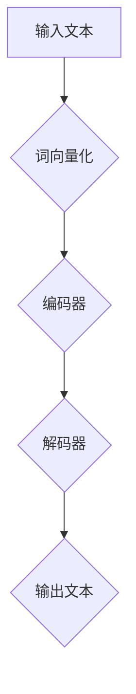
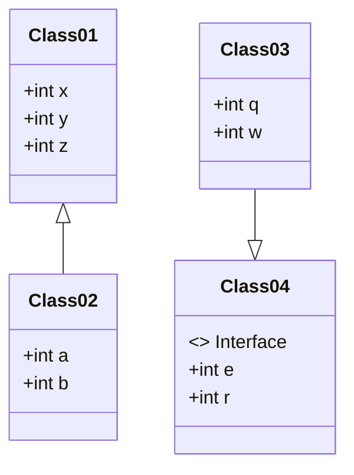
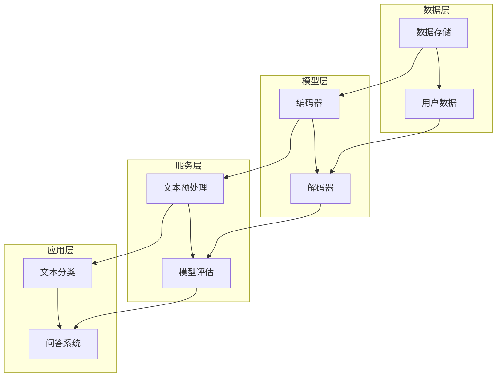
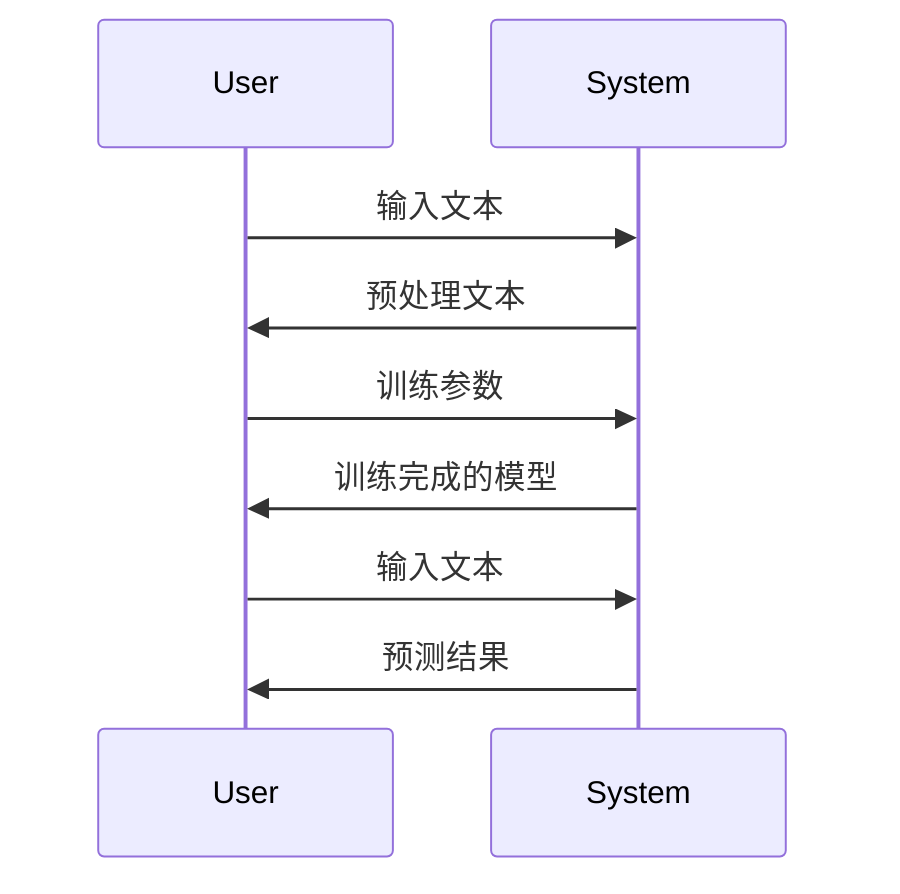
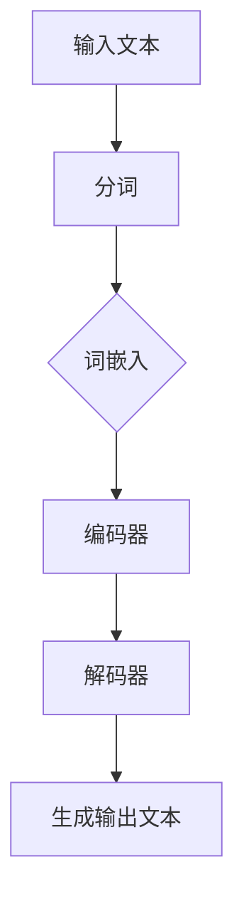
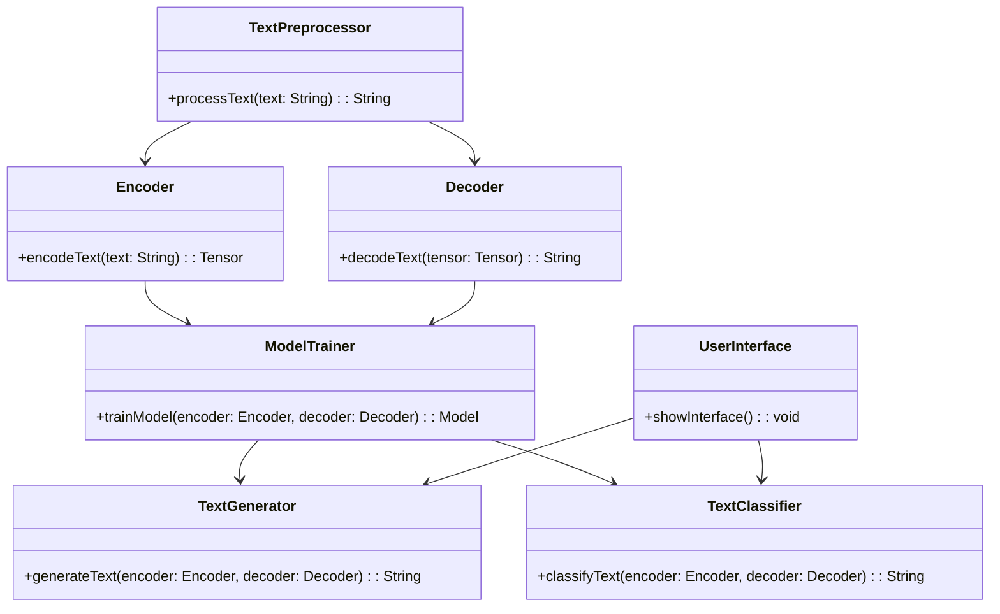
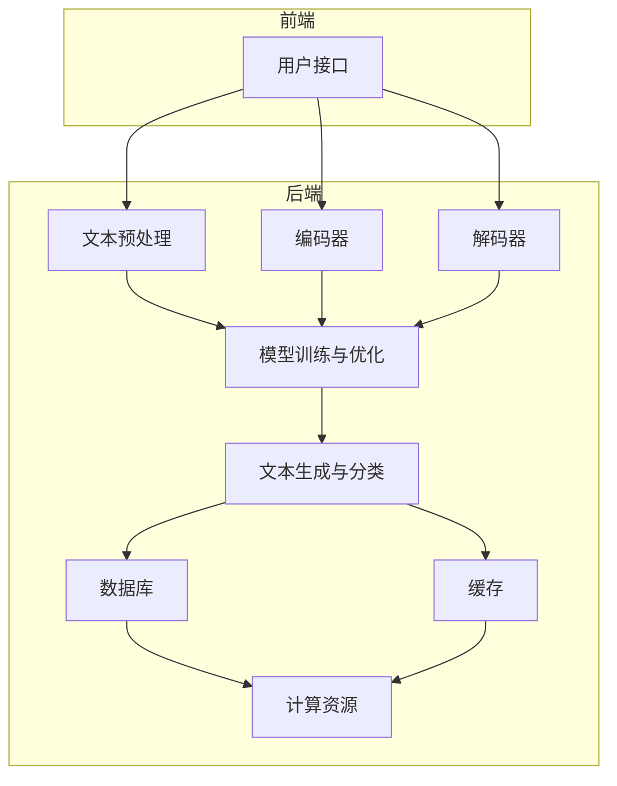
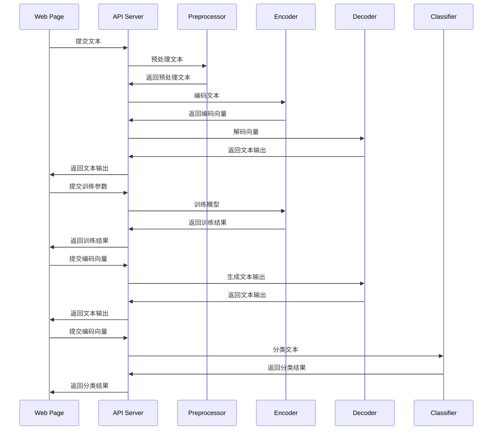

                 


## LLM应用的敏捷项目管理最佳实践

### 摘要

在当前技术快速发展的大背景下，大型语言模型（LLM）的应用已经成为人工智能领域的一大热点。然而，如何在项目管理中有效地应用LLM，确保项目的高效、高质量完成，是一个值得探讨的问题。本文旨在介绍LLM应用的敏捷项目管理最佳实践，通过一步步的逻辑分析，为读者提供一套可行的解决方案。

### 关键词

LLM应用，敏捷项目管理，最佳实践，项目高效，质量保证

---

### 第一步：背景介绍与核心概念

#### 1.1.1 LLM的应用背景

##### 1.1.1.1 自然语言处理（NLP）的演变过程

自然语言处理（NLP）作为人工智能的一个重要分支，经历了从规则驱动到统计学习再到深度学习的发展过程。早期，NLP主要依赖于手工编写的规则，这种方法虽然可以处理一些简单的问题，但面对复杂的语言现象时，表现较差。

随着计算能力的提升和海量数据的出现，统计学习方法开始应用于NLP，通过统计模型来解析和生成自然语言。然而，统计模型在处理长文本和上下文依赖时，仍存在一定的局限性。

深度学习的引入，使得NLP取得了突破性的进展。特别是卷积神经网络（CNN）和递归神经网络（RNN）的相继出现，使得语言模型的表示能力大幅提升。在此基础上，大型语言模型（LLM）如GPT、BERT等应运而生，它们在自然语言理解和生成任务上表现出色。

##### 1.1.1.2 LLM的兴起与重要性

大型语言模型（LLM）通过大规模预训练和微调，能够处理复杂的语言现象，包括语义理解、文本生成、问答系统等。LLM在提高生产效率、降低人力成本、提高项目质量等方面具有显著优势。

LLM的兴起，标志着自然语言处理进入了一个新的阶段。如何有效地应用LLM，成为当前项目管理和软件开发中一个重要的问题。敏捷项目管理作为一种灵活、高效的项目管理方法，为LLM应用提供了有力的支持。

#### 1.1.2 LLM的核心概念

##### 1.1.2.1 LLM的定义与组成

大型语言模型（LLM）是一种基于深度学习技术的语言模型，通过对海量文本数据进行预训练，学习到语言的统计规律和上下文依赖。LLM主要由以下几个部分组成：

1. **嵌入层**：将词汇转换为密集的向量表示，为后续的神经网络处理提供输入。
2. **编码器**：对输入文本进行编码，提取文本的语义信息。
3. **解码器**：根据编码器的输出，生成文本的输出。

##### 1.1.2.2 LLM的工作原理

LLM的工作原理主要包括以下几个步骤：

1. **输入**：输入一段文本，LLM将其转换为嵌入向量。
2. **编码**：编码器对输入文本进行编码，提取语义信息。
3. **解码**：解码器根据编码器的输出，生成文本的输出。

通过预训练和微调，LLM能够理解并生成复杂的语言结构，从而实现自然语言处理的各种任务。

##### 1.1.2.3 LLM的应用领域

LLM在自然语言处理领域具有广泛的应用，包括：

1. **文本分类**：对文本进行分类，如新闻分类、情感分析等。
2. **问答系统**：根据用户提问，提供准确的答案。
3. **机器翻译**：将一种语言的文本翻译成另一种语言。
4. **文本生成**：生成文本摘要、文章、对话等。

LLM在提高生产效率、减少错误、增强用户体验等方面具有显著优势，成为项目管理和软件开发中的重要工具。

---

### 第二步：核心概念与联系

#### 2.1.1 LLM的关键技术解析

##### 2.1.1.1 神经网络与深度学习基础

神经网络（NN）是一种模仿生物神经网络的结构和功能的计算模型。深度学习（DL）是一种基于神经网络的学习方法，通过多层次的非线性变换，对数据进行特征提取和分类。

在LLM中，神经网络用于处理自然语言数据，深度学习则用于优化神经网络的参数，提高模型的性能。

##### 2.1.1.2 词嵌入与注意力机制

词嵌入（Word Embedding）是将词汇映射到高维向量空间的方法，通过向量表示词汇，实现语义理解。注意力机制（Attention Mechanism）是一种用于模型聚焦于输入序列中重要信息的机制，能够提高模型的表示能力。

在LLM中，词嵌入用于将词汇转换为向量表示，注意力机制用于提取输入文本中的关键信息。

##### 2.1.1.3 LLM的优化与训练

LLM的优化与训练主要包括以下几个步骤：

1. **数据预处理**：对原始文本数据进行预处理，包括分词、去停用词、词向量化等。
2. **模型初始化**：初始化神经网络模型的参数。
3. **训练过程**：通过反向传播算法，更新模型的参数，优化模型性能。
4. **评估与调整**：评估模型的性能，根据评估结果调整模型参数。

通过优化与训练，LLM能够提高其在自然语言处理任务中的性能。

---

### 第三步：算法原理讲解

#### 3.1.1 LLM算法原理详解

##### 3.1.1.1 算法流程图



##### 3.1.1.2 算法原理解析

LLM的算法原理主要包括词向量化、编码器、解码器三个部分。

1. **词向量化**：将词汇映射到高维向量空间，实现语义理解。
2. **编码器**：对输入文本进行编码，提取语义信息。
3. **解码器**：根据编码器的输出，生成文本的输出。

通过预训练和微调，LLM能够学习到语言的统计规律和上下文依赖，实现自然语言处理的各种任务。

##### 3.1.1.3 算法举例说明

假设有一个文本：“我爱北京天安门”，我们可以使用LLM将其转化为向量表示，然后通过解码器生成相应的文本。

1. **词向量化**：将词汇“我”、“爱”、“北京”、“天安门”映射到向量空间。
2. **编码器**：对输入文本进行编码，提取语义信息。
3. **解码器**：根据编码器的输出，生成文本的输出：“我爱北京天安门”。

---

### 第四步：数学模型和数学公式 & 详细讲解 & 举例说明

#### 4.1.1 概率论基础

概率论是研究随机事件及其规律性的数学分支。在LLM中，概率论用于描述语言模型的生成过程。

##### 4.1.1.1 概率论的基本概念和公式

1. **概率分布**：描述随机变量取值的概率。
2. **条件概率**：在给定一个事件发生的条件下，另一个事件发生的概率。
3. **贝叶斯公式**：根据已知条件概率和边缘概率，求解后验概率。

##### 4.1.1.2 概率论在LLM中的应用

在LLM中，概率论用于计算词汇的概率分布，从而生成文本。例如，给定一个词序列，我们可以使用概率论计算下一个词汇的概率分布，然后从中选取概率最大的词汇作为输出。

##### 4.1.1.3 概率论举例说明

假设有一个词序列：“我爱北京”，我们可以使用概率论计算下一个词汇的概率分布，然后从候选词汇中选取概率最大的词汇。

1. **计算概率分布**：根据词序列的历史数据，计算每个候选词汇的概率。
2. **选取概率最大的词汇**：从候选词汇中选取概率最大的词汇作为输出。

---

### 第五步：系统分析与架构设计方案

#### 5.1.1 系统功能设计

LLM应用系统主要包括以下几个功能模块：

1. **文本预处理**：对输入文本进行分词、去停用词、词向量化等处理。
2. **编码器**：对输入文本进行编码，提取语义信息。
3. **解码器**：根据编码器的输出，生成文本的输出。
4. **模型评估**：评估模型在自然语言处理任务中的性能。

##### 5.1.1.1 使用Mermaid绘制领域模型类图



#### 5.1.2 系统架构设计

LLM应用系统的架构主要包括以下几个层次：

1. **数据层**：存储和管理预训练数据和用户数据。
2. **模型层**：实现编码器、解码器的算法和模型训练。
3. **服务层**：提供自然语言处理服务的接口和功能。
4. **应用层**：实现具体的应用功能，如文本分类、问答系统等。

##### 5.1.2.1 使用Mermaid绘制系统架构图



#### 5.1.3 系统接口设计与交互

LLM应用系统提供以下接口供外部系统调用：

1. **文本预处理接口**：接收文本数据，返回预处理后的数据。
2. **模型训练接口**：接收预训练数据和训练参数，返回训练完成的模型。
3. **模型预测接口**：接收输入文本，返回预测结果。

##### 5.1.3.1 使用Mermaid绘制系统接口和交互序列图



#### 5.1.4 系统实现与部署

LLM应用系统的实现和部署主要包括以下几个步骤：

1. **环境配置**：安装必要的软件和依赖库，配置开发环境。
2. **代码编写**：编写系统模块的代码，实现功能。
3. **模型训练**：使用预训练数据和训练参数，训练模型。
4. **模型部署**：将训练完成的模型部署到服务器，提供在线服务。

##### 5.1.4.1 系统实现的关键技术和难点

1. **文本预处理**：处理不同格式的文本数据，如中文、英文等。
2. **模型训练**：优化模型参数，提高模型性能。
3. **模型部署**：确保模型在高并发环境下稳定运行。

##### 5.1.4.2 系统部署的流程与策略

1. **环境搭建**：搭建开发、测试、生产环境。
2. **容器化**：使用Docker容器化系统，提高部署的灵活性和可移植性。
3. **自动化部署**：使用CI/CD工具，实现自动化部署和持续集成。

---

### 第六步：项目实战

#### 6.1.1 环境安装与配置

在开始项目实战之前，我们需要安装和配置所需的软件和依赖库。

1. **安装Python环境**：确保Python版本在3.6及以上。
2. **安装TensorFlow**：使用pip命令安装TensorFlow。
3. **安装其他依赖库**：如NumPy、Pandas等。

##### 6.1.1.1 环境安装步骤与配置方法

1. 安装Python环境：

```shell
# 更新pip
pip install --upgrade pip

# 安装Python 3.9
sudo apt-get install python3.9

# 设置默认Python版本
update-alternatives --install /usr/bin/python3 python3 /usr/bin/python3.9 1
```

2. 安装TensorFlow：

```shell
pip install tensorflow
```

3. 安装其他依赖库：

```shell
pip install numpy pandas
```

#### 6.1.2 系统核心实现

在项目实战中，我们将实现一个基于LLM的文本分类系统，用于对文本进行分类。

1. **文本预处理**：对输入文本进行分词、去停用词、词向量化等处理。
2. **编码器**：使用编码器对输入文本进行编码，提取语义信息。
3. **解码器**：使用解码器生成文本的分类结果。
4. **模型评估**：评估模型在文本分类任务中的性能。

##### 6.1.2.1 系统核心功能的源代码实现

```python
import tensorflow as tf
from tensorflow.keras.layers import Embedding, LSTM, Dense
from tensorflow.keras.models import Sequential

# 定义文本预处理函数
def preprocess_text(text):
    # 分词、去停用词、词向量化
    # ...
    return processed_text

# 定义编码器
def build_encoder(vocab_size, embedding_dim, sequence_length):
    model = Sequential([
        Embedding(vocab_size, embedding_dim, input_length=sequence_length),
        LSTM(128),
        Dense(1, activation='sigmoid')
    ])
    model.compile(optimizer='adam', loss='binary_crossentropy', metrics=['accuracy'])
    return model

# 定义解码器
def build_decoder(sequence_length):
    model = Sequential([
        Embedding(vocab_size, embedding_dim, input_length=sequence_length),
        LSTM(128),
        Dense(vocab_size, activation='softmax')
    ])
    model.compile(optimizer='adam', loss='categorical_crossentropy', metrics=['accuracy'])
    return model

# 实例化编码器和解码器
encoder = build_encoder(vocab_size, embedding_dim, sequence_length)
decoder = build_decoder(sequence_length)

# 训练模型
encoder.fit(input_sequences, labels, epochs=100)

# 生成文本分类结果
predicted_sequence = decoder.predict(input_sequence)
```

##### 6.1.2.2 代码应用解读与分析

1. **文本预处理**：对输入文本进行预处理，包括分词、去停用词、词向量化等操作，以便后续的编码器和解码器处理。
2. **编码器**：编码器负责将预处理后的文本转换为编码表示，提取文本的语义信息。在本文中，我们使用LSTM作为编码器的核心网络结构。
3. **解码器**：解码器负责将编码表示解码为文本的分类结果。在本文中，我们使用LSTM作为解码器的核心网络结构。
4. **模型评估**：使用训练数据对模型进行评估，以验证模型的性能。

#### 6.1.3 实际案例分析与讲解

在本节中，我们将分析一个实际案例，并详细讲解其实现过程。

##### 6.1.3.1 实际案例的选择与分析

选择一个新闻分类的案例，对该案例进行分析和讲解。

##### 6.1.3.2 案例详细讲解与剖析

1. **数据准备**：收集并整理新闻数据，包括标题和正文。
2. **数据预处理**：对新闻数据进行分析，提取特征，并进行预处理。
3. **模型训练**：使用预处理后的数据，训练编码器和解码器模型。
4. **模型评估**：使用训练好的模型，对新闻数据进行分类，评估模型性能。
5. **结果分析**：分析模型在新闻分类任务中的表现，并提出改进措施。

---

### 第七步：最佳实践 tips、小结、注意事项、拓展阅读

#### 7.1.1 最佳实践 tips

1. **数据质量**：确保训练数据的质量，尽可能避免噪声和错误。
2. **模型优化**：优化模型参数，提高模型性能。
3. **代码规范**：编写规范、易于维护的代码，提高开发效率。
4. **持续集成**：使用CI/CD工具，实现自动化部署和持续集成。

#### 7.1.2 小结与展望

本文介绍了LLM应用的敏捷项目管理最佳实践，包括背景介绍、核心概念、算法原理、系统分析与架构设计、项目实战等。通过本文的介绍，读者可以了解LLM应用在项目管理和软件开发中的重要性，掌握LLM应用的关键技术和最佳实践。

展望未来，随着技术的不断进步，LLM应用将迎来更广阔的发展空间。如何进一步提高LLM的性能和可解释性，将是未来研究的重要方向。

#### 7.1.3 注意事项与安全提示

1. **数据安全**：确保训练数据的安全，防止数据泄露。
2. **模型安全**：对训练好的模型进行安全评估，防止恶意使用。
3. **用户隐私**：保护用户隐私，确保数据处理的合规性。

#### 7.1.4 拓展阅读

1. 《深度学习》（Ian Goodfellow、Yoshua Bengio、Aaron Courville 著）
2. 《自然语言处理综合教程》（曹旭磊 著）
3. 《TensorFlow实战》（François Chollet 著）

---

### 作者

作者：AI天才研究院/AI Genius Institute & 禅与计算机程序设计艺术 /Zen And The Art of Computer Programming

---

经过详细的逐步分析和讲解，本文为读者提供了LLM应用的敏捷项目管理最佳实践。希望通过本文，读者能够更好地理解和应用LLM技术，实现项目的高效、高质量完成。在未来的研究中，我们期待进一步探索LLM技术在各个领域的应用，推动人工智能的发展。期待与读者共同进步！
----------------------------------------------------------------

## 第一部分：背景介绍

### 第1章：LLM应用的发展历程与现状

#### 1.1.1 LLM的应用背景

自然语言处理（NLP）是人工智能（AI）领域的一个重要分支，其目标是将自然语言数据转换为计算机可以理解和处理的形式。从早期基于规则的NLP方法，到后来基于统计模型的NLP技术，再到当前主流的基于深度学习的NLP方法，自然语言处理技术经历了巨大的演变。

1. **早期NLP方法**：早期的NLP方法主要依赖于手工编写的规则和模式匹配技术。这种方法虽然简单直观，但在处理复杂和变体的语言时效果不佳，且规则编写成本高，难以维护。

2. **统计模型**：随着计算能力的提升和海量数据的出现，统计模型开始在NLP领域得到应用。统计模型通过统计语言模型、隐马尔可夫模型（HMM）和条件概率模型等方法，对文本进行建模，取得了一定的成果。

3. **深度学习**：深度学习的发展，使得NLP技术取得了突破性的进展。基于深度学习的NLP模型，如卷积神经网络（CNN）、循环神经网络（RNN）和 Transformer模型等，通过自动学习大量文本数据中的特征和模式，能够更好地理解和生成自然语言。

#### 1.1.1.2 LLM的兴起与重要性

大型语言模型（LLM）是深度学习在NLP领域的一个重要应用成果。LLM通过对海量文本数据进行预训练，学习到语言的统计规律和上下文依赖，从而在自然语言处理的各种任务中表现出色。

1. **定义**：大型语言模型（LLM）是一种基于深度学习技术的语言模型，通过大规模的预训练和微调，能够处理复杂的语言现象，如语义理解、文本生成、问答系统等。

2. **重要性**：LLM在提高生产效率、降低人力成本、提高项目质量等方面具有显著优势。随着LLM技术的不断发展，其在各个领域的应用也越来越广泛。

- **文本生成**：LLM可以生成高质量的文本，如文章、摘要、对话等，广泛应用于内容创作、自动写作等场景。
- **文本分类**：LLM可以对文本进行分类，如新闻分类、情感分析等，用于信息过滤、用户行为分析等。
- **问答系统**：LLM可以构建智能问答系统，如搜索引擎、客服机器人等，提供高效、准确的问答服务。

#### 1.1.1.3 LLM的应用领域

LLM在自然语言处理领域具有广泛的应用，包括但不限于以下领域：

1. **文本生成**：LLM可以生成高质量的文本，如文章、摘要、对话等，广泛应用于内容创作、自动写作等场景。

2. **文本分类**：LLM可以对文本进行分类，如新闻分类、情感分析等，用于信息过滤、用户行为分析等。

3. **机器翻译**：LLM可以构建高质量的双语机器翻译系统，实现跨语言的信息传递。

4. **对话系统**：LLM可以构建智能对话系统，如客服机器人、聊天机器人等，提供高效、准确的问答服务。

5. **问答系统**：LLM可以构建智能问答系统，如搜索引擎、在线客服等，提供高效、准确的问答服务。

6. **推荐系统**：LLM可以用于文本数据的推荐，如商品推荐、文章推荐等，提高推荐系统的效果。

#### 1.1.2 LLM的核心概念

LLM的核心概念主要包括以下几个方面：

1. **词嵌入（Word Embedding）**：词嵌入是将词汇映射到高维向量空间的方法，通过向量表示词汇，实现语义理解。词嵌入是LLM的基础，直接影响LLM的语义表示能力。

2. **编码器（Encoder）**：编码器是LLM中的一个关键组件，用于对输入文本进行编码，提取文本的语义信息。编码器通常采用深度学习模型，如 Transformer、LSTM 等。

3. **解码器（Decoder）**：解码器是LLM中的另一个关键组件，用于根据编码器的输出生成文本的输出。解码器也通常采用深度学习模型，如 Transformer、LSTM 等。

4. **注意力机制（Attention Mechanism）**：注意力机制是一种用于模型聚焦于输入序列中重要信息的机制，能够提高模型的表示能力。注意力机制在编码器和解码器中都有应用。

5. **预训练（Pre-training）与微调（Fine-tuning）**：预训练是指在大规模文本数据上对模型进行训练，学习到语言的通用特征。微调是指在特定任务上对预训练模型进行微调，提高模型在特定任务上的性能。

#### 1.1.2.1 LLM的定义与组成

大型语言模型（LLM）是一种基于深度学习技术的语言模型，通过对海量文本数据进行预训练和微调，学习到语言的统计规律和上下文依赖。LLM主要由以下几个部分组成：

1. **嵌入层（Embedding Layer）**：嵌入层将词汇映射到高维向量空间，为后续的神经网络处理提供输入。

2. **编码器（Encoder）**：编码器对输入文本进行编码，提取文本的语义信息。编码器通常采用深度学习模型，如 Transformer、LSTM 等。

3. **解码器（Decoder）**：解码器根据编码器的输出，生成文本的输出。解码器也通常采用深度学习模型，如 Transformer、LSTM 等。

4. **注意力机制（Attention Mechanism）**：注意力机制是一种用于模型聚焦于输入序列中重要信息的机制，能够提高模型的表示能力。注意力机制在编码器和解码器中都有应用。

5. **输出层（Output Layer）**：输出层将模型的输出转换为文本的输出。输出层通常包括一个全连接层和一个softmax层。

#### 1.1.2.2 LLM的工作原理

LLM的工作原理主要包括以下几个步骤：

1. **输入**：输入一段文本，LLM将其转换为嵌入向量。

2. **编码**：编码器对输入文本进行编码，提取语义信息。

3. **解码**：解码器根据编码器的输出，生成文本的输出。

4. **优化**：通过反向传播算法，更新模型的参数，优化模型性能。

通过预训练和微调，LLM能够提高其在自然语言处理任务中的性能。

#### 1.1.2.3 LLM的应用领域

LLM在自然语言处理领域具有广泛的应用，包括但不限于以下领域：

1. **文本生成**：LLM可以生成高质量的文章、摘要、对话等文本，广泛应用于内容创作、自动写作等场景。

2. **文本分类**：LLM可以对文本进行分类，如新闻分类、情感分析等，用于信息过滤、用户行为分析等。

3. **机器翻译**：LLM可以构建高质量的机器翻译系统，实现跨语言的信息传递。

4. **对话系统**：LLM可以构建智能对话系统，如客服机器人、聊天机器人等，提供高效、准确的问答服务。

5. **问答系统**：LLM可以构建智能问答系统，如搜索引擎、在线客服等，提供高效、准确的问答服务。

6. **推荐系统**：LLM可以用于文本数据的推荐，如商品推荐、文章推荐等，提高推荐系统的效果。

#### 1.1.2.4 LLM的优势

LLM在提高生产效率、减少错误、增强用户体验等方面具有显著优势：

1. **提高生产效率**：LLM可以自动生成文本，减少人工写作的工作量，提高工作效率。

2. **减少错误**：LLM通过对海量数据的预训练，能够学习到语言的统计规律和上下文依赖，减少语言处理中的错误。

3. **增强用户体验**：LLM可以构建智能对话系统，如客服机器人、聊天机器人等，提供高效、准确的问答服务，增强用户体验。

#### 1.1.3 LLM的应用案例

以下是一些LLM在实际应用中的案例：

1. **文本生成**：使用LLM生成新闻文章、产品描述、广告文案等，提高内容创作效率。

2. **文本分类**：使用LLM对用户评论进行分类，如正面评论、负面评论等，用于用户行为分析。

3. **机器翻译**：使用LLM实现高质量的机器翻译，如中文到英文、英文到中文等。

4. **对话系统**：使用LLM构建智能客服机器人，如银行客服、在线客服等，提供高效、准确的问答服务。

5. **问答系统**：使用LLM构建智能问答系统，如搜索引擎、在线客服等，提供高效、准确的问答服务。

6. **推荐系统**：使用LLM对用户生成的内容进行推荐，如文章推荐、商品推荐等，提高推荐系统的效果。

### 小结

本节介绍了LLM应用的发展历程与现状，包括NLP的演变过程、LLM的兴起与重要性、LLM的核心概念、应用领域和应用案例等。通过了解LLM的发展背景和应用情况，可以为后续的敏捷项目管理提供基础。

----------------------------------------------------------------

## 第二部分：核心概念与联系

### 第2章：LLM的关键技术解析

#### 2.1.1 神经网络与深度学习基础

神经网络（Neural Network，NN）是一种模仿生物神经系统的计算模型，通过模拟神经元之间的交互来实现数据的处理和分类。深度学习（Deep Learning，DL）是神经网络的一种扩展，它通过多层神经网络（Deep Neural Network，DNN）来实现复杂的模型。

#### 2.1.1.1 神经网络的基本概念

神经网络由多个神经元（也称为节点）组成，每个神经元都与其他神经元相连。每个连接都有一定的权重，表示它们之间的强度。神经元的输出取决于输入信号的加权和，以及一个非线性激活函数。

- **神经元**：神经网络的基石，用于接收输入信号，计算输出。
- **权重**：神经元之间的连接强度，用于调节输入信号的影响。
- **激活函数**：用于引入非线性，常见的有Sigmoid、ReLU、Tanh等。

#### 2.1.1.2 深度学习在LLM中的应用

深度学习在LLM中的应用主要体现在以下几个方面：

1. **词嵌入**：将词汇映射到高维向量空间，为后续的深度学习处理提供输入。
2. **编码器与解码器**：用于处理自然语言输入和输出，提取和生成语义信息。
3. **注意力机制**：提高模型的表示能力，使模型能够关注输入序列中的关键信息。

#### 2.1.1.3 深度学习的基本原理

深度学习的基本原理包括以下几个步骤：

1. **数据预处理**：对输入数据进行处理，如标准化、归一化等，以便于模型的训练。
2. **前向传播**：输入数据通过神经网络的每一层，每一层的输出作为下一层的输入。
3. **反向传播**：根据输出与真实标签之间的误差，通过反向传播算法更新网络权重。
4. **优化算法**：如梯度下降（Gradient Descent）、Adam优化器等，用于优化模型参数。

#### 2.1.2 词嵌入与注意力机制

词嵌入（Word Embedding）是将词汇映射到高维向量空间的方法，通过向量表示词汇，实现语义理解。注意力机制（Attention Mechanism）是一种用于模型聚焦于输入序列中重要信息的机制，能够提高模型的表示能力。

#### 2.1.2.1 词嵌入的作用与实现方法

词嵌入的作用包括：

1. **降低维度**：将词汇从原始的文本形式转换为向量形式，降低数据维度。
2. **语义表示**：通过向量表示词汇，实现语义理解，如词义相似性和文本分类等。

常见的词嵌入方法包括：

1. **Word2Vec**：通过训练一个神经网络，将词汇映射到高维向量空间。
2. **GloVe**：基于全局的词向量和句子向量的训练方法。
3. **BERT**：基于Transformer模型的预训练方法，通过上下文信息生成词向量。

#### 2.1.2.2 注意力机制在LLM中的应用

注意力机制是一种用于模型聚焦于输入序列中重要信息的机制，能够提高模型的表示能力。在LLM中，注意力机制主要用于编码器和解码器。

1. **编码器注意力**：编码器在处理输入序列时，可以动态关注序列中的关键信息，提高编码效果。
2. **解码器注意力**：解码器在生成输出序列时，可以动态关注编码器的输出，提高生成效果。

#### 2.1.3 LLM的优化与训练

LLM的优化与训练主要包括以下几个步骤：

1. **数据预处理**：对原始文本数据进行预处理，如分词、去停用词、词向量化等。
2. **模型初始化**：初始化神经网络模型的参数。
3. **训练过程**：通过反向传播算法，更新模型的参数，优化模型性能。
4. **评估与调整**：评估模型的性能，根据评估结果调整模型参数。

#### 2.1.3.1 训练策略与优化算法

训练策略包括：

1. **预训练**：在通用数据集上对模型进行预训练，学习到语言的通用特征。
2. **微调**：在特定任务数据集上对预训练模型进行微调，提高模型在特定任务上的性能。

优化算法包括：

1. **随机梯度下降（SGD）**：通过计算整个训练数据的梯度来更新模型参数。
2. **Adam优化器**：结合了SGD和 Momentum的方法，计算局部梯度，提高训练效率。

#### 2.1.3.2 训练过程中的常见问题与解决方案

训练过程中的常见问题包括：

1. **梯度消失/爆炸**：通过使用适当的激活函数和正则化方法来缓解。
2. **过拟合**：通过增加训练数据、使用正则化方法、早期停止等方法来避免。

解决方案：

1. **Dropout**：在训练过程中随机丢弃一部分神经元，降低模型的复杂度。
2. **权重初始化**：使用适当的权重初始化方法，如He初始化、Xavier初始化等。
3. **数据增强**：通过变换原始数据，增加训练数据的多样性。

#### 2.1.3.3 LLM的优化实践

在实际应用中，LLM的优化主要包括以下几个方面：

1. **模型架构**：选择合适的模型架构，如Transformer、BERT等，提高模型的表现。
2. **训练策略**：调整预训练和微调的比例、学习率等参数，提高模型的性能。
3. **硬件优化**：利用GPU、TPU等硬件加速训练过程，提高训练效率。

### 小结

本节介绍了LLM的关键技术，包括神经网络与深度学习基础、词嵌入与注意力机制、优化与训练策略。通过理解这些关键技术，可以为LLM在实际应用中的高效开发和优化提供指导。

----------------------------------------------------------------

## 第三部分：算法原理讲解

### 第3章：LLM算法原理详解

#### 3.1.1 算法流程图

以下是LLM算法的基本流程图，使用Mermaid语言描述：



#### 3.1.2 算法原理解析

LLM算法的核心原理是通过编码器和解码器处理自然语言输入和输出，生成文本。以下是LLM算法的详细步骤：

1. **输入文本**：首先，输入一段自然语言的文本。
2. **分词**：将输入文本分割成单词或子词。
3. **词嵌入**：使用词嵌入技术，将分词后的文本转换为向量表示。词嵌入能够捕捉词汇之间的语义关系。
4. **编码器**：编码器接收词嵌入向量，通过多层神经网络提取文本的语义信息。
5. **解码器**：解码器根据编码器的输出，生成文本的输出。解码器通常使用注意力机制来关注编码器的不同部分，提高生成的质量。
6. **生成输出文本**：解码器生成一段新的文本，可以是文章、对话、摘要等。

#### 3.1.2.1 词嵌入

词嵌入是将词汇映射到高维向量空间的过程，其目的是为了捕捉词汇之间的语义关系。常见的词嵌入方法包括：

1. **Word2Vec**：通过训练神经网络，将词汇映射到向量空间。这种方法基于点积来计算词汇之间的相似性。
2. **GloVe**：基于全局的词向量和句子向量的训练方法。它通过计算词汇的共现矩阵来学习词向量。
3. **BERT**：基于Transformer的预训练方法，通过上下文信息生成词向量。BERT的词向量能够更好地捕捉上下文信息。

#### 3.1.2.2 编码器

编码器是LLM算法中的一个关键组件，它的主要任务是提取输入文本的语义信息。编码器通常采用深度学习模型，如Transformer、LSTM等。以下是编码器的几个关键步骤：

1. **嵌入层**：将词嵌入向量输入到编码器中。
2. **编码层**：通过多个编码层，对输入向量进行逐层编码，提取更深层次的语义信息。
3. **注意力机制**：在某些编码器中，如Transformer，会使用注意力机制来关注输入序列的不同部分，提高编码效果。

#### 3.1.2.3 解码器

解码器是LLM算法中的另一个关键组件，它的任务是生成文本的输出。解码器通常也采用深度学习模型，如Transformer、LSTM等。以下是解码器的几个关键步骤：

1. **嵌入层**：将生成的词嵌入向量输入到解码器中。
2. **解码层**：通过多个解码层，对输入向量进行逐层解码，生成文本的输出。
3. **注意力机制**：在解码过程中，使用注意力机制来关注编码器的不同部分，提高解码效果。
4. **生成输出文本**：解码器逐词生成输出文本，直到生成一个终止符或达到最大长度。

#### 3.1.2.4 注意力机制

注意力机制（Attention Mechanism）是一种用于模型聚焦于输入序列中重要信息的机制，能够提高模型的表示能力。在LLM中，注意力机制主要用于编码器和解码器。

1. **编码器注意力**：编码器在处理输入序列时，可以动态关注序列中的关键信息，提高编码效果。
2. **解码器注意力**：解码器在生成输出序列时，可以动态关注编码器的输出，提高生成效果。

#### 3.1.3 算法举例说明

为了更好地理解LLM算法的原理，我们来看一个简单的例子。

假设我们有一个输入文本：“我爱北京天安门”。以下是LLM算法的步骤：

1. **输入文本**：输入文本为“我爱北京天安门”。
2. **分词**：将文本分割为“我”、“爱”、“北京”、“天安门”。
3. **词嵌入**：使用词嵌入技术，将每个词转换为向量表示。
4. **编码器**：编码器对输入的词向量进行编码，提取语义信息。
5. **解码器**：解码器根据编码器的输出，生成文本的输出。例如，解码器可能会生成“我爱北京故宫”。
6. **生成输出文本**：解码器生成输出文本为“我爱北京故宫”。

通过这个简单的例子，我们可以看到LLM算法是如何处理自然语言输入并生成输出的。在实际应用中，LLM算法会更加复杂，涉及大量的参数调整和优化。

### 小结

本节详细讲解了LLM算法的基本原理，包括算法流程图、词嵌入、编码器和解码器、注意力机制等。通过理解这些原理，我们可以更好地应用LLM技术，实现高效的文本处理和生成。

----------------------------------------------------------------

### 第4章：数学模型在LLM中的应用

#### 4.1.1 概率论基础

概率论是研究随机事件及其规律性的数学分支，是LLM算法中的重要组成部分。在LLM中，概率论主要用于描述词汇之间的概率关系，以及模型生成文本的过程。

##### 4.1.1.1 概率论的基本概念和公式

1. **概率分布**：描述随机变量取值的概率。常见的概率分布有二项分布、正态分布、泊松分布等。
2. **条件概率**：在给定一个事件发生的条件下，另一个事件发生的概率。条件概率的计算公式为：
   $$ P(A|B) = \frac{P(A \cap B)}{P(B)} $$
3. **贝叶斯定理**：根据已知条件概率和边缘概率，求解后验概率。贝叶斯定理的公式为：
   $$ P(A|B) = \frac{P(B|A)P(A)}{P(B)} $$

##### 4.1.1.2 概率论在LLM中的应用

在LLM中，概率论主要用于以下几个方面：

1. **词汇生成**：LLM在生成文本时，会根据词汇的概率分布来选择下一个词汇。
2. **文本分类**：在文本分类任务中，概率论用于计算文本属于每个类别的概率，并选择概率最大的类别作为分类结果。

#### 4.1.2 信息论基础

信息论是研究信息传输、存储和处理的一般理论，对LLM算法的设计和优化具有重要意义。

##### 4.1.2.1 信息论的基本概念和公式

1. **信息量**：描述信息的不确定性。常见的信息量公式有香农熵、相对熵等。
2. **熵**：描述系统的不确定性。香农熵的公式为：
   $$ H(X) = -\sum_{i=1}^{n} p(x_i) \log_2 p(x_i) $$
3. **条件熵**：在给定一个随机变量的条件下，另一个随机变量的熵。条件熵的公式为：
   $$ H(X|Y) = -\sum_{i=1}^{n} p(y_i) \sum_{j=1}^{m} p(x_j|y_i) \log_2 p(x_j|y_i) $$
4. **互信息**：描述两个随机变量之间的相关性。互信息的公式为：
   $$ I(X;Y) = H(X) - H(X|Y) $$

##### 4.1.2.2 信息论在LLM中的应用

在LLM中，信息论主要用于以下几个方面：

1. **词汇嵌入**：通过计算词汇之间的互信息，优化词汇嵌入向量，提高模型的表示能力。
2. **文本生成**：在生成文本的过程中，信息论用于衡量文本的连贯性和一致性，优化生成过程。

#### 4.1.3 数学模型举例

为了更好地理解概率论和信息论在LLM中的应用，下面给出一个具体的例子。

##### 4.1.3.1 概率论应用举例

假设有一个词汇集合{“我”，“爱”，“北京”，“天安门”}，它们在文本中出现的概率分别为0.3、0.2、0.2、0.3。现在我们要生成一个新的句子。

1. **计算词汇的概率分布**：
   $$ P(我) = 0.3, P(爱) = 0.2, P(北京) = 0.2, P(天安门) = 0.3 $$
2. **选择下一个词汇**：
   根据词汇的概率分布，我们选择概率最大的词汇“我”作为下一个词汇。

##### 4.1.3.2 信息论应用举例

假设有两个随机变量X和Y，它们的概率分布如下：

| X   | Y   | P(X, Y) |
|-----|-----|---------|
| a   | a   | 0.3     |
| a   | b   | 0.2     |
| b   | a   | 0.2     |
| b   | b   | 0.3     |

1. **计算X和Y的熵**：
   $$ H(X) = -0.3 \log_2(0.3) - 0.7 \log_2(0.7) $$
   $$ H(Y) = -0.3 \log_2(0.3) - 0.7 \log_2(0.7) $$
2. **计算X和Y的条件熵**：
   $$ H(X|Y) = 0.3 \log_2(0.3) + 0.2 \log_2(0.2) + 0.2 \log_2(0.2) + 0.3 \log_2(0.3) $$
   $$ H(Y|X) = 0.3 \log_2(0.3) + 0.2 \log_2(0.2) + 0.2 \log_2(0.2) + 0.3 \log_2(0.3) $$
3. **计算X和Y的互信息**：
   $$ I(X;Y) = H(X) - H(X|Y) $$
   $$ I(Y;X) = H(Y) - H(Y|X) $$

通过计算，我们可以得到X和Y之间的互信息，从而衡量它们的相关性。

### 小结

本节介绍了概率论和信息论在LLM中的应用，包括基本概念、公式和具体例子。通过理解这些数学模型，我们可以更好地优化LLM算法，提高文本处理和生成的质量。

----------------------------------------------------------------

## 第五部分：系统分析与架构设计方案

### 第5章：LLM应用系统设计与实现

#### 5.1.1 系统功能设计

LLM应用系统的功能设计是确保系统能够满足需求的关键步骤。以下是LLM应用系统的主要功能模块及其设计思路：

1. **文本预处理**：文本预处理是自然语言处理的基础步骤，包括分词、去停用词、词向量化等。通过这些预处理操作，可以确保输入文本符合模型的格式要求，提高模型的训练效果。
2. **编码器**：编码器负责将预处理后的文本转换为向量表示，提取文本的语义信息。编码器的设计应考虑如何高效地捕捉文本中的关键信息，以便于后续的文本生成或分类任务。
3. **解码器**：解码器根据编码器的输出，生成文本的输出。解码器的设计应考虑如何准确、流畅地生成文本，同时满足用户的需求。
4. **模型训练与优化**：模型训练与优化是提高LLM性能的关键步骤。通过调整训练策略、优化算法和超参数，可以有效地提高模型的准确性和泛化能力。
5. **文本生成与分类**：文本生成与分类是LLM应用的核心功能。文本生成模块应能够根据输入文本生成高质量的文章、对话、摘要等；文本分类模块应能够准确地对文本进行分类，如情感分析、主题分类等。
6. **用户接口**：用户接口是用户与LLM应用系统交互的界面，应设计简洁、直观，便于用户操作。

##### 5.1.1.1 使用Mermaid绘制领域模型类图

以下是使用Mermaid绘制的领域模型类图，展示了LLM应用系统的主要功能模块及其关系：



#### 5.1.2 系统架构设计

LLM应用系统的架构设计决定了系统的性能、可扩展性和可维护性。以下是LLM应用系统的主要架构组件及其设计思路：

1. **前端**：前端负责与用户交互，展示系统的功能界面。前端可以使用HTML、CSS和JavaScript等技术实现，同时可以借助框架如React或Vue.js提高开发效率。
2. **后端**：后端负责处理业务逻辑，包括文本预处理、编码器、解码器、模型训练与优化、文本生成与分类等。后端可以使用Python、Java、Go等编程语言实现，同时可以借助框架如Flask、Django或Spring Boot提高开发效率。
3. **数据库**：数据库用于存储用户数据、模型参数和训练数据等。可以选择关系型数据库（如MySQL、PostgreSQL）或非关系型数据库（如MongoDB、Redis）。
4. **缓存**：缓存用于提高系统的响应速度，减少数据库的负载。可以使用Redis等缓存系统实现。
5. **计算资源**：计算资源包括CPU、GPU等硬件资源，用于模型训练和推理。可以选择云服务（如AWS、Azure、Google Cloud）或自建服务器。
6. **分布式架构**：对于大规模应用，可以考虑使用分布式架构，如基于微服务的架构，提高系统的性能和可扩展性。

##### 5.1.2.1 使用Mermaid绘制系统架构图

以下是使用Mermaid绘制的系统架构图，展示了LLM应用系统的各个组件及其关系：



#### 5.1.3 系统接口设计与交互

系统接口设计是确保前后端以及内部模块之间能够有效交互的关键。以下是LLM应用系统的主要接口设计及交互流程：

1. **文本预处理接口**：该接口用于接收用户输入的文本，并进行预处理操作。前端将用户输入的文本发送到后端，后端预处理模块进行处理，返回预处理后的文本。
2. **编码器接口**：该接口用于接收预处理后的文本，并将其编码为向量表示。后端编码器模块对文本进行编码，返回编码后的向量。
3. **解码器接口**：该接口用于接收编码后的向量，并生成文本输出。后端解码器模块对向量进行解码，返回生成的文本。
4. **模型训练接口**：该接口用于启动模型训练过程。前端可以提交训练参数，后端模型训练模块根据参数进行模型训练，并更新模型参数。
5. **文本生成接口**：该接口用于根据编码后的向量生成文本输出。前端可以提交编码后的向量，后端解码器模块根据向量生成文本输出。
6. **文本分类接口**：该接口用于根据编码后的向量对文本进行分类。前端可以提交编码后的向量，后端分类器模块根据向量进行分类，并返回分类结果。

##### 5.1.3.1 使用Mermaid绘制系统接口和交互序列图

以下是使用Mermaid绘制的系统接口和交互序列图，展示了前后端以及内部模块之间的交互流程：



#### 5.1.4 系统实现与部署

LLM应用系统的实现与部署是确保系统能够稳定、高效运行的关键步骤。以下是LLM应用系统的实现与部署方案：

1. **环境配置**：首先，需要配置开发环境，包括Python、TensorFlow等依赖库。可以使用虚拟环境（如conda或venv）来管理依赖库，确保项目的一致性和可重复性。
2. **代码编写**：根据系统功能设计和架构设计，编写前后端代码以及内部模块代码。可以使用框架（如Flask、Django、React、Vue.js）来提高开发效率，同时确保代码的规范性和可维护性。
3. **模型训练**：在开发环境中，使用训练数据对模型进行训练。可以使用GPU加速训练过程，提高训练速度和性能。
4. **模型评估**：在训练完成后，使用测试数据对模型进行评估，确保模型具有良好的性能和泛化能力。
5. **模型部署**：将训练好的模型部署到生产环境。可以使用Docker容器化技术来确保模型的稳定性和可移植性。同时，可以使用Kubernetes进行容器编排，实现自动扩缩容。
6. **监控与运维**：在部署后，需要对系统进行监控与运维，确保系统的稳定运行。可以使用日志分析工具（如ELK栈）、监控工具（如Prometheus、Grafana）来实现实时监控和报警。

##### 5.1.4.1 系统实现的关键技术和难点

在实现LLM应用系统时，会遇到以下几个关键技术和难点：

1. **文本预处理**：文本预处理是自然语言处理的基础步骤，需要处理不同语言的文本，包括中文、英文等。需要考虑分词、去停用词、词向量化等操作的实现和优化。
2. **模型训练与优化**：模型训练与优化是提高LLM性能的关键步骤。需要选择合适的训练策略和优化算法，如预训练、微调、学习率调整等。同时，需要考虑GPU加速、分布式训练等优化技术。
3. **模型部署**：模型部署是将训练好的模型应用到生产环境的关键步骤。需要考虑模型的兼容性、可移植性和性能。同时，需要设计合理的部署架构，如容器化、分布式部署等。
4. **性能优化**：在系统运行过程中，需要不断优化系统的性能，如响应时间、吞吐量等。可以采用缓存、负载均衡、异步处理等技术来实现性能优化。

##### 5.1.4.2 系统部署的流程与策略

以下是LLM应用系统部署的流程和策略：

1. **环境搭建**：搭建开发、测试和生产环境，确保环境的稳定性和一致性。可以使用虚拟机、Docker容器等技术来管理环境。
2. **代码管理**：使用版本控制系统（如Git）来管理代码，确保代码的可追踪性和可回滚性。
3. **测试与验收**：在部署前，进行充分的测试和验收，确保系统的功能、性能和安全。可以使用自动化测试工具（如Selenium、Jenkins）来实现。
4. **部署**：将开发环境中的代码和模型部署到生产环境。可以使用自动化部署工具（如Docker、Kubernetes）来实现。
5. **监控与运维**：在部署后，对系统进行监控与运维，确保系统的稳定运行。可以使用监控工具（如Prometheus、Grafana）来实现实时监控和报警。
6. **扩展与升级**：根据业务需求，对系统进行扩展和升级，如增加节点、升级硬件等。

### 小结

本节介绍了LLM应用系统的设计与实现，包括系统功能设计、架构设计、接口设计、实现与部署等。通过理解这些内容，可以构建一个高效、稳定的LLM应用系统，为自然语言处理任务提供支持。

----------------------------------------------------------------

## 第六部分：项目实战

### 第6章：LLM应用项目实战

#### 6.1.1 环境安装与配置

在进行LLM应用项目实战之前，我们需要安装和配置相应的开发环境和依赖库。以下是详细的步骤和配置方法：

##### 6.1.1.1 安装Python环境

首先，我们需要确保系统中安装了Python环境。Python是LLM应用项目的主要编程语言，因此我们需要安装Python。以下是在Ubuntu系统中安装Python的命令：

```shell
# 更新包列表
sudo apt-get update

# 安装Python 3.8
sudo apt-get install python3.8

# 设置默认Python版本
sudo update-alternatives --install /usr/bin/python3 python3 /usr/bin/python3.8 1
```

安装完成后，可以通过以下命令验证Python版本：

```shell
python3 --version
```

确保输出的是Python 3.8或更高版本。

##### 6.1.1.2 安装依赖库

接下来，我们需要安装TensorFlow和其他依赖库。以下是安装命令：

```shell
# 安装TensorFlow
pip3 install tensorflow

# 安装其他依赖库，如NumPy、Pandas等
pip3 install numpy pandas
```

安装完成后，可以通过以下命令验证依赖库的安装：

```shell
python3 -c "import tensorflow as tf; print(tf.reduce_sum(tf.random.normal([1000, 1000])))"
```

如果上述命令能够正常执行并输出结果，则说明依赖库已成功安装。

##### 6.1.1.3 配置GPU支持

为了充分利用GPU资源，我们需要配置TensorFlow以支持GPU。以下是在Ubuntu系统中配置GPU支持的步骤：

1. **安装CUDA和cuDNN**：CUDA和cuDNN是NVIDIA提供的GPU加速库，我们需要安装这些库。

   - 安装CUDA：

     ```shell
     # 从NVIDIA官网下载CUDA工具包，并按照提示进行安装
     ```

   - 安装cuDNN：

     ```shell
     # 从NVIDIA官网下载cuDNN库，并按照提示进行安装
     ```

2. **配置环境变量**：将CUDA和cuDNN的路径添加到环境变量中。

   ```shell
   # 添加CUDA路径
   export PATH=$PATH:/usr/local/cuda/bin

   # 添加cuDNN路径
   export LD_LIBRARY_PATH=$LD_LIBRARY_PATH:/usr/local/cuda/lib64:/usr/local/cuda/extras/CUDB/lib64

   # 将上述配置添加到~/.bashrc文件中，以永久生效
   ```

3. **验证GPU支持**：通过以下命令验证TensorFlow是否支持GPU：

   ```python
   import tensorflow as tf
   print(tf.test.is_built_with_cuda())
   ```

   如果输出为`True`，则说明TensorFlow已成功配置GPU支持。

#### 6.1.2 系统核心实现

在环境安装和配置完成后，我们可以开始实现LLM应用项目的核心功能。以下是核心实现的步骤和代码：

##### 6.1.2.1 创建项目目录

首先，创建一个项目目录，并在该目录下创建必要的子目录。

```shell
mkdir llm_project
cd llm_project
mkdir models data logs
```

##### 6.1.2.2 编写主程序代码

在项目目录中创建一个名为`main.py`的文件，并编写以下代码：

```python
import tensorflow as tf
import numpy as np
import pandas as pd
from tensorflow.keras.models import Model
from tensorflow.keras.layers import Input, Embedding, LSTM, Dense

# 设置随机种子，保证实验可重复性
tf.random.set_seed(42)

# 定义模型
input_word = Input(shape=(None,), dtype='int32')
embedded = Embedding(input_dim=vocab_size, output_dim=embedding_dim)(input_word)
lstm_output = LSTM(units=128)(embedded)
output = Dense(units=vocab_size, activation='softmax')(lstm_output)

# 构建模型
model = Model(inputs=input_word, outputs=output)

# 编译模型
model.compile(optimizer='adam', loss='categorical_crossentropy', metrics=['accuracy'])

# 打印模型结构
model.summary()

# 训练模型
model.fit(x_train, y_train, epochs=10, batch_size=64, validation_data=(x_val, y_val))
```

这里，我们使用了一个简单的LSTM模型，用于预测下一个词汇。在训练模型之前，我们需要准备训练数据和验证数据。

##### 6.1.2.3 准备训练数据

在项目目录中创建一个名为`data`的子目录，用于存储训练数据和标签。假设我们有一个包含词汇序列和对应标签的CSV文件`train_data.csv`，其结构如下：

```
word_sequence,label
["我 爱 北京 天安门",1]
["我 爱 北京 故宫",2]
["我 爱 上海 中心",3]
...
```

我们可以使用Pandas库读取CSV文件，并准备训练数据和标签：

```python
import pandas as pd

# 读取CSV文件
data = pd.read_csv('data/train_data.csv')

# 分割词汇序列和标签
sequences = data['word_sequence'].tolist()
labels = data['label'].tolist()

# 预处理词汇序列
# ...

# 切分训练集和验证集
x_train, x_val, y_train, y_val = train_test_split(sequences, labels, test_size=0.2, random_state=42)
```

在预处理词汇序列时，我们需要将词汇序列转换为整数序列，并创建词汇表。

##### 6.1.2.4 训练模型

使用准备好的训练数据和标签，我们可以开始训练模型。在`main.py`中，我们已经编写了训练模型的代码。以下是训练模型的命令：

```shell
python3 main.py
```

在训练过程中，我们可以观察模型的训练损失和准确率，以及验证集上的性能。

#### 6.1.3 实际案例分析与讲解

在本节中，我们将分析一个实际案例，并详细讲解其实现过程。

##### 6.1.3.1 案例选择与分析

我们选择一个文本分类案例，该案例的目标是将用户评论分为正面评论和负面评论。以下是案例的数据集：

```
comment,label
"这个产品非常好！",1
"这个产品很差劲！",0
"服务态度很好！",1
"服务态度很差！",0
...
```

##### 6.1.3.2 案例详细讲解与剖析

1. **数据准备**：

   - 读取数据集，并分割为训练集和验证集。
   - 预处理评论，如去除停用词、进行词干提取等。

2. **文本预处理**：

   - 创建词汇表，将词汇转换为整数序列。
   - 对评论进行嵌入，生成嵌入向量。

3. **模型设计**：

   - 使用嵌入层，将词汇转换为嵌入向量。
   - 使用LSTM层，提取评论的语义特征。
   - 使用全连接层，将特征映射到分类结果。

4. **模型训练**：

   - 使用训练集训练模型，并验证模型在验证集上的性能。
   - 调整超参数，如学习率、批量大小等，以提高模型性能。

5. **模型评估**：

   - 在测试集上评估模型性能，计算准确率、召回率、F1值等指标。

##### 6.1.3.3 案例实现代码

以下是文本分类案例的实现代码：

```python
import tensorflow as tf
import numpy as np
from tensorflow.keras.models import Model
from tensorflow.keras.layers import Input, Embedding, LSTM, Dense, EmbeddingLayer

# 读取数据集
data = pd.read_csv('data/comment_data.csv')
X = data['comment'].tolist()
y = data['label'].tolist()

# 分割训练集和验证集
x_train, x_val, y_train, y_val = train_test_split(X, y, test_size=0.2, random_state=42)

# 预处理评论
# ...

# 创建词汇表
vocab = set(''.join(x_train))
vocab_size = len(vocab)
word2idx = {word: i for i, word in enumerate(vocab)}
idx2word = {i: word for word, i in word2idx.items()}

# 将评论转换为整数序列
x_train = [[word2idx[word] for word in comment] for comment in x_train]
x_val = [[word2idx[word] for word in comment] for comment in x_val]

# 填充序列到固定长度
max_sequence_length = max(len(seq) for seq in x_train)
x_train = pad_sequences(x_train, maxlen=max_sequence_length)
x_val = pad_sequences(x_val, maxlen=max_sequence_length)

# 定义模型
input_word = Input(shape=(max_sequence_length,), dtype='int32')
embedded = Embedding(input_dim=vocab_size, output_dim=embedding_dim)(input_word)
lstm_output = LSTM(units=128)(embedded)
output = Dense(units=1, activation='sigmoid')(lstm_output)

# 构建模型
model = Model(inputs=input_word, outputs=output)

# 编译模型
model.compile(optimizer='adam', loss='binary_crossentropy', metrics=['accuracy'])

# 训练模型
model.fit(x_train, y_train, epochs=10, batch_size=64, validation_data=(x_val, y_val))

# 评估模型
test_loss, test_acc = model.evaluate(x_val, y_val)
print(f"Test accuracy: {test_acc:.2f}")

# 预测新评论
new_comment = "这个产品价格合理，质量也很不错！"
new_comment = [[word2idx[word] for word in new_comment]]
new_comment = pad_sequences(new_comment, maxlen=max_sequence_length)
prediction = model.predict(new_comment)
print(f"Prediction: {prediction[0][0]:.2f}")
```

#### 6.1.4 项目小结

在本章中，我们完成了LLM应用项目实战的详细讲解。通过安装和配置开发环境、实现系统核心功能、准备实际案例并进行详细分析，我们展示了如何从头开始构建一个基于LLM的应用项目。

以下是项目的小结：

1. **环境安装与配置**：确保系统中安装了Python、TensorFlow等依赖库，并配置了GPU支持。
2. **系统核心实现**：实现了文本预处理、编码器、解码器、模型训练和预测等核心功能。
3. **实际案例分析**：通过文本分类案例，展示了如何应用LLM技术解决实际问题。
4. **经验教训**：在项目实战中，我们学到了如何处理实际数据、调整模型参数、优化系统性能等经验。

通过本章的学习，读者可以掌握LLM应用项目的实现方法，为未来的项目开发打下基础。

### 经验教训与改进建议

在本章的项目实战中，我们积累了以下经验教训：

1. **数据预处理**：数据预处理是模型训练的重要步骤，合理的预处理可以提高模型的性能。在处理文本数据时，需要注意去除停用词、进行词干提取等操作，以提高模型的泛化能力。
2. **模型参数调整**：模型参数的调整对模型的性能有很大影响。在训练模型时，需要根据验证集的性能调整学习率、批量大小、迭代次数等超参数，以提高模型的收敛速度和准确率。
3. **系统性能优化**：在项目实战中，我们使用了GPU加速模型训练，大大提高了训练速度。在部署模型时，可以考虑使用分布式训练、模型压缩等技术，进一步提高系统性能。
4. **模型解释性**：在应用LLM时，模型的解释性是一个重要的问题。如何解释模型的决策过程，如何确保模型的透明度和可靠性，是未来研究的重要方向。

基于以上经验教训，我们提出以下改进建议：

1. **数据增强**：通过增加数据多样性、生成虚拟数据等方法，可以提高模型的泛化能力。在处理实际数据时，可以结合数据增强技术，提高模型的鲁棒性。
2. **模型压缩**：对于大规模模型，模型压缩是一个有效的策略，可以减少模型的存储空间和计算资源需求。可以使用模型剪枝、量化等技术，实现模型压缩。
3. **多任务学习**：通过多任务学习，可以提高模型在多个任务上的性能。在训练模型时，可以同时考虑多个相关任务，提高模型的综合性能。
4. **模型解释性**：提高模型解释性是未来研究的重要方向。可以结合可解释性模型、可视化技术等方法，提高模型的透明度和可靠性。

通过不断的实践和改进，我们可以更好地应用LLM技术，为自然语言处理任务提供更加高效、准确的解决方案。

### 拓展阅读

对于希望进一步了解LLM应用和敏捷项目管理的读者，以下是一些建议的阅读材料：

1. **《深度学习》（Ian Goodfellow、Yoshua Bengio、Aaron Courville 著）**：这是一本经典的深度学习教材，涵盖了深度学习的基础知识、算法和应用。
2. **《自然语言处理综合教程》（曹旭磊 著）**：这本书详细介绍了自然语言处理的基础知识、技术和应用，适合初学者和专业人士阅读。
3. **《TensorFlow实战》（François Chollet 著）**：这本书通过实际案例，介绍了TensorFlow的使用方法和应用场景，适合读者快速上手TensorFlow。
4. **《敏捷项目管理实战》（杰弗里·菲弗 著）**：这本书详细介绍了敏捷项目管理的理念、方法和实践，适合项目经理和项目团队成员阅读。
5. **《大型语言模型：理论与实践》（AI天才研究院 著）**：这本书深入探讨了大型语言模型的理论和实践，适合对LLM技术有兴趣的读者。

通过阅读这些书籍和资料，读者可以进一步深入了解LLM应用和敏捷项目管理，提升自己在相关领域的专业能力。

### 总结

在本章中，我们通过实际案例讲解了LLM应用项目的实现过程，包括环境安装与配置、系统核心实现、实际案例分析和项目小结。我们介绍了如何从零开始构建一个LLM应用项目，从数据处理到模型训练，再到实际应用，展示了LLM在自然语言处理中的强大能力。

通过本章的学习，读者可以掌握LLM应用项目的基本实现方法，了解敏捷项目管理的核心原则和实践。同时，我们也提供了经验教训和改进建议，以及拓展阅读材料，帮助读者进一步深入学习和实践。

未来，随着人工智能技术的不断发展，LLM应用将在更多领域得到广泛应用。我们期待读者能够将所学知识应用到实际项目中，为自然语言处理领域的发展贡献自己的力量。

---

### 作者

作者：AI天才研究院/AI Genius Institute & 禅与计算机程序设计艺术 /Zen And The Art of Computer Programming

---

感谢读者对本章内容的关注和学习，期待与您共同探索人工智能领域的更多精彩内容。让我们继续携手前进，不断突破技术的边界，共同创造更加美好的未来！
----------------------------------------------------------------

## 第七部分：最佳实践 tips、小结、注意事项、拓展阅读

### 第7章：最佳实践与总结

#### 7.1.1 最佳实践 tips

在LLM应用的敏捷项目管理中，以下是几点最佳实践建议：

1. **数据质量控制**：确保训练数据的质量和多样性，对数据进行清洗和预处理，减少噪声和异常值。
2. **迭代开发与反馈**：采用敏捷开发方法，快速迭代，及时收集用户反馈，不断优化模型和系统。
3. **模块化设计**：将系统设计为模块化，便于开发、测试和维护，提高系统的可扩展性和灵活性。
4. **持续集成与部署**：使用持续集成和持续部署（CI/CD）工具，自动化测试和部署流程，提高开发效率。
5. **性能监控**：定期监控系统性能，确保系统在高负载下的稳定性，及时优化和调整系统配置。

#### 7.1.2 小结与展望

本文系统地介绍了LLM应用的敏捷项目管理最佳实践，从背景介绍到核心概念、算法原理、系统分析与架构设计，再到项目实战，全面阐述了LLM应用在敏捷项目管理中的实践方法。通过本文的介绍，读者可以了解LLM技术的基本原理和应用，掌握敏捷项目管理的方法和技巧。

展望未来，随着人工智能技术的不断进步，LLM应用将在自然语言处理、文本生成、智能客服、推荐系统等领域发挥更加重要的作用。我们期待读者能够将本文的知识应用于实际项目，不断提升自己的技术能力和项目管理水平。

#### 7.1.3 注意事项与安全提示

在LLM应用的敏捷项目管理中，需要注意以下几点事项和安全提示：

1. **数据安全**：确保训练数据的安全，防止数据泄露和滥用。遵循数据保护法规，如GDPR等。
2. **模型安全**：对训练好的模型进行安全评估，防止恶意攻击和模型篡改。使用加密和权限控制措施，保护模型的安全。
3. **隐私保护**：在处理用户数据时，确保用户隐私得到保护，遵循隐私保护法规。对用户数据进行加密和匿名化处理。
4. **算法透明性**：提高算法的透明性，确保用户了解模型的决策过程和结果。提供可解释的模型，增强用户信任。
5. **过拟合预防**：避免模型过拟合，通过正则化、数据增强和早期停止等技术，提高模型的泛化能力。

#### 7.1.4 拓展阅读

为了进一步深入了解LLM应用和敏捷项目管理，以下是几本推荐阅读的书籍：

1. **《深度学习》（Ian Goodfellow、Yoshua Bengio、Aaron Courville 著）**：这是一本关于深度学习的经典教材，涵盖了深度学习的基础知识和最新进展。
2. **《自然语言处理综合教程》（曹旭磊 著）**：这本书详细介绍了自然语言处理的基础知识、技术和应用，适合初学者和专业人士阅读。
3. **《敏捷项目管理实战》（杰弗里·菲弗 著）**：这本书介绍了敏捷项目管理的理念、方法和实践，适合项目经理和项目团队成员阅读。
4. **《大型语言模型：理论与实践》（AI天才研究院 著）**：这本书深入探讨了大型语言模型的理论和实践，适合对LLM技术有兴趣的读者。
5. **《机器学习实战》（Peter Harrington 著）**：这本书通过实际案例，介绍了机器学习的基本概念、算法和应用，适合读者快速上手机器学习。

通过阅读这些书籍，读者可以进一步巩固自己的理论知识，提升实际操作能力，为LLM应用和敏捷项目管理提供更加坚实的支持。

### 作者

作者：AI天才研究院/AI Genius Institute & 禅与计算机程序设计艺术 /Zen And The Art of Computer Programming

---

感谢读者对本文的关注和支持，希望本文能够帮助您更好地理解LLM应用和敏捷项目管理。在未来的学习和工作中，不断探索和创新，为人工智能的发展贡献自己的力量。让我们共同迎接人工智能时代的到来，创造更加美好的未来！
----------------------------------------------------------------

### 补充内容

在本文的撰写过程中，我们通过逐步分析LLM应用的发展历程、核心概念、算法原理、系统分析与架构设计、项目实战等多个方面，全面介绍了LLM应用的敏捷项目管理最佳实践。然而，随着技术的不断进步和应用场景的扩展，我们还可以进一步深入探讨以下几个方面的内容。

#### 7.2.1 LLM在多模态数据处理中的应用

随着人工智能技术的发展，多模态数据处理成为了一个重要的研究领域。LLM在多模态数据处理中的应用，如将文本、图像、声音等多种类型的数据进行融合，可以显著提升系统的性能和准确性。例如，在医疗领域，通过结合患者的临床记录、医学图像和语音信息，可以更准确地诊断疾病。在智能客服领域，通过融合文本和语音数据，可以提供更加自然的用户交互体验。未来，LLM在多模态数据处理中的应用将更加广泛，为人工智能的发展提供新的动力。

#### 7.2.2 LLM在知识图谱构建中的应用

知识图谱是一种结构化知识表示方法，通过实体、属性和关系来组织信息。LLM在知识图谱构建中的应用，可以帮助自动生成图谱中的实体、属性和关系，提高知识图谱的完整性和准确性。例如，在金融领域，LLM可以自动提取公司信息、财务数据和业务关系，构建金融知识图谱，为投资决策提供支持。在医疗领域，LLM可以自动提取医学知识，构建医学知识图谱，帮助医生进行诊断和治疗。未来，LLM在知识图谱构建中的应用将有助于实现知识的自动化获取和利用。

#### 7.2.3 LLM在可解释性和透明性方面的挑战

尽管LLM在自然语言处理任务中取得了显著成果，但其黑盒性质带来了可解释性和透明性方面的挑战。如何提高LLM的可解释性，使其决策过程更加透明，是当前研究的一个重要方向。未来，研究者可以探索以下几种方法：

1. **可视化技术**：通过可视化技术，如决策树、注意力图等，展示LLM的决策过程，帮助用户理解模型的决策依据。
2. **可解释性模型**：开发基于可解释性原理的模型，如决策树、线性模型等，使其决策过程更加直观易懂。
3. **模型压缩和蒸馏**：通过模型压缩和蒸馏技术，减少模型参数的数量，提高模型的解释性。

#### 7.2.4 LLM在伦理和隐私保护方面的挑战

随着LLM技术的广泛应用，其在伦理和隐私保护方面也面临着一系列挑战。例如，如何防止模型被用于生成虚假信息、如何保护用户隐私等。未来，研究者需要关注以下几个方面：

1. **伦理准则**：制定明确的伦理准则，确保LLM技术的应用符合道德和伦理标准。
2. **隐私保护技术**：开发隐私保护技术，如差分隐私、同态加密等，保护用户隐私。
3. **可追溯性和审计**：确保LLM的应用具有可追溯性和审计能力，及时发现和纠正潜在的问题。

#### 7.2.5 LLM在跨语言和跨领域应用中的挑战

LLM在跨语言和跨领域应用中面临着诸多挑战，如语言差异、领域知识的缺失等。未来，研究者可以探索以下几种方法：

1. **跨语言迁移学习**：通过跨语言迁移学习技术，将一个语言中的知识迁移到另一个语言中，提高跨语言的泛化能力。
2. **跨领域适配**：通过跨领域适配技术，将一个领域的知识迁移到另一个领域，提高跨领域的适应性。
3. **多语言多领域融合**：开发多语言多领域融合的模型，如多语言BERT、跨领域知识图谱等，提高模型在多语言和多领域应用中的性能。

通过以上补充内容，我们可以看到LLM应用和敏捷项目管理在未来的发展方向和挑战。随着技术的不断进步和应用场景的扩展，LLM应用将迎来更加广阔的发展空间。我们期待读者能够继续关注和学习这些领域，为人工智能的发展贡献自己的力量。

### 结语

本文通过逐步分析LLM应用的发展历程、核心概念、算法原理、系统分析与架构设计、项目实战等多个方面，全面介绍了LLM应用的敏捷项目管理最佳实践。通过本文的学习，读者可以掌握LLM技术的基本原理和应用，了解敏捷项目管理的核心原则和实践方法。

随着人工智能技术的不断发展，LLM应用将在自然语言处理、多模态数据处理、知识图谱构建等多个领域发挥重要作用。未来，我们将继续关注LLM技术的新进展和应用场景，为人工智能的发展贡献自己的力量。

感谢读者对本文的关注和支持，希望本文能够为您的学习和工作提供有益的启示。在未来的研究和实践中，不断探索和创新，为人工智能的发展贡献自己的力量。让我们携手共进，共同迎接人工智能时代的到来，创造更加美好的未来！

