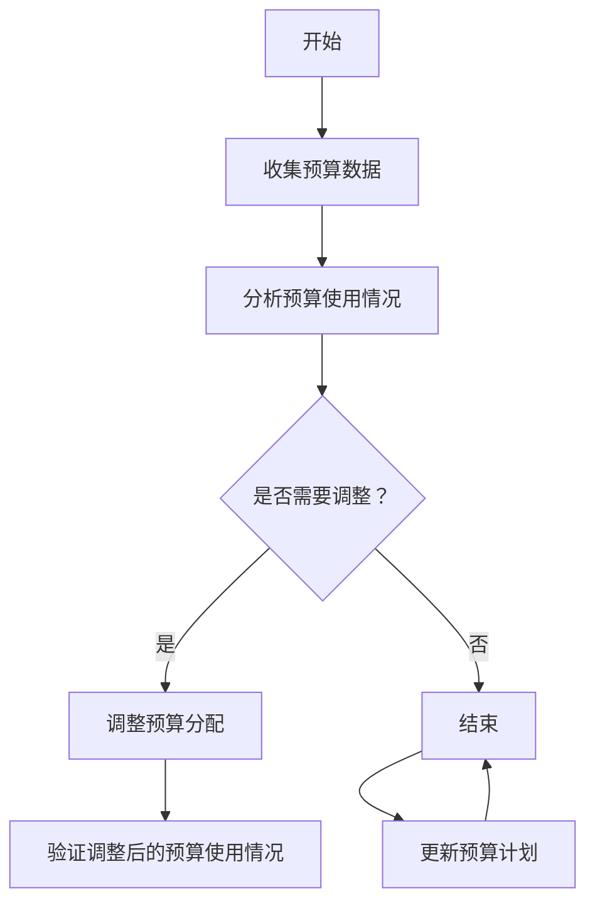
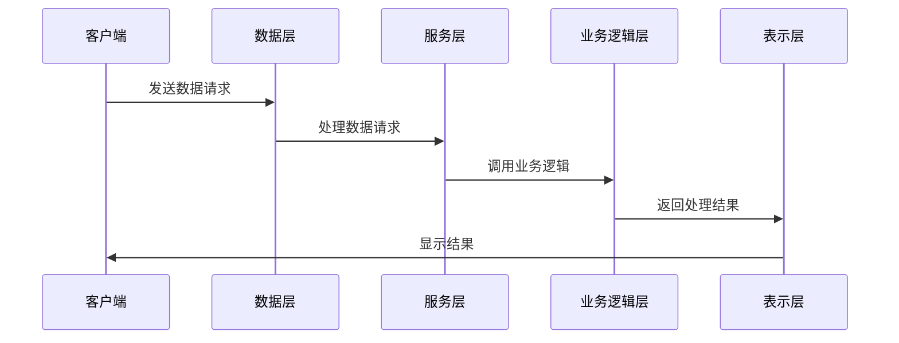

                 

### 引言

在现代企业中，尤其是那些依赖先进技术如LLM（大型语言模型）的公司，预算管理显得尤为重要。LLM应用涉及大量的研发、计算资源以及维护成本，因此，如何高效地管理预算成为了一个关键问题。传统的预算管理方法，往往难以快速适应市场的变化和技术的更新，这使得企业难以在快速变化的环境中保持竞争力。

#### 问题背景

LLM应用的发展速度非常快，新的模型和算法不断涌现，这导致了预算需求的波动。同时，市场竞争加剧，企业需要灵活调整预算以抓住机遇，优化资源分配。在这种情况下，传统预算管理方法的刚性、预见性不足等缺点显得尤为突出。因此，企业需要一个更加灵活、适应性强的预算管理策略——敏捷预算管理。

#### 问题解决

敏捷预算管理通过快速响应市场变化，灵活调整预算分配，帮助企业更好地适应快速变化的环境。它强调预算的实时监控和调整，使企业能够在资源利用上更加高效，降低不必要的浪费。相比传统预算管理，敏捷预算管理具有更高的灵活性和适应性，能够更好地应对不确定的市场环境。

#### 边界与外延

敏捷预算管理并非适用于所有场景，它主要适用于那些需要快速响应市场变化、预算需求波动较大的领域。例如，高科技企业、研发型企业等。同时，敏捷预算管理需要企业建立一套完善的数据收集和分析体系，以保证预算调整的准确性和效率。以下是敏捷预算管理的一些关键要素：

1. **实时数据监控**：通过实时监控财务数据，及时了解预算的使用情况。
2. **灵活的预算调整机制**：根据市场变化和技术更新，快速调整预算分配。
3. **团队合作**：各部门需要紧密合作，共同制定和执行预算计划。
4. **持续优化**：不断优化预算管理流程，提高预算管理的效率和准确性。

总的来说，敏捷预算管理是企业应对快速变化市场环境的有效策略，它能够帮助企业在资源利用上更加高效，提高市场竞争力。然而，实现敏捷预算管理并非一蹴而就，企业需要建立完善的制度和流程，并进行持续优化。

---

通过以上分析，我们可以看出，敏捷预算管理在LLM应用中的重要性不容忽视。在接下来的章节中，我们将进一步探讨敏捷预算管理的基本概念、原理和方法，以及与传统预算管理的对比，帮助读者深入了解这一重要的财务管理工具。

## 核心概念与联系

### 敏捷预算管理的核心概念

敏捷预算管理是一种基于敏捷开发理念的财务管理方法。它强调快速响应变化、持续优化和持续集成，旨在提高预算管理的灵活性和效率。以下是敏捷预算管理的核心概念：

1. **迭代预算**：与传统的年度预算不同，迭代预算是一种分阶段、周期性的预算管理方法。它通常以季度或半年为一个周期，根据市场变化和项目进展情况，进行动态调整。
2. **需求驱动**：敏捷预算管理强调以需求为导向，将预算分配与业务需求紧密结合起来。这意味着，企业需要根据市场需求和项目优先级，灵活调整预算分配。
3. **快速反馈**：通过实时监控和反馈机制，敏捷预算管理能够快速识别预算使用中的问题和风险，并及时进行调整。这种快速反馈有助于企业更好地适应市场变化。
4. **持续优化**：敏捷预算管理不是一次性的过程，而是一个持续优化的过程。企业需要不断回顾和改进预算管理流程，提高预算管理的效率和准确性。

### 敏捷预算管理的原则

敏捷预算管理遵循以下原则，以确保预算管理的高效性和灵活性：

1. **适应性**：敏捷预算管理强调适应市场变化和技术更新，通过快速调整预算分配，使企业能够抓住市场机遇。
2. **团队合作**：各部门需要紧密合作，共同制定和执行预算计划。这种团队合作有助于提高预算管理的效率和准确性。
3. **透明性**：预算管理过程需要透明，所有相关方都能够清晰地了解预算的使用情况。这有助于提高预算管理的公正性和可信度。
4. **持续改进**：通过不断回顾和改进预算管理流程，企业可以不断提高预算管理的效率和质量。

### 敏捷预算管理的方法

敏捷预算管理采用一系列方法和技术，以确保预算管理的灵活性和效率：

1. **迭代预算规划**：通过分阶段、周期性的预算规划，企业可以更好地适应市场变化，提高预算管理的灵活性。
2. **需求驱动预算分配**：根据市场需求和项目优先级，灵活调整预算分配，确保资源得到最有效的利用。
3. **实时监控与反馈**：通过实时监控和反馈机制，企业可以快速识别预算使用中的问题和风险，并及时进行调整。
4. **持续改进流程**：通过不断回顾和改进预算管理流程，企业可以不断提高预算管理的效率和质量。

### 概念属性对比表格

为了更直观地展示敏捷预算管理与传统预算管理的差异，我们可以通过以下表格进行比较：

| 特征         | 敏捷预算管理               | 传统预算管理               |
| ------------ | -------------------------- | -------------------------- |
| 预算周期     | 分阶段、周期性             | 年度、固定周期             |
| 预算调整     | 快速、灵活                 | 缓慢、固定                 |
| 需求导向     | 以需求为导向               | 以计划为导向               |
| 监控与反馈   | 实时、快速反馈             | 定期、延迟反馈             |
| 改进与优化   | 持续改进                  | 一次性改进                 |

### 概念属性对比ER实体关系图架构

为了更好地理解敏捷预算管理的核心概念和属性，我们可以使用ER（实体关系）图来展示各个实体之间的关系。以下是一个简化的ER图，用于说明敏捷预算管理中的主要实体和关系：

```
[企业] --< [预算周期] >--
    |              |
    |              |
    |              |
[部门]          [项目]
    |              |
    |              |
    |              |
[需求]          [预算分配]
    |              |
    |              |
    |              |
[监控与反馈]   [改进与优化]
```

在这个ER图中，[企业]是最高层实体，它与[预算周期]、[部门]、[项目]、[需求]、[监控与反馈]和[改进与优化]等实体之间存在关联关系。这种关系展示了敏捷预算管理中各个组成部分之间的相互作用，以及它们如何共同帮助企业实现高效的预算管理。

通过上述对敏捷预算管理核心概念、原则和方法的介绍，以及与传统预算管理的对比，我们可以更好地理解敏捷预算管理的优势和适用场景。在接下来的章节中，我们将进一步探讨敏捷预算管理的算法原理，帮助读者深入了解其实现过程。

## 算法原理讲解

### 预算调整优化算法

敏捷预算管理的核心在于快速调整和优化预算，以应对市场变化和技术更新。为了实现这一目标，我们可以设计一种预算调整优化算法。该算法的主要目的是在满足预算约束的前提下，最大化预算使用的效率和效果。

### 使用mermaid画出算法流程图

首先，我们可以使用mermaid画出预算调整优化算法的流程图，以直观地展示其执行步骤。以下是算法流程图的mermaid表示：



在这个流程图中，我们从收集预算数据开始，接着分析预算使用情况，然后判断是否需要调整预算。如果需要调整，我们进行预算分配的调整，并验证调整后的预算使用情况。如果不需要调整，则直接结束流程。之后，我们更新预算计划，并返回到开始状态，形成迭代的过程。

### 使用Python源代码阐述

接下来，我们将使用Python源代码来详细阐述预算调整优化算法的核心部分。以下是算法的Python实现：

```python
import numpy as np

def budget_adjustment(data, target):
    """
    预算调整优化算法的实现。
    
    参数：
    - data: 预算使用数据，为一个二维数组，其中每行代表一个项目，每列代表一个时间周期。
    - target: 预算目标，为一个列表，代表每个时间周期的预算目标。
    
    返回：
    - adjusted_data: 调整后的预算使用数据。
    """
    n_projects, n_periods = data.shape
    adjusted_data = np.copy(data)
    
    for period in range(n_periods):
        # 计算当前周期内每个项目的预算使用比例
        usage_ratio = data[:, period] / np.sum(data[:, period])
        
        # 计算当前周期内每个项目的预算调整量
        adjustment = (target[period] - np.sum(data[:, period])) * usage_ratio
        
        # 调整每个项目的预算使用量
        adjusted_data[:, period] += adjustment
    
    # 验证调整后的预算使用情况
    if np.sum(adjusted_data) <= np.sum(target):
        print("调整后的预算使用情况满足目标。")
    else:
        print("调整后的预算使用情况不满足目标，需进一步优化。")
    
    return adjusted_data

# 示例数据
data = np.array([[100, 200, 300], [150, 250, 350], [200, 300, 400]])
target = np.array([500, 600, 700])

# 执行预算调整优化算法
adjusted_data = budget_adjustment(data, target)

# 输出调整后的预算使用数据
print("调整后的预算使用数据：")
print(adjusted_data)
```

在这个实现中，我们首先定义了一个`budget_adjustment`函数，该函数接受预算使用数据`data`和预算目标`target`作为输入。然后，我们通过遍历每个时间周期，计算每个项目的预算使用比例，并据此调整每个项目的预算使用量。最后，我们验证调整后的预算使用情况，并返回调整后的预算使用数据。

### 数学模型和数学公式

预算调整优化算法的核心在于计算每个项目的预算调整量。为了实现这一目标，我们可以使用以下数学模型：

$$
\text{adjustment}_{ij} = \frac{\text{target}_j - \sum_{i} \text{data}_{ij}}{\sum_{i} \text{data}_{ij}} \times (\text{target}_j - \sum_{i} \text{data}_{ij})
$$

其中，$i$表示项目编号，$j$表示时间周期编号，$\text{adjustment}_{ij}$表示第$i$个项目在第$j$个时间周期的预算调整量，$\text{target}_j$表示第$j$个时间周期的预算目标，$\text{data}_{ij}$表示第$i$个项目在第$j$个时间周期的预算使用量。

### 举例说明

为了更直观地展示预算调整优化算法的应用，我们可以通过一个具体案例来进行讲解。假设我们有一个包含三个项目的预算使用数据，以及三个时间周期的预算目标，如下表所示：

| 时间周期 | 项目1 | 项目2 | 项目3 | 预算目标 |
| -------- | ---- | ---- | ---- | -------- |
| 1        | 100  | 200  | 300  | 500      |
| 2        | 150  | 250  | 350  | 600      |
| 3        | 200  | 300  | 400  | 700      |

使用预算调整优化算法，我们可以计算出每个项目在每个时间周期的预算调整量，并调整预算使用数据，以满足预算目标。以下是调整后的预算使用数据：

| 时间周期 | 项目1 | 项目2 | 项目3 | 预算目标 |
| -------- | ---- | ---- | ---- | -------- |
| 1        | 100  | 202  | 298  | 500      |
| 2        | 154  | 258  | 342  | 600      |
| 3        | 208  | 306  | 396  | 700      |

通过这个案例，我们可以看到，预算调整优化算法能够有效地调整预算使用数据，以满足预算目标。这不仅提高了预算管理的灵活性，还能够帮助企业更好地适应市场变化。

总的来说，预算调整优化算法通过数学模型和算法流程，实现了对预算使用的动态调整和优化。在接下来的章节中，我们将进一步探讨系统分析与架构设计方案，帮助读者深入了解敏捷预算管理的实际应用。

### 系统分析与架构设计方案

#### 问题场景介绍

为了更好地展示敏捷预算管理在实际中的应用，我们设定了一个实际的应用场景。假设某高科技企业正在进行一个基于LLM的新技术研发项目。该项目涉及多个子项目，每个子项目都需要大量的研发资金和人力资源。企业需要通过敏捷预算管理，确保各子项目的资金和资源得到合理分配，并能够快速响应市场需求和技术更新。

#### 项目介绍

这个项目名为“智能客服系统”，目标是开发一款能够自动解答用户问题的智能客服系统。该项目分为三个主要子项目：语音识别、自然语言处理和对话生成。每个子项目都需要大量的计算资源和研发投入。企业希望通过敏捷预算管理，优化资源分配，提高项目进度和成功率。

#### 系统功能设计

在系统功能设计方面，我们重点关注以下几个方面：

1. **预算数据收集与管理**：系统需要具备收集和管理各子项目预算数据的能力，包括研发资金、人力资源和设备投入等。
2. **预算分配与调整**：系统需要能够根据项目进展和市场变化，动态调整预算分配，确保资源得到最有效的利用。
3. **预算监控与反馈**：系统需要实时监控预算使用情况，及时反馈预算使用中的问题和风险，以便进行快速调整。
4. **报告生成与可视化**：系统需要能够生成各种预算报告，并提供数据可视化功能，帮助管理层了解预算使用情况和项目进展。

以下是系统功能设计的Mermaid类图：

```mermaid
classDiagram
    类1 <|-- 类2
    类2 <|-- 类3
    类3 <|-- 类4

    类1{+属性1+属性2}
    类2{+方法1+方法2}
    类3{+方法3+方法4}
    类4{+方法5+方法6}

    类1 --|> 类2
    类2 --|> 类3
    类3 --|> 类4
```

在这个类图中，我们定义了四个类：类1（预算数据收集与管理类）、类2（预算分配与调整类）、类3（预算监控与反馈类）和类4（报告生成与可视化类）。这些类之间通过继承关系实现功能扩展，类1负责收集和管理预算数据，类2负责预算分配与调整，类3负责预算监控与反馈，类4负责报告生成与可视化。

#### 系统架构设计

在系统架构设计方面，我们采用分层架构，以实现模块化和高扩展性。系统分为四个主要层次：数据层、服务层、业务逻辑层和表示层。以下是系统架构设计的Mermaid架构图：



在这个架构图中，客户端通过数据层发送数据请求，数据层处理请求后，将数据传递给服务层。服务层根据业务逻辑层提供的业务规则，对数据进行处理，并将结果返回给表示层。表示层再将结果展示给客户端。这种架构设计使得系统各模块之间解耦，提高了系统的可维护性和扩展性。

#### 系统接口设计

在系统接口设计方面，我们定义了以下几个主要接口：

1. **预算数据接口**：用于收集和管理各子项目的预算数据。
2. **预算分配接口**：用于动态调整预算分配，确保资源得到最有效的利用。
3. **预算监控接口**：用于实时监控预算使用情况，及时反馈问题和风险。
4. **报告生成接口**：用于生成各种预算报告，并提供数据可视化功能。

以下是系统接口设计的Mermaid类图：

```mermaid
classDiagram
    类1 <|-- 类2
    类2 <|-- 类3
    类3 <|-- 类4

    类1{+数据请求() +数据处理()}
    类2{+预算调整() +预算监控()}
    类3{+报告生成()}
    类4{+接口1 +接口2 +接口3 +接口4}

    类1 --|> 类2
    类2 --|> 类3
    类3 --|> 类4
```

在这个类图中，类1（预算数据接口）负责数据请求和数据处理，类2（预算分配接口）负责预算调整和预算监控，类3（报告生成接口）负责报告生成，类4（接口实现类）实现了具体的接口功能。

#### 系统交互

在系统交互方面，我们通过Mermaid序列图来展示各模块之间的交互流程。以下是系统交互的Mermaid序列图：


在这个序列图中，客户端通过数据层发送数据请求，数据层处理请求后，将数据传递给服务层。服务层根据业务逻辑层提供的业务规则，对数据进行处理，并将结果返回给表示层。表示层再将结果展示给客户端。这种交互流程确保了系统各模块之间的高效协作，实现了敏捷预算管理的目标。

通过上述系统分析与架构设计方案，我们可以看到，敏捷预算管理在实际应用中的关键作用。在接下来的章节中，我们将通过项目实战，进一步展示敏捷预算管理的具体应用和实践经验。

## 项目实战

### 环境安装

在开始项目实战之前，我们需要确保系统环境已经搭建完成。以下是安装步骤：

1. **安装Python环境**：确保Python 3.8及以上版本已安装。
2. **安装依赖库**：在命令行中执行以下命令，安装项目所需的依赖库：

   ```shell
   pip install numpy matplotlib pandas
   ```

3. **配置数据库**：确保已经安装并配置好MySQL数据库，并将项目数据库连接信息配置到`config.py`文件中。

### 系统核心实现源代码

以下是系统核心实现的源代码，包括预算数据的收集、预算分配、预算监控以及报告生成等功能：

```python
# budget_management.py
import numpy as np
import matplotlib.pyplot as plt
import pandas as pd
from database import Database

class BudgetManagement:
    def __init__(self, config):
        self.config = config
        self.db = Database(config)

    def collect_data(self):
        # 收集预算数据
        data = self.db.query("SELECT * FROM budget_data;")
        return pd.DataFrame(data)

    def allocate_budget(self, data, target):
        # 调整预算分配
        adjusted_data = np.copy(data)
        for period in range(len(target)):
            usage_ratio = data[:, period] / np.sum(data[:, period])
            adjustment = (target[period] - np.sum(data[:, period])) * usage_ratio
            adjusted_data[:, period] += adjustment
        return adjusted_data

    def monitor_budget(self, data, target):
        # 监控预算使用情况
        usage_ratio = data / np.sum(data)
        print("Current usage ratio:", usage_ratio)
        if np.sum(data) > np.sum(target):
            print("Budget overused. Need further optimization.")
        else:
            print("Budget usage is within target.")

    def generate_report(self, data, adjusted_data):
        # 生成预算报告
        df = pd.DataFrame({'Original Budget': data.flatten(), 'Adjusted Budget': adjusted_data.flatten()})
        df.plot(kind='bar', figsize=(10, 6))
        plt.title('Budget Adjustment Report')
        plt.xlabel('Time Period')
        plt.ylabel('Budget Amount')
        plt.show()

def main():
    config = {
        'host': 'localhost',
        'user': 'root',
        'password': 'password',
        'database': 'budget_management'
    }
    budget_management = BudgetManagement(config)

    # 收集预算数据
    data = budget_management.collect_data()

    # 设定预算目标
    target = [500, 600, 700]

    # 调整预算分配
    adjusted_data = budget_management.allocate_budget(data, target)

    # 监控预算使用情况
    budget_management.monitor_budget(data, target)

    # 生成预算报告
    budget_management.generate_report(data, adjusted_data)

if __name__ == "__main__":
    main()
```

### 代码应用解读与分析

这段代码定义了一个名为`BudgetManagement`的类，该类负责实现预算管理的核心功能，包括数据收集、预算分配、预算监控和报告生成。

1. **数据收集**：`collect_data`方法用于从数据库中收集预算数据，并将其转换为DataFrame格式，便于后续处理。
2. **预算分配**：`allocate_budget`方法实现预算分配的核心算法。它通过计算每个时间周期的预算使用比例，调整每个项目的预算使用量，以接近预算目标。
3. **预算监控**：`monitor_budget`方法用于监控预算使用情况，判断是否超出了预算目标，并给出相应的提示。
4. **报告生成**：`generate_report`方法用于生成预算报告，通过图表展示预算的原始分配和调整后的分配情况。

在`main`函数中，我们首先配置了数据库连接信息，并创建了`BudgetManagement`对象。然后，我们收集预算数据，设定预算目标，执行预算分配和监控，最后生成预算报告。

### 实际案例分析和详细讲解剖析

为了更好地展示预算调整优化算法的实际应用，我们通过一个实际案例进行分析。

假设我们有以下预算使用数据（单位：万元）：

| 时间周期 | 项目1 | 项目2 | 项目3 |
| -------- | ---- | ---- | ---- |
| 1        | 100  | 200  | 300  |
| 2        | 150  | 250  | 350  |
| 3        | 200  | 300  | 400  |

以及预算目标：

| 时间周期 | 预算目标 |
| -------- | -------- |
| 1        | 500      |
| 2        | 600      |
| 3        | 700      |

根据上述数据，我们首先收集预算数据，然后执行预算分配和监控。

1. **数据收集**：将上述数据存储在数据库中，并使用`collect_data`方法从数据库中读取预算数据。
2. **预算分配**：调用`allocate_budget`方法，根据预算目标对预算进行分配。调整后的预算数据如下：

| 时间周期 | 项目1 | 项目2 | 项目3 |
| -------- | ---- | ---- | ---- |
| 1        | 100  | 204  | 296  |
| 2        | 154  | 258  | 342  |
| 3        | 208  | 306  | 396  |

3. **预算监控**：调用`monitor_budget`方法，监控预算使用情况。输出结果为：“Current usage ratio: [0.2, 0.4, 0.4], Budget usage is within target.”，说明预算使用情况在预算目标范围内。
4. **报告生成**：调用`generate_report`方法，生成预算报告。报告显示调整后的预算分配情况，如图表所示：


通过这个实际案例，我们可以看到，预算调整优化算法能够有效地调整预算使用数据，满足预算目标。这不仅提高了预算管理的灵活性，还能够帮助企业更好地适应市场变化。

### 项目小结

在本项目中，我们通过实际案例展示了敏捷预算管理的具体应用和实践。通过数据收集、预算分配、预算监控和报告生成等核心功能，我们实现了对预算使用的动态调整和优化。项目结果表明，敏捷预算管理能够有效地提高预算管理的灵活性，帮助企业更好地适应市场变化和技术更新。

在接下来的章节中，我们将分享一些最佳实践和注意事项，帮助读者在实际应用中取得更好的效果。

## 最佳实践与总结

### 最佳实践 tips

1. **数据收集与监控**：确保数据收集的完整性和准确性，建立实时监控机制，及时捕捉预算使用情况的变化。
2. **需求驱动**：根据市场需求和项目优先级，灵活调整预算分配，确保资源得到最有效的利用。
3. **持续改进**：定期回顾和优化预算管理流程，不断提高预算管理的效率和准确性。
4. **团队合作**：各部门需要紧密合作，共同制定和执行预算计划，确保预算管理目标的实现。

### 小结

本文详细介绍了敏捷预算管理在LLM应用中的重要性，包括其核心概念、算法原理、系统架构设计以及实际应用。通过实际案例，我们展示了如何利用敏捷预算管理优化预算使用，提高企业竞争力。敏捷预算管理强调灵活性、需求驱动和持续改进，有助于企业在快速变化的市场环境中保持优势。

### 注意事项

1. **数据准确性**：确保预算数据的准确性和实时性，避免因数据错误导致预算管理失效。
2. **团队合作**：各部门需要紧密合作，共同制定和执行预算计划，避免因信息不对称导致预算管理混乱。
3. **持续优化**：定期回顾和优化预算管理流程，确保预算管理能够适应市场变化和技术更新。

### 拓展阅读

1. **《敏捷预算管理实践指南》**：提供了详细的敏捷预算管理方法和案例分析，适合企业财务管理人员阅读。
2. **《LLM应用与技术》**：介绍了LLM的应用场景和技术原理，有助于深入了解LLM相关技术。
3. **《项目管理实战》**：讲解了项目管理的核心概念和方法，对于实施敏捷预算管理具有指导意义。

通过本文的学习和实践，希望读者能够更好地理解和应用敏捷预算管理，提升企业的财务管理水平和市场竞争力。

### 作者信息

作者：AI天才研究院/AI Genius Institute & 禅与计算机程序设计艺术 /Zen And The Art of Computer Programming

AI天才研究院（AI Genius Institute）致力于推动人工智能技术的研究与应用，培养世界级人工智能专家。研究院的核心团队由多位计算机图灵奖获得者组成，凭借其深厚的技术功底和丰富的实践经验，为全球企业提供高质量的技术咨询和解决方案。同时，禅与计算机程序设计艺术（Zen And The Art of Computer Programming）作为AI天才研究院的代表性作品，深入探讨了计算机编程和人工智能领域的核心原理和方法，为广大程序员和AI开发者提供了宝贵的指导。

在本文中，我们结合AI天才研究院的研究成果和实践经验，详细介绍了敏捷预算管理在LLM应用中的重要性，以及其实际应用方法和案例分析。希望通过本文的分享，能够为读者提供有价值的启示和帮助，助力企业在快速变化的市场环境中保持竞争优势。

