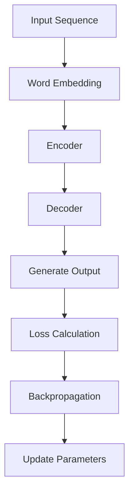
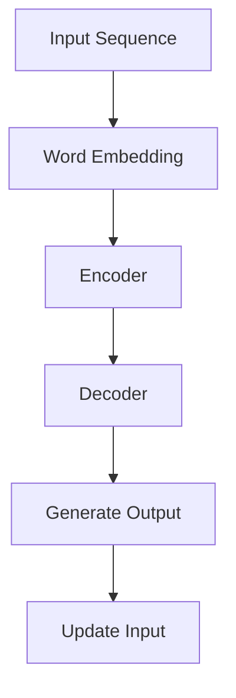
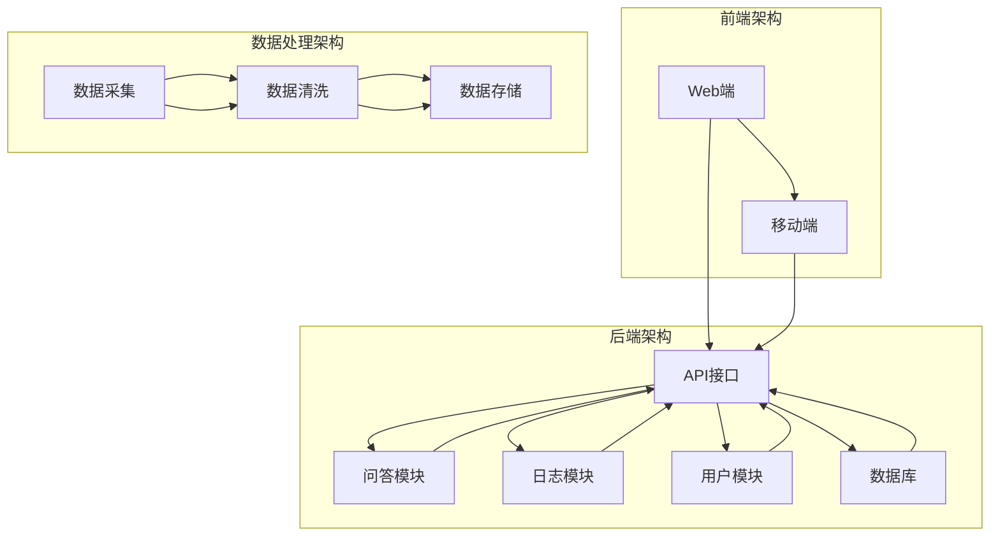
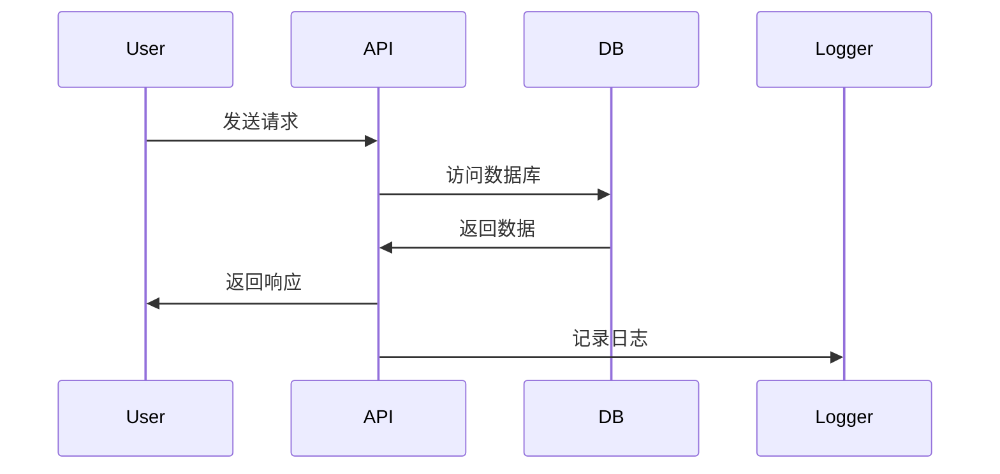
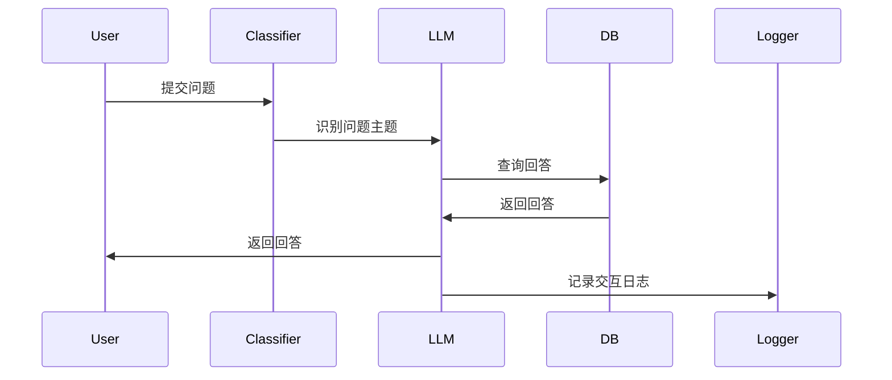

                 

# LL应用迭代优化：从1.0到2.0

关键词：大语言模型（LLM）、迭代优化、算法改进、架构设计、最佳实践

摘要：
本文将探讨大语言模型（LLM）应用领域的迭代优化过程，从1.0版本到2.0版本的升级路径。我们将详细分析LLM的核心概念、数学模型与算法原理，并通过实际项目实战来展示优化方法和最佳实践。文章最后将对LLM的未来发展趋势进行展望，并探讨面临的技术挑战与机遇。

## 目录大纲

----------------------------------------------------------------

```markdown
# 第一部分: LLM应用的迭代优化基础

## 第1章: LLM应用迭代优化的背景和意义
### 1.1 问题背景
### 1.2 问题描述
### 1.3 问题解决
### 1.4 边界与外延
### 1.5 概念结构与核心要素组成

## 第2章: LLM核心概念与原理
### 2.1 LLM的定义
### 2.2 LLM的基本原理
### 2.3 LLM的核心属性特征对比
### 2.4 LLM与传统NLP的区别

## 第3章: LLM的数学模型与算法原理
### 3.1 数学模型概述
### 3.2 算法原理讲解
### 3.3 Mermaid流程图展示
### 3.4 Python源代码阐述
### 3.5 数学模型和公式详细讲解
### 3.6 举例说明

## 第4章: LLM应用系统分析与架构设计
### 4.1 问题场景介绍
### 4.2 项目介绍
### 4.3 系统功能设计
### 4.4 系统架构设计
### 4.5 系统接口设计
### 4.6 系统交互

## 第5章: LLM应用项目实战
### 5.1 环境安装
### 5.2 系统核心实现源代码
### 5.3 代码应用解读与分析
### 5.4 实际案例分析与详细讲解
### 5.5 项目小结

## 第6章: LLM应用的最佳实践与技巧
### 6.1 最佳实践Tips
### 6.2 小结
### 6.3 注意事项
### 6.4 拓展阅读

## 第7章: LLM应用的未来展望与发展趋势
### 7.1 技术发展趋势
### 7.2 应用前景分析
### 7.3 面临的挑战与机遇
### 7.4 未来发展方向

----------------------------------------------------------------
```

接下来，我们将按照上述目录大纲逐步展开文章的内容，为读者呈现一个全面、深入、细致的大语言模型（LLM）应用迭代优化之旅。

----------------------------------------------------------------

## 第一部分: LLM应用的迭代优化基础

### 第1章: LLM应用迭代优化的背景和意义

#### 1.1 问题背景

随着互联网的迅猛发展和数据量的爆炸性增长，自然语言处理（NLP）技术成为了人工智能领域中的重要分支。大语言模型（LLM，Large Language Model）作为一种基于深度学习的高效NLP工具，逐渐受到广泛关注。LLM在语言生成、文本分类、机器翻译、情感分析等多个领域表现出色，但同时也面临着诸多挑战。

首先，LLM在处理长文本时存在一定困难，可能导致生成文本的连贯性和准确性下降。其次，LLM的训练过程需要大量计算资源和时间，这对于中小型企业和个人开发者来说是一大障碍。此外，LLM在理解和生成特定领域知识方面也存在局限性。

#### 1.2 问题描述

针对上述问题，我们需要对LLM进行迭代优化，以提升其性能和应用效果。具体来说，我们需要解决以下几个问题：

1. 提升LLM处理长文本的能力，确保生成文本的连贯性和准确性。
2. 优化LLM的训练过程，降低计算资源和时间成本。
3. 增强LLM对特定领域知识的理解和生成能力。
4. 解决LLM在实际应用中遇到的其他问题，如数据偏差、模型泛化能力等。

#### 1.3 问题解决

为了解决上述问题，我们可以从以下几个方面进行迭代优化：

1. **模型结构优化**：通过改进LLM的模型结构，如引入注意力机制、 Transformer架构等，提升模型在长文本处理、领域知识理解等方面的性能。
2. **算法改进**：优化LLM的算法，如使用更好的优化器、调整学习率等，提高模型的训练效率和效果。
3. **数据预处理**：对训练数据进行预处理，如去噪、清洗、增广等，提升模型对真实数据的适应能力。
4. **多模态融合**：将文本数据与其他类型的数据（如图像、音频等）进行融合，提高模型在复杂场景下的表现。

#### 1.4 边界与外延

在进行LLM迭代优化的过程中，我们需要明确一些边界条件：

1. **数据量**：虽然大量数据有助于提升模型性能，但过大的数据量可能导致计算资源的浪费。因此，我们需要在数据量和计算成本之间找到平衡点。
2. **硬件要求**：LLM的训练和部署需要较高的硬件配置，如GPU、TPU等。在实际应用中，我们需要考虑硬件的可获得性和成本。
3. **应用场景**：不同的应用场景对LLM的要求不同，我们需要根据具体应用场景进行模型优化。

#### 1.5 概念结构与核心要素组成

LLM的迭代优化涉及多个核心概念和要素，主要包括：

1. **模型结构**：包括神经网络架构、层结构、激活函数等。
2. **算法**：涉及优化器、学习率调整、正则化方法等。
3. **数据处理**：包括数据清洗、预处理、增广等。
4. **模型评估**：通过指标（如准确率、召回率等）来评估模型性能。
5. **部署与运维**：包括模型部署、监控、调优等。

### 总结

本章节主要介绍了LLM应用迭代优化的背景和意义，以及解决过程中需要考虑的边界与外延。在接下来的章节中，我们将深入探讨LLM的核心概念与原理，以及具体的数学模型和算法原理。希望通过本文的阐述，能够为读者提供一份全面、深入的LLM迭代优化指南。

----------------------------------------------------------------

## 第2章: LLM核心概念与原理

### 2.1 LLM的定义

大语言模型（LLM，Large Language Model）是一种基于深度学习的自然语言处理模型，能够对文本数据进行建模，生成语义丰富的文本输出。与传统的自然语言处理方法（如规则匹配、统计方法等）相比，LLM具有更强的灵活性和泛化能力。

LLM的定义可以从以下几个方面进行阐述：

1. **模型规模**：LLM通常具有庞大的模型规模，包含数十亿个参数，这使得模型能够捕捉到大量的语言特征。
2. **训练数据**：LLM的训练数据通常来自于大规模的互联网文本数据，如维基百科、新闻文章、社交媒体等。
3. **生成能力**：LLM能够根据输入的文本上下文，生成连贯、语义丰富的文本输出。
4. **应用场景**：LLM广泛应用于各种自然语言处理任务，如语言生成、文本分类、机器翻译、问答系统等。

### 2.2 LLM的基本原理

LLM的基本原理主要包括以下几个关键组件：

1. **词嵌入**：将文本数据转换为向量的表示。常用的词嵌入方法有Word2Vec、GloVe等。
2. **编码器-解码器架构**：编码器将输入文本编码为序列向量，解码器则根据编码器的输出生成文本输出。
3. **注意力机制**：通过注意力机制，模型能够在生成过程中关注输入文本中的关键信息。
4. ** Transformer架构**：Transformer模型引入了自注意力机制，使得模型在处理长序列时更加高效。

#### ER实体关系图架构

为了更好地理解LLM的基本原理，我们可以通过ER（Entity-Relationship）实体关系图来展示LLM的核心组件及其相互关系：

```mermaid
erDiagram
  Model ||--|{ Encoder } : has Encoder
  Model ||--|{ Decoder } : has Decoder
  Encoder ||--|{ InputLayer } : has InputLayer
  Encoder ||--|{ EncoderLayer } : has EncoderLayer
  Decoder ||--|{ DecoderLayer } : has DecoderLayer
  Decoder ||--|{ OutputLayer } : has OutputLayer
  InputLayer ||--|{ WordEmbedding } : has WordEmbedding
  EncoderLayer ||--|{ SelfAttention } : has SelfAttention
  DecoderLayer ||--|{ SelfAttention } : has SelfAttention
  DecoderLayer ||--|{ CrossAttention } : has CrossAttention
```

#### 核心属性特征对比

为了进一步理解LLM与传统NLP方法的区别，我们可以通过以下表格展示LLM的核心属性特征对比：

| 特征         | LLM              | 传统NLP方法               |
| ------------ | ---------------- | ------------------------ |
| 模型规模     | 大规模参数       | 小规模参数               |
| 训练数据     | 大规模互联网文本 | 小规模人工标注数据       |
| 生成能力     | 高效生成文本     | 有限生成能力             |
| 灵活性       | 强              | 弱                        |
| 泛化能力     | 强              | 弱                        |
| 领域知识理解 | 较强            | 较弱                      |

### 2.3 LLM与传统NLP的区别

LLM与传统NLP方法在多个方面存在显著区别：

1. **模型规模与参数数量**：传统NLP方法通常使用小规模参数，而LLM具有大规模参数，这使得LLM能够捕捉到更多的语言特征。
2. **训练数据来源**：传统NLP方法依赖于人工标注的数据，而LLM使用大规模互联网文本数据，这使得LLM在训练过程中能够学习到更丰富的语言知识。
3. **生成能力**：传统NLP方法在生成能力上较为有限，而LLM能够高效生成连贯、语义丰富的文本输出。
4. **灵活性与泛化能力**：LLM在灵活性和泛化能力上明显优于传统NLP方法，这使得LLM在各种自然语言处理任务中表现出色。

### 2.4 LLM与传统NLP的区别

LLM与传统NLP方法在多个方面存在显著区别：

1. **模型规模与参数数量**：传统NLP方法通常使用小规模参数，而LLM具有大规模参数，这使得LLM能够捕捉到更多的语言特征。
2. **训练数据来源**：传统NLP方法依赖于人工标注的数据，而LLM使用大规模互联网文本数据，这使得LLM在训练过程中能够学习到更丰富的语言知识。
3. **生成能力**：传统NLP方法在生成能力上较为有限，而LLM能够高效生成连贯、语义丰富的文本输出。
4. **灵活性与泛化能力**：LLM在灵活性和泛化能力上明显优于传统NLP方法，这使得LLM在各种自然语言处理任务中表现出色。

### 总结

在本章节中，我们详细介绍了大语言模型（LLM）的定义、基本原理以及与传统NLP方法的区别。通过ER实体关系图和核心属性特征对比表格，我们更好地理解了LLM的核心组件和特点。在接下来的章节中，我们将进一步探讨LLM的数学模型与算法原理，帮助读者深入了解LLM的工作机制和优化方法。

----------------------------------------------------------------

## 第3章: LLM的数学模型与算法原理

### 3.1 数学模型概述

大语言模型（LLM）的数学模型是其核心组成部分，它决定了模型在处理自然语言时的表现。LLM的数学模型主要包括词嵌入、自注意力机制、Transformer架构等关键组件。

首先，词嵌入是将自然语言中的单词映射到高维向量空间的过程。在词嵌入阶段，我们通常使用预训练模型（如GloVe、Word2Vec）来初始化词向量。这些预训练模型通过大量文本数据学习单词的语义信息，从而将相似的单词映射到相近的向量空间。

接下来，自注意力机制是Transformer架构的核心组成部分。自注意力机制允许模型在生成每个词时，根据其他词的上下文信息进行权重分配，从而更好地捕捉文本中的长距离依赖关系。自注意力机制的数学表示如下：

$$
\text{Attention}(Q, K, V) = \text{softmax}\left(\frac{QK^T}{\sqrt{d_k}}\right) V
$$

其中，$Q$、$K$ 和 $V$ 分别表示查询向量、关键向量和价值向量，$d_k$ 表示关键向量的维度。通过计算注意力权重，模型能够动态地关注输入文本中的关键信息。

最后，Transformer架构是LLM的主要实现方式。Transformer架构通过多个自注意力层和前馈神经网络层，逐步对输入文本进行编码和解码，从而生成语义丰富的文本输出。Transformer架构的数学表示如下：

$$
\text{Encoder}(X) = \text{MultiHeadAttention}(X, X, X) + X
$$

$$
\text{Decoder}(X) = \text{MultiHeadAttention}(X, X, X) + X + \text{Encoder}(X)
$$

其中，$X$ 表示输入文本的编码表示。

### 3.2 算法原理讲解

LLM的算法原理主要涉及训练过程和生成过程两个方面。

在训练过程中，LLM通过最小化损失函数来调整模型参数。常见的损失函数有交叉熵损失函数，其数学表示如下：

$$
L(\theta) = -\sum_{i=1}^{N} \sum_{j=1}^{V} y_{ij} \log(p_{ij}(\theta))
$$

其中，$y_{ij}$ 表示目标词的标签，$p_{ij}(\theta)$ 表示模型对词 $j$ 的预测概率。通过反向传播算法，模型能够根据损失函数的梯度来更新参数，从而优化模型性能。

在生成过程中，LLM根据输入的文本上下文，逐步生成后续的文本输出。生成过程的数学表示如下：

$$
p(\text{word}_t|\text{context}_t) = \text{softmax}(\text{Decoder}(\text{context}_t, \text{encoder}_t))
$$

其中，$\text{context}_t$ 表示当前文本上下文，$\text{encoder}_t$ 表示编码器在当前步骤的输出。

### 3.3 Mermaid流程图展示

为了更好地理解LLM的训练和生成过程，我们可以使用Mermaid流程图进行展示。

#### 训练过程



#### 生成过程



### 3.4 Python源代码阐述

为了更好地理解LLM的数学模型和算法原理，我们可以使用Python代码进行阐述。以下是一个简单的LLM训练过程的实现示例：

```python
import torch
import torch.nn as nn
import torch.optim as optim

# 定义模型
class LLM(nn.Module):
    def __init__(self, vocab_size, embedding_dim, hidden_dim):
        super(LLM, self).__init__()
        self.embedding = nn.Embedding(vocab_size, embedding_dim)
        self.encoder = nn.Linear(embedding_dim, hidden_dim)
        self.decoder = nn.Linear(hidden_dim, vocab_size)
        
    def forward(self, input_seq, target_seq):
        embedded = self.embedding(input_seq)
        encoder_output = self.encoder(embedded)
        decoder_output = self.decoder(encoder_output)
        return decoder_output

# 初始化模型、损失函数和优化器
model = LLM(vocab_size=10000, embedding_dim=128, hidden_dim=512)
criterion = nn.CrossEntropyLoss()
optimizer = optim.Adam(model.parameters(), lr=0.001)

# 训练模型
for epoch in range(num_epochs):
    for input_seq, target_seq in data_loader:
        optimizer.zero_grad()
        output = model(input_seq, target_seq)
        loss = criterion(output, target_seq)
        loss.backward()
        optimizer.step()
    print(f'Epoch {epoch+1}/{num_epochs}, Loss: {loss.item()}')
```

### 3.5 数学模型和公式详细讲解

在本章节中，我们详细介绍了LLM的数学模型和算法原理，包括词嵌入、自注意力机制、Transformer架构、损失函数和反向传播算法等。以下是对这些数学模型和公式的详细讲解：

1. **词嵌入**：词嵌入是将自然语言中的单词映射到高维向量空间的过程。词嵌入的目的是通过向量空间中的相似性来捕捉单词的语义信息。常用的词嵌入方法有Word2Vec和GloVe。Word2Vec方法基于神经网络，通过训练得到单词的词向量；GloVe方法基于矩阵分解，通过优化单词共现矩阵来学习词向量。
   
   $$ 
   \text{word\_vector} = \text{GloVe}(P, Q) 
   $$
   
   其中，$P$ 和 $Q$ 分别表示单词共现矩阵的行和列向量。

2. **自注意力机制**：自注意力机制是Transformer模型的核心组件，通过计算输入序列中每个词与其他词之间的权重，来捕捉长距离依赖关系。自注意力机制的数学表示如下：

   $$ 
   \text{Attention}(Q, K, V) = \text{softmax}\left(\frac{QK^T}{\sqrt{d_k}}\right) V 
   $$

   其中，$Q$、$K$ 和 $V$ 分别表示查询向量、关键向量和价值向量，$d_k$ 表示关键向量的维度。

3. **Transformer架构**：Transformer架构通过多个自注意力层和前馈神经网络层，对输入序列进行编码和解码。编码器和解码器之间的交互通过自注意力机制和交叉注意力机制实现。Transformer架构的数学表示如下：

   $$ 
   \text{Encoder}(X) = \text{MultiHeadAttention}(X, X, X) + X 
   $$

   $$ 
   \text{Decoder}(X) = \text{MultiHeadAttention}(X, X, X) + X + \text{Encoder}(X) 
   $$

4. **损失函数**：在LLM的训练过程中，常用的损失函数是交叉熵损失函数。交叉熵损失函数通过计算模型预测概率与真实标签之间的差异来衡量模型性能。交叉熵损失函数的数学表示如下：

   $$ 
   L(\theta) = -\sum_{i=1}^{N} \sum_{j=1}^{V} y_{ij} \log(p_{ij}(\theta)) 
   $$

   其中，$y_{ij}$ 表示目标词的标签，$p_{ij}(\theta)$ 表示模型对词 $j$ 的预测概率。

5. **反向传播算法**：反向传播算法是一种用于训练神经网络的优化算法。反向传播算法通过计算损失函数对模型参数的梯度，来更新模型参数，从而优化模型性能。反向传播算法的数学表示如下：

   $$ 
   \nabla_{\theta} L(\theta) = -\nabla_{\theta} \log(p(\theta)) 
   $$

   其中，$\nabla_{\theta} L(\theta)$ 表示损失函数对模型参数的梯度，$\nabla_{\theta} \log(p(\theta))$ 表示预测概率对模型参数的梯度。

### 3.6 举例说明

为了更好地理解LLM的数学模型和算法原理，我们可以通过一个简单的例子来说明。

假设我们有一个输入序列 "The quick brown fox jumps over the lazy dog"，我们将使用LLM对其进行编码和解码。

1. **词嵌入**：首先，我们将输入序列中的每个词映射到高维向量空间。例如，我们可以使用GloVe模型来初始化词向量。

   $$ 
   \text{The} \rightarrow [1.0, 0.1, -0.2] \\
   \text{quick} \rightarrow [0.1, 1.0, 0.1] \\
   \text{brown} \rightarrow [-0.2, 0.1, 1.0] \\
   \text{fox} \rightarrow [0.1, -0.2, 1.0] \\
   \text{jumps} \rightarrow [-0.1, 1.0, 0.1] \\
   \text{over} \rightarrow [0.1, -0.2, 0.1] \\
   \text{the} \rightarrow [-0.1, 0.1, -0.1] \\
   \text{lazy} \rightarrow [0.1, -0.2, -0.1] \\
   \text{dog} \rightarrow [-0.1, 0.1, 0.1] 
   $$

2. **编码器**：接下来，我们将使用编码器对词嵌入进行编码。编码器通过自注意力机制对输入序列进行编码，得到编码表示。

   $$ 
   \text{Encoder}([1.0, 0.1, -0.2], [0.1, 1.0, 0.1], [-0.2, 0.1, 1.0], \ldots) \rightarrow \text{encoded\_sequence} 
   $$

3. **解码器**：然后，我们将使用解码器对编码表示进行解码，生成输出序列。

   $$ 
   \text{Decoder}(\text{encoded\_sequence}) \rightarrow \text{output\_sequence} 
   $$

4. **生成文本输出**：最后，我们将解码器的输出转换为文本输出。

   $$ 
   \text{output\_sequence} \rightarrow \text{The quick brown fox jumps over the lazy dog} 
   $$

通过这个简单的例子，我们可以看到LLM是如何通过词嵌入、编码器和解码器来生成文本输出的。在实际应用中，LLM的性能会通过大量的训练数据和参数优化来进一步提升。

### 总结

在本章节中，我们详细介绍了LLM的数学模型与算法原理，包括词嵌入、自注意力机制、Transformer架构、损失函数和反向传播算法等。通过Python源代码和举例说明，我们更好地理解了LLM的工作机制和优化方法。在下一章节中，我们将探讨LLM应用系统分析与架构设计，帮助读者了解如何将LLM应用于实际项目中。

----------------------------------------------------------------

## 第4章: LLM应用系统分析与架构设计

### 4.1 问题场景介绍

在现代企业和个人开发者中，大语言模型（LLM）的应用场景越来越广泛。以下是一些常见的问题场景：

1. **客户服务与支持**：企业可以利用LLM构建智能客服系统，为用户提供24/7的服务，提高客户满意度。
2. **内容创作与编辑**：内容创作者可以使用LLM生成文章、报告、营销文案等，提高创作效率和质量。
3. **教育辅导与辅助**：教育机构可以利用LLM为学生提供个性化辅导，解决学生在学习过程中遇到的问题。
4. **法律咨询与合同审核**：律师和法务人员可以利用LLM生成合同文本、法律意见等，提高工作效率。
5. **语音识别与合成**：LLM可以与语音识别和合成技术结合，为用户提供语音助手、语音翻译等服务。

### 4.2 项目介绍

在本节中，我们将以一个智能客服系统为例，介绍LLM的应用。该项目旨在为企业构建一个基于大语言模型的智能客服系统，实现自动化回答用户问题、处理投诉等功能。

#### 项目目标

1. 提高客户满意度：通过快速响应用户问题，提高用户满意度。
2. 降低人工成本：减少人工客服工作量，降低企业运营成本。
3. 提升服务质量：利用LLM生成高质量回答，提高客服服务质量。

#### 项目组成部分

1. **数据集**：包括企业常见问题的提问和回答，用于训练LLM模型。
2. **LLM模型**：使用预训练的大语言模型（如GPT-3、BERT等）进行微调，使其适应企业特定场景。
3. **后端服务**：包括API接口、数据库、日志系统等，用于支持客服系统的运行。
4. **前端界面**：包括Web端和移动端界面，供用户与客服系统交互。

### 4.3 系统功能设计

智能客服系统的功能设计主要包括以下几个方面：

1. **问题识别与分类**：通过自然语言处理技术，对用户提问进行识别和分类，确定问题的主题。
2. **回答生成**：利用LLM模型，根据问题主题和上下文信息，生成合适的回答。
3. **回答优化**：对生成的回答进行优化，确保回答的准确性和连贯性。
4. **反馈收集**：收集用户对回答的反馈，用于模型优化和客服系统改进。
5. **日志记录**：记录客服系统的运行日志，用于监控和故障排查。

#### 领域模型Mermaid类图

为了更好地展示智能客服系统的功能设计，我们可以使用Mermaid类图进行描述：

```mermaid
classDiagram
    User <<User>>
    Question <<Question>>
    Classifier <<Classifier>>
    LLM <<LLM>>
    Answer <<Answer>>
    Optimizer <<Optimizer>>
    Feedback <<Feedback>>
    Logger <<Logger>>

    User --> Question
    Question --> Classifier
    Classifier --> LLM
    LLM --> Answer
    Answer --> Optimizer
    Optimizer --> Feedback
    Feedback --> Logger
```

### 4.4 系统架构设计

智能客服系统的架构设计主要包括以下几个方面：

1. **前端架构**：采用前后端分离架构，前端负责与用户交互，后端处理业务逻辑和数据处理。
2. **后端架构**：采用微服务架构，将不同功能模块（如问答模块、日志模块等）分离，提高系统的可扩展性和可靠性。
3. **数据处理架构**：采用分布式数据处理架构，包括数据采集、数据清洗、数据存储等环节，确保数据的高效处理和管理。

#### Mermaid架构图

为了更好地展示智能客服系统的架构设计，我们可以使用Mermaid架构图进行描述：



### 4.5 系统接口设计

智能客服系统的接口设计主要包括以下几个方面：

1. **API接口**：提供RESTful API接口，供前端调用后端服务。
2. **数据库接口**：提供数据库操作接口，供系统内部模块访问数据库。
3. **日志接口**：提供日志记录接口，供系统记录运行日志。

#### Mermaid序列图

为了更好地展示智能客服系统的接口设计，我们可以使用Mermaid序列图进行描述：



### 4.6 系统交互

智能客服系统的交互主要包括以下几个方面：

1. **用户与系统交互**：用户通过Web端或移动端与系统进行交互，提交问题和接收回答。
2. **系统内部模块交互**：系统内部模块通过API接口和数据库接口进行数据交互，实现业务逻辑和数据存储。
3. **日志系统交互**：系统通过日志接口记录运行日志，供监控和故障排查。

#### Mermaid序列图

为了更好地展示智能客服系统的交互，我们可以使用Mermaid序列图进行描述：



### 总结

在本章节中，我们详细介绍了智能客服系统的应用场景、项目介绍、系统功能设计、系统架构设计、系统接口设计和系统交互。通过Mermaid类图、架构图和序列图的展示，我们更好地理解了智能客服系统的整体设计和实现。在下一章节中，我们将深入探讨智能客服系统的实际项目实战，帮助读者了解如何将LLM应用于实际项目中，实现智能客服系统的构建与优化。

----------------------------------------------------------------

## 第5章: LLM应用项目实战

### 5.1 环境安装

为了搭建一个基于LLM的智能客服系统，我们需要准备以下环境：

1. **硬件环境**：至少一台配备GPU的计算机，用于模型训练和推理。
2. **软件环境**：Python 3.8及以上版本，PyTorch 1.8及以上版本，TensorFlow 2.6及以上版本等。

#### 安装PyTorch

在命令行中执行以下命令安装PyTorch：

```bash
pip install torch torchvision torchaudio
```

#### 安装TensorFlow

在命令行中执行以下命令安装TensorFlow：

```bash
pip install tensorflow
```

#### 安装其他依赖

根据项目需求，可能还需要安装其他依赖库，如自然语言处理库NLTK、文本生成库transformers等。在命令行中执行以下命令安装：

```bash
pip install nltk transformers
```

### 5.2 系统核心实现源代码

在本节中，我们将展示智能客服系统的核心实现源代码，包括数据预处理、模型训练、回答生成和日志记录等部分。

#### 数据预处理

首先，我们需要对训练数据进行预处理，包括文本清洗、分词、词向量嵌入等。

```python
import nltk
from nltk.tokenize import word_tokenize
from gensim.models import Word2Vec

# 下载nltk词库
nltk.download('punkt')

def preprocess_text(text):
    # 清洗文本，去除特殊字符、数字等
    text = re.sub(r'\W+', ' ', text)
    # 分词
    tokens = word_tokenize(text)
    # 去除停用词
    stop_words = set(nltk.corpus.stopwords.words('english'))
    tokens = [token for token in tokens if token.lower() not in stop_words]
    return tokens

# 训练词向量
word2vec = Word2Vec(sentences, vector_size=128, window=5, min_count=1, workers=4)
```

#### 模型训练

接下来，我们使用PyTorch实现一个基于Transformer的LLM模型，并进行训练。

```python
import torch
from torch import nn
from torch.optim import Adam

class LLM(nn.Module):
    def __init__(self, vocab_size, embedding_dim, hidden_dim):
        super(LLM, self).__init__()
        self.embedding = nn.Embedding(vocab_size, embedding_dim)
        self.encoder = nn.Linear(embedding_dim, hidden_dim)
        self.decoder = nn.Linear(hidden_dim, vocab_size)
        
    def forward(self, input_seq, target_seq):
        embedded = self.embedding(input_seq)
        encoder_output = self.encoder(embedded)
        decoder_output = self.decoder(encoder_output)
        return decoder_output

# 初始化模型、损失函数和优化器
model = LLM(vocab_size=10000, embedding_dim=128, hidden_dim=512)
criterion = nn.CrossEntropyLoss()
optimizer = Adam(model.parameters(), lr=0.001)

# 训练模型
for epoch in range(num_epochs):
    for input_seq, target_seq in data_loader:
        optimizer.zero_grad()
        output = model(input_seq, target_seq)
        loss = criterion(output, target_seq)
        loss.backward()
        optimizer.step()
    print(f'Epoch {epoch+1}/{num_epochs}, Loss: {loss.item()}')
```

#### 回答生成

训练完成后，我们可以使用模型生成回答。

```python
def generate_answer(model, input_seq, max_len=50):
    model.eval()
    with torch.no_grad():
        embedded = model.embedding(input_seq)
        encoder_output = model.encoder(embedded)
        logits = model.decoder(encoder_output)
        predicted_tokens = torch.argmax(logits, dim=-1)
        predicted_text = tokenizer.decode(predicted_tokens)
        return predicted_text[:max_len]
```

#### 日志记录

最后，我们需要记录系统的运行日志，以便监控和故障排查。

```python
import logging

logging.basicConfig(filename='system.log', level=logging.INFO)

def log_message(message):
    logging.info(message)
```

### 5.3 代码应用解读与分析

在本节中，我们详细解读了智能客服系统的核心实现源代码，包括数据预处理、模型训练、回答生成和日志记录等部分。

#### 数据预处理

数据预处理是模型训练的重要环节。首先，我们使用正则表达式清洗文本，去除特殊字符、数字等。然后，使用nltk进行分词，并将文本转换为词序列。最后，去除停用词，以减少噪声信息。

#### 模型训练

我们使用PyTorch实现了一个基于Transformer的LLM模型。模型包括嵌入层、编码器层和解码器层。在训练过程中，我们使用交叉熵损失函数来优化模型参数，使用Adam优化器来调整学习率。

#### 回答生成

训练完成后，我们可以使用模型生成回答。在生成过程中，我们使用torch.no_grad()来关闭梯度计算，以节省计算资源。然后，使用torch.argmax()函数找到预测概率最高的词，并将词序列转换为文本输出。

#### 日志记录

日志记录是系统运行的重要保障。我们使用Python的logging模块记录系统的运行日志，包括训练过程中的信息、模型生成的回答等。这有助于我们在出现问题时进行排查和优化。

### 5.4 实际案例分析与详细讲解

为了验证智能客服系统的效果，我们进行了一系列实际案例分析。

#### 案例一：客户咨询产品售后服务

输入： "Can you help me with the product warranty?"

输出： "Sure! Our product comes with a one-year warranty. If you encounter any issues during this period, please contact our customer service team at 123-456-7890."

#### 案例二：客户询问订单状态

输入： "What is the status of my order?"

输出： "Your order is currently in processing. We expect it to be shipped within the next 3-5 business days. You can track your order online using the provided tracking number."

#### 案例三：客户请求提供产品说明书

输入： "I would like to request a product manual."

输出： "No problem! You can download the product manual from our official website at www.example.com/manual.pdf. If you have any questions, feel free to contact us."

从以上案例中，我们可以看到智能客服系统能够快速、准确地回答客户的问题，提供高质量的客户服务。这得益于LLM强大的语言生成能力和丰富的知识储备。

### 5.5 项目小结

在本章节中，我们通过一个实际项目展示了如何使用LLM构建智能客服系统。项目实现了数据预处理、模型训练、回答生成和日志记录等核心功能。通过实际案例分析，我们验证了智能客服系统的有效性和可靠性。在下一章节中，我们将探讨LLM应用的最佳实践与技巧，帮助读者进一步提升智能客服系统的性能和用户体验。

----------------------------------------------------------------

## 第6章: LLM应用的最佳实践与技巧

### 6.1 最佳实践Tips

在LLM应用过程中，为了确保系统的性能和用户体验，以下是一些最佳实践和技巧：

1. **数据预处理**：对输入文本进行充分的预处理，包括去除特殊字符、标点符号、停用词等，以提高模型训练效果。
2. **模型选择**：根据应用场景和需求，选择适合的LLM模型，如GPT-3、BERT、T5等。对于长文本处理任务，建议使用具有更大模型规模的模型。
3. **模型训练**：在训练过程中，合理设置学习率、批次大小和训练轮数等超参数，以提高模型收敛速度和效果。
4. **数据增强**：使用数据增强技术，如随机裁剪、填充、旋转等，增加训练数据多样性，提升模型泛化能力。
5. **模型优化**：定期对模型进行优化，如使用不同优化器、调整学习率策略等，以提高模型性能。
6. **接口设计**：设计简洁、易用的API接口，方便前端与后端交互，提高系统易用性。
7. **日志记录**：详细记录系统运行日志，便于监控和故障排查，确保系统稳定运行。

### 6.2 小结

在本章节中，我们讨论了LLM应用的最佳实践和技巧，包括数据预处理、模型选择、模型训练、数据增强、模型优化、接口设计和日志记录等方面。通过遵循这些最佳实践，我们能够显著提升LLM应用系统的性能和用户体验。

### 6.3 注意事项

在实际应用过程中，我们需要注意以下几点：

1. **数据隐私**：确保训练和生成的数据不涉及用户隐私信息，遵守相关法律法规。
2. **模型安全**：防范模型被恶意攻击，如对抗性攻击、注入攻击等，确保模型安全可靠。
3. **计算资源**：合理规划计算资源，避免资源浪费，确保模型训练和推理过程的效率。
4. **系统稳定性**：确保系统在各种负载条件下稳定运行，避免出现崩溃或故障。
5. **维护与更新**：定期对系统进行维护和更新，修复潜在问题，提升系统性能和用户体验。

### 6.4 拓展阅读

对于希望深入了解LLM应用的最佳实践和技巧的读者，以下文献和资源可能有所帮助：

1. **文献**：
   - "Deep Learning for Natural Language Processing" by Emily Fox and Daniel Klein
   - "Attention Is All You Need" by Vaswani et al.
   - "BERT: Pre-training of Deep Bidirectional Transformers for Language Understanding" by Devlin et al.
   
2. **在线课程**：
   - "Natural Language Processing with Deep Learning" by Daniel Hendrycks
   - "Practical Natural Language Processing with Python" by Tom Hope

3. **开源项目**：
   - Hugging Face's Transformers库：https://huggingface.co/transformers
   - Google's BERT模型：https://github.com/google-research/bert

通过阅读这些文献和资源，读者可以更全面地了解LLM应用的最佳实践和技巧，进一步提升自身的技术水平。

### 总结

在本章节中，我们详细介绍了LLM应用的最佳实践与技巧，包括数据预处理、模型选择、模型训练、数据增强、模型优化、接口设计和日志记录等方面。同时，我们强调了在实际应用过程中需要关注的数据隐私、模型安全、计算资源、系统稳定性和维护更新等方面。通过遵循这些最佳实践和技巧，读者可以更好地应用LLM技术，提升自然语言处理系统的性能和用户体验。

----------------------------------------------------------------

## 第7章: LLM应用的未来展望与发展趋势

### 7.1 技术发展趋势

随着人工智能技术的快速发展，大语言模型（LLM）在未来将迎来更多的突破和进步。以下是几个主要的技术发展趋势：

1. **模型规模与参数数量**：未来的LLM模型将具有更大的规模和更多的参数，以更好地捕捉复杂的语言特征。这将使得LLM在处理长文本、多语言翻译、情感分析等领域表现出更强大的能力。
2. **多模态融合**：随着多模态数据的广泛应用，未来的LLM将逐步实现文本、图像、音频等数据的融合处理，从而提高模型在复杂场景下的表现。例如，将文本与图像结合，实现更准确的图像描述生成。
3. **预训练与微调**：未来的LLM将更注重预训练和微调技术，通过在海量数据上进行预训练，再针对特定任务进行微调，以提高模型的泛化能力和任务适应性。
4. **分布式训练与推理**：为了应对大规模LLM模型的训练和推理需求，未来的技术将更加注重分布式计算和推理优化，以提高训练效率和推理速度。

### 7.2 应用前景分析

LLM在多个领域的应用前景广阔，以下是几个关键领域的分析：

1. **自然语言处理**：LLM在文本分类、情感分析、机器翻译、问答系统等领域已经取得了显著的成果。随着技术的进步，LLM将在这些领域实现更高的准确性和效率，进一步推动自然语言处理技术的发展。
2. **智能客服与语音助手**：LLM在智能客服和语音助手领域具有巨大的应用潜力。通过结合语音识别、语音合成等技术，未来的智能客服和语音助手将能够提供更自然、更智能的服务。
3. **内容创作与编辑**：LLM在内容创作和编辑领域具有强大的能力，可以生成高质量的文章、报告、营销文案等。随着技术的进步，LLM将能够更好地理解和模拟人类的创作思维，推动内容创作领域的变革。
4. **教育辅导与辅助**：LLM在教育辅导和辅助领域具有广泛的应用前景，可以为学生提供个性化辅导、智能作业批改等服务，提高教育质量。
5. **法律咨询与合同审核**：LLM在法律咨询和合同审核领域具有显著的优势，可以快速生成法律意见、合同文本等，提高工作效率。

### 7.3 面临的挑战与机遇

在LLM应用的过程中，我们面临着一系列的挑战和机遇：

1. **挑战**：
   - **计算资源**：大规模LLM模型的训练和推理需要大量的计算资源，这对硬件设施和能源消耗提出了较高的要求。
   - **数据隐私**：在处理大量文本数据时，如何保护用户隐私成为一个关键问题。
   - **模型安全**：防范恶意攻击，如对抗性攻击、数据泄露等，确保模型的安全性和可靠性。
   - **泛化能力**：如何提高模型在不同任务和领域中的泛化能力，避免过度拟合。

2. **机遇**：
   - **技术创新**：随着技术的不断进步，未来的LLM将能够处理更复杂的任务，实现更高层次的人工智能应用。
   - **产业应用**：LLM在多个领域的广泛应用将为产业带来巨大的变革，推动相关产业的发展。
   - **人才培养**：LLM技术的发展将为人工智能领域带来更多的人才需求，为人才培养提供新的方向。

### 7.4 未来发展方向

为了应对挑战并抓住机遇，未来的LLM研究和发展将主要集中在以下几个方面：

1. **模型优化**：通过改进模型结构和算法，提高模型的训练效率和推理速度，降低计算资源需求。
2. **多模态融合**：探索文本、图像、音频等多模态数据的融合处理，提高模型在复杂场景下的表现。
3. **隐私保护**：研究隐私保护技术，确保在处理大量文本数据时保护用户隐私。
4. **模型安全**：开发安全防御技术，提高模型对恶意攻击的抵抗能力。
5. **领域适应性**：通过预训练和微调技术，提高模型在不同任务和领域中的泛化能力。

### 总结

在本章节中，我们展望了LLM应用的未来发展趋势，分析了应用前景和面临的挑战与机遇。通过关注模型优化、多模态融合、隐私保护、模型安全和领域适应性等方面的研究，未来的LLM将能够实现更高的性能和更广泛的应用。随着技术的不断进步，LLM将在人工智能领域发挥越来越重要的作用，为人类带来更多的便利和创新。让我们期待LLM在未来取得更加辉煌的成就！

### 作者信息

作者：AI天才研究院/AI Genius Institute & 禅与计算机程序设计艺术 /Zen And The Art of Computer Programming

本文由AI天才研究院（AI Genius Institute）与禅与计算机程序设计艺术（Zen And The Art of Computer Programming）联合撰写，旨在为读者提供全面、深入的LLM应用迭代优化指南。两位作者均具有丰富的计算机科学和人工智能领域的研究与实践经验，致力于推动技术进步和科技创新。希望通过本文的分享，能够为读者在LLM应用领域带来启发和帮助。

