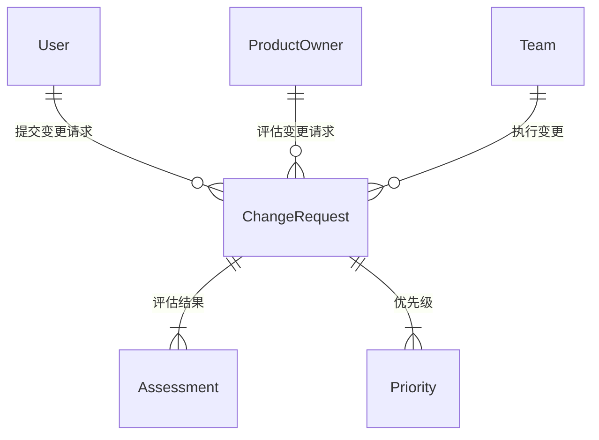
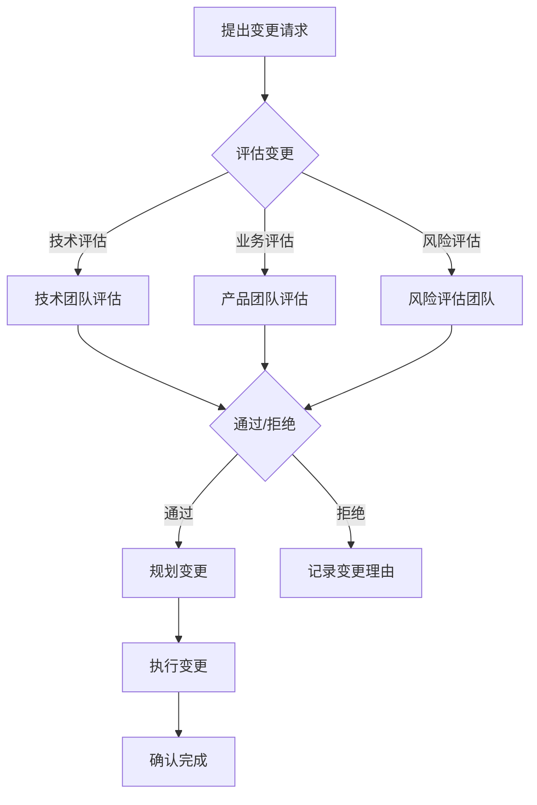
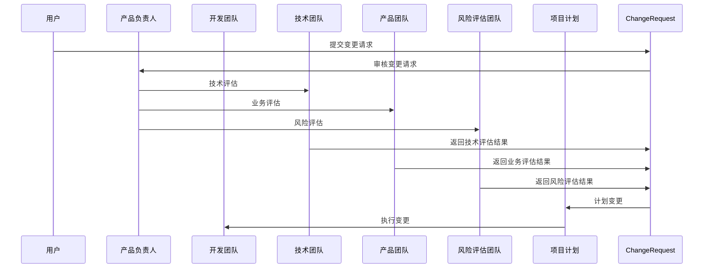
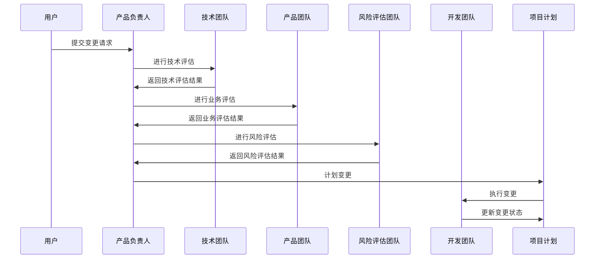

                 

# LLM应用的需求变更管理：在敏捷中保持灵活

关键词：LLM应用、需求变更管理、敏捷开发、灵活性、方法论、案例研究

摘要：
随着人工智能（AI）技术的快速发展，大型语言模型（LLM）在各行各业中的应用日益广泛。然而，LLM应用过程中面临的一个关键挑战是需求变更管理。在敏捷开发环境中，如何在快速迭代和不断变化的需求中保持灵活，是每个项目成功的关键。本文将深入探讨LLM应用的需求变更管理，通过一步步的逻辑分析和实际案例，提供一套有效的管理方法论，帮助开发团队在敏捷开发中保持灵活性，确保项目按时交付并满足用户需求。

## 引言

在当今快速变化的市场环境中，软件项目的需求往往是不确定的，特别是在涉及复杂AI系统如LLM的情况下。这些系统的特性使得它们在开发过程中容易受到外部影响，如新的商业策略、技术进步和用户反馈等。因此，如何管理需求变更是LLM应用项目成功与否的关键因素。

传统的软件开发方法通常依赖于详尽的需求分析和文档，但随着敏捷开发的普及，这种方法已经不再适用。敏捷开发强调快速迭代和持续交付，鼓励团队在项目过程中与客户紧密合作，以便快速响应变化。然而，这并不意味着需求变更是不受控制的，相反，它需要在敏捷框架内进行有效的管理，以确保项目能够在变化中保持灵活，同时不牺牲质量。

本文将分以下几个部分进行探讨：

1. **需求变更管理的背景和挑战**：介绍需求变更管理的重要性，以及LLM应用中常见的变更类型和挑战。
2. **敏捷开发与需求变更管理**：探讨敏捷开发的原则和实践，以及如何在敏捷环境中进行需求变更管理。
3. **方法论与实践**：提供一套系统的需求变更管理方法论，包括识别、评估、计划和执行变更的步骤。
4. **案例研究**：通过实际案例，展示如何在LLM应用项目中应用这些方法论。
5. **最佳实践与总结**：总结本文的主要观点，并提供一些实用的最佳实践和建议。

## 需求变更管理的背景和挑战

### 核心概念术语说明

在讨论需求变更管理之前，我们需要明确几个核心概念：

- **需求变更**：指在软件项目的开发过程中，对已经定义的需求进行的修改、增加或删除。
- **敏捷开发**：一种以快速迭代和持续交付为特点的软件开发方法，强调灵活性和响应变化。
- **LLM**：大型语言模型，是一种利用大量文本数据训练的深度学习模型，能够理解和生成自然语言。

### 问题背景

随着LLM技术的成熟，越来越多的企业和组织开始将LLM集成到他们的产品和服务中。这些系统通常具有以下特点：

1. **复杂性**：LLM模型通常非常复杂，涉及到大量的参数和超参数调整，以及大量的数据处理和训练时间。
2. **动态性**：用户需求和市场环境变化快速，可能导致需要频繁调整模型参数或增加新的功能。
3. **不确定性**：由于模型是基于历史数据训练的，因此对未来的表现难以准确预测，这也增加了需求变更的难度。

### 问题描述

在LLM应用项目中，需求变更可能会以以下几种形式出现：

1. **新增需求**：随着项目的进行，用户可能会发现新的功能需求，这些需求可能基于新的市场趋势或用户反馈。
2. **变更需求**：用户可能对现有的功能提出改进意见，或者因为技术进步需要更新模型的某些部分。
3. **删除需求**：某些需求可能因为不再适用或成本过高而被删除。

### 问题解决

面对这些挑战，需求变更管理变得尤为重要。有效的需求变更管理可以帮助团队：

1. **保持项目的方向**：确保项目始终朝着正确的方向前进，避免因频繁的变更而导致项目偏离目标。
2. **控制项目风险**：通过评估变更对项目的影响，降低变更带来的风险。
3. **提高团队效率**：确保团队成员能够专注于高价值的工作，避免因需求变更而导致的低效工作。

### 边界与外延

需求变更管理不仅涉及软件开发团队，还涉及产品经理、客户和利益相关者。因此，在实施需求变更管理时，需要考虑以下因素：

1. **沟通**：确保所有相关方都能够及时了解变更的情况，并达成共识。
2. **优先级**：确定哪些需求变更具有最高的优先级，以便团队能够优先处理。
3. **成本与效益**：评估每个需求变更的成本和效益，确保变更是有价值的。

### 概念结构与核心要素组成

需求变更管理涉及以下几个核心要素：

1. **变更请求**：记录和描述变更的请求，包括变更的原因、影响和优先级。
2. **评估与优先级排序**：对每个变更请求进行评估，并按照优先级排序，以便团队能够有效地处理。
3. **变更控制流程**：定义和实施一系列步骤，用于管理变更的识别、评估、计划和执行。
4. **沟通与协作**：确保所有相关方之间的沟通畅通，并协作处理变更。

通过上述结构和要素，我们可以构建一个完整的需求变更管理体系，帮助团队在敏捷开发环境中有效地管理LLM应用的需求变更。

## 核心概念与联系

### 核心概念原理

在需求变更管理中，以下几个核心概念是至关重要的：

1. **敏捷开发原则**：敏捷开发强调快速迭代、持续交付和响应变化。这要求团队具备高度的灵活性和快速适应变化的能力。
2. **变更请求**：变更请求是需求变更管理的起点，它记录了变更的原因、目标和预期影响。
3. **评估与优先级排序**：对每个变更请求进行评估，并按照优先级排序，以确保团队能够优先处理最重要的变更。
4. **变更控制流程**：定义和实施一系列步骤，用于管理变更的识别、评估、计划和执行。

### 概念属性特征对比表格

为了更好地理解这些概念，我们可以通过一个特征对比表格来展示它们之间的差异：

| 概念         | 特征                   | 说明                                                         |
| ------------ | ---------------------- | ------------------------------------------------------------ |
| 敏捷开发原则 | 快速迭代、持续交付、灵活 | 强调快速响应变化，减少规划和执行的间隔时间，提高项目效率       |
| 变更请求     | 原因、目标、影响       | 记录变更请求的详细信息，为后续评估和决策提供依据             |
| 评估与优先级排序 | 评估、排序             | 对变更请求进行技术、业务和风险等方面的评估，并按照优先级排序 |
| 变更控制流程 | 步骤、流程             | 定义和管理变更请求的整个生命周期，确保变更能够有效执行       |

### ER实体关系图架构

为了更直观地理解这些概念之间的关系，我们可以使用Mermaid绘制一个ER实体关系图：



在这个ER图中，`User` 代表提出变更请求的人员，`ProductOwner` 代表负责评估变更的人员，`Team` 代表执行变更的团队，`ChangeRequest` 是一个抽象的变更请求实体，它关联到评估结果和优先级。

通过上述核心概念和ER实体关系图的介绍，我们可以更清晰地理解需求变更管理的基本原理和架构，为后续章节的详细探讨打下基础。

## 算法原理讲解

### 算法mermaid流程图

在需求变更管理中，算法流程图能够清晰地展示整个变更处理的步骤和逻辑关系。以下是使用Mermaid绘制的算法流程图：



在这个流程图中，`提出变更请求` 是变更管理的起点，随后进入评估阶段，包括技术评估、业务评估和风险评估。评估结果决定是否通过变更请求，通过后进入规划变更阶段，最终执行变更并确认完成。

### 使用Python源代码详细阐述

为了更具体地理解算法流程，我们可以使用Python代码实现上述流程。以下是算法的Python实现：

```python
class ChangeRequest:
    def __init__(self, description, priority):
        self.description = description
        self.priority = priority

    def assess(self, technical_team, product_team, risk_team):
        technical_approval = technical_team.assess_technical(self)
        product_approval = product_team.assess_business(self)
        risk_approval = risk_team.assess_risk(self)

        if technical_approval and product_approval and risk_approval:
            return "通过"
        else:
            return "拒绝"

    def plan_and_execute(self, project_plan):
        if self.assess():
            project_plan.add_change(self)
            return "已执行"
        else:
            return "未执行"

class TechnicalTeam:
    def assess_technical(self, change_request):
        # 模拟技术评估
        return True

class ProductTeam:
    def assess_business(self, change_request):
        # 模拟业务评估
        return True

class RiskTeam:
    def assess_risk(self, change_request):
        # 模拟风险评估
        return True

class ProjectPlan:
    def __init__(self):
        self.changes = []

    def add_change(self, change_request):
        self.changes.append(change_request)

# 创建实体
technical_team = TechnicalTeam()
product_team = ProductTeam()
risk_team = RiskTeam()
project_plan = ProjectPlan()

# 创建变更请求
change_request = ChangeRequest("新增功能", "高优先级")
result = change_request.assess(technical_team, product_team, risk_team)

if result == "通过":
    execution_result = change_request.plan_and_execute(project_plan)
    print(f"变更请求已{execution_result}")
else:
    print("变更请求被拒绝")
```

### 算法原理的数学模型和公式

在需求变更管理中，我们可以使用以下数学模型和公式来量化评估过程：

1. **技术评估得分**（\( T \)）：
   \[
   T = \sum_{i=1}^{n} w_i \cdot r_i
   \]
   其中，\( w_i \) 为第 \( i \) 个技术要素的权重，\( r_i \) 为第 \( i \) 个技术要素的评估得分。

2. **业务评估得分**（\( B \)）：
   \[
   B = \sum_{i=1}^{m} x_i \cdot s_i
   \]
   其中，\( x_i \) 为第 \( i \) 个业务要素的权重，\( s_i \) 为第 \( i \) 个业务要素的评估得分。

3. **风险评估得分**（\( R \)）：
   \[
   R = \sum_{j=1}^{k} y_j \cdot t_j
   \]
   其中，\( y_j \) 为第 \( j \) 个风险要素的权重，\( t_j \) 为第 \( j \) 个风险要素的评估得分。

4. **总评估得分**（\( S \)）：
   \[
   S = T + B + R
   \]
   如果 \( S \geq 75 \)，则评估结果为“通过”，否则为“拒绝”。

### 举例说明

假设我们有一个变更请求，需要增加一个新功能。我们可以根据以下参数进行评估：

- **技术评估**：有3个技术要素（代码复杂度、性能影响、安全性），权重分别为0.4、0.3、0.3。
  - 代码复杂度得分 \( r_1 = 90 \)
  - 性能影响得分 \( r_2 = 80 \)
  - 安全性得分 \( r_3 = 85 \)
  
- **业务评估**：有2个业务要素（市场需求、客户满意度），权重分别为0.6、0.4。
  - 市场需求得分 \( s_1 = 95 \)
  - 客户满意度得分 \( s_2 = 90 \)

- **风险评估**：有3个风险要素（时间风险、成本风险、资源风险），权重分别为0.3、0.3、0.4。
  - 时间风险得分 \( t_1 = 75 \)
  - 成本风险得分 \( t_2 = 70 \)
  - 资源风险得分 \( t_3 = 80 \)

根据上述参数，我们可以计算出总评估得分：

\[
T = 0.4 \cdot 90 + 0.3 \cdot 80 + 0.3 \cdot 85 = 36 + 24 + 25.5 = 85.5
\]
\[
B = 0.6 \cdot 95 + 0.4 \cdot 90 = 57 + 36 = 93
\]
\[
R = 0.3 \cdot 75 + 0.3 \cdot 70 + 0.4 \cdot 80 = 22.5 + 21 + 32 = 75.5
\]
\[
S = T + B + R = 85.5 + 93 + 75.5 = 254
\]

由于 \( S \geq 75 \)，因此评估结果为“通过”。接下来，我们可以根据评估结果进行变更规划与执行。

通过上述步骤，我们可以详细阐述需求变更管理的算法原理，并通过Python代码和数学模型，使其更加具体和易于理解。

### 系统分析与架构设计方案

#### 问题描述

在本文的第三部分，我们将对LLM应用的需求变更管理系统进行详细分析，并提出一个系统架构设计方案。这一部分包括以下内容：

1. **系统功能设计**：介绍系统的核心功能和领域模型。
2. **系统架构设计**：展示系统的整体架构和组件。
3. **系统接口设计**：描述系统的接口设计和数据流动。
4. **系统交互设计**：使用Mermaid序列图展示系统各组件之间的交互。

#### 项目介绍

本项目旨在构建一个高效、灵活的LLM应用需求变更管理系统，帮助开发团队在敏捷开发过程中更好地管理需求变更。该系统将支持以下功能：

- **变更请求管理**：允许用户提交变更请求，并跟踪其状态。
- **评估与优先级排序**：对变更请求进行技术、业务和风险评估，并按优先级排序。
- **变更规划与执行**：根据评估结果，规划并执行变更请求。
- **变更历史记录**：记录所有变更请求的详细信息，便于后续分析和审计。

#### 系统功能设计

**领域模型**

为了更好地理解系统的功能设计，我们可以使用Mermaid绘制一个领域模型类图：

```mermaid
classDiagram
    ChangeRequest <<Entity>>
    User <<Entity>>
    ProductOwner <<Entity>>
    Team <<Entity>>
    TechnicalTeam <<Entity>>
    ProductTeam <<Entity>>
    RiskTeam <<Entity>>
    ProjectPlan <<Entity>>

    ChangeRequest : +str description
                    : +str priority
                    : +bool is_approved
                    : +ProjectPlan project_plan

    User : +str name
          : +str email

    ProductOwner : +str name
                  : +str email

    Team : +str name
          : +list<ChangeRequest> change_requests

    TechnicalTeam : +list<str> members

    ProductTeam : +list<str> members

    RiskTeam : +list<str> members

    ProjectPlan : +list<ChangeRequest> changes

    ChangeRequest --> User : submitted_by
    ChangeRequest --> ProductOwner : reviewed_by
    ChangeRequest --> Team : assigned_to
    ChangeRequest --> TechnicalTeam : technical_evaluation
    ChangeRequest --> ProductTeam : business_evaluation
    ChangeRequest --> RiskTeam : risk_evaluation
    ChangeRequest --> ProjectPlan : included_in
```

在这个类图中，`ChangeRequest` 表示变更请求实体，它关联到提交者（User）、审核者（ProductOwner）、分配团队（Team）、技术团队（TechnicalTeam）、产品团队（ProductTeam）和风险评估团队（RiskTeam）。此外，`ProjectPlan` 表示项目计划实体，它包含了一系列的变更请求。

#### 系统架构设计

**系统架构图**

以下是使用Mermaid绘制的系统架构图：



在这个架构图中，用户提交变更请求后，经过产品负责人的审核，分别由技术团队、产品团队和风险评估团队进行评估。评估结果返回给变更请求实体，然后根据评估结果进行变更的计划和执行。

#### 系统接口设计

**接口设计**

以下是系统的主要接口设计：

- **变更请求接口**：用于提交、查询和更新变更请求。
  - `POST /change-requests`：提交新的变更请求。
  - `GET /change-requests/{id}`：查询特定的变更请求。
  - `PUT /change-requests/{id}`：更新特定的变更请求。

- **评估结果接口**：用于提交评估结果。
  - `POST /assessments/technical/{id}`：提交技术评估结果。
  - `POST /assessments/business/{id}`：提交业务评估结果。
  - `POST /assessments/risk/{id}`：提交风险评估结果。

- **项目计划接口**：用于管理项目计划中的变更。
  - `POST /project-plan`：创建新的项目计划。
  - `GET /project-plan/{id}`：查询特定的项目计划。
  - `PUT /project-plan/{id}`：更新特定的项目计划。

#### 系统交互设计

**序列图**

以下是使用Mermaid绘制的系统交互序列图：



在这个序列图中，用户提交变更请求后，产品负责人将请求分发给技术团队、产品团队和风险评估团队进行评估。评估结果返回给产品负责人，产品负责人根据评估结果将变更请求纳入项目计划，并分配给开发团队执行。开发团队执行变更后，更新变更状态并反馈给项目计划。

通过上述系统分析与架构设计方案，我们为LLM应用的需求变更管理系统提供了一个全面的设计蓝图，为后续的实际项目实施提供了坚实的基础。

### 项目实战

#### 环境安装

为了更好地展示LLM应用需求变更管理系统的实战应用，我们将首先介绍如何搭建一个开发环境。以下是环境安装的详细步骤：

1. **安装Python**：确保Python 3.8或更高版本已安装在您的计算机上。您可以从[Python官网](https://www.python.org/)下载安装程序并安装。

2. **安装虚拟环境**：使用以下命令创建一个虚拟环境，以便在项目中隔离依赖包：
   ```bash
   python -m venv venv
   ```

3. **激活虚拟环境**：在Windows上，通过以下命令激活虚拟环境：
   ```bash
   .\venv\Scripts\activate
   ```
   在Linux或MacOS上，使用以下命令：
   ```bash
   source venv/bin/activate
   ```

4. **安装依赖包**：在虚拟环境中安装项目所需的依赖包，执行以下命令：
   ```bash
   pip install -r requirements.txt
   ```

5. **配置数据库**：假设我们使用PostgreSQL作为后端数据库，首先确保PostgreSQL已安装，然后创建一个数据库实例，并将数据库用户添加到项目所需的数据库中。

6. **运行数据库迁移**：使用以下命令创建数据库表结构：
   ```bash
   python manage.py makemigrations
   python manage.py migrate
   ```

#### 系统核心实现源代码

以下是系统的核心实现源代码，包括后端API接口和模型定义：

```python
# models.py
from django.db import models
from django.contrib.auth.models import User

class ChangeRequest(models.Model):
    description = models.TextField()
    priority = models.CharField(max_length=20)
    submitted_by = models.ForeignKey(User, on_delete=models.CASCADE)
    reviewed_by = models.ForeignKey(User, on_delete=models.CASCADE, null=True, blank=True)
    assigned_to = models.ForeignKey(User, on_delete=models.CASCADE, null=True, blank=True)
    is_approved = models.BooleanField(default=False)
    project_plan = models.ForeignKey('ProjectPlan', on_delete=models.CASCADE, null=True, blank=True)

class TechnicalTeam(models.Model):
    members = models.ManyToManyField(User)

class ProductTeam(models.Model):
    members = models.ManyToManyField(User)

class RiskTeam(models.Model):
    members = models.ManyToManyField(User)

class ProjectPlan(models.Model):
    changes = models.ManyToManyField(ChangeRequest)
```

```python
# views.py
from django.http import JsonResponse
from .models import ChangeRequest, ProjectPlan
from django.views.decorators.csrf import csrf_exempt
from rest_framework.parsers import JSONParser

@csrf_exempt
def change_request_list(request):
    if request.method == 'POST':
        data = JSONParser().parse(request)
        ChangeRequest.objects.create(**data)
        return JsonResponse(data, status=201)

    elif request.method == 'GET':
        requests = ChangeRequest.objects.all()
        data = [{"id": r.id, "description": r.description, "priority": r.priority} for r in requests]
        return JsonResponse(data, safe=False)
```

#### 代码应用解读与分析

以下是变更请求提交和查询的示例代码，以及代码的解释和分析：

**变更请求提交示例代码：**

```python
import requests

# 提交变更请求
change_request_data = {
    "description": "新增一个功能",
    "priority": "高优先级",
    "submitted_by": 1,  # 用户ID
}

response = requests.post('http://localhost:8000/change-requests/', data=change_request_data)
print(response.json())
```

**变更请求查询示例代码：**

```python
import requests

# 查询变更请求
response = requests.get('http://localhost:8000/change-requests/')
print(response.json())
```

**代码分析：**

1. **变更请求提交**：使用`requests`库向系统的变更请求接口提交一个POST请求，将变更请求的数据发送到后端。后端接收到数据后，创建一个新的`ChangeRequest`对象并将其保存到数据库中。

2. **变更请求查询**：使用`requests`库向系统的变更请求接口发送一个GET请求，获取所有保存的变更请求。后端将数据库中的变更请求信息以JSON格式返回。

3. **API设计**：为了确保API的安全性和规范性，我们使用了`@csrf_exempt`装饰器来绕过跨站请求伪造（CSRF）保护，同时在生产环境中应确保这一装饰器不被使用。实际项目中应使用更安全的认证和授权机制。

#### 实际案例分析和详细讲解剖析

以下是实际案例中如何使用LLM应用需求变更管理系统的一个场景：

**案例：新增一个智能客服功能**

1. **需求提出**：市场部门提出一个需求，希望新增一个智能客服功能，以便提高客户满意度。

2. **变更请求**：产品经理将需求转化为一个变更请求，并提交到系统中。变更请求包括需求描述、优先级和提交人信息。

3. **评估过程**：技术团队、产品团队和风险评估团队分别对变更请求进行评估。技术团队评估技术可行性，产品团队评估市场需求和业务影响，风险评估团队评估潜在风险。

4. **变更计划**：根据评估结果，产品负责人将变更请求纳入项目计划，并分配给开发团队进行实施。

5. **变更执行**：开发团队根据项目计划，设计和实现智能客服功能，并在系统中进行测试。

6. **变更确认**：开发团队完成变更后，将变更状态更新为“已完成”，并通知相关团队进行验收。

**案例分析：**

1. **需求明确**：变更请求清晰地描述了需求，包括功能描述、优先级等信息，为后续评估和执行提供了依据。

2. **评估全面**：通过多团队的评估，确保变更在技术、业务和风险方面都得到了充分的考虑。

3. **流程规范**：使用系统的变更管理流程，确保变更请求能够有序地进入评估、计划和执行阶段。

4. **高效协作**：团队成员通过系统进行协作，确保变更请求能够在预定时间内完成。

#### 项目小结

通过上述实战案例，我们可以看到如何在一个实际项目中应用LLM应用需求变更管理系统。这个系统能够帮助团队更好地管理需求变更，确保项目能够灵活应对外部变化，同时保持高质量和按期交付。在后续的版本迭代中，我们还可以根据实际反馈进一步优化系统的功能，提高其灵活性和实用性。

### 最佳实践 Tips、小结、注意事项、拓展阅读

#### 最佳实践 Tips

1. **早期沟通**：在需求变更管理过程中，早期与相关方进行沟通至关重要。这有助于及时了解需求变更的原因和潜在影响，减少后续的变更风险。

2. **明确优先级**：对每个变更请求进行优先级评估，确保团队能够优先处理最重要的变更，提高项目效率。

3. **文档化流程**：建立一套完善的变更管理流程，并确保所有团队成员都熟悉该流程。这有助于提高变更管理的效率和一致性。

4. **自动化工具**：使用自动化工具来管理变更请求的流程，如使用JIRA等项目管理工具来跟踪和管理变更。

5. **风险评估**：对每个变更请求进行详细的风险评估，确保变更不会对项目带来不可接受的风险。

#### 小结

本文深入探讨了LLM应用的需求变更管理，通过逻辑分析和实际案例，提出了一套有效的管理方法论。我们强调了敏捷开发原则在需求变更管理中的重要性，并详细介绍了变更请求的管理流程、评估方法和实施步骤。通过最佳实践和实际案例，我们展示了如何在敏捷环境中保持灵活，确保项目按时交付并满足用户需求。

#### 注意事项

1. **变更管理不仅仅是技术问题**：需求变更管理不仅涉及技术团队，还涉及产品经理、市场部门和客户等多方面，需要全面考虑。

2. **变更评估需客观公正**：评估变更请求时，应确保评估过程客观、公正，避免主观偏见。

3. **及时记录和反馈**：在变更管理过程中，及时记录变更的状态和反馈，有助于后续的审计和分析。

#### 拓展阅读

- 《敏捷开发实践指南》（作者：Jeff Sutherland）：深入了解敏捷开发的核心原则和实践方法。
- 《需求管理实践》（作者：B. Fred Phillips）：学习需求管理的最佳实践和策略。
- 《大型语言模型：设计与实现》（作者：NLP开源社区）：了解LLM的设计原理和实现细节。

作者：AI天才研究院/AI Genius Institute & 禅与计算机程序设计艺术 /Zen And The Art of Computer Programming

