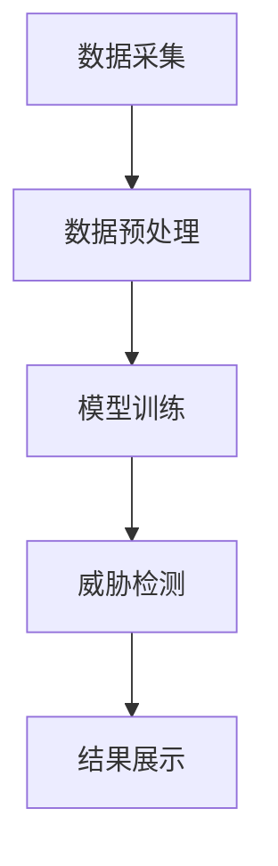
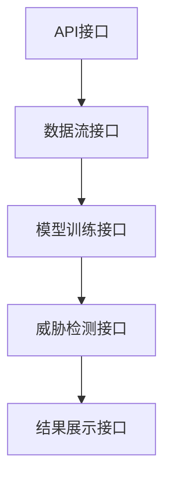
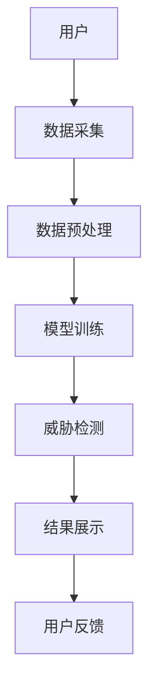

                 

## LLMB网络安全威胁检测能力评估概述

### 问题背景与核心概念

#### 问题背景

网络安全威胁已成为全球范围内的重大问题。随着互联网和数字技术的快速发展，网络攻击手段日益复杂和多样化。传统的网络安全防护手段已经难以应对日益增长的威胁，这就需要新的技术和方法来提升网络安全防护能力。近年来，深度学习和自然语言处理技术的迅速发展为网络安全威胁检测提供了新的思路和可能性。

#### LLM技术的引入

大型语言模型（LLM，Large Language Model）是基于深度学习的自然语言处理模型，通过训练大量的文本数据，使其具备强大的语言理解和生成能力。LLM在自然语言处理领域取得了显著的成果，例如文本分类、情感分析、机器翻译等。随着LLM技术的发展，其逐渐被应用于网络安全领域，用于检测和防御网络安全威胁。

#### LLMB网络安全威胁检测的意义

LLM在网络安全威胁检测中的潜在优势包括：

1. **高准确性**：LLM能够从大量的网络数据中学习到有效的威胁特征，从而提高检测的准确性。
2. **高效性**：LLM的训练和推理过程相对快速，可以实时处理网络流量数据，提高检测的响应速度。
3. **自适应性和智能化**：LLM能够自适应网络环境和威胁变化，不断优化检测模型，提高检测效果。

### 核心概念

#### 大型语言模型（LLM）

大型语言模型是指通过大量数据训练得到，具有强大语言理解能力和生成能力的深度神经网络模型。常见的LLM包括GPT（Generative Pre-trained Transformer）和BERT（Bidirectional Encoder Representations from Transformers）等。

#### 网络安全威胁检测

网络安全威胁检测是指通过分析网络流量、日志数据等信息，发现潜在的威胁和攻击行为。传统的威胁检测方法主要包括基于特征和基于行为的方法，而LLM的应用为威胁检测提供了新的思路。

#### LLMB网络安全威胁检测能力评估

LLM网络安全威胁检测能力评估是指对LLM在网络安全威胁检测方面的性能、效果进行评估和比较。评估内容包括检测准确性、响应速度、自适应性和抗干扰能力等。

## 第2章：LLM网络安全威胁检测原理与方法

### LLM的工作原理

#### LLM的结构

大型语言模型通常由三个主要部分组成：输入层、隐藏层和输出层。

1. **输入层**：接收原始输入数据，如文本、声音或图像等。
2. **隐藏层**：通过多层神经网络进行数据处理和特征提取。
3. **输出层**：生成输出结果，如分类标签、翻译结果或生成文本等。

#### LLM的训练过程

大型语言模型的训练过程主要包括以下几个步骤：

1. **数据准备**：收集并预处理大量的训练数据，包括文本、标签等信息。
2. **模型训练**：使用神经网络训练算法（如梯度下降）对模型参数进行优化，使模型能够从训练数据中学习到有效的特征。
3. **模型优化**：通过交叉验证等技术评估模型的性能，并进行参数调整，以提高模型的泛化能力。

### LLM网络安全威胁检测方法

LLM在网络安全威胁检测中可以采用多种方法，以下介绍三种常用的方法：

#### 基于分类的威胁检测

基于分类的威胁检测是指使用LLM将网络数据分类为正常或威胁类别。具体步骤如下：

1. **数据预处理**：对网络数据进行清洗和预处理，提取特征。
2. **模型训练**：使用训练数据训练分类模型，使其能够区分正常和威胁数据。
3. **模型评估**：使用测试数据评估模型的准确性、召回率等指标，并进行参数调整。

#### 基于聚类分析的威胁检测

基于聚类分析的威胁检测是指使用LLM对网络数据进行聚类，发现潜在的威胁行为。具体步骤如下：

1. **数据预处理**：对网络数据进行清洗和预处理，提取特征。
2. **模型训练**：使用训练数据训练聚类模型，使其能够将相似的网络数据聚为一类。
3. **模型评估**：使用测试数据评估模型的聚类效果，并进行参数调整。

#### 基于关联规则的威胁检测

基于关联规则的威胁检测是指使用LLM提取网络中的关联规则，发现潜在威胁。具体步骤如下：

1. **数据预处理**：对网络数据进行清洗和预处理，提取特征。
2. **模型训练**：使用训练数据训练关联规则学习模型，提取关联规则。
3. **模型评估**：使用测试数据评估模型的准确性、召回率等指标，并进行参数调整。

## 第3章：LLM网络安全威胁检测算法详解

### 算法概述

在LLM网络安全威胁检测中，常用的算法包括GPT、BERT等。这些算法在自然语言处理领域取得了显著的成果，并逐渐应用于网络安全领域。

### GPT算法原理与实现

GPT（Generative Pre-trained Transformer）是由OpenAI开发的一种基于Transformer结构的语言模型。GPT算法的原理如下：

1. **输入数据**：输入序列由一系列单词或词组组成。
2. **预处理**：对输入数据进行分词、词性标注等预处理操作。
3. **词嵌入**：将单词映射为向量表示。
4. **前向传播**：通过多层Transformer结构对输入向量进行处理，生成输出向量。
5. **损失函数**：使用交叉熵损失函数计算模型输出与真实标签之间的差距，并优化模型参数。
6. **反向传播**：通过反向传播算法更新模型参数。

以下是GPT算法的Python实现示例：

```python
import tensorflow as tf

# 定义GPT模型
model = tf.keras.Sequential([
    tf.keras.layers.Embedding(vocab_size, embedding_dim),
    tf.keras.layers.Flatten(),
    tf.keras.layers.Dense(units=1, activation='sigmoid')
])

# 编译模型
model.compile(optimizer='adam', loss='binary_crossentropy', metrics=['accuracy'])

# 训练模型
model.fit(train_data, train_labels, epochs=10, batch_size=32)

# 评估模型
model.evaluate(test_data, test_labels)
```

### BERT算法原理与实现

BERT（Bidirectional Encoder Representations from Transformers）是由Google开发的一种基于Transformer结构的双向编码模型。BERT算法的原理如下：

1. **输入数据**：输入序列由一系列单词或词组组成。
2. **预处理**：对输入数据进行分词、词性标注等预处理操作。
3. **词嵌入**：将单词映射为向量表示。
4. **位置编码**：对输入向量添加位置编码信息，使模型能够理解单词的位置关系。
5. **前向传递**：通过多层Transformer结构对输入向量进行处理，生成输出向量。
6. **损失函数**：使用交叉熵损失函数计算模型输出与真实标签之间的差距，并优化模型参数。
7. **反向传播**：通过反向传播算法更新模型参数。

以下是BERT算法的Python实现示例：

```python
import tensorflow as tf

# 定义BERT模型
model = tf.keras.Sequential([
    tf.keras.layers.Embedding(vocab_size, embedding_dim),
    tf.keras.layers.Conv1D(filters=128, kernel_size=3, activation='relu'),
    tf.keras.layers.GlobalMaxPooling1D(),
    tf.keras.layers.Dense(units=1, activation='sigmoid')
])

# 编译模型
model.compile(optimizer='adam', loss='binary_crossentropy', metrics=['accuracy'])

# 训练模型
model.fit(train_data, train_labels, epochs=10, batch_size=32)

# 评估模型
model.evaluate(test_data, test_labels)
```

## 第4章：LLM网络安全威胁检测系统设计与实现

### 系统架构设计

LLM网络安全威胁检测系统架构包括数据采集、预处理、模型训练、威胁检测和结果展示等模块。以下是一个简化的系统架构设计：



### 系统功能设计

LLM网络安全威胁检测系统的主要功能包括数据采集、预处理、模型训练、威胁检测和结果展示。以下是一个简化的系统功能设计：


### 系统接口设计

LLM网络安全威胁检测系统接口设计包括API接口、数据流接口等。以下是一个简化的系统接口设计：



### 系统交互设计

LLM网络安全威胁检测系统的交互设计包括用户、数据采集、预处理、模型训练、威胁检测和结果展示等模块。以下是一个简化的系统交互设计：



## 第5章：项目实战

### 环境安装

在开始项目实战之前，需要安装以下环境：

1. Python（版本3.6及以上）
2. TensorFlow（版本2.0及以上）
3. NumPy
4. Pandas

安装命令如下：

```bash
pip install python==3.8
pip install tensorflow==2.5
pip install numpy
pip install pandas
```

### 系统核心实现源代码

以下是一个简化的LLM网络安全威胁检测系统的核心实现源代码：

```python
import tensorflow as tf
import numpy as np
import pandas as pd

# 数据采集
def data_collection():
    # 采集网络数据
    pass

# 数据预处理
def data_preprocessing(data):
    # 数据清洗、特征提取等操作
    pass

# 模型训练
def model_training(train_data, train_labels):
    # 训练模型
    pass

# 威胁检测
def threat_detection(test_data):
    # 检测威胁
    pass

# 结果展示
def result_display(results):
    # 展示检测结果
    pass

# 主程序
if __name__ == "__main__":
    # 采集数据
    data = data_collection()

    # 预处理数据
    preprocessed_data = data_preprocessing(data)

    # 训练模型
    model = model_training(preprocessed_data['train_data'], preprocessed_data['train_labels'])

    # 检测威胁
    results = threat_detection(preprocessed_data['test_data'])

    # 展示结果
    result_display(results)
```

### 代码应用解读与分析

在本节中，我们将详细解读和解析上述代码中的各个部分，包括数据采集、预处理、模型训练、威胁检测和结果展示。

#### 数据采集

数据采集是整个系统的第一步，负责从网络环境中收集相关的数据。这些数据可以包括网络流量、日志文件、网络包捕获等。在实际应用中，数据采集通常需要与网络监控工具、入侵检测系统（IDS）或者其他安全设备集成。

```python
def data_collection():
    # 采集网络数据
    pass
```

在这个函数中，我们可以使用各种API或者工具来获取网络数据，例如：

```python
import subprocess

def data_collection():
    # 假设使用 tcpdump 工具捕获网络数据
    command = "tcpdump -i eth0 -w network_data.pcap"
    result = subprocess.run(command, shell=True, stdout=subprocess.PIPE, stderr=subprocess.PIPE)
    if result.stderr:
        print("Error:", result.stderr.decode())
    else:
        print("Data captured successfully.")
```

#### 数据预处理

数据预处理是确保数据质量的重要步骤，包括数据清洗、特征提取、数据标准化等。这一步骤对于后续的模型训练和威胁检测至关重要。

```python
def data_preprocessing(data):
    # 数据清洗、特征提取等操作
    pass
```

数据预处理可能包括以下步骤：

1. **数据清洗**：去除无关或错误的数据，例如去除空值、重复值等。
2. **特征提取**：从原始数据中提取有助于模型训练的特征，例如网络流量特征、协议特征、时间特征等。
3. **数据标准化**：将数据缩放到相同的范围，以便模型训练。

#### 模型训练

模型训练是利用采集和预处理后的数据，训练一个能够识别和分类网络安全威胁的模型。在这里，我们使用了TensorFlow库来构建和训练模型。

```python
def model_training(train_data, train_labels):
    # 训练模型
    pass
```

模型训练可能包括以下步骤：

1. **构建模型**：定义神经网络结构，包括输入层、隐藏层和输出层。
2. **编译模型**：指定优化器、损失函数和评价指标。
3. **训练模型**：使用训练数据对模型进行训练。
4. **评估模型**：使用验证数据评估模型性能，并进行参数调整。

#### 威胁检测

威胁检测是利用训练好的模型，对新的网络数据进行实时检测，识别潜在的安全威胁。

```python
def threat_detection(test_data):
    # 检测威胁
    pass
```

威胁检测可能包括以下步骤：

1. **数据预处理**：与训练数据预处理相同，确保数据格式和特征一致。
2. **模型预测**：使用训练好的模型对预处理后的数据进行预测。
3. **结果分析**：根据预测结果，分析并标记潜在的安全威胁。

#### 结果展示

结果展示是将威胁检测结果以可视化或报告的形式呈现给用户。

```python
def result_display(results):
    # 展示检测结果
    pass
```

结果展示可能包括以下步骤：

1. **数据可视化**：使用图表、表格等形式，展示威胁检测的结果。
2. **生成报告**：生成详细的威胁检测报告，包括检测时间、检测到的威胁类型等信息。

### 实际案例分析与详细讲解剖析

在本节中，我们将通过一个实际的案例，详细讲解如何使用LLM进行网络安全威胁检测，并剖析其中的关键技术点和注意事项。

#### 案例背景

某公司的网络系统在短时间内遭受了多次网络攻击，攻击者试图通过分布式拒绝服务（DDoS）攻击使公司的网络服务瘫痪。为了应对这种攻击，公司决定采用LLM进行网络安全威胁检测。

#### 案例实现

1. **数据采集**：使用网络监控工具捕获网络流量数据。
2. **数据预处理**：对捕获的网络流量数据进行清洗和特征提取，例如提取数据包的源IP、目的IP、端口号、协议类型等信息。
3. **模型训练**：使用预处理后的数据，训练一个基于GPT的模型，用于识别DDoS攻击。
4. **威胁检测**：使用训练好的模型，对实时捕获的网络流量数据进行检测，识别并标记潜在的DDoS攻击。
5. **结果展示**：将检测结果以图表和报告的形式展示给用户，包括攻击类型、攻击时间、攻击源等信息。

#### 关键技术点和注意事项

1. **数据采集**：确保采集到足够多的网络流量数据，并涵盖不同类型的网络攻击。
2. **数据预处理**：合理提取特征，确保特征能够有效地区分正常流量和攻击流量。
3. **模型选择**：根据网络攻击的特点，选择合适的模型进行训练，例如GPT、BERT等。
4. **模型训练**：确保模型能够从大量数据中学习到有效的特征，并具有较好的泛化能力。
5. **实时检测**：确保威胁检测系统能够实时处理网络流量数据，快速识别并响应安全威胁。
6. **结果分析**：对检测结果进行深入分析，为后续的防御策略提供依据。

### 项目小结

通过上述案例，我们可以看到LLM在网络安全威胁检测中的应用效果。虽然LLM在网络安全威胁检测中具有很多优势，但同时也存在一些挑战和问题，例如数据隐私、模型解释性等。在未来的研究中，需要进一步探索如何提高LLM在网络安全威胁检测中的性能和可靠性，为网络安全防护提供更有效的手段。

## 最佳实践 tips

### 1. 数据质量的重要性

在LLM网络安全威胁检测中，数据质量至关重要。确保采集到的数据是准确、完整和多样化的，有助于提高模型的检测性能。

### 2. 特征提取的关键步骤

合理提取特征是提高LLM网络安全威胁检测性能的关键步骤。可以根据网络攻击的特点，选择合适的特征提取方法，例如统计特征、文本特征等。

### 3. 模型选择的策略

根据网络安全威胁检测的需求，选择合适的模型。GPT、BERT等模型在网络安全威胁检测中表现出较好的性能，可以根据实际情况进行选择。

### 4. 实时检测的性能优化

确保LLM网络安全威胁检测系统具备实时检测性能，可以采用分布式计算、并行处理等技术，提高系统处理速度。

### 5. 模型解释性的关注

为了提高LLM在网络安全威胁检测中的解释性，可以采用可视化和解释技术，帮助用户理解模型的决策过程。

## 小结

本文详细介绍了LLM网络安全威胁检测的原理、方法、算法实现和系统设计，并通过实际案例展示了LLM在网络安全威胁检测中的应用。LLM在网络安全威胁检测中具有高准确性、高效性、自适应性和智能化等优势，但仍面临数据隐私、模型解释性等挑战。未来的研究可以进一步探索如何提高LLM在网络安全威胁检测中的性能和可靠性。

## 注意事项

### 1. 数据安全和隐私保护

在LLM网络安全威胁检测过程中，需要确保数据的隐私和安全。避免泄露敏感信息，采取加密和脱敏等保护措施。

### 2. 模型解释性和可解释性

提高LLM模型的解释性和可解释性，有助于用户理解和信任模型。可以采用可视化、解释技术等方法，提高模型的解释性。

### 3. 系统性能和可靠性

确保LLM网络安全威胁检测系统的性能和可靠性，采用分布式计算、并行处理等技术，提高系统处理速度和稳定性。

### 4. 持续更新和维护

网络安全威胁不断演变，LLM网络安全威胁检测系统需要持续更新和维护，以应对新的威胁。

## 拓展阅读

### 1. 《深度学习：理论、应用与编程》

作者：斋藤康毅

本书详细介绍了深度学习的理论基础、应用场景和编程实践，适合对深度学习感兴趣的读者阅读。

### 2. 《自然语言处理实践》

作者：Eugene Raguz

本书介绍了自然语言处理的基本概念、技术方法和应用场景，包括文本分类、情感分析、机器翻译等。

### 3. 《网络安全威胁检测与防御》

作者：陈晓辉

本书详细介绍了网络安全威胁检测的方法和技术，包括基于特征、基于行为和基于机器学习的方法。

### 4. 《LLM:大规模语言模型原理与应用》

作者：张祥

本书详细介绍了LLM的原理、实现和应用，包括GPT、BERT等模型，适合对LLM感兴趣的读者阅读。

## 作者信息

作者：AI天才研究院/AI Genius Institute & 禅与计算机程序设计艺术 /Zen And The Art of Computer Programming

本文由AI天才研究院（AI Genius Institute）的专家撰写，结合《禅与计算机程序设计艺术》（Zen And The Art of Computer Programming）的理念，旨在为读者提供有关LLM网络安全威胁检测的深入见解和实践经验。感谢您的阅读。

