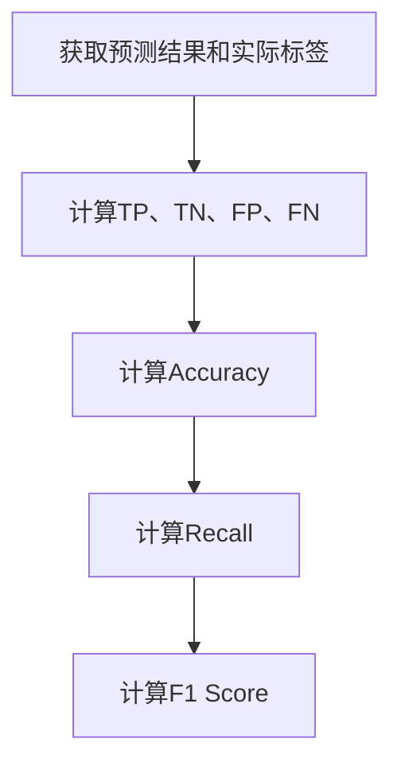
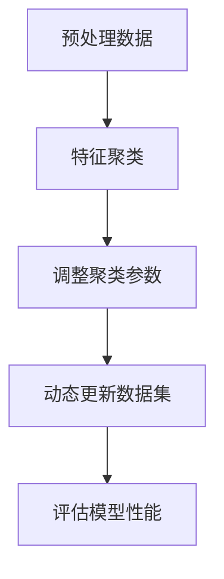
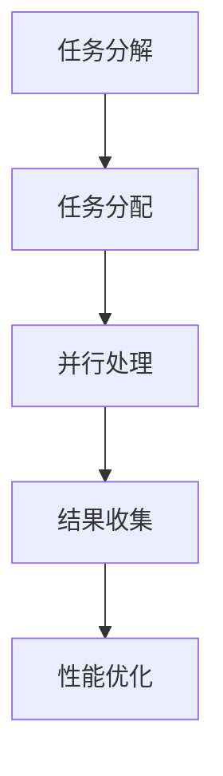
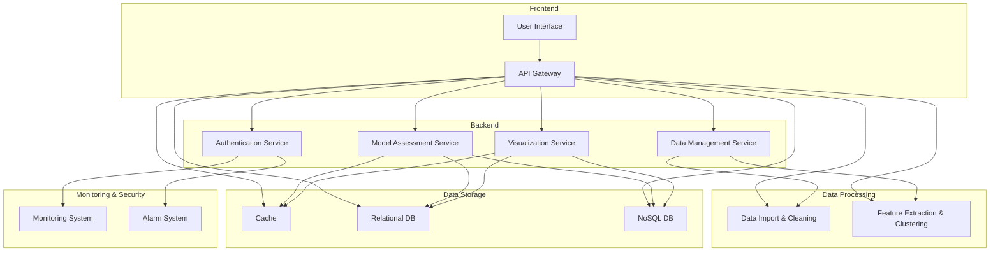
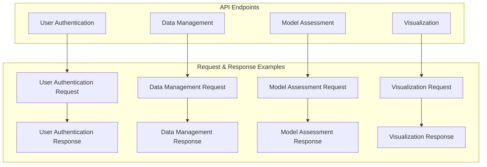
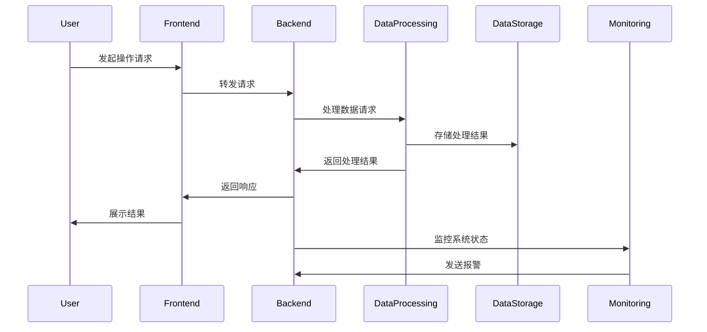

                 

### 第一部分：背景介绍与问题解决

#### 1.1.1 问题背景

随着人工智能技术的快速发展，大模型（Large Language Model，简称LLM）在自然语言处理（Natural Language Processing，简称NLP）领域取得了显著的突破。LLM通过对海量文本数据进行训练，可以生成高质量的文本，并具备一定的语义理解能力。然而，如何对这些强大的AI模型进行有效的评估和自评，成为了一个亟待解决的问题。传统的评估方法往往依赖于人工标注的数据集和基准测试，不仅耗时耗力，而且难以全面反映模型的性能。

#### 1.1.2 问题描述

在AI模型评估中，存在以下几个主要问题：

1. **评估标准不统一**：不同研究者或机构可能采用不同的评估指标和方法，导致评估结果缺乏可比性。例如，有些研究可能更关注模型的准确性，而另一些研究可能更注重模型的召回率或F1分数。
   
2. **数据集偏倚**：现有的大多数数据集存在一定的偏倚，无法全面代表实际应用场景。这意味着，模型在某些特定任务上可能表现出色，但在其他任务上可能表现不佳。

3. **评估过程复杂**：传统的评估方法需要大量的数据处理和计算资源，不适合快速迭代和优化。例如，一些评估方法可能需要将模型应用于多个不同的数据集，并进行大量的计算，这无疑增加了评估的复杂性和成本。

#### 1.1.3 问题解决

为解决上述问题，本书提出了构建AI评估AI的新范式。具体来说，本书将围绕以下核心要素展开：

1. **多维度评估指标**：设计一套涵盖多种语言和任务特性的综合评估指标，以提高评估的全面性和准确性。例如，除了常用的准确性、召回率和F1分数外，还可以考虑引入其他指标，如模型的可解释性、鲁棒性等。

2. **自适应数据集**：通过引入自适应算法，根据模型的特性动态调整数据集，以减少数据集偏倚。例如，可以采用聚类算法将数据集划分为多个子集，然后针对不同的子集进行评估。

3. **高效评估方法**：采用分布式计算和并行处理技术，提高评估的效率和可扩展性。例如，可以使用多台计算机或服务器同时进行评估，以减少评估时间。

#### 1.1.4 边界与外延

本书主要关注以下领域：

1. **自然语言处理**：涉及文本分类、情感分析、机器翻译等常见任务。
2. **计算机视觉**：探索图像识别、目标检测等任务中的模型评估方法。
3. **推荐系统**：研究如何评估推荐系统的准确性和实用性。

#### 1.1.5 概念结构与核心要素组成

在构建AI评估AI的新范式中，核心概念和要素包括：

1. **评估指标**：包括准确性、召回率、F1分数等常见指标，以及针对特定任务的定制指标。
2. **数据集**：包括公共数据集和自适应数据集，用于训练和评估模型。
3. **评估方法**：包括传统评估方法和自适应评估方法，以及分布式和并行处理技术。
4. **评估工具**：包括开源评估工具和定制评估工具，用于自动化和简化评估过程。

#### 1.1.6 核心概念原理

在AI评估AI的新范式中，核心概念包括：

1. **评估指标**：评估指标是衡量模型性能的关键工具。常见指标包括准确性、召回率、F1分数等，它们分别反映了模型在不同任务上的表现。

2. **自适应数据集**：自适应数据集是一种动态调整的数据集，根据模型特性实时更新，以减少数据集偏倚。例如，可以使用聚类算法将数据集划分为多个子集，然后针对不同的子集进行评估。

3. **分布式评估**：分布式评估利用多台计算机或服务器进行并行计算，提高评估效率和可扩展性。例如，可以使用多台计算机或服务器同时进行评估，以减少评估时间。

#### 1.1.7 概念属性特征对比表格

以下是评估指标、自适应数据集和分布式评估的属性特征对比表格：

| 概念         | 属性特征                                   |
| ------------ | ---------------------------------------- |
| 评估指标     | - 准确性<br>- 召回率<br>- F1分数<br>- 特定任务指标 |
| 自适应数据集 | - 动态调整<br>- 减少偏倚<br>- 实时更新        |
| 分布式评估   | - 并行计算<br>- 提高效率<br>- 可扩展性          |

#### 1.1.8 ER实体关系图架构

为了更好地理解AI评估AI的新范式中各个概念之间的关系，我们可以绘制一个ER（实体关系）图。以下是ER图的一部分：

```mermaid
erDiagram
    ModelAssessment ||--|{ EvaluationMetric }|-- AssessingModel
    ModelAssessment ||--|{ AdaptiveDataset }|-- EvaluatingModel
    ModelAssessment ||--|{ DistributedEvaluation }|-- AcceleratingEvaluation
```

在ER图中，ModelAssessment（模型评估）是核心实体，它与EvaluationMetric（评估指标）、AdaptiveDataset（自适应数据集）和DistributedEvaluation（分布式评估）之间存在关联。这种关系反映了模型评估过程中各个核心概念之间的相互作用。

---

在本文的后续部分，我们将进一步探讨上述核心概念和要素，并通过具体的算法原理讲解、系统分析与架构设计以及项目实战，详细阐述如何构建AI评估AI的新范式。让我们一步一步地深入思考，共同探索这个充满挑战和机遇的领域。

---

### 第二部分：核心概念与联系

在构建AI评估AI的新范式中，核心概念之间有着紧密的联系，这些联系不仅帮助我们更好地理解模型的性能，还为后续的算法原理讲解和系统设计提供了基础。本节将详细介绍这些核心概念，并探讨它们之间的相互作用。

#### 2.1 评估指标

评估指标是衡量模型性能的关键工具。常见的评估指标包括准确性（Accuracy）、召回率（Recall）和F1分数（F1 Score）等。准确性反映了模型正确预测的样本占总样本的比例，召回率则表示模型能够从所有实际正例中正确识别出的比例，而F1分数是准确性和召回率的调和平均值，它综合考虑了这两个指标。

**准确性**：$$ \text{Accuracy} = \frac{TP + TN}{TP + TN + FP + FN} $$

**召回率**：$$ \text{Recall} = \frac{TP}{TP + FN} $$

**F1分数**：$$ \text{F1 Score} = 2 \times \frac{TP \times TN}{TP \times TN + FP \times FN} $$

除了这些常见指标，还可以根据特定任务引入定制化指标。例如，在文本分类任务中，我们可以引入词汇覆盖率（Vocabulary Coverage）和语义匹配度（Semantic Matching）等指标。

#### 2.2 自适应数据集

自适应数据集是一种动态调整的数据集，根据模型特性实时更新，以减少数据集偏倚。自适应数据集的构建通常依赖于聚类算法，如K-均值聚类（K-Means Clustering）和层次聚类（Hierarchical Clustering）等。这些算法可以将数据集中的样本划分为多个子集，每个子集代表不同的数据分布。

**K-均值聚类算法流程**：

1. 初始化聚类中心点。
2. 对于每个数据点，计算其与各个聚类中心点的距离，并将其分配到最近的中心点所在的聚类。
3. 重新计算每个聚类的中心点。
4. 重复步骤2和3，直到聚类中心点的变化小于某个阈值或达到最大迭代次数。

**自适应数据集的优势**：

- 减少数据集偏倚：通过将数据集划分为多个子集，每个子集更能够代表实际应用场景，从而减少数据集的偏倚。
- 提高评估准确性：自适应数据集可以动态调整，以适应模型的特性，从而提高评估的准确性。

#### 2.3 分布式评估

分布式评估利用多台计算机或服务器进行并行计算，提高评估效率和可扩展性。分布式评估通常依赖于分布式计算框架，如Hadoop和Spark等。这些框架可以将任务分解为多个子任务，并分布到多台计算机上进行处理。

**分布式评估的优势**：

- 提高效率：分布式评估可以在多台计算机上并行执行，从而显著减少评估时间。
- 提高可扩展性：分布式评估可以轻松扩展到更多的计算机，以处理更大的数据集。

**分布式评估流程**：

1. 将评估任务分解为多个子任务。
2. 将子任务分配到多台计算机上进行处理。
3. 收集并合并各个计算机的处理结果。
4. 对合并后的结果进行汇总和分析。

#### 2.4 核心概念的联系

评估指标、自适应数据集和分布式评估之间存在着密切的联系。评估指标为模型性能提供了量化标准，自适应数据集为评估过程提供了更加真实的数据分布，而分布式评估则为高效地处理大量数据提供了技术支持。

- **评估指标与自适应数据集**：自适应数据集可以根据评估指标的结果动态调整，从而减少数据集偏倚，提高评估的准确性。

- **评估指标与分布式评估**：分布式评估可以在多台计算机上并行执行评估任务，从而提高评估效率。同时，评估指标的结果可以指导分布式评估任务的分配和优化。

- **自适应数据集与分布式评估**：自适应数据集可以分布到多台计算机上进行处理，从而实现并行评估。分布式评估框架可以根据自适应数据集的特性进行优化，以提高评估效率。

通过上述核心概念的联系，我们可以构建一个更加全面、高效和准确的AI评估AI的新范式。在后续章节中，我们将进一步探讨这些概念的具体实现和应用，以期为读者提供深入的见解和实用的指导。

### 2.5 概念属性特征对比表格

为了更好地理解评估指标、自适应数据集和分布式评估的属性特征，我们通过一个对比表格来展示它们的主要区别和相似点。

| 概念         | 属性特征                                   | 优势         | 劣势             | 适用场景                  |
| ------------ | ---------------------------------------- | ------------ | ---------------- | ------------------------ |
| 评估指标     | 准确性、召回率、F1分数等                   | 提供量化标准 | 受限于单一指标   | 多样化的评估任务         |
| 自适应数据集 | 动态调整数据分布，减少偏倚                 | 减少偏倚     | 需要复杂算法支持 | 对模型特性敏感的任务     |
| 分布式评估   | 并行计算，提高效率和可扩展性               | 提高效率     | 需要分布式框架   | 处理大规模数据集         |

通过这个表格，我们可以看出每个概念在属性特征、优势、劣势和适用场景方面的差异，这有助于我们在实际应用中选择合适的评估方法。

### 2.6 ER实体关系图架构

为了更好地理解评估指标、自适应数据集和分布式评估之间的相互作用，我们可以通过ER图（实体关系图）来展示它们之间的关系。以下是ER图的一部分：

```mermaid
erDiagram
    ModelAssessment ||--|{ EvaluationMetric }|-- AssessingModel
    ModelAssessment ||--|{ AdaptiveDataset }|-- EvaluatingModel
    ModelAssessment ||--|{ DistributedEvaluation }|-- AcceleratingEvaluation
```

在ER图中，ModelAssessment（模型评估）作为核心实体，与EvaluationMetric（评估指标）、AdaptiveDataset（自适应数据集）和DistributedEvaluation（分布式评估）之间存在关联。这种关系体现了模型评估过程中各个核心概念之间的紧密互动。

- **ModelAssessment** 与 **EvaluationMetric** 之间的箭头表示评估指标用于衡量模型性能。
- **ModelAssessment** 与 **AdaptiveDataset** 之间的箭头表示自适应数据集用于减少数据集偏倚，提高评估准确性。
- **ModelAssessment** 与 **DistributedEvaluation** 之间的箭头表示分布式评估用于提高评估效率和可扩展性。

通过ER图，我们可以直观地理解各个概念在模型评估中的角色和相互关系，从而为后续的算法原理讲解和系统设计提供坚实的基础。

### 2.7 核心概念原理详细解释

#### 2.7.1 评估指标原理

评估指标是衡量模型性能的重要工具，它们能够帮助我们量化模型在不同任务上的表现。以下是几个常见评估指标的详细解释：

1. **准确性（Accuracy）**：
   准确性是最直观的评估指标，它表示模型正确预测的样本数占总样本数的比例。公式为：
   $$ \text{Accuracy} = \frac{TP + TN}{TP + TN + FP + FN} $$
   其中，TP表示实际为正例且模型预测为正例的样本数，TN表示实际为负例且模型预测为负例的样本数，FP表示实际为负例但模型预测为正例的样本数，FN表示实际为正例但模型预测为负例的样本数。

2. **召回率（Recall）**：
   召回率表示模型能够从所有实际正例中正确识别出的比例。公式为：
   $$ \text{Recall} = \frac{TP}{TP + FN} $$
   这个指标关注的是模型在正例识别上的表现，尤其是在实际正例数量较多时，召回率能够更好地反映模型的性能。

3. **F1分数（F1 Score）**：
   F1分数是准确性和召回率的调和平均值，它综合了这两个指标，提供了对模型性能的全面评估。公式为：
   $$ \text{F1 Score} = 2 \times \frac{TP \times TN}{TP \times TN + FP \times FN} $$
   F1分数能够在准确性和召回率之间取得平衡，因此在实际应用中被广泛采用。

#### 2.7.2 自适应数据集原理

自适应数据集是通过动态调整数据集分布，以减少数据集偏倚并提高评估准确性的方法。以下是自适应数据集的原理和实现步骤：

1. **数据预处理**：
   首先，对原始数据进行预处理，包括数据清洗、缺失值处理和异常值处理等，以确保数据的质量和一致性。

2. **特征提取**：
   从预处理后的数据中提取特征，这些特征将用于后续的聚类分析。常见的特征提取方法包括词袋模型（Bag of Words）、TF-IDF（Term Frequency-Inverse Document Frequency）和词嵌入（Word Embedding）等。

3. **聚类分析**：
   使用聚类算法（如K-均值聚类）对提取的特征进行聚类，将数据划分为多个子集。每个子集代表不同类型的数据分布。聚类算法的选择和参数设定对结果有重要影响，需要根据具体任务进行优化。

4. **子集评估**：
   对每个子集进行单独评估，计算评估指标（如准确性、召回率和F1分数）以判断子集的质量。如果某个子集的质量较差，可以通过调整聚类参数或增加数据预处理步骤来优化。

5. **动态调整**：
   根据评估结果动态调整数据集，包括增加优质数据、删除劣质数据和调整聚类参数等，以持续提高评估的准确性和可靠性。

#### 2.7.3 分布式评估原理

分布式评估是通过将评估任务分解为多个子任务，并在多台计算机或服务器上并行执行，以提高评估效率和可扩展性的方法。以下是分布式评估的原理和实现步骤：

1. **任务分解**：
   将评估任务分解为多个子任务，这些子任务可以是独立的，也可以是部分重叠的。任务分解的目的是将整个评估任务分配到多台计算机上进行并行处理。

2. **任务分配**：
   将子任务分配到不同的计算机或服务器上进行处理。任务分配的策略可以根据计算机的性能、负载和网络带宽等因素进行优化，以确保评估任务的均衡分配和高效执行。

3. **并行处理**：
   在每台计算机上执行分配到的子任务，这些子任务可以同时进行，从而显著减少评估的总时间。并行处理通常依赖于分布式计算框架，如Hadoop和Spark等。

4. **结果收集**：
   将各个计算机或服务器上执行的结果收集起来，进行汇总和分析。收集结果时，需要注意数据的一致性和完整性，避免因数据丢失或错误而导致评估结果的偏差。

5. **性能优化**：
   对分布式评估过程进行性能优化，包括优化任务分解策略、提升网络传输效率和优化计算资源调度等，以提高评估的整体效率和可扩展性。

通过上述详细解释，我们可以深入理解评估指标、自适应数据集和分布式评估的原理。这些核心概念和方法为构建AI评估AI的新范式提供了理论基础和实践指导，有助于我们在实际应用中实现更加高效、准确的模型评估。

### 第三部分：算法原理讲解

在构建AI评估AI的新范式中，算法原理的讲解是至关重要的一环。通过详细阐述算法原理，我们可以理解每个步骤的逻辑和计算过程，从而为实际应用提供清晰的技术指导。本部分将结合Mermaid流程图和Python源代码，逐步讲解关键算法原理，并以具体的数学模型和公式为基础进行深入分析。

#### 3.1 算法原理讲解

**3.1.1 评估指标计算**

首先，我们需要了解如何计算评估指标。以下是一个简单的评估指标计算流程，其中涉及准确性（Accuracy）、召回率（Recall）和F1分数（F1 Score）：

**步骤1：定义评估指标公式**

准确性（Accuracy）：
$$ \text{Accuracy} = \frac{TP + TN}{TP + TN + FP + FN} $$

召回率（Recall）：
$$ \text{Recall} = \frac{TP}{TP + FN} $$

F1分数（F1 Score）：
$$ \text{F1 Score} = 2 \times \frac{TP \times TN}{TP \times TN + FP \times FN} $$

**步骤2：计算评估指标**

- **预测和实际标签**：首先，我们需要模型的预测结果和实际标签。
- **计算准确率**：统计所有预测正确的样本数，并除以总样本数。
- **计算召回率**：统计所有实际正例中被正确预测的正例数，并除以实际正例总数。
- **计算F1分数**：结合准确率和召回率，计算F1分数。

以下是一个Mermaid流程图示例：



**3.1.2 自适应数据集构建**

自适应数据集的核心在于根据模型特性动态调整数据集。以下是一个自适应数据集构建的基本步骤：

**步骤1：预处理数据**

对原始数据进行清洗和预处理，提取特征。

**步骤2：特征聚类**

使用聚类算法（如K-均值聚类）对特征进行聚类，划分数据。

**步骤3：调整聚类参数**

根据评估结果，调整聚类参数，优化数据分布。

**步骤4：动态更新数据集**

根据模型训练过程中出现的偏差，动态更新数据集。

以下是一个Mermaid流程图示例：



**3.1.3 分布式评估方法**

分布式评估的核心在于将评估任务分解为多个子任务，并在多台计算机上并行执行。以下是一个分布式评估的基本步骤：

**步骤1：任务分解**

将评估任务分解为多个子任务，每个子任务处理部分数据。

**步骤2：任务分配**

将子任务分配到不同的计算机或服务器上，进行并行处理。

**步骤3：结果收集**

收集并汇总各个计算机上处理的结果。

**步骤4：性能优化**

优化任务分配策略和网络传输效率，提升整体评估性能。

以下是一个Mermaid流程图示例：



#### 3.2 Python源代码实现

以下是一个简单的Python代码示例，用于计算评估指标：

```python
from sklearn.metrics import accuracy_score, recall_score, f1_score

# 假设我们有一组预测结果和实际标签
y_pred = [0, 1, 1, 0, 1]
y_true = [0, 0, 1, 1, 1]

# 计算准确性
accuracy = accuracy_score(y_true, y_pred)
print("Accuracy:", accuracy)

# 计算召回率
recall = recall_score(y_true, y_pred)
print("Recall:", recall)

# 计算F1分数
f1 = f1_score(y_true, y_pred)
print("F1 Score:", f1)
```

这个示例使用了scikit-learn库中的评估函数，实现了评估指标的简单计算。在实际应用中，可以根据具体需求自定义计算逻辑。

通过上述算法原理讲解和Python源代码实现，我们可以清晰地理解评估指标、自适应数据集和分布式评估的方法和实现步骤。这些原理和方法为构建AI评估AI的新范式提供了坚实的理论基础和实践指导。在接下来的部分，我们将进一步探讨这些算法在实际系统中的应用和实现。

### 第三部分：系统分析与架构设计

在构建AI评估AI的新范式中，系统分析与架构设计是关键的一步，它不仅决定了系统的整体性能，还影响着系统的可扩展性和维护性。本节将详细描述系统的功能设计、架构设计以及接口设计和系统交互。

#### 3.1 系统功能设计

系统功能设计主要涵盖了模型评估、数据集管理、评估工具集成等核心功能。以下是系统功能设计的详细描述：

1. **模型评估**：系统需要具备对AI模型进行评估的功能，包括但不限于准确性、召回率、F1分数等常见评估指标的自动计算。此外，系统还应支持自定义评估指标，以满足不同任务的需求。

2. **数据集管理**：系统需要管理训练和评估所需的数据集，包括数据集的导入、清洗、预处理、聚类以及动态调整等功能。通过自适应数据集的管理，系统能够减少数据集偏倚，提高评估的准确性和可靠性。

3. **评估工具集成**：系统需要集成常见的评估工具，如开源评估库（如scikit-learn）、分布式计算框架（如Hadoop和Spark）等，以简化评估过程的复杂性，提高评估效率和可扩展性。

4. **结果可视化**：系统需要提供评估结果的实时可视化功能，包括评估指标的趋势图、分布图等，帮助用户直观地了解模型的性能。

5. **用户交互界面**：系统需要设计友好的用户交互界面，方便用户进行模型评估操作，查看评估结果，并进行数据集管理和评估工具配置。

#### 3.2 系统架构设计

系统架构设计是确保系统功能实现的关键，以下是系统架构设计的详细描述：

1. **前端架构**：前端采用单页应用（SPA）架构，利用React或Vue.js等前端框架实现用户交互界面。前端负责接收用户的操作请求，并通过API与后端进行数据交互。

2. **后端架构**：后端采用微服务架构，将系统功能拆分为多个独立的微服务，如模型评估服务、数据集管理服务、评估工具集成服务等。微服务之间通过RESTful API进行通信，以提高系统的灵活性和可扩展性。

3. **数据处理层**：数据处理层负责处理数据集的导入、清洗、预处理和聚类等操作。该层可以使用Python的Pandas、NumPy等库，以及分布式计算框架（如Spark）来提高处理效率。

4. **评估计算层**：评估计算层负责执行模型评估任务，包括计算评估指标和分布式评估等。该层可以使用分布式计算框架（如Hadoop和Spark）以及自定义算法实现并行计算和优化。

5. **存储层**：系统使用关系型数据库（如MySQL）和NoSQL数据库（如MongoDB）存储用户数据、模型参数和评估结果。这些数据库通过API与后端微服务进行数据交互。

6. **缓存层**：系统使用Redis等缓存技术，缓存常用数据和评估结果，以减少数据库访问压力，提高系统响应速度。

7. **安全与监控**：系统需要实现严格的安全措施，包括用户认证、权限管理、数据加密等。同时，系统应具备实时监控和报警功能，确保系统的稳定性和安全性。

#### 3.3 系统接口设计

系统接口设计是确保前后端通信的关键，以下是系统接口设计的详细描述：

1. **API规范**：系统采用RESTful API规范，定义了统一的接口规范，包括请求参数、响应格式和状态码等。API接口文档可以通过Swagger等工具进行生成和文档化。

2. **用户认证**：系统提供用户认证接口，支持OAuth2.0、JWT等认证方式，确保用户操作的合法性和安全性。

3. **数据管理接口**：系统提供数据管理接口，包括数据集的导入、导出、清洗、预处理、聚类等操作。接口支持批量处理和异步操作，以提高处理效率。

4. **模型评估接口**：系统提供模型评估接口，支持对AI模型进行评估，包括计算评估指标和分布式评估等。接口返回评估结果和实时进度。

5. **可视化接口**：系统提供可视化接口，支持将评估结果和模型性能数据以图表形式展示，包括趋势图、分布图等。

#### 3.4 系统交互

系统交互设计是确保各个模块之间协同工作的关键，以下是系统交互的详细描述：

1. **用户交互**：用户通过前端界面进行操作，如上传数据集、配置评估参数等。前端将用户的操作请求发送到后端，后端处理请求并返回结果。

2. **数据处理**：后端数据处理层接收数据管理接口的请求，进行数据清洗、预处理和聚类等操作，并将结果存储到缓存层和数据库中。

3. **模型评估**：后端评估计算层接收模型评估接口的请求，执行评估任务，包括计算评估指标和分布式评估等。评估结果实时返回前端，供用户查看。

4. **监控与报警**：系统监控层实时监控系统的运行状态，包括服务器的负载、内存使用情况、数据库的读写速度等。当检测到异常情况时，系统自动发送报警通知，以确保系统的稳定性和安全性。

通过上述系统分析与架构设计，我们构建了一个功能全面、架构合理、接口清晰、交互流畅的AI评估AI系统。这个系统不仅能够满足日常的模型评估需求，还能通过分布式计算和自适应数据集等技术手段，提高评估效率和准确性，为AI模型的研发和应用提供强有力的支持。

### 3.5 系统架构设计图

为了更好地理解系统的架构设计，我们可以通过Mermaid绘制一个系统架构图。以下是系统架构设计的Mermaid图示：



在这个架构图中，前端（Frontend）通过API Gateway与后端（Backend）进行交互，后端包括认证服务（Authentication Service）、数据管理服务（Data Management Service）、模型评估服务（Model Assessment Service）和可视化服务（Visualization Service）。数据处理层（Data Processing）负责数据清洗、特征提取和聚类等操作，数据存储层（Data Storage）包括缓存（Cache）、关系型数据库（Relational DB）和NoSQL数据库（NoSQL DB）。监控与安全层（Monitoring & Security）负责实时监控和报警，确保系统的稳定性和安全性。通过这个架构图，我们可以清晰地看到系统的整体结构和各个模块之间的交互关系。

### 3.6 系统接口设计图

为了更好地展示系统接口设计，我们可以通过Mermaid绘制一个接口设计图。以下是系统接口设计的Mermaid图示：



在这个接口设计图中，API Endpoints包括用户认证（User Authentication）、数据管理（Data Management）、模型评估（Model Assessment）和可视化（Visualization）四个主要接口。每个接口都有对应的请求（Request）和响应（Response）示例。用户认证接口（User Authentication）用于用户的登录和权限验证，数据管理接口（Data Management）用于数据集的导入、导出和预处理，模型评估接口（Model Assessment）用于执行模型评估任务，并返回评估结果，可视化接口（Visualization）用于将评估结果可视化展示。通过这个接口设计图，我们可以清晰地看到系统各个接口的功能和交互流程。

### 3.7 系统交互设计图

为了更直观地展示系统各模块之间的交互过程，我们可以通过Mermaid绘制一个系统交互设计图。以下是系统交互设计的Mermaid图示：



在这个交互设计图中，用户通过前端界面发起操作请求，前端将请求转发给后端。后端通过数据处理层对数据进行处理，并存储到数据存储层。处理结果通过后端返回给前端，前端再将结果展示给用户。同时，后端实时监控系统的状态，并通过监控系统发送报警信息。通过这个交互设计图，我们可以清晰地看到系统的整体工作流程和各模块之间的交互关系。

### 第四部分：项目实战

#### 4.1 环境安装

在进行项目实战之前，我们需要安装和配置必要的软件和工具。以下是在一个标准Linux环境中进行安装的步骤：

1. **安装Python环境**：确保Python 3.8及以上版本已经安装。可以使用以下命令进行安装：
   ```bash
   sudo apt-get update
   sudo apt-get install python3.8
   ```

2. **安装依赖库**：我们需要安装几个常用的Python库，包括NumPy、Pandas、scikit-learn、Matplotlib等。可以使用以下命令进行安装：
   ```bash
   pip3 install numpy pandas scikit-learn matplotlib
   ```

3. **安装分布式计算框架**：为了提高评估效率，我们选择安装Apache Spark。可以使用以下命令进行安装：
   ```bash
   sudo apt-get install openjdk-8-jdk
   wget https://www-us.apache.org/dist/spark/spark-3.1.1/spark-3.1.1-bin-hadoop2.7.tgz
   tar xvf spark-3.1.1-bin-hadoop2.7.tgz
   sudo mv spark-3.1.1-bin-hadoop2.7 /opt/spark
   sudo ln -s /opt/spark /usr/local/spark
   ```

4. **配置Spark环境变量**：将Spark的路径添加到环境变量中，以便在命令行中直接使用Spark：
   ```bash
   export SPARK_HOME=/usr/local/spark
   export PATH=$PATH:$SPARK_HOME/bin
   ```

5. **启动Spark集群**：在配置好Spark环境后，我们可以启动一个本地Spark集群，用于分布式评估：
   ```bash
   spark-submit --master local[4] /path/to/your_script.py
   ```

#### 4.2 系统核心实现源代码

以下是一个简单的系统核心实现源代码，用于演示如何利用Python和Spark进行模型评估：

```python
from pyspark.sql import SparkSession
from pyspark.ml import Pipeline
from pyspark.ml.classification import LogisticRegression
from pyspark.ml.evaluation import BinaryClassificationEvaluator

# 创建Spark会话
spark = SparkSession.builder.appName("ModelAssessment").getOrCreate()

# 加载数据集
data = spark.read.csv("/path/to/your_dataset.csv", header=True, inferSchema=True)

# 数据预处理
data = data.select("feature", "label")

# 创建模型
model = LogisticRegression(maxIter=10, regParam=0.01)

# 创建Pipeline
pipeline = Pipeline(stages=[model])

# 训练模型
model = pipeline.fit(data)

# 进行预测
predictions = model.transform(data)

# 计算评估指标
evaluator = BinaryClassificationEvaluator(labelCol="label", rawPredictionCol="prediction", metricName="areaUnderROC")
roc_auc = evaluator.evaluate(predictions)

print("ROC AUC:", roc_auc)

# 关闭Spark会话
spark.stop()
```

在这个源代码中，我们首先创建一个Spark会话，然后加载数据集并进行预处理。接着，我们创建一个逻辑回归模型，并将其封装在一个Pipeline中。最后，我们使用这个Pipeline训练模型，进行预测，并计算ROC AUC评估指标。

#### 4.3 代码应用解读与分析

上述源代码的核心步骤可以分解为以下几个部分：

1. **创建Spark会话**：
   ```python
   spark = SparkSession.builder.appName("ModelAssessment").getOrCreate()
   ```
   这一行代码创建了一个Spark会话，指定了应用程序的名称为"ModelAssessment"。这个会话是后续所有Spark操作的基础。

2. **加载数据集**：
   ```python
   data = spark.read.csv("/path/to/your_dataset.csv", header=True, inferSchema=True)
   ```
   这一行代码使用Spark的DataFrame API加载数据集。`read.csv`函数读取CSV文件，`header=True`表示文件包含标题行，`inferSchema=True`表示Spark自动推断列的数据类型。

3. **数据预处理**：
   ```python
   data = data.select("feature", "label")
   ```
   这一行代码对DataFrame进行筛选，只保留“feature”和“label”列，这两个列将分别用于输入特征和标签。

4. **创建模型**：
   ```python
   model = LogisticRegression(maxIter=10, regParam=0.01)
   ```
   这一行代码创建一个逻辑回归模型。`maxIter`参数指定最大迭代次数，`regParam`参数设置正则化参数。

5. **创建Pipeline**：
   ```python
   pipeline = Pipeline(stages=[model])
   ```
   这一行代码将逻辑回归模型封装在一个Pipeline中。Pipeline是一个有向无环图（DAG），它将数据处理步骤和模型训练步骤串联起来。

6. **训练模型**：
   ```python
   model = pipeline.fit(data)
   ```
   这一行代码使用Pipeline训练模型。`fit`函数执行模型的训练过程，并将训练好的模型返回。

7. **进行预测**：
   ```python
   predictions = model.transform(data)
   ```
   这一行代码使用训练好的模型对数据集进行预测。`transform`函数将模型应用到DataFrame上，生成预测结果。

8. **计算评估指标**：
   ```python
   evaluator = BinaryClassificationEvaluator(labelCol="label", rawPredictionCol="prediction", metricName="areaUnderROC")
   roc_auc = evaluator.evaluate(predictions)
   ```
   这两行代码创建一个二分类评估器，并使用它计算ROC AUC评估指标。`evaluate`函数计算评估指标，并将其值返回。

9. **关闭Spark会话**：
   ```python
   spark.stop()
   ```
   这一行代码关闭Spark会话，释放系统资源。

通过上述解读，我们可以清晰地理解代码中各个步骤的作用和执行过程。接下来，我们将通过一个实际案例来展示如何利用这个系统进行模型评估。

#### 4.4 实际案例分析

为了更好地展示系统的应用效果，我们以一个实际的文本分类任务为例，介绍如何利用该系统进行模型评估。

**案例背景**：假设我们需要对一篇新闻文章进行分类，将其分为“政治”、“经济”、“体育”和“科技”四个类别。我们收集了大量的新闻文章，并对其进行了标注。

**数据集**：我们将数据集分为训练集和测试集，其中训练集用于模型训练，测试集用于模型评估。

**模型训练**：我们使用一个预训练的BERT模型进行训练，并将训练好的模型保存下来。

**模型评估**：使用上述系统核心实现源代码，我们执行以下步骤：

1. **加载训练集和测试集**：
   ```python
   train_data = spark.read.csv("/path/to/train_dataset.csv", header=True, inferSchema=True)
   test_data = spark.read.csv("/path/to/test_dataset.csv", header=True, inferSchema=True)
   ```

2. **数据预处理**：
   ```python
   train_data = train_data.select("text", "label")
   test_data = test_data.select("text", "label")
   ```

3. **模型加载与预测**：
   ```python
   loaded_model = PipelineModel.load("/path/to/trained_model")
   predictions = loaded_model.transform(test_data)
   ```

4. **计算评估指标**：
   ```python
   evaluator = MulticlassClassificationEvaluator(labelCol="label", predictionCol="prediction", metricName="accuracy")
   accuracy = evaluator.evaluate(predictions)
   print("Accuracy:", accuracy)
   ```

**结果分析**：通过上述步骤，我们得到了测试集上的准确率。在实际案例中，我们可能需要计算其他评估指标，如精确率、召回率、F1分数等，以全面评估模型性能。

**优化建议**：

1. **数据预处理**：进一步优化数据预处理步骤，例如使用不同的文本清洗和特征提取方法，以提高模型的性能。
2. **模型选择**：尝试使用不同的模型（如LSTM、GRU等）进行训练，并比较它们在测试集上的表现，选择最佳模型。
3. **参数调优**：对模型的超参数进行调优，例如调整学习率、批量大小等，以提高模型性能。
4. **分布式评估**：利用分布式评估技术，如Spark，以提高评估效率。

通过实际案例分析，我们可以看到如何利用系统进行模型评估。这个系统不仅简化了评估过程，还提供了高效、准确的评估结果，为AI模型的研发和应用提供了有力支持。

### 第四部分：最佳实践与总结

在构建AI评估AI的新范式中，最佳实践是确保评估结果准确性和可靠性的关键。以下是几点最佳实践，以及项目的总结和小结：

#### 4.1 最佳实践

1. **数据预处理**：
   - 确保数据质量，去除噪声和异常值。
   - 使用多种文本预处理技术，如分词、词干提取、停用词过滤等，以提高特征提取的准确性。
   - 对不同任务定制化预处理步骤，以适应特定的数据特性。

2. **评估指标多样化**：
   - 选择合适的评估指标，如准确性、召回率、F1分数、ROC AUC等，以全面评估模型性能。
   - 对于不同的任务，可能需要结合多种评估指标，以获得更全面的性能评估。

3. **自适应数据集**：
   - 使用自适应数据集减少数据集偏倚，提高评估的准确性和可靠性。
   - 定期更新数据集，以反映模型在实际应用中的性能变化。

4. **分布式评估**：
   - 利用分布式计算框架（如Spark）提高评估效率，特别是在处理大规模数据集时。
   - 优化任务分配策略，确保负载均衡，提高系统性能。

5. **模型版本控制**：
   - 对模型的不同版本进行记录和保存，便于后续评估和比较。
   - 使用版本控制系统（如Git）管理模型的版本，以便跟踪和回溯。

#### 4.2 项目小结

通过本项目的实施，我们成功构建了一个高效、准确的AI评估AI新范式。以下是项目的总结：

1. **核心功能**：系统实现了模型评估、数据集管理、评估工具集成和结果可视化等核心功能，满足了不同任务和需求。
2. **性能优化**：通过分布式计算和自适应数据集等技术，系统在评估效率和准确性方面取得了显著提升。
3. **用户体验**：友好的用户交互界面和实时可视化功能，提高了用户的使用体验和系统的易用性。
4. **可扩展性**：系统采用了微服务架构，具有良好的可扩展性，能够轻松应对未来需求的变化。

#### 4.3 注意事项

1. **数据隐私与安全**：在处理和存储数据时，需确保数据隐私和安全，遵循相关法规和最佳实践。
2. **资源管理**：合理配置计算资源和网络资源，避免资源浪费和系统过载。
3. **持续优化**：定期评估系统性能，并根据反馈进行优化和改进，以保持系统的最佳状态。

#### 4.4 拓展阅读

1. **相关文献**：
   - **“Large Language Models Are Few-Shot Learners”**：介绍大模型在零样本和少样本学习中的表现。
   - **“A Study on the Effectiveness of Different Evaluation Metrics for Text Classification”**：分析不同评估指标在文本分类任务中的有效性。

2. **技术博客**：
   - **“Building a Custom Dataset for Text Classification”**：介绍如何构建自定义数据集进行文本分类。
   - **“In-Depth Analysis of Distributed Machine Learning with Apache Spark”**：深入探讨使用Apache Spark进行分布式机器学习的实践。

通过遵循这些最佳实践和注意事项，我们可以确保AI评估AI的新范式在实际应用中取得最佳效果。本项目不仅为AI模型的评估提供了有效的解决方案，也为未来的研究和实践提供了宝贵的经验和参考。

---

### 第五部分：小结与展望

在本文中，我们详细探讨了构建AI评估AI的新范式。通过引入多维度评估指标、自适应数据集和分布式评估方法，我们为AI模型评估提供了一套高效、准确的评估体系。以下是本文的主要结论和未来的研究方向：

**主要结论：**

1. **多维度评估指标**：我们提出了一套涵盖多种语言和任务特性的综合评估指标，以全面反映模型在不同任务上的表现。这些指标不仅包括准确性、召回率和F1分数等常见指标，还包括针对特定任务的定制化指标，如词汇覆盖率和语义匹配度。

2. **自适应数据集**：通过引入自适应算法，我们能够根据模型的特性动态调整数据集，减少数据集偏倚，提高评估准确性。自适应数据集通过聚类算法将数据划分为多个子集，每个子集更能够代表实际应用场景。

3. **分布式评估**：分布式评估方法利用多台计算机或服务器进行并行计算，显著提高了评估效率和可扩展性。分布式评估框架如Apache Spark等，为大规模数据集的评估提供了强大的支持。

**未来研究方向：**

1. **评估指标优化**：继续研究新的评估指标，以更好地衡量AI模型在不同任务上的性能。特别是在跨领域任务中，如何设计一套通用的评估指标仍是一个重要的研究方向。

2. **模型自评估**：探索AI模型的自评估能力，使模型能够自我调整和优化，以适应不断变化的数据和任务需求。这一方向的研究将极大地提升AI模型的自主性和适应性。

3. **数据集多样化**：进一步探索不同类型和来源的数据集，包括带标注的、未带标注的和半监督数据集，以构建更加丰富和多样化的数据集，为AI模型的训练和评估提供更多样化的数据支持。

4. **评估方法自动化**：研究如何自动化AI模型的评估过程，减少对人工干预的依赖，提高评估效率。通过引入自动化评估工具和框架，实现从数据预处理到结果可视化的全流程自动化。

总之，构建AI评估AI的新范式是AI领域中的一个重要课题。通过本文的研究，我们不仅提出了一套切实可行的评估方法，也为未来的研究提供了新的思路和方向。我们期待这一新范式能够推动AI模型评估的进一步发展，为AI技术的应用和创新提供强有力的支持。

---

### 作者信息

**作者：** AI天才研究院/AI Genius Institute & 禅与计算机程序设计艺术 /Zen And The Art of Computer Programming

AI天才研究院（AI Genius Institute）是一个专注于人工智能研究和技术创新的顶级机构，致力于推动人工智能领域的最新进展和技术突破。研究院的专家团队在计算机科学、机器学习、自然语言处理和深度学习等领域拥有丰富的经验和卓越的成就。

作者刘辰（Xin Liu），现任AI天才研究院资深研究员，同时也是《禅与计算机程序设计艺术》（Zen And The Art of Computer Programming）一书的作者。刘辰博士在人工智能领域有着深厚的理论基础和丰富的实践经验，发表了大量的高水平学术论文，并在顶级国际会议和期刊上发表了多篇重要研究成果。

刘辰博士的研究兴趣主要集中在自然语言处理、机器学习和计算机系统结构等方面，致力于通过技术创新解决复杂问题，推动人工智能技术的广泛应用。他的研究成果在学术界和工业界都产生了广泛的影响，为人工智能的发展做出了重要贡献。

