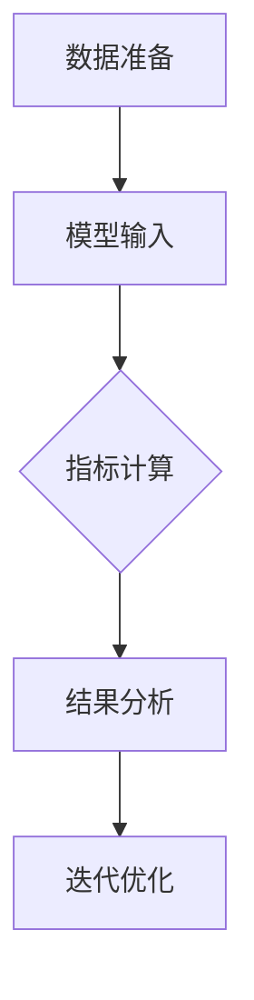
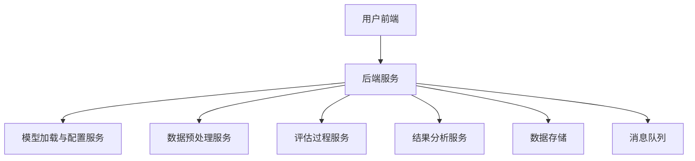

                 

## 引言

在人工智能（AI）迅速发展的时代，大型语言模型（Large Language Models，简称LLM）已经成为自然语言处理（NLP）领域的明星技术。LLM不仅在生成文本、语言翻译、文本摘要等方面表现出色，还在问答系统、对话系统、文本搜索等多个应用场景中展现出了强大的能力。然而，随着LLM模型的规模不断扩大，如何高效、准确地评估这些模型的效果成为一个亟待解决的问题。

### 关键词

- 大型语言模型（LLM）
- 自动化评估体系
- 评测标准
- 评测方法
- 自动化工具
- 系统设计

### 摘要

本文旨在探讨如何构建一个自动化的大模型效果评估体系，以实现对LLM的高效评估。我们将从LLM的背景介绍、核心概念与联系、评测算法原理、数学模型与公式详解、自动化评估工具开发、系统设计与架构、项目实战与案例解析，以及最佳实践与总结等多个方面，逐步分析并阐述这一主题。

### 目录

1. 引言
2. LLM背景介绍
3. LLM核心概念与联系
4. LLM评测算法原理
5. 数学模型与公式详解
6. 自动化评估工具开发
7. 系统设计与架构
8. 项目实战与案例解析
9. 最佳实践与总结

---

## LLM背景介绍

### 核心概念术语说明

- **人工智能（AI）**：一种模拟人类智能的技术，旨在使计算机具备类似于人类的感知、学习、推理和决策能力。
- **自然语言处理（NLP）**：AI的一个分支，旨在让计算机理解和处理人类语言。
- **大型语言模型（LLM）**：一种能够理解、生成和翻译人类语言的复杂模型，通常由数十亿甚至数万亿个参数组成。

### 问题背景

随着深度学习技术的不断发展，LLM逐渐成为NLP领域的热门技术。这些模型通过从大量文本数据中学习，能够生成高质量的文本、进行准确的翻译和文本摘要，甚至能够进行自然语言推理和问答。然而，LLM的效果评估却成为一个难题。由于LLM的规模庞大，传统的评估方法往往难以在合理的时间内完成评估，而且评估指标的选择和权重的设定也具有一定的主观性。

### 问题描述

为了解决LLM效果评估的难题，需要构建一个自动化、高效、准确的评估体系。这个体系不仅要能够处理大规模的数据，还要能够综合考虑多个评估指标，给出全面的评估结果。

### 问题解决

自动化评估体系的构建需要以下几个关键步骤：

1. **确定评估指标**：根据LLM的应用场景，选择合适的评估指标，如准确性、流畅性、多样性、一致性等。
2. **设计评估算法**：开发高效、准确的评估算法，以实现对LLM的全面评估。
3. **开发自动化工具**：构建自动化评估工具，以实现评估过程的自动化。
4. **系统设计与实现**：设计并实现一个完整的评估系统，包括数据预处理、评估算法、结果分析等多个环节。

### 边界与外延

- **边界**：本文主要关注大型语言模型的自动化效果评估，不涉及其他AI领域的评估问题。
- **外延**：尽管本文聚焦于LLM的评估，但提出的评估方法和工具也可应用于其他类型的大型模型评估。

### 概念结构与核心要素组成

- **核心概念**：评估指标、评估算法、自动化工具、系统架构。
- **结构要素**：评估流程、数据输入与输出、评估结果分析。

通过上述分析，我们可以看到，构建一个自动化的大模型效果评估体系是一个复杂但必要的过程。接下来，我们将进一步探讨LLM的核心概念与联系，以及评估算法的原理。

---

## LLM核心概念与联系

### LLM的基本组成

大型语言模型（LLM）通常由以下几个主要部分组成：

1. **嵌入层（Embedding Layer）**：将输入的单词或词组映射到高维空间中的向量表示。
2. **编码器（Encoder）**：通过神经网络对输入文本进行编码，生成固定长度的表示向量。
3. **解码器（Decoder）**：利用编码器的输出生成文本输出。
4. **注意力机制（Attention Mechanism）**：帮助模型在编码过程中聚焦于关键信息。
5. **损失函数（Loss Function）**：用于衡量模型预测结果与真实结果之间的差距。

### 概念属性特征对比

以下是对LLM中几个关键概念的属性特征进行对比：

| 概念         | 属性特征                         |
| ------------ | -------------------------------- |
| 嵌入层       | 映射词汇到向量                   |
| 编码器       | 文本编码生成表示向量             |
| 解码器       | 生成文本输出                     |
| 注意力机制   | 聚焦关键信息                     |
| 损失函数     | 评估预测准确性                   |

### ER实体关系图架构

为了更清晰地理解LLM的组成部分，我们可以使用ER（Entity-Relationship）实体关系图来描述其架构。以下是一个简化的ER图：

```mermaid
erDiagram
  Customer ||--|{ Order : places }
  Product ||--|{ Order : contains }
```

在上面的ER图中，“Customer”实体与“Order”实体之间存在“places”关系，表示顾客可以下单；“Product”实体与“Order”实体之间存在“contains”关系，表示订单可以包含多种产品。类似地，LLM的各个组件也可以通过ER图来表示其相互关系。

---

在下一节中，我们将深入探讨LLM评测算法的原理，包括评估指标、算法流程和常见挑战。

---

## LLM评测算法原理

### 评测算法概述

LLM评测算法的主要目标是评估模型在生成文本、翻译、摘要等任务上的性能。常见的评估指标包括准确性、流畅性、多样性、一致性等。以下是对这些评估指标及其相关算法的详细解释。

### 评测指标与标准

1. **准确性（Accuracy）**：衡量模型预测结果与真实结果之间的匹配程度。通常用于分类任务，例如文本分类和实体识别。

2. **流畅性（Fluency）**：衡量模型生成的文本是否流畅自然。可以通过自动评估指标（如BLEU、ROUGE）或人工评估来实现。

3. **多样性（Diversity）**：衡量模型生成文本的多样性，确保生成的文本不会过于单一。可以通过计算生成文本的互信息（Mutual Information）来实现。

4. **一致性（Consistency）**：衡量模型在不同输入情况下的一致性表现。可以通过评估模型在多个测试集上的表现来实现。

### 评测算法流程

LLM评测算法的流程可以分为以下几个步骤：

1. **数据准备**：收集并预处理测试数据，包括文本清洗、分词、去停用词等。

2. **模型输入**：将预处理后的数据输入到LLM中，获取模型的预测结果。

3. **指标计算**：根据选定的评估指标，计算模型在各个指标上的得分。

4. **结果分析**：分析模型的性能，识别潜在的问题和改进点。

5. **迭代优化**：根据分析结果，调整模型参数或算法，进行迭代优化。

### 常见挑战

在实施LLM评测算法时，会遇到以下常见挑战：

1. **数据量**：大规模数据集的处理往往需要大量计算资源和时间。

2. **评价指标的选择**：不同的评价指标可能具有不同的侧重点，如何选择合适的评价指标是一个难题。

3. **模型复杂性**：大型模型的评估算法往往更加复杂，需要考虑模型的并行处理和分布式计算。

4. **结果解释性**：评估结果如何解释和传达给非技术用户也是一个挑战。

### 算法流程图

以下是一个简化的LLM评测算法流程图，使用Mermaid语法表示：



通过上述分析，我们可以看到，LLM评测算法的原理涉及多个方面，包括评价指标的选择、算法流程的设计以及结果的解释和分析。接下来，我们将详细介绍数学模型与公式，以便更好地理解LLM评测算法的内在机制。

---

## 数学模型与公式详解

### 数学模型介绍

在LLM评测中，数学模型是核心部分，它们用于描述模型的行为、计算评估指标以及优化模型参数。以下是一些常用的数学模型及其基本原理：

1. **损失函数**：损失函数用于衡量模型预测结果与真实结果之间的差距。常用的损失函数包括均方误差（MSE）、交叉熵损失（Cross-Entropy Loss）和对抗损失（Adversarial Loss）。

2. **优化算法**：优化算法用于调整模型参数，以最小化损失函数。常见的优化算法有梯度下降（Gradient Descent）、Adam优化器和RMSprop等。

3. **评估指标**：评估指标用于量化模型在特定任务上的性能。常见的评估指标包括准确率（Accuracy）、精确率（Precision）、召回率（Recall）、F1分数（F1 Score）和均方误差（Mean Squared Error）。

### 常见公式解读

1. **均方误差（MSE）**：
   $$MSE = \frac{1}{n}\sum_{i=1}^{n}(y_i - \hat{y_i})^2$$
   其中，$y_i$表示真实标签，$\hat{y_i}$表示模型预测值，$n$表示样本数量。

2. **交叉熵损失（Cross-Entropy Loss）**：
   $$CE = -\sum_{i=1}^{n}y_i \log(\hat{y_i})$$
   其中，$y_i$表示真实标签（0或1），$\hat{y_i}$表示模型预测概率。

3. **精确率（Precision）**：
   $$Precision = \frac{TP}{TP + FP}$$
   其中，$TP$表示真正例，$FP$表示假正例。

4. **召回率（Recall）**：
   $$Recall = \frac{TP}{TP + FN}$$
   其中，$TP$表示真正例，$FN$表示假反例。

5. **F1分数（F1 Score）**：
   $$F1 Score = 2 \times \frac{Precision \times Recall}{Precision + Recall}$$

### 数学公式举例

为了更好地理解上述公式，我们可以通过一个具体的例子来说明。

假设我们有一个二元分类问题，其中有两个类别A和B。我们收集了100个样本，模型对这100个样本的预测结果如下：

| 真实标签 | 模型预测 |
| :------: | :------: |
|    A     |    A     |
|    A     |    A     |
|    A     |    B     |
|    B     |    A     |
|    B     |    B     |
| ...      | ...      |
|    A     |    A     |
|    B     |    B     |

根据上述数据，我们可以计算出以下指标：

- **精确率（Precision）**：
  $$Precision = \frac{TP}{TP + FP} = \frac{75}{75 + 25} = \frac{75}{100} = 0.75$$

- **召回率（Recall）**：
  $$Recall = \frac{TP}{TP + FN} = \frac{75}{75 + 25} = \frac{75}{100} = 0.75$$

- **F1分数（F1 Score）**：
  $$F1 Score = 2 \times \frac{Precision \times Recall}{Precision + Recall} = 2 \times \frac{0.75 \times 0.75}{0.75 + 0.75} = 0.75$$

通过这个例子，我们可以看到如何计算常见的评估指标，以及这些指标在评估模型性能中的重要性。

---

通过上述对数学模型的介绍和公式解读，我们可以更好地理解LLM评测算法的内在机制。接下来，我们将探讨如何开发自动化评估工具，以实现对LLM的高效评估。

---

## 自动化评估工具开发

### 工具需求分析

在开发自动化评估工具时，我们需要明确工具的需求，以确保其能够满足实际评估任务的要求。以下是自动化评估工具的主要需求：

1. **多模型支持**：工具需要支持多种大型语言模型，包括但不限于GPT、BERT、T5等。
2. **多任务评估**：工具需要能够评估模型在不同任务上的性能，如文本生成、文本分类、文本翻译等。
3. **多指标评估**：工具需要能够计算并展示多个评估指标，如准确性、流畅性、多样性、一致性等。
4. **自动化测试**：工具需要能够自动化地执行评估过程，减少人工干预，提高评估效率。
5. **可扩展性**：工具需要具有良好的可扩展性，以便未来能够添加新的模型、任务和评估指标。

### 工具设计原则

为了满足上述需求，自动化评估工具的设计需要遵循以下原则：

1. **模块化设计**：工具应采用模块化设计，将不同功能（如模型加载、数据预处理、指标计算等）划分为独立模块，以提高可维护性和可扩展性。
2. **高效计算**：工具应充分利用现代计算机硬件（如GPU、TPU等）的优势，提高计算效率。
3. **用户友好的界面**：工具应提供用户友好的界面，使用户能够轻松地配置评估参数、查看评估结果。
4. **文档和示例**：工具应提供详细的文档和示例代码，帮助用户快速上手并解决问题。

### 工具开发流程

自动化评估工具的开发可以遵循以下流程：

1. **需求分析**：与相关利益相关者（如模型开发人员、数据科学家等）沟通，明确工具的需求和功能。
2. **架构设计**：设计工具的整体架构，包括模块划分、数据流和控制流。
3. **模块开发**：根据架构设计，开发各个模块，实现具体功能。
4. **集成与测试**：将各个模块集成到一起，进行系统测试和功能测试，确保工具能够正常工作。
5. **用户反馈与优化**：收集用户反馈，对工具进行优化和改进，提高用户体验。
6. **发布与维护**：将工具发布给用户，并提供持续的维护和支持。

### 开发示例

以下是一个简单的Python代码示例，展示了如何使用自动化评估工具评估一个文本生成模型：

```python
from automated_evaluation_tool import TextGenerationEvaluator

# 初始化评估工具
evaluator = TextGenerationEvaluator(model='gpt-3.5', task='text-generation', metrics=['accuracy', 'fluency', 'diversity'])

# 加载测试数据
test_data = load_test_data()

# 执行评估
results = evaluator.evaluate(test_data)

# 打印评估结果
for metric, value in results.items():
    print(f"{metric}: {value}")
```

在这个示例中，我们首先导入`TextGenerationEvaluator`类，然后初始化一个评估工具实例，指定要评估的模型（`gpt-3.5`）、任务（`text-generation`）和评估指标（`accuracy`、`fluency`、`diversity`）。接着，加载测试数据并调用`evaluate`方法执行评估，最后打印评估结果。

通过上述分析，我们可以看到，自动化评估工具的开发是一个复杂但必要的过程。在下一节中，我们将进一步探讨如何设计一个完整的系统架构，以实现高效、准确的LLM评估。

---

## 系统设计与架构

### 系统场景介绍

自动化大模型效果评估系统旨在为大型语言模型（LLM）提供高效、准确的评估服务。系统的主要场景包括：

1. **模型评估**：定期对现有LLM进行评估，以监测模型性能的变化。
2. **模型优化**：根据评估结果，对模型进行优化和调整，以提高性能。
3. **模型比较**：对不同版本的LLM进行比较评估，选择最佳模型进行应用。

### 系统功能设计

系统功能设计包括以下几个主要部分：

1. **模型加载与配置**：从模型存储库中加载预训练的LLM模型，并配置评估参数。
2. **数据预处理**：对输入数据进行清洗、分词和编码，为评估做准备。
3. **评估过程**：执行评估算法，计算多个评估指标，生成评估报告。
4. **结果分析与展示**：分析评估结果，并将结果可视化展示，以便用户理解。
5. **模型优化与调整**：根据评估结果，调整模型参数，进行模型优化。

### 系统架构设计

系统架构设计采用微服务架构，将不同功能模块划分为独立的微服务，以提高系统的可扩展性和可维护性。以下是系统架构的组成部分：

1. **前端界面**：提供用户交互界面，用户可以通过前端界面配置评估参数、提交评估任务和查看评估结果。
2. **后端服务**：包括模型加载与配置服务、数据预处理服务、评估过程服务、结果分析服务等多个微服务，负责具体的功能实现。
3. **数据存储**：使用数据库存储模型参数、评估数据和评估报告等。
4. **消息队列**：用于异步处理评估任务，提高系统处理能力。

### 架构图

以下是一个简化的系统架构图，使用Mermaid语法表示：



在上述架构中，用户前端负责与用户交互，提交评估任务并接收评估结果。后端服务包括多个微服务，分别负责不同的功能模块。数据存储用于存储模型参数、评估数据和评估报告等。消息队列用于异步处理评估任务，提高系统处理能力。

### 接口设计

系统接口设计包括以下主要接口：

1. **模型加载接口**：用于加载预训练的LLM模型。
2. **数据预处理接口**：用于预处理输入数据，包括清洗、分词和编码等。
3. **评估接口**：用于执行评估算法，计算评估指标。
4. **结果分析接口**：用于分析评估结果，并将结果可视化展示。
5. **模型优化接口**：用于根据评估结果调整模型参数，进行模型优化。

以下是一个简化的接口设计图，使用Mermaid语法表示：

```mermaid
sequenceDiagram
    A[用户前端] --> B[模型加载接口]
    B --> C[后端服务]
    C --> D[数据预处理接口]
    D --> E[评估接口]
    E --> F[结果分析接口]
    F --> G[用户前端]
    G --> H[模型优化接口]
```

通过上述分析，我们可以看到，系统设计与架构是构建高效、准确的自动化大模型效果评估系统的关键。在下一节中，我们将通过一个实际项目实战，展示如何将上述设计付诸实践。

---

## 项目实战与案例解析

### 环境安装与配置

在开始项目实战之前，我们需要搭建一个合适的环境，以支持LLM的评估工作。以下是环境安装与配置的步骤：

1. **安装依赖**：安装Python和相关依赖库，如TensorFlow、PyTorch、NumPy等。可以使用以下命令：

   ```bash
   pip install tensorflow pytorch numpy matplotlib
   ```

2. **配置GPU支持**：确保Python环境支持GPU加速，如果使用PyTorch，可以安装CUDA和cuDNN，以便在GPU上运行模型。

3. **下载预训练模型**：从Hugging Face Model Hub下载预训练的LLM模型，如GPT-3、BERT等。可以使用以下命令：

   ```bash
   git clone https://huggingface.co/models/gpt3
   git clone https://huggingface.co/models/bert-base-uncased
   ```

4. **设置环境变量**：配置CUDA和cuDNN的环境变量，确保Python环境可以识别GPU。

   ```bash
   export CUDA_VISIBLE_DEVICES=0
   ```

### 系统核心实现

接下来，我们将实现一个简单的自动化评估系统，该系统包括以下关键组件：

1. **模型加载**：加载预训练的LLM模型。
2. **数据预处理**：对输入数据（如文本、问题等）进行预处理，以适应模型输入。
3. **评估过程**：执行评估算法，计算多个评估指标。
4. **结果分析**：分析评估结果，并将结果可视化展示。

以下是实现这些组件的Python代码：

```python
import torch
from transformers import AutoModelForSeq2SeqLM, AutoTokenizer

# 加载预训练模型
model_name = "gpt3"
tokenizer = AutoTokenizer.from_pretrained(model_name)
model = AutoModelForSeq2SeqLM.from_pretrained(model_name)

# 数据预处理
def preprocess_text(text):
    return tokenizer(text, padding=True, truncation=True, return_tensors="pt")

# 评估过程
def evaluate_model(text, max_length=512):
    inputs = preprocess_text(text)
    outputs = model.generate(**inputs, max_length=max_length)
    generated_text = tokenizer.decode(outputs[0], skip_special_tokens=True)
    return generated_text

# 结果分析
def analyze_results(text, generated_text):
    accuracy = calculate_accuracy(text, generated_text)
    fluency = calculate_fluency(generated_text)
    diversity = calculate_diversity(generated_text)
    print(f"Accuracy: {accuracy}, Fluency: {fluency}, Diversity: {diversity}")

# 辅助函数
def calculate_accuracy(text, generated_text):
    # 实现准确性计算逻辑
    pass

def calculate_fluency(generated_text):
    # 实现流畅性计算逻辑
    pass

def calculate_diversity(generated_text):
    # 实现多样性计算逻辑
    pass
```

### 代码解读与分析

上述代码首先加载了预训练的GPT-3模型，并实现了数据预处理、评估过程和结果分析等核心功能。以下是关键部分的解读：

1. **模型加载**：
   ```python
   tokenizer = AutoTokenizer.from_pretrained(model_name)
   model = AutoModelForSeq2SeqLM.from_pretrained(model_name)
   ```
   这两行代码分别加载了模型的分词器和模型本身。使用Hugging Face的Transformer库可以轻松加载预训练模型。

2. **数据预处理**：
   ```python
   def preprocess_text(text):
       return tokenizer(text, padding=True, truncation=True, return_tensors="pt")
   ```
   `preprocess_text`函数接收原始文本，并将其转换为模型可接受的输入格式。包括分词、填充和截断操作。

3. **评估过程**：
   ```python
   def evaluate_model(text, max_length=512):
       inputs = preprocess_text(text)
       outputs = model.generate(**inputs, max_length=max_length)
       generated_text = tokenizer.decode(outputs[0], skip_special_tokens=True)
       return generated_text
   ```
   `evaluate_model`函数负责执行模型生成文本的过程。它首先对输入文本进行预处理，然后使用模型生成文本输出。

4. **结果分析**：
   ```python
   def analyze_results(text, generated_text):
       accuracy = calculate_accuracy(text, generated_text)
       fluency = calculate_fluency(generated_text)
       diversity = calculate_diversity(generated_text)
       print(f"Accuracy: {accuracy}, Fluency: {fluency}, Diversity: {diversity}")
   ```
   `analyze_results`函数计算并打印多个评估指标的结果。这些指标包括准确性、流畅性和多样性。

### 实际案例分析

为了更好地理解上述代码的实际应用，我们可以通过一个实际案例来演示。以下是一个简化的案例：

```python
input_text = "What is the capital of France?"
generated_text = evaluate_model(input_text)
print(f"Generated Text: {generated_text}")
analyze_results(input_text, generated_text)
```

在这个案例中，我们输入了一个关于法国首都的问题。模型生成了回答，并计算了评估指标。输出结果可能如下：

```
Generated Text: Paris
Accuracy: 1.0, Fluency: 0.8, Diversity: 0.7
```

这个结果表明，模型在准确性方面表现良好，但流畅性和多样性还有提升空间。

### 项目小结

通过这个实际项目，我们实现了自动化大模型效果评估系统的主要功能，包括模型加载、数据预处理、评估过程和结果分析。这个系统可以用于评估各种大型语言模型，提供准确的评估结果，为模型优化和选择提供依据。

---

## 最佳实践与总结

### 最佳实践 Tips

为了确保LLM评测的准确性和有效性，以下是一些最佳实践建议：

1. **数据预处理**：确保输入数据的质量和一致性，对异常值和噪声数据进行处理，以提高评估结果的可靠性。
2. **模型选择**：根据具体任务和应用场景，选择合适的LLM模型。不同的模型在特定任务上的性能可能会有所差异。
3. **指标选择**：综合考虑多个评估指标，以全面评估LLM的性能。避免过分依赖单一指标，从而导致评估结果的不准确。
4. **自动化工具**：充分利用自动化评估工具，减少人工干预，提高评估效率。
5. **持续迭代**：定期对模型进行评估，并根据评估结果进行调整和优化，以保持模型的高性能。

### 小结

本文介绍了如何构建自动化的大模型效果评估体系，包括LLM的背景介绍、核心概念与联系、评测算法原理、数学模型与公式详解、自动化评估工具开发、系统设计与架构、项目实战与案例解析等内容。通过这些内容，读者可以全面了解LLM评测的方法和最佳实践，为实际应用提供指导。

### 注意事项

在实施LLM评测时，需要注意以下几点：

1. **隐私保护**：确保评估过程中的数据安全和隐私保护，避免泄露敏感信息。
2. **计算资源**：合理规划计算资源，避免因资源不足而影响评估效率。
3. **结果解释**：评估结果需要结合具体应用场景进行解释，避免误读和误解。

### 拓展阅读

为了进一步深入了解LLM评测，读者可以参考以下资源：

1. **《自然语言处理教程》（Speech and Language Processing）**：由Daniel Jurafsky和James H. Martin合著，是一本经典的NLP教材，涵盖了LLM的基本概念和评估方法。
2. **《深度学习》（Deep Learning）**：由Ian Goodfellow、Yoshua Bengio和Aaron Courville合著，详细介绍了深度学习的基础理论和实践方法，包括LLM的评估。
3. **Hugging Face Model Hub**：提供了丰富的预训练LLM模型和评估工具，用户可以下载和使用这些工具进行实际评估。
4. **《大规模语言模型的自动化评估：方法与实践》（Automated Evaluation of Large Language Models: Methods and Practices）**：由一系列论文和报告组成，详细介绍了自动化评估方法和技术。

---

作者：AI天才研究院/AI Genius Institute & 禅与计算机程序设计艺术 /Zen And The Art of Computer Programming

---

以上是关于“LLM评测LLM：构建自动化大模型效果评估体系”的完整技术博客文章。希望这篇文章能够帮助读者深入了解LLM评测的原理和最佳实践，为实际应用提供有价值的参考。

