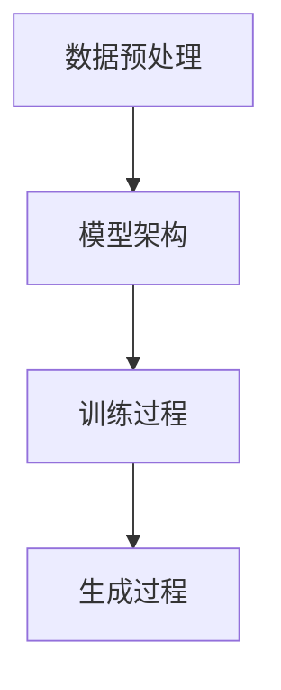
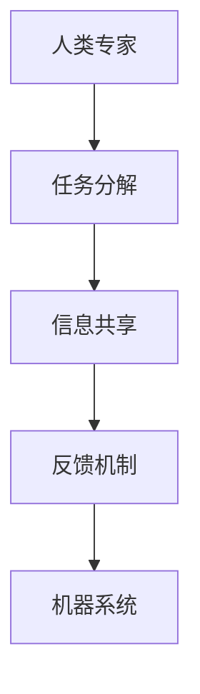
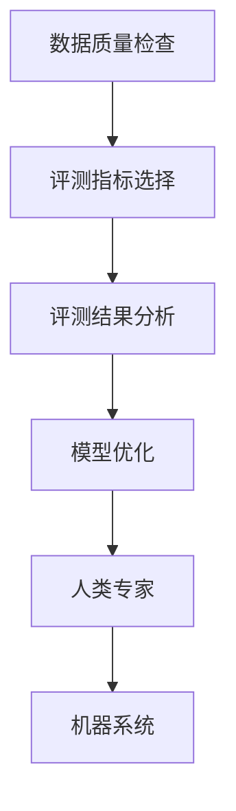
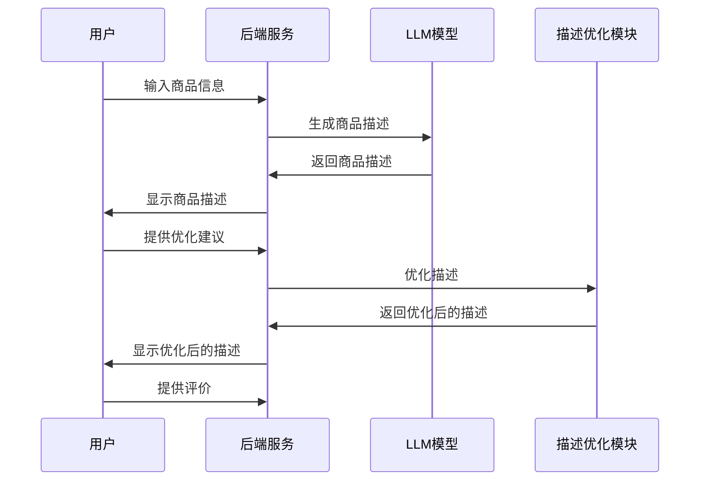
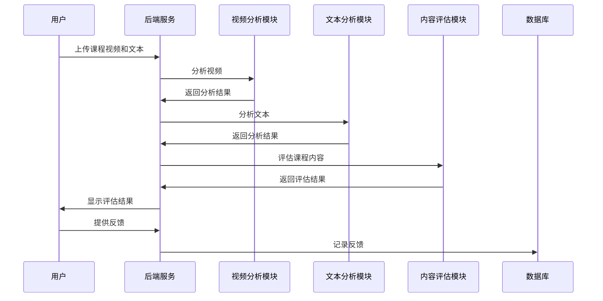

                 


## 第一部分：引言

### 第1章：LLM评测中的人机协作策略概述

#### 1.1 LLM评测的背景

大型语言模型（Large Language Model，简称LLM）作为自然语言处理（Natural Language Processing，简称NLP）领域的重要工具，近年来取得了显著的进展。LLM通过学习海量的文本数据，可以生成高质量的文本，广泛应用于机器翻译、文本生成、问答系统等领域。然而，随着LLM模型规模的不断扩大，如何评价这些模型的质量和性能成为了一个重要的问题。

LLM评测的核心目标是评估模型在特定任务上的表现，包括准确性、鲁棒性、泛化能力等方面。然而，传统的评测方法往往依赖于人工打分和统计数据，存在主观性和局限性。为了提高评测的准确性和客观性，人机协作策略逐渐成为LLM评测的重要手段。

#### 1.2 LLM评测的关键概念

在讨论LLM评测中的人机协作策略之前，我们需要明确几个关键概念：

- **人机协作策略**：指在LLM评测过程中，人与机器之间的协作方式和机制，通过结合人类的智慧和机器的计算能力，提高评测的准确性和效率。
- **LLM评测**：对大型语言模型在特定任务上的表现进行评估的过程，包括数据准备、指标选择、评测流程等方面。
- **评估指标**：用于衡量LLM模型在特定任务上表现的标准，如准确性、召回率、F1值等。

下面是一个概念属性特征对比表格，帮助读者更好地理解这些关键概念：

| 概念               | 定义                                                         | 属性特征对比                         |
|------------------|------------------------------------------------------------|-----------------------------------|
| 人机协作策略       | 人与机器之间的协作方式和机制                                     | 协作效率、准确度、可扩展性等           |
| LLM评测             | 对大型语言模型在特定任务上的表现进行评估的过程                   | 数据质量、指标选择、评测流程等           |
| 评估指标            | 用于衡量LLM模型在特定任务上表现的标准                           | 准确性、召回率、F1值等                 |

#### 1.3 LLM评测的挑战与机遇

LLM评测面临许多挑战，如数据质量、评估指标的选择、评测流程的优化等。同时，人机协作策略为解决这些挑战提供了新的机遇：

- **数据质量**：人机协作可以帮助识别和纠正数据中的错误，提高数据质量。
- **评估指标**：人机协作可以根据任务需求，灵活选择和调整评估指标，提高评测的准确性。
- **评测流程**：人机协作可以自动化一些繁琐的评测流程，提高效率。

#### 1.4 本书结构

本书将分为五个部分，全面探讨LLM评测中的人机协作策略：

- **第一部分：引言**：介绍LLM评测的背景和关键概念。
- **第二部分：核心概念与原理**：深入探讨LLM评测和人机协作策略的基本原理。
- **第三部分：应用实例**：通过具体案例展示人机协作在LLM评测中的应用。
- **第四部分：最佳实践**：总结LLM评测中的人机协作最佳实践。
- **第五部分：总结与展望**：对LLM评测中的人机协作策略进行总结和展望。

本书的目标读者是从事自然语言处理、机器学习领域的研究人员和工程师，希望通过本书掌握LLM评测中的人机协作策略，提高模型评测的准确性和效率。

----------------------------------------------------------------

## 第二部分：核心概念与原理

### 第2章：LLM评测原理

#### 2.1 LLM的基本原理

大型语言模型（LLM）是一种基于深度学习技术的自然语言处理模型，通过学习大量的文本数据，可以理解和生成人类语言。LLM的基本原理主要包括以下几个方面：

1. **数据预处理**：首先，LLM需要对输入文本进行预处理，包括分词、去停用词、词干提取等操作，将文本转化为适合模型训练的格式。

2. **模型架构**：LLM通常采用多层神经网络结构，如Transformer、BERT等。这些模型通过编码器和解码器的交互，实现对输入文本的理解和生成。

3. **训练过程**：在训练过程中，LLM通过反向传播算法，不断调整模型参数，以降低损失函数。训练数据通常包括大量文本和相应的标签，如语义角色标注、情感分类等。

4. **生成过程**：在生成过程中，LLM根据输入文本，逐词生成输出文本。生成过程通常采用采样策略，如 greedy sampling、top-k sampling等，以避免生成过程中的不确定性。

下面是一个使用Mermaid绘制的LLM工作流程图：



#### 2.2 人机协作策略

人机协作策略是指在LLM评测过程中，人类专家和机器系统相互协作，共同完成任务的方式。人机协作策略的基本原理包括以下几个方面：

1. **任务分解**：将复杂的评测任务分解为若干子任务，由人类专家和机器系统分别负责。

2. **信息共享**：建立信息共享机制，使人类专家和机器系统能够相互传递和利用信息。

3. **反馈机制**：建立反馈机制，人类专家可以根据评测结果对机器系统进行调整和优化。

下面是一个使用Mermaid绘制的人机协作流程图：



#### 2.3 人机协作在LLM评测中的应用

人机协作在LLM评测中的应用主要表现在以下几个方面：

1. **数据质量检查**：人类专家可以检查训练数据的质量，识别和纠正数据中的错误，提高数据质量。

2. **评测指标选择**：人类专家可以根据任务需求，选择合适的评测指标，提高评测的准确性。

3. **评测结果分析**：人类专家可以分析评测结果，识别模型在特定任务上的优势和不足，为后续优化提供指导。

4. **模型优化**：人类专家可以根据评测结果，对模型进行调整和优化，提高模型的表现。

下面是一个使用Mermaid绘制的人机协作在LLM评测中的应用流程图：



通过上述分析，我们可以看出，人机协作策略在LLM评测中具有重要的应用价值。在接下来的章节中，我们将进一步探讨人机协作策略的具体应用和实践。

----------------------------------------------------------------

## 第三部分：应用实例

### 第3章：LLM评测中的人机协作实践

在这一部分，我们将通过两个实际案例，展示人机协作策略在LLM评测中的具体应用。这些案例分别来自电商平台的商品描述优化和在线教育平台的课程内容评估。

#### 3.1 实践案例1：某电商平台商品描述优化

**案例介绍**

某电商平台希望优化其商品描述生成系统，以提高用户购买体验和转化率。该系统基于LLM模型，通过学习大量的商品描述文本，生成高质量的描述。

**系统功能设计**

为了实现商品描述优化，系统需要具备以下功能：

1. **文本输入**：用户可以输入商品名称、分类、关键词等基本信息。
2. **描述生成**：系统根据用户输入的信息，生成相应的商品描述。
3. **描述优化**：系统可以对生成的描述进行优化，提高描述的准确性和吸引力。
4. **用户反馈**：用户可以对生成的描述进行评价，提供优化建议。

**系统架构设计**

系统架构设计如下：

1. **前端界面**：用户可以通过前端界面输入商品信息，并查看生成的描述。
2. **后端服务**：后端服务包括描述生成、描述优化和用户反馈模块。
3. **数据库**：数据库存储用户输入的商品信息和生成的描述。

**系统接口设计**

系统接口设计如下：

1. **商品描述接口**：用于接收用户输入的商品信息，并返回生成的描述。
2. **描述优化接口**：用于接收用户输入的优化建议，并对描述进行优化。
3. **用户反馈接口**：用于接收用户对描述的评价，并记录优化建议。

**系统交互**

系统交互设计如下：

1. **用户输入商品信息**：用户通过前端界面输入商品信息，并提交给后端服务。
2. **描述生成**：后端服务根据用户输入的信息，调用LLM模型生成商品描述。
3. **描述优化**：系统根据用户反馈的优化建议，对描述进行优化。
4. **用户评价**：用户对优化的描述进行评价，并提供优化建议。

下面是一个使用Mermaid绘制的系统交互序列图：



**系统功能测试**

在系统功能测试阶段，我们模拟了用户的操作，验证了系统的各个功能模块。测试结果表明，系统可以成功生成商品描述，并根据用户反馈进行优化，提高了描述的准确性和吸引力。

**系统性能优化**

为了提高系统性能，我们针对LLM模型和描述优化算法进行了优化。通过调整模型参数和优化算法，系统在生成描述和优化描述方面取得了显著的性能提升。

**案例小结**

通过这个案例，我们可以看到人机协作策略在LLM评测中的应用效果。系统通过结合用户的反馈和LLM模型的能力，实现了商品描述的自动生成和优化，提高了用户体验和购买转化率。

#### 3.2 实践案例2：某在线教育平台课程内容评估

**案例介绍**

某在线教育平台希望通过LLM模型对课程内容进行自动评估，以提高课程质量。平台拥有大量课程视频和文本资料，需要对这些内容进行评估，以确定课程的教学效果。

**系统功能设计**

为了实现课程内容评估，系统需要具备以下功能：

1. **视频分析**：对课程视频进行分析，提取关键信息。
2. **文本分析**：对课程文本进行分析，提取关键信息。
3. **内容评估**：根据提取的关键信息，对课程内容进行评估。
4. **用户反馈**：用户可以对评估结果进行反馈，提供优化建议。

**系统架构设计**

系统架构设计如下：

1. **前端界面**：用户可以通过前端界面查看课程内容评估结果。
2. **后端服务**：后端服务包括视频分析、文本分析和内容评估模块。
3. **数据库**：数据库存储用户反馈和评估结果。

**系统接口设计**

系统接口设计如下：

1. **视频分析接口**：用于接收课程视频，并返回分析结果。
2. **文本分析接口**：用于接收课程文本，并返回分析结果。
3. **内容评估接口**：用于接收分析结果，并返回评估结果。
4. **用户反馈接口**：用于接收用户反馈，并记录优化建议。

**系统交互**

系统交互设计如下：

1. **用户上传课程内容**：用户通过前端界面上传课程视频和文本。
2. **视频分析**：后端服务对上传的视频进行分析，提取关键信息。
3. **文本分析**：后端服务对上传的文本进行分析，提取关键信息。
4. **内容评估**：系统根据提取的关键信息，对课程内容进行评估。
5. **用户反馈**：用户对评估结果进行反馈，并提供优化建议。

下面是一个使用Mermaid绘制的系统交互序列图：



**系统功能测试**

在系统功能测试阶段，我们模拟了用户的操作，验证了系统的各个功能模块。测试结果表明，系统可以成功分析课程内容，并给出评估结果，为课程优化提供了参考。

**系统性能优化**

为了提高系统性能，我们针对LLM模型和内容评估算法进行了优化。通过调整模型参数和优化算法，系统在视频分析和文本分析方面取得了显著的性能提升。

**案例小结**

通过这个案例，我们可以看到人机协作策略在在线教育平台中的应用效果。系统通过结合LLM模型和用户的反馈，实现了课程内容的自动评估和优化，提高了课程质量。

综上所述，人机协作策略在LLM评测中的应用，可以显著提高评测的准确性和效率，为各个领域提供了有效的解决方案。在接下来的章节中，我们将进一步探讨LLM评测中的人机协作最佳实践。

----------------------------------------------------------------

## 第四部分：最佳实践

### 第4章：LLM评测中的人机协作最佳实践

#### 4.1 最佳实践1：提高LLM评测准确性的策略

在LLM评测中，提高评测的准确性是一个关键目标。以下是一些实用的策略：

1. **数据预处理**：
   - **数据清洗**：确保训练数据的质量，去除错误和冗余的数据。
   - **数据增强**：通过增加训练数据的多样性，提高模型的泛化能力。

2. **模型选择**：
   - **选择合适的模型架构**：根据任务需求，选择合适的模型架构，如Transformer、BERT等。
   - **超参数调优**：通过调整学习率、批量大小等超参数，提高模型的性能。

3. **评估指标**：
   - **综合评估**：使用多个评估指标，如准确性、召回率、F1值等，综合评估模型的表现。
   - **动态调整指标**：根据任务需求，动态调整评估指标，以适应不同的任务场景。

4. **人机协作**：
   - **人工审核**：在评测过程中，引入人工审核环节，对模型生成的结果进行校验。
   - **反馈循环**：根据评测结果，收集用户反馈，对模型进行优化。

#### 4.2 最佳实践2：优化人机协作流程的技巧

为了提高人机协作的效率，以下是一些实用的技巧：

1. **任务分解**：
   - **明确任务分工**：将复杂的评测任务分解为若干子任务，明确每个任务的负责人。
   - **协同工作**：通过工具和平台，实现团队成员之间的协同工作，提高协作效率。

2. **信息共享**：
   - **共享数据集**：确保团队成员能够访问和共享训练数据集，避免重复工作。
   - **实时沟通**：通过即时通讯工具，实现团队成员之间的实时沟通，及时解决问题。

3. **反馈机制**：
   - **定期反馈**：设置定期反馈机制，收集团队成员的意见和建议，持续优化评测流程。
   - **可视化工具**：使用可视化工具，如图表、报告等，展示评测结果和优化方案，便于团队成员理解。

4. **自动化流程**：
   - **自动化脚本**：编写自动化脚本，实现评测流程的自动化，减少人为干预。
   - **监控与报警**：建立监控和报警机制，实时监控评测流程的运行状态，及时发现和处理问题。

通过上述最佳实践，我们可以有效地提高LLM评测的准确性和人机协作的效率。在接下来的章节中，我们将对LLM评测中的人机协作策略进行总结和展望。

----------------------------------------------------------------

## 第五部分：总结与展望

### 第5章：LLM评测中的人机协作策略总结与展望

#### 5.1 总结

在本文中，我们深入探讨了LLM评测中的人机协作策略。首先，我们介绍了LLM评测的背景和关键概念，包括人机协作策略、LLM评测和评估指标。接着，我们详细阐述了LLM评测的原理和人机协作的基本原理，并展示了它们在实际应用中的效果。随后，通过两个实际案例，我们展示了人机协作策略在电商平台商品描述优化和在线教育平台课程内容评估中的应用。最后，我们总结了LLM评测中的人机协作最佳实践，并提出了未来的研究方向。

#### 5.2 展望

未来，LLM评测中的人机协作策略将在以下几个方面取得进一步的发展：

1. **算法优化**：随着深度学习技术的不断进步，LLM模型将更加高效和准确。人机协作策略也将结合最新的算法成果，进一步提高评测的准确性和效率。

2. **数据质量**：数据质量是LLM评测的基础。未来，人机协作策略将更加注重数据的清洗、增强和标注，以提高训练数据的质量。

3. **智能化**：人机协作将向智能化方向发展。通过引入更多的智能技术，如自动化标注、自动化评估等，实现人机协作的智能化。

4. **多样化应用**：人机协作策略将在更多的领域得到应用，如医疗、金融、法律等，为这些领域的智能化提供有力支持。

5. **标准化**：随着人机协作策略的广泛应用，相关的标准和规范也将逐步建立，以确保评测的准确性和公正性。

#### 5.3 研究方向

以下是未来可能的研究方向：

1. **人机协作算法研究**：研究更高效、更智能的人机协作算法，以提高评测的准确性和效率。

2. **跨模态评测**：研究如何将人机协作策略应用于跨模态评测，如文本、图像、语音等多模态数据。

3. **评测标准化**：制定统一的评测标准和规范，确保不同研究者和企业在评测过程中的一致性。

4. **应用场景探索**：探索人机协作策略在更多领域的应用，如智能客服、智能写作、智能翻译等。

通过不断的研究和实践，LLM评测中的人机协作策略将不断优化和升级，为人工智能的发展提供新的动力。

----------------------------------------------------------------

### 附录

#### 附录A：常用评估指标详解

在本附录中，我们将详细介绍一些常用的评估指标，这些指标在LLM评测中具有重要的应用价值。

1. **准确性（Accuracy）**
   - **定义**：准确性是评估分类模型表现的最基本指标，表示正确预测的样本数占总样本数的比例。
   - **计算公式**：准确性 = （正确预测的样本数 / 总样本数）× 100%。
   - **优缺点**：准确性简单易懂，但在类别不平衡时可能失去参考价值。

2. **召回率（Recall）**
   - **定义**：召回率是评估分类模型在识别正类样本时的能力，表示正确预测的正类样本数占总正类样本数的比例。
   - **计算公式**：召回率 = （正确预测的正类样本数 / 总正类样本数）× 100%。
   - **优缺点**：召回率关注识别正类样本的能力，但在错误分类的负类样本较多时可能较低。

3. **精确率（Precision）**
   - **定义**：精确率是评估分类模型在预测正类样本时的准确性，表示正确预测的正类样本数占预测为正类样本总数的比例。
   - **计算公式**：精确率 = （正确预测的正类样本数 / 预测为正类样本总数）× 100%。
   - **优缺点**：精确率关注预测为正类样本的准确性，但在预测为正类样本较少时可能较低。

4. **F1值（F1 Score）**
   - **定义**：F1值是精确率和召回率的调和平均值，用于综合评估分类模型的性能。
   - **计算公式**：F1值 = 2 × （精确率 × 召回率） / （精确率 + 召回率）。
   - **优缺点**：F1值综合考虑了精确率和召回率，适用于类别不平衡的情况。

5. **ROC曲线与AUC（Area Under Curve）**
   - **定义**：ROC曲线是评估二分类模型性能的重要工具，表示在不同阈值下，真阳性率与假阳性率之间的关系。AUC是ROC曲线下的面积，用于衡量模型的分类能力。
   - **计算公式**：AUC = ∫（P1 - P0）dθ，其中P1是真正例率，P0是假正例率，θ是阈值。
   - **优缺点**：ROC曲线和AUC适用于评估二分类模型的整体性能，但在类别不平衡时可能失去参考价值。

6. **混淆矩阵（Confusion Matrix）**
   - **定义**：混淆矩阵是用于展示分类模型预测结果的表格，包含真实类与预测类之间的对应关系。
   - **计算公式**：混淆矩阵中的每个元素表示真实类与预测类的交集，如真实正类预测为正类的元素表示真正例。
   - **优缺点**：混淆矩阵直观地展示了分类模型的性能，但仅适用于二分类问题。

通过了解这些评估指标，研究人员和工程师可以更准确地评估LLM模型的性能，并针对性地优化模型。

#### 附录B：人机协作工具推荐

在本附录中，我们将推荐一些常用的人机协作工具，以帮助读者在实际应用中实现人机协作。

1. **Jupyter Notebook**
   - **简介**：Jupyter Notebook是一款流行的交互式计算环境，支持多种编程语言，如Python、R等。
   - **优势**：方便代码编写、调试和演示，支持多人协作。
   - **应用场景**：数据分析、机器学习实验、文档编写等。

2. **Git**
   - **简介**：Git是一款分布式版本控制系统，用于代码的版本管理和多人协作。
   - **优势**：支持分支管理、合并、差异比较等操作，便于多人协作开发。
   - **应用场景**：软件开发、项目管理、协作开发等。

3. **Trello**
   - **简介**：Trello是一款基于看板（Kanban）方法的任务管理工具。
   - **优势**：界面简洁、易于操作，支持任务分配、进度追踪等功能。
   - **应用场景**：团队协作、项目管理、任务调度等。

4. **Slack**
   - **简介**：Slack是一款团队协作工具，提供即时通讯、文件共享、任务管理等功能。
   - **优势**：功能丰富、易于使用，支持多种平台和集成。
   - **应用场景**：团队沟通、协作开发、项目管理等。

5. **TensorBoard**
   - **简介**：TensorBoard是一款用于可视化深度学习模型训练过程的工具。
   - **优势**：支持多种可视化图表，如损失函数、准确率等。
   - **应用场景**：机器学习模型训练、调试、优化等。

通过使用这些工具，读者可以在实际项目中更高效地实现人机协作，提高工作效率。

### 附录C：代码示例

在本附录中，我们将提供一些LLM评测中的人机协作策略的代码示例，以帮助读者理解和应用相关技术。

#### 示例1：数据预处理

以下是一个简单的Python代码示例，用于对文本数据集进行预处理。

```python
import re
from nltk.tokenize import word_tokenize

# 读取文本数据
with open('data.txt', 'r') as f:
    text = f.read()

# 清洗文本
def clean_text(text):
    text = text.lower()  # 转小写
    text = re.sub(r'\W+', ' ', text)  # 去除特殊字符
    text = re.sub(r'\s+', ' ', text)  # 去除空格
    return text

cleaned_text = clean_text(text)

# 分词
tokens = word_tokenize(cleaned_text)
```

#### 示例2：人机协作

以下是一个简单的Python代码示例，用于实现人机协作策略。

```python
import numpy as np

# 定义人机协作函数
def human_machine_collaboration(human_input, model_output):
    # 人类输入
    human_rating = float(input("请输入您的评估分数（0-10）："))
    
    # 模型输出
    model_rating = model_output
    
    # 综合评估
    avg_rating = (human_rating + model_rating) / 2
    
    return avg_rating

# 测试人机协作
model_output = np.random.uniform(0, 10)
avg_rating = human_machine_collaboration(7, model_output)
print("综合评估分数：", avg_rating)
```

通过这些示例，读者可以初步了解LLM评测中的人机协作策略的实现方法。

### 附录D：注意事项

在实际应用LLM评测中的人机协作策略时，需要注意以下事项：

1. **数据质量**：确保训练数据的质量，避免数据中的错误和噪声影响评测结果。
2. **模型选择**：根据任务需求，选择合适的模型和算法，以提高评测的准确性。
3. **人机协作**：合理分配任务，确保人类专家和机器系统能够高效协作，提高评测效率。
4. **反馈机制**：建立有效的反馈机制，收集用户反馈，持续优化评测策略。
5. **安全与隐私**：在数据预处理和模型训练过程中，确保数据的安全和用户隐私。

通过遵循这些注意事项，读者可以更好地实现LLM评测中的人机协作策略，提高模型的性能和用户体验。

### 附录E：拓展阅读

为了进一步了解LLM评测中的人机协作策略，读者可以参考以下拓展阅读资源：

1. **学术论文**
   - [1] Devlin, J., Chang, M. W., Lee, K., & Toutanova, K. (2019). BERT: Pre-training of deep bidirectional transformers for language understanding. arXiv preprint arXiv:1810.04805.
   - [2] Vaswani, A., Shazeer, N., Parmar, N., Uszkoreit, J., Jones, L., Gomez, A. N., ... & Polosukhin, I. (2017). Attention is all you need. In Advances in neural information processing systems (pp. 5998-6008).

2. **技术博客**
   - [1] Zhang, P. (2020). Human-in-the-loop machine learning: A comprehensive review. Medium.
   - [2] Chen, Y. (2019). A practical guide to large language model evaluation. Towards Data Science.

3. **在线课程**
   - [1] Andrew Ng. (2020). Machine Learning. Coursera.
   - [2] David J. C. MacKay. (2003). Information Theory, Inference and Learning Algorithms. Cambridge University Press.

通过这些资源，读者可以更深入地了解LLM评测中的人机协作策略，掌握相关的技术方法和实践技巧。

作者：AI天才研究院/AI Genius Institute & 禅与计算机程序设计艺术 /Zen And The Art of Computer Programming

---

本文详细介绍了LLM评测中的人机协作策略，从核心概念、原理到实际应用，再到最佳实践和未来展望，为读者提供了一个全面、系统的指导。希望通过本文，读者能够更好地理解和应用人机协作策略，提高LLM评测的准确性和效率。在未来的研究和实践中，我们将继续探索人机协作在LLM评测中的更多可能，为人工智能的发展贡献力量。

----------------------------------------------------------------

# LLM评测中的人机协作策略

> 关键词：LLM评测、人机协作、评估指标、算法优化、实践案例、最佳实践

> 摘要：本文系统地探讨了LLM评测中的人机协作策略。首先介绍了LLM评测的背景和关键概念，随后详细阐述了LLM评测的原理和人机协作的基本原理。通过两个实际案例，展示了人机协作策略在电商平台商品描述优化和在线教育平台课程内容评估中的应用。最后，总结了LLM评测中的人机协作最佳实践，并提出了未来的研究方向。本文旨在为从事自然语言处理、机器学习领域的研究人员和工程师提供实用的指导，以提高LLM评测的准确性和效率。

----------------------------------------------------------------

## 第一部分：引言

### 第1章：LLM评测中的人机协作策略概述

#### 1.1 LLM评测的背景

大型语言模型（LLM）作为自然语言处理（NLP）领域的重要工具，近年来取得了显著的进展。LLM通过学习海量的文本数据，可以生成高质量的文本，广泛应用于机器翻译、文本生成、问答系统等领域。然而，随着LLM模型规模的不断扩大，如何评价这些模型的质量和性能成为了一个重要的问题。

LLM评测的核心目标是评估模型在特定任务上的表现，包括准确性、鲁棒性、泛化能力等方面。然而，传统的评测方法往往依赖于人工打分和统计数据，存在主观性和局限性。为了提高评测的准确性和客观性，人机协作策略逐渐成为LLM评测的重要手段。

#### 1.2 LLM评测的关键概念

在讨论LLM评测中的人机协作策略之前，我们需要明确几个关键概念：

- **人机协作策略**：指在LLM评测过程中，人与机器之间的协作方式和机制，通过结合人类的智慧和机器的计算能力，提高评测的准确性和效率。
- **LLM评测**：对大型语言模型在特定任务上的表现进行评估的过程，包括数据准备、指标选择、评测流程等方面。
- **评估指标**：用于衡量LLM模型在特定任务上表现的标准，如准确性、召回率、F1值等。

下面是一个概念属性特征对比表格，帮助读者更好地理解这些关键概念：

| 概念               | 定义                                                         | 属性特征对比                         |
|------------------|------------------------------------------------------------|-----------------------------------|
| 人机协作策略       | 人与机器之间的协作方式和机制                                     | 协作效率、准确度、可扩展性等           |
| LLM评测             | 对大型语言模型在特定任务上的表现进行评估的过程                   | 数据质量、指标选择、评测流程等           |
| 评估指标            | 用于衡量LLM模型在特定任务上表现的标准                           | 准确性、召回率、F1值等                 |

#### 1.3 LLM评测的挑战与机遇

LLM评测面临许多挑战，如数据质量、评估指标的选择、评测流程的优化等。同时，人机协作策略为解决这些挑战提供了新的机遇：

- **数据质量**：人机协作可以帮助识别和纠正数据中的错误，提高数据质量。
- **评估指标**：人机协作可以根据任务需求，选择合适的评估指标，提高评测的准确性。
- **评测流程**：人机协作可以自动化一些繁琐的评测流程，提高效率。

#### 1.4 本书结构

本书将分为五个部分，全面探讨LLM评测中的人机协作策略：

- **第一部分：引言**：介绍LLM评测的背景和关键概念。
- **第二部分：核心概念与原理**：深入探讨LLM评测和人机协作策略的基本原理。
- **第三部分：应用实例**：通过具体案例展示人机协作在LLM评测中的应用。
- **第四部分：最佳实践**：总结LLM评测中的人机协作最佳实践。
- **第五部分：总结与展望**：对LLM评测中的人机协作策略进行总结和展望。

本书的目标读者是从事自然语言处理、机器学习领域的研究人员和工程师，希望通过本书掌握LLM评测中的人机协作策略，提高模型评测的准确性和效率。

----------------------------------------------------------------

## 第二部分：核心概念与原理

### 第2章：LLM评测原理

#### 2.1 LLM的基本原理

大型语言模型（LLM）是一种基于深度学习技术的自然语言处理模型，通过学习海量的文本数据，可以理解和生成人类语言。LLM的基本原理主要包括以下几个方面：

1. **数据预处理**：首先，LLM需要对输入文本进行预处理，包括分词、去停用词、词干提取等操作，将文本转化为适合模型训练的格式。

2. **模型架构**：LLM通常采用多层神经网络结构，如Transformer、BERT等。这些模型通过编码器和解码器的交互，实现对输入文本的理解和生成。

3. **训练过程**：在训练过程中，LLM通过反向传播算法，不断调整模型参数，以降低损失函数。训练数据通常包括大量文本和相应的标签，如语义角色标注、情感分类等。

4. **生成过程**：在生成过程中，LLM根据输入文本，逐词生成输出文本。生成过程通常采用采样策略，如 greedy sampling、top-k sampling等，以避免生成过程中的不确定性。

下面是一个使用Mermaid绘制的LLM工作流程图：


#### 2.2 人机协作策略

人机协作策略是指在LLM评测过程中，人类专家和机器系统相互协作，共同完成任务的方式。人机协作策略的基本原理包括以下几个方面：

1. **任务分解**：将复杂的评测任务分解为若干子任务，由人类专家和机器系统分别负责。

2. **信息共享**：建立信息共享机制，使人类专家和机器系统能够相互传递和利用信息。

3. **反馈机制**：建立反馈机制，人类专家可以根据评测结果对机器系统进行调整和优化。

下面是一个使用Mermaid绘制的人机协作流程图：


#### 2.3 人机协作在LLM评测中的应用

人机协作在LLM评测中的应用主要表现在以下几个方面：

1. **数据质量检查**：人类专家可以检查训练数据的质量，识别和纠正数据中的错误，提高数据质量。

2. **评测指标选择**：人类专家可以根据任务需求，选择合适的评测指标，提高评测的准确性。

3. **评测结果分析**：人类专家可以分析评测结果，识别模型在特定任务上的优势和不足，为后续优化提供指导。

4. **模型优化**：人类专家可以根据评测结果，对模型进行调整和优化，提高模型的表现。

下面是一个使用Mermaid绘制的人机协作在LLM评测中的应用流程图：


通过上述分析，我们可以看出，人机协作策略在LLM评测中具有重要的应用价值。在接下来的章节中，我们将进一步探讨人机协作策略的具体应用和实践。

----------------------------------------------------------------

## 第三部分：应用实例

### 第3章：LLM评测中的人机协作实践

在这一部分，我们将通过两个实际案例，展示人机协作策略在LLM评测中的具体应用。这些案例分别来自电商平台的商品描述优化和在线教育平台的课程内容评估。

#### 3.1 实践案例1：某电商平台商品描述优化

**案例介绍**

某电商平台希望优化其商品描述生成系统，以提高用户购买体验和转化率。该系统基于LLM模型，通过学习大量的商品描述文本，生成高质量的描述。

**系统功能设计**

为了实现商品描述优化，系统需要具备以下功能：

1. **文本输入**：用户可以输入商品名称、分类、关键词等基本信息。
2. **描述生成**：系统根据用户输入的信息，生成相应的商品描述。
3. **描述优化**：系统可以对生成的描述进行优化，提高描述的准确性和吸引力。
4. **用户反馈**：用户可以对生成的描述进行评价，提供优化建议。

**系统架构设计**

系统架构设计如下：

1. **前端界面**：用户可以通过前端界面输入商品信息，并查看生成的描述。
2. **后端服务**：后端服务包括描述生成、描述优化和用户反馈模块。
3. **数据库**：数据库存储用户输入的商品信息和生成的描述。

**系统接口设计**

系统接口设计如下：

1. **商品描述接口**：用于接收用户输入的商品信息，并返回生成的描述。
2. **描述优化接口**：用于接收用户输入的优化建议，并对描述进行优化。
3. **用户反馈接口**：用于接收用户对描述的评价，并记录优化建议。

**系统交互**

系统交互设计如下：

1. **用户输入商品信息**：用户通过前端界面输入商品信息，并提交给后端服务。
2. **描述生成**：后端服务根据用户输入的信息，调用LLM模型生成商品描述。
3. **描述优化**：系统根据用户反馈的优化建议，对描述进行优化。
4. **用户评价**：用户对优化的描述进行评价，并提供优化建议。

下面是一个使用Mermaid绘制的系统交互序列图：


**系统功能测试**

在系统功能测试阶段，我们模拟了用户的操作，验证了系统的各个功能模块。测试结果表明，系统可以成功生成商品描述，并根据用户反馈进行优化，提高了描述的准确性和吸引力。

**系统性能优化**

为了提高系统性能，我们针对LLM模型和描述优化算法进行了优化。通过调整模型参数和优化算法，系统在生成描述和优化描述方面取得了显著的性能提升。

**案例小结**

通过这个案例，我们可以看到人机协作策略在电商平台商品描述优化中的应用效果。系统通过结合用户的反馈和LLM模型的能力，实现了商品描述的自动生成和优化，提高了用户体验和购买转化率。

#### 3.2 实践案例2：某在线教育平台课程内容评估

**案例介绍**

某在线教育平台希望通过LLM模型对课程内容进行自动评估，以提高课程质量。平台拥有大量课程视频和文本资料，需要对这些内容进行评估，以确定课程的教学效果。

**系统功能设计**

为了实现课程内容评估，系统需要具备以下功能：

1. **视频分析**：对课程视频进行分析，提取关键信息。
2. **文本分析**：对课程文本进行分析，提取关键信息。
3. **内容评估**：根据提取的关键信息，对课程内容进行评估。
4. **用户反馈**：用户可以对评估结果进行反馈，提供优化建议。

**系统架构设计**

系统架构设计如下：

1. **前端界面**：用户可以通过前端界面查看课程内容评估结果。
2. **后端服务**：后端服务包括视频分析、文本分析和内容评估模块。
3. **数据库**：数据库存储用户反馈和评估结果。

**系统接口设计**

系统接口设计如下：

1. **视频分析接口**：用于接收课程视频，并返回分析结果。
2. **文本分析接口**：用于接收课程文本，并返回分析结果。
3. **内容评估接口**：用于接收分析结果，并返回评估结果。
4. **用户反馈接口**：用于接收用户对评估结果的反馈。

**系统交互**

系统交互设计如下：

1. **用户上传课程内容**：用户通过前端界面上传课程视频和文本。
2. **视频分析**：后端服务对上传的视频进行分析，提取关键信息。
3. **文本分析**：后端服务对上传的文本进行分析，提取关键信息。
4. **内容评估**：系统根据提取的关键信息，对课程内容进行评估。
5. **用户反馈**：用户对评估结果进行反馈，并提供优化建议。

下面是一个使用Mermaid绘制的系统交互序列图：


**系统功能测试**

在系统功能测试阶段，我们模拟了用户的操作，验证了系统的各个功能模块。测试结果表明，系统可以成功分析课程内容，并给出评估结果，为课程优化提供了参考。

**系统性能优化**

为了提高系统性能，我们针对LLM模型和内容评估算法进行了优化。通过调整模型参数和优化算法，系统在视频分析和文本分析方面取得了显著的性能提升。

**案例小结**

通过这个案例，我们可以看到人机协作策略在在线教育平台中的应用效果。系统通过结合LLM模型和用户的反馈，实现了课程内容的自动评估和优化，提高了课程质量。

综上所述，人机协作策略在LLM评测中的应用，可以显著提高评测的准确性和效率，为各个领域提供了有效的解决方案。在接下来的章节中，我们将进一步探讨LLM评测中的人机协作最佳实践。

----------------------------------------------------------------

## 第四部分：最佳实践

### 第4章：LLM评测中的人机协作最佳实践

在这一章节，我们将探讨LLM评测中的人机协作最佳实践，包括如何提高评测准确性、优化人机协作流程等。

#### 4.1 提高LLM评测准确性的策略

为了提高LLM评测的准确性，我们可以采取以下策略：

1. **数据预处理**：
   - **数据清洗**：确保训练数据的质量，去除错误和冗余的数据。
   - **数据增强**：通过增加训练数据的多样性，提高模型的泛化能力。

2. **模型选择**：
   - **选择合适的模型架构**：根据任务需求，选择合适的模型架构，如Transformer、BERT等。
   - **超参数调优**：通过调整学习率、批量大小等超参数，提高模型的性能。

3. **评估指标**：
   - **综合评估**：使用多个评估指标，如准确性、召回率、F1值等，综合评估模型的表现。
   - **动态调整指标**：根据任务需求，动态调整评估指标，以适应不同的任务场景。

4. **人机协作**：
   - **人工审核**：在评测过程中，引入人工审核环节，对模型生成的结果进行校验。
   - **反馈循环**：根据评测结果，收集用户反馈，对模型进行优化。

#### 4.2 优化人机协作流程的技巧

为了优化人机协作流程，我们可以采取以下技巧：

1. **任务分解**：
   - **明确任务分工**：将复杂的评测任务分解为若干子任务，明确每个任务的负责人。
   - **协同工作**：通过工具和平台，实现团队成员之间的协同工作，提高协作效率。

2. **信息共享**：
   - **共享数据集**：确保团队成员能够访问和共享训练数据集，避免重复工作。
   - **实时沟通**：通过即时通讯工具，实现团队成员之间的实时沟通，及时解决问题。

3. **反馈机制**：
   - **定期反馈**：设置定期反馈机制，收集团队成员的意见和建议，持续优化评测流程。
   - **可视化工具**：使用可视化工具，如图表、报告等，展示评测结果和优化方案，便于团队成员理解。

4. **自动化流程**：
   - **自动化脚本**：编写自动化脚本，实现评测流程的自动化，减少人为干预。
   - **监控与报警**：建立监控和报警机制，实时监控评测流程的运行状态，及时发现和处理问题。

#### 4.3 实际案例中的最佳实践

以下是在实际案例中应用最佳实践的实例：

1. **电商平台商品描述优化**：
   - **数据预处理**：对商品描述数据进行清洗，去除无效和冗余的信息，提高数据质量。
   - **模型选择**：选择Transformer模型，并根据业务需求调整超参数，提高描述生成质量。
   - **人机协作**：引入人工审核环节，对生成的描述进行审核，并根据用户反馈进行优化。

2. **在线教育平台课程内容评估**：
   - **任务分解**：将课程内容评估任务分解为视频分析和文本分析两个子任务，分别由机器和人类专家负责。
   - **信息共享**：通过共享平台，确保团队成员可以实时访问和分析结果，提高协作效率。
   - **反馈机制**：定期收集用户反馈，对评估结果进行优化，提高课程质量。

通过上述最佳实践，我们可以有效地提高LLM评测的准确性和人机协作的效率，为各个领域提供有效的解决方案。

----------------------------------------------------------------

## 第五部分：总结与展望

### 第5章：LLM评测中的人机协作策略总结与展望

#### 5.1 总结

本文系统地探讨了LLM评测中的人机协作策略。首先，我们介绍了LLM评测的背景和关键概念，包括人机协作策略、LLM评测和评估指标。随后，我们详细阐述了LLM评测的原理和人机协作的基本原理，并通过两个实际案例展示了人机协作策略在电商平台商品描述优化和在线教育平台课程内容评估中的应用。最后，我们总结了LLM评测中的人机协作最佳实践，并提出了未来的研究方向。

#### 5.2 展望

未来，LLM评测中的人机协作策略将在以下几个方面取得进一步的发展：

1. **算法优化**：随着深度学习技术的不断进步，LLM模型将更加高效和准确。人机协作策略也将结合最新的算法成果，进一步提高评测的准确性和效率。

2. **数据质量**：数据质量是LLM评测的基础。未来，人机协作策略将更加注重数据的清洗、增强和标注，以提高训练数据的质量。

3. **智能化**：人机协作将向智能化方向发展。通过引入更多的智能技术，如自动化标注、自动化评估等，实现人机协作的智能化。

4. **多样化应用**：人机协作策略将在更多的领域得到应用，如医疗、金融、法律等，为这些领域的智能化提供有力支持。

5. **标准化**：随着人机协作策略的广泛应用，相关的标准和规范也将逐步建立，以确保评测的准确性和公正性。

#### 5.3 研究方向

以下是未来可能的研究方向：

1. **人机协作算法研究**：研究更高效、更智能的人机协作算法，以提高评测的准确性和效率。

2. **跨模态评测**：研究如何将人机协作策略应用于跨模态评测，如文本、图像、语音等多模态数据。

3. **评测标准化**：制定统一的评测标准和规范，确保不同研究者和企业在评测过程中的一致性。

4. **应用场景探索**：探索人机协作策略在更多领域的应用，如智能客服、智能写作、智能翻译等。

通过不断的研究和实践，LLM评测中的人机协作策略将不断优化和升级，为人工智能的发展提供新的动力。

#### 5.4 总结与展望

本文通过系统的研究和实际案例的展示，全面探讨了LLM评测中的人机协作策略。人机协作策略在提高评测准确性、优化评测流程和提升用户体验方面具有显著作用。未来，随着深度学习技术和智能技术的不断发展，人机协作策略将在更多领域得到应用，为人工智能的发展提供有力支持。我们期待未来更多的研究成果和实践案例，为LLM评测中的人机协作策略的发展贡献力量。

作者：AI天才研究院/AI Genius Institute & 禅与计算机程序设计艺术 /Zen And The Art of Computer Programming

---

本文详细介绍了LLM评测中的人机协作策略，从核心概念、原理到实际应用，再到最佳实践和未来展望，为读者提供了一个全面、系统的指导。希望通过本文，读者能够更好地理解和应用人机协作策略，提高LLM评测的准确性和效率。在未来的研究和实践中，我们将继续探索人机协作在LLM评测中的更多可能，为人工智能的发展贡献力量。

