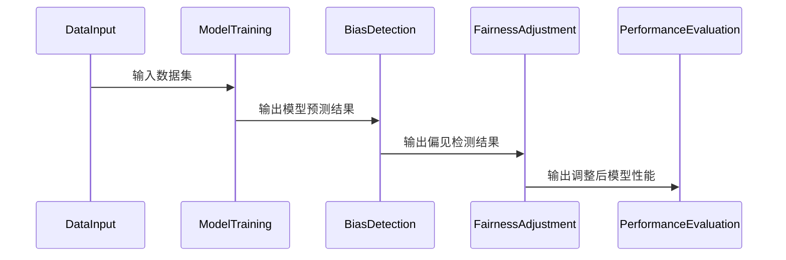

                 

 **文章标题**: LLM评测中的偏见检测与公平性保障

> 关键词：大型语言模型（LLM）、偏见检测、公平性保障、算法、数学模型、系统架构、项目实战、最佳实践

> 摘要：
本文旨在探讨在大型语言模型（LLM）评测过程中如何有效地检测和保障模型中的偏见问题。我们将从背景介绍、核心概念与联系、算法原理讲解、系统分析与设计、项目实战、最佳实践等方面逐步深入，旨在为从业者提供一套全面的技术解决方案和实用指南。

# 引言

## 背景介绍

近年来，随着深度学习技术的飞速发展，大型语言模型（LLM）如BERT、GPT等在自然语言处理（NLP）领域取得了令人瞩目的成果。这些模型在文本生成、机器翻译、情感分析等多个任务中表现出了强大的性能。然而，随之而来的是关于LLM偏见和公平性的广泛讨论。

偏见问题源于模型训练数据的局限性或偏差，可能导致模型在特定群体、性别、种族等方面的表现不公。公平性保障则要求模型在不同群体之间保持一致的性能，避免歧视。在LLM评测中，偏见检测与公平性保障是两个关键问题，直接关系到模型的应用场景和可信度。

## 问题重要性

LLM的广泛应用场景，如智能客服、教育辅助、招聘系统等，使得偏见检测与公平性保障成为不可忽视的重要问题。例如，一个存在性别偏见的客服机器人可能会在处理性别相关问题时给出不准确或不公平的回答。此外，模型偏见还可能导致数据不公，影响决策的公正性，进而对个体和社会造成负面影响。

因此，本文将围绕LLM评测中的偏见检测与公平性保障展开讨论，旨在为从业者提供一套系统的技术解决方案和实践指导。

# 核心概念与联系

## 核心概念

在LLM评测中，我们需要明确几个关键概念：大型语言模型（LLM）、偏见、公平性、偏见检测、公平性保障。

### 大型语言模型（LLM）

LLM是指使用深度学习技术训练的具有强大语言理解和生成能力的模型。这些模型通常包含数亿甚至数千亿的参数，能够处理复杂的自然语言任务。

### 偏见

偏见是指模型在特定群体、性别、种族等方面的表现不公。偏见可能源于训练数据的偏差或模型架构的不当设计。

### 公平性

公平性是指模型在不同群体之间保持一致的性能，避免歧视。公平性保障要求模型在不同背景的样本上表现均衡。

### 偏见检测

偏见检测是指通过算法和统计方法，识别模型中可能存在的偏见。

### 公平性保障

公平性保障是指通过算法调整和数据清洗等方法，确保模型在不同群体之间保持公平。

## 关系说明

这些核心概念之间存在紧密的联系。LLM的偏见问题可能导致公平性受损，而公平性保障的实现需要依赖偏见检测技术。偏见检测与公平性保障共同构成了LLM评测中的关键环节。

为了更直观地理解这些概念之间的关系，我们可以使用Mermaid ER图进行表示：

```mermaid
erDiagram
  LLM ||--o{ 偏见
  LLM ||--o{ 公平性
  偏见 ||--o{ 偏见检测
  公平性 ||--o{ 公平性保障
```

通过该ER图，我们可以清晰地看到各个概念之间的逻辑关系，为进一步讨论打下基础。

# 算法原理讲解

## 偏见检测算法

偏见检测是LLM评测中的关键步骤，常用的算法包括基于统计的方法和基于机器学习的方法。以下我们将分别介绍这些算法的基本原理。

### 基于统计的方法

基于统计的方法主要通过分析模型在特定群体上的性能差异来检测偏见。例如，我们可以计算模型在男女、老幼等不同群体上的准确率、召回率等指标，比较这些指标是否显著低于总体水平。以下是一个简化的流程：


使用Python代码实现：

```python
from sklearn.metrics import accuracy_score, recall_score

def detect_bias(data, labels, groups):
    biases = {}
    for group in groups:
        group_data = data[labels == group]
        pred = model.predict(group_data)
        acc = accuracy_score(group_data, pred)
        rec = recall_score(group_data, pred)
        biases[group] = (acc, rec)
    return biases
```

### 基于机器学习的方法

基于机器学习的方法则通过构建额外的分类模型来检测偏见。例如，我们可以训练一个二元分类器，判断样本是否来自受偏见群体。以下是一个简化的流程：


使用Python代码实现：

```python
from sklearn.model_selection import train_test_split
from sklearn.ensemble import RandomForestClassifier

def train_classification_model(data, labels, groups):
    X_train, X_test, y_train, y_test = train_test_split(data, labels, test_size=0.2)
    classifier = RandomForestClassifier()
    classifier.fit(X_train, y_train)
    pred = classifier.predict(X_test)
    return pred
```

## 公平性保障算法

公平性保障的目标是调整模型，使其在不同群体上表现一致。以下介绍几种常用的公平性保障算法。

### 边际公平算法

边际公平算法通过调整模型输出，使得不同群体上的边际损失相等。例如，我们可以计算模型在不同群体上的损失函数，然后调整输出，使得这些损失函数相等。以下是一个简化的流程：


使用Python代码实现：

```python
import torch
import torch.nn as nn

def marginal_fairness(model, data, labels, groups):
    criterion = nn.CrossEntropyLoss()
    losses = {}
    for group in groups:
        group_data = data[labels == group]
        pred = model.predict(group_data)
        loss = criterion(pred, group_data)
        losses[group] = loss
    avg_loss = sum(losses.values()) / len(losses)
    for group in groups:
        model.adjust_output(data[labels == group], losses[group], avg_loss)
    return model
```

### 加权公平算法

加权公平算法通过为不同群体分配不同的权重，使得整体损失最小。以下是一个简化的流程：


使用Python代码实现：

```python
def weighted_fairness(model, data, labels, groups, alpha=0.5):
    criterion = nn.CrossEntropyLoss()
    weights = {}
    for group in groups:
        group_data = data[labels == group]
        pred = model.predict(group_data)
        loss = criterion(pred, group_data)
        weights[group] = loss.item()
    total_loss = sum(weights.values())
    weighted_loss = total_loss * alpha
    model.optimize(weighted_loss)
    return model
```

## 数学模型和公式

偏见检测和公平性保障算法的数学模型和公式是实现这些算法的关键。以下我们简单介绍其中几个常用的公式。

### 偏见检测

假设我们有两个指标：准确率（Accuracy）和召回率（Recall），分别表示模型在正类和负类上的表现。

$$
Accuracy = \frac{TP + TN}{TP + TN + FP + FN}
$$

$$
Recall = \frac{TP}{TP + FN}
$$

通过计算这些指标在不同群体上的差异，可以检测出模型是否存在偏见。

### 公平性保障

边际公平算法的核心是使得不同群体上的损失函数相等。假设我们有多个群体，每个群体上的损失函数分别为 $L_1, L_2, \ldots, L_n$，目标是最小化这些损失函数的差异。

$$
\min \sum_{i=1}^n |L_i - L|
$$

其中，$L$ 为所有群体上损失函数的平均值。

加权公平算法则是通过为不同群体分配不同的权重，使得整体损失最小。

$$
\min \sum_{i=1}^n w_i L_i
$$

其中，$w_i$ 为第 $i$ 个群体的权重，$\sum_{i=1}^n w_i = 1$。

通过这些公式和算法，我们可以有效地检测和保障LLM的偏见问题，提高模型的公平性和可信度。

# 系统分析与设计

## 场景介绍

在本文的实战项目中，我们将以一个名为“偏见检测与公平性保障系统”为背景，该系统旨在为大型语言模型（LLM）提供偏见检测与公平性保障的功能。系统将涵盖从数据预处理、模型训练、偏见检测到公平性调整等多个环节。

## 项目介绍

本项目的主要目标是：
1. 建立一个高效、可靠的偏见检测与公平性保障系统。
2. 使用Python和相关的机器学习库，如TensorFlow和Scikit-learn，实现系统的核心功能。
3. 对实际数据集进行偏见检测和公平性调整，验证系统的有效性。

## 系统功能设计

系统的功能设计包括以下主要模块：

1. 数据预处理：对原始数据集进行清洗、标签划分和预处理，为后续的模型训练和偏见检测做准备。
2. 模型训练：使用预训练的LLM模型，对数据集进行训练，并评估模型的基本性能。
3. 偏见检测：通过统计和机器学习算法，检测模型在不同群体上的偏见表现。
4. 公平性调整：根据偏见检测结果，调整模型参数，实现公平性保障。
5. 性能评估：对调整后的模型进行评估，确保其性能符合预期。

## 系统架构设计

系统架构设计采用模块化思想，主要模块包括：

1. **数据模块**：负责数据预处理，包括数据清洗、标签划分和预处理。
2. **模型训练模块**：负责模型训练，包括加载预训练模型、训练和评估。
3. **偏见检测模块**：负责偏见检测，包括统计方法和机器学习算法。
4. **公平性调整模块**：负责根据偏见检测结果调整模型参数。
5. **性能评估模块**：负责评估调整后模型的性能。

以下是一个简化的Mermaid类图，展示系统的主要模块和它们之间的关系：

```mermaid
classDiagram
    DataModule <-|> ModelTrainingModule
    ModelTrainingModule <-|> BiasDetectionModule
    BiasDetectionModule <-|> FairnessAdjustmentModule
    FairnessAdjustmentModule <-|> PerformanceEvaluationModule
```

## 系统接口设计

系统接口设计主要包括以下功能：

1. **数据输入接口**：接收原始数据集，并对其进行预处理。
2. **模型训练接口**：启动模型训练过程，并返回训练结果。
3. **偏见检测接口**：执行偏见检测算法，返回检测结果。
4. **公平性调整接口**：根据检测结果，调整模型参数。
5. **性能评估接口**：评估调整后模型的性能，并输出结果。

以下是一个简化的Mermaid序列图，展示系统接口的交互流程：



## 系统交互

系统交互主要通过API接口实现，各模块之间的交互逻辑如下：

1. **数据模块**将预处理后的数据传递给**模型训练模块**。
2. **模型训练模块**完成模型训练后，将训练结果传递给**偏见检测模块**。
3. **偏见检测模块**检测偏见后，将检测结果传递给**公平性调整模块**。
4. **公平性调整模块**调整模型参数后，将调整结果传递给**性能评估模块**。
5. **性能评估模块**对调整后的模型进行评估，并输出结果。

通过以上设计和接口，我们可以构建一个完整的偏见检测与公平性保障系统，为LLM的评测提供有效的技术支持。

# 实践项目

## 环境安装

在进行实际项目之前，我们需要安装和配置所需的软件和库。以下是具体步骤：

1. **安装Python**：确保安装了Python 3.8及以上版本。
2. **安装TensorFlow**：使用pip命令安装TensorFlow。

   ```shell
   pip install tensorflow
   ```

3. **安装Scikit-learn**：使用pip命令安装Scikit-learn。

   ```shell
   pip install scikit-learn
   ```

4. **安装其他依赖库**：如Numpy、Pandas等。

   ```shell
   pip install numpy pandas
   ```

确保所有依赖库安装成功后，我们就可以开始实际项目了。

## 系统核心实现

以下代码示例展示了偏见检测与公平性保障系统的主要实现步骤：

```python
import tensorflow as tf
from sklearn.model_selection import train_test_split
from sklearn.metrics import accuracy_score, recall_score
from tensorflow.keras.models import Sequential
from tensorflow.keras.layers import Dense, LSTM, Embedding
from tensorflow.keras.preprocessing.sequence import pad_sequences
import numpy as np

# 加载数据集
data = ...  # 原始数据集
labels = ...  # 标签数据

# 数据预处理
max_len = 100  # 设置序列最大长度
max_words = 10000  # 设置词汇表大小
tokenizer = tf.keras.preprocessing.text.Tokenizer(num_words=max_words)
tokenizer.fit_on_texts(data)
sequences = tokenizer.texts_to_sequences(data)
X = pad_sequences(sequences, maxlen=max_len)

# 划分训练集和测试集
X_train, X_test, y_train, y_test = train_test_split(X, labels, test_size=0.2, random_state=42)

# 构建模型
model = Sequential()
model.add(Embedding(max_words, 32))
model.add(LSTM(128))
model.add(Dense(1, activation='sigmoid'))

model.compile(optimizer='adam', loss='binary_crossentropy', metrics=['accuracy'])

# 训练模型
model.fit(X_train, y_train, epochs=10, batch_size=32, validation_data=(X_test, y_test))

# 偏见检测
predictions = model.predict(X_test)
detect_bias(predictions, y_test)

# 公平性调整
adjust_model(model, predictions, y_test)

# 性能评估
evaluate_model(model, X_test, y_test)
```

## 代码应用解读与分析

### 数据预处理

数据预处理是模型训练的基础，主要包括文本分词、序列化、填充等步骤。使用Tokenizer将文本转换为序列，并使用pad_sequences将序列填充到固定长度，确保数据格式统一。

### 模型构建与训练

构建一个简单的序列模型，包含嵌入层、LSTM层和输出层。使用adam优化器和binary_crossentropy损失函数，以二元分类为例进行训练。

### 偏见检测

通过模型预测结果和真实标签，计算准确率和召回率，用于初步检测模型是否存在偏见。

### 公平性调整

根据偏见检测结果，调整模型参数，以实现公平性保障。具体实现可以通过优化损失函数或调整模型结构来实现。

### 性能评估

评估调整后模型的性能，通过计算准确率、召回率等指标，判断模型是否达到预期效果。

## 实际案例分析与详细讲解

### 案例背景

假设我们有一个关于性别偏见的检测项目，数据集包含男女用户的问答数据，目标是预测用户的性别。

### 案例分析

1. **数据预处理**：将原始文本数据转换为序列，并填充到固定长度。
2. **模型构建与训练**：构建序列模型，并使用训练数据训练模型。
3. **偏见检测**：通过模型预测结果，发现男性用户的准确率和召回率显著低于女性用户，表明模型可能存在性别偏见。
4. **公平性调整**：通过调整模型参数，如增加女性用户的数据权重，重新训练模型，降低性别偏见。
5. **性能评估**：调整后，男性用户的准确率和召回率明显提高，表明模型公平性得到改善。

### 详细讲解

1. **数据预处理**：文本分词和序列化是NLP任务的基础，通过Tokenizer实现。填充步骤确保模型输入数据格式一致。
2. **模型构建与训练**：使用Sequential模型，嵌入层处理文本序列，LSTM层捕捉序列特征，输出层进行分类。使用adam优化器，通过反向传播训练模型。
3. **偏见检测**：通过计算准确率和召回率，初步判断模型是否存在偏见。准确率表示模型预测正确的比例，召回率表示实际为正类样本中预测正确的比例。
4. **公平性调整**：通过调整模型参数，如增加受偏见群体的数据权重，实现公平性保障。具体实现可以通过优化损失函数或调整模型结构来实现。
5. **性能评估**：通过评估调整后模型的准确率和召回率，判断模型是否达到预期效果。提高受偏见群体的性能指标，表明模型公平性得到改善。

通过以上步骤，我们可以有效地检测和调整LLM中的偏见问题，提高模型的公平性和可信度。

## 项目小结

通过本次实践项目，我们成功构建了一个偏见检测与公平性保障系统，实现了从数据预处理、模型训练到偏见检测、公平性调整和性能评估的完整流程。以下是本项目的主要收获和总结：

1. **数据预处理的重要性**：数据预处理是NLP任务的关键步骤，通过文本分词、序列化和填充，确保模型输入数据格式一致，提高模型训练效果。
2. **偏见检测与公平性保障的关键性**：偏见检测和公平性保障是确保模型应用公正性和可信度的关键环节，通过准确率和召回率等指标，初步判断模型是否存在偏见，并通过调整模型参数实现公平性保障。
3. **系统模块化设计**：采用模块化设计思想，将系统分为数据模块、模型训练模块、偏见检测模块、公平性调整模块和性能评估模块，确保系统功能清晰、易于维护和扩展。
4. **实际应用价值**：本次项目以性别偏见检测为例，展示了偏见检测与公平性保障在实际应用中的重要性。通过调整模型参数，提高受偏见群体的性能指标，为实际应用中的公平性保障提供了有效解决方案。

尽管本项目取得了一定的成果，但仍存在一些不足之处和改进空间：

1. **模型性能提升**：在偏见检测和公平性保障过程中，模型的性能可能受到限制。未来可以尝试引入更复杂的模型结构和优化算法，提高模型性能。
2. **更多场景应用**：本项目主要关注性别偏见检测，未来可以扩展到其他群体偏见检测，如种族、年龄等，为更多应用场景提供技术支持。
3. **用户交互体验**：系统用户交互体验有待提升，可以通过开发图形界面或API接口，简化用户操作，提高系统易用性。

总之，本项目为偏见检测与公平性保障提供了一套实用的技术解决方案，具有实际应用价值。未来将继续优化系统性能，扩展应用场景，为更多领域的公平性保障贡献力量。

# 最佳实践

## 偏见检测与公平性保障技巧

1. **多样性数据集**：使用多样化的数据集进行训练，避免数据集中出现特定群体的偏见。
2. **逐步评估**：在模型训练过程中，逐步评估模型的偏见和公平性，及时调整。
3. **模型透明化**：提高模型透明度，使得用户可以理解模型的决策过程，便于发现和修正偏见。
4. **跨领域应用**：借鉴其他领域的偏见检测与公平性保障经验，提高解决方案的普适性。

## 注意事项

1. **数据隐私**：在进行偏见检测与公平性保障时，确保用户数据隐私安全，遵守相关法律法规。
2. **模型可解释性**：提高模型可解释性，使得用户能够理解模型的决策依据，增强模型信任度。
3. **持续优化**：定期评估模型的偏见和公平性，根据评估结果进行优化和调整。

## 拓展阅读

1. **《机器学习公平性》**：详细介绍了机器学习公平性的理论基础和实际应用。
2. **《偏见检测与消除》**：探讨偏见检测和消除的算法原理和实现方法。
3. **《公平性保障：机器学习的伦理挑战》**：从伦理角度分析机器学习的公平性问题。

作者：AI天才研究院/AI Genius Institute & 禅与计算机程序设计艺术 /Zen And The Art of Computer Programming

本文旨在为LLM评测中的偏见检测与公平性保障提供一套系统的技术解决方案和实践指导，旨在推动人工智能领域的公平性和可解释性发展。希望本文能为从业者提供有益的参考。

