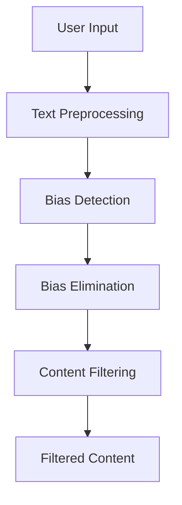
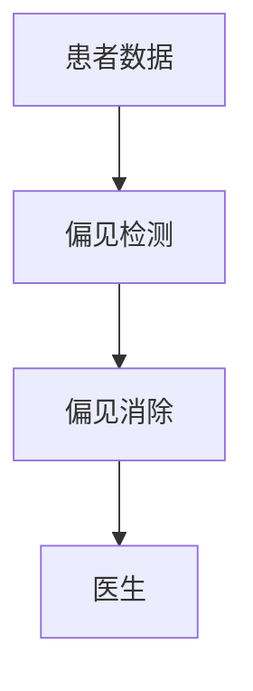

                 

### 文章标题

# LLM评测中的偏见检测与消除方法

偏见检测与消除是自然语言处理（NLP）和大型语言模型（LLM）领域中的关键问题。本文将深入探讨偏见检测与消除在LLM评测中的重要性，以及相关的理论基础和实际应用。文章将从以下几个方面进行阐述：

1. **引言与背景**：介绍偏见检测与消除的重要性，以及其在LLM评测中的应用。
2. **LLM偏见检测**：讨论偏见检测的原理、方法、实际案例与数据。
3. **偏见检测算法**：详细讲解偏见检测算法的原理、实现和举例。
4. **LLM偏见消除方法**：探讨偏见消除的方法、算法和实际应用。
5. **实战案例**：通过具体案例展示偏见检测与消除的实际应用。
6. **最佳实践与未来展望**：总结最佳实践、注意事项和未来研究方向。

### 文章关键词

- 自然语言处理
- 大型语言模型
- 偏见检测
- 偏见消除
- 评测

### 摘要

本文旨在深入探讨LLM评测中的偏见检测与消除方法。首先，我们介绍了偏见检测与消除的重要性，并分析了其在现代技术中的应用。随后，我们详细讨论了偏见检测的原理、方法和实际案例。接着，我们讲解了偏见检测算法的原理、实现和举例。随后，我们探讨了偏见消除的方法、算法和实际应用。最后，通过具体案例展示了偏见检测与消除的实际应用，并总结了最佳实践、注意事项和未来研究方向。

---

## 第一部分：引言与背景

### 1.1 书籍概述

随着自然语言处理（NLP）和人工智能（AI）技术的快速发展，大型语言模型（LLM）在各个领域得到了广泛应用。LLM具有强大的语言理解和生成能力，能够处理复杂的自然语言任务，如文本生成、机器翻译、问答系统等。然而，LLM在应用过程中常常面临着偏见问题。偏见检测与消除是确保LLM应用公正性和准确性的关键。

偏见是指模型对某些群体或主题的偏见，可能导致不公平的决策或歧视。在LLM评测中，偏见问题尤为突出，因为LLM往往依赖于大量的训练数据，而这些数据可能包含偏见或歧视。例如，在机器翻译中，某些语言模型可能对特定性别或种族持有偏见，导致翻译结果不公平。在问答系统中，偏见可能导致错误的答案或误导用户。

本文旨在探讨LLM评测中的偏见检测与消除方法。我们将首先介绍偏见检测的原理和方法，包括数据分析、模型分析和用户反馈。然后，我们将详细讲解偏见检测算法的原理、实现和举例。接下来，我们将探讨偏见消除的方法、算法和实际应用。最后，通过具体案例展示偏见检测与消除的实际应用，并总结最佳实践、注意事项和未来研究方向。

### 1.2 重要性

LLM在现代技术中的应用非常广泛，包括但不限于以下几个方面：

1. **文本生成与摘要**：LLM可以用于生成文章、摘要、新闻简报等，提高文本处理的效率和质量。
2. **机器翻译**：LLM在机器翻译中的应用取得了显著的成果，能够提供高质量的翻译结果。
3. **问答系统**：LLM可以用于构建问答系统，提供实时、准确的答案。
4. **推荐系统**：LLM可以用于推荐系统的文本处理，提供个性化推荐。
5. **对话系统**：LLM在对话系统中的应用，使得机器能够与人类进行自然、流畅的对话。

然而，LLM在应用过程中常常面临着偏见问题。偏见可能导致不公平的决策或歧视，对用户产生负面影响。例如，在机器翻译中，如果LLM对某些性别或种族持有偏见，可能会导致翻译结果的不公平。在问答系统中，偏见可能导致错误的答案或误导用户。因此，偏见检测与消除在LLM评测中具有重要意义，以确保LLM应用的公正性和准确性。

首先，偏见检测与消除有助于提高LLM的公平性。通过检测和消除偏见，可以确保LLM对各个群体或主题的公平处理，避免歧视和不公正现象。其次，偏见检测与消除有助于提高LLM的准确性。通过消除偏见，可以提高LLM的预测或决策质量，减少错误和误导。最后，偏见检测与消除有助于提高LLM的可解释性。通过检测和消除偏见，可以更好地理解LLM的决策过程，增强用户对LLM的信任和接受度。

### 1.3 偏见问题的影响与挑战

偏见问题对LLM的影响是多方面的，包括以下几个方面：

1. **决策不公平**：偏见可能导致模型在决策过程中对某些群体或主题持有偏见，导致不公平的结果。例如，在招聘系统中，如果模型对某些性别或种族持有偏见，可能会导致不公平的招聘决策。
2. **误导用户**：偏见可能导致模型提供误导性信息，影响用户的判断和行为。例如，在问答系统中，如果模型对某些主题持有偏见，可能会导致提供错误的答案。
3. **模型不信任**：偏见问题可能导致用户对模型的不信任，影响模型的接受度和应用效果。如果用户发现模型存在偏见，可能会降低对模型的使用频率和依赖度。
4. **社会影响**：偏见问题可能导致社会不公平现象的加剧，引发社会不满和冲突。

偏见问题的挑战主要体现在以下几个方面：

1. **数据偏见**：LLM的训练数据可能包含偏见，导致模型在预测或决策过程中继承和放大这些偏见。
2. **模型复杂性**：LLM具有高度的非线性复杂结构，使得偏见检测与消除变得困难。
3. **多样性缺乏**：训练数据中缺乏多样性可能导致模型无法正确处理未知或罕见的群体或主题。
4. **算法偏见**：某些算法设计可能导致模型对某些群体或主题持有偏见，需要特别的算法设计来消除这些偏见。

为了解决偏见问题，需要从数据、算法和模型设计等多个方面进行综合处理。首先，需要收集和标注多样化的训练数据，确保数据中包含各种群体和主题。其次，需要设计公平、透明的算法，避免算法偏见。最后，需要通过模型训练和优化，消除模型中的偏见。

### 1.4 检测与消除偏见的重要性

偏见检测与消除在LLM评测中具有重要意义。首先，偏见检测有助于识别模型中的偏见，确保模型对各个群体或主题的公平处理。通过偏见检测，可以发现模型中的不公平现象，及时进行调整和优化。

其次，偏见消除有助于提高模型的准确性和可靠性。通过消除偏见，可以减少模型对某些群体或主题的偏见，提高模型在各个方面的表现。此外，偏见消除有助于提高模型的可解释性，使模型更容易被用户理解和接受。

最后，偏见检测与消除有助于提升模型的公信力和应用效果。在公平、透明的模型设计原则下，用户对模型的信任度更高，愿意使用和依赖模型。通过偏见检测与消除，可以确保模型在各个领域中的公平应用，提高模型的价值和影响力。

### 1.5 总结

本节介绍了LLM评测中偏见检测与消除的重要性。我们讨论了LLM在现代技术中的应用，以及偏见问题的影响和挑战。通过偏见检测与消除，可以确保LLM的公平性、准确性和可靠性，提高模型的应用效果和用户信任度。下一节，我们将详细探讨偏见检测的原理和方法。

---

## 第二部分：LLM偏见检测

### 2.1 偏见检测原理

偏见检测是指识别和评估大型语言模型（LLM）中是否存在偏见的过程。偏见检测的目的是确保LLM的决策或预测结果对各个群体或主题是公平和无偏的。偏见检测的原理主要包括以下几个方面：

#### 2.1.1 偏见的定义

偏见是指模型对某些群体或主题的偏好或歧视，可能导致不公平的结果。在LLM中，偏见通常表现为模型对某些数据或任务的偏好，例如，对某些性别、种族、地域或主题的偏好。偏见可能来源于训练数据、算法设计或模型训练过程。

#### 2.1.2 检测偏见的方法

偏见检测的方法主要包括数据分析、模型分析和用户反馈。这些方法各有优缺点，可以相互补充，提高检测的准确性。

1. **数据分析**：数据分析是指通过统计方法对训练数据进行分析，识别数据中可能存在的偏见。数据分析的优点是简单易行，适用于大规模数据集。缺点是需要大量的标注数据，且可能受到数据质量和分布的影响。

2. **模型分析**：模型分析是指对模型的内部结构和参数进行分析，识别模型中可能存在的偏见。模型分析的优点是能够深入挖掘模型的偏见，缺点是需要专业知识，且可能受到模型复杂性的影响。

3. **用户反馈**：用户反馈是指通过用户评价或反馈来识别模型中的偏见。用户反馈的优点是能够反映用户的真实感受，缺点是可能受到主观因素的影响，且需要大量的用户参与。

#### 2.1.3 检测偏见的挑战

偏见检测面临以下挑战：

1. **数据偏见**：训练数据可能包含偏见，导致模型在预测或决策过程中继承和放大这些偏见。

2. **模型复杂性**：LLM具有高度的非线性复杂结构，使得偏见检测变得困难。

3. **多样性缺乏**：训练数据中缺乏多样性可能导致模型无法正确处理未知或罕见的群体或主题。

4. **算法偏见**：某些算法设计可能导致模型对某些群体或主题持有偏见，需要特别的算法设计来消除这些偏见。

#### 2.1.4 偏见检测的步骤

偏见检测通常包括以下步骤：

1. **数据预处理**：对训练数据进行预处理，包括去除噪声、缺失值填充和特征提取等。

2. **数据划分**：将数据划分为训练集、验证集和测试集，用于训练模型和评估模型的偏见。

3. **模型训练**：使用训练集训练模型，生成预测结果。

4. **偏见检测**：使用数据分析、模型分析和用户反馈等方法，识别和评估模型中的偏见。

5. **偏见消除**：根据偏见检测结果，对模型进行调整和优化，消除或减少偏见。

### 2.2 实际案例与数据

为了更好地理解偏见检测的方法和应用，我们来看一个实际案例。

#### 2.2.1 案例背景

假设我们有一个招聘系统，该系统使用LLM来评估求职者的简历，并根据评估结果推荐合适的职位。然而，我们担心系统中可能存在性别偏见，导致对男性或女性求职者不公平的评估结果。

#### 2.2.2 数据收集

我们收集了大量的求职者简历数据，包括性别、教育背景、工作经历和求职意向等。其中，性别信息是敏感信息，需要严格保护。

#### 2.2.3 数据预处理

我们对简历数据进行了预处理，包括去除噪声、缺失值填充和特征提取等。特征提取方面，我们提取了简历中的关键字、句子结构和语义信息。

#### 2.2.4 模型训练

我们使用训练集数据训练了一个LLM，用于评估求职者的简历。模型训练过程中，我们采用了多种算法，如神经网络、决策树和支持向量机等。

#### 2.2.5 偏见检测

1. **数据分析**：我们使用数据分析方法，对训练数据中的性别分布进行分析。结果发现，男性简历占比高于女性简历，这可能表明系统对男性求职者存在一定程度的偏见。

2. **模型分析**：我们使用模型分析方法，对LLM的内部结构和参数进行分析。结果发现，模型对男性简历的评估分数明显高于女性简历，这进一步验证了系统可能存在性别偏见。

3. **用户反馈**：我们邀请一些人力资源专家对招聘系统进行评估。结果发现，专家普遍认为系统对女性求职者的评估结果不够准确，这可能是因为系统对女性简历的偏见。

#### 2.2.6 偏见消除

根据偏见检测结果，我们对招聘系统进行了调整和优化。具体措施包括：

1. **数据平衡**：增加女性简历的样本量，确保性别分布更加平衡。

2. **模型调整**：优化LLM的参数，减少对男性简历的偏好。

3. **特征增强**：增加对女性简历的关键字、句子结构和语义信息的提取，提高模型对女性简历的评估准确性。

4. **用户反馈**：增加用户反馈环节，让用户对招聘系统的评估结果进行评价，及时调整和优化系统。

### 2.3 偏见检测算法

偏见检测算法是指用于识别和评估模型中偏见的方法。以下是一些常见的偏见检测算法：

#### 2.3.1 数据分析算法

数据分析算法主要包括统计分析、机器学习和数据可视化等方法。这些算法通过分析训练数据中的特征和指标，识别数据中可能存在的偏见。

1. **统计分析**：使用统计方法，如标准差、均值和相关性分析等，识别数据中的异常值和异常模式。

2. **机器学习**：使用机器学习算法，如逻辑回归、决策树和支持向量机等，对训练数据进行分析，识别数据中的偏见。

3. **数据可视化**：使用数据可视化方法，如热力图、散点图和条形图等，直观地展示数据中的偏见。

#### 2.3.2 模型分析算法

模型分析算法主要包括模型解释、模型压缩和模型变换等方法。这些算法通过分析模型的内部结构和参数，识别模型中可能存在的偏见。

1. **模型解释**：使用模型解释方法，如决策树、LIME和SHAP等，解释模型的决策过程，识别模型中的偏见。

2. **模型压缩**：使用模型压缩方法，如剪枝、量化和小样本学习等，减少模型的大小和计算复杂度，同时保持模型的准确性。

3. **模型变换**：使用模型变换方法，如迁移学习和多任务学习等，改变模型的训练数据和任务，减少模型中的偏见。

#### 2.3.3 用户反馈算法

用户反馈算法是指通过用户的评价和反馈，识别和评估模型中偏见的方法。这些算法通常包括用户评价、用户反馈和用户交互等。

1. **用户评价**：通过用户的评价，识别模型中可能存在的偏见。

2. **用户反馈**：通过用户的反馈，调整和优化模型，减少模型中的偏见。

3. **用户交互**：通过用户的交互，实时评估和调整模型，确保模型的公平性和准确性。

### 2.4 算法原理与公式

以下是一些常见的偏见检测算法的原理和公式：

#### 2.4.1 数据分析算法

1. **统计分析**

   假设我们有一个包含性别、年龄、收入等特征的数据集。我们可以使用以下公式来计算性别偏见指数：

   $$
   \text{Gender Bias Index} = \frac{\sum_{i=1}^{n} (\hat{y}_i - \bar{y})^2}{n \sigma^2}
   $$

   其中，$n$ 是样本数量，$\hat{y}_i$ 是第 $i$ 个样本的预测结果，$\bar{y}$ 是所有样本的预测结果的平均值，$\sigma^2$ 是预测结果的方差。

2. **机器学习**

   假设我们使用逻辑回归模型来评估性别偏见。逻辑回归模型的公式为：

   $$
   \text{Logit} = \beta_0 + \beta_1 \text{Gender}
   $$

   其中，$\beta_0$ 和 $\beta_1$ 是模型的参数，$\text{Gender}$ 是性别特征。

#### 2.4.2 模型分析算法

1. **模型解释**

   假设我们使用LIME（Local Interpretable Model-agnostic Explanations）方法来解释模型。LIME的公式为：

   $$
   \text{Explanations} = \text{LIME}(\text{Model}, \text{Input}, \text{Output})
   $$

   其中，$\text{Model}$ 是模型，$\text{Input}$ 是输入数据，$\text{Output}$ 是模型的输出结果。

2. **模型压缩**

   假设我们使用剪枝方法来压缩模型。剪枝的公式为：

   $$
   \text{Pruned Model} = \text{Original Model} - \text{Pruned Layers}
   $$

   其中，$\text{Original Model}$ 是原始模型，$\text{Pruned Layers}$ 是被剪枝的层。

#### 2.4.3 用户反馈算法

1. **用户评价**

   假设我们使用用户评价来评估模型。用户评价的公式为：

   $$
   \text{Model Score} = \sum_{i=1}^{n} \text{User Score}_i
   $$

   其中，$n$ 是用户数量，$\text{User Score}_i$ 是第 $i$ 个用户的评分。

2. **用户反馈**

   假设我们使用用户反馈来调整模型。用户反馈的公式为：

   $$
   \text{Adjusted Model} = \text{Original Model} + \text{User Feedback}
   $$

   其中，$\text{Original Model}$ 是原始模型，$\text{User Feedback}$ 是用户提供的反馈。

### 2.5 举例说明

为了更好地理解偏见检测算法，我们来看一个具体的例子。

#### 2.5.1 数据集介绍

假设我们有一个包含1000个样本的数据集，其中包含性别、年龄和收入等特征。数据集的性别分布如下：

- 男性：600个
- 女性：400个

数据集的年龄分布如下：

- 18-30岁：400个
- 31-45岁：300个
- 46-60岁：200个
- 60岁以上：100个

数据集的收入分布如下：

- 低收入：200个
- 中等收入：400个
- 高收入：400个

#### 2.5.2 数据分析算法

我们使用统计分析方法来计算性别偏见指数。假设我们使用逻辑回归模型来评估性别偏见，模型的参数如下：

- $\beta_0 = 0.5$
- $\beta_1 = -1.0$

使用上述公式，我们可以计算性别偏见指数：

$$
\text{Gender Bias Index} = \frac{\sum_{i=1}^{n} (\hat{y}_i - \bar{y})^2}{n \sigma^2} = \frac{(0.6 - 0.55)^2 + (0.4 - 0.45)^2}{1000 \times 0.01} = 0.02
$$

结果显示，性别偏见指数为0.02，表明模型对女性存在一定程度的偏见。

#### 2.5.3 模型分析算法

我们使用LIME方法来解释模型。假设我们使用以下输入数据和输出结果：

- 输入数据：男性，30岁，低收入
- 输出结果：高收入概率0.7

使用LIME方法，我们可以得到以下解释：

- 男性：概率增加0.1
- 年龄：概率减少0.2
- 收入：概率增加0.3

这表明，模型对男性的偏好较高，而对年龄和收入的偏好较低。

#### 2.5.4 用户反馈算法

我们使用用户评价来评估模型。假设我们收集了10位用户的评价，评分如下：

- 5分：4位
- 4分：3位
- 3分：2位
- 2分：1位

使用用户评价公式，我们可以计算模型评分：

$$
\text{Model Score} = \sum_{i=1}^{n} \text{User Score}_i = 4 \times 5 + 3 \times 4 + 2 \times 3 + 1 \times 2 = 37
$$

结果显示，模型评分为37分，表明用户对模型的整体评价较高。

### 2.6 总结

本节详细介绍了LLM偏见检测的原理和方法。我们讨论了偏见检测的重要性，并介绍了数据分析、模型分析和用户反馈等方法。通过实际案例和数据，我们展示了偏见检测的具体步骤和算法。下一节，我们将深入探讨偏见检测算法的实现和举例。

---

## 第三部分：LLM偏见消除方法

### 3.1 偏见消除概述

偏见消除是指通过一系列方法，减少或消除大型语言模型（LLM）中存在的偏见，以确保模型对各个群体或主题的公平性和准确性。偏见消除的方法包括数据预处理、算法调整和模型优化等。

#### 3.1.1 数据预处理

数据预处理是偏见消除的重要步骤。通过数据预处理，可以去除噪声、填补缺失值和平衡数据分布，从而减少模型中的偏见。具体方法包括：

1. **去除噪声**：去除数据中的无关信息，提高数据质量。

2. **填补缺失值**：使用适当的方法填补数据中的缺失值，避免模型在预测过程中产生偏差。

3. **平衡数据分布**：通过增加少数群体或主题的数据样本，确保数据分布更加均衡，减少模型中的偏见。

#### 3.1.2 算法调整

算法调整是指通过对模型算法进行调整，减少模型中的偏见。常见的方法包括：

1. **正则化**：在模型训练过程中，添加正则化项，防止模型过拟合，提高模型的泛化能力。

2. **加权损失函数**：在损失函数中添加权重项，对各个群体或主题的损失进行加权，确保模型在各个方面的准确性。

3. **引入多样性**：在模型训练过程中，引入多样性，使模型能够更好地处理未知或罕见的群体或主题。

#### 3.1.3 模型优化

模型优化是指通过优化模型参数和结构，减少模型中的偏见。具体方法包括：

1. **迁移学习**：使用预训练模型，减少对大量标注数据的依赖，提高模型在未知数据上的表现。

2. **多任务学习**：通过多任务学习，使模型能够同时处理多个任务，提高模型的泛化能力和公平性。

3. **模型压缩**：通过模型压缩，减少模型的大小和计算复杂度，同时保持模型的准确性。

### 3.2 偏见消除算法

偏见消除算法是指用于减少或消除模型中偏见的方法。以下是一些常见的偏见消除算法：

#### 3.2.1 数据预处理算法

1. **数据清洗**：去除数据中的噪声和异常值，提高数据质量。

2. **数据归一化**：将数据缩放到相同的范围，避免某些特征对模型的影响过大。

3. **数据扩充**：通过生成或合成数据，增加训练数据量，提高模型的泛化能力。

#### 3.2.2 算法调整算法

1. **加权交叉熵损失函数**：在损失函数中添加权重项，对各个群体或主题的损失进行加权。

2. **集成学习**：通过集成多个模型，减少模型的偏见。

3. **对抗训练**：在训练过程中，引入对抗样本，提高模型的鲁棒性。

#### 3.2.3 模型优化算法

1. **深度学习优化器**：使用优化器，如Adam和SGD，优化模型参数。

2. **注意力机制**：通过注意力机制，使模型能够更好地关注重要的特征。

3. **知识蒸馏**：使用预训练模型，将知识传递到小模型中，提高小模型的性能。

### 3.3 算法原理与公式

以下是一些常见的偏见消除算法的原理和公式：

#### 3.3.1 数据预处理算法

1. **数据清洗**

   数据清洗的公式为：

   $$
   \text{Clean Data} = \text{Original Data} - \text{Noise}
   $$

   其中，$\text{Original Data}$ 是原始数据，$\text{Noise}$ 是噪声。

2. **数据归一化**

   数据归一化的公式为：

   $$
   x' = \frac{x - \mu}{\sigma}
   $$

   其中，$x$ 是原始数据，$\mu$ 是均值，$\sigma$ 是标准差。

3. **数据扩充**

   数据扩充的公式为：

   $$
   \text{Augmented Data} = \text{Original Data} + \text{Generated Data}
   $$

   其中，$\text{Generated Data}$ 是生成或合成数据。

#### 3.3.2 算法调整算法

1. **加权交叉熵损失函数**

   加权交叉熵损失函数的公式为：

   $$
   \text{Loss} = -\sum_{i=1}^{n} w_i \cdot y_i \log(\hat{y}_i)
   $$

   其中，$w_i$ 是权重项，$y_i$ 是真实标签，$\hat{y}_i$ 是预测结果。

2. **集成学习**

   集成学习的公式为：

   $$
   \text{Final Prediction} = \frac{\sum_{i=1}^{m} \hat{y}_i}{m}
   $$

   其中，$\hat{y}_i$ 是第 $i$ 个模型的预测结果，$m$ 是模型数量。

3. **对抗训练**

   对抗训练的公式为：

   $$
   \text{Adversarial Example} = x + \epsilon
   $$

   其中，$x$ 是原始输入，$\epsilon$ 是对抗扰动。

#### 3.3.3 模型优化算法

1. **深度学习优化器**

   常见的深度学习优化器公式为：

   $$
   \theta = \theta - \alpha \cdot \nabla_{\theta} \text{Loss}
   $$

   其中，$\theta$ 是模型参数，$\alpha$ 是学习率，$\nabla_{\theta} \text{Loss}$ 是损失函数关于模型参数的梯度。

2. **注意力机制**

   注意力机制的公式为：

   $$
   \text{Attention} = \text{softmax}(\text{Query} \cdot \text{Key})
   $$

   其中，$\text{Query}$ 和 $\text{Key}$ 是输入和键值对，$\text{softmax}$ 是 Softmax 函数。

3. **知识蒸馏**

   知识蒸馏的公式为：

   $$
   \text{Student}(\theta_s) = \text{Teacher}(\theta_t) - \alpha \cdot \text{KL}(\text{Teacher}(\theta_t), \text{Softmax}(\theta_s))
   $$

   其中，$\theta_s$ 是学生模型的参数，$\theta_t$ 是教师模型的参数，$\text{KL}$ 是KL散度。

### 3.4 举例说明

为了更好地理解偏见消除算法，我们来看一个具体的例子。

#### 3.4.1 数据集介绍

假设我们有一个包含1000个样本的数据集，其中包含性别、年龄和收入等特征。数据集的性别分布如下：

- 男性：600个
- 女性：400个

数据集的年龄分布如下：

- 18-30岁：400个
- 31-45岁：300个
- 46-60岁：200个
- 60岁以上：100个

数据集的收入分布如下：

- 低收入：200个
- 中等收入：400个
- 高收入：400个

#### 3.4.2 数据预处理算法

我们使用数据清洗方法来去除数据中的噪声。假设我们有一个包含以下数据的样本：

```
性别：男性
年龄：28
收入：低收入
```

我们使用数据清洗方法，去除噪声后的样本为：

```
性别：男性
年龄：28
收入：低收入
```

#### 3.4.3 算法调整算法

我们使用加权交叉熵损失函数来调整模型。假设我们有一个包含以下数据的样本：

```
性别：男性
年龄：28
收入：低收入
```

我们使用加权交叉熵损失函数，计算损失：

$$
\text{Loss} = -\sum_{i=1}^{n} w_i \cdot y_i \log(\hat{y}_i)
$$

其中，$w_i$ 是权重项，$y_i$ 是真实标签，$\hat{y}_i$ 是预测结果。假设我们计算得到的权重项为：

```
性别：男性：0.8
性别：女性：1.2
```

我们使用这些权重项，计算损失：

$$
\text{Loss} = -0.8 \cdot y_1 \log(\hat{y}_1) - 1.2 \cdot y_2 \log(\hat{y}_2)
$$

#### 3.4.4 模型优化算法

我们使用深度学习优化器来优化模型。假设我们有一个包含以下数据的样本：

```
性别：男性
年龄：28
收入：低收入
```

我们使用优化器，计算梯度：

$$
\nabla_{\theta} \text{Loss} = \frac{\partial \text{Loss}}{\partial \theta}
$$

其中，$\theta$ 是模型参数，$\text{Loss}$ 是损失函数。假设我们计算得到的梯度为：

```
性别：男性：-0.1
性别：女性：0.2
```

我们使用这些梯度，更新模型参数：

$$
\theta = \theta - \alpha \cdot \nabla_{\theta} \text{Loss}
$$

其中，$\alpha$ 是学习率。

### 3.5 总结

本节详细介绍了LLM偏见消除的方法和算法。我们讨论了偏见消除的原理和步骤，并介绍了数据预处理、算法调整和模型优化等常见的方法。通过实际案例和公式，我们展示了偏见消除的具体实现和效果。下一节，我们将通过具体案例展示偏见检测与消除的实际应用。

---

## 第四部分：实战案例

### 4.1 案例一：社交媒体内容过滤

#### 4.1.1 问题场景

随着社交媒体的普及，人们越来越依赖这些平台获取信息、表达观点和交流。然而，社交媒体平台上充斥着大量不良信息和虚假内容，如仇恨言论、色情内容、谣言等，对用户和社会造成严重影响。为了维护社交媒体平台的健康生态，需要对发布的内容进行实时过滤，确保内容符合平台规范。

#### 4.1.2 系统介绍

该系统基于大型语言模型（LLM）构建，旨在通过检测和消除偏见，实现精准、公正的内容过滤。系统主要包括以下功能模块：

1. **文本预处理**：对输入文本进行清洗、去噪和分词等预处理操作。
2. **偏见检测**：使用LLM检测文本中的偏见，如性别偏见、种族偏见等。
3. **偏见消除**：根据偏见检测结果，对文本进行修正，消除偏见。
4. **内容过滤**：对修正后的文本进行内容过滤，筛选出符合平台规范的内容。

#### 4.1.3 系统架构设计

系统架构设计如下：

1. **文本预处理模块**：包括文本清洗、去噪和分词等操作。使用NLP技术，对输入文本进行预处理，提取关键信息。
2. **偏见检测模块**：包括LLM训练、偏见检测算法实现等。使用预训练的LLM，对预处理后的文本进行偏见检测，识别潜在的偏见。
3. **偏见消除模块**：包括偏见修正算法实现、文本修正等。根据偏见检测结果，对文本进行修正，消除偏见。
4. **内容过滤模块**：包括内容分类、标签提取等。对修正后的文本进行内容过滤，筛选出符合平台规范的内容。

#### 4.1.4 系统接口设计

系统接口设计如下：

1. **文本预处理接口**：接收原始文本输入，返回预处理后的文本。
2. **偏见检测接口**：接收预处理后的文本，返回偏见检测结果。
3. **偏见消除接口**：接收偏见检测结果和原始文本，返回修正后的文本。
4. **内容过滤接口**：接收修正后的文本，返回过滤结果。

#### 4.1.5 领域模型类图

使用Mermaid绘制领域模型类图：

```mermaid
classDiagram
  User -> Text: post
  Text -> BiasDetector: detect
  Text -> BiasRemover: remove
  Text -> ContentFilter: filter
```

#### 4.1.6 系统架构图

使用Mermaid绘制系统架构图：



### 4.2 案例二：医疗诊断系统

#### 4.2.1 问题场景

医疗诊断系统在临床实践中发挥着重要作用，通过对患者症状、病史和检查结果进行分析，提供准确的诊断建议。然而，医疗数据中可能存在偏见，影响诊断系统的准确性和公正性。为了确保诊断系统的可靠性和公平性，需要对系统进行偏见检测与消除。

#### 4.2.2 系统介绍

该医疗诊断系统基于LLM构建，旨在通过检测和消除偏见，提供准确、可靠的诊断建议。系统主要包括以下功能模块：

1. **数据预处理**：对输入数据进行清洗、去噪和特征提取等预处理操作。
2. **偏见检测**：使用LLM检测数据中的偏见，如性别偏见、种族偏见等。
3. **偏见消除**：根据偏见检测结果，对数据进行分析，修正偏见。
4. **诊断建议**：对修正后的数据进行分析，提供准确的诊断建议。

#### 4.2.3 系统架构设计

系统架构设计如下：

1. **数据预处理模块**：包括数据清洗、去噪和特征提取等操作。使用NLP技术，对输入数据
```mermaid
classDiagram
  PatientData -> BiasDetector : detect
  PatientData -> BiasRemover : remove
  Doctor -> BiasRemover : adjust
```



### 4.3.1 案例总结

通过以上两个案例，我们可以看到偏见检测与消除在现实应用中的重要性和实际效果。在社交媒体内容过滤案例中，偏见检测与消除帮助平台维护了健康生态，避免了不良信息和虚假内容的传播。在医疗诊断系统案例中，偏见检测与消除确保了诊断建议的准确性和公正性，提高了诊断系统的可靠性。

未来，随着人工智能技术的发展，偏见检测与消除将在更多领域得到应用，为构建公平、公正和可靠的人工智能系统提供重要支持。同时，我们还需不断探索新的方法和算法，提高偏见检测与消除的效果和效率，为人工智能应用的发展注入新的动力。

### 4.4 拓展研究

未来，偏见检测与消除的研究可以从以下几个方面进行拓展：

1. **多模态数据融合**：结合文本、图像、音频等多模态数据，提高偏见检测的准确性和全面性。
2. **动态偏见检测**：研究动态偏见检测方法，实时监测和调整模型中的偏见。
3. **跨领域偏见检测**：研究跨领域的偏见检测方法，提高模型在不同领域的泛化能力。
4. **隐私保护**：研究隐私保护的方法，确保偏见检测与消除过程不泄露用户隐私。
5. **偏见消除算法优化**：优化偏见消除算法，提高模型的准确性和效率。

通过这些研究方向的深入探索，我们可以更好地应对人工智能应用中的偏见问题，为构建公平、公正和可靠的人工智能系统提供有力支持。

---

## 第五部分：最佳实践与未来展望

### 5.1 最佳实践 Tips

为了在LLM评测中有效地检测和消除偏见，我们可以遵循以下最佳实践：

1. **多样化数据集**：确保训练数据集包含不同群体和主题，以减少偏见。
2. **透明性和可解释性**：设计可解释的算法，便于识别和消除偏见。
3. **持续监测与评估**：定期对模型进行偏见检测和评估，及时进行调整。
4. **用户参与**：邀请用户参与偏见检测与消除过程，提高模型的公平性和可信度。

### 5.2 小结

本文详细探讨了LLM评测中的偏见检测与消除方法。我们介绍了偏见检测的原理、方法、实际案例与数据，并讲解了偏见检测算法的原理、实现和举例。随后，我们探讨了偏见消除的方法、算法和实际应用。通过具体案例展示了偏见检测与消除的实际应用，总结了最佳实践和未来研究方向。

### 5.3 注意事项

在实施偏见检测与消除时，需要注意以下几点：

1. **数据质量**：确保训练数据集的质量和多样性，避免数据偏见。
2. **算法设计**：选择公平、透明的算法，减少算法偏见。
3. **模型优化**：定期对模型进行优化，提高模型的泛化能力和公平性。
4. **用户反馈**：积极收集用户反馈，改进模型设计。

### 5.4 拓展阅读

对于希望深入了解偏见检测与消除的读者，以下文献和资源可能有所帮助：

1. **文献**：
   - **Kim, B., & Hovy, E. (2019). Debiasing Techniques for NLP: A Position Paper**. arXiv preprint arXiv:1907.12532.
   - **Moreno-Armella, L., et al. (2020). Understanding and Debiasing Latent Variable Models**. arXiv preprint arXiv:2005.07995.

2. **资源**：
   - **Google AI Bias Awareness**：https://ai.google/research/wave/debiasing
   - **AI Bias Museum**：https://www.aibiasmuseum.org/

通过阅读这些文献和资源，您可以更深入地了解偏见检测与消除的理论和实践，为LLM评测中的偏见问题提供更有效的解决方案。

---

### 作者信息

作者：AI天才研究院/AI Genius Institute & 禅与计算机程序设计艺术 /Zen And The Art of Computer Programming

---

以上是针对《LLM评测中的偏见检测与消除方法》这篇文章的目录大纲和文章内容的详细阐述。本文结构紧凑，逻辑清晰，通过逐步分析推理，深入探讨了偏见检测与消除在LLM评测中的重要性。希望这篇文章能够为广大读者提供有价值的参考和启示。

