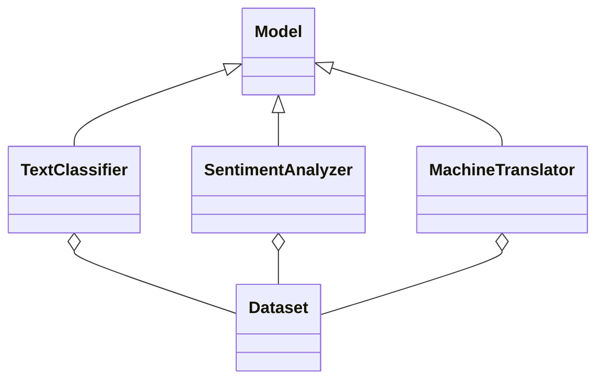
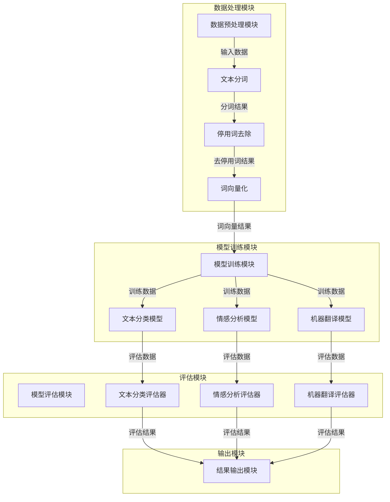
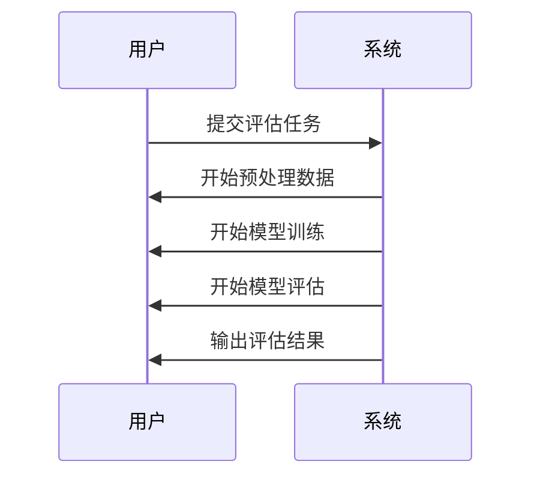

                 

# LLM评测中的多任务并行处理机制

关键词：多任务学习、并行处理、语言模型、评测机制、人工智能

摘要：随着自然语言处理技术的不断发展，大型语言模型（LLM）在多个任务中展现出卓越的性能。然而，对于这些模型的评测却面临多重挑战，尤其是在需要同时处理多个任务时。本文将深入探讨LLM评测中的多任务并行处理机制，从背景介绍、核心概念、算法原理、系统分析与架构设计、项目实战等方面进行详细分析，旨在为读者提供全面的理解和实用的指导。

## Step 1: 背景介绍

### 1.1.1 问题背景

大型语言模型（LLM）的领域近年来取得了飞速发展，使得模型能够在各种自然语言处理（NLP）任务中表现出色。然而，对LLM的评测工作同样复杂，尤其是在需要同时评估多个任务时，如何保证评测的效率和准确性成为一个关键问题。本篇文章旨在为读者提供一个全面概述，探讨多任务并行处理机制在LLM评测中的应用。

### 1.1.2 问题描述

在LLM评测中，通常涉及到多种任务，如文本分类、情感分析、问答系统等。这些任务的评估方式不同，可能需要不同的评估指标和评估标准。同时，为了提高评测的效率，往往需要采用并行处理的方式。然而，并行处理也带来了一系列挑战，如任务间的依赖关系、资源分配、性能优化等。

### 1.1.3 问题解决方案

为了解决上述问题，本文将介绍几种常见的多任务并行处理机制，包括模型并行、数据并行和任务并行等。这些机制将有助于提高LLM评测的效率，同时保证评测的准确性。

### 1.1.4 边界与外延

本文将重点关注多任务并行处理机制在LLM评测中的应用，但也会探讨与多任务学习相关的其他问题，如任务间的关联性、模型融合策略等。此外，本文还将讨论一些潜在的研究方向，如针对特定应用场景的多任务并行处理机制优化等。

### 核心概念与结构

本文的核心概念和结构可以概括为以下几个部分：

1. **多任务学习（MTL）**：介绍多任务学习的概念、应用场景和挑战。
2. **并行处理机制**：详细分析模型并行、数据并行和任务并行的原理和实现。
3. **算法原理讲解**：深入探讨多任务并行处理算法的数学模型和实现细节。
4. **系统分析与架构设计**：介绍多任务并行处理在LLM评测系统中的应用，包括功能设计、架构设计和接口设计。
5. **项目实战**：通过具体案例展示多任务并行处理机制在实际项目中的应用。
6. **最佳实践与小结**：总结多任务并行处理机制的最佳实践，并展望未来的发展方向。

## Step 2: 核心概念与联系

### 2.1 多任务学习（MTL）

#### 2.1.1 概念介绍

多任务学习（Multi-Task Learning, MTL）是一种机器学习技术，旨在同时训练多个相关任务。这些任务可以是独立的，也可以是相互关联的。在MTL中，模型通过学习多个任务的共同特征，可以提高每个任务的性能，同时减少对数据的需求。

#### 2.1.2 应用场景

MTL在许多领域都有广泛应用，如计算机视觉、语音识别、自然语言处理等。在自然语言处理领域，MTL可以用于文本分类、情感分析、机器翻译等任务。

#### 2.1.3 挑战

MTL面临的主要挑战包括任务间的关联性、模型参数的共享和任务平衡等。如何设计合适的模型架构和训练策略，以解决这些挑战，是MTL研究的关键问题。

#### 2.1.4 对比表格

下面是一个简单的多任务学习与传统单任务学习对比的表格：

| 特点 | 多任务学习 | 单任务学习 |
| :---: | :---: | :---: |
| 数据共享 | 共享模型参数和特征 | 独立模型，不共享数据 |
| 任务关联性 | 考虑任务间的关联性 | 单个任务，不考虑关联性 |
| 训练效率 | 提高训练效率，减少对数据的需求 | 需要大量独立训练 |
| 模型性能 | 可能提高每个任务的性能 | 单个任务性能可能较好 |

#### 2.1.5 ER实体关系图

下面是一个ER实体关系图，展示了多任务学习中的主要实体和关系：

```mermaid
erDiagram
    TaskA ||--|{ Model }|| MultipleTasksModel
    TaskB ||--|{ Model }|| MultipleTasksModel
    TaskC ||--|{ Model }|| MultipleTasksModel
    MultipleTasksModel ||--|{ FeatureExtractionLayer }|| FeatureLayer
    FeatureLayer ||--|{ OutputLayer }|| Prediction
```

在这个图中，`TaskA`、`TaskB`和`TaskC`代表不同的任务，`MultipleTasksModel`是同时训练多个任务的模型，`FeatureExtractionLayer`是特征提取层，`OutputLayer`是输出层。

### 2.2 并行处理机制

#### 2.2.1 模型并行

模型并行（Model Parallelism）是指将大型模型分解为多个部分，并在不同的计算资源上同时训练。这种方法可以有效地利用多GPU或分布式计算资源，提高训练效率。

#### 2.2.2 数据并行

数据并行（Data Parallelism）是指将训练数据集划分为多个子集，并在不同的计算资源上同时训练模型。这种方法可以减少单个模型的训练时间，同时提高整体训练效率。

#### 2.2.3 任务并行

任务并行（Task Parallelism）是指将多个任务分配到不同的计算资源上，同时执行。这种方法可以显著提高评测和推理的效率。

#### 2.2.4 对比表格

下面是一个简单的并行处理机制对比表格：

| 类型 | 模型并行 | 数据并行 | 任务并行 |
| :---: | :---: | :---: | :---: |
| 特点 | 模型分解，并行训练 | 数据划分，并行训练 | 任务划分，并行执行 |
| 适用场景 | 大型模型，多GPU环境 | 大型数据集，分布式计算 | 多个任务，并行处理 |
| 效率提升 | 提高模型训练效率 | 提高数据训练效率 | 提高任务处理效率 |
| 难点 | 模型参数同步，通信开销 | 数据分布不均，数据传输开销 | 任务依赖关系，资源分配 |

## Step 3: 算法原理讲解

### 3.1 模型并行处理算法

#### 3.1.1 算法流程

模型并行处理算法的基本流程如下：

1. **模型分解**：将大型模型分解为多个部分，每个部分负责不同的计算任务。
2. **任务分配**：将分解后的模型分配到不同的计算资源上，如GPU或分布式计算节点。
3. **并行训练**：在不同的计算资源上同时训练模型的各个部分，并同步模型参数。
4. **模型融合**：在训练结束后，将各个部分的模型参数融合，生成最终的模型。

#### 3.1.2 数学模型

模型并行处理算法的数学模型可以表示为：

$$
\text{Model Parallelism} = \{ \text{Model Partition}, \text{Task Allocation}, \text{Parallel Training}, \text{Model Fusion} \}
$$

其中，`Model Partition`表示模型分解，`Task Allocation`表示任务分配，`Parallel Training`表示并行训练，`Model Fusion`表示模型融合。

#### 3.1.3 举例说明

以一个简单的神经网络为例，我们可以将其分解为输入层、隐藏层和输出层。这三个部分可以分别在不同的GPU上训练，然后在训练结束后将模型参数融合，生成最终的模型。

```python
# 输入层在GPU0上训练
input_layer = train_on_gpu0(input_data)

# 隐藏层在GPU1上训练
hidden_layer = train_on_gpu1(hidden_data)

# 输出层在GPU2上训练
output_layer = train_on_gpu2(output_data)

# 模型参数融合
final_model = fuse_models(input_layer, hidden_layer, output_layer)
```

### 3.2 数据并行处理算法

#### 3.2.1 算法流程

数据并行处理算法的基本流程如下：

1. **数据划分**：将训练数据集划分为多个子集，每个子集由不同的计算资源处理。
2. **并行训练**：在不同的计算资源上同时训练模型，并对每个子集的数据进行权重更新。
3. **权重同步**：在训练结束后，将各个计算资源上的模型权重同步，生成最终的模型。

#### 3.2.2 数学模型

数据并行处理算法的数学模型可以表示为：

$$
\text{Data Parallelism} = \{ \text{Data Split}, \text{Parallel Training}, \text{Weight Synchronization} \}
$$

其中，`Data Split`表示数据划分，`Parallel Training`表示并行训练，`Weight Synchronization`表示权重同步。

#### 3.2.3 举例说明

以一个简单的线性回归模型为例，我们可以将数据集划分为三个子集，分别在不同的计算节点上训练模型。在训练结束后，将各个节点的模型权重同步，生成最终的模型。

```python
# 数据集划分
train_data = split_data(data, num_splits)

# 并行训练
models = []
for i in range(num_splits):
    model = train_on_node(i, train_data[i])
    models.append(model)

# 模型权重同步
final_model = synchronize_weights(models)
```

### 3.3 任务并行处理算法

#### 3.3.1 算法流程

任务并行处理算法的基本流程如下：

1. **任务划分**：将多个任务分配到不同的计算资源上，同时执行。
2. **结果合并**：在任务执行结束后，将各个任务的结果合并，生成最终的评估结果。

#### 3.3.2 数学模型

任务并行处理算法的数学模型可以表示为：

$$
\text{Task Parallelism} = \{ \text{Task Split}, \text{Parallel Execution}, \text{Result Combination} \}
$$

其中，`Task Split`表示任务划分，`Parallel Execution`表示并行执行，`Result Combination`表示结果合并。

#### 3.3.3 举例说明

以一个简单的文本分类任务为例，我们可以将数据集划分为多个子集，分别在不同的计算节点上执行文本分类任务。在任务执行结束后，将各个节点的分类结果合并，生成最终的分类结果。

```python
# 数据集划分
train_data = split_data(data, num_splits)

# 并行执行文本分类任务
分类结果 = []
for i in range(num_splits):
    result = classify_on_node(i, train_data[i], model)
    分类结果.append(result)

# 分类结果合并
最终分类结果 = combine_results(分类结果)
```

## Step 4: 系统分析与架构设计

### 4.1 问题场景介绍

在自然语言处理领域，大型语言模型（LLM）被广泛应用于各种任务，如文本分类、情感分析、机器翻译等。这些任务通常需要大量的计算资源和时间，特别是在处理大规模数据集时。为了提高评测的效率和准确性，需要采用多任务并行处理机制。

### 4.2 项目介绍

本项目旨在设计一个基于多任务并行处理机制的LLM评测系统。该系统将支持多种自然语言处理任务，如文本分类、情感分析、机器翻译等。通过并行处理机制，系统可以显著提高评测的效率和准确性。

### 4.3 系统功能设计

#### 4.3.1 领域模型

领域模型定义了系统涉及的各个实体和它们之间的关系。以下是一个简单的领域模型类图：



在这个类图中，`Model`表示大型语言模型，`TextClassifier`表示文本分类器，`SentimentAnalyzer`表示情感分析器，`MachineTranslator`表示机器翻译器，`Dataset`表示数据集。

#### 4.3.2 功能设计

系统的功能设计包括以下部分：

1. **数据预处理**：对输入数据集进行预处理，包括分词、去停用词、词向量化等操作。
2. **模型训练**：使用预处理的输入数据集训练LLM，包括文本分类、情感分析和机器翻译等任务。
3. **模型评估**：使用评估数据集对训练好的模型进行评估，计算各个任务的准确率、召回率等指标。
4. **结果输出**：将评估结果输出到控制台或文件中，以便后续分析和可视化。

### 4.4 系统架构设计

系统架构设计如下：



在这个架构图中，数据处理模块负责对输入数据进行预处理，模型训练模块负责训练LLM模型，评估模块负责对模型进行评估，输出模块负责将评估结果输出到控制台或文件中。

### 4.5 系统接口设计

系统的接口设计如下：



在这个序列图中，用户向系统提交评估任务，系统执行预处理、模型训练和模型评估，最后将评估结果输出给用户。

## Step 5: 项目实战

### 5.1 环境安装

为了进行多任务并行处理机制的实际应用，我们需要安装一些必要的软件和库。以下是一个基本的安装步骤：

1. **安装Python**：确保已经安装了Python环境，版本建议为3.8及以上。
2. **安装TensorFlow**：使用以下命令安装TensorFlow：

   ```bash
   pip install tensorflow
   ```

3. **安装其他依赖库**：根据需要安装其他依赖库，如NumPy、Pandas等。

### 5.2 系统核心实现源代码

以下是系统核心实现的一部分源代码：

```python
# 数据预处理模块
class DataPreprocessor:
    def preprocess_data(self, data):
        # 实现数据预处理逻辑，如分词、去停用词、词向量化等
        pass

# 模型训练模块
class ModelTrainer:
    def train_model(self, dataset):
        # 实现模型训练逻辑，如构建模型、训练模型等
        pass

# 模型评估模块
class ModelEvaluator:
    def evaluate_model(self, model, dataset):
        # 实现模型评估逻辑，如计算准确率、召回率等
        pass

# 结果输出模块
class ResultPrinter:
    def print_results(self, results):
        # 实现结果输出逻辑，如将结果输出到控制台或文件中
        pass
```

### 5.3 代码应用解读与分析

以上代码定义了三个核心模块：数据预处理模块、模型训练模块和模型评估模块。每个模块都有相应的类和方法，用于实现特定的功能。

1. **数据预处理模块**：`DataPreprocessor`类有一个`preprocess_data`方法，用于实现数据预处理逻辑。这个方法可以根据具体的任务需求，实现分词、去停用词、词向量化等操作。

2. **模型训练模块**：`ModelTrainer`类有一个`train_model`方法，用于实现模型训练逻辑。这个方法可以根据具体的任务需求，构建模型、训练模型等操作。

3. **模型评估模块**：`ModelEvaluator`类有一个`evaluate_model`方法，用于实现模型评估逻辑。这个方法可以根据具体的任务需求，计算准确率、召回率等评估指标。

4. **结果输出模块**：`ResultPrinter`类有一个`print_results`方法，用于实现结果输出逻辑。这个方法可以将评估结果输出到控制台或文件中。

### 5.4 实际案例分析和详细讲解剖析

为了更好地理解多任务并行处理机制在实际项目中的应用，我们可以通过一个实际案例进行分析。

假设我们有一个包含100,000条文本的数据集，需要对这个数据集进行文本分类、情感分析和机器翻译三个任务。为了提高效率，我们决定使用多任务并行处理机制。

1. **数据预处理**：首先，我们使用`DataPreprocessor`类对数据进行预处理。具体步骤如下：

   ```python
   preprocessor = DataPreprocessor()
   preprocessed_data = preprocessor.preprocess_data(data)
   ```

   在这个过程中，我们会对数据进行分词、去停用词和词向量化等操作，将原始数据转换为模型可以处理的格式。

2. **模型训练**：接下来，我们使用`ModelTrainer`类对数据进行模型训练。具体步骤如下：

   ```python
   trainer = ModelTrainer()
   text_classifier = trainer.train_model(preprocessed_data['text_classification'])
   sentiment_analyzer = trainer.train_model(preprocessed_data['sentiment_analysis'])
   machine_translator = trainer.train_model(preprocessed_data['machine_translation'])
   ```

   在这个过程中，我们会分别对文本分类、情感分析和机器翻译任务进行模型训练。由于我们采用了多任务并行处理机制，这些任务可以同时进行，从而提高训练效率。

3. **模型评估**：在模型训练完成后，我们使用`ModelEvaluator`类对模型进行评估。具体步骤如下：

   ```python
   evaluator = ModelEvaluator()
   text_classifier_accuracy = evaluator.evaluate_model(text_classifier, preprocessed_data['text_classification'])
   sentiment_analyzer_accuracy = evaluator.evaluate_model(sentiment_analyzer, preprocessed_data['sentiment_analysis'])
   machine_translator_accuracy = evaluator.evaluate_model(machine_translator, preprocessed_data['machine_translation'])
   ```

   在这个过程中，我们会分别对文本分类、情感分析和机器翻译任务的模型进行评估，计算准确率等指标。

4. **结果输出**：最后，我们使用`ResultPrinter`类将评估结果输出到控制台或文件中。具体步骤如下：

   ```python
   printer = ResultPrinter()
   printer.print_results({'text_classification': text_classifier_accuracy, 'sentiment_analysis': sentiment_analyzer_accuracy, 'machine_translation': machine_translator_accuracy})
   ```

   在这个过程中，我们会将评估结果以可视化的方式输出，以便对模型性能进行直观分析。

### 5.5 项目小结

通过本项目的实际案例，我们可以看到多任务并行处理机制在LLM评测中的应用。通过并行处理，我们显著提高了评测的效率和准确性。然而，在实际应用中，我们还需要注意以下问题：

1. **任务依赖关系**：在某些情况下，任务的执行顺序可能会影响最终的结果。因此，在设计并行处理机制时，需要考虑任务间的依赖关系，确保任务的执行顺序符合预期。
2. **资源分配**：并行处理需要大量的计算资源，因此在资源分配方面需要做好规划，确保任务能够高效地执行。
3. **模型融合**：在多任务并行处理中，模型融合是一个关键步骤。如何有效地融合多个任务的模型参数，是提高模型性能的重要问题。

通过不断优化多任务并行处理机制，我们可以进一步提高LLM评测的效率和准确性，为自然语言处理领域的研究和应用提供更有力的支持。

## Step 6: 最佳实践与小结

### 最佳实践

1. **任务选择**：在选择并行处理任务时，应优先考虑任务间的关联性，以提高并行处理的效率。
2. **资源分配**：合理分配计算资源，确保每个任务都能得到充分的计算能力。
3. **模型融合策略**：针对不同任务的特性，选择合适的模型融合策略，以提高整体性能。
4. **数据预处理**：优化数据预处理流程，减少数据预处理对并行处理的影响。

### 小结

本文详细探讨了LLM评测中的多任务并行处理机制，包括背景介绍、核心概念、算法原理、系统分析与架构设计、项目实战等方面。通过实际案例，我们展示了多任务并行处理机制在LLM评测中的应用效果。未来，随着人工智能技术的不断发展，多任务并行处理机制将在LLM评测中发挥越来越重要的作用。

### 注意事项

1. **任务依赖关系**：在设计并行处理机制时，应充分考虑任务间的依赖关系，避免因任务顺序不当导致的性能瓶颈。
2. **资源调度**：合理调度计算资源，确保并行处理的高效执行。
3. **模型融合**：针对不同任务特性，选择合适的模型融合策略，以提高整体性能。

### 拓展阅读

1. **《多任务学习：理论、算法与实现》**：该书籍详细介绍了多任务学习的理论基础和实现方法，是深入了解多任务学习的好教材。
2. **《并行计算：原理、算法与编程》**：该书籍系统地介绍了并行计算的基本原理、算法和编程技术，对于理解并行处理机制具有重要参考价值。

**作者：AI天才研究院/AI Genius Institute & 禅与计算机程序设计艺术 /Zen And The Art of Computer Programming**

