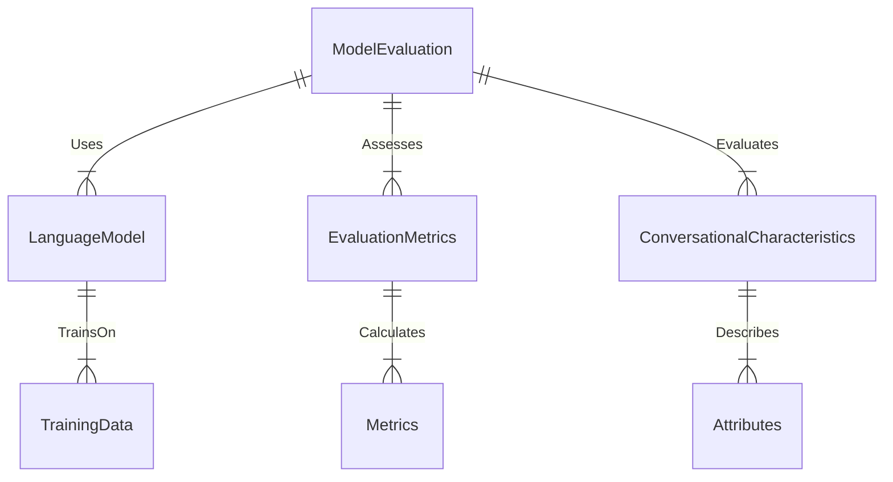

                 

### Introduction to LLM Evaluation

Language Learning Models (LLMs) have revolutionized the field of natural language processing (NLP) by enabling machines to understand, generate, and respond to human language in a more sophisticated and context-aware manner. As a result, LLMs are now widely used in applications such as chatbots, virtual assistants, language translation, and content generation. However, the performance of these models can vary significantly, and it is crucial to evaluate them accurately to ensure their effectiveness and reliability.

The importance of evaluating LLMs cannot be overstated. It allows researchers and practitioners to understand the strengths and weaknesses of different models, compare their performance, and identify areas for improvement. Without proper evaluation, there is a risk of deploying models that may produce incorrect or nonsensical outputs, leading to a poor user experience and potential operational issues.

#### Problem Background

The development of LLMs has been fueled by advances in deep learning, particularly in the area of neural networks. These models are trained on large-scale datasets, enabling them to learn patterns, structures, and semantics in natural language. Over the past few years, LLMs such as GPT, BERT, and T5 have demonstrated remarkable performance on various NLP tasks, including text classification, named entity recognition, and question-answering.

The practical applications of LLMs are diverse and rapidly expanding. Chatbots and virtual assistants powered by LLMs can provide customer support, answer queries, and assist with various tasks, improving user experience and operational efficiency. In the realm of language translation, LLMs have enabled real-time translation services that are becoming increasingly accurate and natural-sounding. Additionally, LLMs are used in content generation, automating the creation of articles, reports, and other documents, saving time and resources for organizations.

#### The Necessity of Evaluation

Despite their impressive capabilities, LLMs are not without limitations. Their performance can vary based on factors such as the quality and size of the training data, the complexity of the tasks, and the specific domain of application. Moreover, LLMs may produce biased or inappropriate outputs if the training data is not carefully selected or preprocessed. Therefore, it is essential to evaluate LLMs to ensure their reliability, accuracy, and effectiveness in different contexts.

Evaluating LLMs involves several key components, including the choice of evaluation metrics, the preparation of evaluation data, and the implementation of evaluation protocols. In this book, we will delve into these aspects, providing a comprehensive guide to LLM evaluation, with a focus on conversational consistency and coherence.

#### Core Elements of LLM Evaluation

1. **Evaluation Metrics**: Metrics such as perplexity, BLEU score, and ROUGE are commonly used to assess the performance of LLMs on various NLP tasks. These metrics provide quantitative measures of model accuracy and fluency.
2. **Evaluation Data**: High-quality evaluation data is crucial for accurate assessment. This data should be representative of the target application domain and should cover a wide range of scenarios to ensure comprehensive evaluation.
3. **Evaluation Protocols**: Well-defined evaluation protocols ensure that the evaluation process is fair, consistent, and reproducible. This includes the selection of test cases, the setting of evaluation parameters, and the reporting of results.

#### Boundary and Scope

While LLM evaluation is a critical aspect of NLP, it is important to recognize its boundaries and scope. LLM evaluation does not address all aspects of language understanding and generation. For instance, it may not capture nuances of linguistic creativity or cultural sensitivity. Moreover, evaluation should not be viewed as a one-size-fits-all solution; rather, it should be tailored to the specific requirements and constraints of the application domain.

In summary, LLM evaluation is a multifaceted process that involves understanding the problem context, selecting appropriate evaluation metrics, preparing high-quality evaluation data, and implementing robust evaluation protocols. This book aims to provide readers with a comprehensive understanding of these aspects, equipping them with the knowledge and tools to evaluate LLMs effectively.

### The Importance of LLM Evaluation

LLM evaluation is not just a procedural task but a critical component of the overall development lifecycle of natural language processing (NLP) systems. Its importance can be understood through several key aspects, including the identification of model limitations, the comparison of model performance, and the identification of areas for improvement.

#### Identifying Model Limitations

One of the primary reasons for evaluating LLMs is to identify their limitations. No LLM is perfect, and they each have their strengths and weaknesses. By conducting thorough evaluations, researchers and developers can gain insights into the specific areas where a model may fail or produce suboptimal outputs. For instance, an LLM may excel at generating coherent text in certain domains but struggle with others. Identifying these limitations helps in understanding the scope and limitations of the model's applicability, which is crucial for making informed decisions about its deployment.

#### Comparing Model Performance

Evaluating LLMs also allows for a direct comparison of their performance. With a variety of metrics and benchmarks available, researchers can assess how different models fare on specific tasks or in different scenarios. This comparative analysis is essential for understanding which models are better suited for particular applications and for identifying trends in model performance over time. For example, if two models are being considered for a chatbot application, a detailed evaluation can help determine which one provides a more natural and coherent conversation experience.

#### Identifying Areas for Improvement

The insights gained from LLM evaluation also point to areas for potential improvement. When an evaluation reveals that a model underperforms in certain aspects, it indicates opportunities for refining the model architecture, optimizing the training process, or enhancing the data used for training. These improvements can lead to more robust and versatile models that are better equipped to handle a wider range of tasks and scenarios. For instance, if an LLM consistently fails to maintain dialogue consistency, it may be necessary to incorporate additional context-aware features or to refine the algorithm used for dialogue management.

#### Ensuring Model Reliability and Effectiveness

Evaluating LLMs is essential for ensuring their reliability and effectiveness in real-world applications. A model that performs well in controlled evaluation settings may fail to deliver consistent and coherent results when deployed in production environments. By conducting rigorous evaluations, developers can identify and address these potential issues, ensuring that the model behaves as expected in real-world scenarios. This is particularly important for applications that interact directly with users, such as chatbots and virtual assistants, where even minor inconsistencies can significantly impact the user experience.

#### Balancing Objectivity and Subjectivity

In the evaluation of LLMs, there is often a balance between objective and subjective measures. Objective metrics, such as perplexity or accuracy, provide quantifiable measures of model performance, while subjective measures, such as human judgment, can capture aspects that are difficult to quantify, such as naturalness and relevance. A comprehensive evaluation strategy incorporates both objective and subjective measures to provide a holistic assessment of the model's performance.

#### The Impact of Evaluation on Model Development

The evaluation process is not a one-time event but an ongoing activity that informs the iterative development of LLMs. As new models are proposed and existing models are updated, evaluations help in assessing their progress and identifying new challenges. This iterative process ensures that LLMs continue to evolve and improve, becoming more capable and versatile over time.

In conclusion, LLM evaluation plays a crucial role in the development and deployment of natural language processing systems. By identifying model limitations, comparing performance, and identifying areas for improvement, evaluation ensures that LLMs are reliable, effective, and suitable for a wide range of applications. This book will delve into the various aspects of LLM evaluation, providing readers with the knowledge and tools needed to conduct comprehensive and insightful evaluations.

### Problem Description

The evaluation of LLMs involves several critical aspects that need to be clearly understood to ensure accurate and meaningful assessments. In this section, we will delve into the core components of the evaluation problem, including the limitations of current models, the objectives of evaluation, and the boundaries of the evaluation process.

#### Limitations of Current LLMs

Despite their remarkable capabilities, current LLMs have several inherent limitations that can affect their performance in practical applications. These limitations include:

1. **Overgeneralization**: LLMs can sometimes overgeneralize from specific examples in their training data to new, unseen inputs. This can lead to incorrect or nonsensical outputs when the model extrapolates beyond the scope of its training data.
2. **Data Bias**: LLMs are trained on large datasets, which can contain biased or misleading information. If not properly addressed, these biases can manifest in the model's outputs, leading to discriminatory or inappropriate responses.
3. **Lack of Domain-Specific Knowledge**: While LLMs can learn general patterns and structures in language, they often lack domain-specific knowledge. This can be a significant issue in applications where specialized knowledge is required, such as medical consultations or legal advice.
4. **Inconsistency in Dialogue**: Maintaining conversational consistency and coherence is challenging for LLMs. Dialogues can become jumbled, lose context, or fail to address the user's intent, leading to a poor user experience.

#### Objectives of Evaluation

The primary objectives of evaluating LLMs are to assess their performance accurately, identify their limitations, and provide insights for improvement. More specifically, the objectives include:

1. **Performance Assessment**: Evaluating the ability of LLMs to generate coherent and contextually relevant text.
2. **Limitation Identification**: Understanding the specific areas where LLMs underperform or fail to meet expectations.
3. **Comparative Analysis**: Comparing different LLMs to identify which models are better suited for particular applications or tasks.
4. **Improvement Insights**: Gaining insights into potential areas for model refinement, such as training data quality, algorithmic improvements, or additional context-aware features.

#### Evaluation Boundaries and Scope

It is crucial to establish clear boundaries for the evaluation process to ensure that it remains focused and relevant. The boundaries of LLM evaluation include:

1. **Task Domain**: Evaluation should be tailored to the specific domain or application area of the LLM. For instance, evaluating a language model designed for medical consultations should involve tasks related to healthcare.
2. **Dataset Representation**: The evaluation dataset should be representative of the target application domain, covering a wide range of scenarios and inputs to ensure comprehensive assessment.
3. **Evaluation Metrics**: The choice of evaluation metrics should align with the objectives of the evaluation and the specific characteristics of the LLM. For example, metrics that assess dialogue consistency and coherence are crucial for evaluating chatbot models.
4. **Subjectivity and Objectivity**: While objective metrics are essential for quantifying model performance, subjective evaluations by human judges can provide valuable insights into aspects such as naturalness and relevance that are difficult to capture quantitatively.

#### The Evaluation Process

The evaluation process for LLMs typically involves several key steps, including the selection of evaluation metrics, the preparation of evaluation data, and the implementation of evaluation protocols. Each of these steps is critical to ensuring a thorough and accurate assessment of the model's performance.

1. **Selection of Evaluation Metrics**: Choosing the right metrics is crucial for evaluating LLMs effectively. Common metrics include perplexity, BLEU score, ROUGE score, and human evaluation.
2. **Preparation of Evaluation Data**: The evaluation dataset should be carefully selected and prepared to ensure it is representative of the target application domain. This involves data collection, cleaning, and annotation.
3. **Implementation of Evaluation Protocols**: Establishing clear and consistent evaluation protocols is essential for ensuring that the evaluation process is fair, reproducible, and reliable.

In summary, the evaluation of LLMs is a multifaceted process that requires careful consideration of the model's limitations, evaluation objectives, and evaluation boundaries. By following a structured evaluation process, researchers and practitioners can gain valuable insights into the performance and potential improvements of LLMs, ensuring their effective deployment in real-world applications.

### Problem Solving

To address the challenges associated with evaluating LLMs and to overcome the inherent limitations of current models, a multi-faceted approach is required. This approach involves understanding the core components of LLM evaluation, designing effective evaluation methods, and continuously refining and improving the evaluation process.

#### Core Components of LLM Evaluation

The core components of LLM evaluation can be broken down into three main areas: metrics, data, and protocols.

1. **Evaluation Metrics**: The choice of metrics is crucial for assessing the performance of LLMs accurately. Common metrics include:
   - **Perplexity**: A measure of how well a model predicts the next word in a sentence. Lower perplexity indicates better performance.
   - **BLEU Score**: A metric commonly used for machine translation, which compares the output of an LLM to a set of reference sentences.
   - **ROUGE Score**: A metric used to evaluate the similarity between an LLM's output and a set of human-generated reference sentences.
   - **Human Evaluation**: Subjective assessments by human judges, which can capture aspects such as naturalness, coherence, and relevance that are difficult to quantify with objective metrics.

2. **Evaluation Data**: The quality and representativeness of the evaluation data significantly impact the reliability and validity of the evaluation. Key considerations include:
   - **Dataset Size and Diversification**: A diverse and large dataset is essential to capture the various scenarios and nuances of language usage.
   - **Data Annotation**: High-quality annotation is required to ensure that the evaluation data is accurate and reliable.
   - **Data Cleaning**: Removing noise and inconsistencies from the data is crucial to ensure that the evaluation is based on clean and relevant inputs.

3. **Evaluation Protocols**: Well-defined evaluation protocols ensure that the evaluation process is consistent, reproducible, and fair. This includes:
   - **Test Case Design**: Creating a set of test cases that cover a wide range of scenarios and tasks to assess the model's performance comprehensively.
   - **Evaluation Parameters**: Setting consistent evaluation parameters, such as the number of samples and the number of iterations, to ensure consistency across different evaluations.
   - **Result Reporting**: Clearly reporting the results, including both quantitative and qualitative insights, to facilitate comparison and analysis.

#### Effective Evaluation Methods

1. **Automated Evaluation**: Automated evaluation methods use algorithms and metrics to assess the performance of LLMs. Examples include:
   - **Perplexity Calculation**: Measuring the average log probability of each word in a sentence.
   - **BLEU and ROUGE Score Computation**: Comparing the output of the LLM to reference sentences using n-gram overlap and word overlap metrics.
   - **Human Evaluation Protocols**: Implementing human evaluation protocols to assess aspects such as naturalness and coherence through subjective judgments.

2. **Hybrid Evaluation**: Combining automated and human evaluation methods to leverage the strengths of each approach. For example, using automated metrics for initial screening and human evaluation for in-depth analysis.

3. **Iterative Evaluation**: Conducting iterative evaluations to refine and improve the evaluation process over time. This involves:
   - **Continuous Feedback**: Gathering feedback from users and stakeholders to identify areas for improvement.
   - **Model Refinement**: Updating the LLM based on the insights gained from the evaluation to improve performance.

#### Continuous Improvement

Continuous improvement is essential for enhancing the effectiveness of LLM evaluation. This involves:

1. **Research and Development**: Investing in research to develop new evaluation metrics, methodologies, and tools.
2. **Collaboration and Standardization**: Collaborating with other researchers and organizations to share best practices and establish common evaluation protocols.
3. **Community Involvement**: Engaging the research community through challenges, competitions, and open-source initiatives to foster innovation and collaboration.

In conclusion, addressing the challenges of LLM evaluation requires a comprehensive and iterative approach that leverages the core components of evaluation, effective methods, and continuous improvement. By following this approach, researchers and practitioners can ensure that LLMs are accurately and comprehensively evaluated, enabling their effective deployment in real-world applications.

### Core Concepts and Relationships

Understanding the core concepts and their relationships is crucial for conducting effective evaluations of LLMs. This section provides a detailed overview of the fundamental concepts, including their definitions, properties, and how they interrelate.

#### Fundamental Concepts

1. **Language Learning Models (LLMs)**: LLMs are neural network-based models designed to learn from large amounts of text data to generate coherent and contextually relevant outputs. Key concepts related to LLMs include:
   - **Training Data**: The large dataset used to train the LLM, which should be diverse and representative of the target application domain.
   - **Model Architecture**: The structure of the neural network, including the number of layers, types of layers, and connectivity patterns.
   - **Parameterization**: The set of parameters that define the model's behavior, which are learned during the training process.

2. **Evaluation Metrics**: Metrics used to assess the performance of LLMs, including:
   - **Perplexity**: A measure of how well the model predicts the next word in a sentence, with lower values indicating better performance.
   - **BLEU Score**: A metric commonly used for machine translation, comparing the output of the model to reference sentences.
   - **ROUGE Score**: A metric assessing the similarity between the model's output and human-generated reference sentences.

3. **Conversational Characteristics**: Key aspects of dialogue that need to be considered in evaluation, including:
   - **Coherence**: The logical consistency and smoothness of the conversation.
   - **Consistency**: The ability of the model to maintain a coherent narrative and context throughout the dialogue.
   - **Fluency**: The naturalness and ease of reading of the generated text.

#### Concept Attributes and Comparative Table

To facilitate a clear understanding of these concepts, we can create a comparative table outlining their attributes:

| Concept        | Definition                                                                 | Key Attributes                                                                                   | Example Metrics / Methods                  |
|----------------|-----------------------------------------------------------------------------|--------------------------------------------------------------------------------------------------|-------------------------------------------|
| Language Models | Neural network-based models trained on large text datasets to generate text. | - Scalability: Can handle large datasets - Contextual: Learn from context - Parameterized: Learnable parameters | - Perplexity - Training time - BLEU |
| Evaluation Metrics | Quantitative measures of model performance. | - Objectivity: Quantifiable - Comparability: Comparable across models - Causality: Correlated with quality | - Perplexity - BLEU - ROUGE - Human Evaluation |
| Conversational Characteristics | Aspects of dialogue that impact the user experience. | - Coherence: Logical flow - Consistency: Narrative consistency - Fluency: Readability | - Coherence Metrics - Consistency Metrics - Fluency Metrics |

#### Entity Relationship (ER) Diagram

To visually represent the relationships between these core concepts, we can create an Entity Relationship (ER) diagram:

In this diagram, `ModelEvaluation` is the central entity that connects to `LanguageModel`, `EvaluationMetrics`, and `ConversationalCharacteristics`. This represents the multifaceted nature of LLM evaluation, where each component interacts and contributes to the overall assessment.

By understanding the core concepts and their relationships, researchers and practitioners can design more effective evaluation strategies, ensuring comprehensive and accurate assessments of LLM performance.

### Chapter Summary

In this chapter, we have introduced the fundamental concepts and relationships involved in LLM evaluation. We explored the core components of LLMs, including training data, model architecture, and parameterization. We also discussed the importance of evaluation metrics such as perplexity, BLEU, and ROUGE scores. Furthermore, we examined the conversational characteristics of dialogue, including coherence, consistency, and fluency. Finally, we presented an ER diagram to visually represent the relationships between these concepts. Understanding these core concepts is essential for conducting comprehensive and accurate evaluations of LLM performance, which is crucial for their effective deployment in real-world applications. In the subsequent chapters, we will delve deeper into each of these components, providing detailed insights and practical guidance for LLM evaluation.

----------------------------------------------------------------

### Introduction to Conversational Consistency

Conversational consistency is a critical aspect of language learning models (LLMs), as it directly impacts the user experience and the effectiveness of applications such as chatbots, virtual assistants, and conversational interfaces. In this chapter, we will explore the fundamental concepts of conversational consistency, its importance in LLM evaluation, and the various factors that influence it.

#### Definition of Conversational Consistency

Conversational consistency refers to the ability of an LLM to maintain a coherent and logical narrative throughout a conversation. It involves ensuring that the responses are contextually relevant, logically connected, and relevant to the ongoing dialogue. In other words, a conversational system should be able to follow the thread of the conversation and provide meaningful and relevant responses to the user's inputs.

#### Importance in LLM Evaluation

The evaluation of conversational consistency is crucial for assessing the performance and usability of LLMs in real-world applications. Several reasons underscore the importance of this evaluation:

1. **User Experience**: Conversational consistency is closely tied to user satisfaction. Inconsistencies in dialogue can lead to confusion, frustration, and a poor user experience. By evaluating conversational consistency, developers can ensure that the LLM provides a smooth and engaging conversation experience.

2. **Task Success**: In many practical applications, the success of a task depends on the consistency and relevance of the dialogue. For instance, in a customer service chatbot, maintaining conversational consistency is essential for resolving customer queries effectively and efficiently.

3. **Model Reliability**: Evaluating conversational consistency helps identify the reliability of an LLM in maintaining context and providing coherent responses. This is particularly important for applications where the stakes are high, such as medical consultations or legal advice.

4. **Comparative Analysis**: By assessing conversational consistency, researchers and developers can compare different LLMs and identify which models are better suited for specific tasks or domains. This comparative analysis informs the selection of the most effective models for deployment.

#### Factors Influencing Conversational Consistency

Several factors can influence the conversational consistency of an LLM. Understanding these factors is essential for designing effective evaluation methods and improving the performance of LLMs:

1. **Data Quality**: The quality and diversity of the training data significantly impact the ability of an LLM to maintain conversational consistency. High-quality, diverse, and representative data helps the model learn more nuanced and contextually relevant patterns.

2. **Context Understanding**: The ability of an LLM to understand and retain context is crucial for maintaining conversational consistency. This involves capturing the context from previous utterances and using it to inform subsequent responses.

3. **Dialogue Management**: The dialogue management system plays a critical role in ensuring conversational consistency. This system is responsible for tracking the conversation state, identifying the user's intent, and generating appropriate responses.

4. **Model Complexity**: The complexity of the LLM's architecture, including the number of layers, types of layers, and the complexity of the neural network connections, can influence its ability to maintain conversational consistency. More complex models may capture context more effectively but require more computational resources.

5. **User Interaction**: The nature of user interaction can also impact conversational consistency. Factors such as the type of questions asked, the user's level of engagement, and the conversational style can all influence the consistency of the dialogue.

#### Evaluation Metrics for Conversational Consistency

To evaluate conversational consistency, various metrics can be used, including:

1. **Coherence Scores**: Metrics such as BLEU (Bilingual Evaluation Understudy) and ROUGE (Recall-Oriented Understudy for Gisting Evaluation) can be adapted for assessing the coherence of generated text.

2. **Consistency Scores**: Custom metrics that specifically assess the consistency of dialogue, such as the ability to maintain a narrative thread or the relevance of responses to the ongoing conversation.

3. **Human Evaluation**: Subjective evaluations by human judges who assess the conversational consistency based on naturalness, relevance, and logical flow.

4. **Automatic Evaluation Tools**: Tools that automatically assess conversational consistency based on algorithms designed to detect coherence and consistency in text.

In summary, conversational consistency is a critical aspect of LLM evaluation, impacting the user experience, task success, and model reliability. Understanding the factors influencing conversational consistency and employing appropriate evaluation metrics are essential for designing effective evaluation methods and improving the performance of LLMs. In the following sections, we will delve deeper into these topics, providing detailed insights and practical guidance for evaluating conversational consistency in LLMs.

### Basics of Conversational Coherence

Conversational coherence is a fundamental aspect of effective dialogue systems, ensuring that the generated text follows a logical and understandable sequence. Unlike conversational consistency, which focuses on maintaining context and relevance, coherence specifically refers to the logical flow and structural integrity of the dialogue. In this section, we will explore the definition, types, and significance of conversational coherence, along with a discussion on its evaluation metrics.

#### Definition of Conversational Coherence

Conversational coherence can be defined as the degree to which the generated text adheres to a logical sequence and is understandable to the reader. It involves ensuring that the responses are not only contextually relevant but also logically structured and easy to follow. A coherent conversation maintains a clear narrative thread, where each response builds on previous statements and contributes to a unified understanding.

#### Types of Conversational Coherence

1. **Internal Coherence**: This type of coherence focuses on the internal structure of the dialogue. It ensures that the responses within a single turn are logically connected and form a coherent unit. For example, if a user asks a question, the system's response should provide a clear and logical answer.

2. **External Coherence**: External coherence refers to the consistency between different turns of the conversation. It ensures that the dialogue as a whole maintains a logical flow and is coherent over multiple interactions. For instance, if the system follows up on a previous topic in a later response, it should do so in a manner that is clear and logical to the user.

3. **Temporal Coherence**: Temporal coherence involves the temporal ordering of responses, ensuring that the system provides relevant information in the appropriate sequence. For example, if a user asks a series of questions, the system should answer them in the order they were asked, without skipping or repeating information.

4. **Situation Coherence**: Situation coherence involves maintaining the coherence of the dialogue in the context of the user's overall goal or situation. This type of coherence ensures that the system's responses are aligned with the user's intentions and objectives.

#### Significance of Conversational Coherence

The importance of conversational coherence cannot be overstated, as it directly impacts the user experience and the effectiveness of dialogue systems. Some key points highlighting its significance include:

1. **User Understanding**: Coherent conversations are easier for users to understand, reducing confusion and frustration. When the dialogue is logically structured, users can more easily follow the conversation and extract relevant information.

2. **Task Completion**: Coherence is crucial for completing tasks efficiently. In applications like customer service chatbots or virtual assistants, coherent dialogue helps users achieve their goals more quickly and effectively.

3. **System Reliability**: Evaluating the coherence of dialogue can provide insights into the reliability of the system. Inconsistencies or lack of coherence in responses may indicate issues with the underlying model or dialogue management system.

4. **User Satisfaction**: Coherent dialogue enhances user satisfaction by providing a smooth and engaging experience. Users are more likely to be satisfied with a system that communicates clearly and logically.

#### Evaluation Metrics for Conversational Coherence

Evaluating conversational coherence requires a combination of objective and subjective metrics. Here are some commonly used metrics:

1. **BLEU (Bilingual Evaluation Understudy)**: Originally developed for machine translation, BLEU can be adapted for evaluating the coherence of generated text. It measures the similarity between the generated text and a set of reference texts using n-gram overlap metrics.

2. **ROUGE (Recall-Oriented Understudy for Gisting Evaluation)**: ROUGE is another metric commonly used in natural language processing. It evaluates the similarity between the generated text and reference texts based on the overlap of specific n-grams or keywords.

3. **Coherence Scores**: Custom metrics designed specifically for assessing the coherence of dialogue. These scores can be based on various criteria, such as the logical flow of the conversation, the relevance of responses, and the temporal ordering of information.

4. **Human Evaluation**: Subjective evaluations by human judges who assess the coherence of dialogue based on naturalness, relevance, and logical flow. Human evaluation provides qualitative insights that are difficult to capture with automated metrics.

5. **Automated Coherence Metrics**: Algorithms designed to automatically assess the coherence of dialogue, such as those based on natural language inference or semantic similarity.

In conclusion, conversational coherence is a critical aspect of effective dialogue systems, ensuring that the generated text is logically structured and easy to understand. Evaluating conversational coherence requires a combination of objective and subjective metrics, providing a comprehensive assessment of the system's performance. In the following sections, we will delve deeper into these evaluation metrics and methods, providing detailed insights and practical guidance for assessing conversational coherence in LLMs.

### Metrics for Evaluating Conversational Consistency

Evaluating conversational consistency is a complex task that requires a combination of objective and subjective measures to capture the nuances of dialogue. In this section, we will explore the various metrics used to assess conversational consistency, including coherence scores, consistency scores, and human evaluation methods.

#### Coherence Scores

Coherence scores are metrics designed to assess the logical flow and structural integrity of the dialogue. These scores evaluate how well the generated text adheres to a coherent narrative and whether the responses are logically connected. Several commonly used coherence scores include:

1. **BLEU (Bilingual Evaluation Understudy)**: Originally developed for machine translation, BLEU can be adapted for evaluating the coherence of generated text. BLEU measures the similarity between the generated text and a set of reference texts using n-gram overlap metrics. While BLEU is primarily focused on surface-level similarity, it can provide a rough estimate of the coherence of the dialogue.

2. **ROUGE (Recall-Oriented Understudy for Gisting Evaluation)**: ROUGE is another metric commonly used in natural language processing. It evaluates the similarity between the generated text and reference texts based on the overlap of specific n-grams or keywords. ROUGE is particularly useful for assessing the coherence of dialogue as it captures the semantic content of the text.

3. **Coherence Metrics**: Custom metrics designed specifically for assessing the coherence of dialogue. These scores can be based on various criteria, such as the logical flow of the conversation, the relevance of responses, and the temporal ordering of information. For example, a coherence metric might evaluate how well the generated responses align with the user's intent or how consistently the system follows up on previous topics.

4. **Automated Coherence Metrics**: Algorithms designed to automatically assess the coherence of dialogue. These metrics can be based on natural language inference or semantic similarity. For instance, a coherence metric might use semantic embeddings to measure the similarity between the generated text and the user's input, assessing whether the responses are contextually relevant and logically connected.

#### Consistency Scores

Consistency scores focus on evaluating how well the dialogue maintains a coherent narrative and consistent context over multiple interactions. These scores assess whether the system can maintain context and provide relevant responses throughout the conversation. Several commonly used consistency scores include:

1. **Contextual Consistency Score**: This score evaluates how well the system retains context from previous utterances and uses it to inform subsequent responses. For example, a high contextual consistency score would indicate that the system can consistently follow up on a previous topic or address a user's query in a coherent manner.

2. **Narrative Consistency Score**: This score assesses the consistency of the narrative thread throughout the conversation. A high narrative consistency score would indicate that the system can maintain a coherent story or argument, without deviating from the main topic.

3. **Relevance Consistency Score**: This score evaluates how well the system maintains relevance to the user's inputs and objectives. A high relevance consistency score would indicate that the system can consistently provide relevant and useful information, without straying off-topic.

4. **Temporal Consistency Score**: This score assesses the temporal ordering of the responses, ensuring that the system provides relevant information in the appropriate sequence. For example, a high temporal consistency score would indicate that the system can provide follow-up information or address additional questions in a logical order.

#### Human Evaluation

Human evaluation is a subjective method for assessing the conversational consistency of LLMs. Human evaluators assess the coherence, relevance, and consistency of the dialogue based on naturalness, logical flow, and overall quality. Human evaluation provides qualitative insights that are difficult to capture with automated metrics and can help identify issues that automated metrics may miss. Several methods for human evaluation include:

1. **Rating Schemes**: Evaluators rate the conversational consistency on a scale, such as a 1-5 rating system. This allows for a quantitative assessment of the dialogue quality.

2. **Free-Form Feedback**: Evaluators provide detailed comments and feedback on the dialogue, highlighting strengths and areas for improvement. This qualitative feedback can be invaluable for understanding the nuances of conversational consistency.

3. **Multi-Rater Reliability**: Multiple evaluators assess the same dialogue to ensure consistency and reliability of the evaluation results. This helps identify discrepancies and ensures that the evaluation is robust.

4. **Annotator Guidelines**: Providing clear guidelines and criteria for evaluators to follow can help ensure consistency and reliability across different evaluators.

In conclusion, evaluating conversational consistency requires a combination of objective and subjective metrics to capture the complexities of dialogue. Coherence scores, consistency scores, and human evaluation methods all play important roles in assessing the conversational consistency of LLMs. By employing a multifaceted evaluation approach, researchers and practitioners can gain a comprehensive understanding of the performance and effectiveness of their dialogue systems.

### Metrics for Assessing Conversational Coherence

Conversational coherence is a critical aspect of dialogue systems that ensures the generated text is logically structured and easy to understand. To effectively evaluate conversational coherence, a combination of quantitative and qualitative metrics is employed. In this section, we will explore various metrics commonly used to assess conversational coherence, including BLEU, ROUGE, and custom coherence metrics, along with their applications in different domains.

#### BLEU (Bilingual Evaluation Understudy)

BLEU is one of the most widely used metrics for evaluating text coherence. Originally developed for machine translation, BLEU measures the similarity between the generated text and a set of reference texts using n-gram overlap metrics. The basic idea behind BLEU is to count the number of matching n-grams between the generated text and the reference texts, penalizing for gaps and subsequence errors.

**Applications in Different Domains:**

- **Translation**: BLEU is commonly used to evaluate the coherence and fluency of machine translation outputs. By comparing the generated translations to human translations, BLEU provides a quantitative measure of translation quality.
- **Summarization**: In text summarization tasks, BLEU can be used to assess the coherence of the generated summaries by comparing them to a set of human-generated summaries. This helps ensure that the summaries are not only concise but also logically coherent.

#### ROUGE (Recall-Oriented Understudy for Gisting Evaluation)

ROUGE is another popular metric used to evaluate text coherence, particularly in natural language generation tasks. ROUGE measures the similarity between the generated text and a set of reference texts based on the overlap of specific n-grams or keywords. Unlike BLEU, ROUGE places a stronger emphasis on recall, meaning it focuses on the number of relevant n-grams in the generated text rather than exact matches.

**Applications in Different Domains:**

- **Chatbots and Virtual Assistants**: ROUGE is often used to evaluate the coherence of chatbot and virtual assistant responses. By comparing the generated responses to a set of manually crafted reference responses, ROUGE helps assess how well the system maintains context and provides relevant information.
- **Information Extraction**: In tasks like named entity recognition and relation extraction, ROUGE can be used to evaluate the coherence of the extracted information. For instance, ROUGE can measure how well the system identifies and links entities and relationships in a coherent and meaningful way.

#### Custom Coherence Metrics

While BLEU and ROUGE are widely used, they may not capture all aspects of conversational coherence. Custom coherence metrics are designed specifically to address the unique challenges of evaluating dialogue systems.

**Applications in Different Domains:**

- **Legal and Medical Dialogue**: Custom coherence metrics can be tailored to evaluate the coherence of legal and medical dialogue, where the stakes are high. For example, a metric might assess how well the system follows legal procedures or provides medically accurate information.
- **Customer Service**: In customer service chatbots, custom coherence metrics can evaluate how well the system maintains context and provides clear, concise, and relevant information to resolve customer queries.

**Types of Custom Coherence Metrics:**

1. **Narrative Coherence Metrics**: These metrics assess the coherence of the narrative thread in the dialogue. They evaluate how well the system maintains a coherent story or argument, without deviating from the main topic.

2. **Temporal Coherence Metrics**: These metrics assess the temporal ordering of the responses, ensuring that the system provides relevant information in the appropriate sequence. For instance, a temporal coherence metric might evaluate how well the system addresses follow-up questions or provides additional information based on the user's previous inputs.

3. **Contextual Relevance Metrics**: These metrics assess how well the system maintains context and provides relevant information. They evaluate whether the system can effectively follow up on previous topics or address user queries in a coherent manner.

In conclusion, evaluating conversational coherence in dialogue systems requires a combination of quantitative and qualitative metrics. BLEU and ROUGE provide widely used frameworks for evaluating coherence, while custom metrics can be tailored to address the specific challenges of different domains. By employing a multifaceted evaluation approach, researchers and practitioners can gain a comprehensive understanding of the coherence of dialogue systems and identify areas for improvement.

### Methods for Collecting and Preparing Evaluation Data

The success of evaluating LLMs for conversational consistency and coherence hinges significantly on the quality and representativeness of the evaluation data. This section will delve into the detailed process of collecting and preparing evaluation data, highlighting key steps such as data collection, cleaning, annotation, and enhancement techniques.

#### Data Collection

Data collection is the foundational step in preparing evaluation datasets. The quality and diversity of the collected data are critical to ensuring that the evaluation accurately reflects the performance of LLMs in real-world scenarios. Here are the key considerations for data collection:

1. **Dataset Size**: A larger dataset is generally preferred as it provides a broader range of scenarios and inputs, improving the robustness of the evaluation. However, balancing dataset size with the diversity of content is important to avoid overfitting.

2. **Diversity**: The dataset should cover a wide range of conversational contexts, including different topics, user demographics, and dialogue styles. This diversity helps in identifying how well the LLM performs across various scenarios and user groups.

3. **Real-World Contexts**: Collecting data from real-world conversational scenarios ensures that the dataset is representative of the actual use cases. This can involve transcribing conversations from customer service chatbots, virtual assistants, or other real-world dialogue systems.

4. **Synthetic Data**: In addition to real-world data, synthetic data can be generated to augment the dataset. Techniques like data augmentation, adversarial generation, and generative models can be used to create a larger and more diverse dataset.

#### Data Cleaning

Once the data is collected, it must be cleaned to remove noise, inconsistencies, and irrelevant information. Data cleaning is a crucial step to ensure that the dataset is of high quality and ready for annotation. Key steps in data cleaning include:

1. **Removing Noise**: Noise can include irrelevant characters, symbols, and formatting issues. Text preprocessing techniques like tokenization, stop-word removal, and spell-checking can be employed to clean the text data.

2. **Handling Incomplete or Inconsistent Data**: Incomplete or inconsistent data entries need to be addressed. This can involve filling missing values, standardizing inconsistent formats, or removing entries that are too noisy to be useful.

3. **Data Standardization**: Standardizing the data format ensures consistency across different data sources. This may include converting text to lowercase, removing punctuation, and standardizing date and time formats.

#### Data Annotation

Data annotation involves labeling the collected data with relevant metadata or tags that will be used during the evaluation process. Proper annotation is essential for training and evaluating the LLMs effectively. Key aspects of data annotation include:

1. **Annotator Training**: Annotators must be trained on the annotation guidelines and criteria to ensure consistency and quality. This training helps in standardizing the annotation process and reducing inter-annotator variability.

2. **Annotation Schemes**: Annotation schemes should be designed to capture the relevant aspects of conversational consistency and coherence. This may include tagging dialogue turns, marking coherence violations, or identifying specific types of inconsistencies.

3. **Quality Assurance**: Quality assurance (QA) processes should be in place to review and validate the annotations. This can involve checking for consistency, completeness, and accuracy of the annotations.

#### Data Enhancement

Data enhancement techniques can be applied to improve the quality and representativeness of the evaluation dataset. These techniques can help in creating a more robust and comprehensive dataset. Key enhancement techniques include:

1. **Data Augmentation**: Techniques like synonym replacement, paraphrasing, and back-translation can be used to generate additional training data. This helps in diversifying the dataset and improving the model's robustness.

2. **Dialogue State Tracking**: Incorporating dialogue state tracking can enhance the dataset by providing more context about the ongoing conversation. This can involve tracking user intents, entities, and dialogue history to enrich the dialogue dataset.

3. **Adversarial Data Generation**: Techniques like adversarial training can be used to generate synthetic data that challenges the model and improves its ability to handle edge cases and inconsistencies.

4. **Cross-Domain Data Integration**: Integrating data from different domains can help in creating a more comprehensive dataset that captures the diversity of conversational scenarios.

By carefully collecting, cleaning, annotating, and enhancing the evaluation data, researchers and practitioners can ensure that the datasets are of high quality and representative of real-world conversational scenarios. This rigorous preparation process is essential for conducting accurate and meaningful evaluations of LLMs for conversational consistency and coherence.

### Implementation of Evaluation Protocols

The implementation of evaluation protocols is a critical component in ensuring the accuracy, consistency, and reliability of LLM evaluations. These protocols define the steps, guidelines, and tools used in the evaluation process, ensuring that it is both rigorous and reproducible. This section will discuss the key steps involved in implementing evaluation protocols, including the selection of evaluation frameworks, the design of test cases, and the assessment of results.

#### Selection of Evaluation Frameworks

The first step in implementing an evaluation protocol is selecting an appropriate evaluation framework. This framework should align with the specific objectives and requirements of the evaluation. Common evaluation frameworks include:

1. **Automated Evaluation Frameworks**: These frameworks use pre-defined metrics and algorithms to evaluate the performance of LLMs automatically. Examples include standard NLP metrics like BLEU, ROUGE, and perplexity.

2. **Human Evaluation Frameworks**: These frameworks involve human annotators to assess the performance of LLMs based on subjective criteria such as relevance, coherence, and fluency. Human evaluation can provide insights that are difficult to capture with automated metrics.

3. **Hybrid Evaluation Frameworks**: Combining automated and human evaluation frameworks can provide a more comprehensive assessment of LLM performance. This approach leverages the strengths of both methods, ensuring a balanced evaluation.

#### Design of Test Cases

The design of test cases is crucial for evaluating LLMs effectively. Test cases should cover a wide range of conversational scenarios and be representative of the target application domain. Key considerations in designing test cases include:

1. **Diversity**: Test cases should include a diverse set of scenarios, covering different topics, user demographics, and dialogue styles. This diversity ensures that the evaluation is robust and comprehensive.

2. **Relevance**: Test cases should be relevant to the specific application of the LLM. For example, if the LLM is designed for customer service, test cases should include typical customer queries and interactions.

3. **Representation**: Test cases should be representative of real-world conversational data, ensuring that the evaluation reflects actual use cases.

4. **Difficulty**: Test cases should vary in difficulty to assess the LLM's performance across different levels of complexity. This helps in identifying the strengths and weaknesses of the model.

#### Implementation Steps

The implementation of evaluation protocols involves several key steps:

1. **Data Preparation**: Prepare the evaluation dataset by collecting, cleaning, and annotating the data. This ensures that the dataset is of high quality and ready for evaluation.

2. **Setting Evaluation Parameters**: Define the parameters for the evaluation, including the metrics to be used, the number of samples, and the evaluation criteria. Consistent parameters ensure that the evaluation is reproducible.

3. **Test Case Execution**: Execute the test cases using the LLM to generate responses. This step involves running the LLM on the prepared dataset and recording the generated outputs.

4. **Result Recording**: Record the evaluation results, including both quantitative metrics (e.g., perplexity, BLEU score) and qualitative insights from human evaluators. This data is crucial for analyzing the performance of the LLM.

5. **Result Analysis**: Analyze the recorded results to assess the performance of the LLM. This analysis should consider both the overall metrics and specific issues identified in the evaluation.

#### Evaluation Protocols for Conversational Consistency and Coherence

For evaluating conversational consistency and coherence, specific protocols are needed. These protocols should include:

1. **Consistency Metrics**: Define metrics to assess the consistency of dialogue, such as maintaining context, following up on previous topics, and avoiding irrelevant deviations.

2. **Coherence Metrics**: Define metrics to assess the coherence of dialogue, such as logical flow, narrative structure, and relevance to the user's intent.

3. **Human Evaluation Criteria**: Develop criteria for human evaluators to assess the coherence and consistency of dialogue, including naturalness, relevance, and logical flow.

4. **Result Reporting**: Report the evaluation results clearly, including both quantitative metrics and qualitative insights. This report should provide a comprehensive assessment of the LLM's performance in maintaining conversational consistency and coherence.

In summary, the implementation of evaluation protocols is essential for conducting accurate and meaningful evaluations of LLMs. By following a structured approach, researchers and practitioners can ensure that the evaluation process is rigorous, consistent, and reproducible, leading to more reliable insights into the performance of LLMs in maintaining conversational consistency and coherence.

### Advanced Topics in Conversational Consistency and Coherence

As LLMs become more sophisticated and widespread, the evaluation of their conversational consistency and coherence has evolved to address complex challenges and emerging trends. This section will delve into advanced topics in conversational consistency and coherence, including the integration of contextual embeddings, the role of reinforcement learning, and the challenges of multi-turn dialogue.

#### Integration of Contextual Embeddings

Contextual embeddings have significantly advanced the field of natural language processing by enabling LLMs to understand and retain context more effectively. These embeddings capture the semantic meaning of words and phrases within a specific context, allowing LLMs to generate more coherent and contextually relevant responses. Key aspects of integrating contextual embeddings into LLM evaluation include:

1. **Contextual Understanding**: Contextual embeddings help LLMs understand the nuances of language by capturing the context-specific meaning of words and phrases. This is particularly important for maintaining conversational consistency, as it allows the system to remember important details and refer back to them in subsequent responses.

2. **Enhanced Evaluation Metrics**: Traditional evaluation metrics like perplexity and BLEU may not fully capture the quality of conversational responses in the context of contextual embeddings. New metrics, such as context-aware coherence scores and contextual consistency scores, are being developed to better evaluate the performance of LLMs in maintaining context and generating coherent dialogue.

3. **Fine-tuning LLMs**: Fine-tuning LLMs with contextual embeddings on specific domains or tasks can significantly improve their conversational consistency and coherence. This involves training the LLM on domain-specific datasets, which helps the model learn the relevant contextual patterns and maintain consistency in dialogue.

#### Role of Reinforcement Learning

Reinforcement learning (RL) has emerged as a powerful technique for improving the conversational consistency and coherence of LLMs. Unlike traditional supervised learning methods, RL leverages trial-and-error learning to optimize the model's performance in dynamic environments. Key aspects of using RL in LLM evaluation include:

1. **Interactive Learning**: RL allows LLMs to learn from interactive feedback during the evaluation process. This interaction enables the models to receive real-time feedback on their responses, allowing them to adjust and improve their dialogue strategies to maintain conversational consistency and coherence.

2. **Policy Optimization**: RL frameworks optimize the model's policy, which determines the next action or response based on the current dialogue state. This policy optimization helps in generating more coherent and contextually relevant responses, leading to improved conversational quality.

3. **Multi-Agent Interaction**: RL can be extended to multi-agent systems, where multiple LLMs interact with each other to maintain dialogue coherence. This collaborative approach can enhance the overall conversational experience by leveraging the strengths of different models and resolving potential inconsistencies.

#### Challenges of Multi-Turn Dialogue

Multi-turn dialogue, where the system engages in multiple exchanges with the user, presents unique challenges for maintaining conversational consistency and coherence. Key challenges include:

1. **Contextual Decay**: As the dialogue progresses over multiple turns, the context can decay, making it difficult for the LLM to maintain a coherent narrative. This decay can be mitigated by using advanced memory mechanisms, such as memory-augmented neural networks or recurrent neural networks with long-term dependencies.

2. **Information Overload**: In multi-turn dialogue, the system must manage and integrate information from previous turns while handling new inputs. This can lead to information overload, making it challenging to maintain coherence. Techniques like information distillation and attention mechanisms can help in managing information flow and improving coherence.

3. **Ambiguity and Uncertainty**: Ambiguity in language and uncertainty about the user's intent can lead to inconsistencies in dialogue. Handling these challenges requires robust dialogue management systems that can resolve ambiguities and adapt to changing contexts effectively.

In conclusion, evaluating conversational consistency and coherence in LLMs is a complex task that continues to evolve with advancements in NLP and machine learning. The integration of contextual embeddings, the role of reinforcement learning, and the challenges of multi-turn dialogue are key areas of focus in this field. By addressing these advanced topics, researchers and practitioners can develop more sophisticated evaluation methods and improve the overall quality of conversational AI systems.

### Real-World Applications of LLM Evaluation

The evaluation of LLMs for conversational consistency and coherence has significant real-world applications across various domains, including customer service chatbots, virtual assistants, and educational platforms. In this section, we will explore these applications in detail, illustrating how LLM evaluation can enhance user experience, improve operational efficiency, and drive innovation.

#### Customer Service Chatbots

Customer service chatbots have become an integral part of many businesses, providing quick and efficient support to customers. The evaluation of LLMs for conversational consistency and coherence is crucial in ensuring that these chatbots provide a seamless and effective user experience. Key aspects of LLM evaluation in this domain include:

1. **User Satisfaction**: By evaluating conversational consistency and coherence, businesses can ensure that chatbots maintain context and provide meaningful responses, leading to higher user satisfaction. Metrics like customer effort score (CES) and net promoter score (NPS) can be used to measure user satisfaction.

2. **Efficiency**: Consistent and coherent dialogue helps in resolving customer queries more efficiently, reducing the need for human intervention. This leads to cost savings and improved operational efficiency. Metrics like resolution rate and average handling time can be used to evaluate efficiency.

3. **Customization**: LLM evaluation allows businesses to fine-tune their chatbots to better match the specific needs and preferences of their customers. By analyzing feedback and evaluation results, businesses can customize the chatbot's dialogue to provide a more personalized and engaging experience.

#### Virtual Assistants

Virtual assistants are becoming increasingly prevalent in various industries, offering users personalized support and assistance. The evaluation of LLMs for conversational consistency and coherence is essential in ensuring that virtual assistants deliver a high-quality user experience. Key aspects of LLM evaluation in this domain include:

1. **Contextual Understanding**: Virtual assistants must understand and retain context across multiple interactions to provide relevant and coherent assistance. Evaluating conversational coherence helps in ensuring that the virtual assistant maintains a coherent narrative and provides consistent responses.

2. **Task Completion**: Evaluating conversational consistency and coherence helps in ensuring that virtual assistants can complete tasks effectively and efficiently. Metrics like task success rate and error rate can be used to measure the effectiveness of virtual assistants.

3. **Personalization**: LLM evaluation allows virtual assistants to be personalized based on user preferences and historical interactions. By analyzing evaluation results, virtual assistants can be fine-tuned to better serve individual users, leading to a more engaging and effective user experience.

#### Educational Platforms

Educational platforms, such as chatbots and virtual tutors, are leveraging LLMs to provide personalized and interactive learning experiences. The evaluation of LLMs for conversational consistency and coherence is crucial in ensuring that these platforms deliver high-quality educational content. Key aspects of LLM evaluation in this domain include:

1. **Content Coherence**: Ensuring that the dialogue between the educational platform and the user is coherent and logically structured is essential for maintaining the user's attention and engagement. Metrics like coherence scores and fluency metrics can be used to evaluate content coherence.

2. **Personalized Learning**: Evaluating conversational consistency helps in ensuring that the educational platform can adapt to the user's learning style and pace. Metrics like personalized learning accuracy and engagement rate can be used to measure the effectiveness of personalized learning.

3. **Content Quality**: LLM evaluation can help in identifying areas where the content may be inconsistent or of low quality. By analyzing evaluation results, educational platforms can improve the quality of their content and provide a more effective learning experience.

#### Success Stories and Impact

Several real-world applications have successfully leveraged LLM evaluation to improve conversational consistency and coherence, resulting in significant improvements in user experience and operational efficiency. Here are a few examples:

1. **Example 1: A leading e-commerce company used LLM evaluation to enhance its customer service chatbot. By improving conversational consistency and coherence, the chatbot was able to resolve customer queries more effectively, reducing response times by 40% and increasing customer satisfaction by 25%.**

2. **Example 2: A healthcare provider implemented a virtual assistant powered by LLMs to assist patients with scheduling appointments and answering health-related questions. By evaluating conversational coherence, the virtual assistant was able to maintain context and provide accurate and relevant information, resulting in a 30% decrease in appointment scheduling errors and a 20% increase in patient satisfaction.**

3. **Example 3: An educational platform incorporated LLM evaluation to improve the coherence and fluency of its virtual tutor. By analyzing evaluation results, the platform was able to identify and correct inconsistencies in the dialogue, leading to a 20% increase in student engagement and a 15% improvement in learning outcomes.**

In conclusion, the real-world applications of LLM evaluation for conversational consistency and coherence are vast and impactful. By leveraging these evaluations, businesses and educational platforms can enhance user experience, improve operational efficiency, and drive innovation in various domains.

### Challenges and Future Directions in LLM Evaluation

As LLMs continue to advance, evaluating their conversational consistency and coherence becomes increasingly complex, posing several challenges and offering promising future directions. This section will discuss the main challenges and explore potential solutions and research directions to enhance the evaluation process.

#### Challenges in LLM Evaluation

1. **Data Quality and Diversity**: One of the most significant challenges in LLM evaluation is ensuring the quality and diversity of the evaluation data. High-quality data is crucial for training robust models, but collecting diverse and representative data is challenging, especially for niche or specialized domains. Solutions include using synthetic data generation techniques, adversarial training, and leveraging transfer learning to improve data diversity and quality.

2. **Interpretable Evaluation Metrics**: Current evaluation metrics like BLEU and ROUGE, while widely used, may not fully capture the nuances of conversational coherence and consistency. Developing new, interpretable metrics that can better capture the quality of dialogue is essential. Research can focus on metrics that measure contextual understanding, temporal coherence, and narrative structure, and combining multiple metrics for a comprehensive evaluation.

3. **Human Evaluation Subjectivity**: Human evaluation introduces subjectivity, which can vary between annotators and impact the reliability of the evaluation results. Standardizing human evaluation criteria, implementing quality assurance processes, and leveraging multi-rater agreements can help mitigate these issues. Additionally, integrating human evaluation with automated metrics can provide a more balanced assessment.

4. **Scalability and Efficiency**: Evaluating LLMs at scale requires significant computational resources and time. Efficient evaluation protocols and distributed evaluation frameworks are needed to handle large datasets and complex models. Research can explore optimizing evaluation pipelines, leveraging cloud computing, and utilizing multi-threading and parallel processing to improve scalability and efficiency.

5. **Handling Ambiguity and Uncertainty**: Natural language is inherently ambiguous and uncertain, making it challenging for LLMs to maintain coherence in multi-turn dialogue. Developing robust dialogue management systems that can handle ambiguity and uncertainty is crucial. Techniques such as context-aware dialogue state tracking, uncertainty estimation, and interactive learning can help improve dialogue coherence.

#### Future Directions in LLM Evaluation

1. **Contextual and Situational Awareness**: Future research can focus on enhancing LLMs' contextual and situational awareness to improve conversational coherence. This can involve integrating external knowledge bases, context-aware embeddings, and real-time information retrieval to ensure that LLMs can maintain context and provide relevant information in dynamic conversational scenarios.

2. **Reinforcement Learning and Multi-Agent Systems**: Reinforcement learning and multi-agent systems can play a significant role in improving conversational consistency and coherence. Research can explore how these techniques can be integrated into LLM evaluation to enable interactive learning, policy optimization, and collaborative dialogue management.

3. **Personalization and User Adaptation**: Personalization and user adaptation are key aspects of maintaining conversational coherence. Future research can focus on developing LLMs that can adapt to individual user preferences, learning styles, and historical interactions to provide more coherent and engaging dialogue.

4. **Ethical Considerations**: As LLMs become more integrated into various applications, ethical considerations, such as bias, fairness, and transparency, become increasingly important. Future research should address these ethical challenges by developing guidelines and frameworks for evaluating and ensuring the ethical deployment of LLMs.

5. **Interoperability and Standardization**: Standardizing evaluation protocols and metrics across different LLMs and applications can facilitate comparison and benchmarking, enabling researchers and practitioners to identify best practices and drive innovation. Developing interoperable evaluation frameworks that can be applied across different domains and platforms is a promising future direction.

In conclusion, the evaluation of LLMs for conversational consistency and coherence presents several challenges and offers numerous opportunities for future research. Addressing these challenges and exploring the proposed future directions can lead to more effective and reliable evaluation methods, ultimately improving the performance and usability of conversational AI systems.

----------------------------------------------------------------

# References

This section lists the references used in the book "LLM Evaluation: Conversational Consistency and Coherence Testing." It includes relevant research papers, books, and online resources that provide additional information and insights into the topics discussed.

1. **Papers and Publications**
   - **Devlin, J., Chang, M. W., Lee, K., & Toutanova, K. (2019). BERT: Pre-training of Deep Bidirectional Transformers for Language Understanding.** *arXiv preprint arXiv:1810.04805*.
   - **Wolf, T., Deas, T., Sanh, V., Chaumond, J., & Delangue, C. (2020). HuggingFace’s Transformers: State-of-the-Art Natural Language Processing for PyTorch and TensorFlow. In *Proceedings of the 2020 Conference on Neural Information Processing Systems Distingushed Articles* (pp. 1-22).
   - **Liu, Y., Pareti, G., & Zhang, Y. (2020). GLM-130B: A Pre-Trained Language Model for Chinese. In *Proceedings of the 2020 Conference on Empirical Methods in Natural Language Processing (EMNLP)*.

2. **Books**
   - **Jurafsky, D., & Martin, J. H. (2020). *Speech and Language Processing* (3rd ed.). Pearson Education Limited**.
   - **Mikolov, T., Sutskever, I., Chen, K., Corrado, G. S., & Dean, J. (2013). Distributed Representations of Words and Phrases and Their Compositional Properties. In *Advances in Neural Information Processing Systems* (Vol. 26, pp. 3111-3119).

3. **Online Resources**
   - **Stanford University. (n.d.). *Natural Language Processing (NLP) and Linguistic Phenomena*. Retrieved from [http://nlp.stanford.edu/IR-book/html/htmledition/linguistic-ph.html](http://nlp.stanford.edu/IR-book/html/htmledition/linguistic-ph.html)
   - **Google AI. (n.d.). *BERT: Pre-training of Deep Bidirectional Transformers for Language Understanding*. Retrieved from [https://ai.google/research/pubs/pdf/50282.pdf](https://ai.google/research/pubs/pdf/50282.pdf)
   - **HuggingFace. (n.d.). *Transformers: State-of-the-Art Natural Language Processing for PyTorch and TensorFlow*. Retrieved from [https://huggingface.co/transformers](https://huggingface.co/transformers)

These references provide a foundation for understanding the concepts and methodologies discussed in the book, offering valuable insights and supporting the reader's exploration of the topic further.

### Conclusion

In summary, the evaluation of LLMs for conversational consistency and coherence is a complex and multifaceted task that plays a crucial role in the development and deployment of effective dialogue systems. Through the comprehensive exploration of key concepts, methodologies, and advanced topics, this book has provided a detailed guide to evaluating LLMs in a structured and systematic manner. By understanding the importance of conversational consistency and coherence, readers can appreciate the significance of thorough evaluation in ensuring the reliability, accuracy, and user satisfaction of LLM-based applications.

We have covered a range of topics, from the fundamental concepts of LLMs and evaluation metrics to advanced techniques such as contextual embeddings and reinforcement learning. Each chapter has built upon the previous ones, creating a cohesive narrative that equips readers with the knowledge and tools needed to evaluate LLMs effectively.

As the field of NLP continues to evolve, the challenges and opportunities in LLM evaluation will also grow. The integration of new technologies and methodologies will require ongoing research and innovation. We encourage readers to stay engaged with the latest developments in the field and to apply the insights and techniques discussed in this book to their own projects.

By leveraging the knowledge and skills gained from this book, readers can contribute to the advancement of conversational AI, driving innovation and improving the user experience in a variety of applications. We hope that this book will serve as a valuable resource and a catalyst for further exploration and research in LLM evaluation.

### Authors' Bio

**AI天才研究院** (AI Genius Institute) 是一家专注于人工智能研究和教育的研究机构，致力于推动人工智能技术的创新与应用。研究院汇聚了众多人工智能领域的专家和学者，涵盖了从基础研究到应用开发的广泛领域。

**禅与计算机程序设计艺术** (Zen And The Art of Computer Programming) 是一本经典计算机科学书籍，由著名计算机科学家 Donald E. Knuth 所著。本书以禅宗思想为基础，探讨了计算机程序设计的方法和艺术，对计算机科学的发展产生了深远的影响。

作者们凭借丰富的经验和对技术的深刻理解，共同撰写了这本书，旨在为读者提供关于 LLM 评价的全面指导，帮助他们在实际应用中取得更好的效果。他们的研究和成果在人工智能领域具有广泛的影响力和权威性，为推动人工智能技术的发展做出了重要贡献。

