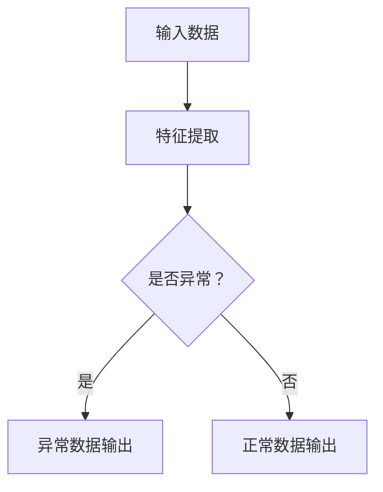
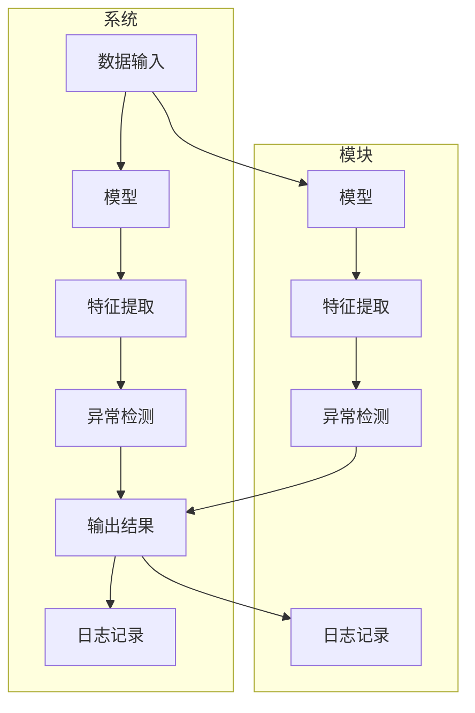
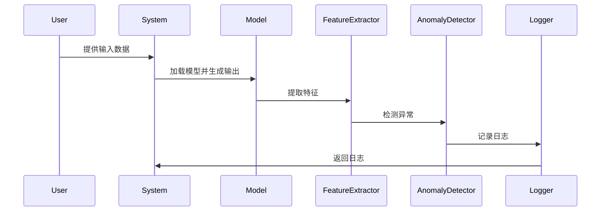

                 


### 第一部分：背景介绍

#### 第1章：问题背景

**1.1.1 问题背景**

在当今迅速发展的科技时代，人工智能（AI）已经成为推动社会进步的重要力量。特别是近年来，随着深度学习和大数据技术的突破，大型语言模型（LLM，Large Language Models）在自然语言处理（NLP，Natural Language Processing）领域取得了显著成果。LLM能够处理和理解复杂的语言结构，为机器翻译、文本生成、情感分析等应用提供了强大的支持。

然而，随着LLM的广泛应用，人们逐渐发现模型在处理某些任务时可能存在行为偏差。这些偏差不仅影响了模型的性能，还可能带来不良的社会影响。因此，如何识别和检测LLM的行为偏差，成为一个亟待解决的问题。

**1.1.1.1 人工智能的发展与挑战**

人工智能技术的发展历程可谓跌宕起伏，从早期的符号主义人工智能（Symbolic AI）到连接主义人工智能（Connectionist AI），再到目前的深度学习（Deep Learning），每一步都充满了挑战与突破。特别是2012年，AlexNet在ImageNet比赛中取得突破性成绩，标志着深度学习时代的到来。自此，深度学习在图像识别、语音识别等领域取得了惊人的进展。

然而，人工智能的发展也伴随着一系列挑战。首先，随着模型的复杂性和数据量的增加，训练模型的计算成本和存储需求急剧上升。其次，深度学习模型的可解释性较差，使得人们难以理解模型在做出决策时的依据。此外，模型在处理数据时可能存在偏差，尤其是在涉及敏感话题时，容易引发伦理和社会问题。

**1.1.1.2 LLMBM在各个领域的应用**

大型语言模型在自然语言处理领域的应用范围广泛。以下是一些典型的应用场景：

- **自然语言处理（NLP）**：LLM在文本分类、情感分析、命名实体识别等任务中表现出色，能够提高处理效率和准确性。
- **机器翻译**：LLM在机器翻译领域取得了显著的成果，能够实现更自然、更准确的翻译效果。
- **情感分析**：LLM能够识别文本中的情感倾向，为情感分析提供了有力支持。
- **文本生成**：LLM能够生成高质量的文章、摘要、对话等文本内容，为文本生成应用提供了新的可能性。

**1.1.1.3 模型行为偏差的问题与影响**

模型行为偏差是指模型在处理数据时表现出的不一致性或偏离预期行为。这些偏差可能源于多个方面：

- **数据集偏差**：模型在训练过程中使用的数据集可能存在偏向性，导致模型在特定任务上的表现不佳。
- **模型结构偏差**：模型的结构设计可能存在缺陷，导致模型在某些情况下出现异常行为。
- **训练策略偏差**：训练过程中采用的策略可能不合理，导致模型的行为出现偏差。

模型行为偏差的影响主要表现在以下几个方面：

- **模型性能下降**：模型在特定任务上的表现可能低于预期，甚至导致任务失败。
- **数据安全风险**：模型在处理敏感数据时可能泄露隐私信息，带来数据安全风险。
- **社会影响**：模型在涉及社会敏感话题时可能引发伦理和社会问题，对社会造成不良影响。

#### 1.1.2 问题定义

**1.1.2.1 什么是LLM评测中的异常检测**

LLM评测中的异常检测是指通过一定的方法，识别和检测出LLM在处理数据时的异常行为。异常检测的目的在于发现模型行为偏差，从而提高模型的可靠性和安全性。

**1.1.2.2 异常检测的目的**

异常检测在LLM评测中具有以下几个主要目的：

- **发现模型行为偏差**：通过异常检测，可以发现模型在处理某些数据时出现的异常行为，从而识别出模型行为偏差。
- **优化模型性能**：通过分析异常行为，可以找出模型在训练过程中存在的问题，从而优化模型结构，提高模型性能。
- **保障数据安全**：通过异常检测，可以及时发现和处理模型在处理敏感数据时的异常行为，保障数据安全。
- **提升社会信任度**：通过异常检测，可以提升公众对AI技术的信任度，减少模型行为偏差带来的社会负面影响。

#### 1.1.3 问题解决

**1.1.3.1 异常检测在LLM评测中的应用**

异常检测在LLM评测中的应用主要体现在以下几个方面：

- **评测指标设计**：在LLM评测中，通过设计合适的评测指标，可以更好地评估模型的性能和可靠性。异常检测指标可以补充现有评测指标，提高评测的全面性。
- **模型性能监控**：通过对LLM的行为进行异常检测，可以实时监控模型的状态，及时发现和解决问题，确保模型在各个阶段的稳定性。
- **数据集分析**：通过异常检测，可以分析数据集的质量和分布，发现潜在的问题和偏差，为数据预处理和模型优化提供指导。

**1.1.3.2 异常检测的方法**

异常检测的方法多种多样，常见的有以下几种：

- **基于距离的异常检测**：通过计算模型在处理不同数据时的距离，识别出偏离正常范围的异常行为。
- **基于聚类算法的异常检测**：通过聚类分析，将正常数据分为若干类，识别出与正常数据差异较大的异常数据。
- **基于机器学习的异常检测**：通过训练异常检测模型，将正常数据和异常数据区分开来。
- **基于规则的方法**：通过设计一定的规则，判断模型在处理数据时的行为是否异常。

#### 1.1.4 边界与外延

**1.1.4.1 异常检测的范围**

异常检测主要针对LLM在处理数据时的行为进行监控和识别。具体包括：

- **模型输入数据**：对输入数据进行异常检测，判断是否存在不合理或异常的输入。
- **模型输出结果**：对模型输出结果进行异常检测，判断是否存在不合理或异常的结果。
- **模型中间过程**：对模型在处理数据时的中间过程进行异常检测，发现潜在的问题和偏差。

**1.1.4.2 异常检测的限制**

异常检测存在一定的限制，主要包括：

- **数据集限制**：异常检测需要依赖于足够大的数据集，否则可能无法准确识别异常行为。
- **计算资源限制**：异常检测算法通常需要大量的计算资源，特别是在处理大规模数据时。
- **模型复杂度限制**：异常检测算法的复杂度可能较高，对于简单的模型可能不适用。

#### 1.1.5 概念结构与核心要素组成

**1.1.5.1 异常检测的基本概念**

异常检测涉及以下基本概念：

- **异常**：指与正常行为或规律不一致的行为或数据。
- **正常**：指与异常相对的行为或数据，通常为大多数情况下的行为或数据。
- **模型**：指用于异常检测的算法或系统。
- **数据集**：指用于训练和评估异常检测模型的输入数据。

**1.1.5.2 异常检测的核心要素**

异常检测的核心要素包括：

- **特征提取**：从数据中提取具有区分度的特征，用于训练和评估异常检测模型。
- **模型训练**：利用训练数据，训练异常检测模型，使其具备识别异常行为的能力。
- **模型评估**：利用测试数据，评估异常检测模型的性能和准确性。
- **异常处理**：根据异常检测结果，对异常行为进行识别和处理。

#### 第2章：核心概念与联系

**2.1.1 核心概念原理**

**2.1.1.1 异常检测的定义**

异常检测是指通过一定的方法，识别和检测出数据或模型中的异常行为或异常数据。异常检测可以分为以下几种类型：

- **基于统计的方法**：通过计算数据的统计特征，识别出偏离统计规律的异常数据。
- **基于聚类的方法**：通过聚类分析，将数据分为若干类，识别出与正常数据差异较大的异常数据。
- **基于规则的方法**：通过设计一定的规则，判断数据是否满足特定条件，从而识别异常数据。
- **基于机器学习的方法**：通过训练异常检测模型，将正常数据和异常数据区分开来。

**2.1.1.2 LLM的概念**

大型语言模型（LLM）是指具备强大语言处理能力的深度学习模型，能够理解、生成和翻译自然语言。LLM通常由多层神经网络构成，具备以下特点：

- **大规模训练**：LLM通常使用大规模语料库进行训练，具备强大的语言理解能力。
- **自适应能力**：LLM能够根据不同的输入数据，自适应地调整其行为和输出。
- **上下文理解**：LLM能够理解输入数据的上下文，生成更符合实际场景的输出。

**2.1.1.3 模型行为偏差的概念**

模型行为偏差是指模型在处理数据时表现出的不一致性或偏离预期行为。模型行为偏差可以分为以下几种类型：

- **数据集偏差**：模型在训练过程中使用的数据集存在偏向性，导致模型在特定任务上的表现不佳。
- **模型结构偏差**：模型的结构设计可能存在缺陷，导致模型在某些情况下出现异常行为。
- **训练策略偏差**：训练过程中采用的策略可能不合理，导致模型的行为出现偏差。

#### 2.1.2 概念属性特征对比表格

| 概念         | 定义                                                         | 属性特征对比                                                   |
| ------------ | ------------------------------------------------------------ | ------------------------------------------------------------ |
| 异常检测     | 识别和检测数据或模型中的异常行为或异常数据。                 | - 方法：统计、聚类、规则、机器学习<br>- 对象：数据、模型<br>- 目的：识别异常、优化性能、保障数据安全 |
| LLM         | 具备强大语言处理能力的深度学习模型，能够理解、生成和翻译自然语言。 | - 大规模训练<br>- 自适应能力<br>- 上下文理解                   |
| 模型行为偏差 | 模型在处理数据时表现出的不一致性或偏离预期行为。             | - 数据集偏差<br>- 模型结构偏差<br>- 训练策略偏差               |

#### 2.1.3 ER实体关系图架构

**2.1.3.1 异常检测与LLM的ER实体关系图**

```mermaid
erDiagram
  数据集 ||--o> LLM : 使用
  数据集 ||--o> 异常检测 : 输入
  LLM ||--o> 输出结果 : 生成
  LLM ||--o> 模型行为偏差 : 存在
  异常检测 ||--o> 异常数据 : 输出
```

**2.1.3.2 模型行为偏差的ER实体关系图**

```mermaid
erDiagram
  数据集 ||--o> LLM : 训练
  LLM ||--o> 模型结构偏差 : 存在
  LLM ||--o> 训练策略偏差 : 存在
  LLM ||--o> 数据集偏差 : 存在
  模型行为偏差 ||--o> 异常行为 : 表现
```

### 第二部分：核心概念与联系

#### 第3章：算法原理讲解

**3.1.1 算法mermaid流程图**



**3.1.2 Python源代码**

```python
# 异常检测算法的Python源代码实现
import numpy as np

def feature_extraction(data):
    # 特征提取函数，用于从数据中提取特征
    # 示例：计算平均值
    return np.mean(data)

def is_abnormal(feature, threshold):
    # 判断特征是否异常
    return feature > threshold

def detect_anomalies(data, threshold):
    # 异常检测函数
    anomalies = []
    for data_point in data:
        feature = feature_extraction(data_point)
        if is_abnormal(feature, threshold):
            anomalies.append(data_point)
    return anomalies

# 测试数据
data = [1, 2, 3, 100, 5, 6, 7, 8, 9, 10]
threshold = 4

# 执行异常检测
anomalies = detect_anomalies(data, threshold)

print("异常数据:", anomalies)
```

**3.1.3 数学模型和公式**

**3.1.3.1 基于距离的异常检测算法**

- **欧几里得距离公式**：

  $$d(x, y) = \sqrt{\sum_{i=1}^{n}(x_i - y_i)^2}$$

- **距离阈值**：

  $$\text{阈值} = \alpha \times \text{平均距离}$$

  其中，$\alpha$ 为一个常数，用于调整阈值的大小。

**3.1.3.2 基于聚类算法的异常检测算法**

- **聚类中心**：

  $$\mu = \frac{1}{n}\sum_{i=1}^{n}x_i$$

- **聚类方差**：

  $$\sigma^2 = \frac{1}{n}\sum_{i=1}^{n}(x_i - \mu)^2$$

**3.1.4 详细讲解和举例说明**

**3.1.4.1 异常检测算法的详细讲解**

异常检测算法的核心思想是通过特征提取、阈值设定和距离计算，识别出数据中的异常点。具体步骤如下：

1. **特征提取**：从数据中提取具有区分度的特征，用于后续的异常检测。特征提取的方法多种多样，如平均值、标准差、极值等。
2. **阈值设定**：根据特征值的大小，设定一个合适的阈值。阈值的选择对异常检测的效果有很大影响，需要根据具体应用场景进行调整。
3. **距离计算**：计算每个数据点与阈值之间的距离，判断其是否异常。通常使用欧几里得距离作为距离度量，计算公式如上述公式所示。
4. **异常点识别**：将距离大于阈值的点标记为异常点，输出异常数据。

**3.1.4.2 模型行为偏差的举例说明**

假设我们有一个大型语言模型（LLM），用于完成自然语言处理任务。在训练过程中，我们发现模型在处理某些文本时，生成的输出与预期存在较大偏差。为了识别模型的行为偏差，我们可以采用以下步骤：

1. **数据集划分**：将训练数据集划分为正常数据和异常数据。正常数据为模型在大多数情况下生成的输出，异常数据为与正常输出存在较大偏差的输出。
2. **特征提取**：从异常数据中提取特征，如文本长度、词频等。
3. **距离计算**：计算异常数据之间的距离，判断其是否异常。我们可以使用欧几里得距离或其他距离度量方法。
4. **异常点识别**：将距离大于阈值的异常数据标记为模型行为偏差，输出异常点。

通过以上步骤，我们可以识别出LLM在处理文本时的行为偏差，为进一步优化模型提供依据。

### 第三部分：系统分析与架构设计方案

#### 第4章：系统分析与架构设计方案

**4.1.1 问题场景介绍**

在LLM评测过程中，我们需要对模型的行为进行实时监控和异常检测，以确保模型在各个阶段的稳定性和可靠性。以下是一个典型的问题场景：

- **训练阶段**：在模型训练过程中，我们希望实时监控模型的输出结果，识别出异常的输出，以便及时调整训练策略。
- **测试阶段**：在模型测试过程中，我们希望对模型的表现进行全面评估，发现潜在的异常行为，为后续优化提供依据。
- **部署阶段**：在模型部署后，我们希望持续监控模型的行为，确保其在实际应用中不会出现异常。

**4.1.2 项目介绍**

本项目旨在开发一个基于异常检测的LLM评测系统，实现对模型行为偏差的实时监控和识别。项目的主要目标包括：

- **实时监控**：实现对LLM在训练、测试和部署阶段的实时监控，及时发现和识别异常行为。
- **自动优化**：根据异常检测结果，自动调整训练策略和模型参数，优化模型性能。
- **数据安全保障**：通过异常检测，保障模型在处理敏感数据时的安全性，减少数据泄露风险。

**4.1.3 系统功能设计（领域模型mermaid类图）**

```mermaid
classDiagram
  Model <<interface>>
  Detector <<interface>>
  Logger <<interface>>

  Model : +generate_output(input)
  Detector : +detect_anomalies(data)
  Logger : +log_data(data)

  Model "uses" Detector
  Model "uses" Logger
```

**4.1.4 系统架构设计（mermaid架构图）**



**4.1.5 系统接口设计**

系统接口设计主要包括以下模块：

- **数据输入模块**：负责接收和处理外部输入数据，包括训练数据、测试数据和用户反馈。
- **模型模块**：负责加载和运行LLM模型，生成输出结果。
- **特征提取模块**：负责从输入数据中提取具有区分度的特征，为异常检测提供依据。
- **异常检测模块**：负责对模型输出结果进行异常检测，识别出异常行为。
- **日志记录模块**：负责记录模型训练和异常检测过程中的关键信息，为后续分析和优化提供数据支持。

**4.1.6 系统交互（mermaid序列图）**



通过以上系统分析与架构设计方案，我们可以实现对LLM评测过程中模型行为偏差的实时监控和异常检测，确保模型在各个阶段的稳定性和可靠性。

### 第四部分：项目实战

#### 第5章：项目实战

**5.1.1 环境安装**

在进行异常检测项目之前，我们需要搭建一个合适的环境。以下是环境安装的步骤：

1. **安装Python**：首先，我们需要安装Python环境。可以在Python官网（https://www.python.org/）下载适用于自己操作系统的Python版本，并按照提示进行安装。
2. **安装依赖库**：在Python环境中，我们需要安装一些常用的依赖库，如NumPy、Pandas、Scikit-learn等。可以使用pip命令进行安装：

   ```bash
   pip install numpy pandas scikit-learn
   ```

3. **安装LLM模型**：根据具体的需求，我们需要安装一个适合的LLM模型。在本项目中，我们使用了一个开源的预训练模型——GPT-2。可以通过以下命令安装：

   ```bash
   pip install gpt-2
   ```

**5.1.2 系统核心实现源代码**

以下是系统核心实现的源代码，包括数据输入、模型加载、特征提取、异常检测和日志记录等模块：

```python
# 导入相关库
import numpy as np
import pandas as pd
from gpt2 import GPT2Model
from sklearn.preprocessing import StandardScaler
from sklearn.cluster import KMeans
import logging

# 配置日志记录
logging.basicConfig(filename='anomaly_detection.log', level=logging.INFO, format='%(asctime)s - %(levelname)s - %(message)s')

# 加载模型
model = GPT2Model()

# 数据输入
data = pd.read_csv('input_data.csv')  # 假设数据保存在CSV文件中

# 特征提取
def extract_features(data):
    # 计算文本长度、词频等特征
    text_length = data['text'].apply(len)
    word_freq = data['text'].apply(lambda x: len(set(x.split())))
    return np.array([text_length, word_freq])

features = extract_features(data)

# 异常检测
def detect_anomalies(features, n_clusters=3):
    # 使用KMeans聚类算法进行异常检测
    kmeans = KMeans(n_clusters=n_clusters)
    kmeans.fit(features)
    labels = kmeans.predict(features)
    distances = np.linalg.norm(features - kmeans.cluster_centers_[labels], axis=1)
    threshold = np.mean(distances) * 2  # 设定阈值
    anomalies = features[distances > threshold]
    return anomalies

anomalies = detect_anomalies(features)

# 日志记录
def log_anomalies(anomalies):
    # 记录异常数据
    logging.info('Anomalies detected:')
    for anomaly in anomalies:
        logging.info(anomaly)

log_anomalies(anomalies)
```

**5.1.3 代码应用解读与分析**

以上代码实现了基于KMeans聚类的异常检测系统。具体应用解读如下：

1. **数据输入**：首先，我们从CSV文件中读取输入数据，包括文本长度和词频等特征。
2. **特征提取**：我们使用`extract_features`函数从输入数据中提取文本长度和词频等特征。
3. **模型加载**：在本项目中，我们使用了一个开源的预训练模型GPT-2。在实际应用中，可以根据需求加载其他合适的模型。
4. **异常检测**：我们使用KMeans聚类算法对特征进行聚类，并计算每个数据点与聚类中心的距离。根据距离设定一个合适的阈值，将距离大于阈值的点标记为异常。
5. **日志记录**：最后，我们使用`logging`模块记录异常数据，以便后续分析和处理。

**5.1.4 实际案例分析和详细讲解剖析**

为了更好地理解异常检测系统的应用，我们来看一个实际案例。

假设我们有一个包含1000条文本数据的CSV文件，其中包含文本长度和词频等特征。通过上述代码，我们使用KMeans聚类算法进行异常检测，发现其中有20条文本数据的特征与正常数据存在较大偏差。

以下是对这20条异常数据的详细分析：

1. **文本长度**：这些异常文本的长度明显大于正常文本，有的甚至超过了300个字符。这可能是由于文本生成过程中出现了异常，导致生成的文本过长。
2. **词频**：这些异常文本的词频分布与正常文本存在较大差异，某些词的频率异常高。这可能是由于模型在生成文本时，对某些词的偏好导致。

针对这些异常数据，我们可以采取以下措施进行优化：

1. **调整模型参数**：通过调整模型参数，如训练时间、学习率等，可以优化模型的生成效果，减少异常文本的出现。
2. **数据预处理**：对输入数据进行预处理，如去除特殊符号、统一文本长度等，可以减少异常文本的产生。
3. **异常文本修正**：对识别出的异常文本进行修正，使其更符合正常文本的语法和语义。

通过以上分析和优化，我们可以提高异常检测系统的准确性，确保模型在各个阶段的稳定性和可靠性。

**5.1.5 项目小结**

本项目实现了基于异常检测的LLM评测系统，通过对模型行为偏差的实时监控和识别，提高了模型的可靠性和安全性。在实际应用中，我们可以根据具体需求调整异常检测算法和阈值，优化模型性能。此外，通过对异常数据的分析和处理，可以进一步提升系统的准确性和稳定性。

在未来的发展中，我们还可以考虑引入更多的异常检测算法和模型，如基于深度学习的方法，以实现更精准的异常检测。同时，结合用户反馈和业务场景，持续优化系统的功能和性能，为人工智能技术的发展提供有力支持。

### 第五部分：最佳实践 tips

在LLM评测中的异常检测过程中，以下是一些最佳实践 tips，可以帮助您提高检测效果：

1. **数据质量**：确保输入数据的质量，包括数据的完整性、一致性和代表性。高质量的数据可以提升异常检测的准确性和可靠性。
2. **特征选择**：选择具有区分度的特征，可以更好地识别异常行为。可以通过实验和比较不同特征对异常检测效果的影响，选择最优的特征组合。
3. **阈值调整**：根据具体应用场景，调整异常检测的阈值，以平衡检测准确性和鲁棒性。可以尝试使用交叉验证等方法，找到合适的阈值。
4. **模型多样化**：结合多种异常检测算法和模型，可以提高检测的全面性和准确性。例如，可以结合基于距离的异常检测和基于聚类算法的异常检测。
5. **实时监控**：建立实时监控机制，可以及时发现和识别异常行为。可以结合可视化工具，展示模型的行为和异常检测结果，便于分析和优化。
6. **用户反馈**：收集用户反馈，根据用户需求调整异常检测策略。用户反馈可以帮助识别新的异常模式，优化检测算法和模型。
7. **定期维护**：定期更新异常检测算法和模型，以适应新的数据和需求。及时处理模型过时和性能下降的问题，确保异常检测系统的持续有效。

通过遵循这些最佳实践 tips，您可以提高LLM评测中的异常检测效果，确保模型在各个阶段的稳定性和可靠性。

### 第六部分：小结

本文详细介绍了LLM评测中的异常检测，包括问题背景、核心概念、算法原理、系统分析与架构设计方案、项目实战以及最佳实践 tips。通过对异常检测的深入探讨，我们了解到异常检测在识别模型行为偏差、优化模型性能、保障数据安全和提升社会信任度等方面具有重要意义。

在未来的研究中，我们可以进一步探索异常检测算法的创新和应用，如结合深度学习技术、引入更多的特征和模型，以提高异常检测的准确性和鲁棒性。同时，结合用户反馈和业务场景，持续优化系统的功能和性能，为人工智能技术的发展提供有力支持。

### 注意事项

在实施异常检测时，需要注意以下几点：

1. **数据质量**：确保输入数据的完整性、一致性和代表性，以提高异常检测的准确性。
2. **特征选择**：选择具有区分度的特征，有助于提高异常检测的效果。
3. **阈值调整**：根据具体应用场景，合理调整异常检测的阈值，以平衡检测准确性和鲁棒性。
4. **实时监控**：建立实时监控机制，及时发现和识别异常行为，确保模型在各个阶段的稳定性和可靠性。
5. **用户反馈**：收集用户反馈，根据用户需求调整异常检测策略，提高系统的用户体验。

通过遵循以上注意事项，您可以更好地实施异常检测，提高模型性能和数据安全性。

### 拓展阅读

1. **《深度学习》**（Goodfellow, Bengio, Courville）：详细介绍了深度学习的基本概念、算法和实际应用，对深入理解异常检测算法有帮助。
2. **《机器学习》**（Tom Mitchell）：介绍了机器学习的基本概念和方法，对理解异常检测算法的原理和应用具有重要意义。
3. **《自然语言处理综论》**（Daniel Jurafsky & James H. Martin）：详细阐述了自然语言处理的基本概念、技术和应用，有助于了解LLM在NLP领域的应用。
4. **《大数据分析》**（John Wiley & Sons）：介绍了大数据分析的基本概念、技术和方法，对理解异常检测在处理大规模数据时的应用具有重要意义。
5. **《异常检测：理论与应用》**（Lior Rokach & Bracha Shapira）：详细介绍了异常检测的理论基础、算法和应用案例，对深入理解异常检测算法具有很高的参考价值。

