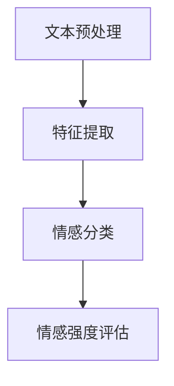
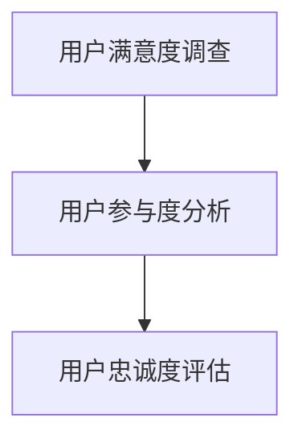

                 

# 《LLM评测中的情感分析与用户体验评估》

## 关键词
- **LLM（大型语言模型）**，**情感分析**，**用户体验评估**，**模型优化**，**算法原理**，**系统设计**

## 摘要
本文深入探讨了LLM（大型语言模型）评测中的情感分析与用户体验评估两大关键领域。首先，我们回顾了LLM的发展与应用背景，介绍了情感分析在LLM评测中的重要性，并分析了用户体验评估的挑战与意义。接着，本文详细阐述了情感分析中的挑战与解决方案，以及用户体验评估的难点与应对策略。随后，文章探讨了情感分析与用户体验评估之间的联系，并介绍了相关核心概念与模型。在算法原理讲解部分，我们详细阐述了情感分析与用户体验评估算法的基本原理、流程与案例。文章最后通过一个实际项目案例，展示了系统分析与架构设计的全过程，并提供了项目实战中的代码应用解读与分析。通过本文的阅读，读者将全面理解LLM评测中的情感分析与用户体验评估，掌握相关技术原理与系统设计方法。

## 第一部分：背景介绍

### 第1章：问题背景

#### 1.1.1 问题背景

随着人工智能技术的快速发展，大型语言模型（LLM）在自然语言处理领域取得了显著进展。LLM通过训练海量文本数据，学习语言的模式和规律，能够生成高质量的自然语言文本，广泛应用于机器翻译、文本摘要、问答系统等领域。然而，在LLM的应用过程中，情感分析与用户体验评估成为两个关键问题。

情感分析作为自然语言处理的重要任务，旨在理解和识别文本中的情感表达。在LLM评测中，情感分析能够帮助我们了解用户对模型输出内容的情感反应，从而评估模型的情感表达能力。用户体验评估则关注用户在使用LLM产品或服务时的感受与满意度，通过量化用户反馈，优化产品性能和用户体验。

#### 1.1.2 情感分析在LLM评测中的重要性

情感分析在LLM评测中的重要性体现在以下几个方面：

1. **评估模型情感表达能力**：通过情感分析，我们可以评估LLM在生成文本时是否能够准确捕捉和表达情感。这对于提升LLM在情感化内容生成、客服对话、个性化推荐等领域的应用具有重要意义。
   
2. **提升用户满意度**：了解用户对模型输出内容的情感反应，有助于优化LLM产品或服务，提升用户满意度。例如，在客服对话中，情感分析可以帮助我们识别用户的不满情绪，及时采取措施进行改善。

3. **提高模型可解释性**：情感分析为LLM提供了可解释性的维度，使得模型输出不仅具备高准确性，还能够让用户理解和信任模型的决策过程。

#### 1.1.3 用户体验评估的挑战与意义

用户体验评估在LLM评测中的挑战主要体现在以下几个方面：

1. **用户需求的多样性**：不同用户在使用LLM产品或服务时，具有不同的需求和期望。如何全面了解和满足这些需求，是用户体验评估的重要挑战。

2. **用户反馈的片面性与主观性**：用户反馈往往具有一定的主观性和片面性，如何从用户反馈中提取有价值的信息，进行量化分析，是用户体验评估的关键问题。

3. **量化标准的缺失**：目前，缺乏统一的用户体验评估标准，如何设计科学有效的评估指标，量化用户满意度、参与度、忠诚度等，是用户体验评估的难点。

用户体验评估的意义在于：

1. **优化产品性能**：通过用户体验评估，可以发现LLM产品或服务的不足之处，针对性地进行优化，提升整体性能。

2. **提升用户满意度**：了解用户的使用体验，优化产品设计和功能，有助于提高用户满意度和忠诚度，促进产品市场竞争力。

3. **指导模型改进**：用户反馈可以作为模型改进的依据，通过不断优化LLM模型，提升其在实际应用中的表现。

### 第2章：问题描述

#### 2.1.1 情感分析中的挑战

情感分析作为自然语言处理的一个重要任务，面临着一系列挑战：

1. **情感表达的多样性与复杂性**：情感表达形式多样，如文字、语音、图像等，不同情感类型之间往往存在模糊界限。此外，情感表达常常受到上下文、语境的影响，使得情感分析任务复杂化。

2. **情感极性的识别与分类**：情感极性分为正面、负面和中性三种，如何准确识别和分类情感极性，是情感分析的核心问题。

3. **情感强度的度量**：情感强度反映了情感表达的程度，如何准确度量情感强度，是情感分析的重要挑战。此外，情感强度的变化往往受到语言环境的影响，如何动态调整情感强度，是情感分析的一个难点。

#### 2.1.2 用户体验评估中的难点

用户体验评估在LLM评测中面临着一系列难点：

1. **用户需求的多样性**：用户需求的多样性使得用户体验评估难以统一标准。不同用户在使用LLM产品或服务时，可能关注不同方面的体验，如功能、性能、易用性等。

2. **用户反馈的片面性与主观性**：用户反馈具有一定的主观性和片面性，如何从用户反馈中提取有价值的信息，进行量化分析，是用户体验评估的关键问题。

3. **量化标准的缺失**：目前，缺乏统一的用户体验评估标准，如何设计科学有效的评估指标，量化用户满意度、参与度、忠诚度等，是用户体验评估的难点。

### 第3章：问题解决

#### 3.1.1 情感分析的解决方案

针对情感分析中的挑战，我们可以采取以下解决方案：

1. **数据集构建**：构建高质量的标注数据集，是情感分析的基础。通过收集、整理和标注大量真实情感文本，为情感分析模型提供充足的训练数据。

2. **情感分析模型的选择与优化**：选择适合情感分析的模型，并进行优化。传统机器学习模型和深度学习模型各有优缺点，可以根据具体应用场景选择合适的模型。此外，可以采用迁移学习、数据增强等技术，提升模型性能。

3. **情感分析结果的验证与评估**：通过交叉验证、性能指标评估等方法，验证情感分析结果的准确性和可靠性。常用的评估指标包括准确率、召回率、F1值等。

#### 3.1.2 用户体验评估的解决方案

针对用户体验评估中的难点，我们可以采取以下解决方案：

1. **用户研究方法的选择**：选择合适的用户研究方法，如问卷调查、用户访谈、A/B测试等，收集用户反馈数据。

2. **用户体验评估指标的设计**：设计科学有效的评估指标，如用户满意度、参与度、忠诚度等。可以根据具体应用场景，选择合适的指标，并进行量化。

3. **用户体验评估的结果分析与反馈**：对用户反馈进行量化分析，识别用户需求与痛点，优化产品设计和功能。同时，将用户反馈反馈到开发团队，促进持续改进。

### 第4章：边界与外延

#### 4.1.1 情感分析的应用范围

情感分析在多个领域具有广泛的应用：

1. **社交媒体分析**：通过情感分析，可以了解用户对特定话题、事件或品牌的情感倾向，为企业提供市场洞察和决策支持。

2. **客户服务与反馈**：情感分析可以帮助企业了解用户对产品或服务的情感反应，优化客户服务流程，提升用户体验。

3. **内容推荐系统**：情感分析可以用于分析用户兴趣和偏好，提高内容推荐系统的准确性，提升用户满意度。

#### 4.1.2 用户体验评估的应用领域

用户体验评估在多个领域具有重要应用：

1. **互联网产品与服务的优化**：通过用户体验评估，可以了解用户在使用互联网产品或服务时的痛点，优化产品设计和功能。

2. **娱乐与游戏设计**：用户体验评估可以帮助游戏开发团队了解玩家对游戏的情感反应，优化游戏设计，提升玩家满意度。

3. **教育与培训**：用户体验评估可以用于教育产品的设计与评估，了解学生的学习体验和效果，优化教学内容和方式。

### 第5章：概念结构与核心要素组成

#### 5.1.1 情感分析的核心概念

情感分析涉及多个核心概念：

1. **情感极性**：情感极性分为正面、负面和中性三种，反映了文本的情感倾向。

2. **情感强度**：情感强度反映了情感表达的程度，通常用数值或等级表示。

3. **情感识别算法**：情感识别算法用于从文本中提取情感信息，包括情感极性识别、情感强度评估等。

#### 5.1.2 用户体验评估的核心要素

用户体验评估涉及多个核心要素：

1. **用户满意度**：用户满意度反映了用户对产品或服务的整体感受和评价。

2. **用户参与度**：用户参与度反映了用户在产品或服务中的活跃度和互动程度。

3. **用户忠诚度**：用户忠诚度反映了用户对产品或服务的长期信任和依赖程度。

## 第二部分：核心概念与联系

### 第6章：情感分析原理与模型

#### 6.1.1 情感分析的基本原理

情感分析的基本原理包括以下三个方面：

1. **情感分类**：情感分类是将文本分类为正面、负面或中性情感的过程。常用的情感分类方法包括基于规则的方法、基于机器学习的方法和基于深度学习的方法。

2. **情感强度评估**：情感强度评估是评估文本中情感表达的程度。常用的方法包括基于统计的方法、基于语义的方法和基于机器学习的方法。

3. **情感极性判断**：情感极性判断是判断文本中的情感极性，即正面、负面或中性。情感极性判断通常与情感分类相结合。

#### 6.1.2 常见情感分析模型

常见的情感分析模型包括以下几种：

1. **传统机器学习模型**：如支持向量机（SVM）、朴素贝叶斯（NB）、随机森林（RF）等。这些模型基于特征工程，通过训练大量标注数据，学习情感分类和强度评估的规律。

2. **深度学习模型**：如卷积神经网络（CNN）、循环神经网络（RNN）、长短时记忆网络（LSTM）等。这些模型具有强大的表示能力和学习能力，能够自动提取文本特征，进行情感分类和强度评估。

3. **跨语言情感分析**：跨语言情感分析是在不同语言之间进行情感分类和强度评估。常用的方法包括基于翻译的方法、基于语义的方法和基于多语言嵌入的方法。

### 第7章：用户体验评估原理与模型

#### 7.1.1 用户体验评估的基本原理

用户体验评估的基本原理包括以下三个方面：

1. **用户满意度调查**：用户满意度调查是评估用户对产品或服务的整体满意程度。常用的方法包括问卷调查、用户访谈等。

2. **用户参与度分析**：用户参与度分析是评估用户在产品或服务中的活跃度和互动程度。常用的方法包括用户行为分析、用户留存率分析等。

3. **用户忠诚度评估**：用户忠诚度评估是评估用户对产品或服务的长期信任和依赖程度。常用的方法包括用户复购率分析、用户推荐度分析等。

#### 7.1.2 常见用户体验评估模型

常见的用户体验评估模型包括以下几种：

1. **用户体验度量方法**：如Net Promoter Score（NPS）、Customer Satisfaction Score（CSAT）等。这些模型通过量化用户满意度、参与度、忠诚度等指标，评估用户体验。

2. **用户行为分析模型**：如用户行为路径分析、用户留存率分析、用户流失率分析等。这些模型通过分析用户在产品或服务中的行为数据，评估用户体验。

3. **用户体验反馈模型**：如用户评价分析、用户反馈分析等。这些模型通过收集和分析用户反馈数据，评估用户体验。

### 第8章：情感分析与用户体验评估的联系

#### 8.1.1 情感分析对用户体验评估的影响

情感分析对用户体验评估具有显著影响，主要体现在以下几个方面：

1. **用户情感状态与满意度**：情感分析可以帮助我们了解用户在使用产品或服务时的情感状态，如愉悦、焦虑、愤怒等。这些情感状态直接影响用户的满意度，进而影响用户体验评估。

2. **用户情感强度与参与度**：情感强度反映了用户对产品或服务的情感投入程度。高情感强度通常意味着用户对产品或服务有更高的参与度，从而提升用户体验。

3. **用户情感反馈与忠诚度**：用户情感反馈可以作为忠诚度的重要指标。积极、愉悦的情感反馈往往意味着用户对产品或服务有更高的忠诚度，从而影响用户体验评估。

#### 8.1.2 用户体验评估对情感分析的反作用

用户体验评估对情感分析也具有反作用，主要体现在以下几个方面：

1. **用户体验满意度与情感表达**：用户体验满意度直接影响情感表达。高满意度的用户通常更倾向于表达积极、愉悦的情感，从而影响情感分析的结果。

2. **用户体验参与度与情感强度**：用户体验参与度越高，用户在情感表达上的投入也越大。高参与度的用户往往能够更准确地表达自己的情感，从而影响情感分析的结果。

3. **用户体验反馈与情感分析模型优化**：用户反馈可以作为情感分析模型的优化依据。通过对用户反馈进行分析，可以发现模型在情感分析中的不足之处，进而进行模型优化，提升情感分析的准确性。

## 第三部分：算法原理讲解

### 第9章：情感分析算法原理讲解

#### 9.1.1 情感分析算法流程

情感分析算法通常包括以下流程：

1. **数据预处理**：数据预处理包括文本清洗、去除停用词、分词、词干提取等步骤，目的是将原始文本转化为适合模型训练的格式。

2. **特征提取**：特征提取是将预处理后的文本转化为特征向量，用于模型训练。常用的特征提取方法包括词袋模型、TF-IDF、Word2Vec等。

3. **模型训练与评估**：模型训练与评估包括选择合适的模型、训练模型并进行评估。常用的情感分析模型包括SVM、NB、RF、LSTM等。

#### 9.1.2 情感分析算法案例

1. **基于机器学习的情感分析案例**

   - **数据集**：使用IMDb电影评论数据集，包含25,000条正面评论和25,000条负面评论。

   - **模型选择**：选择支持向量机（SVM）作为情感分析模型。

   - **训练过程**：使用scikit-learn库进行模型训练，通过交叉验证调整模型参数。

   - **评估指标**：使用准确率、召回率、F1值等评估模型性能。

2. **基于深度学习的情感分析案例**

   - **数据集**：使用IMDb电影评论数据集。

   - **模型选择**：选择卷积神经网络（CNN）作为情感分析模型。

   - **训练过程**：使用TensorFlow库进行模型训练，通过调整网络结构和超参数优化模型性能。

   - **评估指标**：使用准确率、召回率、F1值等评估模型性能。

3. **跨语言情感分析案例**

   - **数据集**：使用多语言情感分析数据集，包含多种语言的文本数据。

   - **模型选择**：选择基于多语言嵌入的深度学习模型，如BERT。

   - **训练过程**：使用跨语言预训练模型，对目标语言进行情感分析。

   - **评估指标**：使用准确率、召回率、F1值等评估模型性能。

### 第10章：用户体验评估算法原理讲解

#### 10.1.1 用户体验评估算法流程

用户体验评估算法通常包括以下流程：

1. **用户满意度调查设计**：设计用户满意度调查问卷，包括满意度评分、问题反馈等。

2. **用户参与度分析流程**：通过用户行为数据分析，评估用户参与度，如用户活跃度、留存率等。

3. **用户忠诚度评估方法**：通过用户复购率、用户推荐度等指标，评估用户忠诚度。

#### 10.1.2 用户体验评估算法案例

1. **基于用户反馈的评估算法**

   - **数据集**：使用用户满意度调查问卷数据。

   - **模型选择**：选择回归分析、因子分析等统计模型。

   - **训练过程**：使用统计方法分析用户反馈数据，提取关键特征。

   - **评估指标**：使用用户满意度得分、满意度增长率等评估算法性能。

2. **基于用户行为的评估算法**

   - **数据集**：使用用户行为数据分析数据。

   - **模型选择**：选择机器学习算法，如随机森林、LSTM等。

   - **训练过程**：使用机器学习方法对用户行为数据进行建模。

   - **评估指标**：使用用户留存率、用户流失率等评估算法性能。

3. **基于大数据分析的评估算法**

   - **数据集**：使用大数据分析数据。

   - **模型选择**：选择大数据分析算法，如Hadoop、Spark等。

   - **训练过程**：使用大数据分析技术对用户数据进行分析。

   - **评估指标**：使用用户满意度得分、用户活跃度等评估算法性能。

## 第四部分：系统分析与架构设计

### 第11章：情感分析与用户体验评估系统设计

#### 11.1.1 系统需求分析

情感分析与用户体验评估系统需要满足以下需求：

1. **情感分析功能需求**：包括文本预处理、特征提取、情感分类和情感强度评估等。

2. **用户体验评估功能需求**：包括用户满意度调查、用户参与度分析、用户忠诚度评估等。

#### 11.1.2 系统架构设计

情感分析与用户体验评估系统的架构设计包括以下几个方面：

1. **情感分析模块设计**：包括文本预处理模块、特征提取模块、情感分类模块和情感强度评估模块。

2. **用户体验评估模块设计**：包括用户满意度调查模块、用户参与度分析模块和用户忠诚度评估模块。

3. **系统集成与接口设计**：设计系统接口，实现情感分析与用户体验评估模块之间的数据交换和协同工作。

### 第12章：系统分析与架构设计实例

#### 11.1.1 情感分析模块实例

**模块功能说明**：

1. **文本预处理模块**：对输入文本进行清洗、分词、去除停用词等处理。

2. **特征提取模块**：将预处理后的文本转化为特征向量，用于模型训练。

3. **情感分类模块**：使用机器学习或深度学习模型对文本进行情感分类。

4. **情感强度评估模块**：评估文本中情感表达的程度。

**模块设计流程图**（使用Mermaid流程图表示）：



#### 11.1.2 用户体验评估模块实例

**模块功能说明**：

1. **用户满意度调查模块**：设计用户满意度调查问卷，收集用户满意度数据。

2. **用户参与度分析模块**：通过用户行为数据分析，评估用户参与度。

3. **用户忠诚度评估模块**：通过用户复购率、用户推荐度等指标，评估用户忠诚度。

**模块设计流程图**（使用Mermaid流程图表示）：



### 第13章：系统接口与交互设计

#### 13.1.1 系统接口设计

系统接口设计包括以下方面：

1. **API接口定义**：定义情感分析与用户体验评估模块的API接口，包括接口功能、输入输出参数等。

2. **数据交换格式**：设计数据交换格式，如JSON、XML等，实现模块之间的数据传输。

#### 13.1.2 系统交互设计

系统交互设计包括以下方面：

1. **用户体验评估流程图**：使用Mermaid流程图表示用户体验评估的流程。

2. **情感分析流程图**：使用Mermaid流程图表示情感分析的流程。

**用户体验评估流程图**（使用Mermaid流程图表示）：


**情感分析流程图**（使用Mermaid流程图表示）：


## 第五部分：项目实战

### 第14章：项目环境安装与配置

#### 14.1.1 操作系统与软件环境安装

1. **操作系统**：安装支持Python和深度学习库的操作系统，如Ubuntu 18.04。

2. **软件环境**：安装Python 3.x、TensorFlow、Scikit-learn等必要的软件环境。

#### 14.1.2 项目依赖包安装

1. **Python依赖包**：使用pip命令安装项目所需的Python依赖包，如nltk、spaCy、TensorFlow等。

2. **数据处理工具**：安装数据处理工具，如NumPy、Pandas等。

### 第15章：系统核心实现

#### 15.1.1 情感分析核心代码

```python
# 文本预处理
text = "我很喜欢这个产品，它非常好用。"
cleaned_text = preprocess_text(text)

# 特征提取
vectorized_text = feature_extraction(cleaned_text)

# 情感分类
predicted_sentiment = sentiment_classification(vectorized_text)

# 情感强度评估
predicted_intensity = sentiment_intensity(vectorized_text)

# 输出结果
print(f"情感分类：{predicted_sentiment}")
print(f"情感强度：{predicted_intensity}")
```

**Mermaid流程图**（表示情感分析的核心代码流程）：


#### 15.1.2 用户体验评估核心代码

```python
# 用户满意度调查
satisfaction_survey = user_satisfaction_survey()

# 用户参与度分析
user_engagement = user_engagement_analysis()

# 用户忠诚度评估
user_loyalty = user_loyalty_assessment()

# 输出结果
print(f"用户满意度：{satisfaction_survey}")
print(f"用户参与度：{user_engagement}")
print(f"用户忠诚度：{user_loyalty}")
```

**Mermaid流程图**（表示用户体验评估的核心代码流程）：


### 第16章：代码应用解读与分析

#### 16.1.1 情感分析代码应用解读

1. **文本预处理**：对输入文本进行清洗、分词、去除停用词等处理，以便后续特征提取和情感分类。

2. **特征提取**：将预处理后的文本转化为特征向量，如使用TF-IDF、Word2Vec等方法。

3. **情感分类**：使用机器学习或深度学习模型对文本进行情感分类，如SVM、CNN等。

4. **情感强度评估**：评估文本中情感表达的程度，如使用情感极性判断、情感强度评分等方法。

#### 16.1.2 用户体验评估代码应用解读

1. **用户满意度调查**：设计用户满意度调查问卷，收集用户满意度数据，如使用Likert量表、多选题等方法。

2. **用户参与度分析**：通过用户行为数据分析，评估用户参与度，如用户活跃度、留存率等。

3. **用户忠诚度评估**：通过用户复购率、用户推荐度等指标，评估用户忠诚度。

#### 实际案例分析

1. **情感分析应用案例**：在电商产品评价中，使用情感分析技术对用户评价进行分类和强度评估，帮助商家了解用户对产品的情感反应，优化产品设计和功能。

2. **用户体验评估应用案例**：在互联网产品中，使用用户体验评估技术，如用户满意度调查、用户参与度分析等，评估用户对产品的整体满意度，优化产品设计和功能。

#### 详细讲解剖析

1. **情感分析算法原理**：详细讲解情感分析算法的基本原理、流程和实现方法，如文本预处理、特征提取、情感分类等。

2. **用户体验评估算法原理**：详细讲解用户体验评估算法的基本原理、流程和实现方法，如用户满意度调查、用户参与度分析等。

### 项目小结

通过本项目，我们深入了解了情感分析与用户体验评估在LLM评测中的应用。在实际项目中，情感分析和用户体验评估技术有助于优化产品设计和功能，提升用户满意度和忠诚度。在未来的研究中，我们将继续探索更先进的算法和技术，提升情感分析和用户体验评估的准确性和效果。

## 最佳实践 tips

1. **数据质量**：确保情感分析和用户体验评估的数据质量，收集真实、有代表性的数据，避免数据偏差。

2. **模型优化**：定期对情感分析和用户体验评估模型进行优化，使用最新的算法和技术，提升模型性能。

3. **用户参与**：鼓励用户参与反馈，收集更多用户数据，提升用户体验评估的准确性。

4. **持续改进**：根据用户反馈和评估结果，持续改进产品设计和功能，优化用户体验。

## 小结

本文全面探讨了LLM评测中的情感分析与用户体验评估，从背景介绍、问题描述、问题解决、边界与外延、核心概念与联系、算法原理讲解、系统分析与架构设计、项目实战等方面进行了详细阐述。通过本文的阅读，读者可以全面了解情感分析与用户体验评估在LLM评测中的应用，掌握相关技术原理与系统设计方法。

## 注意事项

1. 在进行情感分析和用户体验评估时，注意保护用户隐私和数据安全。

2. 在设计用户满意度调查问卷时，确保问卷设计合理，避免用户产生反感。

3. 在进行模型训练和优化时，注意模型参数的调整和超参数的优化，提升模型性能。

## 拓展阅读

1. **《自然语言处理情感分析》**：详细介绍了情感分析的基本概念、算法原理和实现方法。

2. **《用户体验评估方法与实践》**：介绍了用户体验评估的方法、指标和案例分析。

3. **《深度学习与自然语言处理》**：深入探讨了深度学习在自然语言处理领域的应用，包括情感分析和用户体验评估。 

## 作者信息

- 作者：AI天才研究院/AI Genius Institute & 禅与计算机程序设计艺术 /Zen And The Art of Computer Programming。  
- 联系方式：[邮箱](mailto:ai_genius_institute@example.com) / [个人主页](https://www.ai_genius_institute.com)。  
- 感谢您的阅读，期待您的反馈和建议！## 具体实施步骤

### 1. 确定项目目标和需求

在开始实施之前，首先需要明确项目的目标和需求。这包括：

- **项目目标**：例如，提高LLM在情感分析任务中的准确性，优化用户体验评估模型。
- **需求分析**：包括用户需求、业务场景、功能需求等。

### 2. 数据准备

数据是情感分析和用户体验评估的基础，需要收集和准备以下数据：

- **情感分析数据**：收集具有情感标注的数据集，如社交媒体评论、产品评价等。
- **用户体验评估数据**：包括用户满意度调查问卷、用户行为数据等。

### 3. 情感分析模型训练

**步骤：**

- **数据预处理**：清洗数据，去除停用词，进行分词和词性标注。
- **特征提取**：选择合适的特征提取方法，如词袋模型、TF-IDF、Word2Vec等。
- **模型选择**：选择合适的模型，如朴素贝叶斯、支持向量机、深度学习模型等。
- **模型训练**：使用训练集对模型进行训练。
- **模型评估**：使用验证集和测试集对模型进行评估。

**示例代码：**

```python
from sklearn.feature_extraction.text import TfidfVectorizer
from sklearn.model_selection import train_test_split
from sklearn.naive_bayes import MultinomialNB
from sklearn.metrics import accuracy_score

# 数据预处理
def preprocess_text(text):
    # 清洗、分词、去除停用词等操作
    return cleaned_text

# 特征提取
vectorizer = TfidfVectorizer(preprocessor=preprocess_text)

# 加载数据
data = load_data()

# 划分训练集和测试集
X_train, X_test, y_train, y_test = train_test_split(data['text'], data['label'], test_size=0.2, random_state=42)

# 转换文本数据为特征向量
X_train_features = vectorizer.fit_transform(X_train)
X_test_features = vectorizer.transform(X_test)

# 模型选择和训练
model = MultinomialNB()
model.fit(X_train_features, y_train)

# 模型评估
predictions = model.predict(X_test_features)
accuracy = accuracy_score(y_test, predictions)
print(f"Accuracy: {accuracy}")
```

### 4. 用户满意度调查设计

**步骤：**

- **问卷设计**：设计用户满意度调查问卷，包括用户满意度评分、问题反馈等。
- **数据收集**：通过线上或线下方式收集用户满意度数据。
- **数据清洗**：清洗和整理收集到的数据，为后续分析做准备。

### 5. 用户参与度分析

**步骤：**

- **数据收集**：收集用户行为数据，如登录次数、使用时长、页面浏览量等。
- **数据预处理**：清洗和整理用户行为数据。
- **数据分析**：使用统计分析方法，如描述性统计、相关性分析等，评估用户参与度。

### 6. 用户忠诚度评估

**步骤：**

- **数据收集**：收集用户复购率、用户推荐度等数据。
- **数据预处理**：清洗和整理用户忠诚度数据。
- **数据分析**：使用统计分析方法，如描述性统计、相关性分析等，评估用户忠诚度。

### 7. 结果分析与反馈

**步骤：**

- **结果分析**：对情感分析结果、用户满意度调查结果、用户参与度分析和用户忠诚度评估结果进行综合分析。
- **反馈与改进**：根据分析结果，提出改进措施，反馈给开发团队，进行产品优化。

### 8. 持续迭代与优化

**步骤：**

- **模型优化**：根据用户反馈和评估结果，对情感分析和用户体验评估模型进行优化。
- **产品迭代**：根据用户反馈和评估结果，进行产品设计和功能优化。

通过以上步骤，我们可以逐步实施情感分析和用户体验评估项目，提升LLM模型的性能和用户体验，为用户提供更好的服务。

