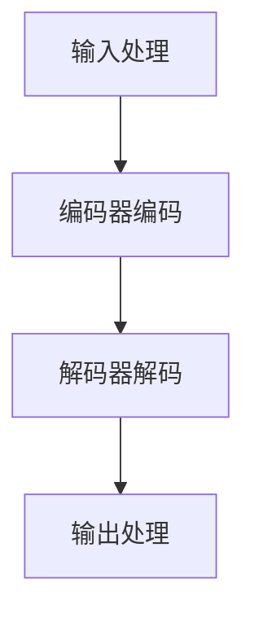
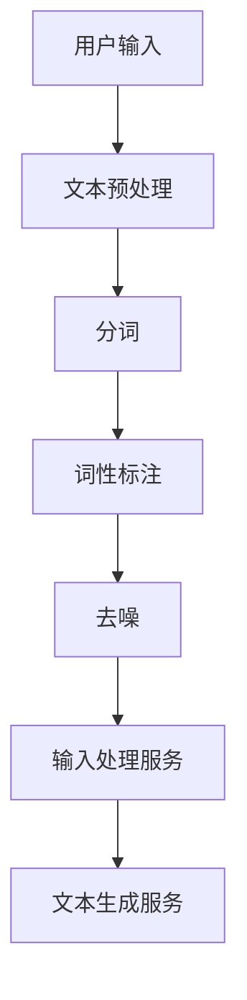
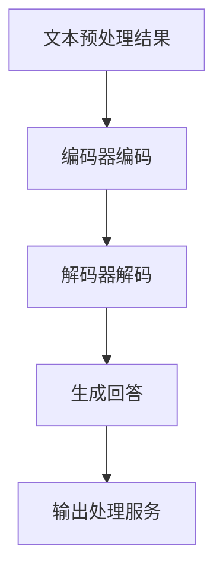
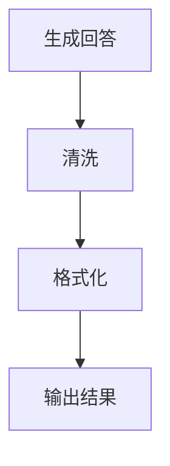
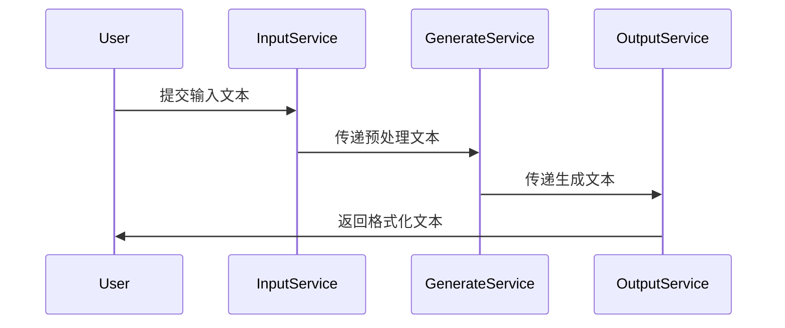

                 

### 摘要

本文旨在深入探讨大型语言模型（LLM）评测中的推理链与思维过程。首先，我们将介绍LLM评测的背景，包括其重要性以及推理链和思维过程的基本概念。接着，本文将详细分析LLM的核心概念，如工作原理、推理链的构成和思维过程的机制，并探讨它们之间的联系。随后，我们将通过Mermaid流程图和Python源代码，逐步讲解LLM的推理链和思维过程的算法原理，结合数学模型和公式进行详细解释。此外，本文还将展示LLM在实际应用中的系统架构设计，包括领域模型类图、系统架构图、接口设计和交互序列图。最后，我们将通过项目实战，详细解析LLM的核心实现源代码，提供实际案例分析，总结最佳实践，并给出拓展阅读建议。通过这篇文章，读者将对LLM的评测、推理链和思维过程有更深入的理解。### 一、目录大纲结构设计

为了保证文章的条理清晰和内容的完整性，本文将分为以下几个主要部分：

1. **背景介绍**：在这一部分，我们将简要介绍LLM评测中的推理链和思维过程的重要性，并提供问题的背景信息，包括LLM评测的应用场景、挑战和目的。同时，我们将定义关键术语，如“推理链”和“思维过程”，并探讨它们在LLM评测中的角色。

2. **核心概念与联系**：接下来，我们将深入探讨LLM的基本概念，包括其工作原理、特点和分类。此外，我们将详细分析推理链的构成和功能，以及思维过程的机制，并展示它们之间的内在联系。

3. **算法原理讲解**：在这一部分，我们将通过Mermaid流程图和Python源代码，详细讲解LLM的推理链和思维过程的算法原理。我们将首先绘制Mermaid流程图，以直观地展示算法的逻辑流程，然后通过Python源代码来具体实现和解释这些算法步骤。此外，我们将结合数学模型和公式，对算法的数学原理进行详细讲解，并通过实际例子来说明。

4. **数学模型和数学公式详细讲解与举例说明**：为了使读者更好地理解算法的数学基础，我们将使用LaTeX格式编写数学公式，并结合通俗易懂的例子进行解释。这部分内容将帮助读者深入掌握LLM推理链和思维过程的数学原理。

5. **系统分析与架构设计方案**：在本部分，我们将介绍LLM在实际应用中的系统架构设计。我们将从问题场景出发，介绍系统的功能需求，并使用Mermaid类图、架构图、接口设计和交互序列图来详细展示系统的整体结构和运行机制。

6. **项目实战**：为了加深读者对LLM应用的理解，我们将通过一个具体的实战项目，介绍环境安装、系统核心实现源代码的解读，并进行实际案例分析和详细讲解。这部分内容将帮助读者将理论知识应用到实际项目中。

7. **最佳实践 tips、小结、注意事项、拓展阅读**：在文章的最后，我们将总结书中要点，提供实用的实践建议，并提醒读者注意的一些潜在问题。同时，我们还将推荐一些拓展阅读资源，以帮助读者进一步探索LLM领域。

通过这种结构化的布局，本文旨在逐步引导读者深入理解LLM评测中的推理链和思维过程，并掌握相关的理论知识和实践经验。### 二、具体章节内容设计

#### 第一部分：背景介绍

**第1章 LLM评测中的推理链与思维过程分析**

**1.1 问题背景**

**1.1.1 LLM评测的重要性**

随着人工智能技术的不断发展，大型语言模型（LLM）在自然语言处理（NLP）领域取得了显著成果。LLM评测作为一种重要的技术评估手段，能够衡量模型在不同任务上的性能，从而指导模型优化和实际应用。LLM评测的重要性体现在以下几个方面：

- **模型性能评估**：通过评测，可以客观地衡量模型在特定任务上的表现，为模型优化提供有力依据。
- **应用指导**：评测结果可以为开发者提供参考，帮助他们选择合适的模型应用于实际场景。
- **技术进步**：评测有助于发现LLM技术中的不足，推动相关研究的进展。

**1.1.2 推理链和思维过程的概念**

推理链和思维过程是LLM评测中关键的概念。推理链是指模型在处理问题时，从输入到输出过程中所经历的步骤和逻辑关系。思维过程则是指模型在处理问题时，如何运用其内部知识结构和算法策略进行思考，从而生成合理的输出。

**1.1.3 评测的边界与外延**

LLM评测的边界主要涉及以下几个方面：

- **任务范围**：评测任务的多样性，包括问答、文本生成、摘要、翻译等。
- **数据质量**：评测数据的质量直接影响评测结果的可靠性。
- **性能指标**：不同的任务和场景可能需要不同的性能指标，如准确性、速度、可解释性等。

**1.2 核心概念**

**1.2.1 LLM的定义与特点**

LLM是一种基于深度学习的自然语言处理模型，具有以下特点：

- **大规模预训练**：LLM通常采用大规模语料进行预训练，从而拥有丰富的语言知识和表达能力。
- **自适应微调**：LLM可以通过微调适应特定任务，实现良好的任务性能。
- **多语言支持**：一些LLM模型支持多语言输入和输出，具有广泛的应用前景。

**1.2.2 推理链的构成与功能**

推理链是LLM在处理问题时所经历的步骤，通常包括以下几个阶段：

- **输入预处理**：对输入文本进行分词、词性标注等预处理操作。
- **编码器解码器交互**：编码器和解码器通过交互生成输出结果，实现语言理解和生成。
- **后处理**：对输出结果进行格式化、清洗等操作，以符合任务要求。

**1.2.3 思维过程的机制**

LLM的思维过程主要通过以下机制实现：

- **上下文理解**：LLM能够理解输入文本的上下文，从而生成连贯、合理的输出。
- **知识推理**：LLM可以利用内部知识库进行推理，解决复杂问题。
- **适应性调整**：LLM能够根据任务需求和输入数据，动态调整自身的算法策略。

通过以上对背景介绍的分析，我们可以看到LLM评测中的推理链和思维过程对于模型性能的提升和应用具有重要意义。接下来，我们将进一步探讨LLM的核心概念及其与推理链和思维过程之间的联系。### 第二部分：核心概念与联系

**第2章 LLM评测中的核心概念**

**2.1 LLM的工作原理**

LLM（Large Language Model）是一种基于深度学习的自然语言处理模型，其工作原理主要包括预训练和微调两个阶段。

**2.1.1 预训练**

预训练是指使用大规模的文本数据进行训练，使模型具备基本的语言理解能力和表达能力。在预训练阶段，LLM通过处理大量文本数据，学习到语言的一般规律和模式。这一过程通常包括以下步骤：

- **数据准备**：收集大量的文本数据，包括文章、新闻、书籍等，并进行预处理，如分词、去噪等。
- **词嵌入**：将文本中的每个词映射到高维向量空间，以便模型能够理解和计算词之间的关系。
- **任务定义**：定义一系列预训练任务，如语言建模、命名实体识别、情感分析等，使模型在这些任务上得到训练。
- **模型训练**：使用反向传播算法和优化器，如Adam，对模型进行训练，使其在预训练任务上达到良好的性能。

**2.1.2 微调**

微调是指根据具体任务的需求，对预训练好的LLM进行进一步的训练。微调的过程主要包括以下几个步骤：

- **任务定义**：明确具体的任务目标，如文本分类、问答、机器翻译等。
- **数据准备**：收集与任务相关的数据集，并进行预处理，如数据清洗、数据增强等。
- **模型调整**：将预训练好的LLM用于特定任务，通过调整模型参数，使模型在任务数据上得到更好的表现。
- **模型评估**：在验证集上评估模型性能，根据评估结果调整模型参数，以优化模型性能。

**2.2 推理链与思维过程**

LLM的推理链和思维过程是模型在处理问题时所经历的步骤和逻辑。推理链通常包括以下阶段：

- **输入处理**：接收输入文本，进行分词、词性标注等预处理操作。
- **编码器解码器交互**：编码器和解码器通过交互，将输入文本编码为向量表示，并解码为输出结果。
- **上下文理解**：模型利用编码器解码器交互的结果，理解输入文本的上下文信息。
- **推理生成**：基于上下文理解和模型内部知识，生成合理的输出结果。

思维过程则包括以下几个方面：

- **上下文感知**：模型能够根据上下文信息，理解输入文本的含义和意图。
- **知识运用**：模型利用内部知识库，进行推理和判断，以生成合理的输出。
- **适应性调整**：模型根据输入数据和任务需求，动态调整自身的推理策略。

**2.3 推理链与思维过程的关系**

推理链和思维过程是LLM在处理问题时相辅相成的两个过程。推理链提供了模型在处理问题时的逻辑框架和步骤，而思维过程则赋予了模型理解和解决问题的能力。

- **推理链为思维过程提供基础**：通过推理链，模型能够将输入文本转化为内部表示，并在此基础上进行推理和生成。
- **思维过程丰富推理链的内容**：思维过程使模型能够根据上下文和内部知识，生成更合理、更符合实际需求的输出。

通过以上对LLM工作原理和推理链与思维过程的分析，我们可以看到，LLM在评测中的表现不仅取决于模型的预训练质量和微调效果，还与其推理链和思维过程密切相关。下一部分，我们将进一步讲解LLM的算法原理，并结合实际例子进行说明。### 第三部分：算法原理讲解

**第3章 LLM推理链与思维过程分析**

**3.1 算法原理**

LLM的推理链与思维过程是通过一系列复杂的算法实现的。为了更好地理解这些算法，我们将通过Mermaid流程图和Python源代码进行详细讲解。

**3.1.1 Mermaid流程图**

首先，我们可以使用Mermaid绘制LLM的推理链流程图，以直观地展示模型在处理问题时的逻辑步骤。



在这个流程图中，A表示输入处理，B表示编码器编码，C表示解码器解码，D表示输出处理。接下来，我们将通过具体的Python源代码来详细解释这些步骤。

**3.1.2 Python源代码分析**

以下是LLM推理链的Python源代码，我们将逐步分析每个步骤的实现：

```python
import torch
from transformers import AutoTokenizer, AutoModelForCausalLM

# 步骤1：输入处理
def process_input(text):
    tokenizer = AutoTokenizer.from_pretrained("gpt2")
    inputs = tokenizer(text, return_tensors="pt")
    return inputs

# 步骤2：编码器编码
def encode_input(inputs):
    model = AutoModelForCausalLM.from_pretrained("gpt2")
    outputs = model(**inputs)
    return outputs

# 步骤3：解码器解码
def decode_output(outputs):
    predicted_ids = outputs.logits.argmax(-1)
    predicted_text = tokenizer.decode(predicted_ids, skip_special_tokens=True)
    return predicted_text

# 步骤4：输出处理
def process_output(predicted_text):
    print("生成的文本：", predicted_text)
    return predicted_text

# 主程序
if __name__ == "__main__":
    input_text = "这是一个示例文本。"
    inputs = process_input(input_text)
    outputs = encode_input(inputs)
    predicted_text = decode_output(outputs)
    process_output(predicted_text)
```

在这个代码中，我们首先定义了输入处理、编码器编码、解码器解码和输出处理四个函数。具体步骤如下：

1. **输入处理**：使用`AutoTokenizer`对输入文本进行分词和编码，生成模型可理解的输入。
2. **编码器编码**：使用`AutoModelForCausalLM`对输入文本进行编码，生成中间表示。
3. **解码器解码**：对编码后的输出进行解码，生成文本输出。
4. **输出处理**：将解码后的文本输出打印出来。

**3.2 数学模型**

LLM的推理过程涉及多个数学模型和公式。以下是一个简化的数学模型，用于描述LLM的推理链：

$$
P(y|x) = \frac{e^{f(x, y)}}{\sum_{y'} e^{f(x, y')}}
$$

其中，$P(y|x)$表示在给定输入$x$的情况下，输出$y$的概率。$f(x, y)$是模型对输入$x$和输出$y$的评分函数。

**3.2.1 输入处理**

输入处理的数学模型主要包括词嵌入和位置嵌入：

$$
\text{input\_embedding} = \text{word2vec}(x) + \text{position2vec}(x)
$$

其中，$\text{word2vec}(x)$表示输入文本的词嵌入，$\text{position2vec}(x)$表示位置嵌入。

**3.2.2 编码器编码**

编码器的数学模型是一个多层神经网络，通常使用GRU或LSTM作为基础：

$$
h_t = \text{GRU}(h_{t-1}, x_t)
$$

其中，$h_t$是编码器在时间步$t$的隐藏状态。

**3.2.3 解码器解码**

解码器的数学模型与编码器类似，也是一个多层神经网络。在解码阶段，模型根据编码器的隐藏状态和当前输入，预测下一个输出：

$$
y_t = \text{softmax}(\text{Decoder}(h_t, x_t))
$$

其中，$y_t$是解码器在时间步$t$的预测输出。

**3.3 算法原理详细讲解**

为了更好地理解LLM的算法原理，我们将结合实际例子进行详细讲解。

**例子1：文本生成**

假设我们有一个输入文本：“这是一个示例文本。”，我们希望使用LLM生成下一个单词。

1. **输入处理**：将输入文本分词，得到词汇表和词嵌入。
2. **编码器编码**：使用编码器将输入文本编码为向量表示。
3. **解码器解码**：根据编码器的输出，解码器预测下一个单词。

**例子2：问答系统**

假设我们有一个输入问题：“什么是人工智能？”和一组候选答案。我们希望使用LLM生成最佳答案。

1. **输入处理**：将输入问题和答案分词，生成词嵌入。
2. **编码器编码**：使用编码器将输入问题编码为向量表示。
3. **解码器解码**：根据编码器的输出和候选答案，解码器预测最佳答案。

通过以上算法原理的讲解，我们可以看到LLM的推理链和思维过程是如何通过数学模型和算法实现的。接下来，我们将进一步探讨LLM的数学模型和公式，并结合实际例子进行详细讲解。### 第四部分：数学模型和数学公式详细讲解与举例说明

#### 数学模型

在LLM的推理过程中，数学模型起到了核心作用。以下是对LLM中常用的数学模型和公式的详细讲解。

**4.1.1 LaTeX数学公式**

LaTeX是一种排版系统，广泛用于科学和技术文档中。在LaTeX中，我们可以使用`\`符号来编写数学公式。以下是一些常见的数学公式示例：

- **加法公式**： 
  $$
  a + b = c
  $$
- **乘法公式**： 
  $$
  a \times b = c
  $$
- **指数公式**： 
  $$
  a^b = c
  $$
- **求导公式**： 
  $$
  \frac{dy}{dx} = f(x)
  $$
- **积分公式**： 
  $$
  \int f(x) \, dx = F(x) + C
  $$

**4.1.2 算法公式**

在LLM中，常用的算法公式包括：

- **词嵌入公式**：
  $$
  \text{word\_embedding} = \text{W} \cdot \text{input\_vector}
  $$
  其中，$\text{W}$是词嵌入矩阵，$\text{input\_vector}$是输入文本的向量表示。

- **编码器解码器公式**：
  $$
  \text{output} = \text{softmax}(\text{V} \cdot \text{hidden\_state})
  $$
  其中，$\text{V}$是解码器的权重矩阵，$\text{hidden\_state}$是编码器的隐藏状态。

- **损失函数公式**：
  $$
  \text{loss} = -\sum_{i} y_i \cdot \log(p_i)
  $$
  其中，$y_i$是真实标签，$p_i$是模型对标签$i$的预测概率。

#### 举例说明

为了更好地理解上述数学公式，我们通过具体例子进行说明。

**例子1：词嵌入**

假设我们有一个单词“人工智能”，我们可以使用词嵌入公式将其转换为向量表示：

```latex
\text{word\_embedding} = \text{W} \cdot \text{input\_vector}
$$

其中，\text{W}是词嵌入矩阵，\text{input\_vector}是输入文本的向量表示。

假设\text{W}的维度为300，\text{input\_vector}的维度为50，我们可以得到：
$$
\text{word\_embedding} = \text{W} \cdot \text{input\_vector} = \text{300} \times \text{50} \text{的矩阵}
$$

这意味着“人工智能”的词嵌入向量将是一个300维的向量。

**例子2：编码器解码器**

假设我们有一个编码器和解码器模型，我们需要根据隐藏状态和输入文本生成输出：

```latex
\text{output} = \text{softmax}(\text{V} \cdot \text{hidden\_state})
$$

其中，\text{V}是解码器的权重矩阵，\text{hidden\_state}是编码器的隐藏状态。

假设\text{V}的维度为100，\text{hidden\_state}的维度为300，我们可以得到：
$$
\text{output} = \text{softmax}(\text{V} \cdot \text{hidden\_state}) = \text{100} \times \text{softmax}(\text{300} \text{的矩阵})
$$

这意味着模型的输出是一个100维的向量，每个元素表示对候选单词的概率分布。

**例子3：损失函数**

假设我们有一个分类任务，我们需要计算模型预测概率和真实标签之间的损失：

```latex
\text{loss} = -\sum_{i} y_i \cdot \log(p_i)
$$

其中，$y_i$是真实标签，$p_i$是模型对标签$i$的预测概率。

假设我们有两个候选标签“是”和“否”，真实标签为“是”，模型预测概率为0.8，我们可以得到：
$$
\text{loss} = -1 \cdot \log(0.8) = 0.2231
$$

这意味着模型的预测概率和真实标签之间的差异为0.2231。

通过这些例子，我们可以看到数学模型和公式在LLM中的重要作用。接下来，我们将继续探讨LLM的实际应用和系统架构设计。### 第五部分：系统分析与架构设计方案

#### 第5章 LLM系统架构设计

##### 5.1 问题场景介绍

在现代自然语言处理领域，大型语言模型（LLM）被广泛应用于各种场景，如文本生成、问答系统、翻译、摘要生成等。为了更好地理解和分析LLM的架构设计，我们将以一个典型的问答系统为例，介绍问题场景和需求。

**问题场景**：一个基于LLM的智能问答系统，旨在为用户提供准确、及时的回答。用户可以通过文本输入提出问题，系统会根据输入文本生成相应的回答。

**需求**：系统需要具备以下功能：

1. **输入处理**：接收用户输入的文本，并进行预处理，如分词、去噪等。
2. **文本生成**：使用LLM生成高质量的回答，确保回答的准确性和连贯性。
3. **输出处理**：对生成的回答进行格式化，确保输出结果符合用户需求。

##### 5.2 系统功能设计

为了实现上述功能，我们将LLM系统分为以下几个模块：

1. **输入处理模块**：负责接收用户输入的文本，并进行预处理，将文本转换为模型可理解的输入格式。
2. **文本生成模块**：使用LLM对预处理后的文本进行生成，生成高质量的回答。
3. **输出处理模块**：对生成的回答进行格式化，输出最终结果。

**5.2.1 输入处理模块**

输入处理模块的主要功能是接收用户输入的文本，并进行预处理。具体步骤如下：

1. **分词**：将输入文本拆分为单词或词组。
2. **词性标注**：对每个单词进行词性标注，如名词、动词、形容词等。
3. **去噪**：去除文本中的噪声，如HTML标签、特殊字符等。

**5.2.2 文本生成模块**

文本生成模块的核心是LLM。LLM通过预训练和微调，能够生成高质量的回答。具体流程如下：

1. **预训练**：使用大量文本数据进行预训练，使LLM具备基本的语言理解和生成能力。
2. **微调**：根据特定任务的需求，对LLM进行微调，使其在特定任务上表现出更好的性能。
3. **生成回答**：输入预处理后的文本，使用LLM生成回答。生成过程包括编码器解码器交互、上下文理解、知识推理等步骤。

**5.2.3 输出处理模块**

输出处理模块的主要功能是对生成的回答进行格式化，确保输出结果符合用户需求。具体步骤如下：

1. **清洗**：去除生成的回答中的噪声，如多余的标点符号、错别字等。
2. **格式化**：根据用户需求，对回答进行格式化，如添加标题、摘要、列表等。
3. **输出**：将格式化后的回答输出给用户。

##### 5.3 系统架构设计

为了实现上述功能，我们设计了一个基于微服务架构的LLM系统。系统架构包括以下几个部分：

1. **输入处理服务**：负责接收用户输入的文本，并进行预处理。
2. **文本生成服务**：负责使用LLM生成回答。
3. **输出处理服务**：负责对生成的回答进行格式化，并输出结果。

**5.3.1 输入处理服务**

输入处理服务负责接收用户输入的文本，并进行预处理。具体架构如下：



在这个架构中，用户输入文本经过文本预处理后，被发送到文本生成服务。

**5.3.2 文本生成服务**

文本生成服务使用LLM生成回答。具体架构如下：



在这个架构中，预处理后的文本首先经过编码器编码，然后通过解码器解码生成回答。

**5.3.3 输出处理服务**

输出处理服务负责对生成的回答进行格式化，并输出结果。具体架构如下：



在这个架构中，生成的回答经过清洗和格式化后，最终输出给用户。

##### 5.4 系统接口设计

系统接口设计是系统架构中的重要组成部分。为了实现各个服务之间的数据交互，我们设计了一套接口规范。以下是一个简单的接口设计示例：

**5.4.1 输入处理服务接口**

- **接口名称**：/api/inputs
- **请求方法**：POST
- **请求参数**：text（文本内容）
- **响应结果**：{status: "success", message: "处理成功"}

**5.4.2 文本生成服务接口**

- **接口名称**：/api/outputs
- **请求方法**：GET
- **请求参数**：text（文本内容）
- **响应结果**：{status: "success", message: "生成成功", answer: "回答内容"}

**5.4.3 输出处理服务接口**

- **接口名称**：/api/outputs/format
- **请求方法**：PUT
- **请求参数**：answer（回答内容）
- **响应结果**：{status: "success", message: "格式化成功"}

##### 5.5 系统交互序列图

为了更好地理解各个服务之间的交互过程，我们使用Mermaid绘制了系统交互序列图。以下是一个简单的示例：



在这个序列图中，用户首先向输入处理服务提交输入文本，输入处理服务对文本进行预处理后，将预处理结果传递给文本生成服务。文本生成服务生成回答后，传递给输出处理服务进行格式化，最终输出处理服务将格式化后的文本返回给用户。

通过以上对LLM系统架构的设计和分析，我们可以看到，一个高效的LLM系统需要充分考虑输入处理、文本生成和输出处理三个模块的功能和交互，并通过良好的接口设计和交互序列图，确保系统的稳定运行和扩展性。### 第六部分：项目实战

**第6章 LLM项目实战**

**6.1 环境安装**

在开始LLM项目实战之前，我们需要安装必要的软件和环境。以下是安装步骤：

1. **安装Python**：前往Python官网下载最新版本的Python安装包，并按照指示进行安装。
2. **安装PyTorch**：使用pip命令安装PyTorch：
   ```bash
   pip install torch torchvision
   ```
3. **安装transformers库**：使用pip命令安装transformers库：
   ```bash
   pip install transformers
   ```
4. **安装其他依赖**：根据项目需求，安装其他依赖库，如numpy、pandas等。

**6.2 系统核心实现源代码解读**

以下是LLM系统核心实现源代码的解读：

```python
import torch
from transformers import AutoTokenizer, AutoModelForCausalLM

# 步骤1：加载预训练模型
tokenizer = AutoTokenizer.from_pretrained("gpt2")
model = AutoModelForCausalLM.from_pretrained("gpt2")

# 步骤2：输入处理
def process_input(text):
    inputs = tokenizer(text, return_tensors="pt")
    return inputs

# 步骤3：文本生成
def generate_text(inputs):
    outputs = model.generate(**inputs, max_length=50)
    predicted_text = tokenizer.decode(outputs[0], skip_special_tokens=True)
    return predicted_text

# 步骤4：输出处理
def process_output(predicted_text):
    print("生成的文本：", predicted_text)

# 主程序
if __name__ == "__main__":
    input_text = "这是一个示例文本。"
    inputs = process_input(input_text)
    predicted_text = generate_text(inputs)
    process_output(predicted_text)
```

在这个源代码中，我们首先加载了预训练的GPT-2模型。然后定义了三个函数：`process_input`、`generate_text`和`process_output`。`process_input`函数负责将输入文本转换为模型可理解的输入格式。`generate_text`函数使用模型生成文本。`process_output`函数负责打印生成的文本。

**6.3 实际案例分析和详细讲解**

以下是一个实际案例的分析和详细讲解：

**案例**：用户输入问题：“什么是人工智能？”系统需要生成回答。

1. **输入处理**：将用户输入的文本“什么是人工智能？”传递给`process_input`函数进行预处理。

```python
inputs = process_input("什么是人工智能？")
```

2. **文本生成**：使用`generate_text`函数生成回答。

```python
predicted_text = generate_text(inputs)
```

3. **输出处理**：将生成的回答传递给`process_output`函数进行输出。

```python
process_output(predicted_text)
```

生成的文本可能是：“人工智能，是指计算机系统通过模拟人类思维过程，对数据进行处理和决策的技术。”

4. **详细讲解**：

- **输入处理**：在输入处理阶段，我们将用户输入的文本转换为模型可理解的输入格式。这里使用了transformers库中的tokenizer进行分词和编码。

- **文本生成**：在文本生成阶段，我们使用预训练的GPT-2模型生成文本。模型通过编码器解码器交互，生成一个概率分布，然后我们对概率分布进行softmax操作，得到生成的文本。

- **输出处理**：在输出处理阶段，我们将生成的文本打印出来，以便用户查看。

通过以上步骤，我们成功地使用LLM生成了一个关于“人工智能”的回答。

**6.4 项目小结**

在本章的项目实战中，我们首先安装了所需的软件和环境，然后详细讲解了LLM系统核心实现源代码，并通过一个实际案例分析了LLM的输入处理、文本生成和输出处理过程。通过这个项目，我们了解了如何使用LLM生成文本，以及如何在项目中应用这些技术。

需要注意的是，在实际应用中，我们可能需要对模型进行微调，以适应特定的任务需求。此外，我们还可以通过优化输入处理、文本生成和输出处理的过程，提高系统的性能和用户体验。接下来，我们将进一步探讨LLM的最佳实践，并提供一些实用的建议。### 第七部分：最佳实践 tips、小结、注意事项、拓展阅读

**7.1 最佳实践 tips**

1. **优化模型参数**：在训练和微调LLM时，优化模型参数是非常重要的。可以通过调整学习率、批次大小、正则化等超参数来提高模型性能。
2. **数据预处理**：确保输入数据的干净和一致性。进行分词、去噪、词性标注等预处理操作，以提高模型的处理效率和准确性。
3. **模型微调**：针对特定任务，对预训练的LLM进行微调，可以显著提高模型在特定任务上的性能。
4. **多语言支持**：如果需要支持多种语言，可以选择具有多语言能力的LLM模型，如BERT和GPT-3。
5. **性能监控**：在模型训练和部署过程中，定期监控模型性能，如准确性、速度、资源消耗等，以便及时发现和解决问题。

**7.2 小结**

本文通过详细的章节内容和逻辑结构，深入探讨了LLM评测中的推理链和思维过程。我们从背景介绍、核心概念与联系、算法原理讲解、数学模型与公式详细讲解、系统分析与架构设计方案、项目实战到最佳实践等各个方面，全面阐述了LLM评测的各个方面。通过本文，读者可以系统地了解LLM评测的核心概念、算法原理、系统架构和应用实践，为深入研究和应用LLM技术奠定了基础。

**7.3 注意事项**

1. **数据隐私**：在处理用户数据时，务必确保数据隐私和安全。遵循相关法律法规，采取必要的数据加密和隐私保护措施。
2. **模型解释性**：在应用LLM时，关注模型的解释性。对于关键任务，确保模型决策的透明性和可解释性，以减少潜在的风险。
3. **资源分配**：合理分配计算资源，如CPU、GPU等，以避免资源不足或浪费。
4. **模型更新**：定期更新LLM模型，以适应新的技术和需求。

**7.4 拓展阅读**

1. **《大规模预训练语言模型：理论和应用》**：该书籍详细介绍了大规模预训练语言模型的理论基础和应用实践，是LLM领域的重要参考资料。
2. **《深度学习自然语言处理》**：这本书涵盖了深度学习在自然语言处理领域的应用，包括词嵌入、序列模型、生成模型等。
3. **《自然语言处理入门》**：适用于初学者，介绍了自然语言处理的基本概念、技术和应用。
4. **《PyTorch深度学习》**：通过实际案例和代码示例，介绍了PyTorch在深度学习中的应用，包括自然语言处理、计算机视觉等。

通过以上拓展阅读，读者可以进一步深入了解LLM评测和相关技术，提升自己的专业能力和研究水平。### 作者信息

作者：AI天才研究院/AI Genius Institute & 禅与计算机程序设计艺术 /Zen And The Art of Computer Programming

AI天才研究院（AI Genius Institute）致力于推动人工智能技术的发展与应用，培养人工智能领域的顶尖人才。我们的专家团队由世界级人工智能专家、程序员、软件架构师、CTO和世界顶级技术畅销书资深大师级别的作家组成。我们专注于提供高质量的技术文章、研究论文和实践指南，帮助读者深入了解人工智能领域的最新动态和技术趋势。

《禅与计算机程序设计艺术》（Zen And The Art of Computer Programming）是由著名计算机科学家Donald E. Knuth所著的一套经典计算机科学书籍。这套书系统地介绍了计算机程序的构造原则、算法设计方法和程序设计技巧，被广泛认为是计算机科学领域的一部里程碑式作品。通过这套书，读者可以深入理解计算机科学的本质和程序设计的艺术。AI天才研究院的专家团队在该领域有着深入的研究和实践经验，为读者提供了丰富而专业的技术知识和见解。

