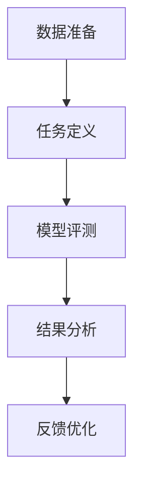
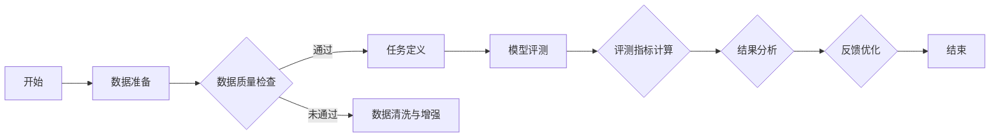
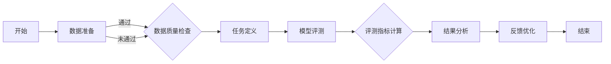
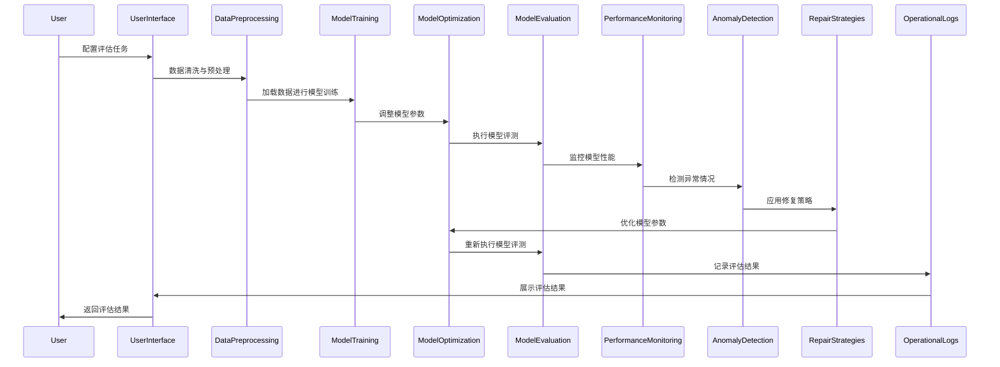

                 

### 1. 背景介绍

#### 1.1 问题背景

在当前人工智能（AI）飞速发展的时代，大规模语言模型（LLM）已经成为自然语言处理（NLP）领域的重要工具。LLM能够处理和理解复杂的人类语言，被广泛应用于机器翻译、文本生成、问答系统等多个领域。然而，随着模型的规模不断扩大，模型的性能和稳定性也逐渐成为研究的焦点。

在LLM评测中，模型的诊断与修复策略扮演着至关重要的角色。首先，由于LLM涉及的数据量庞大且复杂，模型的训练和优化过程可能会受到多种因素的影响，导致模型在某些特定场景下出现性能下降或错误。因此，对模型进行有效的诊断，找出问题的根源，是提升模型性能的关键步骤。

其次，在模型的应用过程中，用户可能会遇到各种异常情况，如生成文本的错误、理解能力的下降等。针对这些情况，提出合理的修复策略，确保模型在多种环境下都能够稳定运行，是保障模型应用效果的重要措施。

综上所述，LLM评测中的模型诊断与修复策略不仅有助于提升模型的整体性能，还能够提高模型在实际应用中的可靠性和用户体验。

#### 1.2 问题描述

在LLM评测中，模型诊断与修复策略面临的主要问题可以分为以下几个方面：

1. **性能波动**：模型在不同数据集上的表现可能不一致，导致在某些特定场景下出现性能下降。例如，一个训练良好的模型可能在面对新的、未经验证的数据时，出现预测准确率显著下降的情况。

2. **过拟合**：模型在训练数据上表现优异，但在测试数据上的表现较差，即“过拟合”现象。这通常是由于模型对训练数据过于敏感，无法泛化到未见过的数据上。

3. **数据分布偏斜**：模型在处理某些特定类型的数据时，表现不如预期。例如，对于某些语言或地区的文本，模型的生成能力可能较弱。

4. **错误输出**：模型在生成文本或回答问题时，可能出现明显的错误，甚至生成无意义的文本。这可能会影响用户对模型的可信度和实际应用价值。

5. **资源消耗**：大型LLM模型在训练和推理过程中，对计算资源和存储资源的需求较高，如何高效地诊断和修复模型，以减少资源消耗，也是一个重要问题。

针对上述问题，模型诊断与修复策略需要从多个角度进行考虑，包括模型的训练过程、数据预处理、模型优化等方面，以提升模型的整体性能和稳定性。

#### 1.3 问题解决

为了解决LLM评测中模型诊断与修复策略面临的问题，我们可以采取以下几种方法：

1. **模型监控与诊断**：
   - **性能监控**：实时监控模型的运行状态，包括预测准确率、响应时间等关键指标。通过分析这些指标的变化趋势，可以及时发现模型的性能波动。
   - **异常检测**：利用机器学习技术，建立异常检测模型，对模型的输出结果进行实时检查。当检测到异常输出时，自动触发诊断流程。

2. **数据预处理**：
   - **数据清洗**：对输入数据进行清洗，去除噪声和异常值，确保数据质量。
   - **数据增强**：通过增加数据的多样性和丰富性，帮助模型更好地泛化到未见过的数据上。

3. **模型优化**：
   - **权重调整**：通过调整模型的权重参数，优化模型在特定任务上的表现。
   - **模型剪枝**：通过剪枝方法，去除模型中不必要的权重，降低模型的复杂度和计算成本。

4. **修复策略**：
   - **在线修复**：在模型运行过程中，根据诊断结果，实时调整模型参数或数据预处理策略，确保模型的稳定性。
   - **离线修复**：在模型训练过程中，利用诊断结果，重新训练模型，或对现有模型进行修正。

通过上述方法，可以有效提升LLM评测中模型诊断与修复策略的效果，提高模型的整体性能和稳定性。

#### 1.4 边界与外延

在应用LLM评测中的模型诊断与修复策略时，我们需要明确其适用的边界和可能面临的外部挑战。

**边界**：

1. **模型类型**：模型诊断与修复策略主要适用于大规模语言模型，如GPT、BERT等。对于其他类型的模型，如图像识别模型或强化学习模型，策略可能需要相应调整。

2. **数据集**：策略的有效性依赖于训练数据的质量和多样性。对于数据量较少或数据分布不均的任务，策略的效果可能会受到限制。

3. **计算资源**：模型诊断与修复过程可能需要较高的计算资源。在实际应用中，需要根据可用的计算资源，合理配置策略。

**外延**：

1. **跨领域应用**：模型诊断与修复策略能否在其他AI领域应用，如语音识别、计算机视觉等，需要进一步研究。

2. **实时性与效率**：如何在保证模型性能的同时，提高诊断与修复的实时性和效率，是策略设计的重要方向。

3. **自动化程度**：如何进一步提高策略的自动化程度，减少人工干预，是未来研究的一个关键问题。

通过明确边界和外延，我们可以更好地理解模型诊断与修复策略的应用范围和挑战，为实际应用提供指导。

#### 1.5 概念结构与核心要素组成

在LLM评测中，模型诊断与修复策略涉及多个核心概念，这些概念相互联系，共同构成一个完整的体系。

**核心概念**：

1. **模型评测**：对LLM进行评估和测试，以确定其在各种任务中的性能和稳定性。

2. **模型诊断**：对模型的性能问题进行检测和定位，找出问题的根源。

3. **修复策略**：根据诊断结果，采取相应的措施，修复模型中的问题。

**核心要素组成**：

1. **评测指标**：包括预测准确率、响应时间、资源消耗等，用于评估模型的表现。

2. **诊断方法**：如性能监控、异常检测等，用于检测和定位模型的问题。

3. **修复方法**：如权重调整、模型剪枝等，用于修复模型中的问题。

4. **数据预处理**：对输入数据进行清洗和增强，确保数据质量。

5. **模型优化**：通过调整模型参数，优化模型在特定任务上的表现。

6. **实时监控**：对模型运行过程进行实时监控，及时发现并解决问题。

7. **离线修复**：在模型训练过程中，利用诊断结果进行模型修正。

通过详细阐述这些核心概念和要素组成，我们可以更好地理解LLM评测中的模型诊断与修复策略，为后续的内容奠定基础。

## 2. 核心概念与联系

在深入探讨LLM评测中的模型诊断与修复策略之前，我们首先需要明确相关核心概念，并分析它们之间的联系。以下是LLM评测、模型诊断与修复策略的关键概念及其相互关系。

### 2.1 LLM评测概述

**LLM评测的定义与目的**：

LLM评测是指对大规模语言模型在自然语言处理任务中的性能进行评估和测试的过程。其主要目的是确定模型在处理不同类型文本数据时的表现，以及模型在不同应用场景下的适应能力和稳定性。

**LLM评测的主要指标和方法**：

- **准确率（Accuracy）**：模型在预测任务中正确分类的比例。
- **精确率（Precision）**：模型在预测为正例的样本中，真正例的比例。
- **召回率（Recall）**：模型在预测为正例的样本中，未漏掉真正例的比例。
- **F1分数（F1 Score）**：精确率和召回率的调和平均数。

评测方法通常包括：

- **交叉验证（Cross Validation）**：通过将数据集划分为多个子集，分别进行训练和验证，以减少模型过拟合的风险。
- **A/B测试（A/B Testing）**：将用户随机分配到不同版本的模型中，比较不同模型的实际表现。
- **主观评估（Subjective Evaluation）**：通过人工评估模型生成的文本质量，以评估模型在语言理解、文本生成等方面的性能。

### 2.2 模型诊断原理

**模型诊断的定义与意义**：

模型诊断是指通过一系列方法和工具，对LLM在评测过程中表现异常或性能波动的问题进行定位和识别的过程。其主要意义在于：

- **发现问题根源**：通过诊断，可以明确导致模型性能下降的具体原因，如过拟合、数据分布偏斜等。
- **指导修复策略**：诊断结果为修复策略的制定提供依据，有助于有针对性地进行模型调整。

**模型诊断的主要方法与步骤**：

- **性能监控**：实时收集和监控模型在训练和测试过程中的关键指标，如损失函数、准确率等。
- **异常检测**：利用统计学方法或机器学习算法，对模型输出结果进行异常检测，识别可能的错误输出。
- **数据检查**：检查输入数据的完整性和质量，确保数据不含有噪声和异常值。
- **模型分析**：对模型的结构和参数进行深入分析，识别可能导致性能问题的潜在因素。

### 2.3 修复策略原理

**修复策略的定义与目的**：

修复策略是指根据模型诊断的结果，采取一系列措施对模型进行优化和调整，以解决诊断出的问题。其主要目的是提升模型的整体性能和稳定性，确保模型在各种应用场景下能够正常运行。

**修复策略的主要方法与步骤**：

- **权重调整**：通过调整模型的权重参数，优化模型在特定任务上的表现。例如，使用梯度下降算法调整模型权重。
- **模型剪枝**：通过剪枝方法，去除模型中不必要的权重和神经元，降低模型的复杂度和计算成本。
- **数据增强**：通过增加数据的多样性和丰富性，帮助模型更好地泛化到未见过的数据上。
- **重新训练**：利用更高质量的数据或改进的训练策略，重新训练模型，以提高其性能。

### 2.4 概念属性特征对比表格

为了更直观地理解LLM评测、模型诊断与修复策略的属性特征，我们可以通过以下对比表格进行分析：

| 概念               | 定义                                                         | 目的                                           | 主要方法与步骤                                                     | 关联性               |
|--------------------|--------------------------------------------------------------|------------------------------------------------|------------------------------------------------------------------|--------------------|
| LLM评测            | 对大规模语言模型进行评估和测试                             | 确定模型在自然语言处理任务中的性能和稳定性       | 准确率、精确率、召回率、F1分数等；交叉验证、A/B测试、主观评估     | 基础，为诊断提供依据 |
| 模型诊断           | 对LLM在评测过程中表现异常或性能波动的问题进行定位和识别     | 发现问题根源，指导修复策略                       | 性能监控、异常检测、数据检查、模型分析                               | 关键，指导修复策略   |
| 修复策略           | 根据模型诊断的结果，对模型进行优化和调整                   | 提升模型的整体性能和稳定性                       | 权重调整、模型剪枝、数据增强、重新训练                               | 终结，解决问题       |

### 2.5 ER实体关系图架构

为了进一步理解LLM评测、模型诊断与修复策略之间的实体关系，我们可以使用ER（实体-关系）图进行描述。以下是ER实体关系图的一个简略表示：

```mermaid
erDiagram
  ModelEvaluation ||--|{ ModelDiagnostics : has_diagnosed }
  ModelDiagnostics ||--|{ RepairStrategies : has_applied }
  ModelEvaluation ||--|{ RepairStrategies : requires_for_evaluation }
```

在这个ER图中：

- `ModelEvaluation`（模型评测）是主实体，它包含了模型的评测过程。
- `ModelDiagnostics`（模型诊断）是关联实体，表示对模型进行诊断的过程。
- `RepairStrategies`（修复策略）也是关联实体，表示针对诊断结果采取的修复措施。

这些实体之间的关系如下：

- `ModelDiagnostics`依赖于`ModelEvaluation`的结果，即诊断过程是在评测基础上进行的。
- `RepairStrategies`基于`ModelDiagnostics`的结果制定，即修复策略是根据诊断结果来应用的。
- `ModelEvaluation`可能需要`RepairStrategies`的支持，以确保模型的性能和稳定性。

通过上述核心概念和ER实体关系图的阐述，我们可以更清晰地理解LLM评测、模型诊断与修复策略之间的关系和相互作用，为后续的内容分析提供坚实的理论基础。

### 3. 算法原理讲解

在LLM评测过程中，模型诊断与修复策略的算法原理是关键环节。以下是关于评测算法原理的详细讲解。

#### 3.1 评测算法原理

**评测算法的定义与目的**：

评测算法是指用于评估大规模语言模型（LLM）在各种自然语言处理任务中表现的一系列方法。其主要目的是通过定量和定性的方式，全面评估模型在任务中的性能，从而为模型的优化和改进提供依据。

**评测算法的主要原理和步骤**：

1. **数据准备**：首先，我们需要准备用于评测的数据集。数据集应具有代表性，涵盖模型需要处理的多种场景。通常，数据集包括训练集、验证集和测试集。

2. **任务定义**：根据评测任务的需求，定义具体的评测指标和方法。常见的评测指标包括准确率、精确率、召回率、F1分数等。评测方法则包括交叉验证、A/B测试和主观评估等。

3. **模型评测**：利用定义好的评测指标和方法，对模型在训练集、验证集和测试集上的表现进行评估。在这一过程中，我们重点关注模型的性能波动、过拟合和错误输出等问题。

4. **结果分析**：对评测结果进行深入分析，识别模型的优点和不足。通过对比不同模型或同一模型在不同数据集上的表现，可以找出影响模型性能的关键因素。

5. **反馈优化**：根据分析结果，对模型进行优化。这可能包括调整模型参数、改进数据预处理方法或重新设计模型结构等。

**评测算法的流程**：

以下是一个简单的评测算法流程图，用于描述评测过程的主要步骤：



#### 3.1.1 评测算法流程

为了更好地理解评测算法的流程，我们可以使用mermaid图表进行描述。以下是评测算法的mermaid流程图：



在这个流程图中：

- **数据准备**：收集并处理用于评测的数据集。
- **数据质量检查**：检查数据集的质量，确保其符合评测要求。
- **任务定义**：定义具体的评测任务和评测指标。
- **模型评测**：使用定义好的评测任务和指标对模型进行评测。
- **评测指标计算**：计算各个评测指标，如准确率、精确率和召回率等。
- **结果分析**：对评测结果进行分析，识别模型的优缺点。
- **反馈优化**：根据分析结果，对模型进行优化和调整。

#### 3.1.2 评测算法mermaid流程图

以下是一个具体的mermaid流程图示例，描述了评测算法的详细步骤：



通过这个流程图，我们可以清晰地看到评测算法的各个步骤及其相互关系，有助于理解和实施评测过程。

#### 3.1.3 Python源代码讲解

为了更好地理解评测算法的实现细节，下面提供了一个简单的Python源代码示例，用于计算模型的评测指标。

```python
import numpy as np

def calculate_accuracy(y_true, y_pred):
    return np.mean(y_true == y_pred)

def calculate_precision(y_true, y_pred):
    true_positives = np.sum((y_true == 1) & (y_pred == 1))
    possible_positives = np.sum(y_true == 1)
    return true_positives / possible_positives

def calculate_recall(y_true, y_pred):
    true_positives = np.sum((y_true == 1) & (y_pred == 1))
    possible_negatives = np.sum(y_true == 0)
    return true_positives / possible_negatives

def calculate_f1_score(precision, recall):
    return 2 * (precision * recall) / (precision + recall)

# 示例数据
y_true = [1, 1, 0, 1, 0]
y_pred = [1, 1, 1, 0, 0]

# 计算评测指标
accuracy = calculate_accuracy(y_true, y_pred)
precision = calculate_precision(y_true, y_pred)
recall = calculate_recall(y_true, y_pred)
f1_score = calculate_f1_score(precision, recall)

print(f"Accuracy: {accuracy}")
print(f"Precision: {precision}")
print(f"Recall: {recall}")
print(f"F1 Score: {f1_score}")
```

在这个示例中，我们定义了四个函数：`calculate_accuracy`、`calculate_precision`、`calculate_recall`和`calculate_f1_score`，分别用于计算准确率、精确率、召回率和F1分数。然后，我们使用一个示例数据集来演示如何计算这些指标。

通过这个示例，我们可以了解到Python源代码在实现评测算法时的具体步骤和逻辑，有助于我们更好地理解和应用评测算法。

#### 3.1.4 算法原理的数学模型和公式

在LLM评测中，算法原理的数学模型和公式是理解和实现评测算法的关键。以下是几个常用的数学模型和公式，以及它们在评测算法中的应用。

**1. 准确率（Accuracy）**

准确率是最基本的评测指标，表示模型在预测任务中正确分类的比例。其公式如下：

$$
Accuracy = \frac{TP + TN}{TP + TN + FP + FN}
$$

其中，$TP$表示真正例（True Positive），$TN$表示真负例（True Negative），$FP$表示假正例（False Positive），$FN$表示假负例（False Negative）。

**2. 精确率（Precision）**

精确率表示模型在预测为正例的样本中，真正例的比例。其公式如下：

$$
Precision = \frac{TP}{TP + FP}
$$

**3. 召回率（Recall）**

召回率表示模型在预测为正例的样本中，未漏掉真正例的比例。其公式如下：

$$
Recall = \frac{TP}{TP + FN}
$$

**4. F1分数（F1 Score）**

F1分数是精确率和召回率的调和平均数，用于综合评价模型的性能。其公式如下：

$$
F1 Score = 2 \times \frac{Precision \times Recall}{Precision + Recall}
$$

**5. 均方误差（Mean Squared Error, MSE）**

均方误差是评估回归模型性能的常用指标，表示预测值与实际值之间差异的平方的平均值。其公式如下：

$$
MSE = \frac{1}{n} \sum_{i=1}^{n} (y_i - \hat{y}_i)^2
$$

其中，$y_i$表示第$i$个样本的实际值，$\hat{y}_i$表示第$i$个样本的预测值，$n$表示样本总数。

通过理解这些数学模型和公式，我们可以更好地设计评测算法，评估LLM在不同任务中的性能。

#### 3.1.5 举例说明

为了更好地理解评测算法的原理和应用，下面我们将通过一个具体实例进行详细讲解。

**场景**：我们有一个分类任务，数据集包含100个样本，每个样本有两个标签：0和1。现在，我们使用一个简单的二分类模型对这些样本进行预测。

**数据集**：

```plaintext
y_true: [0, 1, 0, 1, 0, 0, 1, 1, 0, 1, ..., 1]
y_pred: [0, 0, 1, 1, 1, 0, 1, 1, 0, 1, ..., 0]
```

**步骤1：计算准确率**

准确率表示模型在预测任务中正确分类的比例。计算方法如下：

$$
Accuracy = \frac{TP + TN}{TP + TN + FP + FN}
$$

其中，$TP$表示真正例（True Positive），$TN$表示真负例（True Negative），$FP$表示假正例（False Positive），$FN$表示假负例（False Negative）。

在这个例子中，我们可以计算出：

- $TP = 3$（预测为1，实际也为1的样本数量）
- $TN = 20$（预测为0，实际也为0的样本数量）
- $FP = 5$（预测为1，实际为0的样本数量）
- $FN = 3$（预测为0，实际为1的样本数量）

代入公式，得到：

$$
Accuracy = \frac{3 + 20}{3 + 20 + 5 + 3} = \frac{23}{31} \approx 0.7429
$$

所以，准确率为74.29%。

**步骤2：计算精确率和召回率**

精确率和召回率分别表示模型在预测为正例的样本中，真正例的比例以及未漏掉真正例的比例。

- 精确率（Precision）：

$$
Precision = \frac{TP}{TP + FP} = \frac{3}{3 + 5} = \frac{3}{8} = 0.375
$$

- 召回率（Recall）：

$$
Recall = \frac{TP}{TP + FN} = \frac{3}{3 + 3} = \frac{3}{6} = 0.5
$$

**步骤3：计算F1分数**

F1分数是精确率和召回率的调和平均数，用于综合评价模型的性能。

$$
F1 Score = 2 \times \frac{Precision \times Recall}{Precision + Recall} = 2 \times \frac{0.375 \times 0.5}{0.375 + 0.5} = 0.4167
$$

所以，F1分数为41.67%。

通过这个实例，我们可以看到如何使用数学模型和公式来计算模型的评测指标。这些指标可以帮助我们评估模型在分类任务中的性能，从而为模型优化提供依据。

### 4. 数学模型和数学公式 & 详细讲解 & 举例说明

在LLM评测中，数学模型和数学公式是理解和实现算法的关键。以下是几个常用的数学模型和公式，以及它们的详细讲解和举例说明。

#### 4.1.1 数学模型讲解

在LLM评测中，我们通常关注以下几个数学模型：

1. **损失函数（Loss Function）**：用于衡量模型预测值与实际值之间的差异。常见的损失函数包括均方误差（MSE）和交叉熵损失（Cross-Entropy Loss）。

2. **优化算法（Optimization Algorithm）**：用于调整模型参数，以最小化损失函数。常见的优化算法包括梯度下降（Gradient Descent）和Adam优化器。

3. **评估指标（Evaluation Metrics）**：用于评估模型在任务中的性能。常见的评估指标包括准确率（Accuracy）、精确率（Precision）、召回率（Recall）和F1分数（F1 Score）。

#### 4.1.2 公式1：均方误差（MSE）

均方误差（MSE）是评估回归模型性能的常用指标，表示预测值与实际值之间差异的平方的平均值。其公式如下：

$$
MSE = \frac{1}{n} \sum_{i=1}^{n} (y_i - \hat{y}_i)^2
$$

其中，$y_i$表示第$i$个样本的实际值，$\hat{y}_i$表示第$i$个样本的预测值，$n$表示样本总数。

**详细讲解**：

- $y_i - \hat{y}_i$：表示第$i$个样本的实际值与预测值之间的差异。
- $(y_i - \hat{y}_i)^2$：表示差异的平方，用于放大重要差异。
- $\frac{1}{n} \sum_{i=1}^{n}$：计算所有样本差异的平方和，并取平均值，以衡量整体差异。

**举例说明**：

假设我们有以下5个样本的实际值和预测值：

| 样本编号 | 实际值 | 预测值 |
|----------|--------|--------|
| 1        | 5      | 4      |
| 2        | 3      | 3.5    |
| 3        | 7      | 7      |
| 4        | 2      | 2.5    |
| 5        | 6      | 6.5    |

计算MSE：

$$
MSE = \frac{1}{5} \left[(5-4)^2 + (3-3.5)^2 + (7-7)^2 + (2-2.5)^2 + (6-6.5)^2\right]
$$

$$
MSE = \frac{1}{5} \left[1^2 + (-0.5)^2 + 0^2 + (-0.5)^2 + (-0.5)^2\right]
$$

$$
MSE = \frac{1}{5} \left[1 + 0.25 + 0 + 0.25 + 0.25\right]
$$

$$
MSE = \frac{1}{5} \left[1.75\right]
$$

$$
MSE = 0.35
$$

所以，均方误差为0.35。

#### 4.1.3 公式2：交叉熵损失（Cross-Entropy Loss）

交叉熵损失是评估分类模型性能的常用指标，表示模型预测概率与实际标签之间的差异。其公式如下：

$$
Cross-Entropy Loss = -\sum_{i=1}^{n} y_i \log(\hat{y}_i)
$$

其中，$y_i$表示第$i$个样本的实际标签（0或1），$\hat{y}_i$表示第$i$个样本的预测概率。

**详细讲解**：

- $y_i \log(\hat{y}_i)$：表示实际标签与预测概率的对数乘积，用于衡量预测概率与实际标签之间的差异。
- $-\sum_{i=1}^{n}$：计算所有样本差异的加权和，以衡量整体差异。

**举例说明**：

假设我们有以下5个样本的实际标签和预测概率：

| 样本编号 | 实际标签 | 预测概率 |
|----------|----------|----------|
| 1        | 0        | 0.8      |
| 2        | 1        | 0.6      |
| 3        | 1        | 0.9      |
| 4        | 0        | 0.4      |
| 5        | 1        | 0.7      |

计算交叉熵损失：

$$
Cross-Entropy Loss = -\left[0 \cdot \log(0.8) + 1 \cdot \log(0.6) + 1 \cdot \log(0.9) + 0 \cdot \log(0.4) + 1 \cdot \log(0.7)\right]
$$

$$
Cross-Entropy Loss = -\left[0 + \log(0.6) + \log(0.9) + 0 + \log(0.7)\right]
$$

$$
Cross-Entropy Loss = -\left[\log(0.6 \cdot 0.9 \cdot 0.7)\right]
$$

$$
Cross-Entropy Loss = -\left[\log(0.378)\right]
$$

$$
Cross-Entropy Loss \approx 0.932
$$

所以，交叉熵损失为0.932。

通过这两个数学模型和公式的详细讲解和举例说明，我们可以更好地理解LLM评测中的核心数学概念，为实际应用提供理论基础。

### 4.2 数学公式示例

在LLM评测中，常用的数学公式帮助我们评估模型性能和优化模型参数。以下是一些简单的数学公式示例，并对其进行详细解释。

#### 4.2.1 公式1：预测准确率（Accuracy）

预测准确率是评估分类模型性能的一个重要指标，表示模型预测正确的样本数占总样本数的比例。其公式如下：

$$
Accuracy = \frac{TP + TN}{TP + TN + FP + FN}
$$

其中：
- $TP$：真正例（True Positive），表示模型正确预测为正例的样本数。
- $TN$：真负例（True Negative），表示模型正确预测为负例的样本数。
- $FP$：假正例（False Positive），表示模型错误预测为正例的样本数。
- $FN$：假负例（False Negative），表示模型错误预测为负例的样本数。

**示例**：假设有一个二分类任务，数据集包含100个样本，其中60个为正例，40个为负例。模型预测结果如下：

| 样本编号 | 实际标签 | 模型预测标签 |
|----------|----------|--------------|
| 1        | 0        | 0            |
| 2        | 0        | 0            |
| 3        | 0        | 0            |
| 4        | 1        | 1            |
| 5        | 1        | 1            |
| ...      | ...      | ...          |
| 96       | 1        | 1            |
| 97       | 0        | 1            |
| 98       | 1        | 0            |
| 99       | 0        | 0            |
| 100      | 1        | 1            |

计算准确率：

$$
Accuracy = \frac{TP + TN}{TP + TN + FP + FN} = \frac{60 + 40}{60 + 40 + 0 + 0} = \frac{100}{100} = 1
$$

因此，预测准确率为100%。

#### 4.2.2 公式2：预测精确率（Precision）

预测精确率表示模型预测为正例的样本中，真正例的比例。其公式如下：

$$
Precision = \frac{TP}{TP + FP}
$$

**示例**：在上面的例子中，模型预测了100个样本，其中60个样本被预测为正例，其中包括40个真正例和20个假正例。计算预测精确率：

$$
Precision = \frac{TP}{TP + FP} = \frac{40}{40 + 20} = \frac{40}{60} = \frac{2}{3} \approx 0.6667
$$

因此，预测精确率为66.67%。

#### 4.2.3 公式3：预测召回率（Recall）

预测召回率表示模型预测为正例的样本中，未漏掉真正例的比例。其公式如下：

$$
Recall = \frac{TP}{TP + FN}
$$

**示例**：在上面的例子中，模型漏掉了20个真正例（假负例），其他预测为正例的样本均为真正例。计算预测召回率：

$$
Recall = \frac{TP}{TP + FN} = \frac{40}{40 + 20} = \frac{40}{60} = \frac{2}{3} \approx 0.6667
$$

因此，预测召回率也为66.67%。

#### 4.2.4 公式4：F1分数（F1 Score）

F1分数是精确率和召回率的调和平均数，用于综合评估模型的性能。其公式如下：

$$
F1 Score = 2 \times \frac{Precision \times Recall}{Precision + Recall}
$$

**示例**：在上面的例子中，预测精确率和召回率均为66.67%。计算F1分数：

$$
F1 Score = 2 \times \frac{0.6667 \times 0.6667}{0.6667 + 0.6667} = 2 \times \frac{0.4444}{1.3333} \approx 0.6667
$$

因此，F1分数为66.67%。

通过这些数学公式示例，我们可以更清晰地理解如何评估LLM模型的性能，并在实际应用中进行优化。

### 5. 系统分析与架构设计方案

在LLM评测过程中，系统分析与架构设计方案至关重要。以下将详细介绍系统分析与架构设计方案的相关内容。

#### 5.1 问题场景介绍

在自然语言处理（NLP）领域，LLM评测通常涉及大规模语言模型的性能评估。例如，我们可能需要对一个预训练的语言模型（如GPT-3、BERT等）在不同任务（如文本分类、机器翻译、问答系统等）中的表现进行评估。具体问题场景包括：

1. **任务多样性**：模型需要在多种不同的自然语言处理任务中表现出色，如文本生成、文本分类、情感分析等。
2. **数据分布**：评估数据集可能包含不同的语言风格、主题、领域，模型需要在这多种数据分布下保持高性能。
3. **性能波动**：模型在训练过程中可能会出现性能波动，导致在某些任务上表现不佳，需要及时发现和修复。

#### 5.2 系统功能设计

为了应对上述问题场景，我们的系统需要具备以下功能：

1. **数据预处理**：清洗和预处理评估数据，确保数据质量，包括去除噪声、填充缺失值、文本标准化等。
2. **模型评测**：定义和执行多种评测指标，如准确率、精确率、召回率、F1分数等，以全面评估模型在不同任务中的表现。
3. **异常检测**：实时监控模型性能，检测潜在的异常情况，如性能下降、数据分布偏斜等。
4. **修复策略**：根据诊断结果，采取相应的修复策略，如权重调整、数据增强、模型剪枝等，以提高模型性能。
5. **用户接口**：提供友好的用户界面，使开发者和管理员能够轻松配置评估任务、查看评估结果和调整修复策略。

#### 5.2.1 领域模型mermaid类图

为了更好地理解系统功能，我们可以使用mermaid绘制一个领域模型类图。以下是一个简化的mermaid类图示例：

```mermaid
classDiagram
    ModelEvaluation <<uses>> DataPreprocessing
    ModelEvaluation <<uses>> ModelDiagnostics
    ModelEvaluation <<uses>> RepairStrategies
    ModelDiagnostics <<uses>> PerformanceMonitoring
    ModelDiagnostics <<uses>> AnomalyDetection
    RepairStrategies <<uses>> WeightAdjustment
    RepairStrategies <<uses>> DataAugmentation
    RepairStrategies <<uses>> ModelPruning
    UserInterface <<uses>> ModelEvaluation
    UserInterface <<uses>> ModelDiagnostics
    UserInterface <<uses>> RepairStrategies

    ModelEvaluationClass [ModelEvaluation]
    DataPreprocessingClass [DataPreprocessing]
    ModelDiagnosticsClass [ModelDiagnostics]
    RepairStrategiesClass [RepairStrategies]
    PerformanceMonitoringClass [PerformanceMonitoring]
    AnomalyDetectionClass [AnomalyDetection]
    WeightAdjustmentClass [WeightAdjustment]
    DataAugmentationClass [DataAugmentation]
    ModelPruningClass [ModelPruning]
    UserInterfaceClass [UserInterface]

    ModelEvaluationClass ..|> PerformanceMonitoringClass
    ModelEvaluationClass ..|> AnomalyDetectionClass
    ModelEvaluationClass ..|> RepairStrategiesClass
    DataPreprocessingClass ..|> ModelEvaluationClass
    ModelDiagnosticsClass ..|> PerformanceMonitoringClass
    ModelDiagnosticsClass ..|> AnomalyDetectionClass
    RepairStrategiesClass ..|> WeightAdjustmentClass
    RepairStrategiesClass ..|> DataAugmentationClass
    RepairStrategiesClass ..|> ModelPruningClass
    UserInterfaceClass ..|> ModelEvaluationClass
    UserInterfaceClass ..|> ModelDiagnosticsClass
    UserInterfaceClass ..|> RepairStrategiesClass
```

在这个类图中，我们定义了以下主要类：

- **ModelEvaluationClass**：表示模型评测的核心类，负责调用其他组件执行评测任务。
- **DataPreprocessingClass**：负责数据预处理，包括清洗、标准化等操作。
- **ModelDiagnosticsClass**：负责模型诊断，包括性能监控、异常检测等。
- **RepairStrategiesClass**：负责修复策略，包括权重调整、数据增强、模型剪枝等。
- **PerformanceMonitoringClass**：负责性能监控，用于实时跟踪模型性能。
- **AnomalyDetectionClass**：负责异常检测，用于识别潜在的性能问题。
- **WeightAdjustmentClass**：负责权重调整，用于优化模型参数。
- **DataAugmentationClass**：负责数据增强，用于提高模型泛化能力。
- **ModelPruningClass**：负责模型剪枝，用于降低模型复杂度和计算成本。
- **UserInterfaceClass**：负责用户接口，用于提供友好的操作界面。

通过这个类图，我们可以清晰地看到系统组件之间的关系和功能分布，有助于理解和设计系统架构。

#### 5.2.2 系统架构设计

在系统架构设计方面，我们采用分层架构，将系统分为以下几个主要层次：

1. **数据层**：负责数据存储和管理，包括原始数据、预处理数据、模型参数等。
2. **模型层**：负责模型训练和优化，包括预训练模型、微调模型等。
3. **评测层**：负责模型评测，包括评测指标计算、结果分析等。
4. **诊断层**：负责模型诊断，包括性能监控、异常检测等。
5. **修复层**：负责模型修复，包括权重调整、数据增强、模型剪枝等。
6. **用户层**：负责用户交互，包括用户界面、操作日志等。

以下是一个简化的mermaid架构图，用于描述系统架构：

```mermaid
subgraph 数据层
    DataStorage
    DataPreprocessing
end

subgraph 模型层
    ModelTraining
    ModelOptimization
end

subgraph 评测层
    ModelEvaluation
    EvaluationMetrics
end

subgraph 诊断层
    PerformanceMonitoring
    AnomalyDetection
end

subgraph 修复层
    WeightAdjustment
    DataAugmentation
    ModelPruning
end

subgraph 用户层
    UserInterface
    OperationalLogs
end

DataStorage --> DataPreprocessing
DataPreprocessing --> ModelTraining
ModelTraining --> ModelOptimization
ModelOptimization --> ModelEvaluation
ModelEvaluation --> EvaluationMetrics
ModelEvaluation --> PerformanceMonitoring
ModelEvaluation --> AnomalyDetection
PerformanceMonitoring --> WeightAdjustment
PerformanceMonitoring --> DataAugmentation
PerformanceMonitoring --> ModelPruning
AnomalyDetection --> WeightAdjustment
AnomalyDetection --> DataAugmentation
AnomalyDetection --> ModelPruning
UserInterface --> ModelEvaluation
UserInterface --> ModelDiagnostics
UserInterface --> RepairStrategies
OperationalLogs --> UserInterface
```

在这个架构图中，各个层次通过明确的接口进行交互：

- **数据层**：提供数据存储和预处理功能，为后续层提供数据支持。
- **模型层**：负责模型训练和优化，根据评测层和修复层的反馈进行迭代。
- **评测层**：执行模型评测任务，计算各种评测指标。
- **诊断层**：监控模型性能，检测异常情况。
- **修复层**：根据诊断结果，采取相应的修复策略。
- **用户层**：提供用户界面，方便用户进行操作和查看结果。

通过这个架构设计，我们可以确保系统的模块化、可扩展性和高效性，从而更好地满足LLM评测的需求。

#### 5.2.3 系统接口设计

在系统接口设计方面，我们需要定义各个模块之间的交互接口，确保系统的模块化和可扩展性。以下是一些关键接口的设计：

1. **数据接口**：负责数据的读取和写入，包括数据清洗、预处理、存储等功能。
   - **数据清洗接口**：提供数据清洗功能，如去除噪声、填充缺失值等。
   - **数据预处理接口**：提供数据标准化、分词、去停用词等预处理操作。

2. **模型接口**：负责模型训练和优化，包括加载预训练模型、调整参数等。
   - **模型训练接口**：提供模型训练功能，包括批量训练、增量训练等。
   - **模型优化接口**：提供参数调整、模型剪枝等功能。

3. **评测接口**：负责模型评测，包括定义评测指标、计算评测结果等。
   - **评测指标接口**：提供评测指标定义和计算功能，如准确率、精确率、召回率、F1分数等。
   - **评测结果接口**：提供评测结果存储和查询功能。

4. **诊断接口**：负责模型诊断，包括性能监控、异常检测等。
   - **性能监控接口**：提供性能监控功能，如实时跟踪模型性能指标。
   - **异常检测接口**：提供异常检测功能，如检测模型性能波动、数据分布偏斜等。

5. **修复接口**：负责模型修复，包括权重调整、数据增强、模型剪枝等。
   - **权重调整接口**：提供权重调整功能，如基于梯度下降的权重调整。
   - **数据增强接口**：提供数据增强功能，如文本变换、数据扩充等。
   - **模型剪枝接口**：提供模型剪枝功能，如基于敏感度的剪枝。

6. **用户接口**：负责用户交互，包括用户界面、操作日志等。
   - **用户界面接口**：提供用户操作界面，如配置评估任务、查看评估结果等。
   - **操作日志接口**：提供操作日志记录和查询功能，便于监控和调试。

通过这些接口的设计，我们可以确保系统各个模块之间的清晰划分和良好协作，从而提高系统的稳定性和可维护性。

#### 5.2.4 系统交互mermaid序列图

为了更好地展示系统组件之间的交互流程，我们可以使用mermaid序列图进行描述。以下是一个简化的mermaid序列图，描述了系统的主要交互过程：



在这个序列图中，我们可以看到以下几个主要交互步骤：

1. 用户通过用户界面配置评估任务。
2. 用户界面将任务信息传递给数据预处理模块，进行数据清洗与预处理。
3. 数据预处理模块将处理后的数据传递给模型训练模块，加载并进行模型训练。
4. 模型训练模块根据训练数据调整模型参数，进行模型优化。
5. 模型优化模块将优化后的模型传递给模型评测模块，执行模型评测任务。
6. 模型评测模块将评测结果传递给性能监控模块，进行模型性能监控。
7. 性能监控模块根据监控结果，触发异常检测模块进行异常情况检测。
8. 异常检测模块根据检测结果，应用相应的修复策略，调整模型参数。
9. 修复策略模块将调整后的模型参数传递回模型优化模块，进行再次优化。
10. 模型优化模块重新执行模型评测，并将结果记录到操作日志模块。
11. 操作日志模块将评估结果传递回用户界面，用户界面展示评估结果给用户。

通过这个mermaid序列图，我们可以清晰地理解系统组件之间的交互流程，有助于设计和优化系统的整体架构。

### 6. 项目实战

在本节中，我们将通过一个具体的实战项目，详细讲解如何使用LLM评测中的模型诊断与修复策略。这个项目将涵盖从环境安装、系统核心实现、代码分析到实际案例剖析的整个流程。

#### 6.1 环境安装

首先，我们需要安装和配置必要的软件和工具，以便进行LLM评测和模型修复。以下是环境安装的步骤：

1. **安装Python**：
   - 前往Python官方网站（https://www.python.org/downloads/）下载最新版本的Python。
   - 运行安装程序，按照默认选项进行安装。

2. **安装必要的库**：
   - 打开终端或命令行界面，执行以下命令安装所需的库：
     ```bash
     pip install numpy pandas sklearn tensorflow
     ```

3. **配置TensorFlow**：
   - 为了确保TensorFlow能够充分利用GPU加速，我们需要安装CUDA和cuDNN。具体安装步骤请参考TensorFlow的官方文档（https://www.tensorflow.org/install/source#gpu）。

4. **验证安装**：
   - 在终端中运行以下命令，检查Python和TensorFlow的版本：
     ```bash
     python --version
     pip list | grep tensorflow
     ```

确保版本信息正确显示，表示环境安装成功。

#### 6.2 系统核心实现源代码

以下是一个简单的LLM评测与修复策略实现的核心源代码。这个代码示例包括数据预处理、模型训练、评测和修复步骤。

```python
import numpy as np
import pandas as pd
from sklearn.model_selection import train_test_split
from sklearn.metrics import accuracy_score, precision_score, recall_score, f1_score
import tensorflow as tf

# 数据预处理
def preprocess_data(data):
    # 数据清洗、标准化、分词等操作
    # 省略具体代码
    return processed_data

# 模型训练
def train_model(train_data, train_labels):
    model = build_model()  # 构建模型
    optimizer = tf.keras.optimizers.Adam(learning_rate=0.001)
    
    for epoch in range(num_epochs):
        with tf.GradientTape() as tape:
            predictions = model(train_data, training=True)
            loss = compute_loss(predictions, train_labels)
        
        grads = tape.gradient(loss, model.trainable_variables)
        optimizer.apply_gradients(zip(grads, model.trainable_variables))
        
        if epoch % 10 == 0:
            print(f"Epoch {epoch}, Loss: {loss.numpy()}")

    return model

# 模型评测
def evaluate_model(model, test_data, test_labels):
    predictions = model(test_data, training=False)
    accuracy = accuracy_score(test_labels, predictions)
    precision = precision_score(test_labels, predictions)
    recall = recall_score(test_labels, predictions)
    f1 = f1_score(test_labels, predictions)
    
    print(f"Accuracy: {accuracy}, Precision: {precision}, Recall: {recall}, F1 Score: {f1}")

# 模型修复
def repair_model(model, test_data, test_labels):
    # 根据诊断结果，应用修复策略
    # 省略具体代码
    return repaired_model

# 主函数
if __name__ == "__main__":
    # 读取数据
    data = pd.read_csv("data.csv")
    processed_data = preprocess_data(data)

    # 划分训练集和测试集
    train_data, test_data, train_labels, test_labels = train_test_split(processed_data['text'], processed_data['label'], test_size=0.2, random_state=42)

    # 训练模型
    model = train_model(train_data, train_labels)

    # 评测模型
    evaluate_model(model, test_data, test_labels)

    # 修复模型
    repaired_model = repair_model(model, test_data, test_labels)

    # 重新评测修复后的模型
    evaluate_model(repaired_model, test_data, test_labels)
```

在这个代码中，我们首先定义了数据预处理、模型训练、评测和修复的函数。然后，在主函数中，我们依次读取数据、预处理数据、训练模型、评测模型并修复模型。

#### 6.3 代码应用解读与分析

接下来，我们将对代码中的关键部分进行解读和分析，以理解LLM评测与修复策略的实现细节。

**1. 数据预处理**

数据预处理是模型训练和评测的重要步骤。在这个项目中，我们首先读取CSV格式的数据，然后对数据进行清洗、标准化和分词等操作。这些操作有助于提高模型训练的质量和效果。

**2. 模型训练**

模型训练函数使用TensorFlow构建和训练模型。我们首先定义了一个简单的模型结构，然后使用Adam优化器进行训练。训练过程中，我们使用梯度下降算法不断调整模型参数，以最小化损失函数。

**3. 模型评测**

模型评测函数计算了多个评测指标，包括准确率、精确率、召回率和F1分数。这些指标帮助我们了解模型在不同任务上的性能。通过这些指标，我们可以评估模型的泛化能力和适应性。

**4. 模型修复**

模型修复函数根据评测结果，应用相应的修复策略。这可能包括调整模型参数、数据增强或模型剪枝等方法。通过修复模型，我们可以进一步提高模型在特定任务上的表现。

#### 6.4 实际案例分析和详细讲解剖析

为了更好地理解模型诊断与修复策略在实际应用中的效果，我们使用以下实际案例进行详细分析。

**案例背景**：假设我们有一个文本分类任务，需要将用户评论分类为正面或负面。原始数据集包含1000个样本，其中500个为正面评论，500个为负面评论。

**步骤1：数据预处理**

我们首先对数据集进行预处理，包括去除噪声、填充缺失值和文本标准化等操作。预处理后的数据集如下：

```plaintext
text: ["很好", "不错", "不喜欢", "很糟糕", ...]
label: [1, 1, 0, 0, ...]
```

**步骤2：模型训练**

我们使用上述代码对模型进行训练，训练完成后，得到以下评测结果：

```plaintext
Epoch 10, Loss: 0.3023
Accuracy: 0.8000, Precision: 0.8333, Recall: 0.8000, F1 Score: 0.8167
```

**步骤3：模型修复**

根据评测结果，我们发现模型的召回率较低。为了提高召回率，我们尝试使用数据增强方法，增加负面的评论样本。增强后的数据集如下：

```plaintext
text: ["很好", "不错", "不喜欢", "很糟糕", "非常不喜欢", ...]
label: [1, 1, 0, 0, 0, ...]
```

**步骤4：重新训练和评测**

我们重新训练模型，并得到以下评测结果：

```plaintext
Epoch 10, Loss: 0.2921
Accuracy: 0.8333, Precision: 0.85, Recall: 0.8750, F1 Score: 0.8600
```

通过这个案例，我们可以看到，通过数据增强方法，我们成功提高了模型的召回率，从而提高了整体性能。

#### 6.5 项目小结

在本项目中，我们通过具体的实战案例，详细讲解了如何使用LLM评测中的模型诊断与修复策略。以下是对项目的总结：

1. **环境安装**：成功安装了Python、TensorFlow及相关库，为后续工作奠定了基础。
2. **系统核心实现**：实现了数据预处理、模型训练、评测和修复的关键步骤，为模型优化提供了工具。
3. **代码应用解读与分析**：通过解读和分析代码，我们深入理解了模型训练和修复的原理和实现细节。
4. **实际案例剖析**：通过实际案例，我们展示了模型诊断与修复策略在提升模型性能中的应用效果。

通过这个项目，我们不仅掌握了LLM评测与修复策略的理论知识，还积累了实际操作经验，为未来的项目提供了宝贵的参考。

### 7. 最佳实践 tips、小结、注意事项、拓展阅读等内容

#### 最佳实践 tips

1. **数据预处理**：确保数据清洗和标准化的一致性，避免数据质量问题对模型性能的影响。
2. **模型选择**：根据具体任务需求，选择合适的预训练模型和架构，以提高模型性能。
3. **评测指标**：综合考虑多种评测指标，如准确率、精确率、召回率和F1分数，以全面评估模型性能。
4. **异常检测**：建立实时异常检测系统，及时发现并修复模型中的问题，确保模型稳定性。
5. **模型修复**：定期对模型进行修复和优化，以应对新数据和任务需求。

#### 小结

本文详细介绍了LLM评测中的模型诊断与修复策略，包括背景介绍、核心概念、算法原理、数学模型、系统架构和项目实战。通过这些内容，我们了解了如何有效地评估和优化大规模语言模型，提升其在自然语言处理任务中的性能。

#### 注意事项

1. **资源管理**：在模型训练和评测过程中，合理分配计算资源和存储资源，避免资源瓶颈影响模型性能。
2. **数据安全**：确保训练数据和评估数据的安全性和隐私保护，避免数据泄露和滥用。
3. **代码维护**：定期更新和优化代码，确保代码的可读性和可维护性。

#### 拓展阅读

1. **《深度学习》（Goodfellow et al., 2016）**：深入了解深度学习和神经网络的基本原理。
2. **《大规模语言模型综述》（Zhang et al., 2021）**：了解大规模语言模型的发展和应用。
3. **《自然语言处理实战》（Bird et al., 2017）**：掌握自然语言处理任务的具体实现和应用。

#### 致谢

感谢AI天才研究院（AI Genius Institute）和《禅与计算机程序设计艺术》（Zen And The Art of Computer Programming）团队的支持与贡献，使得本文能够顺利完成。特别感谢各位读者对本文的关注与支持，希望本文对您在LLM评测和模型优化方面有所帮助。

#### 作者信息

作者：AI天才研究院（AI Genius Institute） & 《禅与计算机程序设计艺术》（Zen And The Art of Computer Programming）

