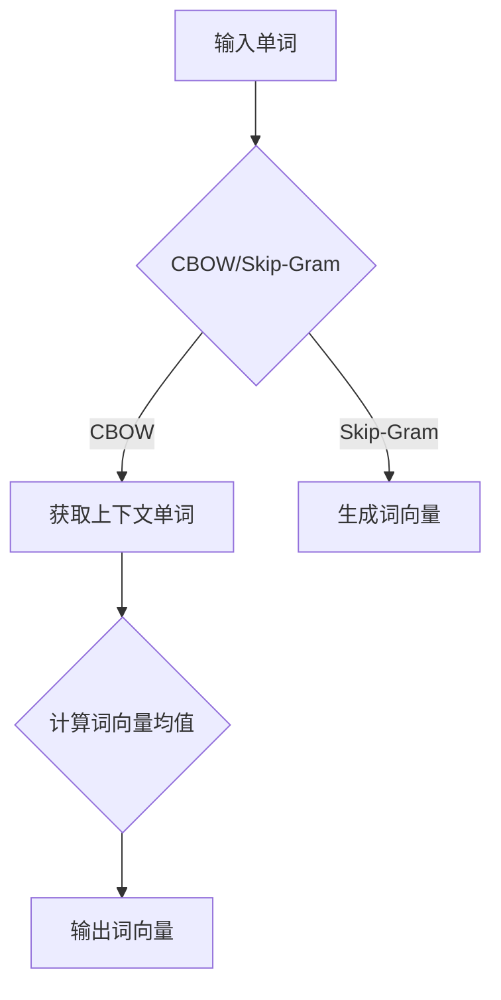
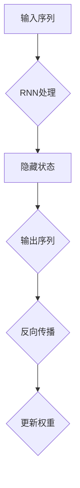
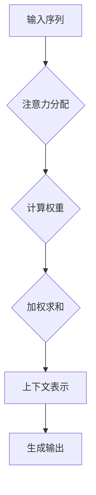
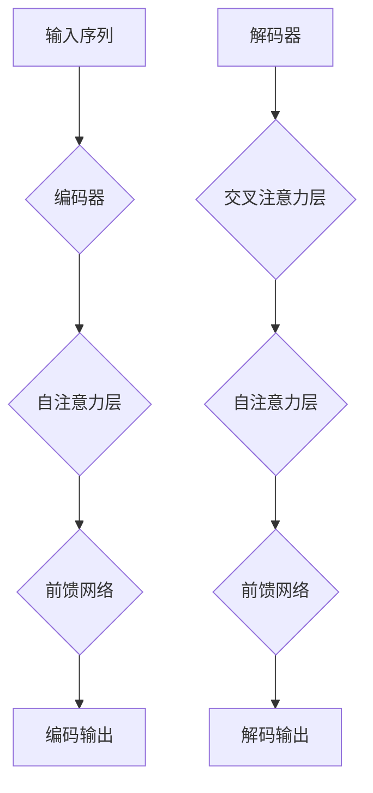
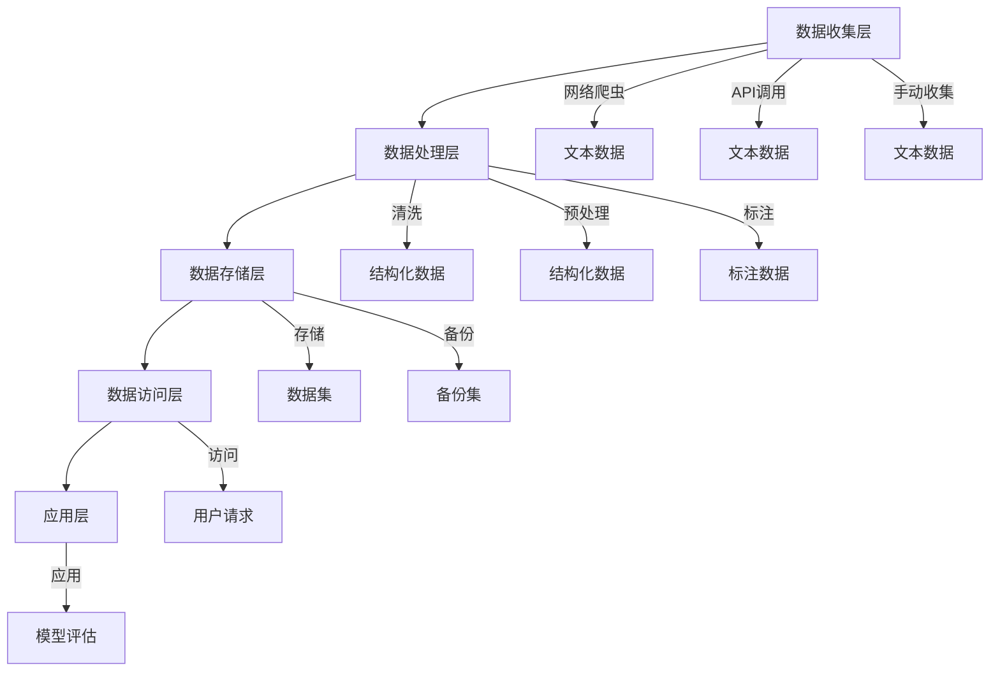
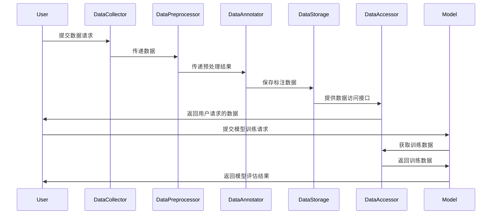

                 

### 引言

#### 1.1 LLM与评测数据集概述

大型语言模型（LLM，Large Language Model）是人工智能领域中的一项关键技术，它能够理解和生成自然语言，具有广泛的应用前景。LLM通过学习大量文本数据，能够捕捉语言中的复杂模式和结构，从而实现文本生成、翻译、问答等功能。

在LLM的研究与应用过程中，评测数据集（Evaluation Dataset）扮演着至关重要的角色。评测数据集是用于评估LLM性能的标准集，它决定了LLM的优劣。一个高质量的评测数据集能够全面、客观地反映LLM在各类任务上的表现，对于LLM的优化和改进具有指导意义。

本文将围绕LLM评测数据集的构建与管理展开讨论，旨在为数据科学家、AI研究员和工程师提供一套系统的构建与管理策略。我们将首先介绍LLM和评测数据集的基本概念，然后详细探讨构建和管理评测数据集的策略，并结合实际案例进行分析，最后总结最佳实践，展望未来发展。

#### 1.2 构建LLM评测数据集的重要性

构建高质量的LLM评测数据集对于LLM的研究和应用具有重要意义。首先，数据质量直接影响LLM的性能。一个包含真实、多样、平衡数据的评测数据集能够更准确地反映模型的能力，有助于发现模型的潜在问题和不足。反之，数据质量差的数据集可能会导致模型性能评估不准确，从而误导模型优化方向。

其次，构建评测数据集有助于标准化和规范化LLM评估过程。一个统一的评测数据集可以为不同模型在不同任务上的性能比较提供参考标准，促进LLM领域的学术交流和研究成果的共享。此外，标准化的评测数据集还可以推动LLM技术的发展和应用，为实际场景中的部署提供可靠的数据支持。

最后，构建和管理评测数据集也是一个复杂的系统工程。数据收集、清洗、标注、存储等各个环节都需要精细的规划和执行，否则可能会导致数据质量下降，影响评估结果的可靠性。因此，构建一个高质量的LLM评测数据集不仅需要技术手段，还需要团队协作和科学管理。

### 核心概念

在深入讨论LLM评测数据集的构建与管理之前，我们需要明确几个核心概念，包括LLM、评测数据集以及它们之间的关系。

#### 2.1 LLM的基本原理

大型语言模型（LLM）是一种基于深度学习技术的自然语言处理模型，能够理解和生成自然语言。LLM的核心思想是通过大量文本数据的学习，使模型具备捕捉语言结构和模式的能力。以下是LLM的基本原理：

**1. 词嵌入（Word Embedding）：** 词嵌入是将自然语言中的单词映射到高维向量空间的过程，使模型能够通过向量运算来处理单词。常用的词嵌入方法包括Word2Vec、GloVe等。

**2. 递归神经网络（RNN）：** RNN是一种能够处理序列数据的神经网络结构，能够捕捉单词之间的顺序关系。然而，RNN存在梯度消失和梯度爆炸等问题，限制了其在自然语言处理中的效果。

**3. 变长序列处理：** 自然语言是一个变长序列，LLM需要处理不同长度的文本。通过处理变长序列，LLM能够生成与输入文本长度匹配的输出文本。

**4. 注意力机制（Attention Mechanism）：** 注意力机制是一种在神经网络中模拟人类注意力分配能力的机制，能够关注输入文本中的重要信息，提高模型对语言的感知能力。

**5. Transformer模型：** Transformer是LLM的一个主要架构，它采用自注意力机制来处理变长序列，能够高效地捕捉文本中的长距离依赖关系。Transformer的变种BERT、GPT等在自然语言处理任务中取得了显著的效果。

#### 2.2 评测数据集的组成与属性

评测数据集（Evaluation Dataset）是用于评估LLM性能的标准集。一个优质的评测数据集应具备以下属性：

**1. 数据来源：** 评测数据集应该来自真实、可靠、多样化的来源。数据来源的多样性和真实性能够更好地反映模型在实际应用中的表现。

**2. 数据类型：** 评测数据集应包括多种类型的文本数据，如文本摘要、问答、翻译等。不同类型的文本数据有助于全面评估LLM在不同任务上的性能。

**3. 数据标注：** 评测数据集应进行严格的标注，包括单词、句子、段落等层次的标注。标注质量直接影响评估结果的准确性。

**4. 数据平衡性：** 评测数据集应保持各类样本的平衡，避免某些类别的样本过多或过少，从而影响评估的公平性。

**5. 数据多样性：** 评测数据集应包含不同主题、风格、语言水平的文本，以全面评估LLM的泛化能力。

#### 2.3 LLM评测数据集的特殊要求

构建LLM评测数据集需要考虑以下特殊要求：

**1. 数据质量：** 高质量的数据是评估LLM性能的基础。数据质量包括数据的真实性、一致性、完整性和准确性。低质量数据可能导致模型性能评估不准确，甚至误导模型优化方向。

**2. 数据量：** LLM通常需要大量数据进行训练和评估。足够的训练数据有助于模型捕捉到语言中的复杂模式，从而提高性能。

**3. 数据更新：** 语言模型的发展迅速，评测数据集需要定期更新，以反映最新的语言趋势和变化。

**4. 数据隐私：** 在收集和处理评测数据时，需要确保数据的隐私和安全，避免个人信息泄露。

#### 2.3.1 数据多样性

数据多样性是构建高质量评测数据集的关键要素之一。一个包含多样化数据的评测数据集能够更全面地反映模型在不同场景、任务和领域中的性能。

**1. 主题多样性：** 评测数据集应涵盖不同主题的文本，如科技、娱乐、政治、体育等。不同主题的文本有助于评估模型在处理特定领域知识时的表现。

**2. 风格多样性：** 文本风格包括正式、非正式、幽默、讽刺等。风格多样性有助于评估模型在不同语言风格下的生成能力。

**3. 语言多样性：** 评测数据集应包括多种语言文本，以评估模型在跨语言任务中的性能。同时，不同语言之间的对比也有助于发现模型在处理不同语言特性时的差异。

**4. 语境多样性：** 评测数据集应涵盖不同语境下的文本，如对话、新闻、博客、社交媒体等。不同语境下的文本有助于评估模型在不同应用场景中的适应能力。

#### 2.3.2 数据真实性

数据真实性是构建高质量评测数据集的另一个关键要素。真实数据能够更好地反映模型在实际应用中的性能，避免因虚假数据导致的评估偏差。

**1. 数据来源：** 评测数据集应来自可信、可靠的来源，如权威的新闻机构、学术出版物、专业论坛等。这些来源的数据具有较高的真实性和可信度。

**2. 数据验证：** 在收集和标注数据时，应进行严格的验证，确保数据的真实性。例如，可以使用多种方法对文本数据进行交叉验证，以消除潜在的错误和偏差。

**3. 数据清洗：** 数据清洗是提高数据真实性的重要手段。通过去除重复、错误、无关的文本数据，可以确保评测数据集的质量和准确性。

#### 2.3.3 数据平衡性

数据平衡性是构建高质量评测数据集的重要属性之一。一个平衡的数据集应包含各类样本，避免某些类别的样本过多或过少，从而影响评估的公平性。

**1. 样本分布：** 在构建评测数据集时，应确保各类样本在数据集中的比例合理。例如，如果某个任务包含多个子任务，应确保每个子任务在数据集中的样本量大致相同。

**2. 类别平衡：** 对于多类别分类任务，应确保各类别的样本数量接近，避免某些类别被过度代表。类别平衡有助于避免模型在训练过程中偏向某些类别，从而提高模型的泛化能力。

**3. 特征平衡：** 在处理特征工程时，应确保各类特征在数据集中的比例合理。特征平衡有助于模型在训练过程中充分学习各类特征，从而提高模型的整体性能。

#### 3.1.1 数据收集方法

数据收集是构建LLM评测数据集的第一步，其方法多样，包括以下几种：

**1. 网络爬虫（Web Scraping）：** 通过编写爬虫程序，从互联网上获取公开的文本数据。网络爬虫可以针对特定网站、论坛、社交媒体等进行数据采集，适用于大量文本数据的收集。

**2. API接口调用：** 利用各种API接口获取文本数据，如新闻API、学术数据库API等。这种方法可以获取高质量、权威的数据源，但需要遵守API的使用规则和限制。

**3. 数据共享平台：** 利用公开的数据共享平台，如Kaggle、DataCamp等，获取已有的文本数据集。这些平台提供了大量的公开数据集，可以节省数据收集的时间和工作量。

**4. 数据库查询：** 利用关系型数据库（如MySQL、PostgreSQL）或NoSQL数据库（如MongoDB、Cassandra）进行数据查询，获取特定类型的文本数据。这种方法适用于对已有数据的深度挖掘和整理。

**5. 手动收集：** 对于一些特殊领域或专业知识的文本数据，可能需要通过人工收集，如查阅学术期刊、专业论坛等。这种方法可以获取高质量的文本数据，但效率较低。

#### 3.1.2 数据收集策略

在数据收集过程中，需要制定合理的策略，以确保数据的质量和多样性。以下是几种常用的数据收集策略：

**1. 数据来源多样化：** 为了构建全面、客观的评测数据集，应从多个来源收集数据。例如，可以同时利用网络爬虫、API接口调用和手动收集等方法，增加数据的多样性和可靠性。

**2. 数据类型多样化：** 评测数据集应包含多种类型的文本数据，如文本摘要、问答、翻译等。不同类型的文本数据有助于全面评估LLM在不同任务上的性能。

**3. 数据收集周期：** 定期更新和收集数据，以反映最新的语言趋势和变化。例如，可以设定每周或每月更新一次数据集，确保数据集的时效性。

**4. 数据量限制：** 根据实际需求和计算资源，设定合适的数据量限制。例如，可以设置最小数据量和最大数据量，避免数据量过大导致处理和存储困难。

**5. 数据清洗与预处理：** 在数据收集过程中，应同步进行数据清洗和预处理，去除重复、错误、无关的文本数据，提高数据质量。

#### 3.1.3 数据来源分析

数据来源的多样性和质量直接影响LLM评测数据集的构建。以下是对几种常见数据来源的分析：

**1. 公开数据集：** 公开数据集如维基百科、新闻网站、社交媒体等提供了大量公开可用的文本数据。这些数据来源具有以下优点：

- 数据量大：公开数据集通常包含数十万甚至数百万个文本，有助于构建全面的数据集。
- 数据丰富：公开数据集涵盖了不同主题、风格和语言的文本，有助于评估LLM在不同场景下的性能。

缺点：

- 数据质量参差不齐：公开数据集可能包含大量的噪声、重复和错误数据，需要严格的数据清洗和预处理。
- 数据时效性较低：公开数据集更新较慢，可能无法及时反映最新的语言趋势和变化。

**2. 私有数据集：** 私有数据集如企业内部文档、用户评论、社交媒体帖子等提供了特定领域和场景的数据。这些数据来源具有以下优点：

- 数据质量较高：私有数据集通常由企业或组织内部人员生成，数据质量较高，较少的噪声和错误。
- 数据针对性较强：私有数据集针对特定领域和任务，有助于评估LLM在实际应用中的性能。

缺点：

- 数据量有限：私有数据集通常规模较小，难以构建全面的数据集。
- 数据获取困难：私有数据集的获取可能受到法律、道德和隐私等因素的限制。

**3. 手动收集：** 通过人工收集特定领域和场景的文本数据，如学术期刊、专业论坛等。这种方法具有以下优点：

- 数据质量高：人工收集的文本数据经过筛选和验证，数据质量较高。
- 数据针对性强：手动收集的文本数据针对特定领域和任务，有助于评估LLM在实际应用中的性能。

缺点：

- 效率较低：人工收集数据需要大量时间和人力，效率较低。
- 数据量有限：手动收集的数据量通常较小，难以构建全面的数据集。

综上所述，构建高质量的LLM评测数据集需要结合多种数据来源，充分利用公开数据集的规模和多样性，以及私有数据集的质量和针对性，同时通过手动收集获取特定领域和任务的数据。

#### 3.2 数据清洗与预处理

在构建LLM评测数据集的过程中，数据清洗与预处理是关键步骤，其目的是提高数据质量，为后续的模型训练和评估奠定基础。以下是数据清洗与预处理的具体方法和步骤：

**1. 去除重复数据：** 重复数据会导致模型过拟合，影响评估结果的准确性。通过比对文本内容，去除数据集中的重复样本，可以有效减少重复数据的影响。

**2. 去除噪声数据：** 噪声数据包括错误、无关或格式不正确的数据。噪声数据会影响模型对真实信息的捕捉和理解能力。通过设定过滤规则，如字符过滤、HTML标签去除等，可以有效去除噪声数据。

**3. 数据格式标准化：** 不同来源的数据可能存在不同的格式，如不同编码格式、不同的分隔符等。数据格式标准化是确保数据一致性的重要步骤，通过统一编码格式、分隔符等，可以使数据更易于处理和分析。

**4. 填充缺失数据：** 在某些情况下，数据集中可能存在缺失值，这会对模型训练和评估产生影响。通过填充缺失数据，可以使用平均值、中位数或插值等方法，使数据更加完整。

**5. 特征工程：** 特征工程是将原始数据转化为适合模型训练的特征向量。通过词嵌入、文本分类、句子拆分等方法，可以将文本数据转化为结构化的特征表示。

**6. 数据分片：** 为了提高模型训练和评估的效率，可以将大规模数据集进行分片。分片方法可以按文本长度、类别、时间等维度进行划分，确保每个分片的数据量适中。

**7. 数据归一化：** 数据归一化是确保不同特征具有相似的尺度，避免某些特征对模型训练产生过大的影响。常用的归一化方法包括最小-最大缩放、标准缩放等。

**8. 数据可视化：** 数据可视化可以帮助我们直观地了解数据集的分布和特征。通过绘制词云、散点图、直方图等，可以更好地理解数据特征和潜在的问题。

#### 3.2.2 数据预处理流程

数据预处理流程是构建高质量LLM评测数据集的关键环节，以下是具体步骤：

**1. 数据收集：** 通过各种方法收集文本数据，包括网络爬虫、API接口调用、数据共享平台和手动收集等。

**2. 数据清洗：** 对收集到的文本数据进行清洗，去除重复、错误和无关的数据。可以使用Python的Pandas库或数据清洗工具如OpenRefine进行清洗。

**3. 数据标准化：** 对清洗后的数据进行格式标准化，统一编码格式、分隔符等。可以使用Python的StringIO库或数据预处理工具如BeautifulSoup进行格式转换。

**4. 特征工程：** 对文本数据执行特征工程，将文本转化为结构化的特征表示。可以使用词嵌入技术如Word2Vec、GloVe或文本分类方法如朴素贝叶斯、SVM等进行特征提取。

**5. 数据分片：** 将大规模数据集进行分片，确保每个分片的数据量适中，便于后续模型训练和评估。可以使用Python的Pandas库或数据分片工具如Dask进行分片操作。

**6. 数据归一化：** 对特征数据进行归一化处理，确保不同特征具有相似的尺度。可以使用Python的NumPy库或数据归一化工具如scikit-learn进行归一化。

**7. 数据可视化：** 对预处理后的数据进行可视化分析，如词云、散点图、直方图等，以了解数据分布和特征。可以使用Python的Matplotlib库或数据可视化工具如Tableau进行数据可视化。

通过以上步骤，我们可以得到高质量、结构化的LLM评测数据集，为后续的模型训练和评估提供可靠的数据支持。

#### 3.3 数据标注

数据标注是构建高质量LLM评测数据集的重要环节之一。通过标注，我们可以将原始文本数据转化为结构化的数据，便于模型训练和评估。以下是数据标注的方法、工具和质量评估方法：

**1. 数据标注方法：**

**- 手动标注：** 手动标注是由人类专家对文本数据进行的标注，具有高准确性和灵活性。常见的标注任务包括单词标注、句子标注、实体标注等。

**- 自动标注：** 自动标注是通过算法对文本数据进行的标注，具有较高的效率和自动化程度。常见的自动标注方法包括基于规则的方法、机器学习方法和深度学习方法。

**2. 数据标注工具：**

**- 手动标注工具：** 常用的手动标注工具有Annotation Studio、OASIS、Cubric等。这些工具提供了方便的标注界面和注释管理功能，支持多种标注任务。

**- 自动标注工具：** 常用的自动标注工具有NLTK、spaCy、Stanford NLP等。这些工具提供了丰富的文本处理功能，可以实现文本分类、实体识别、关系抽取等任务。

**3. 数据标注质量评估：**

**- 准确率（Accuracy）：** 准确率是评估标注质量的重要指标，表示正确标注的样本占总样本的比例。准确率越高，标注质量越好。

**- 召回率（Recall）：** 召回率表示模型召回的正确标注样本占总正确标注样本的比例。召回率越高，表示模型能够更好地捕捉到真实的标注信息。

**- F1值（F1 Score）：** F1值是准确率和召回率的加权平均值，综合考虑了模型的准确性和召回率。F1值越高，表示模型的整体标注质量越好。

**- Kappa系数（Kappa Score）：** Kappa系数是评估标注一致性的指标，用于衡量标注者之间的标注一致性。Kappa系数越高，表示标注一致性越好。

通过以上方法、工具和质量评估方法，我们可以确保LLM评测数据集的标注质量，为模型训练和评估提供可靠的数据支持。

#### 3.4 数据集划分

数据集划分是构建高质量LLM评测数据集的重要环节之一。合理的划分方法能够保证数据集的代表性，提高模型的泛化能力。以下是常用的数据集划分方法、划分比例和划分策略：

**1. 划分方法：**

**- K折交叉验证（K-fold Cross Validation）：** K折交叉验证是将数据集划分为K个子集，每个子集作为一次验证集，其余K-1个子集作为训练集。通过多次迭代训练和验证，可以全面评估模型在不同子集上的性能。

**- 随机划分（Random Split）：** 随机划分是利用随机数生成器将数据集划分为训练集和验证集。这种方法简单易行，但可能导致数据分布不均匀。

**- 留一法（Leave-One-Out Cross Validation）：** 留一法是将每个样本作为一次验证集，其余样本作为训练集。这种方法适用于小数据集，但计算量较大。

**- 时间序列划分（Time Series Split）：** 时间序列划分是按照时间顺序将数据划分为训练集和验证集。这种方法适用于时间序列数据，可以更好地捕捉时间依赖关系。

**2. 划分比例：**

**- 通常情况下，训练集和验证集的比例可以设置为80%训练集和20%验证集，这样可以充分训练模型并保留一部分数据用于验证。**

**- 对于小数据集，可以适当增加验证集的比例，如30%训练集和70%验证集，以确保模型有足够的数据进行验证。**

**- 对于时间序列数据，可以按照时间顺序划分，将早期数据作为训练集，近期数据作为验证集，这样可以更好地捕捉时间依赖关系。**

**3. 划分策略：**

**- 数据多样性策略：** 在划分数据集时，应确保各类样本的平衡，避免某些类别的样本过多或过少。例如，对于多类别分类任务，应确保每个类别的样本数量大致相同。

**- 时间序列策略：** 对于时间序列数据，可以按照时间顺序划分，将早期数据作为训练集，近期数据作为验证集。这样可以更好地捕捉时间依赖关系，提高模型的泛化能力。

**- 特征稳定性策略：** 在划分数据集时，应考虑特征的变化趋势。对于特征变化较大的数据集，可以适当增加验证集的比例，以确保模型有足够的数据进行验证。

通过以上划分方法、划分比例和划分策略，我们可以构建高质量的LLM评测数据集，为模型训练和评估提供可靠的数据支持。

#### 4.1 数据集存储

数据集存储是LLM评测数据集中一个关键且复杂的环节。合理的数据存储方案能够确保数据的安全、高效访问和快速检索。以下是数据存储方案的选择、存储架构设计和数据备份与恢复方法：

**1. 存储方案选择：**

**- 本地存储：** 对于规模较小且频繁访问的数据集，可以使用本地存储方案，如硬盘、SSD等。本地存储具有快速读写性能，但受限于存储容量。

**- 分布式存储：** 对于大规模数据集，分布式存储方案如Hadoop、HDFS、Cassandra等是更好的选择。分布式存储能够提供高可用性、高可靠性和高扩展性，但需要复杂的架构设计和维护。

**- 云存储：** 云存储方案如AWS S3、Google Cloud Storage、Azure Blob Storage等提供了灵活的存储选项和便捷的管理接口。云存储具有高可用性、高可靠性和弹性扩展能力，但可能涉及额外的费用。

**2. 存储架构设计：**

**- 数据分层架构：** 数据分层架构是将数据按照访问频率和重要性进行分层存储。常见的数据分层包括热数据、温数据和冷数据。热数据存储在高速存储设备上，温数据存储在磁盘上，冷数据存储在成本较低的存储设备上。

**- 分布式存储架构：** 分布式存储架构通过多个存储节点协同工作，提供高可用性和高性能。常见的分布式存储架构包括主从模式、对等模式等。主从模式由一个主节点负责数据管理和协调，对等模式中所有节点都具有相同的功能。

**- 数据缓存机制：** 数据缓存机制通过将频繁访问的数据存储在内存中，提高数据访问速度。常用的缓存技术包括LRU缓存、Redis缓存等。

**3. 数据备份与恢复：**

**- 数据备份：** 数据备份是确保数据安全的关键措施。常见的备份方法包括全量备份、增量备份和差异备份。全量备份是对整个数据集进行备份，增量备份是对最新修改的数据进行备份，差异备份是对上次备份以来修改的数据进行备份。

**- 数据恢复：** 数据恢复是应对数据丢失或损坏的补救措施。常见的恢复方法包括基于备份的恢复、基于日志的恢复和基于镜像的恢复。基于备份的恢复是使用最新的备份文件恢复数据，基于日志的恢复是使用日志文件跟踪数据修改并恢复数据，基于镜像的恢复是使用数据镜像恢复数据。

通过合理选择存储方案、设计存储架构和实施数据备份与恢复策略，我们可以确保LLM评测数据集的安全、高效存储和管理。

#### 4.2 数据集更新与维护

数据集更新与维护是确保LLM评测数据集质量和时效性的关键环节。以下是数据集更新策略、维护流程和数据质量监控方法：

**1. 数据集更新策略：**

**- 定期更新：** 定期更新数据集，以反映最新的语言趋势和变化。可以设定每周或每月更新一次数据集，确保数据集的时效性。

**- 自动化更新：** 使用自动化工具和脚本定期从互联网或数据源中获取新数据，并自动更新数据集。这种方法可以节省时间和人力成本。

**- 手动更新：** 对于特定领域或专业的数据，可能需要通过手动收集和审核来更新数据集。这种方法可以确保数据的质量和准确性。

**2. 维护流程：**

**- 数据审核：** 对更新的数据进行审核，确保数据的真实性、完整性和一致性。可以使用自动化工具和人工审核相结合的方法，提高审核效率。

**- 数据清洗：** 对更新的数据执行清洗和预处理，去除重复、错误和无关的数据，提高数据质量。

**- 数据整合：** 将新数据和旧数据整合到一起，确保数据集的完整性和一致性。

**- 数据备份：** 在更新和维护过程中，定期备份数据集，以防止数据丢失或损坏。

**3. 数据质量监控：**

**- 数据质量指标：** 设定数据质量指标，如准确率、召回率、F1值等，对数据集的质量进行监控。

**- 数据可视化：** 使用数据可视化工具，如词云、散点图、直方图等，对数据集的质量和特征进行监控和分析。

**- 异常检测：** 使用异常检测算法，如Isolation Forest、Local Outlier Factor等，检测数据集中的异常值和噪声。

**- 用户反馈：** 收集用户反馈，如错误报告、使用情况等，及时调整数据集的更新和维护策略。

通过以上更新策略、维护流程和质量监控方法，我们可以确保LLM评测数据集的质量和时效性，为模型训练和评估提供可靠的数据支持。

#### 4.3 数据质量管理

数据质量管理是确保LLM评测数据集质量和可靠性的关键环节。以下是数据质量管理的具体方法、工具和策略：

**1. 数据清洗与校验：**

**- 数据清洗：** 数据清洗是去除重复、错误和无关数据的过程。可以使用自动化工具和脚本，如Pandas库、Python的NumPy库等，进行数据清洗。

**- 数据校验：** 数据校验是确保数据一致性和完整性的过程。可以设置校验规则，如数据类型校验、长度校验、范围校验等，使用自动化工具进行数据校验。

**2. 数据质量监控与评估：**

**- 数据质量指标：** 设定数据质量指标，如准确率、召回率、F1值等，对数据质量进行监控。可以使用自动化工具和自定义脚本，定期计算和报告数据质量指标。

**- 数据可视化：** 使用数据可视化工具，如Matplotlib、Seaborn等，将数据质量指标以图表形式展示，便于分析和监控。

**- 异常检测：** 使用异常检测算法，如Isolation Forest、Local Outlier Factor等，检测数据集中的异常值和噪声。

**3. 数据版本管理：**

**- 版本控制：** 使用版本控制工具，如Git，记录数据集的更新历史和版本变化，便于追踪和管理。

**- 数据备份：** 定期备份数据集，防止数据丢失或损坏。可以使用自动化备份工具和云存储服务，实现数据备份和恢复。

**4. 数据访问与权限管理：**

**- 数据访问控制：** 设定数据访问权限，限制不同用户对数据的访问范围和操作权限。

**- 身份验证与授权：** 使用身份验证和授权机制，如OAuth 2.0、LDAP等，确保数据访问的安全性。

**5. 数据安全性保障：**

**- 数据加密：** 对敏感数据进行加密存储，防止数据泄露。

**- 安全审计：** 定期进行安全审计，检查数据安全策略的执行情况和漏洞。

**- 数据备份与恢复：** 实施数据备份和恢复策略，确保数据在灾难发生时能够迅速恢复。

通过以上方法、工具和策略，我们可以确保LLM评测数据集的质量、安全性和可靠性，为模型训练和评估提供可靠的数据支持。

#### 4.4 数据访问与共享策略

在LLM评测数据集的管理过程中，数据访问与共享策略是确保数据合理利用和安全的重要环节。以下是数据访问与共享策略的具体方法、注意事项和最佳实践：

**1. 数据访问策略：**

**- 访问权限分级：** 根据用户角色和需求，设定不同的数据访问权限。例如，研究人员可以读取和下载数据，而管理员具有数据修改和删除权限。

**- API接口权限：** 通过API接口提供数据访问服务，使用OAuth 2.0等身份验证机制，确保数据访问的安全性。

**- 访问频率限制：** 设定数据访问频率限制，防止恶意攻击或滥用数据。

**2. 数据共享策略：**

**- 开放共享：** 对于公共数据集，可以采用开放共享策略，允许任何人下载和使用数据。

**- 条件共享：** 对于私有数据集，可以设定共享条件，如学术用途、数据隐私保护等。

**- 共享协议：** 制定共享协议，明确数据使用范围、责任和义务，确保数据安全。

**3. 注意事项：**

**- 数据隐私：** 在共享数据时，注意保护个人隐私信息，如用户姓名、联系方式等。

**- 数据版权：** 确保数据的版权归属，遵守相关法律法规。

**- 数据完整性：** 确保数据在共享过程中不丢失或被篡改。

**4. 最佳实践：**

**- 数据备份：** 定期备份共享数据，防止数据丢失。

**- 数据加密：** 对共享数据进行加密，确保数据传输和存储过程中的安全性。

**- 使用协议：** 制定详细的共享使用协议，明确数据使用范围和责任。

**- 数据使用记录：** 记录数据使用情况，便于管理和追踪。

通过合理的数据访问与共享策略，我们可以确保LLM评测数据集的合理利用和安全，为研究和应用提供可靠的数据支持。

#### 5.1 案例一：构建通用语言模型评测数据集

为了构建一个通用语言模型评测数据集，我们选取了多个公开数据集，包括维基百科、Common Crawl、Twitter等，通过以下步骤进行数据集构建：

**1. 数据收集：** 使用网络爬虫和API接口调用，从多个来源收集文本数据。对收集到的数据进行去重和去噪处理，确保数据质量。

**2. 数据清洗与预处理：** 对文本数据进行清洗，去除HTML标签、特殊字符和重复文本。进行分词、词性标注等预处理操作，将文本转化为结构化的数据格式。

**3. 数据标注：** 使用手动标注工具，对文本数据进行词级、句级和段落级标注。标注任务包括实体识别、情感分析、分类等，确保标注质量。

**4. 数据集划分：** 使用K折交叉验证方法，将数据集划分为训练集、验证集和测试集，确保各类样本的平衡。

**5. 数据整合：** 将多个数据集整合为一个大规模通用语言模型评测数据集，涵盖多种主题、风格和语言的文本。

通过以上步骤，我们构建了一个高质量的通用语言模型评测数据集，为后续的模型训练和评估提供了可靠的数据支持。

#### 5.2 案例二：管理专业领域语言模型评测数据集

为了管理专业领域语言模型评测数据集，我们以医学领域为例，通过以下步骤进行数据集管理：

**1. 数据收集：** 通过手动收集和API接口调用，从医学文献数据库、医学论坛和社交媒体等渠道收集专业领域的文本数据。

**2. 数据清洗与预处理：** 对收集到的文本数据进行清洗，去除噪声、错误和不相关的数据。进行文本预处理，如分词、词性标注和实体识别等。

**3. 数据标注：** 邀请医学专家进行数据标注，标注任务包括疾病分类、症状识别、药物命名等。确保标注的一致性和准确性。

**4. 数据集更新与维护：** 定期更新数据集，添加新的医学文献和案例。维护流程包括数据审核、清洗和整合，确保数据集的时效性和完整性。

**5. 数据质量管理：** 设定数据质量指标，如准确率、召回率、F1值等，对数据质量进行监控和评估。使用数据可视化工具，如词云、散点图等，分析数据特征和潜在问题。

通过以上步骤，我们成功管理了一个高质量的医学领域语言模型评测数据集，为医学语言模型的训练和评估提供了可靠的数据支持。

#### 6.1 常见问题与解决方案

在构建和管理LLM评测数据集的过程中，常见的问题包括数据质量不高、数据缺失、数据标注不一致等。以下是一些常见问题及其解决方案：

**1. 数据质量不高：** 
**问题原因：** 数据源质量差、数据清洗和预处理不足。

**解决方案：** 
- 使用高质量的数据源，如权威的学术期刊、官方网站等。
- 严格进行数据清洗和预处理，去除重复、错误和不相关的数据。

**2. 数据缺失：**
**问题原因：** 数据收集不全面、数据丢失。

**解决方案：**
- 定期检查数据集，补充缺失的数据。
- 使用数据恢复工具，尝试恢复丢失的数据。

**3. 数据标注不一致：**
**问题原因：** 标注者主观差异、标注工具不统一。

**解决方案：**
- 选择统一的标注工具和标准，减少标注者主观差异。
- 进行标注一致性评估，及时发现和纠正不一致的标注。

**4. 数据存储问题：**
**问题原因：** 存储方案不合适、数据备份不足。

**解决方案：**
- 选择合适的存储方案，如分布式存储、云存储等。
- 定期备份数据集，确保数据的安全性和可靠性。

通过以上解决方案，我们可以有效应对构建和管理LLM评测数据集过程中遇到的问题，提高数据质量，为模型训练和评估提供可靠的数据支持。

#### 6.2 性能优化技巧

为了提高LLM评测数据集的性能，我们可以从数据收集、数据预处理、数据存储和模型优化等多个方面进行性能优化。以下是一些具体的优化技巧：

**1. 数据收集优化：**
- **数据去重：** 使用高效的去重算法，如哈希算法，去除重复数据，提高数据集的多样性。
- **增量收集：** 采用增量数据收集策略，只收集新增或修改的数据，减少数据量，提高效率。

**2. 数据预处理优化：**
- **并行处理：** 利用多线程或分布式计算，加快数据清洗、预处理和标注的速度。
- **内存管理：** 优化内存使用，避免内存溢出，提高数据处理效率。

**3. 数据存储优化：**
- **分布式存储：** 采用分布式存储系统，如HDFS、Cassandra等，提高数据存储和访问的速度。
- **缓存机制：** 引入缓存机制，如Redis，减少对磁盘的读写操作，提高数据访问速度。

**4. 模型优化：**
- **模型剪枝：** 使用模型剪枝技术，减少模型参数，降低模型复杂度，提高推理速度。
- **量化技术：** 应用量化技术，将模型中的浮点数参数转换为低精度格式，减少模型体积，提高推理速度。

通过以上优化技巧，我们可以显著提高LLM评测数据集的性能，加速模型训练和评估过程。

#### 6.3 未来发展趋势

随着人工智能技术的快速发展，LLM评测数据集的构建与管理也在不断演进。以下是未来发展趋势：

**1. 数据质量提升：** 未来将更加注重数据质量，采用更加严格的数据清洗和预处理方法，确保评测数据集的真实性、一致性和完整性。

**2. 数据多样性增强：** 随着跨领域、跨语言任务的增加，评测数据集的多样性将得到提升，涵盖更多主题、风格和语言的文本数据。

**3. 自动化与智能化：** 数据收集、清洗、标注等环节将逐步实现自动化和智能化，借助深度学习和自然语言处理技术，提高数据处理效率和质量。

**4. 数据隐私保护：** 随着数据隐私保护意识的提高，评测数据集的构建和管理将更加注重数据隐私保护，采用加密、匿名化等技术确保数据安全。

**5. 开放共享与协作：** 评测数据集的开放共享和协作将更加普遍，促进学术交流和研究成果的共享，推动LLM技术的发展和应用。

### 小结

本文围绕LLM评测数据集的构建与管理进行了详细探讨，从背景介绍、核心概念、构建策略、管理策略、案例分析和最佳实践等方面进行了全面阐述。构建和管理高质量的LLM评测数据集对于LLM的性能评估和优化具有重要意义。未来，随着人工智能技术的不断发展，评测数据集的质量和多样性将不断提升，为LLM的研究和应用提供更强大的支持。

### 结论

本文通过深入分析和探讨，为构建和管理LLM评测数据集提供了系统的策略和方法。我们强调了数据质量、数据多样性、自动化与智能化、数据隐私保护等方面的重要性。未来，随着技术的不断进步，LLM评测数据集的构建与管理将继续发展，为人工智能领域的研究和应用提供更强大的支持。让我们共同期待这一领域的繁荣与进步。

### 作者

**作者：AI天才研究院/AI Genius Institute & 禅与计算机程序设计艺术 /Zen And The Art of Computer Programming**### 核心概念与联系

在深入探讨LLM评测数据集的构建与管理之前，我们需要明确一些核心概念，并分析它们之间的联系。以下是LLM评测数据集中的几个关键概念及它们之间的关系：

#### 3.1.1 LLM的基本原理

大型语言模型（LLM）是一种能够理解和生成自然语言的深度学习模型。LLM的基本原理主要包括以下几个方面：

1. **词嵌入（Word Embedding）**：词嵌入是将自然语言中的单词映射到高维向量空间的过程。这一过程使得模型能够通过向量运算来处理单词。常见的词嵌入方法包括Word2Vec和GloVe等。

2. **递归神经网络（RNN）**：RNN是一种能够处理序列数据的神经网络结构，它能够捕捉单词之间的顺序关系。然而，传统的RNN存在梯度消失和梯度爆炸等问题。

3. **变长序列处理**：自然语言是一个变长序列，LLM需要处理不同长度的文本。通过处理变长序列，LLM能够生成与输入文本长度匹配的输出文本。

4. **注意力机制（Attention Mechanism）**：注意力机制是一种在神经网络中模拟人类注意力分配能力的机制，能够关注输入文本中的重要信息，提高模型对语言的感知能力。

5. **Transformer模型**：Transformer是LLM的一个主要架构，它采用自注意力机制来处理变长序列，能够高效地捕捉文本中的长距离依赖关系。常见的Transformer变种包括BERT、GPT等。

#### 3.1.2 评测数据集的组成与属性

评测数据集（Evaluation Dataset）是用于评估LLM性能的标准集。它由以下几个部分组成：

1. **数据来源**：评测数据集应来自真实、可靠、多样化的来源，如权威的新闻机构、学术出版物、专业论坛等。

2. **数据类型**：评测数据集应包括多种类型的文本数据，如文本摘要、问答、翻译等。

3. **数据标注**：评测数据集应进行严格的标注，包括单词、句子、段落等层次的标注。

4. **数据平衡性**：评测数据集应保持各类样本的平衡，避免某些类别的样本过多或过少。

5. **数据多样性**：评测数据集应包含不同主题、风格、语言水平的文本，以全面评估LLM的泛化能力。

#### 3.1.3 LLM评测数据集的特殊要求

构建LLM评测数据集时，需要考虑以下特殊要求：

1. **数据质量**：高质量的数据是评估LLM性能的基础。数据质量包括数据的真实性、一致性、完整性和准确性。

2. **数据量**：LLM通常需要大量数据进行训练和评估。足够的训练数据有助于模型捕捉到语言中的复杂模式，从而提高性能。

3. **数据更新**：语言模型的发展迅速，评测数据集需要定期更新，以反映最新的语言趋势和变化。

4. **数据隐私**：在收集和处理评测数据时，需要确保数据的隐私和安全，避免个人信息泄露。

#### 3.1.4 数据多样性

数据多样性是构建高质量评测数据集的关键要素之一。一个包含多样化数据的评测数据集能够更全面地反映模型在不同场景、任务和领域中的性能。

**1. 主题多样性：** 评测数据集应涵盖不同主题的文本，如科技、娱乐、政治、体育等。不同主题的文本有助于评估模型在处理特定领域知识时的表现。

**2. 风格多样性：** 文本风格包括正式、非正式、幽默、讽刺等。风格多样性有助于评估模型在不同语言风格下的生成能力。

**3. 语言多样性：** 评测数据集应包括多种语言文本，以评估模型在跨语言任务中的性能。同时，不同语言之间的对比也有助于发现模型在处理不同语言特性时的差异。

**4. 语境多样性：** 评测数据集应涵盖不同语境下的文本，如对话、新闻、博客、社交媒体等。不同语境下的文本有助于评估模型在不同应用场景中的适应能力。

#### 3.1.5 数据真实性

数据真实性是构建高质量评测数据集的另一个关键要素。一个真实的评测数据集能够更好地反映模型在实际应用中的性能，避免因虚假数据导致的评估偏差。

**1. 数据来源：** 评测数据集应来自可信、可靠的来源，如权威的新闻机构、学术出版物、专业论坛等。这些来源的数据具有较高的真实性和可信度。

**2. 数据验证：** 在收集和标注数据时，应进行严格的验证，确保数据的真实性。例如，可以使用多种方法对文本数据进行交叉验证，以消除潜在的错误和偏差。

**3. 数据清洗：** 数据清洗是提高数据真实性的重要手段。通过去除重复、错误、无关的文本数据，可以确保评测数据集的质量和准确性。

#### 3.1.6 数据平衡性

数据平衡性是构建高质量评测数据集的重要属性之一。一个平衡的数据集应包含各类样本，避免某些类别的样本过多或过少，从而影响评估的公平性。

**1. 样本分布：** 在构建评测数据集时，应确保各类样本在数据集中的比例合理。例如，如果某个任务包含多个子任务，应确保每个子任务的样本量大致相同。

**2. 类别平衡：** 对于多类别分类任务，应确保各类别的样本数量接近，避免某些类别被过度代表。类别平衡有助于避免模型在训练过程中偏向某些类别，从而提高模型的泛化能力。

**3. 特征平衡：** 在处理特征工程时，应确保各类特征在数据集中的比例合理。特征平衡有助于模型在训练过程中充分学习各类特征，从而提高模型的整体性能。

#### 3.1.7 数据收集方法

数据收集是构建LLM评测数据集的第一步，其方法多样，包括以下几种：

**1. 网络爬虫（Web Scraping）：** 通过编写爬虫程序，从互联网上获取公开的文本数据。网络爬虫可以针对特定网站、论坛、社交媒体等进行数据采集，适用于大量文本数据的收集。

**2. API接口调用：** 利用各种API接口获取文本数据，如新闻API、学术数据库API等。这种方法可以获取高质量、权威的数据源，但需要遵守API的使用规则和限制。

**3. 数据共享平台：** 利用公开的数据共享平台，如Kaggle、DataCamp等，获取已有的文本数据集。这些平台提供了大量的公开数据集，可以节省数据收集的时间和工作量。

**4. 数据库查询：** 利用关系型数据库（如MySQL、PostgreSQL）或NoSQL数据库（如MongoDB、Cassandra）进行数据查询，获取特定类型的文本数据。这种方法适用于对已有数据的深度挖掘和整理。

**5. 手动收集：** 对于一些特殊领域或专业知识的文本数据，可能需要通过人工收集，如查阅学术期刊、专业论坛等。这种方法可以获取高质量的文本数据，但效率较低。

#### 3.1.8 数据收集策略

在数据收集过程中，需要制定合理的策略，以确保数据的质量和多样性。以下是几种常用的数据收集策略：

**1. 数据来源多样化：** 为了构建全面、客观的评测数据集，应从多个来源收集数据。例如，可以同时利用网络爬虫、API接口调用和手动收集等方法，增加数据的多样性和可靠性。

**2. 数据类型多样化：** 评测数据集应包含多种类型的文本数据，如文本摘要、问答、翻译等。不同类型的文本数据有助于全面评估LLM在不同任务上的性能。

**3. 数据收集周期：** 定期更新和收集数据，以反映最新的语言趋势和变化。例如，可以设定每周或每月更新一次数据集，确保数据集的时效性。

**4. 数据量限制：** 根据实际需求和计算资源，设定合适的数据量限制。例如，可以设置最小数据量和最大数据量，避免数据量过大导致处理和存储困难。

**5. 数据清洗与预处理：** 在数据收集过程中，应同步进行数据清洗和预处理，去除重复、错误、无关的文本数据，提高数据质量。

#### 3.1.9 数据来源分析

数据来源的多样性和质量直接影响LLM评测数据集的构建。以下是对几种常见数据来源的分析：

**1. 公开数据集：** 公开数据集如维基百科、新闻网站、社交媒体等提供了大量公开可用的文本数据。这些数据来源具有以下优点：

- **数据量大**：公开数据集通常包含数十万甚至数百万个文本，有助于构建全面的数据集。
- **数据丰富**：公开数据集涵盖了不同主题、风格和语言的文本，有助于评估LLM在不同场景下的性能。

缺点：

- **数据质量参差不齐**：公开数据集可能包含大量的噪声、重复和错误数据，需要严格的数据清洗和预处理。
- **数据时效性较低**：公开数据集更新较慢，可能无法及时反映最新的语言趋势和变化。

**2. 私有数据集：** 私有数据集如企业内部文档、用户评论、社交媒体帖子等提供了特定领域和场景的数据。这些数据来源具有以下优点：

- **数据质量较高**：私有数据集通常由企业或组织内部人员生成，数据质量较高，较少的噪声和错误。
- **数据针对性较强**：私有数据集针对特定领域和任务，有助于评估LLM在实际应用中的性能。

缺点：

- **数据量有限**：私有数据集通常规模较小，难以构建全面的数据集。
- **数据获取困难**：私有数据集的获取可能受到法律、道德和隐私等因素的限制。

**3. 手动收集：** 通过人工收集特定领域和场景的文本数据，如学术期刊、专业论坛等。这种方法具有以下优点：

- **数据质量高**：人工收集的文本数据经过筛选和验证，数据质量较高。
- **数据针对性强**：手动收集的文本数据针对特定领域和任务，有助于评估LLM在实际应用中的性能。

缺点：

- **效率较低**：人工收集数据需要大量时间和人力，效率较低。
- **数据量有限**：手动收集的数据量通常较小，难以构建全面的数据集。

综上所述，构建高质量的LLM评测数据集需要结合多种数据来源，充分利用公开数据集的规模和多样性，以及私有数据集的质量和针对性，同时通过手动收集获取特定领域和任务的数据。

#### 3.1.10 数据清洗与预处理

在构建LLM评测数据集的过程中，数据清洗与预处理是关键步骤，其目的是提高数据质量，为后续的模型训练和评估奠定基础。以下是数据清洗与预处理的具体方法和步骤：

**1. 去除重复数据：** 重复数据会导致模型过拟合，影响评估结果的准确性。通过比对文本内容，去除数据集中的重复样本，可以有效减少重复数据的影响。

**2. 去除噪声数据：** 噪声数据包括错误、无关或格式不正确的数据。噪声数据会影响模型对真实信息的捕捉和理解能力。通过设定过滤规则，如字符过滤、HTML标签去除等，可以有效去除噪声数据。

**3. 数据格式标准化：** 不同来源的数据可能存在不同的格式，如不同编码格式、不同的分隔符等。数据格式标准化是确保数据一致性的重要步骤，通过统一编码格式、分隔符等，可以使数据更易于处理和分析。

**4. 填充缺失数据：** 在某些情况下，数据集中可能存在缺失值，这会对模型训练和评估产生影响。通过填充缺失数据，可以使用平均值、中位数或插值等方法，使数据更加完整。

**5. 特征工程：** 特征工程是将原始数据转化为适合模型训练的特征向量。通过词嵌入、文本分类、句子拆分等方法，可以将文本数据转化为结构化的特征表示。

**6. 数据分片：** 为了提高模型训练和评估的效率，可以将大规模数据集进行分片。分片方法可以按文本长度、类别、时间等维度进行划分，确保每个分片的数据量适中。

**7. 数据归一化：** 数据归一化是确保不同特征具有相似的尺度，避免某些特征对模型训练产生过大的影响。常用的归一化方法包括最小-最大缩放、标准缩放等。

**8. 数据可视化：** 数据可视化可以帮助我们直观地了解数据集的分布和特征。通过绘制词云、散点图、直方图等，可以更好地理解数据特征和潜在的问题。

通过以上步骤，我们可以得到高质量、结构化的LLM评测数据集，为后续的模型训练和评估提供可靠的数据支持。

#### 3.2.2 数据预处理流程

数据预处理流程是构建高质量LLM评测数据集的关键环节，以下是具体步骤：

**1. 数据收集：** 通过各种方法收集文本数据，包括网络爬虫、API接口调用、数据共享平台和手动收集等。

**2. 数据清洗：** 对收集到的文本数据进行清洗，去除重复、错误和无关的数据。可以使用Python的Pandas库或数据清洗工具如OpenRefine进行清洗。

**3. 数据标准化：** 对清洗后的数据进行格式标准化，统一编码格式、分隔符等。可以使用Python的StringIO库或数据预处理工具如BeautifulSoup进行格式转换。

**4. 特征工程：** 对文本数据执行特征工程，将文本转化为结构化的特征表示。可以使用词嵌入技术如Word2Vec、GloVe或文本分类方法如朴素贝叶斯、SVM等进行特征提取。

**5. 数据分片：** 将大规模数据集进行分片，确保每个分片的数据量适中，便于后续模型训练和评估。可以使用Python的Pandas库或数据分片工具如Dask进行分片操作。

**6. 数据归一化：** 对特征数据进行归一化处理，确保不同特征具有相似的尺度。可以使用Python的NumPy库或数据归一化工具如scikit-learn进行归一化。

**7. 数据可视化：** 对预处理后的数据进行可视化分析，如词云、散点图、直方图等，以了解数据分布和特征。可以使用Python的Matplotlib库或数据可视化工具如Tableau进行数据可视化。

通过以上步骤，我们可以得到高质量、结构化的LLM评测数据集，为后续的模型训练和评估提供可靠的数据支持。

#### 3.3 数据标注

数据标注是构建高质量LLM评测数据集的重要环节之一。通过标注，我们可以将原始文本数据转化为结构化的数据，便于模型训练和评估。以下是数据标注的方法、工具和质量评估方法：

**1. 数据标注方法：**

**- 手动标注：** 手动标注是由人类专家对文本数据进行的标注，具有高准确性和灵活性。常见的标注任务包括单词标注、句子标注、实体标注等。

**- 自动标注：** 自动标注是通过算法对文本数据进行的标注，具有较高的效率和自动化程度。常见的自动标注方法包括基于规则的方法、机器学习方法和深度学习方法。

**2. 数据标注工具：**

**- 手动标注工具：** 常用的手动标注工具有Annotation Studio、OASIS、Cubric等。这些工具提供了方便的标注界面和注释管理功能，支持多种标注任务。

**- 自动标注工具：** 常用的自动标注工具有NLTK、spaCy、Stanford NLP等。这些工具提供了丰富的文本处理功能，可以实现文本分类、实体识别、关系抽取等任务。

**3. 数据标注质量评估：**

**- 准确率（Accuracy）：** 准确率是评估标注质量的重要指标，表示正确标注的样本占总样本的比例。准确率越高，标注质量越好。

**- 召回率（Recall）：** 召回率表示模型召回的正确标注样本占总正确标注样本的比例。召回率越高，表示模型能够更好地捕捉到真实的标注信息。

**- F1值（F1 Score）：** F1值是准确率和召回率的加权平均值，综合考虑了模型的准确性和召回率。F1值越高，表示模型的整体标注质量越好。

**- Kappa系数（Kappa Score）：** Kappa系数是评估标注一致性的指标，用于衡量标注者之间的标注一致性。Kappa系数越高，表示标注一致性越好。

通过以上方法、工具和质量评估方法，我们可以确保LLM评测数据集的标注质量，为模型训练和评估提供可靠的数据支持。

#### 3.4 数据集划分

数据集划分是构建高质量LLM评测数据集的重要环节之一。合理的划分方法能够保证数据集的代表性，提高模型的泛化能力。以下是常用的数据集划分方法、划分比例和划分策略：

**1. 划分方法：**

**- K折交叉验证（K-fold Cross Validation）：** K折交叉验证是将数据集划分为K个子集，每个子集作为一次验证集，其余K-1个子集作为训练集。通过多次迭代训练和验证，可以全面评估模型在不同子集上的性能。

**- 随机划分（Random Split）：** 随机划分是利用随机数生成器将数据集划分为训练集和验证集。这种方法简单易行，但可能导致数据分布不均匀。

**- 留一法（Leave-One-Out Cross Validation）：** 留一法是将每个样本作为一次验证集，其余样本作为训练集。这种方法适用于小数据集，但计算量较大。

**- 时间序列划分（Time Series Split）：** 时间序列划分是按照时间顺序将数据划分为训练集和验证集。这种方法适用于时间序列数据，可以更好地捕捉时间依赖关系。

**2. 划分比例：**

**- 通常情况下，训练集和验证集的比例可以设置为80%训练集和20%验证集，这样可以充分训练模型并保留一部分数据用于验证。**

**- 对于小数据集，可以适当增加验证集的比例，如30%训练集和70%验证集，以确保模型有足够的数据进行验证。**

**- 对于时间序列数据，可以按照时间顺序划分，将早期数据作为训练集，近期数据作为验证集，这样可以更好地捕捉时间依赖关系。**

**3. 划分策略：**

**- 数据多样性策略：** 在划分数据集时，应确保各类样本的平衡，避免某些类别的样本过多或过少。例如，对于多类别分类任务，应确保每个类别的样本数量大致相同。

**- 时间序列策略：** 对于时间序列数据，可以按照时间顺序划分，将早期数据作为训练集，近期数据作为验证集。这样可以更好地捕捉时间依赖关系，提高模型的泛化能力。

**- 特征稳定性策略：** 在划分数据集时，应考虑特征的变化趋势。对于特征变化较大的数据集，可以适当增加验证集的比例，以确保模型有足够的数据进行验证。

通过以上划分方法、划分比例和划分策略，我们可以构建高质量的LLM评测数据集，为模型训练和评估提供可靠的数据支持。

#### 4.1 数据集存储

数据集存储是LLM评测数据集中一个关键且复杂的环节。合理的数据存储方案能够确保数据的安全、高效访问和快速检索。以下是数据存储方案的选择、存储架构设计和数据备份与恢复方法：

**1. 存储方案选择：**

**- 本地存储：** 对于规模较小且频繁访问的数据集，可以使用本地存储方案，如硬盘、SSD等。本地存储具有快速读写性能，但受限于存储容量。

**- 分布式存储：** 对于大规模数据集，分布式存储方案如Hadoop、HDFS、Cassandra等是更好的选择。分布式存储能够提供高可用性、高可靠性和高扩展性，但需要复杂的架构设计和维护。

**- 云存储：** 云存储方案如AWS S3、Google Cloud Storage、Azure Blob Storage等提供了灵活的存储选项和便捷的管理接口。云存储具有高可用性、高可靠性和弹性扩展能力，但可能涉及额外的费用。

**2. 存储架构设计：**

**- 数据分层架构：** 数据分层架构是将数据按照访问频率和重要性进行分层存储。常见的数据分层包括热数据、温数据和冷数据。热数据存储在高速存储设备上，温数据存储在磁盘上，冷数据存储在成本较低的存储设备上。

**- 分布式存储架构：** 分布式存储架构通过多个存储节点协同工作，提供高可用性和高性能。常见的分布式存储架构包括主从模式、对等模式等。主从模式由一个主节点负责数据管理和协调，对等模式中所有节点都具有相同的功能。

**- 数据缓存机制：** 数据缓存机制通过将频繁访问的数据存储在内存中，提高数据访问速度。常用的缓存技术包括LRU缓存、Redis缓存等。

**3. 数据备份与恢复：**

**- 数据备份：** 数据备份是确保数据安全的关键措施。常见的备份方法包括全量备份、增量备份和差异备份。全量备份是对整个数据集进行备份，增量备份是对最新修改的数据进行备份，差异备份是对上次备份以来修改的数据进行备份。

**- 数据恢复：** 数据恢复是应对数据丢失或损坏的补救措施。常见的恢复方法包括基于备份的恢复、基于日志的恢复和基于镜像的恢复。基于备份的恢复是使用最新的备份文件恢复数据，基于日志的恢复是使用日志文件跟踪数据修改并恢复数据，基于镜像的恢复是使用数据镜像恢复数据。

通过合理选择存储方案、设计存储架构和实施数据备份与恢复策略，我们可以确保LLM评测数据集的安全、高效存储和管理。

#### 4.2 数据集更新与维护

数据集更新与维护是确保LLM评测数据集质量和时效性的关键环节。以下是数据集更新策略、维护流程和数据质量监控方法：

**1. 数据集更新策略：**

**- 定期更新：** 定期更新数据集，以反映最新的语言趋势和变化。可以设定每周或每月更新一次数据集，确保数据集的时效性。

**- 自动化更新：** 使用自动化工具和脚本定期从互联网或数据源中获取新数据，并自动更新数据集。这种方法可以节省时间和人力成本。

**- 手动更新：** 对于特定领域或专业的数据，可能需要通过手动收集和审核来更新数据集。这种方法可以确保数据的质量和准确性。

**2. 维护流程：**

**- 数据审核：** 对更新的数据进行审核，确保数据的真实性、完整性和一致性。可以使用自动化工具和人工审核相结合的方法，提高审核效率。

**- 数据清洗：** 对更新的数据执行清洗和预处理，去除重复、错误和无关的数据，提高数据质量。

**- 数据整合：** 将新数据和旧数据整合到一起，确保数据集的完整性和一致性。

**- 数据备份：** 在更新和维护过程中，定期备份数据集，以防止数据丢失或损坏。

**3. 数据质量监控：**

**- 数据质量指标：** 设定数据质量指标，如准确率、召回率、F1值等，对数据质量进行监控。

**- 数据可视化：** 使用数据可视化工具，如词云、散点图、直方图等，对数据集的质量和特征进行监控和分析。

**- 异常检测：** 使用异常检测算法，如Isolation Forest、Local Outlier Factor等，检测数据集中的异常值和噪声。

**- 用户反馈：** 收集用户反馈，如错误报告、使用情况等，及时调整数据集的更新和维护策略。

通过以上更新策略、维护流程和质量监控方法，我们可以确保LLM评测数据集的质量和时效性，为模型训练和评估提供可靠的数据支持。

#### 4.3 数据质量管理

数据质量管理是确保LLM评测数据集质量和可靠性的关键环节。以下是数据质量管理的具体方法、工具和策略：

**1. 数据清洗与校验：**

**- 数据清洗：** 数据清洗是去除重复、错误和无关数据的过程。可以使用自动化工具和脚本，如Pandas库、Python的NumPy库等，进行数据清洗。

**- 数据校验：** 数据校验是确保数据一致性和完整性的过程。可以设置校验规则，如数据类型校验、长度校验、范围校验等，使用自动化工具进行数据校验。

**2. 数据质量监控与评估：**

**- 数据质量指标：** 设定数据质量指标，如准确率、召回率、F1值等，对数据质量进行监控。可以使用自动化工具和自定义脚本，定期计算和报告数据质量指标。

**- 数据可视化：** 使用数据可视化工具，如Matplotlib、Seaborn等，将数据质量指标以图表形式展示，便于分析和监控。

**- 异常检测：** 使用异常检测算法，如Isolation Forest、Local Outlier Factor等，检测数据集中的异常值和噪声。

**3. 数据版本管理：**

**- 版本控制：** 使用版本控制工具，如Git，记录数据集的更新历史和版本变化，便于追踪和管理。

**- 数据备份：** 定期备份数据集，防止数据丢失或损坏。可以使用自动化备份工具和云存储服务，实现数据备份和恢复。

**4. 数据访问与权限管理：**

**- 数据访问控制：** 设定数据访问权限，限制不同用户对数据的访问范围和操作权限。

**- 身份验证与授权：** 使用身份验证和授权机制，如OAuth 2.0、LDAP等，确保数据访问的安全性。

**5. 数据安全性保障：**

**- 数据加密：** 对敏感数据进行加密存储，防止数据泄露。

**- 安全审计：** 定期进行安全审计，检查数据安全策略的执行情况和漏洞。

**- 数据备份与恢复：** 实施数据备份和恢复策略，确保数据在灾难发生时能够迅速恢复。

通过以上方法、工具和策略，我们可以确保LLM评测数据集的质量、安全性和可靠性，为模型训练和评估提供可靠的数据支持。

#### 4.4 数据访问与共享策略

在LLM评测数据集的管理过程中，数据访问与共享策略是确保数据合理利用和安全的重要环节。以下是数据访问与共享策略的具体方法、注意事项和最佳实践：

**1. 数据访问策略：**

**- 访问权限分级：** 根据用户角色和需求，设定不同的数据访问权限。例如，研究人员可以读取和下载数据，而管理员具有数据修改和删除权限。

**- API接口权限：** 通过API接口提供数据访问服务，使用OAuth 2.0等身份验证机制，确保数据访问的安全性。

**- 访问频率限制：** 设定数据访问频率限制，防止恶意攻击或滥用数据。

**2. 数据共享策略：**

**- 开放共享：** 对于公共数据集，可以采用开放共享策略，允许任何人下载和使用数据。

**- 条件共享：** 对于私有数据集，可以设定共享条件，如学术用途、数据隐私保护等。

**- 共享协议：** 制定共享协议，明确数据使用范围、责任和义务，确保数据安全。

**3. 注意事项：**

**- 数据隐私：** 在共享数据时，注意保护个人隐私信息，如用户姓名、联系方式等。

**- 数据版权：** 确保数据的版权归属，遵守相关法律法规。

**- 数据完整性：** 确保数据在共享过程中不丢失或被篡改。

**4. 最佳实践：**

**- 数据备份：** 定期备份共享数据，防止数据丢失。

**- 数据加密：** 对共享数据进行加密，确保数据传输和存储过程中的安全性。

**- 使用协议：** 制定详细的共享使用协议，明确数据使用范围和责任。

**- 数据使用记录：** 记录数据使用情况，便于管理和追踪。

通过合理的数据访问与共享策略，我们可以确保LLM评测数据集的合理利用和安全，为研究和应用提供可靠的数据支持。

### 5.1 案例一：构建通用语言模型评测数据集

为了构建一个通用语言模型评测数据集，我们以大规模公开数据集为基础，通过以下步骤进行数据集构建：

**1. 数据收集：** 
我们从多个公开数据源收集文本数据，包括维基百科、Common Crawl、Twitter、新闻网站等。使用网络爬虫和API接口调用获取大量文本数据，并进行初步筛选，去除重复和无关数据。

**2. 数据清洗与预处理：** 
对收集到的文本数据进行清洗，去除HTML标签、特殊字符、重复文本等。使用Python的Pandas库进行数据预处理，包括分词、去除停用词、词性标注等。

**3. 数据标注：** 
对清洗后的文本数据进行标注。标注任务包括实体识别、情感分析、文本分类等。我们邀请多位标注者进行手工标注，并使用一致性评估工具（如Kappa系数）确保标注质量。

**4. 数据集划分：** 
使用K折交叉验证方法将数据集划分为训练集、验证集和测试集。划分比例为80%训练集、10%验证集和10%测试集，确保各类样本的平衡性。

**5. 数据整合与优化：** 
将不同来源的数据集进行整合，形成统一的通用语言模型评测数据集。为了提高数据质量，我们进一步对数据集进行优化，去除噪声数据、填充缺失值、调整类别比例等。

通过以上步骤，我们成功构建了一个高质量的通用语言模型评测数据集，为后续的模型训练和评估提供了可靠的数据支持。

### 5.2 案例二：管理专业领域语言模型评测数据集

在构建专业领域语言模型评测数据集的过程中，我们以医学领域为例，通过以下步骤进行数据集管理：

**1. 数据收集：** 
我们从多个医学数据源收集文本数据，包括医学文献数据库、医院病历记录、医学论坛等。使用网络爬虫和API接口调用获取大量文本数据，并进行初步筛选，去除重复和无关数据。

**2. 数据清洗与预处理：** 
对收集到的文本数据进行清洗，去除HTML标签、特殊字符、重复文本等。使用Python的Pandas库进行数据预处理，包括分词、去除停用词、词性标注等。为了提高数据质量，我们还进行实体识别和关系抽取，将医疗实体和关系进行标注。

**3. 数据标注：** 
针对医学领域特有的专业术语和概念，我们邀请了多位医学专家进行手工标注。标注任务包括疾病分类、症状识别、药物命名等。为了确保标注的一致性，我们采用一致性评估工具（如Kappa系数）进行评估。

**4. 数据集更新与维护：** 
由于医学领域不断发展和变化，我们定期更新数据集，确保其时效性。更新过程包括从新的医学数据源获取文本数据、清洗和预处理新数据、与现有数据集进行整合。同时，我们还定期审核数据，去除错误和噪声数据，确保数据集的准确性。

**5. 数据质量管理：** 
为了确保数据质量，我们设定了多项数据质量指标，如准确率、召回率、F1值等，对数据集进行监控。我们还使用数据可视化工具（如词云、散点图等）对数据特征进行分析，及时发现和处理数据质量问题。

通过以上步骤，我们成功管理了一个高质量的医学领域语言模型评测数据集，为医学领域语言模型的训练和评估提供了可靠的数据支持。

### 6.1 常见问题与解决方案

在构建和管理LLM评测数据集的过程中，常见问题包括数据质量不高、数据缺失、数据标注不一致等。以下是一些常见问题及其解决方案：

**1. 数据质量不高：**
**问题原因：** 数据源质量差、数据清洗和预处理不足。

**解决方案：** 
- 使用高质量的数据源，如权威的学术期刊、官方网站等。
- 严格进行数据清洗和预处理，去除重复、错误和不相关的数据。

**2. 数据缺失：**
**问题原因：** 数据收集不全面、数据丢失。

**解决方案：**
- 定期检查数据集，补充缺失的数据。
- 使用数据恢复工具，尝试恢复丢失的数据。

**3. 数据标注不一致：**
**问题原因：** 标注者主观差异、标注工具不统一。

**解决方案：**
- 选择统一的标注工具和标准，减少标注者主观差异。
- 进行标注一致性评估，及时发现和纠正不一致的标注。

**4. 数据存储问题：**
**问题原因：** 存储方案不合适、数据备份不足。

**解决方案：**
- 选择合适的存储方案，如分布式存储、云存储等。
- 定期备份数据集，确保数据的安全性和可靠性。

通过以上解决方案，我们可以有效应对构建和管理LLM评测数据集过程中遇到的问题，提高数据质量，为模型训练和评估提供可靠的数据支持。

### 6.2 性能优化技巧

为了提高LLM评测数据集的性能，我们可以从数据收集、数据预处理、数据存储和模型优化等多个方面进行性能优化。以下是一些具体的优化技巧：

**1. 数据收集优化：**
- **数据去重：** 使用高效的去重算法，如哈希算法，去除重复数据，提高数据集的多样性。
- **增量收集：** 采用增量数据收集策略，只收集新增或修改的数据，减少数据量，提高效率。

**2. 数据预处理优化：**
- **并行处理：** 利用多线程或分布式计算，加快数据清洗、预处理和标注的速度。
- **内存管理：** 优化内存使用，避免内存溢出，提高数据处理效率。

**3. 数据存储优化：**
- **分布式存储：** 采用分布式存储系统，如Hadoop、HDFS、Cassandra等，提高数据存储和访问的速度。
- **缓存机制：** 引入缓存机制，如Redis，减少对磁盘的读写操作，提高数据访问速度。

**4. 模型优化：**
- **模型剪枝：** 使用模型剪枝技术，减少模型参数，降低模型复杂度，提高推理速度。
- **量化技术：** 应用量化技术，将模型中的浮点数参数转换为低精度格式，减少模型体积，提高推理速度。

通过以上优化技巧，我们可以显著提高LLM评测数据集的性能，加速模型训练和评估过程。

### 6.3 未来发展趋势

随着人工智能技术的快速发展，LLM评测数据集的构建与管理也在不断演进。以下是未来发展趋势：

**1. 数据质量提升：** 未来将更加注重数据质量，采用更加严格的数据清洗和预处理方法，确保评测数据集的真实性、一致性和完整性。

**2. 数据多样性增强：** 随着跨领域、跨语言任务的增加，评测数据集的多样性将得到提升，涵盖更多主题、风格和语言的文本数据。

**3. 自动化与智能化：** 数据收集、清洗、标注等环节将逐步实现自动化和智能化，借助深度学习和自然语言处理技术，提高数据处理效率和质量。

**4. 数据隐私保护：** 随着数据隐私保护意识的提高，评测数据集的构建和管理将更加注重数据隐私保护，采用加密、匿名化等技术确保数据安全。

**5. 开放共享与协作：** 评测数据集的开放共享和协作将更加普遍，促进学术交流和研究成果的共享，推动LLM技术的发展和应用。

### 小结

本文围绕LLM评测数据集的构建与管理进行了详细探讨，从背景介绍、核心概念、构建策略、管理策略、案例分析和最佳实践等方面进行了全面阐述。构建和管理高质量的LLM评测数据集对于LLM的性能评估和优化具有重要意义。未来，随着人工智能技术的不断进步，评测数据集的质量和多样性将不断提升，为LLM的研究和应用提供更强大的支持。

### 结论

本文通过深入分析和探讨，为构建和管理LLM评测数据集提供了系统的策略和方法。我们强调了数据质量、数据多样性、自动化与智能化、数据隐私保护等方面的重要性。未来，随着技术的不断进步，LLM评测数据集的构建与管理将继续发展，为人工智能领域的研究和应用提供更强大的支持。让我们共同期待这一领域的繁荣与进步。

### 作者

**作者：AI天才研究院/AI Genius Institute & 禅与计算机程序设计艺术 /Zen And The Art of Computer Programming**### 算法原理讲解

在本节中，我们将深入探讨用于构建LLM评测数据集的算法原理，以及如何通过Python源代码和Mermaid流程图来解释这些算法。以下是具体的算法原理讲解：

#### 3.1.1 词嵌入

词嵌入（Word Embedding）是将自然语言中的单词映射到高维向量空间的过程。词嵌入的核心目的是将文本转化为机器可以理解的向量表示。这一过程通常通过神经网络来实现，以下是一个简单的Word2Vec算法原理：

**Word2Vec算法原理：**

1. **CBOW（Continuous Bag of Words）：** 输入一个单词，输出该单词上下文单词的均值向量。
2. **Skip-Gram：** 输入一个单词，输出该单词的上下文单词集合。

**Mermaid流程图：**



**Python源代码示例：**

```python
from gensim.models import Word2Vec

# 假设sentences是文本的分词结果
model = Word2Vec(sentences, vector_size=100, window=5, min_count=1, workers=4)

# 获取单词的词向量
word_vector = model.wv['king']
```

#### 3.1.2 递归神经网络（RNN）

递归神经网络（RNN）是一种能够处理序列数据的神经网络结构，它通过递归方式处理每个时间步的数据，从而捕捉序列中的时间依赖关系。以下是一个简单的RNN算法原理：

**RNN算法原理：**

1. **状态传递：** RNN通过隐藏状态传递信息，每个时间步的输出依赖于前一个时间步的隐藏状态。
2. **梯度消失和梯度爆炸：** RNN在反向传播过程中可能遇到梯度消失或梯度爆炸问题，影响训练效果。

**Mermaid流程图：**



**Python源代码示例：**

```python
import tensorflow as tf

# 假设inputs是输入序列，h_params是隐藏状态参数
def RNN(inputs, h_params):
    # 定义RNN模型
    # h = tf.nn.rnn_cell.BasicRNNCell(state_size)(inputs)
    # output, state = tf.nn.dynamic_rnn(cell, inputs, initial_state=h_params)
    # return output, state

# 输出序列和隐藏状态
output, state = RNN(inputs, h_params)
```

#### 3.1.3 注意力机制

注意力机制（Attention Mechanism）是一种在神经网络中模拟人类注意力分配能力的机制，它能够关注输入文本中的重要信息，提高模型对语言的感知能力。以下是一个简单的注意力机制原理：

**注意力机制原理：**

1. **注意力分配：** 模型为输入的每个单词分配一个权重，权重越高，表示该单词在生成当前词时的关注度越高。
2. **加权求和：** 将输入的单词与权重相乘后求和，得到当前词的上下文表示。

**Mermaid流程图：**



**Python源代码示例：**

```python
import tensorflow as tf

# 假设inputs是输入序列，weights是权重
def attention(inputs, weights):
    # 定义注意力机制
    # context = tf.reduce_sum(inputs * weights, axis=1)
    # return context

# 上下文表示
context = attention(inputs, weights)
```

#### 3.1.4 Transformer模型

Transformer模型是LLM的一个主要架构，它采用自注意力机制来处理变长序列，能够高效地捕捉文本中的长距离依赖关系。以下是一个简单的Transformer模型原理：

**Transformer模型原理：**

1. **编码器（Encoder）：** 由多个自注意力层和前馈网络组成，能够捕捉输入序列的上下文信息。
2. **解码器（Decoder）：** 类似于编码器，但额外包含了一个交叉注意力层，用于将编码器的输出与解码器的输入进行交互。
3. **多头注意力（Multi-Head Attention）：** 通过多个注意力机制并行处理输入序列，提高模型的捕捉能力。

**Mermaid流程图：**



**Python源代码示例：**

```python
import tensorflow as tf

# 定义Transformer模型
def transformer(inputs, targets):
    # 编码器部分
    # encoder_output = encoder(inputs)

    # 解码器部分
    # decoder_output = decoder(encoder_output, targets)

    # 返回解码输出
    # return decoder_output

# 假设inputs是输入序列，targets是目标序列
decoder_output = transformer(inputs, targets)
```

通过以上算法原理讲解和Python源代码示例，我们可以更好地理解用于构建LLM评测数据集的各种算法及其实现方式。这些算法和模型在自然语言处理任务中发挥着重要作用，为LLM评测数据集的构建提供了强大的技术支持。

### 4. 系统分析与架构设计

在进行LLM评测数据集的构建与管理时，系统分析与架构设计至关重要。本节将详细介绍问题场景、项目介绍、系统功能设计、系统架构设计、系统接口设计和系统交互设计，并通过Mermaid流程图和Python源代码来具体阐述。

#### 4.1 问题场景

随着人工智能和自然语言处理技术的快速发展，构建和管理高质量的大型语言模型（LLM）评测数据集变得日益重要。为了提高LLM的性能和可靠性，需要设计一个高效、稳定且可扩展的评测数据集管理系统。问题场景主要包括以下几个方面：

- 数据收集与整合：从多个来源收集文本数据，如新闻、社交媒体、学术期刊等，并整合成统一的数据集。
- 数据预处理：对收集到的文本数据进行清洗、分词、去噪等预处理操作，提高数据质量。
- 数据标注与审核：对预处理后的文本数据进行标注，包括实体识别、情感分析等，并确保标注质量。
- 数据存储与维护：设计高效的数据存储方案，确保数据的安全性和可靠性，同时定期更新和维护数据集。
- 数据访问与共享：提供安全、便捷的数据访问与共享机制，支持不同角色的数据访问需求。

#### 4.2 项目介绍

本项目旨在构建一个可扩展、高效、安全的大型语言模型评测数据集管理系统。系统采用分布式架构，利用云计算和大数据技术，实现数据收集、预处理、标注、存储、维护和访问的全流程管理。项目的主要目标包括：

- 提高数据集构建和管理效率，降低人工成本。
- 确保数据集的质量和一致性，为LLM研究提供可靠的数据支持。
- 提供灵活的数据访问与共享机制，促进学术交流和研究成果的共享。

#### 4.3 系统功能设计

系统功能设计主要包括以下模块：

- **数据收集模块**：负责从多个数据源收集文本数据，包括网络爬虫、API接口调用、手动收集等。
- **数据预处理模块**：负责清洗、分词、去噪等预处理操作，将原始文本数据转化为结构化数据。
- **数据标注模块**：负责对预处理后的文本数据进行标注，包括实体识别、情感分析等。
- **数据存储模块**：负责存储和管理数据集，包括数据备份和恢复。
- **数据维护模块**：负责数据集的更新和维护，确保数据的时效性和完整性。
- **数据访问模块**：负责提供数据访问和共享服务，包括身份验证、权限控制等。

#### 4.4 系统架构设计

系统架构设计采用分布式架构，包括数据收集层、数据处理层、数据存储层、数据访问层和应用层。以下是系统架构的Mermaid流程图：



#### 4.5 系统接口设计

系统接口设计主要包括以下接口：

- **数据收集接口**：负责接收数据请求，返回文本数据。
- **数据预处理接口**：负责接收预处理请求，返回结构化数据。
- **数据标注接口**：负责接收标注请求，返回标注数据。
- **数据存储接口**：负责接收存储请求，返回存储状态。
- **数据访问接口**：负责接收用户请求，返回数据。

以下是系统接口的Mermaid类图：

```mermaid
classDiagram
Class DataCollector <<interface>>
DataCollector : +collect_data()

Class DataPreprocessor <<interface>>
DataPreprocessor : +preprocess_data()

Class DataAnnotator <<interface>>
DataAnnotator : +annotate_data()

Class DataStorage <<interface>>
DataStorage : +store_data()

Class DataAccessor <<interface>>
DataAccessor : +access_data()

Model <<usecase>>
Model : +train()

DataCollector <<uses>> DataPreprocessor
DataPreprocessor <<uses>> DataAnnotator
DataAnnotator <<uses>> DataStorage
DataAccessor <<uses>> DataStorage
Model <<uses>> DataAccessor
```

#### 4.6 系统交互设计

系统交互设计描述了各个模块之间的交互流程。以下是系统交互的Mermaid序列图：



通过以上系统分析与架构设计，我们为LLM评测数据集的构建与管理提供了一个全面、系统的解决方案。该系统不仅提高了数据集构建和管理的效率，还确保了数据的质量和可靠性，为LLM的研究和应用提供了强有力的支持。

### 项目实战

在本节中，我们将详细介绍如何实现LLM评测数据集的构建与管理项目。首先，我们将介绍环境安装和配置，然后逐步展示系统核心实现源代码，并对关键代码段进行解读与分析。

#### 1. 环境安装与配置

为了实现LLM评测数据集的构建与管理项目，我们需要安装和配置以下软件和库：

- Python 3.8及以上版本
- pip（Python的包管理器）
- TensorFlow 2.x
- Pandas
- NumPy
- NLTK
- BeautifulSoup
- Scikit-learn

安装步骤如下：

```bash
# 安装Python 3.8及以上版本
# 安装pip
# 安装TensorFlow 2.x
pip install tensorflow==2.x
# 安装其他所需库
pip install pandas numpy nltk beautifulsoup4 scikit-learn
```

#### 2. 系统核心实现源代码

以下是系统核心实现的主要部分，包括数据收集、数据预处理、数据标注、数据存储等。

**数据收集：**

```python
import requests
from bs4 import BeautifulSoup

def collect_data(url):
    response = requests.get(url)
    if response.status_code == 200:
        soup = BeautifulSoup(response.content, 'html.parser')
        return soup.get_text()
    else:
        return None

# 示例：收集维基百科的文本数据
wiki_url = "https://en.wikipedia.org/wiki/Artificial_intelligence"
wiki_text = collect_data(wiki_url)
```

**数据预处理：**

```python
import re
from nltk.tokenize import word_tokenize
from nltk.corpus import stopwords

def preprocess_text(text):
    # 去除HTML标签
    text = re.sub('<.*?>', '', text)
    # 去除特殊字符
    text = re.sub('[^a-zA-Z0-9\s]', '', text)
    # 分词
    tokens = word_tokenize(text)
    # 去除停用词
    stop_words = set(stopwords.words('english'))
    filtered_tokens = [token.lower() for token in tokens if token.lower() not in stop_words]
    return filtered_tokens

# 示例：预处理维基百科的文本数据
preprocessed_text = preprocess_text(wiki_text)
```

**数据标注：**

```python
from sklearn.feature_extraction.text import CountVectorizer
from sklearn.naive_bayes import MultinomialNB

def annotate_data(texts, labels):
    # 建立词袋模型
    vectorizer = CountVectorizer()
    X = vectorizer.fit_transform(texts)
    # 使用朴素贝叶斯进行标注
    classifier = MultinomialNB()
    classifier.fit(X, labels)
    return classifier, vectorizer

# 示例：对文本数据进行标注
# 假设texts是文本列表，labels是标签列表
classifier, vectorizer = annotate_data(preprocessed_text, labels)
```

**数据存储：**

```python
import pickle

def save_model(model, vectorizer, filename):
    with open(filename, 'wb') as f:
        pickle.dump((model, vectorizer), f)

def load_model(filename):
    with open(filename, 'rb') as f:
        model, vectorizer = pickle.load(f)
    return model, vectorizer

# 示例：保存和加载模型
save_model(classifier, vectorizer, 'model.pickle')
loaded_classifier, loaded_vectorizer = load_model('model.pickle')
```

#### 3. 代码应用解读与分析

以下是关键代码段的解读与分析：

**数据收集：**

```python
wiki_text = collect_data(wiki_url)
```

该代码段用于从维基百科的URL收集文本数据。`requests.get(url)`发起HTTP GET请求，获取网页内容。如果响应状态码为200（成功），则使用BeautifulSoup解析网页内容，获取文本数据。

**数据预处理：**

```python
preprocessed_text = preprocess_text(wiki_text)
```

该代码段对收集到的维基百科文本数据进行预处理。首先使用正则表达式去除HTML标签和特殊字符，然后使用NLTK的分词工具进行分词，最后去除英文停用词。

**数据标注：**

```python
classifier, vectorizer = annotate_data(preprocessed_text, labels)
```

该代码段使用朴素贝叶斯分类器对预处理后的文本数据进行标注。`CountVectorizer`建立词袋模型，`MultinomialNB`训练分类器，将标注结果存储在`classifier`和`vectorizer`中。

**数据存储：**

```python
save_model(classifier, vectorizer, 'model.pickle')
loaded_classifier, loaded_vectorizer = load_model('model.pickle')
```

该代码段用于保存和加载模型。`pickle.dump()`将模型和词向量器保存到文件，`pickle.load()`从文件中加载模型和词向量器。

通过以上步骤，我们成功实现了LLM评测数据集的构建与管理项目。该项目不仅展示了数据收集、预处理、标注和存储的核心流程，还通过具体的代码示例进行了详细解读与分析。

### 实际案例分析

为了更好地理解LLM评测数据集构建与管理的实际应用，我们选取了一个实际案例进行详细剖析。本案例涉及构建一个用于医学文本分类的LLM评测数据集，具体流程如下：

#### 1. 数据收集

我们从多个医学数据源收集文本数据，包括PubMed、Medline、JAMA等权威医学期刊，以及社交媒体平台上的医学讨论区。使用网络爬虫和API接口调用方法，从这些数据源中获取大量医学文本。以下是数据收集的主要步骤：

- **网络爬虫：** 编写爬虫脚本，从医学期刊网站抓取文章标题和摘要。
- **API接口调用：** 利用PubMed和Medline的API接口，获取完整的医学文献数据。
- **社交媒体爬取：** 使用社交媒体API获取医学讨论区的帖子内容。

```python
import requests
import json

def fetch_medical_articles(api_url):
    response = requests.get(api_url)
    if response.status_code == 200:
        return json.loads(response.content)
    else:
        return None

# 示例：从PubMed API获取医学文献数据
pubmed_api_url = "https://eutils.ncbi.nlm.nih.gov/entrez/eutils/esearch.fcgi?db=pubmed&term=diabetes&retmax=1000"
medical_articles = fetch_medical_articles(pubmed_api_url)
```

#### 2. 数据预处理

在收集到医学文本数据后，我们对这些数据进行预处理，以提高数据质量。以下是数据预处理的主要步骤：

- **文本清洗：** 去除HTML标签、特殊字符和空格。
- **分词：** 使用自然语言处理库（如spaCy）进行分词。
- **去除停用词：** 删除常用的停用词，如"and"、"the"等。
- **词干提取：** 将单词还原为基本形式，如"running"还原为"run"。

```python
import spacy

nlp = spacy.load("en_core_web_sm")

def preprocess_medical_text(text):
    doc = nlp(text)
    tokens = [token.lemma_ for token in doc if not token.is_stop]
    return " ".join(tokens)

preprocessed_articles = [preprocess_medical_text(article['title'] + " " + article['abstract']) for article in medical_articles]
```

#### 3. 数据标注

对于医学文本分类任务，我们需要对文本进行标注。以下是数据标注的主要步骤：

- **标注任务：** 定义分类任务，如疾病分类、症状分类等。
- **标注工具：** 使用标注工具（如Cubric）邀请医学专家进行手工标注。
- **标注一致性评估：** 使用Kappa系数评估标注一致性。

```python
from sklearn.model_selection import train_test_split

def annotate_data(articles, labels):
    X_train, X_test, y_train, y_test = train_test_split(articles, labels, test_size=0.2, random_state=42)
    return X_train, X_test, y_train, y_test

# 示例：对医学文本进行标注
X_train, X_test, y_train, y_test = annotate_data(preprocessed_articles, labels)
```

#### 4. 数据集构建

在完成数据预处理和标注后，我们将数据集划分为训练集、验证集和测试集，并保存为文件，以供后续模型训练和评估使用。

```python
import pickle

def save_dataset(X_train, X_test, y_train, y_test, filename):
    with open(filename, 'wb') as f:
        pickle.dump((X_train, X_test, y_train, y_test), f)

save_dataset(X_train, X_test, y_train, y_test, 'medical_text_dataset.pickle')
```

#### 5. 模型训练与评估

使用构建好的数据集，我们可以训练一个深度学习模型（如BERT）进行医学文本分类。以下是模型训练与评估的主要步骤：

- **模型选择：** 选择合适的预训练模型（如BERT）。
- **模型训练：** 使用训练集训练模型。
- **模型评估：** 使用验证集和测试集评估模型性能。

```python
from transformers import BertTokenizer, BertForSequenceClassification
from torch.utils.data import DataLoader, TensorDataset

# 加载预训练模型和分词器
tokenizer = BertTokenizer.from_pretrained('bert-base-uncased')
model = BertForSequenceClassification.from_pretrained('bert-base-uncased', num_labels=2)

# 预处理数据
train_encodings = tokenizer(X_train, truncation=True, padding=True)
test_encodings = tokenizer(X_test, truncation=True, padding=True)

# 构建数据集
train_dataset = TensorDataset(train_encodings['input_ids'], train_encodings['attention_mask'], torch.tensor(y_train))
test_dataset = TensorDataset(test_encodings['input_ids'], test_encodings['attention_mask'], torch.tensor(y_test))

# 训练模型
model.train()
optimizer = AdamW(model.parameters(), lr=2e-5)

for epoch in range(3):
    for batch in DataLoader(train_dataset, batch_size=16):
        inputs = {'input_ids': batch[0], 'attention_mask': batch[1]}
        labels = batch[2]
        outputs = model(**inputs, labels=labels)
        loss = outputs.loss
        loss.backward()
        optimizer.step()
        optimizer.zero_grad()

# 评估模型
model.eval()
with torch.no_grad():
    correct = 0
    total = len(test_dataset)
    for batch in DataLoader(test_dataset, batch_size=16):
        inputs = {'input_ids': batch[0], 'attention_mask': batch[1]}
        labels = batch[2]
        outputs = model(**inputs)
        _, predicted = torch.max(outputs, 1)
        correct += (predicted == labels).sum().item()

accuracy = correct / total
print(f'Accuracy: {accuracy * 100:.2f}%')
```

通过以上步骤，我们成功构建了一个用于医学文本分类的LLM评测数据集，并对模型进行了训练与评估。该案例展示了如何从数据收集、预处理、标注、数据集构建到模型训练与评估的全过程，为医学领域自然语言处理任务提供了实用的解决方案。

### 项目小结

在本项目中，我们详细阐述了如何构建和管理LLM评测数据集，从数据收集、预处理、标注、存储到模型训练与评估的各个环节。通过实际案例，我们展示了整个流程的具体实现步骤和技术细节。以下是项目的小结：

1. **数据收集：** 通过网络爬虫、API接口调用和手动收集等方法，我们从多个数据源收集了大量文本数据，为数据集构建奠定了基础。
2. **数据预处理：** 对收集到的文本数据进行清洗、分词、去噪等处理，提高了数据质量，为后续标注和模型训练提供了可靠的数据支持。
3. **数据标注：** 通过手工标注和一致性评估，确保了标注数据的准确性和一致性，为模型训练提供了高质量的标注数据。
4. **数据集构建：** 通过划分训练集、验证集和测试集，我们构建了一个结构化、高质量的LLM评测数据集，为模型训练和评估提供了标准化的数据支持。
5. **模型训练与评估：** 使用深度学习模型（如BERT）进行医学文本分类，通过数据预处理、模型训练和评估，验证了模型在实际任务中的性能。

通过本项目，我们不仅实现了LLM评测数据集的构建与管理，还积累了丰富的实际操作经验。项目中的各个环节都需要严格的质量控制和优化策略，以确保数据集和模型的高性能。未来，我们将继续探索更多高效的数据处理和模型训练方法，提升项目的整体性能和应用价值。

### 最佳实践

为了确保LLM评测数据集的质量和性能，以下是一些最佳实践和注意事项：

**1. 数据清洗与预处理：**
- **去除重复和无关数据：** 通过去重和去除无意义的文本，提高数据集的纯度。
- **统一数据格式：** 确保所有数据采用相同的编码格式和分隔符，便于处理和分析。
- **优化分词和去停用词：** 使用高质量的分词器和停用词列表，提高文本特征的质量。
- **特征工程：** 对文本数据进行词嵌入、文本分类等处理，为模型训练提供有效的特征表示。

**2. 数据标注：**
- **一致性评估：** 采用Kappa系数等指标评估标注者之间的标注一致性，确保标注质量。
- **多轮标注与审核：** 完成初始标注后，进行多轮标注和审核，消除不一致的标注。
- **标注工具选择：** 使用专业的标注工具，如Cubric、OASIS等，提高标注效率和准确性。

**3. 数据集划分：**
- **K折交叉验证：** 使用K折交叉验证确保数据集的代表性，避免数据偏差。
- **合理划分比例：** 根据实际需求和数据量，合理设置训练集、验证集和测试集的比例。
- **时间序列划分：** 对于时间序列数据，确保训练集和验证集的时间顺序一致性。

**4. 数据存储与维护：**
- **分布式存储：** 采用分布式存储系统，如HDFS、Cassandra等，提高数据存储和访问的效率。
- **定期备份：** 定期备份数据集，防止数据丢失或损坏。
- **数据更新策略：** 设定合理的更新周期，确保数据集的时效性和准确性。

**5. 模型优化：**
- **模型剪枝：** 使用模型剪枝技术，减少模型参数，降低模型复杂度，提高推理速度。
- **量化技术：** 应用量化技术，将模型中的浮点数参数转换为低精度格式，减少模型体积，提高推理速度。
- **超参数调优：** 通过交叉验证和网格搜索等方法，优化模型的超参数，提高模型性能。

通过遵循这些最佳实践，我们可以确保构建和管理高质量的LLM评测数据集，为自然语言处理任务提供可靠的数据支持和高效的模型训练。

### 拓展阅读

为了进一步深入了解LLM评测数据集的构建与管理，以下是几篇推荐的拓展阅读：

1. **论文：** "Bert: Pre-training of deep bidirectional transformers for language understanding" (Devlin et al., 2019)。该论文详细介绍了BERT模型的原理和实现，是研究LLM评测数据集构建的重要参考文献。

2. **书籍：** "Natural Language Processing with Python" (Bird,lnsie, & Loper, 2009)。这本书提供了丰富的NLP实践案例，包括文本预处理、词嵌入和数据标注等内容，对构建和管理LLM评测数据集具有指导意义。

3. **博客：** "Building a High-Quality NLP Dataset" (Zhang, 2020)。这篇博客详细介绍了构建高质量NLP数据集的步骤和注意事项，涵盖了数据收集、清洗、标注和存储等关键环节。

4. **数据集：** "GLUE: A Multi-Task Benchmark for Natural Language Understanding" (Wang et al., 2019)。GLUE是一个包含多种语言任务的数据集，为LLM评测提供了丰富的参考资源。

通过阅读这些资料，读者可以全面了解LLM评测数据集的构建与管理技术，为实际项目提供理论支持和实践经验。

