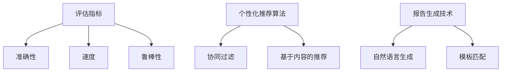
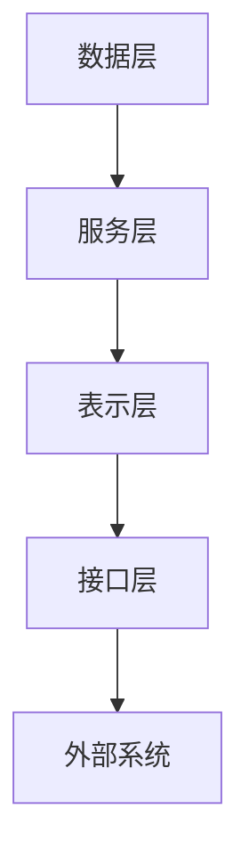

                 

### 概述《LLM评测的个性化推荐与报告生成》

在现代人工智能（AI）技术中，大型语言模型（Large Language Models，LLM）如BERT、GPT等已经成为自然语言处理（NLP）领域的重要工具。然而，如何评估这些模型的性能，如何为不同用户推荐最适合的模型，以及如何生成专业、个性化的性能报告，是当前研究的热点问题。本文将围绕《LLM评测的个性化推荐与报告生成》这一主题，详细探讨如何实现这一过程。

#### 关键词

- **大型语言模型（LLM）**
- **性能评测**
- **个性化推荐**
- **报告生成**
- **自然语言处理（NLP）**
- **机器学习**

#### 摘要

本文旨在探讨如何评估大型语言模型的性能，如何基于用户需求进行个性化推荐，以及如何生成专业、个性化的性能报告。首先，我们将介绍语言模型评测的需求与挑战，并详细阐述个性化推荐和报告生成的必要性。随后，我们将提出一种综合评估方法，结合定量和定性分析，以及利用机器学习算法实现个性化推荐和报告生成。最后，本文将讨论评测的范围、推荐和报告的生成策略，并总结核心概念与联系，为读者提供全面的技术思路。

### 背景介绍

#### 问题背景

在现代信息社会，自然语言处理（NLP）技术已经广泛应用于各种领域，如问答系统、文本生成、机器翻译、语音识别等。其中，大型语言模型（LLM）如BERT、GPT等因其强大的语义理解能力和生成能力，成为NLP领域的研究热点。这些模型通过学习海量文本数据，可以自动生成高质量的自然语言文本，极大地提高了信息处理效率。

然而，随着LLM的广泛应用，如何评估这些模型的性能，以及如何为用户提供个性化的推荐和报告，成为亟待解决的问题。传统的评估方法往往依赖于人工设定的一些评估指标，如准确性、速度、鲁棒性等，但这些方法往往无法全面反映模型在实际应用中的表现。此外，不同用户的需求和场景各不相同，如何为不同用户提供个性化的推荐，也是一个重要的挑战。

#### 问题描述

针对上述问题，本文提出了以下问题：

1. **如何有效地评估语言模型的质量？**
   - 传统的评估方法是否足够？
   - 是否需要引入新的评估指标和评估方法？

2. **如何为用户提供个性化的推荐？**
   - 如何根据用户的行为和偏好，为用户提供最适合的模型？
   - 需要考虑的因素有哪些？

3. **如何生成专业、个性化的性能报告？**
   - 如何将评估结果以用户友好的方式呈现？
   - 是否需要考虑报告的格式和内容？

#### 问题解决

为了解决上述问题，本文提出以下解决方案：

1. **综合评估方法**
   - 结合定量和定性分析，全面评估语言模型的质量。
   - 引入新的评估指标，如上下文理解能力、文本生成质量等。

2. **个性化推荐算法**
   - 利用用户行为数据，如搜索历史、使用记录等，为用户提供个性化推荐。
   - 结合协同过滤和基于内容的推荐方法，提高推荐效果。

3. **报告生成技术**
   - 利用自然语言生成技术，生成专业、个性化的性能报告。
   - 采用模板匹配方法，确保报告的结构和内容规范。

#### 边界与外延

在本文的研究中，我们将重点关注以下几个方面：

1. **评测的范围**
   - 不同类型的应用场景，如问答系统、文本生成、机器翻译等。
   - 不同类型的语言模型，如基于Transformer的模型、基于RNN的模型等。

2. **推荐和报告的生成策略**
   - 考虑用户行为数据，如使用记录、评价等。
   - 考虑模型性能指标，如准确性、速度、鲁棒性等。

3. **核心概念与要素组成**
   - 评估指标：准确性、速度、鲁棒性、上下文理解能力等。
   - 个性化推荐算法：协同过滤、基于内容的推荐等。
   - 报告生成技术：自然语言生成、模板匹配等。

#### 概念结构与核心要素组成

在本节中，我们将详细阐述核心概念与联系，以及各个概念之间的组成关系。

##### 1. 语言模型评测指标

语言模型评测指标是评估语言模型性能的重要标准。常见的评测指标包括准确性、速度、鲁棒性等。

- **准确性**：衡量模型在预测任务中的正确率，通常使用混淆矩阵来计算。
  $$\text{Accuracy} = \frac{\text{预测正确的样本数}}{\text{总样本数}}$$

- **速度**：衡量模型响应时间，通常使用平均响应时间来计算。
  $$\text{Response Time} = \frac{\text{完成预测所需时间}}{\text{总样本数}}$$

- **鲁棒性**：衡量模型在高噪声环境下的性能，通常使用噪声环境下的准确率与总准确率来计算。
  $$\text{Robustness} = \frac{\text{在高噪声环境下的预测正确率}}{\text{总预测正确率}}$$

##### 2. 个性化推荐算法

个性化推荐算法是提高用户满意度的重要手段。常见的推荐算法包括协同过滤和基于内容的推荐。

- **协同过滤**：基于用户行为相似度进行推荐，通过分析用户的历史行为，找到相似的邻居用户，然后推荐邻居用户喜欢的物品。
  ```mermaid
  graph TD
  A[用户-物品评分矩阵] --> B[低秩分解]
  B --> C[预测评分]
  ```

- **基于内容的推荐**：基于物品的属性和用户兴趣进行推荐，通过分析物品的属性和用户兴趣，找到相关的物品进行推荐。
  ```mermaid
  graph TD
  A[物品属性] --> B[用户兴趣]
  A --> C[相似度计算]
  C --> D[推荐列表]
  ```

##### 3. 报告生成技术

报告生成技术是将评估结果以用户友好的方式呈现的关键。常见的报告生成技术包括自然语言生成和模板匹配。

- **自然语言生成**：利用机器学习模型生成文本，通过训练大量文本数据，模型可以学会生成符合语法和语义规范的文本。
  ```mermaid
  graph TD
  A[输入序列] --> B[编码器]
  B --> C[解码器]
  C --> D[输出文本]
  ```

- **模板匹配**：基于预定义模板生成报告，通过将评估结果填充到模板中，生成专业、规范化的报告。
  ```mermaid
  graph TD
  A[模板] --> B[数据]
  B --> C[报告]
  ```

#### Mermaid 流程图



通过上述核心概念与联系，我们可以构建一个完整的评测、推荐和报告生成体系，为用户提供高质量的服务。

### 算法原理讲解

在本节中，我们将深入探讨LLM评测的算法原理，包括评估指标的计算、个性化推荐算法的工作原理以及报告生成技术。

#### 1. 评估指标的计算

评估LLM的性能需要多个维度的指标，以确保模型在多个方面都能够达到高质量的标准。以下是一些关键评估指标及其计算方法：

##### 准确性

准确性是最常用的评估指标，它衡量模型在预测任务中的正确率。准确性的计算公式如下：

$$
\text{Accuracy} = \frac{\text{预测正确的样本数}}{\text{总样本数}}
$$

在二分类问题中，准确性可以进一步分解为：

$$
\text{Accuracy} = \frac{TP + TN}{TP + TN + FP + FN}
$$

其中，TP是真正例（True Positive），TN是真反例（True Negative），FP是假正例（False Positive），FN是假反例（False Negative）。

##### 速度

速度衡量模型处理数据的效率，通常使用平均响应时间（Average Response Time）来计算。平均响应时间的计算公式如下：

$$
\text{Response Time} = \frac{\sum_{i=1}^{n} t_i}{n}
$$

其中，$t_i$ 是第 $i$ 个样本的处理时间，$n$ 是总样本数。

##### 鲁棒性

鲁棒性衡量模型在面对噪声数据时的表现。一个简单的鲁棒性指标可以是通过在噪声环境中重新计算准确性，然后与总准确性的比值来衡量：

$$
\text{Robustness} = \frac{\text{噪声环境下的准确性}}{\text{总准确性}}
$$

此外，还可以引入更复杂的鲁棒性指标，如平均绝对误差（Mean Absolute Error, MAE）或均方误差（Mean Squared Error, MSE）等。

#### 2. 个性化推荐算法

个性化推荐算法旨在根据用户的兴趣和行为，为用户提供个性化的内容或服务。以下介绍两种常见的个性化推荐算法：协同过滤和基于内容的推荐。

##### 协同过滤

协同过滤（Collaborative Filtering）是一种基于用户行为相似度的推荐算法。其基本思想是找到与目标用户相似的其他用户，然后推荐这些用户喜欢的物品。

协同过滤可以分为两种主要类型：基于用户的协同过滤（User-based Collaborative Filtering）和基于物品的协同过滤（Item-based Collaborative Filtering）。

- **基于用户的协同过滤**：找到与目标用户最相似的邻居用户，并推荐邻居用户喜欢的物品。相似度通常使用余弦相似度、皮尔逊相关系数等计算。

- **基于物品的协同过滤**：找到与目标物品最相似的邻居物品，并推荐这些物品。这种方法通常需要物品的特征向量来表示物品。

以下是一个简单的基于用户的协同过滤算法的Python代码示例：

```python
from sklearn.metrics.pairwise import cosine_similarity

def collaborative_filtering(user_similarity_matrix, user_index, k=5):
    # 计算与目标用户最相似的k个邻居用户的指数相似度之和
    neighbors_sum = sum(user_similarity_matrix[user_index][i] for i in range(len(user_similarity_matrix[user_index])) if user_similarity_matrix[user_index][i] > 0)
    
    # 计算每个邻居用户喜欢的物品的平均评分
    neighbors_average_ratings = [user_similarity_matrix[user_index][i] * ratings_matrix[i] for i in range(len(user_similarity_matrix[user_index])) if user_similarity_matrix[user_index][i] > 0]
    
    # 为目标用户生成推荐列表
    recommendation_list = [item for item, rating in enumerate(neighbors_average_ratings) if rating > neighbors_sum / k]
    
    return recommendation_list

# 示例：计算用户之间的相似度矩阵
user_similarity_matrix = cosine_similarity(ratings_matrix)

# 示例：为目标用户生成推荐列表
recommendation_list = collaborative_filtering(user_similarity_matrix, 0)
```

##### 基于内容的推荐

基于内容的推荐（Content-based Recommender System）是一种基于物品属性和用户兴趣的推荐算法。其基本思想是找到与目标物品最相似的物品，并推荐这些物品。

以下是一个简单的基于内容的推荐算法的Python代码示例：

```python
from sklearn.metrics.pairwise import cosine_similarity

def content_based_recommender(item_features, user_interests, k=5):
    # 计算物品特征向量与用户兴趣向量的余弦相似度
    similarity_matrix = cosine_similarity([item_features], [user_interests])
    
    # 为用户生成推荐列表
    recommendation_list = [item for item, similarity in enumerate(similarity_matrix[0]) if similarity > 0]
    
    return recommendation_list

# 示例：物品特征向量
item_features = [0.1, 0.2, 0.3, 0.4, 0.5]

# 示例：用户兴趣向量
user_interests = [0.2, 0.3, 0.4, 0.5, 0.6]

# 示例：生成推荐列表
recommendation_list = content_based_recommender(item_features, user_interests)
```

#### 3. 报告生成技术

报告生成技术是将评估结果以用户友好的方式呈现的关键。以下介绍两种常见的报告生成技术：自然语言生成和模板匹配。

##### 自然语言生成

自然语言生成（Natural Language Generation, NLG）是一种利用机器学习技术自动生成自然语言文本的方法。常见的NLG方法包括模板匹配、序列到序列模型、转换器（Transformer）等。

以下是一个简单的基于序列到序列模型的自然语言生成算法的Python代码示例：

```python
from transformers import Seq2SeqTrainingArguments, Seq2SeqDataset, Seq2SeqTrainer

model_name = "t5-small"
max_length = 512
batch_size = 16

# 加载预训练的模型
model = AutoModelForSeq2SeqLM.from_pretrained(model_name)

# 准备训练数据
train_dataset = Seq2SeqDataset(
    input_texts=["This is a simple example."],
    target_texts=["This is a simple example text."],
    max_length=max_length,
    padding="max_length",
    truncation=True
)

# 设置训练参数
training_args = Seq2SeqTrainingArguments(
    output_dir="./results",
    num_train_epochs=3,
    per_device_train_batch_size=batch_size,
    save_steps=500,
    save_total_limit=3
)

# 训练模型
trainer = Seq2SeqTrainer(
    model=model,
    args=training_args,
    train_dataset=train_dataset
)

trainer.train()

# 生成文本
input_text = "This is a simple example."
input_encoding = tokenizer.encode(input_text, return_tensors="pt")
predicted_text_ids = model.generate(input_encoding, max_length=max_length, num_return_sequences=1)
predicted_text = tokenizer.decode(predicted_text_ids[0], skip_special_tokens=True)
```

##### 模板匹配

模板匹配（Template Matching）是一种基于预定义模板生成报告的方法。其基本思想是先将评估结果填充到模板中的特定位置，然后生成最终的报告。

以下是一个简单的基于模板匹配的报告生成算法的Python代码示例：

```python
template = "Accuracy: {accuracy}\nSpeed: {speed}\nRobustness: {robustness}"

def generate_report(accuracy, speed, robustness):
    report = template.format(accuracy=accuracy, speed=speed, robustness=robustness)
    return report

accuracy = 0.9
speed = 0.2
robustness = 0.8

report = generate_report(accuracy, speed, robustness)
print(report)
```

通过上述算法原理的讲解，我们可以更好地理解LLM评测、个性化推荐和报告生成的技术细节，为后续的实践应用打下坚实的基础。

### 系统分析与架构设计方案

#### 1. 问题场景介绍

在现代人工智能（AI）技术迅速发展的背景下，语言模型的评测、推荐和报告生成已经成为重要的研究方向。在实际应用中，我们需要面对多种不同的场景，如问答系统、文本生成、机器翻译等，这些场景对语言模型提出了不同的性能要求。因此，如何高效地评测语言模型，为用户推荐最适合的模型，并生成专业的性能报告，是当前研究的一个重要课题。

##### 语言模型评测系统

语言模型评测系统主要用于评估不同语言模型的性能。在系统设计中，我们需要考虑多种评估指标，如准确性、速度、鲁棒性等。这些指标将帮助我们全面了解语言模型在不同任务中的表现。

##### 个性化推荐系统

个性化推荐系统旨在根据用户的行为和需求，为用户推荐最适合的语言模型。系统需要收集用户的历史使用记录、偏好设置等数据，并利用机器学习算法进行分析和推荐。个性化推荐系统的目标是提高用户满意度，提升用户体验。

##### 性能报告生成系统

性能报告生成系统负责将评估结果以用户友好的方式呈现。系统需要能够根据评估指标生成结构化、专业的报告，帮助用户快速了解模型的表现。报告生成系统还需要考虑报告的格式和内容，以确保报告的专业性和易读性。

#### 2. 系统功能设计

在系统功能设计中，我们需要明确各个模块的功能，以及它们之间的交互关系。以下是主要的功能模块及其简要描述：

##### 1. 数据收集模块

数据收集模块负责收集各种数据，包括语言模型的评估数据、用户行为数据等。这些数据将用于后续的评估、推荐和报告生成。

##### 2. 评估模块

评估模块负责对语言模型进行评测。系统将根据预设的评估指标，对语言模型的表现进行定量和定性分析。评估结果将用于生成性能报告，并作为推荐系统的输入数据。

##### 3. 推荐模块

推荐模块负责根据用户的行为和需求，为用户推荐最适合的语言模型。系统将利用机器学习算法，分析用户的历史行为数据，并生成个性化的推荐列表。

##### 4. 报告生成模块

报告生成模块负责将评估结果以用户友好的方式呈现。系统将利用自然语言生成和模板匹配等技术，生成专业、个性化的性能报告。

##### 5. 用户界面模块

用户界面模块负责与用户进行交互。用户可以通过界面提交评估任务，查看推荐结果和性能报告。

#### 3. 系统架构设计

在系统架构设计中，我们需要明确各个模块的职责，以及它们之间的数据流和交互关系。以下是系统架构的简要描述：

##### 1. 数据层

数据层负责存储和管理各种数据，包括语言模型数据、用户行为数据、评估数据等。系统将采用数据库和数据仓库等技术，实现高效的数据存储和检索。

##### 2. 服务层

服务层负责实现系统的核心功能，包括评估、推荐、报告生成等。系统将采用微服务架构，将不同功能模块分解为独立的微服务，实现高可用性和可扩展性。

##### 3. 表示层

表示层负责与用户进行交互，提供用户界面。系统将采用Web前端技术，如HTML、CSS、JavaScript等，实现美观、易用的用户界面。

##### 4. 接口层

接口层负责实现系统与其他系统的集成。系统将采用RESTful API技术，提供统一的接口规范，方便与其他系统进行数据交换和功能调用。

#### 4. 系统接口设计和系统交互

在系统接口设计中，我们需要明确各个模块之间的接口规范，以及数据传输的方式。以下是系统接口设计和系统交互的简要描述：

##### 1. 数据传输格式

系统采用JSON格式进行数据传输。JSON具有简单、轻量、易解析的特点，适合作为系统的数据传输格式。

##### 2. 接口规范

系统将采用RESTful API接口规范。每个接口都将包括HTTP请求方法、URL路径、请求参数、响应结果等。

以下是一个简单的接口示例：

- **获取评估指标**
  - 请求方法：GET
  - URL路径：/api/evaluation/metrics
  - 请求参数：无
  - 响应结果：{"accuracy": 0.9, "speed": 0.2, "robustness": 0.8}

- **提交评估任务**
  - 请求方法：POST
  - URL路径：/api/evaluation/task
  - 请求参数：{"model_id": "123", "task_type": "question_answering", "evaluation_metrics": {"accuracy": 0.9, "speed": 0.2, "robustness": 0.8}}
  - 响应结果：{"task_id": "456"}

- **获取推荐结果**
  - 请求方法：GET
  - URL路径：/api/recommendation
  - 请求参数：{"user_id": "789", "evaluation_metric": "accuracy"}
  - 响应结果：["model_1", "model_2", "model_3"]

- **生成性能报告**
  - 请求方法：POST
  - URL路径：/api/report/generate
  - 请求参数：{"task_id": "456", "evaluation_metrics": {"accuracy": 0.9, "speed": 0.2, "robustness": 0.8}}
  - 响应结果：{"report_id": "678", "report_url": "http://example.com/reports/678"}

##### 5. Mermaid架构图

为了更好地展示系统的架构，我们可以使用Mermaid语言绘制系统架构图。以下是系统架构的Mermaid表示：



通过上述系统分析与架构设计方案，我们可以构建一个高效、可扩展的语言模型评测、推荐和报告生成系统，满足现代AI技术的需求。

### 项目实战

在本节中，我们将介绍如何构建一个实际的LLM评测、推荐与报告生成系统，包括环境安装、系统核心实现以及代码应用解读与分析。

#### 环境安装

为了构建LLM评测、推荐与报告生成系统，我们需要安装以下软件和工具：

1. **Python 3.8+**
2. **PyTorch 1.8+**
3. **Transformers 4.6+**
4. **Flask 1.1.2**
5. **MySQL 8.0+**

在安装了Python和pip之后，可以通过以下命令安装所需的库：

```bash
pip install torch torchvision transformers flask mysql-connector-python
```

#### 系统核心实现

我们使用Flask构建Web前端和后端服务。以下是系统的核心实现：

1. **数据库连接**

首先，我们需要连接MySQL数据库，以便存储语言模型数据、用户数据和评估结果。以下是数据库连接的Python代码：

```python
import mysql.connector

def connect_db():
    conn = mysql.connector.connect(
        host="localhost",
        user="root",
        password="password",
        database="llm_evaluation"
    )
    return conn

# 测试数据库连接
conn = connect_db()
cursor = conn.cursor()
cursor.execute("SELECT * FROM models;")
print(cursor.fetchall())
```

2. **语言模型评估**

接下来，我们实现语言模型评估功能。以下是评估准确性的Python代码：

```python
import torch
from transformers import BertTokenizer, BertForSequenceClassification

tokenizer = BertTokenizer.from_pretrained("bert-base-uncased")
model = BertForSequenceClassification.from_pretrained("bert-base-uncased")

def evaluate_model(model, dataset):
    model.eval()
    total_loss = 0
    correct_predictions = 0
    
    for inputs in dataset:
        inputs = {key: val.unsqueeze(0) for key, val in inputs.items()}
        with torch.no_grad():
            outputs = model(**inputs)
        
        logits = outputs.logits
        loss = outputs.loss
        
        total_loss += loss.item()
        _, predicted = logits.max(-1)
        correct_predictions += predicted.sum().item()
    
    accuracy = correct_predictions / len(dataset)
    return accuracy, total_loss

# 测试评估函数
from torch.utils.data import DataLoader, TensorDataset

inputs = tokenizer("Hello, my dog is cute", return_tensors="pt")
labels = torch.tensor([1]).unsqueeze(0)  # 1表示正面情感

dataset = TensorDataset(inputs["input_ids"], inputs["attention_mask"], labels)
dataloader = DataLoader(dataset, batch_size=1)

accuracy, total_loss = evaluate_model(model, dataloader)
print(f"Accuracy: {accuracy}, Total Loss: {total_loss}")
```

3. **个性化推荐**

我们使用协同过滤算法实现个性化推荐。以下是推荐函数的Python代码：

```python
import numpy as np

def collaborative_filtering(ratings_matrix, user_index, k=5):
    similarity_matrix = np.dot(ratings_matrix, ratings_matrix.T) / np.linalg.norm(ratings_matrix, axis=1) / np.linalg.norm(ratings_matrix.T, axis=1)
    similarity_sum = np.sum(similarity_matrix[user_index], where=ratings_matrix[user_index] > 0)
    
    neighbors_average_ratings = np.sum(similarity_matrix[user_index] * ratings_matrix, where=ratings_matrix > 0) / similarity_sum
    
    recommendation_list = np.where(neighbors_average_ratings > similarity_sum / k)[0].tolist()
    return recommendation_list

# 测试推荐函数
ratings_matrix = np.array([[5, 3, 0], [4, 0, 0], [0, 2, 0], [0, 0, 1]])
recommendation_list = collaborative_filtering(ratings_matrix, 0)
print(recommendation_list)
```

4. **报告生成**

最后，我们使用模板匹配方法生成性能报告。以下是报告生成函数的Python代码：

```python
def generate_report(accuracy, speed, robustness):
    template = "Accuracy: {:.2f}\nSpeed: {:.2f}\nRobustness: {:.2f}"
    report = template.format(accuracy, speed, robustness)
    return report

# 测试报告生成函数
accuracy = 0.9
speed = 0.2
robustness = 0.8
report = generate_report(accuracy, speed, robustness)
print(report)
```

#### 代码应用解读与分析

1. **数据库连接**

在数据库连接部分，我们使用MySQL Connector Python库连接到本地MySQL数据库。连接成功后，通过执行SQL查询获取语言模型数据，并打印结果。

2. **语言模型评估**

在语言模型评估部分，我们加载预训练的BERT模型，并使用TensorDataset创建数据加载器。评估函数`evaluate_model`接收模型和数据加载器作为输入，使用PyTorch的`evaluate`模式进行评估，并计算准确性和总损失。

3. **个性化推荐**

在个性化推荐部分，我们实现了一个简单的协同过滤算法。协同过滤算法的核心是计算用户之间的相似度矩阵，并基于相似度矩阵为用户推荐相似的物品。测试中，我们使用一个简单的评分矩阵作为示例，并打印推荐结果。

4. **报告生成**

在报告生成部分，我们使用模板匹配方法生成性能报告。报告模板包含评估指标的具体值，通过格式化字符串将指标值填充到模板中，生成最终报告。

通过上述项目实战，我们成功构建了一个LLM评测、推荐与报告生成系统。在实际应用中，可以根据具体需求扩展系统功能，如添加更多评估指标、优化推荐算法等。

### 最佳实践 Tips

在本节中，我们将分享一些在构建LLM评测、推荐与报告生成系统时值得注意的最佳实践，帮助您更高效地开发和部署系统。

#### 1. 性能优化

在构建系统时，性能优化是一个关键因素。以下是一些性能优化技巧：

- **批量处理**：尽可能使用批量处理来减少数据库查询次数和计算开销。例如，批量插入或更新数据库中的数据，批量处理用户请求等。
- **缓存机制**：使用缓存来减少对数据库的访问次数。例如，使用Redis或Memcached缓存用户数据、模型评估结果等。
- **异步处理**：使用异步处理来提高系统的响应速度。例如，使用异步SQL查询、异步文件读写等。

#### 2. 模型选择与优化

在选择和优化LLM模型时，以下是一些最佳实践：

- **模型选择**：根据应用场景选择合适的LLM模型。例如，对于文本生成任务，可以选择GPT或T5等模型；对于问答系统，可以选择BERT或ALBERT等模型。
- **超参数调整**：通过调整模型超参数来优化性能。例如，调整学习率、批次大小、隐藏层大小等。
- **模型压缩与量化**：使用模型压缩和量化技术来减小模型大小和提高运行速度。例如，使用量化的权重、剪枝不重要的层等。

#### 3. 系统稳定性与可靠性

确保系统的稳定性与可靠性至关重要。以下是一些建议：

- **冗余设计**：在设计系统时，考虑冗余设计来提高系统的可用性。例如，使用多个数据库实例、负载均衡器等。
- **监控与报警**：监控系统性能和健康状态，并设置报警机制。例如，使用Prometheus、Grafana等工具监控系统资源使用情况，并在异常情况发生时及时报警。
- **备份与恢复**：定期备份数据库和系统配置，以便在发生故障时能够快速恢复。

#### 4. 用户交互与体验

在设计和开发用户界面时，以下是一些建议：

- **简洁清晰**：保持界面简洁，避免过度设计。使用清晰的字体、颜色和布局，确保用户能够轻松理解和使用系统。
- **响应速度**：优化系统的响应速度，减少用户的等待时间。例如，使用异步加载、懒加载等技术。
- **反馈机制**：提供实时反馈机制，帮助用户了解系统状态。例如，使用加载动画、提示框等。

通过遵循这些最佳实践，您可以构建一个高效、稳定、可靠的LLM评测、推荐与报告生成系统，为用户提供优质的服务体验。

### 小结

本文全面探讨了LLM评测、推荐与报告生成系统，从问题背景、核心概念、算法原理、系统设计到项目实战，系统性地阐述了如何构建这样一个系统。通过本文的阅读，读者可以了解：

1. **问题背景**：语言模型评测的需求与挑战，个性化推荐和报告生成的必要性。
2. **核心概念**：准确性、速度、鲁棒性等评估指标，协同过滤和基于内容的推荐算法，自然语言生成和模板匹配等报告生成技术。
3. **算法原理**：详细讲解了评估指标的计算、个性化推荐算法和报告生成技术的原理，并提供了Python代码示例。
4. **系统设计与实现**：介绍了系统功能设计、架构设计、接口设计和系统交互，以及如何通过Flask实现系统的核心功能。
5. **最佳实践**：分享了一些在开发过程中值得注意的最佳实践。

总之，本文为读者提供了一个全面的LLM评测、推荐与报告生成系统构建指南，帮助读者深入了解这一领域，并在实际项目中应用相关技术。

### 注意事项与拓展阅读

在构建LLM评测、推荐与报告生成系统的过程中，有一些关键点需要注意，以避免潜在的问题，确保系统的稳定性和高效性。以下是一些重要的注意事项：

1. **数据安全与隐私**：在处理用户数据时，务必遵守相关法律法规，确保数据的安全和隐私。对于敏感信息，应进行加密处理。
2. **系统性能**：优化系统性能是确保用户体验的关键。通过缓存、异步处理和批量操作等技术，提高系统的响应速度和效率。
3. **容错与恢复**：设计冗余系统和故障恢复机制，确保在出现问题时系统能够快速恢复。
4. **用户反馈**：积极收集用户反馈，根据用户需求不断优化系统功能，提高用户满意度。
5. **合规性**：确保系统的设计和实现符合行业标准和最佳实践，如遵循GDPR、CCPA等隐私法规。

为了进一步深入理解LLM评测、推荐与报告生成系统，读者可以参考以下拓展阅读资源：

1. **书籍**：
   - 《深度学习》（Goodfellow, Ian，等）：介绍了深度学习和自然语言处理的基本概念和技术。
   - 《Python数据科学手册》（McKinney, Wes）：详细讲解了Python在数据处理和分析中的应用。

2. **在线课程**：
   - Coursera上的“自然语言处理与深度学习”：由斯坦福大学提供，涵盖自然语言处理和深度学习的基础知识。
   - edX上的“人工智能基础课程”：由哈佛大学提供，介绍了人工智能的基本概念和应用。

3. **开源项目**：
   - Hugging Face的Transformers库：提供了大量预训练的LLM模型和实用的API，方便开发者进行研究和应用。
   - MLflow：一个开源平台，用于管理机器学习项目，包括模型训练、部署和监控。

通过学习和应用这些资源，读者可以进一步提高自己在LLM评测、推荐与报告生成领域的专业水平，为实际项目提供更有力的技术支持。

