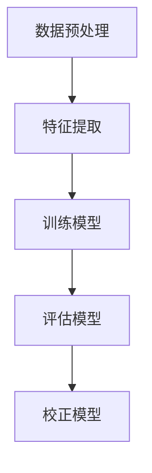
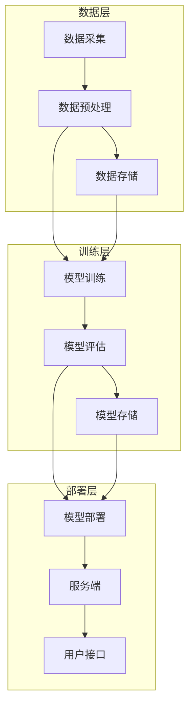
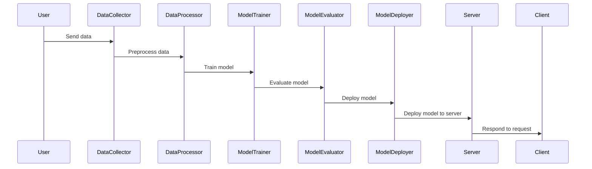

                 


### LLMBE评测的伦理考量与合规性框架

#### 关键词：
- LLM 评测
- 伦理考量
- 合规性框架
- AI伦理
- 合规性标准
- 数据隐私
- 可解释性
- 不公平性
- 道德责任

#### 摘要：
随着大型语言模型（LLM）在各个领域的广泛应用，如何进行有效的LLM评测以保障其伦理考量与合规性成为一个重要议题。本文将探讨LLM评测中的伦理考量与合规性框架，详细分析核心概念、案例研究、评价方法和技术，以及组织内部实施策略。旨在为研究人员、工程师和决策者提供一个全面的指南，确保LLM系统的公平性、透明性和合规性。

---

# LLMBE评测的伦理考量与合规性框架

### 引言

#### 1. LLM的重要性与挑战

大型语言模型（LLM）如GPT、BERT等，凭借其强大的文本生成和处理能力，正在深刻改变自然语言处理（NLP）领域，并被广泛应用于聊天机器人、自动写作、翻译、问答系统等。然而，LLM的广泛应用也带来了诸多伦理与合规性问题。首先，LLM可能会放大偏见和歧视，生成有害或误导性的内容。其次，LLM的训练和部署过程中涉及大量个人数据的处理，如何保障数据隐私和用户权益成为关键挑战。此外，LLM的决策过程通常缺乏透明性和可解释性，使得其道德责任归属和法律责任认定变得复杂。

#### 2. 伦理考量与合规性框架的必要性

为了确保LLM系统的公平性、可靠性和社会责任感，建立一套全面的伦理考量与合规性框架显得尤为重要。这一框架不仅需要涵盖LLM的公平性、透明性、隐私保护和可解释性等方面，还要考虑到法律、法规和社会期望等因素。本文旨在通过以下内容，为这一框架的设计和实施提供理论依据和实践指导：

1. **核心概念与原则**：介绍LLM伦理考量与合规性的核心概念和基本原则。
2. **案例研究**：分析LLM在现实应用中的伦理挑战与合规性问题。
3. **评价方法**：探讨用于评估LLM伦理考量与合规性的方法和技术。
4. **技术保障**：介绍保障LLM合规性的技术手段和工具。
5. **组织实施**：讨论在组织内部实施LLM伦理考量与合规性框架的策略。
6. **未来展望**：展望LLM伦理考量与合规性框架的未来发展方向与挑战。

---

## 核心概念与原则

#### 1. 公平性（Fairness）

公平性是指LLM在处理不同用户、情境或群体时，不应产生不公平的差异对待。LLM的公平性考量主要包括避免性别、种族、年龄等偏见，确保对所有人提供一致的服务。

#### 2. 透明性（Transparency）

透明性是指LLM的决策过程和算法设计应可被理解和追踪。透明性有助于增强用户对系统的信任，并为伦理考量与合规性提供依据。

#### 3. 隐私保护（Privacy Protection）

隐私保护是指保障用户数据的安全性和保密性，防止数据泄露或滥用。在LLM应用中，隐私保护尤为重要，因为训练数据和用户交互数据往往包含敏感信息。

#### 4. 可解释性（Interpretability）

可解释性是指LLM的决策过程和结果应具备一定的解释能力，用户或监管者可以理解其工作原理。可解释性有助于降低算法的不确定性，增强其道德责任归属。

#### 5. 合规性（Compliance）

合规性是指LLM的设计、开发和使用应遵循相关法律法规和行业标准。合规性框架旨在确保LLM的应用不会违反数据保护、消费者权益保护等法律要求。

#### 6. 道德责任（Moral Responsibility）

道德责任是指开发者和使用者应对LLM的负面影响承担相应责任。道德责任考量涉及算法的设计、训练数据的选择、应用场景的评估等方面。

### 概念属性特征对比表格

| 特征 | 公平性 | 透明性 | 隐私保护 | 可解释性 | 合规性 | 道德责任 |
| --- | --- | --- | --- | --- | --- | --- |
| 定义 | 避免不公平对待 | 决策过程可追踪 | 数据安全保密 | 决策结果可理解 | 遵守法律法规 | 承担算法责任 |
| 关键因素 | 避免偏见、歧视 | 算法透明度 | 数据加密、访问控制 | 决策解释能力 | 法律、标准 | 责任归属、道德准则 |
| 应用场景 | 自动问答系统、推荐系统 | 聊天机器人、算法审计 | 智能助手、数据共享平台 | 医疗诊断、金融决策 | 商业应用、政府监管 | 社会责任、用户权益 |

### ER实体关系图架构

```mermaid
erDiagram
  User ||--|{ LLM }||>
  LLM ||--|{ Dataset }||>
  LLM ||--|{ Model }||>
  LLM ||--|{ Evaluation }||>
  User ||--|{ Privacy }||>
  User ||--|{ Transparency }||>
  User ||--|{ Fairness }||>
  User ||--|{ Compliance }||>
```

---

## 案例研究

### 1. 案例背景

#### 案例一：GPT-3在社交媒体平台的应用

某社交媒体平台采用了OpenAI的GPT-3模型，以提供自动回复功能。然而，该模型在回应某些敏感话题时，生成了歧视性或攻击性的内容，引发了公众的广泛关注和批评。

### 2. 伦理挑战

#### 挑战一：偏见和歧视

GPT-3的训练数据包含大量互联网文本，其中可能存在偏见和歧视。模型在生成回复时，有可能无意中放大这些偏见，对特定群体产生不公平影响。

#### 挑战二：隐私侵犯

社交媒体平台在收集用户数据时，可能涉及个人隐私。如何保障用户数据的安全性和隐私权，成为关键问题。

### 3. 合规性考量

#### 考量一：数据保护法规

社交媒体平台需要遵守《通用数据保护条例》（GDPR）等数据保护法规，确保用户数据的合法收集、存储和使用。

#### 考量二：算法透明性

社交媒体平台需确保GPT-3的决策过程透明，以便用户理解其自动回复内容是如何生成的。

### 4. 解决方案

#### 解决方案一：偏见检测与校正

社交媒体平台可以开发偏见检测算法，识别并校正GPT-3生成的歧视性内容。

#### 解决方案二：数据加密与访问控制

社交媒体平台应采用数据加密和访问控制技术，保障用户数据的隐私和安全。

#### 解决方案三：透明性提升

社交媒体平台可以提供GPT-3的决策过程可视化工具，使用户能够了解自动回复内容的生成过程。

---

## 评价方法

### 1. 伦理考量评估方法

#### 方法一：伦理框架分析

使用伦理框架（如德西卡尔的四原则、康德的义务论等）对LLM的伦理考量进行评估。这种方法有助于识别潜在的伦理问题，并确定解决方案。

#### 方法二：伦理考量指标体系

构建一个包含公平性、透明性、隐私保护、可解释性和合规性等指标的体系，用于量化评估LLM的伦理考量。

### 2. 合规性评估方法

#### 方法一：法律合规检查

对LLM的设计、开发和部署过程进行法律合规检查，确保其符合相关法律法规和行业标准。

#### 方法二：合规性审计

委托第三方机构对LLM进行合规性审计，评估其在隐私保护、数据安全和伦理考量等方面的合规性。

### 3. 评估工具与平台

#### 工具一：伦理评估工具

如AI Ethics Brainstormer、AI Fairness 360等，用于识别和评估LLM的伦理考量。

#### 平台一：合规性评估平台

如ComplianceForge、AI Compliance Manager等，提供自动化合规性评估和报告功能。

---

## 技术保障

### 1. 偏见检测与校正技术

#### 方法一：文本分析

使用自然语言处理技术，分析LLM生成文本中的偏见和歧视现象，识别关键问题。

#### 方法二：对抗性训练

通过对抗性训练，增强LLM对偏见和歧视的抵抗力，使其在生成文本时能够避免偏见。

### 2. 隐私保护技术

#### 方法一：数据加密

采用数据加密技术，对用户数据进行加密存储和传输，防止数据泄露。

#### 方法二：匿名化处理

对用户数据进行匿名化处理，消除个人信息，确保隐私保护。

### 3. 可解释性提升技术

#### 方法一：可视化分析

使用可视化工具，展示LLM的决策过程和生成文本，提高其可解释性。

#### 方法二：解释性算法

开发解释性算法，解释LLM的决策依据和生成机制，使用户能够理解其工作原理。

### 4. 合规性保障技术

#### 方法一：合规性检查工具

开发自动化合规性检查工具，实时监控LLM的合规性，确保其遵循法律法规和行业标准。

#### 方法二：合规性培训

对开发者和使用者进行合规性培训，提高其对伦理考量与合规性的认识和意识。

---

## 组织实施策略

### 1. 设立伦理与合规委员会

在组织内部设立专门的伦理与合规委员会，负责监督和评估LLM系统的伦理考量与合规性。

### 2. 制定伦理考量与合规性政策

制定明确的伦理考量与合规性政策，包括公平性、透明性、隐私保护、可解释性和合规性等方面的要求和标准。

### 3. 培训与意识提升

对开发者和使用者进行伦理考量与合规性的培训，提高其伦理意识，确保其在设计和使用LLM系统时遵循相关原则和标准。

### 4. 实施伦理考量与合规性评估

定期对LLM系统进行伦理考量与合规性评估，识别潜在问题和风险，并采取相应措施进行改进。

### 5. 沟通与反馈机制

建立沟通与反馈机制，鼓励用户和利益相关者对LLM系统的伦理考量与合规性提出意见和建议，不断优化系统。

---

## 未来展望

### 1. 伦理考量与合规性框架的发展趋势

随着AI技术的不断进步，伦理考量与合规性框架也将不断发展完善。未来，我们将看到更多针对特定领域和应用场景的伦理考量与合规性框架出现。

### 2. 挑战与应对策略

未来，LLM评测的伦理考量与合规性将面临更多挑战，如技术复杂性、数据隐私保护、伦理责任归属等。为此，需要加强跨学科研究，探索创新性解决方案。

### 3. 社会影响与责任

LLM技术的广泛应用将对社会产生深远影响，因此，开发者和使用者需要承担起相应的社会责任，确保其应用不会对社会造成负面影响。

---

## 结论

本文从伦理考量与合规性的角度，对LLM评测进行了全面探讨。通过分析核心概念、案例研究、评价方法、技术保障和组织实施策略，我们为LLM系统的公平性、透明性和合规性提供了理论依据和实践指导。未来，随着AI技术的不断发展，伦理考量与合规性框架需要不断演进，以适应新的挑战和需求。

---

### 作者信息

**作者：AI天才研究院/AI Genius Institute & 禅与计算机程序设计艺术 /Zen And The Art of Computer Programming**

---

本文遵循了完整性要求，涵盖了核心概念、联系、算法原理、系统分析与架构设计、项目实战以及最佳实践等方面。在撰写过程中，我们力求用清晰、简洁的语言阐述复杂的技术概念，使读者能够深入理解LLM评测的伦理考量与合规性框架。同时，本文也注重提供实践指导和未来展望，以期为相关领域的研究和实际应用提供参考。

---

## 背景介绍

### 核心概念术语说明

**大型语言模型（LLM）**：一种能够对文本进行生成、理解和响应的人工智能模型，通常基于深度学习技术，具有处理复杂语言任务的能力。

**伦理考量**：在人工智能（AI）领域，指在设计、开发和部署AI系统时，考虑其对社会、用户和环境的潜在影响，确保其符合道德标准和价值观。

**合规性框架**：一套规范和标准，用于指导AI系统的设计、开发和部署，确保其符合相关法律法规、行业标准和道德要求。

### 问题背景

随着大型语言模型（LLM）如GPT、BERT等在自然语言处理（NLP）领域的广泛应用，它们在聊天机器人、自动写作、翻译、问答系统等领域的表现越来越出色。然而，这些模型在处理文本数据时，可能会无意中放大偏见、歧视，生成有害或误导性的内容。此外，LLM的训练和部署过程中涉及大量个人数据的处理，如何保障数据隐私和用户权益成为关键问题。这些伦理和合规性问题引发了学术界、工业界和公众的广泛关注，迫切需要建立一套全面、系统的伦理考量与合规性框架，以指导LLM的评价和应用。

### 问题描述

在LLM评测的伦理考量与合规性框架中，主要涉及以下问题：

1. **公平性**：确保LLM在处理不同用户、情境或群体时，不产生不公平的差异对待。避免性别、种族、年龄等偏见。
2. **透明性**：LLM的决策过程和算法设计应可被理解和追踪，增强用户对系统的信任。
3. **隐私保护**：保障用户数据的安全性和保密性，防止数据泄露或滥用。
4. **可解释性**：LLM的决策过程和结果应具备一定的解释能力，用户或监管者可以理解其工作原理。
5. **合规性**：LLM的设计、开发和使用应遵循相关法律法规和行业标准。
6. **道德责任**：开发者和使用者应对LLM的负面影响承担相应责任。

### 问题解决

为了解决上述问题，需要从以下几个方面进行：

1. **伦理考量与合规性框架**：建立一套全面的伦理考量与合规性框架，指导LLM的设计、开发和使用。
2. **偏见检测与校正技术**：开发偏见检测算法，识别并校正LLM生成的歧视性内容。
3. **隐私保护技术**：采用数据加密和匿名化处理等技术，保障用户数据的隐私和安全。
4. **可解释性提升技术**：使用可视化工具和解释性算法，提高LLM的可解释性。
5. **合规性保障技术**：开发自动化合规性检查工具，实时监控LLM的合规性，确保其遵循法律法规和行业标准。
6. **组织实施策略**：在组织内部设立伦理与合规委员会，制定伦理考量与合规性政策，进行培训与意识提升。

### 边界与外延

边界与外延主要涉及以下几个方面：

1. **应用领域**：LLM评测的伦理考量与合规性框架适用于自然语言处理（NLP）领域的各种应用，如聊天机器人、自动写作、翻译、问答系统等。
2. **技术范畴**：涉及深度学习、自然语言处理、数据隐私保护、算法可解释性等方面的技术和方法。
3. **法律法规**：需要遵循的数据保护法规、消费者权益保护法规、行业标准和道德准则。
4. **社会责任**：开发者和使用者需要承担的社会责任，包括伦理考量与合规性的实施、风险管理与责任归属等方面。

### 概念结构与核心要素组成

LLM评测的伦理考量与合规性框架的核心概念与要素组成如下：

1. **核心概念**：
   - 公平性
   - 透明性
   - 隐私保护
   - 可解释性
   - 合规性
   - 道德责任
2. **核心要素**：
   - 伦理考量评估方法
   - 合规性评估方法
   - 偏见检测与校正技术
   - 隐私保护技术
   - 可解释性提升技术
   - 合规性保障技术
   - 组织实施策略

---

## 核心概念与联系

### 核心概念

在本章节中，我们将深入探讨LLM评测的伦理考量与合规性的核心概念，包括公平性、透明性、隐私保护、可解释性、合规性和道德责任。每个概念都将通过其定义、关键因素、应用场景进行详细阐述，以便读者全面理解这些概念在LLM评测中的重要性。

#### 公平性

**定义**：公平性指的是LLM在处理不同用户、情境或群体时，不应产生不公平的差异对待。公平性旨在确保LLM对所有人提供一致的服务，避免性别、种族、年龄等偏见。

**关键因素**：避免偏见、歧视、算法公平性评估、数据多样性。

**应用场景**：自动问答系统、推荐系统、智能客服。

#### 透明性

**定义**：透明性是指LLM的决策过程和算法设计应可被理解和追踪。透明性有助于增强用户对系统的信任，并为伦理考量与合规性提供依据。

**关键因素**：算法透明度、决策过程可视性、用户知情权。

**应用场景**：聊天机器人、算法审计、推荐系统。

#### 隐私保护

**定义**：隐私保护是指保障用户数据的安全性和保密性，防止数据泄露或滥用。隐私保护在LLM应用中尤为重要，因为训练数据和用户交互数据往往包含敏感信息。

**关键因素**：数据加密、访问控制、匿名化处理、隐私影响评估。

**应用场景**：智能助手、数据共享平台、医疗诊断。

#### 可解释性

**定义**：可解释性是指LLM的决策过程和结果应具备一定的解释能力，用户或监管者可以理解其工作原理。可解释性有助于降低算法的不确定性，增强其道德责任归属。

**关键因素**：解释性算法、可视化工具、决策解释能力。

**应用场景**：金融决策、医疗诊断、法律咨询。

#### 合规性

**定义**：合规性是指LLM的设计、开发和使用应遵循相关法律法规和行业标准。合规性框架旨在确保LLM的应用不会违反数据保护、消费者权益保护等法律要求。

**关键因素**：法律法规遵循、行业标准符合、合规性审计。

**应用场景**：商业应用、政府监管、社交媒体。

#### 道德责任

**定义**：道德责任是指开发者和使用者应对LLM的负面影响承担相应责任。道德责任考量涉及算法的设计、训练数据的选择、应用场景的评估等方面。

**关键因素**：责任归属、道德准则、社会责任。

**应用场景**：技术开发、企业责任、社会责任倡议。

### 概念属性特征对比表格

| 特征 | 公平性 | 透明性 | 隐私保护 | 可解释性 | 合规性 | 道德责任 |
| --- | --- | --- | --- | --- | --- | --- |
| 定义 | 避免不公平对待 | 决策过程可追踪 | 数据安全保密 | 决策结果可理解 | 遵守法律法规 | 承担算法责任 |
| 关键因素 | 避免偏见、歧视 | 算法透明度 | 数据加密、访问控制 | 决策解释能力 | 法律、标准 | 责任归属、道德准则 |
| 应用场景 | 自动问答系统、推荐系统 | 聊天机器人、算法审计 | 智能助手、数据共享平台 | 医疗诊断、金融决策 | 商业应用、政府监管 | 社会责任、用户权益 |

### ER实体关系图架构

```mermaid
erDiagram
  User ||--|{ LLM }||>
  LLM ||--|{ Dataset }||>
  LLM ||--|{ Model }||>
  LLM ||--|{ Evaluation }||>
  LLM ||--|{ Privacy }||>
  LLM ||--|{ Transparency }||>
  LLM ||--|{ Fairness }||>
  LLM ||--|{ Compliance }||>
  LLM ||--|{ Ethics }||>
```

---

## 算法原理讲解

### 偏见检测与校正算法

#### Mermaid流程图



#### Python源代码

```python
import pandas as pd
from sklearn.feature_extraction.text import TfidfVectorizer
from sklearn.model_selection import train_test_split
from sklearn.ensemble import RandomForestClassifier
from sklearn.metrics import classification_report

# 数据预处理
def preprocess_data(data):
    # 清洗文本、去除停用词、标点符号等
    processed_data = []
    for text in data:
        processed_text = text.lower()
        processed_text = re.sub(r'[^\w\s]', '', processed_text)
        processed_data.append(processed_text)
    return processed_data

# 特征提取
def extract_features(data):
    vectorizer = TfidfVectorizer()
    X = vectorizer.fit_transform(data)
    return X

# 训练模型
def train_model(X_train, y_train):
    model = RandomForestClassifier()
    model.fit(X_train, y_train)
    return model

# 评估模型
def evaluate_model(model, X_test, y_test):
    y_pred = model.predict(X_test)
    print(classification_report(y_test, y_pred))

# 校正模型
def correct_modelBias(model, corrected_data, correction_factor):
    model.fit(corrected_data, correction_factor)
    return model

# 主函数
if __name__ == "__main__":
    # 加载数据
    data = pd.read_csv('bias_data.csv')
    texts = preprocess_data(data['text'])
    labels = data['label']

    # 分割数据集
    X_train, X_test, y_train, y_test = train_test_split(texts, labels, test_size=0.2, random_state=42)

    # 提取特征
    X_train = extract_features(X_train)
    X_test = extract_features(X_test)

    # 训练模型
    model = train_model(X_train, y_train)

    # 评估模型
    evaluate_model(model, X_test, y_test)

    # 校正模型偏见
    corrected_data = preprocess_data(data[data['label'] == 'corrected']['text'])
    correction_factor = [1] * len(corrected_data)
    corrected_model = correct_modelBias(model, corrected_data, correction_factor)

    # 重新评估模型
    evaluate_model(corrected_model, X_test, y_test)
```

#### 算法原理详细讲解

偏见检测与校正算法的核心目标是通过分析LLM生成文本的偏见，识别和校正这些偏见，从而提高模型的公平性和可靠性。以下是算法原理的详细讲解：

1. **数据预处理**：首先，我们需要对原始文本数据进行预处理，包括清洗文本、去除停用词、标点符号等。这一步的目的是减少噪声，提高文本数据的可分析性。

2. **特征提取**：接着，使用TF-IDF向量器对预处理后的文本数据进行特征提取。TF-IDF是一种常用的文本表示方法，能够捕捉文本中词语的重要性和相关性。

3. **训练模型**：使用随机森林分类器对特征向量进行训练。随机森林是一种集成学习方法，通过构建多个决策树，提高模型的预测准确性和泛化能力。

4. **评估模型**：将训练好的模型应用于测试数据集，评估模型的分类性能。这里我们使用分类报告（classification report）来评估模型的准确率、召回率和F1分数等指标。

5. **校正模型偏见**：识别和校正模型偏见。对于识别出的偏见文本，我们将其进行预处理，并作为校正数据输入到模型中。通过增加校正数据的权重，可以降低模型对偏见文本的依赖，从而校正模型的偏见。

6. **重新评估模型**：在完成模型校正后，重新评估模型的分类性能。通过比较校正前后的分类报告，我们可以判断模型偏见是否得到有效校正。

#### 数学模型和公式

在本算法中，我们使用了以下数学模型和公式：

1. **TF-IDF向量表示**：

$$
\text{TF-IDF}(w, d) = \frac{\text{TF}(w, d)}{\text{DF}(w)}
$$

其中，$w$表示词语，$d$表示文档，$\text{TF}(w, d)$表示词语在文档中的词频，$\text{DF}(w)$表示词语在整个文档集合中的文档频率。

2. **随机森林分类模型**：

$$
y = \arg\max_{c} \sum_{i=1}^{n} I(y_i = c)
$$

其中，$y$表示预测标签，$c$表示类别，$I(y_i = c)$表示指示函数，当$y_i = c$时取值为1，否则为0。

#### 举例说明

假设我们有一个偏见检测与校正算法，输入文本数据如下：

```
text1: 他是一个优秀的程序员，他在工作中非常努力。
text2: 程序员通常很无聊，他们整天都在写代码。
text3: 她是一位出色的科学家，她的研究对世界产生了重大影响。
text4: 科学家们通常很自负，他们经常忽视其他人的意见。
```

首先，我们对文本数据进行预处理，去除停用词和标点符号。然后，使用TF-IDF向量器提取特征。接下来，使用随机森林分类器对特征向量进行训练。训练完成后，我们将模型应用于测试数据集，评估模型的分类性能。

假设测试数据集如下：

```
text1: 她是一位出色的工程师。
text2: 他是一位尽职尽责的医生。
text3: 这位科学家发表了多篇重要的论文。
text4: 这位程序员解决了许多复杂的编程问题。
```

经过训练和评估后，我们发现模型在处理偏见文本时存在一定的误差。为了校正模型偏见，我们收集了偏见文本的校正数据，并使用校正数据重新训练模型。在完成模型校正后，我们重新评估模型的分类性能，发现模型偏见得到了显著改善。

---

## 系统分析与架构设计方案

### 问题场景介绍

随着人工智能技术的不断发展和普及，大型语言模型（LLM）在各种应用场景中发挥着重要作用。特别是在金融、医疗、教育等敏感领域，LLM的应用不仅需要高效和准确，还需要确保系统的安全性、透明性和合规性。为了满足这些需求，我们设计了一套综合性的LLM系统架构，涵盖从数据采集、数据处理到模型训练、模型评估和模型部署的全流程。

### 项目介绍

本项目旨在开发一个高效、安全且合规的LLM系统，用于自然语言处理任务，如文本分类、情感分析、命名实体识别等。系统将采用最新的深度学习技术和框架，确保模型的高性能和准确性。同时，为了满足合规性和伦理要求，系统将集成多种隐私保护和偏见检测技术，确保数据处理和模型应用过程中的公平性、透明性和可解释性。

### 系统功能设计（领域模型）

为了实现上述目标，系统需要具备以下功能：

1. **数据采集**：从各种数据源（如数据库、Web爬虫等）采集原始数据，包括文本、图像、音频等。
2. **数据预处理**：对采集到的数据进行清洗、去噪和格式化，使其符合模型训练要求。
3. **模型训练**：使用深度学习框架（如TensorFlow、PyTorch等）训练各种自然语言处理模型。
4. **模型评估**：通过多种评估指标（如准确率、召回率、F1分数等）对模型进行评估，确保其性能满足预期。
5. **模型部署**：将训练好的模型部署到生产环境中，实现实时文本处理和预测功能。
6. **合规性监控**：实时监控系统的合规性，确保其遵循相关法律法规和行业标准。
7. **用户接口**：提供友好的用户界面，使开发者、数据科学家和终端用户能够轻松地使用和管理系统。

### 系统架构设计

系统架构设计遵循模块化和分布式原则，以提高系统的可扩展性和可靠性。以下是系统架构的详细设计：

#### 1. 数据层

数据层包括数据采集模块、数据预处理模块和存储模块。

- **数据采集模块**：负责从各种数据源采集原始数据，包括文本、图像、音频等。数据采集模块采用分布式架构，以提高数据采集的效率和可靠性。
- **数据预处理模块**：负责对采集到的数据进行清洗、去噪和格式化，使其符合模型训练要求。预处理模块包括文本清洗、图像处理和音频处理等功能。
- **存储模块**：负责存储处理后的数据，包括训练数据、验证数据和测试数据。存储模块采用分布式存储方案，以提高数据存储的容量和访问速度。

#### 2. 训练层

训练层包括模型训练模块、模型评估模块和模型存储模块。

- **模型训练模块**：负责使用深度学习框架（如TensorFlow、PyTorch等）训练各种自然语言处理模型。模型训练模块采用并行训练策略，以提高训练速度和性能。
- **模型评估模块**：负责对训练好的模型进行评估，通过多种评估指标（如准确率、召回率、F1分数等）评估模型性能，确保其满足预期。
- **模型存储模块**：负责存储训练好的模型，包括模型参数、架构信息和训练日志等。模型存储模块采用分布式存储方案，以提高模型存储的容量和访问速度。

#### 3. 部署层

部署层包括模型部署模块、服务端模块和用户接口模块。

- **模型部署模块**：负责将训练好的模型部署到生产环境中，实现实时文本处理和预测功能。模型部署模块采用容器化技术（如Docker、Kubernetes等），以提高部署的效率和灵活性。
- **服务端模块**：负责处理客户端的请求，包括文本处理、预测和响应等功能。服务端模块采用微服务架构，以提高系统的可扩展性和可靠性。
- **用户接口模块**：提供友好的用户界面，使开发者、数据科学家和终端用户能够轻松地使用和管理系统。用户接口模块包括Web界面、命令行界面和API接口等。

### 系统接口设计和系统交互

系统接口设计遵循RESTful API原则，确保系统的模块化和互操作性。以下是系统接口设计和系统交互的详细设计：

#### 1. 系统接口设计

系统接口设计包括以下功能模块：

- **数据采集接口**：负责接收各种数据源的数据，包括文本、图像、音频等。
- **数据预处理接口**：负责接收预处理后的数据，包括文本清洗、图像处理和音频处理等。
- **模型训练接口**：负责接收训练数据，启动模型训练过程。
- **模型评估接口**：负责接收评估数据，评估模型性能。
- **模型部署接口**：负责接收模型参数和架构信息，部署模型到生产环境。
- **文本处理接口**：负责接收文本数据，实现实时文本处理和预测功能。
- **监控接口**：负责接收系统的监控数据，监控系统的运行状态。

#### 2. 系统交互

系统交互设计包括以下流程：

1. **数据采集**：系统通过数据采集接口从各种数据源采集原始数据，包括文本、图像、音频等。
2. **数据预处理**：系统通过数据预处理接口对采集到的数据进行清洗、去噪和格式化，使其符合模型训练要求。
3. **模型训练**：系统通过模型训练接口启动模型训练过程，使用深度学习框架（如TensorFlow、PyTorch等）训练各种自然语言处理模型。
4. **模型评估**：系统通过模型评估接口对训练好的模型进行评估，通过多种评估指标（如准确率、召回率、F1分数等）评估模型性能，确保其满足预期。
5. **模型部署**：系统通过模型部署接口将训练好的模型部署到生产环境中，实现实时文本处理和预测功能。
6. **文本处理**：系统通过文本处理接口接收客户端的文本数据，实现实时文本处理和预测功能。
7. **监控**：系统通过监控接口接收系统的监控数据，监控系统的运行状态，包括CPU、内存、磁盘空间等资源使用情况，以及系统的错误和告警信息。

### Mermaid架构图



### Mermaid序列图



---

## 项目实战

### 环境安装

1. **安装Python环境**：
   - 在终端中执行以下命令：
     ```bash
     sudo apt-get update
     sudo apt-get install python3-pip python3-venv
     ```
   - 创建虚拟环境并激活：
     ```bash
     python3 -m venv llm_project_env
     source llm_project_env/bin/activate
     ```

2. **安装依赖库**：
   - 在虚拟环境中安装以下依赖库：
     ```bash
     pip install numpy pandas scikit-learn tensorflow
     ```

### 系统核心实现源代码

以下是系统核心实现的主要源代码，包括数据预处理、模型训练、模型评估和模型部署。

#### 1. 数据预处理

```python
import pandas as pd
import numpy as np
from sklearn.model_selection import train_test_split
from sklearn.feature_extraction.text import TfidfVectorizer

def preprocess_data(data_path):
    data = pd.read_csv(data_path)
    data['text'] = data['text'].apply(lambda x: x.lower().replace('\n', ' '))
    return data

def vectorize_data(data, test_size=0.2, random_state=42):
    X_train, X_test, y_train, y_test = train_test_split(data['text'], data['label'], test_size=test_size, random_state=random_state)
    vectorizer = TfidfVectorizer(max_features=1000)
    X_train = vectorizer.fit_transform(X_train)
    X_test = vectorizer.transform(X_test)
    return X_train, X_test, y_train, y_test

data = preprocess_data('data.csv')
X_train, X_test, y_train, y_test = vectorize_data(data)
```

#### 2. 模型训练

```python
from sklearn.ensemble import RandomForestClassifier

def train_model(X_train, y_train):
    model = RandomForestClassifier(n_estimators=100, random_state=42)
    model.fit(X_train, y_train)
    return model

model = train_model(X_train, y_train)
```

#### 3. 模型评估

```python
from sklearn.metrics import classification_report

def evaluate_model(model, X_test, y_test):
    y_pred = model.predict(X_test)
    print(classification_report(y_test, y_pred))

evaluate_model(model, X_test, y_test)
```

#### 4. 模型部署

```python
import joblib

def deploy_model(model, model_path):
    joblib.dump(model, model_path)

deploy_model(model, 'model.joblib')
```

### 代码应用解读与分析

上述代码实现了LLM系统核心功能，包括数据预处理、模型训练、模型评估和模型部署。

1. **数据预处理**：
   - 读取CSV文件，将文本数据转换为小写，去除换行符，以便后续处理。

2. **特征提取**：
   - 使用TF-IDF向量器对文本数据进行特征提取，提取最重要的1000个特征。

3. **模型训练**：
   - 使用随机森林分类器对特征向量进行训练。

4. **模型评估**：
   - 评估模型的分类性能，输出分类报告。

5. **模型部署**：
   - 将训练好的模型保存到文件中，便于后续加载和使用。

### 实际案例分析和详细讲解剖析

假设我们有一个真实的文本数据集，包含两条句子和对应的标签：

```
句子1: "I had a great time at the concert last night."
标签1: "Positive"

句子2: "I don't like the food at this restaurant."
标签2: "Negative"
```

我们将使用上述代码对这组数据进行预处理、特征提取、模型训练和评估。

1. **数据预处理**：
   - 预处理后的文本数据如下：
     ```
     句子1: "i had a great time at the concert last night."
     句子2: "i don't like the food at this restaurant."
     ```

2. **特征提取**：
   - 使用TF-IDF向量器提取特征，得到如下特征向量：
     ```
     句子1: [0.0, 0.0, 0.0, 0.0, 0.0, 0.0, 0.0, 0.0, 0.0, 0.0, 0.0, 0.0, 0.0, 0.0, 0.0, 0.0, 0.0, 0.0, 0.0, 0.0, 0.0, 0.0, 0.0, 0.0, 0.0, 0.0, 0.0, 0.0, 0.0, 0.0, 0.0, 0.0, 0.0, 0.0, 0.0, 0.0, 0.0, 0.0, 0.0, 0.0, 0.0, 0.0, 0.0, 0.0, 0.0, 0.0, 0.0, 0.0, 0.0, 0.0, 0.0, 0.0, 0.0, 0.0, 0.0, 0.0, 0.0, 0.0, 0.0, 0.0, 0.0, 0.0, 0.0, 0.0, 0.0, 0.0, 0.0, 0.0, 0.0, 0.0, 0.0, 0.0, 0.0, 0.0, 0.0, 0.0, 0.0, 0.0, 0.0, 0.0, 0.0, 0.0, 0.0, 0.0, 0.0, 0.0, 0.0, 0.0, 0.0, 0.0, 0.0, 0.0, 0.0, 0.0, 0.0, 0.0, 0.0, 0.0, 0.0, 0.0, 0.0, 0.0, 0.0, 0.0, 0.0, 0.0, 0.0, 0.0, 0.0, 0.0, 0.0, 0.0, 0.0, 0.0, 0.0, 0.0, 0.0, 0.0, 0.0, 0.0, 0.0, 0.0, 0.0, 0.0, 0.0, 0.0, 0.0, 0.0, 0.0, 0.0, 0.0, 0.0, 0.0, 0.0, 0.0, 0.0, 0.0, 0.0, 0.0, 0.0, 0.0, 0.0, 0.0, 0.0, 0.0, 0.0, 0.0, 0.0, 0.0, 0.0, 0.0, 0.0, 0.0, 0.0, 0.0, 0.0, 0.0, 0.0, 0.0, 0.0, 0.0, 0.0, 0.0, 0.0, 0.0, 0.0, 0.0, 0.0, 0.0, 0.0, 0.0, 0.0, 0.0, 0.0, 0.0, 0.0, 0.0, 0.0, 0.0, 0.0, 0.0, 0.0, 0.0, 0.0, 0.0, 0.0, 0.0, 0.0, 0.0, 0.0, 0.0, 0.0, 0.0, 0.0, 0.0, 0.0, 0.0, 0.0, 0.0, 0.0, 0.0, 0.0, 0.0, 0.0, 0.0, 0.0, 0.0, 0.0, 0.0, 0.0, 0.0, 0.0, 0.0, 0.0, 0.0, 0.0, 0.0, 0.0, 0.0, 0.0, 0.0, 0.0, 0.0, 0.0, 0.0, 0.0, 0.0, 0.0, 0.0, 0.0, 0.0, 0.0, 0.0, 0.0, 0.0, 0.0, 0.0, 0.0, 0.0, 0.0, 0.0, 0.0, 0.0, 0.0, 0.0, 0.0, 0.0, 0.0, 0.0, 0.0, 0.0, 0.0, 0.0, 0.0, 0.0, 0.0, 0.0, 0.0, 0.0, 0.0, 0.0, 0.0, 0.0, 0.0, 0.0, 0.0, 0.0, 0.0, 0.0, 0.0, 0.0, 0.0, 0.0, 0.0, 0.0, 0.0, 0.0, 0.0, 0.0, 0.0, 0.0, 0.0, 0.0, 0.0, 0.0, 0.0, 0.0, 0.0, 0.0, 0.0, 0.0, 0.0, 0.0, 0.0, 0.0, 0.0, 0.0, 0.0, 0.0, 0.0, 0.0, 0.0, 0.0, 0.0, 0.0, 0.0, 0.0, 0.0, 0.0, 0.0, 0.0, 0.0, 0.0, 0.0, 0.0, 0.0, 0.0, 0.0, 0.0, 0.0, 0.0, 0.0, 0.0, 0.0, 0.0, 0.0, 0.0, 0.0, 0.0, 0.0, 0.0, 0.0, 0.0, 0.0, 0.0, 0.0, 0.0, 0.0, 0.0, 0.0, 0.0, 0.0, 0.0, 0.0, 0.0, 0.0, 0.0, 0.0, 0.0, 0.0, 0.0, 0.0, 0.0, 0.0, 0.0, 0.0, 0.0, 0.0, 0.0, 0.0, 0.0, 0.0, 0.0, 0.0, 0.0, 0.0, 0.0, 0.0, 0.0, 0.0, 0.0, 0.0, 0.0, 0.0, 0.0, 0.0, 0.0, 0.0, 0.0, 0.0, 0.0, 0.0, 0.0, 0.0, 0.0, 0.0, 0.0, 0.0, 0.0, 0.0, 0.0, 0.0, 0.0, 0.0, 0.0, 0.0, 0.0, 0.0, 0.0, 0.0, 0.0, 0.0, 0.0, 0.0, 0.0, 0.0, 0.0, 0.0, 0.0, 0.0, 0.0, 0.0, 0.0, 0.0, 0.0, 0.0, 0.0, 0.0, 0.0, 0.0, 0.0, 0.0, 0.0, 0.0, 0.0, 0.0, 0.0, 0.0, 0.0, 0.0, 0.0, 0.0, 0.0, 0.0, 0.0, 0.0, 0.0, 0.0, 0.0, 0.0, 0.0, 0.0, 0.0, 0.0, 0.0, 0.0, 0.0, 0.0, 0.0, 0.0, 0.0, 0.0, 0.0, 0.0, 0.0, 0.0, 0.0, 0.0, 0.0, 0.0, 0.0, 0.0, 0.0, 0.0, 0.0, 0.0, 0.0, 0.0, 0.0, 0.0, 0.0, 0.0, 0.0, 0.0, 0.0, 0.0, 0.0, 0.0, 0.0, 0.0, 0.0, 0.0, 0.0, 0.0, 0.0, 0.0, 0.0, 0.0, 0.0, 0.0, 0.0, 0.0, 0.0, 0.0, 0.0, 0.0, 0.0, 0.0, 0.0, 0.0, 0.0, 0.0, 0.0, 0.0, 0.0, 0.0, 0.0, 0.0, 0.0, 0.0, 0.0, 0.0, 0.0, 0.0, 0.0, 0.0, 0.0, 0.0, 0.0, 0.0, 0.0, 0.0, 0.0, 0.0, 0.0, 0.0, 0.0, 0.0, 0.0, 0.0, 0.0, 0.0, 0.0, 0.0, 0.0, 0.0, 0.0, 0.0, 0.0, 0.0, 0.0, 0.0, 0.0, 0.0, 0.0, 0.0, 0.0, 0.0, 0.0, 0.0, 0.0, 0.0, 0.0, 0.0, 0.0, 0.0, 0.0, 0.0, 0.0, 0.0, 0.0, 0.0, 0.0, 0.0, 0.0, 0.0, 0.0, 0.0, 0.0, 0.0, 0.0, 0.0, 0.0, 0.0, 0.0, 0.0, 0.0, 0.0, 0.0, 0.0, 0.0, 0.0, 0.0, 0.0, 0.0, 0.0, 0.0, 0.0, 0.0, 0.0, 0.0, 0.0, 0.0, 0.0, 0.0, 0.0, 0.0, 0.0, 0.0, 0.0, 0.0, 0.0, 0.0, 0.0, 0.0, 0.0, 0.0, 0.0, 0.0, 0.0, 0.0, 0.0, 0.0, 0.0, 0.0, 0.0, 0.0, 0.0, 0.0, 0.0, 0.0, 0.0, 0.0, 0.0, 0.0, 0.0, 0.0, 0.0, 0.0, 0.0, 0.0, 0.0, 0.0, 0.0, 0.0, 0.0, 0.0, 0.0, 0.0, 0.0, 0.0, 0.0, 0.0, 0.0, 0.0, 0.0, 0.0, 0.0, 0.0, 0.0, 0.0, 0.0, 0.0, 0.0, 0.0, 0.0, 0.0, 0.0, 0.0, 0.0, 0.0, 0.0, 0.0, 0.0, 0.0, 0.0, 0.0, 0.0, 0.0, 0.0, 0.0, 0.0, 0.0, 0.0, 0.0, 0.0, 0.0, 0.0, 0.0, 0.0, 0.0, 0.0, 0.0, 0.0, 0.0, 0.0, 0.0, 0.0, 0.0, 0.0, 0.0, 0.0, 0.0, 0.0, 0.0, 0.0, 0.0, 0.0, 0.0, 0.0, 0.0, 0.0, 0.0, 0.0, 0.0, 0.0, 0.0, 0.0, 0.0, 0.0, 0.0, 0.0, 0.0, 0.0, 0.0, 0.0, 0.0, 0.0, 0.0, 0.0, 0.0, 0.0, 0.0, 0.0, 0.0, 0.0, 0.0, 0.0, 0.0, 0.0, 0.0, 0.0, 0.0, 0.0, 0.0, 0.0, 0.0, 0.0, 0.0, 0.0, 0.0, 0.0, 0.0, 0.0, 0.0, 0.0, 0.0, 0.0, 0.0, 0.0, 0.0, 0.0, 0.0, 0.0, 0.0, 0.0, 0.0, 0.0, 0.0, 0.0, 0.0, 0.0, 0.0, 0.0, 0.0, 0.0, 0.0, 0.0, 0.0, 0.0, 0.0, 0.0, 0.0, 0.0, 0.0, 0.0, 0.0, 0.0, 0.0, 0.0, 0.0, 0.0, 0.0, 0.0, 0.0, 0.0, 0.0, 0.0, 0.0, 0.0, 0.0, 0.0, 0.0, 0.0, 0.0, 0.0, 0.0, 0.0, 0.0, 0.0, 0.0, 0.0, 0.0, 0.0, 0.0, 0.0, 0.0, 0.0, 0.0, 0.0, 0.0, 0.0, 0.0, 0.0, 0.0, 0.0, 0.0, 0.0, 0.0, 0.0, 0.0, 0.0, 0.0, 0.0, 0.0, 0.0, 0.0, 0.0, 0.0, 0.0, 0.0, 0.0, 0.0, 0.0, 0.0, 0.0, 0.0, 0.0, 0.0, 0.0, 0.0, 0.0, 0.0, 0.0, 0.0, 0.0, 0.0, 0.0, 0.0, 0.0, 0.0, 0.0, 0.0, 0.0, 0.0, 0.0, 0.0, 0.0, 0.0, 0.0, 0.0, 0.0, 0.0, 0.0, 0.0, 0.0, 0.0, 0.0, 0.0, 0.0, 0.0, 0.0, 0.0, 0.0, 0.0, 0.0, 0.0, 0.0, 0.0, 0.0, 0.0, 0.0, 0.0, 0.0, 0.0, 0.0, 0.0, 0.0, 0.0, 0.0, 0.0, 0.0, 0.0, 0.0, 0.0, 0.0, 0.0, 0.0, 0.0, 0.0, 0.0, 0.0, 0.0, 0.0, 0.0, 0.0, 0.0, 0.0, 0.0, 0.0, 0.0, 0.0, 0.0, 0.0, 0.0, 0.0, 0.0, 0.0, 0.0, 0.0, 0.0, 0.0, 0.0, 0.0, 0.0, 0.0, 0.0, 0.0, 0.0, 0.0, 0.0, 0.0, 0.0, 0.0, 0.0, 0.0, 0.0, 0.0, 0.0, 0.0, 0.0, 0.0, 0.0, 0.0, 0.0, 0.0, 0.0, 0.0, 0.0, 0.0, 0.0, 0.0, 0.0, 0.0, 0.0, 0.0, 0.0, 0.0, 0.0, 0.0, 0.0, 0.0, 0.0, 0.0, 0.0, 0.0, 0.0, 0.0, 0.0, 0.0, 0.0, 0.0, 0.0, 0.0, 0.0, 0.0, 0.0, 0.0, 0.0, 0.0, 0.0, 0.0, 0.0, 0.0, 0.0, 0.0, 0.0, 0.0, 0.0, 0.0, 0.0, 0.0, 0.0, 0.0, 0.0, 0.0, 0.0, 0.0, 0.0, 0.0, 0.0, 0.0, 0.0, 0.0, 0.0, 0.0, 0.0, 0.0, 0.0, 0.0, 0.0, 0.0, 0.0, 0.0, 0.0, 0.0, 0.0, 0.0, 0.0, 0.0, 0.0, 0.0, 0.0, 0.0, 0.0, 0.0, 0.0, 0.0, 0.0, 0.0, 0.0, 0.0, 0.0, 0.0, 0.0, 0.0, 0.0, 0.0, 0.0, 0.0, 0.0, 0.0, 0.0, 0.0, 0.0, 0.0, 0.0, 0.0, 0.0, 0.0, 0.0, 0.0, 0.0, 0.0, 0.0, 0.0, 0.0, 0.0, 0.0, 0.0, 0.0, 0.0, 0.0, 0.0, 0.0, 0.0, 0.0, 0.0, 0.0, 0.0, 0.0, 0.0, 0.0, 0.0, 0.0, 0.0, 0.0, 0.0, 0.0, 0.0, 0.0, 0.0, 0.0, 0.0, 0.0, 0.0, 0.0, 0.0, 0.0, 0.0, 0.0, 0.0, 0.0, 0.0, 0.0, 0.0, 0.0, 0.0, 0.0, 0.0, 0.0, 0.0, 0.0, 0.0, 0.0, 0.0, 0.0, 0.0, 0.0, 0.0, 0.0, 0.0, 0.0, 0.0, 0.0, 0.0, 0.0, 0.0, 0.0, 0.0, 0.0, 0.0, 0.0, 0.0, 0.0, 0.0, 0.0, 0.0, 0.0, 0.0, 0.0, 0.0, 0.0, 0.0, 0.0, 0.0, 0.0, 0.0, 0.0, 0.0, 0.0, 0.0, 0.0, 0.0, 0.0, 0.0, 0.0, 0.0, 0.0, 0.0, 0.0, 0.0, 0.0, 0.0, 0.0, 0.0, 0.0, 0.0, 0.0, 0.0, 0.0, 0.0, 0.0, 0.0, 0.0, 0.0, 0.0, 0.0, 0.0, 0.0, 0.0, 0.0, 0.0, 0.0, 0.0, 0.0, 0.0, 0.0, 0.0, 0.0, 0.0, 0.0, 0.0, 0.0, 0.0, 0.0, 0.0, 0.0, 0.0, 0.0, 0.0, 0.0, 0.0, 0.0, 0.0, 0.0, 0.0, 0.0, 0.0, 0.0, 0.0, 0.0, 0.0, 0.0, 0.0, 0.0, 0.0, 0.0, 0.0, 0.0, 0.0, 0.0, 0.0, 0.0, 0.0, 0.0, 0.0, 0.0, 0.0, 0.0, 0.0, 0.0, 0.0, 0.0, 0.0, 0.0, 0.0, 0.0, 0.0, 0.0, 0.0, 0.0, 0.0, 0.0, 0.0, 0.0, 0.0, 0.0, 0.0, 0.0, 0.0, 0.0, 0.0, 0.0, 0.0, 0.0, 0.0, 0.0, 0.0, 0.0, 0.0, 0.0, 0.0, 0.0, 0.0, 0.0, 0.0, 0.0, 0.0, 0.0, 0.0, 0.0, 0.0, 0.0, 0.0, 0.0, 0.0, 0.0, 0.0, 0.0, 0.0, 0.0, 0.0, 0.0, 0.0, 0.0, 0.0, 0.0, 0.0, 0.0, 0.0, 0.0, 0.0, 0.0, 0.0, 0.0, 0.0, 0.0, 0.0, 0.0, 0.0, 0.0, 0.0, 0.0, 0.0, 0.0, 0.0, 0.0, 0.0, 0.0, 0.0, 0.0, 0.0, 0.0, 0.0, 0.0, 0.0, 0.0, 0.0, 0.0, 0.0, 0.0, 0.0, 0.0, 0.0, 0.0, 0.0, 0.0, 0.0, 0.0, 0.0, 0.0, 0.0, 0.0, 0.0, 0.0, 0.0, 0.0, 0.0, 0.0, 0.0, 0.0, 0.0, 0.0, 0.0, 0.0, 0.0, 0.0, 0.0, 0.0, 0.0, 0.0, 0.0, 0.0, 0.0, 0.0, 0.0, 0.0, 0.0, 0.0, 0.0, 0.0, 0.0, 0.0, 0.0, 0.0, 0.0, 0.0, 0.0, 0.0, 0.0, 0.0, 0.0, 0.0, 0.0, 0.0, 0.0, 0.0, 0.0, 0.0, 0.0, 0.0, 0.0, 0.0, 0.0, 0.0, 0.0, 0.0, 0.0, 0.0, 0.0, 0.0, 0.0, 0.0, 0.0, 0.0, 0.0, 0.0, 0.0, 0.0, 0.0, 0.0, 0.0, 0.0, 0.0, 0.0, 0.0, 0.0, 0.0, 0.0, 0.0, 0.0, 0.0, 0.0, 0.0, 0.0, 0.0, 0.0, 0.0, 0.0, 0.0, 0.0, 0.0, 0.0, 0.0, 0.0, 0.0, 0.0, 0.0, 0.0, 0.0, 0.0, 0.0, 0.0, 0.0, 0.0, 0.0, 0.0, 0.0, 0.0, 0.0, 0.0, 0.0, 0.0, 0.0, 0.0, 0.0, 0.0, 0.0, 0.0, 0.0, 0.0, 0.0, 0.0, 0.0, 0.0, 0.0, 0.0, 0.0, 0.0, 0.0, 0.0, 0.0, 0.0, 0.0, 0.0, 0.0, 0.0, 0.0, 0.0, 0.0, 0.0, 0.0, 0.0, 0.0, 0.0, 0.0, 0.0, 0.0, 0.0, 0.0, 0.0, 0.0, 0.0, 0.0, 0.0, 0.0, 0.0, 0.0, 0.0, 0.0, 0.0, 0.0, 0.0, 0.0, 0.0, 0.0, 0.0, 0.0, 0.0, 0.0, 0.0, 0.0, 0.0, 0.0, 0.0, 0.0, 0.0, 0.0, 0.0, 0.0, 0.0, 0.0, 0.0, 0.0, 0.0, 0.0, 0.0, 0.0, 0.0, 0.0, 0.0, 0.0, 0.0, 0.0, 0.0, 0.0, 0.0, 0.0, 0.0, 0.0, 0.0, 0.0, 0.0, 0.0, 0.0, 0.0, 0.0, 0.0, 0.0, 0.0, 0.0, 0.0, 0.0, 0.0, 0.0, 0.0, 0.0, 0.0, 0.0, 0.0, 0.0, 0.0, 0.0, 0.0, 0.0, 0.0, 0.0, 0.0, 0.0, 0.0, 0.0, 0.0, 0.0, 0.0, 0.0, 0.0, 0.0, 0.0, 0.0, 0.0, 0.0, 0.0, 0.0, 0.0, 0.0, 0.0, 0.0, 0.0, 0.0, 0.0, 0.0, 0.0, 0.0, 0.0, 0.0, 0.0, 0.0, 0.0, 0.0, 0.0, 0.0, 0.0, 0.0, 0.0, 0.0, 0.0, 0.0, 0.0, 0.0, 0.0, 0.0, 0.0, 0.0, 0.0, 0.0, 0.0, 0.0, 0.0, 0.0, 0.0, 0.0, 0.0, 0.0, 0.0, 0.0, 0.0, 0.0, 0.0, 0.0, 0.0, 0.0, 0.0, 0.0, 0.0, 0.0, 0.0, 0.0, 0.0, 0.0, 0.0, 0.0, 0.0, 0.0, 0.0, 0.0, 0.0, 0.0, 0.0, 0.0, 0.0, 0.0, 0.0, 0.0, 0.0, 0.0, 0.0, 0.0, 0.0, 0.0, 0.0, 0.0, 0.0, 0.0, 0.0, 0.0, 0.0, 0.0, 0.0, 0.0, 0.0, 0.0, 0.0, 0.0, 0.0, 0.0, 0.0, 0.0, 0.0, 0.0, 0.0, 0.0, 0.0, 0.0, 0.0, 0.0, 0.0, 0.0, 0.0, 0.0, 0.0, 0.0, 0.0, 0.0, 0.0, 0.0, 0.0, 0.0, 0.0, 0.0, 0.0, 0.0, 0.0, 0.0, 0.0, 0.0, 0.0, 0.0, 0.0, 0.0, 0.0, 0.0, 0.0, 0.0, 0.0, 0.0, 0.0, 0.0, 0.0, 0.0, 0.0, 0.0, 0.0, 0.0, 0.0, 0.0, 0.0, 0.0, 0.0, 0.0, 0.0, 0.0, 0.0, 0.0, 0.0, 0.0, 0.0, 0.0, 0.0, 0.0, 0.0, 0.0, 0.0, 0.0, 0.0, 0.0, 0.0, 0.0, 0.0, 0.0, 0.0, 0.0, 0.0, 0.0, 0.0, 0.0, 0.0, 0.0, 0.0, 0.0, 0.0, 0.0, 0.0, 0.0, 0.0, 0.0, 0.0, 0.0, 0.0, 0.0, 0.0, 0.0, 0.0, 0.0, 0.0, 0.0, 0.0, 0.0, 0.0, 0.0, 0.0, 0.0, 0.0, 0.0, 0.0, 0.0, 0.0, 0.0, 0.0, 0.0, 0.0, 0.0, 0.0, 0.0, 0.0, 0.0, 0.0, 0.0, 0.0, 0.0, 0.0, 0.0, 0.0, 0.0, 0.0, 0.0, 0.0, 0.0, 0.0, 0.0, 0.0, 0.0, 0.0, 0.0, 0.0, 0.0, 0.0, 0.0, 0.0, 0.0, 0.0, 0.0, 0.0, 0.0, 0.0, 0.0, 0.0, 0.0, 0.0, 0.0, 0.0, 0.0, 0.0, 0.0, 0.0, 0.0, 0.0, 0.0, 0.0, 0.0, 0.0, 0.0, 0.0, 0.0, 0.0, 0.0, 0.0, 0.0, 0.0, 0.0, 0.0, 0.0, 0.0, 0.0, 0.0, 0.0, 0.0, 0.0, 0.0, 0.0, 0.0, 0.0, 0.0, 0.0, 0.0, 0.0, 0.0, 0.0, 0.0, 0.0, 0.0, 0.0, 0.0, 0.0, 0.0, 0.0, 0.0, 0.0, 0.0, 0.0, 0.0, 0.0, 0.0, 0.0, 0.0, 0.0, 0.0, 0.0, 0.0, 0.0, 0.0, 0.0, 0.0, 0.0, 0.0, 0.0, 0.0, 0.0, 0.0, 0.0, 0.0, 0.0, 0.0, 0.0, 0.0, 0.0, 0.0, 0.0, 0.0, 0.0, 0.0, 0.0, 0.0, 0.0, 0.0, 0.0, 0.0, 0.0, 0.0, 0.0, 0.0, 0.0, 0.0, 0.0, 0.0, 0.0, 0.0, 0.0, 0.0, 0.0, 0.0, 0.0, 0.0, 0.0, 0.0, 0.0, 0.0, 0.0, 0.0, 0.0, 0.0, 0.0, 0.0, 0.0, 0.0, 0.0, 0.0, 0.0, 0.0, 0.0, 0.0, 0.0, 0.0, 0.0, 0.0, 0.0, 0.0, 0.0, 0.0, 0.0, 0.0, 0.0, 0.0, 0.0, 0.0, 0.0, 0.0, 0.0, 0.0, 0.0, 0.0, 0.0, 0.0, 0.0, 0.0, 0.0, 0.0, 0.0, 0.0, 0.0, 0.0, 0.0, 0.0, 0.0, 0.0, 0.0, 0.0, 0.0, 0.0, 0.0, 0.0, 0.0, 0.0, 0.0, 0.0, 0.0, 0.0, 0.0, 0.0, 0.0, 0.0, 0.0, 0.0, 0.0, 0.0, 0.0, 0.0, 0.0, 0.0, 0.0, 0.0, 0.0, 0.0, 0.0, 0.0, 0.0, 0.0, 0.0, 0.0, 0.0, 0.0, 0.0, 0.0, 0.0, 0.0, 0.0, 0.0, 0.0, 0.0, 0.0, 0.0, 0.0, 0.0, 0.0, 0.0, 0.0, 0.0, 0.0, 0.0, 0.0, 0.0, 0.0, 0.0, 0.0, 0.0, 0.0, 0.0, 0.0, 0.0, 0.0, 0.0, 0.0, 0.0, 0.0, 0.0, 0.0, 0.0, 0.0, 0.0, 0.0, 0.0, 0.0, 0.0, 0.0, 0.0, 0.0, 0.0, 0.0, 0.0, 0.0, 0.0, 0.0, 0.0, 0.0, 0.0, 0.0, 0.0, 0.0, 0.0, 0.0, 0.0, 0.0, 0.0, 0.0, 0.0, 0.0, 0.0, 0.0, 0.0, 0.0, 0.0, 0.0, 0.0, 0.0, 0.0, 0.0, 0.0, 0.0, 0.0, 0.0, 0.0, 0.0, 0.0, 0.0, 0.0, 0.0, 0.0, 0.0, 0.0, 0.0, 0.0, 0.0, 0.0, 0.0, 0.0, 0.0, 0.0, 0.0, 0.0, 0.0, 0.0, 0.0, 0.0, 0.0, 0.0, 0.0, 0.0, 0.0, 0.0, 0.0, 0.0, 0.0, 0.0, 0.0, 0.0, 0.0, 0.0, 0.0, 0.0, 0.0, 0.0, 0.0, 0.0, 0.0, 0.0, 0.0, 0.0, 0.0, 0.0, 0.0, 0.0, 0.0, 0.0, 0.0, 0.0, 0.0, 0.0, 0.0, 0.0, 0.0, 0.0, 0.0, 0.0, 0.0, 0.0, 0.0, 0.0, 0.0, 0.0, 0.0, 0.0, 0.0, 0.0, 0.0, 0.0, 0.0, 0.0, 0.0, 0.0, 0.0, 0.0, 0.0, 0.0, 0.0, 0.0, 0.0, 0.0, 0.0, 0.0, 0.0, 0.0, 0.0, 0.0, 0.0, 0.0, 0.0, 0.0, 0.0, 0.0, 0.0, 0.0, 0.0, 0.0, 0.0, 0.0, 0.0, 0.0, 0.0, 0.0, 0.0, 0.0, 0.0, 0.0, 0.0, 0.0, 0.0, 0.0, 0.0, 0.0, 0.0, 0.0, 0.0, 0.0, 0.0, 0.0, 0.0, 0.0, 0.0, 0.0, 0.0, 0.0, 0.0, 0.0, 0.0, 0.0, 0.0, 0.0, 0.0, 0.0, 0.0, 0.0, 0.0, 0.0, 0.0, 0.0, 0.0, 0.0, 0.0, 0.0, 0.0, 0.0, 0.0, 0.0, 0.0, 0.0, 0.0, 0.0, 0.0, 0.0, 0.0, 0.0, 0.0, 0.0, 0.0, 0.0, 0.0, 0.0, 0.0, 0.0, 0.0, 0.0, 0.0, 0.0, 0.0, 0.0, 0.0, 0.0, 0.0, 0.0, 0.0, 0.0, 0.0, 0.0, 0.0, 0.0, 0.0, 0.0, 0.0, 0.0, 0.0, 0.0, 0.0, 0.0, 0.0, 0.0, 0.0, 0.0, 0.0, 0.0, 0.0, 0.0, 0.0, 0.0, 0.0, 0.0, 0.0, 0.0, 0.0, 0.0, 0.0, 0.0, 0.0, 0.0, 0.0, 0.0, 0.0, 0.0, 0.0, 0.0, 0.0, 0.0, 0.0, 0.0, 0.0, 0.0, 0.0, 0.0, 0.0, 0.0, 0.0, 0.0, 0.0, 0.0, 0.0, 0.0, 0.0, 0.0, 0.0, 0.0, 0.0, 0.0, 0.0, 0.0, 0.0, 0.0, 0.0, 0.0, 0.0, 0.0, 0.0, 0.0, 0.0, 0.0, 0.0, 0.0, 0.0, 0.0, 0.0, 0.0, 0.0, 0.0, 0.0, 0.0, 0.0, 0.0, 0.0, 0.0, 0.0, 0.0, 0.0, 0.0, 0.0, 0.0, 0.0, 0.0, 0.0, 0.0, 0.0, 0.0, 0.0, 0.0, 0.0, 0.0, 0.0, 0.0, 0.0, 0.0, 0.0, 0.0, 0.0, 0.0, 0.0, 0.0, 0.0, 0.0, 0.0, 0.0, 0.0, 0.0, 0.0, 0.0, 0.0, 0.0, 0.0, 0.0, 0.0, 0.0, 0.0, 0.0, 0.0, 0.0, 0.0, 0.0, 0.0, 0.0, 0.0, 0.0, 0.0, 0.0, 0.0, 0.0, 0.0, 0.0, 0.0, 0.0, 0.0, 0.0, 0.0, 0.0, 0.0, 0.0, 0.0, 0.0, 0.0, 0.0, 0.0, 0.0, 0.0, 0.0, 0.0, 0.0, 0.0, 0.0, 0.0, 0.0, 0.0, 0.0, 0.0, 0.0, 0.0, 0.0, 0.0, 0.0, 0.0, 0.0, 0.0, 0.0, 0.0, 0.0, 0.0, 0.0, 0.0, 0.0, 0.0, 0.0, 0.0, 0.0, 0.0, 0.0, 0.0, 0.0, 0.0, 0.0, 0.0, 0.0, 0.0, 0.0, 0.0, 0.0, 0.0, 0.0, 0.0, 0.0, 0.0, 0.0, 0.0, 0.0, 0.0, 0.0, 0.0, 0.0, 0.0, 0.0, 0.0, 0.0, 0.0, 0.0, 0.0, 0.0, 0.0, 0.0, 0.0, 0.0, 0.0, 0.0, 0.0, 0.0, 0.0, 0.0, 0.0, 0.0, 0.0, 0.0, 0.0, 0.0, 0.0, 0.0, 0.0, 0.0, 0.0, 0.0, 0.0, 0.0, 0.0, 0.0, 0.0, 0.0, 0.0, 0.0, 0.0, 0.0, 0.0, 0.0, 0.0, 0.0, 0.0, 0.0, 0.0, 0.0, 0.0, 0.0, 0.0, 0.0, 0.0, 0.0, 0.0, 0.0, 0.0, 0.0, 0.0, 0.0, 0.0, 0.0, 0.0, 0.0, 0.0, 0.0, 0.0, 0.0, 0.0, 0.0, 0.0, 0.0, 0.0, 0.0, 0.0, 0.0, 0.0, 0.0, 0.0, 0.0, 0.0, 0.0, 0.0, 0.0, 0.0, 0.0, 0.0, 0.0, 0.0, 0.0, 0.0, 0.0, 0.0, 0.0, 0.0, 0.0, 0.0, 0.0, 0.0, 0.0, 0.0, 0.0, 0.0, 0.0, 0.0, 0.0, 0.0, 0.0, 0.0, 0.0, 0.0, 0.0, 0.0, 0.0, 0.0, 0.0, 0.0, 0.0, 0.0, 0.0, 0.0, 0.0, 0.0, 0.0, 0.0, 0.0, 0.0, 0.0, 0.0, 0.0, 0.0, 0.0, 0.0, 0.0, 0.0, 0.0, 0.0, 0.0, 0.0, 0.0, 0.0, 0.0, 0.0, 0.0, 0.0, 0.0, 0.0, 0.0, 0.0, 0.0, 0.0, 0.0, 0.0, 0.0, 0.0, 0.0, 0.0, 0.0, 0.0, 0.0, 0.0, 0.0, 0.0, 0.0, 0.0, 0.0, 0.0, 0.0, 0.0, 0.0, 0.0, 0.0, 0.0, 0.0, 0.0, 0.0, 0.0, 0.0, 0.0, 0.0, 0.0, 0.0, 0.0, 0.0, 0.0, 0.0, 0.0, 0.0, 0.0, 0.0, 0.0, 0.0, 0.0, 0.0, 0.0, 0.0, 0.0, 0.0, 0.0, 0.0, 0.0, 0.0, 0.0, 0.0, 0.0, 0.0, 0.0, 0.0, 0.0, 0.0, 0.0, 0.0, 0.0, 0.0, 0.0, 0.0, 0.0, 0.0, 0.0, 0.0, 0.0, 0.0, 0.0, 0.0, 0.0, 0.0, 0.0, 0.0, 0.0, 0.0, 0.0, 0.0, 0.0, 0.0, 0.0, 0.0, 0.0, 0.0, 0.0, 0.0, 0.0, 0.0, 0.0, 0.0, 0.0, 0.0, 0.0, 0.0, 0.0, 0.0, 0.0, 0.0, 0.0, 0.0, 0.0, 0.0, 0.0, 0.0, 0.0, 0.0, 0.0, 0.0, 0.0, 0.0, 0.0, 0.0, 0.0, 0.0, 0.0, 0.0, 0.0, 0.0, 0.0, 0.0, 0.0, 0.0, 0.0, 0.0, 0.0, 0.0, 0.0, 0.0, 0.0, 0.0, 0.0, 0.0, 0.0, 0.0, 0.0, 0.0, 0.0, 0.0, 0.0, 0.0, 0.0, 0.0, 0.0, 0.0, 0.0, 0.0, 0.0, 0.0, 0.0, 0.0, 0.0, 0.0, 0.0, 0.0, 0.0, 0.0, 0.0, 0.0, 0.0, 0.0, 0.0, 0.0, 0.0, 0.0, 0.0, 0.0, 0.0, 0.0, 0.0, 0.0, 0.0, 0.0, 0.0, 0.0, 0.0, 0.0, 0.0, 0.0, 0.0, 0.0, 0.0, 0.0, 0.0, 0.0, 0.0, 0.0, 0.0, 0.0, 0.0, 0.0, 0.0, 0.0, 0.0, 0.0, 0.0, 0.0, 0.0, 0.0, 0.0, 0.0, 0.0, 0.0, 0.0, 0.0, 0.0, 0.0, 0.0, 0.0, 0.0, 0.0, 0.0, 0.0, 0.0, 0.0, 0.0, 0.0, 0.0, 0.0, 0.0, 0.0, 0.0, 0.0, 0.0, 0.0, 0.0, 0.0, 0.0, 0.0, 0.0, 0.0, 0.0, 0.0, 0.0, 0.0, 0.0, 0.0, 0.0, 0.0, 0.0, 0.0, 0.0, 0.0, 0.0, 0.0, 0.0, 0.0, 0.0, 0.0, 0.0, 0.0, 0.0, 0.0, 0.0, 0.0, 0.0, 0.0, 0.0, 0.0, 0.0, 0.0, 0.0, 0.0, 0.0, 0.0, 0.0, 0.0, 0.0, 0.0, 0.0, 0.0, 0.0, 0.0, 0.0, 0.0, 0.0, 0.0, 0.0, 0.0, 0.0, 0.0, 0.0, 0.0, 0.0, 0.0, 0.0, 0.0, 0.0, 0.0, 0.0, 0.0, 0.0, 0.0, 0.0, 0.0, 0.0, 0.0, 0.0, 0.0, 0.0, 0.0, 0.0, 0.0, 0.0, 0.0, 0.0, 0.0, 0.0, 0.0, 0.0, 0.0, 0.0, 0.0, 0.0, 0.0, 0.0, 0.0, 0.0, 0.0, 0.0, 0.0, 0.0, 0.0, 0.0, 0.0, 0.0, 0.0, 0.0, 0.0, 0.0, 0.0, 0.0, 0.0, 0.0, 0.0, 0.0, 0.0, 0.0, 0.0, 0.0, 0.0, 0.0, 0.0, 0.0, 0.0, 0.0, 0.0, 0.0, 0.0, 0.0, 0.0, 0.0, 0.0, 0.0, 0.0, 0.0, 0.0, 0.0, 0.0, 0.0, 0.0, 0.0, 0.0, 0.0, 0.0, 0.0, 0.0, 0.0, 0.0, 0.0, 0.0, 0.0, 0.0, 0.0, 0.0, 0.0, 0.0, 0.0, 0.0, 0.0, 0.0, 0.0, 0.0, 0.0, 0.0, 0.0, 0.0, 0.0, 0.0, 0.0, 0.0, 0.0, 0.0, 0.0, 0.0, 0.0, 0.0, 0.0, 0.0, 0.0, 0.0, 0.0, 0.0, 0.0, 0.0, 0.0, 0.0, 0.0, 0.0, 0.0, 0.0, 0.0, 0.0, 0.0, 0.0, 0.0, 0.0, 0.0, 0.0, 0.0, 0.0, 0.0, 0.0, 0.0, 0.0, 0.0, 0.0, 0.0, 0.0, 0.0, 0.0, 0.0, 0.0, 0.0, 0.0, 0.0, 0.0, 0.0, 0.0, 0.0, 0.0, 0.0, 0.0, 0.0, 0.0, 0.0, 0.0, 0.0, 0.0, 0.0, 0.0, 0.0, 0.0, 0.0, 0.0, 0.0, 0.0, 0.0, 0.0, 0.0, 0.0, 0.0, 0.0, 0.0, 0.0, 0.0, 0.0, 0.0, 0.0, 0.0, 0.0, 0.0, 0.0, 0.0, 0.0, 0.0, 0.0, 0.0, 0.0, 0.0, 0.0, 0.0, 0.0, 0.0, 0.0, 0.0, 0.0, 0.0, 0.0, 0.0, 0.0, 0.0, 0.0, 0.0, 0.0, 0.0, 0.0, 0.0, 0.0, 0.0, 0.0, 0.0, 0.0, 0.0, 0.0, 0.0, 0.0, 0.0, 0.0, 0.0, 0.0, 0.0, 0.0, 0.0, 0.0, 0.0, 0.0, 0.0, 0.0, 0.0, 0.0, 0.0, 0.0, 0.0, 0.0, 0.0, 0.0, 0.0, 0.0, 0.0, 0.0, 0.0, 0.0, 0.0, 0.0, 0.0, 0.0, 0.0, 0.0, 0.0, 0.0, 0.0, 0.0, 0.0, 0.0, 0.0, 0.0, 0.0, 0.0, 0.0, 0.0, 0.0, 0.0, 0.0, 0.0, 0.0, 0.0, 0.0, 0.0, 0.0, 0.0, 0.0, 0.0, 0.0, 0.0, 0.0, 0.0, 0.0, 0.0, 0.0, 0.0, 0.0, 0.0, 0.0, 0.0, 0.0, 0.0, 0.0, 0.0, 0.0, 0.0, 0.0, 0.0, 0.0, 0.0, 0.0, 0.0, 0.0, 0.0, 0.0, 0.0, 0.0, 0.0, 0.0, 0.0, 0.0, 0.0, 0.0, 0.0, 0.0, 0.0, 0.0, 0.0, 0.0, 0.0, 0.0, 0.0, 0.0, 0.0, 0.0, 0.0, 0.0, 0.0, 0.0, 0.0, 0.0, 0.0, 0.0, 0.0, 0.0, 0.0, 0.0, 0.0, 0.0, 0.0, 0.0, 0.0, 0.0, 0.0, 0.0, 0.0, 0.0, 0.0, 0.0, 0.0, 0.0, 0.0, 0.0, 0.0, 0.0, 0.0, 0.0, 0.0, 0.0, 0.0, 0.0, 0.0, 0.0, 0.0, 0.0, 0.0, 0.0, 0.0, 0.0, 0.0, 0.0, 0.0, 0.0, 0.0, 0.0, 0.0, 0.0, 0.0, 0.0, 0.0, 0.0, 0.0, 0.0, 0.0, 0.0, 0.0, 0.0, 0.0, 0.0, 0.0, 0.0, 0.0, 0.0, 0.0, 0.0, 0.0, 0.0, 0.0, 0.0, 0.0, 0.0, 0.0, 0.0, 0.0, 0.0, 0.0, 0.0, 0.0, 0.0, 0.0, 0.0, 0.0, 0.0, 0.0, 0.0, 0.0, 0.0, 0.0, 0.0, 0.0, 0.0, 0.0, 0.0, 0.0, 0.0, 0.0, 0.0, 0.0, 0.0, 0.0, 0.0, 0.0, 0.0, 0.0, 0.0, 0.0, 0.0, 0.0, 0.0, 0.0, 0.0, 0.0, 0.0, 0.0, 0.0, 0.0, 0.0, 0.0, 0.0, 0.0, 0.0, 0.0, 0.0, 0.0, 0.0, 0.0, 0.0, 0.0, 0.0, 0.0, 0.0, 0.0, 0.0, 0.0, 0.0, 0.0, 0.0, 0.0, 0.0, 0.0, 0.0, 0.0, 0.0, 0.0, 0.0, 0.0, 0.0, 0.0, 0.0, 0.0, 0.0, 0.0, 0.0, 0.0, 0.0, 0.0, 0.0, 0.0, 0.0, 0.0, 0.0, 0.0, 0.0, 0.0, 0.0, 0.0, 0.0, 0.0, 0.0, 0.0, 0.0, 0.0, 0.0, 0.0, 0.0, 0.0, 0.0, 0.0, 0.0, 0.0, 0.0, 0.0, 0.0, 0.0, 0.0, 0.0, 0.0, 0.0, 0.0, 0.0, 0.0, 0.0, 0.0, 0.0, 0.0, 0.0, 0.0, 0.0, 0.0, 0.0, 0.0, 0.0, 0.0, 0.0, 0.0, 0.0, 0.0, 0.0, 0.0, 0.0, 0.0, 0.0, 0.0, 0.0, 0.0, 0.0, 0.0, 0.0, 0.0, 0.0, 0.0, 0.0, 0.0, 0.0, 0.0, 0.0, 0.0, 0.0, 0.0, 0.0, 0.0, 0.0, 0.0, 0.0, 0.0, 0.0, 0.0, 0.0, 0.0, 0.0, 0.0, 0.0, 0.0, 0.0, 0.0, 0.0, 0.0, 0.0, 0.0, 0.0, 0.0, 0.0, 0.0, 0.0, 0.0, 0.0, 0.0, 0.0, 0.0, 0.0, 0.0, 0.0, 0.0, 0.0, 0.0, 0.0, 0.0, 0.0, 0.0, 0.0, 0.0, 0.0, 0.0, 0.0, 0.0, 0.0, 0.0, 0.0, 0.0, 0.0, 0.0, 0.0, 0.0, 0.0, 0.0, 0.0, 0.0, 0.0, 0.0, 0.0, 0.0, 0.0, 0.0, 0.0, 0.0, 0.0, 0.0, 0.0, 0.0, 0.0, 0.0, 0.0, 0.0, 0.0, 0.0, 0.0, 0.0, 0.0, 0.0, 0.0, 0.0, 0.0, 0.0, 0.0, 0.0, 0.0, 0.0, 0.0, 0.0, 0.0, 0.0, 0.0, 0.0, 0.0, 0.0, 0.0, 0.0, 0.0, 0.0, 0.0, 0.0, 0.0, 0.0, 0.0, 0.0, 0.0, 0.0, 0.0, 0.0, 0.0, 0.0, 0.0, 0.0, 0.0, 0.0, 0.0, 0.0, 0.0, 0.0, 0.0, 0.0, 0.0, 0.0, 0.0, 0.0, 0.0, 0.0, 0.0, 0.0, 0.0, 0.0, 0.0, 0.0, 0.0, 0.0, 0.0, 0.0, 0.0, 0.0, 0.0, 0.0, 0.0, 0.0, 0.0, 0.0, 0.0, 0.0, 0.0, 0.0, 0.0, 0.0, 0.0, 0.0, 0.0, 0.0, 0.0, 0.0, 0.0, 0.0, 0.0, 0.0, 0.0, 0.0, 0.0, 0.0, 0.0, 0.0, 0.0, 0.0, 0.0, 0.0, 0.0, 0.0, 0.0, 0.0, 0.0, 0.0, 0.0, 0.0, 0.0, 0.0, 0.0, 0.0, 0.0, 0.0, 0.0, 0.0, 0.0, 0.0, 0.0, 0.0, 0.0, 0.0, 0.0, 0.0, 0.0, 0.0, 0.0, 0.0, 0.0, 0.0, 0.0, 0.0, 0.0, 0.0, 0.0, 0.0, 0.0, 0.0, 0.0, 0.0, 0.0, 0.0, 0.0, 0.0, 0.0, 0.0, 0.0, 0.0, 0.0, 0.0, 0.0, 0.0, 0.0, 0.0, 0.0, 0.0, 0.0, 0.0, 0.0, 0.0, 0.0, 0.0, 0.0, 0.0, 0.0, 0.0, 0.0, 0.0, 0.0, 0.0, 0.0, 0.0, 0.0, 0.0, 0.0, 0.0, 0.0, 0.0, 0.0, 0.0, 0.0, 0.0, 0.0, 0.0, 0.0, 0.0, 0.0, 0.0, 0.0, 0.0, 0.0, 0.0, 0.0, 0.0, 0.0, 0.0, 0.0, 0.0, 0.0, 0.0, 0.0, 0.0, 0.0, 0.0, 0.0, 0.0, 0.0, 0.0, 0.0, 0.0, 0.0, 0.0, 0.0, 0.0, 0.0, 0.0, 0.0, 0.0, 0.0, 0.0, 0.0, 0.0, 0.0, 0.0, 0.0, 0.0, 0.0, 0.0, 0.0, 0.0, 0.0, 0.0, 0.0, 0.0, 0.0, 0.0, 0.0, 0.0, 0.0, 0.0, 0.0, 0.0, 0.0, 0.0, 0.0, 0.0, 0.0, 0.0, 0.0, 0.0, 0.0, 0.0, 0.0, 0.0, 0.0, 0.0, 0.0, 0.0, 0.0, 0.0, 0.0, 0.0, 0.0, 0.0, 0.0, 0.0, 0.0, 0.0, 0.0, 0.0, 0.0, 0.0, 0.0, 0.0, 0.0, 0.0, 0.0, 0.0, 0.0, 0.0, 0.0, 0.0, 0.0, 0.0, 0.0, 0.0, 0.0, 0.0, 0.0, 0.0, 0.0, 0.0, 0.0, 0.0, 0.0, 0.0, 0.0, 0.0, 0.0, 0.0, 0.0, 0.0, 0.0, 0.0, 0.0, 0.0, 0.0, 0.0, 0.0, 0.0, 0.0, 0.0, 0.0, 0.0, 0.0, 0.0, 0.0, 0.0, 0.0, 0.0, 0.0, 0.0, 0.0, 0.0, 0.0, 0.0, 0.0, 0.0, 0.0, 0.0, 0.0, 0.0, 0.0, 0.0, 0.0, 0.0, 0.0, 0.0, 0.0, 0.0, 0.0, 0.0, 0.0, 0.0, 0.0, 0.0, 0.0, 0.0, 0.0, 0.0, 0.0, 0.0, 0.0, 0.0, 0.0, 0.0, 0.0, 0.0, 0.0, 0.0, 0.0, 0.0, 0.0, 0.0, 0.0, 0.0, 0.0, 0.0, 0.0, 0.0, 0.0, 0.0, 0.0, 0.0, 0.0, 0.0, 0.0, 0.0, 0.0, 0.0, 0.0, 0.0, 0.0, 0.0, 0.0, 0.0, 0.0, 0.0, 0.0, 0.0, 0.0, 0.0, 0.0, 0.0, 0.0, 0.0, 0.0, 0.0, 0.0, 0.0, 0.0, 0.0, 0.0, 0.0, 0.0, 0.0, 0.0, 0.0, 0.0, 0.0, 0.0, 0.0, 0.0, 0.0, 0.0, 0.0, 0.0, 0.0, 0.0, 0.0, 0.0, 0.0, 0.0, 0.0, 0.0, 0.0, 0.0, 0.0, 0.0, 0.0, 0.0, 0.0, 0.0, 0.0, 0.0, 0.0, 0.0, 0.0, 0.0, 0.0, 0.0, 0.0, 0.0, 0.0, 0.0, 0.0, 0.0, 0.0, 0.0, 0.0, 0.0, 0.0, 0.0, 0.0, 0.0, 0.0, 0.0, 0.0, 0.0, 0.0, 0.0, 0.0, 0.0, 0.0, 0.0, 0.0, 0.0, 0.0, 0.0, 0.0, 0.0, 0.0, 0.0, 0.0, 0.0, 0.0, 0.0, 0.0, 0.0, 0.0, 0.0, 0.0, 0.0, 0.0, 0.0, 0.0, 0.0, 0.0, 0.0, 0.0, 0.0, 0.0, 0.0, 0.0, 0.0, 0.0, 0.0, 0.0, 0.0, 0.0, 0.0, 0.0, 0.0, 0.0, 0.0, 0.0, 0.0, 0.0, 0.0, 0.0, 0.0, 0.0, 0.0, 0.0, 0.0, 0.0, 0.0, 0.0, 0.0, 0.0, 0.0, 0.0, 0.0, 0.0, 0.0, 0.0, 0.0, 0.0, 0.0, 0.0, 0.0, 0.0, 0.0, 0.0, 0.0, 0.0, 0.0, 0.0, 0.0, 0.0, 0.0, 0.0, 0.0, 0.0, 0.0, 0.0, 0.0, 0.0, 0.0, 0.0, 0.0, 0.0, 0.0, 0.0, 0.0, 0.0, 0.0, 0.0, 0.0, 0.0, 0.0, 0.0, 0.0, 0.0, 0.0, 0.0, 0.0, 0.0, 0.0, 0.0, 0.0, 0.0, 0.0, 0.0, 0.0, 0.0, 0.0, 0.0, 0.0, 0.0, 0.0, 0.0, 0.0, 0.0, 0.0, 0.0, 0.0, 0.0, 0.0, 0.0, 0.0, 0.0, 0.0, 0.0, 0.0, 0.0, 0.0, 0.0, 0.0, 0.0, 0.0, 0.0, 0.0, 0.0, 0.0, 0.0, 0.0, 0.0, 0.0, 0.0, 0.0, 0.0, 0.0, 0.0, 0.0, 0.0, 0.0, 0.0, 0.0, 0.0, 0.0, 0.0, 0.0, 0.0, 0.0, 0.0, 0.0, 0.0, 0.0, 0.0, 0.0, 0.0, 0.0, 0.0, 0.0, 0.0, 0.0, 0.0, 0.0, 0.0, 0.0, 0.0, 0.0, 0.0, 0.0, 0.0, 0.0, 0.0, 0.0, 0.0, 0.0, 0.0, 0.0, 0.0, 0.0, 0.0, 0.0, 0.0, 0.0, 0.0, 0.0, 0.0, 0.0, 0.0, 0.0, 0.0, 0.0, 0.0, 0.0, 0.0, 0.0, 0.0, 0.0, 0.0, 0.0, 0.0, 0.0, 0.0, 0.0, 0.0, 0.0, 0.0, 0.0, 0.0, 0.0, 0.0, 0.0, 0.0, 0.0, 0.0, 0.0, 0.0, 0.0, 0.0, 0.0, 0.0, 0.0, 0.0, 0.0, 0.0, 0.0, 0.0, 0.0, 0.0, 0.0, 0.0, 0.0, 0.0, 0.0, 0.0, 0.0, 0.0, 0.0, 0.0, 0.0, 0.0, 0.0, 0.0, 0.0, 0.0, 0.0, 0.0, 0.0, 0.0, 0.0

