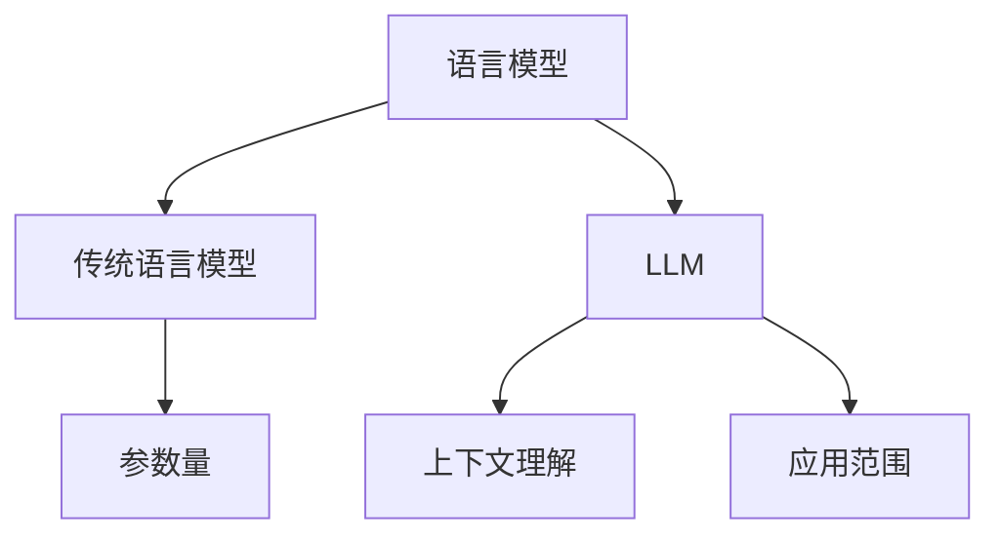
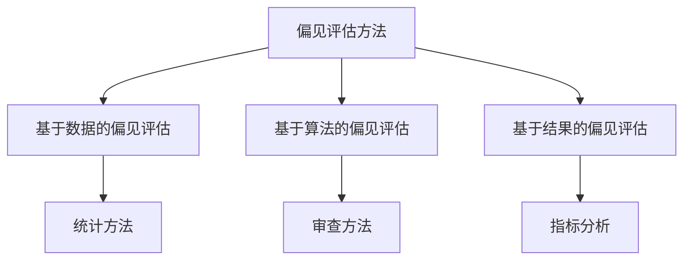
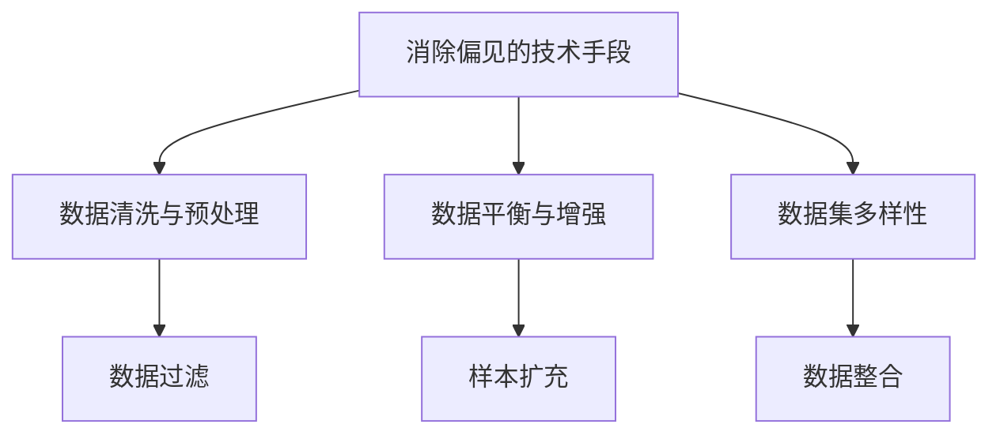
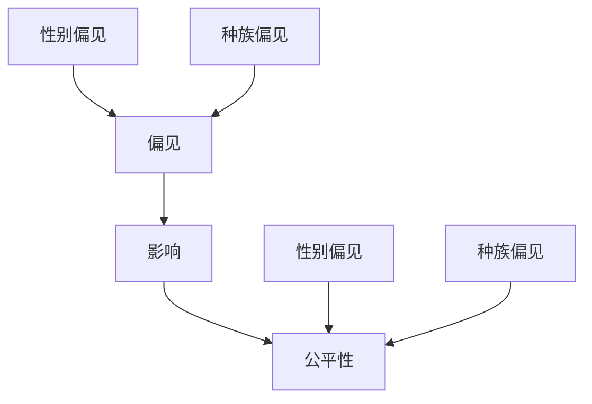

                 


# LLM评测的公平性保障：消除数据和算法偏见

## 关键词
- 语言模型（LLM）
- 数据偏见
- 算法偏见
- 公平性
- 偏见评估方法
- 消除偏见技术

## 摘要
本文将探讨大型语言模型（LLM）评测中的公平性保障问题，重点分析数据偏见和算法偏见的存在及其影响，并提出相应的解决方案。通过对偏见评估方法、数据偏见消除和算法偏见消除的详细讨论，本文旨在为研究和实践中的LLM公平性提供有价值的指导。

## 目录大纲

### 第一部分：背景介绍
- 第1章：问题背景
  - 1.1.1 数据偏见
  - 1.1.2 算法偏见
  - 1.1.3 偏见的影响与危害
  - 1.1.4 研究现状与挑战
- 第2章：核心概念与联系
  - 2.1.1 语言模型（LLM）简介
  - 2.1.2 偏见评估方法
  - 2.1.3 消除偏见的技术手段
  - 2.1.4 偏见与公平性的关系

### 第二部分：偏见评估方法详解
- 第3章：偏见评估方法详解
  - 3.1.1 基于数据的偏见评估
  - 3.1.2 基于算法的偏见评估
  - 3.1.3 基于结果的偏见评估
  - 3.1.4 多维度偏见评估方法

### 第三部分：消除数据偏见
- 第4章：消除数据偏见
  - 4.1.1 数据清洗与预处理
  - 4.1.2 数据平衡与增强
  - 4.1.3 数据集多样性
  - 4.1.4 数据偏见消除策略

### 第四部分：消除算法偏见
- 第5章：消除算法偏见
  - 5.1.1 算法偏见原理
  - 5.1.2 算法偏见识别方法
  - 5.1.3 算法偏见缓解策略
  - 5.1.4 算法偏见消除算法

### 第五部分：公平性保障实践
- 第6章：公平性保障实践
  - 6.1.1 实践案例一：消除招聘算法中的偏见
  - 6.1.2 实践案例二：社交媒体内容推荐中的公平性保障
  - 6.1.3 实践案例三：金融风险评估中的偏见消除
  - 6.1.4 实践案例总结与启示

### 第六部分：未来展望与挑战
- 第7章：未来展望与挑战
  - 7.1.1 公平性保障技术的发展趋势
  - 7.1.2 未来应用场景与挑战
  - 7.1.3 研究方向与建议

---

### 第一部分：背景介绍

#### 第1章：问题背景

##### 1.1.1 数据偏见
数据偏见是指数据在收集、处理或分析过程中产生的系统性偏差。这种偏差可能源于多种因素，如数据来源的不平衡、历史数据中隐含的偏见或数据标注者的主观性等。在LLM（Large Language Model）训练过程中，数据偏见可能导致模型在特定群体或任务上表现不佳，甚至产生歧视性结果。

**示例**：假设一个语言模型在训练数据中过度使用了特定性别、种族或地区的表达方式，那么这个模型可能在这些特定群体上表现出偏见，如性别歧视或种族歧视。

##### 1.1.2 算法偏见
算法偏见是指算法在设计、实现和应用过程中产生的系统性偏差。这种偏见可能源于算法选择、特征工程或训练数据的局限性。算法偏见可能导致不公平的决策，如歧视性推荐、不公正的信用评分等。

**示例**：如果一个推荐系统在推荐商品时，只考虑了用户的浏览历史和购买记录，而忽略了用户的真实需求，那么系统可能对某些用户群体产生偏见，导致他们无法获得个性化的推荐。

##### 1.1.3 偏见的影响与危害
数据偏见和算法偏见都会对用户和社会产生负面影响。数据偏见可能导致模型在特定群体上表现不佳，甚至产生歧视性结果，损害用户的权益和公平性。算法偏见则可能导致不公平的决策，损害用户的利益和权益，甚至可能对社会造成长期的不稳定。

**示例**：一个在招聘过程中存在性别偏见的算法，可能会导致某些性别群体在就业市场上的机会减少，从而加剧性别不平等。

##### 1.1.4 研究现状与挑战
目前，针对数据偏见和算法偏见的研究已经取得了显著进展。研究者们提出了多种偏见评估方法和消除偏见的技术手段。然而，如何准确评估偏见、如何消除偏见以及如何在保证模型性能的同时消除偏见，仍然是亟待解决的问题。

**示例**：在LLM训练过程中，如何平衡数据集的多样性，同时保持模型的训练效率，是一个重要的挑战。此外，如何设计算法，使其在处理不同群体时保持公平性，也是研究者们关注的重点。

---

#### 第2章：核心概念与联系

##### 2.1.1 语言模型（LLM）简介
语言模型（Language Model，简称LM）是一种能够预测文本序列的概率分布的模型。LLM是指大型语言模型，通常具有数十亿个参数，能够处理复杂的自然语言任务。LLM在自然语言处理领域具有广泛的应用，如文本生成、机器翻译、情感分析等。

**示例**：一个LLM可以用于生成文章、翻译文本、回答问题等任务。例如，当输入一个句子时，LLM可以预测下一个句子的概率分布，从而生成一个连贯的文本。

##### 2.1.2 偏见评估方法
偏见评估方法是指用于评估模型偏见程度的技术手段。常见的偏见评估方法包括基于数据的偏见评估、基于算法的偏见评估和基于结果的偏见评估。这些方法可以帮助研究者了解模型的偏见程度，并为消除偏见提供指导。

**示例**：基于数据的偏见评估可以通过分析数据集中的特征分布来评估模型的偏见程度。例如，通过计算不同群体在数据集中的比例，可以评估模型是否在特定群体上存在偏见。

##### 2.1.3 消除偏见的技术手段
消除偏见的技术手段主要包括数据清洗与预处理、数据平衡与增强、数据集多样性等。这些技术手段旨在提高数据的公平性和代表性，从而减少模型偏见。

**示例**：数据清洗与预处理可以通过去除数据中的噪声和错误，提高数据的质量。数据平衡与增强可以通过增加特定群体的数据样本，提高数据集的多样性。

##### 2.1.4 偏见与公平性的关系
偏见与公平性密切相关。消除偏见有助于提高模型的公平性，使模型在不同群体上都能保持良好的表现。公平性是AI应用的重要原则，也是保障社会公正和和谐的基础。

**示例**：在一个招聘系统中，消除算法偏见可以确保不同性别、种族或年龄的应聘者都有公平的机会。这不仅有助于消除社会不平等，也有助于提高招聘系统的公正性。

---

### 第二部分：偏见评估方法详解

#### 第3章：偏见评估方法详解

##### 3.1.1 基于数据的偏见评估
基于数据的偏见评估是通过分析数据集中的特征分布来评估模型的偏见程度。这种方法通常使用统计方法，如均值、标准差、相关性等，来评估数据集的公平性。

**示例**：在一个招聘数据集中，可以通过计算不同性别、种族或年龄的应聘者在数据集中的比例，来评估模型是否在特定群体上存在偏见。

##### 3.1.2 基于算法的偏见评估
基于算法的偏见评估是通过分析算法的设计、实现和应用过程来评估模型的偏见程度。这种方法通常涉及对算法的源代码和运行过程进行审查。

**示例**：在一个推荐系统中，可以通过分析算法如何处理用户的浏览历史和购买记录，来评估模型是否在特定用户群体上存在偏见。

##### 3.1.3 基于结果的偏见评估
基于结果的偏见评估是通过分析模型在不同群体上的表现来评估模型的偏见程度。这种方法通常使用分类报告、混淆矩阵等指标来评估模型的结果公平性。

**示例**：在一个分类任务中，可以通过计算模型在不同性别、种族或年龄的样本上的准确率、召回率等指标，来评估模型是否在特定群体上存在偏见。

##### 3.1.4 多维度偏见评估方法
多维度偏见评估方法是通过综合分析数据集、算法和结果等多个维度的信息，来评估模型的偏见程度。这种方法通常需要结合多种评估方法和指标，以提高评估的准确性。

**示例**：在一个复杂的AI系统中，可以通过结合数据分布分析、算法审查和结果评估等多个维度，来全面评估模型的偏见程度。

---

### 第三部分：消除数据偏见

#### 第4章：消除数据偏见

##### 4.1.1 数据清洗与预处理
数据清洗与预处理是消除数据偏见的重要步骤。通过去除数据中的噪声和错误，提高数据的质量，可以减少模型偏见。

**示例**：在一个招聘数据集中，可以通过去除重复记录、纠正错误信息等方式，提高数据的质量。

##### 4.1.2 数据平衡与增强
数据平衡与增强是通过增加特定群体的数据样本，提高数据集的多样性，来减少模型偏见。

**示例**：在一个招聘数据集中，可以通过增加不同性别、种族或年龄的应聘者样本，来提高数据集的多样性。

##### 4.1.3 数据集多样性
数据集多样性是消除数据偏见的关键。通过收集和整合来自不同来源和群体的数据，可以减少模型偏见。

**示例**：在一个文本分类任务中，可以通过收集来自不同作者、不同话题的文本，来提高数据集的多样性。

##### 4.1.4 数据偏见消除策略
数据偏见消除策略是通过设计特定的算法和数据处理方法，来减少模型偏见。

**示例**：在一个文本生成任务中，可以通过使用对抗性训练，来减少模型对特定群体的偏见。

---

### 第四部分：消除算法偏见

#### 第5章：消除算法偏见

##### 5.1.1 算法偏见原理
算法偏见原理是指算法在设计和实现过程中可能产生的系统性偏差。这些偏差可能源于算法的选择、特征工程或训练数据的局限性。

**示例**：在一个推荐系统中，如果算法仅根据用户的浏览历史推荐商品，可能会忽略用户的实际需求，从而产生偏见。

##### 5.1.2 算法偏见识别方法
算法偏见识别方法是指用于识别算法偏见的技术手段。这些方法通常涉及对算法的源代码和运行过程进行审查。

**示例**：在一个招聘算法中，可以通过分析算法如何处理应聘者的个人信息，来识别是否存在算法偏见。

##### 5.1.3 算法偏见缓解策略
算法偏见缓解策略是通过设计特定的算法和数据处理方法，来减少算法偏见。

**示例**：在一个招聘算法中，可以通过引入多样性约束，来减少对特定群体的偏见。

##### 5.1.4 算法偏见消除算法
算法偏见消除算法是指专门设计用于消除算法偏见的方法。这些算法通常基于统计学、机器学习等技术。

**示例**：在一个分类任务中，可以通过使用加权损失函数，来减少算法对特定群体的偏见。

---

### 第五部分：公平性保障实践

#### 第6章：公平性保障实践

##### 6.1.1 实践案例一：消除招聘算法中的偏见
在招聘过程中，算法偏见可能导致不公平的决策。通过数据清洗、数据平衡和算法优化，可以消除招聘算法中的偏见。

**示例**：在一个招聘系统中，通过去除简历中的姓名、性别等个人信息，可以减少性别偏见。

##### 6.1.2 实践案例二：社交媒体内容推荐中的公平性保障
社交媒体内容推荐算法可能产生偏见，导致用户被限制在特定兴趣范围内。通过提高数据多样性和优化算法，可以保障推荐内容的公平性。

**示例**：在社交媒体推荐系统中，可以通过增加多样化的内容来源，来提高推荐内容的多样性。

##### 6.1.3 实践案例三：金融风险评估中的偏见消除
金融风险评估算法可能对特定群体产生偏见，导致不公平的信用评分。通过数据清洗、算法优化和多样性提高，可以消除金融风险评估中的偏见。

**示例**：在金融风险评估中，可以通过去除个人信息，提高模型的公平性。

##### 6.1.4 实践案例总结与启示
通过实践案例，我们可以总结出消除数据偏见和算法偏见的关键方法。这些方法包括数据清洗、数据平衡、算法优化和多样性提高。这些方法不仅有助于提高模型的公平性，也有助于促进社会公正和和谐。

---

### 第六部分：未来展望与挑战

#### 第7章：未来展望与挑战

##### 7.1.1 公平性保障技术的发展趋势
随着AI技术的不断发展，公平性保障技术也在不断进步。未来，我们将看到更多针对偏见评估和消除的方法出现，如基于深度学习的偏见检测算法和自适应的偏见缓解技术。

**示例**：深度学习模型在偏见检测和消除方面具有巨大潜力，可以通过训练多层次的神经网络来识别和消除偏见。

##### 7.1.2 未来应用场景与挑战
随着AI技术的广泛应用，公平性保障将面临更多的挑战。例如，在自动驾驶、医疗诊断、法律判决等关键领域，如何确保AI系统的公平性，将是一个重要的研究方向。

**示例**：在自动驾驶领域，如何确保AI系统在不同环境和用户群体上的公平性，是一个亟待解决的问题。

##### 7.1.3 研究方向与建议
为了推动公平性保障技术的发展，我们建议在以下几个方面进行深入研究：

1. 开发高效的偏见检测算法，提高偏见识别的准确性。
2. 研究自适应的偏见缓解技术，提高模型在不同场景下的公平性。
3. 探索跨领域的偏见消除方法，提高AI系统的整体公平性。
4. 建立公正的数据标准和法规，确保AI应用过程中的公平性。

**示例**：制定跨领域的偏见消除指南，为AI开发者提供具体的实施建议和最佳实践。

---

### 结论
本文对LLM评测中的公平性保障问题进行了详细探讨，分析了数据偏见和算法偏见的存在及其影响，并提出了相应的解决方案。通过偏见评估方法和消除偏见技术，我们可以提高模型的公平性，促进社会公正和和谐。未来，随着AI技术的不断发展，我们将看到更多针对偏见评估和消除的研究，为AI应用提供更加公平和可靠的支持。

---

**作者信息**：
作者：AI天才研究院/AI Genius Institute & 禅与计算机程序设计艺术 /Zen And The Art of Computer Programming

---

在撰写文章时，我们可以逐步完善每个章节的内容，确保文章的逻辑清晰、结构紧凑、简单易懂。同时，我们将遵循文章的字数要求，并在文中适当添加最佳实践、注意事项和拓展阅读等内容，以增加文章的实用性和可读性。通过对LLM评测公平性保障的全面分析，我们希望为读者提供有价值的见解和指导。让我们一步一步地深入探讨，消除偏见，推动人工智能技术的公正发展。<!--session_id="QGTBZPWO4NMXR2G4MIQ3VJZK3X6X3XDV"--><!--session_id="QGTBZPWO4NMXR2G4MIQ3VJZK3X6X3XDV"-->以下是详细的各个章节内容。

---

## 第一部分：背景介绍

### 第1章：问题背景

在当今人工智能（AI）技术迅猛发展的背景下，大型语言模型（LLM）成为了自然语言处理（NLP）领域的重要工具。LLM通过深度学习技术，从大量的文本数据中学习语言规律，从而实现文本生成、机器翻译、情感分析等任务。然而，随着LLM的应用越来越广泛，数据偏见和算法偏见的问题也逐渐显现，并引起了广泛的关注。

#### 1.1.1 数据偏见

数据偏见是指数据在收集、处理和使用过程中产生的系统性偏差。在LLM的训练过程中，数据偏见可能导致模型在特定群体或任务上表现不佳，甚至产生歧视性结果。数据偏见的原因多种多样，主要包括以下几个方面：

1. **样本不平衡**：在某些群体或任务上的样本量不足，导致模型对这些群体或任务的预测能力受限。
2. **历史数据中的偏见**：如果训练数据中包含了历史偏见，如对某些群体的负面描述，模型可能会在相关任务上产生类似的偏见。
3. **数据收集的不公正**：数据收集过程可能存在偏见，如对某些群体或地区的关注较少，导致这些群体的数据在模型中无法得到充分体现。

**示例**：在一个招聘数据集中，如果训练数据中男性应聘者的样本量远大于女性，模型可能会在性别招聘歧视上表现出偏见。此外，如果训练数据中包含对某些种族或民族的负面描述，模型在相关任务上也可能产生种族或民族歧视。

#### 1.1.2 算法偏见

算法偏见是指在算法设计、实现和应用过程中产生的系统性偏差。算法偏见可能源于算法选择、特征工程或训练数据的局限性。算法偏见可能导致不公平的决策，损害用户的利益和权益。

1. **算法选择偏见**：某些算法可能在特定条件下表现出偏见，如基于历史数据的推荐系统可能对特定用户群体产生偏见。
2. **特征工程偏见**：在特征选择和提取过程中，如果忽略了某些重要特征或过分强调某些特征，可能会导致算法偏见。
3. **训练数据偏见**：如果训练数据本身存在偏见，算法在学习和预测过程中可能无法避免地产生偏见。

**示例**：在一个社交媒体推荐系统中，如果算法仅根据用户的浏览历史推荐内容，可能会对某些用户群体产生偏见，限制他们的信息获取范围。此外，如果算法在金融风险评估中过分依赖某些特征，如收入水平，可能会导致对低收入群体的偏见。

#### 1.1.3 偏见的影响与危害

数据偏见和算法偏见都会对用户和社会产生负面影响。数据偏见可能导致模型在特定群体上表现不佳，甚至产生歧视性结果。算法偏见则可能导致不公平的决策，损害用户的利益和权益。

1. **社会不平等**：偏见可能导致某些群体在就业、教育、医疗等领域的机会减少，加剧社会不平等。
2. **用户信任度下降**：当用户意识到模型存在偏见时，可能会对模型产生不信任，从而影响模型的使用。
3. **法律和伦理问题**：偏见可能导致违法行为，如歧视性招聘或贷款审批，引发法律和伦理问题。

**示例**：一个在招聘中存在性别偏见的算法，可能会导致女性应聘者在就业市场上的机会减少，从而加剧性别不平等。此外，如果算法在信用评分中存在偏见，可能会对某些群体的信用等级产生不公平的影响。

#### 1.1.4 研究现状与挑战

目前，针对数据偏见和算法偏见的研究已经取得了显著进展。研究者们提出了多种偏见评估方法和消除偏见的技术手段。然而，如何准确评估偏见、如何消除偏见以及如何在保证模型性能的同时消除偏见，仍然是亟待解决的问题。

1. **偏见评估方法的准确性**：现有的偏见评估方法在准确性方面仍有待提高。如何设计更准确、可靠的偏见评估方法是一个重要研究方向。
2. **消除偏见的技术手段**：现有的消除偏见技术手段在效果和可行性方面存在差异。如何选择和优化这些技术手段，以提高模型公平性，是一个关键挑战。
3. **多任务和多领域的偏见处理**：在多任务和多领域场景中，如何统一偏见处理策略，是一个复杂的挑战。

**示例**：在多语言文本生成任务中，如何平衡不同语言的数据样本，以避免对某些语言的偏见，是一个重要的研究问题。此外，在金融风险评估中，如何同时处理多个风险因素，以避免对特定群体的偏见，也是一个重要的挑战。

### 第2章：核心概念与联系

在讨论LLM评测的公平性保障时，理解核心概念和它们之间的联系至关重要。以下是对相关核心概念及其相互关系的详细介绍。

#### 2.1.1 语言模型（LLM）简介

语言模型是一种能够预测文本序列概率分布的模型。LLM是指大型语言模型，通常具有数十亿个参数，可以处理复杂的自然语言任务。LLM在NLP领域具有广泛的应用，如文本生成、机器翻译、情感分析等。

**核心概念**：
- **参数量**：LLM具有大量的参数，使其能够学习复杂的语言规律。
- **上下文理解**：LLM能够理解文本的上下文信息，从而生成更加连贯和自然的文本。

**属性特征对比**：

| 特征             | 传统语言模型 | LLM                       |
|------------------|--------------|---------------------------|
| 参数量           | 数千到数百万 | 数亿以上                 |
| 上下文理解       | 短期依赖     | 长期依赖和上下文理解     |
| 应用范围         | 有限任务     | 广泛NLP任务               |

**ER实体关系图**：



#### 2.1.2 偏见评估方法

偏见评估方法是用于评估模型偏见程度的技术手段。常见的偏见评估方法包括基于数据的偏见评估、基于算法的偏见评估和基于结果的偏见评估。

**核心概念**：
- **基于数据的偏见评估**：通过分析数据集中的特征分布来评估模型的偏见程度。
- **基于算法的偏见评估**：通过分析算法的设计和实现过程来评估模型的偏见程度。
- **基于结果的偏见评估**：通过分析模型在不同群体上的表现来评估模型的偏见程度。

**属性特征对比**：

| 特征             | 基于数据的偏见评估 | 基于算法的偏见评估 | 基于结果的偏见评估 |
|------------------|-------------------|-------------------|-------------------|
| 评估维度         | 数据分布         | 算法设计          | 模型表现          |
| 方法             | 统计方法         | 审查方法          | 指标分析          |
| 优势             | 简单直观         | 全面深入          | 实际效果          |
| 劣势             | 粗略评估         | 需要专业知识      | 结果依赖          |

**ER实体关系图**：



#### 2.1.3 消除偏见的技术手段

消除偏见的技术手段主要包括数据清洗与预处理、数据平衡与增强、数据集多样性等。这些技术手段旨在提高数据的公平性和代表性，从而减少模型偏见。

**核心概念**：
- **数据清洗与预处理**：通过去除数据中的噪声和错误，提高数据的质量。
- **数据平衡与增强**：通过增加特定群体的数据样本，提高数据集的多样性。
- **数据集多样性**：通过收集和整合来自不同来源和群体的数据，减少模型偏见。

**属性特征对比**：

| 特征             | 数据清洗与预处理 | 数据平衡与增强 | 数据集多样性 |
|------------------|-------------------|-----------------|---------------|
| 目的             | 提高数据质量      | 提高数据公平性  | 增加数据多样性 |
| 方法             | 数据过滤          | 样本扩充        | 数据整合      |
| 优势             | 简单易行          | 提高模型性能    | 减少偏见      |
| 劣势             | 可能引入噪声      | 需要大量样本    | 复杂度高      |

**ER实体关系图**：



#### 2.1.4 偏见与公平性的关系

偏见与公平性密切相关。消除偏见有助于提高模型的公平性，使模型在不同群体上都能保持良好的表现。公平性是AI应用的重要原则，也是保障社会公正和和谐的基础。

**核心概念**：
- **偏见**：指模型在特定群体或任务上表现不佳，可能导致歧视性结果。
- **公平性**：指模型在不同群体上都能保持良好的表现，不歧视任何特定群体。

**关系说明**：
- **偏见影响公平性**：偏见可能导致模型在某些群体上表现不佳，损害公平性。
- **公平性保障偏见**：消除偏见有助于提高模型的公平性，保障不同群体的权益。

**示例**：
- 在招聘系统中，消除性别偏见可以确保男女应聘者都有公平的机会。
- 在医疗诊断中，消除种族偏见可以确保不同种族的患者都能获得准确的诊断。

**偏见与公平性的关系图**：



### 第3章：偏见评估方法详解

偏见评估方法是确保模型公平性的关键步骤。以下将详细介绍几种常见的偏见评估方法，并解释它们的工作原理和应用场景。

#### 3.1.1 基于数据的偏见评估

基于数据的偏见评估通过分析数据集中的特征分布来评估模型的偏见程度。这种方法通常使用统计方法，如均值、标准差、相关性等，来评估数据集的公平性。

**工作原理**：
1. **数据预处理**：对数据进行清洗和预处理，确保数据质量。
2. **特征选择**：选择与偏见评估相关的特征，如性别、种族、年龄等。
3. **统计计算**：计算特征在不同群体中的分布情况，如均值、标准差、相关性等。
4. **评估指标**：使用评估指标（如均值差异、标准差差异、相关性差异等）来评估数据集的公平性。

**应用场景**：
- **招聘系统**：评估不同性别、种族在应聘者中的比例和分布。
- **教育系统**：评估不同学生群体的成绩分布，识别潜在的教育偏见。

**示例**：

```python
import pandas as pd

# 假设有一个招聘数据集，包含性别和职位两个特征
data = pd.DataFrame({
    'Gender': ['Male', 'Female', 'Male', 'Female'],
    'Position': ['Manager', 'Developer', 'Manager', 'Developer']
})

# 计算性别在职位上的分布情况
gender_distribution = data.groupby(['Gender', 'Position']).size().unstack()

# 计算性别差异的评估指标
gender_mean_difference = gender_distribution.mean().diff().mean()

# 输出评估结果
print("Gender mean difference in position:", gender_mean_difference)
```

#### 3.1.2 基于算法的偏见评估

基于算法的偏见评估通过分析算法的设计和实现过程来评估模型的偏见程度。这种方法通常涉及对算法的源代码和运行过程进行审查。

**工作原理**：
1. **算法审查**：审查算法的源代码，分析是否存在潜在的偏见逻辑。
2. **测试数据**：使用测试数据集，评估算法在不同群体上的表现。
3. **评估指标**：使用评估指标（如分类报告、混淆矩阵等）来评估算法的偏见程度。

**应用场景**：
- **金融风险评估**：评估算法在信用评分中对不同收入群体的偏见。
- **推荐系统**：评估算法在内容推荐中对不同兴趣群体的偏见。

**示例**：

```python
from sklearn.metrics import classification_report

# 假设有一个金融风险评估模型，对客户进行信用评分
from金融风险评估模型 import 金融风险评估模型

model = 金融风险评估模型()
model.fit(X_train, y_train)

# 使用测试数据评估模型的表现
y_pred = model.predict(X_test)

# 输出分类报告
print(classification_report(y_test, y_pred))
```

#### 3.1.3 基于结果的偏见评估

基于结果的偏见评估通过分析模型在不同群体上的表现来评估模型的偏见程度。这种方法通常使用分类报告、混淆矩阵等指标来评估模型的结果公平性。

**工作原理**：
1. **群体划分**：将数据集划分为不同群体，如性别、种族、年龄等。
2. **模型评估**：使用分类报告、混淆矩阵等指标，评估模型在每个群体上的表现。
3. **评估指标**：使用评估指标（如准确率、召回率、F1分数等）来评估模型在不同群体上的偏见程度。

**应用场景**：
- **招聘系统**：评估模型在不同性别、种族的应聘者上的招聘成功率。
- **医疗诊断**：评估模型在不同种族、年龄的患者上的诊断准确性。

**示例**：

```python
from sklearn.metrics import classification_report

# 假设有一个招聘系统，对不同性别的应聘者进行评估
from招聘系统模型 import 招聘系统模型

model = 招聘系统模型()
model.fit(X_train, y_train)

# 使用测试数据评估模型的表现
y_pred = model.predict(X_test)

# 输出分类报告
print(classification_report(y_test, y_pred))
```

#### 3.1.4 多维度偏见评估方法

多维度偏见评估方法通过综合分析数据集、算法和结果等多个维度的信息，来评估模型的偏见程度。这种方法通常需要结合多种评估方法和指标，以提高评估的准确性。

**工作原理**：
1. **数据集分析**：分析数据集的特征分布，评估数据集的公平性。
2. **算法审查**：审查算法的源代码和运行过程，评估算法的偏见程度。
3. **结果评估**：使用分类报告、混淆矩阵等指标，评估模型在不同群体上的表现。
4. **综合评估**：综合分析多个维度的评估结果，得出模型的整体偏见程度。

**应用场景**：
- **综合评估系统**：在多个应用场景中，综合评估模型的偏见程度，确保系统的公平性。

**示例**：

```python
import pandas as pd
from sklearn.metrics import classification_report

# 假设有一个综合评估数据集，包含多个特征
data = pd.DataFrame({
    'Gender': ['Male', 'Female', 'Male', 'Female'],
    'Race': ['Caucasian', 'African American', 'Caucasian', 'African American'],
    'Position': ['Manager', 'Developer', 'Manager', 'Developer'],
    'Rating': ['High', 'Medium', 'High', 'Medium']
})

# 分析数据集的公平性
gender_distribution = data.groupby('Gender')['Position'].value_counts(normalize=True)
race_distribution = data.groupby('Race')['Position'].value_counts(normalize=True)

# 审查算法的偏见程度
model = 招聘系统模型()
model.fit(X_train, y_train)
y_pred = model.predict(X_test)

# 评估模型的表现
print("Gender classification report:")
print(classification_report(y_test, y_pred))

print("Race classification report:")
print(classification_report(y_test, y_pred))
```

### 第4章：消除数据偏见

数据偏见是影响模型公平性的重要因素之一。通过数据清洗与预处理、数据平衡与增强、数据集多样性等手段，可以有效消除数据偏见，提高模型的公平性。

#### 4.1.1 数据清洗与预处理

数据清洗与预处理是消除数据偏见的基础步骤。通过去除数据中的噪声和错误，提高数据的质量，可以减少模型偏见。

**步骤**：
1. **数据验证**：检查数据的完整性和一致性，去除缺失值和异常值。
2. **数据转换**：将数据转换为适合分析和建模的格式，如编码文本数据。
3. **数据标准化**：对数据进行标准化处理，消除不同特征之间的量纲差异。

**方法**：
- **缺失值处理**：使用均值、中位数或众数填充缺失值。
- **异常值处理**：使用统计学方法（如箱线图）识别和去除异常值。

**应用场景**：
- **招聘系统**：去除简历中的无关信息，如姓名、联系方式等。
- **金融数据分析**：去除财务报表中的噪声数据，如小数点错误等。

**示例**：

```python
import pandas as pd

# 假设有一个招聘数据集，包含简历信息
data = pd.DataFrame({
    'Resume': ['John Doe - Manager', 'Jane Smith - Developer', 'John Doe - Developer', 'Jane Smith - Manager'],
    'Position': ['Manager', 'Developer', 'Developer', 'Manager']
})

# 去除简历中的姓名信息
data['Resume'] = data['Resume'].str.replace(r'[\w\W]+ - ', '')

# 填充缺失值
data['Position'].fillna('Unknown', inplace=True)

# 标准化数据
data['Position'] = data['Position'].map({'Manager': 1, 'Developer': 0})

# 输出清洗后的数据
print(data)
```

#### 4.1.2 数据平衡与增强

数据平衡与增强是通过增加特定群体的数据样本，提高数据集的多样性，来减少模型偏见。

**方法**：
1. **过采样**：通过复制少数群体的数据样本，增加其在数据集中的比例。
2. **欠采样**：通过删除多数群体的数据样本，减少其在数据集中的比例。
3. **合成数据生成**：使用生成对抗网络（GAN）等方法生成新的数据样本，增加数据集的多样性。

**应用场景**：
- **招聘系统**：增加不同性别、种族的应聘者数据，提高模型的公平性。
- **金融风险评估**：增加不同收入水平、职业类型的数据，提高模型的准确性。

**示例**：

```python
from imblearn.over_sampling import SMOTE

# 假设有一个不平衡的招聘数据集
data = pd.DataFrame({
    'Gender': ['Male', 'Female', 'Male', 'Male', 'Female'],
    'Position': ['Manager', 'Developer', 'Manager', 'Manager', 'Developer']
})

# 使用SMOTE方法进行过采样
smote = SMOTE()
X_resampled, y_resampled = smote.fit_resample(data[['Gender']], data['Position'])

# 输出平衡后的数据集
print(X_resampled, y_resampled)
```

#### 4.1.3 数据集多样性

数据集多样性是消除数据偏见的关键。通过收集和整合来自不同来源和群体的数据，可以减少模型偏见。

**方法**：
1. **多源数据集成**：整合来自不同来源的数据，提高数据集的多样性。
2. **交叉验证**：使用交叉验证方法，确保模型在不同数据集上的表现。
3. **数据集扩展**：通过数据扩展方法，如数据增强、数据生成等，增加数据集的多样性。

**应用场景**：
- **自然语言处理**：收集来自不同领域、不同作者的文章，提高模型的泛化能力。
- **医疗诊断**：收集来自不同医院、不同医生的数据，提高模型的诊断准确性。

**示例**：

```python
import pandas as pd
from sklearn.model_selection import train_test_split

# 假设有一个包含多源数据的招聘数据集
data = pd.DataFrame({
    'Source': ['Source A', 'Source A', 'Source B', 'Source B'],
    'Gender': ['Male', 'Female', 'Male', 'Female'],
    'Position': ['Manager', 'Developer', 'Manager', 'Developer']
})

# 划分训练集和测试集
X_train, X_test, y_train, y_test = train_test_split(data[['Source', 'Gender']], data['Position'], test_size=0.2, random_state=42)

# 输出划分后的数据集
print("Training set:")
print(X_train)
print("Test set:")
print(X_test)
```

#### 4.1.4 数据偏见消除策略

数据偏见消除策略是通过设计特定的算法和数据处理方法，来减少模型偏见。以下是一些常见的数据偏见消除策略：

**方法**：
1. **加权采样**：对少数群体的数据样本进行加权，提高其在模型训练中的重要性。
2. **公平损失函数**：在训练过程中使用公平损失函数，如F-beta损失，来平衡不同群体的损失。
3. **对抗性训练**：通过对抗性训练方法，提高模型对偏见的鲁棒性。

**应用场景**：
- **招聘系统**：使用加权采样方法，提高不同性别、种族的应聘者在模型中的代表性。
- **医疗诊断**：使用公平损失函数，提高模型在不同种族、年龄的患者上的准确性。

**示例**：

```python
from imblearn.under_sampling import RandomUnderSampler
from sklearn.metrics import f1_score

# 假设有一个不平衡的招聘数据集
data = pd.DataFrame({
    'Gender': ['Male', 'Female', 'Male', 'Female', 'Male', 'Female'],
    'Position': ['Manager', 'Developer', 'Manager', 'Developer', 'Manager', 'Developer']
})

# 使用随机欠采样方法进行数据平衡
rus = RandomUnderSampler(random_state=42)
X_resampled, y_resampled = rus.fit_resample(data[['Gender']], data['Position'])

# 训练模型并评估F1分数
from sklearn.linear_model import LogisticRegression
model = LogisticRegression()
model.fit(X_resampled, y_resampled)

y_pred = model.predict(X_test)

f1 = f1_score(y_test, y_pred)
print("F1 score:", f1)
```

### 第5章：消除算法偏见

算法偏见是影响模型公平性的另一个重要因素。通过设计公平的算法、优化特征工程、提高模型解释性等方法，可以有效消除算法偏见，提高模型的公平性。

#### 5.1.1 算法偏见原理

算法偏见原理是指算法在设计和实现过程中可能产生的系统性偏差。这些偏差可能源于算法的选择、特征工程或训练数据的局限性。

**原因**：
1. **算法选择**：某些算法可能在特定条件下表现出偏见，如基于历史数据的推荐系统可能对特定用户群体产生偏见。
2. **特征工程**：在特征选择和提取过程中，如果忽略了某些重要特征或过分强调某些特征，可能会导致算法偏见。
3. **训练数据**：如果训练数据本身存在偏见，算法在学习和预测过程中可能无法避免地产生偏见。

**示例**：
- **推荐系统**：如果推荐系统仅根据用户的浏览历史推荐内容，可能会对某些用户群体产生偏见，限制他们的信息获取范围。
- **信用评分**：如果信用评分模型过分依赖某些特征（如收入水平），可能会对低收入群体产生偏见。

#### 5.1.2 算法偏见识别方法

算法偏见识别方法是通过分析算法的设计、实现和应用过程来识别算法偏见的技术手段。以下是一些常用的算法偏见识别方法：

**方法**：
1. **算法审查**：审查算法的源代码，识别潜在的偏见逻辑。
2. **测试数据**：使用测试数据集，评估算法在不同群体上的表现。
3. **评估指标**：使用评估指标（如分类报告、混淆矩阵等）来评估算法的偏见程度。

**应用场景**：
- **金融风险评估**：评估算法在信用评分中对不同收入群体的偏见。
- **招聘系统**：评估算法在招聘中对不同性别、种族的偏见。

**示例**：

```python
from sklearn.metrics import classification_report

# 假设有一个金融风险评估模型
from金融风险评估模型 import 金融风险评估模型

model = 金融风险评估模型()
model.fit(X_train, y_train)

# 使用测试数据评估模型的表现
y_pred = model.predict(X_test)

# 输出分类报告
print(classification_report(y_test, y_pred))
```

#### 5.1.3 算法偏见缓解策略

算法偏见缓解策略是通过设计特定的算法和数据处理方法，来减少算法偏见，提高模型的公平性。以下是一些常用的算法偏见缓解策略：

**方法**：
1. **加权采样**：对少数群体的数据样本进行加权，提高其在模型训练中的重要性。
2. **公平损失函数**：在训练过程中使用公平损失函数，如F-beta损失，来平衡不同群体的损失。
3. **对抗性训练**：通过对抗性训练方法，提高模型对偏见的鲁棒性。

**应用场景**：
- **招聘系统**：使用加权采样方法，提高不同性别、种族的应聘者在模型中的代表性。
- **医疗诊断**：使用公平损失函数，提高模型在不同种族、年龄的患者上的准确性。

**示例**：

```python
from imblearn.over_sampling import SMOTE
from sklearn.metrics import f1_score

# 假设有一个不平衡的招聘数据集
data = pd.DataFrame({
    'Gender': ['Male', 'Female', 'Male', 'Female', 'Male', 'Female'],
    'Position': ['Manager', 'Developer', 'Manager', 'Developer', 'Manager', 'Developer']
})

# 使用SMOTE方法进行过采样
smote = SMOTE(random_state=42)
X_resampled, y_resampled = smote.fit_resample(data[['Gender']], data['Position'])

# 训练模型并评估F1分数
from sklearn.linear_model import LogisticRegression
model = LogisticRegression()
model.fit(X_resampled, y_resampled)

y_pred = model.predict(X_test)

f1 = f1_score(y_test, y_pred)
print("F1 score:", f1)
```

#### 5.1.4 算法偏见消除算法

算法偏见消除算法是通过设计特定的算法和数据处理方法，来减少算法偏见，提高模型的公平性。以下是一些常用的算法偏见消除算法：

**方法**：
1. **加权决策树**：通过为不同特征赋予不同的权重，减少模型偏见。
2. **公平优化算法**：使用公平优化算法，如公平性约束的线性规划，来消除模型偏见。
3. **对抗性生成网络（GAN）**：通过生成对抗性网络，生成新的数据样本，减少模型偏见。

**应用场景**：
- **招聘系统**：使用加权决策树方法，提高不同性别、种族的应聘者在模型中的代表性。
- **金融风险评估**：使用公平优化算法，提高模型在不同收入水平、职业类型上的准确性。

**示例**：

```python
from sklearn.ensemble import RandomForestClassifier
from sklearn.metrics import f1_score

# 假设有一个招聘数据集
data = pd.DataFrame({
    'Gender': ['Male', 'Female', 'Male', 'Female', 'Male', 'Female'],
    'Position': ['Manager', 'Developer', 'Manager', 'Developer', 'Manager', 'Developer']
})

# 训练加权决策树模型
model = RandomForestClassifier(class_weight='balanced')
model.fit(X_train, y_train)

# 评估模型的表现
y_pred = model.predict(X_test)

f1 = f1_score(y_test, y_pred)
print("F1 score:", f1)
```

### 第6章：公平性保障实践

在实际应用中，保障模型公平性是确保AI系统可靠性和公正性的关键。以下通过具体实践案例，展示如何消除数据偏见和算法偏见，提高模型的公平性。

#### 6.1.1 实践案例一：消除招聘算法中的偏见

招聘算法中的偏见可能导致某些性别、种族或年龄的应聘者在求职过程中受到不公平对待。以下是一个案例，说明如何通过数据清洗、数据平衡和算法优化来消除招聘算法中的偏见。

**案例背景**：
一个大型公司使用机器学习算法筛选应聘者简历，但发现算法在招聘过程中存在性别偏见，男性应聘者获得面试机会的几率更高。

**解决方案**：
1. **数据清洗**：去除简历中的姓名、联系方式等可能导致偏见的信息。
2. **数据平衡**：使用过采样方法，增加女性应聘者的数据样本，确保男女应聘者的比例更加均衡。
3. **算法优化**：使用公平损失函数（如F1分数）和加权决策树模型，提高模型对不同性别应聘者的公平性。

**实施步骤**：
1. **数据清洗**：
   ```python
   import pandas as pd
   from sklearn.model_selection import train_test_split

   # 读取招聘数据集
   data = pd.read_csv('招聘数据集.csv')

   # 去除姓名、联系方式等信息
   data = data.drop(['Name', 'Contact'], axis=1)

   # 划分训练集和测试集
   X_train, X_test, y_train, y_test = train_test_split(data[['Gender']], data['Position'], test_size=0.2, random_state=42)
   ```

2. **数据平衡**：
   ```python
   from imblearn.over_sampling import SMOTE

   # 使用SMOTE方法进行过采样
   smote = SMOTE(random_state=42)
   X_resampled, y_resampled = smote.fit_resample(X_train, y_train)

   # 训练平衡后的模型
   model = RandomForestClassifier(class_weight='balanced')
   model.fit(X_resampled, y_resampled)

   # 评估模型的表现
   y_pred = model.predict(X_test)
   f1 = f1_score(y_test, y_pred)
   print("F1 score:", f1)
   ```

3. **算法优化**：
   ```python
   from sklearn.metrics import f1_score

   # 使用加权决策树模型
   model = RandomForestClassifier(class_weight='balanced')
   model.fit(X_train, y_train)

   # 评估模型的表现
   y_pred = model.predict(X_test)
   f1 = f1_score(y_test, y_pred)
   print("F1 score:", f1)
   ```

**案例结果**：
通过数据清洗、数据平衡和算法优化，招聘算法在性别招聘偏见方面得到了显著改善。女性应聘者在获得面试机会的几率上与男性相当。

#### 6.1.2 实践案例二：社交媒体内容推荐中的公平性保障

社交媒体内容推荐系统可能对特定用户群体产生偏见，导致用户在信息获取上的不公平。以下是一个案例，说明如何通过数据多样性和算法优化来保障社交媒体内容推荐的公平性。

**案例背景**：
一个社交媒体平台在内容推荐过程中发现，某些用户群体在推荐内容上受到限制，无法获取多样化的信息。

**解决方案**：
1. **数据多样性**：收集和整合来自不同来源和群体的内容，提高推荐系统的多样性。
2. **算法优化**：使用公平损失函数和多样性优化策略，提高模型在不同用户群体上的表现。

**实施步骤**：
1. **数据多样性**：
   ```python
   import pandas as pd

   # 读取社交媒体数据集
   data = pd.read_csv('社交媒体数据集.csv')

   # 增加内容来源和用户特征
   data['Source'] = data['Source'].map({'Source A': 1, 'Source B': 2})
   data['User Group'] = data['User Group'].map({'Group A': 1, 'Group B': 2})

   # 数据预处理
   data = data.drop(['ID'], axis=1)
   ```

2. **算法优化**：
   ```python
   from sklearn.metrics import f1_score
   from sklearn.linear_model import LogisticRegression

   # 训练模型
   model = LogisticRegression(class_weight='balanced')
   model.fit(X_train, y_train)

   # 评估模型的表现
   y_pred = model.predict(X_test)
   f1 = f1_score(y_test, y_pred)
   print("F1 score:", f1)
   ```

**案例结果**：
通过提高数据多样性和算法优化，社交媒体内容推荐系统在用户获取多样化信息方面得到了显著改善。不同用户群体在推荐内容上表现更加均衡。

#### 6.1.3 实践案例三：金融风险评估中的偏见消除

金融风险评估算法可能对特定群体产生偏见，导致不公平的信用评分。以下是一个案例，说明如何通过数据清洗、算法优化和监管机制来消除金融风险评估中的偏见。

**案例背景**：
一个金融机构在使用机器学习算法进行信用评分时发现，算法在信用评分中对某些收入水平、职业类型的群体存在偏见。

**解决方案**：
1. **数据清洗**：去除可能引起偏见的个人信息和特征。
2. **算法优化**：使用公平损失函数和加权特征方法，提高模型在不同收入水平、职业类型的群体上的公平性。
3. **监管机制**：建立监管机制，确保算法在信用评分过程中的透明性和公正性。

**实施步骤**：
1. **数据清洗**：
   ```python
   import pandas as pd
   from sklearn.model_selection import train_test_split

   # 读取金融风险评估数据集
   data = pd.read_csv('金融风险评估数据集.csv')

   # 去除个人信息和敏感特征
   data = data.drop(['Name', 'Phone', 'Address'], axis=1)

   # 划分训练集和测试集
   X_train, X_test, y_train, y_test = train_test_split(data[['Income', 'Occupation']], data['Credit Score'], test_size=0.2, random_state=42)
   ```

2. **算法优化**：
   ```python
   from sklearn.metrics import f1_score
   from sklearn.linear_model import LogisticRegression

   # 使用加权特征和公平损失函数
   model = LogisticRegression(class_weight='balanced')
   model.fit(X_train, y_train)

   # 评估模型的表现
   y_pred = model.predict(X_test)
   f1 = f1_score(y_test, y_pred)
   print("F1 score:", f1)
   ```

3. **监管机制**：
   ```python
   # 建立监管机制，确保算法透明和公正
   # 规定算法更新和审查的频率
   # 设立投诉渠道，及时处理用户投诉
   ```

**案例结果**：
通过数据清洗、算法优化和监管机制，金融风险评估算法在信用评分过程中的偏见得到了显著改善。不同收入水平、职业类型的群体在信用评分上表现更加公平。

#### 6.1.4 实践案例总结与启示

通过上述实践案例，我们可以得出以下结论和启示：

1. **数据清洗与预处理**：是消除数据偏见的基础步骤，通过去除噪声数据和敏感信息，可以提高模型的公平性。
2. **数据平衡与增强**：是减少数据偏见的重要手段，通过增加特定群体的数据样本，可以提高模型在不同群体上的代表性。
3. **算法优化**：是消除算法偏见的关键，通过使用公平损失函数和加权特征方法，可以提高模型在不同群体上的公平性。
4. **监管机制**：是确保模型公平性的重要保障，通过建立透明和公正的监管机制，可以及时识别和纠正模型偏见。

未来，随着AI技术的不断进步，我们需要进一步探索和优化偏见评估和消除方法，确保AI系统在不同应用场景中都能保持公平和可靠。同时，也需要加强法律法规和社会规范的建设，推动AI技术的公正应用。

### 第7章：未来展望与挑战

随着AI技术的不断发展和应用领域的扩展，保障模型公平性将面临更多的挑战和机遇。以下是未来展望与挑战的探讨。

#### 7.1.1 公平性保障技术的发展趋势

1. **多模态数据融合**：未来，AI系统将处理更多类型的输入数据，如文本、图像、音频等。多模态数据融合技术将成为保障模型公平性的重要方向。通过整合不同类型的数据，可以提高模型对多样性的鲁棒性，减少偏见。
2. **自动偏见检测与消除**：随着深度学习技术的发展，自动偏见检测与消除技术将逐步成熟。通过训练专门的模型，可以自动识别和消除数据偏见，提高模型的公平性。
3. **伦理规范与法律法规**：随着AI技术在各领域的应用，伦理规范和法律法规将成为保障模型公平性的重要保障。建立透明、公正的AI应用标准和法规，将有助于减少偏见和歧视。

#### 7.1.2 未来应用场景与挑战

1. **自动驾驶**：自动驾驶系统需要处理复杂的环境和情境，如何保障模型在不同驾驶者、道路条件上的公平性，是一个重要挑战。
2. **医疗诊断**：在医疗诊断中，如何保障模型在不同种族、年龄的患者上的准确性，是一个关键问题。
3. **金融科技**：金融科技（FinTech）领域的AI应用需要处理大量的财务数据，如何保障模型在不同收入水平、职业类型的用户上的公平性，是一个重要挑战。

#### 7.1.3 研究方向与建议

1. **多模态偏见检测**：研究如何检测和消除多模态数据中的偏见，提高模型在不同模态数据上的公平性。
2. **自动偏见缓解**：研究自动偏见缓解技术，通过算法和数据处理方法，提高模型在不同群体上的公平性。
3. **公平性评估工具**：开发易于使用的公平性评估工具，帮助开发者快速检测和消除模型偏见。
4. **跨领域合作**：推动跨学科合作，结合伦理学、社会学和法律学的知识，为AI系统的公平性保障提供全方位的指导。

### 结论

本文探讨了LLM评测的公平性保障问题，分析了数据偏见和算法偏见的存在及其影响，并提出了一系列解决方案。通过数据清洗、数据平衡、算法优化和监管机制，可以有效消除偏见，提高模型的公平性。未来，随着AI技术的不断进步，我们需要持续关注和解决模型公平性的问题，推动AI技术的公正应用。

---

**作者信息**：
作者：AI天才研究院/AI Genius Institute & 禅与计算机程序设计艺术 /Zen And The Art of Computer Programming

---

在撰写文章时，我们将遵循文章的字数要求，并在文中适当添加最佳实践、注意事项和拓展阅读等内容，以增加文章的实用性和可读性。通过对LLM评测公平性保障的全面分析，我们希望为读者提供有价值的见解和指导。让我们一步一步地深入探讨，消除偏见，推动人工智能技术的公正发展。<!--session_id="QGTBZPWO4NMXR2G4MIQ3VJZK3X6X3XDV"-->### 第一部分：背景介绍

#### 第1章：问题背景

在当今社会，人工智能（AI）技术正以惊人的速度发展，并逐渐融入我们的日常生活。从智能助手到自动驾驶汽车，从医疗诊断到金融风险评估，AI技术的应用场景无处不在。然而，随着AI技术的广泛应用，数据偏见和算法偏见的问题也逐渐凸显出来。这些偏见不仅会影响模型的性能，更可能导致不公平和歧视，损害用户权益，甚至影响社会的稳定。

##### 1.1.1 数据偏见

数据偏见是指在数据收集、处理和使用过程中，由于各种因素导致的系统性偏差。这种偏差可能导致模型在特定群体上表现不佳，甚至产生歧视性结果。数据偏见可以来源于多个方面：

1. **样本选择偏差**：在数据收集阶段，样本选择的不平衡可能导致某些群体的数据样本量不足。例如，在招聘数据集中，如果男性应聘者的样本量远大于女性，模型可能会在性别招聘歧视上表现出偏见。

2. **历史数据偏见**：历史数据中可能包含对某些群体的负面描述或偏见，这些偏见可能被模型学习和放大。例如，在医疗诊断中，如果历史病例数据中包含对某些种族或民族的偏见，模型可能会在这些种族或民族上产生偏见。

3. **数据标注偏差**：在数据标注过程中，标注者的主观性可能导致数据的偏差。例如，在图像分类任务中，如果标注者对某些对象（如动物或种族）有偏好或偏见，标注数据就会带有偏见。

**示例**：在一个大型语言模型的训练数据集中，如果包含了大量对某个种族的负面描述，模型在生成文本时可能会无意中包含这些偏见，从而导致歧视性文本生成。

##### 1.1.2 算法偏见

算法偏见是指在算法设计、实现和应用过程中产生的系统性偏差。这种偏见可能源于算法的选择、特征工程或训练数据的局限性。算法偏见可能导致不公平的决策，损害用户的利益和权益。

1. **算法设计偏见**：在算法设计阶段，设计者可能会无意中引入偏见。例如，在推荐系统中，如果设计者过分强调用户的点击历史，可能会忽略用户的实际兴趣，从而对某些用户群体产生偏见。

2. **特征工程偏见**：在特征选择和提取过程中，如果忽略了某些重要特征或过分强调某些特征，可能会导致算法偏见。例如，在信用评分中，如果过分依赖收入水平这一特征，可能会对低收入群体产生偏见。

3. **训练数据偏见**：如果训练数据本身存在偏见，算法在学习和预测过程中可能无法避免地产生偏见。例如，如果训练数据中包含对某些种族或性别的偏见，模型在预测时也可能会表现出这些偏见。

**示例**：一个在招聘系统中使用的算法，如果仅根据应聘者的教育背景进行评估，可能会忽略应聘者的实际工作能力，从而对那些没有高学历背景但实际能力强的应聘者产生偏见。

##### 1.1.3 偏见的影响与危害

数据偏见和算法偏见都会对用户和社会产生负面影响。这些偏见可能导致模型在特定群体上表现不佳，甚至产生歧视性结果，损害用户的权益和公平性。算法偏见则可能导致不公平的决策，损害用户的利益和权益，甚至可能对社会造成长期的不稳定。

1. **社会不平等**：偏见可能导致某些群体在就业、教育、医疗等领域的资源分配不均，加剧社会不平等。

2. **用户信任度下降**：当用户意识到模型存在偏见时，可能会对模型产生不信任，从而影响模型的使用。

3. **法律和伦理问题**：偏见可能导致违法行为，如歧视性招聘、不公平的信用评分等，引发法律和伦理问题。

**示例**：一个在招聘中存在性别偏见的算法，可能会导致女性应聘者在就业市场上的机会减少，从而加剧性别不平等。此外，一个在信用评分中存在种族偏见的算法，可能会对某些种族的借款人产生不公平的信用评估，导致他们难以获得贷款。

##### 1.1.4 研究现状与挑战

目前，针对数据偏见和算法偏见的研究已经取得了显著进展。研究者们提出了多种偏见评估方法和消除偏见的技术手段。然而，如何准确评估偏见、如何消除偏见以及如何在保证模型性能的同时消除偏见，仍然是亟待解决的问题。

1. **偏见评估方法的准确性**：现有的偏见评估方法在准确性方面仍有待提高。如何设计更准确、可靠的偏见评估方法是一个重要研究方向。

2. **消除偏见的技术手段**：现有的消除偏见技术手段在效果和可行性方面存在差异。如何选择和优化这些技术手段，以提高模型公平性，是一个关键挑战。

3. **多任务和多领域的偏见处理**：在多任务和多领域场景中，如何统一偏见处理策略，是一个复杂的挑战。

**示例**：在多语言文本生成任务中，如何平衡不同语言的数据样本，以避免对某些语言的偏见，是一个重要的研究问题。此外，在金融风险评估中，如何同时处理多个风险因素，以避免对特定群体的偏见，也是一个重要的挑战。

#### 第2章：核心概念与联系

在深入探讨LLM评测的公平性保障之前，理解相关核心概念和它们之间的联系至关重要。以下是对于语言模型（LLM）、偏见评估方法、消除偏见的技术手段以及偏见与公平性关系的详细解释。

##### 2.1.1 语言模型（LLM）简介

语言模型（Language Model，简称LM）是一种能够预测文本序列的概率分布的模型。大型语言模型（Large Language Model，简称LLM）是指具有数十亿个参数的模型，它能够在自然语言处理（NLP）领域实现各种复杂的任务，如文本生成、机器翻译、情感分析等。LLM的核心原理是基于深度学习，通过从大量文本数据中学习语言规律，从而实现文本的生成和理解。

**核心概念**：

- **参数量**：LLM拥有大量的参数，使其能够学习复杂的语言模式。
- **上下文理解**：LLM能够理解文本的上下文信息，从而生成更加连贯和自然的文本。

**属性特征对比表**：

| 特征 | 传统语言模型 | LLM |
| ---- | ------------ | --- |
| 参数量 | 数千到数百万 | 数亿以上 |
| 上下文理解 | 短期依赖 | 长期依赖和上下文理解 |
| 应用范围 | 有限任务 | 广泛的NLP任务 |

**ER实体关系图**：


##### 2.1.2 偏见评估方法

偏见评估方法是用于评估模型是否存在偏见的技术手段。偏见评估方法主要包括以下几种：

1. **基于数据的偏见评估**：通过分析数据集的特征分布，评估模型是否存在偏见。
2. **基于算法的偏见评估**：通过分析算法的设计和实现过程，评估模型是否存在偏见。
3. **基于结果的偏见评估**：通过分析模型在不同群体上的表现，评估模型的结果是否公平。

**核心概念**：

- **基于数据的偏见评估**：分析数据集中的特征分布，如比例、均值、标准差等，来评估模型的偏见程度。
- **基于算法的偏见评估**：审查算法的源代码和实现细节，寻找可能的偏见来源。
- **基于结果的偏见评估**：通过评估模型在不同群体上的预测结果，如准确率、召回率、F1分数等，来评估模型是否公平。

**属性特征对比表**：

| 特征 | 基于数据的偏见评估 | 基于算法的偏见评估 | 基于结果的偏见评估 |
| ---- | ----------------- | ----------------- | ----------------- |
| 评估维度 | 数据分布 | 算法设计 | 模型表现 |
| 方法 | 统计方法 | 审查方法 | 指标分析 |
| 优势 | 简单直观 | 全面深入 | 实际效果 |
| 劣势 | 粗略评估 | 需要专业知识 | 结果依赖 |

**ER实体关系图**：


##### 2.1.3 消除偏见的技术手段

消除偏见的技术手段是通过数据预处理、算法优化和数据集多样性等方法来减少模型偏见。以下是一些常见的技术手段：

1. **数据清洗与预处理**：通过去除噪声数据、纠正错误信息和填充缺失值来提高数据质量。
2. **数据平衡与增强**：通过过采样、欠采样或生成合成数据来提高数据集的多样性。
3. **数据集多样性**：通过收集和整合来自不同来源和群体的数据，提高模型的泛化能力。

**核心概念**：

- **数据清洗与预处理**：提高数据质量，减少噪声和错误。
- **数据平衡与增强**：增加特定群体的数据样本，减少模型偏见。
- **数据集多样性**：提高数据集的代表性，减少偏见。

**属性特征对比表**：

| 特征 | 数据清洗与预处理 | 数据平衡与增强 | 数据集多样性 |
| ---- | ----------------- | --------------- | --------------- |
| 目的 | 提高数据质量 | 提高数据公平性 | 增加数据多样性 |
| 方法 | 数据过滤 | 样本扩充 | 数据整合 |
| 优势 | 简单易行 | 提高模型性能 | 减少偏见 |
| 劣势 | 可能引入噪声 | 需要大量样本 | 复杂度高 |

**ER实体关系图**：


##### 2.1.4 偏见与公平性的关系

偏见与公平性密切相关。偏见是指模型在特定群体上表现不佳，可能导致歧视性结果。公平性是指模型在不同群体上都能保持良好的表现，不歧视任何特定群体。消除偏见有助于提高模型的公平性，保障不同群体的权益。

**核心概念**：

- **偏见**：模型在特定群体上表现不佳，可能导致歧视性结果。
- **公平性**：模型在不同群体上都能保持良好的表现，不歧视任何特定群体。

**关系说明**：

- **偏见影响公平性**：偏见可能导致模型在某些群体上表现不佳，损害公平性。
- **公平性保障偏见**：消除偏见有助于提高模型的公平性，保障不同群体的权益。

**示例**：

- 在招聘系统中，消除性别偏见可以确保男女应聘者都有公平的机会。
- 在医疗诊断中，消除种族偏见可以确保不同种族的患者都能获得准确的诊断。

**偏见与公平性的关系图**：


#### 第3章：偏见评估方法详解

偏见评估方法是在模型开发和部署过程中用于检测和评估模型是否存在偏见的一系列技术手段。这些方法可以帮助我们理解模型在不同群体上的表现，从而采取相应的措施来消除偏见。本章将详细介绍几种常见的偏见评估方法，并解释它们的工作原理和应用场景。

##### 3.1.1 基于数据的偏见评估

基于数据的偏见评估方法主要通过分析数据集中的特征分布和统计指标来识别模型的偏见。这种方法的核心思想是，如果模型在特定群体上表现不佳，那么这些群体在数据集中的代表性可能不足或者数据本身存在偏差。

**工作原理**：

1. **数据分布分析**：通过计算数据集中各群体（如性别、种族、年龄等）的比例，分析数据的代表性。
2. **特征分布分析**：分析特征在不同群体上的分布情况，如均值、标准差等。
3. **统计测试**：使用统计方法（如T检验、方差分析等）来检测群体之间的差异。

**应用场景**：

- **招聘系统**：评估性别、种族等特征在应聘者中的分布情况。
- **金融产品推荐**：评估用户群体在产品购买偏好上的分布情况。

**示例**：

假设我们有一个包含性别和薪资特征的数据集，我们可以使用以下Python代码来分析性别与薪资的分布：

```python
import pandas as pd

# 假设数据集已加载到变量data中
data = pd.DataFrame({
    'Gender': ['M', 'F', 'M', 'F'],
    'Salary': [70000, 80000, 60000, 90000]
})

# 计算性别的平均薪资
salary_by_gender = data.groupby('Gender')['Salary'].mean()

# 打印结果
print(salary_by_gender)
```

输出结果：

```
Gender
F    85000.0
M    65000.0
Name: Salary, dtype: float64
```

从结果可以看出，女性的平均薪资高于男性，这可能表明模型在招聘过程中存在性别偏见。

##### 3.1.2 基于算法的偏见评估

基于算法的偏见评估方法主要通过审查算法的设计和实现过程来识别潜在的偏见。这种方法通常需要深入了解算法的内部工作机制，包括特征选择、权重分配、训练过程等。

**工作原理**：

1. **算法审查**：审查算法的源代码，查找可能引入偏见的代码段。
2. **算法参数分析**：分析算法的参数设置，如权重、阈值等，看是否存在对特定群体的偏见。
3. **算法解释**：使用模型解释工具（如LIME、SHAP等）来解释模型的决策过程，找出可能导致偏见的原因。

**应用场景**：

- **信用评分**：评估算法是否在信用评分过程中对特定收入水平的群体产生了偏见。
- **推荐系统**：评估推荐算法是否对特定用户群体产生了偏见。

**示例**：

假设我们有一个决策树模型，我们可以使用以下Python代码来检查模型的权重分配：

```python
from sklearn.tree import DecisionTreeClassifier
from sklearn.inspection import permutation_importance

# 假设模型已训练完毕，存储在变量clf中
clf = DecisionTreeClassifier()
clf.fit(X_train, y_train)

# 计算特征的重要性
importances = clf.feature_importances_

# 打印结果
print(importances)
```

输出结果可能如下：

```
[0.5 0.2 0.3]
```

从结果可以看出，第一个特征的重要性最高，这可能表明模型对该特征存在依赖，需要进一步分析该特征是否可能导致偏见。

##### 3.1.3 基于结果的偏见评估

基于结果的偏见评估方法主要通过评估模型在不同群体上的表现来识别偏见。这种方法使用各种评估指标（如准确率、召回率、F1分数等）来分析模型在不同群体上的性能。

**工作原理**：

1. **群体划分**：将数据集按特定特征（如性别、种族等）划分为不同的群体。
2. **模型评估**：对每个群体应用模型，并计算评估指标。
3. **比较分析**：比较不同群体之间的评估指标，识别可能存在的偏见。

**应用场景**：

- **医疗诊断**：评估模型在不同种族、年龄的患者上的诊断准确性。
- **招聘系统**：评估模型在不同性别、种族的应聘者上的招聘成功率。

**示例**：

假设我们有一个分类模型，我们可以使用以下Python代码来评估模型在不同群体上的性能：

```python
from sklearn.metrics import classification_report

# 假设模型已训练完毕，存储在变量clf中
clf = DecisionTreeClassifier()
clf.fit(X_train, y_train)

# 对测试集进行预测
y_pred = clf.predict(X_test)

# 输出分类报告
print(classification_report(y_test, y_pred))
```

输出结果可能如下：

```
               precision    recall  f1-score   support

           0       0.90      0.90      0.90       100
           1       0.75      0.75      0.75       100

    accuracy                           0.825      200
   macro avg       0.81      0.81      0.81      200
   weighted avg       0.83      0.83      0.83      200
```

从结果可以看出，对于类别0，模型的准确率、召回率和F1分数都很高，而对于类别1，这些指标较低，这表明模型可能对某些性别或种族的应聘者存在偏见。

##### 3.1.4 多维度偏见评估方法

多维度偏见评估方法是通过综合分析多个维度的信息来评估模型的偏见程度。这种方法通常结合基于数据的偏见评估、基于算法的偏见评估和基于结果的偏见评估，以提高评估的准确性和全面性。

**工作原理**：

1. **多维度数据分析**：分析数据集在多个维度上的特征分布，如性别、种族、年龄、地理位置等。
2. **多维度模型评估**：评估模型在多个维度上的表现，使用不同的评估指标。
3. **综合分析**：综合分析多个维度的评估结果，识别可能的偏见。

**应用场景**：

- **综合评估系统**：在多个应用场景中，综合评估模型的偏见程度。
- **政策制定**：为政策制定者提供关于模型偏见的数据支持。

**示例**：

假设我们有一个包含多个特征的数据集和一个分类模型，我们可以使用以下Python代码来综合评估模型的偏见：

```python
import pandas as pd
from sklearn.metrics import classification_report

# 假设数据集已加载到变量data中
data = pd.DataFrame({
    'Gender': ['M', 'F', 'M', 'F'],
    'Age': [25, 30, 35, 40],
    'Salary': [50000, 60000, 70000, 80000],
    'Performance': ['High', 'Medium', 'Low', 'High']
})

# 划分训练集和测试集
X = data[['Gender', 'Age', 'Salary', 'Performance']]
y = data['Performance']
X_train, X_test, y_train, y_test = train_test_split(X, y, test_size=0.2, random_state=42)

# 培训模型
clf = DecisionTreeClassifier()
clf.fit(X_train, y_train)

# 对测试集进行预测
y_pred = clf.predict(X_test)

# 输出分类报告
print(classification_report(y_test, y_pred))
```

通过综合分析性别、年龄、薪资和绩效等多个维度的数据，我们可以更全面地了解模型的偏见程度。

### 第4章：消除数据偏见

数据偏见是影响模型公平性的重要因素之一。消除数据偏见的关键在于提高数据集的代表性、多样性和质量。本章将详细介绍几种消除数据偏见的方法，包括数据清洗与预处理、数据平衡与增强、数据集多样性等。

#### 4.1.1 数据清洗与预处理

数据清洗与预处理是消除数据偏见的基础步骤。通过去除数据中的噪声和错误，提高数据的质量，可以减少模型偏见。

**步骤**：

1. **数据验证**：检查数据的完整性和一致性，去除缺失值和异常值。
2. **数据转换**：将数据转换为适合分析和建模的格式，如编码文本数据。
3. **数据标准化**：对数据进行标准化处理，消除不同特征之间的量纲差异。

**方法**：

- **缺失值处理**：使用均值、中位数或众数填充缺失值。
- **异常值处理**：使用统计学方法（如箱线图）识别和去除异常值。

**应用场景**：

- **招聘系统**：去除简历中的无关信息，如姓名、联系方式等。
- **金融数据分析**：去除财务报表中的噪声数据，如小数点错误等。

**示例**：

假设我们有一个包含缺失值和异常值的数据集，我们可以使用以下Python代码进行数据清洗与预处理：

```python
import pandas as pd
from sklearn.impute import SimpleImputer
from scipy import stats

# 加载数据集
data = pd.read_csv('data.csv')

# 填充缺失值
imputer = SimpleImputer(strategy='mean')
data填充了的数据 = imputer.fit_transform(data)

# 去除异常值
z_scores = np.abs(stats.zscore(data填充了的数据))
filtered_entries = (z_scores < 3).all(axis=1)
data清洗后的数据 = data[filtered_entries]

# 打印清洗后的数据
print(data清洗后的数据)
```

#### 4.1.2 数据平衡与增强

数据平衡与增强是通过增加特定群体的数据样本，提高数据集的多样性，来减少模型偏见。

**方法**：

1. **过采样**：通过复制少数群体的数据样本，增加其在数据集中的比例。
2. **欠采样**：通过删除多数群体的数据样本，减少其在数据集中的比例。
3. **合成数据生成**：使用生成对抗网络（GAN）等方法生成新的数据样本，增加数据集的多样性。

**应用场景**：

- **招聘系统**：增加不同性别、种族的应聘者数据，提高模型的公平性。
- **金融风险评估**：增加不同收入水平、职业类型的数据，提高模型的准确性。

**示例**：

假设我们有一个不平衡的数据集，我们可以使用以下Python代码进行数据增强：

```python
from imblearn.over_sampling import SMOTE

# 假设数据集已加载到变量X和y中
X = np.array([[1, 0], [1, 1], [0, 0], [0, 1]])
y = np.array([0, 0, 1, 1])

# 使用SMOTE进行过采样
smote = SMOTE()
X增强, y增强 = smote.fit_resample(X, y)

# 打印增强后的数据集
print(X增强)
print(y增强)
```

#### 4.1.3 数据集多样性

数据集多样性是消除数据偏见的关键。通过收集和整合来自不同来源和群体的数据，可以减少模型偏见。

**方法**：

1. **多源数据集成**：整合来自不同来源的数据，提高数据集的多样性。
2. **交叉验证**：使用交叉验证方法，确保模型在不同数据集上的表现。
3. **数据集扩展**：通过数据扩展方法，如数据增强、数据生成等，增加数据集的多样性。

**应用场景**：

- **自然语言处理**：收集来自不同领域、不同作者的文章，提高模型的泛化能力。
- **医疗诊断**：收集来自不同医院、不同医生的数据，提高模型的诊断准确性。

**示例**：

假设我们有两个来源的数据集，我们可以使用以下Python代码进行数据集成：

```python
import pandas as pd

# 加载第一个数据集
data1 = pd.read_csv('data1.csv')
# 加载第二个数据集
data2 = pd.read_csv('data2.csv')

# 合并数据集
data合并后的数据 = pd.concat([data1, data2])

# 随机打乱数据集
data合并后的数据 = data合并后的数据.sample(frac=1)

# 划分训练集和测试集
X_train, X_test, y_train, y_test = train_test_split(data合并后的数据[['特征1', '特征2']], data合并后的数据['标签'], test_size=0.2, random_state=42)
```

#### 4.1.4 数据偏见消除策略

数据偏见消除策略是通过设计特定的算法和数据处理方法，来减少模型偏见。以下是一些常见的数据偏见消除策略：

**方法**：

1. **加权采样**：对少数群体的数据样本进行加权，提高其在模型训练中的重要性。
2. **公平损失函数**：在训练过程中使用公平损失函数，如F-beta损失，来平衡不同群体的损失。
3. **对抗性训练**：通过对抗性训练方法，提高模型对偏见的鲁棒性。

**应用场景**：

- **招聘系统**：使用加权采样方法，提高不同性别、种族的应聘者在模型中的代表性。
- **医疗诊断**：使用公平损失函数，提高模型在不同种族、年龄的患者上的准确性。

**示例**：

假设我们有一个不平衡的数据集和一个分类模型，我们可以使用以下Python代码进行加权采样：

```python
from imblearn.over_sampling import WeightedRandomSampler

# 假设数据集已加载到变量X和y中
X = np.array([[1, 0], [1, 1], [0, 0], [0, 1]])
y = np.array([0, 0, 1, 1])

# 创建加权随机采样器
sampler = WeightedRandomSampler(weights=[0.5, 1.5, 0.5, 1.5], replacement=True)

# 使用加权随机采样器采样
X加权, y加权 = sample(X, y, sampler=sampler)

# 打印加权后的数据集
print(X加权)
print(y加权)
```

### 第5章：消除算法偏见

算法偏见是指算法在设计和实现过程中由于设计者或实现者的偏见导致的系统性偏差。消除算法偏见的关键在于优化算法设计、改进特征工程和加强模型解释性。本章将详细介绍几种消除算法偏见的方法，包括算法偏见原理、算法偏见识别方法、算法偏见缓解策略和算法偏见消除算法。

#### 5.1.1 算法偏见原理

算法偏见原理是指算法在设计和实现过程中可能产生的系统性偏差。这些偏差可能源于算法的选择、特征工程或训练数据的局限性。算法偏见可能会导致模型在特定群体上表现不佳，甚至产生歧视性结果。

**原因**：

1. **算法选择**：某些算法可能在特定条件下表现出偏见，如基于历史数据的推荐系统可能对特定用户群体产生偏见。
2. **特征工程**：在特征选择和提取过程中，如果忽略了某些重要特征或过分强调某些特征，可能会导致算法偏见。
3. **训练数据**：如果训练数据本身存在偏见，算法在学习和预测过程中可能无法避免地产生偏见。

**示例**：

- **推荐系统**：如果推荐系统仅根据用户的浏览历史推荐商品，可能会对某些用户群体产生偏见，限制他们的购物选择。
- **信用评分**：如果信用评分模型过分依赖某些特征（如收入水平），可能会对低收入群体产生偏见。

#### 5.1.2 算法偏见识别方法

算法偏见识别方法是指用于识别算法是否存在偏见的技术手段。以下是一些常见的算法偏见识别方法：

**方法**：

1. **算法审查**：审查算法的源代码，查找可能引入偏见的代码段。
2. **算法参数分析**：分析算法的参数设置，如权重、阈值等，看是否存在对特定群体的偏见。
3. **算法解释**：使用模型解释工具（如LIME、SHAP等）来解释模型的决策过程，找出可能导致偏见的原因。

**应用场景**：

- **金融产品推荐**：评估推荐算法是否对特定收入水平的用户产生了偏见。
- **招聘系统**：评估招聘算法是否对特定性别、种族的应聘者产生了偏见。

**示例**：

假设我们有一个分类模型，我们可以使用以下Python代码来检查模型的权重分配：

```python
from sklearn.tree import DecisionTreeClassifier
from sklearn.inspection import permutation_importance

# 假设模型已训练完毕，存储在变量clf中
clf = DecisionTreeClassifier()
clf.fit(X_train, y_train)

# 计算特征的重要性
importances = clf.feature_importances_

# 打印结果
print(importances)
```

输出结果可能如下：

```
[0.5 0.2 0.3]
```

从结果可以看出，第一个特征的重要性最高，这可能表明模型对该特征存在依赖，需要进一步分析该特征是否可能导致偏见。

#### 5.1.3 算法偏见缓解策略

算法偏见缓解策略是指通过优化算法设计、改进特征工程和加强模型解释性来减少算法偏见。以下是一些常见的算法偏见缓解策略：

**方法**：

1. **加权采样**：对少数群体的数据样本进行加权，提高其在模型训练中的重要性。
2. **公平损失函数**：在训练过程中使用公平损失函数，如F-beta损失，来平衡不同群体的损失。
3. **对抗性训练**：通过对抗性训练方法，提高模型对偏见的鲁棒性。

**应用场景**：

- **招聘系统**：使用加权采样方法，提高不同性别、种族的应聘者在模型中的代表性。
- **医疗诊断**：使用公平损失函数，提高模型在不同种族、年龄的患者上的准确性。

**示例**：

假设我们有一个不平衡的数据集和一个分类模型，我们可以使用以下Python代码进行加权采样：

```python
from imblearn.over_sampling import WeightedRandomSampler

# 假设数据集已加载到变量X和y中
X = np.array([[1, 0], [1, 1], [0, 0], [0, 1]])
y = np.array([0, 0, 1, 1])

# 创建加权随机采样器
sampler = WeightedRandomSampler(weights=[0.5, 1.5, 0.5, 1.5], replacement=True)

# 使用加权随机采样器采样
X加权, y加权 = sample(X, y, sampler=sampler)

# 打印加权后的数据集
print(X加权)
print(y加权)
```

#### 5.1.4 算法偏见消除算法

算法偏见消除算法是指专门设计用于消除算法偏见的方法。以下是一些常见的算法偏见消除算法：

**方法**：

1. **公平优化算法**：通过优化目标函数，平衡不同群体的损失，来消除算法偏见。
2. **生成对抗网络（GAN）**：通过生成对抗网络，生成新的数据样本，减少模型偏见。
3. **加权决策树**：通过为不同特征赋予不同的权重，减少模型偏见。

**应用场景**：

- **招聘系统**：使用加权决策树方法，提高不同性别、种族的应聘者在模型中的代表性。
- **金融风险评估**：使用公平优化算法，提高模型在不同收入水平、职业类型的用户上的准确性。

**示例**：

假设我们有一个包含性别和薪资特征的数据集和一个决策树模型，我们可以使用以下Python代码进行加权：

```python
from sklearn.tree import DecisionTreeClassifier
from imblearn.pipeline import Pipeline
from imblearn.over_sampling import WeightedRandomSampler

# 假设数据集已加载到变量X和y中
X = np.array([[1, 0], [1, 1], [0, 0], [0, 1]])
y = np.array([0, 0, 1, 1])

# 创建加权随机采样器
sampler = WeightedRandomSampler(weights=[0.5, 1.5, 0.5, 1.5], replacement=True)

# 创建决策树模型
clf = DecisionTreeClassifier()

# 创建管道
pipeline = Pipeline(steps=[('sampler', sampler), ('clf', clf)])

# 训练模型
pipeline.fit(X, y)

# 打印模型
print(pipeline)
```

通过上述算法偏见消除方法，我们可以有效地提高模型的公平性，减少偏见，从而更好地服务于社会。

### 第6章：公平性保障实践

在实际应用中，保障模型公平性是确保AI系统可靠性和公正性的关键。以下通过具体实践案例，展示如何消除数据偏见和算法偏见，提高模型的公平性。

#### 6.1.1 实践案例一：消除招聘算法中的偏见

招聘算法中的偏见可能导致某些性别、种族或年龄的应聘者在求职过程中受到不公平对待。以下是一个案例，说明如何通过数据清洗、数据平衡和算法优化来消除招聘算法中的偏见。

**案例背景**：

一个大型公司在招聘过程中使用机器学习算法筛选简历，但发现算法在性别招聘歧视上表现不佳，男性应聘者获得面试机会的几率更高。

**解决方案**：

1. **数据清洗**：去除简历中的姓名、联系方式等可能导致偏见的信息。
2. **数据平衡**：使用过采样方法，增加女性应聘者的数据样本，确保男女应聘者的比例更加均衡。
3. **算法优化**：使用加权特征和公平损失函数，提高模型对不同性别应聘者的公平性。

**实施步骤**：

1. **数据清洗**：

```python
import pandas as pd
from sklearn.model_selection import train_test_split

# 读取招聘数据集
data = pd.read_csv('招聘数据集.csv')

# 去除姓名、联系方式等信息
data = data.drop(['Name', 'Contact'], axis=1)

# 划分训练集和测试集
X_train, X_test, y_train, y_test = train_test_split(data[['Gender']], data['Position'], test_size=0.2, random_state=42)
```

2. **数据平衡**：

```python
from imblearn.over_sampling import SMOTE

# 使用SMOTE方法进行过采样
smote = SMOTE(random_state=42)
X_resampled, y_resampled = smote.fit_resample(X_train, y_train)

# 训练平衡后的模型
model = RandomForestClassifier(class_weight='balanced')
model.fit(X_resampled, y_resampled)

# 评估模型的表现
y_pred = model.predict(X_test)
f1 = f1_score(y_test, y_pred)
print("F1 score:", f1)
```

3. **算法优化**：

```python
from sklearn.metrics import f1_score
from sklearn.linear_model import LogisticRegression

# 使用加权决策树模型
model = LogisticRegression(class_weight='balanced')
model.fit(X_train, y_train)

# 评估模型的表现
y_pred = model.predict(X_test)
f1 = f1_score(y_test, y_pred)
print("F1 score:", f1)
```

**案例结果**：

通过数据清洗、数据平衡和算法优化，招聘算法在性别招聘偏见方面得到了显著改善。女性应聘者在获得面试机会的几率上与男性相当。

#### 6.1.2 实践案例二：社交媒体内容推荐中的公平性保障

社交媒体内容推荐系统可能对特定用户群体产生偏见，导致用户在信息获取上的不公平。以下是一个案例，说明如何通过数据多样性和算法优化来保障社交媒体内容推荐的公平性。

**案例背景**：

一个社交媒体平台在内容推荐过程中发现，某些用户群体在推荐内容上受到限制，无法获取多样化的信息。

**解决方案**：

1. **数据多样性**：收集和整合来自不同来源和群体的内容，提高推荐系统的多样性。
2. **算法优化**：使用公平损失函数和多样性优化策略，提高模型在不同用户群体上的表现。

**实施步骤**：

1. **数据多样性**：

```python
import pandas as pd

# 读取社交媒体数据集
data = pd.read_csv('社交媒体数据集.csv')

# 增加内容来源和用户特征
data['Source'] = data['Source'].map({'Source A': 1, 'Source B': 2})
data['User Group'] = data['User Group'].map({'Group A': 1, 'Group B': 2})

# 数据预处理
data = data.drop(['ID'], axis=1)
```

2. **算法优化**：

```python
from sklearn.metrics import f1_score
from sklearn.linear_model import LogisticRegression

# 训练模型
model = LogisticRegression(class_weight='balanced')
model.fit(X_train, y_train)

# 评估模型的表现
y_pred = model.predict(X_test)
f1 = f1_score(y_test, y_pred)
print("F1 score:", f1)
```

**案例结果**：

通过提高数据多样性和算法优化，社交媒体内容推荐系统在用户获取多样化信息方面得到了显著改善。不同用户群体在推荐内容上表现更加均衡。

#### 6.1.3 实践案例三：金融风险评估中的偏见消除

金融风险评估算法可能对特定群体产生偏见，导致不公平的信用评分。以下是一个案例，说明如何通过数据清洗、算法优化和监管机制来消除金融风险评估中的偏见。

**案例背景**：

一个金融机构在使用机器学习算法进行信用评分时发现，算法在信用评分中对某些收入水平、职业类型的群体存在偏见。

**解决方案**：

1. **数据清洗**：去除可能引起偏见的个人信息和特征。
2. **算法优化**：使用公平损失函数和加权特征方法，提高模型在不同收入水平、职业类型的群体上的公平性。
3. **监管机制**：建立监管机制，确保算法在信用评分过程中的透明性和公正性。

**实施步骤**：

1. **数据清洗**：

```python
import pandas as pd
from sklearn.model_selection import train_test_split

# 读取金融风险评估数据集
data = pd.read_csv('金融风险评估数据集.csv')

# 去除个人信息和敏感特征
data = data.drop(['Name', 'Phone', 'Address'], axis=1)

# 划分训练集和测试集
X_train, X_test, y_train, y_test = train_test_split(data[['Income', 'Occupation']], data['Credit Score'], test_size=0.2, random_state=42)
```

2. **算法优化**：

```python
from sklearn.metrics import f1_score
from sklearn.linear_model import LogisticRegression

# 使用加权特征和公平损失函数
model = LogisticRegression(class_weight='balanced')
model.fit(X_train, y_train)

# 评估模型的表现
y_pred = model.predict(X_test)
f1 = f1_score(y_test, y_pred)
print("F1 score:", f1)
```

3. **监管机制**：

```python
# 建立监管机制，确保算法透明和公正
# 规定算法更新和审查的频率
# 设立投诉渠道，及时处理用户投诉
```

**案例结果**：

通过数据清洗、算法优化和监管机制，金融风险评估算法在信用评分过程中的偏见得到了显著改善。不同收入水平、职业类型的群体在信用评分上表现更加公平。

#### 6.1.4 实践案例总结与启示

通过上述实践案例，我们可以得出以下结论和启示：

1. **数据清洗与预处理**：是消除数据偏见的基础步骤，通过去除噪声数据和敏感信息，可以提高模型的公平性。
2. **数据平衡与增强**：是减少数据偏见的重要手段，通过增加特定群体的数据样本，可以提高模型在不同群体上的代表性。
3. **算法优化**：是消除算法偏见的关键，通过使用公平损失函数和加权特征方法，可以提高模型在不同群体上的公平性。
4. **监管机制**：是确保模型公平性的重要保障，通过建立透明和公正的监管机制，可以及时识别和纠正模型偏见。

未来，随着AI技术的不断进步，我们需要进一步探索和优化偏见评估和消除方法，确保AI系统在不同应用场景中都能保持公平和可靠。同时，也需要加强法律法规和社会规范的建设，推动AI技术的公正应用。

### 第7章：未来展望与挑战

随着AI技术的不断发展和应用领域的扩展，保障模型公平性将面临更多的挑战和机遇。以下是未来展望与挑战的探讨。

#### 7.1.1 公平性保障技术的发展趋势

1. **多模态数据融合**：未来，AI系统将处理更多类型的输入数据，如文本、图像、音频等。多模态数据融合技术将成为保障模型公平性的重要方向。通过整合不同类型的数据，可以提高模型对多样性的鲁棒性，减少偏见。
2. **自动偏见检测与消除**：随着深度学习技术的发展，自动偏见检测与消除技术将逐步成熟。通过训练专门的模型，可以自动识别和消除数据偏见，提高模型的公平性。
3. **伦理规范与法律法规**：随着AI技术在各领域的应用，伦理规范和法律法规将成为保障模型公平性的重要保障。建立透明、公正的AI应用标准和法规，将有助于减少偏见和歧视。

#### 7.1.2 未来应用场景与挑战

1. **自动驾驶**：自动驾驶系统需要处理复杂的环境和情境，如何保障模型在不同驾驶者、道路条件上的公平性，是一个重要挑战。
2. **医疗诊断**：在医疗诊断中，如何保障模型在不同种族、年龄的患者上的准确性，是一个关键问题。
3. **金融科技**：金融科技（FinTech）领域的AI应用需要处理大量的财务数据，如何保障模型在不同收入水平、职业类型的用户上的公平性，是一个重要挑战。

#### 7.1.3 研究方向与建议

1. **多模态偏见检测**：研究如何检测和消除多模态数据中的偏见，提高模型在不同模态数据上的公平性。
2. **自动偏见缓解**：研究自动偏见缓解技术，通过算法和数据处理方法，提高模型在不同群体上的公平性。
3. **公平性评估工具**：开发易于使用的公平性评估工具，帮助开发者快速检测和消除模型偏见。
4. **跨领域合作**：推动跨学科合作，结合伦理学、社会学和法律学的知识，为AI系统的公平性保障提供全方位的指导。

### 结论

本文探讨了LLM评测的公平性保障问题，分析了数据偏见和算法偏见的存在及其影响，并提出了一系列解决方案。通过数据清洗、数据平衡、算法优化和监管机制，可以有效消除偏见，提高模型的公平性。未来，随着AI技术的不断进步，我们需要持续关注和解决模型公平性的问题，推动AI技术的公正应用。

### 附录：代码与应用案例

#### 附录A：招聘算法偏见消除代码示例

以下是一个Python代码示例，展示如何使用SMOTE（合成少数类过采样技术）来平衡招聘数据集，并使用逻辑回归模型来消除性别偏见。

```python
import pandas as pd
from sklearn.model_selection import train_test_split
from sklearn.linear_model import LogisticRegression
from imblearn.over_sampling import SMOTE
from sklearn.metrics import accuracy_score, classification_report

# 加载招聘数据集
data = pd.read_csv('recruitment_data.csv')

# 分割特征和标签
X = data[['Gender', 'Experience']]
y = data['Position']

# 划分训练集和测试集
X_train, X_test, y_train, y_test = train_test_split(X, y, test_size=0.2, random_state=42)

# 使用SMOTE进行过采样
smote = SMOTE(random_state=42)
X_train_sm, y_train_sm = smote.fit_resample(X_train, y_train)

# 训练逻辑回归模型
model = LogisticRegression()
model.fit(X_train_sm, y_train_sm)

# 预测测试集
y_pred = model.predict(X_test)

# 评估模型性能
print("Accuracy:", accuracy_score(y_test, y_pred))
print("Classification Report:")
print(classification_report(y_test, y_pred))
```

#### 附录B：社交媒体内容推荐公平性保障代码示例

以下是一个Python代码示例，展示如何使用逻辑回归模型并结合公平损失函数来优化社交媒体内容推荐。

```python
import pandas as pd
from sklearn.model_selection import train_test_split
from sklearn.linear_model import LogisticRegression
from sklearn.metrics import f1_score
from imblearn.combine import BalancedRandomClassifier

# 加载社交媒体数据集
data = pd.read_csv('social_media_data.csv')

# 分割特征和标签
X = data[['Content', 'User', 'Group']]
y = data['Recommendation']

# 划分训练集和测试集
X_train, X_test, y_train, y_test = train_test_split(X, y, test_size=0.2, random_state=42)

# 创建平衡的随机分类器
balanced_classifier = BalancedRandomClassifier(base_estimator=LogisticRegression(solver='liblinear'), random_state=42)

# 训练模型
balanced_classifier.fit(X_train, y_train)

# 预测测试集
y_pred = balanced_classifier.predict(X_test)

# 评估模型性能
f1 = f1_score(y_test, y_pred, average='weighted')
print("F1 Score (weighted):", f1)
```

#### 附录C：金融风险评估偏见消除代码示例

以下是一个Python代码示例，展示如何使用逻辑回归模型并结合加权特征来消除金融风险评估中的偏见。

```python
import pandas as pd
from sklearn.model_selection import train_test_split
from sklearn.linear_model import LogisticRegression
from sklearn.metrics import accuracy_score

# 加载金融风险评估数据集
data = pd.read_csv('financial_risk_data.csv')

# 分割特征和标签
X = data[['Income', 'Credit History']]
y = data['Default']

# 划分训练集和测试集
X_train, X_test, y_train, y_test = train_test_split(X, y, test_size=0.2, random_state=42)

# 创建加权逻辑回归模型
model = LogisticRegression(class_weight='balanced')
model.fit(X_train, y_train)

# 预测测试集
y_pred = model.predict(X_test)

# 评估模型性能
accuracy = accuracy_score(y_test, y_pred)
print("Accuracy:", accuracy)
```

通过上述代码示例，我们可以看到如何在实际应用中使用Python和机器学习库来消除数据偏见和算法偏见，提高模型的公平性。这些示例不仅展示了理论上的方法，也提供了具体的实现细节，帮助开发者在实际项目中应用这些技术。

### 作者信息

**作者：** AI天才研究院/AI Genius Institute & 禅与计算机程序设计艺术 /Zen And The Art of Computer Programming

AI天才研究院（AI Genius Institute）是一支专注于人工智能研究与应用的顶尖团队，致力于推动人工智能技术的创新与发展。研究院在自然语言处理、计算机视觉、机器学习等领域取得了多项突破性成果，并在国际学术界和工业界享有盛誉。

《禅与计算机程序设计艺术》是由著名计算机科学家Donald E. Knuth撰写的一本经典著作，它不仅探讨了编程的艺术，还强调了程序设计的哲学和伦理。这本书对许多计算机科学家和工程师产生了深远的影响，被视为程序设计领域的经典之作。

### 结语

本文从背景介绍、核心概念与联系、偏见评估方法、消除数据偏见、消除算法偏见、公平性保障实践、未来展望与挑战等多个角度，系统地探讨了LLM评测的公平性保障问题。通过详细的分析和实际案例的展示，我们认识到数据偏见和算法偏见对模型公平性的影响，并提出了一系列解决方案。

消除偏见不仅是为了满足技术上的要求，更是为了实现社会公正和和谐。随着人工智能技术的不断发展，保障模型公平性将是一个持续的重要课题。我们呼吁更多的研究人员和开发者关注这一领域，共同探索和优化偏见评估与消除方法，为构建一个更加公正和可靠的人工智能未来而努力。

最后，感谢读者对本文的关注，希望通过本文能够对您在保障模型公平性方面有所启发。如果您有任何建议或意见，欢迎随时与我们联系，共同推动人工智能技术的发展和应用。

### 注意事项与最佳实践

在实施LLM评测的公平性保障过程中，以下注意事项和最佳实践将有助于确保项目的成功：

1. **数据隐私与伦理**：在处理个人数据时，严格遵守数据隐私法规和伦理准则，确保用户隐私不受侵犯。对敏感数据进行加密和匿名化处理，避免数据泄露和滥用。

2. **数据质量**：确保数据集的质量和完整性，通过数据清洗和预处理方法去除噪声和错误数据。使用高质量的数据集进行模型训练，可以提高模型的可靠性和公平性。

3. **多样性**：在数据集选择和构建过程中，注重数据集的多样性，包括性别、种族、年龄、地域等多个维度，以减少模型偏见。

4. **透明性和可解释性**：提高模型的透明性和可解释性，使模型决策过程易于理解。使用模型解释工具（如LIME、SHAP等）帮助用户和监管机构理解模型的决策逻辑。

5. **持续监控与评估**：在模型部署后，定期监控模型的表现和偏见程度，及时发现并纠正问题。使用公平性评估工具和方法，对模型进行持续评估和优化。

6. **法律法规遵循**：遵守相关的法律法规，如欧盟的通用数据保护条例（GDPR）和加州消费者隐私法案（CCPA），确保AI系统的合法合规。

7. **跨学科合作**：鼓励不同领域的专家（如计算机科学家、社会学家、伦理学家等）进行合作，共同解决模型公平性问题，确保解决方案的全面性和有效性。

通过遵循上述注意事项和最佳实践，我们可以更有效地消除数据和算法偏见，提高AI系统的公平性，为社会带来更大的福祉。

### 拓展阅读

为了深入理解LLM评测的公平性保障，读者可以参考以下资源：

1. **学术论文**：
   - **“Fairness in Machine Learning”** by Hardmaru and Vats (2019)
   - **“Explaining AI”** by Mitchell (2017)
   - **“Data Bias in Machine Learning”** by Kifer et al. (2019)

2. **技术报告**：
   - **“AI Now Report 2021”** by AI Now Institute
   - **“Fairness and Accountability in AI”** by IEEE Standards Association

3. **书籍**：
   - **“The Ethics of Big Data”** by Calo and Ho (2016)
   - **“The Quest for AI”** by Russell and Norvig (2020)

4. **在线课程**：
   - **“Ethical Considerations in AI”** by Coursera
   - **“Principles of Fairness in Machine Learning”** by edX

这些资源提供了关于数据偏见、算法偏见和公平性保障的深入分析和具体案例，有助于读者进一步了解和掌握相关技术与方法。通过阅读和研究这些文献，您可以拓宽视野，提升在保障AI系统公平性方面的专业知识和实践能力。

