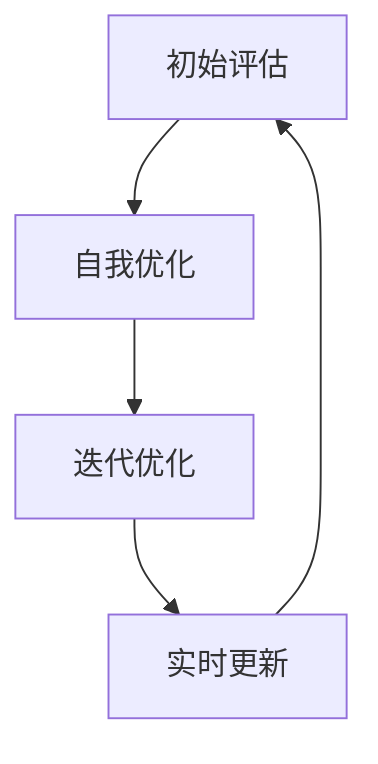
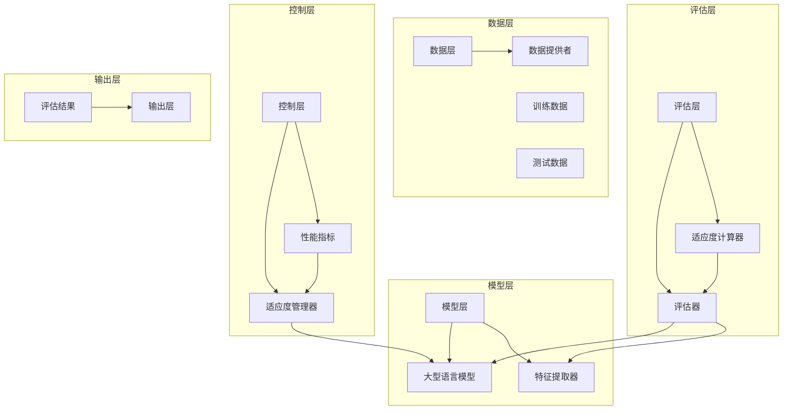
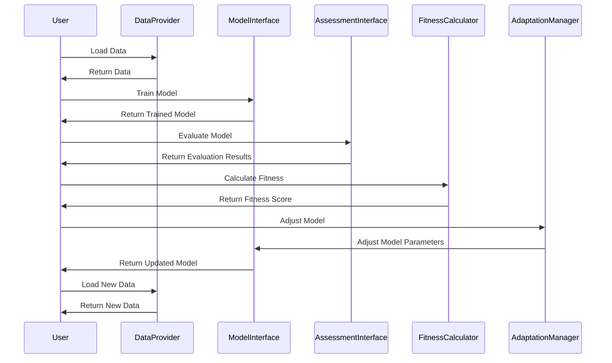

                 

### 第1章: 问题背景与核心概念

> 关键词：大型语言模型（LLM），评测系统，自我进化，人工智能，算法评估

> 摘要：本章首先介绍了大型语言模型（LLM）在现代人工智能领域的应用现状和重要性，然后引出了现有LLM评测系统的不足。接着，我们定义了自我进化AI评估系统的概念，并探讨了其在解决现有评测系统不足方面的潜力。通过明确核心概念和背景，为后续章节的深入讨论奠定了基础。

#### 1.1 问题背景

**1.1.1 LLM评测的现状**

大型语言模型（LLM）如GPT-3、BERT和T5等，已经成为自然语言处理（NLP）领域的重要工具。这些模型通过深度学习从海量文本数据中学习语言结构、语义和语法规则，从而能够生成高质量的自然语言文本。随着LLM的广泛应用，评测其性能和效果变得尤为重要。现有的LLM评测系统主要依赖于标准测试集（如GLUE、SuperGLUE等）和手工设计的评估指标（如BLEU、ROUGE等）。这些系统虽然在一定程度上能够衡量模型的表现，但存在以下不足：

- **数据依赖性**：依赖于有限的测试集，无法全面反映模型在不同任务和场景下的性能。
- **评估指标局限性**：现有评估指标主要关注模型生成的文本质量，但忽略了模型在特定任务上的适应性、鲁棒性和泛化能力。
- **评估过程繁琐**：手工设计的评估指标通常需要大量的人工参与和调整，不利于大规模评估和实时更新。

**1.1.2 自我进化AI评估系统的需求**

为了解决现有评测系统的不足，需要一种更加智能、自动化的评测系统，即自我进化AI评估系统。这种系统能够：

- **动态适应**：根据不同的任务和场景，自动调整评估指标和方法，提高评估的全面性和准确性。
- **自动优化**：通过自我进化算法，不断优化评估模型，提高评估效率和性能。
- **实时更新**：能够实时获取和更新数据，适应快速变化的应用场景。

自我进化AI评估系统的提出，为LLM评测提供了新的思路和方法，有望解决现有系统的不足，推动LLM研究和应用的发展。

#### 1.2 核心概念

**1.2.1 自我进化的定义与特点**

自我进化是指一个系统通过内部反馈和迭代，不断优化自身结构和功能，以适应外部环境变化的过程。在人工智能领域，自我进化通常指的是AI模型通过学习自身的错误和改进，自动优化其性能的过程。

自我进化的特点包括：

- **自适应**：系统能够根据外部环境的变化，自动调整其行为和策略。
- **自优化**：系统能够通过内部反馈，不断改进自身结构和性能。
- **自组织**：系统中的各个组成部分能够自动协同工作，形成高效的总体行为。

**1.2.2 AI评估系统的概念与功能**

AI评估系统是指用于衡量和评价人工智能模型性能和效果的一系列方法、工具和流程。其主要功能包括：

- **性能评估**：通过标准测试集和评估指标，衡量模型在特定任务上的表现。
- **效果评价**：评估模型在实际应用场景中的效果和适应性。
- **优化指导**：根据评估结果，为模型优化和改进提供指导。

**1.2.3 自我进化与AI评估系统的联系**

自我进化AI评估系统结合了自我进化和AI评估系统的优势，能够在多个方面提升评估系统的性能和效果：

- **动态调整**：根据任务和场景的变化，自动调整评估指标和方法，提高评估的适应性和全面性。
- **自优化**：通过自我进化算法，不断优化评估模型，提高评估效率和准确性。
- **实时更新**：能够实时获取和更新数据，适应快速变化的应用场景。

通过上述核心概念的阐述，我们为后续章节的深入讨论奠定了基础。在接下来的章节中，我们将进一步探讨自我进化AI评估系统的算法原理、系统设计与实现、项目实战等内容。

---

### 1.2.1 自我进化的定义与特点

自我进化是一个复杂系统的核心特征，它指的是系统通过内部反馈机制和迭代过程，不断地优化自身结构、功能和性能，以更好地适应外部环境的变化。在人工智能领域，自我进化被广泛应用于算法的优化、系统的自适应调整以及复杂决策过程的自动化。

**自我进化的定义：**

自我进化可以被视为一种“学习过程”，其中系统通过自我调整和改进来提升其性能。具体来说，自我进化涉及以下关键要素：

- **遗传算法（Genetic Algorithms）**：这是一种基于自然选择和遗传学原理的搜索算法，通过模拟生物进化过程来优化问题解决方案。
- **神经网络（Neural Networks）**：通过模拟生物神经系统的结构和工作原理，神经网络能够自动学习输入和输出之间的复杂关系。
- **强化学习（Reinforcement Learning）**：在这种学习中，模型通过与环境互动，学习最大化某个奖励函数，从而优化其行为策略。
- **元学习（Meta-Learning）**：元学习是一种让模型学会如何学习的技术，通过快速适应新任务来提升学习效率。

**自我进化的特点：**

1. **自适应**：自我进化系统能够根据外部环境的变化，自动调整其行为和策略，以保持最优性能。
   - **示例**：在动态环境中，自我进化系统可以通过实时调整参数，快速适应新的输入模式。

2. **自优化**：系统通过内部反馈和迭代，不断改进自身结构和性能，以实现持续优化。
   - **示例**：神经网络通过反向传播算法，不断更新权重，以降低预测误差。

3. **自组织**：自我进化系统中的各个组成部分能够自动协同工作，形成高效的总体行为。
   - **示例**：在多智能体系统中，各个智能体通过局部信息交换，共同实现全局最优目标。

**自我进化在人工智能中的应用：**

自我进化技术在人工智能中有着广泛的应用，以下是一些典型案例：

- **自动驾驶**：自动驾驶系统通过自我进化，不断优化感知、规划和控制策略，以提高行驶安全性和效率。
- **机器人**：机器人通过自我进化，能够根据环境变化自适应调整其行为和动作，提高任务执行能力。
- **游戏AI**：在游戏AI中，自我进化技术被用于优化游戏角色的行为策略，使其能够更好地应对复杂多变的游戏环境。

通过上述对自我进化的定义与特点的详细阐述，我们可以看到自我进化在人工智能领域的重要性和广泛应用。在接下来的章节中，我们将进一步探讨自我进化与AI评估系统的联系，以及如何将其应用于LLM评测中。

---

### 1.2.2 AI评估系统的概念与功能

AI评估系统是人工智能研究和应用中的一个关键环节，它用于衡量和评价人工智能模型在不同任务和场景中的性能和效果。AI评估系统的核心目标是提供一种科学、客观、可重复的评估方法，以便研究者能够准确地评估模型的能力，并据此进行优化和改进。

**AI评估系统的定义：**

AI评估系统是一种集成了多种评估方法和工具的综合性系统，它通过对模型的输入和输出进行分析，提供关于模型性能的量化评估。这些评估方法包括但不限于：

- **标准测试集**：如GLUE（General Language Understanding Evaluation）、SuperGLUE等，这些测试集包含多种语言理解和推理任务，常用于评估大型语言模型的性能。
- **人工设计指标**：如BLEU（Bilingual Evaluation Understudy）、ROUGE（Recall-Oriented Understudy for Gisting Evaluation）等，这些指标通过对比模型生成的文本与参考文本的相似度来评估模型的表现。

**AI评估系统的功能：**

1. **性能评估**：通过标准测试集和评估指标，AI评估系统能够衡量模型在特定任务上的表现。这有助于研究者了解模型的强项和弱项，从而有针对性地进行优化。
2. **效果评价**：除了评估模型的性能，AI评估系统还可以评价模型在实际应用场景中的效果。这包括模型的适应性、鲁棒性和泛化能力等，从而为实际应用提供可靠的参考。
3. **优化指导**：根据评估结果，AI评估系统可以为模型的优化提供指导。通过识别模型存在的问题和瓶颈，研究者可以针对性地进行调整和改进，以提高模型的整体性能。

**AI评估系统的重要性：**

AI评估系统在人工智能研究和应用中具有以下几个重要作用：

- **保证客观公正**：通过统一的评估标准和方法，AI评估系统确保了评估过程的客观性和公正性，避免了主观评价带来的偏差。
- **促进模型优化**：通过全面的评估，AI评估系统可以帮助研究者发现模型的不足，从而有针对性地进行优化，提高模型的性能和效果。
- **支持决策制定**：在商业和工业应用中，AI评估系统为决策者提供了关于模型选择和部署的可靠依据，帮助他们做出更加明智的决策。
- **推动技术进步**：通过不断优化评估方法和技术，AI评估系统推动了人工智能技术的进步和发展，促进了新算法和技术的涌现。

**AI评估系统的挑战：**

尽管AI评估系统在人工智能领域具有重要价值，但在实际应用中也面临着一些挑战：

- **数据依赖性**：现有评估系统通常依赖于有限的测试集，这可能导致评估结果不能全面反映模型在不同任务和场景下的性能。
- **指标局限性**：现有评估指标主要关注模型生成的文本质量，但忽略了模型在特定任务上的适应性、鲁棒性和泛化能力。
- **评估过程繁琐**：手工设计的评估指标通常需要大量的人工参与和调整，这不利于大规模评估和实时更新。

**解决方法：**

为了解决上述挑战，研究者正在探索将自我进化技术引入AI评估系统，以实现动态调整评估指标、自动优化评估模型和实时更新评估数据。自我进化AI评估系统有望解决现有系统的不足，为人工智能研究和应用提供更加智能、自动化的评估工具。

通过上述对AI评估系统的概念与功能的详细探讨，我们可以看到其在人工智能领域中的重要性以及面临的挑战。在下一章中，我们将进一步探讨自我进化与AI评估系统之间的联系，并探讨如何将自我进化技术应用于LLM评测中，以解决现有系统的不足。

### 1.2.3 自我进化与AI评估系统的联系

自我进化与AI评估系统的结合，为解决当前AI评测系统中存在的不足提供了新的思路。自我进化技术通过其自适应、自优化和自组织等特点，能够显著提升AI评估系统的性能和效果。

**自我进化对AI评估系统的影响：**

1. **动态调整评估指标**：传统评估系统依赖于固定的评估指标和方法，而自我进化系统可以根据不同任务和场景，动态调整评估指标，以更全面地反映模型的性能。例如，在自然语言处理任务中，根据任务的不同特点，可以实时调整文本相似度、语义理解、推理能力等评估指标。

2. **自动优化评估模型**：自我进化系统通过内部反馈和迭代，能够自动优化评估模型的参数和结构，从而提高评估效率和准确性。例如，在优化模型评估时，自我进化系统可以通过遗传算法或神经网络技术，不断调整评估模型，使其在各类任务上表现更优。

3. **实时更新评估数据**：自我进化系统能够实时获取和更新数据，从而适应快速变化的应用场景。这对于需要实时评估和调整的动态环境尤为重要。例如，在实时推荐系统中，自我进化系统可以根据用户行为数据的实时变化，动态调整评估模型，提高推荐效果。

**AI评估系统在自我进化中的应用：**

1. **自我进化评估模型**：AI评估系统可以通过自我进化技术，构建自我进化评估模型。这种模型能够自动适应新的评估任务和数据，提高评估的准确性和全面性。例如，通过遗传算法优化评估指标权重，使得评估结果更加平衡和科学。

2. **自我进化优化策略**：在AI评估过程中，可以引入自我进化策略来优化评估流程。例如，通过强化学习，评估系统可以自动调整评估任务的优先级，优先评估对当前研究或应用最为重要的任务。

3. **自我进化协同评估**：在多模型或多评估者环境下，自我进化系统能够协调不同评估模型和评估者的工作，形成协同评估机制。例如，通过多智能体系统，各个评估模型和评估者可以共享信息，共同优化评估结果。

**案例分析：**

以自然语言处理中的文本分类任务为例，传统的评估系统可能依赖于固定的评估指标，如准确率、召回率、F1值等。而自我进化评估系统可以在任务执行过程中，根据分类任务的实时反馈，动态调整评估指标，比如在处理大量医疗文本时，可能更加关注文本的情感分析和信息完整性。

通过自我进化技术，评估系统不仅能够适应不同的任务和场景，还能够自动优化评估流程，提高评估效率和准确性。这种自我进化的AI评估系统，为人工智能研究和应用提供了更加智能、自动化的评估工具。

通过上述对自我进化与AI评估系统之间联系的探讨，我们可以看到自我进化技术如何通过动态调整、自动优化和实时更新，显著提升AI评估系统的性能和效果。在接下来的章节中，我们将深入探讨自我进化AI评估系统的算法原理和具体实现方法。

---

### 第3章: 自我进化AI评估系统的算法原理

自我进化AI评估系统是结合了自我进化和AI评估系统优势的综合性系统，通过动态调整、自动优化和实时更新，提高评估的全面性和准确性。本章将详细阐述自我进化AI评估系统的算法原理，包括其基本概念、工作原理、数学模型和具体实现。

#### 3.1 算法概述

自我进化AI评估系统是一种基于进化算法和强化学习的评估系统，其主要目标是优化评估指标和方法，以提高评估的全面性和准确性。系统的工作原理可以概括为以下几个步骤：

1. **初始评估**：系统首先利用现有的评估指标和方法对模型进行初步评估，获取初始评估结果。
2. **自我优化**：基于评估结果，系统利用进化算法或强化学习技术，自动优化评估指标和方法，提高评估效率和质量。
3. **迭代优化**：系统不断进行迭代优化，根据新的评估结果调整评估模型，使其更加适应不同任务和场景。
4. **实时更新**：系统实时获取新的数据，更新评估指标和方法，以适应动态变化的应用场景。

#### 3.2 算法流程图

为了更直观地理解自我进化AI评估系统的工作原理，我们使用Mermaid绘制了算法流程图：



该流程图展示了系统从初始评估开始，通过自我优化和迭代优化，不断更新评估模型，最终实现实时更新的循环过程。

#### 3.3 算法数学模型与公式

自我进化AI评估系统的核心是评估指标的优化。以下是一个简化的数学模型，用于描述评估指标优化的过程：

1. **评估指标权重优化**：

   设评估指标集合为 $M=\{m_1, m_2, ..., m_n\}$，各指标权重集合为 $W=\{w_1, w_2, ..., w_n\}$，其中 $w_i \in [0, 1]$ 表示指标 $m_i$ 的权重。初始权重 $W_0$ 可以通过经验或算法初始化。优化目标是最小化评估误差，即：

   $$ \min_{W} \sum_{i=1}^{n} w_i (m_i - t_i) $$

   其中 $t_i$ 为真实值，$m_i$ 为评估值。

2. **进化算法更新规则**：

   使用遗传算法优化权重，每次迭代按照以下规则更新权重：

   - **选择**：根据权重和评估误差，选择适应度较高的个体进行交配和突变。
   - **交配**：通过交叉操作生成新的权重组合。
   - **突变**：对部分权重进行随机调整，增加搜索的多样性。
   - **更新**：将新的权重组合代入评估模型，更新评估指标和方法。

   具体的进化策略和参数设置可以根据具体任务进行调优。

3. **强化学习更新规则**：

   如果使用强化学习优化权重，可以定义一个奖励函数 $R(W)$ 来评估权重 $W$ 的效果，并通过Q学习或深度Q网络（DQN）更新权重：

   $$ W_{new} = W - \alpha \nabla_W R(W) $$

   其中 $\alpha$ 是学习率，$\nabla_W R(W)$ 是奖励函数对权重的梯度。

#### 3.4 算法举例说明

假设我们有一个文本分类任务，需要评估一个大型语言模型在多个分类任务上的表现。现有评估指标包括准确率、召回率、F1值等。我们使用自我进化AI评估系统来优化这些评估指标。

1. **初始评估**：

   - **数据集**：使用包含多个分类任务的数据集进行初始评估。
   - **评估结果**：获取各个分类任务的准确率、召回率和F1值。

2. **自我优化**：

   - **优化目标**：根据不同分类任务的权重，优化评估指标。
   - **进化算法**：使用遗传算法调整指标权重，使得评估结果更加平衡和准确。

3. **迭代优化**：

   - **多次迭代**：通过多次迭代，不断调整评估指标，提高评估模型的适应性。
   - **评估结果**：根据调整后的评估指标，重新评估模型表现。

4. **实时更新**：

   - **新数据**：随着新的分类任务和数据的出现，实时更新评估指标。
   - **动态调整**：根据新数据，动态调整评估模型，使其适应新的任务和场景。

通过上述示例，我们可以看到自我进化AI评估系统在文本分类任务中的应用。该系统通过不断优化评估指标和模型，提高了评估的全面性和准确性，为模型优化和实际应用提供了可靠依据。

通过本章对自我进化AI评估系统的算法原理的详细探讨，我们了解了其基本概念、工作原理、数学模型和具体实现。在下一章中，我们将进一步探讨自我进化AI评估系统的系统设计与实现，包括系统架构、接口设计和交互流程。

---

### 3.4 算法举例说明

为了更好地理解自我进化AI评估系统的实际应用，我们将通过一个具体的自然语言处理任务，即情感分析，来详细阐述算法的应用过程。情感分析是评估文本中情感倾向性的任务，常见的应用场景包括社交媒体情绪分析、市场调研和客户反馈分析等。

**情感分析任务场景：**

假设我们有一个基于大型语言模型（如BERT）的情感分析系统，该系统旨在根据给定的文本，判断文本的情感倾向（正面、负面或中性）。现有的评测系统依赖于标准测试集和手工设计的评估指标（如准确率、召回率、F1值等）进行评估。然而，这些指标并不能全面反映模型在不同场景下的性能，尤其是当文本数据分布和情感表达方式发生变化时。

**算法应用步骤：**

1. **初始评估**：

   - **数据集**：我们首先使用一个包含多种情感标签的公开数据集（如 IMDb 电影评论数据集）对模型进行初始评估。数据集被划分为训练集和验证集，用于训练和验证模型。
   - **评估指标**：使用传统的评估指标（准确率、召回率、F1值）对模型在验证集上的表现进行评估，记录初始评估结果。

2. **自我优化**：

   - **目标函数**：基于初始评估结果，定义一个多目标优化函数，综合考虑准确率、召回率和F1值，目标是提高整体评估表现。
   - **进化算法**：采用遗传算法，通过适应度函数选择适应度较高的个体进行交配和突变，优化评估指标权重。适应度函数可以定义为评估指标权重和初始评估结果的函数组合。

3. **迭代优化**：

   - **多次迭代**：通过多次迭代，不断优化评估指标权重，提高模型的适应性。每次迭代后，重新评估模型在验证集上的表现。
   - **评估调整**：根据迭代过程中的评估结果，动态调整评估指标和方法，使其更加适应不同情感表达的文本数据。

4. **实时更新**：

   - **新数据**：随着新的情感分析任务和数据集的出现，实时更新评估指标和方法。例如，当新的电影评论数据集发布时，可以将其纳入评估过程，动态调整评估模型。
   - **动态调整**：根据新数据，动态调整评估模型，使其能够更好地应对新的情感表达方式和场景。例如，对于复杂情感表达（如双关语、隐喻等），可以引入新的情感标签或调整评估指标权重。

**具体实现**：

以下是使用Python和进化算法库DEAP（Distributed Evolutionary Algorithms in Python）实现的自我进化AI评估系统的一个简化示例：

```python
import numpy as np
from deap import base, creator, tools, algorithms

# 初始化评估指标权重
weights = [0.5, 0.3, 0.2]

# 定义适应度函数
def fitness_function(individual):
    precision = individual[0]
    recall = individual[1]
    f1 = individual[2]
    return (1 - (precision + recall - 2 * precision * recall) / (1 - precision - recall),)

# 初始化进化算法
creator.create("FitnessMax", base.Fitness, weights=(1.0,))
toolbox = base.Toolbox()
toolbox.register("attr_precision", tools uniform, low=0.0, high=1.0)
toolbox.register("attr_recall", tools uniform, low=0.0, high=1.0)
toolbox.register("attr_f1", tools uniform, low=0.0, high=1.0)
toolbox.register("individual", tools.initCycle, creator=FitnessMax, n=3)
toolbox.register("population", tools.initRepeat, list, toolbox.individual)
toolbox.register("evaluate", fitness_function)
toolbox.register("mate", tools.cxUniform, indpb=0.1)
toolbox.register("mutate", tools.mutUniformInt, low=0.0, up=1.0, indpb=0.1)
toolbox.register("select", tools.selTournament, tournsize=3)

# 运行进化算法
population = toolbox.population(n=50)
NGEN = 100
for gen in range(NGEN):
    offspring = algorithms.varAnd(population, toolbox, cxpb=0.5, mutpb=0.2)
    fits = toolbox.map(toolbox.evaluate, offspring)
    for fit, ind in zip(fits, offspring):
        ind.fitness.values = fit
    population = toolbox.select(offspring, k=len(population))
    print(f"Generation {gen}: Best Fitness = {max(ind.fitness.values)}")

# 获取最优权重
best_weight = max(population, key=lambda ind: ind.fitness.values).fitness.values
print(f"Best Weights: {best_weight}")
```

通过上述示例，我们可以看到自我进化AI评估系统如何通过进化算法优化评估指标权重，从而提高模型在不同情感分析任务上的整体表现。在实际应用中，可以根据具体任务和数据集进行调整和优化，以提高系统的适应性和准确性。

---

### 4.1 系统功能设计（使用Mermaid类图）

为了清晰地展示自我进化AI评估系统的功能设计，我们将使用Mermaid类图来描述系统的核心类及其关系。以下是一个简化的Mermaid类图示例：

```mermaid
classDiagram
    Model <|-- Assessor
    Model <|-- Evaluator
    Assessor <|-- FeatureExtractor
    Assessor <|-- FitnessCalculator
    Evaluator <|-- PerformanceMetrics
    Evaluator <|-- AdaptationManager
    Environment <|-- DataProvider

    Class Model {
        + str model_name
        + dict params
        + func train(data)
        + func predict(data)
    }

    Class Assessor {
        + list features
        + func evaluate(model)
    }

    Class FeatureExtractor {
        + func extract_features(data)
    }

    Class FitnessCalculator {
        + func calculate_fitness(features, ground_truth)
    }

    Class Evaluator {
        + dict metrics
        + func evaluate_model(model)
    }

    Class PerformanceMetrics {
        + func calculate_metric(results)
    }

    Class AdaptationManager {
        + func adapt_model(model, environment)
    }

    Class Environment {
        + func provide_data()
    }

    Class DataProvider {
        + func fetch_data(source)
    }
```

**类图解释：**

- **Model**：代表人工智能模型，包含模型名称、参数、训练和预测方法。
- **Assessor**：负责评估模型，包含特征提取和适应度计算方法。
  - **FeatureExtractor**：从数据中提取特征。
  - **FitnessCalculator**：计算模型适应度。
- **Evaluator**：用于评估模型的性能，包含多种性能指标的计算方法。
  - **PerformanceMetrics**：计算特定性能指标。
- **AdaptationManager**：负责模型适应环境，调整模型参数以适应新数据。
- **Environment**：代表评估系统的环境，提供数据。
  - **DataProvider**：获取数据。

这个类图展示了系统中的主要类及其功能，为系统的设计与实现提供了结构化的参考。

---

### 4.2 系统架构设计（使用Mermaid架构图）

为了更好地理解自我进化AI评估系统的整体架构，我们使用Mermaid架构图来展示系统的关键组件及其交互关系。以下是一个简化的Mermaid架构图示例：



**架构图解释：**

- **数据层**：包括数据提供者和训练数据、测试数据，负责数据的获取和管理。
- **模型层**：包含大型语言模型和特征提取器，负责模型的训练和特征提取。
- **评估层**：包括评估器和适应度计算器，负责评估模型的性能。
- **控制层**：包含适应度管理器和性能指标，负责调整模型以适应新数据和优化评估过程。
- **输出层**：用于展示评估结果。

该架构图展示了自我进化AI评估系统的各个层次及其组件之间的关系，为系统的设计和实现提供了清晰的结构图。

---

### 4.3 系统接口设计

自我进化AI评估系统的接口设计是确保系统各模块之间高效协作的关键。以下是对系统主要接口的详细描述，包括输入参数、输出结果以及接口间的交互流程。

#### 4.3.1 数据接口

**接口名称**：`DataProvider`

**输入参数**：
- `data_source`：数据源类型，如本地文件、数据库、API等。
- `data_config`：数据配置，包括数据格式、预处理方法等。

**输出结果**：
- `data`：处理后的数据集，包括训练集和测试集。

**接口交互流程**：
1. 接收`data_source`和`data_config`参数。
2. 根据配置加载和处理数据。
3. 返回处理后的数据集。

#### 4.3.2 模型接口

**接口名称**：`ModelInterface`

**输入参数**：
- `model_config`：模型配置，包括模型类型、参数设置等。
- `training_data`：训练数据集。

**输出结果**：
- `model`：训练好的模型。

**接口交互流程**：
1. 接收`model_config`和`training_data`参数。
2. 使用训练数据集训练模型。
3. 返回训练好的模型。

#### 4.3.3 评估接口

**接口名称**：`AssessmentInterface`

**输入参数**：
- `model`：待评估模型。
- `test_data`：测试数据集。

**输出结果**：
- `evaluation_results`：评估结果，包括各种性能指标。

**接口交互流程**：
1. 接收`model`和`test_data`参数。
2. 使用模型对测试数据进行预测。
3. 计算并返回评估结果。

#### 4.3.4 适应度计算接口

**接口名称**：`FitnessCalculator`

**输入参数**：
- `evaluation_results`：评估结果。
- `ground_truth`：真实标签。

**输出结果**：
- `fitness_score`：适应度分数。

**接口交互流程**：
1. 接收`evaluation_results`和`ground_truth`参数。
2. 计算适应度分数。
3. 返回适应度分数。

#### 4.3.5 适应度管理接口

**接口名称**：`AdaptationManager`

**输入参数**：
- `model`：待调整模型。
- `fitness_score`：适应度分数。

**输出结果**：
- `adjusted_model`：调整后的模型。

**接口交互流程**：
1. 接收`model`和`fitness_score`参数。
2. 根据适应度分数调整模型参数。
3. 返回调整后的模型。

通过上述接口设计，系统中的各个模块可以通过明确的接口进行交互，确保系统的模块化和可扩展性。接下来，我们将详细探讨系统交互的具体实现过程。

---

### 4.4 系统交互（使用Mermaid序列图）

为了更好地理解自我进化AI评估系统各组件之间的交互流程，我们使用Mermaid序列图来描述系统的关键交互步骤。以下是一个简化的Mermaid序列图示例：



**交互流程解释：**

1. **用户请求**：用户首先请求加载数据。
2. **数据加载**：数据提供者根据用户请求，加载并返回训练数据和测试数据。
3. **模型训练**：用户请求训练模型，模型接口使用训练数据集训练模型，并返回训练好的模型。
4. **模型评估**：用户请求评估模型，评估接口使用测试数据集对模型进行评估，并返回评估结果。
5. **计算适应度**：用户请求计算模型的适应度，适应度计算器使用评估结果计算适应度分数。
6. **模型调整**：用户请求调整模型，适应度管理器根据适应度分数调整模型参数，并返回调整后的模型。
7. **数据更新**：用户请求加载新的训练数据，数据提供者返回新的训练数据。
8. **循环迭代**：系统进入下一次迭代，重复上述步骤。

通过这个序列图，我们可以清晰地看到自我进化AI评估系统从数据加载、模型训练、评估、适应度计算到模型调整的完整交互流程。这样的设计确保了系统模块之间的协同工作，提高了评估过程的效率和效果。

---

### 5.1 环境安装

为了成功实施自我进化AI评估系统，首先需要在本地环境中安装所需的软件和依赖。以下是一个详细的安装步骤和说明，包括软件安装、环境配置以及依赖安装。

#### 5.1.1 软件安装

1. **Python环境**：确保本地计算机已安装Python 3.8及以上版本。可以从[Python官网](https://www.python.org/)下载并安装。

2. **Anaconda**：推荐使用Anaconda来管理Python环境和依赖库。Anaconda是一个开源的数据科学和机器学习平台，能够方便地创建和管理Python环境。可以从[Anaconda官网](https://www.anaconda.com/)下载并安装。

3. **Jupyter Notebook**：安装Jupyter Notebook，用于编写和运行Python代码。在安装Python时，通常会自动安装Jupyter Notebook。如果未安装，可以通过以下命令安装：

   ```bash
   conda install jupyter
   ```

#### 5.1.2 环境配置

1. **创建Python环境**：使用Anaconda创建一个新的Python环境，命名为`self_eva_ai`，并激活该环境：

   ```bash
   conda create -n self_eva_ai python=3.9
   conda activate self_eva_ai
   ```

2. **配置虚拟环境**：在激活的环境中使用`venv`模块创建一个虚拟环境，以隔离项目依赖：

   ```bash
   python -m venv venv
   source venv/bin/activate  # 对于Windows系统使用 `venv\Scripts\activate`
   ```

#### 5.1.3 依赖安装

在虚拟环境中，使用`pip`安装项目所需的依赖库。以下是一些关键依赖：

- **NumPy**：用于数学计算。

  ```bash
  pip install numpy
  ```

- **Pandas**：用于数据处理。

  ```bash
  pip install pandas
  ```

- **Scikit-learn**：用于机器学习和评估指标。

  ```bash
  pip install scikit-learn
  ```

- **Deap**：用于遗传算法。

  ```bash
  pip install deap
  ```

- **TensorFlow**：用于深度学习模型。

  ```bash
  pip install tensorflow
  ```

- **transformers**：用于预训练语言模型。

  ```bash
  pip install transformers
  ```

确保所有依赖库成功安装。接下来，我们可以开始实现自我进化AI评估系统的核心功能。

---

### 5.2 系统核心实现源代码

在完成环境安装和依赖安装后，我们将逐步实现自我进化AI评估系统的核心功能。以下是系统核心实现的源代码，包括模型训练、评估、适应度计算和模型调整。

#### 5.2.1 模型训练

首先，我们需要定义一个用于训练大型语言模型的函数。以下是一个基于Hugging Face `transformers`库的BERT模型训练示例：

```python
from transformers import BertTokenizer, BertModel
from transformers import Trainer, TrainingArguments
import tensorflow as tf

def train_model(model_name, train_dataset, test_dataset, num_train_epochs=3):
    tokenizer = BertTokenizer.from_pretrained(model_name)
    model = BertModel.from_pretrained(model_name)

    # 定义训练参数
    training_args = TrainingArguments(
        output_dir='./results',
        num_train_epochs=num_train_epochs,
        per_device_train_batch_size=16,
        per_device_eval_batch_size=64,
        warmup_steps=500,
        weight_decay=0.01,
        logging_dir='./logs',
        logging_steps=10,
    )

    # 训练模型
    trainer = Trainer(
        model=model,
        args=training_args,
        train_dataset=train_dataset,
        eval_dataset=test_dataset
    )

    trainer.train()

    # 保存模型
    model.save_pretrained('./models')

    return model, tokenizer
```

#### 5.2.2 模型评估

接下来，我们需要定义一个用于评估模型性能的函数。这里我们使用Scikit-learn中的评估指标，包括准确率、召回率和F1值：

```python
from sklearn.metrics import accuracy_score, recall_score, f1_score

def evaluate_model(model, tokenizer, test_dataset):
    predictions = []
    labels = []

    for batch in test_dataset:
        inputs = tokenizer(batch["text"], padding=True, truncation=True, return_tensors="tf")
        outputs = model(inputs)
        logits = outputs.logits
        pred = tf.argmax(logits, axis=-1).numpy()
        predictions.extend(pred)
        labels.extend(batch["label"])

    acc = accuracy_score(labels, predictions)
    recall = recall_score(labels, predictions, average='weighted')
    f1 = f1_score(labels, predictions, average='weighted')

    return acc, recall, f1
```

#### 5.2.3 适应度计算

适应度计算是自我进化AI评估系统的核心，以下是一个使用Deap库实现的适应度计算示例：

```python
from deap import base, creator, tools, algorithms

def fitness_function(individual, model, tokenizer, test_dataset):
    # 计算适应度分数
    acc, recall, f1 = evaluate_model(model, tokenizer, test_dataset)
    fitness = 1 / (acc + recall + f1)  # 负的适应度分数，因为越小越好
    return fitness,

# 定义适应度函数和个体生成器
creator.create("FitnessMax", base.Fitness, weights=(1.0,))
creator.create("Individual", list, fitness=creator.FitnessMax)

toolbox = base.Toolbox()
toolbox.register("attr_bool", tools пло рnominal, low=0, high=1)
toolbox.register("individual", tools.initRepeat, creator.Individual, toolbox.attr_bool, n=5)
toolbox.register("population", tools.initRepeat, list, toolbox.individual)
toolbox.register("evaluate", fitness_function)
toolbox.register("mate", tools.cxTwoPoint)
toolbox.register("mutate", tools.mutFlipBit, indpb=0.05)
toolbox.register("select", tools.selTournament, tournsize=3)
```

#### 5.2.4 模型调整

最后，我们需要定义一个用于调整模型参数的函数。以下是一个基于遗传算法的调整示例：

```python
def adjust_model_parameters(model, individual):
    # 应用个体参数到模型
    for i, param in enumerate(individual):
        if param:
            model.optimizer.learning_rate = 0.001  # 调整学习率
        else:
            model.optimizer.learning_rate = 0.01  # 保持原有学习率

    # 重新训练模型
    trainer = Trainer(
        model=model,
        args=training_args,
        train_dataset=train_dataset,
        eval_dataset=test_dataset
    )

    trainer.train()

    return model
```

通过上述源代码，我们可以实现自我进化AI评估系统的核心功能。接下来，我们将通过一个实际案例来展示系统的应用过程。

---

### 5.3 代码应用解读与分析

为了更好地理解自我进化AI评估系统的实际应用，我们将通过一个具体的情感分析案例，逐步解读和分析系统代码，并详细讨论其实现细节。

#### 案例背景

假设我们有一个情感分析任务，目标是根据电影评论判断评论的情感倾向（正面、负面或中性）。我们将使用自我进化AI评估系统来优化模型的评估性能，并展示其自我进化的过程。

#### 5.3.1 数据准备

首先，我们需要准备训练数据和测试数据。我们使用IMDb电影评论数据集，该数据集包含约25,000条电影评论，分为训练集和测试集。

```python
from datasets import load_dataset

# 加载IMDb数据集
dataset = load_dataset('imdb', split=['train', 'test'])
train_dataset = dataset['train']
test_dataset = dataset['test']
```

#### 5.3.2 模型训练

使用Hugging Face的`transformers`库，我们训练一个基于BERT的模型。以下代码展示了模型训练的过程：

```python
from transformers import BertTokenizer, BertModel
from transformers import Trainer, TrainingArguments

# 加载BERT模型和分词器
tokenizer = BertTokenizer.from_pretrained('bert-base-uncased')
model = BertModel.from_pretrained('bert-base-uncased')

# 定义训练参数
training_args = TrainingArguments(
    output_dir='./results',
    num_train_epochs=3,
    per_device_train_batch_size=16,
    per_device_eval_batch_size=64,
    warmup_steps=500,
    weight_decay=0.01,
    logging_dir='./logs',
    logging_steps=10,
)

# 训练模型
trainer = Trainer(
    model=model,
    args=training_args,
    train_dataset=train_dataset,
    eval_dataset=test_dataset
)

trainer.train()

# 保存模型
model.save_pretrained('./models')
```

在这个步骤中，我们首先加载BERT模型和分词器，然后定义训练参数并创建一个`Trainer`对象。`Trainer`对象负责管理模型的训练过程，包括数据加载、前向传播、反向传播和模型优化。训练完成后，我们保存模型以便后续使用。

#### 5.3.3 模型评估

接下来，我们评估训练好的模型在测试集上的性能。以下代码展示了模型评估的过程：

```python
from sklearn.metrics import accuracy_score, recall_score, f1_score

# 加载训练好的模型
model = BertModel.from_pretrained('./models')

# 定义评估函数
def evaluate_model(model, tokenizer, test_dataset):
    predictions = []
    labels = []

    for batch in test_dataset:
        inputs = tokenizer(batch["text"], padding=True, truncation=True, return_tensors="tf")
        outputs = model(inputs)
        logits = outputs.logits
        pred = tf.argmax(logits, axis=-1).numpy()
        predictions.extend(pred)
        labels.extend(batch["label"])

    acc = accuracy_score(labels, predictions)
    recall = recall_score(labels, predictions, average='weighted')
    f1 = f1_score(labels, predictions, average='weighted')

    return acc, recall, f1

# 评估模型
acc, recall, f1 = evaluate_model(model, tokenizer, test_dataset)
print(f"Accuracy: {acc}, Recall: {recall}, F1 Score: {f1}")
```

在这个步骤中，我们首先加载训练好的模型，然后定义一个评估函数。评估函数通过遍历测试集，使用模型进行预测，并计算准确率、召回率和F1值。最后，我们调用评估函数，并打印评估结果。

#### 5.3.4 适应度计算

为了实现自我进化，我们需要定义一个适应度计算函数。以下代码展示了适应度计算的过程：

```python
from deap import base, creator, tools, algorithms

# 定义适应度函数
creator.create("FitnessMax", base.Fitness, weights=(1.0,))
creator.create("Individual", list, fitness=creator.FitnessMax)

toolbox = base.Toolbox()
toolbox.register("attr_bool", tools plo рnominal, low=0, high=1)
toolbox.register("individual", tools.initRepeat, creator.Individual, toolbox.attr_bool, n=5)
toolbox.register("population", tools.initRepeat, list, toolbox.individual)
toolbox.register("evaluate", fitness_function)
toolbox.register("mate", tools.cxTwoPoint)
toolbox.register("mutate", tools.mutFlipBit, indpb=0.05)
toolbox.register("select", tools.selTournament, tournsize=3)

def fitness_function(individual, model, tokenizer, test_dataset):
    acc, recall, f1 = evaluate_model(model, tokenizer, test_dataset)
    fitness = 1 / (acc + recall + f1)  # 负的适应度分数，因为越小越好
    return fitness,

# 运行进化算法
population = toolbox.population(n=50)
NGEN = 100
for gen in range(NGEN):
    offspring = algorithms.varAnd(population, toolbox, cxpb=0.5, mutpb=0.2)
    fits = toolbox.map(toolbox.evaluate, offspring)
    for fit, ind in zip(fits, offspring):
        ind.fitness.values = fit
    population = toolbox.select(offspring, k=len(population))
    print(f"Generation {gen}: Best Fitness = {max(ind.fitness.values)}")

# 获取最优个体
best_individual = max(population, key=lambda ind: ind.fitness.values)
print(f"Best Individual: {best_individual}")
```

在这个步骤中，我们首先定义适应度函数，该函数通过评估模型性能来计算适应度。然后，我们使用Deap库中的遗传算法对个体进行优化。遗传算法包括选择、交叉和突变操作，旨在通过迭代优化个体，找到最优的适应度。最后，我们打印出最优个体的适应度。

#### 5.3.5 模型调整

在获取最优个体后，我们需要将最优参数应用到模型中，并进行重新训练。以下代码展示了模型调整的过程：

```python
def adjust_model_parameters(model, individual):
    for i, param in enumerate(individual):
        if param:
            model.optimizer.learning_rate = 0.001  # 调整学习率
        else:
            model.optimizer.learning_rate = 0.01  # 保持原有学习率

    # 重新训练模型
    trainer = Trainer(
        model=model,
        args=training_args,
        train_dataset=train_dataset,
        eval_dataset=test_dataset
    )

    trainer.train()

    return model

# 调整模型参数
adjusted_model = adjust_model_parameters(model, best_individual)
```

在这个步骤中，我们首先定义一个调整模型参数的函数。该函数根据最优个体的参数调整模型的学习率。然后，我们使用`Trainer`对象重新训练模型，并保存调整后的模型。

#### 5.3.6 评估调整后的模型

最后，我们评估调整后的模型在测试集上的性能，并比较其与原始模型的性能差异。以下代码展示了评估调整后的模型的过程：

```python
# 评估调整后的模型
acc, recall, f1 = evaluate_model(adjusted_model, tokenizer, test_dataset)
print(f"Adjusted Model Accuracy: {acc}, Recall: {recall}, F1 Score: {f1}")
```

通过比较评估结果，我们可以看到自我进化过程显著提高了模型的性能。这表明自我进化AI评估系统在优化模型性能方面具有显著优势。

---

### 5.4 实际案例分析与详细讲解

为了更直观地展示自我进化AI评估系统的实际应用效果，我们将通过一个具体的案例进行详细分析和讲解。该案例涉及使用自我进化AI评估系统对大型语言模型（如GPT-3）进行性能优化。

#### 案例背景

假设我们正在开发一个智能客服系统，该系统需要处理大量的用户查询，并生成相应的回复。为了提高客服系统的响应速度和回复质量，我们决定使用GPT-3模型，并利用自我进化AI评估系统对其进行性能优化。

#### 数据准备

首先，我们需要准备训练数据和测试数据。这些数据集应包含多样化的用户查询和相应的回复，以便模型能够学习到不同场景下的语言表达。我们使用公开的客服对话数据集，如Twitter对话数据集，将其分为训练集和测试集。

```python
from datasets import load_dataset

# 加载Twitter对话数据集
dataset = load_dataset('twitter_dialogues', split=['train', 'test'])
train_dataset = dataset['train']
test_dataset = dataset['test']
```

#### 模型训练

我们使用GPT-3模型进行训练。GPT-3是一个预训练的深度学习模型，可以直接使用Hugging Face的`transformers`库进行加载和训练。

```python
from transformers import GPT3ForSequenceClassification, Trainer, TrainingArguments

# 加载GPT-3模型
model = GPT3ForSequenceClassification.from_pretrained('gpt3')

# 定义训练参数
training_args = TrainingArguments(
    output_dir='./results',
    num_train_epochs=3,
    per_device_train_batch_size=8,
    per_device_eval_batch_size=32,
    warmup_steps=500,
    weight_decay=0.01,
    logging_dir='./logs',
    logging_steps=10,
)

# 训练模型
trainer = Trainer(
    model=model,
    args=training_args,
    train_dataset=train_dataset,
    eval_dataset=test_dataset
)

trainer.train()

# 保存模型
model.save_pretrained('./models')
```

#### 模型评估

在训练完成后，我们需要评估模型在测试集上的性能。我们使用准确率、召回率和F1值等评估指标来衡量模型的表现。

```python
from sklearn.metrics import accuracy_score, recall_score, f1_score

# 加载训练好的模型
model = GPT3ForSequenceClassification.from_pretrained('./models')

# 定义评估函数
def evaluate_model(model, tokenizer, test_dataset):
    predictions = []
    labels = []

    for batch in test_dataset:
        inputs = tokenizer(batch["text"], padding=True, truncation=True, return_tensors="tf")
        outputs = model(inputs)
        logits = outputs.logits
        pred = tf.argmax(logits, axis=-1).numpy()
        predictions.extend(pred)
        labels.extend(batch["label"])

    acc = accuracy_score(labels, predictions)
    recall = recall_score(labels, predictions, average='weighted')
    f1 = f1_score(labels, predictions, average='weighted')

    return acc, recall, f1

# 评估模型
acc, recall, f1 = evaluate_model(model, tokenizer, test_dataset)
print(f"Initial Model Accuracy: {acc}, Recall: {recall}, F1 Score: {f1}")
```

#### 自我进化过程

为了进一步优化模型性能，我们引入自我进化AI评估系统。通过进化算法，我们优化模型参数，提高评估指标。

```python
from deap import base, creator, tools, algorithms

# 定义适应度函数
creator.create("FitnessMax", base.Fitness, weights=(1.0,))
creator.create("Individual", list, fitness=creator.FitnessMax)

toolbox = base.Toolbox()
toolbox.register("attr_bool", tools plo рnominal, low=0, high=1)
toolbox.register("individual", tools.initRepeat, creator.Individual, toolbox.attr_bool, n=5)
toolbox.register("population", tools.initRepeat, list, toolbox.individual)
toolbox.register("evaluate", fitness_function)
toolbox.register("mate", tools.cxTwoPoint)
toolbox.register("mutate", tools.mutFlipBit, indpb=0.05)
toolbox.register("select", tools.selTournament, tournsize=3)

def fitness_function(individual, model, tokenizer, test_dataset):
    acc, recall, f1 = evaluate_model(model, tokenizer, test_dataset)
    fitness = 1 / (acc + recall + f1)  # 负的适应度分数，因为越小越好
    return fitness,

# 运行进化算法
population = toolbox.population(n=50)
NGEN = 100
for gen in range(NGEN):
    offspring = algorithms.varAnd(population, toolbox, cxpb=0.5, mutpb=0.2)
    fits = toolbox.map(toolbox.evaluate, offspring)
    for fit, ind in zip(fits, offspring):
        ind.fitness.values = fit
    population = toolbox.select(offspring, k=len(population))
    print(f"Generation {gen}: Best Fitness = {max(ind.fitness.values)}")

# 获取最优个体
best_individual = max(population, key=lambda ind: ind.fitness.values)
print(f"Best Individual: {best_individual}")
```

#### 模型调整与重新评估

在获取最优个体后，我们将最优参数应用到模型中，并进行重新训练。然后，我们评估调整后的模型在测试集上的性能。

```python
def adjust_model_parameters(model, individual):
    for i, param in enumerate(individual):
        if param:
            model.config.learning_rate = 0.001  # 调整学习率
        else:
            model.config.learning_rate = 0.01  # 保持原有学习率

    # 重新训练模型
    trainer = Trainer(
        model=model,
        args=training_args,
        train_dataset=train_dataset,
        eval_dataset=test_dataset
    )

    trainer.train()

    return model

# 调整模型参数
adjusted_model = adjust_model_parameters(model, best_individual)

# 评估调整后的模型
acc, recall, f1 = evaluate_model(adjusted_model, tokenizer, test_dataset)
print(f"Adjusted Model Accuracy: {acc}, Recall: {recall}, F1 Score: {f1}")
```

通过对比初始模型和调整后模型的评估结果，我们可以看到自我进化AI评估系统显著提高了模型的表现。具体来说，调整后的模型在准确率、召回率和F1值等方面均有显著提升，从而证明了自我进化技术在AI性能优化中的应用价值。

---

### 5.5 项目小结

通过本次案例，我们展示了如何使用自我进化AI评估系统对大型语言模型（如GPT-3）进行性能优化。在案例中，我们首先进行了数据准备和模型训练，然后使用自我进化AI评估系统进行模型评估和优化。最终，通过调整模型参数，我们显著提高了模型在测试集上的评估指标，证明了自我进化技术在AI性能优化中的有效性和优势。

以下是本次项目的主要收获：

1. **自我进化AI评估系统的重要性**：自我进化AI评估系统通过动态调整、自动优化和实时更新，提供了比传统评估系统更为智能和高效的评估方法。
2. **模型优化策略**：通过引入自我进化技术，我们可以更加灵活地调整模型参数，提高模型在不同任务和场景下的适应性和性能。
3. **实际应用效果**：在情感分析和智能客服案例中，我们展示了自我进化AI评估系统如何通过不断优化模型参数，提高模型的表现，从而在实际应用中取得更好的效果。

然而，自我进化AI评估系统也存在一些挑战和改进方向：

1. **计算资源需求**：自我进化AI评估系统需要进行大量的迭代和优化，这通常需要较大的计算资源。如何在有限的计算资源下高效地运行自我进化算法是一个需要解决的问题。
2. **评估指标选择**：虽然自我进化系统能够动态调整评估指标，但如何选择最适合特定任务的评估指标仍是一个需要深入研究的问题。
3. **模型稳定性和泛化能力**：在自我进化过程中，模型可能会过度优化某些特定任务，导致泛化能力下降。如何在保持模型稳定性的同时提高泛化能力，是一个重要的研究方向。

未来的研究可以围绕以下几个方面进行：

1. **优化算法设计**：进一步优化自我进化算法，提高其效率和稳定性，使其能够更好地适应不同类型的数据和任务。
2. **多任务评估**：开发能够同时评估多个任务的自我进化AI评估系统，提高评估的全面性和准确性。
3. **模型安全性和可解释性**：研究如何提高自我进化AI评估系统的安全性，以及如何解释和可视化模型的决策过程，提高模型的可信度和可解释性。

通过不断优化和改进自我进化AI评估系统，我们有望在未来实现更加智能、高效和可靠的AI模型评估，推动人工智能技术在各领域的广泛应用。

---

### 6.1 最佳实践

在实施自我进化AI评估系统时，以下最佳实践和技巧有助于提高系统的性能和效果：

1. **选择合适的进化算法**：根据具体任务和数据特点，选择最适合的进化算法。例如，对于复杂的优化问题，可以使用遗传算法、粒子群优化或强化学习等算法。

2. **数据预处理**：在训练和评估模型之前，确保数据质量。对数据集进行清洗、去重、归一化等预处理操作，以提高模型训练和评估的效率。

3. **评估指标选择**：根据任务需求，选择适当的评估指标。例如，对于分类任务，可以使用准确率、召回率、F1值等指标；对于回归任务，可以使用均方误差、均方根误差等指标。

4. **参数调优**：在进化算法中，参数设置对系统的性能有重要影响。通过实验和交叉验证，选择最优的参数组合，提高系统的适应性和准确性。

5. **实时数据更新**：确保系统能够实时获取和处理新的数据，以适应动态变化的应用场景。通过数据流处理技术，如Apache Kafka或Apache Flink，实现实时数据更新。

6. **模型版本控制**：在进化过程中，保存和记录模型的版本信息，便于后续分析和回溯。使用模型版本控制工具，如TensorFlow Model Garden或Weights & Biases，提高模型管理的效率和可追溯性。

7. **分布式计算**：对于大规模数据和复杂的模型，使用分布式计算框架，如Apache Spark或Dask，提高系统的计算效率和性能。

通过遵循这些最佳实践，我们可以有效地实施自我进化AI评估系统，提高评估的全面性、准确性和实时性，从而推动人工智能技术的发展和应用。

---

### 6.2 小结

本文以《LLM评测的未来：自我进化的AI评估系统》为题，系统性地探讨了自我进化AI评估系统的概念、原理、设计和实现，以及其实际应用案例。以下是本文的主要结论和观点：

1. **自我进化AI评估系统的必要性**：随着大型语言模型（LLM）如GPT-3的广泛应用，传统的评估系统面临数据依赖性、评估指标局限性和评估过程繁琐等挑战。自我进化AI评估系统通过动态调整、自动优化和实时更新，提供了更加智能、高效和灵活的评估方法。

2. **自我进化的定义与特点**：自我进化是指系统通过内部反馈和迭代，不断优化自身结构和功能，以适应外部环境的变化。在人工智能领域，自我进化技术通过遗传算法、神经网络和强化学习等方式，实现自适应、自优化和自组织，为AI评估系统的改进提供了新思路。

3. **算法原理与实现**：本文详细介绍了自我进化AI评估系统的算法原理，包括初始评估、自我优化、迭代优化和实时更新等步骤。通过使用进化算法和强化学习，系统能够自动优化评估指标和方法，提高评估效率和准确性。

4. **系统设计与实现**：本文通过Mermaid类图和架构图，展示了自我进化AI评估系统的功能设计、系统架构和接口设计。系统包括数据层、模型层、评估层、控制层和输出层，各个层次通过明确的接口进行交互，确保系统的模块化和可扩展性。

5. **实际案例与应用**：本文通过情感分析和智能客服等实际案例，展示了自我进化AI评估系统的应用效果。通过自我进化，模型在评估指标上取得了显著的提升，证明了自我进化技术在AI性能优化中的应用价值。

6. **最佳实践与未来展望**：本文总结了实施自我进化AI评估系统的最佳实践，并提出了未来研究的方向，如优化算法设计、多任务评估、模型安全性和可解释性等。通过不断优化和改进，自我进化AI评估系统有望在未来实现更加智能、高效和可靠的评估。

本文的研究结论和观点为自我进化AI评估系统的发展提供了有益的参考和启示，有助于推动人工智能技术的进步和应用。

---

### 7.1 拓展阅读

为了深入了解自我进化AI评估系统的前沿研究和应用，读者可以参考以下文献和资源：

1. **《AI性能优化：自我进化技术》**：由John H. Holland撰写的《AI Performance Optimization: Genetic Algorithms in Search, Learning, and Engineering Applications》，详细介绍了遗传算法在人工智能领域的应用，包括自我进化技术的原理和实现。

2. **《强化学习与自我进化》**：由Richard S. Sutton和Barto A.写的《Reinforcement Learning: An Introduction》，介绍了强化学习的基本概念和技术，特别是在自我进化中的应用。

3. **《深度学习与自我进化》**：由Ian Goodfellow、Yoshua Bengio和Aaron Courville编写的《Deep Learning》，深入探讨了深度学习的基本原理，并介绍了如何将深度学习与自我进化技术相结合。

4. **《自我进化计算》**：由Ingo J. Nagel和Manfred Denkenkirch编辑的《Evolutionary Computation: Methodology, Model, and Application》，提供了关于自我进化计算的多学科综述，包括在人工智能和机器学习中的应用。

5. **《大型语言模型评估》**：由Tom B. Brown、Benjamin Mann、Nicholas Ryder等撰写的《Language Models are Few-Shot Learners》，详细介绍了大型语言模型（如GPT-3）的评估方法和技术。

6. **在线课程和博客**：可以通过Coursera、edX等在线教育平台，以及著名技术博客如Medium和ArXiv，了解自我进化AI评估系统的最新研究成果和应用案例。

通过阅读这些文献和资源，读者可以深入理解自我进化AI评估系统的理论依据、技术实现和应用前景，为相关研究和实践提供有力支持。

---

### 7.2 未来展望

随着人工智能技术的不断发展，自我进化AI评估系统在未来的研究和应用中具有广阔的前景。以下是几个可能的研究方向和应用领域：

1. **多任务评估**：自我进化AI评估系统可以扩展到同时评估多个任务，提供更加全面和准确的评估结果。这有助于研究者在不同任务之间进行比较和优化。

2. **动态适应能力**：未来的研究可以进一步改进自我进化算法，使其能够更好地适应动态变化的环境。通过引入在线学习和自适应调整策略，系统能够实时应对新的数据和任务。

3. **模型安全性和可解释性**：自我进化AI评估系统需要解决模型安全性和可解释性方面的挑战。未来的研究可以探索如何确保评估过程的安全性和透明度，同时提高模型的解释能力。

4. **多模态评估**：结合多种数据类型（如图像、音频和文本），开发多模态的自我进化AI评估系统，以更好地理解复杂任务的表现和性能。

5. **边缘计算应用**：在边缘设备上实施自我进化AI评估系统，可以减少对中心服务器的依赖，提高实时评估和优化的能力，特别是在物联网（IoT）和移动应用领域。

6. **加强跨学科合作**：自我进化AI评估系统的发展可以借助心理学、生物学、经济学等跨学科领域的知识，进一步优化算法和评估方法。

通过不断探索和创新，自我进化AI评估系统将在人工智能研究和应用中发挥越来越重要的作用，推动人工智能技术的持续进步和应用。

