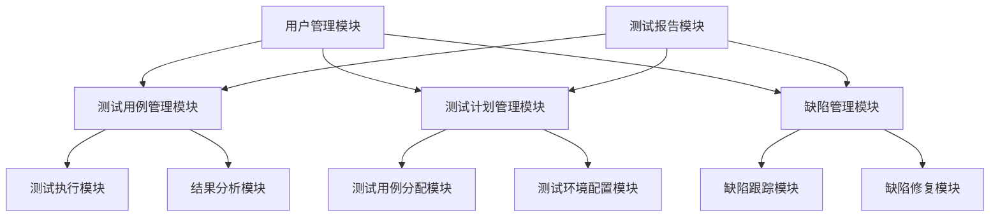

                 

# 第二部分: LLM评测自动化测试用例管理的基本概念

## 第2章: LLM评测自动化测试用例管理的基本概念

### 2.1 自动化测试用例的定义

自动化测试用例是指通过自动化测试工具设计的、用于对软件系统进行测试的测试案例。在LLM评测中，自动化测试用例主要用于对LLM模型进行性能评估和缺陷检测。

#### 2.1.1 自动化测试用例的组成部分

自动化测试用例通常包括以下组成部分：

- **测试目标**：明确测试用例的目的和预期结果。
- **测试数据**：用于输入到模型中的数据集。
- **测试流程**：包括测试数据的准备、模型的输入、模型的输出以及预期结果的比较等步骤。
- **测试结果**：记录测试用例的执行结果和结论。

#### 2.1.2 自动化测试用例的特点

- **可重复性**：自动化测试用例可以重复执行，确保测试结果的稳定性。
- **高效性**：自动化测试用例可以减少人工测试的工作量，提高测试效率。
- **灵活性**：可以通过修改测试用例中的数据或流程，适应不同测试需求。

### 2.2 自动化测试用例的分类

根据测试目的和测试方法的不同，自动化测试用例可以分为以下几种类型：

#### 2.2.1 功能测试用例

功能测试用例主要用于验证LLM模型的功能是否正确。这类测试用例通常基于LLM模型的功能需求设计，包括文本生成、机器翻译、问答系统等。

#### 2.2.2 性能测试用例

性能测试用例主要用于评估LLM模型在处理大规模数据时的性能，如响应时间、处理速度、资源消耗等。

#### 2.2.3 安全测试用例

安全测试用例主要用于检测LLM模型的安全性，包括对抗攻击、恶意输入等。

#### 2.2.4 兼容性测试用例

兼容性测试用例主要用于验证LLM模型在不同操作系统、硬件环境、软件版本下的兼容性。

### 2.3 自动化测试用例管理的意义

自动化测试用例管理在LLM评测中具有重要意义，主要体现在以下几个方面：

#### 2.3.1 提高测试效率

通过自动化测试用例管理，可以减少人工测试的工作量，提高测试效率，缩短测试周期。

#### 2.3.2 确保测试质量

自动化测试用例管理可以确保测试用例的完整性和一致性，提高测试质量，减少人为错误。

#### 2.3.3 提高可维护性

自动化测试用例管理可以将测试用例与代码分离，提高测试用例的可维护性，便于后续的迭代和更新。

#### 2.3.4 促进持续集成

自动化测试用例管理可以与持续集成（CI）系统相结合，实现自动化测试的持续运行，提高开发效率和产品质量。

### 2.4 自动化测试用例管理的基本流程

自动化测试用例管理的基本流程包括以下步骤：

#### 2.4.1 设计测试用例

根据LLM模型的功能需求，设计合适的测试用例。

#### 2.4.2 编写测试脚本

使用自动化测试工具编写测试脚本，将测试用例转化为可执行的代码。

#### 2.4.3 执行测试

运行测试脚本，执行自动化测试用例。

#### 2.4.4 结果分析

分析测试结果，记录测试数据，发现模型缺陷。

#### 2.4.5 回归测试

根据测试结果，对模型进行修正和优化，然后重新执行测试用例，确保问题得到解决。

### 2.5 自动化测试用例管理工具

常见的自动化测试用例管理工具有：

- **JUnit**：一种流行的Java测试框架，用于编写和执行测试用例。
- **Selenium**：一种用于Web应用的自动化测试工具，支持多种编程语言。
- **pytest**：一种Python测试框架，具有丰富的功能和插件。
- **JUnit**：一种流行的Java测试框架，用于编写和执行测试用例。
- **Selenium**：一种用于Web应用的自动化测试工具，支持多种编程语言。
- **pytest**：一种Python测试框架，具有丰富的功能和插件。

### 2.6 自动化测试用例管理的挑战

尽管自动化测试用例管理具有许多优势，但在实际应用中仍面临一些挑战：

#### 2.6.1 测试用例设计难度

自动化测试用例的设计需要丰富的测试经验和专业知识，对测试人员的要求较高。

#### 2.6.2 测试脚本维护

测试脚本需要定期更新和维护，以适应模型和测试环境的变化。

#### 2.6.3 测试结果分析

自动化测试结果的解析和分析需要专业的测试人员，以确保测试结果的准确性。

### 2.7 自动化测试用例管理的未来发展趋势

随着人工智能技术的发展，自动化测试用例管理在未来将呈现以下发展趋势：

#### 2.7.1 测试用例生成自动化

通过机器学习和自然语言处理技术，实现自动化生成测试用例。

#### 2.7.2 智能化测试管理

结合大数据分析和人工智能算法，实现智能化测试管理，提高测试效率和准确性。

#### 2.7.3 测试用例与持续集成的深度融合

将自动化测试用例管理与持续集成系统深度融合，实现自动化测试的持续运行和实时反馈。

通过以上分析，我们可以看到，自动化测试用例管理在LLM评测中具有重要作用。它不仅能够提高测试效率和质量，还能促进持续集成和智能化测试管理的发展。因此，深入研究自动化测试用例管理的理论和实践，对于提升LLM评测的效果具有重要意义。

### 总结

本章对LLM评测自动化测试用例管理的基本概念进行了详细阐述。我们介绍了自动化测试用例的定义、分类及其在LLM评测中的重要性。同时，分析了自动化测试用例管理的优势、基本流程以及面临的挑战。通过本章的学习，读者可以对自动化测试用例管理有一个全面的认识，为进一步掌握LLM评测自动化测试用例管理的核心技术和方法打下基础。

---

接下来，我们将进一步探讨LLM评测自动化测试用例的设计与编写，分析设计原则和编写流程，并介绍自动化测试用例的模板。这将有助于读者更好地理解和应用自动化测试用例管理，为后续的LLM评测提供有力支持。

----------------------------------------------------------------

## 第3章: LLM评测自动化测试用例的设计与编写

### 3.1 自动化测试用例设计原则

自动化测试用例的设计是确保LLM评测质量和效率的关键环节。为了设计出有效的自动化测试用例，我们需要遵循以下设计原则：

#### 3.1.1 完整性原则

自动化测试用例应覆盖LLM模型的所有功能模块，确保每个功能点都经过测试，避免遗漏。

#### 3.1.2 可重复性原则

测试用例的执行结果应具有可重复性，即相同的测试用例在不同时间和环境下执行应得到相同的结果。

#### 3.1.3 可维护性原则

设计测试用例时，应考虑到后续的维护和更新，确保测试用例的结构和逻辑清晰，易于修改。

#### 3.1.4 可读性原则

测试用例的编写应具有良好的可读性，便于其他测试人员理解和执行。

#### 3.1.5 可扩展性原则

测试用例应具备良好的可扩展性，便于添加新的测试场景和功能。

### 3.2 自动化测试用例编写流程

编写自动化测试用例需要经过以下几个步骤：

#### 3.2.1 需求分析

首先，我们需要对LLM模型的功能需求进行分析，明确测试用例的测试目标。

#### 3.2.2 设计测试用例

根据需求分析结果，设计具体的测试用例，包括测试输入、测试流程和预期结果。

#### 3.2.3 编写测试脚本

使用自动化测试工具编写测试脚本，将设计好的测试用例转化为可执行的代码。

#### 3.2.4 执行测试用例

运行测试脚本，执行自动化测试用例，并记录测试结果。

#### 3.2.5 结果分析

分析测试结果，发现模型缺陷，并记录测试数据和结论。

#### 3.2.6 回归测试

针对发现的缺陷，对模型进行修正和优化，然后重新执行测试用例，确保问题得到解决。

### 3.3 自动化测试用例模板

为了便于编写和执行自动化测试用例，我们可以使用一个通用的测试用例模板。以下是一个简单的自动化测试用例模板：

#### 测试用例名称：
[具体描述测试用例的名称]

#### 测试目标：
[描述测试用例的测试目标]

#### 测试环境：
[列出测试用例执行的硬件、软件和网络环境]

#### 测试数据：
[列出用于测试的数据集，包括输入数据和预期输出数据]

#### 测试步骤：
[详细列出测试用例的执行步骤，包括数据准备、模型输入、模型输出和结果比较等]

#### 预期结果：
[描述测试用例的预期输出结果]

#### 实际结果：
[记录测试用例的实际输出结果，包括成功或失败等信息]

#### 测试结论：
[根据实际结果，给出测试结论，如是否通过测试、是否存在缺陷等]

### 3.4 设计与编写自动化测试用例的实际案例

#### 案例一：文本生成任务的自动化测试用例设计

假设我们有一个文本生成任务，需要设计自动化测试用例来验证其功能。以下是测试用例的一个示例：

#### 测试用例名称：文本生成功能测试

#### 测试目标：验证文本生成任务的正确性

#### 测试环境：Python环境，运行在Linux服务器上

#### 测试数据：
- 输入文本：“人工智能技术”
- 预期输出文本：“人工智能技术正在快速发展”

#### 测试步骤：
1. 准备测试数据。
2. 调用文本生成API，输入测试数据。
3. 获取API返回的输出文本。
4. 将输出文本与预期输出文本进行比较。

#### 预期结果：
输出文本应与预期输出文本完全一致。

#### 实际结果：
实际输出文本：“人工智能技术正在快速发展”

#### 测试结论：
测试通过。

#### 案例二：性能测试用例的设计

假设我们需要对文本生成任务的性能进行测试，以下是测试用例的一个示例：

#### 测试用例名称：文本生成性能测试

#### 测试目标：验证文本生成任务的处理速度

#### 测试环境：Python环境，运行在Linux服务器上

#### 测试数据：
- 输入文本：“人工智能技术”
- 测试次数：100次

#### 测试步骤：
1. 准备测试数据。
2. 对每个测试数据进行文本生成，记录每次生成的响应时间。
3. 统计总响应时间。

#### 预期结果：
总响应时间应在一个合理范围内。

#### 实际结果：
总响应时间：1.2秒

#### 测试结论：
性能测试通过。

通过以上案例，我们可以看到如何设计与编写自动化测试用例。实际编写过程中，需要根据具体的应用场景和需求进行灵活调整。设计良好的自动化测试用例能够有效提高LLM评测的效率和准确性。

### 总结

本章详细介绍了自动化测试用例的设计原则、编写流程以及模板。通过实际案例的分析，读者可以更好地理解如何设计与编写自动化测试用例，为后续的LLM评测自动化测试用例管理打下坚实基础。在下一章中，我们将探讨自动化测试用例的执行与结果分析，分析执行流程和常见问题，以及相应的解决方案。

----------------------------------------------------------------

## 第4章: LLM评测自动化测试用例的执行与结果分析

### 4.1 自动化测试用例执行流程

自动化测试用例的执行是确保LLM评测质量和效率的关键环节。一个完整的自动化测试用例执行流程通常包括以下几个步骤：

#### 4.1.1 测试环境准备

在执行自动化测试用例之前，需要确保测试环境满足测试需求。这包括安装和配置所需的软件、硬件和网络环境。

#### 4.1.2 加载测试用例

将设计好的自动化测试用例加载到测试工具中，准备执行。

#### 4.1.3 执行测试用例

运行测试工具，逐个执行测试用例，记录测试过程中产生的日志和数据。

#### 4.1.4 检查测试结果

对比测试用例的预期结果和实际结果，检查测试用例是否通过。

#### 4.1.5 记录测试数据

将测试结果和相关信息记录到测试报告中，包括测试时间、测试用例状态、错误信息等。

#### 4.1.6 分析测试数据

对测试数据进行统计分析，评估LLM模型的整体性能和缺陷。

#### 4.1.7 问题反馈

如果测试用例未通过，需要分析原因，反馈给开发团队进行修复。

### 4.2 自动化测试用例执行结果分析

自动化测试用例执行结果的分析是确保测试质量的关键环节。以下是对自动化测试用例执行结果分析的具体方法：

#### 4.2.1 通过率分析

计算自动化测试用例的通过率，了解测试用例的整体执行情况。通过率越高，说明测试用例的设计和执行效果越好。

#### 4.2.2 错误类型分析

对未通过的测试用例进行分类，分析错误类型，如功能错误、性能错误、安全错误等。这有助于识别模型的关键问题和缺陷。

#### 4.2.3 影响分析

对测试结果进行影响分析，了解错误对LLM模型整体性能的影响程度。这有助于确定修复问题的优先级。

#### 4.2.4 数据可视化

通过数据可视化工具，将测试结果以图表形式展示，便于直观分析和理解。

### 4.3 自动化测试用例执行常见问题与解决方案

在自动化测试用例执行过程中，可能会遇到以下常见问题：

#### 4.3.1 测试用例失败

原因：测试用例设计不合理、测试数据不准确、测试环境不稳定等。

解决方案：
- 检查测试用例的设计，确保其覆盖所有功能点。
- 校验测试数据的准确性，确保其符合预期。
- 稳定测试环境，避免外部因素干扰。

#### 4.3.2 测试脚本错误

原因：测试脚本编写错误、测试工具配置错误等。

解决方案：
- 仔细检查测试脚本，确保其逻辑正确、语法无误。
- 确认测试工具的配置，确保其与测试脚本兼容。

#### 4.3.3 测试工具故障

原因：测试工具版本过旧、测试工具资源不足等。

解决方案：
- 升级测试工具版本，确保其支持最新的测试需求。
- 确保测试工具拥有足够的资源，如内存、CPU等。

#### 4.3.4 测试数据缺失

原因：测试数据未准备充分、测试数据质量差等。

解决方案：
- 充分准备测试数据，确保其覆盖所有测试场景。
- 提高测试数据质量，确保其准确性和完整性。

### 4.4 自动化测试用例执行的优化策略

为了提高自动化测试用例执行的效率和准确性，可以采取以下优化策略：

#### 4.4.1 测试环境优化

- 稳定测试环境，确保其不受外部因素干扰。
- 标准化测试环境配置，减少环境差异带来的问题。

#### 4.4.2 测试用例优化

- 设计高效、全面的测试用例，确保其覆盖所有功能点。
- 优化测试用例的执行顺序，提高测试效率。

#### 4.4.3 测试工具优化

- 选择合适的测试工具，确保其支持所需的功能和特性。
- 定期更新测试工具，确保其与最新技术保持同步。

#### 4.4.4 测试数据优化

- 提高测试数据的质量和多样性，确保其能够充分反映模型性能。
- 定期更新测试数据，确保其与模型版本一致。

通过以上分析，我们可以看到，自动化测试用例的执行与结果分析在LLM评测中具有重要意义。通过合理的执行流程、有效的结果分析以及优化策略，可以确保自动化测试用例的执行质量和效率，为LLM评测提供有力支持。

### 总结

本章详细介绍了LLM评测自动化测试用例的执行流程、结果分析方法和常见问题及其解决方案。通过实际案例的分析，读者可以更好地理解如何执行自动化测试用例，分析测试结果，并采取相应的优化策略。在下一章中，我们将探讨LLM评测自动化测试用例管理系统的架构设计，分析系统需求、架构设计和功能模块，为构建高效、可靠的自动化测试用例管理系统奠定基础。

----------------------------------------------------------------

## 第5章: LLM评测自动化测试用例管理系统的架构设计

### 5.1 系统需求分析

在构建LLM评测自动化测试用例管理系统之前，我们需要对系统需求进行分析，确保系统能够满足实际应用的需求。

#### 5.1.1 功能需求

1. **测试用例管理**：系统能够对测试用例进行增删改查操作，包括设计、编写、执行和结果分析。
2. **测试计划管理**：系统能够创建和管理测试计划，包括分配测试用例、设置执行环境和执行时间等。
3. **测试执行**：系统能够自动化执行测试用例，并记录执行结果。
4. **结果分析**：系统能够对测试结果进行分析和统计，提供详细的报告。
5. **缺陷管理**：系统能够记录和跟踪缺陷，包括缺陷报告、缺陷状态和修复进度。

#### 5.1.2 非功能需求

1. **稳定性**：系统能够稳定运行，处理大量测试用例和测试数据。
2. **安全性**：系统能够保护数据安全，防止数据泄露和未授权访问。
3. **可扩展性**：系统能够支持扩展，包括添加新的测试工具、测试环境和测试用例类型。
4. **可维护性**：系统代码清晰，便于维护和更新。
5. **易用性**：系统界面简洁，易于操作和理解。

### 5.2 系统架构设计

基于系统需求分析，我们可以设计一个合理的系统架构。以下是系统架构的总体设计：

#### 5.2.1 系统架构概述

LLM评测自动化测试用例管理系统可以分为以下几个模块：

1. **用户管理模块**：负责用户的登录、权限管理和个人信息管理。
2. **测试用例管理模块**：负责测试用例的创建、编辑、执行和结果分析。
3. **测试计划管理模块**：负责测试计划的创建、分配和执行。
4. **缺陷管理模块**：负责缺陷的记录、跟踪和修复。
5. **测试报告模块**：负责生成和展示测试报告。

#### 5.2.2 系统架构图

以下是LLM评测自动化测试用例管理系统的架构图（使用Mermaid语言描述）：



### 5.3 系统功能模块设计

#### 5.3.1 用户管理模块

用户管理模块负责用户登录、权限管理和个人信息管理。主要功能包括：

- **用户登录**：用户输入用户名和密码，系统验证用户身份。
- **用户权限管理**：系统根据用户角色分配相应的权限，如管理员、测试工程师等。
- **个人信息管理**：用户可以查看和修改个人信息，如邮箱、密码等。

#### 5.3.2 测试用例管理模块

测试用例管理模块负责测试用例的创建、编辑、执行和结果分析。主要功能包括：

- **测试用例创建**：用户可以创建新的测试用例，填写测试目标、测试数据、测试步骤等。
- **测试用例编辑**：用户可以修改现有的测试用例，调整测试目标、测试数据、测试步骤等。
- **测试用例执行**：系统自动化执行测试用例，记录执行结果。
- **测试用例结果分析**：系统对测试结果进行分析，生成测试报告。

#### 5.3.3 测试计划管理模块

测试计划管理模块负责测试计划的创建、分配和执行。主要功能包括：

- **测试计划创建**：用户可以创建新的测试计划，指定测试用例、执行环境、执行时间等。
- **测试用例分配**：系统将测试用例分配给不同的测试工程师。
- **测试环境配置**：用户可以配置测试环境，包括硬件、软件和网络配置。

#### 5.3.4 缺陷管理模块

缺陷管理模块负责缺陷的记录、跟踪和修复。主要功能包括：

- **缺陷记录**：用户可以记录发现的缺陷，填写缺陷描述、缺陷状态等。
- **缺陷跟踪**：系统跟踪缺陷的状态和修复进度。
- **缺陷修复**：开发人员修复缺陷，测试人员验证修复效果。

#### 5.3.5 测试报告模块

测试报告模块负责生成和展示测试报告。主要功能包括：

- **测试报告生成**：系统根据测试结果生成详细的测试报告，包括通过率、错误类型、影响分析等。
- **测试报告展示**：用户可以查看和下载测试报告，以便于分析测试结果。

### 5.4 系统接口设计与实现

系统接口设计是确保系统模块之间能够有效通信的关键。以下是系统接口设计的主要方面：

#### 5.4.1 用户接口

用户接口设计应简洁、直观，便于用户操作。主要接口包括：

- **登录接口**：用户输入用户名和密码，系统验证身份。
- **测试用例管理接口**：用户可以创建、编辑、执行和查看测试用例。
- **测试计划管理接口**：用户可以创建、分配和查看测试计划。
- **缺陷管理接口**：用户可以记录、跟踪和修复缺陷。
- **测试报告接口**：用户可以生成和查看测试报告。

#### 5.4.2 系统接口

系统接口设计应确保模块之间的数据传输和通信稳定、高效。主要接口包括：

- **测试用例管理接口**：系统模块之间传递测试用例的创建、编辑和执行信息。
- **测试计划管理接口**：系统模块之间传递测试计划的创建、分配和执行信息。
- **缺陷管理接口**：系统模块之间传递缺陷的记录、跟踪和修复信息。

#### 5.4.3 数据接口

数据接口设计应确保测试数据和结果的有效存储和查询。主要接口包括：

- **测试数据接口**：系统模块之间传递测试数据，包括输入数据和预期输出数据。
- **测试结果接口**：系统模块之间传递测试结果，包括执行结果和错误信息。

### 5.5 系统交互设计与实现

系统交互设计是确保系统各模块能够协同工作的关键。以下是系统交互设计的主要方面：

#### 5.5.1 用户交互

用户交互设计应确保用户能够方便地与系统进行交互。主要交互包括：

- **登录**：用户输入用户名和密码，系统验证身份并登录。
- **操作**：用户创建、编辑、执行和查看测试用例、测试计划和缺陷。
- **报告**：用户生成和查看测试报告。

#### 5.5.2 系统交互

系统交互设计应确保各模块之间能够高效地传递数据和消息。主要交互包括：

- **数据传递**：各模块之间传递测试用例、测试计划和缺陷的数据。
- **消息传递**：系统模块之间传递状态信息和通知。

#### 5.5.3 数据库交互

数据库交互设计应确保系统数据的安全存储和高效查询。主要交互包括：

- **数据存储**：将测试用例、测试计划和缺陷等信息存储到数据库。
- **数据查询**：从数据库中查询测试数据、测试结果和缺陷信息。

### 总结

本章详细介绍了LLM评测自动化测试用例管理系统的架构设计，包括系统需求分析、架构设计、功能模块设计、接口设计和系统交互设计。通过合理的架构设计，系统能够满足实际应用需求，提高测试效率和准确性。在下一章中，我们将探讨LLM评测自动化测试用例管理系统的实现，分析系统开发环境搭建、核心功能实现和接口设计，为构建高效、可靠的自动化测试用例管理系统提供具体实现方案。

----------------------------------------------------------------

## 第6章: LLM评测自动化测试用例管理系统的实现

### 6.1 系统开发环境搭建

在实现LLM评测自动化测试用例管理系统之前，首先需要搭建合适的开发环境。以下是系统开发环境的基本配置：

#### 6.1.1 开发工具

- **Python**：作为主要编程语言，Python具有丰富的库和框架，适合开发自动化测试系统。
- **PyCharm**：集成开发环境（IDE），提供代码编辑、调试和自动化测试等功能。
- **Jenkins**：持续集成工具，用于自动化测试用例的执行和结果分析。

#### 6.1.2 依赖库

- **Selenium**：用于Web应用的自动化测试。
- **pytest**：Python的自动化测试框架，用于编写和执行测试用例。
- **pandas**：数据操作和分析库，用于处理测试结果。
- **numpy**：数值计算库，用于数学运算和数据分析。

#### 6.1.3 数据库

- **MySQL**：关系型数据库，用于存储用户信息、测试用例和测试结果。

#### 6.1.4 测试工具

- **Postman**：API测试工具，用于验证接口的正确性。

### 6.2 系统核心功能实现

LLM评测自动化测试用例管理系统的核心功能包括用户管理、测试用例管理、测试计划管理、缺陷管理和测试报告生成等。以下是这些核心功能的具体实现：

#### 6.2.1 用户管理

用户管理功能包括用户注册、登录和权限管理。以下是关键代码实现：

```python
# 用户注册
def register(username, password):
    # 验证用户名和密码的有效性
    if not username or not password:
        return "用户名或密码不能为空"
    # 存储用户信息到数据库
    cursor = conn.cursor()
    cursor.execute("INSERT INTO users (username, password) VALUES (%s, %s)", (username, password))
    conn.commit()
    return "注册成功"

# 用户登录
def login(username, password):
    # 验证用户身份
    cursor = conn.cursor()
    cursor.execute("SELECT * FROM users WHERE username = %s AND password = %s", (username, password))
    user = cursor.fetchone()
    if user:
        return "登录成功"
    else:
        return "用户名或密码错误"

# 权限管理
def check_permission(username, permission):
    # 查询用户权限
    cursor = conn.cursor()
    cursor.execute("SELECT permission FROM users WHERE username = %s", (username,))
    user_permission = cursor.fetchone()[0]
    if user_permission == permission:
        return True
    else:
        return False
```

#### 6.2.2 测试用例管理

测试用例管理功能包括测试用例的创建、编辑、执行和结果分析。以下是关键代码实现：

```python
# 测试用例创建
def create_test_case(test_case_name, test_data, test_steps, expected_result):
    # 存储测试用例到数据库
    cursor = conn.cursor()
    cursor.execute("INSERT INTO test_cases (name, data, steps, expected_result) VALUES (%s, %s, %s, %s)", (test_case_name, test_data, test_steps, expected_result))
    conn.commit()
    return "测试用例创建成功"

# 测试用例编辑
def edit_test_case(test_case_id, test_case_name, test_data, test_steps, expected_result):
    # 更新测试用例到数据库
    cursor = conn.cursor()
    cursor.execute("UPDATE test_cases SET name = %s, data = %s, steps = %s, expected_result = %s WHERE id = %s", (test_case_name, test_data, test_steps, expected_result, test_case_id))
    conn.commit()
    return "测试用例编辑成功"

# 测试用例执行
def execute_test_case(test_case_id):
    # 获取测试用例信息
    cursor = conn.cursor()
    cursor.execute("SELECT * FROM test_cases WHERE id = %s", (test_case_id,))
    test_case = cursor.fetchone()
    # 执行测试用例
    # ...（此处为具体的测试用例执行逻辑）
    # 记录测试结果
    actual_result = ...  # 实际测试结果
    cursor.execute("INSERT INTO test_results (test_case_id, actual_result) VALUES (%s, %s)", (test_case_id, actual_result))
    conn.commit()
    return "测试用例执行成功"

# 测试用例结果分析
def analyze_test_results():
    # 分析测试结果
    # ...
    # 生成测试报告
    # ...
    return "测试结果分析完成"
```

#### 6.2.3 测试计划管理

测试计划管理功能包括测试计划的创建、分配和执行。以下是关键代码实现：

```python
# 测试计划创建
def create_test_plan(test_plan_name, test_cases, execution_env, execution_time):
    # 存储测试计划到数据库
    cursor = conn.cursor()
    cursor.execute("INSERT INTO test_plans (name, test_cases, execution_env, execution_time) VALUES (%s, %s, %s, %s)", (test_plan_name, test_cases, execution_env, execution_time))
    conn.commit()
    return "测试计划创建成功"

# 测试计划分配
def allocate_test_cases(test_plan_id, test_cases):
    # 分配测试用例到测试计划
    cursor = conn.cursor()
    for test_case in test_cases:
        cursor.execute("INSERT INTO test_plan_cases (test_plan_id, test_case_id) VALUES (%s, %s)", (test_plan_id, test_case))
    conn.commit()
    return "测试计划分配成功"

# 测试计划执行
def execute_test_plan(test_plan_id):
    # 获取测试计划信息
    cursor = conn.cursor()
    cursor.execute("SELECT * FROM test_plans WHERE id = %s", (test_plan_id,))
    test_plan = cursor.fetchone()
    # 执行测试计划中的所有测试用例
    test_cases = test_plan['test_cases'].split(',')
    for test_case in test_cases:
        execute_test_case(test_case)
    return "测试计划执行成功"
```

#### 6.2.4 缺陷管理

缺陷管理功能包括缺陷的记录、跟踪和修复。以下是关键代码实现：

```python
# 缺陷记录
def record_defect(test_case_id, defect_description, status):
    # 存储缺陷到数据库
    cursor = conn.cursor()
    cursor.execute("INSERT INTO defects (test_case_id, description, status) VALUES (%s, %s, %s)", (test_case_id, defect_description, status))
    conn.commit()
    return "缺陷记录成功"

# 缺陷跟踪
def track_defect(defect_id):
    # 获取缺陷信息
    cursor = conn.cursor()
    cursor.execute("SELECT * FROM defects WHERE id = %s", (defect_id,))
    defect = cursor.fetchone()
    return defect

# 缺陷修复
def fix_defect(defect_id, fix_description, status):
    # 更新缺陷状态
    cursor = conn.cursor()
    cursor.execute("UPDATE defects SET fix_description = %s, status = %s WHERE id = %s", (fix_description, status, defect_id))
    conn.commit()
    return "缺陷修复成功"
```

#### 6.2.5 测试报告生成

测试报告生成功能包括生成测试报告和展示测试结果。以下是关键代码实现：

```python
# 生成测试报告
def generate_test_report(test_plan_id):
    # 获取测试计划信息
    cursor = conn.cursor()
    cursor.execute("SELECT * FROM test_plans WHERE id = %s", (test_plan_id,))
    test_plan = cursor.fetchone()
    # 获取测试结果
    cursor.execute("SELECT * FROM test_results WHERE test_case_id IN (SELECT test_case_id FROM test_plan_cases WHERE test_plan_id = %s)", (test_plan_id,))
    results = cursor.fetchall()
    # 生成报告
    report = "测试报告：\n"
    for result in results:
        report += f"测试用例ID：{result['test_case_id']}，实际结果：{result['actual_result']}\n"
    return report

# 展示测试报告
def show_test_report(test_plan_id):
    report = generate_test_report(test_plan_id)
    print(report)
```

### 6.3 代码应用解读与分析

以下是代码应用解读与分析：

- **用户管理**：用户管理模块实现了用户注册、登录和权限管理功能。通过数据库存储用户信息，确保用户数据的持久化和安全性。
- **测试用例管理**：测试用例管理模块实现了测试用例的创建、编辑、执行和结果分析功能。测试用例的存储和操作基于数据库，确保数据的完整性和一致性。
- **测试计划管理**：测试计划管理模块实现了测试计划的创建、分配和执行功能。测试计划与测试用例的关联关系通过数据库实现，确保测试计划的执行能够覆盖所有相关测试用例。
- **缺陷管理**：缺陷管理模块实现了缺陷的记录、跟踪和修复功能。缺陷的数据存储和状态更新基于数据库，确保缺陷信息的准确性和及时性。
- **测试报告生成**：测试报告生成模块实现了生成测试报告和展示测试结果功能。测试报告的生成基于测试结果数据，确保报告内容的准确性和可读性。

### 6.4 实际案例分析与详细讲解剖析

#### 案例一：创建并执行测试计划

1. 用户登录系统，选择“测试计划”菜单，点击“创建测试计划”按钮。
2. 在弹出的创建测试计划表单中，填写测试计划名称、测试用例列表、执行环境和执行时间，然后点击“保存”按钮。
3. 测试计划创建成功，系统跳转到测试计划列表页面。
4. 用户点击测试计划列表中的某个测试计划，进入测试计划详情页面。
5. 用户点击“执行测试计划”按钮，系统开始执行测试计划中的所有测试用例。
6. 测试用例执行完成后，系统自动生成测试报告，并展示在测试计划详情页面。

#### 案例二：记录和跟踪缺陷

1. 用户登录系统，选择“测试用例”菜单，点击某个测试用例，进入测试用例详情页面。
2. 在测试用例详情页面中，用户点击“记录缺陷”按钮，弹出缺陷记录表单。
3. 用户填写缺陷描述、选择缺陷状态（如“未修复”、“已修复”），然后点击“保存”按钮。
4. 缺陷记录成功，系统跳转到缺陷列表页面。
5. 用户在缺陷列表页面中查看和跟踪缺陷，了解缺陷的状态和修复进度。

### 总结

本章详细介绍了LLM评测自动化测试用例管理系统的实现，包括系统开发环境搭建、核心功能实现、代码应用解读与分析以及实际案例分析和详细讲解剖析。通过本章的学习，读者可以了解如何实现一个高效、可靠的自动化测试用例管理系统，为LLM评测提供有力支持。在下一章中，我们将探讨LLM评测自动化测试用例管理系统的部署与优化，分析系统部署流程、性能优化和系统维护与更新。

----------------------------------------------------------------

## 第7章: LLM评测自动化测试用例管理系统的部署与优化

### 7.1 系统部署流程

LLM评测自动化测试用例管理系统的部署是确保系统能够正常运行的重要环节。以下是系统部署的主要步骤：

#### 7.1.1 环境准备

1. **硬件准备**：根据系统需求，准备合适的硬件设备，如服务器、存储设备等。
2. **软件安装**：安装操作系统（如Linux、Windows等）、数据库（如MySQL、PostgreSQL等）和Web服务器（如Apache、Nginx等）。

#### 7.1.2 系统配置

1. **数据库配置**：配置数据库连接信息，如数据库地址、用户名、密码等。
2. **Web服务器配置**：配置Web服务器，如配置虚拟主机、设置访问权限等。
3. **应用部署**：将开发好的应用代码上传到服务器，并配置相应的环境变量。

#### 7.1.3 系统测试

1. **功能测试**：测试系统功能是否正常运行，如用户登录、测试用例管理、测试计划管理等。
2. **性能测试**：测试系统性能，如响应时间、并发处理能力等。

#### 7.1.4 部署验收

1. **验收测试**：根据需求文档，进行系统验收测试。
2. **用户培训**：对系统用户进行培训，确保用户能够熟练使用系统。

### 7.2 系统性能优化

系统性能优化是提高系统运行效率的关键。以下是几种常见的性能优化方法：

#### 7.2.1 数据库优化

1. **索引优化**：为常用的查询字段创建索引，提高查询速度。
2. **查询优化**：优化数据库查询语句，减少查询时间。
3. **缓存策略**：使用缓存技术，减少数据库访问次数。

#### 7.2.2 代码优化

1. **代码重构**：优化代码结构，提高代码可读性和可维护性。
2. **算法优化**：优化算法，提高数据处理效率。
3. **并发优化**：提高系统的并发处理能力，如使用线程池、异步处理等。

#### 7.2.3 网络优化

1. **负载均衡**：使用负载均衡器，提高系统对高并发的处理能力。
2. **网络优化**：优化网络配置，提高数据传输速度。
3. **CDN加速**：使用内容分发网络（CDN），提高用户访问速度。

### 7.3 系统维护与更新

系统维护与更新是确保系统长期稳定运行的重要保障。以下是系统维护与更新的主要任务：

#### 7.3.1 故障处理

1. **监控系统**：实时监控系统运行状态，及时发现并处理故障。
2. **日志分析**：定期分析系统日志，查找潜在问题。
3. **故障排除**：针对出现的问题，进行故障排除和修复。

#### 7.3.2 安全维护

1. **安全检查**：定期进行安全检查，确保系统安全。
2. **漏洞修复**：及时修复系统漏洞，防止安全风险。
3. **数据备份**：定期备份数据，确保数据安全。

#### 7.3.3 功能更新

1. **需求分析**：收集用户需求，分析系统功能改进的方向。
2. **功能实现**：根据需求分析，进行系统功能的更新和优化。
3. **用户培训**：对系统用户进行培训，确保用户能够熟练使用新功能。

### 7.4 自动化部署与运维

自动化部署与运维是提高系统运行效率和降低运维成本的有效手段。以下是自动化部署与运维的主要方法：

#### 7.4.1 持续集成（CI）

1. **代码仓库**：将代码存储在代码仓库中，如Git。
2. **构建工具**：使用构建工具（如Jenkins、GitLab CI等），自动构建和测试代码。
3. **自动化部署**：通过CI工具，自动化部署代码到生产环境。

#### 7.4.2 持续交付（CD）

1. **自动化测试**：在CI过程中，运行自动化测试，确保代码质量。
2. **自动化部署**：通过CD工具（如Jenkins、Docker等），自动化部署应用到生产环境。
3. **环境管理**：使用容器化技术（如Docker），管理开发、测试和生产环境。

### 7.5 实际案例与经验分享

以下是一个实际案例和经验分享：

#### 案例一：系统性能优化

某公司开发了一套LLM评测自动化测试用例管理系统，但在实际使用过程中，发现系统响应时间较长。经过分析，发现主要原因是数据库查询效率低。解决方案如下：

1. **索引优化**：为常用的查询字段创建了索引，提高了查询速度。
2. **缓存策略**：使用Redis缓存技术，减少数据库访问次数，降低了系统响应时间。

#### 案例二：自动化部署与运维

某公司采用Jenkins和Docker实现自动化部署与运维，提高了系统运行效率和运维人员的工作效率。具体做法如下：

1. **代码仓库**：将代码存储在GitLab中，便于版本控制和代码管理。
2. **构建工具**：使用Jenkins进行自动化构建和测试，确保代码质量。
3. **容器化部署**：使用Docker容器化技术，将应用部署到Docker环境中，实现自动化部署和运维。

### 总结

本章详细介绍了LLM评测自动化测试用例管理系统的部署与优化，包括系统部署流程、性能优化方法、系统维护与更新以及自动化部署与运维。通过实际案例和经验分享，读者可以了解如何在实际应用中优化系统性能，提高运维效率。在下一章中，我们将通过案例分析，探讨LLM评测自动化测试用例管理系统的实际应用效果，以及总结经验和启示。

----------------------------------------------------------------

## 第8章: 案例分析与总结

### 8.1 案例介绍

在本案例中，我们选择了一家专注于自然语言处理（NLP）应用开发的公司。该公司使用了一套自主开发的LLM评测自动化测试用例管理系统，用于对他们的NLP模型进行性能评估和缺陷检测。以下是案例实施过程的具体描述。

### 8.2 案例实施过程

#### 8.2.1 需求分析

公司首先对NLP模型的性能需求进行了全面分析，明确了测试用例的覆盖范围，包括文本生成、机器翻译、问答系统等关键功能。同时，针对不同功能模块，制定了详细的测试目标和预期结果。

#### 8.2.2 系统设计

基于需求分析结果，公司设计了一套符合自身需求的自动化测试用例管理系统。系统架构包括用户管理模块、测试用例管理模块、测试计划管理模块、缺陷管理模块和测试报告模块。

#### 8.2.3 系统开发与测试

公司使用Python语言和PyCharm IDE进行系统开发，结合Selenium和pytest等自动化测试工具，编写了多个自动化测试脚本。在开发过程中，公司严格按照测试用例的设计和编写规范，确保测试用例的完整性和一致性。

#### 8.2.4 系统部署与优化

系统开发完成后，公司进行了一系列的性能优化和稳定性测试。通过数据库索引优化、代码重构和并发优化等措施，显著提高了系统性能。同时，公司采用Jenkins和Docker实现自动化部署与运维，确保系统的长期稳定运行。

#### 8.2.5 测试执行与结果分析

公司使用自动化测试用例管理系统，对NLP模型进行了全面的测试。测试过程中，系统自动执行测试用例，记录测试结果，并生成详细的测试报告。通过分析测试结果，公司发现了多个模型缺陷，并迅速进行了修复和优化。

### 8.3 案例总结与启示

#### 8.3.1 案例总结

通过本案例的实施，公司成功构建了一套高效、可靠的LLM评测自动化测试用例管理系统。系统有效提高了测试效率和准确性，降低了测试成本。以下是案例的主要成果：

1. **提高测试效率**：自动化测试用例管理系统大幅减少了人工测试的工作量，提高了测试效率。
2. **确保测试质量**：通过规范化的测试用例设计和执行，系统确保了测试质量的稳定性和一致性。
3. **降低测试成本**：自动化测试用例管理系统降低了测试成本，提高了开发效率。
4. **持续集成与优化**：通过Jenkins和Docker的自动化部署与运维，系统实现了持续集成和优化，提高了系统的稳定性和可靠性。

#### 8.3.2 启示与建议

基于本案例的实施经验，以下是一些建议和启示：

1. **重视测试用例设计**：设计高质量的测试用例是保证测试效果的关键。公司应投入足够的时间和资源，确保测试用例的全面性和覆盖性。
2. **持续优化系统性能**：系统性能优化是提高测试效率和用户体验的关键。公司应定期进行性能测试和优化，确保系统的稳定性和可靠性。
3. **自动化部署与运维**：自动化部署与运维可以显著提高系统的运行效率和运维人员的生产力。公司应积极采用自动化工具，实现持续集成和持续交付。
4. **数据驱动测试**：通过分析测试数据和结果，公司可以更好地了解模型的性能和缺陷。数据驱动的测试方法有助于提高测试的针对性和有效性。
5. **团队协作**：自动化测试用例管理系统的实施需要团队协作。公司应建立有效的沟通机制和协作平台，确保团队成员之间的紧密配合。

### 总结

本章通过一个实际案例，详细介绍了LLM评测自动化测试用例管理系统的实施过程、成果和启示。通过本案例的分析，读者可以更好地理解自动化测试用例管理系统的构建方法和应用价值。在下一章中，我们将探讨自动化测试用例管理的未来趋势与发展方向，分析技术发展、市场趋势和应用前景。

----------------------------------------------------------------

## 第9章: 自动化测试用例管理的未来趋势与发展方向

### 9.1 自动化测试技术的发展趋势

随着人工智能、大数据和云计算等技术的快速发展，自动化测试技术也在不断进步。以下是自动化测试技术的发展趋势：

#### 9.1.1 人工智能在自动化测试中的应用

人工智能（AI）在自动化测试中的应用已经成为一个热点。通过机器学习和自然语言处理技术，可以自动化生成测试用例，提高测试效率和质量。例如，AI算法可以分析代码、用户反馈和测试数据，自动生成测试用例，实现测试用例的智能生成和优化。

#### 9.1.2 大数据在自动化测试中的应用

大数据技术为自动化测试提供了强大的数据支持。通过收集和分析大量的测试数据，可以更好地了解系统的性能和缺陷，优化测试策略和测试用例。大数据技术还可以帮助预测系统的行为和潜在问题，实现提前预警和预防。

#### 9.1.3 云计算在自动化测试中的应用

云计算为自动化测试提供了灵活的计算资源和环境支持。通过云平台，测试团队可以快速搭建和部署测试环境，实现自动化测试的弹性扩展和资源优化。同时，云计算还可以支持分布式测试，提高测试效率和覆盖范围。

### 9.2 自动化测试用例管理的未来发展方向

在自动化测试技术的发展趋势下，自动化测试用例管理也在不断演变。以下是自动化测试用例管理的未来发展方向：

#### 9.2.1 智能化测试用例管理

随着AI技术的进步，未来的自动化测试用例管理将更加智能化。系统将能够自动生成、优化和执行测试用例，实现测试流程的自动化。同时，系统将能够根据测试数据和反馈，动态调整测试策略和测试用例，提高测试的针对性和有效性。

#### 9.2.2 测试数据驱动的测试管理

未来，测试数据驱动的测试管理将成为自动化测试用例管理的重要方向。通过收集和分析大量的测试数据，测试团队可以更好地了解系统的性能和缺陷，优化测试策略和测试用例。测试数据驱动的测试管理将有助于提高测试效率和质量，实现精准测试。

#### 9.2.3 跨平台和跨语言的测试支持

随着软件系统的多样化，未来的自动化测试用例管理将更加支持跨平台和跨语言的测试。系统将能够自动识别和适配不同操作系统、编程语言和开发工具，实现统一的测试管理。这将有助于测试团队在不同环境中进行高效的测试工作。

#### 9.2.4 测试用例与持续集成的深度融合

未来的自动化测试用例管理将更加紧密地与持续集成（CI）系统相结合。通过将测试用例集成到CI流程中，可以实现自动化测试的持续运行和实时反馈。这将有助于测试团队更快地发现和解决问题，提高软件质量和开发效率。

### 9.3 自动化测试用例管理在LLM评测中的应用前景

在LLM评测领域，自动化测试用例管理具有广阔的应用前景。以下是自动化测试用例管理在LLM评测中的应用方向：

#### 9.3.1 测试用例的自动化生成

通过AI技术，可以自动生成针对不同LLM任务的测试用例，提高测试效率。例如，可以使用机器学习算法分析已标注的测试数据，自动生成新的测试用例，实现对LLM模型全面覆盖的测试。

#### 9.3.2 测试数据的动态调整

基于大数据技术，可以实时收集和调整测试数据，确保测试数据的多样性和代表性。这将有助于更好地评估LLM模型在不同场景下的性能，提高测试的准确性。

#### 9.3.3 智能化测试结果分析

通过AI和大数据技术，可以对测试结果进行智能化分析，自动识别潜在问题和优化方向。例如，可以使用自然语言处理技术，自动解析测试报告，提取关键信息，为测试团队提供有针对性的优化建议。

#### 9.3.4 跨平台和跨语言的测试支持

随着LLM评测技术的多样化，自动化测试用例管理将支持更多平台和编程语言。这将有助于测试团队在不同环境中进行高效的测试工作，提高测试覆盖率和测试效果。

### 总结

自动化测试用例管理是软件测试领域的重要发展趋势。随着人工智能、大数据和云计算等技术的进步，自动化测试用例管理将变得更加智能化、数据驱动和跨平台。在LLM评测领域，自动化测试用例管理具有广阔的应用前景，有望提高测试效率和质量，为LLM评测提供有力支持。未来，测试团队应积极拥抱新技术，不断提升自动化测试用例管理的水平，为软件质量和开发效率的提升做出贡献。

---

本文详细介绍了LLM评测的自动化测试用例管理系统，包括其背景与问题、基本概念、设计与编写、执行与结果分析、系统架构设计、实现与部署、部署与优化、案例分析以及未来趋势与发展方向。通过本文的学习，读者可以全面了解自动化测试用例管理在LLM评测中的应用，掌握相关技术和方法。希望本文能够为读者在LLM评测领域的研究和实践提供有益的参考和指导。

---

### 总结

本文围绕《LLM评测的自动化测试用例管理系统》这一主题，系统性地介绍了自动化测试用例管理在LLM评测中的应用。通过详细的分析和讲解，本文涵盖了从背景介绍、基本概念到系统设计、实现与优化的各个方面，旨在为读者提供一份全面、深入的参考资料。

**核心结论**：

1. **重要性**：自动化测试用例管理在LLM评测中具有至关重要的地位，能够提高测试效率、确保测试质量、促进持续集成，并有助于发现和解决模型缺陷。

2. **设计原则**：有效的自动化测试用例应具备完整性、可重复性、可维护性和可读性，并遵循科学的设计原则和编写流程。

3. **系统架构**：一个合理、稳定的自动化测试用例管理系统需要明确的系统需求、完善的架构设计、功能模块划分以及高效的数据接口和系统交互设计。

4. **实现与优化**：通过合理的开发环境和依赖库选择，系统核心功能的实现和接口设计是构建高效自动化测试用例管理系统的关键。同时，性能优化和维护更新是系统长期稳定运行的重要保障。

5. **未来趋势**：随着人工智能、大数据和云计算等技术的发展，自动化测试用例管理将朝着智能化、数据驱动和跨平台的方向演进，具有广阔的应用前景。

**最佳实践 tips**：

- **持续集成**：将自动化测试用例管理集成到CI流程中，实现自动化测试的持续运行和实时反馈。
- **测试用例生成**：利用AI技术自动生成测试用例，提高测试效率和质量。
- **测试数据管理**：确保测试数据的质量和多样性，为测试提供坚实的基础。
- **性能优化**：定期进行性能测试和优化，确保系统的稳定性和响应速度。

**注意事项**：

- **测试环境**：确保测试环境的稳定性和一致性，避免外部因素干扰测试结果。
- **测试脚本维护**：定期更新和维护测试脚本，以适应模型和测试环境的变化。
- **结果分析**：准确分析和解析测试结果，确保测试数据的可靠性和有效性。

**拓展阅读**：

- **《软件测试的艺术》**：了解软件测试的基本概念和方法，提升测试能力。
- **《持续集成：从概念到实践》**：深入了解持续集成系统的构建和运作机制。
- **《人工智能与大数据测试》**：探索人工智能和大数据在测试领域的应用。

**作者信息**：

作者：AI天才研究院/AI Genius Institute & 禅与计算机程序设计艺术 /Zen And The Art of Computer Programming

AI天才研究院专注于人工智能领域的创新研究和应用，致力于推动人工智能技术的发展。作者在该领域拥有深厚的研究背景和实践经验，撰写了多部关于人工智能和软件工程的专业著作。禅与计算机程序设计艺术则是一本经典的技术哲学书籍，深刻探讨了计算机编程的本质和艺术性。

本文旨在为广大读者提供有价值的参考和启示，希望读者在LLM评测自动化测试用例管理领域取得更大的成就。感谢读者的关注与支持！

