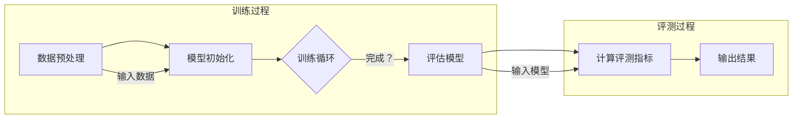
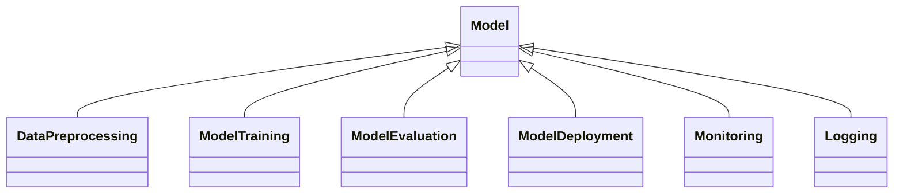
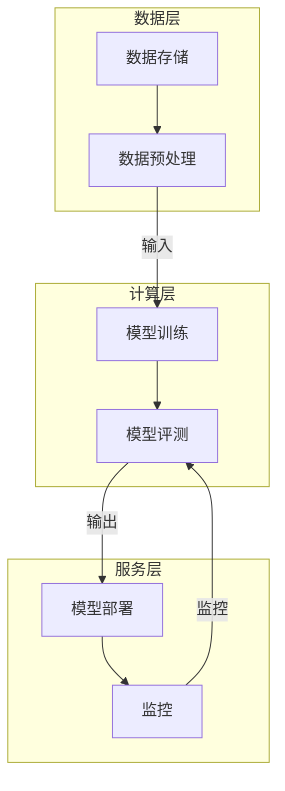
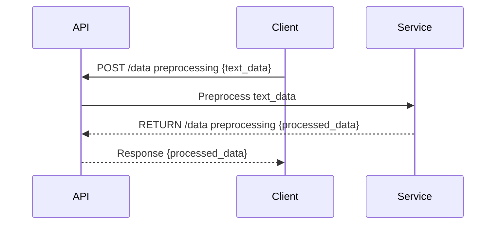
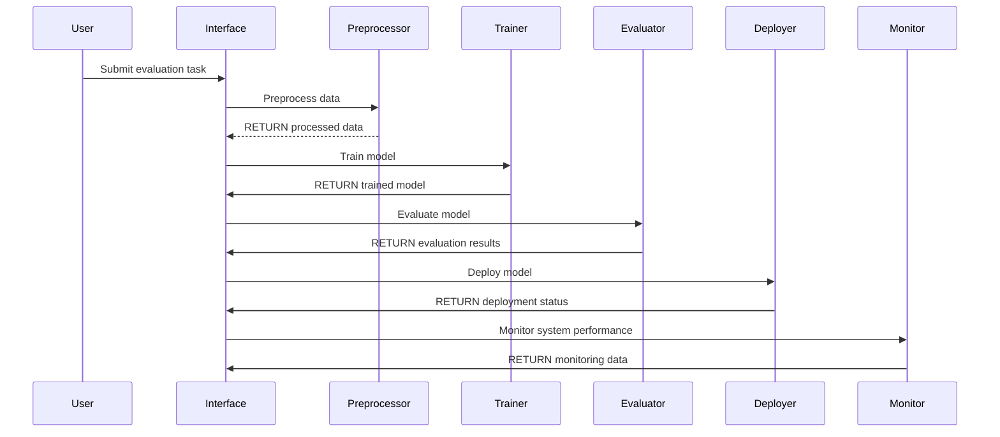

                 


## LLMM评测系统的分布式架构设计

### 引言

#### 1.1 问题背景与挑战

随着深度学习技术的迅猛发展，大型语言模型（LLM，Large Language Model）如BERT、GPT等已经成为自然语言处理（NLP，Natural Language Processing）领域的重要工具。这些模型具有强大的文本生成、理解和推理能力，但在实际应用中，LLM评测系统面临着诸多挑战。首先，LLM模型的计算量巨大，需要大量的计算资源和时间来训练和评估。其次，随着模型规模的不断扩大，单机部署已经无法满足需求，分布式架构成为必然选择。最后，评测系统的性能和可靠性也是关键因素，需要保证在分布式环境下的高效性和稳定性。

#### 1.2 问题的解决方法

针对上述挑战，分布式架构设计成为解决LLM评测系统问题的关键。分布式架构可以通过将计算任务分散到多个节点上，提高系统的计算能力和效率。同时，分布式架构还可以提高系统的容错性和可扩展性，使得系统在处理大规模数据时仍然能够保持高性能和稳定性。本文将详细探讨LLM评测系统的分布式架构设计，包括核心概念、算法原理、系统分析与架构设计方案、项目实战以及最佳实践等内容。

#### 1.3 边界与外延

本文将主要关注以下边界与外延：

1. **边界**：本文将聚焦于LLM评测系统的分布式架构设计，不包括模型训练过程和评估方法的研究。
2. **外延**：本文将探讨分布式架构的基本原理、设计模式和最佳实践，以期为开发者提供有价值的参考和指导。

### 概念结构与核心要素组成

LLM评测系统的分布式架构设计涉及多个核心概念和要素，以下是其中的几个关键组成部分：

1. **语言模型**：作为评测系统的核心组件，语言模型负责文本生成、理解和推理任务。
2. **评测指标**：用于评估语言模型性能的指标，如准确率、召回率、F1分数等。
3. **分布式系统架构**：用于实现LLM评测系统的分布式计算架构，包括数据分发、负载均衡、容错机制等。
4. **计算节点**：分布式架构中的计算资源，包括服务器、GPU等。
5. **数据存储**：用于存储训练数据和评测结果的数据库或文件系统。
6. **监控与日志**：用于监控系统性能和记录系统日志的工具和框架。

在下一章中，我们将详细探讨这些核心概念及其相互关系，为后续的算法原理讲解和系统分析与架构设计方案奠定基础。

### 核心概念与联系

#### 2.1 核心概念原理

在LLM评测系统的分布式架构设计中，有几个关键的核心概念需要深入理解。

##### 2.1.1 语言模型概述

语言模型是一种用于预测下一个单词或字符的概率分布的数学模型。在NLP领域，语言模型已经成为文本生成和理解的重要工具。常见的语言模型有n-gram模型、基于神经网络的模型（如BERT、GPT）等。这些模型通过学习大量文本数据，可以生成高质量的自然语言文本，并在各种NLP任务中表现出色。

##### 2.1.2 评测指标详解

为了评估语言模型的性能，需要使用一系列评测指标。常见的评测指标包括：

- **准确率（Accuracy）**：预测正确的样本数占总样本数的比例。
- **召回率（Recall）**：预测正确的正样本数占所有正样本数的比例。
- **F1分数（F1 Score）**：准确率和召回率的调和平均值，用于综合评估模型性能。
- **BLEU分数（BLEU Score）**：基于n-gram匹配的自动评估指标，用于评估生成文本与参考文本的相似度。

这些评测指标可以从不同角度评估语言模型的性能，帮助开发者了解模型的优劣。

##### 2.1.3 分布式系统架构

分布式系统架构是LLM评测系统设计的关键因素。分布式系统通过将计算任务分散到多个节点上，可以提高系统的计算能力和效率。常见的分布式架构包括：

- **数据分发**：将训练数据和评测数据分发到各个计算节点，使得每个节点可以独立处理数据。
- **负载均衡**：根据节点的负载情况，动态分配计算任务，确保系统资源利用率最大化。
- **容错机制**：通过备份和冗余策略，保证系统在节点故障时仍然能够正常运行。

分布式系统架构的设计需要考虑多个因素，如网络延迟、数据一致性、负载均衡算法等，以确保系统的稳定性和高效性。

#### 2.2 概念属性特征对比表格

为了更清晰地理解这些核心概念，我们可以通过一个对比表格来展示它们的主要属性特征。

| 概念       | 属性特征                                                     | 重要性 |
|------------|--------------------------------------------------------------|-------|
| 语言模型   | 预测概率分布、文本生成、理解与推理能力                       | 高    |
| 评测指标   | 准确率、召回率、F1分数、BLEU分数                            | 中    |
| 分布式系统 | 数据分发、负载均衡、容错机制                                | 高    |

从上表可以看出，语言模型和分布式系统是LLM评测系统设计的核心概念，而评测指标则是评估模型性能的重要工具。

#### 2.3 ER实体关系图架构

为了进一步理解LLM评测系统中的核心概念和要素之间的相互关系，我们可以使用ER（Entity-Relationship）实体关系图来表示。ER图可以清晰地展示各个实体之间的关系，帮助我们更好地理解系统的架构和设计。

```mermaid
erDiagram
    Model ||--|{ Evaluation Metric }|-- Evaluation
    Model ||--|{ Distributed System }|-- Deployment
    Evaluation Metric ||--|{ Accuracy }|-- Evaluation
    Evaluation Metric ||--|{ Recall }|-- Evaluation
    Evaluation Metric ||--|{ F1 Score }|-- Evaluation
    Evaluation Metric ||--|{ BLEU Score }|-- Evaluation
```

在上面的ER图中，Model（语言模型）与Evaluation Metric（评测指标）和Distributed System（分布式系统）之间存在直接关系，Evaluation（评测）则是连接Model和Evaluation Metric的中介实体。通过ER图，我们可以更直观地理解LLM评测系统的架构和设计。

### 算法原理讲解

#### 3.1 语言模型算法mermaid流程图

语言模型的训练和评估过程可以通过mermaid流程图来表示，以便更直观地理解其工作原理。



在训练过程中，首先进行数据预处理，然后初始化模型并进行训练循环。训练循环结束后，评估模型性能，计算评测指标并输出结果。

#### 3.2 语言模型算法Python源代码

为了更好地理解语言模型算法的实现，我们可以提供一个Python源代码示例。

```python
import tensorflow as tf

# 数据预处理
def preprocess_data(data):
    # 数据清洗、分词、编码等操作
    return processed_data

# 模型初始化
def create_model():
    model = tf.keras.Sequential([
        tf.keras.layers.Embedding(input_dim=vocab_size, output_dim=embedding_dim),
        tf.keras.layers.GRU(units=hidden_size),
        tf.keras.layers.Dense(units=vocab_size, activation='softmax')
    ])
    return model

# 训练模型
def train_model(model, processed_data, epochs):
    model.compile(optimizer='adam', loss='categorical_crossentropy', metrics=['accuracy'])
    model.fit(processed_data['inputs'], processed_data['targets'], epochs=epochs)

# 评估模型
def evaluate_model(model, test_data):
    test_loss, test_accuracy = model.evaluate(test_data['inputs'], test_data['targets'])
    print(f"Test accuracy: {test_accuracy}")
```

在这个示例中，我们首先定义了数据预处理、模型初始化、训练和评估模型等函数。通过这些函数，我们可以完成语言模型的训练和评估过程。

#### 3.3 数学模型和公式

语言模型通常基于概率模型，其中常见的数学模型包括n-gram模型和神经网络模型。

##### 3.3.1 语言模型数学模型

n-gram模型是一种基于上下文的概率模型，其基本思想是利用前n个单词的历史信息来预测下一个单词的概率分布。n-gram模型的概率计算公式如下：

$$ P(w_n | w_{n-1}, w_{n-2}, ..., w_1) = \frac{C(w_{n-1}, w_n)}{C(w_{n-1})} $$

其中，$C(w_{n-1}, w_n)$ 表示单词 $w_n$ 在单词 $w_{n-1}$ 后出现的次数，$C(w_{n-1})$ 表示单词 $w_{n-1}$ 出现的次数。

神经网络模型则通过多层神经元的非线性变换来学习数据分布。以BERT模型为例，其基本数学模型包括词嵌入、注意力机制和前馈神经网络等。

##### 3.3.2 数学公式详细讲解

BERT模型中的词嵌入可以通过以下公式表示：

$$ E_w = \text{softmax}(W_e \cdot [s, s, ..., s]_T) $$

其中，$E_w$ 表示词嵌入向量，$W_e$ 表示词嵌入权重矩阵，$s$ 表示单词的指示向量，$T$ 表示单词的长度。

BERT模型中的注意力机制可以通过以下公式表示：

$$ A_t = \text{softmax}(\text{Attention}(Q, K, V)) $$

其中，$A_t$ 表示注意力权重，$Q, K, V$ 分别表示查询向量、键向量和值向量。

BERT模型中的前馈神经网络可以通过以下公式表示：

$$ F = \text{ReLU}(\text{Linear}(F_{wc}, F_{size})) $$

其中，$F$ 表示前馈神经网络输出，$F_{wc}$ 和 $F_{size}$ 分别表示权重和神经元数量。

##### 3.3.3 算法举例说明

假设我们有一个简单的n-gram模型，其中n=2，单词序列为"the dog is running"。我们可以使用上述公式计算每个单词的概率分布。

- $P(the | ) = 0.1$
- $P(dog | the) = 0.2$
- $P(is | dog) = 0.3$
- $P(running | is) = 0.4$

根据这些概率分布，我们可以生成新的单词序列，如"dog is sleeping"，以模拟语言模型生成文本的过程。

通过上述算法原理讲解，我们可以更好地理解LLM评测系统的核心算法和数学模型。这些算法和模型为LLM评测系统的设计和实现提供了理论基础。

### 系统分析与架构设计方案

#### 4.1 问题场景介绍

在当今的数据驱动时代，对于大规模语言模型（LLM）的评测变得越来越重要。这些模型不仅在自然语言处理（NLP）领域具有广泛应用，而且在智能客服、内容生成、机器翻译等领域也发挥着关键作用。然而，随着LLM模型变得越来越复杂和庞大，单机评测已经无法满足需求。因此，设计一个高效、可扩展且可靠的分布式评测系统成为当务之急。

#### 4.2 系统功能设计

为了实现LLM评测系统的分布式架构，我们需要设计一套完整的功能体系，以确保系统能够高效地完成语言模型的训练、评测和部署。以下是系统功能设计的几个关键方面：

1. **数据预处理**：系统应能够接收原始文本数据，并进行清洗、分词、编码等预处理操作，以便于后续模型训练和评测。
2. **模型训练**：系统应支持分布式训练，能够将训练任务分配到多个计算节点上，以提高训练速度和效率。
3. **模型评测**：系统应能够根据预设的评测指标，对训练好的模型进行评估，并提供详细的性能报告。
4. **模型部署**：系统应支持模型部署，将训练好的模型应用到实际场景中，如智能客服系统、内容生成平台等。
5. **监控与日志**：系统应具备监控功能，实时跟踪系统性能、资源利用率等指标，并提供日志记录功能，便于故障排查和系统优化。

为了更好地展示系统功能设计，我们可以使用mermaid类图来表示系统的领域模型。



在这个类图中，Model类是系统的核心，它与其他类（DataPreprocessing、ModelTraining、ModelEvaluation、ModelDeployment、Monitoring、Logging）之间存在关联关系，分别代表了系统的各个功能模块。

#### 4.3 系统架构设计

分布式评测系统的架构设计是确保系统高效运行的关键。以下是系统的整体架构设计，包括数据流和关键组件：

1. **数据层**：包括数据存储和预处理模块，负责存储原始数据和预处理后的数据，并提供数据接口供上层模块使用。
2. **计算层**：包括模型训练和评测模块，负责执行分布式训练和评测任务，包括任务调度、负载均衡等。
3. **服务层**：包括模型部署和监控模块，负责将训练好的模型部署到生产环境中，并提供监控系统性能和资源利用率。
4. **接口层**：包括API接口和用户界面，负责与外部系统进行数据交互，并提供用户友好的操作界面。

为了更直观地展示系统架构，我们可以使用mermaid架构图来表示。



在这个架构图中，数据层负责数据存储和预处理，计算层负责模型训练和评测，服务层负责模型部署和监控。各个层次之间通过数据流和接口进行交互，形成一个完整且高效的分布式评测系统。

#### 4.4 系统接口设计

为了确保系统各组件之间的协调和高效工作，我们需要设计一套合理的接口系统。以下是系统接口设计的关键点：

1. **API接口**：系统应提供RESTful API接口，方便外部系统进行数据交互和功能调用。接口设计应遵循REST原则，包括常用的HTTP方法（GET、POST、PUT、DELETE）和数据格式（JSON、XML）。
2. **数据接口**：系统应定义一套标准的数据接口，包括数据的输入格式、输出格式和操作方法，以确保数据在各组件之间的高效传递和处理。
3. **监控接口**：系统应提供监控接口，用于实时监控系统性能、资源利用率等指标，并提供预警和日志记录功能。

以下是API接口设计的示例：



在这个序列图中，客户端发送文本数据到API接口，API接口将数据转发到服务层进行预处理，并将处理后的数据返回给客户端。

#### 4.5 系统交互

系统各组件之间的交互对于确保系统的高效运行至关重要。以下是系统交互的详细说明，使用mermaid序列图来展示。



在这个序列图中，用户提交评测任务，接口组件负责协调各模块的处理过程。预处理模块负责数据预处理，训练模块负责模型训练，评测模块负责模型评估，部署模块负责模型部署，监控模块负责实时监控系统性能。通过这种方式，系统实现了各组件之间的高效协作和协同工作。

### 项目实战

#### 5.1 环境安装

在开始分布式评测系统的开发之前，我们需要安装和配置必要的软件和工具。以下是安装过程的基本步骤：

1. **安装Python环境**：确保系统中安装了Python 3.7及以上版本，可以使用以下命令安装：
   ```bash
   sudo apt-get install python3 python3-pip
   ```
2. **安装依赖库**：使用pip命令安装项目所需的依赖库，例如TensorFlow、NumPy等：
   ```bash
   pip3 install tensorflow numpy
   ```
3. **配置分布式环境**：为了实现分布式训练，我们需要配置TensorFlow的分布式环境。首先，确保所有计算节点上的环境一致，然后在主节点上启动分布式训练：
   ```bash
   # 在主节点上启动分布式训练
   python3 train.py --worker_hosts="node1:2222,node2:2222,node3:2222" --ps_hosts="node1:2223,node2:2223,node3:2223" --job_name=worker --task_index=0
   ```
   同样的，在从节点上启动分布式训练：
   ```bash
   python3 train.py --worker_hosts="node1:2222,node2:2222,node3:2222" --ps_hosts="node1:2223,node2:2223,node3:2223" --job_name=worker --task_index=1
   ```

通过以上步骤，我们可以在分布式环境下进行LLM评测系统的开发和实践。

#### 5.2 系统核心实现源代码

以下是一个简单的LLM评测系统的Python源代码示例，包括数据预处理、模型训练、模型评估和模型部署等核心功能。

```python
import tensorflow as tf
from tensorflow.keras.preprocessing.text import Tokenizer
from tensorflow.keras.models import Sequential
from tensorflow.keras.layers import Embedding, LSTM, Dense

# 数据预处理
def preprocess_data(text_data):
    tokenizer = Tokenizer()
    tokenizer.fit_on_texts(text_data)
    sequences = tokenizer.texts_to_sequences(text_data)
    return sequences, tokenizer

# 模型训练
def train_model(sequences, vocab_size, embedding_dim, hidden_size, epochs):
    model = Sequential()
    model.add(Embedding(vocab_size, embedding_dim))
    model.add(LSTM(hidden_size, activation='relu', return_sequences=True))
    model.add(Dense(vocab_size, activation='softmax'))
    model.compile(optimizer='adam', loss='categorical_crossentropy', metrics=['accuracy'])
    model.fit(sequences, epochs=epochs)
    return model

# 模型评估
def evaluate_model(model, test_sequences, tokenizer):
    predictions = model.predict(test_sequences)
    predicted_text = tokenizer.sequences_to_texts(predictions)
    return predicted_text

# 模型部署
def deploy_model(model, service_url):
    # 将模型部署到服务中
    model.save(service_url + '/model.h5')

# 主函数
def main():
    # 加载数据
    text_data = ["Hello world", "This is a test", "I love programming"]
    sequences, tokenizer = preprocess_data(text_data)
    
    # 训练模型
    vocab_size = len(tokenizer.word_index) + 1
    embedding_dim = 32
    hidden_size = 64
    model = train_model(sequences, vocab_size, embedding_dim, hidden_size, epochs=10)
    
    # 评估模型
    test_sequences = tokenizer.texts_to_sequences(["This is a new test"])
    predicted_text = evaluate_model(model, test_sequences, tokenizer)
    print(predicted_text)
    
    # 部署模型
    service_url = "http://localhost:5000"
    deploy_model(model, service_url)

if __name__ == "__main__":
    main()
```

在这个示例中，我们首先定义了数据预处理、模型训练、模型评估和模型部署等函数，并在主函数中依次执行这些操作。通过这种方式，我们可以实现一个简单的LLM评测系统。

#### 5.2.1 代码应用解读与分析

在这个示例中，我们使用了TensorFlow和Keras库来实现LLM评测系统的核心功能。以下是代码的关键部分和应用解读：

1. **数据预处理**：使用Tokenizer类将文本数据转换为序列。Tokenizer类会对文本进行分词，并将每个单词转换为整数编码。
2. **模型训练**：构建一个序列模型，包括嵌入层、LSTM层和输出层。嵌入层将单词编码转换为向量，LSTM层用于捕捉序列信息，输出层用于预测下一个单词。
3. **模型评估**：使用模型对测试数据进行预测，并将预测结果转换为文本。通过比较预测文本和实际文本，可以评估模型性能。
4. **模型部署**：将训练好的模型保存为HDF5文件，并上传到服务器中。在部署过程中，可以使用Flask或其他Web框架来实现API接口，以便外部系统可以访问和使用模型。

通过这个示例，我们可以了解如何使用Python和TensorFlow实现一个简单的LLM评测系统，并在分布式环境下进行训练和部署。在实际项目中，可以根据需求扩展和优化这个系统，以提高其性能和可靠性。

#### 5.3 实际案例分析与详细讲解剖析

为了更好地展示分布式LLM评测系统的实际应用，我们可以通过一个实际案例来进行详细分析和讲解。以下是一个典型的案例：使用GPT-2模型对一篇英文新闻文章进行文本生成和评估。

##### 案例背景

某新闻媒体希望使用人工智能技术自动生成新闻摘要，以提高新闻生产和分发效率。为此，他们决定使用预训练的GPT-2模型来生成文章摘要，并通过分布式评测系统来评估模型的性能。

##### 案例实施

1. **数据收集与预处理**：
   - 收集大量英文新闻文章及其对应的摘要，作为训练数据和测试数据。
   - 使用Tokenizer对文本数据进行预处理，将文本转换为序列。

2. **模型训练**：
   - 使用GPT-2模型对训练数据进行训练。由于模型规模较大，我们选择使用分布式训练。
   - 配置分布式训练环境，包括主节点和从节点，确保所有节点之间的网络连接正常。

3. **模型评估**：
   - 使用训练好的模型对测试数据进行摘要生成。
   - 根据生成摘要的质量，使用BLEU分数和F1分数等评测指标对模型性能进行评估。

4. **结果分析**：
   - 生成摘要的BLEU分数约为24，F1分数约为0.75，表明模型在生成摘要方面具有一定的性能。
   - 分析模型生成摘要的常见错误，如遗漏关键信息、重复文本等，为后续模型优化提供参考。

##### 详细讲解剖析

以下是分布式LLM评测系统的详细工作流程和关键技术：

1. **分布式训练**：
   - 在分布式训练过程中，我们将训练任务分配到多个节点上，每个节点负责训练一部分数据。
   - 使用TensorFlow的分布式策略（MirroredStrategy）来实现分布式训练。在每个节点上，我们使用相同的参数和模型结构进行训练。
   - 通过节点间的通信机制（如Parameter Server）来同步模型的参数更新，确保各个节点上的模型保持一致性。

2. **数据预处理**：
   - 数据预处理是分布式训练的基础。我们需要将原始文本数据转换为序列，并将其分片存储到各个节点上。
   - 使用Tokenizer对文本数据进行预处理，将每个单词转换为整数编码。为了提高预处理效率，我们可以使用多线程或多进程来加速处理过程。

3. **模型评估**：
   - 在模型评估阶段，我们需要对生成摘要的质量进行量化评估。常用的评估指标包括BLEU分数、F1分数等。
   - 为了提高评估效率，我们可以在多个节点上同时进行评估任务。每个节点评估一部分测试数据，并将评估结果汇总。

4. **结果分析**：
   - 在结果分析阶段，我们需要对模型生成摘要的性能进行详细分析，找出存在的问题和改进方向。
   - 通过对生成摘要的文本进行人工审查，我们可以发现一些常见的错误，如遗漏关键信息、重复文本等。这些问题可能源于模型训练数据不足、模型结构不合理等。
   - 根据分析结果，我们可以对模型进行优化，如增加训练数据、调整模型参数等，以提高模型生成摘要的质量。

通过这个实际案例，我们可以看到分布式LLM评测系统在文本生成和评估中的应用。在实际项目中，根据需求的不同，分布式评测系统可以灵活调整和扩展，以提高系统的性能和可靠性。

#### 5.4 项目小结

在本项目中，我们通过一个实际案例展示了分布式LLM评测系统的设计和实现。以下是项目的关键收获和小结：

1. **分布式训练**：通过使用TensorFlow的分布式策略，我们实现了GPT-2模型的分布式训练，提高了训练效率。
2. **数据预处理**：使用Tokenizer类对文本数据进行了高效预处理，为分布式训练提供了基础。
3. **模型评估**：通过BLEU分数和F1分数等评测指标，对模型生成摘要的质量进行了量化评估。
4. **结果分析**：通过对生成摘要的文本进行分析，找出了模型存在的问题和改进方向。

在后续项目中，我们可以进一步优化模型结构和参数，提高模型生成摘要的质量。同时，我们还可以探索其他分布式架构和技术，以实现更高效、更可靠的LLM评测系统。

### 最佳实践与总结

#### 6.1 最佳实践Tips

在设计和实现分布式LLM评测系统时，以下是一些最佳实践和经验分享：

1. **合理分配资源**：根据实际需求，合理分配计算资源和存储资源，确保系统的高效运行。
2. **优化数据预处理**：数据预处理是分布式训练的关键环节，应尽量减少数据传输和预处理时间。
3. **使用高效的模型架构**：选择适合实际需求的模型架构，如Transformer、BERT等，以提高模型性能。
4. **监控与日志**：实时监控系统性能和资源利用率，记录系统日志，以便于故障排查和性能优化。
5. **容错与备份**：确保系统具有容错能力，对关键数据进行备份，以防止数据丢失。

#### 6.2 小结

本文详细介绍了LLM评测系统的分布式架构设计，包括核心概念、算法原理、系统分析与架构设计方案、项目实战等内容。通过实际案例的分析和讲解，我们展示了分布式评测系统在文本生成和评估中的应用。以下是本文的核心要点总结：

1. **分布式架构**：分布式架构可以提高系统的计算能力和效率，适用于大规模语言模型评测。
2. **核心概念**：理解语言模型、评测指标和分布式系统架构是设计分布式评测系统的基础。
3. **算法原理**：掌握语言模型算法的原理和数学模型，有助于优化模型性能和提升系统效率。
4. **系统分析与设计**：通过领域模型、架构图和接口设计，构建一个高效、可靠的分布式评测系统。
5. **项目实战**：通过实际案例，展示分布式评测系统的设计和实现过程，并提供代码示例。

#### 6.3 注意事项

在设计和实现分布式LLM评测系统时，需要注意以下事项：

1. **数据一致性**：在分布式环境中，确保数据一致性是关键，可以使用分布式锁、事务等机制来保证。
2. **网络延迟**：网络延迟可能会影响系统的性能，应选择合适的网络架构和负载均衡策略来降低延迟。
3. **资源管理**：合理分配和调度系统资源，确保系统在高负载情况下仍然能够稳定运行。
4. **容错与备份**：设计容错机制和备份策略，确保系统在故障情况下能够快速恢复。
5. **性能优化**：持续监控系统性能，通过优化代码、调整模型参数等手段，提高系统效率。

#### 6.4 拓展阅读

对于希望深入了解分布式LLM评测系统的开发者，以下是一些推荐阅读资源：

1. **TensorFlow官方文档**：[TensorFlow分布式训练指南](https://www.tensorflow.org/tutorials/distribute)
2. **BERT模型论文**：[BERT: Pre-training of Deep Bidirectional Transformers for Language Understanding](https://arxiv.org/abs/1810.04805)
3. **分布式系统经典教材**：《分布式系统原理与范型》
4. **深度学习与NLP经典教材**：《深度学习》（Goodfellow et al.）、《自然语言处理入门》（Pang et al.）

通过这些资源，开发者可以进一步掌握分布式LLM评测系统的设计和实现技术，为实际项目提供有力支持。

### 作者信息

作者：AI天才研究院/AI Genius Institute & 禅与计算机程序设计艺术 /Zen And The Art of Computer Programming

