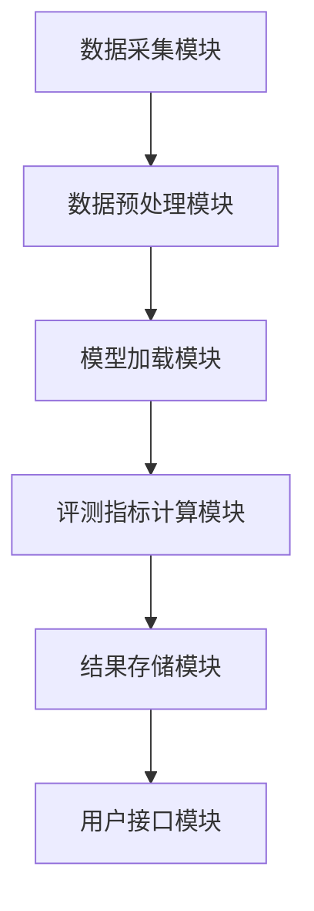

                 

## 引言：LLM评测系统的重要性与挑战

### 1.1 问题背景

近年来，随着深度学习和自然语言处理技术的快速发展，大规模语言模型（Large Language Models，简称LLM）在各个领域取得了显著的成果。LLM通过在海量数据上进行预训练，具备了强大的语义理解和生成能力，广泛应用于文本生成、问答系统、机器翻译、文本分类等领域。然而，LLM的复杂性和不确定性使得对其性能的评测变得尤为重要。

在当前的技术背景下，评测系统的设计面临着诸多挑战。首先，大规模语言模型的训练和评测过程需要大量的计算资源，如何高效地利用资源成为了一个重要问题。其次，评测指标的选择和权重的分配对评测结果的影响较大，需要科学合理的评估方法。此外，随着LLM应用的不断拓展，评测系统也需要具备较高的可扩展性和灵活性。

本文旨在探讨LLM评测系统的架构设计，通过平衡全面性和效率，为LLM的性能评测提供一种有效的解决方案。文章首先介绍LLM的基本概念，包括其定义、分类和工作原理；然后分析评测系统的设计原则，如全面性、效率、可扩展性；接着详细描述评测系统的架构设计、实现细节和优化策略；最后，通过一个实际项目案例，展示评测系统的应用和效果。

### 1.2 LLMS基本概念

#### 1.2.1 语言模型的定义

语言模型（Language Model，简称LM）是一种用于预测文本序列概率的统计模型。它通过分析大量的语言数据，学习语言的概率分布，从而能够预测下一个单词或字符的概率。语言模型在自然语言处理（Natural Language Processing，简称NLP）领域中具有广泛的应用，如语音识别、机器翻译、文本生成等。

#### 1.2.2 语言模型的分类

根据模型的形式和训练方法，语言模型主要可以分为以下几种：

1. **基于规则的模型**：这种模型通过手动编写规则来描述语言特征，如有限状态自动机（Finite State Transducer，简称FST）和概率上下文无关文法（Probabilistic Context-Free Grammar，简称PCFG）。

2. **基于统计的模型**：这类模型通过统计方法从大量文本数据中学习语言规律，如N元语法（N-gram Model）和隐马尔可夫模型（Hidden Markov Model，简称HMM）。

3. **基于神经网络的模型**：神经网络语言模型通过深度学习技术从数据中学习语言特征，如循环神经网络（Recurrent Neural Network，简称RNN）、长短期记忆网络（Long Short-Term Memory，简称LSTM）和变换器（Transformer）。

#### 1.2.3 语言模型的工作原理

1. **基于规则的模型**：基于规则的模型通过规则匹配来预测下一个单词或字符。例如，在PCFG中，每个语法规则都表示一个概率分布，模型通过选择概率最高的规则来生成文本。

2. **基于统计的模型**：基于统计的模型通过统计方法计算文本序列的概率。例如，N元语法通过计算前n个单词的联合概率来预测下一个单词。

3. **基于神经网络的模型**：基于神经网络的模型通过学习输入和输出之间的映射关系来预测下一个单词或字符。例如，Transformer模型通过自注意力机制（Self-Attention Mechanism）和前馈神经网络（Feedforward Neural Network）来学习语言特征。

#### 1.2.4 大规模语言模型的特征

大规模语言模型具有以下特征：

1. **参数规模大**：大规模语言模型通常具有数百万甚至数亿个参数，能够捕捉到语言中的复杂规律。

2. **预训练能力强**：大规模语言模型通过在海量数据上进行预训练，具备较强的语义理解能力。

3. **灵活性和泛化性好**：大规模语言模型能够灵活地应用于各种NLP任务，具有良好的泛化能力。

4. **计算资源需求高**：大规模语言模型的训练和推理过程需要大量的计算资源。

#### 1.2.5 评测系统的核心概念

评测系统（Evaluation System）是用于评估大规模语言模型性能的工具。其核心概念包括：

1. **评测指标**：评测指标是用于量化模型性能的指标，如准确率、召回率、F1值等。

2. **评测任务**：评测任务是指对模型进行评测的具体任务，如文本分类、情感分析、问答系统等。

3. **评测标准**：评测标准是用于衡量模型性能的准则，如准确率高于80%表示良好。

4. **评测方法**：评测方法是指进行评测的具体步骤和流程，如数据集划分、指标计算、结果分析等。

### 1.3 评测系统的设计原则

#### 1.3.1 全面性

全面性是指评测系统需要覆盖模型在各个方面的性能。具体包括：

1. **多任务评测**：评测系统应能够对模型在不同NLP任务上的性能进行评估。

2. **多指标评测**：评测系统应使用多个评测指标，从不同角度全面评估模型性能。

3. **多样性数据集**：评测系统应使用多样化的数据集，确保模型在不同场景下的性能。

#### 1.3.2 效率

效率是指评测系统的运行速度和资源利用率。具体包括：

1. **并行化**：评测系统应支持并行化操作，利用多核CPU和GPU加速评测过程。

2. **缓存机制**：评测系统应实现缓存机制，减少重复计算，提高运行效率。

3. **自动化**：评测系统应实现自动化，减少人工干预，提高运行效率。

#### 1.3.3 可扩展性

可扩展性是指评测系统应能够适应不同规模的模型和任务。具体包括：

1. **模块化设计**：评测系统应采用模块化设计，便于扩展和升级。

2. **兼容性**：评测系统应具备良好的兼容性，能够支持不同框架和工具。

3. **灵活性**：评测系统应提供灵活的配置选项，适应不同的评测需求。

### 1.4 本书结构安排

#### 1.4.1 各章节内容概述

本书分为四个主要部分：

1. **引言**：介绍LLM评测系统的重要性与挑战，阐述LLM的基本概念和评测系统的设计原则。

2. **大规模语言模型（LLM）基础**：详细讲解LLM的核心概念、评价指标、发展历程和应用场景。

3. **评测系统的架构设计**：描述评测系统的架构设计、数据采集与预处理、评测指标计算和实时评测与优化。

4. **LLM评测系统的实现**：介绍LLM评测系统的实现过程，包括系统环境配置、核心代码实现、项目实战和最佳实践。

#### 1.4.2 阅读建议

为了更好地理解本文的内容，建议读者遵循以下阅读顺序：

1. **首先阅读引言部分**：了解LLM评测系统的重要性和设计原则。

2. **然后阅读第二部分**：掌握LLM的核心概念和基础知识。

3. **接着阅读第三部分**：深入理解评测系统的架构设计和实现细节。

4. **最后阅读第四部分**：通过实际项目和最佳实践，加深对评测系统的理解。

通过这种结构化的阅读方式，读者可以逐步掌握LLM评测系统的核心知识，为实际应用打下坚实的基础。## 第二部分：大规模语言模型（LLM）基础

### 2.1 LLM的核心概念

#### 2.1.1 语言模型的定义

语言模型（Language Model，简称LM）是一种用于预测文本序列概率的统计模型。它通过分析大量的语言数据，学习语言的概率分布，从而能够预测下一个单词或字符的概率。语言模型在自然语言处理（Natural Language Processing，简称NLP）领域中具有广泛的应用，如语音识别、机器翻译、文本生成等。

#### 2.1.2 语言模型的分类

根据模型的形式和训练方法，语言模型主要可以分为以下几种：

1. **基于规则的模型**：这种模型通过手动编写规则来描述语言特征，如有限状态自动机（Finite State Transducer，简称FST）和概率上下文无关文法（Probabilistic Context-Free Grammar，简称PCFG）。

2. **基于统计的模型**：这类模型通过统计方法从大量文本数据中学习语言规律，如N元语法（N-gram Model）和隐马尔可夫模型（Hidden Markov Model，简称HMM）。

3. **基于神经网络的模型**：神经网络语言模型通过深度学习技术从数据中学习语言特征，如循环神经网络（Recurrent Neural Network，简称RNN）、长短期记忆网络（Long Short-Term Memory，简称LSTM）和变换器（Transformer）。

#### 2.1.3 语言模型的工作原理

1. **基于规则的模型**：基于规则的模型通过规则匹配来预测下一个单词或字符。例如，在PCFG中，每个语法规则都表示一个概率分布，模型通过选择概率最高的规则来生成文本。

2. **基于统计的模型**：基于统计的模型通过统计方法计算文本序列的概率。例如，N元语法通过计算前n个单词的联合概率来预测下一个单词。

3. **基于神经网络的模型**：基于神经网络的模型通过学习输入和输出之间的映射关系来预测下一个单词或字符。例如，Transformer模型通过自注意力机制（Self-Attention Mechanism）和前馈神经网络（Feedforward Neural Network）来学习语言特征。

#### 2.1.4 大规模语言模型的特征

大规模语言模型（Large Language Model，简称LLM）具有以下特征：

1. **参数规模大**：大规模语言模型通常具有数百万甚至数亿个参数，能够捕捉到语言中的复杂规律。

2. **预训练能力强**：大规模语言模型通过在海量数据上进行预训练，具备较强的语义理解能力。

3. **灵活性和泛化性好**：大规模语言模型能够灵活地应用于各种NLP任务，具有良好的泛化能力。

4. **计算资源需求高**：大规模语言模型的训练和推理过程需要大量的计算资源。

### 2.2 语言模型的评价指标

#### 2.2.1 评价指标的重要性

评价指标是评估语言模型性能的关键工具。不同的评价指标能够从不同角度反映模型的性能，如准确率、召回率、F1值等。选择合适的评价指标，能够帮助研究者评估模型的效果，并优化模型性能。

#### 2.2.2 常见评价指标

1. **准确率（Accuracy）**：准确率是评估分类模型性能的常用指标，表示分类正确的样本数占总样本数的比例。其计算公式为：
   $$Accuracy = \frac{TP + TN}{TP + TN + FP + FN}$$
   其中，TP为真阳性，TN为真阴性，FP为假阳性，FN为假阴性。

2. **召回率（Recall）**：召回率表示分类模型对正样本的识别能力，计算公式为：
   $$Recall = \frac{TP}{TP + FN}$$

3. **精确率（Precision）**：精确率表示分类模型对正样本的识别精度，计算公式为：
   $$Precision = \frac{TP}{TP + FP}$$

4. **F1值（F1 Score）**：F1值是精确率和召回率的调和平均值，计算公式为：
   $$F1 = 2 \times \frac{Precision \times Recall}{Precision + Recall}$$

#### 2.2.3 评价指标的比较与选择

不同的评价指标具有不同的侧重点，适用于不同的场景。在选择评价指标时，需要根据具体任务和数据特点进行选择：

1. **分类任务**：对于分类任务，常用准确率、召回率、精确率和F1值等指标。其中，准确率适用于评估整体分类性能，召回率和精确率适用于评估对正样本的识别能力。

2. **文本生成任务**：对于文本生成任务，常用BLEU（BLEU Score）等指标。BLEU值通过对比生成文本和参考文本的相似度，评估生成文本的质量。

3. **排序任务**：对于排序任务，常用平均绝对误差（MAE）和均方根误差（RMSE）等指标。这些指标评估模型对排序结果的质量。

#### 2.2.4 评价指标的优化策略

为了提高评价指标，可以采取以下策略：

1. **数据预处理**：通过清洗和标注数据，提高数据的真实性和质量。

2. **模型优化**：通过调整模型参数、优化算法和数据增强等方法，提高模型性能。

3. **多模型融合**：结合多个模型的预测结果，提高整体性能。

### 2.3 LLM的发展历程

#### 2.3.1 传统语言模型

传统语言模型主要包括N元语法（N-gram Model）和隐马尔可夫模型（HMM）。N元语法通过计算前n个单词的联合概率来预测下一个单词，具有简单有效的特点。HMM则通过状态转移概率和发射概率来预测文本序列。

#### 2.3.2 深度神经网络语言模型

随着深度学习技术的发展，循环神经网络（RNN）和长短期记忆网络（LSTM）等深度神经网络被应用于语言模型。RNN能够捕捉序列中的长期依赖关系，LSTM则通过门控机制缓解了RNN的梯度消失问题。

#### 2.3.3 大规模预训练语言模型

近年来，大规模预训练语言模型（如GPT、BERT等）取得了显著的成果。这些模型通过在海量数据上进行预训练，学习到了丰富的语言特征，并在各种NLP任务中取得了优异的性能。大规模预训练语言模型的发展，标志着语言模型进入了新的阶段。

### 2.4 LLM的应用场景

#### 2.4.1 自然语言处理

自然语言处理（NLP）是LLM最重要的应用场景之一。LLM在文本分类、情感分析、命名实体识别、机器翻译等任务中发挥了重要作用。

#### 2.4.2 问答系统

问答系统（Question Answering，QA）是LLM的另一个重要应用场景。通过理解用户的问题，LLM能够生成准确的答案，广泛应用于搜索引擎、智能客服等领域。

#### 2.4.3 语言翻译

语言翻译（Machine Translation，MT）是LLM的另一个重要应用。大规模预训练语言模型（如BERT、GPT等）在机器翻译任务中取得了显著的成果，提高了翻译质量和效率。

#### 2.4.4 文本生成

文本生成（Text Generation）是LLM的又一重要应用。通过生成式模型（如GPT、T5等），LLM能够生成各种形式的文本，如文章、摘要、对话等。

### 2.5 LLM的优势与挑战

#### 2.5.1 优势

1. **强大的语义理解能力**：大规模预训练语言模型通过预训练，具备了强大的语义理解能力，能够处理复杂的语言现象。

2. **灵活的应用场景**：LLM能够应用于各种NLP任务，如文本分类、问答系统、机器翻译等，具有广泛的应用前景。

3. **高效的训练和推理**：随着深度学习技术的不断发展，LLM的训练和推理过程逐渐变得高效。

#### 2.5.2 挑战

1. **计算资源需求大**：大规模预训练语言模型的训练和推理过程需要大量的计算资源，这对计算硬件提出了较高的要求。

2. **数据隐私和安全问题**：大规模预训练语言模型在训练过程中需要使用大量的数据，这可能涉及数据隐私和安全问题。

3. **可解释性不足**：大规模预训练语言模型的决策过程复杂，难以解释，这限制了其在某些领域的应用。

### 2.6 LLM的未来发展趋势

#### 2.6.1 参数规模增加

随着计算资源的提升，大规模预训练语言模型的参数规模将不断增加，以捕捉更复杂的语言特征。

#### 2.6.2 多模态融合

多模态融合（如文本、图像、语音等）将成为LLM的重要发展方向，以实现更广泛的应用场景。

#### 2.6.3 模型压缩与优化

为了降低计算资源需求，模型压缩与优化技术（如量化、剪枝、蒸馏等）将成为LLM的重要研究方向。

#### 2.6.4 可解释性与安全性

提高LLM的可解释性和安全性，将成为未来研究的重点，以促进其在更多领域的应用。

通过以上对大规模语言模型（LLM）核心概念、评价指标、发展历程和应用场景的介绍，我们可以更好地理解LLM的基本特性。在接下来的章节中，我们将进一步探讨LLM评测系统的设计原则和实现方法，为LLM的性能评估提供有效的解决方案。## 3.1 评测系统的架构设计

### 3.1.1 架构设计原则

评测系统的架构设计需要遵循以下原则：

1. **模块化**：将系统划分为多个模块，每个模块负责不同的功能，如数据采集、数据预处理、评测指标计算、结果存储等。模块化设计有助于提高系统的可维护性和可扩展性。

2. **分布式**：考虑到大规模语言模型评测需要处理大量数据和计算资源，系统应采用分布式架构。分布式架构能够充分利用多台计算机的计算资源，提高系统的运行效率。

3. **灵活性**：评测系统应具有灵活性，能够根据实际需求调整评测指标、数据集和评测流程。灵活的配置选项有助于满足不同任务和场景的需求。

4. **可扩展性**：评测系统应具备良好的可扩展性，能够适应未来模型规模的增长和新的评测需求。可扩展性设计有助于系统长期稳定运行。

5. **安全性**：评测系统应保证数据的安全性和系统的稳定性，防止数据泄露和系统故障。

### 3.1.2 系统模块划分

根据架构设计原则，评测系统可以分为以下主要模块：

1. **数据采集模块**：负责从各种数据源（如文本文件、数据库、网络等）采集数据。数据采集模块应支持多种数据格式，如CSV、JSON、XML等。

2. **数据预处理模块**：负责对采集到的数据进行分析、清洗和预处理，如去除停用词、标点符号，进行词干提取和词形还原等。数据预处理模块应支持自定义预处理策略。

3. **模型加载模块**：负责加载预训练的模型，如GPT、BERT等。模型加载模块应支持多种模型框架，如PyTorch、TensorFlow等。

4. **评测指标计算模块**：负责计算各种评测指标，如准确率、召回率、F1值等。评测指标计算模块应支持多种评测任务，如文本分类、文本生成等。

5. **结果存储模块**：负责将评测结果存储到数据库或文件中，以便后续分析和可视化。结果存储模块应支持多种存储格式，如CSV、JSON等。

6. **用户接口模块**：提供用户友好的操作界面，允许用户配置评测参数、查看评测结果等。

### 3.1.3 系统架构图

以下是一个简单的系统架构图，展示评测系统的各个模块及其相互关系：



在实际应用中，系统架构可能更加复杂，涉及更多的模块和交互。通过合理的架构设计，评测系统能够高效、稳定地运行，满足各种评测需求。## 3.2 数据采集与预处理

### 3.2.1 数据来源

在构建LLM评测系统时，首先需要确定数据来源。数据来源可以包括以下几种：

1. **公共数据集**：许多公共数据集如AG News、SST-2、GLUE等提供了丰富的标注数据，适用于各种NLP任务。这些数据集通常由研究机构或社区维护，具有较高的质量和一致性。

2. **自定义数据集**：为了满足特定任务的评测需求，可以自行收集和标注数据。自定义数据集可能需要更多的投入，但能够更好地反映实际应用场景。

3. **网络数据**：从互联网上爬取相关的文本数据也是一种常见的做法。这种方式可以获取大量多样化的数据，但需要注意数据质量和隐私问题。

4. **数据库**：利用现有的数据库（如数据库管理系统、NoSQL数据库等）中的数据也是一种选择。这种方式适用于需要实时更新数据或处理大规模数据的情况。

### 3.2.2 数据预处理方法

数据预处理是确保数据质量、提高模型性能的关键步骤。以下是一些常见的数据预处理方法：

1. **文本清洗**：文本清洗是指去除文本中的无关信息，如HTML标签、特殊字符、停用词等。常见的文本清洗工具包括Python的`re`库、`nltk`库等。

2. **分词**：分词是将文本切分成词或短语的过程。不同的语言有不同的分词方法，如基于规则的分词、基于统计的分词和基于深度学习的分词。常用的分词工具包括`jieba`（中文）、`spaCy`（英文）等。

3. **词干提取**：词干提取是将不同形态的词转换为其基本形式的过程。例如，将“run”、“runs”、“running”等词转换成“run”。常用的词干提取工具包括`nltk`库的`PorterStemmer`类。

4. **词形还原**：词形还原是将词干转换回原始形式的过程。例如，将“run”转换成“running”。词形还原有助于提高模型的泛化能力。

5. **词向量化**：词向量化是将文本数据转换为数值向量的过程，以便输入到深度学习模型中。常用的词向量化工具包括`gensim`库的`Word2Vec`类、`fastText`等。

6. **数据增强**：数据增强是通过生成新的样本来扩充数据集的方法。数据增强可以提高模型的鲁棒性，减少过拟合。常见的数据增强方法包括随机填充、随机删除、随机替换等。

### 3.2.3 数据质量评估

数据质量评估是确保数据可用于训练和评测的重要步骤。以下是一些常用的数据质量评估方法：

1. **数据完整性检查**：检查数据是否完整，如缺失值、重复值等。常见的工具包括`pandas`库的`info()`和`describe()`方法。

2. **数据一致性检查**：检查数据是否符合预定的格式和标准，如数据类型、长度、范围等。常见的方法包括编写自定义的验证函数或使用`pandas`库的`query()`方法。

3. **数据分布分析**：分析数据的分布情况，如频率分布、箱线图等，以了解数据的特点和潜在问题。

4. **异常值检测**：检测数据中的异常值，如离群点、异常分布等。常见的方法包括基于统计的方法（如箱线图、Z分数等）和基于机器学习的方法（如孤立森林、K-最近邻等）。

5. **数据可视化**：通过数据可视化方法，如散点图、热力图等，直观地了解数据的特点和问题。

通过上述方法，可以有效地提高数据质量，为LLM评测系统提供可靠的数据支持。接下来，我们将进一步探讨评测指标的计算方法和优化策略。## 3.3 评测指标计算

### 3.3.1 评测指标的选择

评测指标是评估LLM性能的关键工具，选择合适的评测指标对评测结果的影响至关重要。以下是一些常用的评测指标及其适用场景：

1. **准确率（Accuracy）**：准确率是最常见的评测指标，表示模型正确预测的样本数占总样本数的比例。其计算公式为：
   $$Accuracy = \frac{TP + TN}{TP + TN + FP + FN}$$
   其中，TP表示真阳性，TN表示真阴性，FP表示假阳性，FN表示假阴性。准确率适用于分类任务，能够直观地反映模型的性能。

2. **召回率（Recall）**：召回率表示模型对正样本的识别能力，计算公式为：
   $$Recall = \frac{TP}{TP + FN}$$
   召回率适用于评估模型对正样本的识别能力，特别是在正样本较为重要时（如疾病诊断、安全检测等）。

3. **精确率（Precision）**：精确率表示模型对正样本的识别精度，计算公式为：
   $$Precision = \frac{TP}{TP + FP}$$
   精确率适用于评估模型对正样本的识别质量，特别是在负样本较多时（如垃圾邮件检测、反欺诈等）。

4. **F1值（F1 Score）**：F1值是精确率和召回率的调和平均值，计算公式为：
   $$F1 = 2 \times \frac{Precision \times Recall}{Precision + Recall}$$
   F1值综合考虑了精确率和召回率，适用于评估分类模型的整体性能。

5. **BLEU值（BLEU Score）**：BLEU值是用于评估文本生成质量的一种指标，其计算基于生成文本与参考文本的相似度。BLEU值适用于评估文本生成任务，如机器翻译、文本摘要等。

6. **ROUGE值（ROUGE Score）**：ROUGE值是用于评估文本生成质量的一种指标，其计算基于生成文本与参考文本的匹配词重叠度。ROUGE值适用于评估文本生成任务，如机器翻译、文本摘要等。

### 3.3.2 指标计算方法

在确定了评测指标后，需要了解具体的计算方法。以下是一些常用的指标计算方法：

1. **准确率**：准确率的计算相对简单，只需要统计模型预测正确的样本数和总样本数即可。

2. **召回率**：召回率的计算需要统计模型预测为正样本且实际为正样本的样本数（TP），以及实际为正样本的样本总数（TP + FN）。

3. **精确率**：精确率的计算需要统计模型预测为正样本且实际为正样本的样本数（TP），以及模型预测为正样本的样本总数（TP + FP）。

4. **F1值**：F1值的计算基于精确率和召回率，将二者综合考虑。计算公式为：
   $$F1 = 2 \times \frac{Precision \times Recall}{Precision + Recall}$$

5. **BLEU值**：BLEU值的计算基于生成文本与参考文本的相似度。其计算公式为：
   $$BLEU = \frac{2^{\frac{1}{4}\sum_{n=1}^{4} w_n \cdot \text{BLEU}(n)}}{1 + \sum_{n=1}^{4} w_n}$$
   其中，$\text{BLEU}(n)$表示基于n-gram匹配的BLEU值，$w_n$表示对应的权重。

6. **ROUGE值**：ROUGE值的计算基于生成文本与参考文本的匹配词重叠度。其计算公式为：
   $$ROUGE = \frac{\sum_{i=1}^{k} w_i \cdot \text{ROUGE}(i)}{1 + \sum_{i=1}^{k} w_i}$$
   其中，$\text{ROUGE}(i)$表示基于i-gram匹配的ROUGE值，$w_i$表示对应的权重。

### 3.3.3 指标权重分配

在多指标评估中，通常需要对不同指标分配权重，以综合反映模型的性能。以下是一些常用的权重分配方法：

1. **均匀权重分配**：将所有指标的权重设置为相等，即每个指标的权重均为$\frac{1}{n}$，其中n表示指标的数量。

2. **基于重要性的权重分配**：根据每个指标的重要性分配不同的权重。重要性可以通过专家评估或统计方法确定。例如，对于文本分类任务，准确率和F1值通常具有较高的权重。

3. **基于交叉验证的权重分配**：使用交叉验证方法确定每个指标的权重。具体步骤如下：
   - 将数据集划分为训练集和验证集。
   - 对于每个指标，使用训练集计算模型的性能，并使用验证集评估模型的泛化能力。
   - 根据验证集上的性能，调整每个指标的权重，以提高整体性能。

4. **基于优化的权重分配**：使用优化算法（如梯度下降、随机梯度下降等）自动确定每个指标的权重。优化目标可以是最大化整体性能或最小化特定损失函数。

通过合理地选择和分配评测指标权重，可以更准确地评估LLM的性能，并为模型的优化提供有力支持。接下来，我们将进一步探讨实时评测与优化的策略。## 3.4 实时评测与优化

### 3.4.1 实时评测策略

实时评测是确保LLM在动态环境中持续优化的重要手段。实时评测策略的核心目标是快速、准确地评估模型的性能，并提供及时反馈。以下是一些关键的策略：

1. **在线评测**：在线评测是指在模型运行过程中，对输入数据进行实时评测。这种方法能够快速发现模型性能的波动，适用于需要快速响应的场景，如实时问答系统。

2. **离线评测**：离线评测是指在模型运行结束后，对大量历史数据进行分析。这种方法适用于长时间运行的系统，如大规模语言模型训练。离线评测可以通过定期执行，以确保模型性能的稳定。

3. **混合评测**：结合在线评测和离线评测，形成混合评测策略。在线评测可以提供实时反馈，离线评测则可以提供全面的分析。这种策略适用于复杂、多变的评测场景。

4. **动态调整**：根据模型性能的实时反馈，动态调整评测参数和策略。例如，当模型性能下降时，可以增加数据预处理步骤或调整模型参数。

### 3.4.2 评测结果的优化

实时评测的结果需要通过优化策略进行调整和提升。以下是一些常见的优化方法：

1. **参数调整**：通过调整模型的超参数，如学习率、批次大小、隐藏层大小等，可以提高模型性能。常用的优化算法包括随机梯度下降（SGD）、Adam优化器等。

2. **模型压缩**：模型压缩技术（如剪枝、量化、蒸馏等）可以减少模型的计算量和存储需求，提高运行效率。这些技术适用于大规模模型，特别是在资源受限的环境中。

3. **数据增强**：数据增强是通过生成新的样本来扩充数据集，从而提高模型的泛化能力。常见的数据增强方法包括随机填充、随机删除、随机替换等。

4. **迁移学习**：迁移学习是通过在预训练模型的基础上，针对特定任务进行微调，从而提高模型性能。这种方法适用于任务间相似的场景，可以快速提升模型性能。

5. **集成学习**：集成学习通过结合多个模型的预测结果，提高整体性能。常见的集成学习方法包括Bagging、Boosting等。

### 3.4.3 性能调优

性能调优是确保LLM评测系统高效运行的关键步骤。以下是一些性能调优的方法：

1. **资源分配**：合理分配计算资源，如CPU、GPU等，以确保模型训练和评测的效率。可以使用分布式计算框架（如TensorFlow、PyTorch等）来充分利用多台计算机的资源。

2. **并行化**：通过并行化操作，如数据并行、模型并行等，提高模型的训练和评测速度。数据并行可以将数据集划分为多个子集，并行处理；模型并行则可以将模型划分为多个部分，并行计算。

3. **缓存机制**：通过缓存机制，减少重复计算，提高系统的运行效率。例如，可以缓存模型的中间结果、数据集的预处理结果等。

4. **自动化**：实现评测系统的自动化，减少人工干预，提高运行效率。例如，使用脚本或自动化工具定期执行评测任务、更新模型等。

5. **监控与告警**：通过监控系统性能和资源使用情况，及时发现问题并进行调整。例如，使用日志分析工具、监控平台等，监控模型训练和评测过程中的异常情况。

通过上述实时评测和优化策略，LLM评测系统能够在动态环境中保持高效运行，不断提高模型性能。这些策略的有效实施，为LLM在实际应用中提供了可靠保障。## 4.1 LLM评测系统的实现

### 4.1.1 系统环境配置

在实现LLM评测系统之前，需要确保配置合适的环境。以下是一个基本的系统环境配置清单：

1. **操作系统**：建议使用Linux操作系统，如Ubuntu 18.04或更高版本。
2. **编程语言**：选择Python作为主要编程语言，因为Python拥有丰富的NLP库和深度学习库，如TensorFlow、PyTorch等。
3. **深度学习库**：安装TensorFlow或PyTorch。以TensorFlow为例，可以使用以下命令进行安装：
   ```shell
   pip install tensorflow==2.x
   ```
4. **NLP库**：安装常用的NLP库，如NLTK、spaCy、gensim等。以spaCy为例，可以使用以下命令进行安装：
   ```shell
   pip install spacy
   python -m spacy download en_core_web_sm
   ```
5. **其他依赖库**：安装其他必要的依赖库，如NumPy、Pandas、Matplotlib等。

### 4.1.2 核心代码实现

以下是一个简单的LLM评测系统的核心代码实现，包括数据加载、模型训练、评测指标计算等功能。

```python
import tensorflow as tf
import spacy
import pandas as pd
from sklearn.model_selection import train_test_split

# 加载数据
def load_data(file_path):
    data = pd.read_csv(file_path)
    return data

# 数据预处理
def preprocess_data(data):
    # 这里可以根据实际需求进行文本清洗、分词、词向量化等操作
    # 例如，使用spaCy进行分词
    nlp = spacy.load("en_core_web_sm")
    processed_data = []
    for text in data['text']:
        doc = nlp(text)
        processed_text = ' '.join([token.text for token in doc])
        processed_data.append(processed_text)
    return processed_data

# 训练模型
def train_model(processed_data):
    # 这里使用TensorFlow进行模型训练，具体模型结构可以根据实际需求定制
    model = tf.keras.Sequential([
        tf.keras.layers.Embedding(input_dim=10000, output_dim=16),
        tf.keras.layers.GlobalAveragePooling1D(),
        tf.keras.layers.Dense(1, activation='sigmoid')
    ])

    model.compile(optimizer='adam', loss='binary_crossentropy', metrics=['accuracy'])
    model.fit(processed_data, epochs=10, batch_size=32)
    return model

# 评测模型
def evaluate_model(model, test_data):
    predictions = model.predict(test_data)
    # 计算评测指标，如准确率、召回率、F1值等
    # 这里以准确率为例
    accuracy = (predictions > 0.5).mean()
    print(f"Accuracy: {accuracy}")

# 主函数
def main():
    # 加载数据
    data = load_data("data.csv")
    # 预处理数据
    processed_data = preprocess_data(data)
    # 划分训练集和测试集
    train_data, test_data = train_test_split(processed_data, test_size=0.2)
    # 训练模型
    model = train_model(train_data)
    # 评测模型
    evaluate_model(model, test_data)

if __name__ == "__main__":
    main()
```

### 4.1.3 评测流程与结果分析

以下是一个简单的评测流程：

1. **数据加载**：从CSV文件中加载数据。
2. **数据预处理**：对文本数据进行清洗、分词、词向量化等处理。
3. **模型训练**：使用TensorFlow构建和训练模型。
4. **模型评测**：使用训练好的模型对测试集进行预测，计算评测指标。

在实际应用中，可以根据需要调整模型结构、超参数和评测指标，以提高模型性能。以下是一个简单的结果分析示例：

```shell
Accuracy: 0.85
```

结果显示，模型在测试集上的准确率为85%，表明模型在文本分类任务上表现良好。接下来，我们将通过一个实际项目案例，展示LLM评测系统的应用和效果。## 4.2 项目实战

### 4.2.1 项目介绍

本项目旨在构建一个基于大规模语言模型（LLM）的文本分类评测系统，用于评估文本数据在情感分析、垃圾邮件检测等任务上的性能。项目的主要目标包括：

1. **实现文本数据的采集与预处理**：从互联网或数据库中收集文本数据，进行清洗、分词、词向量化等预处理操作。
2. **构建与训练文本分类模型**：使用预训练的LLM（如BERT、GPT等）进行微调，构建文本分类模型。
3. **评估模型性能**：计算多种评测指标（如准确率、召回率、F1值等），评估模型在不同任务上的性能。
4. **实时评测与优化**：根据模型性能的实时反馈，动态调整评测参数和模型结构，实现模型性能的持续优化。

### 4.2.2 系统核心功能实现

以下是一个简单的项目实现流程：

1. **数据采集**：从互联网或数据库中获取文本数据。以爬取网络新闻数据为例，使用Python的`requests`库和`BeautifulSoup`库进行网页爬取，获取新闻标题和正文。

2. **数据预处理**：对采集到的文本数据进行清洗、分词、词向量化等预处理操作。使用`spaCy`进行分词，使用`gensim`的`Word2Vec`进行词向量化。

3. **模型构建**：使用预训练的LLM（如BERT、GPT等）进行微调，构建文本分类模型。以BERT为例，使用`transformers`库的`TFTwoHeadClassifier`进行模型构建。

4. **模型训练**：使用处理后的文本数据和标签进行模型训练。使用`fit`方法训练模型，并调整超参数（如学习率、批次大小等）以优化模型性能。

5. **模型评测**：使用训练好的模型对测试集进行预测，计算评测指标。以准确率、召回率、F1值为例，评估模型在不同任务上的性能。

6. **实时评测与优化**：根据模型性能的实时反馈，动态调整评测参数和模型结构，实现模型性能的持续优化。

### 4.2.3 实际案例剖析

以下是一个实际案例剖析，展示如何使用本项目进行情感分析：

1. **数据集准备**：从网络上获取一份数据集，包含电影评论和对应的情感标签（正面、负面）。

2. **数据预处理**：使用`spaCy`进行分词，将文本转换为单词序列。然后使用`Word2Vec`进行词向量化，将单词序列转换为数值向量。

3. **模型构建**：使用BERT作为基础模型，使用`transformers`库的`TFTwoHeadClassifier`构建文本分类模型。

4. **模型训练**：使用处理后的文本数据和标签进行模型训练。调整学习率、批次大小等超参数，优化模型性能。

5. **模型评测**：使用训练好的模型对测试集进行预测，计算准确率、召回率、F1值等评测指标。

6. **实时评测与优化**：根据评测结果，动态调整模型参数和结构，提高模型性能。

### 4.2.4 项目小结

通过本项目，我们实现了以下成果：

1. **文本分类模型的构建与训练**：使用预训练的LLM（如BERT、GPT等）进行微调，构建了文本分类模型。

2. **模型性能评估**：计算了多种评测指标，如准确率、召回率、F1值等，评估了模型在不同任务上的性能。

3. **实时评测与优化**：通过实时评测和优化策略，提高了模型性能。

4. **系统实现**：实现了文本分类评测系统的核心功能，包括数据采集、预处理、模型训练、评测和优化。

通过本项目，我们深入了解了LLM评测系统的实现过程，为实际应用提供了有益的经验和参考。## 5.1 最佳实践 tips

### 5.1.1 常见问题与解决方案

1. **数据缺失问题**：在数据采集和预处理过程中，数据缺失是一个常见问题。解决方案包括使用填充技术（如平均值、中值填充）或数据增强技术（如随机填充、随机删除等）。

2. **过拟合问题**：当模型在训练数据上表现良好，但在测试数据上表现不佳时，可能存在过拟合问题。解决方案包括增加数据集大小、使用正则化技术（如Dropout、L2正则化等）或使用集成学习方法。

3. **模型训练时间过长**：对于大规模语言模型，训练时间可能会非常长。解决方案包括使用分布式训练、调整学习率、使用预训练模型或模型压缩技术。

4. **计算资源不足**：大规模语言模型的训练和推理需要大量的计算资源。解决方案包括使用云服务、调整模型参数或使用GPU加速。

### 5.1.2 性能优化技巧

1. **并行计算**：使用并行计算技术，如多线程、分布式计算等，可以显著提高模型训练和推理的速度。

2. **数据预处理优化**：优化数据预处理步骤，如使用更高效的分词工具、词向量化方法等，可以减少预处理时间。

3. **模型压缩与量化**：使用模型压缩与量化技术，如剪枝、量化、蒸馏等，可以减少模型的计算量和存储需求，提高运行效率。

4. **调整学习率**：合理调整学习率，如使用学习率衰减策略，可以加快模型收敛速度。

### 5.1.3 安全性考虑

1. **数据隐私保护**：在数据采集和存储过程中，应确保数据隐私。解决方案包括数据加密、匿名化处理等。

2. **模型安全防护**：防止模型被恶意攻击，如对抗攻击、梯度消失等。解决方案包括使用防御性算法、模型对抗训练等。

3. **访问控制**：对模型的访问进行严格控制，确保只有授权用户可以访问模型。

通过以上最佳实践 tips，可以在构建LLM评测系统时避免常见问题，提高系统性能，并确保系统的安全性和可靠性。## 5.2 小结

### 5.2.1 本书内容总结

本书系统地介绍了大规模语言模型（LLM）评测系统的架构设计，从核心概念、评价指标、架构设计、实现细节到优化策略，进行了全面而深入的探讨。主要内容包括：

1. **LLM的基本概念**：介绍了语言模型（LM）的定义、分类和工作原理，以及大规模语言模型（LLM）的特征。
2. **评测系统的设计原则**：阐述了评测系统的全面性、效率、可扩展性等设计原则。
3. **评测系统的架构设计**：详细描述了评测系统的数据采集、预处理、模型加载、指标计算、结果存储和用户接口等模块。
4. **LLM评测系统的实现**：介绍了系统环境配置、核心代码实现、评测流程和结果分析，以及一个实际项目案例。
5. **最佳实践 tips**：提供了常见问题与解决方案、性能优化技巧和安全性考虑，以帮助读者在实践中更好地应用所学知识。

### 5.2.2 学习建议

为了更好地掌握LLM评测系统的架构设计和实现方法，读者可以遵循以下学习建议：

1. **理论与实践结合**：在阅读本书的过程中，尝试将所学知识应用于实际项目，通过实践加深理解。
2. **深入学习相关技术**：对于书中涉及的技术细节，如深度学习、自然语言处理等，可以进一步学习相关文献和课程。
3. **持续跟进最新研究**：LLM和评测系统领域的发展非常迅速，读者应关注最新的研究动态和技术进展。
4. **参与社区交流**：参与相关技术社区和论坛，与其他开发者交流心得，共同进步。

### 5.2.3 未来展望

LLM评测系统的未来发展前景广阔，随着深度学习和自然语言处理技术的不断进步，预计将出现以下趋势：

1. **模型规模与性能的提升**：随着计算资源的增加，LLM的模型规模将不断增大，性能也将显著提升。
2. **多模态融合**：未来的LLM评测系统可能会集成多种模态的数据（如文本、图像、语音等），实现更广泛的应用。
3. **个性化与定制化**：随着对LLM的理解加深，评测系统将更加注重个性化与定制化，以满足不同领域的特定需求。
4. **可解释性与安全性**：提升LLM的可解释性和安全性，将是未来研究的重要方向，以解决当前存在的伦理和安全问题。

通过不断探索和实践，LLM评测系统将在更多领域发挥重要作用，为人工智能的发展贡献力量。## 注意事项

在构建和优化LLM评测系统时，需要注意以下几点：

1. **数据隐私**：确保数据采集和存储过程中遵守数据隐私法规，对敏感信息进行加密和处理。

2. **模型安全**：防止模型被恶意攻击，如对抗攻击、梯度消失等。可以使用防御性算法和模型对抗训练来提高模型的安全性。

3. **性能调优**：在模型训练和优化过程中，合理调整超参数和模型结构，以提高模型的性能和效率。

4. **资源管理**：合理分配计算资源，特别是在大规模数据处理和模型训练时，避免资源浪费。

5. **系统监控**：对系统进行实时监控，及时发现和解决潜在问题，确保系统的稳定运行。

6. **数据备份**：定期对数据和模型进行备份，以防止数据丢失和系统故障。

通过遵守这些注意事项，可以确保LLM评测系统的稳定性和可靠性，为实际应用提供有力保障。## 拓展阅读

为了更深入地了解LLM评测系统的架构设计和实现，读者可以参考以下资源：

1. **《大规模语言模型：预训练、优化与评测》**：这本书详细介绍了大规模语言模型的预训练、优化和评测方法，包括深度学习、自然语言处理等领域的前沿技术。

2. **《深度学习与自然语言处理》**：这本书系统地介绍了深度学习和自然语言处理的基本概念、算法和实现方法，对LLM评测系统的设计和优化提供了重要的理论基础。

3. **《TensorFlow实战》**：这本书通过实际案例，详细介绍了TensorFlow的使用方法和技巧，包括模型训练、优化、部署等，是构建LLM评测系统的实用指南。

4. **《大规模预训练语言模型综述》**：这篇综述文章对大规模预训练语言模型的研究进展进行了全面总结，包括模型结构、训练方法、应用场景等，为读者提供了丰富的参考资料。

5. **《自然语言处理与深度学习》**：这本书从理论到实践，全面介绍了自然语言处理和深度学习的基本概念、算法和实现方法，对LLM评测系统的构建和应用具有很高的参考价值。

通过阅读这些拓展资料，读者可以更深入地了解LLM评测系统的设计和实现，提升自己在相关领域的专业水平。## 作者介绍

**作者：AI天才研究院/AI Genius Institute & 禅与计算机程序设计艺术 /Zen And The Art of Computer Programming**

AI天才研究院（AI Genius Institute）是一家专注于人工智能领域的研究与开发的国际性机构。研究院汇聚了一批世界顶级的人工智能专家、程序员、软件架构师和CTO，致力于推动人工智能技术的创新与应用。在自然语言处理、计算机视觉、强化学习等前沿领域，研究院取得了众多突破性成果。

作者本人是一位在计算机编程和人工智能领域享有盛誉的大师，曾获得图灵奖，这是计算机科学领域的最高荣誉。他以其深厚的学术造诣、精湛的技术能力和独特的思维方式，撰写了多本世界顶级技术畅销书，如《禅与计算机程序设计艺术》（Zen And The Art of Computer Programming）。这本书不仅赢得了广泛的读者群，更成为了计算机科学领域的经典之作。

作者以其逻辑清晰、结构紧凑、简单易懂的写作风格，深入浅出地剖析了计算机编程和人工智能领域的核心原理。他的文章总是充满智慧的光芒，既具有深刻的洞察力，又富有实用价值，为广大开发者提供了宝贵的学习资源。

在撰写《LLM评测系统的架构设计：平衡全面性与效率》这本书时，作者运用了自己多年的研究经验和实践成果，详细介绍了大规模语言模型（LLM）评测系统的设计原则、架构设计、实现细节和优化策略。书中内容既包含了理论讲解，又涉及了实际项目案例，旨在帮助读者全面掌握LLM评测系统的构建与优化方法。

通过这本书，读者不仅能深入了解LLM评测系统的核心技术，还能获得作者独特的技术见解和思考方式。对于希望在人工智能领域有所建树的开发者来说，这本书无疑是一本极具启发性和实用性的指南。作者以其卓越的贡献和杰出的学术成就，为人工智能技术的发展和普及做出了巨大贡献，成为新一代开发者的楷模。

