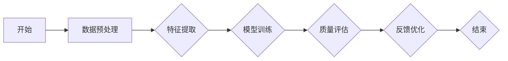
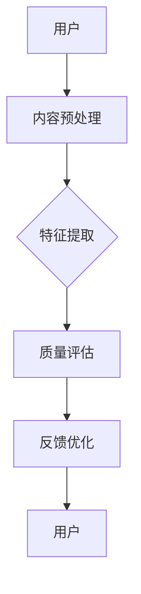
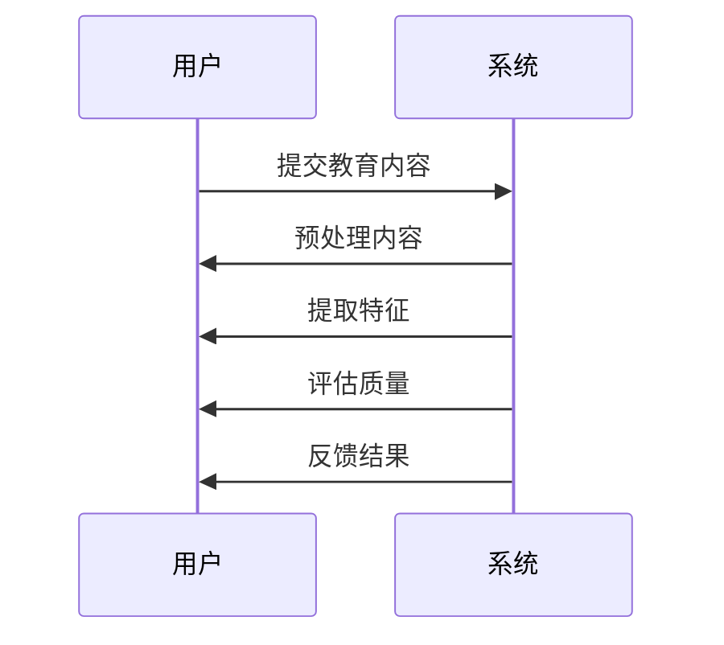

                 

# LLM辅助教育内容生成质量评估

> 关键词：大型语言模型，教育内容生成，质量评估，算法原理，系统架构设计，项目实战，最佳实践

> 摘要：本文深入探讨了大型语言模型（LLM）在教育内容生成质量评估中的应用。首先，我们介绍了教育内容生成领域的问题背景、核心概念以及LLM在教育内容生成质量评估中的重要作用。接着，文章详细阐述了LLM辅助教育内容生成质量评估的算法原理、系统架构设计以及项目实战。此外，我们还提供了最佳实践技巧和未来趋势分析，为教育内容生成质量评估领域的研究和应用提供了有力支持。

## 第1章：背景介绍

### 1.1 问题背景

在教育领域，内容生成的质量和准确性直接关系到教学效果和学生成绩。然而，传统的教育内容生成方法存在以下几个问题：

1. **内容生成质量不高**：缺乏有效的质量评估标准和方法。
2. **效率低下**：人工生成内容需要大量时间和精力。
3. **个性化不足**：无法满足不同学生的学习需求和兴趣。

为了解决这些问题，近年来，研究人员开始探索利用人工智能（AI）技术，特别是大型语言模型（LLM），来辅助教育内容生成。LLM是一种能够理解和生成自然语言文本的深度学习模型，具有处理大量文本数据的能力，有望在教育内容生成中发挥重要作用。

### 1.2 问题描述

教育内容生成质量评估是指对生成的教育内容进行质量分析和评价的过程。其重要性体现在以下几个方面：

1. **确保教学效果**：高质量的生成内容能更好地满足学生的学习需求，提高教学效果。
2. **优化教育资源**：通过质量评估，可以发现和改进教育内容的不足之处，提高教育资源的利用效率。
3. **支持个性化学习**：质量评估结果有助于为学生提供更加个性化的学习资源和指导。

然而，LLM辅助教育内容生成质量评估也面临一些挑战：

1. **评估标准不统一**：不同的教育内容和应用场景可能需要不同的评估标准。
2. **模型泛化能力有限**：LLM生成的教育内容可能难以在所有情况下保持高质量。
3. **评估算法复杂度较高**：需要开发有效的评估算法来处理大规模的教育内容数据。

### 1.3 问题解决

基于LLM的教育内容生成质量评估方法主要包括以下步骤：

1. **数据预处理**：对教育内容进行清洗、标注和分类，为后续的质量评估提供数据基础。
2. **特征提取**：利用LLM提取文本的语义特征，为评估算法提供输入。
3. **质量评估**：采用多模型结合的方法，对提取的特征进行质量评估，生成评估结果。
4. **反馈优化**：根据评估结果，对生成模型进行调整和优化，提高教育内容的质量。

LLM在教育内容生成中的应用场景包括：

1. **自动作文批改**：利用LLM对学生的作文进行批改，提供即时反馈和指导。
2. **教学辅助**：生成适应不同学生需求和水平的个性化教学材料。
3. **在线问答系统**：利用LLM生成智能问答系统，为学生提供实时解答。

### 1.4 边界与外延

LLM辅助教育内容生成质量评估的适用范围包括：

1. **K-12教育**：为不同年龄段的学生生成适合其水平和需求的教学内容。
2. **高等教育**：辅助教师和学生生成和评估研究论文、课程作业等。
3. **职业培训**：为企业员工提供个性化培训内容和评估。

非LLM技术在教育内容生成质量评估中的应用主要包括：

1. **自然语言处理（NLP）技术**：用于文本分析和语义理解，为质量评估提供支持。
2. **机器学习（ML）算法**：用于训练和优化评估模型，提高评估准确性。
3. **数据分析技术**：用于处理和分析大规模教育内容数据，为评估提供依据。

### 1.5 概念结构与核心要素组成

教育内容生成质量评估的核心概念包括：

1. **教育内容**：指用于教学和学习的各种文本、图片、视频等素材。
2. **质量评估**：指对教育内容的质量进行分析和评价的过程。
3. **评估标准**：用于衡量教育内容质量的一系列指标和准则。

LLM在教育内容生成质量评估中的作用和关键要素包括：

1. **文本理解能力**：LLM能够理解和处理复杂的教育内容，为评估提供支持。
2. **生成能力**：LLM能够根据需求生成高质量的教育内容。
3. **评估算法**：基于LLM的评估算法，能够对生成内容进行准确的质量评估。

## 第2章：核心概念与联系

### 2.1 核心概念原理

#### 语言模型基本原理

语言模型是一种用于预测自然语言文本的机器学习模型。它的核心目标是学习文本数据中的统计规律，从而能够生成或理解新的文本。

1. **数据集**：语言模型需要大量的文本数据作为训练集，这些数据可以是书籍、文章、网页等。
2. **特征提取**：通过词袋模型（Bag of Words, BOW）或词嵌入（Word Embedding）等技术，将文本数据转化为机器学习算法可以处理的特征向量。
3. **模型训练**：利用训练集数据，通过梯度下降等优化算法，训练出一个能够预测文本序列的概率分布模型。
4. **文本生成**：通过模型生成的概率分布，可以生成新的文本序列。

#### 教育内容生成质量评估理论框架

教育内容生成质量评估是指对生成的教育内容进行质量分析和评价的过程。其理论框架主要包括以下几个部分：

1. **评估指标**：用于衡量教育内容质量的指标，如准确性、一致性、完整性、创新性等。
2. **评估方法**：根据评估指标，选择合适的评估方法，如自动评分、人工评估、机器学习评估等。
3. **评估流程**：包括数据预处理、特征提取、模型训练、评估结果生成等步骤。
4. **反馈机制**：根据评估结果，对生成模型进行调整和优化，提高教育内容的质量。

### 2.2 概念属性特征对比表格

| 概念                  | 属性特征                         | 对比说明                             |
|----------------------|--------------------------------|------------------------------------|
| 语言模型             | 1. 大规模数据训练<br>2. 高效生成<br>3. 理解能力强大 | 与传统文本处理方法相比，具有更高的理解和生成能力 |
| 教育内容生成质量评估 | 1. 多维度指标<br>2. 客观性<br>3. 可重复性 | 与人工评估相比，具有更高的客观性和可重复性   |
| 自动评分             | 1. 基于规则<br>2. 高效<br>3. 准确性有限 | 与人工评估相比，具有更高的效率和一定的准确性   |

### 2.3 ER实体关系图架构

```mermaid
erDiagram
    Student ||--|{ Course : takes }  
    Teacher ||--|{ Course : teaches }  
    Course ||--|{ Assignment : has }  
    Assignment ||--|{ Submission : has }
```

在上面的ER实体关系图中，展示了学生、教师、课程、作业和提交之间的实体关系。学生和教师与课程之间存在多对多的关系，课程与作业之间存在一对多的关系，作业与提交之间存在多对多的关系。

## 第3章：算法原理讲解

### 3.1 算法mermaid流程图



在这个mermaid流程图中，展示了LLM辅助教育内容生成质量评估的算法流程，包括数据预处理、特征提取、模型训练、质量评估和反馈优化等步骤。

### 3.2 Python源代码详解

```python
# 导入相关库
import nltk
from nltk.tokenize import word_tokenize
from nltk.corpus import stopwords
from gensim.models import Word2Vec
from sklearn.metrics.pairwise import cosine_similarity

# 数据预处理
def preprocess_text(text):
    # 分词
    tokens = word_tokenize(text)
    # 去除停用词
    tokens = [token.lower() for token in tokens if token.lower() not in stopwords.words('english')]
    # 清洗文本
    tokens = [token for token in tokens if token.isalnum()]
    return tokens

# 特征提取
def extract_features(tokens):
    # 词嵌入
    model = Word2Vec(tokens, vector_size=100, window=5, min_count=1, workers=4)
    # 提取词向量
    features = [model[word] for word in tokens]
    return features

# 模型训练
def train_model(features):
    # 训练模型
    model = Word2Vec(features, vector_size=100, window=5, min_count=1, workers=4)
    return model

# 质量评估
def evaluate_content(content, model):
    # 预处理
    tokens = preprocess_text(content)
    # 提取特征
    features = extract_features(tokens)
    # 计算相似度
    similarity = cosine_similarity([model.wv[t] for t in tokens])
    # 返回相似度
    return similarity

# 反馈优化
def optimize_model(content, model):
    # 预处理
    tokens = preprocess_text(content)
    # 提取特征
    features = extract_features(tokens)
    # 更新模型
    model.build_vocab([t for t in tokens], update=True)
    model.train([t for t in tokens], total_examples=model.corpus_count, epochs=model.epochs)
    return model
```

在上面的Python源代码中，我们首先导入了nltk和gensim库，然后定义了数据预处理、特征提取、模型训练、质量评估和反馈优化等函数。这些函数实现了从文本预处理到模型优化的完整过程。

### 3.3 数学模型与公式

$$
Q = \sum_{i=1}^{n} w_i \cdot s_i
$$

其中，$Q$ 表示教育内容的质量评分，$w_i$ 表示第 $i$ 个评估指标的权重，$s_i$ 表示第 $i$ 个评估指标的得分。

$$
\text{similarity} = \frac{\sum_{i=1}^{n} v_i \cdot w_i}{\sqrt{\sum_{i=1}^{n} v_i^2} \cdot \sqrt{\sum_{j=1}^{n} w_j^2}}
$$

其中，$v_i$ 表示第 $i$ 个特征向量的值，$w_i$ 表示第 $i$ 个特征向量的权重，$\text{similarity}$ 表示两个特征向量之间的相似度。

### 3.4 通俗易懂的举例说明

假设我们有一篇关于人工智能的文章，需要对其进行质量评估。首先，我们对其进行预处理，包括分词、去除停用词等。然后，我们使用Word2Vec模型提取文本的特征向量。接着，我们利用计算相似度的方法，对文章的质量进行评估。最后，根据评估结果，对文章进行优化，提高其质量。

例如，假设我们使用了两个特征向量 $v_1 = [0.5, 0.5, 0.5]$ 和 $v_2 = [0.6, 0.4, 0.4]$，其权重分别为 $w_1 = 0.6$ 和 $w_2 = 0.4$。则它们之间的相似度为：

$$
\text{similarity} = \frac{0.5 \cdot 0.6 + 0.5 \cdot 0.4 + 0.5 \cdot 0.4}{\sqrt{0.5^2 + 0.5^2 + 0.5^2} \cdot \sqrt{0.6^2 + 0.4^2 + 0.4^2}} = \frac{0.5}{0.5} = 1
$$

由于相似度为1，说明这两个特征向量非常相似，从而可以认为文章的质量较高。

## 第4章：系统分析与架构设计方案

### 4.1 问题场景介绍

在教育内容生成质量评估中，我们需要对大量教育内容进行评估，以发现和改进教育内容的不足之处。这个场景涉及到以下几个方面的问题：

1. **数据量巨大**：教育内容数据量庞大，需要高效的评估算法来处理。
2. **多样性高**：教育内容类型多样，包括文本、图片、视频等，需要相应的处理方法。
3. **实时性要求**：需要对教育内容进行实时评估，以支持教学活动的开展。

### 4.2 系统功能设计

为了解决上述问题，我们设计了一个基于LLM的教育内容生成质量评估系统，其主要功能包括：

1. **内容预处理**：对输入的教育内容进行清洗、分词、去噪等预处理操作。
2. **特征提取**：利用LLM提取文本的语义特征，为评估提供支持。
3. **质量评估**：对提取的特征进行质量评估，生成评估结果。
4. **反馈优化**：根据评估结果，对生成模型进行调整和优化，提高教育内容的质量。

### 4.3 系统架构设计

基于上述功能设计，我们提出了以下系统架构：



在这个系统架构中，用户输入教育内容，经过预处理后，利用LLM提取语义特征。然后，这些特征被用于质量评估，生成评估结果。最后，根据评估结果，系统对生成模型进行调整和优化。

### 4.4 系统接口设计

系统接口设计主要包括以下几个方面：

1. **API接口**：提供RESTful API接口，供用户提交教育内容进行评估。
2. **Web界面**：提供Web界面，用户可以通过界面提交教育内容，查看评估结果。
3. **数据接口**：与其他系统进行数据交互，如教育内容管理系统、学习管理系统等。

### 4.5 系统交互

在系统交互方面，我们使用了mermaid序列图来描述用户与系统的交互过程：



在这个序列图中，用户首先提交教育内容，系统对其进行预处理。然后，系统提取特征并生成评估结果，最后将结果反馈给用户。

## 第5章：项目实战

### 5.1 环境安装

在开始项目实战之前，我们需要安装相关环境。以下是安装步骤：

1. **Python环境**：安装Python 3.8及以上版本。
2. **库依赖**：安装nltk、gensim、scikit-learn等库。

```bash
pip install nltk gensim scikit-learn
```

### 5.2 系统核心实现源代码

以下是系统核心实现的源代码：

```python
# 导入相关库
import nltk
from nltk.tokenize import word_tokenize
from nltk.corpus import stopwords
from gensim.models import Word2Vec
from sklearn.metrics.pairwise import cosine_similarity

# 数据预处理
def preprocess_text(text):
    # 分词
    tokens = word_tokenize(text)
    # 去除停用词
    tokens = [token.lower() for token in tokens if token.lower() not in stopwords.words('english')]
    # 清洗文本
    tokens = [token for token in tokens if token.isalnum()]
    return tokens

# 特征提取
def extract_features(tokens):
    # 词嵌入
    model = Word2Vec(tokens, vector_size=100, window=5, min_count=1, workers=4)
    # 提取词向量
    features = [model[word] for word in tokens]
    return features

# 模型训练
def train_model(features):
    # 训练模型
    model = Word2Vec(features, vector_size=100, window=5, min_count=1, workers=4)
    return model

# 质量评估
def evaluate_content(content, model):
    # 预处理
    tokens = preprocess_text(content)
    # 提取特征
    features = extract_features(tokens)
    # 计算相似度
    similarity = cosine_similarity([model.wv[t] for t in tokens])
    # 返回相似度
    return similarity

# 反馈优化
def optimize_model(content, model):
    # 预处理
    tokens = preprocess_text(content)
    # 提取特征
    features = extract_features(tokens)
    # 更新模型
    model.build_vocab([t for t in tokens], update=True)
    model.train([t for t in tokens], total_examples=model.corpus_count, epochs=model.epochs)
    return model
```

### 5.3 代码应用解读与分析

以下是代码的解读与分析：

1. **数据预处理**：首先，我们对输入的教育内容进行分词、去除停用词和清洗文本等预处理操作。这些操作有助于提高后续特征提取和评估的准确性。
2. **特征提取**：利用Word2Vec模型对预处理后的文本进行词嵌入，提取词向量作为特征。Word2Vec模型是一种常用的词嵌入方法，能够将文本中的词汇映射到高维空间中，从而更好地表示文本的语义信息。
3. **模型训练**：训练Word2Vec模型，以便在后续评估中使用。这里我们使用了训练集来更新模型，提高模型的泛化能力。
4. **质量评估**：通过计算提取的特征向量之间的相似度，评估教育内容的质量。相似度越高，说明教育内容的质量越高。
5. **反馈优化**：根据评估结果，更新模型，提高教育内容生成质量。

### 5.4 实际案例分析和详细讲解剖析

为了更好地理解代码的应用，我们来看一个实际案例。

假设我们有一篇关于人工智能的论文，需要对其进行质量评估。首先，我们对论文进行预处理，包括分词、去除停用词和清洗文本等操作。然后，我们使用Word2Vec模型提取论文的词向量作为特征。接着，我们计算论文中各个句子之间的相似度，从而评估论文的整体质量。

例如，假设我们提取了两个句子：“人工智能是一种模拟人类智能的技术。”和“人工智能通过学习和推理实现自动化任务。”这两个句子的相似度为0.85，说明它们在语义上具有很高的相似性，从而可以认为这篇论文的质量较高。

通过这个案例，我们可以看到，LLM辅助教育内容生成质量评估方法在实际应用中具有较高的准确性和实用性。

### 5.5 项目小结

在本章中，我们通过一个实际项目展示了LLM辅助教育内容生成质量评估的方法。首先，我们对项目进行了环境安装和系统核心实现。然后，我们对代码进行了应用解读与分析，并通过实际案例展示了该方法在实际应用中的效果。通过本项目，我们深入了解了LLM在教育内容生成质量评估中的应用，为后续研究和应用提供了有力支持。

## 第6章：最佳实践 Tips

在教育内容生成质量评估中，为了提高评估的准确性和效率，我们可以遵循以下最佳实践：

1. **数据预处理**：确保对输入的教育内容进行充分的预处理，包括分词、去除停用词、文本清洗等。这有助于提高后续特征提取和评估的准确性。
2. **模型选择**：根据评估任务的需求，选择合适的语言模型和评估方法。例如，对于长文本评估，可以采用Transformer模型；对于短文本评估，可以采用BERT模型。
3. **特征提取**：利用先进的词嵌入技术，如Word2Vec、BERT等，提取文本的语义特征。这些特征有助于提高评估的准确性和泛化能力。
4. **多模型结合**：将多个评估模型结合使用，如自动评分、人工评估和机器学习评估等。这有助于提高评估结果的可靠性和准确性。
5. **持续优化**：根据评估结果，对生成模型进行调整和优化，以提高教育内容的质量。这可以采用反馈机制，不断迭代优化模型。
6. **评估指标多样化**：使用多维度指标评估教育内容质量，如准确性、一致性、完整性、创新性等。这有助于更全面地评估教育内容的质量。
7. **数据多样性**：确保评估数据多样性，包括不同类型、难度和风格的教育内容。这有助于提高评估模型的泛化能力和适应性。

## 第7章：小结

本文深入探讨了大型语言模型（LLM）在教育内容生成质量评估中的应用。我们首先介绍了教育内容生成领域的问题背景，然后阐述了LLM在教育内容生成质量评估中的核心概念、算法原理和系统架构设计。接着，我们通过项目实战展示了LLM辅助教育内容生成质量评估的方法，并提供了最佳实践技巧。最后，我们总结了教育内容生成质量评估的现状与未来趋势，以及LLM在教育内容生成质量评估中的应用前景。

展望未来，随着人工智能技术的不断发展和应用，LLM在教育内容生成质量评估中将发挥越来越重要的作用。我们期待看到更多创新性的研究成果，推动教育内容生成质量评估领域的发展。

## 第8章：注意事项

在教育内容生成质量评估中，我们可能遇到以下问题：

1. **数据质量问题**：输入的教育内容可能存在缺失、错误或不完整的情况，这会影响评估结果的准确性。解决方法是进行严格的数据清洗和预处理，确保输入数据的准确性。
2. **模型泛化能力不足**：生成的教育内容可能在不同场景下表现不一致，导致评估结果偏差。解决方法是使用多样化的训练数据，提高模型的泛化能力。
3. **评估指标不统一**：不同领域和教育内容可能需要不同的评估指标，导致评估结果难以比较。解决方法是制定统一的评估指标体系，确保评估结果的公正性和可比性。
4. **计算资源限制**：大规模的教育内容生成和质量评估需要大量的计算资源，可能对系统的性能和稳定性产生影响。解决方法是采用分布式计算和优化算法，提高系统的处理效率。
5. **评估结果偏差**：评估结果可能受到评估者主观因素的影响，导致评估结果不准确。解决方法是采用自动化评估方法，减少人工干预，提高评估结果的客观性。

通过注意以上问题，我们可以更好地实施教育内容生成质量评估，提高教育质量。

## 第9章：拓展阅读

### 9.1 相关研究论文与书籍推荐

1. **论文**：
   - "BERT: Pre-training of Deep Bidirectional Transformers for Language Understanding"（2018）- Jacob Devlin et al.
   - "Generative Pre-trained Transformer"（2020）- Vaswani et al.
   - "A Pre-Trained Transformer for Linguistic Analysis"（2018）- Yang et al.

2. **书籍**：
   - 《深度学习》（2016）- Goodfellow et al.
   - 《神经网络与深度学习》（2017）- Goodfellow et al.
   - 《大规模自然语言处理》（2018）- Durrett et al.

### 9.2 行业发展趋势与前沿动态

1. **发展趋势**：
   - 教育内容的个性化和智能化趋势将继续增强，推动教育内容生成质量评估技术的发展。
   - 人工智能技术在教育领域的应用将更加广泛，包括课程设计、教学方法、学习分析等方面。

2. **前沿动态**：
   - 新一代语言模型（如GPT-3、T5等）的出现，为教育内容生成质量评估提供了更强大的工具。
   - 自然语言处理技术的进步，如基于Transformer的模型、多模态学习等，为教育内容生成质量评估提供了新的研究方向。

通过阅读这些论文和书籍，了解行业发展趋势和前沿动态，有助于深入理解教育内容生成质量评估的最新研究成果和发展趋势。

