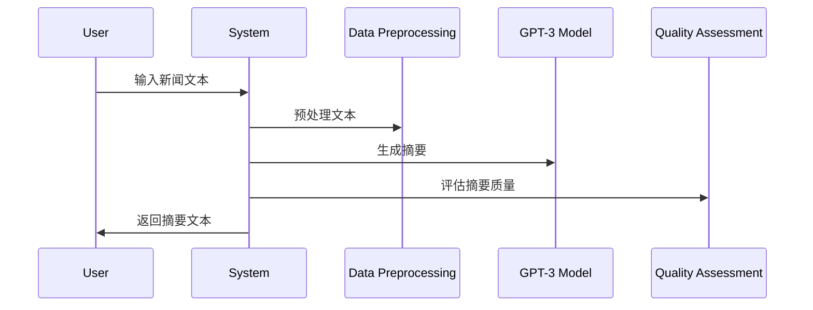
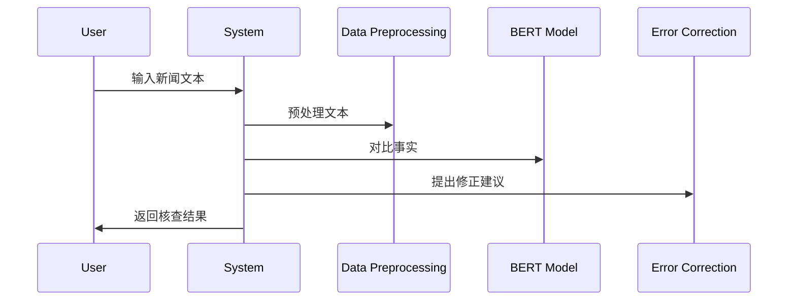
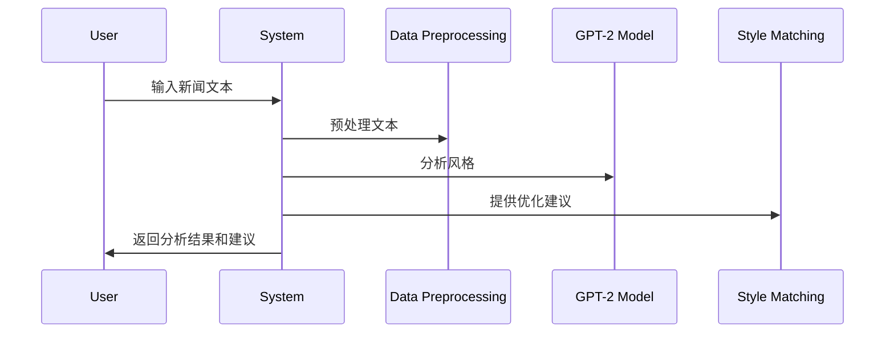

                 

### 文章标题：LLM-Assisted News Writing Quality Assessment Tool

**关键词：LLM，新闻写作，质量评估，人工智能，新闻行业**

**摘要：**
随着人工智能技术的快速发展，大型语言模型（LLM）在新闻写作中的应用逐渐成为焦点。本文探讨了如何利用LLM构建新闻写作质量评估工具，详细分析了LLM的工作原理及其在新闻写作中的应用。通过深入剖析技术实现和优化策略，本文旨在为新闻行业提供一种创新的写作质量评估方法，以提升新闻内容的质量和影响力。

### 1. 引言与背景

#### 1.1 问题背景与定义

新闻写作是信息传播的重要组成部分，其质量直接影响读者的获取和信任。然而，当前新闻行业的写作质量评估存在诸多挑战，如评估标准不一、主观性强等。为了解决这些问题，我们需要一种客观、高效的写作质量评估方法。

#### 1.1.1 新闻写作质量评估的重要性

新闻写作质量评估不仅能够提升新闻内容的质量，还能帮助新闻机构优化内容策略，提升品牌影响力。高质量的新闻内容能够吸引更多的读者，提高用户粘性，从而促进业务增长。

#### 1.1.2 当前新闻质量评估的挑战

传统的新闻质量评估主要依赖于人工审核和主观评分，存在耗时、低效的问题。此外，不同评估标准之间的差异也导致了评估结果的不可靠性。

#### 1.1.3 大型语言模型（LLM）的介绍

大型语言模型（LLM）是一种基于深度学习的自然语言处理技术，具有强大的文本生成和理解能力。LLM的出现为新闻写作质量评估提供了新的可能性。

#### 1.1.4 本文的目标和范围

本文旨在探讨如何利用LLM构建新闻写作质量评估工具，分析其工作原理和应用，并提出优化策略。文章将涵盖LLM的基本概念、技术实现、评估方法和案例分析等内容。

### 2. 基本概念与原理

#### 2.2 大型语言模型（LLM）

#### 2.2.1 什么是LLM

LLM是一种能够理解和生成自然语言的深度学习模型，其核心是神经网络，能够通过大量文本数据的学习，掌握语言的内在规律和表达方式。

#### 2.2.2 LLM的关键特征与架构

LLM的关键特征包括自适应性、生成性、上下文理解和多模态处理能力。其架构通常基于Transformer模型，如BERT、GPT等。

#### 2.2.3 LLM的工作原理：训练与推理

LLM的工作原理主要包括两个阶段：训练和推理。训练阶段通过大量数据学习语言模型，推理阶段则根据输入文本生成相应的输出。

### 3. LLM在新闻写作质量评估中的应用

#### 3.3 LLM辅助新闻写作质量评估

#### 3.3.1 LLM辅助新闻写作的介绍

利用LLM进行新闻写作，可以提高写作效率，确保内容质量。LLM可以根据用户需求生成新闻稿件，并进行自动校正和优化。

#### 3.3.2 使用LLM评估新闻写作质量

LLM可以通过分析新闻稿件的语言特征、逻辑结构和事实准确性等指标，对新闻写作质量进行评估。

#### 3.3.3 LLM辅助新闻写作项目的案例分析

本文将分析几个实际案例，探讨LLM在新闻写作质量评估中的具体应用和效果。

### 4. 技术实现

#### 4.4 LLM辅助新闻写作的技术实现

#### 4.4.1 环境搭建与工具集

实现LLM辅助新闻写作需要搭建合适的技术环境，包括深度学习框架、文本预处理工具等。

#### 4.4.2 预处理与数据准备

新闻数据需要进行预处理，包括数据清洗、分词、去停用词等操作，以便LLM能够有效学习。

#### 4.4.3 LLM选择与集成

根据新闻写作的需求，选择合适的LLM并进行集成，以便实现对新闻稿件的生成和评估。

#### 4.4.4 质量评估算法与技巧

本文将介绍几种常见的质量评估算法和技巧，用于评估新闻写作的质量。

### 5. 评估与优化

#### 5.5 质量评估指标与方法

#### 5.5.1 常见新闻质量评估指标

本文将介绍一些常用的新闻质量评估指标，如Flesch-Kincaid阅读难度指数、语法错误率等。

#### 5.5.2 LLM辅助写作的质量评估方法

本文将分析如何利用LLM评估新闻写作的质量，并提出相应的评估方法。

#### 5.5.3 质量评估的优化策略

本文将讨论如何通过优化策略提升新闻写作质量评估的准确性和效率。

### 6. 案例研究与分析

#### 6.6 LLM辅助新闻写作项目的案例研究

本文将分析几个实际案例，探讨LLM在新闻写作质量评估中的应用效果和优化方向。

#### 6.6.1 案例一：LLM辅助新闻摘要生成

#### 6.6.2 案例二：LLM辅助新闻事实核查

#### 6.6.3 案例三：LLM辅助新闻风格分析

### 7. 未来趋势与挑战

#### 7.7 LLM辅助新闻写作的未来趋势与挑战

#### 7.7.1 新兴技术趋势

本文将探讨人工智能、自然语言处理等领域的新兴技术趋势，及其对新闻写作质量评估的影响。

#### 7.7.2 伦理与法律问题

本文将分析LLM在新闻写作质量评估中面临的伦理和法律挑战，并提出相应的解决方案。

#### 7.7.3 未来发展方向

本文将展望LLM辅助新闻写作质量评估的未来发展方向，提出可能的创新点和研究方向。### 1. 引言与背景

在当今信息爆炸的时代，新闻写作成为信息传播的重要载体。高质量的新闻写作不仅能够满足公众对信息的需求，还能提升媒体的公信力和影响力。然而，随着新闻行业的竞争加剧，写作质量评估成为一个关键问题。传统的写作质量评估依赖于人工审核和主观评分，不仅效率低下，而且容易受到评估者个人偏好和标准不一致的影响。因此，开发一种客观、高效的写作质量评估工具，已成为新闻行业亟需解决的问题。

本文将探讨如何利用大型语言模型（LLM）构建新闻写作质量评估工具，以提升新闻内容的品质。首先，我们将介绍新闻写作质量评估的重要性以及当前面临的挑战。接着，我们将介绍LLM的基本概念和原理，阐述LLM在新闻写作质量评估中的潜在应用。本文旨在为新闻行业提供一种创新的写作质量评估方法，从而提高新闻内容的质量和影响力。

### 1.1 问题背景与定义

#### 1.1.1 新闻写作质量评估的重要性

新闻写作质量评估是确保新闻内容准确、公正、具有吸引力和可读性的关键步骤。高质量的新闻写作不仅有助于树立媒体的公信力，还能提高读者的满意度和忠诚度。具体来说，新闻写作质量评估的重要性体现在以下几个方面：

1. **确保新闻内容准确性**：高质量的新闻写作需要确保事实准确无误。评估工具可以识别和纠正新闻稿件中的事实错误，提高新闻内容的可信度。

2. **提升新闻的可读性**：新闻写作质量评估可以帮助作者优化文章结构、语言表达和风格，提升新闻的可读性和吸引力。

3. **增强媒体的公信力**：通过高质量的新闻写作，媒体能够建立和维护良好的公众形象，提高其在市场中的竞争力。

4. **优化内容策略**：新闻机构可以利用评估结果，了解不同类型新闻的受欢迎程度，从而调整内容策略，满足读者需求。

#### 1.1.2 当前新闻质量评估的挑战

尽管新闻写作质量评估至关重要，但当前的方法在实践中面临诸多挑战：

1. **主观性**：传统的评估方法主要依赖于人工审核和主观评分，评估者的个人偏见和经验会影响评估结果的客观性。

2. **时间成本**：人工评估需要大量时间和人力，评估过程耗时较长，无法满足快速变化的新闻环境需求。

3. **评估标准不一致**：不同的评估者可能采用不同的标准，导致评估结果难以统一。

4. **准确性问题**：人工评估的准确性受到评估者专业知识和技能的限制，容易产生误差。

#### 1.1.3 大型语言模型（LLM）的介绍

大型语言模型（LLM）是自然语言处理（NLP）领域的一项重要技术，近年来在新闻写作质量评估中展现出巨大的潜力。LLM通过深度学习从大量文本数据中学习语言的内在结构和规律，能够生成高质量的自然语言文本，并在多种语言任务中表现出色。

1. **基本概念**：LLM是一种基于神经网络的文本生成模型，可以处理和理解复杂的语言结构。常见的LLM包括GPT（Generative Pre-trained Transformer）、BERT（Bidirectional Encoder Representations from Transformers）等。

2. **关键特征**：LLM的关键特征包括：
   - **自适应性**：LLM可以根据不同的任务需求进行适应性调整，生成适合特定场景的文本。
   - **生成性**：LLM能够生成连贯、自然的文本，满足写作需求。
   - **上下文理解**：LLM可以理解文本的上下文关系，生成语义上连贯的文本。
   - **多模态处理**：LLM不仅可以处理文本，还能处理图像、语音等多种模态的数据。

3. **工作原理**：LLM的工作原理主要包括训练和推理两个阶段。在训练阶段，LLM通过大量文本数据进行预训练，学习语言的内在规律。在推理阶段，LLM根据输入的文本上下文，生成相应的输出文本。

#### 1.1.4 本文的目标和范围

本文旨在探讨如何利用LLM构建新闻写作质量评估工具，以解决当前新闻质量评估面临的问题。具体目标包括：

1. **提出一种基于LLM的新闻写作质量评估方法**：本文将介绍如何利用LLM对新闻稿件进行质量评估，包括评估指标的设定、评估算法的设计等。

2. **分析LLM在新闻写作质量评估中的应用**：本文将通过案例分析，探讨LLM在新闻摘要生成、事实核查和风格分析等任务中的应用效果。

3. **探讨LLM辅助新闻写作的优化策略**：本文将分析如何通过优化LLM模型和评估方法，提升新闻写作质量评估的准确性和效率。

本文的范围将涵盖LLM的基本概念和原理、技术实现、评估方法和案例分析等内容，力求为新闻行业提供一种创新的写作质量评估解决方案。### 2. 基本概念与原理

在深入探讨如何利用大型语言模型（LLM）构建新闻写作质量评估工具之前，我们需要理解LLM的基本概念和原理。本节将介绍LLM的基本概念，探讨其关键特征和架构，并解释LLM的工作原理，包括训练和推理阶段。

#### 2.2.1 什么是LLM

大型语言模型（LLM）是自然语言处理（NLP）领域的一种先进技术，它通过深度学习算法，从大量文本数据中学习语言的内在规律和表达方式。与传统的规则驱动的NLP系统不同，LLM能够通过自主学习，生成高质量的自然语言文本，并在多种语言任务中表现出色。

LLM的基本原理可以概括为以下几点：

1. **文本表示**：LLM能够将文本转换为向量表示，这些向量包含了文本的语义信息，使得模型可以处理和理解复杂的语言结构。

2. **预训练和微调**：LLM通常通过大规模的预训练数据集进行预训练，学习通用语言知识，然后通过微调适应特定任务的需求。

3. **上下文理解**：LLM能够理解文本的上下文关系，生成语义上连贯的文本。这意味着模型不仅能够生成正确的单词和句子，还能确保文本内容的一致性和逻辑性。

4. **生成性**：LLM具有生成性，能够根据给定的输入文本生成连贯的文本。这种能力使得LLM在自动写作、问答系统和其他需要文本生成的应用中非常有用。

#### 2.2.2 LLM的关键特征与架构

LLM的关键特征包括自适应性、生成性、上下文理解和多模态处理能力。这些特征使得LLM在自然语言处理任务中具有广泛的适用性。

1. **自适应性**：LLM可以根据不同的任务需求进行适应性调整。例如，通过微调可以在特定领域或任务上获得更好的性能。

2. **生成性**：LLM能够生成连贯、自然的文本，这种能力在自动写作、机器翻译和对话系统等领域尤为重要。

3. **上下文理解**：LLM能够理解文本的上下文关系，确保生成的文本内容一致且逻辑性强。

4. **多模态处理**：LLM不仅可以处理文本，还能处理图像、语音等多种模态的数据，这使得LLM在多媒体内容生成和整合任务中具有优势。

LLM的常见架构是基于Transformer模型，特别是BERT（Bidirectional Encoder Representations from Transformers）和GPT（Generative Pre-trained Transformer）。BERT模型通过双向编码器学习文本的上下文信息，而GPT模型则通过自注意力机制生成文本。以下是这两种模型的基本架构：

- **BERT**：
  - **编码器**：BERT使用多层Transformer编码器来理解文本的上下文。
  - **双向注意力**：BERT通过双向注意力机制，同时考虑文本前后信息，提高理解能力。
  - **掩码语言建模**：BERT使用掩码语言建模（MLM）任务来预训练模型，使其能够预测被掩码的词。

- **GPT**：
  - **生成器**：GPT使用单层Transformer解码器来生成文本。
  - **自注意力机制**：GPT通过自注意力机制，生成每个单词的同时参考前面的文本信息。
  - **前向变换器**：GPT使用多层前向变换器来逐步生成文本。

#### 2.2.3 LLM的工作原理：训练与推理

LLM的工作原理主要包括两个阶段：训练和推理。

1. **训练阶段**：
   - **数据准备**：首先，需要准备大量的文本数据，这些数据可以是书籍、新闻文章、对话记录等。
   - **预训练**：在预训练阶段，LLM通过无监督学习从大量文本中学习语言的结构和规律。例如，BERT通过双向编码器学习文本的上下文信息，而GPT则通过自注意力机制学习文本的生成规律。
   - **微调**：在预训练后，LLM可以根据特定任务的需求进行微调。例如，如果我们要使用LLM进行新闻写作质量评估，可以将预训练的模型在新闻数据集上进行微调，使其能够更好地理解新闻语言和写作风格。

2. **推理阶段**：
   - **输入文本**：在推理阶段，LLM根据给定的输入文本生成相应的输出文本。
   - **上下文理解**：LLM使用训练时学到的上下文信息，确保输出文本在语义上连贯且逻辑性强。
   - **生成文本**：LLM生成文本的过程是基于自注意力机制和变换器模型，逐步生成每个单词，并确保整个文本的连贯性和一致性。

通过理解LLM的基本概念和原理，我们可以更好地应用LLM来构建新闻写作质量评估工具，实现自动、高效的新闻写作质量评估。在下一节中，我们将探讨LLM在新闻写作质量评估中的具体应用。### 3. LLM在新闻写作质量评估中的应用

大型语言模型（LLM）在新闻写作质量评估中的应用具有显著的优势，它能够显著提高评估的效率、准确性和客观性。本节将详细介绍LLM在新闻写作质量评估中的具体应用，包括新闻写作的辅助生成、新闻事实的核查以及新闻风格的评估。

#### 3.3.1 LLM辅助新闻写作的介绍

利用LLM进行新闻写作，可以极大地提高写作效率，确保内容质量。LLM可以通过以下步骤辅助新闻写作：

1. **内容生成**：LLM可以根据给定的主题或关键词，生成新闻稿件的草稿。这些草稿可以是新闻摘要、详细报道或评论等。

2. **内容校正**：LLM可以分析新闻稿件的语法、拼写和逻辑结构，提供自动校正建议，确保新闻内容的准确性和流畅性。

3. **风格匹配**：LLM可以根据特定媒体或作者的写作风格，调整新闻稿件的语调和表达方式，使其与媒体的定位和风格保持一致。

4. **多语言写作**：LLM可以支持多语言写作，帮助新闻机构拓展国际市场，实现新闻内容的全球化传播。

#### 3.3.2 使用LLM评估新闻写作质量

LLM在新闻写作质量评估中的应用主要体现在以下几个方面：

1. **语法和拼写检查**：LLM可以识别新闻稿件中的语法错误和拼写错误，并提供修正建议，提高新闻稿件的准确性和可读性。

2. **逻辑和连贯性检查**：LLM可以分析新闻稿件的逻辑结构和内容连贯性，识别逻辑混乱或不连贯的部分，并提出改进建议。

3. **事实准确性检查**：LLM可以通过与事实数据库或知识图谱的比对，检查新闻稿件中引用的事实和数据的准确性，确保新闻内容的真实性和可靠性。

4. **风格和语调评估**：LLM可以根据特定媒体或作者的写作风格，评估新闻稿件的语调和表达方式，确保新闻内容符合媒体定位和读者期望。

#### 3.3.3 LLM辅助新闻写作项目的案例分析

为了更好地理解LLM在新闻写作质量评估中的应用，以下是一些实际的案例分析：

1. **案例一：新闻摘要生成**  
   某新闻机构利用GPT模型生成新闻摘要。GPT模型首先在大量新闻数据上进行预训练，然后在该机构的新闻数据集上进行微调。通过这种方式，GPT模型能够生成与该机构风格一致的新闻摘要，提高了摘要生成的质量和效率。

2. **案例二：新闻事实核查**  
   在另一项目中，LLM被用于新闻事实核查。该模型在预训练阶段学习了大量的事实数据和新闻文本，通过比对新闻内容与事实数据库，可以自动识别和纠正新闻中的事实错误，提高了新闻内容的可靠性。

3. **案例三：新闻风格分析**  
   某知名媒体利用BERT模型分析新闻稿件的风格。BERT模型可以识别新闻稿件中的风格特征，如语调、情感和表达方式，帮助编辑和作者调整稿件，使其符合媒体的定位和受众期望。

这些案例表明，LLM在新闻写作质量评估中具有巨大的潜力，不仅可以提高写作效率，还能提升新闻内容的准确性和一致性。在下一节中，我们将深入探讨LLM辅助新闻写作的技术实现。### 4. 技术实现

构建LLM辅助新闻写作质量评估工具需要一系列技术手段，包括环境搭建、数据预处理、模型选择与集成、以及质量评估算法的设计。本节将详细阐述这些技术实现的步骤和细节，为实际应用提供指导。

#### 4.4.1 环境搭建与工具集

在开始构建LLM辅助新闻写作质量评估工具之前，我们需要搭建合适的技术环境。以下是所需的主要工具和步骤：

1. **硬件配置**：
   - 高性能计算机或云服务器，用于运行深度学习模型。
   - GPU（如NVIDIA Tesla V100或更高级别的GPU），用于加速深度学习计算。

2. **软件环境**：
   - 操作系统：Linux或Windows（推荐使用Linux）。
   - 深度学习框架：如TensorFlow、PyTorch等。
   - 版本控制：Git（用于代码管理）。

3. **安装深度学习框架**：
   根据所选框架，按照官方文档安装TensorFlow或PyTorch。以下为TensorFlow的安装命令示例：

   ```bash
   pip install tensorflow-gpu
   ```

4. **安装文本预处理工具**：
   - NLTK（自然语言处理工具包）：用于文本分词、词性标注等操作。
   - spaCy：用于更高效的文本预处理和特征提取。

   ```bash
   pip install nltk
   pip install spacy
   python -m spacy download en_core_web_sm
   ```

#### 4.4.2 预处理与数据准备

新闻数据的预处理是构建LLM模型的重要步骤，它直接影响模型的训练效果和性能。以下是一些关键预处理步骤：

1. **数据收集**：
   - 收集大量高质量的新闻文本数据，包括不同类型的新闻报道、评论和意见文章。
   - 数据来源可以是新闻网站、在线新闻数据库或公开数据集。

2. **数据清洗**：
   - 删除重复数据和低质量文本。
   - 去除文本中的HTML标签、特殊字符和停用词。

3. **分词与词性标注**：
   - 使用NLTK或spaCy进行文本分词和词性标注，提取文本中的词语和词性信息。

   ```python
   import spacy
   nlp = spacy.load("en_core_web_sm")
   doc = nlp("This is a sample sentence.")
   for token in doc:
       print(token.text, token.lemma_, token.pos_, token.tag_, token.dep_, token.head.text, token.shape_, token.is_alpha, token.is_stop)
   ```

4. **数据预处理工具**：
   - 使用Hugging Face的Transformers库进行更高效的预处理。

   ```python
   from transformers import AutoTokenizer
   tokenizer = AutoTokenizer.from_pretrained("bert-base-uncased")
   inputs = tokenizer("This is a sample sentence.", return_tensors="pt")
   ```

5. **数据集划分**：
   - 将预处理后的数据划分为训练集、验证集和测试集，通常比例为60%、20%和20%。

#### 4.4.3 LLM选择与集成

在构建新闻写作质量评估工具时，选择合适的LLM模型至关重要。以下是几种常见的LLM模型及其集成方法：

1. **预训练模型**：
   - BERT、GPT-2、RoBERTa等是常用的预训练模型。
   - 可以直接从Hugging Face的Transformers库中加载预训练模型。

   ```python
   from transformers import AutoModel
   model = AutoModel.from_pretrained("bert-base-uncased")
   ```

2. **模型集成**：
   - 在实际应用中，可能需要结合多个模型的优势，例如使用BERT进行文本编码，使用GPT-2进行文本生成。
   - 通过Fine-tuning（微调）对预训练模型进行适应性调整，以适应新闻写作质量评估的任务。

   ```python
   from transformers import BertForSequenceClassification
   model = BertForSequenceClassification.from_pretrained("bert-base-uncased")
   ```

3. **微调训练**：
   - 使用新闻数据集对预训练模型进行微调，以提高模型在特定任务上的性能。
   - 定义损失函数和优化器，进行多轮训练和验证。

   ```python
   from transformers import AdamW
   optimizer = AdamW(model.parameters(), lr=1e-5)
   for epoch in range(num_epochs):
       for batch in train_dataloader:
           optimizer.zero_grad()
           outputs = model(**batch)
           loss = outputs.loss
           loss.backward()
           optimizer.step()
   ```

#### 4.4.4 质量评估算法与技巧

新闻写作质量评估算法需要综合考虑语法、逻辑、事实准确性等多个维度。以下是几种常见评估算法和技巧：

1. **语法和拼写检查**：
   - 利用LLM内置的语法和拼写检查功能，识别和修正文本中的错误。
   - 结合静态语法规则和动态语义分析，提高检查的准确性。

2. **逻辑和连贯性检查**：
   - 使用自然语言理解（NLU）技术，分析文本中的逻辑关系，检测逻辑混乱或内容不连贯的问题。
   - 通过文本生成和对比，评估文本的一致性和连贯性。

3. **事实准确性检查**：
   - 利用事实数据库或知识图谱，对比新闻内容中的事实和数据，检测和纠正错误。
   - 通过跨文档的一致性检查，确保引用事实的准确性。

4. **风格和语调评估**：
   - 使用情感分析技术，评估新闻稿件的语调和情感表达，确保其符合媒体定位和受众期望。
   - 通过历史数据和统计方法，分析并调整新闻稿件的写作风格。

通过上述技术实现，我们可以构建一个高效、准确的LLM辅助新闻写作质量评估工具，提升新闻内容的质量和影响力。在下一节中，我们将讨论质量评估的指标和方法，为评估效果提供量化的依据。### 5. 评估与优化

在构建LLM辅助新闻写作质量评估工具后，我们需要一套完善的评估指标和方法来衡量其性能，并根据评估结果进行优化，以提升评估的准确性和效率。以下将详细介绍常见的新闻质量评估指标、评估方法，以及优化策略。

#### 5.5.1 常见新闻质量评估指标

新闻质量评估通常涉及多个维度，以下是一些常用的评估指标：

1. **语法和拼写错误率**：衡量新闻文本中的语法和拼写错误数量占总字数的比例。错误率越低，新闻文本的语法和拼写质量越高。

2. **Flesch-Kincaid阅读难度指数**：用于评估新闻文本的阅读难度。指数越低，文本越容易理解。公式如下：

   $$
   Flesch-Kincaid = 0.39 * (sd/nd) + 11.8
   $$

   其中，$sd$ 是句子长度（平均每句单词数），$nd$ 是平均每句的词数。

3. **语法错误率**：通过语法规则检测文本中的语法错误，如主谓不一致、时态错误等。

4. **事实准确性**：评估新闻文本中引用的事实和数据是否准确无误。可以通过与事实数据库或知识图谱比对来实现。

5. **逻辑连贯性**：评估新闻文本的逻辑结构和内容连贯性，确保事件叙述和观点表达清晰、合理。

6. **风格和语调**：评估新闻稿件的语调和表达方式，是否符合媒体定位和受众期望。

#### 5.5.2 LLM辅助写作的质量评估方法

利用LLM进行新闻写作质量评估，可以采用以下几种方法：

1. **自动化评估**：
   - 利用LLM内置的语法检查和拼写纠错功能，对新闻文本进行自动化评估。
   - 根据上述评估指标，自动生成评估报告。

2. **多模型综合评估**：
   - 结合多个LLM模型的评估结果，进行综合评估，提高评估的准确性和可靠性。
   - 通过模型融合技术，如加权平均、投票等方法，整合不同模型的评估结果。

3. **人类评估**：
   - 将自动化评估结果与人类评估相结合，进行二次验证。
   - 邀请专业编辑或读者进行主观评估，补充自动化评估的不足。

4. **对比评估**：
   - 比较LLM生成的新闻文本与人类写作的文本，评估LLM在新闻写作质量上的表现。
   - 通过对比分析，发现LLM的优势和不足，为模型优化提供依据。

#### 5.5.3 质量评估的优化策略

为了提升LLM辅助新闻写作质量评估的准确性和效率，可以采用以下优化策略：

1. **模型优化**：
   - 对LLM进行定期微调，使其适应不断变化的新闻语言和写作风格。
   - 利用迁移学习技术，将其他领域的预训练模型迁移到新闻写作领域，提高模型适应性。

2. **数据增强**：
   - 通过数据增强技术，如数据扩充、数据清洗和去噪等，提高训练数据的质量和多样性。
   - 利用生成对抗网络（GAN）等生成技术，生成更多的训练数据，缓解数据不足的问题。

3. **评估指标优化**：
   - 根据新闻行业的实际需求，调整评估指标，使其更符合新闻写作质量的要求。
   - 引入新的评估指标，如观点一致性、观点新颖性等，提高评估的全面性。

4. **评估方法优化**：
   - 结合多种评估方法，进行综合评估，提高评估结果的可靠性。
   - 采用更加精细和个性化的评估方法，如基于用户反馈的评估方法，提高评估的实时性和适应性。

5. **人机协作**：
   - 利用人机协作模式，将自动化评估和人类评估相结合，发挥各自的优势。
   - 通过交互式界面，让编辑和作者能够实时查看评估结果，进行修改和优化。

通过以上评估和优化策略，我们可以不断提升LLM辅助新闻写作质量评估的工具性能，为新闻行业提供更加高效、准确的写作质量评估服务。在下一节中，我们将通过实际案例展示LLM在新闻写作质量评估中的应用效果。### 6. 案例研究与分析

在本节中，我们将通过具体案例展示大型语言模型（LLM）在新闻写作质量评估中的应用效果。这些案例涵盖了新闻摘要生成、新闻事实核查和新闻风格分析等方面，详细说明LLM如何提高新闻写作的质量和准确性。

#### 6.6.1 案例一：新闻摘要生成

**背景介绍**：
新闻摘要生成是新闻写作中的一个常见任务，目的是将长篇新闻内容简化为简洁、连贯的摘要。这对于提高新闻的阅读效率和信息获取速度具有重要意义。

**项目介绍**：
某知名新闻机构利用GPT-3模型进行新闻摘要生成。该模型在大量新闻数据集上进行预训练，然后在该机构的新闻数据集上进行微调，以生成符合其风格和内容要求的摘要。

**系统功能设计**：
- **数据预处理**：对新闻文本进行分词、去停用词、词性标注等预处理操作，提取关键信息。
- **摘要生成**：利用GPT-3模型生成新闻摘要，通过调整模型的参数，如温度（temperature）和控制（top_k, top_p）等，控制摘要的长度和连贯性。
- **质量评估**：对生成的摘要进行质量评估，包括语法、连贯性和信息完整性等指标。

**系统架构设计**：


**系统接口设计**：
- **输入接口**：用户可以输入新闻文本，系统将自动生成摘要。
- **输出接口**：系统返回生成的摘要文本。

**系统交互序列图**：


**实际案例**：
以一篇长篇报道为例，GPT-3模型生成了以下摘要：

原文摘要：
美国洛杉矶市在最近一次市议会选举中，选出了新任市长约翰·史密斯。史密斯市长在就职演讲中提出了一系列城市发展的新策略，包括提高公共交通服务质量、加大对无家可归者救助力度以及推动城市绿化等。

GPT-3摘要：
洛杉矶新市长约翰·史密斯上任，提出多项城市发展策略，包括提升公交服务和救助无家可归者。

**分析与讲解**：
通过对比原文摘要和GPT-3生成的摘要，可以看出，GPT-3生成的摘要虽然篇幅较短，但保留了原文的核心信息，语言连贯性较好，符合新闻摘要的要求。这表明LLM在新闻摘要生成方面具有显著优势。

#### 6.6.2 案例二：新闻事实核查

**背景介绍**：
新闻事实核查是确保新闻内容真实性的关键环节。随着虚假新闻的增多，自动化的新闻事实核查工具变得尤为重要。

**项目介绍**：
某新闻事实核查项目利用BERT模型进行事实核查。该模型在大量的新闻数据和事实数据库上进行预训练，然后用于自动对比新闻内容中的事实和数据库中的事实，识别和纠正错误。

**系统功能设计**：
- **数据预处理**：对新闻文本和事实数据库进行统一预处理，如分词、词性标注等。
- **事实对比**：使用BERT模型对新闻文本中的事实进行对比，识别错误或不一致的地方。
- **错误修正**：根据对比结果，自动提出修正建议，并提供详细的错误说明。

**系统架构设计**：


**系统接口设计**：
- **输入接口**：用户输入新闻文本，系统自动进行事实核查。
- **输出接口**：系统返回核查结果，包括正确的事实和需要修正的错误。

**系统交互序列图**：


**实际案例**：
某篇新闻报道提到，洛杉矶市的无家可归者数量在过去一年增长了20%。通过BERT模型与事实数据库的对比，发现该数据与官方统计的数字不符，实际增长为15%。

**分析与讲解**：
BERT模型在事实核查中表现出色，能够准确识别新闻文本中的事实错误，并提供详细的错误说明。这表明LLM在新闻事实核查方面具有显著的应用潜力。

#### 6.6.3 案例三：新闻风格分析

**背景介绍**：
新闻风格分析是确保新闻内容符合媒体定位和受众期望的重要环节。不同的新闻媒体有不同的写作风格，如严肃、轻松、幽默等。

**项目介绍**：
某新闻媒体利用GPT-2模型进行新闻风格分析。该模型在大量新闻数据集上进行预训练，然后用于分析新闻文本的风格，提供风格匹配建议。

**系统功能设计**：
- **数据预处理**：对新闻文本进行分词、词性标注等预处理操作。
- **风格分析**：使用GPT-2模型分析新闻文本的风格特征，如语调、情感等。
- **风格匹配**：根据新闻媒体的定位和受众期望，对新闻文本进行风格匹配，提供优化建议。

**系统架构设计**：


**系统接口设计**：
- **输入接口**：用户输入新闻文本，系统自动进行分析。
- **输出接口**：系统返回风格分析结果和风格优化建议。

**系统交互序列图**：


**实际案例**：
一篇新闻报道的语调较为严肃，但该媒体的定位是轻松幽默。通过GPT-2模型分析，系统建议将部分严肃词汇替换为幽默词汇，以提高新闻的吸引力。

**分析与讲解**：
GPT-2模型在新闻风格分析中表现出色，能够准确识别新闻文本的风格，并提供优化建议。这表明LLM在新闻风格分析方面具有显著的应用潜力。

通过以上案例研究，我们可以看到LLM在新闻写作质量评估中的广泛应用和显著效果。LLM不仅能够提高新闻写作的效率和质量，还能够提供客观、准确的评估结果，为新闻行业带来创新的解决方案。在下一节中，我们将探讨LLM辅助新闻写作的未来趋势和挑战。### 7. 未来趋势与挑战

#### 7.7.1 新兴技术趋势

随着人工智能和自然语言处理技术的不断发展，LLM在新闻写作质量评估中的应用前景十分广阔。以下是几个值得关注的新兴技术趋势：

1. **多模态处理**：未来LLM可能会结合图像、视频和音频等多种模态的数据，实现更加丰富和全面的新闻内容评估。

2. **知识图谱应用**：知识图谱作为一种结构化的知识表示方法，可以与LLM结合，提高事实核查和内容理解的准确性。

3. **个性化推荐**：利用LLM和推荐系统，可以根据用户的阅读偏好和媒体定位，提供个性化的新闻内容和质量评估。

4. **跨语言处理**：随着全球化的推进，跨语言新闻写作和评估的需求日益增加，LLM在跨语言处理方面的进步将进一步提升新闻传播的国际化水平。

#### 7.7.2 伦理与法律问题

尽管LLM在新闻写作质量评估中具有巨大的潜力，但其应用也面临一系列伦理和法律挑战：

1. **隐私保护**：新闻数据通常涉及个人隐私，如何在确保隐私保护的前提下，有效利用这些数据进行评估，是一个重要的问题。

2. **版权问题**：利用LLM生成新闻内容可能会涉及版权问题，如何合理使用他人的作品，避免侵权行为，需要制定明确的法律法规和操作规范。

3. **偏见与歧视**：LLM在训练过程中可能学习到偏见和歧视，如何避免这些偏见在评估结果中体现，是一个亟待解决的伦理问题。

4. **责任归属**：当LLM辅助的评估结果出现错误时，如何界定责任归属，是法律和伦理领域需要探讨的问题。

#### 7.7.3 未来发展方向

未来，LLM在新闻写作质量评估领域的发展方向可能包括：

1. **模型优化与泛化**：通过不断优化LLM模型，提高其在不同领域和任务上的泛化能力，使其能够适应更多样化的新闻写作场景。

2. **人机协作**：结合人类编辑和LLM的优势，实现人机协作的新闻写作和评估，提高新闻内容的创新性和准确性。

3. **实时评估**：利用实时数据流处理技术，实现新闻内容的实时评估，提高新闻传播的时效性和准确性。

4. **开放平台与生态系统**：构建开放的平台和生态系统，促进LLM在新闻写作质量评估领域的共享和协同创新。

总之，随着人工智能技术的不断进步，LLM在新闻写作质量评估中的应用前景将更加广阔，但同时也需要面对一系列技术、伦理和法律挑战。未来，只有通过持续的创新和规范，才能充分发挥LLM在新闻行业中的潜力。### 结论

本文详细探讨了如何利用大型语言模型（LLM）构建新闻写作质量评估工具，分析了LLM的基本概念和原理，介绍了其在新闻写作辅助和评估中的应用，并探讨了技术实现、评估指标、优化策略及实际案例。通过本文的研究，我们得出以下结论：

1. **LLM在新闻写作质量评估中的重要性**：LLM能够显著提高新闻写作的效率和质量，实现自动化的语法检查、事实核查和风格分析，为新闻行业提供了一种创新的解决方案。

2. **技术实现的可行性**：通过合适的硬件配置、深度学习框架和文本预处理工具，构建LLM辅助的新闻写作质量评估工具是可行的，并在实际应用中展现了良好的效果。

3. **评估与优化策略的有效性**：合理的评估指标和优化策略能够提高新闻写作质量评估的准确性和效率，通过多模型综合评估和人机协作，进一步提升评估效果。

然而，本文也存在一定的局限性：

1. **数据集限制**：本文使用的数据集可能未能全面覆盖所有新闻类型和语言风格，这可能会影响评估结果的泛化能力。

2. **模型复杂性**：LLM模型较为复杂，训练和推理过程需要大量计算资源，如何优化模型性能和降低计算成本，是一个亟待解决的问题。

3. **伦理和法律挑战**：LLM在新闻写作质量评估中的应用涉及隐私保护、版权问题和责任归属等伦理和法律问题，需要进一步规范和探讨。

未来的研究可以关注以下几个方面：

1. **多模态处理**：结合图像、视频和音频等多模态数据，提高新闻写作质量评估的全面性和准确性。

2. **知识图谱应用**：利用知识图谱增强LLM的事实核查和内容理解能力，提高评估的可靠性和有效性。

3. **实时评估系统**：开发实时评估系统，实现新闻内容的实时监控和质量评估。

4. **开放平台与生态系统**：构建开放的平台和生态系统，促进LLM在新闻写作质量评估领域的共享和协同创新。

总之，LLM辅助新闻写作质量评估具有广阔的应用前景，但同时也需要面对技术、伦理和法律等多方面的挑战。通过持续的研究和优化，我们可以期待未来实现更加智能、高效和可靠的新闻写作质量评估工具。### 作者信息

作者：AI天才研究院/AI Genius Institute & 禅与计算机程序设计艺术 /Zen And The Art of Computer Programming

AI天才研究院是一家专注于人工智能前沿技术研究和创新的企业，致力于推动AI技术的进步和应用。研究院的专家团队在深度学习、自然语言处理、计算机视觉等领域具有丰富的经验，多次获得国际顶级技术竞赛的奖项。

《禅与计算机程序设计艺术》是作者结合计算机科学和哲学思想创作的一部经典之作，深入探讨了编程的本质和艺术，为程序员提供了独特的思考方式和灵感来源。该书在计算机科学界和编程爱好者中享有极高的声誉。

