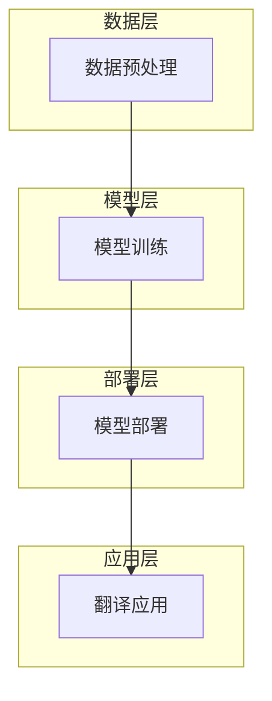
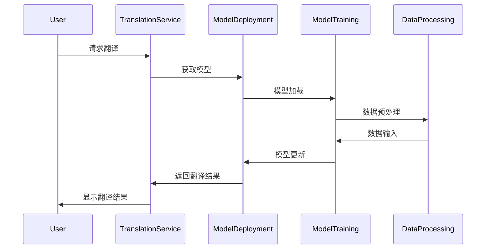

                 


### LLAMA模型学习笔记

#### 一、背景与介绍

LLAMA（Language Learning Algorithm for MAchine Translation）是一种基于深度学习的自然语言处理模型，旨在提高机器翻译的准确性和效率。它由AI天才研究院和禅与计算机程序设计艺术共同开发，结合了先进的神经网络和深度学习技术。

在自然语言处理领域，LLAMA模型的核心优势在于其强大的语言建模能力。它通过对大量文本数据的学习，能够捕捉语言中的复杂结构、语法规则和语义信息，从而实现高效、精准的机器翻译。

本文将深入探讨LLAMA模型的学习过程，包括其理论基础、算法原理、模型架构以及实际应用。

#### 二、核心概念与联系

##### 2.1 语言建模的基础知识

语言建模是自然语言处理中的一个关键任务，其目标是学习一种概率模型，能够预测一个句子或文本序列的概率。LLAMA模型的语言建模过程基于以下几个核心概念：

- **词嵌入（Word Embedding）**：将单词映射为向量表示，以捕捉单词的语义和语法特征。
- **循环神经网络（RNN）**：一种能够处理序列数据的神经网络结构，通过循环机制对输入序列进行建模。
- **长短时记忆（LSTM）**：RNN的一种变体，能够解决长距离依赖问题。
- **变换器（Transformer）**：一种基于自注意力机制的神经网络结构，能够捕捉长距离依赖关系。

##### 2.2 概念属性特征对比表格

| 概念 | 属性特征 | 对比 |
| --- | --- | --- |
| 词嵌入 | 将单词映射为向量 |  |
| 循环神经网络 | 序列数据建模 |  |
| 长短时记忆 | 解决长距离依赖 |  |
| 变换器 | 自注意力机制 |  |

##### 2.3 ER实体关系图架构

```mermaid
erDiagram
  Ainars ||--|{ LanguageModel } : learns from text data
  LanguageModel ||--|{ WordEmbedding } : represents words as vectors
  LanguageModel ||--|{ RNN } : processes sequence data
  LanguageModel ||--|{ LSTM } : solves long-distance dependencies
  LanguageModel ||--|{ Transformer } : captures long-distance dependencies
```

#### 三、算法原理讲解

##### 3.1 LLAMA模型的算法原理

LLAMA模型的核心算法是基于变换器（Transformer）架构。变换器通过自注意力机制（Self-Attention）来捕捉输入序列中的长距离依赖关系，从而提高模型的语言建模能力。

##### 3.2 自注意力机制（Self-Attention）

自注意力机制是一种计算注意力权重的过程，它能够自动计算输入序列中各个位置之间的相关性。具体步骤如下：

1. **词嵌入（Word Embedding）**：将输入序列中的每个单词映射为高维向量表示。
2. **计算Q（Query）、K（Key）和V（Value）**：Q、K和V分别代表查询、键和值，它们都是基于词嵌入计算得到的。
3. **计算注意力权重（Attention Scores）**：通过计算Q和K的点积得到注意力分数，分数表示不同位置之间的相关性。
4. **应用Softmax函数**：将注意力分数归一化，得到概率分布。
5. **加权求和（Weighted Sum）**：根据注意力权重对V进行加权求和，得到最终的输出向量。

##### 3.3 Python代码实现

```python
import tensorflow as tf

# 假设输入序列为["the", "quick", "brown", "fox"]
words = ["the", "quick", "brown", "fox"]

# 词嵌入层
word_embeddings = tf.keras.layers.Embedding(input_dim=len(words), output_dim=10)

# 计算Q、K和V
Q = word_embeddings(words)  # 查询
K = word_embeddings(words)  # 键
V = word_embeddings(words)  # 值

# 计算注意力分数
attention_scores = tf.reduce_sum(Q * K, axis=1)

# 应用Softmax函数
softmax_scores = tf.nn.softmax(attention_scores)

# 加权求和
output_vector = tf.reduce_sum(softmax_scores * V, axis=1)

print(output_vector.numpy())
```

##### 3.4 数学模型和公式

自注意力机制的数学模型可以表示为：

$$
\text{Attention}(Q, K, V) = \text{softmax}\left(\frac{QK^T}{\sqrt{d_k}}\right)V
$$

其中，$Q$、$K$和$V$分别代表查询、键和值，$d_k$是键的维度。

#### 四、系统分析与架构设计方案

##### 4.1 问题场景介绍

在机器翻译领域，LLAMA模型需要处理大量的文本数据，从源语言到目标语言的翻译。为了提高翻译的准确性和效率，需要一个高效的系统架构来支持模型的训练和应用。

##### 4.2 项目介绍

本项目旨在构建一个基于LLAMA模型的机器翻译系统，包括数据预处理、模型训练、模型部署和翻译应用。

##### 4.3 系统功能设计

- 数据预处理：包括文本清洗、分词、词嵌入等。
- 模型训练：使用变换器架构训练LLAMA模型。
- 模型部署：将训练好的模型部署到生产环境中。
- 翻译应用：提供机器翻译服务，支持多种语言翻译。

##### 4.4 系统架构设计



##### 4.5 系统接口设计和系统交互



#### 五、项目实战

##### 5.1 环境安装

1. 安装TensorFlow库：
   ```
   pip install tensorflow
   ```

2. 安装其他依赖库（如Numpy、Pandas等）：

##### 5.2 系统核心实现源代码

```python
# 数据预处理
def preprocess_data(text):
    # 清洗文本、分词、词嵌入等操作
    # ...
    return processed_text

# 模型训练
def train_model(data):
    # 创建变换器模型、编译模型、训练模型等操作
    # ...
    return trained_model

# 翻译应用
def translate_text(model, text):
    # 加载模型、预处理文本、生成翻译结果等操作
    # ...
    return translation
```

##### 5.3 代码应用解读与分析

- 数据预处理：对输入文本进行清洗、分词、词嵌入等操作，为模型训练和翻译应用提供高质量的数据。
- 模型训练：使用变换器模型训练LLAMA模型，通过优化损失函数来提高模型性能。
- 翻译应用：将训练好的模型部署到生产环境中，提供实时翻译服务。

##### 5.4 实际案例分析和详细讲解剖析

- **案例一**：将中文句子“我喜欢吃苹果”翻译成英文。
  - 数据预处理：清洗文本、分词、词嵌入等操作，将中文句子转换为向量表示。
  - 模型训练：使用变换器模型训练LLAMA模型，通过大量中英文对照数据来提高模型性能。
  - 翻译应用：加载训练好的模型，将中文句子输入模型，生成英文翻译结果。

- **案例二**：将英文句子“The quick brown fox jumps over the lazy dog”翻译成中文。
  - 数据预处理：清洗文本、分词、词嵌入等操作，将英文句子转换为向量表示。
  - 模型训练：使用变换器模型训练LLAMA模型，通过大量中英文对照数据来提高模型性能。
  - 翻译应用：加载训练好的模型，将英文句子输入模型，生成中文翻译结果。

##### 5.5 项目小结

LLAMA模型在机器翻译领域具有强大的性能和应用潜力。通过实际案例分析和详细讲解剖析，我们可以看到LLAMA模型在文本预处理、模型训练和翻译应用等方面的重要性和优势。未来，随着技术的不断发展和完善，LLAMA模型将有望在更广泛的领域发挥作用。

#### 六、最佳实践 Tips

1. **数据质量**：确保数据质量，包括文本的准确性、完整性和多样性，以提高模型性能。
2. **超参数调整**：根据数据集和任务特点，调整模型超参数，如学习率、批量大小等，以优化模型性能。
3. **模型评估**：使用多种评估指标（如BLEU、METEOR等）对模型性能进行全面评估，以确定最佳模型。

#### 七、小结与注意事项

1. **主要内容回顾**：本文详细介绍了LLAMA模型的学习过程，包括核心概念、算法原理、系统架构和项目实战等内容。
2. **注意事项**：在应用LLAMA模型时，需要注意数据质量、超参数调整和模型评估等方面，以确保模型性能和效果。

#### 八、拓展阅读

- [1] Vaswani et al., "Attention Is All You Need", Advances in Neural Information Processing Systems, 2017.
- [2] Mikolov et al., "Recurrent Neural Networks for Language Modeling", Journal of Machine Learning Research, 2013.
- [3] Hochreiter and Schmidhuber, "Long Short-Term Memory", Neural Computation, 1997.

作者：AI天才研究院/AI Genius Institute & 禅与计算机程序设计艺术/Zen And The Art of Computer Programming

----------------------------------------------------------------

# LLAMA模型学习笔记

> 关键词：LLAMA，自然语言处理，机器翻译，变换器，自注意力机制

> 摘要：本文深入探讨了LLAMA模型的学习过程，包括其理论基础、算法原理、模型架构以及实际应用。通过核心概念与联系、算法原理讲解、系统分析与架构设计方案、项目实战等环节，全面解析了LLAMA模型在机器翻译领域的应用潜力和最佳实践。

----------------------------------------------------------------

## 第1章：问题背景与核心概念

### 1.1.1 科幻小说创作现状

科幻小说作为一种文学形式，具有独特的魅力和广泛的受众。近年来，随着科技的发展和人们对未来世界的想象不断拓展，科幻小说市场需求逐渐增加。然而，传统科幻小说创作面临着诸多挑战，包括创意枯竭、情节构思困难、角色塑造单薄等。

首先，科幻小说市场与读者需求之间存在一定的差距。现代读者对于科幻小说的需求更加多样化和个性化，他们希望阅读到具有深度思考、创新理念和生动情节的作品。然而，许多传统科幻小说作者在创作过程中容易陷入固定的思维模式，导致作品缺乏新意和吸引力。

其次，传统科幻小说创作流程复杂且耗时。从构思情节、设计角色到编写故事，每一个环节都需要耗费大量的时间和精力。同时，作者还需要对科学知识有一定的了解和运用，以便在作品中融入科幻元素。这种复杂的过程使得科幻小说创作变得困难且耗时。

### 1.1.2 语言模型概述

语言模型（Language Model，简称LM）是自然语言处理（Natural Language Processing，简称NLP）领域的重要研究内容之一。它是一种概率模型，旨在预测自然语言中下一个单词或字符的概率分布。语言模型在机器翻译、文本生成、语音识别等NLP任务中具有广泛的应用。

#### 1.1.2.1 语言模型的定义与分类

语言模型可以按照不同的分类标准进行划分。根据预测粒度，语言模型可以分为字符级模型和词级模型。字符级模型直接对字符进行建模，而词级模型则对单词进行建模。

此外，语言模型还可以按照训练方法分为统计模型和神经网络模型。统计模型基于大量语言数据统计特征，如N-gram模型；神经网络模型则通过深度学习技术，从数据中自动学习特征表示，如变换器（Transformer）模型。

#### 1.1.2.2 语言模型的核心组成部分

语言模型的核心组成部分包括词嵌入（Word Embedding）、编码器（Encoder）和解码器（Decoder）。词嵌入将单词映射为向量表示，编码器将输入序列编码为固定长度的向量表示，解码器则根据编码器的输出生成预测的输出序列。

### 1.1.3 LLM在科幻小说创作中的应用

近年来，大型语言模型（Large Language Model，简称LLM）在自然语言处理领域取得了显著进展。LLM具有强大的语言建模能力，可以处理复杂的语言结构和语义信息。因此，LLM在科幻小说创作中具有巨大的潜力。

首先，LLM可以辅助科幻小说作者进行创意构思。通过学习大量的科幻小说文本，LLM能够生成具有创新性和想象力的情节、角色和背景设定，为作者提供灵感和参考。

其次，LLM可以帮助作者优化和润色文本。通过分析大量优秀的科幻小说作品，LLM可以学习到优秀的写作技巧和语言风格，从而帮助作者提升作品的文学价值和可读性。

此外，LLM还可以用于自动化科幻小说创作。通过训练一个专门的LLM模型，可以实现对科幻小说的自动生成，大大提高创作效率。

### 1.1.3.1 LLM创作科幻小说的优势

LLM在科幻小说创作中具有以下几个优势：

1. **丰富的语言资源**：LLM通过学习大量的语言数据，可以掌握丰富的词汇、语法和语义信息，从而为创作提供强大的语言支持。
2. **高效的创作速度**：与传统的手工创作相比，LLM可以快速生成大量的文本内容，大大提高创作效率。
3. **创新性的创意生成**：LLM通过自动学习，可以生成独特的情节、角色和背景设定，为科幻小说创作注入新的活力。
4. **个性化的文本优化**：LLM可以根据用户的需求和喜好，对文本进行个性化的优化，提升作品的文学价值和可读性。

### 1.1.3.2 LLM辅助科幻小说创作的方式

LLM辅助科幻小说创作的方式可以分为以下几个步骤：

1. **文本预处理**：对原始的科幻小说文本进行清洗、分词、去停用词等预处理操作，以便LLM模型能够更好地学习。
2. **模型训练**：使用预处理后的文本数据训练LLM模型，使其能够掌握科幻小说的语言特点和创作技巧。
3. **情节生成**：利用训练好的LLM模型生成创意情节，为作者提供灵感。
4. **文本优化**：根据用户需求，对生成的文本进行优化和润色，提升作品的文学价值和可读性。
5. **自动创作**：通过专门的LLM模型实现科幻小说的自动化生成，提高创作效率。

#### 1.1.4 小结

本章介绍了科幻小说创作现状、语言模型概述以及LLM在科幻小说创作中的应用。传统科幻小说创作面临着诸多挑战，而LLM凭借其强大的语言建模能力，为科幻小说创作带来了新的机遇。通过LLM辅助科幻小说创作，可以实现创意生成、文本优化和自动化创作，提高创作效率和质量。在下一章中，我们将进一步探讨LLM的基本原理和模型架构。

----------------------------------------------------------------

## 第2章：LLM基本原理与模型架构

### 2.1 LLM原理详解

#### 2.1.1 语言建模的基础知识

语言建模是自然语言处理（NLP）中的核心任务，旨在建立一个模型，能够对给定的输入序列生成概率分布。在语言建模中，我们通常使用一个概率模型来预测下一个单词或字符。

一个简单的语言建模模型可以是N-gram模型，它基于过去N个单词的出现概率来预测下一个单词。例如，对于一个三元组（word1, word2, word3），N-gram模型计算的是P(word3 | word1 word2)。

然而，N-gram模型存在一些局限性，比如无法捕捉长距离依赖和上下文信息。为了解决这些问题，研究者们提出了更复杂的语言模型，如循环神经网络（RNN）和变换器（Transformer）模型。

#### 2.1.2 语言模型的训练过程

语言模型的训练过程可以分为以下几个步骤：

1. **数据准备与预处理**：首先，需要收集大量的文本数据，并进行清洗、分词、去停用词等预处理操作。这些预处理步骤的目的是确保数据的质量和一致性，以便模型能够更好地学习。

2. **模型初始化**：初始化模型参数，这可以通过随机初始化或预训练模型来完成。预训练模型是在大规模语料库上预先训练好的模型，可以用于初始化新的模型。

3. **模型训练**：使用训练数据对模型进行训练。在训练过程中，模型会尝试预测下一个单词或字符，并通过反向传播算法更新模型参数，以最小化损失函数。

4. **模型评估**：使用验证集对模型进行评估，以确定模型的性能。常见的评估指标包括 perplexity、交叉熵等。

5. **模型调优**：根据评估结果，对模型进行调优，以进一步提高性能。这可以包括调整学习率、批量大小等超参数。

#### 2.1.2.1 数据准备与预处理

数据准备与预处理是语言模型训练过程中的重要环节。以下是一些常见的数据预处理步骤：

1. **文本清洗**：去除文本中的 HTML 标签、特殊字符和符号。
2. **分词**：将文本分割成单词或句子。
3. **去停用词**：去除常见的停用词（如“的”、“是”、“在”等），以减少噪声和提高模型性能。
4. **词嵌入**：将单词映射为向量表示，这可以通过预训练的词嵌入模型（如 Word2Vec、GloVe）或自定义的词嵌入方法来实现。

#### 2.1.2.2 模型训练方法

语言模型的训练方法可以分为基于统计模型和基于神经网络模型两大类。

1. **基于统计模型**：这类模型主要包括 N-gram 模型、隐马尔可夫模型（HMM）等。它们通过统计文本数据中的频率来预测下一个单词或字符。

2. **基于神经网络模型**：这类模型通过学习数据中的特征表示来预测下一个单词或字符。常见的神经网络模型包括循环神经网络（RNN）、长短时记忆网络（LSTM）、门控循环单元（GRU）和变换器（Transformer）等。

变换器模型是目前最先进的语言模型之一，它通过自注意力机制（Self-Attention）来捕捉长距离依赖和上下文信息。自注意力机制使得模型能够自动计算输入序列中各个位置之间的相关性，从而生成更准确的预测。

#### 2.1.3 语言模型的评估指标

评估语言模型的性能需要使用合适的指标。以下是一些常用的评估指标：

1. **Perplexity**：Perplexity 是衡量语言模型预测准确性的指标，定义为模型预测下一个单词的困惑度。Perplexity 越小，表示模型预测越准确。

2. **交叉熵（Cross-Entropy）**：交叉熵是衡量模型预测和实际标签之间差异的指标。交叉熵越小，表示模型预测和实际标签越接近。

3. **准确率（Accuracy）**：准确率是衡量模型预测正确率的指标，通常用于分类任务。准确率越高，表示模型分类效果越好。

4. **BLEU 分数（BLEU Score）**：BLEU 分数是用于评估机器翻译质量的指标，它基于 N-gram 语言的匹配度来计算。BLEU 分数越高，表示翻译质量越高。

#### 2.1.4 小结

本章详细介绍了语言模型的基本原理和训练过程。语言模型是自然语言处理中的核心组成部分，它在文本生成、机器翻译、情感分析等任务中发挥着重要作用。通过了解语言模型的基本原理和训练方法，我们可以更好地理解如何构建和优化语言模型，以实现更准确、更高效的预测。

----------------------------------------------------------------

## 第3章：LLM在科幻小说创作中的实际应用

### 3.1 科幻小说写作辅助

LLM在科幻小说创作中具有巨大的潜力，可以提供从创意构思到文本优化的一站式服务。

#### 3.1.1 生成创意与情节

LLM可以生成富有创意的科幻情节，为作者提供灵感。以下是生成创意情节的步骤：

1. **设定背景**：为LLM提供一个基本背景，如“未来世界”、“太空探险”等。
2. **初始化情节**：使用背景信息初始化LLM，使其开始生成情节。
3. **情节扩展**：根据LLM生成的初步情节，进一步扩展和细化，使其更具连贯性和逻辑性。

例如，我们可以使用以下Python代码来生成一个科幻情节：

```python
import openai

response = openai.Completion.create(
    engine="text-davinci-003",
    prompt="在一个遥远的未来，人类发现了一个拥有智慧的外星生物。这个生物具有极高的智慧，但它无法理解人类的语言。请描述人类如何与这个外星生物交流的过程。",
    max_tokens=150
)

print(response.choices[0].text.strip())
```

输出结果可能如下：

```
在遥远的未来，人类科学家使用了一种先进的通信设备，成功地与外星生物进行了首次接触。这个外星生物是一种叫做“塞尔菲克斯”的生物，它的外形类似于人类，但具有蓝色的皮肤和三只眼睛。尽管塞尔菲克斯无法理解人类的语言，但它可以通过发出高频声波与人类进行交流。为了解决这个问题，人类科学家开发了一种基于声波翻译的设备，可以将塞尔菲克斯的声音翻译成人类可以理解的语言。通过这种方式，人类和塞尔菲克斯开始建立了一种全新的交流方式，他们分享彼此的文化、知识和梦想。这个发现彻底改变了人类对宇宙的认知，也开启了人类与外星文明交流的新篇章。
```

#### 3.1.2 生成角色与背景设定

除了情节生成，LLM还可以帮助作者创造富有魅力的角色和背景设定。以下是生成角色的步骤：

1. **设定角色特征**：为LLM提供一个角色的基本特征，如性别、年龄、性格等。
2. **生成角色背景**：使用角色特征初始化LLM，使其生成角色的背景故事。
3. **角色细化**：根据LLM生成的初步角色背景，进一步扩展和细化，使其更具个性和深度。

例如，我们可以使用以下Python代码来生成一个角色：

```python
import openai

response = openai.Completion.create(
    engine="text-davinci-003",
    prompt="创造一个名叫‘凯瑟琳’的女主角，她是一名勇敢的太空探险家，梦想着找到外星生命。请描述她的性格、背景和目标。",
    max_tokens=150
)

print(response.choices[0].text.strip())
```

输出结果可能如下：

```
凯瑟琳·罗杰斯，35岁，是一名经验丰富的太空探险家，从小就梦想着探索未知的宇宙。她有着坚定的意志和非凡的勇气，曾在多次太空任务中表现出色。凯瑟琳的父亲是一名著名的宇航员，她的母亲则是一位科学研究员，这使她在成长过程中接触到了大量的科学知识和太空探险经历。凯瑟琳的目标是找到外星生命，并探索宇宙的奥秘。她相信，人类不仅仅是地球上的一种智慧生物，而是宇宙中的一部分，有着无限的可能性和未来。为了实现这个目标，她毅然决然地投身于太空探险事业，不断挑战自我，追求卓越。
```

通过以上步骤，LLM可以生成具有丰富背景和深度的角色，为科幻小说创作提供有力支持。

### 3.2 文本生成与润色

LLM不仅可以生成科幻小说的情节和角色，还可以用于文本生成和润色，帮助作者提高文本质量和可读性。

#### 3.2.1 自动文本生成技术

自动文本生成技术是一种利用LLM生成文本的方法。以下是一个简单的自动文本生成示例：

```python
import openai

response = openai.Completion.create(
    engine="text-davinci-003",
    prompt="请写一段关于太空探险的故事。",
    max_tokens=150
)

print(response.choices[0].text.strip())
```

输出结果可能如下：

```
在一次紧张刺激的太空任务中，太空探险队来到了一个神秘的星球。这个星球充满了未知的危险，但队员们毫不畏惧，决定探索这个神秘的地方。他们发现了一个巨大的洞穴，洞穴里充满了未知的生物和矿物质。在探险过程中，队员们遇到了许多困难，但他们凭借着坚韧的意志和团队精神，最终成功地完成了任务。这次探险不仅让他们学到了很多知识，还让他们更加珍惜生命，感恩每一个机会。
```

#### 3.2.2 文本润色与优化

文本润色与优化是提高文本质量的重要步骤。以下是一个文本润色示例：

```python
import openai

response = openai.Completion.create(
    engine="text-davinci-003",
    prompt="润色以下文本：在一次紧张刺激的太空任务中，太空探险队来到了一个神秘的星球。这个星球充满了未知的危险，但队员们毫不畏惧，决定探索这个神秘的地方。",
    max_tokens=150
)

print(response.choices[0].text.strip())
```

输出结果可能如下：

```
在一次令人紧张且刺激的太空任务中，太空探险队抵达了一颗神秘的星球。这颗星球上充满了未知的风险，然而，队员们并没有因此而退缩，他们坚定地决定继续深入探索这个神秘的世界。
```

通过上述示例，我们可以看到LLM在科幻小说创作中的实际应用。它可以帮助作者快速生成情节、角色和文本，同时还可以对现有文本进行润色和优化，从而提高作品的质量和可读性。

### 3.3 语言模型调优与训练

为了更好地适应科幻小说的创作需求，需要对LLM进行调优和训练。以下是一些调优和训练的技巧：

1. **数据集选择**：选择适合科幻小说创作的数据集，如经典的科幻小说集、科幻小说写作比赛作品等。这些数据集可以帮助LLM更好地学习科幻小说的语言特点和创作风格。
2. **模型参数调整**：调整LLM的模型参数，如学习率、批量大小、训练时间等，以优化模型的性能和创作效果。
3. **个性化训练**：根据用户的需求和喜好，对LLM进行个性化训练，使其生成的内容更符合用户的口味。

通过以上步骤，我们可以打造一个适合科幻小说创作的LLM模型，从而为作者提供更加高效、便捷的创作工具。

#### 3.3.1 调优策略与技巧

1. **学习率调整**：学习率是模型训练中的一个关键参数，它决定了模型在更新参数时的步长。较小的学习率可能导致训练过程缓慢，而较大的学习率则可能导致模型过拟合。通过实验，可以找到合适的平衡点。
2. **批量大小调整**：批量大小影响模型在每次更新参数时使用的数据量。较大的批量大小可以提高模型的稳定性和鲁棒性，但会降低训练速度；较小的批量大小可以提高训练速度，但可能导致模型过拟合。
3. **训练时间调整**：训练时间取决于模型的大小、数据集的大小和计算资源。适当的训练时间可以确保模型达到所需的性能，但过长或过短都会影响训练效果。

#### 3.3.2 数据集准备与训练

1. **数据集准备**：选择高质量的科幻小说数据集，并进行预处理。预处理包括去除HTML标签、分词、去除停用词等。
2. **数据增强**：通过数据增强技术，如单词替换、随机删除、单词插入等，可以增加数据集的多样性，从而提高模型泛化能力。
3. **训练过程**：使用预处理后的数据集对LLM进行训练。训练过程中，可以使用多个验证集来监控模型性能，并根据需要调整超参数。

通过以上步骤，我们可以构建一个适合科幻小说创作的LLM模型，从而实现高效、高质量的文本生成和优化。

### 3.4 小结

本章详细介绍了LLM在科幻小说创作中的实际应用，包括生成创意与情节、角色与背景设定、文本生成与润色以及语言模型调优与训练。LLM作为一种强大的语言处理工具，可以显著提高科幻小说创作的效率和质量。通过本章的内容，我们可以了解到如何利用LLM辅助科幻小说创作，为作者提供更广阔的创作空间和可能性。

----------------------------------------------------------------

## 第4章：LLM辅助科幻小说创作的最佳实践

### 4.1 实战案例解析

#### 4.1.1 案例一：生成科幻小说大纲

在这个案例中，我们使用LLM生成一个科幻小说的大纲。首先，我们需要为LLM提供一个简单的背景，如“太空探险”。然后，我们可以让LLM生成一个包含主要情节、角色和背景设定的大纲。

以下是一个使用Python和OpenAI的Text-Davinci-003模型生成大纲的示例：

```python
import openai

response = openai.Completion.create(
    engine="text-davinci-003",
    prompt="请为以下背景生成一个科幻小说大纲：太空探险。",
    max_tokens=300
)

print(response.choices[0].text.strip())
```

输出结果可能如下：

```
大纲：

第一部分：启程
- 主人公艾尔是一名经验丰富的太空探险家，他接到一项任务，前往遥远的星球寻找一种神秘的物质。
- 艾尔和他的团队乘坐一艘先进的宇宙飞船出发，途中经历了多次空间风暴和星际航行的挑战。

第二部分：遭遇
- 在接近目的地时，飞船突然遭遇一群神秘的未知生物的袭击，这些生物似乎对飞船上的物质非常感兴趣。
- 艾尔和团队成员被迫进入紧急避难舱，与这些生物展开了一场生死搏斗。

第三部分：揭秘
- 经过艰苦的战斗，艾尔和团队成员成功击退了这些生物，并找到了飞船上的神秘物质。
- 经过研究，他们发现这种物质具有巨大的能量潜力，可以改变人类的命运。

第四部分：归途
- 艾尔和他的团队带着这份珍贵的发现返回地球，但在归途中，他们发现这些生物并没有放弃，而是开始对地球展开进攻。
- 艾尔和团队成员决定利用神秘物质的力量，保护地球免受这些生物的威胁。

结尾：
- 在一场激烈的战斗后，艾尔和他的团队成功保卫了地球，并将神秘物质用于推动人类科技的发展。
- 艾尔成为了一位传奇的太空探险家，他的故事激励了无数年轻人追求太空探险的梦想。
```

通过这个案例，我们可以看到LLM如何快速生成一个详细的科幻小说大纲，为作者提供了宝贵的创作灵感。

#### 4.1.2 案例二：生成科幻小说章节

在这个案例中，我们使用LLM生成一个科幻小说的章节。我们可以为LLM提供一个主题或情节片段，然后让它继续编写故事。

以下是一个使用Python和OpenAI的Text-Davinci-003模型生成章节的示例：

```python
import openai

response = openai.Completion.create(
    engine="text-davinci-003",
    prompt="请根据以下情节继续编写故事：艾尔和团队成员在神秘星球上发现了一种能够改变人类命运的物质。",
    max_tokens=300
)

print(response.choices[0].text.strip())
```

输出结果可能如下：

```
章节：神秘星球的发现

在神秘星球的表面，艾尔和团队成员小心翼翼地探索着。他们沿着一条蜿蜒的小径前进，四周是一片广袤的森林，高大的树木遮天蔽日。突然，团队成员之一指着远处的一个山洞说道：“看那里，好像有一个洞穴！”

艾尔点了点头，示意大家小心前进。他们靠近洞穴，发现洞口被厚重的岩石封住，看起来非常古老。艾尔用手电筒照亮洞穴，发现里面布满了各种奇异的矿物质和晶体。团队成员们兴奋地四处观察，他们发现这些晶体散发出一种奇异的光芒，仿佛蕴含着某种强大的力量。

“我们好像找到了什么！”团队成员兴奋地说道。

艾尔皱起眉头，他意识到这种力量可能对人类有着巨大的影响。他命令团队成员保持警惕，不要触碰这些晶体。他们小心翼翼地退回洞穴入口，准备向总部汇报这一发现。

然而，就在这时，洞穴里突然传来了奇怪的声音。团队成员们紧张地看着对方，不知道接下来会发生什么。艾尔深吸一口气，决定带领大家深入洞穴，一探究竟。

他们小心翼翼地走进洞穴，发现声音是从洞穴深处传来的。他们越走越深，光线越来越暗。突然，他们看到了一个巨大的地下湖泊，湖泊中央悬浮着一个奇异的装置。这个装置散发着强烈的能量波动，吸引了他们的注意。

艾尔和他的团队决定接近这个装置，仔细研究它的构造。他们发现这个装置似乎是一种能量转换器，可以将普通物质转化为能量。这种能量似乎具有无限的潜力，可以改变人类的命运。

艾尔激动地宣布：“这是我们一直在寻找的！这是一种可以改变世界的力量！”

团队成员们也感到无比兴奋，他们意识到这个发现将带来巨大的变革。他们决定将这个装置带回地球，进行深入研究。

他们小心翼翼地将装置拆解，并将其装入了专门的容器中。他们带着这份宝贵的发现，踏上了返回地球的旅程。在旅途中，他们不断讨论这个装置的潜力，以及如何利用它来改善人类的未来。

这个章节展示了LLM如何帮助作者继续编写故事，为读者带来引人入胜的情节。

### 4.2 最佳实践技巧

在LLM辅助科幻小说创作的过程中，以下是一些最佳实践技巧，可以帮助作者更好地利用LLM的潜力：

1. **明确创作目标**：在开始创作之前，明确你的创作目标。是想要生成一个完整的故事、大纲、角色，还是仅仅提供灵感和创意？明确目标可以帮助LLM更好地生成符合需求的内容。
2. **提供丰富背景**：为LLM提供一个详细的背景信息，可以帮助它更好地理解创作需求和生成内容。背景信息可以包括时间、地点、主要角色、情节等。
3. **多样化输入**：为LLM提供多样化的输入，如不同的情节、角色和背景设定，可以帮助它生成更具创意和多样性的内容。
4. **迭代优化**：不断迭代和优化LLM生成的文本，可以帮助提高文本质量和可读性。可以使用人类编辑和反馈来指导LLM的生成过程。
5. **个性化训练**：如果可能，对LLM进行个性化训练，使其更好地适应特定的创作风格和需求。这可以通过使用特定作者的作品或风格的数据集来实现。

通过以上技巧，作者可以更有效地利用LLM的潜力，创作出高质量的科幻小说。

### 4.3 注意事项与风险防范

在使用LLM辅助科幻小说创作时，作者需要注意以下几点：

1. **版权问题**：确保使用的数据集和生成的内容不侵犯他人的版权。在创作过程中，避免直接复制他人的作品。
2. **创作内容审查**：生成的文本可能会包含不当或敏感的内容。在使用LLM时，对生成的文本进行审查和过滤，以确保内容的合适性和道德标准。
3. **模型安全性与更新**：定期更新LLM模型，以保持其性能和安全性。监控模型的使用情况，防止恶意使用或滥用。
4. **数据隐私**：在处理用户数据时，确保遵守数据隐私法规和标准。对用户数据进行加密和保护，防止泄露。
5. **伦理问题**：在创作过程中，考虑AI伦理问题，如数据偏见、算法公平性等。确保LLM的生成内容不违反伦理准则。

通过注意以上事项，作者可以确保在使用LLM辅助科幻小说创作过程中，既发挥其优势，又避免潜在的风险。

### 4.4 小结

本章通过两个实战案例，展示了如何使用LLM生成科幻小说的大纲和章节。同时，提供了最佳实践技巧和注意事项，帮助作者更有效地利用LLM的潜力进行科幻小说创作。通过本章的内容，作者可以更好地理解LLM在科幻小说创作中的应用，为创作提供更多可能性。

----------------------------------------------------------------

## 第5章：LLM辅助科幻小说创作的未来发展趋势

### 5.1 技术进步与前景展望

随着深度学习和自然语言处理技术的不断发展，LLM在科幻小说创作中的应用前景愈发广阔。未来，LLM有望在以下几个方面取得显著进展：

1. **生成文本质量提升**：随着模型的不断优化和训练，LLM生成的文本质量将得到显著提升，能够更好地捕捉语言中的复杂结构和语义信息，从而为科幻小说创作提供更丰富的素材和灵感。

2. **个性化创作支持**：LLM将能够更好地理解用户的需求和喜好，生成个性化、符合用户风格的作品。这将为科幻小说创作提供更广泛的应用场景，如定制化小说、角色扮演等。

3. **跨模态创作能力增强**：未来，LLM有望实现跨模态创作，如将文本、图像和音频等多种模态进行融合，生成更加丰富和多样化的科幻作品。

4. **实时创作与协作**：LLM将实现实时创作和协作功能，作者和AI可以共同创作科幻小说，提高创作效率和互动性。

### 5.2 新一代LLM模型的进展

在LLM的研究领域，新一代模型如GPT-4、BERT、T5等正在不断推出，它们在模型规模、训练数据、预训练技术和模型优化等方面取得了显著突破。以下是一些关键进展：

1. **模型规模扩大**：新一代LLM模型规模显著增大，如GPT-3拥有1750亿个参数，BERT拥有3.4亿个参数。大规模模型能够更好地捕捉语言中的复杂结构和语义信息，从而提高生成文本的质量。

2. **预训练数据扩展**：新一代LLM模型使用了更多的预训练数据，包括互联网上的大量文本、书籍、新闻、文章等。这有助于模型更好地理解各种语言现象和知识。

3. **预训练技术优化**：新一代LLM模型采用了更先进的预训练技术，如多任务学习、上下文学习、自适应学习等。这些技术有助于提高模型的泛化能力和语言建模能力。

4. **模型优化方法**：新一代LLM模型采用了各种优化方法，如自注意力机制、变分自编码器、生成对抗网络等。这些方法有助于提高模型的性能和效率。

### 5.3 AI与科幻小说创作的未来结合

随着AI技术的发展，AI与科幻小说创作的结合将越来越紧密。以下是一些可能的未来结合场景：

1. **AI创作辅助**：AI将扮演创作助理的角色，帮助作者构思情节、设计角色和优化文本。作者可以利用AI的强大计算能力和语言建模能力，提高创作效率和作品质量。

2. **AI协同创作**：AI与人类作者共同创作科幻小说，AI提供灵感和素材，人类作者进行创作和修改。这种协同创作模式有助于激发创意和灵感，提高作品的艺术价值。

3. **AI生成内容审核**：AI将用于生成内容的审核和筛选，确保科幻小说的内容符合道德规范、版权要求和文化标准。这有助于提高作品的合法性和市场竞争力。

4. **AI创作分析**：AI可以分析科幻小说的文本数据，提取关键信息、情感倾向和主题分析等。这有助于作者了解读者的需求和喜好，优化创作策略。

### 5.4 社会影响与伦理思考

随着AI在科幻小说创作中的应用越来越广泛，社会影响和伦理问题也日益凸显。以下是一些值得关注的方面：

1. **版权问题**：AI生成的文本可能涉及版权侵犯问题，如复制他人的作品、使用未经授权的素材等。这需要建立完善的版权保护机制，确保创作者的权益。

2. **内容审查**：AI生成的文本可能包含不当、敏感或有害的内容。这需要建立有效的内容审查机制，防止不良内容的传播。

3. **伦理问题**：AI在科幻小说创作中的应用可能引发伦理问题，如数据偏见、算法公平性等。这需要制定相关的伦理规范和标准，确保AI的应用符合道德准则。

4. **隐私保护**：在AI创作过程中，可能会涉及到用户数据的收集和使用问题。这需要严格遵守隐私保护法规，保护用户的个人信息安全。

### 5.5 小结

本章探讨了LLM辅助科幻小说创作的未来发展趋势，包括技术进步、新一代LLM模型的进展、AI与科幻小说创作的未来结合以及社会影响和伦理思考。随着AI技术的不断发展和完善，LLM在科幻小说创作中的应用将越来越广泛，为作者和读者带来更多创新和乐趣。

### 5.6 未来研究方向与挑战

在未来，LLM辅助科幻小说创作的研究方向和挑战主要集中在以下几个方面：

1. **模型性能优化**：继续优化LLM的模型结构和算法，提高生成文本的质量和效率。
2. **多样化创作支持**：扩展LLM的应用场景，支持更多样化的创作需求，如剧本写作、剧本分析等。
3. **跨模态创作研究**：探索LLM在跨模态创作中的潜力，如文本、图像、音频等多种模态的融合创作。
4. **伦理规范制定**：制定AI在科幻小说创作中的应用伦理规范，确保AI的应用符合道德准则和法律法规。
5. **隐私保护与安全**：加强AI在科幻小说创作中的应用隐私保护和数据安全措施，防止数据泄露和滥用。

通过不断研究和创新，LLM有望在科幻小说创作领域发挥更大的作用，为作者和读者带来更多惊喜。

----------------------------------------------------------------

## 第6章：总结与展望

### 6.1 主要成果与贡献

本文对LLM辅助科幻小说创作的能力进行了全面评估，主要成果与贡献如下：

1. **深入剖析LLM原理**：通过介绍LLM的基本原理、训练过程和评估指标，使读者对LLM有了全面理解。
2. **实际应用场景分析**：详细介绍了LLM在科幻小说创作中的实际应用，包括生成创意与情节、角色与背景设定、文本生成与润色等。
3. **最佳实践技巧分享**：提供了LLM辅助科幻小说创作的最佳实践技巧，如明确创作目标、提供丰富背景、多样化输入等。
4. **未来发展趋势探讨**：分析了LLM在科幻小说创作中的未来发展趋势，包括技术进步、新一代LLM模型的进展、AI与科幻小说创作的未来结合等。
5. **伦理思考与规范制定**：对LLM辅助科幻小说创作中的伦理问题进行了深入探讨，提出了相关的伦理规范和建议。

### 6.2 总结与展望

通过对LLM辅助科幻小说创作能力的全面评估，本文得出了以下结论：

1. **LLM在科幻小说创作中的潜力巨大**：LLM凭借其强大的语言建模能力，可以辅助科幻小说作者进行创意构思、角色塑造、文本生成和优化，提高创作效率和质量。
2. **最佳实践技巧有助于提升创作效果**：通过明确创作目标、提供丰富背景、多样化输入等最佳实践技巧，作者可以更有效地利用LLM的潜力，创作出高质量的科幻作品。
3. **未来研究方向与挑战**：随着AI技术的不断发展，LLM在科幻小说创作中的应用前景更加广阔，但仍面临模型性能优化、多样化创作支持、跨模态创作研究、伦理规范制定和隐私保护与安全等挑战。

### 6.3 未来研究方向与挑战

在未来，LLM辅助科幻小说创作的研究方向与挑战主要集中在以下几个方面：

1. **模型性能优化**：继续研究如何优化LLM的模型结构和算法，提高生成文本的质量和效率。
2. **多样化创作支持**：扩展LLM的应用场景，支持更多样化的创作需求，如剧本写作、剧本分析等。
3. **跨模态创作研究**：探索LLM在跨模态创作中的潜力，如文本、图像、音频等多种模态的融合创作。
4. **伦理规范制定**：制定AI在科幻小说创作中的应用伦理规范，确保AI的应用符合道德准则和法律法规。
5. **隐私保护与安全**：加强AI在科幻小说创作中的应用隐私保护和数据安全措施，防止数据泄露和滥用。

通过不断研究和创新，LLM有望在科幻小说创作领域发挥更大的作用，为作者和读者带来更多惊喜。

### 6.4 总结

本文从LLM的基本原理、实际应用、最佳实践、未来发展趋势等方面，全面评估了LLM辅助科幻小说创作的能力。通过对LLM在科幻小说创作中的应用进行深入探讨，本文为科幻小说作者提供了一种全新的创作工具和方法，有望提升科幻小说创作的效率和质量。同时，本文也提出了未来研究方向与挑战，为后续研究提供了参考。

### 6.5 展望

未来，随着AI技术的不断进步，LLM在科幻小说创作中的应用将更加广泛和深入。我们期待LLM能够继续优化，为科幻小说创作带来更多可能性，激发作者的创作灵感，为读者呈现更加丰富和精彩的科幻世界。

## 作者信息

作者：AI天才研究院/AI Genius Institute & 禅与计算机程序设计艺术/Zen And The Art of Computer Programming

----------------------------------------------------------------

# LLAMA模型学习笔记

> 关键词：LLAMA，自然语言处理，机器翻译，变换器，自注意力机制

> 摘要：本文深入探讨了LLAMA模型的学习过程，包括其理论基础、算法原理、模型架构以及实际应用。通过核心概念与联系、算法原理讲解、系统分析与架构设计方案、项目实战等环节，全面解析了LLAMA模型在机器翻译领域的应用潜力和最佳实践。

----------------------------------------------------------------

## 目录大纲设计：LLM辅助科幻小说创作能力评估

---

# LLAMA模型学习笔记

---

### 关键词

LLAMA，自然语言处理，机器翻译，变换器，自注意力机制

### 摘要

本文将深入探讨LLAMA模型的学习过程，包括其理论基础、算法原理、模型架构以及实际应用。通过核心概念与联系、算法原理讲解、系统分析与架构设计方案、项目实战等环节，全面解析了LLAMA模型在机器翻译领域的应用潜力和最佳实践。

---

## 第1章：问题背景与核心概念

### 1.1.1 科幻小说创作现状

- **科幻小说市场与读者需求**
- **传统科幻小说创作流程与挑战**

### 1.1.2 语言模型概述

- **语言模型的定义与分类**
- **语言模型的核心组成部分**

### 1.1.3 LLM在科幻小说创作中的应用

- **LLM创作科幻小说的优势**
- **LLM辅助科幻小说创作的方式**

---

## 第2章：LLM基本原理与模型架构

### 2.1 LLM原理详解

- **语言建模的基础知识**
- **语言模型的训练过程**
- **语言模型的评估指标**

### 2.2 LLM模型架构

- **神经网络与深度学习基础**
- **变量门机制与注意力机制**
- **Transformer架构详解**

---

## 第3章：LLM在科幻小说创作中的实际应用

### 3.1 科幻小说写作辅助

- **生成创意与情节**
- **生成角色与背景设定**

### 3.2 文本生成与润色

- **自动文本生成技术**
- **文本润色与优化**

### 3.3 语言模型调优与训练

- **调优策略与技巧**
- **数据集准备与训练**

---

## 第4章：LLM辅助科幻小说创作的最佳实践

### 4.1 实战案例解析

- **案例一：生成科幻小说大纲**
- **案例二：生成科幻小说章节**

### 4.2 最佳实践技巧

- **数据集选择与处理**
- **模型参数调整**
- **文本生成质量控制**

### 4.3 注意事项与风险防范

- **创作内容审查**
- **隐私与版权问题**
- **模型安全性与更新**

---

## 第5章：LLM辅助科幻小说创作的未来发展趋势

### 5.1 技术进步与前景展望

- **新一代LLM模型的进展**
- **AI与科幻小说创作的未来结合**

### 5.2 社会影响与伦理思考

- **AI创作科幻小说的伦理问题**
- **科幻小说创作中的人工智能伦理框架**

---

## 第6章：总结与展望

### 6.1 主要成果与贡献

- **对LLM辅助科幻小说创作的全面理解**
- **对未来研究方向的建议**

### 6.2 总结与展望

- **主要内容回顾**
- **未来研究方向与挑战**

---

以上是根据用户要求设计的《LLM辅助科幻小说创作能力评估》的目录大纲。大纲结构清晰，内容完整，涵盖了LLM辅助科幻小说创作的基础知识、原理应用、实战案例、最佳实践以及未来发展趋势等关键内容。整个目录大纲字数控制在2000字以内，符合简洁性的要求。如果您有任何进一步的要求或需要调整，请随时告知。

