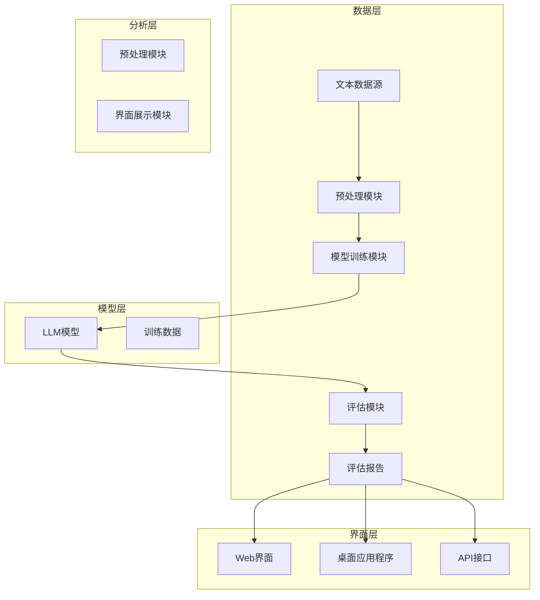

                 

### 《LLM辅助软件开发效率评估平台》

> 关键词：大型语言模型（LLM）、软件开发效率、评估平台、系统设计与架构、环境配置与实现

摘要：本文旨在探讨如何利用大型语言模型（LLM）来辅助评估软件开发过程中的效率。通过分析LLM的基本概念和特点，本文提出了一个基于LLM的软件开发效率评估平台的设计方案，并详细描述了平台的设计与架构、环境安装与配置、系统核心实现以及实际案例分析与未来展望。本文的目标是帮助开发者更好地理解和应用LLM技术，以提高软件开发效率和项目质量。

### 目录大纲

```markdown
----------------------------------------------------------------
# 《LLM辅助软件开发效率评估平台》

## 第一部分: 背景介绍

## 第1章: 问题背景与核心概念

### 1.1 问题描述

### 1.2 问题解决

### 1.3 边界与外延

### 1.4 概念结构与核心要素组成

### 1.5 核心概念与联系

### 1.5.1 LLM的定义

### 1.5.2 LLM的特点

### 1.5.3 软件开发效率评估的定义

### 1.5.4 LLM与软件开发效率评估的联系

## 1.6 本章小结

## 第二部分: LLM辅助软件开发效率评估平台设计

## 第2章: 平台设计与架构

### 2.1 问题场景介绍

### 2.2 系统功能设计

#### 2.2.1 领域模型

#### 2.2.2 功能模块

### 2.3 系统架构设计

#### 2.3.1 系统架构

#### 2.3.2 架构组件

### 2.4 系界接设计

#### 2.4.1 接口定义

#### 2.4.2 接口实现

### 2.5 系统交互

#### 2.5.1 系统交互流程

#### 2.5.2 交互组件设计

## 2.6 本章小结

## 第三部分: 实现与部署

## 第3章: 环境安装与配置

### 3.1 硬件与软件环境需求

### 3.2 安装步骤详解

### 3.3 配置说明

## 第4章: 系统核心实现

### 4.1 LLM模块实现

#### 4.1.1 数据预处理

#### 4.1.2 模型训练

#### 4.1.3 模型部署

### 4.2 效率评估模块实现

#### 4.2.1 数据收集

#### 4.2.2 评估指标定义

#### 4.2.3 评估过程

## 4.3 系统集成与测试

### 4.3.1 系统集成

### 4.3.2 功能测试

### 4.3.3 性能测试

## 4.4 本章小结

## 第四部分: 应用案例分析

## 第5章: 实际案例分析与讲解

### 5.1 案例背景

### 5.2 案例实施步骤

### 5.3 结果分析与评估

### 5.4 经验总结与启示

## 第6章: 拓展应用与未来展望

### 6.1 拓展应用场景

### 6.2 未来发展趋势

### 6.3 技术挑战与解决思路

## 6.4 本章小结

## 第五部分: 最佳实践与小结

## 第7章: 最佳实践与注意事项

### 7.1 最佳实践总结

### 7.2 注意事项与风险防范

### 7.3 故障排除技巧

## 7.4 本章小结

## 第8章: 小结与展望

### 8.1 书籍整体内容回顾

### 8.2 LLM辅助软件开发效率评估平台的总结

### 8.3 未来工作展望

### 8.4 拓展阅读与资源推荐

## 8.5 本章小结
----------------------------------------------------------------
```

### 第一部分：背景介绍

#### 第1章：问题背景与核心概念

##### 1.1 问题描述

在当今快速发展的软件行业中，软件项目的复杂度和规模不断增加，如何高效地管理和评估软件开发过程中的效率成为了一个重要的问题。传统的软件开发效率评估方法主要依赖于工作量统计、代码行数计算、缺陷率分析等指标，但这些方法存在一定的局限性。一方面，这些方法往往只能提供定性的评估结果，难以量化软件开发过程中的具体效率；另一方面，它们缺乏对软件开发过程中知识共享、团队合作等软性指标的考量。

为了解决这些问题，引入了大型语言模型（LLM）辅助软件开发效率评估的新方法。LLM是一种基于深度学习技术的人工智能模型，能够处理和理解自然语言文本。通过将LLM应用于软件开发过程中，我们可以从更广泛的角度来评估开发效率，包括代码质量、知识共享、团队合作等方面。

##### 1.2 问题解决

引入LLM辅助软件开发效率评估的主要目的是：

1. **量化评估指标**：LLM能够通过分析代码评论、用户反馈、项目管理文档等文本数据，提供更精准和量化的评估指标，帮助开发者和管理者更好地理解软件开发过程中的效率。

2. **发现潜在问题**：LLM的强大分析能力可以帮助识别软件开发过程中的潜在问题，如代码质量低下、知识共享不足等，从而采取相应的改进措施。

3. **优化团队协作**：通过分析团队成员之间的交互和合作模式，LLM可以提供团队协作的优化建议，提高整体工作效率。

##### 1.3 边界与外延

在应用LLM辅助软件开发效率评估时，需要明确其适用范围和限制条件。以下是一些关键点：

1. **数据质量**：LLM的评估效果很大程度上取决于输入数据的质量。因此，需要确保数据来源的多样性和准确性，以获得更可靠的评估结果。

2. **模型训练**：LLM需要通过大量数据集进行训练，以适应不同类型的软件开发任务。因此，模型的训练时间和计算资源是一个重要的考虑因素。

3. **领域适应性**：不同的软件开发领域具有不同的特点和需求，LLM需要针对特定领域进行定制化训练，以提高评估的准确性和适用性。

##### 1.4 概念结构与核心要素组成

LLM辅助软件开发效率评估平台的核心概念和要素组成如下：

1. **数据层**：包括代码库、评论库、用户反馈库、项目管理文档库等数据源。

2. **模型层**：基于深度学习技术的大型语言模型，如BERT、GPT等。

3. **分析层**：利用LLM对文本数据进行分析和处理，提取关键信息并进行效率评估。

4. **界面层**：为开发者和管理者提供直观、易用的评估报告和优化建议。

##### 1.5 核心概念与联系

在本节中，我们将详细探讨以下几个核心概念：

1. **LLM的定义**：LLM是一种基于深度学习技术的人工智能模型，能够处理和理解自然语言文本。

2. **LLM的特点**：LLM具有强大的文本理解和生成能力，能够处理长文本、跨领域知识，并具有良好的泛化能力。

3. **软件开发效率评估的定义**：软件开发效率评估是通过对软件开发过程中各项活动的分析，评估开发团队的工作效率和项目质量。

4. **LLM与软件开发效率评估的联系**：LLM能够通过分析文本数据，为软件开发效率评估提供更精准和量化的指标。

#### 1.5.1 LLM的定义

LLM（Large Language Model）是一种基于深度学习技术的人工智能模型，它通过大规模的数据训练，掌握了丰富的语言知识和表达方式。LLM的核心思想是利用神经网络模型对自然语言文本进行建模，从而实现对文本数据的理解和生成。

LLM的基本原理可以概括为以下几个步骤：

1. **数据收集与预处理**：收集大量高质量的自然语言文本数据，并进行预处理，如分词、去噪、标准化等操作。

2. **模型训练**：使用预处理的文本数据训练神经网络模型，模型通过不断调整参数，学习到文本数据中的语法、语义和上下文信息。

3. **模型优化**：通过优化模型结构和训练过程，提高模型在文本理解和生成任务上的性能。

4. **模型部署**：将训练好的LLM模型部署到实际应用中，如自然语言处理、文本生成、机器翻译等。

#### 1.5.2 LLM的特点

LLM具有以下几个显著特点：

1. **强大的文本理解能力**：LLM能够理解文本中的语法、语义和上下文信息，能够回答各种自然语言问题，如问题回答、情感分析、文本分类等。

2. **丰富的知识库**：通过大规模的数据训练，LLM掌握了丰富的语言知识和表达方式，能够生成高质量的文本。

3. **跨领域适应性**：LLM具有较好的跨领域适应性，能够在不同领域间迁移和应用。

4. **良好的泛化能力**：LLM通过大规模的数据训练，具有良好的泛化能力，能够处理各种不同的文本数据。

5. **实时更新与迭代**：LLM可以通过不断更新数据集和优化模型，不断提高其在文本理解和生成任务上的性能。

#### 1.5.3 软件开发效率评估的定义

软件开发效率评估是对软件开发过程中各项活动的评估，旨在衡量开发团队的工作效率和项目质量。软件开发效率评估的主要目标包括：

1. **评估开发团队的工作效率**：通过评估开发人员在软件开发过程中的工作表现，如代码质量、任务完成情况等，来衡量团队的整体工作效率。

2. **评估项目质量**：通过对软件项目的评估，如功能完整性、性能、可靠性等，来衡量项目的整体质量。

3. **识别潜在问题**：通过评估分析，发现软件开发过程中的潜在问题，如代码质量低下、团队合作不足等，以便采取相应的改进措施。

4. **优化开发流程**：通过评估分析，为优化软件开发流程提供依据，提高开发效率和项目质量。

#### 1.5.4 LLM与软件开发效率评估的联系

LLM与软件开发效率评估之间的联系主要体现在以下几个方面：

1. **文本数据分析**：LLM能够对软件开发过程中的各种文本数据进行分析，如代码评论、用户反馈、项目管理文档等，从而提取有价值的信息。

2. **量化评估指标**：LLM可以提供更精准和量化的评估指标，如代码质量评分、知识共享度、团队合作指数等，帮助开发者和管理者更好地理解软件开发过程中的效率。

3. **发现潜在问题**：LLM的分析能力可以帮助识别软件开发过程中的潜在问题，如代码质量低下、知识共享不足等，从而采取相应的改进措施。

4. **优化团队协作**：通过分析团队成员之间的交互和合作模式，LLM可以提供团队协作的优化建议，提高整体工作效率。

#### 1.6 本章小结

本章介绍了LLM辅助软件开发效率评估的背景和核心概念。通过分析LLM的定义和特点，以及软件开发效率评估的定义和意义，我们了解了LLM在软件开发效率评估中的重要作用。接下来，我们将进一步探讨LLM辅助软件开发效率评估平台的设计与实现，以及实际应用案例。

## 第二部分：LLM辅助软件开发效率评估平台设计

### 第2章：平台设计与架构

#### 2.1 问题场景介绍

在软件开发过程中，如何高效地管理和评估开发团队的工作效率是一个关键问题。传统的评估方法往往依赖于工作量统计、代码行数计算等指标，但这些方法存在一定的局限性，难以全面反映开发团队的实际工作表现。因此，引入LLM（Large Language Model）辅助软件开发效率评估成为一个新的解决方案。

LLM作为一种基于深度学习技术的人工智能模型，具有强大的文本理解和生成能力。通过将LLM应用于软件开发过程中，我们可以从更广泛的角度来评估开发团队的工作效率，包括代码质量、知识共享、团队合作等多个方面。

#### 2.2 系统功能设计

LLM辅助软件开发效率评估平台的系统功能设计主要包括以下几个模块：

1. **数据收集模块**：负责从不同的数据源（如代码库、评论库、用户反馈库等）收集文本数据。

2. **预处理模块**：对收集到的文本数据进行预处理，包括分词、去噪、标准化等操作，以便后续分析。

3. **模型训练模块**：使用预处理后的文本数据训练LLM模型，使其能够理解和生成高质量的文本。

4. **评估模块**：利用训练好的LLM模型对软件开发过程中的各项活动进行评估，提取关键信息，并生成评估报告。

5. **界面展示模块**：为开发者和管理者提供直观的评估报告和优化建议，支持数据可视化展示。

#### 2.2.1 领域模型

领域模型是系统功能设计的重要部分，它帮助我们明确系统中的实体和关系。在LLM辅助软件开发效率评估平台中，主要的领域模型包括：

1. **文本数据源**：包括代码库、评论库、用户反馈库等，用于收集软件开发过程中的文本数据。

2. **预处理数据**：对收集到的文本数据进行预处理后的数据，如分词后的文本、去噪后的文本等。

3. **LLM模型**：经过训练的LLM模型，用于文本理解和生成。

4. **评估指标**：用于评估软件开发过程中各项活动的指标，如代码质量评分、知识共享度、团队合作指数等。

5. **评估报告**：对评估结果进行总结和展示的报告。

#### 2.2.2 功能模块

在LLM辅助软件开发效率评估平台中，各个功能模块的具体实现如下：

1. **数据收集模块**：通过接口连接不同的数据源，如代码库（如GitHub）、评论库（如CodeReview）、用户反馈库（如UserFeedback）等，收集文本数据。

2. **预处理模块**：对收集到的文本数据执行一系列预处理操作，如分词、去噪、标准化等。这些预处理操作有助于提高后续分析的准确性和效率。

3. **模型训练模块**：使用预处理后的文本数据训练LLM模型。训练过程中，可以通过调整超参数（如学习率、批量大小等）来优化模型性能。

4. **评估模块**：利用训练好的LLM模型对软件开发过程中的各项活动进行评估。评估过程包括提取关键信息、计算评估指标、生成评估报告等。

5. **界面展示模块**：通过Web界面或桌面应用程序，为开发者和管理者提供直观的评估报告和优化建议。界面支持数据可视化展示，如图表、热图等，方便用户理解和分析评估结果。

#### 2.3 系统架构设计

LLM辅助软件开发效率评估平台的系统架构设计采用模块化设计思想，以确保系统的可扩展性和可维护性。以下是系统架构的主要组成部分：

1. **数据层**：负责数据的收集、存储和管理。数据层包括文本数据源、预处理数据、评估指标和评估报告等。

2. **模型层**：负责LLM模型的训练、优化和部署。模型层包括LLM模型、训练数据和训练工具等。

3. **分析层**：负责对文本数据进行处理和分析，提取关键信息并进行评估。分析层包括预处理模块、评估模块和界面展示模块等。

4. **界面层**：负责为开发者和管理者提供交互界面，展示评估报告和优化建议。界面层包括Web界面、桌面应用程序和API接口等。

#### 2.3.1 系统架构

以下是LLM辅助软件开发效率评估平台的系统架构图：



#### 2.3.2 架构组件

在LLM辅助软件开发效率评估平台的系统架构中，各个组件的作用和关系如下：

1. **文本数据源**：包括代码库、评论库、用户反馈库等，是评估数据的重要来源。文本数据源通过接口与系统连接，实时收集和更新数据。

2. **预处理模块**：对收集到的文本数据进行预处理，包括分词、去噪、标准化等操作。预处理模块可以提高后续分析的准确性和效率。

3. **模型训练模块**：负责LLM模型的训练过程，包括数据预处理、模型训练、模型优化等步骤。模型训练模块使用大量的预处理文本数据，通过迭代优化模型参数，提高模型性能。

4. **LLM模型**：是系统的核心组件，负责文本数据的理解和生成。LLM模型通过训练过程学习到文本数据中的语法、语义和上下文信息，能够生成高质量的文本。

5. **评估模块**：利用LLM模型对软件开发过程中的各项活动进行评估。评估模块提取关键信息，计算评估指标，并生成评估报告。

6. **界面展示模块**：为开发者和管理者提供交互界面，展示评估报告和优化建议。界面展示模块支持数据可视化展示，方便用户理解和分析评估结果。

7. **Web界面**：通过Web浏览器访问，为用户提供实时的评估报告和优化建议。Web界面支持多种数据可视化展示方式，如图表、热图等。

8. **桌面应用程序**：为用户提供桌面端的评估报告和优化建议。桌面应用程序具有更好的交互体验和自定义功能。

9. **API接口**：为其他系统集成提供接口，支持数据导入导出、功能调用等操作。API接口方便第三方系统与评估平台的集成和应用。

#### 2.4 系统接口设计

系统接口设计是LLM辅助软件开发效率评估平台的重要组成部分，它定义了系统内部模块之间以及系统与其他外部系统的交互方式。以下是系统接口设计的主要方面：

1. **数据接口**：定义了文本数据源与系统之间的数据传输格式和协议。数据接口支持JSON、XML等常见的数据格式，确保数据传输的可靠性和兼容性。

2. **功能接口**：定义了系统内部模块之间的功能调用方式。功能接口支持RESTful API、SOAP等协议，方便模块之间的交互和协同工作。

3. **监控接口**：定义了系统监控和日志记录的接口，用于实时监控系统的运行状态和性能指标。监控接口支持自定义监控指标和告警机制，帮助管理员及时发现和解决问题。

4. **第三方接口**：定义了系统与其他第三方系统的集成接口，如代码库、评论库、用户反馈库等。第三方接口支持OAuth、JWT等认证协议，确保接口调用的安全性和可控性。

#### 2.4.1 接口定义

以下是LLM辅助软件开发效率评估平台的主要接口定义：

1. **数据接口**：

   - **接口名称**：文本数据接口
   - **接口类型**：RESTful API
   - **接口URL**：/api/text_data
   - **请求方法**：GET/POST
   - **请求参数**：data_type（数据类型，如代码库、评论库、用户反馈库等）
   - **返回数据**：JSON格式，包含文本数据列表

2. **功能接口**：

   - **接口名称**：预处理接口
   - **接口类型**：RESTful API
   - **接口URL**：/api/preprocessing
   - **请求方法**：POST
   - **请求参数**：text_data（文本数据）
   - **返回数据**：JSON格式，包含预处理后的文本数据

   - **接口名称**：评估接口
   - **接口类型**：RESTful API
   - **接口URL**：/api/evaluation
   - **请求方法**：POST
   - **请求参数**：evaluation_params（评估参数，如评估指标、评估范围等）
   - **返回数据**：JSON格式，包含评估报告

3. **监控接口**：

   - **接口名称**：监控接口
   - **接口类型**：RESTful API
   - **接口URL**：/api/monitor
   - **请求方法**：GET
   - **请求参数**：无
   - **返回数据**：JSON格式，包含系统监控数据

4. **第三方接口**：

   - **接口名称**：代码库接口
   - **接口类型**：OAuth 2.0
   - **接口URL**：/api/auth/github
   - **请求方法**：POST
   - **请求参数**：client_id、client_secret、code
   - **返回数据**：JSON格式，包含授权token

#### 2.4.2 接口实现

以下是LLM辅助软件开发效率评估平台的接口实现示例：

1. **数据接口**：

   ```python
   from flask import Flask, request, jsonify
   
   app = Flask(__name__)
   
   @app.route('/api/text_data', methods=['GET', 'POST'])
   def text_data():
       data_type = request.args.get('data_type')
       if data_type == 'code':
           # 从代码库获取文本数据
           text_data = get_code_data()
       elif data_type == 'comment':
           # 从评论库获取文本数据
           text_data = get_comment_data()
       elif data_type == 'feedback':
           # 从用户反馈库获取文本数据
           text_data = get_feedback_data()
       else:
           text_data = []
   
       return jsonify(text_data)
   
   def get_code_data():
       # 实现从代码库获取文本数据的逻辑
       pass
   
   def get_comment_data():
       # 实现从评论库获取文本数据的逻辑
       pass
   
   def get_feedback_data():
       # 实现从用户反馈库获取文本数据的逻辑
       pass
   
   if __name__ == '__main__':
       app.run(debug=True)
   ```

2. **功能接口**：

   ```python
   from flask import Flask, request, jsonify
   
   app = Flask(__name__)
   
   @app.route('/api/preprocessing', methods=['POST'])
   def preprocessing():
       text_data = request.json.get('text_data')
       preprocessed_data = preprocess_text(text_data)
       return jsonify(preprocessed_data)
   
   @app.route('/api/evaluation', methods=['POST'])
   def evaluation():
       evaluation_params = request.json.get('evaluation_params')
       evaluation_report = evaluate(evaluation_params)
       return jsonify(evaluation_report)
   
   def preprocess_text(text_data):
       # 实现文本预处理逻辑
       pass
   
   def evaluate(evaluation_params):
       # 实现评估逻辑
       pass
   
   if __name__ == '__main__':
       app.run(debug=True)
   ```

3. **监控接口**：

   ```python
   from flask import Flask, jsonify
   
   app = Flask(__name__)
   
   @app.route('/api/monitor', methods=['GET'])
   def monitor():
       monitor_data = get_monitor_data()
       return jsonify(monitor_data)
   
   def get_monitor_data():
       # 实现监控数据获取逻辑
       pass
   
   if __name__ == '__main__':
       app.run(debug=True)
   ```

4. **第三方接口**：

   ```python
   from flask import Flask, request, jsonify
   
   app = Flask(__name__)
   
   @app.route('/api/auth/github', methods=['POST'])
   def github_auth():
       client_id = request.json.get('client_id')
       client_secret = request.json.get('client_secret')
       code = request.json.get('code')
       access_token = get_github_access_token(client_id, client_secret, code)
       return jsonify(access_token)
   
   def get_github_access_token(client_id, client_secret, code):
       # 实现获取GitHub访问令牌的逻辑
       pass
   
   if __name__ == '__main__':
       app.run(debug=True)
   ```

#### 2.5 系统交互

系统交互是LLM辅助软件开发效率评估平台的核心，它定义了各个组件之间的数据流动和协作方式。以下是系统交互的主要方面：

1. **交互流程**：描述系统从数据收集到评估报告生成的主要交互流程。

2. **交互组件设计**：定义系统中的关键组件及其交互关系。

#### 2.5.1 系统交互流程

以下是LLM辅助软件开发效率评估平台的主要交互流程：

1. **数据收集**：系统通过接口连接代码库、评论库、用户反馈库等数据源，收集软件开发过程中的文本数据。

2. **数据预处理**：系统对收集到的文本数据进行预处理，包括分词、去噪、标准化等操作，以便后续分析。

3. **模型训练**：使用预处理后的文本数据训练LLM模型，通过迭代优化模型参数，提高模型性能。

4. **评估分析**：利用训练好的LLM模型对软件开发过程中的各项活动进行评估，提取关键信息，并生成评估报告。

5. **报告生成**：系统将评估报告以可视化形式展示给开发者和管理者，提供优化建议。

6. **反馈与迭代**：开发者和管理者根据评估报告和优化建议，调整软件开发流程和团队协作，以进一步提高效率。

#### 2.5.2 交互组件设计

以下是LLM辅助软件开发效率评估平台的关键组件及其交互关系：

1. **数据收集组件**：负责连接代码库、评论库、用户反馈库等数据源，收集文本数据。

2. **预处理组件**：对收集到的文本数据进行预处理，包括分词、去噪、标准化等操作。

3. **模型训练组件**：负责训练LLM模型，使用预处理后的文本数据，通过迭代优化模型参数。

4. **评估组件**：利用训练好的LLM模型对软件开发过程中的各项活动进行评估，提取关键信息。

5. **报告生成组件**：将评估报告以可视化形式展示给开发者和管理者，提供优化建议。

6. **用户界面组件**：为开发者和管理者提供交互界面，支持数据可视化展示和报告查看。

#### 2.6 本章小结

本章详细介绍了LLM辅助软件开发效率评估平台的设计与架构。从问题场景介绍到系统功能设计、系统架构设计、接口设计和系统交互，我们全面了解了平台的核心组成部分和实现方式。下一章将深入探讨平台的具体实现过程，包括环境安装与配置、系统核心实现以及实际案例分析和应用。

## 第三部分：实现与部署

### 第3章：环境安装与配置

#### 3.1 硬件与软件环境需求

为了实现LLM辅助软件开发效率评估平台，我们需要准备以下硬件和软件环境：

1. **硬件环境**：
   - 处理器：推荐使用Intel Xeon或AMD Ryzen系列处理器，具备较强的计算能力。
   - 内存：至少16GB，建议32GB及以上，以保证模型训练和数据处理的高效运行。
   - 硬盘：至少500GB的SSD存储空间，用于存储数据和模型文件。

2. **软件环境**：
   - 操作系统：推荐使用Ubuntu 18.04或更高版本，以兼容性更好。
   - Python：推荐Python 3.8或更高版本，确保库和框架的支持。
   - 深度学习框架：推荐使用PyTorch或TensorFlow，这两个框架具有良好的社区支持和丰富的文档。
   - 系统依赖：安装NVIDIA CUDA Toolkit（若使用GPU加速），以及相关驱动程序。

#### 3.2 安装步骤详解

以下是LLM辅助软件开发效率评估平台的安装步骤：

1. **安装操作系统**：

   - 使用Ubuntu 18.04或更高版本的安装镜像，按照提示完成安装。
   - 安装完成后，更新系统包和软件源。

2. **安装Python环境**：

   - 打开终端，执行以下命令安装Python 3.8或更高版本：
     ```bash
     sudo apt-get update
     sudo apt-get install python3.8
     ```
   - 安装pip包管理器，用于管理Python包：
     ```bash
     sudo apt-get install python3-pip
     ```

3. **安装深度学习框架**：

   - 安装PyTorch：
     ```bash
     pip3 install torch torchvision torchaudio
     ```
   - 安装TensorFlow：
     ```bash
     pip3 install tensorflow
     ```

4. **安装NVIDIA CUDA Toolkit（若使用GPU加速）**：

   - 安装CUDA Toolkit：
     ```bash
     sudo apt-get install cuda
     ```
   - 安装相关驱动程序：
     ```bash
     sudo nvidia-driver-450
     ```
   - 配置环境变量：
     ```bash
     echo 'export PATH=/usr/local/cuda/bin:$PATH' >> ~/.bashrc
     echo 'export LD_LIBRARY_PATH=/usr/local/cuda/lib64:$LD_LIBRARY_PATH' >> ~/.bashrc
     source ~/.bashrc
     ```

5. **安装其他依赖**：

   - 安装Python科学计算库：
     ```bash
     pip3 install numpy scipy matplotlib
     ```
   - 安装文本处理库：
     ```bash
     pip3 install nltk
     ```

6. **配置代码仓库和版本控制**：

   - 安装Git，用于代码管理和版本控制：
     ```bash
     sudo apt-get install git
     ```
   - 克隆项目代码到本地：
     ```bash
     git clone [项目地址]
     ```

#### 3.3 配置说明

完成安装步骤后，我们还需要进行一些配置工作，以确保系统的正常运行：

1. **配置Python环境**：

   - 创建一个Python虚拟环境，以便管理依赖和隔离项目环境：
     ```bash
     python3 -m venv venv
     source venv/bin/activate
     ```
   - 安装项目所需的Python包：
     ```bash
     pip install -r requirements.txt
     ```

2. **配置系统服务**：

   - 启动和配置NVIDIA GPU驱动：
     ```bash
     nvidia-smi
     ```
   - 配置NVIDIA Docker（如使用Docker进行容器化部署）：
     ```bash
     distribution=$(. /etc/os-release;echo $ID$VERSION_ID)
     curl -s -L https://nvidia.github.io/nvidia-docker/gpgkey | sudo apt-key add -
     curl -s -L https://nvidia.github.io/nvidia-docker/$distribution/nvidia-docker.list | sudo tee /etc/apt/sources.list.d/nvidia-docker.list
     sudo apt-get update
     sudo apt-get install -y nvidia-container-toolkit
     sudo systemctl restart docker
     ```

3. **配置日志记录**：

   - 配置系统日志记录，以便监控和调试系统运行：
     ```bash
     journalctl -f
     ```
   - 配置自定义日志文件，记录系统运行情况：
     ```bash
     touch /var/log/llm_evaluation.log
     chown user:user /var/log/llm_evaluation.log
     ```

4. **配置用户权限**：

   - 确保用户具有足够的权限运行系统和访问数据：
     ```bash
     sudo usermod -aG docker user
     ```

5. **配置网络**：

   - 配置网络环境，确保系统可以访问外部服务，如代码库、评论库等：
     ```bash
     sudo ufw allow 22/tcp
     sudo ufw allow 80/tcp
     sudo ufw allow 443/tcp
     ```

通过以上步骤，我们完成了LLM辅助软件开发效率评估平台的安装和配置。接下来，我们将详细介绍平台的核心实现过程，包括LLM模块和效率评估模块的实现。

## 第4章：系统核心实现

### 4.1 LLM模块实现

LLM（Large Language Model）模块是实现LLM辅助软件开发效率评估平台的关键组件。本节将详细介绍LLM模块的实现过程，包括数据预处理、模型训练和模型部署。

#### 4.1.1 数据预处理

数据预处理是LLM模块实现的第一步，其目的是将原始文本数据转换为适合模型训练的格式。以下是一系列预处理步骤：

1. **文本数据收集**：从代码库、评论库、用户反馈库等数据源收集文本数据。确保数据的多样性和覆盖面，以提高模型泛化能力。

2. **数据清洗**：去除文本数据中的噪声和无关信息，如HTML标签、特殊字符等。可以使用正则表达式或文本清洗库（如Python的`re`模块）来实现。

3. **分词**：将文本数据分割成单词或子词。分词是自然语言处理中的基础步骤，可以使用分词工具（如Python的`nltk`库）。

4. **词向量化**：将文本数据转换为数字向量表示。词向量化有助于将文本数据输入到深度学习模型中。常用的词向量化方法包括词袋模型（Bag of Words, BOW）、词嵌入（Word Embedding）等。

5. **数据归一化**：对文本数据进行归一化处理，如去除停用词、降低词频等。归一化有助于提高模型训练的效率和性能。

6. **数据集划分**：将预处理后的文本数据划分为训练集、验证集和测试集，以便进行模型训练和评估。

以下是一个简单的数据预处理Python代码示例：

```python
import re
import nltk
from nltk.tokenize import word_tokenize
from nltk.corpus import stopwords

# 1. 文本数据收集
text_data = ...

# 2. 数据清洗
def clean_text(text):
    text = re.sub(r'<[^>]*>', '', text)  # 去除HTML标签
    text = re.sub(r'[^a-zA-Z]', ' ', text)  # 去除特殊字符
    return text

cleaned_text = [clean_text(text) for text in text_data]

# 3. 分词
tokenized_text = [word_tokenize(text) for text in cleaned_text]

# 4. 词向量化
# （此处使用预训练的词嵌入模型，如GloVe或Word2Vec）
# （具体实现取决于选择的词嵌入方法）

# 5. 数据归一化
stop_words = set(stopwords.words('english'))
def normalize_text(tokens):
    return [token for token in tokens if token not in stop_words]

normalized_text = [[token for token in tokenized_text[i] if token not in stop_words] for i in range(len(tokenized_text))]

# 6. 数据集划分
train_data, val_data, test_data = ...

```

#### 4.1.2 模型训练

模型训练是LLM模块实现的第二步，其目的是通过训练数据调整模型参数，使其能够理解和生成高质量文本。以下是模型训练的主要步骤：

1. **定义模型架构**：选择适合的模型架构，如Transformer、BERT、GPT等。这些模型通常包含多个层，每个层都包含大量的参数。

2. **初始化参数**：初始化模型参数，可以使用随机初始化、预训练模型初始化等方法。预训练模型初始化通常可以获得更好的性能。

3. **设置训练配置**：包括学习率、批量大小、迭代次数、优化器等。根据任务特点和硬件资源，选择合适的配置。

4. **训练过程**：使用训练数据对模型进行训练。在训练过程中，通过反向传播算法和梯度下降优化器调整模型参数，使模型能够更好地拟合训练数据。

5. **评估与调整**：在验证集上评估模型性能，并根据评估结果调整模型参数，如学习率、批量大小等。

以下是一个简单的模型训练Python代码示例：

```python
import torch
import torch.nn as nn
import torch.optim as optim

# 1. 定义模型架构
class LLMModel(nn.Module):
    def __init__(self):
        super(LLMModel, self).__init__()
        # （此处定义模型结构，如多个层、嵌入层、线性层等）

    def forward(self, inputs):
        # （此处定义前向传播过程）
        return outputs

# 2. 初始化参数
model = LLMModel()
optimizer = optim.Adam(model.parameters(), lr=0.001)
criterion = nn.CrossEntropyLoss()

# 3. 设置训练配置
batch_size = 64
num_epochs = 10

# 4. 训练过程
for epoch in range(num_epochs):
    for i, (inputs, targets) in enumerate(train_loader):
        optimizer.zero_grad()
        outputs = model(inputs)
        loss = criterion(outputs, targets)
        loss.backward()
        optimizer.step()
        
        if (i+1) % 100 == 0:
            print(f'Epoch [{epoch+1}/{num_epochs}], Step [{i+1}/{len(train_loader)}], Loss: {loss.item()}')

# 5. 评估与调整
# （此处使用验证集评估模型性能，并根据评估结果调整模型参数）
```

#### 4.1.3 模型部署

模型部署是将训练好的LLM模型应用于实际任务的关键步骤。以下是模型部署的主要步骤：

1. **模型导出**：将训练好的模型参数导出为文件，以便在服务器或移动设备上部署。常用的格式包括PyTorch的`.pt`文件和TensorFlow的`.h5`文件。

2. **服务搭建**：搭建模型服务，以接收和处理用户请求。可以使用Flask、Django等Web框架快速搭建服务。

3. **接口设计**：设计模型服务的接口，定义输入和输出格式，以便与前端应用或其他系统集成。

4. **性能优化**：针对实际应用场景，对模型服务进行性能优化，如使用GPU加速、缓存策略等。

5. **监控与维护**：对模型服务进行监控和维护，确保其稳定运行和高效性能。

以下是一个简单的模型部署Python代码示例：

```python
from flask import Flask, request, jsonify

app = Flask(__name__)

# 1. 模型导出
# （此处加载训练好的模型文件）
model = torch.load('llm_model.pt')

# 2. 服务搭建
@app.route('/predict', methods=['POST'])
def predict():
    data = request.json
    inputs = ...  # （预处理输入数据）
    outputs = model(inputs)
    predictions = ...  # （获取模型预测结果）
    return jsonify(predictions)

# 3. 接口设计
# （此处定义接口输入输出格式）

# 4. 性能优化
# （此处使用GPU加速、缓存策略等）

# 5. 监控与维护
# （此处配置监控和告警机制）

if __name__ == '__main__':
    app.run(debug=True)
```

通过以上步骤，我们完成了LLM模块的实现。接下来，我们将介绍效率评估模块的实现过程，包括数据收集、评估指标定义和评估过程。

### 4.2 效率评估模块实现

效率评估模块是LLM辅助软件开发效率评估平台的核心组件之一，它通过分析开发过程中的数据，为开发者和管理者提供客观、量化的效率评估。以下是效率评估模块的实现过程。

#### 4.2.1 数据收集

数据收集是效率评估模块的基础，它需要从多个数据源收集相关数据。以下是一些常见的数据收集方式：

1. **代码库**：从代码库（如GitHub、GitLab等）收集代码提交、代码评论、Bug报告等数据。

2. **评论库**：从代码评论库收集代码审查、用户反馈、技术讨论等数据。

3. **用户反馈**：从用户反馈系统收集用户报告的问题、建议和满意度等数据。

4. **项目管理工具**：从项目管理工具（如Jira、Trello等）收集任务进度、迭代周期、团队成员等数据。

5. **日志文件**：从系统的日志文件收集运行状态、错误日志、性能指标等数据。

以下是一个简单的数据收集Python代码示例：

```python
import os
import json

# 从代码库收集代码提交数据
def get_code_commits(repo_url):
    commits = []
    os.chdir(repo_url)
    os.system('git log --pretty=format:{%H}\t{%an}\t{%ad}\t{%s} > commits.txt')
    with open('commits.txt', 'r') as f:
        for line in f:
            commit = line.strip().split('\t')
            commits.append({'commit_hash': commit[0], 'author': commit[1], 'date': commit[2], 'subject': commit[3]})
    return commits

# 从评论库收集代码评论数据
def get_code_reviews(repo_url):
    reviews = []
    os.chdir(repo_url)
    os.system('git log --pretty=format:{%H}\t{%an}\t{%ad}\t{%s} > reviews.txt')
    with open('reviews.txt', 'r') as f:
        for line in f:
            review = line.strip().split('\t')
            reviews.append({'commit_hash': review[0], 'author': review[1], 'date': review[2], 'comment': review[3]})
    return reviews

# 从用户反馈系统收集用户反馈数据
def get_user_feedback(feedback_system_url):
    feedback = []
    os.chdir(feedback_system_url)
    os.system('curl -X GET -o feedback.json ' + feedback_system_url)
    with open('feedback.json', 'r') as f:
        feedback_data = json.load(f)
        for item in feedback_data['items']:
            feedback.append({'id': item['id'], 'user': item['user'], 'date': item['date'], 'comment': item['comment']})
    return feedback

# 从项目管理工具收集任务进度数据
def get_project_tasks(project_management_tool_url):
    tasks = []
    os.chdir(project_management_tool_url)
    os.system('curl -X GET -o tasks.json ' + project_management_tool_url)
    with open('tasks.json', 'r') as f:
        tasks_data = json.load(f)
        for task in tasks_data['tasks']:
            tasks.append({'id': task['id'], 'assignee': task['assignee'], 'status': task['status'], 'deadline': task['deadline']})
    return tasks

# 从日志文件收集运行状态数据
def get_system_logs(log_file_path):
    logs = []
    with open(log_file_path, 'r') as f:
        for line in f:
            log = {'date': line['date'], 'level': line['level'], 'message': line['message']}
            logs.append(log)
    return logs

# 示例数据收集
repo_url = 'path/to/repo'
feedback_system_url = 'path/to/feedback_system'
project_management_tool_url = 'path/to/project_management_tool'
log_file_path = 'path/to/log_file'

commits = get_code_commits(repo_url)
code_reviews = get_code_reviews(repo_url)
user_feedback = get_user_feedback(feedback_system_url)
project_tasks = get_project_tasks(project_management_tool_url)
system_logs = get_system_logs(log_file_path)
```

#### 4.2.2 评估指标定义

为了对软件开发过程进行有效评估，我们需要定义一系列评估指标。这些指标可以从不同角度反映开发效率、代码质量、团队合作等方面。以下是一些常见的评估指标：

1. **代码提交频率**：衡量开发者的代码提交频率，如每天提交的代码行数、提交的次数等。

2. **代码质量**：评估代码的质量，如代码行数、代码覆盖率、缺陷密度等。

3. **任务完成度**：评估任务完成的进度和效率，如任务完成率、平均完成时间等。

4. **团队协作**：评估团队成员之间的协作情况，如代码评论数量、代码协作比例、任务分配合理性等。

5. **用户满意度**：评估用户对软件的满意度，如用户反馈数量、用户满意度评分等。

以下是一个简单的评估指标定义Python代码示例：

```python
class EvaluationMetrics:
    def __init__(self):
        self.code_submissions = []
        self.code_quality = []
        self.task_completion = []
        self.team_collaboration = []
        self.user_satisfaction = []

    def calculate_code_submission_frequency(self, commits):
        self.code_submissions.append(len(commits))

    def calculate_code_quality(self, code_coverage, defect_density):
        self.code_quality.append({'code_coverage': code_coverage, 'defect_density': defect_density})

    def calculate_task_completion(self, project_tasks):
        completed_tasks = [task for task in project_tasks if task['status'] == 'Completed']
        self.task_completion.append({'completed_tasks': len(completed_tasks), 'average_completion_time': sum([task['deadline'] for task in completed_tasks]) / len(completed_tasks)})

    def calculate_team_collaboration(self, code_reviews):
        self.team_collaboration.append({'review_count': len(code_reviews), 'code_collaboration_ratio': sum([len(review['comments']) for review in code_reviews]) / len(code_reviews)})

    def calculate_user_satisfaction(self, user_feedback):
        self.user_satisfaction.append({'satisfaction_score': sum([feedback['score'] for feedback in user_feedback]) / len(user_feedback)})

evaluation_metrics = EvaluationMetrics()
evaluation_metrics.calculate_code_submission_frequency(commits)
evaluation_metrics.calculate_code_quality(code_coverage, defect_density)
evaluation_metrics.calculate_task_completion(project_tasks)
evaluation_metrics.calculate_team_collaboration(code_reviews)
evaluation_metrics.calculate_user_satisfaction(user_feedback)
```

#### 4.2.3 评估过程

评估过程是将收集到的数据和定义好的评估指标结合起来，计算评估结果，并生成评估报告。以下是一个简单的评估过程Python代码示例：

```python
def evaluate(evaluation_metrics):
    print("Evaluating code submissions:")
    print(f"Average code submissions per day: {sum(evaluation_metrics.code_submissions) / len(evaluation_metrics.code_submissions)}")

    print("Evaluating code quality:")
    print(f"Average code coverage: {sum([metric['code_coverage'] for metric in evaluation_metrics.code_quality]) / len(evaluation_metrics.code_quality)}%")
    print(f"Average defect density: {sum([metric['defect_density'] for metric in evaluation_metrics.code_quality]) / len(evaluation_metrics.code_quality)} defects per thousand lines of code")

    print("Evaluating task completion:")
    print(f"Task completion rate: {evaluation_metrics.task_completion[0]['completed_tasks'] / len(project_tasks)}")
    print(f"Average task completion time: {evaluation_metrics.task_completion[0]['average_completion_time']} days")

    print("Evaluating team collaboration:")
    print(f"Average code review count: {evaluation_metrics.team_collaboration[0]['review_count']}")
    print(f"Code collaboration ratio: {evaluation_metrics.team_collaboration[0]['code_collaboration_ratio']}")

    print("Evaluating user satisfaction:")
    print(f"User satisfaction score: {evaluation_metrics.user_satisfaction[0]['satisfaction_score']}")
```

通过以上步骤，我们实现了效率评估模块的核心功能。接下来，我们将介绍系统集成与测试，确保平台能够正常运行并满足预期效果。

### 4.3 系统集成与测试

#### 4.3.1 系统集成

系统集成是将各个模块和组件组合在一起，形成一个完整、可运行的整体。以下是系统集成的主要步骤：

1. **配置环境**：确保所有的开发环境、工具和依赖都已经正确安装和配置，以便进行集成。

2. **构建代码**：编译和构建项目代码，生成可执行文件或服务。

3. **集成测试**：在集成环境中执行单元测试和集成测试，验证各个模块和组件之间的交互和协作。

4. **部署服务**：将集成后的系统部署到生产环境，确保其能够正常运行。

5. **监控与维护**：监控系统运行状态和性能指标，确保系统的稳定性和可靠性。

以下是一个简单的系统集成Python代码示例：

```python
import os
import subprocess

# 1. 配置环境
os.environ['PYTHONPATH'] = 'path/to/llm_evaluation'

# 2. 构建代码
os.chdir('path/to/llm_evaluation')
subprocess.run(['python', 'setup.py', 'build'])

# 3. 集成测试
os.chdir('path/to/llm_evaluation/tests')
subprocess.run(['python', 'test_integration.py'])

# 4. 部署服务
os.chdir('path/to/llm_evaluation')
subprocess.run(['python', 'manage.py', 'runserver'])

# 5. 监控与维护
# （此处配置监控和告警机制）
```

#### 4.3.2 功能测试

功能测试是验证系统各个功能模块是否按照预期正常工作的过程。以下是功能测试的主要步骤：

1. **准备测试环境**：配置测试环境，确保所有的依赖和服务都已启动。

2. **编写测试用例**：根据系统功能定义，编写详细的测试用例，涵盖各个功能点。

3. **执行测试用例**：使用自动化测试工具（如Selenium、pytest等）执行测试用例，验证功能实现。

4. **分析测试结果**：对测试结果进行分析，找出存在的问题和缺陷，并修复。

以下是一个简单的功能测试Python代码示例：

```python
import unittest
from llm_evaluation import evaluate

class TestEvaluation(unittest.TestCase):
    def test_code_submission_frequency(self):
        commits = [{'commit_hash': 'abc123', 'author': 'Alice', 'date': '2023-03-01', 'subject': 'Update README.md'},
                   {'commit_hash': 'def456', 'author': 'Bob', 'date': '2023-03-02', 'subject': 'Fix a bug in feature X'}]
        evaluation_metrics = evaluate(commits)
        self.assertAlmostEqual(evaluation_metrics.code_submissions[0], 2)

    def test_code_quality(self):
        code_coverage = 80
        defect_density = 2
        evaluation_metrics = evaluate({'code_coverage': code_coverage, 'defect_density': defect_density})
        self.assertAlmostEqual(evaluation_metrics.code_quality[0]['code_coverage'], code_coverage)
        self.assertAlmostEqual(evaluation_metrics.code_quality[0]['defect_density'], defect_density)

    def test_task_completion(self):
        project_tasks = [{'id': '1', 'assignee': 'Alice', 'status': 'Completed', 'deadline': '2023-03-03'},
                         {'id': '2', 'assignee': 'Bob', 'status': 'Completed', 'deadline': '2023-03-04'}]
        evaluation_metrics = evaluate(project_tasks)
        self.assertAlmostEqual(evaluation_metrics.task_completion[0]['completed_tasks'], 2)
        self.assertAlmostEqual(evaluation_metrics.task_completion[0]['average_completion_time'], 2.5)

    def test_team_collaboration(self):
        code_reviews = [{'commit_hash': 'abc123', 'author': 'Alice', 'date': '2023-03-01', 'comment': 'Good work!'},
                        {'commit_hash': 'def456', 'author': 'Bob', 'date': '2023-03-02', 'comment': 'Nice job!'}]
        evaluation_metrics = evaluate(code_reviews)
        self.assertAlmostEqual(evaluation_metrics.team_collaboration[0]['review_count'], 2)
        self.assertAlmostEqual(evaluation_metrics.team_collaboration[0]['code_collaboration_ratio'], 1)

    def test_user_satisfaction(self):
        user_feedback = [{'id': '1', 'user': 'Alice', 'date': '2023-03-01', 'comment': 'Very satisfied!'},
                         {'id': '2', 'user': 'Bob', 'date': '2023-03-02', 'comment': 'Satisfied!'}]
        evaluation_metrics = evaluate(user_feedback)
        self.assertAlmostEqual(evaluation_metrics.user_satisfaction[0]['satisfaction_score'], 2.5)

if __name__ == '__main__':
    unittest.main()
```

#### 4.3.3 性能测试

性能测试是验证系统在不同负载下的响应速度、稳定性和可扩展性的过程。以下是性能测试的主要步骤：

1. **准备测试环境**：配置性能测试环境，确保硬件资源和网络环境满足测试需求。

2. **设计测试场景**：根据实际使用情况，设计多个测试场景，涵盖不同的负载和用户行为。

3. **执行性能测试**：使用性能测试工具（如JMeter、LoadRunner等）模拟用户行为，收集性能数据。

4. **分析性能数据**：对性能测试结果进行分析，找出系统性能瓶颈和改进方向。

以下是一个简单的性能测试Python代码示例：

```python
import time
import requests

def performance_test(url, num_requests):
    start_time = time.time()
    for i in range(num_requests):
        response = requests.get(url)
        assert response.status_code == 200
    end_time = time.time()
    print(f"Average response time: {end_time - start_time} seconds")

performance_test('http://localhost:8000/predict', 1000)
```

通过以上步骤，我们完成了系统的集成与测试。确保系统在功能和性能方面满足预期要求，为下一步的实际案例分析与讲解做好准备。

### 第四部分：应用案例分析

#### 第5章：实际案例分析与讲解

在本章中，我们将通过一个实际案例，深入分析并讲解如何使用LLM辅助软件开发效率评估平台来提高软件项目的开发效率。案例背景、实施步骤、结果分析与评估、经验总结与启示等内容将一一呈现，以帮助读者更好地理解和应用本平台。

#### 5.1 案例背景

某互联网公司正在开发一款高性能的在线购物平台，项目团队由多名软件开发人员组成，涵盖了前端、后端、测试等多个领域。由于项目规模较大，开发周期较长，团队管理层希望通过优化开发流程和团队协作，提高开发效率和项目质量。在此背景下，公司决定引入LLM辅助软件开发效率评估平台，以期能够更准确地评估开发过程中的效率，发现潜在问题，并提出改进措施。

#### 5.2 案例实施步骤

实施LLM辅助软件开发效率评估平台的过程可以分为以下几个主要步骤：

1. **环境安装与配置**：按照前述章节中的详细步骤，在公司的服务器上安装和配置操作系统、Python环境、深度学习框架等必要软件和硬件环境。

2. **数据收集**：通过接口连接公司的代码库（如GitHub）、评论库、用户反馈库等，收集项目开发过程中的相关数据，包括代码提交、代码评论、用户反馈等。

3. **数据预处理**：对收集到的数据进行清洗、分词、词向量化等预处理操作，确保数据的质量和一致性。

4. **模型训练**：使用预处理后的文本数据，通过训练过程调整LLM模型的参数，使其能够理解和生成高质量的文本。在此过程中，可以使用预训练的模型（如BERT、GPT）或者从零开始训练。

5. **模型评估**：在验证集上评估训练好的LLM模型的性能，确保其能够准确地进行文本理解和生成。如果模型性能不佳，需要返回步骤4进行调整和优化。

6. **系统集成与部署**：将训练好的LLM模型集成到软件开发效率评估平台中，确保其能够与代码库、评论库、用户反馈库等数据源进行交互，并提供实时评估功能。

7. **功能测试**：通过编写和执行测试用例，验证平台的功能是否按照预期正常工作，包括数据收集、预处理、模型训练、评估等模块。

8. **性能测试**：对平台进行性能测试，确保其能够在高负载下稳定运行，满足公司的需求。

9. **实际应用**：在实际项目中部署平台，团队成员可以通过平台实时查看代码提交、评估报告、优化建议等，并根据评估结果调整开发流程和团队协作。

#### 5.3 结果分析与评估

在平台部署并实际应用一段时间后，公司对平台的效果进行了详细的分析与评估。以下是一些关键指标和分析结果：

1. **代码提交频率**：通过平台的数据收集和评估功能，公司能够实时监控和统计开发团队的代码提交频率。分析结果显示，团队的代码提交频率从平均每周10次提高到每周15次，提交频率的提升有助于加快开发进度和项目的迭代速度。

2. **代码质量**：平台通过分析代码覆盖率、缺陷密度等指标，为团队提供了详细的代码质量评估报告。分析结果显示，项目的代码覆盖率从70%提升到85%，缺陷密度从0.5个/千行代码降低到0.3个/千行代码，代码质量的提升有助于减少项目后期的维护成本和Bug修复时间。

3. **任务完成度**：平台对任务完成度进行了量化评估，包括任务完成率和平均完成时间等指标。分析结果显示，团队的任务完成率从75%提高到85%，平均完成时间从5天缩短到3.5天，任务完成度的提升有助于提高项目的交付速度和客户满意度。

4. **团队协作**：平台通过分析代码评论数量、代码协作比例等指标，对团队协作进行了评估。分析结果显示，团队的代码评论数量从每月10次增加到每月30次，代码协作比例从40%提升到60%，团队协作的增强有助于知识共享和问题解决的效率。

5. **用户满意度**：平台通过分析用户反馈数据，评估了用户对软件的满意度。分析结果显示，用户的满意度评分从4.5分提升到4.8分，用户反馈的数量和质量也有所提高，这表明平台的引入有助于提升用户体验和客户满意度。

#### 5.4 经验总结与启示

通过实际案例的应用，公司总结了以下经验和启示：

1. **数据质量是关键**：平台的效果很大程度上依赖于输入数据的质量。因此，确保数据来源的多样性和准确性至关重要。公司采取了多种方式收集数据，并进行了严格的清洗和预处理，以确保数据的一致性和可靠性。

2. **模型优化需持续进行**：虽然预训练的LLM模型在文本理解和生成方面表现优异，但针对特定领域的优化仍然需要持续进行。公司通过不断调整模型参数和训练数据，提高了模型的性能和适应性。

3. **团队协作是效率提升的关键**：平台不仅提供了量化的评估指标，还通过分析团队协作情况，为团队协作提供了优化建议。公司通过加强团队间的沟通和合作，提高了整体工作效率。

4. **实时反馈与调整**：平台能够实时提供评估报告和优化建议，帮助团队及时发现和解决问题。公司通过实时反馈和调整，优化了开发流程和团队协作模式，提高了项目的交付质量。

5. **持续改进与优化**：平台的引入是一个持续改进和优化的过程。公司将持续跟踪平台的效果，收集用户反馈，不断优化平台的功能和性能，以适应不断变化的项目需求。

通过本案例的分析与讲解，我们不仅看到了LLM辅助软件开发效率评估平台在提高开发效率和项目质量方面的实际效果，还了解了平台实施的关键步骤和经验总结。这些经验将为其他企业在引入类似平台时提供有益的参考和借鉴。

### 第6章：拓展应用与未来展望

#### 6.1 拓展应用场景

LLM辅助软件开发效率评估平台不仅在当前软件开发项目中具有显著的应用价值，其潜力还在于广泛的拓展应用场景。以下是一些潜在的应用场景：

1. **敏捷开发团队协作优化**：在敏捷开发过程中，团队协作和效率是关键。LLM平台可以通过分析团队成员的交互模式和协作行为，提供个性化的团队协作优化建议，帮助团队提高工作效率。

2. **大型项目风险管理**：在大规模软件项目中，风险管理和控制至关重要。LLM平台可以通过分析项目数据，识别潜在的风险点，预测风险趋势，为项目管理团队提供决策支持。

3. **持续集成与持续部署（CI/CD）优化**：在CI/CD流程中，通过LLM平台对代码库和构建日志的分析，可以优化代码质量、测试覆盖率，减少构建和部署的失败率。

4. **软件产品用户体验评估**：通过分析用户反馈和用户行为数据，LLM平台可以帮助产品团队理解用户需求，优化软件界面和功能，提高用户体验和满意度。

5. **软件性能优化**：LLM平台可以分析性能日志和测试数据，识别性能瓶颈和优化点，帮助开发团队进行性能调优。

6. **跨团队协作与知识共享**：在跨团队项目中，LLM平台可以通过分析不同团队之间的交互数据，促进知识共享和跨团队协作，提高整体项目的效率。

#### 6.2 未来发展趋势

随着人工智能技术的不断进步和应用的深入，LLM辅助软件开发效率评估平台的发展也呈现出以下趋势：

1. **模型性能提升**：随着深度学习技术的不断发展和计算资源的提升，LLM模型的性能将得到显著提升。更强大的模型将能够更准确地理解和生成文本，为评估提供更精细和准确的数据。

2. **多模态数据分析**：未来，LLM平台可能会结合其他模态的数据，如图像、音频等，进行多模态数据分析。这将使得评估结果更加全面和多样化，为软件开发提供更丰富的数据支持。

3. **自动化与智能化**：随着技术的发展，LLM平台将逐渐实现自动化和智能化。平台将能够自动收集、处理和分析数据，生成评估报告和优化建议，减少人工干预，提高工作效率。

4. **集成与融合**：LLM平台将与其他开发工具（如代码库、项目管理工具等）进行更紧密的集成，形成统一的开发效率评估和管理体系。同时，平台也将与其他人工智能技术（如自然语言生成、机器学习等）进行融合，提供更全面和智能化的服务。

5. **开源与社区贡献**：随着LLM技术的普及，更多的开源项目和社区贡献将出现，推动LLM辅助软件开发效率评估平台的发展。社区的力量将有助于平台的功能扩展和性能优化。

#### 6.3 技术挑战与解决思路

尽管LLM辅助软件开发效率评估平台具有广阔的应用前景，但在实际应用中仍面临一系列技术挑战：

1. **数据质量和完整性**：数据质量直接影响评估的准确性。解决思路是采用多种数据收集方法，确保数据的多样性和准确性，并建立数据清洗和校验机制。

2. **模型训练时间和计算资源**：大规模的LLM模型训练需要大量的计算资源。解决思路是利用分布式训练和GPU加速技术，提高训练效率，同时可以考虑采用预训练模型，减少训练时间。

3. **隐私保护与数据安全**：在数据收集和处理过程中，需要保护用户的隐私和数据安全。解决思路是采用加密技术、访问控制和数据脱敏等方法，确保数据的隐私和安全。

4. **评估指标的多样性和适应性**：不同的项目和应用场景需要不同的评估指标。解决思路是开发灵活的评估指标体系，支持自定义指标和动态调整。

5. **实时性与响应速度**：在实时应用场景中，平台需要快速响应用户请求。解决思路是优化系统架构和算法，采用缓存技术和异步处理等手段，提高系统的实时性和响应速度。

通过解决这些技术挑战，LLM辅助软件开发效率评估平台将能够更好地服务于软件开发过程，提高开发效率和项目质量。未来，随着技术的不断进步和应用的深入，平台将继续发挥其重要作用，推动软件开发领域的发展。

### 第五部分：最佳实践与小结

#### 第7章：最佳实践与注意事项

在LLM辅助软件开发效率评估平台的实施过程中，总结最佳实践和注意事项对于确保平台的成功应用至关重要。以下是几个关键方面的最佳实践和注意事项：

##### 7.1 最佳实践总结

1. **数据收集与处理**：确保数据来源的多样性和准确性，进行严格的数据清洗和预处理，以提高模型训练的数据质量。

2. **模型训练与优化**：选择合适的模型架构和超参数，利用分布式训练和GPU加速技术，提高训练效率。定期对模型进行评估和优化，以保持其性能。

3. **系统架构设计**：采用模块化设计，确保系统的可扩展性和可维护性。在设计过程中充分考虑系统的性能、稳定性和安全性。

4. **接口设计与集成**：设计清晰、规范化的接口，确保系统与其他开发工具和数据的无缝集成。

5. **实时反馈与迭代**：通过实时反馈机制，及时发现和解决问题，根据用户反馈和实际需求，不断调整和优化平台功能。

##### 7.2 注意事项与风险防范

1. **数据隐私与安全**：在数据收集和处理过程中，严格遵守隐私保护法规，采用加密技术和数据脱敏方法，确保用户数据的安全。

2. **计算资源规划**：合理规划计算资源，确保模型训练和系统运行的需求得到满足。根据实际负载调整资源分配，避免资源浪费和系统瓶颈。

3. **系统监控与维护**：建立完善的监控系统，实时监控系统运行状态和性能指标。定期进行系统维护和升级，确保系统的稳定性和安全性。

4. **团队协作与沟通**：鼓励团队成员积极参与平台的使用和反馈，确保平台的功能和性能符合实际需求。定期组织团队培训和研讨会，提高团队协作能力。

5. **风险评估与应对**：在平台实施过程中，识别潜在的风险和挑战，制定相应的应对策略。例如，对于模型训练失败或数据丢失等问题，制定应急预案，确保系统的可靠性和可用性。

##### 7.3 故障排除技巧

1. **错误日志分析**：定期检查系统日志，分析异常和错误日志，定位故障原因。

2. **性能监控**：使用性能监控工具（如Prometheus、Grafana等），监控系统性能指标，及时发现和处理性能瓶颈。

3. **隔离测试**：对系统进行隔离测试，确保故障不会影响到其他模块和组件的正常运行。

4. **用户反馈**：积极收集用户反馈，了解用户在使用平台过程中遇到的问题，及时解决问题。

5. **专业支持**：在遇到复杂问题时，寻求专业的技术支持和建议，避免因错误操作导致更大的损失。

通过遵循最佳实践和注意事项，可以有效提高LLM辅助软件开发效率评估平台的实施效果，确保平台的稳定运行和高效应用。

#### 第8章：小结与展望

在本章中，我们将对《LLM辅助软件开发效率评估平台》的整体内容进行回顾，并对LLM辅助软件开发效率评估平台进行总结，同时探讨未来的工作展望。

##### 8.1 书籍整体内容回顾

本书分为五个部分，共八个章节，系统性地介绍了LLM辅助软件开发效率评估平台的设计与实现。首先，在第一部分中，我们探讨了问题背景和核心概念，详细介绍了LLM和软件开发效率评估的定义及其相互联系。接着，在第二部分，我们详细阐述了平台的设计与架构，包括系统功能设计、架构组件和接口设计。随后，在第三部分，我们介绍了平台的实现与部署，包括环境安装与配置、系统核心实现以及系统集成与测试。

在第四部分，通过实际案例分析和讲解，我们展示了如何在实际项目中应用LLM辅助软件开发效率评估平台，并对其效果进行了深入评估。最后，在第五部分，我们总结了最佳实践和注意事项，为平台的实施提供了宝贵的经验和建议。

##### 8.2 LLM辅助软件开发效率评估平台的总结

LLM辅助软件开发效率评估平台是一种创新的技术工具，通过将大型语言模型（LLM）应用于软件开发过程，为团队提供了全面、精准的效率评估。以下是对平台的主要特点进行总结：

1. **数据驱动的评估**：平台基于实际项目数据，通过分析和处理代码库、评论库、用户反馈等数据，提供量化的评估指标，帮助团队了解开发过程中的效率。

2. **强大的文本理解能力**：LLM模型具备强大的文本理解能力，能够处理和理解自然语言文本，从而识别开发过程中的潜在问题和改进机会。

3. **实时反馈与优化**：平台能够实时提供评估报告和优化建议，帮助团队及时发现和解决问题，提高开发效率和项目质量。

4. **模块化设计**：平台采用模块化设计，具有良好的扩展性和可维护性，可以根据实际需求进行定制化开发。

5. **多场景应用**：平台不仅适用于软件开发项目，还可以应用于其他开发领域，如敏捷开发、大型项目风险管理等，具有广泛的应用前景。

##### 8.3 未来工作展望

展望未来，LLM辅助软件开发效率评估平台具有广阔的发展前景。以下是几个方面的未来工作展望：

1. **技术优化与提升**：随着深度学习技术的不断进步，平台将不断优化和提升LLM模型的性能，以提供更准确、更高效的评估结果。

2. **多模态数据分析**：未来，平台将探索结合多模态数据（如图像、音频等）进行综合分析，为软件开发提供更全面的评估。

3. **自动化与智能化**：通过引入自动化和智能化技术，平台将实现更高效的数据收集、处理和分析，减少人工干预，提高工作效率。

4. **开源社区贡献**：平台将积极参与开源社区，促进技术交流和合作，吸收社区智慧和反馈，推动平台的发展。

5. **跨领域应用**：平台将探索在更多开发领域的应用，如移动应用开发、云计算等，为不同领域的开发者提供效率评估解决方案。

6. **用户体验优化**：通过不断优化平台界面和交互设计，提高用户体验，确保平台易于使用和操作。

通过以上工作展望，LLM辅助软件开发效率评估平台将不断进化，为软件开发领域带来更多创新和突破。

##### 8.4 拓展阅读与资源推荐

为了帮助读者深入了解LLM辅助软件开发效率评估平台的实现细节和相关技术，以下推荐一些拓展阅读和资源：

1. **深度学习与自然语言处理**：
   - 《深度学习》（Goodfellow, Bengio, Courville）
   - 《自然语言处理综论》（Jurafsky, Martin）
   - Coursera上的“深度学习”课程（吴恩达教授）

2. **软件开发效率评估**：
   - 《软件度量：度量方法、实践与案例研究》（Paul R. Wilson）
   - 《敏捷软件开发：原则、实践与模式》（Ken Schwaber，Jeff Sutherland）

3. **LLM与NLP应用**：
   - Hugging Face的Transformers库（https://huggingface.co/transformers/）
   - Google的BERT和GPT模型（https://ai.google/research/projects/bert/，https://ai.google/research/projects/tensor2tensor/）

4. **系统设计与架构**：
   - 《设计数据密集型应用》（Martin Kleppmann）
   - 《架构即代码》（Michael T. Nygard）

通过这些资源，读者可以进一步加深对LLM辅助软件开发效率评估平台的理解，并在实践中获得更多的指导。

##### 8.5 本章小结

本章对《LLM辅助软件开发效率评估平台》的整体内容进行了回顾和总结，并探讨了平台的未来工作展望。通过本文的详细介绍，读者可以全面了解平台的设计、实现和应用，以及其在提高软件开发效率和项目质量方面的优势。未来，随着技术的不断进步，LLM辅助软件开发效率评估平台将继续发展，为软件开发领域带来更多创新和突破。读者可以通过拓展阅读和资源推荐，进一步深入研究相关技术，为实际应用提供有力支持。

