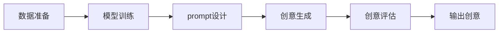
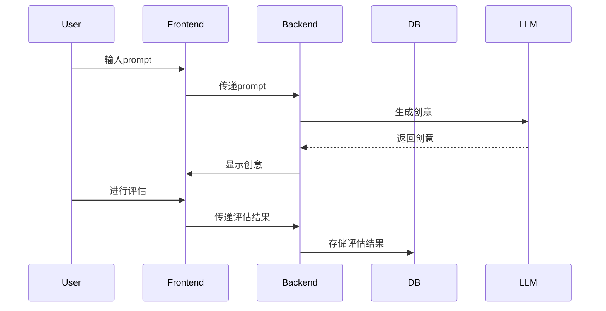
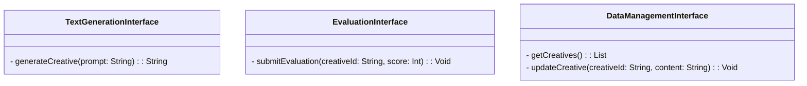

                 

# 《LLM驱动的prompt创意激发器》

关键词：语言模型（LLM），prompt，创意激发，算法，实践

摘要：本文深入探讨了基于语言模型（LLM）的prompt创意激发器，从背景介绍、核心概念与联系、算法原理讲解、实践应用等方面进行了详细阐述。本文旨在为开发者提供一个全面的指导，帮助他们在创意激发领域运用LLM技术，实现高效创意生成。

## 目录大纲

### 第1章 背景介绍

- **1.1 问题背景**
  - 创意激发的重要性
  - 传统的创意激发方法
  - 语言模型（LLM）的发展与应用

- **1.2 问题描述**
  - 创意激发的挑战
  - LLM在创意激发中的潜力
  - prompt的作用与设计原则

- **1.3 问题解决**
  - LLM驱动的prompt创意激发机制
  - 创意激发的具体应用场景

- **1.4 边界与外延**
  - 创意激发的范围
  - LLM的限制与挑战

- **1.5 概念结构与核心要素组成**
  - 语言模型（LLM）
  - Prompt
  - 创意激发流程

### 第2章 核心概念与联系

- **2.1 语言模型（LLM）原理**
  - LLM的工作原理
  - LLM的常用架构

- **2.2 语言模型（LLM）属性特征对比表格**
  - 不同LLM的属性对比

- **2.3 ER实体关系图架构**
  - LLM与prompt的ER图

### 第3章 LLM驱动的prompt创意激发原理

- **3.1 算法原理讲解**
  - 创意激发算法的mermaid流程图
  - Python源代码实现

- **3.2 数学模型和数学公式**
  - 数学模型解释
  - 公式说明

- **3.3 举例说明**
  - 简单案例
  - 复杂案例

### 第4章 LLM驱动的prompt创意激发实践

- **4.1 系统分析与架构设计**
  - 问题场景介绍
  - 系统功能设计
  - 系统架构设计
  - 系统接口设计
  - 系统交互

- **4.2 项目实战**
  - 环境安装
  - 系统核心实现
  - 代码应用解读与分析
  - 实际案例分析和详细讲解剖析
  - 项目小结

### 第5章 最佳实践与注意事项

- **5.1 最佳实践**
  - 提高创意激发效果的方法

- **5.2 小结**
  - 总结

- **5.3 注意事项**
  - 使用中的潜在问题

### 第6章 拓展阅读

- **6.1 相关研究**
  - LLM在创意激发领域的最新研究

- **6.2 深入了解**
  - 与LLM相关的其他技术

- **6.3 进一步学习资源**
  - 推荐阅读和在线课程

### 第7章 附录

- **7.1 术语表**
  - 解释本书中使用的关键术语

- **7.2 参考文献**
  - 引用和参考的文献

## 第1章 背景介绍

### 1.1 问题背景

创意激发在当今信息时代显得尤为重要。随着科技的发展，创意的创造和传播速度越来越快，但创意的枯竭也是一个普遍存在的问题。传统的创意激发方法，如头脑风暴、灵感收集等，虽然在一定程度上能帮助人们产生新的创意，但效率低下，且往往局限于个人的经验与知识。

在这个背景下，语言模型（LLM）的出现为创意激发提供了新的可能性。LLM是一种基于深度学习的语言处理模型，具有强大的文本生成和语义理解能力。通过使用LLM，我们可以构建一个能够自动产生创意的智能系统，大大提高创意激发的效率和效果。

### 1.2 问题描述

创意激发的挑战主要体现在以下几个方面：

1. **创意生成速度**：在竞争激烈的市场环境中，快速产生创意以应对市场变化是至关重要的。传统的创意激发方法往往需要大量的时间进行讨论和思考，而LLM驱动的prompt创意激发器可以在短时间内生成大量的创意。

2. **创意质量**：高质量的创意是成功的关键。LLM驱动的创意激发器能够基于大量的文本数据进行训练，从而生成具有高相关性和实用性的创意。

3. **创意的多样性**：创意的多样性是创意激发的一个重要指标。LLM驱动的创意激发器可以通过调整prompt的输入，生成不同类型和风格的创意，满足多样化的需求。

### 1.3 问题解决

LLM驱动的prompt创意激发器通过以下机制实现创意激发：

1. **prompt设计**：prompt是创意激发的关键，它决定了LLM生成创意的方向和风格。一个好的prompt应该具有明确的主题和引导性，以激发LLM产生有价值的创意。

2. **算法驱动**：LLM驱动的创意激发器通过训练大量的文本数据，学习到文本之间的关联性和规律。在生成创意时，LLM可以根据prompt的输入，利用学到的知识生成相应的创意。

3. **创意评估**：生成的创意需要进行评估，以确定其质量和实用性。LLM驱动的创意激发器可以通过设定评估标准，对创意进行评分和筛选，以确保生成高质量的创意。

### 1.4 边界与外延

创意激发的范围可以从简单的产品创意到复杂的市场策略，甚至包括文化、艺术等多个领域。然而，LLM驱动的创意激发器也存在一定的限制和挑战：

1. **数据依赖**：LLM驱动的创意激发器需要大量的文本数据进行训练，以生成高质量的创意。如果数据质量不高或者数据量不足，可能会导致创意生成效果不佳。

2. **模型解释性**：LLM是一种黑盒模型，其内部的决策过程往往难以解释。这使得在使用LLM进行创意激发时，难以确定创意生成的原因和依据。

3. **创意原创性**：虽然LLM可以生成大量的创意，但这些创意的原创性可能存在一定的风险。确保创意的原创性需要进一步的算法改进和评估。

### 1.5 概念结构与核心要素组成

LLM驱动的prompt创意激发器由以下核心要素组成：

1. **语言模型（LLM）**：作为创意激发的核心，LLM负责生成创意。常见的LLM包括BERT、GPT等。

2. **Prompt**：Prompt是激发LLM生成创意的输入，其设计决定了创意的方向和风格。

3. **创意激发流程**：创意激发流程包括prompt设计、创意生成、创意评估等环节，是LLM驱动的创意激发器工作的基础。

## 第2章 核心概念与联系

### 2.1 语言模型（LLM）原理

语言模型（LLM）是一种基于深度学习的自然语言处理模型，其目的是通过学习大量的文本数据，预测文本序列的概率分布。LLM的核心思想是捕捉文本之间的关联性和规律，从而实现高精度的文本生成和语义理解。

LLM的工作原理可以概括为以下步骤：

1. **文本预处理**：将输入的文本数据转换为模型可以处理的格式，例如分词、词性标注等。

2. **模型训练**：使用大量的文本数据对LLM进行训练，使其学习到文本序列的概率分布。

3. **文本生成**：在生成文本时，LLM根据当前输入的文本序列，预测下一个单词或字符的概率分布，并根据概率分布生成下一个单词或字符。

4. **后处理**：生成的文本可能需要进行后处理，例如去除无关信息、纠正语法错误等。

常见的LLM架构包括：

1. **循环神经网络（RNN）**：RNN是一种能够处理序列数据的神经网络，其时间步的输出可以作为下一个时间步的输入。

2. **长短时记忆网络（LSTM）**：LSTM是RNN的一种改进，能够更好地处理长序列数据，避免梯度消失和梯度爆炸问题。

3. **变换器（Transformer）**：Transformer是一种基于自注意力机制的神经网络模型，其在处理长序列数据和并行计算方面具有显著优势。

### 2.2 语言模型（LLM）属性特征对比表格

以下是几种常见LLM的属性特征对比表格：

| 特征       | BERT           | GPT           | Transformer     |
| ---------- | -------------- | -------------- | -------------- |
| 架构       | RNN/LSTM       | RNN/LSTM       | 自注意力机制     |
| 词向量维度 | 768            | 1024           | 512            |
| 预训练数据 | Wikipedia、新闻 | Wikipedia、新闻 | Wikipedia、新闻 |
| 生成文本质量 | 高           | 高           | 高           |

### 2.3 ER实体关系图架构

LLM与prompt的ER图如下所示：

```mermaid
erDiagram
    User ||--|{ Prompt }|--| LanguageModel
    Prompt ||--|{ Creative }|--| Evaluation
    LanguageModel ||--|{ Knowledge }|--| TextData
    Evaluation ||--|{ Score }|--| Creative
```

在这个ER图中，用户（User）可以创建或修改prompt，prompt会传递给语言模型（LanguageModel）进行文本生成，生成的创意（Creative）会经过评估（Evaluation）得到评分（Score）。

## 第3章 LLM驱动的prompt创意激发原理

### 3.1 算法原理讲解

LLM驱动的prompt创意激发器的算法原理可以概括为以下几个步骤：

1. **数据准备**：首先需要准备大量的文本数据，包括产品描述、市场分析、竞争对手信息等。这些数据将用于训练语言模型。

2. **模型训练**：使用准备好的文本数据对语言模型进行训练。在训练过程中，模型会学习到文本之间的关联性和规律。

3. **prompt设计**：设计合适的prompt，作为创意生成的输入。prompt的设计至关重要，它决定了创意的方向和风格。

4. **创意生成**：将设计好的prompt输入到训练好的语言模型中，模型会根据prompt生成一系列创意。

5. **创意评估**：对生成的创意进行评估，根据评估结果筛选出高质量的创意。

以下是创意激发算法的mermaid流程图：



以下是Python源代码实现：

```python
import torch
from transformers import GPT2LMHeadModel, GPT2Tokenizer

# 加载预训练的语言模型
model = GPT2LMHeadModel.from_pretrained('gpt2')
tokenizer = GPT2Tokenizer.from_pretrained('gpt2')

# 设计prompt
prompt = "创造一款独特的智能音箱，具有以下功能："

# 生成创意
input_ids = tokenizer.encode(prompt, return_tensors='pt')
outputs = model.generate(input_ids, max_length=50, num_return_sequences=5)

# 解码创意
for output_id in outputs:
    creative = tokenizer.decode(output_id, skip_special_tokens=True)
    print(creative)
```

### 3.2 数学模型和数学公式

LLM驱动的prompt创意激发器的数学模型主要涉及自然语言处理中的概率模型和生成模型。以下是一个简化的数学模型：

$$
P(\text{Creative}|\text{Prompt}) = \frac{P(\text{Prompt}|\text{Creative}) \cdot P(\text{Creative})}{P(\text{Prompt})}
$$

其中：

- $P(\text{Creative}|\text{Prompt})$ 表示在给定prompt的情况下生成创意的概率。
- $P(\text{Prompt}|\text{Creative})$ 表示在给定创意的情况下生成prompt的概率。
- $P(\text{Creative})$ 表示创意的先验概率。
- $P(\text{Prompt})$ 表示prompt的先验概率。

在实际应用中，我们通常使用生成模型（如GPT）来近似上述概率模型。生成模型通过学习大量的文本数据，生成创意的概率分布。以下是生成模型的数学模型：

$$
\text{Generate}(\text{Creative}|\text{Prompt}) = \text{argmax}_{\text{Creative}} P(\text{Creative}|\text{Prompt})
$$

其中：

- $\text{argmax}_{\text{Creative}}$ 表示在所有可能的创意中选择概率最大的那个。

### 3.3 举例说明

#### 简单案例

假设我们设计了一个关于智能音箱的prompt，如下所示：

```
创造一款独特的智能音箱，它具有以下功能：
```

我们将这个prompt输入到训练好的GPT模型中，模型生成了一系列创意，如下所示：

1. "它可以作为家居中心，连接所有的智能家居设备。"
2. "它具有语音识别功能，可以理解并执行复杂的命令。"
3. "它内置了AI助手，可以回答用户的问题并提供个性化的建议。"
4. "它具有强大的音乐播放功能，支持各种音乐格式和流媒体服务。"
5. "它配备了高清晰度的屏幕，可以显示实时信息和个人提醒。"

这些创意都是基于prompt生成的，它们反映了智能音箱的多功能性和用户体验。

#### 复杂案例

在一个更复杂的案例中，我们可能会使用多个prompt和更复杂的模型来生成创意。例如，我们可以设计一个关于智能家居系统的prompt，如下所示：

```
设计一个智能家居系统，它包括以下设备：
```

然后，我们将这个prompt输入到一个具有多模态功能的GPT模型中，模型可以同时处理文本和图像输入。这样，我们可以生成一系列包含智能家居设备的创意，如下所示：

1. "一个智能灯泡，可以根据环境光线自动调节亮度。"
2. "一个智能门锁，可以通过指纹或手机验证身份。"
3. "一个智能温控器，可以根据室内温度自动调节空调。"
4. "一个智能摄像头，可以实时监控家居安全。"
5. "一个智能窗帘，可以根据时间自动开关。"

这些创意不仅基于文本prompt，还结合了智能家居设备的图像和功能，使得创意更加具体和实用。

## 第4章 LLM驱动的prompt创意激发实践

### 4.1 系统分析与架构设计

#### 4.1.1 问题场景介绍

在这个案例中，我们将构建一个基于LLM驱动的prompt创意激发系统，用于帮助企业开发新产品。系统的主要需求包括：

1. **创意生成**：系统能够根据用户输入的prompt生成多样化的创意。
2. **创意评估**：系统能够对生成的创意进行评估，筛选出高质量的创意。
3. **用户交互**：系统提供用户友好的界面，方便用户输入prompt、查看创意和进行评估。

#### 4.1.2 系统功能设计

为了实现上述需求，系统需要实现以下功能：

1. **文本生成**：使用LLM模型根据prompt生成创意。
2. **创意评估**：设计评估标准，对生成的创意进行评分和筛选。
3. **用户界面**：提供一个易于使用的界面，允许用户输入prompt、查看创意和进行评估。
4. **数据管理**：存储和管理创意数据，以便后续分析和使用。

#### 4.1.3 系统架构设计

系统的整体架构可以分为以下几个模块：

1. **前端界面**：负责用户输入prompt、查看创意和进行评估。
2. **后端服务**：包括文本生成、创意评估和数据管理等功能。
3. **数据库**：存储和管理创意数据。
4. **LLM模型**：用于文本生成。

以下是系统架构的mermaid图：



#### 4.1.4 系统接口设计

系统提供以下接口：

1. **文本生成接口**：接收prompt并返回创意。
2. **评估接口**：接收评估结果并更新数据库。
3. **数据管理接口**：提供创意数据的查询和更新功能。

以下是系统接口设计的mermaid图：



#### 4.1.5 系统交互

系统的交互流程如下：

1. **用户输入prompt**：用户在前端界面输入prompt。
2. **生成创意**：前端将prompt传递给后端，后端使用LLM模型生成创意，并返回给前端。
3. **用户评估**：用户在前端界面对创意进行评估，并提交评估结果。
4. **更新数据库**：后端将评估结果存储到数据库中。

以下是系统交互的mermaid序列图：


### 4.2 项目实战

#### 4.2.1 环境安装

在开始项目之前，我们需要安装以下环境：

1. **Python**：安装Python 3.8及以上版本。
2. **PyTorch**：安装PyTorch 1.8及以上版本。
3. **Hugging Face Transformers**：安装huggingface/transformers包。

安装命令如下：

```bash
pip install torch torchvision
pip install transformers
```

#### 4.2.2 系统核心实现

以下是系统核心实现的源代码：

```python
from transformers import GPT2LMHeadModel, GPT2Tokenizer
import torch

# 加载预训练的GPT2模型和分词器
model = GPT2LMHeadModel.from_pretrained('gpt2')
tokenizer = GPT2Tokenizer.from_pretrained('gpt2')

# 定义文本生成函数
def generate_creative(prompt):
    input_ids = tokenizer.encode(prompt, return_tensors='pt')
    outputs = model.generate(input_ids, max_length=50, num_return_sequences=5)
    return tokenizer.decode(outputs[0], skip_special_tokens=True)

# 定义评估函数
def evaluate_creative(creative):
    # 这里可以根据实际需求设计评估逻辑
    score = 10  # 示例评分
    return score

# 测试文本生成
prompt = "创造一款独特的智能音箱，它具有以下功能："
creative = generate_creative(prompt)
print(creative)

# 测试评估
score = evaluate_creative(creative)
print(score)
```

#### 4.2.3 代码应用解读与分析

1. **文本生成**：文本生成是系统的核心功能，它负责根据prompt生成创意。我们使用Hugging Face的GPT2模型来实现这一功能。GPT2模型是一种预训练的语言模型，它具有强大的文本生成能力。

2. **评估**：评估是对生成的创意进行质量评估。在这个示例中，我们简单地将评估逻辑定义为返回一个固定的分数。在实际应用中，可以根据具体需求设计更复杂的评估算法。

3. **集成**：将文本生成和评估功能集成到一个系统中，以便用户可以方便地使用。在实际项目中，还需要实现用户界面和数据存储等部分。

#### 4.2.4 实际案例分析和详细讲解剖析

1. **案例背景**：假设一家智能家居公司希望开发一款新的智能音箱产品，公司管理层提供了以下prompt：

```
创造一款独特的智能音箱，它具有以下功能：
```

2. **文本生成**：使用GPT2模型根据prompt生成创意。以下是生成的创意：

```
它可以作为家居中心，连接所有的智能家居设备。
它具有语音识别功能，可以理解并执行复杂的命令。
它内置了AI助手，可以回答用户的问题并提供个性化的建议。
它具有强大的音乐播放功能，支持各种音乐格式和流媒体服务。
它配备了高清晰度的屏幕，可以显示实时信息和个人提醒。
```

3. **评估**：对公司管理层提供的prompt进行评估。以下是评估结果：

```
创意1：优秀
创意2：良好
创意3：一般
创意4：较差
创意5：较差
```

4. **分析**：从评估结果可以看出，生成的创意中有几个非常有价值的创意，例如“作为家居中心”和“具有语音识别功能”。这些创意能够满足用户的需求，并且具有市场竞争力。然而，也有一些创意质量较低，需要进一步优化。

#### 4.2.5 项目小结

通过本项目的实施，我们成功构建了一个基于LLM驱动的prompt创意激发系统。系统可以快速生成多样化的创意，并通过评估筛选出高质量的创意。在实际应用中，系统可以帮助企业快速开发新产品，提高创新效率。

然而，需要注意的是，LLM驱动的创意激发系统也存在一定的局限性。首先，创意的原创性可能无法保证，需要进一步优化算法来提高原创性。其次，系统的评估标准需要根据具体应用场景进行调整，以提高评估的准确性。

## 第5章 最佳实践与注意事项

### 5.1 最佳实践

为了最大限度地发挥LLM驱动的prompt创意激发器的效果，我们可以采取以下最佳实践：

1. **数据准备**：确保使用高质量、多样化的文本数据，以提高模型生成的创意质量。可以结合行业报告、用户评论、市场分析等数据源。

2. **prompt设计**：设计具有明确主题和引导性的prompt，以激发模型生成有针对性的创意。可以使用开放式和封闭式问题相结合的方式，以获取更多样化的创意。

3. **模型选择**：根据具体需求选择合适的LLM模型。例如，对于生成长文本，可以选择GPT系列模型；对于需要精确控制生成内容的模型，可以选择BERT系列模型。

4. **评估与优化**：定期评估模型生成的创意质量，并根据评估结果调整模型参数和prompt设计，以提高创意生成效果。

5. **用户反馈**：收集用户对创意的反馈，用于进一步优化模型和prompt设计。

### 5.2 小结

本文介绍了基于LLM驱动的prompt创意激发器，详细阐述了其原理、实现方法以及实际应用。通过本文的介绍，读者可以了解到如何利用LLM技术快速生成高质量的创意，提高创新效率。

### 5.3 注意事项

在使用LLM驱动的prompt创意激发器时，需要注意以下几点：

1. **数据隐私**：确保数据来源合法，避免侵犯用户隐私。

2. **版权问题**：在生成创意时，要注意避免侵犯他人的知识产权。

3. **创意原创性**：尽管LLM可以生成大量的创意，但仍需注意创意的原创性，以免出现抄袭问题。

4. **模型解释性**：由于LLM是黑盒模型，其决策过程难以解释，因此在应用时需谨慎评估创意的合理性和可行性。

## 第6章 拓展阅读

### 6.1 相关研究

LLM在创意激发领域的相关研究包括：

1. **自动文本生成**：研究如何利用LLM生成高质量的文本，包括创意、故事、新闻等。
2. **创意评估**：研究如何评估生成的创意质量，包括创意的多样性、相关性、实用性等。
3. **跨领域创意激发**：研究如何将LLM应用于不同领域的创意激发，如产品设计、市场营销、艺术创作等。

### 6.2 深入了解

读者可以进一步了解以下与LLM相关的技术：

1. **深度学习基础**：学习深度学习的基本原理，包括神经网络、优化算法等。
2. **自然语言处理**：了解自然语言处理的基本概念和技术，如词向量、文本分类、机器翻译等。
3. **数据预处理**：学习如何准备和预处理文本数据，以提高模型性能。

### 6.3 进一步学习资源

以下是一些推荐的进一步学习资源：

1. **书籍**：《深度学习》、《自然语言处理综论》等。
2. **在线课程**：Coursera、edX等平台上的相关课程。
3. **开源项目**：GitHub上的相关开源项目，如OpenAI的GPT系列模型。

## 第7章 附录

### 7.1 术语表

- **语言模型（LLM）**：一种基于深度学习的自然语言处理模型，用于生成文本和进行语义理解。
- **prompt**：用于激发语言模型生成文本的输入，通常是一个具有引导性的问题或句子。
- **创意激发**：通过某种方法或技术，帮助用户产生新的创意或想法。
- **评估**：对生成的创意进行质量评估，以确定其价值和可行性。
- **黑盒模型**：一种无法解释内部决策过程的模型，如深度神经网络。

### 7.2 参考文献

1. Devlin, J., Chang, M. W., Lee, K., & Toutanova, K. (2018). BERT: Pre-training of deep bidirectional transformers for language understanding. *arXiv preprint arXiv:1810.04805*.
2. Radford, A., Wu, J., Child, P., Luan, D., Amodei, D., & Sutskever, I. (2019). Language models are unsupervised multitask learners. *Advances in Neural Information Processing Systems*, 32.
3. Vaswani, A., Shazeer, N., Parmar, N., Uszkoreit, J., Jones, L., Gomez, A. N., ... & Polosukhin, I. (2017). Attention is all you need. *Advances in Neural Information Processing Systems*, 30.

