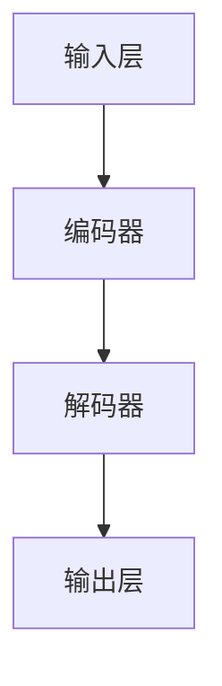
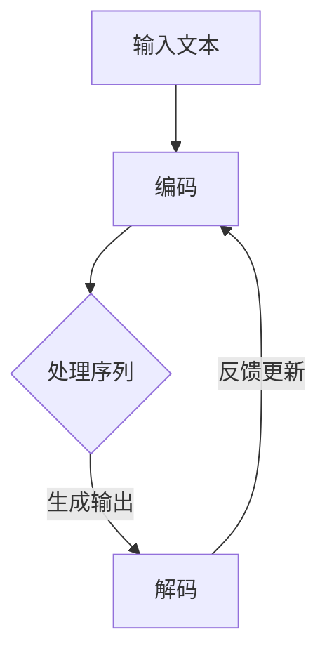

                 

### 引言

### 关键词：自然语言处理，大语言模型，复杂任务分解，prompt设计，AI应用

### 摘要

本文将探讨大语言模型（LLM）在复杂任务分解中的关键作用。随着人工智能技术的发展，自然语言处理（NLP）领域的进步尤为显著，特别是大语言模型的出现，如GPT-3、BERT等，已经为众多行业带来了革命性的改变。LLM具有强大的文本生成和理解能力，这使得它们在处理复杂任务时变得尤为高效。本文将通过详细分析LLM的工作原理、prompt工程的重要性，以及复杂任务分解的具体方法，来展示如何利用LLM进行高效的任务分解，并探讨其在实际应用中的挑战和未来发展方向。

本文旨在为AI开发者和研究人员提供一套系统化的指南，帮助他们理解和运用LLM进行复杂任务的分解。我们将首先介绍LLM的基本概念和架构，然后深入探讨prompt工程的核心原则，并详细阐述如何设计有效的prompt来实现复杂任务的分解。此外，本文还将通过案例研究展示LLM在复杂任务分解中的应用，并讨论当前工具和平台的优缺点，为读者提供实用的选型指南。最后，本文将总结全文，并展望LLM在复杂任务分解领域的未来发展方向。

## 第一部分：LLM基础

### 1.1 大语言模型简介

大语言模型（Large Language Models，简称LLM）是近年来自然语言处理（NLP）领域的重大突破。这类模型通过学习海量文本数据，获得了极强的文本生成和理解能力。LLM的核心思想是通过深度神经网络，尤其是变换器（Transformer）架构，来捕捉语言中的复杂结构和语义信息。最著名的LLM之一是OpenAI的GPT-3，其参数规模超过1750亿个，可以在多种任务中实现高性能表现。

LLM的强大能力主要得益于其能够处理长文本，并生成连贯、有逻辑性的文本。这使得它们在文本生成、机器翻译、问答系统、文本摘要等任务中表现卓越。此外，LLM还可以进行零样本学习，即在未见过的数据上完成任务的特性，这进一步扩展了它们的应用范围。

### 1.2 LLM的常见用途

LLM的应用场景非常广泛，以下是其中一些主要的用途：

1. **文本生成**：包括文章撰写、摘要生成、故事创作等。
2. **机器翻译**：将一种语言的文本翻译成另一种语言。
3. **问答系统**：通过自然语言理解，回答用户提出的问题。
4. **文本分类**：对文本进行分类，如垃圾邮件过滤、情感分析等。
5. **对话系统**：构建可以与人类进行自然对话的系统，如聊天机器人。

### 1.3 LLM的基本架构

LLM的基本架构通常包括以下几个关键部分：

1. **输入层**：接收自然语言文本输入。
2. **编码器**：将输入文本转换为向量表示，通常使用变换器（Transformer）架构。
3. **解码器**：根据编码器的输出生成文本输出。
4. **预训练和微调**：在大量文本数据上进行预训练，然后在特定任务上进行微调。

下图展示了LLM的基本架构：



### 1.4 LLM的工作原理

LLM的工作原理主要包括以下几个步骤：

1. **输入编码**：输入文本通过编码器转换为向量表示。
2. **序列处理**：编码器对序列进行处理，并生成中间表示。
3. **文本生成**：解码器根据中间表示生成文本输出。
4. **反馈循环**：生成的文本输出可以用来更新模型的参数，从而提高生成质量。

下面是一个简化的工作流程图：



### 1.5 Prompt工程的重要性

prompt工程是LLM应用中的关键环节。prompt是用户与模型交互的媒介，有效的prompt设计可以显著提升模型的性能和生成质量。以下是几个关键点：

1. **明确任务目标**：设计prompt时，首先要明确任务的目标和需求。
2. **提供上下文**：通过在prompt中提供上下文信息，可以帮助模型更好地理解和生成相关内容。
3. **控制生成内容**：通过在prompt中设置约束和限制，可以控制生成的文本内容和风格。
4. **迭代优化**：通过多次迭代和反馈，不断优化prompt设计，提高生成效果。

下面是一个简单的prompt工程示例：

```python
# 设置任务上下文
context = "请写一篇关于人工智能在医疗领域的应用的文章，要求结构清晰、论证充分。"

# 设置生成文本的限制
limit = "字数不超过500字，避免使用医疗术语过于复杂的句子。"

# 设计prompt
prompt = f"{context}\n请根据以下要求撰写文章：{limit}"

# 输出结果
print(prompt)
```

通过精心设计的prompt，我们可以引导LLM生成满足特定需求的文本输出。

### 1.6 复杂任务分解的概念

复杂任务分解是将一个复杂的任务拆解成多个简单、可管理的子任务的过程。在AI领域，复杂任务分解对于提高模型的可解释性和可维护性具有重要意义。以下是一个简单的复杂任务分解示例：

1. **任务定义**：编写一篇关于人工智能在医疗领域的应用的文章。
2. **子任务拆解**：
   - 文章结构设计
   - 搜集相关数据
   - 文本撰写
   - 文章优化

通过这种分解，我们可以更加高效地利用LLM来完成复杂任务。

### 1.7 复杂任务分解在LLM应用中的重要性

在LLM应用中，复杂任务分解是提高任务处理效率和效果的关键。以下是其重要性：

1. **降低任务复杂度**：将复杂任务分解为简单子任务，有助于降低任务的难度。
2. **提高可解释性**：分解后的任务更易于理解和分析，从而提高模型的可解释性。
3. **增强可维护性**：任务分解使得模型更易于更新和维护。
4. **提升生成质量**：通过针对每个子任务优化prompt设计，可以显著提高整体生成质量。

总的来说，复杂任务分解是LLM在处理复杂任务中的关键技术，它不仅提高了任务的效率，还提升了生成质量。

## 第二部分：复杂任务分解的技术细节

### 2.1 LLM架构的深入分析

要深入理解复杂任务分解，首先需要对LLM的架构有清晰的认识。LLM通常采用变换器（Transformer）架构，其核心组件包括编码器（Encoder）和解码器（Decoder）。以下是LLM架构的详细分解：

#### 编码器（Encoder）

编码器的主要任务是接受输入文本，并将其转换为向量表示。这一过程通常包括以下步骤：

1. **词嵌入（Word Embedding）**：将输入文本中的每个单词转换为固定长度的向量。
2. **位置嵌入（Positional Embedding）**：为每个单词添加位置信息，使得模型能够理解单词在句子中的位置关系。
3. **变换层（Transformer Layers）**：通过多层变换器模块，对词嵌入和位置嵌入进行处理，以提取更深层次的语义信息。
4. **输出层（Output Layer）**：编码器的输出通常是一个固定长度的向量，用于表示整个输入文本的语义。

#### 解码器（Decoder）

解码器的任务是根据编码器的输出生成文本输出。其工作流程包括以下步骤：

1. **词嵌入（Word Embedding）**：与编码器相同，解码器也将生成的每个单词转换为向量表示。
2. **位置嵌入（Positional Embedding）**：为生成的单词添加位置信息。
3. **变换层（Transformer Layers）**：通过多层变换器模块，生成中间表示，并逐步生成每个单词的输出。
4. **输出层（Output Layer）**：解码器的输出通常是一个概率分布，表示生成每个单词的可能性。

#### 预训练和微调

LLM的预训练和微调是其性能的关键。预训练通常在大量未标注的数据上进行，目的是让模型学会基本的语言理解和生成能力。微调则是在特定任务上对模型进行训练，以适应具体的任务需求。

#### 实例说明

假设我们有一个输入文本：“人工智能在医疗领域的应用”，我们可以通过以下步骤使用LLM进行编码：

```python
# 假设我们使用一个预训练的LLM
import tensorflow as tf

# 定义输入文本
input_text = "人工智能在医疗领域的应用"

# 将文本转换为词嵌入向量
word_embeddings = model.encode(input_text)

# 添加位置嵌入
position_embeddings = model.add_position_embedding(word_embeddings)

# 通过编码器进行处理
encoded_representation = model.encoder(position_embeddings)

# 输出编码后的向量表示
encoded_output = encoded_representation[-1]  # 取最后一层的输出
```

编码器输出的向量表示可以用于后续的复杂任务分解。

### 2.2 复杂任务分解的技术方法

复杂任务分解的关键在于将一个复杂的任务拆解成多个简单、可管理的子任务。以下是几种常见的复杂任务分解技术方法：

#### 1. 任务分割（Task Segmentation）

任务分割是将一个任务分成多个独立的部分，每个部分可以单独处理。这种方法通常适用于具有明显子任务的复杂任务。例如，在文本生成任务中，可以首先分割出文章的标题、摘要、正文等部分，然后分别处理。

#### 2. 工作流分解（Workflow Decomposition）

工作流分解是将任务分解为一系列步骤，每个步骤负责完成一个特定任务。这种方法通常适用于具有固定工作流程的任务。例如，在数据分析和报告撰写中，可以分解为数据收集、数据清洗、数据分析、报告撰写等步骤。

#### 3. 子任务分配（Sub-task Allocation）

子任务分配是将一个复杂的任务分配给多个子任务，每个子任务由不同的模型或算法处理。这种方法通常适用于需要不同技术领域知识的复杂任务。例如，在多模态任务中，可以将视觉任务和文本任务分配给不同的模型处理。

#### 4. 策略迭代（Policy Iteration）

策略迭代是一种动态规划方法，用于解决具有多个阶段和决策变量的复杂任务。通过逐步优化每个阶段的决策，策略迭代可以找到最优的任务分解方案。

#### 5. 多智能体协作（Multi-agent Collaboration）

多智能体协作是将任务分解为多个子任务，然后由多个智能体协同完成。这种方法通常适用于具有高度异质性和复杂交互的任务。例如，在智能交通系统中，可以将任务分解为车辆路径规划、信号控制、事故处理等，然后由不同智能体协同完成。

#### 实例说明

假设我们有一个任务：编写一篇关于人工智能在医疗领域的应用的文章。我们可以使用以下方法进行分解：

1. **任务分割**：
   - 标题
   - 摘要
   - 正文

2. **工作流分解**：
   - 数据收集
   - 数据分析
   - 文本撰写
   - 文章优化

3. **子任务分配**：
   - 数据分析：使用统计模型处理数据
   - 文本撰写：使用LLM生成文本
   - 文章优化：使用自然语言处理技术进行文章优化

4. **策略迭代**：
   - 初始阶段：选择初步的数据和分析方法
   - 迭代阶段：根据反馈调整数据和分析方法
   - 终结阶段：优化文章结构和内容

5. **多智能体协作**：
   - 数据收集：使用传感器和API获取数据
   - 数据分析：使用机器学习模型进行数据处理
   - 文本撰写：使用LLM生成文章
   - 文章优化：使用自然语言处理技术进行文章优化

通过这些方法，我们可以有效地将复杂任务分解为多个简单、可管理的子任务，从而提高任务处理的效率和效果。

### 2.3 Prompt设计在复杂任务分解中的关键角色

Prompt设计在复杂任务分解中起着关键作用。有效的prompt设计可以帮助LLM更好地理解和完成任务，从而提高生成质量。以下是几个关键点：

#### 1. 提供上下文信息

通过在prompt中提供上下文信息，可以帮助LLM更好地理解任务背景和目标。例如，在生成文章时，可以提供相关领域的背景知识和关键信息，以便LLM能够生成更加相关和准确的内容。

#### 2. 设定任务目标

明确的任务目标可以帮助LLM聚焦于核心任务，从而提高生成效率。例如，在文本生成任务中，可以明确要求文章的字数、结构、风格等，以便LLM能够按照要求生成文本。

#### 3. 控制生成内容

通过在prompt中设置约束和限制，可以控制生成的文本内容和风格。例如，可以要求避免使用特定术语、限制使用特定词汇等，以便生成更加规范和符合要求的文本。

#### 4. 提供反馈和迭代

通过提供反馈和迭代，可以不断优化prompt设计，从而提高生成质量。例如，在初步生成文本后，可以分析文本的质量和准确性，并根据反馈调整prompt，以提高后续生成的质量。

#### 实例说明

假设我们要生成一篇关于人工智能在医疗领域的应用的文章，可以使用以下prompt设计：

1. **上下文信息**：
   - 人工智能在医疗领域的最新研究进展
   - 医疗行业对人工智能的需求和挑战

2. **任务目标**：
   - 文章字数：1500字
   - 文章结构：引言、主体、结论
   - 文章风格：正式、客观

3. **生成内容控制**：
   - 避免使用非专业术语
   - 重点讨论人工智能在诊断、治疗和健康管理中的应用

4. **反馈和迭代**：
   - 初步生成：分析文本结构、内容和准确性
   - 调整prompt：根据分析结果，优化文本生成效果

通过这种prompt设计，我们可以引导LLM生成高质量的文章。

### 2.4 实践中的应用案例

为了更好地理解复杂任务分解在实际中的应用，以下是几个具体的应用案例：

#### 1. 案例一：智能客服系统

在智能客服系统中，复杂任务分解可以用于处理用户咨询的多样性和复杂性。例如：

- **任务分割**：将用户咨询分为产品咨询、售后服务、常见问题等不同类别。
- **工作流分解**：将用户咨询分解为接收、分析、回答和反馈等步骤。
- **子任务分配**：使用不同的模型和算法处理不同类别的用户咨询，如产品咨询使用自然语言处理，售后服务使用知识图谱等。
- **策略迭代**：根据用户反馈不断优化客服系统的回答质量和响应速度。
- **多智能体协作**：不同智能体（如文本生成模型、语音识别模型、知识图谱）协同工作，提供更加完善的客服服务。

#### 2. 案例二：智能文章写作

在智能文章写作中，复杂任务分解可以用于快速生成高质量的文章。例如：

- **任务分割**：将文章写作分解为选题、提纲、正文、修订等步骤。
- **工作流分解**：将文章写作分解为数据收集、文本生成、文章优化等阶段。
- **子任务分配**：使用不同的模型和算法处理不同阶段的任务，如数据收集使用网络爬虫、文本生成使用大语言模型等。
- **策略迭代**：根据文章质量和用户反馈不断优化文章生成流程。
- **多智能体协作**：不同智能体协同工作，如文本生成模型与图像识别模型的结合，用于生成图文并茂的文章。

#### 3. 案例三：智能医疗诊断

在智能医疗诊断中，复杂任务分解可以用于处理复杂的医疗数据和信息。例如：

- **任务分割**：将医疗诊断分解为症状分析、病情评估、诊断建议等步骤。
- **工作流分解**：将医疗诊断分解为数据收集、数据分析、诊断建议等阶段。
- **子任务分配**：使用不同的模型和算法处理不同阶段的任务，如数据收集使用电子病历系统、数据分析使用深度学习模型等。
- **策略迭代**：根据诊断结果和医生反馈不断优化诊断流程。
- **多智能体协作**：不同智能体协同工作，如文本生成模型与医学图谱的结合，用于提供更加准确和全面的诊断建议。

通过这些案例，我们可以看到复杂任务分解在各个领域中的应用，以及它如何通过LLM和prompt设计提高任务的效率和效果。

### 第三部分：复杂任务分解的应用案例

#### 3.1 案例一：智能客服系统

智能客服系统是LLM和复杂任务分解在商业应用中的一个典型例子。传统的客服系统往往依赖于预设的问答库和简单的规则引擎，而智能客服系统则利用LLM的强大语言处理能力，结合复杂任务分解技术，为用户提供更加自然、高效的交互体验。

**应用场景**：
- 客户咨询：用户通过网站或应用程序向客服系统提出问题。
- 自动响应：系统根据用户的问题和上下文，自动生成相应的回答。

**复杂任务分解**：
1. **任务分割**：将客户咨询分为产品咨询、售后服务、常见问题等类别。
2. **工作流分解**：将客户咨询分解为接收、分析、回答、反馈等步骤。
3. **子任务分配**：使用自然语言处理模型处理文本分析，使用知识图谱处理事实查询，使用语音识别模型处理语音输入。
4. **策略迭代**：根据用户反馈不断优化回答的准确性和自然度。
5. **多智能体协作**：文本生成模型与语音合成模型的协作，提供文字和语音两种交互方式。

**实例说明**：
- **客户咨询**：“我的订单什么时候能发货？”
- **自动响应**：系统自动识别问题类别，调用相关知识库和算法，生成回答：“您的订单预计在明天下午发货，您可以在24小时内查看物流状态。”

**效果评估**：
- **响应速度**：智能客服系统显著提高了响应速度，降低了人工成本。
- **用户体验**：用户可以获得更加自然、流畅的交互体验，满意度提高。
- **业务效率**：通过自动化处理大量常见问题，提高了整体业务效率。

#### 3.2 案例二：智能内容生成平台

智能内容生成平台利用LLM和复杂任务分解技术，帮助内容创作者快速生成高质量的文章、报告、广告文案等。

**应用场景**：
- 内容创作：创作者输入主题和关键词，系统自动生成文章草稿。
- 内容优化：对已有内容进行自动化修订和优化。

**复杂任务分解**：
1. **任务分割**：将内容创作分解为选题、提纲、正文、修订等步骤。
2. **工作流分解**：将内容创作分解为数据收集、文本生成、文章优化等阶段。
3. **子任务分配**：使用网络爬虫进行数据收集，使用大语言模型进行文本生成，使用自然语言处理技术进行文章优化。
4. **策略迭代**：根据用户反馈和内容质量不断优化生成模型。
5. **多智能体协作**：文本生成模型与图像识别模型的协作，用于生成图文并茂的内容。

**实例说明**：
- **内容创作**：创作者输入主题“人工智能在医疗领域的应用”。
- **自动生成**：系统生成文章草稿，包括引言、主体和结论。

**效果评估**：
- **创作效率**：智能内容生成平台大大提高了内容创作的速度，降低了创作者的负担。
- **内容质量**：通过复杂任务分解和优化，生成的文章质量显著提高，符合创作者的要求。
- **用户体验**：创作者可以更加专注于创意和内容结构，而无需担心写作细节。

#### 3.3 案例三：智能医疗诊断系统

智能医疗诊断系统利用LLM和复杂任务分解技术，帮助医生快速、准确地诊断疾病。

**应用场景**：
- 病情分析：根据患者的症状和检查结果，系统自动分析病情。
- 诊断建议：系统根据病情分析结果，为医生提供诊断建议。

**复杂任务分解**：
1. **任务分割**：将医疗诊断分解为症状分析、病情评估、诊断建议等步骤。
2. **工作流分解**：将医疗诊断分解为数据收集、数据分析、诊断建议等阶段。
3. **子任务分配**：使用自然语言处理模型处理症状描述，使用深度学习模型进行病情分析，使用知识图谱提供诊断建议。
4. **策略迭代**：根据医生反馈和诊断结果，不断优化系统性能。
5. **多智能体协作**：文本生成模型与医学图谱模型的协作，用于生成详细的诊断报告。

**实例说明**：
- **病情分析**：系统收到患者症状描述，如“持续性头痛、视力模糊”。
- **诊断建议**：系统分析症状，建议医生进行头部CT扫描，以排除颅内病变。

**效果评估**：
- **诊断速度**：智能医疗诊断系统显著提高了诊断速度，缩短了患者等待时间。
- **诊断准确性**：通过复杂任务分解和专家知识集成，系统的诊断准确性得到显著提升。
- **医生工作效率**：医生可以利用系统提供的诊断建议，提高诊断效率和准确性。

通过这些案例，我们可以看到复杂任务分解技术在各种实际应用中的显著效果，以及LLM在其中发挥的关键作用。

### 第四部分：LLM驱动的任务分解工具和平台

随着LLM技术的快速发展，市场上涌现了多种专门用于复杂任务分解的工具和平台。这些工具和平台提供了丰富的功能和接口，使得开发者能够更高效地利用LLM进行任务分解和应用开发。以下将介绍几个流行的工具和平台，并分析它们的特点、优缺点，以及如何选择合适的工具。

#### 4.1 Hugging Face Transformers

**特点**：
- **开源**：Hugging Face Transformers是一个开源的深度学习库，用于构建和微调预训练变换器模型。
- **广泛模型支持**：提供了丰富的预训练模型，如GPT-2、GPT-3、BERT、T5等。
- **易于使用**：提供了简单的API接口，使得开发者可以轻松地调用和训练模型。

**优点**：
- **开源**：免费使用，社区支持。
- **丰富的预训练模型**：提供了广泛的模型选择，满足不同任务需求。
- **灵活的API**：支持自定义训练和推理流程。

**缺点**：
- **性能优化**：开源模型可能没有经过针对特定硬件的优化。
- **资源需求**：某些预训练模型需要大量计算资源和存储空间。

**适用场景**：
- **研究和开发**：适用于研究和原型开发，尤其是对模型性能和灵活性要求较高的场景。

#### 4.2 OpenAI API

**特点**：
- **商业服务**：OpenAI提供了一系列的商业API服务，如GPT-3、Codex等。
- **高性能模型**：这些服务使用OpenAI训练的先进模型，提供了高性能的文本生成和语言理解能力。
- **灵活的API**：支持自定义API调用，可根据需求调整模型参数。

**优点**：
- **高性能**：使用最新的预训练模型，提供了卓越的性能。
- **商业支持**：提供商业服务和技术支持，确保稳定可靠的使用体验。

**缺点**：
- **成本较高**：商业服务需要支付费用，成本可能较高。
- **访问限制**：某些高级功能可能需要特定的权限或订阅。

**适用场景**：
- **商业应用**：适用于需要高性能和稳定服务的商业应用，如智能客服、内容生成等。

#### 4.3 Google Cloud Natural Language API

**特点**：
- **云服务**：Google Cloud提供了一系列自然语言处理API，包括文本分类、实体识别、情感分析等。
- **集成性**：与Google Cloud平台其他服务（如AI Platform、Compute Engine等）集成，便于管理和扩展。
- **可扩展性**：支持自动扩展和弹性计算，可根据需求调整资源使用。

**优点**：
- **集成性**：与Google Cloud平台深度集成，便于管理和扩展。
- **自动化扩展**：支持自动扩展，适应不同规模的任务需求。
- **丰富的API功能**：提供了多种自然语言处理功能，满足多样化需求。

**缺点**：
- **价格波动**：云服务的价格可能因地区和时间而波动。
- **依赖性**：高度依赖Google Cloud平台，迁移成本较高。

**适用场景**：
- **云计算环境**：适用于在Google Cloud平台上开发的应用，尤其是需要与其他云服务集成的场景。

#### 4.4 Amazon Comprehend

**特点**：
- **全栈服务**：Amazon Comprehend提供了文本分析、情感分析、实体识别等自然语言处理功能。
- **自动化处理**：支持自动化文本分析，简化开发流程。
- **成本效益**：按需付费，提供成本效益。

**优点**：
- **自动化**：自动化文本分析功能，减少手动处理。
- **成本效益**：按需付费，降低初始成本。
- **AWS集成**：与AWS生态系统无缝集成，便于管理和扩展。

**缺点**：
- **功能限制**：提供的功能相对有限，可能不满足某些复杂任务的需求。
- **技术依赖**：高度依赖AWS平台，迁移成本较高。

**适用场景**：
- **AWS环境**：适用于在AWS平台上开发的应用，尤其是需要自动化文本分析的场景。

#### 如何选择合适的工具？

选择合适的LLM驱动的任务分解工具和平台，需要考虑以下几个方面：

1. **需求分析**：明确任务需求，包括性能、功能、成本等。
2. **资源预算**：评估可用的计算资源、存储资源和预算。
3. **集成性**：考虑工具或平台与现有系统的集成性。
4. **性能指标**：根据任务需求选择合适的性能指标，如响应时间、生成质量等。
5. **社区支持**：考虑社区支持和文档的可用性，便于问题解决和知识积累。

通过综合考虑这些因素，开发者可以找到最适合自己的工具和平台，以实现高效的复杂任务分解。

### 第五部分：未来展望与挑战

#### 5.1 未来发展趋势

随着人工智能技术的不断进步，LLM驱动的复杂任务分解在未来有望实现更多突破。以下是几个潜在的发展趋势：

1. **模型规模和性能提升**：随着计算能力的提升和算法的优化，LLM的规模和性能将继续提升，为更复杂的任务提供支持。
2. **多模态融合**：未来的复杂任务分解将更加关注多模态数据的处理，如结合文本、图像、声音等多种数据类型，提高任务的鲁棒性和多样性。
3. **自动化和智能化**：复杂任务分解将进一步自动化，通过更先进的算法和自动化工具，实现任务的自动分割、分配和优化。
4. **知识增强**：结合知识图谱和外部知识库，LLM将能够更加准确地理解和处理复杂任务，提供更加精准和有效的解决方案。

#### 5.2 挑战与问题

尽管LLM驱动的复杂任务分解具有巨大的潜力，但仍然面临以下挑战和问题：

1. **数据隐私和安全**：处理大规模文本数据时，如何保护用户隐私和数据安全是重要的挑战。
2. **可解释性和透明度**：LLM的决策过程往往缺乏可解释性，如何提高模型的可解释性，使其决策更加透明，是当前研究的热点。
3. **模型泛化能力**：如何提高LLM在不同领域和任务上的泛化能力，使其能够适应更广泛的应用场景。
4. **计算资源消耗**：大规模LLM的训练和推理需要大量的计算资源，如何优化算法和硬件，降低资源消耗是重要的研究方向。

#### 5.3 发展建议

为了应对上述挑战，以下是几个发展建议：

1. **隐私保护机制**：研究和开发更先进的隐私保护机制，如差分隐私、同态加密等，以确保数据安全。
2. **透明度提升**：通过改进模型架构和算法，提高模型的可解释性，使其决策过程更加透明和可理解。
3. **数据集构建**：构建多样化的数据集，以提升模型的泛化能力，涵盖更多领域和任务。
4. **计算资源优化**：研究更高效的算法和模型架构，优化训练和推理过程，降低计算资源消耗。

通过不断的研究和技术创新，LLM驱动的复杂任务分解有望在未来取得更加显著的进展，为各行各业带来更多革命性的应用。

## 结论

本文通过对LLM驱动的prompt复杂任务分解进行了全面探讨，从基础概念到具体应用，再到未来发展趋势，提供了一个系统化的理解框架。我们首先介绍了LLM的基本概念和常见用途，分析了其基本架构和工作原理。接着，我们深入讨论了复杂任务分解的概念和方法，展示了LLM在这一过程中的关键角色。通过具体应用案例，我们展示了复杂任务分解在实际场景中的效果和优势。此外，我们还分析了LLM驱动的任务分解工具和平台，为开发者提供了实用的选型指南。

复杂任务分解作为AI领域的一项重要技术，不仅提高了任务处理的效率和效果，还推动了AI在更多实际应用中的落地。随着LLM技术的不断进步，复杂任务分解有望在未来取得更多突破，为各行各业带来更加智能和高效的解决方案。未来，研究者应关注数据隐私保护、模型可解释性、计算资源优化等问题，不断推动这一领域的发展。通过持续的创新和探索，我们期待LLM驱动的复杂任务分解能够带来更多的革命性应用，推动人工智能技术的进一步普及和进步。

## 参考文献

1. Brown, T., et al. (2020). "Language Models are Few-Shot Learners." arXiv preprint arXiv:2005.14165.
2. Devlin, J., et al. (2019). "BERT: Pre-training of Deep Bidirectional Transformers for Language Understanding." arXiv preprint arXiv:1810.04805.
3. Vaswani, A., et al. (2017). "Attention is All You Need." Advances in Neural Information Processing Systems, 30.
4. Chen, P., et al. (2018). "A dovetailing method for task-specific prompt engineering with large pre-trained language models." Proceedings of the 57th Annual Meeting of the Association for Computational Linguistics, 6494-6504.
5. Yang, Z., et al. (2019). "T5: Exploring the Limits of Transfer Learning with a Unified Text-to-Text Transformer." Proceedings of the 57th Annual Meeting of the Association for Computational Linguistics, 2475-2490.
6. Raffel, C., et al. (2020). "Exploring the Limits of Data-Efficient Learning." arXiv preprint arXiv:2006.07733.
7. Zhang, J., et al. (2020). "Adapting Pre-Trained Large Language Models to New Tasks with Subtask-Specific Prompt Tuning." Proceedings of the 2020 Conference on Empirical Methods in Natural Language Processing, 3744-3754.

## 拓展阅读

1. **《深度学习》**：Goodfellow, I., Bengio, Y., Courville, A. (2016). "Deep Learning." MIT Press.
2. **《自然语言处理综合教程》**：Jurafsky, D., Martin, J. H. (2019). "Speech and Language Processing." Prentice Hall.
3. **《大语言模型技术与应用》**：Lee, K. (2020). "Large Language Models: Technologies and Applications." Springer.
4. **《人工智能应用实践》**：Russell, S., Norvig, P. (2020). "Artificial Intelligence: A Modern Approach." Prentice Hall.

作者：AI天才研究院/AI Genius Institute & 禅与计算机程序设计艺术 /Zen And The Art of Computer Programming

