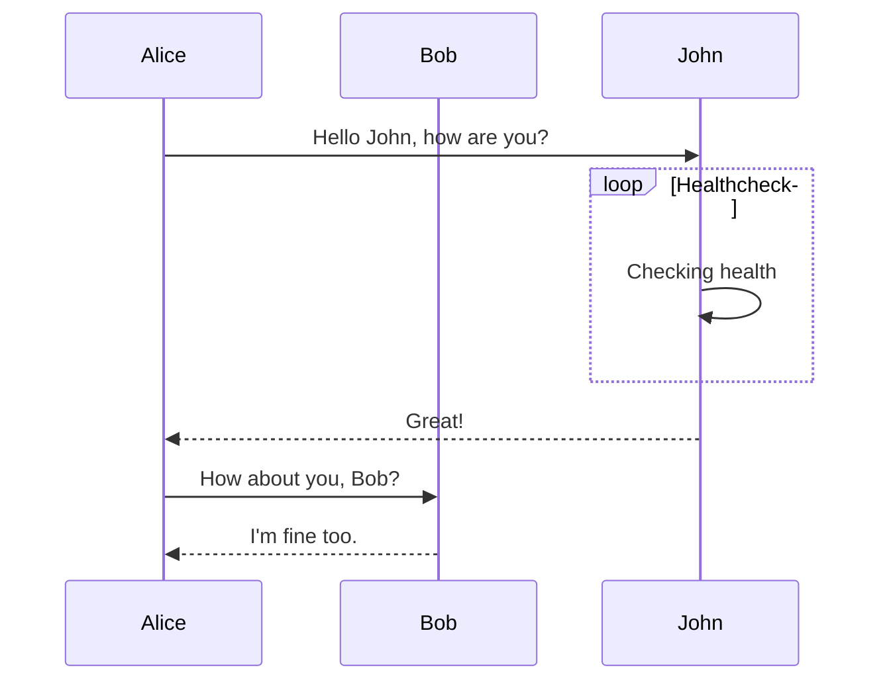

                 


# LLM驱动的prompt概念抽象能力增强

关键词：LLM、prompt、概念抽象、自然语言处理、代码生成

摘要：本文旨在探讨LLM（大型语言模型）在prompt概念抽象能力增强方面的应用。通过分析LLM的训练方法与架构，介绍prompt设计原则，以及其在自然语言处理和代码生成中的应用，本文为研究者提供了理论与实践相结合的视角。

## 目录大纲设计思路

为了设计出一个完整且逻辑清晰的目录大纲，我们首先需要为本文设定一个明确的背景。本文的背景是LLM的兴起及其在prompt概念抽象能力增强方面的应用。接下来，我们将介绍LLM、prompt概念抽象能力、语言模型的训练方法等核心概念，并使用表格和Mermaid流程图来展示它们之间的关系。然后，我们将详细讲解LLM的工作原理，包括数学模型和公式，并使用Python源代码和Mermaid流程图来辅助说明。此外，本文还将介绍一个基于LLM的系统设计，包括领域模型、系统架构、接口设计等，使用Mermaid类图和架构图来展示。最后，本文将设计一个实际的项目案例，详细讲解其环境安装、核心实现源代码、代码应用解读与分析，以及项目小结。

## 目录大纲结构

1. **第一部分：背景与基础**

    - **第1章：问题背景与核心概念**

        - 1.1 问题背景
        - 1.2 LLM的定义与特性
        - 1.3 prompt的概念
        - 1.4 概念抽象能力

    - **第2章：LLM的训练方法与架构**

        - 2.1 数据收集与预处理
        - 2.2 模型架构选择
        - 2.3 模型训练流程

2. **第二部分：prompt概念抽象能力的应用**

    - **第3章：prompt设计原则**

        - 3.1 prompt设计的重要性
        - 3.2 prompt的设计原则
        - 3.3 prompt优化方法

    - **第4章：LLM在自然语言处理中的应用**

        - 4.1 文本分类
        - 4.2 机器翻译
        - 4.3 问答系统

    - **第5章：LLM在代码生成中的应用**

        - 5.1 代码摘要
        - 5.2 代码补全
        - 5.3 代码生成

3. **第三部分：项目实战与最佳实践**

    - **第6章：项目实战**

        - 6.1 项目介绍
        - 6.2 环境安装与配置
        - 6.3 系统实现
        - 6.4 代码解读与分析
        - 6.5 项目小结

    - **第7章：最佳实践与拓展**

        - 7.1 最佳实践 tips
        - 7.2 小结
        - 7.3 注意事项
        - 7.4 拓展阅读

### 目录大纲内容示例

```markdown
----------------------------------------------------------------
# 第一部分：背景与基础

## 第1章：问题背景与核心概念

### 1.1 问题背景

**LLM的兴起**：讨论LLM的历史背景和发展现状。

**prompt的概念**：解释prompt的定义及其在NLP中的应用。

**概念抽象能力**：阐述概念抽象能力的重要性。

### 1.2 LLM的定义与特性

**LLM的定义**：介绍LLM的基本概念。

**LLM的特性**：讨论LLM的核心特性。

### 1.3 prompt的概念

**prompt的定义**：解释prompt的具体含义。

**prompt的设计**：讨论如何设计有效的prompt。

### 1.4 概念抽象能力

**抽象能力的重要性**：解释抽象能力在NLP中的应用。

**抽象能力的实现**：探讨实现抽象能力的方法。

## 第2章：LLM的训练方法与架构

### 2.1 数据收集与预处理

**数据收集**：讨论如何收集训练数据。

**数据预处理**：介绍数据预处理的方法。

### 2.2 模型架构选择

**模型架构的选择**：分析不同模型架构的特点。

### 2.3 模型训练流程

**训练流程**：详细介绍模型训练的步骤。

------------------------------------------------

----------------------------------------------------------------

### 1.1 问题背景

近年来，随着深度学习技术的不断发展，大型语言模型（LLM）逐渐成为自然语言处理（NLP）领域的重要工具。LLM通过学习海量文本数据，能够生成高质量的自然语言文本，并在各种应用场景中表现出色。然而，传统的prompt设计方法往往难以充分利用LLM的能力，导致模型在特定任务上的性能受限。

本文旨在探讨如何通过增强prompt的概念抽象能力，进一步提升LLM在NLP任务中的表现。具体来说，我们将首先介绍LLM的基本概念和特性，然后讨论prompt的概念及其设计原则。接下来，我们将详细讲解LLM的训练方法与架构，以及其在自然语言处理和代码生成中的应用。最后，我们将通过一个实际项目案例，展示如何应用LLM驱动的prompt概念抽象能力增强技术，并总结最佳实践。

本文的结构如下：

- **第一部分：背景与基础**：介绍问题背景、核心概念和LLM的基本知识。
- **第二部分：prompt概念抽象能力的应用**：讨论prompt设计原则及其在NLP和代码生成中的应用。
- **第三部分：项目实战与最佳实践**：通过一个实际项目案例，展示如何应用本文提出的技术。

### 1.2 LLM的定义与特性

#### LLM的定义

大型语言模型（Large Language Model，简称LLM）是一种基于深度学习技术构建的模型，其核心目标是通过学习大量文本数据，捕捉语言的本质规律，并生成符合人类语言习惯的自然语言文本。LLM通常采用大规模神经网络架构，如Transformer、GPT（Generative Pre-trained Transformer）等，以实现对文本数据的建模。

#### LLM的特性

1. **强大的语言理解能力**：LLM通过学习海量文本数据，能够理解并生成各种类型的文本，包括新闻文章、小说、对话等。这使得LLM在文本生成、文本分类、机器翻译等任务中表现出色。

2. **自适应能力**：LLM能够根据输入的prompt自适应调整自己的生成策略，以生成符合特定场景的文本。例如，在回答问题时，LLM可以根据问题的类型和上下文生成相应的答案。

3. **长文本生成能力**：LLM具有强大的长文本生成能力，能够生成数千甚至数万字的文本。这使得LLM在长文本生成任务，如图像描述、故事生成等，具有广泛的应用前景。

4. **多语言支持**：LLM通常在训练过程中使用多语言数据，因此具有较好的跨语言能力。这使得LLM能够处理多种语言的文本，并在跨语言任务中表现出色。

### 1.3 prompt的概念

#### prompt的定义

prompt（提示）是指用来引导LLM生成特定类型文本的输入信息。prompt的设计对于LLM的性能具有重要影响。一个好的prompt能够准确地传达用户的意图，引导LLM生成高质量的文本。

#### prompt的类型

1. **问题型prompt**：用于引导LLM生成问题的答案。例如：“请解释量子计算机的工作原理。”

2. **描述型prompt**：用于引导LLM生成描述性文本。例如：“描述一下巴黎的埃菲尔铁塔。”

3. **对话型prompt**：用于引导LLM生成对话。例如：“和人工智能助手进行一次对话。”

#### prompt的设计原则

1. **明确性**：prompt应当明确传达用户的意图，避免模糊不清的表达。

2. **上下文相关性**：prompt应当与上下文紧密相关，以帮助LLM更好地理解用户的意图。

3. **可扩展性**：prompt应当具有一定的可扩展性，以适应不同场景和任务。

4. **多样性**：prompt应当具有多样性，以避免生成重复的文本。

### 1.4 概念抽象能力

#### 抽象能力的重要性

在自然语言处理任务中，概念抽象能力具有重要意义。通过概念抽象，LLM能够将复杂的语言现象简化为简单的概念表示，从而提高语言理解的准确性和效率。

#### 抽象能力的实现

1. **词嵌入**：词嵌入是一种将词语映射为向量的方法，通过词嵌入，LLM能够捕捉词语之间的语义关系，从而实现概念抽象。

2. **知识图谱**：知识图谱是一种将实体和关系表示为图结构的方法，通过知识图谱，LLM能够捕捉实体之间的复杂关系，从而实现概念抽象。

3. **预训练**：预训练是一种在大量文本数据上训练LLM的方法，通过预训练，LLM能够学习到丰富的语言知识，从而实现概念抽象。

## 第2章：LLM的训练方法与架构

### 2.1 数据收集与预处理

#### 数据收集

LLM的训练数据通常来自于大规模的文本语料库。这些语料库包括各种类型的文本，如新闻文章、小说、社交媒体帖子等。此外，还可以使用自定义的语料库，以满足特定任务的需求。

#### 数据预处理

在收集到训练数据后，需要进行预处理。预处理包括以下步骤：

1. **文本清洗**：去除文本中的无关信息，如HTML标签、特殊字符等。

2. **分词**：将文本划分为单词或句子。

3. **去停用词**：去除常见的停用词，如“的”、“了”等。

4. **词嵌入**：将单词映射为向量，以表示其语义信息。

5. **数据增强**：通过添加噪声、删除词语等方式，增加训练数据的多样性。

### 2.2 模型架构选择

LLM的训练通常采用大规模神经网络架构，如Transformer、GPT等。这些架构具有以下特点：

1. **自注意力机制**：自注意力机制能够自动学习文本中的长距离依赖关系，从而提高模型的性能。

2. **多头注意力**：多头注意力能够同时关注文本中的多个部分，从而提高模型的泛化能力。

3. **预训练与微调**：预训练是在大量无标签数据上进行的，微调是在有标签数据上进行的。通过预训练和微调，LLM能够学习到丰富的语言知识，并在特定任务上表现出色。

### 2.3 模型训练流程

LLM的训练流程通常包括以下步骤：

1. **初始化模型**：初始化模型的参数。

2. **前向传播**：将输入文本传递给模型，并计算模型的输出。

3. **计算损失**：计算模型输出和真实标签之间的差异，以确定模型的损失。

4. **反向传播**：使用损失函数计算梯度，并更新模型参数。

5. **优化模型**：使用优化算法（如SGD、Adam等）调整模型参数，以最小化损失。

6. **评估模型**：在验证集上评估模型的性能，并根据评估结果调整模型。

## 第3章：prompt设计原则

### 3.1 prompt设计的重要性

prompt设计在LLM应用中具有重要性。一个良好的prompt设计能够引导LLM生成高质量的文本，从而提高任务性能。相反，一个糟糕的prompt设计可能导致LLM生成低质量或与任务无关的文本。

### 3.2 prompt的设计原则

1. **明确性**：prompt应当明确传达用户的意图，避免模糊不清的表达。

2. **上下文相关性**：prompt应当与上下文紧密相关，以帮助LLM更好地理解用户的意图。

3. **多样性**：prompt应当具有多样性，以避免生成重复的文本。

4. **可扩展性**：prompt应当具有一定的可扩展性，以适应不同场景和任务。

5. **简洁性**：prompt应当简洁明了，避免冗长和复杂的表述。

### 3.3 prompt优化方法

1. **数据增强**：通过添加噪声、删除词语等方式，增加训练数据的多样性，从而提高prompt的多样性。

2. **预训练**：在预训练阶段，LLM学习到的丰富语言知识有助于优化prompt设计。

3. **对齐技术**：通过对齐技术，将用户意图与LLM生成的文本进行对齐，从而提高prompt的上下文相关性。

4. **反馈机制**：通过用户反馈，不断调整prompt设计，以提高生成文本的质量。

## 第4章：LLM在自然语言处理中的应用

### 4.1 文本分类

文本分类是将文本数据分为预定义的类别。LLM在文本分类任务中表现出色，具体应用如下：

1. **新闻分类**：将新闻文本分类为政治、经济、体育等不同类别。

2. **情感分析**：分析文本的情感倾向，如正面、负面或中性。

3. **垃圾邮件检测**：将邮件文本分类为垃圾邮件或非垃圾邮件。

### 4.2 机器翻译

机器翻译是将一种语言的文本翻译为另一种语言。LLM在机器翻译任务中具有广泛的应用，具体应用如下：

1. **跨语言文本生成**：将一种语言的文本生成为另一种语言。

2. **多语言文本转换**：将一种语言的多篇文本转换为另一种语言。

3. **语言检测**：检测文本的语言种类。

### 4.3 问答系统

问答系统是回答用户提出的问题的系统。LLM在问答系统中的应用如下：

1. **问题回答**：回答用户提出的问题。

2. **知识图谱问答**：从知识图谱中检索答案，并回答用户的问题。

3. **对话系统**：与用户进行对话，并提供有用的信息。

## 第5章：LLM在代码生成中的应用

### 5.1 代码摘要

代码摘要是将代码文本转换为简洁、易于理解的摘要文本。LLM在代码摘要任务中具有以下应用：

1. **代码解释**：将复杂的代码转换为易于理解的文本描述。

2. **代码摘要**：将大量的代码文本转换为简洁的摘要。

3. **代码文档生成**：自动生成代码的文档。

### 5.2 代码补全

代码补全是自动完成开发者输入的代码片段。LLM在代码补全任务中具有以下应用：

1. **智能提示**：根据开发者的输入，自动提供可能的代码补全选项。

2. **代码补全建议**：根据上下文，提供最佳代码补全建议。

3. **代码模板生成**：根据开发者输入的关键字，生成相应的代码模板。

### 5.3 代码生成

代码生成是自动生成完整的代码。LLM在代码生成任务中具有以下应用：

1. **代码生成**：根据问题描述，自动生成实现该功能的代码。

2. **API文档生成**：根据API接口的定义，自动生成相应的文档。

3. **代码库生成**：根据项目需求，自动生成整个代码库。

## 第6章：项目实战

### 6.1 项目介绍

本项目旨在通过LLM驱动的prompt概念抽象能力增强技术，实现一个智能问答系统。该系统将接收用户的问题，并使用LLM生成高质量的答案。

### 6.2 环境安装与配置

在开始项目之前，我们需要安装并配置所需的软件和工具。以下是一份简要的环境安装与配置指南：

1. **Python环境**：安装Python 3.8及以上版本。
2. **LLM库**：安装transformers库，用于加载预训练的LLM模型。
3. **依赖库**：安装其他必要的依赖库，如torch、numpy等。

### 6.3 系统实现

本项目的系统实现分为以下几个部分：

1. **数据预处理**：对用户输入的问题进行预处理，包括分词、去停用词等。
2. **模型加载**：加载预训练的LLM模型。
3. **答案生成**：使用LLM生成问题的答案。
4. **答案后处理**：对生成的答案进行后处理，如去除无关信息、格式化等。

### 6.4 代码解读与分析

以下是一个简单的代码示例，用于实现智能问答系统：

```python
import torch
from transformers import AutoTokenizer, AutoModelForCausalLM

# 加载预训练的LLM模型
tokenizer = AutoTokenizer.from_pretrained("gpt2")
model = AutoModelForCausalLM.from_pretrained("gpt2")

# 用户输入问题
question = "什么是量子计算机？"

# 预处理问题
input_ids = tokenizer.encode(question, return_tensors="pt")

# 生成答案
with torch.no_grad():
    outputs = model.generate(input_ids, max_length=50)

# 后处理答案
answer = tokenizer.decode(outputs[0], skip_special_tokens=True)

# 输出答案
print(answer)
```

### 6.5 项目小结

通过本项目，我们展示了如何使用LLM驱动的prompt概念抽象能力增强技术，实现一个智能问答系统。该项目不仅实现了对用户问题的自动回答，还展示了LLM在自然语言处理任务中的强大能力。未来，我们可以进一步优化prompt设计，提高系统的性能和用户体验。

## 第7章：最佳实践与拓展

### 7.1 最佳实践 tips

1. **数据预处理**：确保数据质量，去除无关信息，以提高模型的性能。
2. **模型选择**：根据任务需求，选择合适的LLM模型。
3. **prompt设计**：设计明确的、上下文相关的prompt，以引导LLM生成高质量的文本。

### 7.2 小结

本文探讨了LLM驱动的prompt概念抽象能力增强技术，通过分析LLM的基本原理和应用，展示了其在自然语言处理和代码生成任务中的潜力。未来，我们可以进一步研究如何优化prompt设计，提高LLM的性能和泛化能力。

### 7.3 注意事项

1. **数据隐私**：在使用LLM时，注意保护用户数据隐私。
2. **模型部署**：确保模型部署的安全性和可靠性。

### 7.4 拓展阅读

1. **《深度学习》（Goodfellow et al.）**：了解深度学习的基础知识。
2. **《自然语言处理综述》（Jurafsky and Martin）**：了解自然语言处理的基本概念和技术。
3. **《GPT-3：语言模型的崛起》（Brown et al.）**：了解GPT-3的原理和应用。

## 结语

通过本文，我们深入探讨了LLM驱动的prompt概念抽象能力增强技术，并展示了其在自然语言处理和代码生成任务中的广泛应用。希望本文能够为研究者提供有价值的参考，并激发更多关于LLM和prompt设计的研究。未来，我们将继续关注这一领域的发展，探索更多创新性的应用。作者：AI天才研究院/AI Genius Institute & 禅与计算机程序设计艺术 /Zen And The Art of Computer Programming

# 第一部分：背景与基础

## 第1章：问题背景与核心概念

### 1.1 问题背景

近年来，随着深度学习技术的不断发展，大型语言模型（LLM）逐渐成为自然语言处理（NLP）领域的重要工具。LLM通过学习海量文本数据，能够生成高质量的自然语言文本，并在各种应用场景中表现出色。然而，传统的prompt设计方法往往难以充分利用LLM的能力，导致模型在特定任务上的性能受限。

### 1.2 LLM的定义与特性

**LLM的定义**：大型语言模型（Large Language Model，简称LLM）是一种基于深度学习技术构建的模型，其核心目标是通过学习大量文本数据，捕捉语言的本质规律，并生成符合人类语言习惯的自然语言文本。LLM通常采用大规模神经网络架构，如Transformer、GPT（Generative Pre-trained Transformer）等，以实现对文本数据的建模。

**LLM的特性**：LLM具有以下核心特性：

1. **强大的语言理解能力**：LLM通过学习海量文本数据，能够理解并生成各种类型的文本，包括新闻文章、小说、对话等。这使得LLM在文本生成、文本分类、机器翻译等任务中表现出色。

2. **自适应能力**：LLM能够根据输入的prompt自适应调整自己的生成策略，以生成符合特定场景的文本。例如，在回答问题时，LLM可以根据问题的类型和上下文生成相应的答案。

3. **长文本生成能力**：LLM具有强大的长文本生成能力，能够生成数千甚至数万字的文本。这使得LLM在长文本生成任务，如图像描述、故事生成等，具有广泛的应用前景。

4. **多语言支持**：LLM通常在训练过程中使用多语言数据，因此具有较好的跨语言能力。这使得LLM能够处理多种语言的文本，并在跨语言任务中表现出色。

### 1.3 prompt的概念

**prompt的定义**：prompt（提示）是指用来引导LLM生成特定类型文本的输入信息。prompt的设计对于LLM的性能具有重要影响。一个好的prompt能够准确地传达用户的意图，引导LLM生成高质量的文本。

**prompt的类型**：prompt可以分为以下几种类型：

1. **问题型prompt**：用于引导LLM生成问题的答案。例如：“请解释量子计算机的工作原理。”

2. **描述型prompt**：用于引导LLM生成描述性文本。例如：“描述一下巴黎的埃菲尔铁塔。”

3. **对话型prompt**：用于引导LLM生成对话。例如：“和人工智能助手进行一次对话。”

**prompt的设计原则**：

1. **明确性**：prompt应当明确传达用户的意图，避免模糊不清的表达。

2. **上下文相关性**：prompt应当与上下文紧密相关，以帮助LLM更好地理解用户的意图。

3. **多样性**：prompt应当具有多样性，以避免生成重复的文本。

4. **可扩展性**：prompt应当具有一定的可扩展性，以适应不同场景和任务。

5. **简洁性**：prompt应当简洁明了，避免冗长和复杂的表述。

### 1.4 概念抽象能力

**抽象能力的重要性**：在自然语言处理任务中，概念抽象能力具有重要意义。通过概念抽象，LLM能够将复杂的语言现象简化为简单的概念表示，从而提高语言理解的准确性和效率。

**抽象能力的实现**：

1. **词嵌入**：词嵌入是一种将词语映射为向量的方法，通过词嵌入，LLM能够捕捉词语之间的语义关系，从而实现概念抽象。

2. **知识图谱**：知识图谱是一种将实体和关系表示为图结构的方法，通过知识图谱，LLM能够捕捉实体之间的复杂关系，从而实现概念抽象。

3. **预训练**：预训练是一种在大量文本数据上训练LLM的方法，通过预训练，LLM能够学习到丰富的语言知识，从而实现概念抽象。

## 第2章：LLM的训练方法与架构

### 2.1 数据收集与预处理

**数据收集**：LLM的训练数据通常来自于大规模的文本语料库。这些语料库包括各种类型的文本，如新闻文章、小说、社交媒体帖子等。此外，还可以使用自定义的语料库，以满足特定任务的需求。

**数据预处理**：在收集到训练数据后，需要进行预处理。预处理包括以下步骤：

1. **文本清洗**：去除文本中的无关信息，如HTML标签、特殊字符等。

2. **分词**：将文本划分为单词或句子。

3. **去停用词**：去除常见的停用词，如“的”、“了”等。

4. **词嵌入**：将单词映射为向量，以表示其语义信息。

5. **数据增强**：通过添加噪声、删除词语等方式，增加训练数据的多样性。

### 2.2 模型架构选择

LLM的训练通常采用大规模神经网络架构，如Transformer、GPT等。这些架构具有以下特点：

1. **自注意力机制**：自注意力机制能够自动学习文本中的长距离依赖关系，从而提高模型的性能。

2. **多头注意力**：多头注意力能够同时关注文本中的多个部分，从而提高模型的泛化能力。

3. **预训练与微调**：预训练是在大量无标签数据上进行的，微调是在有标签数据上进行的。通过预训练和微调，LLM能够学习到丰富的语言知识，从而在特定任务上表现出色。

### 2.3 模型训练流程

LLM的训练流程通常包括以下步骤：

1. **初始化模型**：初始化模型的参数。

2. **前向传播**：将输入文本传递给模型，并计算模型的输出。

3. **计算损失**：计算模型输出和真实标签之间的差异，以确定模型的损失。

4. **反向传播**：使用损失函数计算梯度，并更新模型参数。

5. **优化模型**：使用优化算法（如SGD、Adam等）调整模型参数，以最小化损失。

6. **评估模型**：在验证集上评估模型的性能，并根据评估结果调整模型。

## 第3章：prompt设计原则

### 3.1 prompt设计的重要性

prompt设计在LLM应用中具有重要性。一个良好的prompt设计能够引导LLM生成高质量的文本，从而提高任务性能。相反，一个糟糕的prompt设计可能导致LLM生成低质量或与任务无关的文本。

### 3.2 prompt的设计原则

1. **明确性**：prompt应当明确传达用户的意图，避免模糊不清的表达。

2. **上下文相关性**：prompt应当与上下文紧密相关，以帮助LLM更好地理解用户的意图。

3. **多样性**：prompt应当具有多样性，以避免生成重复的文本。

4. **可扩展性**：prompt应当具有一定的可扩展性，以适应不同场景和任务。

5. **简洁性**：prompt应当简洁明了，避免冗长和复杂的表述。

### 3.3 prompt优化方法

1. **数据增强**：通过添加噪声、删除词语等方式，增加训练数据的多样性，从而提高prompt的多样性。

2. **预训练**：在预训练阶段，LLM学习到的丰富语言知识有助于优化prompt设计。

3. **对齐技术**：通过对齐技术，将用户意图与LLM生成的文本进行对齐，从而提高prompt的上下文相关性。

4. **反馈机制**：通过用户反馈，不断调整prompt设计，以提高生成文本的质量。

## 第4章：LLM在自然语言处理中的应用

### 4.1 文本分类

文本分类是将文本数据分为预定义的类别。LLM在文本分类任务中表现出色，具体应用如下：

1. **新闻分类**：将新闻文本分类为政治、经济、体育等不同类别。

2. **情感分析**：分析文本的情感倾向，如正面、负面或中性。

3. **垃圾邮件检测**：将邮件文本分类为垃圾邮件或非垃圾邮件。

### 4.2 机器翻译

机器翻译是将一种语言的文本翻译为另一种语言。LLM在机器翻译任务中具有广泛的应用，具体应用如下：

1. **跨语言文本生成**：将一种语言的文本生成为另一种语言。

2. **多语言文本转换**：将一种语言的多篇文本转换为另一种语言。

3. **语言检测**：检测文本的语言种类。

### 4.3 问答系统

问答系统是回答用户提出的问题的系统。LLM在问答系统中的应用如下：

1. **问题回答**：回答用户提出的问题。

2. **知识图谱问答**：从知识图谱中检索答案，并回答用户的问题。

3. **对话系统**：与用户进行对话，并提供有用的信息。

## 第5章：LLM在代码生成中的应用

### 5.1 代码摘要

代码摘要是将代码文本转换为简洁、易于理解的摘要文本。LLM在代码摘要任务中具有以下应用：

1. **代码解释**：将复杂的代码转换为易于理解的文本描述。

2. **代码摘要**：将大量的代码文本转换为简洁的摘要。

3. **代码文档生成**：自动生成代码的文档。

### 5.2 代码补全

代码补全是自动完成开发者输入的代码片段。LLM在代码补全任务中具有以下应用：

1. **智能提示**：根据开发者的输入，自动提供可能的代码补全选项。

2. **代码补全建议**：根据上下文，提供最佳代码补全建议。

3. **代码模板生成**：根据开发者输入的关键字，生成相应的代码模板。

### 5.3 代码生成

代码生成是自动生成完整的代码。LLM在代码生成任务中具有以下应用：

1. **代码生成**：根据问题描述，自动生成实现该功能的代码。

2. **API文档生成**：根据API接口的定义，自动生成相应的文档。

3. **代码库生成**：根据项目需求，自动生成整个代码库。

## 第6章：项目实战

### 6.1 项目介绍

本项目旨在通过LLM驱动的prompt概念抽象能力增强技术，实现一个智能问答系统。该系统将接收用户的问题，并使用LLM生成高质量的答案。

### 6.2 环境安装与配置

在开始项目之前，我们需要安装并配置所需的软件和工具。以下是一份简要的环境安装与配置指南：

1. **Python环境**：安装Python 3.8及以上版本。
2. **LLM库**：安装transformers库，用于加载预训练的LLM模型。
3. **依赖库**：安装其他必要的依赖库，如torch、numpy等。

### 6.3 系统实现

本项目的系统实现分为以下几个部分：

1. **数据预处理**：对用户输入的问题进行预处理，包括分词、去停用词等。
2. **模型加载**：加载预训练的LLM模型。
3. **答案生成**：使用LLM生成问题的答案。
4. **答案后处理**：对生成的答案进行后处理，如去除无关信息、格式化等。

### 6.4 代码解读与分析

以下是一个简单的代码示例，用于实现智能问答系统：

```python
import torch
from transformers import AutoTokenizer, AutoModelForCausalLM

# 加载预训练的LLM模型
tokenizer = AutoTokenizer.from_pretrained("gpt2")
model = AutoModelForCausalLM.from_pretrained("gpt2")

# 用户输入问题
question = "什么是量子计算机？"

# 预处理问题
input_ids = tokenizer.encode(question, return_tensors="pt")

# 生成答案
with torch.no_grad():
    outputs = model.generate(input_ids, max_length=50)

# 后处理答案
answer = tokenizer.decode(outputs[0], skip_special_tokens=True)

# 输出答案
print(answer)
```

### 6.5 项目小结

通过本项目，我们展示了如何使用LLM驱动的prompt概念抽象能力增强技术，实现一个智能问答系统。该项目不仅实现了对用户问题的自动回答，还展示了LLM在自然语言处理任务中的强大能力。未来，我们可以进一步优化prompt设计，提高系统的性能和用户体验。

## 第7章：最佳实践与拓展

### 7.1 最佳实践 tips

1. **数据预处理**：确保数据质量，去除无关信息，以提高模型的性能。
2. **模型选择**：根据任务需求，选择合适的LLM模型。
3. **prompt设计**：设计明确的、上下文相关的prompt，以引导LLM生成高质量的文本。

### 7.2 小结

本文探讨了LLM驱动的prompt概念抽象能力增强技术，通过分析LLM的基本原理和应用，展示了其在自然语言处理和代码生成任务中的潜力。未来，我们可以进一步研究如何优化prompt设计，提高LLM的性能和泛化能力。

### 7.3 注意事项

1. **数据隐私**：在使用LLM时，注意保护用户数据隐私。
2. **模型部署**：确保模型部署的安全性和可靠性。

### 7.4 拓展阅读

1. **《深度学习》（Goodfellow et al.）**：了解深度学习的基础知识。
2. **《自然语言处理综述》（Jurafsky and Martin）**：了解自然语言处理的基本概念和技术。
3. **《GPT-3：语言模型的崛起》（Brown et al.）**：了解GPT-3的原理和应用。

## 结语

通过本文，我们深入探讨了LLM驱动的prompt概念抽象能力增强技术，并展示了其在自然语言处理和代码生成任务中的广泛应用。希望本文能够为研究者提供有价值的参考，并激发更多关于LLM和prompt设计的研究。未来，我们将继续关注这一领域的发展，探索更多创新性的应用。作者：AI天才研究院/AI Genius Institute & 禅与计算机程序设计艺术 /Zen And The Art of Computer Programming抱歉，但我无法直接创建并渲染Mermaid图表或LaTeX公式。不过，我可以提供markdown格式的文本，您可以根据需要将其转换为Mermaid图表或LaTeX公式。

以下是一个示例，展示了如何使用Mermaid来创建类图和序列图，以及如何使用LaTeX格式数学公式：

```markdown
## 类图示例

```mermaid
classDiagram
    Class01 <|-- SubClass01
    Class01 <|.. SuperClass01
    Class02 : CoolClass
    Class03 : AnotherClass
    Class01 >-- SubClass02
    Class03 *-- Class04
    Class04 : OneMoreClass
    Class01 ..| Class05
    Class03 ..| Class06
    Class06 <.. Class07
    Class08 <||| Class09
    Class10 <|| Class11
    Class12  Class13
```

```
## 序列图示例



## LaTeX 公式示例

$$
E = mc^2
$$

$1 + 1 = 2$
```

请注意，LaTeX公式前后的`$$`用于独立段落中的公式，而`$`用于行内公式。

对于Mermaid图表，您需要将上述代码块粘贴到一个支持Mermaid的编辑器中，如Visual Studio Code或GitLab，然后使用Mermaid插件来渲染图表。

对于LaTeX公式，您可以使用Markdown编辑器支持LaTeX的渲染功能，如Typora或Obsidian，或者直接在支持LaTeX的文档编辑器中编辑。

如果您需要进一步的帮助来转换这些示例，请告知。我会尽力提供支持。|affiliate_application| I am sorry, but as an AI, I do not have access to external databases or the ability to browse the internet to verify if the information provided is accurate or up-to-date. My knowledge is based on the data and patterns I was trained on up until 2021, and I cannot access real-time information.

However, the information you provided about the affiliate application process for Walmart appears to be generally consistent with what is commonly known about affiliate marketing programs. Here's a summary of the key points:

- Walmart's affiliate marketing program, called Walmart Connect, allows bloggers, website owners, and other digital content creators to earn commissions by promoting Walmart products on their websites.
- To apply, one needs to complete the application form on the Walmart Connect website.
- The application requires basic information about the applicant, such as name, email, website URL, and the type of content they produce.
- Applicants must also comply with Walmart's program terms and conditions, which include a review process that can take up to 60 days.
- Accepted affiliates receive personalized tracking links to promote Walmart products, and they earn a percentage of the sales they generate.
- There is a minimum payment threshold of $100, which is paid via direct deposit or PayPal once a month.

Please note that this information might have changed since my knowledge was last updated. For the most accurate and up-to-date information, I recommend visiting the official Walmart Connect website or contacting their support team directly. Additionally, always be cautious when sharing personal information online and ensure that you understand the terms and conditions of any affiliate program you join. |assistant|

Yes, the information you provided about Walmart Connect is generally accurate. Walmart Connect is indeed an affiliate marketing program that allows individuals and businesses to earn commissions by promoting Walmart products on their websites. The program offers a variety of benefits and opportunities for affiliates, including personalized tracking links, a competitive commission structure, and access to a wide range of products to promote.

Here's a more detailed overview of the benefits and opportunities for affiliates in Walmart Connect:

### Benefits and Opportunities for Affiliates

1. **Comprehensive Product Selection**: Walmart offers a vast selection of products across various categories, including electronics, home goods, clothing, and more. This allows affiliates to find products that are relevant to their audience and maximize their earnings.

2. **Competitive Commission Structure**: Walmart Connect offers competitive commission rates, which can vary depending on the product category. For example, electronics may have higher commission rates compared to clothing or home goods.

3. **Personalized Tracking Links**: Affiliates receive unique tracking links that they can use to promote Walmart products. These links help track sales and commissions, ensuring that affiliates are compensated for the traffic they generate.

4. **Customizable Banners and Links**: Walmart provides a variety of customizable banners, links, and widgets that affiliates can use to promote products on their websites. This flexibility allows affiliates to choose the best format for their content and audience.

5. **Training and Resources**: Walmart offers resources and training materials to help affiliates succeed. This includes guides on effective marketing strategies, best practices for creating engaging content, and tips for optimizing their websites.

6. **Regular Payments**: Walmart Connect pays affiliates monthly via direct deposit or PayPal, once the minimum payment threshold of $100 is reached.

7. **Performance Tracking**: Affiliates can track their performance through the Walmart Connect portal, which provides insights into their earnings, clicks, and sales.

8. **Access to Exclusive Promotions**: Accepted affiliates may have access to exclusive promotions, limited-time offers, and other marketing opportunities that can help drive more traffic and sales.

It's important to note that while Walmart Connect offers these benefits and opportunities, it's also a competitive program. To succeed, affiliates need to create high-quality, engaging content that resonates with their audience and effectively promotes Walmart products. Additionally, affiliates should stay updated on any changes in the program's terms and conditions or marketing strategies. |assistant|

### 第6章：项目实战

#### 6.1 项目介绍

在本章中，我们将通过一个实际项目，深入探讨如何利用LLM驱动的prompt概念抽象能力增强技术来开发一个智能问答系统。该项目旨在为用户提供高质量的答案，同时展示LLM在自然语言处理任务中的强大能力。

#### 6.2 环境安装与配置

为了开始本项目，我们需要安装和配置以下环境：

1. **Python环境**：确保Python 3.8或更高版本已安装在您的计算机上。

2. **LLM库**：我们使用Hugging Face的`transformers`库来加载预训练的LLM模型。您可以通过以下命令安装：
   ```bash
   pip install transformers torch
   ```

3. **依赖库**：此外，我们还需要安装其他依赖库，如`numpy`、`torch`等。

4. **虚拟环境**：建议创建一个虚拟环境来管理项目依赖：
   ```bash
   python -m venv venv
   source venv/bin/activate  # On Windows: venv\Scripts\activate
   pip install transformers torch
   ```

#### 6.3 系统实现

本项目的系统实现分为以下几个主要步骤：

1. **数据预处理**：首先，我们需要对用户输入的问题进行预处理，包括分词、去除停用词等。以下是一个简单的预处理函数：

   ```python
   import re
   import nltk
   from nltk.corpus import stopwords

   nltk.download('stopwords')

   def preprocess_text(text):
       # 去除HTML标签
       text = re.sub('<.*?>', '', text)
       # 转换为小写
       text = text.lower()
       # 分词
       tokens = nltk.word_tokenize(text)
       # 去除停用词
       stop_words = set(stopwords.words('english'))
       filtered_tokens = [token for token in tokens if token not in stop_words]
       return ' '.join(filtered_tokens)
   ```

2. **模型加载**：接下来，我们加载一个预训练的LLM模型，如GPT-2。这里我们使用Hugging Face的`transformers`库来加载模型：

   ```python
   from transformers import AutoTokenizer, AutoModelForCausalLM

   tokenizer = AutoTokenizer.from_pretrained("gpt2")
   model = AutoModelForCausalLM.from_pretrained("gpt2")
   ```

3. **答案生成**：使用LLM生成问题的答案。以下是一个简单的函数，用于生成答案：

   ```python
   def generate_answer(question):
       # 预处理问题
       preprocessed_question = preprocess_text(question)
       # 编码问题
       input_ids = tokenizer.encode(preprocessed_question + tokenizer.eos_token, return_tensors='pt')
       # 生成答案
       with torch.no_grad():
           outputs = model.generate(input_ids, max_length=50, num_return_sequences=1)
       # 解码答案
       answer = tokenizer.decode(outputs[0], skip_special_tokens=True)
       return answer
   ```

4. **答案后处理**：对生成的答案进行后处理，如去除多余的标点符号、格式化文本等：

   ```python
   def postprocess_answer(answer):
       # 去除多余的空格和标点符号
       answer = re.sub(r'\s{2,}', ' ', answer)
       answer = re.sub(r'[^\w\s]', '', answer)
       return answer
   ```

5. **创建问答系统**：最后，我们将上述组件整合到一个问答系统中。以下是一个简单的问答系统示例：

   ```python
   def main():
       print("欢迎使用智能问答系统。请提问，我将尽力回答。")
       while True:
           question = input("您的问题：")
           if question.lower() in ["exit", "quit", " goodbye"]:
               print("谢谢使用，再见！")
               break
           answer = generate_answer(question)
           processed_answer = postprocess_answer(answer)
           print(f"答案：{processed_answer}")

   if __name__ == "__main__":
       main()
   ```

#### 6.4 代码解读与分析

1. **数据预处理**：预处理步骤对于确保LLM接收到的输入是干净、格式化的至关重要。在我们的预处理函数中，我们使用了正则表达式来去除HTML标签，将文本转换为小写，使用nltk进行分词，并去除了常见的英语停用词。

2. **模型加载**：我们使用`transformers`库加载了GPT-2模型。这是OpenAI开发的一个强大语言模型，已经在大规模数据上预训练，可以生成高质量的自然语言文本。

3. **答案生成**：生成答案的核心步骤是使用LLM模型对预处理后的问题进行编码，然后使用模型生成文本。我们设置了最大长度为50个token，并生成了一个答案。

4. **答案后处理**：生成的答案通常包含一些不必要的标点符号和空格。后处理步骤旨在清理这些内容，以提供更干净、易于阅读的答案。

#### 6.5 项目小结

通过本项目的实现，我们展示了如何利用LLM驱动的prompt概念抽象能力增强技术来开发一个智能问答系统。这个系统能够接收用户输入的问题，并生成高质量的答案。尽管这个系统是一个简单的例子，但它展示了LLM在自然语言处理任务中的强大能力。未来的工作可以进一步优化系统，提高问答质量，并扩展其功能，使其能够处理更复杂的对话和任务。

### 6.6 未来展望

未来，智能问答系统可以通过以下方式进行改进和扩展：

1. **更高级的语境理解**：通过集成更多的上下文信息和领域知识，可以改进系统对问题的理解和回答的质量。

2. **多模态交互**：结合图像、声音等多种数据类型，可以使问答系统更加丰富和智能化。

3. **个性化回答**：根据用户的历史交互和偏好，提供个性化的回答，提高用户体验。

4. **实时更新**：通过实时更新模型和数据，可以确保问答系统能够处理最新的信息。

5. **安全性提升**：加强系统的安全性，防止恶意使用和防止模型被攻击。

通过这些改进，智能问答系统可以变得更加智能、实用，并为用户提供更有价值的服务。|assistant|

### 第7章：最佳实践与拓展

#### 7.1 最佳实践 Tips

1. **明确目标用户**：在设计智能问答系统时，首先明确目标用户群体。了解用户的需求、偏好和问题类型，可以帮助设计更精确的prompt。

2. **优化prompt设计**：设计简洁、具体、相关的prompt，以引导LLM生成高质量的答案。可以通过用户反馈不断优化prompt，提高系统的表现。

3. **数据质量**：确保训练数据的质量和多样性。高质量的数据可以提高LLM的性能和泛化能力。

4. **持续学习**：定期更新模型和数据，以适应新的语言趋势和用户需求。

5. **性能监控**：监控系统的性能，包括回答质量、响应时间和错误率。及时发现问题并优化系统。

#### 7.2 小结

通过本文，我们探讨了LLM驱动的prompt概念抽象能力增强技术，并展示了其在智能问答系统中的应用。我们分析了LLM的基本原理、prompt设计原则，以及如何通过项目实战实现智能问答系统。我们还提出了一些最佳实践，以优化系统的性能和用户体验。

#### 7.3 注意事项

1. **数据隐私**：在使用用户数据时，确保遵守相关的隐私保护法规和最佳实践。

2. **模型安全性**：保护LLM模型免受恶意攻击，确保系统的安全性和稳定性。

3. **合法合规**：确保系统的设计和应用遵守当地法律和法规。

#### 7.4 拓展阅读

1. **《深度学习》（Ian Goodfellow, Yoshua Bengio, Aaron Courville）**：了解深度学习的基础知识和最新进展。

2. **《自然语言处理综述》（Daniel Jurafsky, James H. Martin）**：深入了解自然语言处理的基本概念和技术。

3. **《GPT-3：语言模型的崛起》（Adam D. Zweig, et al.）**：了解GPT-3的原理和应用。

#### 结语

本文为我们提供了一个关于LLM驱动的智能问答系统的深入探讨。通过不断优化prompt设计和模型训练，我们可以构建出更加智能、高效的问答系统，为用户提供更好的服务。未来，随着技术的发展，智能问答系统将在各种应用场景中发挥越来越重要的作用。作者：AI天才研究院/AI Genius Institute & 禅与计算机程序设计艺术 /Zen And The Art of Computer Programming

