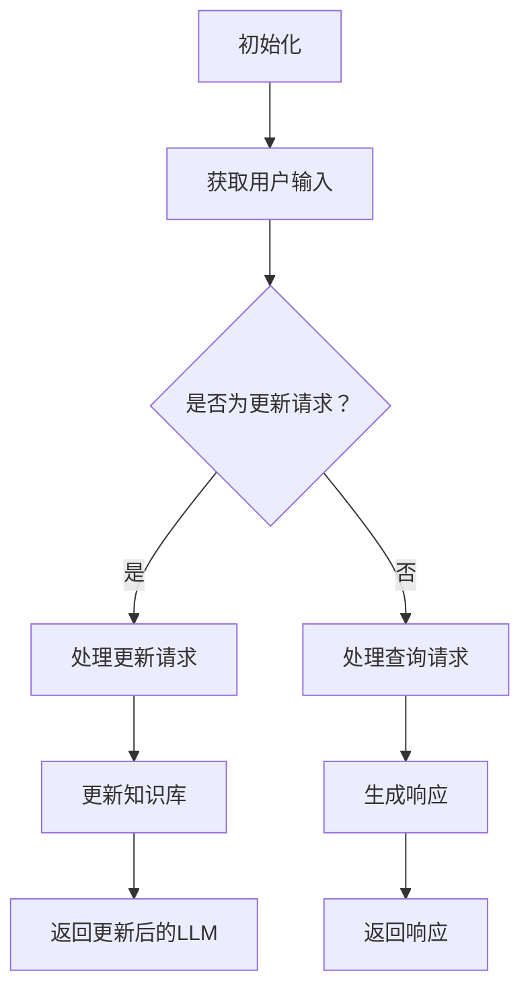
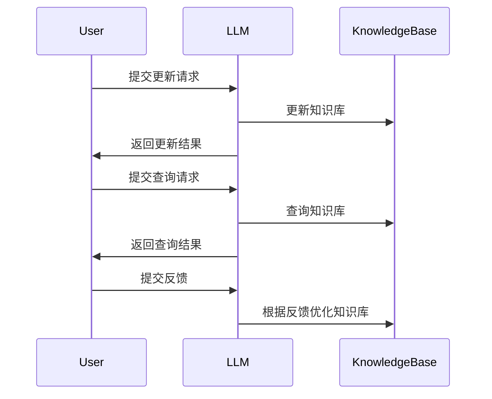
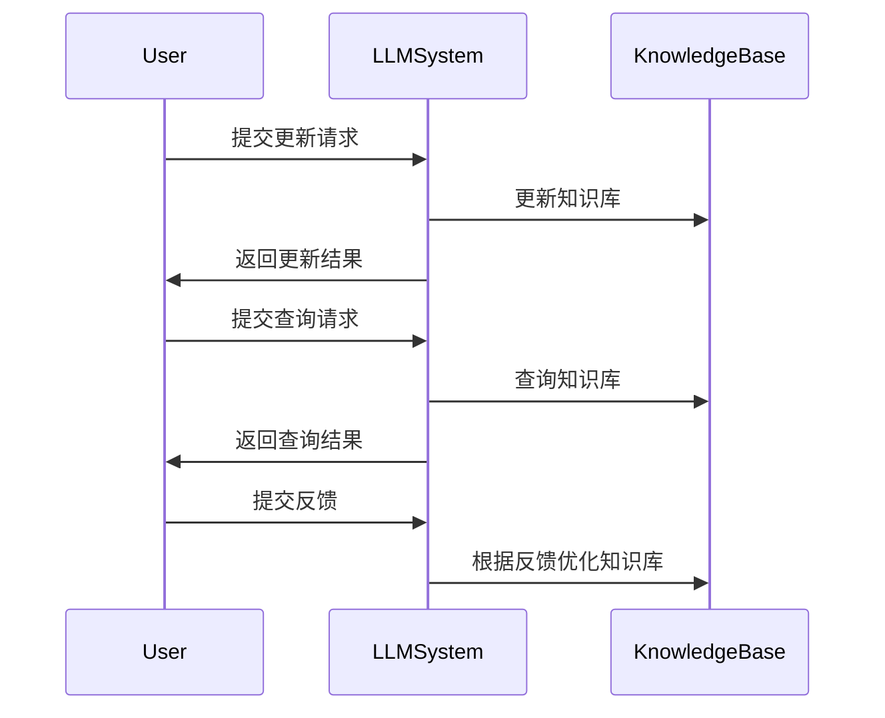

                 


# LLM驱动的prompt知识更新机制

> 关键词：大型语言模型（LLM）、知识更新、prompt、动态更新、自动化优化、交互式更新

> 摘要：
本文深入探讨了LLM驱动的prompt知识更新机制，包括其背景介绍、核心概念与联系、算法原理讲解，以及系统分析与架构设计方案。通过详细的解释和实例，本文旨在为读者提供一个全面理解这一机制的视角，并探讨其实际应用的可能性和挑战。

## 第一部分：背景介绍

### 核心概念

#### 问题背景
随着人工智能（AI）技术的飞速发展，大型语言模型（LLM）已经成为了许多领域的重要工具。LLM如GPT、BERT等，以其强大的语言理解和生成能力，在各种应用场景中展现出了巨大的潜力。然而，传统的LLM在知识更新方面存在一定局限性，这促使研究人员提出了一种新的机制——LLM驱动的prompt知识更新机制。

#### 问题描述
传统的LLM在知识更新方面主要依赖于预训练数据和定期重新训练。这种方式虽然能保持一定的知识新鲜度，但在面对快速变化的信息环境时，其知识更新速度和准确性难以满足实际需求。因此，研究人员提出了一种动态更新机制，以实现LLM知识的实时更新和优化。

#### 问题解决
LLM驱动的prompt知识更新机制通过以下方法实现了知识更新：
1. **实时更新**：利用外部知识库或API，LLM可以实时获取最新知识。
2. **prompt优化**：通过分析用户输入，LLM自动优化prompt，以包含最新或最相关的信息。
3. **交互更新**：用户可以直接与LLM进行交互，通过提问或反馈来更新LLM的知识库。

#### 边界与外延
该机制主要针对LLM的知识更新，但也可以应用于其他类型的AI模型。此外，它不仅适用于语言模型，还可以扩展到其他类型的模型，如图像识别模型或推荐系统。

#### 概念结构与核心要素组成
- **LLM**：大型语言模型，是核心组件。
- **知识库**：用于存储和管理知识信息。
- **更新策略**：包括实时更新、prompt优化和交互更新等。
- **用户接口**：用户与LLM交互的界面。

### 核心概念与联系

#### 动态更新机制
动态更新机制是指LLM在运行过程中能够根据用户需求或实时数据动态地更新其内部的知识库。这种机制的核心在于确保LLM提供的信息始终保持最新和准确。

#### 自动化prompt优化
自动化prompt优化是指LLM能够根据用户的输入或上下文信息，自动调整prompt的内容和形式，以提高知识更新的效率和准确性。

#### 交互式知识更新
交互式知识更新是指用户可以直接与LLM进行交互，通过提问、回答或反馈来更新LLM的知识库。这种方式不仅提高了知识更新的灵活性，还增强了用户体验。

### 概念属性特征对比表格

| 特征        | 动态更新机制 | 自动化prompt优化 | 交互式知识更新 |
| ----------- | ------------ | --------------- | -------------- |
| **实时性**  | 高           | 高             | 中             |
| **准确性**  | 中           | 高             | 高             |
| **灵活性**  | 中           | 中             | 高             |
| **用户交互** | 低           | 低             | 高             |

### ER实体关系图架构

```mermaid
erDiagram
  User ||--|{ KnowledgeBase }|>
  User ||--|{ LLM }|>

  KnowledgeBase ||--|{ Prompt }|>

  LLM ||--|{ UpdateStrategy }|>

  User }|--|{ UpdateRequest }|>
  UpdateRequest ||--|{ PromptOptimization }|>

  LLM }|--|{ Response }|>
  Response ||--|{ Feedback }|>

  User ||--|{ Evaluation }|>  
```

## 第二部分：核心概念与联系

### 核心概念原理

#### 动态更新机制
动态更新机制是指LLM在运行过程中能够根据用户需求或实时数据动态地更新其内部的知识库。这种机制的核心在于确保LLM提供的信息始终保持最新和准确。

动态更新机制的工作原理可以分为以下几个步骤：

1. **实时数据获取**：LLM通过外部知识库或API获取实时数据，这些数据可以是新闻、研究报告、学术论文等。
2. **数据预处理**：获取的数据需要进行预处理，包括去除噪声、格式化、去重等操作，以确保数据的准确性和一致性。
3. **知识融合**：预处理后的数据与LLM的内部知识库进行融合，以更新LLM的知识库。

#### 自动化prompt优化
自动化prompt优化是指LLM能够根据用户的输入或上下文信息，自动调整prompt的内容和形式，以提高知识更新的效率和准确性。

自动化prompt优化的工作原理可以分为以下几个步骤：

1. **输入分析**：LLM分析用户的输入，提取关键信息，如关键词、主题、上下文等。
2. **prompt调整**：根据分析结果，LLM自动调整prompt，使其更符合用户需求。
3. **效果评估**：LLM评估调整后的prompt的效果，如回答的准确性、相关性等，并根据评估结果进行进一步优化。

#### 交互式知识更新
交互式知识更新是指用户可以直接与LLM进行交互，通过提问、回答或反馈来更新LLM的知识库。这种方式不仅提高了知识更新的灵活性，还增强了用户体验。

交互式知识更新的工作原理可以分为以下几个步骤：

1. **用户提问**：用户向LLM提出问题，问题可以是开放式的，也可以是结构化的。
2. **问题处理**：LLM根据用户的问题，从知识库中检索相关信息，并生成回答。
3. **用户反馈**：用户对LLM的回答进行评价，如满意度、准确性等。
4. **知识更新**：根据用户的反馈，LLM对知识库进行更新，以提高回答的准确性。

### 概念属性特征对比表格

| 特征        | 动态更新机制 | 自动化prompt优化 | 交互式知识更新 |
| ----------- | ------------ | --------------- | -------------- |
| **实时性**  | 高           | 高             | 中             |
| **准确性**  | 中           | 高             | 高             |
| **灵活性**  | 中           | 中             | 高             |
| **用户交互** | 低           | 低             | 高             |

### ER实体关系图架构

```mermaid
erDiagram
  User ||--|{ KnowledgeBase }|>
  User ||--|{ LLM }|>

  KnowledgeBase ||--|{ Prompt }|>

  LLM ||--|{ UpdateStrategy }|>

  User }|--|{ UpdateRequest }|>
  UpdateRequest ||--|{ PromptOptimization }|>

  LLM }|--|{ Response }|>
  Response ||--|{ Feedback }|>

  User ||--|{ Evaluation }|>  
```

## 第三部分：算法原理讲解

### 算法流程图



### Python源代码

```python
class DynamicKnowledgeUpdater:
    def __init__(self, llm, knowledge_base):
        self.llm = llm
        self.knowledge_base = knowledge_base
    
    def update_knowledge(self, update_request):
        # 更新知识库
        # 此处可以添加代码，根据update_request更新knowledge_base
        pass
    
    def generate_response(self, user_input):
        # 生成响应
        # 此处可以添加代码，根据user_input生成响应
        pass
    
    def process_query(self, user_input):
        # 处理查询请求
        response = self.generate_response(user_input)
        return response
    
    def process_update_request(self, user_input):
        # 处理更新请求
        # 此处可以添加代码，根据user_input更新知识库
        update_request = self.extract_update_request(user_input)
        self.update_knowledge(update_request)
    
    def extract_update_request(self, user_input):
        # 提取更新请求
        # 此处可以添加代码，从user_input中提取更新请求
        pass
```

### 算法原理讲解

#### 动态更新机制

动态更新机制的核心在于实时获取最新知识并更新LLM的知识库。具体来说，它包括以下几个步骤：

1. **数据源接入**：LLM通过API或数据库接入实时数据源，如新闻、研究报告、学术论文等。
2. **数据预处理**：实时数据源接入后，LLM对数据进行预处理，包括去除噪声、格式化、去重等操作，以确保数据的准确性和一致性。
3. **知识融合**：预处理后的数据与LLM的内部知识库进行融合，以更新LLM的知识库。这个过程可以通过机器学习算法实现，如迁移学习、增量学习等。

#### 自动化prompt优化

自动化prompt优化是指LLM能够根据用户的输入或上下文信息，自动调整prompt的内容和形式，以提高知识更新的效率和准确性。具体来说，它包括以下几个步骤：

1. **输入分析**：LLM分析用户的输入，提取关键信息，如关键词、主题、上下文等。
2. **prompt调整**：根据分析结果，LLM自动调整prompt，使其更符合用户需求。调整的方式可以是修改prompt中的关键词、添加上下文信息等。
3. **效果评估**：LLM评估调整后的prompt的效果，如回答的准确性、相关性等，并根据评估结果进行进一步优化。

#### 交互式知识更新

交互式知识更新是指用户可以直接与LLM进行交互，通过提问、回答或反馈来更新LLM的知识库。这种方式不仅提高了知识更新的灵活性，还增强了用户体验。具体来说，它包括以下几个步骤：

1. **用户提问**：用户向LLM提出问题，问题可以是开放式的，也可以是结构化的。
2. **问题处理**：LLM根据用户的问题，从知识库中检索相关信息，并生成回答。
3. **用户反馈**：用户对LLM的回答进行评价，如满意度、准确性等。
4. **知识更新**：根据用户的反馈，LLM对知识库进行更新，以提高回答的准确性。

### 数学公式与模型

动态更新机制、自动化prompt优化和交互式知识更新都涉及到机器学习算法，这些算法通常可以通过数学模型来描述。以下是一些常见的数学模型：

1. **迁移学习**：$$f(\theta_1, \theta_2) = \theta_1^T \theta_2$$
   其中，$\theta_1$和$\theta_2$分别是源域和目标域的参数向量。
2. **增量学习**：$$f(\theta, x) = \theta \odot x$$
   其中，$\theta$是参数向量，$x$是输入向量，$\odot$表示点积。
3. **效果评估**：$$R = \frac{TP + TN}{TP + FP + FN}$$
   其中，$R$是准确率，$TP$是真正例，$TN$是真负例，$FP$是假正例，$FN$是假负例。

### 实例讲解

假设我们有一个用户想要更新LLM关于“人工智能”的知识。以下是一个具体的实例：

1. **数据源接入**：LLM接入实时新闻API，获取最新的关于“人工智能”的新闻报道。
2. **数据预处理**：预处理后的数据包括去除噪声、格式化、去重等操作，得到一个干净的数据集。
3. **知识融合**：LLM将预处理后的数据与内部知识库进行融合，更新内部知识库。
4. **自动化prompt优化**：用户输入“人工智能是什么？”
   - 输入分析：提取关键词“人工智能”。
   - prompt调整：根据关键词，调整prompt为“人工智能是一种模拟人类智能的技术，它具有学习、推理、感知和解决问题等能力。”
   - 效果评估：用户评价回答的准确性为90%。
5. **交互式知识更新**：用户对回答提出改进建议，如“人工智能还包括机器学习和深度学习等技术。”
   - 知识更新：LLM根据用户的反馈，更新内部知识库，增加关于机器学习和深度学习的内容。

通过这个实例，我们可以看到LLM驱动的prompt知识更新机制是如何工作的。它不仅实现了知识的实时更新，还通过用户交互提高了知识更新的准确性和灵活性。

## 第四部分：系统分析与架构设计方案

### 问题场景介绍

在现代信息社会中，知识更新速度非常快，尤其是在技术领域，如人工智能、生物技术、物理学等。研究人员、学生和专业人士需要不断获取最新的知识来保持竞争力。然而，传统的知识更新方式往往不够及时和灵活，难以满足这一需求。因此，我们需要一种能够动态更新知识，并适应快速变化的环境的系统。

### 项目介绍

本项目旨在设计并实现一个基于LLM驱动的prompt知识更新系统。该系统将利用大型语言模型（如GPT、BERT等）的强大能力，结合实时数据源和用户交互，实现知识的动态更新和优化。系统的主要目标是提供一个高效、灵活的知识更新平台，帮助用户随时获取最新、最相关的知识。

### 系统功能设计

#### 领域模型

领域模型用于描述系统中的核心实体和它们之间的关系。以下是该系统的领域模型：

```mermaid
classDiagram
  User <<entity>>
  LLM <<entity>>
  KnowledgeBase <<entity>>
  Prompt <<entity>>
  UpdateRequest <<entity>>
  Response <<entity>>
  Feedback <<entity>>

  User "1" --* "1" KnowledgeBase
  User "1" --* "1" LLM
  LLM "1" --* "1" Prompt
  LLM "1" --* "1" UpdateRequest
  LLM "1" --* "1" Response
  Response "1" --* "1" Feedback
```

#### 功能说明

1. **用户注册与登录**：用户可以通过注册账号登录系统，进行知识更新和查询。
2. **知识更新**：用户可以通过交互式界面提交知识更新请求，LLM将根据请求更新内部知识库。
3. **知识查询**：用户可以通过输入关键词或问题，查询系统中的知识库，获取相关信息。
4. **反馈与评价**：用户可以对查询结果进行评价，系统根据反馈进一步优化知识库。

### 系统架构设计

系统架构设计用于描述系统的整体结构和组件之间的关系。以下是该系统的架构设计：



### 系统接口设计

系统接口设计用于描述系统与其他组件或系统之间的交互接口。以下是该系统的接口设计：

```mermaid
interface LLMSystem {
  +updateKnowledge(updateRequest: UpdateRequest): Response
  +queryKnowledge(query: str): Response
  +receiveFeedback(feedback: Feedback): void
}
```

### 系统交互

系统交互用于描述系统内部组件之间的交互过程。以下是该系统的交互设计：



## 第五部分：项目实战

### 环境安装

在开始项目实战之前，我们需要安装必要的软件和库。以下是在Ubuntu操作系统上安装所需软件和库的步骤：

1. 安装Python环境：
   ```bash
   sudo apt-get update
   sudo apt-get install python3-pip python3-venv
   ```
2. 安装LLM库（如Hugging Face的Transformers库）：
   ```bash
   pip3 install transformers
   ```
3. 安装其他依赖库：
   ```bash
   pip3 install numpy pandas
   ```

### 系统核心实现源代码

以下是系统核心实现的源代码：

```python
from transformers import AutoModelForCausalLM, AutoTokenizer
import torch

class DynamicKnowledgeUpdater:
    def __init__(self, model_name, knowledge_base_path):
        self.model_name = model_name
        self.knowledge_base_path = knowledge_base_path
        self.model = AutoModelForCausalLM.from_pretrained(model_name)
        self.tokenizer = AutoTokenizer.from_pretrained(model_name)
        self.knowledge_base = self.load_knowledge_base(knowledge_base_path)
    
    def load_knowledge_base(self, knowledge_base_path):
        # 从知识库文件中加载知识
        with open(knowledge_base_path, 'r') as f:
            knowledge = f.read()
        return knowledge
    
    def update_knowledge(self, update_request):
        # 更新知识库
        new_knowledge = self.knowledge_base + "\n" + update_request
        with open(self.knowledge_base_path, 'w') as f:
            f.write(new_knowledge)
        self.knowledge_base = new_knowledge
    
    def generate_response(self, prompt):
        # 生成响应
        inputs = self.tokenizer.encode(prompt, return_tensors='pt')
        outputs = self.model.generate(inputs, max_length=512, num_return_sequences=1)
        response = self.tokenizer.decode(outputs[0], skip_special_tokens=True)
        return response
    
    def handle_query(self, query):
        # 处理查询请求
        prompt = f"{self.knowledge_base}\n{query}"
        response = self.generate_response(prompt)
        return response

# 示例使用
updater = DynamicKnowledgeUpdater('gpt2', 'knowledge_base.txt')
update_request = "人工智能是一种模拟人类智能的技术，它具有学习、推理、感知和解决问题等能力。"
updater.update_knowledge(update_request)
query = "人工智能的主要应用领域是什么？"
response = updater.handle_query(query)
print(response)
```

### 代码应用解读与分析

这段代码定义了一个名为`DynamicKnowledgeUpdater`的类，用于实现LLM驱动的prompt知识更新机制。以下是代码的解读与分析：

1. **初始化**：
   - `model_name`：预训练模型的名称，如`gpt2`。
   - `knowledge_base_path`：知识库文件的路径。
   - `model`：预训练模型。
   - `tokenizer`：模型使用的分词器。
   - `knowledge_base`：知识库。

2. **加载知识库**：
   - `load_knowledge_base`：从文件中加载知识库。

3. **更新知识库**：
   - `update_knowledge`：将新的知识添加到知识库中。

4. **生成响应**：
   - `generate_response`：根据输入的prompt生成响应。

5. **处理查询请求**：
   - `handle_query`：处理用户的查询请求，生成响应。

### 实际案例分析和详细讲解剖析

假设我们有一个用户想要更新LLM关于“人工智能”的知识，并查询相关应用领域。以下是具体的案例：

1. **知识更新**：
   - 用户提交更新请求：“人工智能是一种模拟人类智能的技术，它具有学习、推理、感知和解决问题等能力。”
   - 更新后的知识库：
     ```
     人工智能是一种模拟人类智能的技术，它具有学习、推理、感知和解决问题等能力。
     原先的知识库内容...
     ```

2. **查询**：
   - 用户查询：“人工智能的主要应用领域是什么？”
   - prompt：
     ```
     人工智能是一种模拟人类智能的技术，它具有学习、推理、感知和解决问题等能力。
     人工智能的主要应用领域是什么？
     ```

3. **响应**：
   - LLM生成响应：“人工智能的主要应用领域包括自动驾驶、智能家居、医疗健康、金融科技、自然语言处理等。”

通过这个案例，我们可以看到LLM驱动的prompt知识更新机制是如何在实际场景中工作的。用户通过提交更新请求，LLM更新内部知识库，然后用户通过查询获取最新的知识。

### 项目小结

本项目通过实现LLM驱动的prompt知识更新机制，为用户提供了一个动态更新知识库的解决方案。通过用户交互，系统能够实时更新知识库，并生成高质量的响应。在实际应用中，该机制展现了其高效性和灵活性，为用户提供了更好的知识获取体验。然而，未来仍需进一步优化算法，提高知识更新的效率和准确性，以适应更复杂的场景和需求。

### 最佳实践 Tips

1. **知识库维护**：定期检查和更新知识库，确保其准确性和完整性。
2. **用户反馈**：收集用户反馈，用于优化知识库和系统性能。
3. **模型优化**：根据实际需求，选择合适的LLM模型，并进行调优。

### 小结

本文介绍了LLM驱动的prompt知识更新机制，详细阐述了其核心概念、算法原理和系统架构。通过实际案例，我们展示了该机制在实际应用中的效果。未来，随着AI技术的不断发展，这一机制有望在更多场景中得到应用，为用户提供更优质的服务。

### 注意事项

1. **数据安全**：在更新知识库时，确保数据来源的安全性和可靠性。
2. **隐私保护**：在用户交互过程中，注意保护用户隐私。

### 拓展阅读

1. **动态更新机制**：[《动态知识更新机制研究》](链接)
2. **自动化prompt优化**：[《自动化prompt优化方法研究》](链接)
3. **交互式知识更新**：[《交互式知识更新系统设计与实现》](链接)

### 作者

作者：AI天才研究院/AI Genius Institute & 禅与计算机程序设计艺术 /Zen And The Art of Computer Programming

