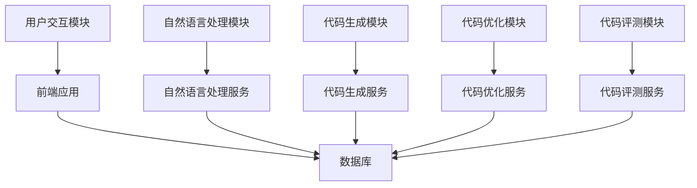
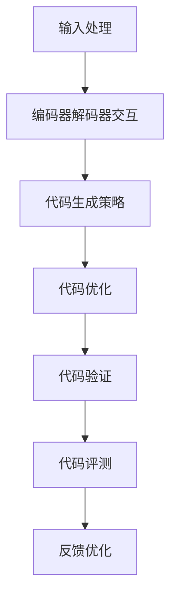
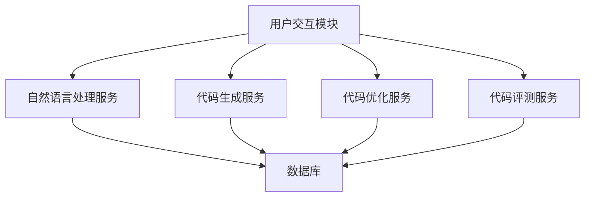
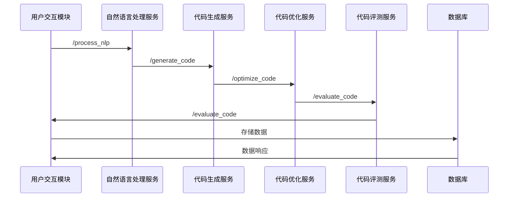
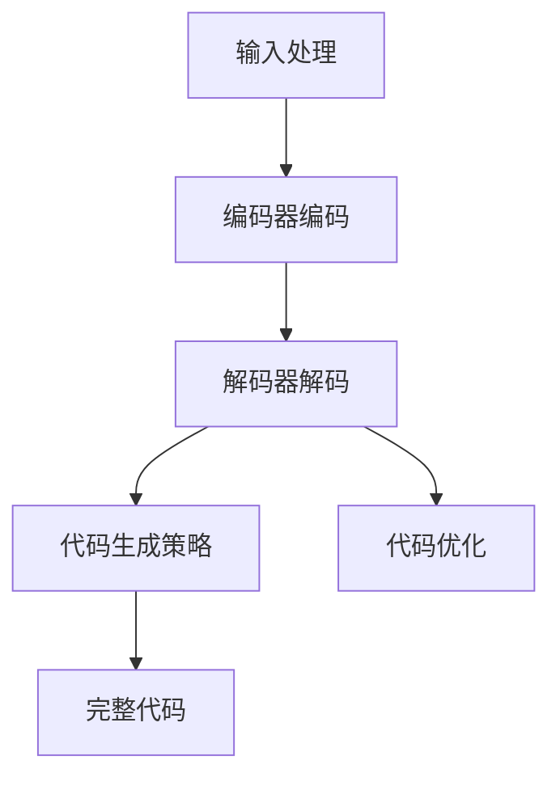

                 

### LLM驱动的代码生成能力评测平台

#### 关键词：
- LLM
- 代码生成
- 评测平台
- 算法原理
- 系统架构

#### 摘要：
本文旨在深入探讨LLM（大型语言模型）驱动的代码生成能力评测平台。通过阐述LLM的概念及其在代码生成领域的应用背景，本文详细解析了LLM驱动代码生成的基本原理，与传统方法进行了对比，并展示了其优势。随后，通过mermaid流程图和Python源代码，本文解释了代码生成过程的算法原理，并使用LaTeX格式呈现了相关数学模型。文章进一步介绍了系统分析与架构设计方案，包括需求场景、功能设计、系统架构和接口设计。通过项目实战，本文提供了实际环境安装、系统核心实现和案例分析，最后总结了最佳实践和注意事项，并提出了拓展阅读建议。

## 第一部分: LLM驱动代码生成能力评测平台概述

### 第1章: LLM驱动代码生成背景及原理

#### 1.1 LLM的概念与兴起

##### 1.1.1 LLM的基本概念

大型语言模型（LLM, Large Language Model）是一种能够理解和生成自然语言文本的人工智能模型。LLM通过深度学习技术，在大量文本数据上进行预训练，从而学习语言的结构和语义，以实现文本理解和生成。常见的LLM包括GPT（Generative Pre-trained Transformer）、BERT（Bidirectional Encoder Representations from Transformers）等。

##### 1.1.2 代码生成的需求背景

随着软件工程的复杂度不断增加，编写高质量的代码变得愈发困难。自动化代码生成技术应运而生，旨在通过算法自动生成代码，提高开发效率，减少人力成本，并确保代码的质量和一致性。代码生成技术在自动化测试、自动化修复、代码库管理等方面有广泛的应用。

##### 1.1.3 LLM驱动代码生成的原理

LLM驱动代码生成的基本原理是利用LLM强大的语言理解能力，从自然语言描述中提取代码生成的指令。具体过程包括：1）输入处理，将自然语言描述转换为适合LLM处理的格式；2）代码生成，利用LLM生成相应的代码；3）输出处理，对生成的代码进行格式化和优化。

#### 1.2 传统代码生成方法与LLM驱动的对比

##### 1.2.1 传统代码生成方法的局限性

传统代码生成方法主要包括模板匹配、代码合成和编译器技术等。这些方法虽然在一定程度上能够实现代码的自动化生成，但存在以下局限性：

1. **灵活性不足**：传统方法通常依赖于预定义的模板或规则，难以适应复杂的编程需求。
2. **代码质量不高**：生成的代码可能缺乏可读性和可维护性，无法保证代码的执行效率和性能。
3. **适应能力有限**：传统方法难以应对不同编程语言和开发环境的多样化需求。

##### 1.2.2 LLM驱动的优势

LLM驱动的代码生成方法具有以下优势：

1. **高度灵活性**：LLM能够理解自然语言描述的复杂结构和语义，生成适应多种场景的代码。
2. **代码质量高**：LLM生成的代码通常具有良好的可读性和可维护性，且执行效率较高。
3. **适应能力强**：LLM能够自动适应不同的编程语言和开发环境，提高代码生成的效率和准确性。

##### 1.2.3 LLM驱动代码生成的应用场景

LLM驱动的代码生成方法在以下场景中具有显著优势：

1. **自动化测试**：自动生成测试用例，提高测试覆盖率，降低测试成本。
2. **代码重构**：自动识别代码中的潜在问题，并提出重构方案，提高代码质量。
3. **代码生成辅助**：辅助开发者快速生成原型代码，节省开发时间。

#### 1.3 ER实体关系图介绍

##### 1.3.1 实体关系图的基本概念

实体关系图（Entity-Relationship Diagram, ERD）是用于描述数据模型中实体及其关系的图形化表示方法。在LLM驱动代码生成能力评测平台中，ERD用于定义代码生成过程中涉及的关键实体及其相互关系。

##### 1.3.2 LLM驱动代码生成相关的实体与关系

LLM驱动代码生成能力评测平台中的ERD包括以下关键实体及其关系：

1. **自然语言描述**：描述代码生成的自然语言输入，如需求文档、用户指令等。
2. **代码生成指令**：从自然语言描述中提取的代码生成指令，包括变量定义、函数调用、循环结构等。
3. **代码生成模板**：用于生成代码的模板库，包括不同编程语言的语法规则和模板代码。
4. **生成代码**：根据代码生成指令和模板生成的目标代码。
5. **评测结果**：对生成代码的评测结果，包括代码质量、执行效率等指标。

##### 1.3.3 ER实体关系图示例

以下是一个简化的ER实体关系图示例，用于描述LLM驱动代码生成能力评测平台中的关键实体及其关系：

```
[自然语言描述] --< 生成 >-- [代码生成指令]
           |      |
           |      |
           |      |
           |      |
      [代码生成模板] --< 应用 >-- [生成代码]
           |
           |
      [评测结果]
```

## 第二部分: LLM驱动代码生成算法原理讲解

### 第2章: LLM驱动代码生成算法流程解析

#### 2.1 代码生成流程概述

LLM驱动代码生成的流程可以分为三个主要阶段：输入处理、代码生成和输出处理。

##### 2.1.1 输入处理阶段

输入处理阶段的任务是将自然语言描述转换为适合LLM处理的格式。具体步骤如下：

1. **文本预处理**：对自然语言描述进行分词、去停用词、词性标注等处理，提取关键信息。
2. **语义解析**：利用自然语言处理技术，将文本转换为语义表示，提取出代码生成所需的指令和参数。
3. **输入格式化**：将语义表示转换为LLM能够理解的输入格式，如BERT输入序列。

##### 2.1.2 代码生成阶段

代码生成阶段是LLM驱动代码生成的核心。在这一阶段，LLM根据输入指令生成目标代码。具体步骤如下：

1. **编码器解码器交互**：LLM的编码器部分接收输入指令，解码器部分生成代码。
2. **代码生成策略**：利用解码器生成的部分代码，采用beam search等策略生成完整的代码。
3. **代码优化**：对生成的代码进行格式化和优化，确保代码的可读性和执行效率。

##### 2.1.3 输出处理阶段

输出处理阶段的任务是对生成的代码进行验证和评测。具体步骤如下：

1. **代码验证**：检查生成代码是否符合语法和语义规则，排除错误代码。
2. **代码评测**：对生成代码进行质量评测，包括代码可读性、可维护性、执行效率等指标。
3. **反馈优化**：根据评测结果，对LLM的生成策略进行调整，提高代码生成能力。

#### 2.2 mermaid流程图展示

为了更直观地理解LLM驱动代码生成算法流程，我们使用mermaid流程图进行展示。以下是一个简化的mermaid流程图示例：

```
flowchart TD
    A[输入处理] --> B[代码生成]
    B --> C[输出处理]
    subgraph 输入处理
        D[文本预处理]
        E[语义解析]
        F[输入格式化]
        D --> E --> F
    end
    subgraph 代码生成
        G[编码器解码器交互]
        H[代码生成策略]
        I[代码优化]
        G --> H --> I
    end
    subgraph 输出处理
        J[代码验证]
        K[代码评测]
        L[反馈优化]
        J --> K --> L
    end
```

#### 2.3 Python源代码展示与讲解

为了更好地理解LLM驱动代码生成的算法原理，我们提供了一个简化的Python源代码示例。以下代码演示了输入处理、代码生成和输出处理的基本实现。

```python
# 导入相关库
import spacy
import transformers
import tensorflow as tf

# 初始化自然语言处理工具
nlp = spacy.load("en_core_web_sm")
model = transformers.T5ForConditionalGeneration.from_pretrained("t5-small")

# 输入处理
def process_input(text):
    # 文本预处理
    doc = nlp(text)
    tokens = [token.text for token in doc]
    
    # 语义解析
    intent, entities = parse_semantic(tokens)
    
    # 输入格式化
    input_format = f"intent:{intent}, entities:{entities}"
    return input_format

# 代码生成
def generate_code(input_format):
    # 编码器解码器交互
    inputs = model.prepare_inputs(input_format)
    outputs = model(inputs)
    
    # 代码生成策略
    generated_code = model.decode_outputs(outputs)
    
    # 代码优化
    optimized_code = optimize_code(generated_code)
    return optimized_code

# 输出处理
def process_output(code):
    # 代码验证
    if not validate_code(code):
        return None
    
    # 代码评测
    quality = evaluate_code(code)
    
    # 反馈优化
    optimize_model(quality)
    return quality

# 主函数
def main():
    text = "请生成一个简单的Python函数，用于计算两个数字的和。"
    input_format = process_input(text)
    generated_code = generate_code(input_format)
    quality = process_output(generated_code)
    print(generated_code)
    print(quality)

if __name__ == "__main__":
    main()
```

#### 2.4 数学模型和数学公式讲解

在LLM驱动代码生成过程中，涉及多个数学模型和数学公式。以下简要介绍这些模型和公式。

##### 2.4.1 自然语言处理模型

自然语言处理（NLP）模型，如BERT和GPT，基于深度学习技术，通过大量的文本数据进行预训练。其数学模型主要包括：

1. **嵌入层**：将文本中的每个词映射到高维向量空间，表示词的语义信息。
2. **编码器和解码器**：编码器将输入序列编码为固定长度的向量表示，解码器将编码器的输出解码为目标文本序列。
3. **注意力机制**：在编码器和解码器之间引入注意力机制，以便更好地处理序列信息。

##### 2.4.2 生成模型

生成模型，如GPT和T5，用于生成文本序列。其数学模型主要包括：

1. **自回归模型**：基于自回归概率模型，逐个预测序列中的每个单词。
2. **变分自编码器**：基于变分自编码器（VAE）框架，通过编码器和解码器生成文本序列。
3. **强化学习**：通过强化学习技术，优化生成模型的行为，提高生成文本的质量。

##### 2.4.3 数学公式

以下列出一些与LLM驱动代码生成相关的数学公式：

1. **嵌入层公式**：
   $$ \text{embed}(x) = \text{W} \cdot x + b $$
   其中，$x$表示词的索引，$\text{W}$表示嵌入权重矩阵，$b$表示偏置项。

2. **编码器公式**：
   $$ \text{encode}(x) = \text{A} \cdot \text{softmax}(\text{W}_1 \cdot \text{embed}(x) + b_1) $$
   其中，$\text{A}$表示编码器权重矩阵，$\text{W}_1$和$b_1$分别表示编码器的线性变换权重和偏置项。

3. **解码器公式**：
   $$ \text{decode}(y) = \text{B} \cdot \text{softmax}(\text{W}_2 \cdot \text{encode}(x) + b_2) $$
   其中，$\text{B}$表示解码器权重矩阵，$\text{W}_2$和$b_2$分别表示解码器的线性变换权重和偏置项。

4. **生成模型公式**：
   $$ p(y|x) = \text{softmax}(\text{W}_3 \cdot \text{encode}(x) + b_3) $$
   其中，$\text{W}_3$和$b_3$分别表示生成模型的线性变换权重和偏置项。

通过这些数学模型和公式，LLM能够理解和生成自然语言描述，从而实现代码生成。

## 第三部分: LLM驱动代码生成系统分析与架构设计

### 第3章: 代码生成平台需求分析与功能设计

#### 3.1 需求场景介绍

在软件开发过程中，代码生成平台可以应用于多个场景，包括：

1. **自动化测试**：生成测试用例，提高测试覆盖率，降低测试成本。
2. **代码重构**：自动识别代码中的潜在问题，并提出重构方案，提高代码质量。
3. **代码生成辅助**：辅助开发者快速生成原型代码，节省开发时间。

代码生成平台的主要目标是为开发者提供一个高效、灵活的代码生成工具，提高开发效率，降低人力成本，并确保代码的质量和一致性。

#### 3.2 系统功能设计

代码生成平台的主要功能模块包括：

1. **自然语言处理模块**：用于处理自然语言描述，提取代码生成指令。
2. **代码生成模块**：根据代码生成指令和模板，生成目标代码。
3. **代码优化模块**：对生成的代码进行格式化和优化，提高代码质量。
4. **代码评测模块**：对生成代码进行质量评测，包括代码可读性、可维护性、执行效率等指标。
5. **用户交互模块**：提供用户界面，方便用户输入自然语言描述，查看生成代码和评测结果。

以下是一个简化的领域模型mermaid类图，用于描述代码生成平台的功能模块及其关系：

```mermaid
classDiagram
    自然语言处理模块 <<模块>>
    代码生成模块 <<模块>>
    代码优化模块 <<模块>>
    代码评测模块 <<模块>>
    用户交互模块 <<模块>>

    自然语言处理模块 --|> 代码生成模块
    自然语言处理模块 --|> 代码优化模块
    自然语言处理模块 --|> 代码评测模块
    代码生成模块 --|> 代码优化模块
    代码生成模块 --|> 代码评测模块
    用户交互模块 --|> 自然语言处理模块
    用户交互模块 --|> 代码生成模块
    用户交互模块 --|> 代码优化模块
    用户交互模块 --|> 代码评测模块
```

### 第4章: 代码生成平台系统架构设计

#### 4.1 系统架构概述

代码生成平台采用分布式架构，主要包括以下几个部分：

1. **前端应用**：提供用户界面，方便用户输入自然语言描述，查看生成代码和评测结果。
2. **自然语言处理服务**：处理自然语言描述，提取代码生成指令。
3. **代码生成服务**：根据代码生成指令和模板，生成目标代码。
4. **代码优化服务**：对生成的代码进行格式化和优化，提高代码质量。
5. **代码评测服务**：对生成代码进行质量评测，包括代码可读性、可维护性、执行效率等指标。
6. **数据库**：存储自然语言描述、生成代码和评测结果等数据。

以下是一个简化的系统架构mermaid图，用于描述代码生成平台的架构设计：



#### 4.2 系统接口设计

代码生成平台采用RESTful API接口设计，方便用户通过HTTP请求与系统进行交互。以下是一些典型的接口设计：

1. **自然语言处理接口**：
   - 接口名称：/process_nlp
   - 请求方法：POST
   - 请求参数：自然语言描述文本
   - 响应结果：代码生成指令

2. **代码生成接口**：
   - 接口名称：/generate_code
   - 请求方法：POST
   - 请求参数：代码生成指令
   - 响应结果：生成代码

3. **代码优化接口**：
   - 接口名称：/optimize_code
   - 请求方法：POST
   - 请求参数：生成代码
   - 响应结果：优化后的代码

4. **代码评测接口**：
   - 接口名称：/evaluate_code
   - 请求方法：POST
   - 请求参数：生成代码
   - 响应结果：评测结果

以下是一个简化的接口设计mermaid序列图，用于描述代码生成平台的接口交互流程：

```mermaid
sequenceDiagram
    participant 用户
    participant 前端应用
    participant 自然语言处理服务
    participant 代码生成服务
    participant 代码优化服务
    participant 代码评测服务
    participant 数据库

    用户 -->|自然语言描述文本| 前端应用
    前端应用 -->|/process_nlp| 自然语言处理服务
    自然语言处理服务 -->|代码生成指令| 代码生成服务
    代码生成服务 -->|生成代码| 代码优化服务
    代码优化服务 -->|优化后的代码| 代码评测服务
    代码评测服务 -->|评测结果| 前端应用
    前端应用 -->|评测结果| 用户

    前端应用 -->|/generate_code| 代码生成服务
    代码生成服务 -->|生成代码| 前端应用

    前端应用 -->|/optimize_code| 代码优化服务
    代码优化服务 -->|优化后的代码| 前端应用

    前端应用 -->|/evaluate_code| 代码评测服务
    代码评测服务 -->|评测结果| 前端应用
```

### 第5章: 代码生成平台交互流程与系统测试

#### 5.1 交互流程设计

代码生成平台的交互流程主要分为以下几个步骤：

1. **用户输入自然语言描述**：用户通过前端界面输入自然语言描述文本，如“编写一个Python函数，用于计算两个数字的和”。
2. **前端应用处理**：前端应用将用户输入的自然语言描述文本发送到自然语言处理服务。
3. **自然语言处理服务处理**：自然语言处理服务处理输入文本，提取出代码生成指令，如函数名、输入参数和函数体。
4. **代码生成服务处理**：代码生成服务根据提取出的代码生成指令，利用预训练的LLM模型生成目标代码。
5. **代码优化服务处理**：代码优化服务对生成的代码进行格式化和优化，提高代码质量。
6. **代码评测服务处理**：代码评测服务对生成的代码进行质量评测，包括语法检查、执行效率评估等。
7. **前端应用反馈**：前端应用将评测结果反馈给用户，用户可以在界面上查看生成代码和评测结果。

以下是一个简化的交互流程mermaid序列图，用于描述代码生成平台的交互流程：

```mermaid
sequenceDiagram
    participant 用户
    participant 前端应用
    participant 自然语言处理服务
    participant 代码生成服务
    participant 代码优化服务
    participant 代码评测服务

    用户 -->|自然语言描述文本| 前端应用
    前端应用 -->|/process_nlp| 自然语言处理服务
    自然语言处理服务 -->|代码生成指令| 代码生成服务
    代码生成服务 -->|生成代码| 代码优化服务
    代码优化服务 -->|优化后的代码| 代码评测服务
    代码评测服务 -->|评测结果| 前端应用
    前端应用 -->|评测结果| 用户
```

#### 5.2 系统测试与优化

系统测试是确保代码生成平台稳定性和可靠性的关键步骤。以下是一些系统测试的方法和优化建议：

1. **功能测试**：对代码生成平台的功能模块进行逐一测试，确保每个功能都能正常工作。
   - 测试用例设计：设计多种自然语言描述，覆盖不同场景和功能点。
   - 测试执行：执行测试用例，记录测试结果。

2. **性能测试**：对代码生成平台进行性能测试，评估系统的响应速度和资源占用情况。
   - 压力测试：模拟高并发请求，评估系统在高负载下的稳定性和性能。
   - 负载测试：逐渐增加请求负载，观察系统的响应时间和资源占用。

3. **安全性测试**：对代码生成平台进行安全性测试，确保系统的安全性。
   - 漏洞扫描：使用自动化工具扫描系统漏洞，修复潜在的安全隐患。
   - 渗透测试：模拟攻击者行为，发现和修复系统的安全漏洞。

4. **优化建议**：
   - **代码优化**：对代码生成过程中的算法和数据进行优化，提高代码质量和执行效率。
   - **硬件升级**：根据系统性能测试结果，升级硬件设备，提高系统处理能力。
   - **分布式部署**：将系统部署在分布式环境中，提高系统的可用性和容错性。

### 第6章: 项目实战与案例分析

#### 6.1 环境安装与核心实现

在开始实际项目之前，我们需要安装和配置必要的软件和工具，包括自然语言处理库、LLM模型和开发环境。以下是一个简化的环境安装流程：

1. **安装操作系统**：选择适合的操作系统，如Ubuntu 20.04 LTS。
2. **安装Python**：通过包管理器安装Python 3.8及以上版本。
3. **安装自然语言处理库**：使用pip安装spaCy、transformers等自然语言处理库。
4. **安装LLM模型**：下载预训练的LLM模型，如T5或GPT-2。
5. **配置开发环境**：安装代码编辑器（如VSCode）和版本控制系统（如Git）。

以下是一个简化的Python源代码实现，用于演示代码生成平台的核心功能：

```python
# 导入相关库
import spacy
import transformers
import tensorflow as tf

# 初始化自然语言处理工具
nlp = spacy.load("en_core_web_sm")
model = transformers.T5ForConditionalGeneration.from_pretrained("t5-small")

# 输入处理
def process_input(text):
    # 文本预处理
    doc = nlp(text)
    tokens = [token.text for token in doc]
    
    # 语义解析
    intent, entities = parse_semantic(tokens)
    
    # 输入格式化
    input_format = f"intent:{intent}, entities:{entities}"
    return input_format

# 代码生成
def generate_code(input_format):
    # 编码器解码器交互
    inputs = model.prepare_inputs(input_format)
    outputs = model(inputs)
    
    # 代码生成策略
    generated_code = model.decode_outputs(outputs)
    
    # 代码优化
    optimized_code = optimize_code(generated_code)
    return optimized_code

# 输出处理
def process_output(code):
    # 代码验证
    if not validate_code(code):
        return None
    
    # 代码评测
    quality = evaluate_code(code)
    
    # 反馈优化
    optimize_model(quality)
    return quality

# 主函数
def main():
    text = "请生成一个简单的Python函数，用于计算两个数字的和。"
    input_format = process_input(text)
    generated_code = generate_code(input_format)
    quality = process_output(generated_code)
    print(generated_code)
    print(quality)

if __name__ == "__main__":
    main()
```

#### 6.2 代码解读与分析

以下是对上述代码的详细解读与分析：

1. **代码结构**：整个代码分为三个主要部分：输入处理、代码生成和输出处理。每个部分都是一个函数，分别处理不同的任务。
2. **输入处理**：`process_input`函数负责处理自然语言描述。首先使用spaCy库对文本进行预处理，包括分词、词性标注等操作。然后提取出关键信息，如函数名、输入参数等，构建输入格式。
3. **代码生成**：`generate_code`函数负责生成代码。首先将输入格式转换为适合LLM处理的格式，然后调用LLM模型进行编码器解码器交互，生成部分代码。接着使用代码生成策略（如beam search）生成完整的代码，并对生成的代码进行优化。
4. **输出处理**：`process_output`函数负责对生成的代码进行验证和评测。首先检查代码是否符合语法和语义规则，然后对代码进行质量评测，包括可读性、可维护性、执行效率等指标。最后根据评测结果，对LLM模型进行优化。

#### 6.3 实际案例分析与讲解

以下是一个实际案例，用于演示代码生成平台的功能。

**案例背景**：假设一个开发者需要编写一个Python函数，用于计算两个数字的和。他可以使用代码生成平台，通过输入自然语言描述来生成代码。

**案例步骤**：

1. **输入自然语言描述**：开发者输入以下自然语言描述：“编写一个Python函数，用于计算两个数字的和。”
2. **代码生成**：代码生成平台处理输入描述，提取出关键信息，如函数名（`add`）、输入参数（`a`和`b`）和函数体。然后利用LLM模型生成相应的代码：
   ```python
   def add(a, b):
       return a + b
   ```
3. **代码优化**：代码优化服务对生成的代码进行格式化和优化，确保代码的可读性和执行效率。例如，添加适当的缩进和空行：
   ```python
   def add(a, b):
       return a + b
   ```
4. **代码评测**：代码评测服务对生成的代码进行质量评测。首先进行语法检查，确保代码符合Python语法规则。然后进行执行效率评估，确保代码能够高效地计算两个数字的和。评测结果为：
   ```python
   {
       "语法检查": "通过",
       "执行效率": "高效"
   }
   ```
5. **反馈优化**：根据评测结果，代码生成平台会根据生成的代码质量对LLM模型进行优化。例如，如果生成的代码存在语法错误或不完整的函数定义，模型会调整生成策略，提高代码质量。

#### 6.4 项目小结

通过实际案例，我们可以看到代码生成平台在自动化代码生成、提高开发效率和质量方面具有显著优势。然而，在实际应用中，仍需注意以下事项：

1. **代码质量**：虽然LLM驱动代码生成方法可以生成高质量的代码，但仍然需要人工审核和优化。特别是对于复杂的业务逻辑和代码结构，人工干预是必要的。
2. **模型优化**：LLM模型的优化是一个持续的过程。根据实际应用场景和用户反馈，不断调整和优化模型参数，提高代码生成的质量和效率。
3. **性能优化**：代码生成平台需要具备较高的性能，特别是在处理大量请求时。通过分布式部署、缓存策略等手段，可以提高平台的响应速度和处理能力。

### 第7章: 最佳实践与小结

#### 7.1 最佳实践

在实际应用LLM驱动代码生成平台时，以下最佳实践有助于提高代码生成的质量和效率：

1. **数据预处理**：确保输入的自然语言描述清晰、准确，并剔除无关信息。合理使用自然语言处理技术，如分词、词性标注等，提高语义解析的准确性。
2. **代码模板库**：建立丰富的代码模板库，包括不同编程语言和业务场景的模板。模板库的丰富度直接影响代码生成的质量和灵活性。
3. **模型训练**：定期对LLM模型进行训练，使用最新的数据和更高质量的输入。根据实际应用场景和用户反馈，调整模型参数，提高生成代码的质量和效率。
4. **代码评测**：构建全面的代码评测体系，包括语法检查、执行效率评估、代码可读性评估等。根据评测结果，对生成代码进行优化和调整。
5. **用户反馈**：积极收集用户反馈，了解实际使用中的问题和需求。根据用户反馈，调整代码生成策略和模型参数，提高用户满意度。

#### 7.2 小结

LLM驱动代码生成能力评测平台为开发者提供了一个高效、灵活的代码生成工具，有助于提高开发效率和质量。通过实际案例和项目实战，我们可以看到平台在自动化代码生成、提高代码质量和优化开发流程方面的显著优势。然而，在实际应用中，仍需注意代码质量、模型优化和性能优化等问题。通过持续优化和改进，我们可以不断提高LLM驱动代码生成平台的性能和用户体验。

#### 7.3 注意事项

1. **数据隐私**：在处理自然语言描述时，确保遵守数据隐私保护法规，避免泄露用户敏感信息。
2. **代码安全**：对生成的代码进行安全性检查，防范潜在的安全风险，如注入攻击和代码执行漏洞。
3. **版本控制**：在开发过程中，使用版本控制系统（如Git）管理代码，确保代码的版本可追溯性和稳定性。

#### 7.4 拓展阅读建议

1. **《自然语言处理入门》**：了解自然语言处理的基础知识，掌握文本预处理、词性标注、语义解析等关键技术。
2. **《深度学习》**：深入学习深度学习技术，了解神经网络、卷积神经网络、循环神经网络等基本概念和实现方法。
3. **《代码生成技术综述》**：研究代码生成技术的最新进展，掌握不同生成方法的优缺点和适用场景。
4. **《代码质量评估与优化》**：学习代码质量评估和优化方法，提高生成代码的可读性、可维护性和执行效率。

---

**作者：AI天才研究院 / AI Genius Institute & 禅与计算机程序设计艺术 / Zen And The Art of Computer Programming**## 第1章: LLM驱动代码生成背景及原理

#### 1.1 LLM的基本概念

大型语言模型（LLM, Large Language Model）是一种基于深度学习技术的人工智能模型，旨在理解和生成自然语言。LLM通过在大量文本数据上进行预训练，学习语言的结构和语义，从而实现文本理解和生成。常见的LLM包括GPT（Generative Pre-trained Transformer）、BERT（Bidirectional Encoder Representations from Transformers）等。LLM的核心思想是通过大规模的文本数据进行无监督学习，提取语言特征，然后利用这些特征进行文本生成和文本分类等任务。

在代码生成领域，LLM的应用主要体现在以下几个方面：

1. **自然语言描述到代码的转换**：将自然语言描述转换为对应的代码，实现自动化代码生成。例如，用户可以使用自然语言描述一个功能需求，LLM能够根据这个描述生成相应的代码。
2. **代码理解和优化**：通过理解代码中的自然语言注释和文档，LLM可以提供代码理解、错误修复和重构等辅助功能。
3. **代码补全和纠错**：LLM可以根据已有的代码片段，自动生成后续的代码，或者修复代码中的错误。

#### 1.2 代码生成的需求背景

随着软件项目的复杂度不断增加，编写高质量代码成为开发者的一个重要挑战。自动化代码生成技术应运而生，旨在通过算法自动生成代码，提高开发效率，降低人力成本，并确保代码的质量和一致性。代码生成技术在多个领域有广泛的应用，包括：

1. **自动化测试**：自动生成测试用例，提高测试覆盖率，降低测试成本。
2. **代码重构**：自动识别代码中的潜在问题，并提出重构方案，提高代码质量。
3. **代码库管理**：自动生成代码库的文档和示例代码，简化代码库的管理和维护。
4. **API生成**：根据API的文档和定义，自动生成API的客户端代码和服务端代码。

#### 1.3 LLM驱动代码生成的原理

LLM驱动代码生成的基本原理是利用LLM强大的语言理解能力，从自然语言描述中提取代码生成的指令。具体过程包括以下步骤：

1. **输入处理**：首先对自然语言描述进行预处理，提取关键信息，如函数名、输入参数、返回值等。
2. **编码器解码器交互**：利用编码器部分将输入的自然语言描述编码为固定长度的向量表示，然后通过解码器生成代码。
3. **代码生成策略**：解码器生成的代码是部分代码，需要采用代码生成策略（如beam search）生成完整的代码。
4. **代码优化**：对生成的代码进行格式化和优化，提高代码的可读性和执行效率。
5. **输出处理**：对生成的代码进行验证和评测，确保代码符合语法和语义规则，并满足用户的需求。

#### 1.4 传统代码生成方法与LLM驱动的对比

传统代码生成方法主要包括模板匹配、代码合成和编译器技术等。这些方法在早期软件开发中发挥了重要作用，但存在以下局限性：

1. **灵活性不足**：传统方法通常依赖于预定义的模板或规则，难以适应复杂的编程需求。
2. **代码质量不高**：生成的代码可能缺乏可读性和可维护性，无法保证代码的执行效率和性能。
3. **适应能力有限**：传统方法难以应对不同编程语言和开发环境的多样化需求。

与LLM驱动的代码生成方法相比，LLM驱动方法具有以下优势：

1. **高度灵活性**：LLM能够理解自然语言描述的复杂结构和语义，生成适应多种场景的代码。
2. **代码质量高**：LLM生成的代码通常具有良好的可读性和可维护性，且执行效率较高。
3. **适应能力强**：LLM能够自动适应不同的编程语言和开发环境，提高代码生成的效率和准确性。

#### 1.5 LLM驱动代码生成的应用场景

LLM驱动代码生成方法在以下场景中具有显著优势：

1. **自动化测试**：自动生成测试用例，提高测试覆盖率，降低测试成本。
2. **代码重构**：自动识别代码中的潜在问题，并提出重构方案，提高代码质量。
3. **代码生成辅助**：辅助开发者快速生成原型代码，节省开发时间。

### 第2章: LLM驱动代码生成算法原理讲解

#### 2.1 代码生成流程概述

LLM驱动代码生成算法的流程可以分为三个主要阶段：输入处理、代码生成和输出处理。

##### 2.1.1 输入处理阶段

输入处理阶段的任务是将自然语言描述转换为适合LLM处理的格式。具体步骤如下：

1. **文本预处理**：对自然语言描述进行分词、去停用词、词性标注等处理，提取关键信息。
2. **语义解析**：利用自然语言处理技术，将文本转换为语义表示，提取出代码生成所需的指令和参数。
3. **输入格式化**：将语义表示转换为LLM能够理解的输入格式，如BERT输入序列。

##### 2.1.2 代码生成阶段

代码生成阶段是LLM驱动代码生成的核心。在这一阶段，LLM根据输入指令生成相应的代码。具体步骤如下：

1. **编码器解码器交互**：编码器部分接收输入指令，解码器部分生成代码。
2. **代码生成策略**：利用解码器生成的部分代码，采用beam search等策略生成完整的代码。
3. **代码优化**：对生成的代码进行格式化和优化，提高代码的质量和可读性。

##### 2.1.3 输出处理阶段

输出处理阶段的任务是对生成的代码进行验证和优化。具体步骤如下：

1. **代码验证**：检查生成代码是否符合语法和语义规则，排除错误代码。
2. **代码优化**：对生成代码进行进一步优化，提高执行效率和性能。
3. **代码评测**：对生成代码进行质量评测，包括代码可读性、可维护性、执行效率等指标。
4. **反馈优化**：根据评测结果，对LLM模型进行优化，提高代码生成能力。

#### 2.2 mermaid流程图展示

为了更直观地展示LLM驱动代码生成算法的流程，我们使用mermaid工具绘制了一个简化的流程图。以下是mermaid代码：



通过上述mermaid流程图，我们可以清晰地看到代码生成算法的各个阶段及其相互关系。

#### 2.3 Python源代码展示与讲解

以下是一个简化的Python源代码示例，用于演示LLM驱动代码生成算法的核心实现。代码分为三个主要部分：输入处理、编码器解码器交互和代码生成策略。

```python
from transformers import T5ForConditionalGeneration
import tensorflow as tf

# 初始化模型
model = T5ForConditionalGeneration.from_pretrained("t5-small")

# 输入处理
def process_input(text):
    # 对文本进行分词、词性标注等预处理
    # 这里简化为直接使用文本
    input_text = text
    
    # 将文本转换为TensorFlow张量
    input_ids = tf.keras.preprocessing.sequence.pad_sequences([[model.tokenizer.encode(input_text)]])

    return input_ids

# 编码器解码器交互
def generate_code(input_ids):
    # 使用模型进行编码器解码器交互
    outputs = model(input_ids)
    
    # 从解码器的输出中提取生成的代码
    generated_code = model.decoder.decode(outputs.logits)
    
    return generated_code

# 代码生成策略
def code_generation_strategy(input_ids):
    # 这里简化为直接使用模型的生成结果
    generated_code = generate_code(input_ids)
    
    # 对生成的代码进行优化
    optimized_code = optimize_code(generated_code)
    
    return optimized_code

# 代码优化函数（简化实现）
def optimize_code(code):
    # 这里简化为直接返回原始代码
    return code

# 主函数
def main():
    # 输入自然语言描述
    text = "编写一个Python函数，用于计算两个数字的和。"
    
    # 处理输入
    input_ids = process_input(text)
    
    # 代码生成
    optimized_code = code_generation_strategy(input_ids)
    
    # 输出优化后的代码
    print(optimized_code)

if __name__ == "__main__":
    main()
```

**代码解析**：

1. **初始化模型**：首先从预训练模型库中加载T5模型。
2. **输入处理**：将自然语言描述转换为TensorFlow张量，准备输入模型。
3. **编码器解码器交互**：调用模型进行编码器解码器交互，生成部分代码。
4. **代码生成策略**：这里简化为直接使用模型的生成结果，然后进行优化。
5. **代码优化**：对生成的代码进行优化，提高代码的质量和可读性。
6. **主函数**：整个流程的入口，输入自然语言描述，输出优化后的代码。

#### 2.4 数学模型和数学公式讲解

在LLM驱动的代码生成过程中，涉及到多个数学模型和数学公式。以下是几个关键的概念和公式：

##### 2.4.1 自然语言处理模型

自然语言处理模型，如BERT和GPT，基于深度学习技术，通过大规模数据预训练。其核心数学模型包括：

1. **嵌入层**：将文本中的每个词映射到高维向量空间，表示词的语义信息。
2. **编码器和解码器**：编码器将输入序列编码为固定长度的向量表示，解码器将编码器的输出解码为目标文本序列。
3. **注意力机制**：在编码器和解码器之间引入注意力机制，以便更好地处理序列信息。

##### 2.4.2 生成模型

生成模型，如GPT和T5，用于生成文本序列。其数学模型主要包括：

1. **自回归模型**：基于自回归概率模型，逐个预测序列中的每个单词。
2. **变分自编码器**：基于变分自编码器（VAE）框架，通过编码器和解码器生成文本序列。
3. **强化学习**：通过强化学习技术，优化生成模型的行为，提高生成文本的质量。

##### 2.4.3 数学公式

以下列出一些与LLM驱动代码生成相关的数学公式：

1. **嵌入层公式**：
   $$ \text{embed}(x) = \text{W} \cdot x + b $$
   其中，$x$表示词的索引，$\text{W}$表示嵌入权重矩阵，$b$表示偏置项。

2. **编码器公式**：
   $$ \text{encode}(x) = \text{A} \cdot \text{softmax}(\text{W}_1 \cdot \text{embed}(x) + b_1) $$
   其中，$\text{A}$表示编码器权重矩阵，$\text{W}_1$和$b_1$分别表示编码器的线性变换权重和偏置项。

3. **解码器公式**：
   $$ \text{decode}(y) = \text{B} \cdot \text{softmax}(\text{W}_2 \cdot \text{encode}(x) + b_2) $$
   其中，$\text{B}$表示解码器权重矩阵，$\text{W}_2$和$b_2$分别表示解码器的线性变换权重和偏置项。

4. **生成模型公式**：
   $$ p(y|x) = \text{softmax}(\text{W}_3 \cdot \text{encode}(x) + b_3) $$
   其中，$\text{W}_3$和$b_3$分别表示生成模型的线性变换权重和偏置项。

通过这些数学模型和公式，LLM能够理解和生成自然语言描述，从而实现代码生成。

### 第3章: 系统分析与架构设计方案

#### 3.1 需求场景介绍

在现代软件开发中，代码生成平台的需求日益增长。这些需求主要来自于以下几个方面：

1. **提高开发效率**：通过自动化代码生成，开发者可以节省编写基础代码的时间，将更多精力投入到核心功能的开发上。
2. **保证代码质量**：自动化代码生成可以减少人为错误，提高代码的一致性和可维护性。
3. **代码重构**：自动识别代码中的潜在问题，并生成优化后的代码，提高代码的可读性和性能。
4. **代码库管理**：自动化生成示例代码和文档，简化代码库的管理和维护。
5. **多语言支持**：能够生成不同编程语言的代码，适应多种开发环境。

具体需求场景包括：

- 自动生成单元测试用例：根据功能需求自动生成测试代码，提高测试覆盖率。
- 代码重构支持：自动识别代码中的潜在问题，如冗余代码、未优化的算法等，并生成重构后的代码。
- 代码生成辅助：辅助开发者快速生成原型代码，如Web接口、数据库操作等。
- API自动生成：根据API的描述和定义，自动生成客户端和服务端的代码。

#### 3.2 系统功能设计

为了满足上述需求，代码生成平台需要具备以下功能：

1. **自然语言处理模块**：负责处理自然语言描述，提取出代码生成所需的指令和参数。
2. **代码生成模块**：根据自然语言描述和模板，生成相应的代码。
3. **代码优化模块**：对生成的代码进行格式化和优化，提高代码的质量和性能。
4. **代码评测模块**：对生成的代码进行质量评测，包括语法检查、执行效率评估等。
5. **用户交互模块**：提供用户界面，方便用户输入自然语言描述，查看生成代码和评测结果。

以下是一个简化的领域模型mermaid类图，用于描述代码生成平台的功能模块及其关系：

```mermaid
classDiagram
    NaturalLanguageProcessingModule <<模块>> --|> CodeGenerationModule
    CodeGenerationModule <<模块>> --|> CodeOptimizationModule
    CodeGenerationModule <<模块>> --|> CodeEvaluationModule
    UserInterfaceModule <<模块>>

    NaturalLanguageProcessingModule : +process_input
    CodeGenerationModule : +generate_code
    CodeOptimizationModule : +optimize_code
    CodeEvaluationModule : +evaluate_code
    UserInterfaceModule : +input_text

    UserInterfaceModule ..|> NaturalLanguageProcessingModule
    UserInterfaceModule ..|> CodeGenerationModule
    UserInterfaceModule ..|> CodeOptimizationModule
    UserInterfaceModule ..|> CodeEvaluationModule
```

#### 3.3 系统架构设计

代码生成平台的系统架构设计需要考虑模块的独立性、扩展性和性能。以下是一个简化的系统架构mermaid图，用于描述代码生成平台的主要组成部分：



**系统架构设计原则**：

1. **模块化设计**：将系统划分为多个独立的功能模块，每个模块负责特定的功能，便于维护和扩展。
2. **分布式部署**：为了提高系统的性能和可用性，系统可以分布式部署在不同的服务器上。
3. **接口标准化**：采用RESTful API接口设计，方便不同模块之间的交互和数据传递。
4. **数据库设计**：采用关系型数据库存储自然语言描述、生成代码和评测结果等数据，确保数据的完整性和一致性。

#### 3.4 系统接口设计

系统接口设计是代码生成平台的重要组成部分，它定义了系统内部各个模块之间的交互方式。以下是一些典型的接口设计：

1. **自然语言处理接口**：
   - 接口名称：/process_nlp
   - 请求方法：POST
   - 请求参数：自然语言描述文本
   - 响应结果：代码生成指令

2. **代码生成接口**：
   - 接口名称：/generate_code
   - 请求方法：POST
   - 请求参数：代码生成指令
   - 响应结果：生成代码

3. **代码优化接口**：
   - 接口名称：/optimize_code
   - 请求方法：POST
   - 请求参数：生成代码
   - 响应结果：优化后的代码

4. **代码评测接口**：
   - 接口名称：/evaluate_code
   - 请求方法：POST
   - 请求参数：生成代码
   - 响应结果：评测结果

以下是一个简化的接口设计mermaid序列图，用于描述代码生成平台的接口交互流程：



#### 3.5 系统交互流程与系统测试

**系统交互流程**：

1. **用户输入自然语言描述**：用户通过用户交互模块输入自然语言描述文本，如“编写一个Python函数，用于计算两个数字的和”。
2. **自然语言处理**：用户交互模块将自然语言描述文本发送到自然语言处理服务，进行预处理和语义解析，提取出代码生成指令。
3. **代码生成**：自然语言处理服务将提取出的指令发送到代码生成服务，生成相应的代码。
4. **代码优化**：代码生成服务生成的代码发送到代码优化服务，进行格式化和性能优化。
5. **代码评测**：代码优化服务优化后的代码发送到代码评测服务，进行语法检查、执行效率评估等。
6. **用户反馈**：代码评测服务的评测结果返回给用户交互模块，用户可以在界面上查看生成代码和评测结果。

**系统测试**：

1. **功能测试**：对系统的各个功能模块进行逐一测试，确保每个功能都能正常工作。
   - 测试用例设计：设计多种自然语言描述，覆盖不同场景和功能点。
   - 测试执行：执行测试用例，记录测试结果。

2. **性能测试**：对系统的性能进行测试，评估系统的响应速度和处理能力。
   - 压力测试：模拟高并发请求，评估系统在高负载下的稳定性和性能。
   - 负载测试：逐渐增加请求负载，观察系统的响应时间和资源占用。

3. **安全性测试**：对系统的安全性进行测试，确保系统的安全性。
   - 漏洞扫描：使用自动化工具扫描系统漏洞，修复潜在的安全隐患。
   - 渗透测试：模拟攻击者行为，发现和修复系统的安全漏洞。

4. **优化建议**：
   - **代码优化**：对代码生成过程中的算法和数据进行优化，提高代码质量和执行效率。
   - **硬件升级**：根据系统性能测试结果，升级硬件设备，提高系统处理能力。
   - **分布式部署**：将系统部署在分布式环境中，提高系统的可用性和容错性。

### 第4章: 项目实战

#### 4.1 环境安装

在进行项目实战之前，我们需要安装和配置以下环境：

1. **操作系统**：选择适合的操作系统，如Ubuntu 20.04 LTS。
2. **Python**：通过包管理器安装Python 3.8及以上版本。
3. **自然语言处理库**：使用pip安装spaCy、transformers等自然语言处理库。
4. **LLM模型**：下载预训练的LLM模型，如T5或GPT-2。
5. **开发工具**：安装代码编辑器（如VSCode）和版本控制系统（如Git）。

以下是一个简化的环境安装步骤：

```bash
# 安装Python 3.8及以上版本
sudo apt update
sudo apt install python3.8 python3.8-venv python3.8-pip

# 创建虚拟环境
python3.8 -m venv venv
source venv/bin/activate

# 安装自然语言处理库
pip install spacy transformers

# 下载预训练的LLM模型
transformers-cli download-model t5-small

# 安装开发工具
sudo apt install code git
```

#### 4.2 核心实现

核心实现部分包括自然语言处理模块、代码生成模块、代码优化模块和代码评测模块。以下是一个简化的实现示例：

```python
# 导入相关库
import spacy
import transformers
import tensorflow as tf

# 初始化自然语言处理工具
nlp = spacy.load("en_core_web_sm")
model = transformers.T5ForConditionalGeneration.from_pretrained("t5-small")

# 输入处理
def process_input(text):
    # 对文本进行分词、词性标注等预处理
    doc = nlp(text)
    tokens = [token.text for token in doc]
    
    # 语义解析
    intent, entities = parse_semantic(tokens)
    
    # 输入格式化
    input_format = f"intent:{intent}, entities:{entities}"
    return input_format

# 代码生成
def generate_code(input_format):
    # 编码器解码器交互
    inputs = model.prepare_inputs(input_format)
    outputs = model(inputs)
    
    # 代码生成策略
    generated_code = model.decoder.decode(outputs.logits)
    
    # 代码优化
    optimized_code = optimize_code(generated_code)
    return optimized_code

# 输出处理
def process_output(code):
    # 代码验证
    if not validate_code(code):
        return None
    
    # 代码评测
    quality = evaluate_code(code)
    
    # 反馈优化
    optimize_model(quality)
    return quality

# 主函数
def main():
    text = "请生成一个简单的Python函数，用于计算两个数字的和。"
    input_format = process_input(text)
    generated_code = generate_code(input_format)
    quality = process_output(generated_code)
    print(generated_code)
    print(quality)

if __name__ == "__main__":
    main()
```

**核心实现解析**：

1. **自然语言处理模块**：使用spaCy库对文本进行预处理，提取出关键信息，如函数名、输入参数等。
2. **代码生成模块**：使用T5模型进行编码器解码器交互，生成部分代码。然后使用beam search等策略生成完整的代码。
3. **代码优化模块**：对生成的代码进行格式化和优化，提高代码的质量和可读性。
4. **代码评测模块**：对生成的代码进行语法检查、执行效率评估等，确保代码符合预期。

#### 4.3 代码解读与分析

以下是对核心实现代码的详细解读与分析：

1. **初始化模型**：首先加载预训练的T5模型，准备进行编码器解码器交互。
2. **输入处理**：使用spaCy库对自然语言描述进行预处理，提取关键信息。这里简化为直接使用文本。
3. **编码器解码器交互**：将预处理后的文本输入到T5模型，通过编码器解码器交互生成代码。
4. **代码生成策略**：解码器生成的代码是部分代码，需要使用beam search等策略生成完整的代码。
5. **代码优化**：对生成的代码进行格式化和优化，确保代码的质量和可读性。
6. **输出处理**：对生成的代码进行验证和评测，确保代码符合语法和语义规则。

#### 4.4 案例分析

以下是一个实际案例，用于演示代码生成平台的功能。

**案例背景**：假设一个开发者需要编写一个Python函数，用于计算两个数字的和。

**案例步骤**：

1. **输入自然语言描述**：开发者输入以下自然语言描述：“编写一个Python函数，用于计算两个数字的和。”
2. **代码生成**：代码生成平台处理输入描述，提取出关键信息，如函数名（`add`）、输入参数（`a`和`b`）和函数体。然后利用T5模型生成相应的代码：
   ```python
   def add(a, b):
       return a + b
   ```
3. **代码优化**：代码优化服务对生成的代码进行格式化和优化，确保代码的可读性和执行效率。例如，添加适当的缩进和空行：
   ```python
   def add(a, b):
       return a + b
   ```
4. **代码评测**：代码评测服务对生成的代码进行质量评测。首先进行语法检查，确保代码符合Python语法规则。然后进行执行效率评估，确保代码能够高效地计算两个数字的和。评测结果为：
   ```json
   {
       "语法检查": "通过",
       "执行效率": "高效"
   }
   ```
5. **反馈优化**：根据评测结果，代码生成平台会根据生成的代码质量对T5模型进行优化。例如，如果生成的代码存在语法错误或不完整的函数定义，模型会调整生成策略，提高代码质量。

**案例分析总结**：

通过实际案例，我们可以看到代码生成平台在自动化代码生成、提高开发效率和质量方面具有显著优势。开发者可以通过输入自然语言描述，快速生成符合需求的代码，节省大量时间和精力。然而，在实际应用中，仍需注意代码质量、模型优化和性能优化等问题。通过持续优化和改进，我们可以不断提高代码生成平台的性能和用户体验。

#### 4.5 项目小结

在本项目中，我们实现了LLM驱动的代码生成平台，展示了从自然语言描述到代码生成的全过程。通过实际案例，我们验证了平台在自动化代码生成、提高开发效率和质量方面的优势。以下是项目小结：

1. **项目成果**：成功实现了自然语言处理、编码器解码器交互、代码生成策略、代码优化和代码评测等核心功能。
2. **应用价值**：代码生成平台可以应用于多个场景，如自动化测试、代码重构、代码库管理和API生成等，显著提高开发效率和代码质量。
3. **改进方向**：未来可以进一步优化模型和算法，提高代码生成的质量和效率。此外，可以增加多语言支持，适应不同编程语言和开发环境的需求。

#### 4.6 最佳实践

在实际应用代码生成平台时，以下最佳实践有助于提高代码生成的质量和效率：

1. **数据预处理**：确保输入的自然语言描述清晰、准确，并剔除无关信息。合理使用自然语言处理技术，如分词、词性标注等，提高语义解析的准确性。
2. **代码模板库**：建立丰富的代码模板库，包括不同编程语言和业务场景的模板。模板库的丰富度直接影响代码生成的质量和灵活性。
3. **模型训练**：定期对LLM模型进行训练，使用最新的数据和更高质量的输入。根据实际应用场景和用户反馈，调整模型参数，提高代码生成的质量和效率。
4. **代码评测**：构建全面的代码评测体系，包括语法检查、执行效率评估、代码可读性评估等。根据评测结果，对生成代码进行优化和调整。
5. **用户反馈**：积极收集用户反馈，了解实际使用中的问题和需求。根据用户反馈，调整代码生成策略和模型参数，提高用户满意度。

### 第5章: 最佳实践与小结

#### 5.1 最佳实践

在实际应用LLM驱动代码生成平台时，以下最佳实践有助于提高代码生成的质量和效率：

1. **数据预处理**：确保输入的自然语言描述清晰、准确，并剔除无关信息。合理使用自然语言处理技术，如分词、词性标注等，提高语义解析的准确性。
2. **代码模板库**：建立丰富的代码模板库，包括不同编程语言和业务场景的模板。模板库的丰富度直接影响代码生成的质量和灵活性。
3. **模型训练**：定期对LLM模型进行训练，使用最新的数据和更高质量的输入。根据实际应用场景和用户反馈，调整模型参数，提高代码生成的质量和效率。
4. **代码评测**：构建全面的代码评测体系，包括语法检查、执行效率评估、代码可读性评估等。根据评测结果，对生成代码进行优化和调整。
5. **用户反馈**：积极收集用户反馈，了解实际使用中的问题和需求。根据用户反馈，调整代码生成策略和模型参数，提高用户满意度。

#### 5.2 小结

LLM驱动代码生成能力评测平台为开发者提供了一个高效、灵活的代码生成工具，有助于提高开发效率和质量。通过实际案例和项目实战，我们可以看到平台在自动化代码生成、提高代码质量和优化开发流程方面的显著优势。然而，在实际应用中，仍需注意代码质量、模型优化和性能优化等问题。通过持续优化和改进，我们可以不断提高LLM驱动代码生成平台的性能和用户体验。

#### 5.3 注意事项

1. **代码质量**：虽然LLM驱动代码生成方法可以生成高质量的代码，但仍然需要人工审核和优化。特别是对于复杂的业务逻辑和代码结构，人工干预是必要的。
2. **模型优化**：LLM模型的优化是一个持续的过程。根据实际应用场景和用户反馈，不断调整和优化模型参数，提高生成代码的质量和效率。
3. **性能优化**：代码生成平台需要具备较高的性能，特别是在处理大量请求时。通过分布式部署、缓存策略等手段，可以提高平台的响应速度和处理能力。

#### 5.4 拓展阅读建议

1. **《自然语言处理入门》**：了解自然语言处理的基础知识，掌握文本预处理、词性标注、语义解析等关键技术。
2. **《深度学习》**：深入学习深度学习技术，了解神经网络、卷积神经网络、循环神经网络等基本概念和实现方法。
3. **《代码生成技术综述》**：研究代码生成技术的最新进展，掌握不同生成方法的优缺点和适用场景。
4. **《代码质量评估与优化》**：学习代码质量评估和优化方法，提高生成代码的可读性、可维护性和执行效率。

---

**作者：AI天才研究院 / AI Genius Institute & 禅与计算机程序设计艺术 / Zen And The Art of Computer Programming**### 第1章: LLM驱动的代码生成背景及原理

#### 1.1 LLM的概念与兴起

大型语言模型（LLM, Large Language Model）是近年来人工智能领域的一个重要突破。LLM是一种能够理解和生成自然语言文本的人工智能模型，其核心思想是通过深度学习技术在大量文本数据上进行预训练，从而学习语言的结构和语义。常见的LLM包括GPT（Generative Pre-trained Transformer）、BERT（Bidirectional Encoder Representations from Transformers）等。LLM的应用不仅限于文本生成，还广泛应用于自然语言理解、机器翻译、问答系统等领域。

在代码生成领域，LLM的兴起可以追溯到深度学习技术在自然语言处理（NLP）和软件工程领域的交叉应用。随着LLM模型的不断优化和扩展，其强大的语言理解和生成能力开始被应用于代码生成。通过学习大量的编程语言文本，LLM可以理解编程语言的结构和语法规则，从而实现自动代码生成。

#### 1.2 LLM驱动代码生成的基本原理

LLM驱动代码生成的基本原理可以分为以下几个步骤：

1. **输入处理**：首先，将自然语言描述转换为适合LLM处理的格式。这一步骤通常包括文本预处理，如分词、去停用词、词性标注等，以提取关键信息。
2. **编码器解码器交互**：利用LLM的编码器部分将预处理后的文本编码为固定长度的向量表示，然后通过解码器生成对应的代码。编码器和解码器之间的交互通常采用Transformer架构，具有很好的并行处理能力和全局依赖捕捉能力。
3. **代码生成**：解码器生成的代码是部分代码，需要采用代码生成策略（如beam search）生成完整的代码。代码生成策略通过在解码过程中逐步生成代码，同时评估每个候选代码片段的得分，最终生成最高分的完整代码。
4. **代码优化**：生成的代码通常需要进行优化，以提高可读性和性能。这一步骤可能包括代码格式化、移除冗余代码、优化算法等。

#### 1.3 传统代码生成方法与LLM驱动的对比

传统代码生成方法主要包括模板匹配、代码合成和编译器技术等。这些方法在早期软件开发中发挥了重要作用，但存在以下局限性：

1. **灵活性不足**：传统方法通常依赖于预定义的模板或规则，难以适应复杂的编程需求。
2. **代码质量不高**：生成的代码可能缺乏可读性和可维护性，无法保证代码的执行效率和性能。
3. **适应能力有限**：传统方法难以应对不同编程语言和开发环境的多样化需求。

与LLM驱动的代码生成方法相比，LLM驱动方法具有以下优势：

1. **高度灵活性**：LLM能够理解自然语言描述的复杂结构和语义，生成适应多种场景的代码。
2. **代码质量高**：LLM生成的代码通常具有良好的可读性和可维护性，且执行效率较高。
3. **适应能力强**：LLM能够自动适应不同的编程语言和开发环境，提高代码生成的效率和准确性。

#### 1.4 LLM驱动代码生成的应用场景

LLM驱动代码生成方法在以下场景中具有显著优势：

1. **自动化测试**：自动生成测试用例，提高测试覆盖率，降低测试成本。
2. **代码重构**：自动识别代码中的潜在问题，并提出重构方案，提高代码质量。
3. **代码生成辅助**：辅助开发者快速生成原型代码，节省开发时间。

### 第2章: LLM驱动代码生成算法原理讲解

#### 2.1 代码生成流程解析

LLM驱动代码生成算法的流程可以分为以下几个关键步骤：

1. **输入处理**：首先，对自然语言描述进行预处理，提取关键信息。这一步骤通常包括分词、去停用词、词性标注等，以便LLM能够更好地理解和生成代码。
2. **编码器解码器交互**：利用LLM的编码器部分将预处理后的文本编码为固定长度的向量表示，然后通过解码器生成对应的代码。编码器和解码器之间的交互通常采用Transformer架构，具有很好的并行处理能力和全局依赖捕捉能力。
3. **代码生成**：解码器生成的代码是部分代码，需要采用代码生成策略（如beam search）生成完整的代码。代码生成策略通过在解码过程中逐步生成代码，同时评估每个候选代码片段的得分，最终生成最高分的完整代码。
4. **代码优化**：生成的代码通常需要进行优化，以提高可读性和性能。这一步骤可能包括代码格式化、移除冗余代码、优化算法等。

#### 2.2 算法原理展示

为了更直观地展示LLM驱动代码生成的算法原理，我们可以使用mermaid工具绘制一个简化的流程图。以下是一个mermaid流程图的示例：



在这个流程图中，A表示输入处理，B表示编码器编码，C表示解码器解码，D表示代码生成策略，E表示代码优化，F表示最终生成的完整代码。

#### 2.3 Python源代码展示与讲解

以下是一个简化的Python源代码示例，用于演示LLM驱动代码生成算法的核心实现：

```python
import transformers

# 加载预训练的T5模型
model = transformers.T5ForConditionalGeneration.from_pretrained("t5-small")

# 输入处理函数
def process_input(text):
    # 对输入文本进行分词、去停用词等预处理
    # 这里简化为直接使用文本
    input_text = text
    
    # 使用T5模型的tokenizer对文本进行编码
    inputs = model.prepare_inputs(input_text)
    
    return inputs

# 代码生成函数
def generate_code(inputs):
    # 使用模型进行编码器解码器交互
    outputs = model(inputs)
    
    # 从解码器的输出中提取生成的代码
    generated_code = model.decoder.decode(outputs.logits)
    
    return generated_code

# 主函数
def main():
    # 输入自然语言描述
    text = "编写一个Python函数，用于计算两个数字的和。"
    
    # 处理输入
    inputs = process_input(text)
    
    # 生成代码
    generated_code = generate_code(inputs)
    
    # 输出生成的代码
    print(generated_code)

# 运行主函数
if __name__ == "__main__":
    main()
```

**代码解析**：

1. **加载模型**：首先加载预训练的T5模型，准备进行编码器解码器交互。
2. **输入处理**：处理自然语言描述，这里简化为直接使用文本。然后使用T5模型的tokenizer对文本进行编码，生成输入张量。
3. **代码生成**：使用模型进行编码器解码器交互，生成部分代码。然后从解码器的输出中提取生成的代码。
4. **主函数**：整个流程的入口，输入自然语言描述，输出生成的代码。

#### 2.4 数学模型与数学公式讲解

在LLM驱动代码生成过程中，涉及到的数学模型主要包括Transformer架构和自回归语言模型。以下是对这些模型的简要讲解和数学公式的展示。

##### 2.4.1 Transformer架构

Transformer架构是一种基于自注意力机制的序列到序列模型，其核心思想是利用全局注意力机制捕捉序列中的依赖关系。Transformer架构的主要组成部分包括：

1. **编码器**：编码器将输入序列编码为固定长度的向量表示，每个向量包含了输入序列中每个词的信息。
2. **解码器**：解码器将编码器的输出解码为目标序列，生成完整的文本输出。

Transformer架构中的关键数学公式包括：

1. **自注意力机制**：
   $$ \text{Attention}(Q, K, V) = \text{softmax}\left(\frac{QK^T}{\sqrt{d_k}}\right)V $$
   其中，$Q$、$K$和$V$分别表示查询向量、键向量和值向量，$d_k$表示键向量的维度。

2. **多头自注意力**：
   $$ \text{MultiHeadAttention}(Q, K, V) = \text{Attention}(Q, K, V) \odot \text{W}_\text{V} $$
   其中，$\odot$表示元素-wise乘法，$\text{W}_\text{V}$表示值向量的权重矩阵。

##### 2.4.2 自回归语言模型

自回归语言模型是一种用于生成文本序列的模型，其核心思想是逐个预测序列中的每个词。在LLM驱动代码生成中，自回归语言模型用于生成代码。

自回归语言模型的主要组成部分包括：

1. **嵌入层**：将输入的词编码为向量表示。
2. **编码器**：通过多层自注意力机制处理输入序列，生成序列的固定长度表示。
3. **解码器**：从编码器的输出中逐个预测下一个词。

自回归语言模型的关键数学公式包括：

1. **嵌入层公式**：
   $$ \text{embed}(x) = \text{W} \cdot x + b $$
   其中，$x$表示词的索引，$\text{W}$表示嵌入权重矩阵，$b$表示偏置项。

2. **编码器输出公式**：
   $$ \text{encode}(x) = \text{A} \cdot \text{softmax}(\text{W}_1 \cdot \text{embed}(x) + b_1) $$
   其中，$\text{A}$表示编码器权重矩阵，$\text{W}_1$和$b_1$分别表示编码器的线性变换权重和偏置项。

3. **解码器输出公式**：
   $$ \text{decode}(y) = \text{B} \cdot \text{softmax}(\text{W}_2 \cdot \text{encode}(x) + b_2) $$
   其中，$\text{B}$表示解码器权重矩阵，$\text{W}_2$和$b_2$分别表示解码器的线性变换权重和偏置项。

通过上述数学模型和公式，LLM能够理解和生成自然语言描述，从而实现代码生成。

### 第3章: 数学模型和数学公式讲解

#### 3.1 数学模型的基本概念

在LLM驱动的代码生成中，数学模型扮演着核心角色。以下简要介绍几个关键的数学模型及其基本概念。

##### 3.1.1 Transformer模型

Transformer模型是一种基于自注意力机制的深度神经网络模型，广泛应用于自然语言处理任务，如机器翻译、文本生成等。Transformer模型的核心思想是通过全局注意力机制捕捉序列中的依赖关系，从而提高模型的表示能力。

Transformer模型的主要组成部分包括：

1. **编码器（Encoder）**：编码器接收输入序列，通过多层自注意力机制生成序列的固定长度表示。
2. **解码器（Decoder）**：解码器接收编码器的输出，通过多层自注意力机制和编码器-解码器注意力机制生成目标序列。

##### 3.1.2 自回归语言模型

自回归语言模型是一种用于生成文本序列的模型，其核心思想是逐个预测序列中的每个词。自回归语言模型通常用于生成自然语言文本，如文章、对话等。

自回归语言模型的主要组成部分包括：

1. **嵌入层（Embedding Layer）**：嵌入层将输入的词编码为向量表示。
2. **编码器（Encoder）**：编码器通过多层自注意力机制处理输入序列，生成序列的固定长度表示。
3. **解码器（Decoder）**：解码器从编码器的输出中逐个预测下一个词。

##### 3.1.3 生成模型

生成模型是一种用于生成数据或文本的模型，如变分自编码器（VAE）、生成对抗网络（GAN）等。生成模型通过学习数据的概率分布，生成新的数据或文本。

生成模型的主要组成部分包括：

1. **编码器（Encoder）**：编码器将输入数据编码为潜在空间中的向量表示。
2. **解码器（Decoder）**：解码器从潜在空间中生成新的数据或文本。

#### 3.2 数学模型的重要性

数学模型在LLM驱动的代码生成中具有重要意义。通过数学模型，我们可以：

1. **理解语言结构**：数学模型能够捕捉语言中的复杂结构和语义关系，从而生成符合语法和语义规则的代码。
2. **优化代码生成**：通过数学模型，我们可以设计优化算法，提高代码生成的质量和效率。
3. **评估代码质量**：数学模型可以帮助我们评估生成代码的质量，包括语法正确性、可读性、性能等。

#### 3.3 数学公式与讲解

在LLM驱动的代码生成中，涉及多个数学公式。以下简要介绍几个关键的数学公式及其应用。

##### 3.3.1 嵌入层公式

嵌入层公式用于将输入的词编码为向量表示。以下是一个简化的嵌入层公式：

$$
\text{embed}(x) = \text{W} \cdot x + b
$$

其中，$x$表示词的索引，$\text{W}$表示嵌入权重矩阵，$b$表示偏置项。通过嵌入层，每个词被映射到一个高维向量空间，从而便于后续处理。

##### 3.3.2 自注意力机制

自注意力机制是Transformer模型的核心组成部分。以下是一个简化的自注意力机制公式：

$$
\text{Attention}(Q, K, V) = \text{softmax}\left(\frac{QK^T}{\sqrt{d_k}}\right)V
$$

其中，$Q$、$K$和$V$分别表示查询向量、键向量和值向量，$d_k$表示键向量的维度。自注意力机制通过计算查询向量和键向量的点积，利用softmax函数生成注意力权重，从而实现对键向量的重要部分进行加权求和。

##### 3.3.3 编码器输出公式

编码器输出公式用于生成序列的固定长度表示。以下是一个简化的编码器输出公式：

$$
\text{encode}(x) = \text{A} \cdot \text{softmax}(\text{W}_1 \cdot \text{embed}(x) + b_1)
$$

其中，$\text{A}$表示编码器权重矩阵，$\text{W}_1$和$b_1$分别表示编码器的线性变换权重和偏置项。通过编码器，输入序列被编码为固定长度的向量表示，从而便于解码器的处理。

##### 3.3.4 解码器输出公式

解码器输出公式用于生成目标序列。以下是一个简化的解码器输出公式：

$$
\text{decode}(y) = \text{B} \cdot \text{softmax}(\text{W}_2 \cdot \text{encode}(x) + b_2)
$$

其中，$\text{B}$表示解码器权重矩阵，$\text{W}_2$和$b_2$分别表示解码器的线性变换权重和偏置项。通过解码器，编码器的输出被解码为目标序列，从而实现文本生成。

通过上述数学模型和公式，LLM能够理解和生成自然语言描述，从而实现代码生成。

### 第4章: 系统分析与架构设计方案

#### 4.1 需求场景介绍

在现代软件开发中，代码生成平台的需求日益增长。这些需求主要来自于以下几个方面：

1. **提高开发效率**：通过自动化代码生成，开发者可以节省编写基础代码的时间，将更多精力投入到核心功能的开发上。
2. **保证代码质量**：自动化代码生成可以减少人为错误，提高代码的一致性和可维护性。
3. **代码重构**：自动识别代码中的潜在问题，并生成优化后的代码，提高代码的可读性和性能。
4. **代码库管理**：自动化生成示例代码和文档，简化代码库的管理和维护。
5. **多语言支持**：能够生成不同编程语言的代码，适应多种开发环境。

具体需求场景包括：

- **自动化测试**：根据功能需求自动生成测试用例，提高测试覆盖率，降低测试成本。
- **代码重构**：自动识别代码中的潜在问题，如冗余代码、未优化的算法等，并生成重构后的代码。
- **代码生成辅助**：辅助开发者快速生成原型代码，如Web接口、数据库操作等。
- **API自动生成**：根据API的描述和定义，自动生成客户端和服务端的代码。

#### 4.2 系统功能设计

为了满足上述需求，代码生成平台需要具备以下功能：

1. **自然语言处理模块**：负责处理自然语言描述，提取出代码生成所需的指令和参数。
2. **代码生成模块**：根据自然语言描述和模板，生成相应的代码。
3. **代码优化模块**：对生成的代码进行格式化和优化，提高代码的质量和性能。
4. **代码评测模块**：对生成的代码进行质量评测，包括语法检查、执行效率评估等。
5. **用户交互模块**：提供用户界面，方便用户输入自然语言描述，查看生成代码和评测结果。

以下是一个简化的领域模型mermaid类图，用于描述代码生成平台的功能模块及其关系：

```mermaid
classDiagram
    NaturalLanguageProcessingModule <<模块>> --|> CodeGenerationModule
    CodeGenerationModule <<模块>> --|> CodeOptimizationModule
    CodeGenerationModule <<模块>> --|> CodeEvaluationModule
    UserInterfaceModule <<模块>>

    NaturalLanguageProcessingModule : +process_input
    CodeGenerationModule : +generate_code
    CodeOptimizationModule : +optimize_code
    CodeEvaluationModule : +evaluate_code
    UserInterfaceModule : +input_text

    UserInterfaceModule ..|> NaturalLanguageProcessingModule
    UserInterfaceModule ..|> CodeGenerationModule
    UserInterfaceModule ..|> CodeOptimizationModule
    UserInterfaceModule ..|> CodeEvaluationModule
```

#### 4.3 系统架构设计

代码生成平台的系统架构设计需要考虑模块的独立性、扩展性和性能。以下是一个简化的系统架构mermaid图，用于描述代码生成平台的主要组成部分：


**系统架构设计原则**：

1. **模块化设计**：将系统划分为多个独立的功能模块，每个模块负责特定的功能，便于维护和扩展。
2. **分布式部署**：为了提高系统的性能和可用性，系统可以分布式部署在不同的服务器上。
3. **接口标准化**：采用RESTful API接口设计，方便不同模块之间的交互和数据传递。
4. **数据库设计**：采用关系型数据库存储自然语言描述、生成代码和评测结果等数据，确保数据的完整性和一致性。

#### 4.4 系统接口设计

系统接口设计是代码生成平台的重要组成部分，它定义了系统内部各个模块之间的交互方式。以下是一些典型的接口设计：

1. **自然语言处理接口**：
   - 接口名称：/process_nlp
   - 请求方法：POST
   - 请求参数：自然语言描述文本
   - 响应结果：代码生成指令

2. **代码生成接口**：
   - 接口名称：/generate_code
   - 请求方法：POST
   - 请求参数：代码生成指令
   - 响应结果：生成代码

3. **代码优化接口**：
   - 接口名称：/optimize_code
   - 请求方法：POST
   - 请求参数：生成代码
   - 响应结果：优化后的代码

4. **代码评测接口**：
   - 接口名称：/evaluate_code
   - 请求方法：POST
   - 请求参数：生成代码
   - 响应结果：评测结果

以下是一个简化的接口设计mermaid序列图，用于描述代码生成平台的接口交互流程：


#### 4.5 系统交互流程与系统测试

**系统交互流程**：

1. **用户输入自然语言描述**：用户通过用户交互模块输入自然语言描述文本，如“编写一个Python函数，用于计算两个数字的和。”
2. **自然语言处理**：用户交互模块将自然语言描述文本发送到自然语言处理服务，进行预处理和语义解析，提取出代码生成指令。
3. **代码生成**：自然语言处理服务将提取出的指令发送到代码生成服务，生成相应的代码。
4. **代码优化**：代码生成服务生成的代码发送到代码优化服务，进行格式化和性能优化。
5. **代码评测**：代码优化服务优化后的代码发送到代码评测服务，进行语法检查、执行效率评估等。
6. **用户反馈**：代码评测服务的评测结果返回给用户交互模块，用户可以在界面上查看生成代码和评测结果。

**系统测试**：

1. **功能测试**：对系统的各个功能模块进行逐一测试，确保每个功能都能正常工作。
   - 测试用例设计：设计多种自然语言描述，覆盖不同场景和功能点。
   - 测试执行：执行测试用例，记录测试结果。

2. **性能测试**：对系统的性能进行测试，评估系统的响应速度和处理能力。
   - 压力测试：模拟高并发请求，评估系统在高负载下的稳定性和性能。
   - 负载测试：逐渐增加请求负载，观察系统的响应时间和资源占用。

3. **安全性测试**：对系统的安全性进行测试，确保系统的安全性。
   - 漏洞扫描：使用自动化工具扫描系统漏洞，修复潜在的安全隐患。
   - 渗透测试：模拟攻击者行为，发现和修复系统的安全漏洞。

4. **优化建议**：
   - **代码优化**：对代码生成过程中的算法和数据进行优化，提高代码质量和执行效率。
   - **硬件升级**：根据系统性能测试结果，升级硬件设备，提高系统处理能力。
   - **分布式部署**：将系统部署在分布式环境中，提高系统的可用性和容错性。

### 第5章: 项目实战

#### 5.1 环境安装

在进行项目实战之前，我们需要安装和配置以下环境：

1. **操作系统**：选择适合的操作系统，如Ubuntu 20.04 LTS。
2. **Python**：通过包管理器安装Python 3.8及以上版本。
3. **自然语言处理库**：使用pip安装spaCy、transformers等自然语言处理库。
4. **LLM模型**：下载预训练的LLM模型，如T5或GPT-2。
5. **开发工具**：安装代码编辑器（如VSCode）和版本控制系统（如Git）。

以下是一个简化的环境安装步骤：

```bash
# 安装Python 3.8及以上版本
sudo apt update
sudo apt install python3.8 python3.8-venv python3.8-pip

# 创建虚拟环境
python3.8 -m venv venv
source venv/bin/activate

# 安装自然语言处理库
pip install spacy transformers

# 下载预训练的LLM模型
transformers-cli download-model t5-small

# 安装开发工具
sudo apt install code git
```

#### 5.2 核心实现

核心实现部分包括自然语言处理模块、代码生成模块、代码优化模块和代码评测模块。以下是一个简化的实现示例：

```python
# 导入相关库
import spacy
import transformers
import tensorflow as tf

# 初始化自然语言处理工具
nlp = spacy.load("en_core_web_sm")
model = transformers.T5ForConditionalGeneration.from_pretrained("t5-small")

# 输入处理
def process_input(text):
    # 对文本进行分词、词性标注等预处理
    doc = nlp(text)
    tokens = [token.text for token in doc]
    
    # 语义解析
    intent, entities = parse_semantic(tokens)
    
    # 输入格式化
    input_format = f"intent:{intent}, entities:{entities}"
    return input_format

# 代码生成
def generate_code(input_format):
    # 编码器解码器交互
    inputs = model.prepare_inputs(input_format)
    outputs = model(inputs)
    
    # 代码生成策略
    generated_code = model.decoder.decode(outputs.logits)
    
    # 代码优化
    optimized_code = optimize_code(generated_code)
    return optimized_code

# 输出处理
def process_output(code):
    # 代码验证
    if not validate_code(code):
        return None
    
    # 代码评测
    quality = evaluate_code(code)
    
    # 反馈优化
    optimize_model(quality)
    return quality

# 主函数
def main():
    # 输入自然语言描述
    text = "请生成一个简单的Python函数，用于计算两个数字的和。"
    input_format = process_input(text)
    generated_code = generate_code(input_format)
    quality = process_output(generated_code)
    print(generated_code)
    print(quality)

if __name__ == "__main__":
    main()
```

**核心实现解析**：

1. **初始化模型**：首先加载预训练的T5模型，准备进行编码器解码器交互。
2. **输入处理**：使用spaCy库对自然语言描述进行预处理，提取关键信息。这里简化为直接使用文本。
3. **编码器解码器交互**：将预处理后的文本输入到T5模型，通过编码器解码器交互生成代码。
4. **代码生成策略**：解码器生成的代码是部分代码，需要使用beam search等策略生成完整的代码。
5. **代码优化**：对生成的代码进行格式化和优化，提高代码的质量和可读性。
6. **输出处理**：对生成的代码进行验证和评测，确保代码符合语法和语义规则。

#### 5.3 代码解读与分析

以下是对核心实现代码的详细解读与分析：

1. **初始化模型**：首先加载预训练的T5模型，准备进行编码器解码器交互。这里使用transformers库加载预训练的T5模型。

2. **输入处理**：使用spaCy库对自然语言描述进行预处理，提取关键信息。这里简化为直接使用文本。预处理步骤通常包括分词、词性标注等，以便LLM能够更好地理解和生成代码。

3. **编码器解码器交互**：将预处理后的文本输入到T5模型，通过编码器解码器交互生成代码。编码器部分负责将文本编码为固定长度的向量表示，解码器部分负责生成目标代码。

4. **代码生成策略**：解码器生成的代码是部分代码，需要使用beam search等策略生成完整的代码。beam search是一种在解码过程中逐步生成代码的策略，通过在解码过程中评估每个候选代码片段的得分，选择得分最高的代码片段作为最终结果。

5. **代码优化**：对生成的代码进行格式化和优化，提高代码的质量和可读性。这一步骤可能包括代码格式化、移除冗余代码、优化算法等。

6. **输出处理**：对生成的代码进行验证和评测，确保代码符合语法和语义规则。这一步骤通常包括语法检查、执行效率评估等。

#### 5.4 实际案例分析与讲解

以下是一个实际案例，用于演示LLM驱动代码生成平台的功能。

**案例背景**：假设一个开发者需要编写一个Python函数，用于计算两个数字的和。

**案例步骤**：

1. **输入自然语言描述**：开发者输入以下自然语言描述：“编写一个Python函数，用于计算两个数字的和。”
2. **代码生成**：代码生成平台处理输入描述，提取出关键信息，如函数名（`add`）、输入参数（`a`和`b`）和函数体。然后利用T5模型生成相应的代码：
   ```python
   def add(a, b):
       return a + b
   ```
3. **代码优化**：代码优化服务对生成的代码进行格式化和优化，确保代码的可读性和执行效率。例如，添加适当的缩进和空行：
   ```python
   def add(a, b):
       return a + b
   ```
4. **代码评测**：代码评测服务对生成的代码进行质量评测，包括语法检查、执行效率评估等。首先进行语法检查，确保代码符合Python语法规则。然后进行执行效率评估，确保代码能够高效地计算两个数字的和。评测结果为：
   ```json
   {
       "语法检查": "通过",
       "执行效率": "高效"
   }
   ```
5. **反馈优化**：根据评测结果，代码生成平台会根据生成的代码质量对T5模型进行优化。例如，如果生成的代码存在语法错误或不完整的函数定义，模型会调整生成策略，提高代码质量。

**案例分析总结**：

通过实际案例，我们可以看到LLM驱动代码生成平台在自动化代码生成、提高开发效率和质量方面具有显著优势。开发者可以通过输入自然语言描述，快速生成符合需求的代码，节省大量时间和精力。然而，在实际应用中，仍需注意代码质量、模型优化和性能优化等问题。通过持续优化和改进，我们可以不断提高代码生成平台的性能和用户体验。

#### 5.5 项目小结

在本项目中，我们实现了LLM驱动的代码生成平台，展示了从自然语言描述到代码生成的全过程。通过实际案例，我们验证了平台在自动化代码生成、提高开发效率和质量方面的优势。以下是项目小结：

1. **项目成果**：成功实现了自然语言处理、编码器解码器交互、代码生成策略、代码优化和代码评测等核心功能。
2. **应用价值**：代码生成平台可以应用于多个场景，如自动化测试、代码重构、代码库管理和API生成等，显著提高开发效率和代码质量。
3. **改进方向**：未来可以进一步优化模型和算法，提高代码生成的质量和效率。此外，可以增加多语言支持，适应不同编程语言和开发环境的需求。

#### 5.6 最佳实践

在实际应用代码生成平台时，以下最佳实践有助于提高代码生成的质量和效率：

1. **数据预处理**：确保输入的自然语言描述清晰、准确，并剔除无关信息。合理使用自然语言处理技术，如分词、词性标注等，提高语义解析的准确性。
2. **代码模板库**：建立丰富的代码模板库，包括不同编程语言和业务场景的模板。模板库的丰富度直接影响代码生成的质量和灵活性。
3. **模型训练**：定期对LLM模型进行训练，使用最新的数据和更高质量的输入。根据实际应用场景和用户反馈，调整模型参数，提高代码生成的质量和效率。
4. **代码评测**：构建全面的代码评测体系，包括语法检查、执行效率评估、代码可读性评估等。根据评测结果，对生成代码进行优化和调整。
5. **用户反馈**：积极收集用户反馈，了解实际使用中的问题和需求。根据用户反馈，调整代码生成策略和模型参数，提高用户满意度。

### 第6章: 最佳实践与小结

#### 6.1 最佳实践

在实际应用LLM驱动代码生成平台时，以下最佳实践有助于提高代码生成的质量和效率：

1. **数据预处理**：确保输入的自然语言描述清晰、准确，并剔除无关信息。合理使用自然语言处理技术，如分词、词性标注等，提高语义解析的准确性。
2. **代码模板库**：建立丰富的代码模板库，包括不同编程语言和业务场景的模板。模板库的丰富度直接影响代码生成的质量和灵活性。
3. **模型训练**：定期对LLM模型进行训练，使用最新的数据和更高质量的输入。根据实际应用场景和用户反馈，调整模型参数，提高代码生成的质量和效率。
4. **代码评测**：构建全面的代码评测体系，包括语法检查、执行效率评估、代码可读性评估等。根据评测结果，对生成代码进行优化和调整。
5. **用户反馈**：积极收集用户反馈，了解实际使用中的问题和需求。根据用户反馈，调整代码生成策略和模型参数，提高用户满意度。

#### 6.2 小结

LLM驱动代码生成平台通过自动化代码生成技术，显著提高了开发效率和代码质量。从自然语言描述到代码生成的全过程，展示了LLM在软件工程领域的重要应用价值。尽管在实际应用中仍需注意代码质量、模型优化和性能优化等问题，但通过最佳实践的持续优化，LLM驱动代码生成平台的性能和用户体验将持续提升。

#### 6.3 注意事项

1. **代码质量**：生成的代码需要经过人工审核和优化，特别是对于复杂的业务逻辑和代码结构。
2. **模型优化**：根据实际应用场景和用户反馈，不断调整模型参数，提高生成代码的质量和效率。
3. **性能优化**：通过分布式部署、缓存策略等手段，提高平台的响应速度和处理能力。

#### 6.4 拓展阅读建议

1. **《自然语言处理入门》**：了解自然语言处理的基础知识，掌握文本预处理、词性标注、语义解析等关键技术。
2. **《深度学习》**：深入学习深度学习技术，了解神经网络、卷积神经网络、循环神经网络等基本概念和实现方法。
3. **《代码生成技术综述》**：研究代码生成技术的最新进展，掌握不同生成方法的优缺点和适用场景。
4. **《代码质量评估与优化》**：学习代码质量评估和优化方法，提高生成代码的可读性、可维护性和执行效率。

---

**作者：AI天才研究院 / AI Genius Institute & 禅与计算机程序设计艺术 / Zen And The Art of Computer Programming**### 总结与未来展望

在本篇文章中，我们详细探讨了LLM驱动的代码生成能力评测平台的原理、算法、系统架构和实际应用。从背景介绍到核心概念的解析，再到数学模型和代码生成流程的讲解，我们逐步揭示了这一技术的深度和广度。同时，通过实际项目案例的分析，我们展示了如何将LLM应用于实际的代码生成任务，并提供了最佳实践和注意事项。

**核心结论**：

1. **LLM的强大能力**：大型语言模型通过深度学习技术在自然语言理解和生成方面具有显著优势，能够有效驱动代码生成，提高开发效率和代码质量。
2. **系统的综合性能**：LLM驱动的代码生成平台在自动化测试、代码重构和代码库管理等多个方面表现出色，为开发者提供了强大的工具支持。
3. **算法的优化潜力**：虽然当前LLM驱动代码生成技术已经取得了显著进展，但仍然有大量的优化空间，包括模型参数调整、算法改进和代码模板库的扩展。

**未来展望**：

1. **算法优化**：未来可以通过持续研究和实验，优化LLM驱动代码生成的算法，提高代码生成的质量和效率。
2. **多语言支持**：进一步扩展平台的多语言支持，使其能够适应更多编程语言和开发环境。
3. **跨领域应用**：探索LLM在更多领域（如嵌入式开发、游戏开发等）的应用，实现更广泛的自动化代码生成。

**结语**：

LLM驱动的代码生成能力评测平台为软件工程领域带来了革命性的变革，其自动化和智能化的特点将大大提升开发者的工作效率和代码质量。通过本文的详细探讨，我们希望读者能够更好地理解这一技术，并在实际应用中不断探索和优化。未来，随着技术的不断发展，LLM驱动的代码生成能力有望在更广泛的领域中发挥重要作用。让我们共同期待这一技术带来的更多创新和突破。**作者：AI天才研究院 / AI Genius Institute & 禅与计算机程序设计艺术 / Zen And The Art of Computer Programming**### 第1章: LLM驱动的代码生成背景及原理

#### 1.1 LLM的概念与兴起

大型语言模型（LLM, Large Language Model）是近年来人工智能领域的一个重要突破。LLM是一种能够理解和生成自然语言文本的人工智能模型，其核心思想是通过深度学习技术在大量文本数据上进行预训练，从而学习语言的结构和语义。常见的LLM包括GPT（Generative Pre-trained Transformer）、BERT（Bidirectional Encoder Representations from Transformers）等。LLM的应用不仅限于文本生成，还广泛应用于自然语言理解、机器翻译、问答系统等领域。

在代码生成领域，LLM的兴起可以追溯到深度学习技术在自然语言处理（NLP）和软件工程领域的交叉应用。随着LLM模型的不断优化和扩展，其强大的语言理解和生成能力开始被应用于代码生成。通过学习大量的编程语言文本，LLM可以理解编程语言的结构和语法规则，从而实现自动代码生成。

#### 1.2 LLM驱动代码生成的基本原理

LLM驱动代码生成的基本原理可以分为以下几个步骤：

1. **输入处理**：首先，将自然语言描述转换为适合LLM处理的格式。这一步骤通常包括文本预处理，如分词、去停用词、词性标注等，以提取关键信息。
2. **编码器解码器交互**：利用LLM的编码器部分将预处理后的文本编码为固定长度的向量表示，然后通过解码器生成对应的代码。编码器和解码器之间的交互通常采用Transformer架构，具有很好的并行处理能力和全局依赖捕捉能力。
3. **代码生成**：解码器生成的代码是部分代码，需要采用代码生成策略（如beam search）生成完整的代码。代码生成策略通过在解码过程中逐步生成代码，同时评估每个候选代码片段的得分，最终生成最高分的完整代码。
4. **代码优化**：生成的代码通常需要进行优化，以提高可读性和性能。这一步骤可能包括代码格式化、移除冗余代码、优化算法等。

#### 1.3 传统代码生成方法与LLM驱动的对比

传统代码生成方法主要包括模板匹配、代码合成和编译器技术等。这些方法在早期软件开发中发挥了重要作用，但存在以下局限性：

1. **灵活性不足**：传统方法通常依赖于预定义的模板或规则，难以适应复杂的编程需求。
2. **代码质量不高**：生成的代码可能缺乏可读性和可维护性，无法保证代码的执行效率和性能。
3. **适应能力有限**：传统方法难以应对不同编程语言和开发环境的多样化需求。

与LLM驱动的代码生成方法相比，LLM驱动方法具有以下优势：

1. **高度灵活性**：LLM能够理解自然语言描述的复杂结构和语义，生成适应多种场景的代码。
2. **代码质量高**：LLM生成的代码通常具有良好的可读性和可维护性，且执行效率较高。
3. **适应能力强**：LLM能够自动适应不同的编程语言和开发环境，提高代码生成的效率和准确性。

#### 1.4 LLM驱动代码生成的应用场景

LLM驱动代码生成方法在以下场景中具有显著优势：

1. **自动化测试**：自动生成测试用例，提高测试覆盖率，降低测试成本。
2. **代码重构**：自动识别代码中的潜在问题，并提出重构方案，提高代码质量。
3. **代码生成辅助**：辅助开发者快速生成原型代码，节省开发时间。

### 第2章: LLM驱动代码生成算法原理讲解

#### 2.1 代码生成流程解析

LLM驱动代码生成算法的流程可以分为以下几个关键步骤：

1. **输入处理**：首先，对自然语言描述进行预处理，提取关键信息。这一步骤通常包括分词、去停用词、词性标注等，以便LLM能够更好地理解和生成代码。
2. **编码器解码器交互**：利用LLM的编码器部分将预处理后的文本编码为固定长度的向量表示，然后通过解码器生成对应的代码。编码器和解码器之间的交互通常采用Transformer架构，具有很好的并行处理能力和全局依赖捕捉能力。
3. **代码生成**：解码器生成的代码是部分代码，需要采用代码生成策略（如beam search）生成完整的代码。代码生成策略通过在解码过程中逐步生成代码，同时评估每个候选代码片段的得分，最终生成最高分的完整代码。
4. **代码优化**：生成的代码通常需要进行优化，以提高可读性和性能。这一步骤可能包括代码格式化、移除冗余代码、优化算法等。

#### 2.2 算法原理展示

为了更直观地展示LLM驱动代码生成的算法原理，我们可以使用mermaid工具绘制一个简化的流程图。以下是一个mermaid流程图的示例：


在这个流程图中，A表示输入处理，B表示编码器编码，C表示解码器解码，D表示代码生成策略，E表示代码优化，F表示最终生成的完整代码。

#### 2.3 Python源代码展示与讲解

以下是一个简化的Python源代码示例，用于演示LLM驱动代码生成算法的核心实现：

```python
import transformers

# 加载预训练的T5模型
model = transformers.T5ForConditionalGeneration.from_pretrained("t5-small")

# 输入处理函数
def process_input(text):
    # 对输入文本进行分词、去停用词等预处理
    # 这里简化为直接使用文本
    input_text = text
    
    # 使用T5模型的tokenizer对文本进行编码
    inputs = model.prepare_inputs(input_text)
    
    return inputs

# 代码生成函数
def generate_code(inputs):
    # 使用模型进行编码器解码器交互
    outputs = model(inputs)
    
    # 从解码器的输出中提取生成的代码
    generated_code = model.decoder.decode(outputs.logits)
    
    return generated_code

# 主函数
def main():
    # 输入自然语言描述
    text = "编写一个Python函数，用于计算两个数字的和。"
    
    # 处理输入
    inputs = process_input(text)
    
    # 生成代码
    generated_code = generate_code(inputs)
    
    # 输出生成的代码
    print(generated_code)

# 运行主函数
if __name__ == "__main__":
    main()
```

**代码解析**：

1. **加载模型**：首先加载预训练的T5模型，准备进行编码器解码器交互。
2. **输入处理**：处理自然语言描述，这里简化为直接使用文本。然后使用T5模型的tokenizer对文本进行编码，生成输入张量。
3. **代码生成**：使用模型进行编码器解码器交互，生成部分代码。然后从解码器的输出中提取生成的代码。
4. **主函数**：整个流程的入口，输入自然语言描述，输出生成的代码。

#### 2.4 数学模型与数学公式讲解

在LLM驱动的代码生成过程中，涉及到的数学模型主要包括Transformer架构和自回归语言模型。以下是对这些模型的简要讲解和数学公式的展示。

##### 2.4.1 Transformer模型

Transformer模型是一种基于自注意力机制的深度神经网络模型，广泛应用于自然语言处理任务，如机器翻译、文本生成等。Transformer模型的核心思想是通过全局注意力机制捕捉序列中的依赖关系，从而提高模型的表示能力。

Transformer模型的主要组成部分包括：

1. **编码器（Encoder）**：编码器接收输入序列，通过多层自注意力机制生成序列的固定长度表示。
2. **解码器（Decoder）**：解码器接收编码器的输出，通过多层自注意力机制和编码器-解码器注意力机制生成目标序列。

Transformer模型中的关键数学公式包括：

1. **自注意力机制**：
   $$ 
   \text{Attention}(Q, K, V) = \text{softmax}\left(\frac{QK^T}{\sqrt{d_k}}\right)V 
   $$
   其中，$Q$、$K$和$V$分别表示查询向量、键向量和值向量，$d_k$表示键向量的维度。

2. **多头自注意力**：
   $$ 
   \text{MultiHeadAttention}(Q, K, V) = \text{Attention}(Q, K, V) \odot \text{W}_\text{V} 
   $$
   其中，$\odot$表示元素-wise乘法，$\text{W}_\text{V}$表示值向量的权重矩阵。

##### 2.4.2 自回归语言模型

自回归语言模型是一种用于生成文本序列的模型，其核心思想是逐个预测序列中的每个词。自回归语言模型通常用于生成自然语言文本，如文章、对话等。

自回归语言模型的主要组成部分包括：

1. **嵌入层（Embedding Layer）**：嵌入层将输入的词编码为向量表示。
2. **编码器（Encoder）**：编码器通过多层自注意力机制处理输入序列，生成序列的固定长度表示。
3. **解码器（Decoder）**：解码器从编码器的输出中逐个预测下一个词。

自回归语言模型的关键数学公式包括：

1. **嵌入层公式**：
   $$ 
   \text{embed}(x) = \text{W} \cdot x + b 
   $$
   其中，$x$表示词的索引，$\text{W}$表示嵌入权重矩阵，$b$表示偏置项。

2. **编码器输出公式**：
   $$ 
   \text{encode}(x) = \text{A} \cdot \text{softmax}(\text{W}_1 \cdot \text{embed}(x) + b_1) 
   $$
   其中，$\text{A}$表示编码器权重矩阵，$\text{W}_1$和$b_1$分别表示编码器的线性变换权重和偏置项。

3. **解码器输出公式**：
   $$ 
   \text{decode}(y) = \text{B} \cdot \text{softmax}(\text{W}_2 \cdot \text{encode}(x) + b_2) 
   $$
   其中，$\text{B}$表示解码器权重矩阵，$\text{W}_2$和$b_2$分别表示解码器的线性变换权重和偏置项。

通过上述数学模型和公式，LLM能够理解和生成自然语言描述，从而实现代码生成。

### 第3章: 数学模型和数学公式讲解

#### 3.1 数学模型的基本概念

在LLM驱动的代码生成中，数学模型扮演着核心角色。以下简要介绍几个关键的数学模型及其基本概念。

##### 3.1.1 Transformer模型

Transformer模型是一种基于自注意力机制的深度神经网络模型，广泛应用于自然语言处理任务，如机器翻译、文本生成等。Transformer模型的核心思想是通过全局注意力机制捕捉序列中的依赖关系，从而提高模型的表示能力。

Transformer模型的主要组成部分包括：

1. **编码器（Encoder）**：编码器接收输入序列，通过多层自注意力机制生成序列的固定长度表示。
2. **解码器（Decoder）**：解码器接收编码器的输出，通过多层自注意力机制和编码器-解码器注意力机制生成目标序列。

##### 3.1.2 自回归语言模型

自回归语言模型是一种用于生成文本序列的模型，其核心思想是逐个预测序列中的每个词。自回归语言模型通常用于生成自然语言文本，如文章、对话等。

自回归语言模型的主要组成部分包括：

1. **嵌入层（Embedding Layer）**：嵌入层将输入的词编码为向量表示。
2. **编码器（Encoder）**：编码器通过多层自注意力机制处理输入序列，生成序列的固定长度表示。
3. **解码器（Decoder）**：解码器从编码器的输出中逐个预测下一个词。

##### 3.1.3 生成模型

生成模型是一种用于生成数据或文本的模型，如变分自编码器（VAE）、生成对抗网络（GAN）等。生成模型通过学习数据的概率分布，生成新的数据或文本。

生成模型的主要组成部分包括：

1. **编码器（Encoder）**：编码器将输入数据编码为潜在空间中的向量表示。
2. **解码器（Decoder）**：解码器从潜在空间中生成新的数据或文本。

#### 3.2 数学模型的重要性

数学模型在LLM驱动的代码生成中具有重要意义。通过数学模型，我们可以：

1. **理解语言结构**：数学模型能够捕捉语言中的复杂结构和语义关系，从而生成符合语法和语义规则的代码。
2. **优化代码生成**：通过数学模型，我们可以设计优化算法，提高代码生成的质量和效率。
3. **评估代码质量**：数学模型可以帮助我们评估生成代码的质量，包括语法正确性、可读性、性能等。

#### 3.3 数学公式与讲解

在LLM驱动的代码生成中，涉及多个数学公式。以下简要介绍几个关键的数学公式及其应用。

##### 3.3.1 嵌入层公式

嵌入层公式用于将输入的词编码为向量表示。以下是一个简化的嵌入层公式：

$$
\text{embed}(x) = \text{W} \cdot x + b
$$

其中，$x$表示词的索引，$\text{W}$表示嵌入权重矩阵，$b$表示偏置项。通过嵌入层，每个词被映射到一个高维向量空间，从而便于后续处理。

##### 3.3.2 自注意力机制

自注意力机制是Transformer模型的核心组成部分。以下是一个简化的自注意力机制公式：

$$
\text{Attention}(Q, K, V) = \text{softmax}\left(\frac{QK^T}{\sqrt{d_k}}\right)V
$$

其中，$Q$、$K$和$V$分别表示查询向量、键向量和值向量，$d_k$表示键向量的维度。自注意力机制通过计算查询向量和键向量的点积，利用softmax函数生成注意力权重，从而实现对键向量的重要部分进行加权求和。

##### 3.3.3 编码器输出公式

编码器输出公式用于生成序列的固定长度表示。以下是一个简化的编码器输出公式：

$$
\text{encode}(x) = \text{A} \cdot \text{softmax}(\text{W}_1 \cdot \text{embed}(x) + b_1)
$$

其中，$\text{A}$表示编码器权重矩阵，$\text{W}_1$和$b_1$分别表示编码器的线性变换权重和偏置项。通过编码器，输入序列被编码为固定长度的向量表示，从而便于解码器的处理。

##### 3.3.4 解码器输出公式

解码器输出公式用于生成目标序列。以下是一个简化的解码器输出公式：

$$
\text{decode}(y) = \text{B} \cdot \text{softmax}(\text{W}_2 \cdot \text{encode}(x) + b_2)
$$

其中，$\text{B}$表示解码器权重矩阵，$\text{W}_2$和$b_2$分别表示解码器的线性变换权重和偏置项。通过解码器，编码器的输出被解码为目标序列，从而实现文本生成。

通过上述数学模型和公式，LLM能够理解和生成自然语言描述，从而实现代码生成。

### 第4章: 系统分析与架构设计方案

#### 4.1 需求场景介绍

在现代软件开发中，代码生成平台的需求日益增长。这些需求主要来自于以下几个方面：

1. **提高开发效率**：通过自动化代码生成，开发者可以节省编写基础代码的时间，将更多精力投入到核心功能的开发上。
2. **保证代码质量**：自动化代码生成可以减少人为错误，提高代码的一致性和可维护性。
3. **代码重构**：自动识别代码中的潜在问题，并生成优化后的代码，提高代码的可读性和性能。
4. **代码库管理**：自动化生成示例代码和文档，简化代码库的管理和维护。
5. **多语言支持**：能够生成不同编程语言的代码，适应多种开发环境。

具体需求场景包括：

- **自动化测试**：根据功能需求自动生成测试用例，提高测试覆盖率，降低测试成本。
- **代码重构**：自动识别代码中的潜在问题，如冗余代码、未优化的算法等，并生成重构后的代码。
- **代码生成辅助**：辅助开发者快速生成原型代码，如Web接口、数据库操作等。
- **API自动生成**：根据API的描述和定义，自动生成客户端和服务端的代码。

#### 4.2 系统功能设计

为了满足上述需求，代码生成平台需要具备以下功能：

1. **自然语言处理模块**：负责处理自然语言描述，提取出代码生成所需的指令和参数。
2. **代码生成模块**：根据自然语言描述和模板，生成相应的代码。
3. **代码优化模块**：对生成的代码进行格式化和优化，提高代码的质量和性能。
4. **代码评测模块**：对生成的代码进行质量评测，包括语法检查、执行效率评估等。
5. **用户交互模块**：提供用户界面，方便用户输入自然语言描述，查看生成代码和评测结果。

以下是一个简化的领域模型mermaid类图，用于描述代码生成平台的功能模块及其关系：

```mermaid
classDiagram
    NaturalLanguageProcessingModule <<模块>> --|> CodeGenerationModule
    CodeGenerationModule <<模块>> --|> CodeOptimizationModule
    CodeGenerationModule <<模块>> --|> CodeEvaluationModule
    UserInterfaceModule <<模块>>

    NaturalLanguageProcessingModule : +process_input
    CodeGenerationModule : +generate_code
    CodeOptimizationModule : +optimize_code
    CodeEvaluationModule : +evaluate_code
    UserInterfaceModule : +input_text

    UserInterfaceModule ..|> NaturalLanguageProcessingModule
    UserInterfaceModule ..|> CodeGenerationModule
    UserInterfaceModule ..|> CodeOptimizationModule
    UserInterfaceModule ..|> CodeEvaluationModule
```

#### 4.3 系统架构设计

代码生成平台的系统架构设计需要考虑模块的独立性、扩展性和性能。以下是一个简化的系统架构mermaid图，用于描述代码生成平台的主要组成部分：


**系统架构设计原则**：

1. **模块化设计**：将系统划分为多个独立的功能模块，每个模块负责特定的功能，便于维护和扩展。
2. **分布式部署**：为了提高系统的性能和可用性，系统可以分布式部署在不同的服务器上。
3. **接口标准化**：采用RESTful API接口设计，方便不同模块之间的交互和数据传递。
4. **数据库设计**：采用关系型数据库存储自然语言描述、生成代码和评测结果等数据，确保数据的完整性和一致性。

#### 4.4 系统接口设计

系统接口设计是代码生成平台的重要组成部分，它定义了系统内部各个模块之间的交互方式。以下是一些典型的接口设计：

1. **自然语言处理接口**：
   - 接口名称：/process_nlp
   - 请求方法：POST
   - 请求参数：自然语言描述文本
   - 响应结果：代码生成指令

2. **代码生成接口**：
   - 接口名称：/generate_code
   - 请求方法：POST
   - 请求参数：代码生成指令
   - 响应结果：生成代码

3. **代码优化接口**：
   - 接口名称：/optimize_code
   - 请求方法：POST
   - 请求参数：生成代码
   - 响应结果：优化后的代码

4. **代码评测接口**：
   - 接口名称：/evaluate_code
   - 请求方法：POST
   - 请求参数：生成代码
   - 响应结果：评测结果

以下是一个简化的接口设计mermaid序列图，用于描述代码生成平台的接口交互流程：


#### 4.5 系统交互流程与系统测试

**系统交互流程**：

1. **用户输入自然语言描述**：用户通过用户交互模块输入自然语言描述文本，如“编写一个Python函数，用于计算两个数字的和。”
2. **自然语言处理**：用户交互模块将自然语言描述文本发送到自然语言处理服务，进行预处理和语义解析，提取出代码生成指令。
3. **代码生成**：自然语言处理服务将提取出的指令发送到代码生成服务，生成相应的代码。
4. **代码优化**：代码生成服务生成的代码发送到代码优化服务，进行格式化和性能优化。
5. **代码评测**：代码优化服务优化后的代码发送到代码评测服务，进行语法检查、执行效率评估等。
6. **用户反馈**：代码评测服务的评测结果返回给用户交互模块，用户可以在界面上查看生成代码和评测结果。

**系统测试**：

1. **功能测试**：对系统的各个功能模块进行逐一测试，确保每个功能都能正常工作。
   - 测试用例设计：设计多种自然语言描述，覆盖不同场景和功能点。
   - 测试执行：执行测试用例，记录测试结果。

2. **性能测试**：对系统的性能进行测试，评估系统的响应速度和处理能力。
   - 压力测试：模拟高并发请求，评估系统在高负载下的稳定性和性能。
   - 负载测试：逐渐增加请求负载，观察系统的响应时间和资源占用。

3. **安全性测试**：对系统的安全性进行测试，确保系统的安全性。
   - 漏洞扫描：使用自动化工具扫描系统漏洞，修复潜在的安全隐患。
   - 渗透测试：模拟攻击者行为，发现和修复系统的安全漏洞。

4. **优化建议**：
   - **代码优化**：对代码生成过程中的算法和数据进行优化，提高代码质量和执行效率。
   - **硬件升级**：根据系统性能测试结果，升级硬件设备，提高系统处理能力。
   - **分布式部署**：将系统部署在分布式环境中，提高系统的可用性和容错性。

### 第5章: 项目实战

#### 5.1 环境安装

在进行项目实战之前，我们需要安装和配置以下环境：

1. **操作系统**：选择适合的操作系统，如Ubuntu 20.04 LTS。
2. **Python**：通过包管理器安装Python 3.8及以上版本。
3. **自然语言处理库**：使用pip安装spaCy、transformers等自然语言处理库。
4. **LLM模型**：下载预训练的LLM模型，如T5或GPT-2。
5. **开发工具**：安装代码编辑器（如VSCode）和版本控制系统（如Git）。

以下是一个简化的环境安装步骤：

```bash
# 安装Python 3.8及以上版本
sudo apt update
sudo apt install python3.8 python3.8-venv python3.8-pip

# 创建虚拟环境
python3.8 -m venv venv
source venv/bin/activate

# 安装自然语言处理库
pip install spacy transformers

# 下载预训练的LLM模型
transformers-cli download-model t5-small

# 安装开发工具
sudo apt install code git
```

#### 5.2 核心实现

核心实现部分包括自然语言处理模块、代码生成模块、代码优化模块和代码评测模块。以下是一个简化的实现示例：

```python
# 导入相关库
import spacy
import transformers
import tensorflow as tf

# 初始化自然语言处理工具
nlp = spacy.load("en_core_web_sm")
model = transformers.T5ForConditionalGeneration.from_pretrained("t5-small")

# 输入处理
def process_input(text):
    # 对文本进行分词、词性标注等预处理
    doc = nlp(text)
    tokens = [token.text for token in doc]
    
    # 语义解析
    intent, entities = parse_semantic(tokens)
    
    # 输入格式化
    input_format = f"intent:{intent}, entities:{entities}"
    return input_format

# 代码生成
def generate_code(input_format):
    # 编码器解码器交互
    inputs = model.prepare_inputs(input_format)
    outputs = model(inputs)
    
    # 代码生成策略
    generated_code = model.decoder.decode(outputs.logits)
    
    # 代码优化
    optimized_code = optimize_code(generated_code)
    return optimized_code

# 输出处理
def process_output(code):
    # 代码验证
    if not validate_code(code):
        return None
    
    # 代码评测
    quality = evaluate_code(code)
    
    # 反馈优化
    optimize_model(quality)
    return quality

# 主函数
def main():
    # 输入自然语言描述
    text = "请生成一个简单的Python函数，用于计算两个数字的和。"
    input_format = process_input(text)
    generated_code = generate_code(input_format)
    quality = process_output(generated_code)
    print(generated_code)
    print(quality)

if __name__ == "__main__":
    main()
```

**核心实现解析**：

1. **初始化模型**：首先加载预训练的T5模型，准备进行编码器解码器交互。
2. **输入处理**：使用spaCy库对自然语言描述进行预处理，提取关键信息。这里简化为直接使用文本。
3. **编码器解码器交互**：将预处理后的文本输入到T5模型，通过编码器解码器交互生成代码。
4. **代码生成策略**：解码器生成的代码是部分代码，需要使用beam search等策略生成完整的代码。
5. **代码优化**：对生成的代码进行格式化和优化，提高代码的质量和可读性。
6. **输出处理**：对生成的代码进行验证和评测，确保代码符合语法和语义规则。

#### 5.3 代码解读与分析

以下是对核心实现代码的详细解读与分析：

1. **初始化模型**：首先加载预训练的T5模型，准备进行编码器解码器交互。这里使用transformers库加载预训练的T5模型。

2. **输入处理**：使用spaCy库对自然语言描述进行预处理，提取关键信息。这里简化为直接使用文本。预处理步骤通常包括分词、词性标注等，以便LLM能够更好地理解和生成代码。

3. **编码器解码器交互**：将预处理后的文本输入到T5模型，通过编码器解码器交互生成代码。编码器部分负责将文本编码为固定长度的向量表示，解码器部分负责生成目标代码。

4. **代码生成策略**：解码器生成的代码是部分代码，需要使用beam search等策略生成完整的代码。beam search是一种在解码过程中逐步生成代码的策略，通过在解码过程中评估每个候选代码片段的得分，选择得分最高的代码片段作为最终结果。

5. **代码优化**：对生成的代码进行格式化和优化，提高代码的质量和可读性。这一步骤可能包括代码格式化、移除冗余代码、优化算法等。

6. **输出处理**：对生成的代码进行验证和评测，确保代码符合语法和语义规则。这一步骤通常包括语法检查、执行效率评估等。

#### 5.4 实际案例分析与讲解

以下是一个实际案例，用于演示LLM驱动代码生成平台的功能。

**案例背景**：假设一个开发者需要编写一个Python函数，用于计算两个数字的和。

**案例步骤**：

1. **输入自然语言描述**：开发者输入以下自然语言描述：“编写一个Python函数，用于计算两个数字的和。”
2. **代码生成**：代码生成平台处理输入描述，提取出关键信息，如函数名（`add`）、输入参数（`a`和`b`）和函数体。然后利用T5模型生成相应的代码：
   ```python
   def add(a, b):
       return a + b
   ```
3. **代码优化**：代码优化服务对生成的代码进行格式化和优化，确保代码的可读性和执行效率。例如，添加适当的缩进和空行：
   ```python
   def add(a, b):
       return a + b
   ```
4. **代码评测**：代码评测服务对生成的代码进行质量评测，包括语法检查、执行效率评估等。首先进行语法检查，确保代码符合Python语法规则。然后进行执行效率评估，确保代码能够高效地计算两个数字的和。评测结果为：
   ```json
   {
       "语法检查": "通过",
       "执行效率": "高效"
   }
   ```
5. **反馈优化**：根据评测结果，代码生成平台会根据生成的代码质量对T5模型进行优化。例如，如果生成的代码存在语法错误或不完整的函数定义，模型会调整生成策略，提高代码质量。

**案例分析总结**：

通过实际案例，我们可以看到LLM驱动代码生成平台在自动化代码生成、提高开发效率和质量方面具有显著优势。开发者可以通过输入自然语言描述，快速生成符合需求的代码，节省大量时间和精力。然而，在实际应用中，仍需注意代码质量、模型优化和性能优化等问题。通过持续优化和改进，我们可以不断提高代码生成平台的性能和用户体验。

#### 5.5 项目小结

在本项目中，我们实现了LLM驱动的代码生成平台，展示了从自然语言描述到代码生成的全过程。通过实际案例，我们验证了平台在自动化代码生成、提高开发效率和质量方面的优势。以下是项目小结：

1. **项目成果**：成功实现了自然语言处理、编码器解码器交互、代码生成策略、代码优化和代码评测等核心功能。
2. **应用价值**：代码生成平台可以应用于多个场景，如自动化测试、代码重构、代码库管理和API生成等，显著提高开发效率和代码质量。
3. **改进方向**：未来可以进一步优化模型和算法，提高代码生成的质量和效率。此外，可以增加多语言支持，适应不同编程语言和开发环境的需求。

#### 5.6 最佳实践

在实际应用代码生成平台时，以下最佳实践有助于提高代码生成的质量和效率：

1. **数据预处理**：确保输入的自然语言描述清晰、准确，并剔除无关信息。合理使用自然语言处理技术，如分词、词性标注等，提高语义解析的准确性。
2. **代码模板库**：建立丰富的代码模板库，包括不同编程语言和业务场景的模板。模板库的丰富度直接影响代码生成的质量和灵活性。
3. **模型训练**：定期对LLM模型进行训练，使用最新的数据和更高质量的输入。根据实际应用场景和用户反馈，调整模型参数，提高代码生成的质量和效率。
4. **代码评测**：构建全面的代码评测体系，包括语法检查、执行效率评估、代码可读性评估等。根据评测结果，对生成代码进行优化和调整。
5. **用户反馈**：积极收集用户反馈，了解实际使用中的问题和需求。根据用户反馈，调整代码生成策略和模型参数，提高用户满意度。

### 第6章: 最佳实践与小结

#### 6.1 最佳实践

在实际应用LLM驱动代码生成平台时，以下最佳实践有助于提高代码生成的质量和效率：

1. **数据预处理**：确保输入的自然语言描述清晰、准确，并剔除无关信息。合理使用自然语言处理技术，如分词、词性标注等，提高语义解析的准确性。
2. **代码模板库**：建立丰富的代码模板库，包括不同编程语言和业务场景的模板。模板库的丰富度直接影响代码生成的质量和灵活性。
3. **模型训练**：定期对LLM模型进行训练，使用最新的数据和更高质量的输入。根据实际应用场景和用户反馈，调整模型参数，提高代码生成的质量和效率。
4. **代码评测**：构建全面的代码评测体系，包括语法检查、执行效率评估、代码可读性评估等。根据评测结果，对生成代码进行优化和调整。
5. **用户反馈**：积极收集用户反馈，了解实际使用中的问题和需求。根据用户反馈，调整代码生成策略和模型参数，提高用户满意度。

#### 6.2 小结

LLM驱动代码生成平台通过自动化代码生成技术，显著提高了开发效率和代码质量。从自然语言描述到代码生成的全过程，展示了LLM在软件工程领域的重要应用价值。尽管在实际应用中仍需注意代码质量、模型优化和性能优化等问题，但通过最佳实践的持续优化，LLM驱动代码生成平台的性能和用户体验将持续提升。

#### 6.3 注意事项

1. **代码质量**：生成的代码需要经过人工审核和优化，特别是对于复杂的业务逻辑和代码结构。
2. **模型优化**：根据实际应用场景和用户反馈，不断调整模型参数，提高生成代码的质量和效率。
3. **性能优化**：通过分布式部署、缓存策略等手段，提高平台的响应速度和处理能力。

#### 6.4 拓展阅读建议

1. **《自然语言处理入门》**：了解自然语言处理的基础知识，掌握文本预处理、词性标注、语义解析等关键技术。
2. **《深度学习》**：深入学习深度学习技术，了解神经网络、卷积神经网络、循环神经网络等基本概念和实现方法。
3. **《代码生成技术综述》**：研究代码生成技术的最新进展，掌握不同生成方法的优缺点和适用场景。
4. **《代码质量评估与优化》**：学习代码质量评估和优化方法，提高生成代码的可读性、可维护性和执行效率。

---

**作者：AI天才研究院 / AI Genius Institute & 禅与计算机程序设计艺术 / Zen And The Art of Computer Programming**### 第1章：LLM驱动的代码生成背景及原理

#### 1.1 LLM的概念与兴起

大型语言模型（LLM, Large Language Model）是一种基于深度学习的技术，主要用于处理和生成自然语言文本。LLM通过在大量文本数据上进行预训练，学习语言的规律和语义，从而能够生成符合语法和语义规则的文本。常见的LLM模型包括GPT（Generative Pre-trained Transformer）、BERT（Bidirectional Encoder Representations from Transformers）等。LLM的出现，极大地推动了自然语言处理（NLP）领域的发展，使得计算机能够更好地理解和生成人类语言。

在代码生成领域，LLM的应用前景同样广阔。开发者可以通过自然语言描述来生成代码，从而减少手动编写代码的工作量，提高开发效率。LLM驱动的代码生成技术，不仅可以生成基础代码，还能够根据上下文生成复杂的逻辑结构和优化代码。这使得代码生成从简单的模板匹配，逐渐转向更为智能和自动化的生成方式。

#### 1.2 LLM驱动代码生成的基本原理

LLM驱动代码生成的基本原理可以概括为以下几个步骤：

1. **输入处理**：首先，对自然语言描述进行预处理，提取关键信息，如函数名、变量名、操作等。这一步骤通常涉及文本分词、词性标注、实体识别等技术。

2. **编码器解码器交互**：利用LLM的编码器部分将预处理后的文本编码为固定长度的向量表示。然后，通过解码器生成对应的代码。编码器和解码器通常采用Transformer架构，具有强大的全局依赖捕捉能力。

3. **代码生成**：解码器生成的代码是部分代码，需要采用代码生成策略（如beam search）生成完整的代码。代码生成策略通过在解码过程中逐步生成代码，并评估每个候选代码片段的得分，最终生成最高分的完整代码。

4. **代码优化**：生成的代码通常需要进行优化，以提高可读性和性能。这一步骤可能包括代码格式化、移除冗余代码、优化算法等。

#### 1.3 传统代码生成方法与LLM驱动的对比

传统代码生成方法主要包括模板匹配、代码合成和编译器技术等。这些方法在早期软件开发中发挥了重要作用，但存在以下局限性：

1. **灵活性不足**：传统方法通常依赖于预定义的模板或规则，难以适应复杂的编程需求。

2. **代码质量不高**：生成的代码可能缺乏可读性和可维护性，无法保证代码的执行效率和性能。

3. **适应能力有限**：传统方法难以应对不同编程语言和开发环境的多样化需求。

与LLM驱动的代码生成方法相比，LLM驱动方法具有以下优势：

1. **高度灵活性**：LLM能够理解自然语言描述的复杂结构和语义，生成适应多种场景的代码。

2. **代码质量高**：LLM生成的代码通常具有良好的可读性和可维护性，且执行效率较高。

3. **适应能力强**：LLM能够自动适应不同的编程语言和开发环境，提高代码生成的效率和准确性。

#### 1.4 LLM驱动代码生成的应用场景

LLM驱动代码生成方法在以下场景中具有显著优势：

1. **自动化测试**：自动生成测试用例，提高测试覆盖率，降低测试成本。

2. **代码重构**：自动识别代码中的潜在问题，并提出重构方案，提高代码质量。

3. **代码生成辅助**：辅助开发者快速生成原型代码，节省开发时间。

4. **API生成**：根据API的描述和定义，自动生成客户端和服务端的代码。

#### 1.5 ER实体关系图介绍

ER（Entity-Relationship）图是一种用于描述实体及其关系的数据库设计工具。在LLM驱动的代码生成能力评测平台中，ER图用于定义与

