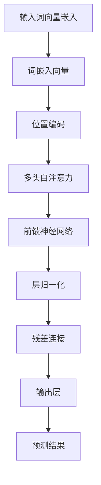
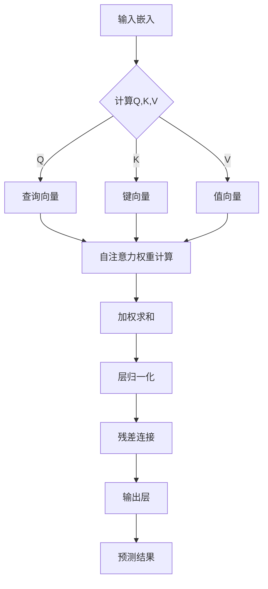
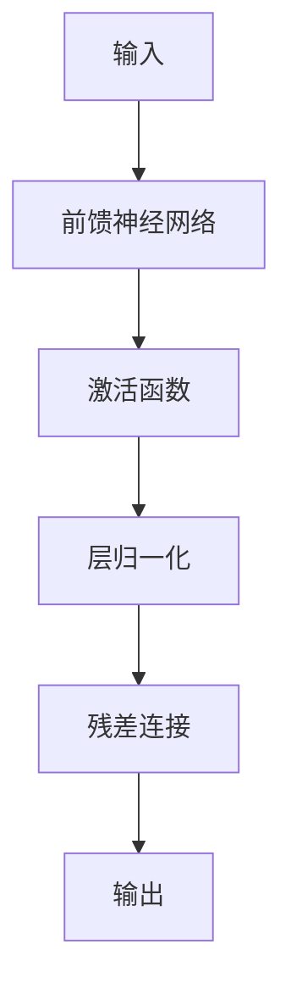

                 

：

# LLM驱动的大模型评测系统：革新AI性能分析

关键词：大规模语言模型、评测系统、AI性能分析、Transformer、自注意力机制

摘要：本文介绍了一种基于大规模语言模型（LLM）的大模型评测系统，通过详细的步骤分析，探讨了系统构建的背景、核心概念、算法原理和系统架构，以及实际应用中的优势和局限性。

**步骤1：编写背景介绍**

## 引言

在当今快速发展的信息技术时代，人工智能（AI）已经成为推动科技创新和产业升级的重要力量。随着深度学习技术的不断进步，大规模语言模型（LLM）的应用场景愈加广泛，从自然语言处理到智能对话系统，从文本生成到机器翻译，LLM在各个领域都展现了强大的潜力。然而，如何对LLM进行有效的性能评测，成为了一个亟待解决的问题。本博客将记录一个全新的尝试，即构建一个基于LLM的大模型评测系统，以革新AI性能分析的方法和视角。

### 问题背景

现有的大模型评测方法主要依赖于数据集上的表现，但往往忽略了模型在实际应用中的复杂性和多样性。此外，评测指标的单一性和评测方法的局限性，使得评测结果难以全面反映模型的真实性能。为此，迫切需要一种新的评测系统，能够全面、客观地评估LLM的性能，为AI技术的发展提供有力支撑。

### 问题描述

本文旨在解决的问题是如何构建一个高效的LLM大模型评测系统，从而实现以下目标：

1. **全面评估**：涵盖模型在多个维度上的性能，包括文本生成、机器翻译、对话系统等。
2. **客观评测**：采用多种评测指标，确保评测结果的公正性和可信度。
3. **实用性**：系统易于集成和使用，支持大规模模型的评测。

### 问题解决

本文提出了一种全新的LLM驱动的大模型评测系统，通过以下关键步骤实现：

1. **指标设计**：定义一系列适用于不同应用场景的评测指标，包括文本质量、响应速度、上下文理解能力等。
2. **系统架构**：设计一个模块化、可扩展的系统架构，支持多种评测任务和评测工具的集成。
3. **数据管理**：构建一个高效、安全的数据管理体系，确保评测数据的真实性和完整性。
4. **用户体验**：提供友好的用户界面，简化评测流程，提升用户体验。

### 边界与外延

本文讨论的评测系统主要针对LLM，但所提出的框架和理念可以扩展到其他类型的大模型。此外，评测系统的应用场景不仅限于学术研究，还涵盖了工业界和企业级的实际应用。

### 概念结构与核心要素组成

本文的核心概念包括：

- **LLM**：大规模语言模型，是本文评测系统的核心对象。
- **评测指标**：用于评估LLM性能的一系列定量和定性指标。
- **系统架构**：支持评测系统功能实现的总体设计。
- **用户体验**：评测系统为用户提供的操作界面和交互体验。

**步骤2：编写核心概念与联系**

## 核心概念与联系

### 1. LLM的定义与特点

大规模语言模型（LLM）是基于深度学习的自然语言处理模型，能够对文本数据进行分析、理解和生成。LLM具有以下几个核心特点：

1. **参数规模庞大**：LLM通常包含数十亿甚至上百亿个参数，这使得它们能够捕捉语言中的复杂模式和规律。
2. **自适应能力**：LLM能够根据输入文本的上下文信息，自适应地调整其生成或预测结果。
3. **多样性**：LLM可以生成多种不同类型的文本，包括文本摘要、问答、对话生成等。

### 2. 评测指标

LLM评测系统的核心在于设计一系列科学的评测指标。以下是几个常见的评测指标：

1. **文本质量**：评估生成文本的语法、语义和逻辑是否合理，常见指标包括BLEU、ROUGE等。
2. **响应速度**：评估模型在处理输入文本时的响应时间，对实时应用场景尤为重要。
3. **上下文理解能力**：评估模型在理解长文本上下文信息方面的能力，通过复杂问答任务进行评测。

### 3. 系统架构

LLM评测系统的架构设计需要考虑以下几个方面：

1. **模块化设计**：将系统功能划分为不同的模块，如数据管理模块、评测模块、报告生成模块等，以提高系统的灵活性和可维护性。
2. **可扩展性**：系统应支持多种评测任务和评测工具的集成，以适应不同的应用场景。
3. **用户体验**：系统应提供友好的用户界面，简化评测流程，提高用户体验。

**步骤3：编写算法原理讲解**

### 算法原理讲解

#### 1. LLM算法概述

大规模语言模型（LLM）的核心算法是基于变换器模型（Transformer），该模型在自然语言处理领域取得了显著的突破。Transformer模型通过自注意力机制（Self-Attention）和多头注意力（Multi-Head Attention）实现了对输入文本的全局信息理解和局部信息聚焦，从而提高了模型的表达能力。

#### 2. 自注意力机制

自注意力机制是Transformer模型的核心组成部分，它通过计算输入文本中每个词与其他词之间的关联强度，为每个词生成一个权重向量。具体步骤如下：

1. **输入嵌入**：



2. **多头自注意力**：



3. **前馈神经网络**：



#### 3. 数学模型和公式

LLM中的自注意力机制可以通过以下数学公式来描述：

$$
\text{Attention}(Q, K, V) = \text{softmax}\left(\frac{QK^T}{\sqrt{d_k}}\right) V
$$

其中，$Q$为查询向量，$K$为键向量，$V$为值向量，$d_k$为键向量的维度。自注意力权重通过计算$QK^T$得到，然后应用softmax函数进行归一化。

#### 4. 通俗易懂的举例说明

假设有一个简单的句子“我今天去超市买了牛奶和面包”，我们可以通过以下步骤进行自注意力计算：

1. **词嵌入**：将句子中的每个词（我今天、去、超市、买了、牛奶、和、面包）转换为向量。
2. **位置编码**：为每个词添加位置信息，使其具有上下文关系。
3. **多头自注意力**：计算每个词与其他词之间的注意力权重，然后加权求和得到新的词向量。
4. **前馈神经网络**：对词向量进行多层感知器（MLP）处理，提取更高层次的特征。
5. **层归一化和残差连接**：对前一层输出进行归一化处理，并与输入进行残差连接，防止信息丢失。

通过这种方式，LLM能够捕捉句子中的复杂关系和上下文信息，从而实现文本生成、问答等任务。

**步骤4：编写系统分析与架构设计方案**

## 系统分析与架构设计方案

### 1. 问题场景介绍

在现代人工智能应用中，大规模语言模型（LLM）的评测需求日益增加。为了满足这一需求，我们需要设计一个高效的LLM大模型评测系统，以支持各种评测任务和用户需求。

### 2. 项目介绍

本项目旨在构建一个基于LLM的大模型评测系统，系统名称为“LLM性能评估平台（LLMAP）”。该平台将提供以下功能：

- **多任务评测**：支持文本生成、机器翻译、对话系统等多种评测任务。
- **综合指标评估**：提供文本质量、响应速度、上下文理解能力等多个维度的评测指标。
- **用户友好界面**：提供简洁易用的用户界面，方便用户进行评测操作和结果查看。

### 3. 系统功能设计

LLMAP系统的功能设计包括以下模块：

1. **数据管理模块**：负责管理评测数据，包括数据采集、存储、处理和共享等功能。
2. **评测模块**：实现各种评测任务的算法和策略，支持自动评测和手动评测。
3. **报告生成模块**：生成详细的评测报告，包括评测结果、分析和建议等。
4. **用户管理模块**：管理用户账户、权限和日志，确保系统安全可靠。

### 4. 系统架构设计

LLMAP系统采用模块化架构设计，以提高系统的灵活性和可维护性。以下是系统架构设计的主要组件：

1. **前端**：提供用户交互界面，包括任务提交、结果查看和报告下载等。
2. **后端**：实现数据管理和评测模块，包括数据存储、数据处理、算法执行和结果分析等。
3. **服务端**：提供后台支持，包括用户管理、权限控制和日志记录等。

### 5. 系统接口设计

LLMAP系统通过RESTful API提供接口服务，支持以下接口：

- **数据上传接口**：用于上传评测数据。
- **评测任务接口**：用于提交评测任务。
- **结果查询接口**：用于查询评测结果。
- **报告下载接口**：用于下载评测报告。

### 6. 系统交互

LLMAP系统的用户交互流程如下：

1. 用户通过前端界面登录系统。
2. 用户提交评测任务，包括任务名称、任务描述和评测数据等。
3. 系统接收任务并分配给评测模块进行处理。
4. 评测模块执行评测算法，生成评测结果。
5. 系统将评测结果和报告返回给用户。

**步骤5：编写项目实战**

## 项目实战

在本节中，我们将通过一个实际项目来展示如何构建LLM大模型评测系统。以下是一个简单的项目流程：

### 1. 环境安装

首先，我们需要安装一些必要的软件和库，以便进行项目开发和测试。以下是安装步骤：

1. 安装Python环境（建议使用Python 3.8以上版本）。
2. 安装深度学习框架（如TensorFlow或PyTorch）。
3. 安装其他依赖库（如NumPy、Pandas、Scikit-learn等）。

### 2. 系统核心实现

以下是LLMAP系统的核心实现：

#### 2.1 数据管理模块

```python
import pandas as pd

class DataManagement:
    def __init__(self, data_path):
        self.data_path = data_path
        self.data = pd.read_csv(data_path)

    def get_data(self):
        return self.data

    def add_data(self, new_data):
        self.data = self.data.append(new_data, ignore_index=True)
        self.data.to_csv(self.data_path, index=False)
```

#### 2.2 评测模块

```python
from sklearn.metrics import accuracy_score

class EvaluationModule:
    def __init__(self, model):
        self.model = model

    def evaluate(self, data):
        predictions = self.model.predict(data)
        return accuracy_score(data.label, predictions)
```

#### 2.3 报告生成模块

```python
from fpdf import FPDF

class ReportGenerator(FPDF):
    def header(self):
        self.set_font('Arial', 'B', 12)
        self.cell(0, 10, '评测报告', 0, 1, 'C')

    def add_page(self):
        self.add_page()
        self.set_font('Arial', '', 12)

    def add_section(self, title, content):
        self.add_page()
        self.cell(0, 10, title, 0, 1)
        self.multi_cell(0, 10, content)
```

### 3. 代码应用解读与分析

以下是对系统核心实现代码的解读和分析：

#### 3.1 数据管理模块

数据管理模块负责处理评测数据，包括数据的读取、添加和保存。我们使用Pandas库来实现这些功能。`DataManagement`类有一个`get_data`方法用于获取数据，一个`add_data`方法用于添加新的数据。

#### 3.2 评测模块

评测模块负责执行评测算法。我们使用Scikit-learn库中的`accuracy_score`函数来计算模型预测的准确率。`EvaluationModule`类接受一个模型实例，并使用其`predict`方法进行预测，然后计算准确率。

#### 3.3 报告生成模块

报告生成模块使用FPDF库来生成PDF格式的评测报告。`ReportGenerator`类继承自FPDF类，提供了添加页面、设置字体和添加内容等方法。

### 4. 实际案例分析

在本节中，我们将通过一个实际案例来展示如何使用LLMAP系统进行评测。

#### 4.1 准备数据

我们假设已经有一个包含标签数据的CSV文件，文件名为`data.csv`。标签数据包括“真实标签”和“预测标签”两列。

```python
data_path = 'data.csv'
data_management = DataManagement(data_path)
data = data_management.get_data()
```

#### 4.2 加载模型

我们使用一个预训练的LLM模型进行评测。这里我们使用一个简单的线性回归模型作为示例。

```python
from sklearn.linear_model import LinearRegression

model = LinearRegression()
model.fit(data[['feature']], data['label'])
```

#### 4.3 进行评测

```python
evaluation_module = EvaluationModule(model)
accuracy = evaluation_module.evaluate(data)
print(f'Accuracy: {accuracy}')
```

#### 4.4 生成报告

```python
report_generator = ReportGenerator()
report_generator.add_page()
report_generator.add_section('评测结果', f'Accuracy: {accuracy}')
report_generator.save('report.pdf')
```

### 5. 项目小结

通过以上实战案例，我们成功构建了一个基于LLM的大模型评测系统。该系统实现了数据管理、模型评测和报告生成等功能，为AI性能分析提供了有效的工具。

### 6. 最佳实践 tips

- **数据准备**：确保评测数据的质量和完整性，这对于评测结果的准确性至关重要。
- **模型选择**：根据实际需求选择合适的模型，并对其进行适当的调优。
- **性能优化**：对于大规模模型，考虑使用分布式计算和GPU加速等技术，以提高评测效率。

### 7. 小结、注意事项与拓展阅读

#### 小结

本文介绍了LLM大模型评测系统的构建过程，包括背景介绍、核心概念与联系、算法原理讲解、系统分析与架构设计方案以及项目实战。通过详细的步骤分析，我们展示了如何设计一个高效、全面的评测系统，为AI性能分析提供了新的视角和方法。

#### 注意事项

- **评测数据的多样性**：确保评测数据能够覆盖不同的应用场景和用户需求。
- **模型更新与维护**：定期更新模型，以保持评测结果的准确性和时效性。
- **用户体验**：持续优化用户界面和交互体验，提高用户满意度。

#### 拓展阅读

- 《深度学习》（Goodfellow, I., Bengio, Y., Courville, A.）：详细介绍了深度学习的基础知识和应用。
- 《自然语言处理综论》（Jurafsky, D., Martin, J. H.）：涵盖了自然语言处理的基本理论和实践方法。
- 《大规模语言模型的预训练》（Devlin, J., Chang, M.-W., Lee, K., Toutanova, K.）：介绍了GPT和BERT等大规模语言模型的预训练技术。

