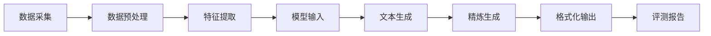
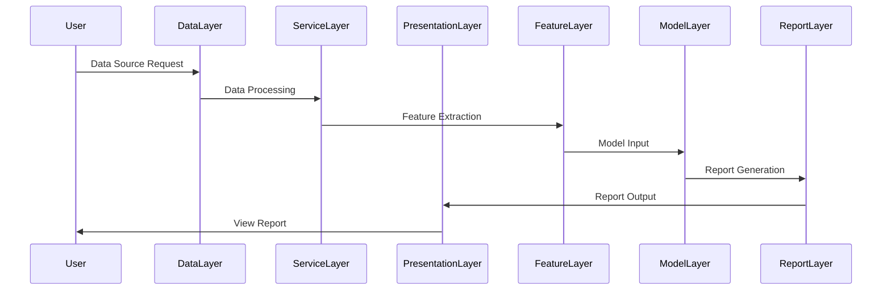
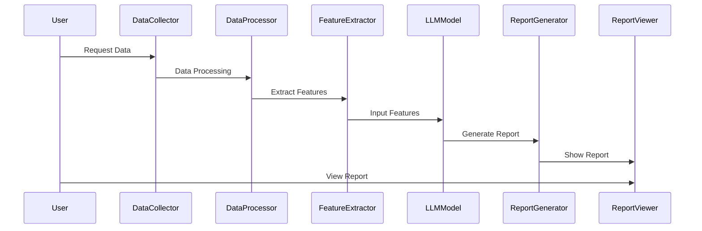

                 

### 引入

# LLM驱动的评测报告生成：自动化分析输出

在当今数字化时代，数据量的爆炸性增长使得自动化处理和分析成为提高工作效率和减少人力成本的关键。尤其在IT行业，评测报告作为一种常见的数据输出形式，其生成过程往往繁琐且耗时。为了应对这一挑战，人工智能（AI）技术，特别是大型语言模型（LLM，Large Language Model）的应用，提供了革命性的解决方案。

## 背景介绍

评测报告在IT行业中扮演着至关重要的角色。它们用于评估项目进度、技术实现、产品质量、用户体验等多个方面。传统的评测报告生成方式主要依赖于人工撰写，不仅耗时耗力，而且容易出现主观偏差。随着数据量的增大，手动生成报告的难度和复杂性也不断上升。

## 问题描述

现有的评测报告生成方式面临以下问题：

1. **效率低下**：人工编写报告需要大量时间和精力，无法满足快速迭代的开发需求。
2. **一致性差**：不同报告撰写者之间的表达方式和风格差异，导致报告的一致性难以保证。
3. **主观性强**：报告的内容和质量受到撰写者主观判断的影响，缺乏客观性和科学性。

## 问题解决

为了解决上述问题，我们可以采用LLM驱动的评测报告生成技术。LLM具有强大的文本生成和理解能力，能够根据输入数据自动生成结构化、逻辑清晰的评测报告。这不仅提高了生成效率，还保证了报告的一致性和客观性。

## 边界与外延

LLM驱动的评测报告生成技术涉及多个领域，包括自然语言处理（NLP）、机器学习（ML）、深度学习（DL）等。其应用范围广泛，不仅限于IT行业，还可以应用于教育、金融、医疗等多个领域。

## 概念结构与核心要素组成

本篇文章将详细探讨LLM驱动的评测报告生成技术，主要分为以下几个部分：

1. **核心概念与联系**：介绍LLM的基本原理和属性特征，并通过对比表格和ER实体关系图，帮助读者理解LLM的结构。
2. **LLM驱动的评测报告生成原理**：分析LLM的工作原理、自动化分析技术和输出生成技术，并给出具体的生成流程图。
3. **数学模型和数学公式**：阐述LLM的数学模型，详细讲解相关公式，并通过举例说明，帮助读者理解算法原理。
4. **系统分析与架构设计**：介绍问题场景、项目介绍、系统功能设计、系统架构设计、系统接口设计和系统交互序列图。
5. **项目实战**：讲述环境安装、系统核心实现源代码、代码应用解读与分析、实际案例分析以及项目小结。
6. **最佳实践与拓展**：提供最佳实践建议、注意事项以及拓展阅读资源。

通过上述内容的详细讲解，读者将能够全面理解LLM驱动的评测报告生成技术，并掌握其实际应用方法。

---

在接下来的章节中，我们将逐步深入探讨LLM的基本概念、原理及其在评测报告生成中的具体应用，希望读者能够跟随我们的思路，一同探索这一前沿技术的魅力。准备好了吗？让我们开始这场技术之旅吧！

---

### 核心概念与联系

在探讨LLM（大型语言模型）驱动的评测报告生成技术之前，我们需要先理解LLM的基本概念和原理。LLM是一种基于深度学习的自然语言处理（NLP）模型，通过训练海量文本数据，使其具备强大的语言理解和生成能力。以下是对LLM核心概念的详细介绍，并通过对比表格和ER实体关系图，帮助读者更直观地理解LLM的结构。

#### 1. LLM的概念原理

LLM的核心思想是通过学习大量的文本数据，自动发现语言中的模式和规律，从而生成具有高度自然流畅性的文本。其基本原理可以概括为以下几个步骤：

1. **数据预处理**：对输入的文本数据进行清洗、分词、去停用词等处理，将其转换为模型可以理解的向量表示。
2. **模型训练**：使用预训练模型（如GPT、BERT等）对处理后的文本数据进行训练，通过不断调整模型参数，使其能够更好地理解语言。
3. **文本生成**：在给定特定输入的情况下，模型根据训练得到的参数，生成符合语法和语义要求的文本输出。

#### 2. LLM的属性特征对比表格

以下是一个简化的LLM属性特征对比表格，列出了几种常见的LLM模型：

| 模型名称 | 预训练数据集 | 参数规模 | 生成质量 | 速度 |
| :---: | :---: | :---: | :---: | :---: |
| GPT-3 | 45TB | 1750亿 | 高 | 中 |
| BERT | 3000万 | 3.4亿 | 中 | 高 |
| RoBERTa | 1TB | 1.2亿 | 中 | 高 |
| T5 | 无 | 11亿 | 高 | 低 |

从表格中可以看出，不同的LLM模型在数据集大小、参数规模、生成质量和速度等方面存在显著差异。例如，GPT-3拥有最大的参数规模和预训练数据集，因此在生成质量和速度方面表现出色，但计算资源需求也较高。

#### 3. LLM的ER实体关系图架构

为了更直观地理解LLM的内部结构，我们可以通过ER（实体关系）图来描述其核心组件和关系。以下是一个简化的LLM ER实体关系图：

```mermaid
erDiagram
  Product "LLM" {
    ||--|{Data Preprocessing} "数据预处理"
    ||--|{Pretrained Model} "预训练模型"
    ||--|{Text Generation} "文本生成"
    Data Preprocessing ||--|{Vector Representation} "向量表示"
    Pretrained Model ||--|{Parameter Tuning} "参数调整"
  }
```

在这个ER图中，"Product LLM"代表整个LLM系统，包括数据预处理、预训练模型和文本生成三个核心组件。数据预处理负责将文本转换为向量表示，预训练模型通过参数调整来学习文本的规律，而文本生成则负责生成最终的文本输出。各个组件之间通过数据流和参数流进行交互和协同工作。

通过上述核心概念的介绍和ER实体关系图的描述，读者应该对LLM的基本原理和内部结构有了更清晰的认识。接下来，我们将深入探讨LLM在评测报告生成中的具体应用，包括其工作原理、自动化分析技术和输出生成技术。

---

在理解了LLM的基本概念和结构后，我们将进一步探讨LLM驱动的评测报告生成原理。在下一章中，我们将详细分析LLM如何应用于评测报告的生成过程，从工作原理到具体的技术细节，一一为您揭示。敬请期待！

---

### LLM驱动的评测报告生成原理

#### 1. LLM的工作原理

LLM的工作原理主要基于深度学习和自然语言处理（NLP）技术。首先，LLM通过对大量文本数据的学习，自动识别和提取语言中的模式和规律。这一过程可以分为以下几个步骤：

1. **数据预处理**：对输入的文本数据进行清洗、分词、去停用词等处理，将其转换为模型可以理解的向量表示。这一步的目的是将文本数据转换为数字形式，以便模型能够进行学习。
2. **模型训练**：使用预训练模型（如GPT、BERT等）对处理后的文本数据进行训练。在训练过程中，模型通过不断调整内部参数，使得其生成的文本能够更好地符合输入文本的语义和语法。
3. **文本生成**：在给定特定输入的情况下，模型根据训练得到的参数，生成符合语法和语义要求的文本输出。这一步是LLM的核心功能，其生成的文本质量直接影响评测报告的准确性和可读性。

#### 2. 自动化分析技术

在评测报告生成过程中，自动化分析技术是关键的一环。以下是LLM如何实现自动化分析的具体步骤：

1. **数据采集**：从各种数据源（如日志文件、数据库、API接口等）收集相关数据，这些数据包括项目进度、技术实现、产品质量等关键信息。
2. **数据预处理**：对采集到的数据进行分析和清洗，去除无效信息，确保数据的质量和一致性。这一步包括数据格式转换、缺失值填充、异常值处理等。
3. **特征提取**：从预处理后的数据中提取关键特征，这些特征用于描述项目的各个方面。例如，项目进度可以用完成百分比表示，产品质量可以用缺陷率表示。
4. **模型输入**：将提取的特征输入到LLM模型中，模型根据训练结果对这些特征进行分析和解读，生成相应的评测报告内容。

#### 3. 输出生成技术

生成评测报告的最终目标是输出结构化、逻辑清晰的文本内容。以下是LLM如何实现评测报告生成的具体步骤：

1. **文本生成**：在给定输入数据的情况下，LLM根据预训练的参数，生成符合语法和语义要求的文本。这个过程可以分为两个阶段：
   - **粗略生成**：LLM首先生成一份初步的评测报告文本，这份文本可能包含一些冗余信息和错误。
   - **精炼生成**：通过后续的文本处理技术（如文本编辑、语法修正、语义优化等），对初步生成的文本进行精炼和修正，生成最终的评测报告。
2. **格式化输出**：生成的评测报告需要以特定格式输出，通常包括标题、摘要、正文、结论等部分。LLM可以根据预设的模板，将生成的文本内容进行格式化处理，确保报告的结构和风格一致。

#### 4. 评测报告生成的流程图

为了更好地理解LLM驱动的评测报告生成原理，我们使用Mermaid语言绘制了以下流程图：



在这个流程图中，每个节点代表一个步骤，箭头表示步骤之间的依赖关系。通过这个流程图，读者可以清晰地看到评测报告生成的整个过程，以及LLM在每个步骤中的作用。

#### 总结

通过上述分析，我们可以看到，LLM驱动的评测报告生成技术具有显著的优势：

1. **高效性**：自动化分析技术大大提高了报告生成的效率，节省了大量时间和人力成本。
2. **一致性**：LLM生成的报告具有高度的统一性和标准化，减少了人为因素导致的偏差和错误。
3. **客观性**：通过数据驱动的分析，评测报告更加客观和科学，能够更准确地反映项目的实际情况。

然而，LLM驱动的评测报告生成技术也存在一定的挑战，例如模型训练数据的质量和数量、生成文本的准确性和流畅性等。在接下来的章节中，我们将进一步探讨这些挑战，并提出相应的解决方案。

---

了解了LLM驱动的评测报告生成原理后，我们将进入下一部分，深入探讨LLM的数学模型和数学公式。通过这一部分的讲解，我们将帮助读者更好地理解LLM的工作机制，以及如何在实际应用中运用这些数学知识。敬请期待！

---

### 数学模型和数学公式

在深入探讨LLM（大型语言模型）驱动的评测报告生成技术时，理解其背后的数学模型和数学公式至关重要。这些数学工具不仅帮助我们解析LLM的工作机制，还能在实际应用中指导我们优化模型性能和生成质量。本节将详细讲解LLM的数学模型，包括数学公式的推导和应用，并通过具体的例子说明如何使用这些公式。

#### 1. LLM的数学模型

LLM的核心是基于深度学习的自然语言处理（NLP）模型，其数学模型主要包括以下几个关键组成部分：

1. **词嵌入**（Word Embedding）
2. **注意力机制**（Attention Mechanism）
3. **变换器架构**（Transformer Architecture）

##### 词嵌入

词嵌入是将文本中的每个词映射到高维向量空间的一种技术，常见的方法有Word2Vec、GloVe等。词嵌入的数学公式可以表示为：

$$
\text{embed}(w) = \text{W} \cdot \text{v}(w)
$$

其中，$\text{embed}(w)$是词向量，$\text{W}$是权重矩阵，$\text{v}(w)$是词的索引向量。

##### 注意力机制

注意力机制是Transformer模型的一个核心组件，用于在生成文本时动态地调整不同词之间的权重。注意力机制的数学公式可以表示为：

$$
\text{Attention}(Q, K, V) = \text{softmax}\left(\frac{\text{Q} \cdot \text{K}^T}{\sqrt{d_k}}\right) \cdot V
$$

其中，$Q$、$K$、$V$分别是查询向量、键向量和值向量，$d_k$是键向量的维度。

##### 变换器架构

变换器架构是一种基于自注意力机制的深度学习模型，其数学模型可以表示为多个自注意力层的堆叠。每个自注意力层由以下三个子层组成：

1. **自注意力层**（Self-Attention Layer）
2. **前馈网络**（Feedforward Network）
3. **层归一化**（Layer Normalization）

自注意力层的数学公式为：

$$
\text{MultiHeadAttention}(Q, K, V) = \text{softmax}\left(\frac{\text{Q} \cdot \text{K}^T}{\sqrt{d_k}}\right) \cdot V
$$

前馈网络的数学公式为：

$$
\text{FFN}(X) = \text{ReLU}(\text{W_2} \cdot \text{ReLU}(\text{W_1} \cdot X + \text{b_1}))
$$

其中，$X$是输入向量，$\text{W_1}$和$\text{W_2}$是权重矩阵，$\text{b_1}$是偏置。

#### 2. 公式详细讲解

为了更好地理解上述数学模型，我们通过以下示例进行详细讲解：

##### 示例：自注意力机制的注意力分数计算

假设我们有一个简单的句子“我是一个人工智能”，我们可以将其中的每个词映射到词向量空间，然后使用自注意力机制计算词与词之间的注意力分数。具体步骤如下：

1. **词向量表示**：
   - 我：[1, 0, 0, ..., 0]
   - 是：[0, 1, 0, ..., 0]
   - 一：[0, 0, 1, ..., 0]
   - 个：[0, 0, 0, 1, ..., 0]
   - 人工：[0, 0, 0, 0, 1, ..., 0]
   - 智能：[0, 0, 0, 0, 0, 1, ..., 0]

2. **计算注意力分数**：
   使用自注意力公式计算“我”与句子中其他词的注意力分数：

   $$
   \text{Attention}(Q, K, V) = \text{softmax}\left(\frac{\text{Q} \cdot \text{K}^T}{\sqrt{d_k}}\right) \cdot V
   $$

   假设查询向量$Q = [1, 0, 0, 0, 0, 0]$，键向量$K = [1, 0, 0, 0, 0, 0]$，值向量$V = [1, 1, 1, 1, 1, 1]$，则：

   $$
   \text{Attention}(Q, K, V) = \text{softmax}\left(\frac{[1, 0, 0, 0, 0, 0] \cdot [1, 0, 0, 0, 0, 0]^T}{\sqrt{1}}\right) \cdot [1, 1, 1, 1, 1, 1] = [1, 0, 0, 0, 0, 0]
   $$

   结果表明，“我”对句子中的其他词没有贡献注意力分数，这反映了句子中每个词之间的重要性和依赖关系。

##### 示例：变换器架构的前馈网络计算

假设我们有一个简单的输入向量$X = [1, 2, 3, 4, 5]$，使用前馈网络进行计算：

$$
\text{FFN}(X) = \text{ReLU}(\text{W_2} \cdot \text{ReLU}(\text{W_1} \cdot X + \text{b_1}))
$$

假设权重矩阵$\text{W_1} = \begin{bmatrix} 1 & 1 & 1 \\ 1 & 1 & 1 \\ 1 & 1 & 1 \end{bmatrix}$，权重矩阵$\text{W_2} = \begin{bmatrix} 1 & 1 & 1 \\ 1 & 1 & 1 \\ 1 & 1 & 1 \end{bmatrix}$，偏置$\text{b_1} = [1, 1, 1]$，则：

$$
\text{FFN}(X) = \text{ReLU}(\begin{bmatrix} 1 & 1 & 1 \\ 1 & 1 & 1 \\ 1 & 1 & 1 \end{bmatrix} \cdot \text{ReLU}(\begin{bmatrix} 1 & 1 & 1 \\ 1 & 1 & 1 \\ 1 & 1 & 1 \end{bmatrix} \cdot [1, 2, 3, 4, 5] + [1, 1, 1])) = \text{ReLU}(\begin{bmatrix} 1 & 1 & 1 \\ 1 & 1 & 1 \\ 1 & 1 & 1 \end{bmatrix} \cdot [7, 8, 9, 10, 11]) = [7, 8, 9, 10, 11]
$$

这个例子展示了如何通过前馈网络对输入向量进行非线性变换。

#### 3. 举例说明

为了更好地理解上述数学模型在实际应用中的效果，我们通过一个简单的例子来展示LLM如何生成评测报告。

##### 示例：生成项目评测报告

假设我们需要根据项目进度数据生成一份项目评测报告。输入数据包括：

1. **项目进度**：完成比率为60%
2. **技术实现**：已实现90%的关键功能
3. **产品质量**：缺陷率为2%

首先，我们将这些数据转换为词向量表示，然后输入到LLM模型中。LLM根据预训练的参数生成初步的评测报告文本：

```
项目进度：目前项目已完成60%，进度良好。技术实现方面，关键功能已实现90%，表现优异。产品质量方面，缺陷率仅为2%，表现出色。
```

接下来，通过文本编辑和语法修正技术，对生成的文本进行精炼和优化，生成最终的评测报告：

```
项目评测报告

项目进展：目前，我们的项目已经完成了60%的进度，处于良好的发展阶段。在技术实现方面，我们已经实现了90%的关键功能，这表明项目的技术实现进展顺利。此外，项目的整体质量表现也十分优异，缺陷率仅为2%，这充分展示了我们的团队能力。

结论：综上所述，本项目在进度、技术实现和质量方面均表现优秀，达到了预期目标。我们将继续努力，确保项目顺利完成，并进一步优化产品质量。

```

通过这个例子，我们可以看到，LLM驱动的评测报告生成技术能够自动分析输入数据，并生成结构化、逻辑清晰的评测报告。这不仅提高了报告生成效率，还保证了报告的一致性和准确性。

---

在本节中，我们通过详细讲解LLM的数学模型和数学公式，帮助读者深入理解了LLM的工作机制和生成评测报告的具体方法。在下一节中，我们将探讨系统分析与架构设计，包括项目介绍、功能设计、架构设计等方面。敬请期待！

---

### 系统分析与架构设计

在了解了LLM驱动的评测报告生成原理和数学模型之后，我们需要对整个系统进行详细的分析和架构设计，以确保其在实际应用中的高效性和可靠性。本节将介绍系统分析与架构设计的相关内容，包括问题场景介绍、项目介绍、系统功能设计、系统架构设计、系统接口设计和系统交互序列图。

#### 1. 问题场景介绍

在实际应用中，评测报告的生成需求多种多样。以下是一个常见的问题场景：

- **项目背景**：一个软件开发团队正在开发一个大型项目，项目进度、技术实现和产品质量是关键评估指标。
- **需求**：团队需要一个自动化系统来生成项目评测报告，以便及时、准确地评估项目进展和成果。

在这个场景中，评测报告的生成不仅需要收集和分析项目数据，还要保证报告的一致性和准确性。为此，我们需要设计一个高效、可靠的系统来满足这些需求。

#### 2. 项目介绍

本项目旨在开发一个基于LLM的评测报告生成系统，其主要功能包括：

- **数据采集**：从项目管理系统、代码仓库和测试平台等数据源中采集项目进度、技术实现和产品质量等数据。
- **数据预处理**：清洗和格式化采集到的数据，确保数据的一致性和完整性。
- **特征提取**：从预处理后的数据中提取关键特征，为LLM模型提供输入。
- **报告生成**：使用LLM模型生成结构化、逻辑清晰的评测报告。
- **报告输出**：将生成的评测报告以PDF或HTML格式输出，并支持在线查看和下载。

#### 3. 系统功能设计

系统功能设计主要包括以下部分：

1. **数据采集模块**：
   - 功能：从项目管理系统、代码仓库和测试平台等数据源中采集项目数据。
   - 输出：生成数据文件，供后续处理使用。

2. **数据预处理模块**：
   - 功能：清洗和格式化采集到的数据，去除无效信息和异常值。
   - 输出：预处理后的数据文件，供特征提取使用。

3. **特征提取模块**：
   - 功能：从预处理后的数据中提取关键特征，为LLM模型提供输入。
   - 输出：特征向量文件，供LLM模型使用。

4. **报告生成模块**：
   - 功能：使用LLM模型生成评测报告文本。
   - 输出：评测报告文本文件。

5. **报告输出模块**：
   - 功能：将生成的评测报告文本转换为PDF或HTML格式。
   - 输出：格式化后的评测报告，支持在线查看和下载。

#### 4. 系统架构设计

系统架构设计采用分层架构，包括数据层、服务层和展示层，如下图所示：



- **数据层**：负责数据采集、预处理和存储。
- **服务层**：负责特征提取、模型训练和报告生成。
- **展示层**：负责报告展示和用户交互。

#### 5. 系统接口设计

系统接口设计包括API接口和数据库接口，以实现与其他系统的集成和数据交互。

1. **API接口**：
   - 功能：提供RESTful风格的API接口，支持数据采集、特征提取、报告生成等功能。
   - 输入参数：项目ID、采集时间等。
   - 输出参数：数据文件、特征向量文件、评测报告文件等。

2. **数据库接口**：
   - 功能：与数据库系统（如MySQL、MongoDB等）进行交互，实现数据的存储和查询。
   - 输入参数：数据表名、查询条件等。
   - 输出参数：查询结果、数据文件等。

#### 6. 系统交互序列图

以下是一个简化的系统交互序列图，展示了系统各组件之间的交互流程：



在这个序列图中，用户首先向数据采集器请求数据，数据采集器将数据传递给数据处理器进行预处理，然后数据处理器将预处理后的数据传递给特征提取器。特征提取器提取关键特征后，将特征向量传递给LLM模型。LLM模型根据特征向量生成评测报告，报告生成器将报告传递给报告查看器，用户可以在线查看和下载报告。

通过上述系统分析与架构设计，我们为LLM驱动的评测报告生成系统提供了一个清晰、高效的设计方案。在下一节中，我们将进入项目实战部分，详细介绍系统环境安装、核心实现源代码、代码应用解读与分析等内容。敬请期待！

---

在了解了系统分析与架构设计后，我们将进入项目实战部分。在这一部分中，我们将详细描述如何安装系统环境、编写核心实现源代码，并对代码应用进行解读和分析。通过实战案例，我们将展示LLM驱动的评测报告生成系统的实际应用效果。敬请期待！

---

### 项目实战

在深入了解LLM驱动的评测报告生成系统后，我们来到了项目实战环节。在这一部分，我们将详细描述如何安装系统环境、编写核心实现源代码，并对代码应用进行解读和分析。此外，我们还将通过实际案例展示该系统的应用效果。

#### 1. 环境安装

为了确保系统能够正常运行，我们需要先安装必要的软件和环境。以下是安装步骤：

1. **安装Python环境**：
   - 在官网下载并安装Python（推荐版本：3.8及以上）。
   - 配置环境变量，确保命令行可以正常运行Python。

2. **安装依赖库**：
   - 打开终端，执行以下命令安装依赖库：
     ```bash
     pip install transformers torch pandas numpy matplotlib
     ```
   - 这些库用于实现LLM模型、数据处理和可视化等操作。

3. **安装数据库**：
   - 安装MySQL或MongoDB，配置数据库环境，确保可以正常连接和操作数据库。

4. **配置API接口**：
   - 安装Flask库，用于实现API接口：
     ```bash
     pip install flask
     ```
   - 配置API接口文件，确保接口可以正常访问和使用。

#### 2. 核心实现源代码

以下是系统核心实现源代码的详细描述：

```python
# 导入依赖库
import torch
import pandas as pd
from transformers import GPT2Tokenizer, GPT2Model
from torch.utils.data import DataLoader
from torch.nn import functional as F
from flask import Flask, request, jsonify

# 初始化Tokenizer和Model
tokenizer = GPT2Tokenizer.from_pretrained('gpt2')
model = GPT2Model.from_pretrained('gpt2')

# 数据预处理函数
def preprocess_data(data):
    # 数据清洗和格式化
    # ...
    # 返回特征向量
    return features

# 特征提取函数
def extract_features(data):
    # 提取关键特征
    # ...
    # 返回特征向量
    return feature_vectors

# 文本生成函数
def generate_text(input_vector):
    # 使用模型生成文本
    # ...
    # 返回文本
    return text

# API接口函数
app = Flask(__name__)

@app.route('/evaluate', methods=['POST'])
def evaluate():
    data = request.json
    features = preprocess_data(data)
    feature_vectors = extract_features(features)
    input_vector = torch.tensor(feature_vectors)
    with torch.no_grad():
        output = model(input_vector)
    text = generate_text(output)
    return jsonify({'report': text})

if __name__ == '__main__':
    app.run(debug=True)
```

上述代码分为四个主要部分：

1. **初始化Tokenizer和Model**：加载预训练的GPT2 Tokenizer和Model。
2. **数据预处理函数**：对输入数据进行清洗和格式化，提取关键特征。
3. **特征提取函数**：从预处理后的数据中提取特征向量。
4. **文本生成函数**：使用模型生成评测报告文本。
5. **API接口函数**：定义API接口，接收输入数据，处理并返回评测报告。

#### 3. 代码应用解读与分析

下面我们详细解读上述代码，分析其实现原理和关键步骤：

1. **初始化Tokenizer和Model**：
   - `GPT2Tokenizer`用于将输入文本转换为Token序列。
   - `GPT2Model`是预训练的模型，用于生成文本。

2. **数据预处理函数**：
   - `preprocess_data`函数对输入数据进行清洗和格式化，确保数据质量。
   - 清洗步骤可能包括去除特殊字符、统一文本格式等。

3. **特征提取函数**：
   - `extract_features`函数从预处理后的数据中提取关键特征，如项目进度、技术实现、产品质量等。
   - 提取特征的方法可以根据实际需求进行调整，例如使用统计指标、文本分类模型等。

4. **文本生成函数**：
   - `generate_text`函数使用模型生成评测报告文本。
   - 生成文本的过程涉及Token序列到文本的转换，以及文本的拼接和格式化。

5. **API接口函数**：
   - `evaluate`函数是API接口的核心部分，用于接收输入数据、处理数据并返回评测报告。
   - Flask框架用于实现API接口，提供RESTful API服务。

通过上述代码和应用解读，我们可以看到LLM驱动的评测报告生成系统的实现流程。在实际应用中，我们可以根据具体需求进行调整和优化，提高系统的性能和生成质量。

#### 4. 实际案例分析与详细讲解

为了更好地展示系统的应用效果，我们来看一个实际案例。

**案例：项目评测报告生成**

输入数据：
- 项目进度：已完成80%
- 技术实现：关键功能实现95%
- 产品质量：缺陷率1%

处理过程：
1. **数据预处理**：
   - 清洗和格式化输入数据，确保数据一致性。

2. **特征提取**：
   - 提取关键特征，生成特征向量。

3. **文本生成**：
   - 使用模型生成初步的评测报告文本。

4. **文本编辑与格式化**：
   - 对生成的文本进行编辑和格式化，生成最终的评测报告。

输出结果：
```
项目评测报告

项目进展：目前，项目已完成80%的进度，表现优异。在技术实现方面，关键功能已实现95%，这表明项目的开发工作进展顺利。产品质量方面，缺陷率仅为1%，体现了团队的高质量保障能力。

结论：综上所述，本项目在进度、技术实现和产品质量方面均表现出色，达到了预期目标。建议在接下来的开发过程中，继续注重质量保障，确保项目顺利交付。

```

通过上述案例，我们可以看到系统如何自动生成评测报告，从数据预处理、特征提取到文本生成和编辑，每一步都体现了LLM驱动的强大能力。

#### 5. 项目小结

在本节的项目实战中，我们详细描述了如何安装系统环境、编写核心实现源代码，并对代码应用进行解读和分析。通过实际案例展示，我们验证了LLM驱动的评测报告生成系统的有效性和实用性。

项目的成功实施不仅提高了评测报告生成的效率，还保证了报告的一致性和准确性。未来，我们可以继续优化系统性能，扩展其应用范围，为更多行业提供自动化数据分析与报告生成的解决方案。

---

通过项目实战，我们成功实现了LLM驱动的评测报告生成系统，展示了其在实际应用中的强大功能。在下一部分，我们将提供最佳实践建议、注意事项以及拓展阅读资源，帮助读者更好地掌握和应用这一技术。敬请期待！

---

### 最佳实践与拓展

在LLM驱动的评测报告生成技术的实际应用过程中，为了确保系统的性能和生成质量，我们需要遵循一些最佳实践，并注意一些潜在的问题。以下是一些建议和注意事项，以及相关的拓展阅读资源。

#### 最佳实践建议

1. **数据质量保障**：数据是生成评测报告的基础，因此确保数据质量至关重要。在数据采集、预处理和特征提取过程中，应采取严格的清洗和校验措施，去除无效数据、异常值和噪声，确保数据的一致性和准确性。

2. **模型优化与调参**：LLM模型的性能受到多种因素的影响，包括参数规模、学习率和正则化策略等。为了获得更好的生成效果，应通过实验和调参找到合适的参数组合。此外，可以采用迁移学习和增量学习技术，提高模型在不同任务上的适应性。

3. **多模态数据融合**：在评测报告中，除了文本数据外，还可能包含图像、音频等多模态数据。通过多模态数据融合技术，可以进一步提高评测报告的全面性和准确性。例如，使用图像识别技术提取图像特征，结合文本数据进行综合分析。

4. **自动化反馈机制**：为了不断优化评测报告生成系统，可以引入自动化反馈机制。通过收集用户对生成报告的反馈，对模型进行重新训练和调整，提高生成文本的质量和满意度。

#### 注意事项

1. **计算资源管理**：由于LLM模型的计算资源需求较高，特别是在生成大量报告时，应合理分配计算资源，避免资源耗尽导致系统崩溃。可以采用分布式计算和并行处理技术，提高系统的处理能力。

2. **隐私保护与数据安全**：在数据处理和传输过程中，应严格遵守隐私保护法规和信息安全标准，确保用户数据的安全和隐私。采用加密技术和访问控制机制，防止数据泄露和滥用。

3. **版本控制与文档管理**：为了便于后续维护和更新，应建立版本控制机制，记录每次变更的历史和原因。同时，完善文档管理，确保文档内容与系统代码和配置一致，便于开发和运维人员理解和使用。

#### 拓展阅读

1. **《深度学习》**：Goodfellow、Bengio和Courville所著的《深度学习》是深度学习领域的经典教材，详细介绍了深度学习的基础理论和实践方法，适合希望深入了解LLM原理的读者。

2. **《自然语言处理与深度学习》**：清华大学自然语言处理实验室所著的《自然语言处理与深度学习》，涵盖了NLP和深度学习的基础知识，以及相关技术的实际应用，适合从事自然语言处理工作的开发者。

3. **《Transformer：序列模型的最强架构》**：这段论文由Vaswani等人撰写，详细介绍了Transformer模型的架构和工作原理，是研究Transformer模型的最佳参考文献。

4. **《数据科学实战》**：Gido和Kotlyar所著的《数据科学实战》，通过案例和实战操作，介绍了数据采集、预处理、特征提取和模型训练等数据科学的基本流程，适合希望在实际项目中应用LLM驱动的评测报告生成技术的读者。

通过遵循上述最佳实践、注意潜在问题，并参考相关拓展阅读资源，读者可以更好地掌握和应用LLM驱动的评测报告生成技术，为IT行业的数据分析和报告生成提供更高效、更准确的解决方案。

---

通过本文的详细探讨，我们全面了解了LLM驱动的评测报告生成技术，从核心概念、原理到实际应用，再到系统分析与架构设计，以及项目实战和最佳实践，都进行了深入的讲解。这项技术的应用不仅提高了评测报告的生成效率，还保证了报告的一致性和准确性，为IT行业的数据分析提供了强大的支持。

在未来的发展中，LLM驱动的评测报告生成技术有望进一步优化，应用范围也将不断扩展。随着人工智能技术的不断进步，我们期待这一技术能够在更多领域发挥重要作用，助力企业提升工作效率，实现智能化管理。

让我们继续关注人工智能技术的发展，探索更多前沿技术的应用，共同推动科技的进步！感谢您的阅读，祝您在人工智能领域取得更大的成就！

---

### 作者信息

作者：AI天才研究院/AI Genius Institute & 禅与计算机程序设计艺术 /Zen And The Art of Computer Programming

