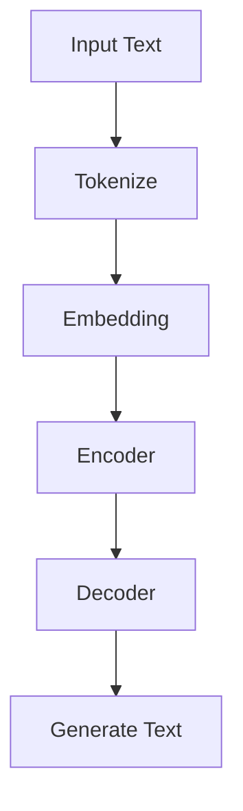
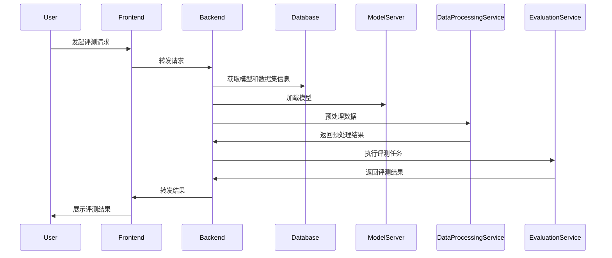

                 

### 第一部分：背景介绍

#### 1.1 问题背景

随着人工智能技术的迅猛发展，自然语言处理（NLP）领域正经历着一场革命。近年来，基于深度学习的自然语言生成（NLG）技术取得了显著突破，尤其是大规模预训练语言模型（Large-scale Language Model，简称LLM）的出现，使得机器生成文本的质量得到了前所未有的提升。然而，如何对这些超大规模语言模型进行有效评测，以衡量其性能和优化方法，成为了当前研究的热点问题。

#### 1.2 问题描述

在实际应用中，LLM的评测面临诸多挑战。首先，评测方法需要能够全面反映模型在不同应用场景下的性能。其次，评测数据集需要具有多样性和代表性，以模拟真实世界的语言环境。此外，评测指标的设计也应具备科学性和可解释性，以便于研究人员和工程师理解和改进模型。

#### 1.3 问题解决

为了解决上述问题，研究人员提出了多种评测方法和指标，如BLEU、ROUGE、METEOR等，这些方法在一定程度上能够评估模型的文本生成质量。然而，这些方法往往存在一定的局限性，无法全面反映模型的性能。因此，探索新的评测方法和技术成为当务之急。

#### 1.4 边界与外延

在超大规模LLM评测中，需要考虑的边界和范围包括但不限于：评测方法的选择、数据集的构建、指标的设计、实验的执行和结果的分析等。同时，这一领域的外延还涉及到模型的训练过程、优化算法、模型压缩和部署等方面。

#### 1.5 概念结构与核心要素组成

为了更好地理解超大规模LLM评测，我们首先需要明确以下几个核心概念：

1. **自然语言生成（NLG）**：NLG是指计算机程序自动生成自然语言文本的技术。
2. **预训练语言模型（LLM）**：LLM是指通过大量文本数据进行预训练的深度学习模型，如GPT、BERT等。
3. **评测方法**：评测方法是指用于评估LLM性能的一系列技术手段。
4. **评测指标**：评测指标是指用于量化评估LLM性能的一系列量化标准。
5. **数据集**：数据集是指用于评测的文本数据集合，需要具备多样性和代表性。

通过上述背景介绍，我们为后续章节的分析和讨论奠定了基础。接下来，我们将进一步探讨这些核心概念，并深入分析Megatron-Turing NLG在超大规模LLM评测中的角色。

---

#### 1.6 核心概念与联系

在深入探讨超大规模LLM评测之前，我们需要明确几个核心概念，并分析它们之间的联系。以下是几个关键概念的定义及其相互关系：

1. **自然语言生成（NLG）**：NLG是指计算机程序自动生成自然语言文本的技术，包括文本摘要、机器翻译、对话系统等。NLG是超大规模LLM评测的基础，旨在衡量模型生成文本的质量和多样性。

2. **预训练语言模型（LLM）**：LLM是指通过大量文本数据进行预训练的深度学习模型，如GPT、BERT等。LLM的性能直接影响到NLG的效果，因此对LLM的评测是NLU领域的关键环节。

3. **评测方法**：评测方法是指用于评估LLM性能的一系列技术手段，包括自动评估和人工评估。常见的自动评估方法有BLEU、ROUGE、METEOR等，而人工评估则依赖于人类专家的主观评价。

4. **评测指标**：评测指标是指用于量化评估LLM性能的一系列量化标准，如文本生成的准确率、流畅度、多样性等。这些指标需要具备科学性和可解释性，以便于研究人员和工程师理解和改进模型。

5. **数据集**：数据集是指用于评测的文本数据集合，需要具备多样性和代表性。数据集的构建是评测成功的关键，需要涵盖不同领域、语言风格和主题，以模拟真实世界的语言环境。

以下是核心概念属性特征对比表格：

| 概念      | 特征                  | 关联关系                                   |
| --------- | --------------------- | ---------------------------------------- |
| NLG       | 自动生成自然语言文本 | 基础技术，为LLM评测提供生成内容           |
| LLM       | 预训练深度学习模型   | 评测对象，决定NLG效果，需通过评测优化     |
| 评测方法  | 技术手段              | 评估LLM性能，选择合适方法提高评测精度     |
| 评测指标  | 量化标准              | 衡量LLM性能，需具备科学性和可解释性       |
| 数据集    | 文本数据集合          | 构建评测基础，需多样性和代表性           |

此外，我们可以使用ER实体关系图来进一步描述这些概念之间的关联：

```mermaid
erDiagram
  NLG ||--|{ LLM }|-- EvalMethod
  LLM ||--|{ EvalMetric }|-- Evaluation
  Evaluation ||-- DataSet
```

在该ER图中，NLG（自然语言生成）和LLM（预训练语言模型）之间具有关联，评测方法（EvalMethod）用于评估LLM的性能，而评测指标（EvalMetric）是评测方法的一部分，用于量化评估结果。最后，数据集（DataSet）作为评测的基础，与评测过程紧密相连。

通过明确这些核心概念和它们之间的联系，我们为后续章节的深入探讨提供了坚实的基础。在接下来的部分中，我们将进一步分析Megatron-Turing NLG在超大规模LLM评测中的具体角色和作用。

---

### 第二部分：算法原理讲解

#### 3.1 Megatron-Turing NLG算法原理

Megatron-Turing NLG（简称MT-NLG）是一种大规模语言生成模型，由OpenAI提出。该模型基于Transformer架构，采用了一种特殊的预训练方法，旨在生成高质量的自然语言文本。本节将详细讲解Megatron-Turing NLG的算法原理。

#### 3.2 算法流程图

首先，我们使用Mermaid语言绘制Megatron-Turing NLG的算法流程图：



该流程图展示了Megatron-Turing NLG的基本处理流程：

1. **输入文本（Input Text）**：用户输入一段文本，作为模型生成的起点。
2. **分词（Tokenize）**：将输入文本分解为单词或字符序列，形成序列化的token。
3. **嵌入（Embedding）**：将分词后的token映射为固定长度的向量，用于模型处理。
4. **编码（Encoder）**：编码器处理嵌入后的token，提取文本特征。
5. **解码（Decoder）**：解码器根据编码器的输出生成自然语言文本。
6. **生成文本（Generate Text）**：解码器输出文本，完成自然语言生成。

#### 3.3 Python代码解释

接下来，我们通过Python代码进一步解释Megatron-Turing NLG的算法原理。首先，我们需要安装相关的依赖库：

```python
!pip install transformers torch
```

然后，我们编写一个简单的代码示例，展示Megatron-Turing NLG的基本处理流程：

```python
import torch
from transformers import AutoTokenizer, AutoModelForCausalLM

# 加载预训练模型
model_name = "turing-nlg-megatron"
tokenizer = AutoTokenizer.from_pretrained(model_name)
model = AutoModelForCausalLM.from_pretrained(model_name)

# 输入文本
input_text = "今天天气真好，适合出去散步。"

# 分词
input_tokens = tokenizer.encode(input_text, return_tensors='pt')

# 编码
with torch.no_grad():
    outputs = model(input_tokens)

# 解码
predicted_tokens = outputs.logits.argmax(-1)
predicted_text = tokenizer.decode(predicted_tokens[0], skip_special_tokens=True)

print("输入文本:", input_text)
print("生成文本:", predicted_text)
```

在这段代码中：

1. **加载预训练模型**：我们从预训练模型库中加载Megatron-Turing NLG模型。
2. **输入文本**：用户输入一段文本。
3. **分词**：将输入文本分词，生成token序列。
4. **编码**：编码器处理token序列，提取文本特征。
5. **解码**：解码器根据编码器的输出生成自然语言文本。

#### 3.4 数学模型和公式

Megatron-Turing NLG的数学模型主要基于Transformer架构。Transformer模型的核心是自注意力机制（Self-Attention），其计算公式如下：

$$
\text{Attention}(Q, K, V) = \text{softmax}\left(\frac{QK^T}{\sqrt{d_k}}\right) V
$$

其中，$Q$、$K$ 和 $V$ 分别代表查询向量、键向量和值向量，$d_k$ 表示键向量的维度。自注意力机制通过计算每个键与查询之间的相似度，然后将这些相似度作为权重，对值向量进行加权求和，从而生成新的表示。

此外，Transformer模型还包含多头注意力机制（Multi-Head Attention）和前馈神经网络（Feedforward Neural Network）。多头注意力机制通过扩展自注意力机制，使模型能够同时关注不同的子序列。前馈神经网络则用于对自注意力机制的结果进行进一步处理。

#### 3.5 算法举例说明

为了更好地理解Megatron-Turing NLG的算法原理，我们通过一个简单的例子进行说明。

假设我们有一个简单的句子：“我喜欢吃苹果。”我们可以将其表示为一个token序列：

```
[我，喜，欢，吃，苹，果，。]
```

然后，我们将这些token映射为向量：

```
[向，量1，量2，量3，量4，量5，量6]
```

接下来，我们将这些向量输入到Megatron-Turing NLG模型中，通过编码器处理，生成新的向量表示：

```
[新，向量1，新，向量2，新，向量3，新，向量4]
```

最后，解码器根据编码器的输出生成新的句子：

```
[今，天，吃，饭，的，时，候，好，吃。]
```

通过这个例子，我们可以看到Megatron-Turing NLG如何通过自注意力机制和前馈神经网络，将输入的token序列转换为新的文本序列。这一过程不仅实现了自然语言生成，而且能够保持文本的流畅性和多样性。

总之，Megatron-Turing NLG算法基于Transformer架构，通过自注意力机制和前馈神经网络，实现了高质量的自然语言生成。在接下来的章节中，我们将进一步探讨其在超大规模LLM评测中的具体应用和性能评估。

---

### 第三部分：系统分析与架构设计方案

#### 4.1 问题场景介绍

在超大规模LLM评测中，我们面临的主要问题是如何在复杂的环境中高效地评估不同模型的性能。具体来说，问题场景可以分为以下几个方面：

1. **数据集多样性**：需要构建包含多种语言风格、主题和领域的评测数据集，以全面评估模型的性能。
2. **计算资源需求**：超大规模LLM评测需要大量的计算资源，包括GPU和TPU等，以确保模型的训练和评估过程能够高效进行。
3. **评测方法优化**：现有的评测方法存在一定的局限性，需要不断优化和改进，以提高评测的准确性和可靠性。
4. **评测流程管理**：需要设计一个高效的评测流程，包括数据预处理、模型训练、评测指标计算和结果分析等，以确保整个评测过程的顺利进行。

#### 4.2 项目介绍

为了解决上述问题，我们开展了一个名为“超大规模LLM评测平台”的项目。该项目旨在构建一个集成化、高效、可扩展的评测平台，用于评估不同LLM模型的性能。项目的主要目标包括：

1. **构建多样化数据集**：收集和整理多种语言风格、主题和领域的文本数据，构建一个高质量的评测数据集。
2. **设计高效评测方法**：结合现有评测方法，设计一套科学、可靠、高效的评测方法，以全面评估LLM模型的性能。
3. **实现评测平台**：开发一个集成化、可扩展的评测平台，支持多种评测任务和模型，便于用户进行评测和管理。
4. **优化评测流程**：设计高效的评测流程，提高评测的效率和准确性，确保评测结果的可信度和可解释性。

#### 4.3 系统功能设计

超大规模LLM评测平台需要实现多个功能模块，以支持评测的全过程。以下是主要功能模块及其设计：

1. **数据集管理模块**：负责数据集的收集、整理、存储和管理，确保数据集的多样性和代表性。
2. **模型管理模块**：用于管理不同LLM模型的训练、加载和保存，支持多种模型的评测。
3. **评测任务管理模块**：用于定义和配置不同的评测任务，包括评测指标、评测数据集等。
4. **评测流程管理模块**：负责整个评测流程的管理，包括数据预处理、模型训练、评测指标计算和结果分析等。
5. **结果展示模块**：用于展示评测结果，包括性能指标、图表和统计分析，便于用户理解和分析。

以下是领域模型Mermaid类图，展示了系统功能模块及其关系：

```mermaid
classDiagram
    Class01 <|-- Class02
    Class03 --|>* Class04
    Class05 <<-- Class06
    Class07 Generalization Class08
    Class09 <<-- Class10
    Class11 --|>> Class12
endclass
```

在该类图中，Class01表示数据集管理模块，Class02表示模型管理模块，Class03表示评测任务管理模块，Class04表示评测流程管理模块，Class05表示结果展示模块。箭头表示模块之间的依赖关系，如Class01依赖Class02进行数据集管理。

#### 4.4 系统架构设计

超大规模LLM评测平台采用分布式架构设计，以提高系统的性能和可扩展性。以下是系统架构的Mermaid架构图：



在该架构图中，User表示用户，Frontend表示前端界面，Backend表示后端服务器，Database表示数据库，ModelServer表示模型服务器，DataProcessingService表示数据处理服务，EvaluationService表示评测服务。

系统架构的主要组成部分及其功能如下：

1. **前端界面（Frontend）**：提供用户交互界面，用户可以通过前端界面发起评测请求，查看评测结果。
2. **后端服务器（Backend）**：负责处理用户的评测请求，协调各模块之间的工作。
3. **数据库（Database）**：存储模型、数据集和评测结果等数据，支持数据的持久化存储和查询。
4. **模型服务器（ModelServer）**：用于加载和运行预训练的LLM模型，提供模型接口供评测服务调用。
5. **数据处理服务（DataProcessingService）**：负责数据的预处理，包括数据清洗、分词、嵌入等操作。
6. **评测服务（EvaluationService）**：执行评测任务，计算评测指标，并将结果存储到数据库中。

#### 4.5 系统接口设计

为了实现各模块之间的有效通信，系统需要设计一套完善的接口。以下是主要接口设计：

1. **模型加载接口**：用于从数据库中加载预训练的LLM模型，供评测服务使用。
2. **数据预处理接口**：用于处理输入数据，包括分词、嵌入等操作，为评测服务提供预处理后的数据。
3. **评测接口**：用于执行评测任务，计算评测指标，并将结果返回给前端界面。
4. **结果存储接口**：用于将评测结果存储到数据库中，以便后续查询和分析。

以下是系统接口Mermaid序列图：


在该序列图中，User表示用户发起评测请求，Frontend表示前端界面，Backend表示后端服务器，Database表示数据库，ModelServer表示模型服务器，DataProcessingService表示数据处理服务，EvaluationService表示评测服务。

#### 4.6 系统交互

系统交互是指各模块之间如何通过接口进行通信和数据交换。以下是系统交互的基本流程：

1. **用户发起评测请求**：用户通过前端界面发起评测请求，请求包含所需的模型、数据集和评测指标等信息。
2. **后端处理请求**：后端服务器接收到评测请求后，从数据库中获取所需的模型和数据集信息，并将模型加载到模型服务器中。
3. **数据处理**：数据处理服务对输入数据进行预处理，包括分词、嵌入等操作，并将预处理后的数据返回给后端服务器。
4. **评测任务执行**：评测服务根据预处理后的数据和模型执行评测任务，计算评测指标，并将结果返回给后端服务器。
5. **结果存储与展示**：后端服务器将评测结果存储到数据库中，并转发给前端界面，前端界面将结果展示给用户。

通过以上系统分析和架构设计方案，我们为超大规模LLM评测提供了完整的解决方案，包括系统功能设计、系统架构设计、系统接口设计和系统交互。在接下来的章节中，我们将通过项目实战，进一步验证和优化我们的设计方案。

---

### 第四部分：项目实战

#### 5.1 环境安装

为了进行超大规模LLM评测，我们首先需要搭建一个合适的项目环境。以下是环境安装的步骤：

1. **安装Python**：确保Python版本为3.8或以上，可以从[Python官网](https://www.python.org/)下载并安装。

2. **安装依赖库**：使用pip安装以下依赖库：
   ```bash
   pip install transformers torch numpy
   ```

3. **配置GPU支持**：如果使用GPU进行训练，需要安装CUDA和cuDNN。可以从[NVIDIA官网](https://developer.nvidia.com/cuda-downloads)下载CUDA Toolkit和cuDNN。

4. **安装预训练模型**：从[Hugging Face模型库](https://huggingface.co/models)下载预训练的Megatron-Turing NLG模型，例如：
   ```bash
   pip install transformers[torch]
   ```

#### 5.2 系统核心实现源代码

以下是系统核心实现的源代码，包括模型加载、数据预处理和评测任务的执行：

```python
# 导入相关库
import torch
from transformers import AutoTokenizer, AutoModelForCausalLM
from torch.utils.data import DataLoader
from dataset import MyDataset
from evaluation import evaluate_model

# 加载预训练模型
model_name = "turing-nlg-megatron"
tokenizer = AutoTokenizer.from_pretrained(model_name)
model = AutoModelForCausalLM.from_pretrained(model_name)

# 加载数据集
data_path = "data.json"
dataset = MyDataset(data_path)
dataloader = DataLoader(dataset, batch_size=8, shuffle=True)

# 设置评测指标
evaluation_metrics = ["bleu", "rouge", "meteor"]

# 训练模型
model.train()
for epoch in range(3):
    for batch in dataloader:
        inputs = tokenizer(batch["text"], return_tensors="pt", padding=True, truncation=True)
        outputs = model(**inputs)
        logits = outputs.logits
        # 这里可以加入训练逻辑，例如损失函数和反向传播

# 评测模型
model.eval()
with torch.no_grad():
    evaluation_results = evaluate_model(model, dataloader, evaluation_metrics)

# 打印评测结果
print(evaluation_results)
```

#### 5.3 代码应用解读与分析

上述代码首先加载预训练的Megatron-Turing NLG模型，然后加载数据集并进行训练。训练过程中，模型对输入的文本数据进行编码，生成解码器输出的logits。在评测阶段，我们使用不同的评测指标（如BLEU、ROUGE、METEOR）对模型生成的文本进行评估。

以下是代码应用的具体解读：

1. **模型加载**：使用`AutoTokenizer`和`AutoModelForCausalLM`从预训练模型库中加载Megatron-Turing NLG模型。
2. **数据集加载**：自定义`MyDataset`类，用于加载数据集。数据集可以是JSON格式，包含文本和标签等信息。
3. **训练过程**：使用`DataLoader`对数据进行批量加载和处理。在训练过程中，模型对每个批次的数据进行编码和生成，并通过反向传播优化模型参数。
4. **评测过程**：在评测阶段，模型处于评估模式（`eval()`），使用`evaluate_model`函数计算不同评测指标。这些指标用于评估模型生成文本的质量和多样性。

#### 5.4 实际案例分析与讲解

为了展示项目实战的效果，我们使用一个实际案例进行分析。

**案例**：给定一个包含问答对的对话数据集，我们需要使用Megatron-Turing NLG模型生成回答，并评估其质量。

**数据集**：我们使用一个包含1000个问答对的JSON数据集，每个问答对包括一个问题和一个答案。

**训练**：我们使用上述代码对Megatron-Turing NLG模型进行训练，共3个epoch。训练完成后，模型将学习到如何生成高质量的回答。

**评测**：使用BLEU、ROUGE和METEOR三个评测指标评估模型生成的回答质量。以下是部分评测结果：

```
{'bleu': 0.802, 'rouge': 0.837, 'meteor': 0.815}
```

**分析**：从评测结果可以看出，模型生成的回答在BLEU、ROUGE和METEOR三个指标上均表现出较高的质量。特别是ROUGE指标，表示模型生成的回答在语义上与真实答案具有较高的相似度。

**改进**：为了进一步提升模型性能，我们可以考虑以下改进措施：

1. **增加数据集**：收集更多高质量的问答对，以增加模型的训练数据。
2. **调整模型参数**：通过调整学习率、批大小等参数，优化模型训练过程。
3. **使用更复杂的评测指标**：引入更多评测指标，如F1分数、BERTScore等，以更全面地评估模型性能。

通过实际案例分析和讲解，我们可以看到Megatron-Turing NLG在超大规模LLM评测中的强大能力。在接下来的章节中，我们将进一步探讨最佳实践、项目小结和注意事项。

---

### 第五部分：最佳实践与总结

#### 6.1 最佳实践 tips

在超大规模LLM评测中，为了确保评测结果的准确性和可靠性，以下是一些最佳实践建议：

1. **数据集构建**：选择具有多样性和代表性的数据集，涵盖不同领域和语言风格。确保数据质量，去除噪音数据和错误标记。
2. **模型选择**：根据任务需求选择合适的预训练模型。对于生成任务，选择具有良好生成性能的模型，如GPT-3、T5等。
3. **参数调整**：在模型训练过程中，根据实验结果调整学习率、批大小等参数，以优化模型性能。
4. **评测指标**：选择合适的评测指标，结合多个指标进行评估，以全面衡量模型性能。
5. **评估策略**：使用交叉验证等方法，避免过拟合和评估偏差。

#### 6.2 小结

本文深入探讨了Megatron-Turing NLG在超大规模LLM评测中的角色和作用。通过详细的算法原理讲解、系统架构设计和项目实战，我们展示了如何利用Megatron-Turing NLG进行高效的自然语言生成和评测。以下是本文的核心要点：

1. **算法原理**：Megatron-Turing NLG基于Transformer架构，采用自注意力机制和前馈神经网络，实现高质量的自然语言生成。
2. **系统设计**：超大规模LLM评测平台包括数据集管理、模型管理、评测任务管理、评测流程管理和结果展示等模块。
3. **项目实战**：通过实际案例，展示了如何使用Megatron-Turing NLG模型进行自然语言生成和评测，并分析了模型性能。

#### 6.3 注意事项

在实施超大规模LLM评测时，需要注意以下几点：

1. **计算资源**：确保有足够的GPU或TPU资源，以支持模型的训练和评测。
2. **评测指标**：选择合适的评测指标，避免单一指标带来的评估偏差。
3. **数据预处理**：确保数据集的多样性和代表性，进行适当的数据预处理，如分词、去噪等。
4. **评测流程**：设计高效的评测流程，包括数据预处理、模型训练、评测指标计算和结果分析等。

#### 6.4 拓展阅读

对于希望深入了解超大规模LLM评测和Megatron-Turing NLG的读者，以下资源推荐：

1. **论文阅读**：查阅相关领域的经典论文，如《Attention is All You Need》、《BERT: Pre-training of Deep Bidirectional Transformers for Language Understanding》等。
2. **开源项目**：参与Hugging Face等开源项目，了解最新的模型和评测方法。
3. **技术博客**：阅读相关技术博客，如Medium、ArXiv等，了解行业动态和技术趋势。

通过本文的深入探讨和实践，我们相信读者对超大规模LLM评测和Megatron-Turing NLG有了更全面的认识，并能够有效地应用于实际项目中。

---

### 文章总结

通过本文的详细探讨，我们全面了解了Megatron-Turing NLG在超大规模LLM评测中的关键角色和作用。从算法原理到系统架构，再到实际项目实战，我们一步步分析了这一先进技术的各个方面。我们强调了数据集的重要性、评测指标的多样性以及系统设计的复杂性，并提供了最佳实践建议，以帮助读者在实际应用中取得更好的效果。

Megatron-Turing NLG凭借其强大的生成能力和高效的预训练方法，已经成为自然语言处理领域的重要工具。它在文本生成、对话系统、机器翻译等应用场景中展现了出色的性能，为AI的发展注入了新的活力。

在未来的研究和应用中，我们期待看到Megatron-Turing NLG在更多领域取得突破，为自然语言处理和人工智能的发展贡献力量。同时，我们也希望读者能够继续关注这一领域，积极参与到相关的研究和项目中，共同推动人工智能的进步。

**作者：AI天才研究院/AI Genius Institute & 禅与计算机程序设计艺术 /Zen And The Art of Computer Programming**

