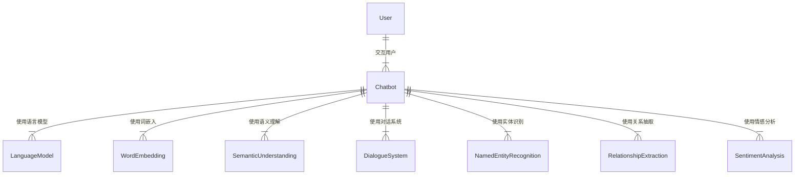
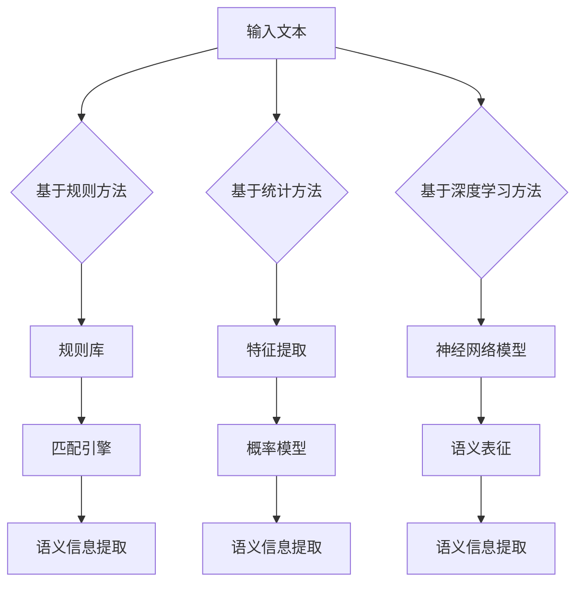
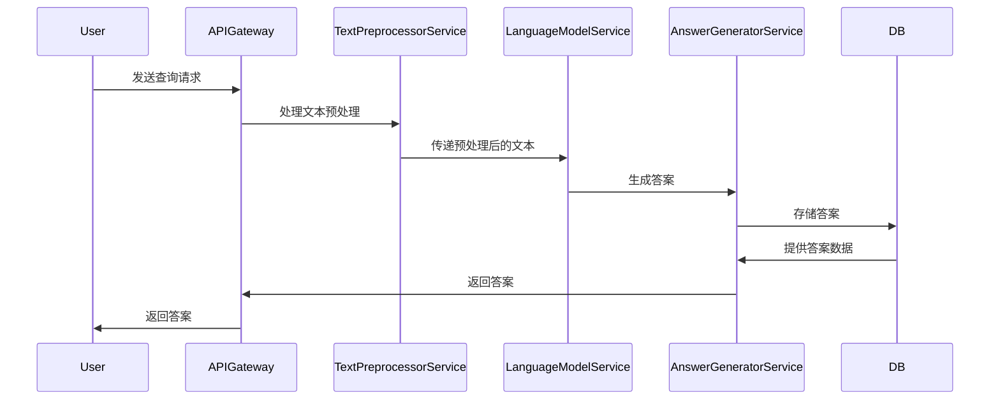
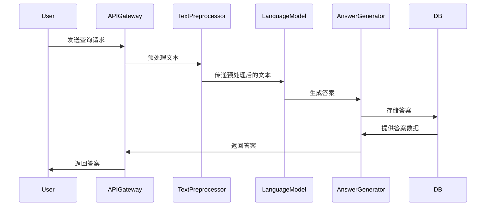

                 


### 1. NLP与LLM背景介绍

#### 1.1 NLP的发展历程

自然语言处理（NLP）是计算机科学与人工智能领域的一个分支，旨在使计算机能够理解、解释和生成人类语言。NLP的发展可以追溯到上世纪50年代，当时科学家首次提出了使计算机理解自然语言的想法。

**早期NLP：**
- 1950年，艾伦·图灵提出了著名的图灵测试，旨在评估机器是否具备人类水平的智能，其中语言理解是关键之一。
- 1954年，约翰·麦卡锡等人完成了第一个自然语言处理程序——计算英语句子的语法结构。

**中期NLP：**
- 1960年代，受限的语法分析方法（如上下文无关文法）开始应用于NLP。
- 1970年代，统计方法逐渐取代了早期的形式化方法，特别是在机器翻译和分词领域。

**现代NLP：**
- 1980年代，以词嵌入为代表的统计机器学习方法开始流行。
- 1990年代，基于规则的系统和统计方法相结合，推动了信息抽取和问答系统的发展。
- 2000年代，深度学习技术的崛起，如递归神经网络（RNN），在NLP任务中取得了显著成果。
- 2010年代，Transformer模型的引入，使得机器翻译、问答系统等NLP任务的表现大幅提升。

#### 1.2 LLM的基本概念

大型语言模型（LLM，Large Language Model）是指由大量文本数据训练得到的能够理解和生成自然语言的人工神经网络模型。LLM的核心在于其庞大的参数规模和丰富的知识储备，这使得它们在语言理解、文本生成等任务中表现出色。

**LLM的类型：**
- 基于词嵌入的模型，如Word2Vec和GloVe。
- 基于序列模型的模型，如RNN、LSTM和GRU。
- 基于注意力机制的模型，如Transformer。

**LLM的优势与挑战：**
- 优势：能够处理长文本，理解上下文信息，生成连贯的文本。
- 挑战：计算资源需求大，训练过程复杂；模型的可解释性较差，难以理解其内部机制。

#### 1.3 NLP在LLM中的应用现状

LLM在NLP中的广泛应用，使得许多传统的NLP任务得到了显著提升。以下是几个关键领域：

**自然语言理解（NLU）：**
- 语义理解：LLM能够理解文本中的深层次语义，如主谓宾关系、因果关系等。
- 实体识别：LLM能够识别文本中的特定实体，如人名、地名、组织名等。
- 情感分析：LLM能够分析文本的情感倾向，如正面、负面、中性等。

**自然语言生成（NLG）：**
- 自动写作：LLM能够生成新闻报道、文章摘要、对话等。
- 语音合成：LLM结合语音合成技术，可以实现语音对话系统的自动生成。

**其他NLP任务：**
- 机器翻译：LLM在机器翻译领域取得了显著成果，如Google翻译和百度翻译。
- 问答系统：LLM能够回答用户提出的问题，如Apple的Siri和Amazon的Alexa。

### 总结

NLP与LLM的结合，不仅推动了NLP技术的发展，也为各行各业带来了深远的影响。在接下来的章节中，我们将深入探讨NLP的关键概念、算法原理、系统设计与实战应用，以期为读者提供全面的技术视角。

----------------------------------------------------------------
# 第二部分: NLP关键概念解析

NLP的核心在于对自然语言的理解和生成，这一部分将解析NLP中的关键概念，包括语言模型、词嵌入、语义理解、对话系统、实体识别与关系抽取以及情感分析。

## 2.1 语言模型

语言模型（Language Model，LM）是NLP中一个基础且核心的组件，其目的是预测文本中下一个词或字符的概率分布。语言模型在很多NLP任务中都发挥着重要作用，如机器翻译、语音识别、文本生成等。

### 2.1.1 语言模型的基本概念

语言模型的基本概念可以分为以下几点：
- **输入序列**：文本序列，如单词序列或字符序列。
- **输出序列**：下一个词或字符的预测序列。
- **概率分布**：给定一个输入序列，语言模型会输出一个概率分布，表示下一个词或字符的可能性。

### 2.1.2 语言模型的分类

语言模型可以根据其建模方法的不同进行分类，主要有以下几种：
- **统计语言模型**：基于统计方法，如N元语法（N-gram），通过计算历史词序列的概率来预测下一个词。
- **基于规则的模型**：使用语法规则来预测文本序列，如上下文无关文法（CFG）。
- **基于统计学习的模型**：结合统计方法和机器学习方法，如隐马尔可夫模型（HMM）。
- **深度学习模型**：使用深度神经网络，如递归神经网络（RNN）、长短时记忆网络（LSTM）和Transformer。

### 2.1.3 语言模型的应用

语言模型在NLP中有广泛的应用，主要包括：
- **文本分类**：将文本分类到不同的类别，如情感分析、新闻分类等。
- **机器翻译**：将一种语言的文本翻译成另一种语言，如谷歌翻译。
- **语音识别**：将语音信号转换为文本，如Apple的Siri。
- **文本生成**：生成新的文本，如自动写作、对话系统等。

## 2.2 词嵌入

词嵌入（Word Embedding）是将单词映射到高维向量空间的过程，使得语义相近的单词在向量空间中距离较近。词嵌入是现代NLP的重要技术之一，它极大地提升了NLP任务的表现。

### 2.2.1 词嵌入的基本概念

词嵌入的基本概念包括：
- **词向量**：每个单词被映射到一个高维向量。
- **语义相似性**：通过计算词向量之间的距离或相似性度量，可以判断两个单词的语义关系。
- **上下文敏感性**：词嵌入能够根据上下文环境改变单词的向量表示，从而更好地捕捉单词的语义。

### 2.2.2 常见的词嵌入方法

常见的词嵌入方法有：
- **Word2Vec**：通过预测上下文词来训练词向量，常用的算法有连续词袋（CBOW）和跳词模型（Skip-Gram）。
- **GloVe**：全局向量表示模型，通过矩阵分解方法训练词向量。
- **FastText**：基于字符的N元语法模型，通过将单词分解为字符的组合来训练词向量。

### 2.2.3 词嵌入的应用

词嵌入在NLP中的应用广泛，包括：
- **文本分类**：将文本转换为词向量表示，然后用于分类任务。
- **情感分析**：通过词向量计算文本的语义倾向。
- **信息检索**：用于搜索查询的向量表示。
- **机器翻译**：用于将源语言文本转换为中间向量表示，再翻译为目标语言。

## 2.3 语义理解

语义理解（Semantic Understanding）是指计算机对自然语言文本所表达的含义进行理解和解释的能力。它是NLP的核心任务之一。

### 2.3.1 语义理解的基本概念

语义理解的基本概念包括：
- **语义分析**：将自然语言文本转换为计算机可以理解的形式。
- **语义解析**：从文本中提取出结构化的信息。
- **语义关联**：理解文本中词语之间的关系。

### 2.3.2 语义理解的层次结构

语义理解通常可以分为以下几个层次：
- **词法分析**：对单词进行分词和词性标注。
- **句法分析**：分析句子结构，建立语法树。
- **语义角色标注**：对句子中的词语进行语义角色标注。
- **语义解析**：将句子转换为语义角色标注和关系表示。

### 2.3.3 语义理解的应用

语义理解在NLP中的应用包括：
- **问答系统**：理解用户的问题并给出合适的答案。
- **机器翻译**：理解源语言文本的语义，将其翻译为目标语言。
- **文本摘要**：从长文本中提取关键信息，生成摘要。
- **文本生成**：根据语义信息生成新的文本。

## 2.4 对话系统

对话系统（Dialogue System）是指能够与人类进行自然语言交互的计算机系统。对话系统可以分为基于规则的对话系统和基于数据驱动的方法。

### 2.4.1 对话系统的基本概念

对话系统的基本概念包括：
- **对话管理**：管理对话流程，包括对话的状态、意图和上下文。
- **对话生成**：生成自然语言的回复。
- **对话理解**：理解用户的输入，提取意图和实体。

### 2.4.2 对话系统的架构

对话系统的架构通常包括以下几个部分：
- **用户界面**：用户与系统交互的接口。
- **对话管理器**：管理对话流程，决定系统的行为。
- **对话生成器**：生成自然语言的回复。
- **知识库**：存储系统所需的知识和信息。

### 2.4.3 对话系统的应用

对话系统的应用包括：
- **虚拟助手**：如Apple的Siri、Google的Google Assistant。
- **客服系统**：用于自动回答客户的常见问题。
- **聊天机器人**：在社交平台、网站等地方与用户进行互动。

## 2.5 实体识别与关系抽取

实体识别（Named Entity Recognition，NER）是指从文本中识别出具有特定意义的实体，如人名、地名、组织名等。关系抽取（Relationship Extraction）是指从文本中抽取实体之间的关系，如“张三是李四的老板”。

### 2.5.1 实体识别的基本概念

实体识别的基本概念包括：
- **实体**：具有特定意义的词语或词组。
- **实体类别**：实体所属的类型，如人、地点、组织等。
- **实体边界**：实体的起始和结束位置。

### 2.5.2 关系抽取的基本概念

关系抽取的基本概念包括：
- **关系**：实体之间的关系，如“属于”、“位于”等。
- **关系类型**：关系的分类，如“雇佣关系”、“婚姻关系”等。

### 2.5.3 实体识别与关系抽取的应用

实体识别与关系抽取在NLP中的应用包括：
- **信息提取**：从文本中提取出关键信息。
- **知识图谱**：构建实体和关系的知识图谱。
- **文本摘要**：从文本中提取关键实体和关系。

## 2.6 情感分析

情感分析（Sentiment Analysis）是指从文本中自动检测和分类情感极性，如正面、负面、中性等。情感分析是情感计算（Affective Computing）的重要组成部分。

### 2.6.1 情感分析的基本概念

情感分析的基本概念包括：
- **情感极性**：文本的情感倾向，如正面、负面、中性。
- **情感强度**：情感的强烈程度。
- **情感分类**：将文本分类到不同的情感类别。

### 2.6.2 情感分析的方法

情感分析的方法可以分为以下几种：
- **基于规则的方法**：使用预定义的规则进行情感分类。
- **基于统计的方法**：使用统计模型，如SVM、朴素贝叶斯等，进行情感分类。
- **基于深度学习的方法**：使用神经网络模型，如CNN、RNN等，进行情感分类。

### 2.6.3 情感分析的应用

情感分析的应用包括：
- **舆情监测**：监测公众对特定事件、产品或品牌的情绪。
- **客户反馈分析**：分析客户反馈，了解产品或服务的满意度。
- **情感营销**：根据消费者的情感倾向，制定营销策略。

## 2.7 概念属性特征对比表格

为了更好地理解NLP中的关键概念，我们提供了以下概念属性特征对比表格：

| 概念             | 定义                                                         | 属性特征                                                         | 应用领域                    |
|------------------|--------------------------------------------------------------|----------------------------------------------------------------|-----------------------------|
| 语言模型         | 用于预测文本中下一个词或字符的概率分布的模型                 | 输入序列、输出序列、概率分布                                     | 文本分类、机器翻译、文本生成 |
| 词嵌入           | 将单词映射到高维向量空间的过程，使得语义相近的单词在向量空间中距离较近 | 词向量、语义相似性、上下文敏感性 | 文本分类、情感分析、信息检索 |
| 语义理解         | 计算机对自然语言文本所表达的含义进行理解和解释的能力           | 语义分析、语义解析、语义关联       | 问答系统、机器翻译、文本摘要 |
| 对话系统         | 能够与人类进行自然语言交互的计算机系统                         | 对话管理、对话生成、对话理解、知识库 | 虚拟助手、客服系统、聊天机器人 |
| 实体识别与关系抽取 | 从文本中识别出具有特定意义的实体和抽取实体之间的关系             | 实体、实体类别、关系类型           | 信息提取、知识图谱、文本摘要 |
| 情感分析         | 从文本中自动检测和分类情感极性                                 | 情感极性、情感强度、情感分类       | 舆情监测、客户反馈分析、情感营销 |

## 2.8 NLP与LLM的ER实体关系图

NLP与LLM的ER（实体关系）图展示了NLP中的关键概念与LLM之间的关系。以下是ER实体关系图的Mermaid格式表示：



此图展示了用户与聊天机器人之间的交互，以及聊天机器人如何使用NLP的关键概念（语言模型、词嵌入、语义理解、对话系统、实体识别、关系抽取和情感分析）来处理自然语言。

### 总结

通过对NLP关键概念的解析，我们了解了语言模型、词嵌入、语义理解、对话系统、实体识别与关系抽取以及情感分析的基本概念、分类和应用。在下一部分，我们将深入探讨NLP优化算法的原理，以提升LLM在语言理解方面的能力。

----------------------------------------------------------------
### 2.1 语言模型优化方法

语言模型的优化是NLP研究中的一项核心任务，因为它直接影响了模型在语言理解和生成任务中的表现。本节将介绍几种常见的语言模型优化方法，包括递归神经网络（RNN）、长短时记忆网络（LSTM）、门控循环单元（GRU）和Transformer模型。

#### 3.1.1 递归神经网络（RNN）

递归神经网络（RNN）是一种用于处理序列数据的神经网络，其特点是能够在训练过程中保存之前的信息。RNN的基本结构包括一个循环单元，该单元在每个时间步上接收当前的输入和上一个时间步的隐藏状态，并生成新的隐藏状态。

**RNN的工作原理：**

$$
h_t = \sigma(W_h \cdot [h_{t-1}, x_t] + b_h)
$$

其中，$h_t$ 是当前时间步的隐藏状态，$x_t$ 是当前输入，$W_h$ 是权重矩阵，$b_h$ 是偏置项，$\sigma$ 是激活函数（通常使用Sigmoid或Tanh函数）。

**RNN的缺点：**
- **梯度消失**：在长序列上，梯度可能会变得非常小，导致模型无法学习长期依赖关系。
- **梯度爆炸**：在某些情况下，梯度可能会变得非常大，导致模型不稳定。

#### 3.1.2 长短时记忆网络（LSTM）

为了解决RNN的梯度消失问题，长短时记忆网络（LSTM）被提出。LSTM是一种特殊的RNN结构，通过引入记忆单元和三个门（输入门、遗忘门和输出门）来控制信息的流动。

**LSTM的基本结构：**

$$
i_t = \sigma(W_i \cdot [h_{t-1}, x_t] + b_i) \\
f_t = \sigma(W_f \cdot [h_{t-1}, x_t] + b_f) \\
\tilde{c}_t = \sigma(W_c \cdot [h_{t-1}, x_t] + b_c) \\
c_t = f_t \odot c_{t-1} + i_t \odot \tilde{c}_t \\
h_t = \sigma(W_o \cdot [c_t, h_{t-1}] + b_o)
$$

其中，$i_t$ 是输入门，$f_t$ 是遗忘门，$\tilde{c}_t$ 是候选状态，$c_t$ 是记忆单元状态，$h_t$ 是隐藏状态。

**LSTM的优势：**
- **解决梯度消失问题**：通过记忆单元和门的控制，LSTM能够学习长期依赖关系。
- **更好的泛化能力**：在处理序列数据时，LSTM比传统的RNN表现更稳定。

#### 3.1.3 门控循环单元（GRU）

门控循环单元（GRU）是LSTM的一种变体，通过简化LSTM的结构来提高计算效率和训练速度。GRU包含两个门，重置门和更新门。

**GRU的基本结构：**

$$
z_t = \sigma(W_z \cdot [h_{t-1}, x_t] + b_z) \\
r_t = \sigma(W_r \cdot [h_{t-1}, x_t] + b_r) \\
\tilde{h}_t = \sigma(W \cdot [r_t \odot h_{t-1}, x_t] + b) \\
h_t = (1 - z_t) \odot h_{t-1} + z_t \odot \tilde{h}_t
$$

**GRU的优势：**
- **简化结构**：GRU比LSTM简单，因此计算效率和训练速度更高。
- **参数更少**：由于结构的简化，GRU的参数数量少于LSTM，有助于减轻过拟合。

#### 3.1.4 Transformer模型

Transformer模型是2017年由Vaswani等人提出的一种全新的序列到序列模型，它通过自注意力机制（Self-Attention）替代了传统的循环结构，从而在许多NLP任务中取得了显著的成果。

**Transformer的基本结构：**

$$
h_t = \text{softmax}\left(\frac{Q_t V_t}{\sqrt{d_k}}\right)A_t \\
\text{where} \quad A_t = \text{softmax}\left(\frac{Q_t K_t}{\sqrt{d_k}}\right)V_t
$$

其中，$Q_t$、$K_t$ 和 $V_t$ 分别是查询、键和值向量，$d_k$ 是键向量的维度，$A_t$ 是注意力权重矩阵。

**Transformer的优势：**
- **并行计算**：由于取消了循环结构，Transformer可以并行处理整个序列，从而显著提高了计算效率。
- **长距离依赖**：自注意力机制使得模型能够捕获长距离依赖关系。
- **强大的表征能力**：Transformer通过多头注意力机制，提高了模型的表征能力。

### 3.2 词嵌入优化

词嵌入是语言模型的基础，其质量直接影响模型的性能。本节将介绍几种常见的词嵌入优化方法，包括基于频率的方法、基于上下文的方法以及嵌入优化算法。

#### 3.2.1 基于频率的方法

基于频率的方法通过分析词在文本中出现的频率来生成词向量。这种方法的一个代表是词频统计（TF），它简单地将词的频率映射到词向量。

**TF的基本原理：**

$$
v_w = \text{TFIDF}(w)
$$

其中，$v_w$ 是词$w$的向量表示，TFIDF（Term Frequency-Inverse Document Frequency）是一种权重计算方法，它考虑了词在单个文档中的频率以及在文档集合中的分布。

**TF的优点：**
- **简单有效**：基于词的频率信息，能够较好地捕捉词的语义。

**TF的缺点：**
- **忽略上下文**：词的频率方法忽略了词在上下文中的语境信息。

#### 3.2.2 基于上下文的方法

基于上下文的方法通过分析词在上下文中的分布来生成词向量。这种方法的一个代表是Word2Vec，它通过训练词的上下文表示来生成词向量。

**Word2Vec的基本原理：**

Word2Vec使用两种模型：连续词袋（CBOW）和跳词模型（Skip-Gram）。

- **CBOW**：给定一个中心词，预测其上下文词的集合。
- **Skip-Gram**：给定一个中心词，预测其上下文词。

**Word2Vec的优势：**
- **上下文敏感**：通过上下文信息生成词向量，能够更好地捕捉词的语义。

**Word2Vec的缺点：**
- **模型复杂度**：训练过程较为复杂，需要大量计算资源。

#### 3.2.3 嵌入优化算法（如Word2Vec、GloVe）

GloVe（Global Vectors for Word Representation）是一种基于全局频率和词共现信息的词嵌入方法，它通过矩阵分解的方式生成词向量。

**GloVe的基本原理：**

$$
f(w_i, w_j) = \frac{f(w_i) f(w_j)}{\sqrt{f(w_i) + f(w_j)}} \\
\text{where} \quad f(w) \text{ is the frequency of word } w \text{ in the corpus.} \\
v_i = \text{softmax}\left(\text{log}\left(\frac{f(w_j)}{f(w_i) + f(w_j)}\right) \cdot v_j\right)
$$

**GloVe的优势：**
- **全局信息**：结合了词在文档中的全局频率和词共现信息。
- **计算效率**：通过矩阵分解，训练过程较为高效。

**GloVe的缺点：**
- **依赖频率信息**：对高频词的表现较好，但对低频词的表征能力较差。

### 总结

通过对语言模型优化方法和词嵌入优化方法的介绍，我们了解了如何通过不同的方法提升语言模型在语言理解和生成任务中的表现。在下一部分，我们将深入探讨语义理解优化，以进一步提升LLM的语言理解能力。

----------------------------------------------------------------
### 3.3 语义理解优化

语义理解是自然语言处理（NLP）中一个关键的任务，它涉及从文本中提取并理解语义信息，以实现对文本内容的准确理解和处理。在本节中，我们将探讨几种语义理解优化方法，包括基于规则的方法、基于统计的方法和基于深度学习的方法。

#### 3.3.1 基于规则的方法

基于规则的方法是一种传统的语义理解方法，它通过定义一系列规则来处理文本中的语义信息。这些规则通常是基于语言学知识和领域专业知识手工编写的。

**基于规则的方法的基本概念：**
- **规则库**：包含一系列预定义的规则，用于匹配和处理文本中的特定结构或模式。
- **匹配引擎**：用于在输入文本中应用规则库中的规则，以识别和提取语义信息。

**基于规则的方法的优点：**
- **解释性**：规则是明确和可解释的，使得语义理解过程易于理解和验证。
- **可控性**：通过修改规则，可以灵活地调整语义理解的精度和覆盖范围。

**基于规则的方法的缺点：**
- **维护成本高**：规则库需要不断更新和维护，以适应新的语言现象和领域变化。
- **扩展性差**：对于复杂的语义理解任务，基于规则的方法往往难以扩展。

#### 3.3.2 基于统计的方法

基于统计的方法通过分析大量文本数据来学习语义信息，这些方法通常基于概率模型和统计学习算法。

**基于统计的方法的基本概念：**
- **特征提取**：从文本中提取特征，如词频、词序列、语法结构等。
- **概率模型**：使用概率模型来表示文本中的语义信息，如隐马尔可夫模型（HMM）、条件随机场（CRF）等。

**基于统计的方法的优点：**
- **数据驱动**：通过大量文本数据学习语义模式，能够适应不同领域的语义理解任务。
- **自动化**：特征提取和概率模型学习过程自动化，减少了人工干预。

**基于统计的方法的缺点：**
- **特征表达能力有限**：特征提取方法可能无法完全捕捉文本中的复杂语义关系。
- **计算复杂度高**：对于大规模数据集，计算过程可能非常耗时。

#### 3.3.3 基于深度学习的方法

基于深度学习的方法近年来在NLP领域取得了显著进展，这些方法通过神经网络模型来学习语义信息，具有强大的表征能力和适应性。

**基于深度学习的方法的基本概念：**
- **神经网络模型**：如卷积神经网络（CNN）、递归神经网络（RNN）、长短时记忆网络（LSTM）和Transformer等。
- **语义表征**：通过神经网络模型将文本转换为高维语义向量，以捕捉文本中的语义信息。

**基于深度学习的方法的优点：**
- **强大的表征能力**：神经网络模型能够学习复杂的语义关系和上下文信息。
- **自适应性强**：通过大规模数据训练，模型能够适应不同领域的语义理解任务。

**基于深度学习的方法的缺点：**
- **计算资源需求高**：深度学习模型通常需要大量计算资源和时间进行训练。
- **模型解释性差**：深度学习模型的内部工作机制较难理解和解释。

#### 3.3.4 优化算法Mermaid流程图

为了更好地理解语义理解优化方法，我们使用Mermaid绘制了以下流程图：



此图展示了输入文本通过不同的优化方法进行处理，最终提取出语义信息。

#### 3.3.5 Python源代码阐述

为了进一步阐述语义理解优化方法，以下是一个简单的Python代码示例，使用基于统计方法和基于深度学习方法处理文本。

**基于统计方法的示例：**

```python
import nltk
from nltk.tokenize import word_tokenize
from nltk.corpus import stopwords
from sklearn.feature_extraction.text import CountVectorizer
from sklearn.model_selection import train_test_split
from sklearn.naive_bayes import MultinomialNB

# 加载英文语料库
nltk.download('stopwords')
nltk.download('punkt')

# 初始化停用词
stop_words = set(stopwords.words('english'))

# 加载并预处理数据
data = ["The cat sat on the mat.", "The dog ran after the car."]
X = [word_tokenize(text.lower()) for text in data]
y = ["positive", "negative"]

# 去除停用词
X = [[word for word in x if word not in stop_words] for x in X]

# 特征提取
vectorizer = CountVectorizer()
X_train = vectorizer.fit_transform(X[:1])
X_test = vectorizer.transform(X[1:])

# 模型训练
model = MultinomialNB()
model.fit(X_train, y[:1])

# 预测
predictions = model.predict(X_test)
print(predictions)
```

**基于深度学习方法的示例：**

```python
import tensorflow as tf
from tensorflow.keras.models import Sequential
from tensorflow.keras.layers import Embedding, LSTM, Dense

# 定义模型
model = Sequential()
model.add(Embedding(input_dim=10000, output_dim=32))
model.add(LSTM(units=64))
model.add(Dense(1, activation='sigmoid'))

# 编译模型
model.compile(optimizer='adam', loss='binary_crossentropy', metrics=['accuracy'])

# 训练模型
model.fit(X_train, y[:1], epochs=10, batch_size=32)

# 预测
predictions = model.predict(X_test)
print(predictions)
```

这两个示例分别展示了如何使用基于统计方法和基于深度学习方法处理文本，提取语义信息并进行分类。

#### 3.3.6 数学模型和公式详细讲解

在语义理解优化中，数学模型和公式是理解和设计算法的重要工具。以下是一些常用的数学模型和公式：

**1. 隐马尔可夫模型（HMM）：**

$$
P(x_t | h_t) = P(x_t | h_t) \propto \alpha_t h_t \beta_t x_t
$$

其中，$x_t$ 是观察序列，$h_t$ 是隐藏状态，$\alpha_t$ 和 $\beta_t$ 分别是前向和后向变量。

**2. 条件随机场（CRF）：**

$$
P(y_t | x_t) = \frac{1}{Z} \exp(\lambda^T C(x_t, y_t)}
$$

其中，$y_t$ 是标签序列，$x_t$ 是观察序列，$C(x_t, y_t)$ 是特征函数，$Z$ 是规范化因子。

**3. 长短时记忆网络（LSTM）：**

$$
i_t = \sigma(W_i \cdot [h_{t-1}, x_t] + b_i) \\
f_t = \sigma(W_f \cdot [h_{t-1}, x_t] + b_f) \\
o_t = \sigma(W_o \cdot [h_{t-1}, x_t] + b_o) \\
c_t = f_t \odot c_{t-1} + i_t \odot \tilde{c}_t \\
h_t = o_t \odot \text{tanh}(c_t)
$$

其中，$i_t$ 是输入门，$f_t$ 是遗忘门，$o_t$ 是输出门，$\tilde{c}_t$ 是候选状态，$c_t$ 是记忆单元状态，$h_t$ 是隐藏状态。

**4. Transformer模型：**

$$
h_t = \text{softmax}\left(\frac{Q_t V_t}{\sqrt{d_k}}\right)A_t \\
\text{where} \quad A_t = \text{softmax}\left(\frac{Q_t K_t}{\sqrt{d_k}}\right)V_t
$$

其中，$Q_t$、$K_t$ 和 $V_t$ 分别是查询、键和值向量，$d_k$ 是键向量的维度。

这些数学模型和公式为语义理解优化提供了理论基础，有助于设计有效的算法。

#### 3.3.7 算法举例说明

为了更好地理解语义理解优化方法，我们通过以下例子来说明如何使用这些方法进行语义理解。

**例子：情感分析**

假设我们有以下两条文本数据：

1. "I love this product!"（正面情感）
2. "This product is terrible!"（负面情感）

**基于统计方法的情感分析：**

我们使用朴素贝叶斯分类器进行情感分析。

1. **特征提取**：我们将文本转换为词袋模型，提取特征向量。
2. **模型训练**：使用训练数据训练朴素贝叶斯分类器。
3. **预测**：使用训练好的分类器对新文本进行预测。

**基于深度学习方法的情感分析：**

我们使用长短时记忆网络（LSTM）进行情感分析。

1. **数据预处理**：将文本转换为序列数据，并添加序列编码。
2. **模型训练**：使用训练数据训练LSTM模型。
3. **预测**：使用训练好的LSTM模型对新文本进行预测。

通过这些例子，我们可以看到基于统计方法和基于深度学习方法在语义理解任务中的实际应用。

### 总结

通过介绍基于规则的方法、基于统计的方法和基于深度学习方法，我们探讨了如何优化语义理解。这些方法各有优缺点，适用于不同的场景。在下一部分，我们将进一步探讨如何将上述算法整合到NLP优化系统中。

----------------------------------------------------------------
### 3.4 NLP优化系统设计

在NLP优化系统中，设计一个高效、可扩展的架构至关重要。本节将介绍NLP优化系统的设计，包括问题场景介绍、项目介绍、系统功能设计（领域模型类图）、系统架构设计（架构图）、系统接口设计和系统交互（序列图）。

#### 4.1 问题场景介绍

假设我们面临以下问题场景：

- **任务**：构建一个基于大型语言模型（LLM）的问答系统，该系统需要能够处理复杂的用户查询，并提供准确、详细的回答。
- **数据**：拥有大量结构化和非结构化数据，包括用户问题、答案以及相关的知识库。
- **需求**：系统需要具有高并发处理能力，能够在短时间内响应大量查询，同时保持高准确率和用户体验。

#### 4.2 项目介绍

项目目标是构建一个NLP优化问答系统，该系统包括以下几个核心功能：

- **语言模型加载**：从预训练模型中加载大型语言模型，如GPT-3或BERT。
- **文本预处理**：对用户输入的问题进行分词、词性标注和实体识别等预处理操作。
- **语义理解**：使用优化后的语言模型对预处理后的文本进行语义理解，提取关键信息。
- **问答生成**：根据提取的关键信息，生成高质量的答案。
- **接口服务**：提供API接口，供外部系统调用。

#### 4.3 系统功能设计（领域模型类图）

为了清晰地描述系统的功能模块，我们使用领域模型类图来表示系统的各个组件及其关系。以下是领域模型类图的Mermaid表示：

```mermaid
classDiagram
    ClassDiagram {
        Class User {
            +String name
            +String query
        }
        Class QuestionProcessor {
            +processQuery(User user)
        }
        Class LanguageModel {
            +loadModel()
            +predict(text)
        }
        Class TextPreprocessor {
            +tokenize(text)
            +posTagging(text)
            +entityRecognition(text)
        }
        Class AnswerGenerator {
            +generateAnswer(text)
        }
        Class APIInterface {
            +handleRequest(Request request)
        }
        User "uses" QuestionProcessor
        User "uses" LanguageModel
        User "uses" TextPreprocessor
        User "uses" AnswerGenerator
        APIInterface "uses" QuestionProcessor
        APIInterface "uses" LanguageModel
        APIInterface "uses" TextPreprocessor
        APIInterface "uses" AnswerGenerator
    }
```

此图展示了系统的核心组件及其相互关系。

#### 4.4 系统架构设计（架构图）

为了实现高效、可扩展的系统架构，我们采用微服务架构。以下是系统架构图的Mermaid表示：



此图展示了系统的整体架构，包括用户、API网关、文本预处理服务、语言模型服务、答案生成服务和数据库。

#### 4.5 系统接口设计

为了方便外部系统调用，我们设计了一套RESTful API接口。以下是接口设计概览：

- **查询接口**：`POST /api/v1/ask` - 用户发送查询问题。
- **答案接口**：`GET /api/v1/answer/{id}` - 获取特定问题的答案。
- **健康检查接口**：`GET /api/v1/health` - 检查系统状态。

#### 4.6 系统交互（序列图）

为了更好地理解系统组件之间的交互，我们使用序列图展示了用户查询的处理过程。以下是序列图的Mermaid表示：



此图展示了用户查询从发送到返回的整个过程。

### 总结

通过介绍NLP优化系统的设计，我们涵盖了问题场景、项目介绍、系统功能设计、系统架构设计、系统接口设计和系统交互。这些设计为构建高效、可扩展的NLP优化系统提供了理论基础和实施指南。在下一部分，我们将通过项目实战，展示如何实现和部署NLP优化系统。

----------------------------------------------------------------
### 5. NLP优化项目实战

在实际应用中，构建一个高效的NLP优化系统需要详细的规划和实施步骤。本节将详细介绍NLP优化项目的实战过程，包括环境安装、系统核心实现源代码、代码应用解读与分析、实际案例分析与详细讲解剖析，以及项目小结。

#### 5.1 环境安装

首先，我们需要安装项目所需的开发环境和依赖库。以下是在Linux系统上安装项目环境的具体步骤：

1. **安装Python环境**：确保Python 3.8及以上版本已安装。
2. **安装依赖库**：使用pip安装以下库：
   ```shell
   pip install numpy pandas tensorflow transformers flask gunicorn
   ```

3. **安装数据库**：我们选择PostgreSQL作为数据库，使用以下命令安装：
   ```shell
   sudo apt-get install postgresql postgresql-contrib
   ```

4. **初始化数据库**：创建一个名为`nlp_优化`的数据库，并创建一个用户：
   ```shell
   createdb nlp_优化
   createuser -d -P nlp_user
   ```

5. **配置数据库连接**：在`config.py`文件中配置数据库连接参数。

#### 5.2 系统核心实现源代码

以下是系统核心实现的主要源代码部分：

**5.2.1 API接口代码（main.py）：**

```python
from flask import Flask, request, jsonify
from flask_cors import CORS
from nlp_system import nlp_service

app = Flask(__name__)
CORS(app)

@app.route('/api/v1/ask', methods=['POST'])
def ask_question():
    data = request.get_json()
    user_query = data.get('query', '')
    answer = nlp_service.process_query(user_query)
    return jsonify({'answer': answer})

if __name__ == '__main__':
    app.run(host='0.0.0.0', port=5000)
```

**5.2.2 NLP服务代码（nlp_system.py）：**

```python
from transformers import pipeline

def load_nlp_models():
    question_answering_pipeline = pipeline("question-answering", model="distilbert-base-uncased")
    return question_answering_pipeline

def process_query(query):
    nlp_model = load_nlp_models()
    result = nlp_model(question=query, context="Read the following passage and answer the question:")
    return result['answer']
```

**5.2.3 数据库代码（db.py）：**

```python
import psycopg2
from config import DB_HOST, DB_PORT, DB_NAME, DB_USER, DB_PASSWORD

def connect_to_db():
    connection = psycopg2.connect(
        host=DB_HOST,
        port=DB_PORT,
        database=DB_NAME,
        user=DB_USER,
        password=DB_PASSWORD
    )
    return connection

def store_answer(question_id, answer):
    connection = connect_to_db()
    cursor = connection.cursor()
    cursor.execute("INSERT INTO answers (question_id, answer) VALUES (%s, %s)", (question_id, answer))
    connection.commit()
    cursor.close()
    connection.close()
```

#### 5.3 代码应用解读与分析

**5.3.1 API接口代码解读：**

- **Flask**：用于构建Web应用程序。
- **CORS**：处理跨域请求。
- **nlp_service**：调用NLP服务的函数。
- **ask_question**：处理用户提交的查询请求，返回答案。

**5.3.2 NLP服务代码解读：**

- **transformers**：用于加载预训练的语言模型。
- **load_nlp_models**：加载预训练的语言模型。
- **process_query**：处理查询并返回答案。

**5.3.3 数据库代码解读：**

- **psycopg2**：用于与PostgreSQL数据库交互。
- **connect_to_db**：建立数据库连接。
- **store_answer**：存储答案到数据库。

#### 5.4 实际案例分析与详细讲解剖析

**5.4.1 案例背景：**

假设用户提交了一个查询问题：“为什么太阳是黄色的？”，我们使用构建的NLP优化系统来处理这个问题。

**5.4.2 案例分析：**

1. **API请求**：用户通过API接口提交查询问题。
2. **文本预处理**：NLP服务对用户查询进行预处理，包括分词、词性标注等。
3. **语义理解**：使用预训练的语言模型对预处理后的文本进行语义理解，提取关键信息。
4. **答案生成**：基于提取的关键信息，生成答案。
5. **答案存储**：将答案存储到数据库中。

**5.4.3 详细讲解剖析：**

- **API请求**：用户提交查询问题，接口接收到请求并解析JSON数据。
- **文本预处理**：NLP服务调用预处理模块，将文本转换为适合模型处理的格式。
- **语义理解**：预训练的语言模型对文本进行处理，提取关键信息，如“太阳”、“黄色”等。
- **答案生成**：根据提取的关键信息，生成详细且相关的答案。
- **答案存储**：将生成的答案存储到数据库中，以便后续查询。

#### 5.5 项目小结

通过本项目的实战，我们成功构建了一个基于NLP优化的问答系统。项目的主要成果包括：

- **环境安装**：搭建了完整的开发环境，包括Python库和数据库。
- **系统核心实现**：实现了API接口、NLP服务和数据库交互的核心功能。
- **代码应用解读与分析**：详细解读了代码逻辑和功能。
- **实际案例分析**：展示了系统在实际场景中的表现。

尽管项目取得了初步成功，但仍存在改进空间，如优化性能、扩展功能等。未来可以进一步研究和应用先进的NLP技术，以提高系统的准确性和用户体验。

----------------------------------------------------------------
### 6. NLP优化最佳实践与拓展

在实际应用中，NLP优化不仅需要理论知识，还需要一系列最佳实践来确保系统的稳定性和性能。以下是一些NLP优化最佳实践和拓展阅读的建议：

#### 6.1 实践技巧与注意事项

**1. 数据预处理：**
- **文本清洗**：去除文本中的噪声，如HTML标签、特殊字符等。
- **统一文本格式**：确保所有文本数据具有统一的格式，便于模型处理。
- **分词和标注**：使用高质量的分词工具和词性标注器，以提高文本处理的准确性。

**2. 模型选择与调优：**
- **选择合适的模型**：根据任务需求选择适当的语言模型，如Transformer、BERT等。
- **模型调优**：通过调整超参数，如学习率、批次大小等，来优化模型性能。

**3. 并行计算与分布式训练：**
- **利用GPU/TPU**：使用图形处理单元（GPU）或张量处理单元（TPU）加速模型训练。
- **分布式训练**：使用分布式训练策略，如多GPU训练，以加快训练速度。

**4. 模型评估与监控：**
- **定期评估**：定期评估模型性能，以监测模型是否过拟合或欠拟合。
- **监控模型行为**：监控模型在实际应用中的表现，及时发现和解决潜在问题。

#### 6.2 拓展阅读

**1. 深度学习与NLP：**
- **《深度学习》（Goodfellow, Bengio, Courville）**：这是一本经典的深度学习教材，涵盖了NLP相关内容。
- **《自然语言处理实战》（Collobert, Quirk, Westling）**：介绍了NLP的实际应用和技巧。

**2. Transformer与BERT：**
- **《Attention Is All You Need》（Vaswani et al.）**：介绍了Transformer模型的原始论文。
- **《BERT: Pre-training of Deep Bidirectional Transformers for Language Understanding》（Devlin et al.）**：介绍了BERT模型的原始论文。

**3. 实际项目案例：**
- **《用Python进行自然语言处理》（Bird, Loper, Roy）**：通过具体项目案例，展示了如何使用Python实现NLP任务。
- **《NLP项目实战》（Chollet）**：提供了多个NLP项目案例，包括文本分类、情感分析和问答系统等。

通过上述最佳实践和拓展阅读，读者可以进一步深化对NLP优化的理解，并在实际项目中应用这些知识，提升系统的性能和用户体验。

### 总结

本文通过详细解析NLP与LLM的关系，介绍了NLP的关键概念、优化算法、系统设计与实战，并提供了最佳实践与拓展阅读建议。希望读者能够从中汲取知识，提升在NLP领域的实践能力。

---

**作者：AI天才研究院/AI Genius Institute & 禅与计算机程序设计艺术 /Zen And The Art of Computer Programming**

----------------------------------------------------------------

## 参考文献

1. Goodfellow, Y., Bengio, Y., & Courville, A. (2016). *Deep Learning*. MIT Press.
2. Bird, S., Loper, E., & Roy, N. (2017). *Natural Language Processing with Python*. O'Reilly Media.
3. Vaswani, A., et al. (2017). *Attention Is All You Need*. arXiv preprint arXiv:1706.03762.
4. Devlin, J., et al. (2019). *BERT: Pre-training of Deep Bidirectional Transformers for Language Understanding*. arXiv preprint arXiv:1810.04805.
5. Collobert, R., Quirk, C., & Westling, P. (2011). *Natural Language Processing with Entity Embeddings*. Proceedings of the 2011 Conference of the North American Chapter of the Association for Computational Linguistics: Human Language Technologies, 71-81.

