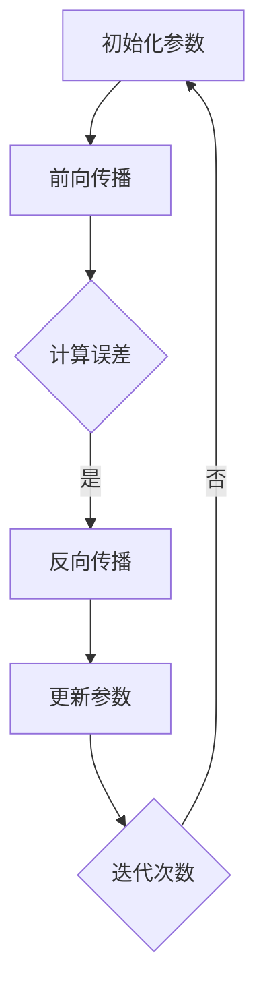
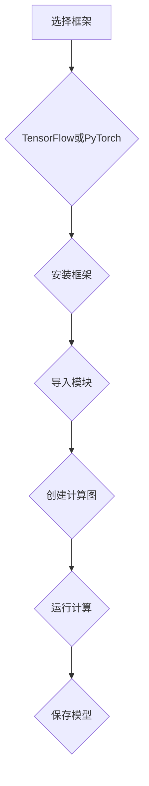

                 

## 第一部分: AI大模型背景与概述

### 第1章: AI大模型背景与核心概念

#### 1.1 AI大模型的问题背景与现状

##### 1.1.1 人工智能与大数据的交汇

人工智能（AI）的发展离不开大数据的支持。在过去的几十年里，人工智能经历了多个发展阶段，从早期的规则系统到现代的基于数据驱动的方法。随着互联网和物联网技术的普及，数据量呈现爆炸式增长，这为人工智能的发展提供了丰富的资源和动力。大数据时代的到来，使得人工智能算法能够从海量数据中提取有价值的信息，实现了从理论到应用的飞跃。

##### 1.1.1.1 人工智能的发展历程

人工智能的发展可以分为几个主要阶段：

1. **初始阶段（1950s-1960s）**：以图灵测试为代表，人们开始思考机器是否能够模拟人类智能。
2. **繁荣期（1970s-1980s）**：基于逻辑推理的专家系统和知识表示技术得到发展。
3. **衰退期（1990s）**：由于实际应用效果不佳，人工智能研究进入低谷。
4. **复兴期（2000s）**：随着计算能力的提升和机器学习技术的发展，人工智能重新焕发生机。
5. **快速发展期（2010s至今）**：深度学习、强化学习等算法的突破，使得人工智能在图像识别、自然语言处理等领域取得了显著成果。

##### 1.1.1.2 大数据时代的到来

大数据（Big Data）是指数据规模巨大、数据类型繁多、数据生成速度快的特点。大数据时代的到来，主要源于以下几个方面：

1. **技术进步**：云计算、分布式计算、内存计算等技术，使得数据处理能力得到大幅提升。
2. **物联网**：各种智能设备和传感器产生的大量数据，为大数据提供了丰富的数据源。
3. **互联网**：用户在网络上的行为数据，包括搜索、浏览、购物等，构成了庞大的数据集。

##### 1.1.2 AI大模型的需求与挑战

随着人工智能和大数据技术的发展，企业对高效AI模型的需求越来越强烈。大模型（Large-scale Models）在处理复杂任务时具有显著优势，但也面临以下挑战：

1. **数据需求**：大模型需要大量的标注数据进行训练，这使得数据获取和标注成为一大难题。
2. **计算资源**：大模型训练需要大量的计算资源，这对企业IT基础设施提出了更高的要求。
3. **算法优化**：如何优化算法，提高训练效率和模型性能，是当前研究的重点。

##### 1.1.2.1 企业对高效AI模型的需求

1. **智能决策**：通过分析大量数据，为企业提供决策支持，提高业务效率和竞争力。
2. **自动化运营**：利用AI模型实现自动化运维、自动化客服等，降低人力成本。
3. **创新应用**：结合行业特点，探索AI在各个领域的创新应用，创造新的商业机会。

##### 1.1.2.2 大模型训练的挑战与机遇

1. **挑战**：
   - 数据获取和标注：需要大量高质量的数据，且数据清洗和标注过程繁琐。
   - 计算资源：大模型训练需要大量的计算资源，对硬件设施有较高要求。
   - 算法优化：如何优化算法，提高训练效率和模型性能，是当前研究的重点。

2. **机遇**：
   - 随着云计算、分布式计算技术的发展，计算资源问题逐渐得到解决。
   - 数据获取渠道多样化，包括公开数据集、企业内部数据等，为AI模型训练提供了丰富的数据来源。
   - 深度学习算法的不断进步，使得大模型在各个领域取得了显著成果。

#### 1.2 AI大模型的概念与特点

##### 1.2.1 AI大模型的定义

AI大模型是指具有大规模参数、能够在海量数据上训练的深度学习模型。这类模型通常采用复杂的多层神经网络结构，能够处理高维数据，并在各种任务中取得优异的性能。

##### 1.2.2 AI大模型的核心特点

1. **大规模训练数据需求**：大模型需要大量高质量的数据进行训练，以提取数据中的特征和规律。
2. **复杂的模型结构**：大模型通常采用多层神经网络，包括卷积神经网络（CNN）、循环神经网络（RNN）等，以实现复杂的特征提取和任务处理。
3. **高效的并行计算能力**：大模型训练需要大量的计算资源，通过并行计算技术可以提高训练效率。

#### 1.3 AI大模型的核心概念与联系

##### 1.3.1 核心概念解析

1. **深度学习**：一种基于多层神经网络的学习方法，能够从大量数据中自动提取特征和模式。
2. **神经网络**：一种模仿生物神经网络结构的计算模型，包括输入层、隐藏层和输出层。
3. **自然语言处理（NLP）**：研究如何使计算机能够理解、生成和处理自然语言的技术。
4. **计算机视觉**：研究如何使计算机能够“看”并理解图像和视频的内容。
5. **强化学习**：一种通过奖励信号来训练智能体在环境中做出决策的学习方法。

##### 1.3.2 概念属性特征对比表格

| 概念         | 特征1       | 特征2       | 特征3       |
| ------------ | ---------- | ---------- | ---------- |
| 深度学习     | 多层神经网络 | 自动特征提取 | 大规模数据驱动 |
| 神经网络     | 输入层、隐藏层、输出层 | 激活函数 | 参数训练 |
| 自然语言处理 | 语言模型、词向量、语义理解 | 语言生成 | 文本分类 |
| 计算机视觉   | 图像识别、目标检测、图像分割 | 特征提取 | 视频分析 |
| 强化学习     | 奖励信号、策略学习 | 环境交互 | 自主决策 |

##### 1.3.3 ER实体关系图架构

ER实体关系图（Entity-Relationship Diagram，ERD）是用于表示实体及其关系的图形化工具。以下是AI大模型相关的一些核心实体和关系：

```mermaid
erDiagram
  Model ||--|{ Data } Data
  Model ||--|{ Label } Label
  Model ||--|{ Hyperparameter } Hyperparameter
  Model ||--|{ Algorithm } Algorithm
  Data ||--|{ Feature } Feature
  Label ||--|{ Label } Label
  Hyperparameter ||--|{ Parameter } Parameter
  Algorithm ||--|{ Layer } Layer
  Layer ||--|{ Neuron } Neuron
```

#### 1.4 AI大模型的应用领域与前景

##### 1.4.1 主流应用领域

1. **自然语言处理（NLP）**：大模型在语言模型、文本分类、机器翻译、对话系统等领域取得了显著成果。
2. **计算机视觉**：大模型在图像识别、目标检测、图像分割、视频分析等领域展现了强大的能力。
3. **强化学习**：大模型在游戏、推荐系统、机器人控制等领域具有广泛的应用前景。

##### 1.4.2 企业应用前景

1. **人工智能辅助决策**：通过分析海量数据，为企业提供智能化决策支持。
2. **智能化运营与管理**：利用AI模型实现自动化运营、故障预测、资源优化等。
3. **新兴产业的推动力量**：AI大模型在金融、医疗、教育等新兴产业的创新和应用具有巨大的潜力。

##### 1.5 本章小结

本章介绍了AI大模型的背景、核心概念、特点以及应用领域。随着人工智能和大数据技术的发展，AI大模型在各个领域展现了巨大的潜力。然而，大模型训练仍面临数据需求、计算资源和算法优化等挑战。未来，通过不断创新和优化，AI大模型将在更多领域发挥重要作用。

----------------------------------------------------------------

# 第二部分: AI大模型算法原理

### 第2章: 深度学习基础算法

#### 2.1 深度学习概述

##### 2.1.1 深度学习的历史与发展

深度学习（Deep Learning）是人工智能（AI）的一个重要分支，起源于1980年代。深度学习模型通过多层神经网络来模拟人脑的神经元结构，从数据中自动提取特征，进行复杂任务的学习和预测。

深度学习的发展可以分为几个重要阶段：

1. **1980s-1990s**：早期深度学习模型如反向传播（Backpropagation）算法的出现，但由于计算资源和数据量的限制，深度学习并未得到广泛应用。
2. **2006年**：Hinton等人提出了深度置信网络（Deep Belief Network，DBN），标志着深度学习重新崛起。
3. **2012年**：Hinton等人提出的深度卷积神经网络（Deep Convolutional Neural Network，DCNN）在ImageNet图像识别比赛中取得优异成绩，深度学习得到广泛关注。
4. **至今**：随着计算能力和数据量的不断提升，深度学习在自然语言处理、计算机视觉、语音识别等领域取得了显著进展。

##### 2.1.2 深度学习的核心原理

深度学习的核心原理是多层神经网络。多层神经网络通过逐层提取数据中的特征，从原始数据中逐渐抽象出更高级别的概念。这个过程被称为“层次化特征学习”。

1. **前向传播**：数据从输入层经过多层隐藏层，最终传递到输出层。每一层都会对输入进行线性变换，并加上一个非线性激活函数。
2. **反向传播**：根据输出层的误差，反向传播误差到每一层，更新网络的权重和偏置。
3. **优化算法**：常用的优化算法包括梯度下降（Gradient Descent）、动量法（Momentum）、Adam优化器等。

#### 2.2 神经网络

##### 2.2.1 神经网络的定义与结构

神经网络（Neural Network，NN）是一种模仿生物神经网络的结构和功能的计算模型。它由多个神经元（节点）组成，每个神经元都与其它神经元相连，并通过加权连接传递信息。

神经网络的典型结构包括：

1. **输入层**：接收外部输入信息。
2. **隐藏层**：对输入信息进行特征提取和变换。
3. **输出层**：生成最终输出。

##### 2.2.2 神经网络的工作原理

1. **前向传播**：输入数据经过输入层，逐层传递到隐藏层，最终传递到输出层。每个神经元都会将其输入乘以相应的权重，然后加上一个偏置项，最后通过激活函数进行处理。

$$
z = \sum_{j} w_{ji}x_{i} + b_{j}
$$

其中，$z$ 是神经元的输出，$w_{ji}$ 是权重，$x_{i}$ 是输入，$b_{j}$ 是偏置。

常用的激活函数包括：

- **sigmoid函数**：$f(x) = \frac{1}{1 + e^{-x}}$
- **ReLU函数**：$f(x) = \max(0, x)$
- **Tanh函数**：$f(x) = \frac{e^x - e^{-x}}{e^x + e^{-x}}$

2. **反向传播**：计算输出层的误差，然后反向传播到每一层，更新网络的权重和偏置。

误差计算公式为：

$$
\delta_{j} = (f'(z_{j}) \cdot (z_{j} - y_{j}))
$$

其中，$\delta_{j}$ 是隐藏层神经元的误差，$f'$ 是激活函数的导数，$z_{j}$ 是神经元输出，$y_{j}$ 是实际输出。

权重和偏置的更新公式为：

$$
\Delta w_{ji} = \eta \cdot \delta_{j} \cdot x_{i}
$$

$$
\Delta b_{j} = \eta \cdot \delta_{j}
$$

其中，$\Delta w_{ji}$ 是权重更新，$\Delta b_{j}$ 是偏置更新，$\eta$ 是学习率。

##### 2.2.3 深度神经网络

深度神经网络（Deep Neural Network，DNN）是指具有多个隐藏层的神经网络。深度神经网络通过增加隐藏层数量和神经元数量，可以提高模型的表示能力和性能。

1. **卷积神经网络（CNN）**：用于处理图像数据，通过卷积操作和池化操作提取图像特征。
2. **循环神经网络（RNN）**：用于处理序列数据，通过循环结构保持长期依赖关系。
3. **生成对抗网络（GAN）**：用于生成数据，由生成器和判别器两个神经网络组成。

#### 2.3 深度学习算法

##### 2.3.1 反向传播算法

反向传播算法（Backpropagation Algorithm）是一种用于训练神经网络的算法。它通过前向传播计算输出，然后反向传播误差，更新网络的权重和偏置。

1. **前向传播**：输入数据经过网络传递，每个神经元的输出通过激活函数计算。
2. **计算误差**：计算输出层误差，并反向传播到隐藏层。
3. **更新权重和偏置**：根据误差梯度更新权重和偏置。

具体步骤如下：

1. **初始化权重和偏置**。
2. **前向传播**：计算每个神经元的输出。
3. **计算误差**：计算输出层误差。
4. **反向传播**：计算隐藏层误差。
5. **更新权重和偏置**：根据误差梯度更新权重和偏置。
6. **重复步骤2-5**，直到达到设定的迭代次数或误差阈值。

##### 2.3.2 梯度下降算法

梯度下降算法（Gradient Descent Algorithm）是一种优化算法，用于最小化损失函数。在神经网络中，梯度下降算法用于更新权重和偏置。

1. **计算梯度**：计算损失函数关于每个参数的梯度。
2. **更新参数**：根据梯度方向和步长更新参数。

具体步骤如下：

1. **初始化参数**。
2. **计算梯度**：计算损失函数关于每个参数的梯度。
3. **更新参数**：根据梯度方向和步长更新参数。
4. **重复步骤2-3**，直到达到设定的迭代次数或损失函数收敛。

##### 2.3.3 动量法

动量法（Momentum Algorithm）是梯度下降算法的一种改进，通过引入动量项，加速梯度下降过程。

1. **计算梯度**：计算损失函数关于每个参数的梯度。
2. **更新参数**：根据梯度方向和步长更新参数，并引入动量项。

具体步骤如下：

1. **初始化参数和动量项**。
2. **计算梯度**：计算损失函数关于每个参数的梯度。
3. **更新参数**：根据梯度方向和步长更新参数，并更新动量项。
4. **重复步骤2-3**，直到达到设定的迭代次数或损失函数收敛。

#### 2.4 深度学习框架

深度学习框架（Deep Learning Framework）是用于实现深度学习算法的工具集。常见的深度学习框架包括：

1. **TensorFlow**：由Google开源，支持多种深度学习模型，具有丰富的API和工具。
2. **PyTorch**：由Facebook开源，具有动态计算图，便于模型调试和优化。

##### 2.4.1 TensorFlow

**TensorFlow** 是一个开源的深度学习框架，由Google开发。它支持多种深度学习模型，并提供了丰富的API和工具。

1. **安装**：

   ```bash
   pip install tensorflow
   ```

2. **基本使用**：

   ```python
   import tensorflow as tf

   # 创建计算图
   a = tf.constant(5)
   b = tf.constant(6)
   c = a + b

   # 运行计算
   with tf.Session() as sess:
       print(sess.run(c))
   ```

##### 2.4.2 PyTorch

**PyTorch** 是一个开源的深度学习框架，由Facebook开发。它具有动态计算图，便于模型调试和优化。

1. **安装**：

   ```bash
   pip install torch torchvision
   ```

2. **基本使用**：

   ```python
   import torch
   import torchvision

   # 创建计算图
   x = torch.tensor([1.0, 2.0])
   y = torch.tensor([3.0, 4.0])

   # 运行计算
   z = x + y
   print(z)
   ```

#### 2.5 算法mermaid流程图

##### 2.5.1 神经网络算法流程图



##### 2.5.2 深度学习框架使用流程图



#### 2.6 本章小结

本章介绍了深度学习的基础算法，包括神经网络的工作原理、反向传播算法、梯度下降算法和动量法。同时，还介绍了常用的深度学习框架TensorFlow和PyTorch的基本使用方法。通过本章的学习，读者可以了解深度学习的核心原理和常用算法，为后续学习打下基础。

----------------------------------------------------------------

# 第三部分: 提升AI大模型效率的关键技术

### 第3章: 数据预处理技术

数据预处理（Data Preprocessing）是AI大模型训练的重要环节，其目的是提高数据质量，优化模型性能。在本章中，我们将探讨数据预处理的重要性、数据清洗技术、数据增强技术和数据缓存技术。

#### 3.1 数据预处理的重要性

数据预处理对于AI大模型的训练至关重要，主要体现在以下几个方面：

1. **提高数据质量**：通过数据清洗和预处理，可以去除噪声数据、填补缺失值、修正异常值，从而提高数据质量，为模型提供更可靠的数据基础。
2. **优化模型性能**：数据预处理可以去除冗余特征、标准化数据、增强数据多样性，从而优化模型的输入，提高模型的性能和泛化能力。
3. **降低计算成本**：通过数据预处理，可以减小数据规模、减少存储空间，降低计算成本，提高训练效率。

##### 3.1.1 数据质量对模型性能的影响

数据质量对模型性能有直接影响。高质量的数据可以提供更准确的输入，使得模型能够更好地学习数据中的特征和规律，从而提高模型的准确性和泛化能力。反之，低质量的数据会引入噪声和异常，导致模型学习困难，甚至可能导致模型过拟合。

以下是一些常见的数据质量问题及其对模型性能的影响：

1. **缺失值**：缺失值可能导致模型无法训练，或者模型无法准确地捕捉数据中的特征。
2. **异常值**：异常值会干扰模型的学习过程，导致模型对正常数据的学习效果变差。
3. **数据不平衡**：数据不平衡可能导致模型偏向于某一类别，从而影响模型的泛化能力。

##### 3.1.2 数据预处理的基本步骤

数据预处理通常包括以下基本步骤：

1. **数据清洗**：去除噪声数据、填补缺失值、修正异常值。
2. **数据归一化**：将数据缩放到相同的范围，消除量纲影响。
3. **数据标准化**：将数据转换为标准正态分布，提高模型的训练效果。
4. **特征选择**：选择对模型性能有显著影响的重要特征，减少冗余特征。
5. **数据增强**：通过增加数据的多样性，提高模型的泛化能力。
6. **数据分割**：将数据划分为训练集、验证集和测试集，用于模型训练、验证和测试。

#### 3.2 数据清洗技术

数据清洗（Data Cleaning）是数据预处理的重要环节，旨在去除噪声数据、填补缺失值、修正异常值，以提高数据质量。以下是一些常见的数据清洗技术：

##### 3.2.1 缺失值处理

缺失值处理是数据清洗的关键步骤，常见的方法包括：

1. **填补缺失值**：
   - **平均值填补**：用特征的均值填补缺失值。
   - **中值填补**：用特征的中值填补缺失值。
   - **最大值/最小值填补**：用特征的最大值/最小值填补缺失值。
   - **插值法**：用线性或非线性插值法填补缺失值。

2. **删除缺失值**：
   - **随机删除**：随机删除一定比例的缺失值。
   - **过滤删除**：删除所有缺失值占比超过一定比例的特征。

##### 3.2.2 异常值处理

异常值处理（Outlier Detection and Treatment）旨在识别并处理数据中的异常值。以下是一些常见的异常值处理方法：

1. **统计方法**：
   - **箱线图**：使用箱线图识别异常值。
   - **Z分数**：计算每个数据点的Z分数，根据Z分数阈值识别异常值。

2. **机器学习方法**：
   - **孤立森林**：基于随机森林算法，识别异常值。
   - **孤立系数**：基于K均值聚类算法，识别异常值。

3. **聚类方法**：
   - **DBSCAN**：基于密度聚类算法，识别异常值。
   - **层次聚类**：基于层次聚类算法，识别异常值。

##### 3.2.2.2 异常值处理策略

异常值处理策略取决于数据特征和业务需求。以下是一些常见的异常值处理策略：

1. **保留策略**：保留异常值，不进行处理。
2. **删除策略**：删除异常值，可能影响数据的完整性。
3. **修正策略**：修正异常值，根据业务需求进行合理的调整。
4. **孤立策略**：将异常值视为孤立点，单独处理。

#### 3.3 数据增强技术

数据增强（Data Augmentation）是一种通过增加数据的多样性来提高模型泛化能力的技术。数据增强可以有效地防止模型过拟合，提高模型的泛化性能。以下是一些常见的数据增强方法：

##### 3.3.1 数据增强的意义

数据增强的意义主要体现在以下几个方面：

1. **提高模型泛化能力**：通过增加数据的多样性，使得模型能够更好地适应不同的数据分布，从而提高模型的泛化能力。
2. **防止过拟合**：增加数据的多样性可以降低模型对训练数据的依赖，减少过拟合现象。
3. **提升模型性能**：数据增强可以增加训练样本的数量，从而提高模型的性能。

##### 3.3.2 数据增强的方法

1. **图像增强**：
   - **旋转**：将图像旋转一定角度。
   - **缩放**：将图像进行水平或垂直缩放。
   - **裁剪**：从图像中随机裁剪出部分区域。
   - **翻转**：沿水平或垂直方向翻转图像。

2. **文本增强**：
   - **同义词替换**：将文本中的词语替换为同义词。
   - **文本生成**：使用生成模型生成新的文本数据。
   - **文本扩充**：通过扩展句子结构、添加背景信息等方式增加文本数据。

3. **音频增强**：
   - **噪声注入**：在音频中加入噪声。
   - **回声处理**：模拟回声效果。
   - **速度调整**：调整音频播放速度。

##### 3.3.2.1 图像增强

图像增强是数据增强的一种常见方法，主要用于处理图像数据。以下是一些常见的图像增强方法：

1. **图像滤波**：通过滤波器去除图像中的噪声。
2. **图像变换**：通过图像变换（如傅里叶变换）进行特征提取和增强。
3. **图像配准**：将多张图像进行配准，合并成一张图像。

##### 3.3.2.2 文本增强

文本增强是数据增强的一种常见方法，主要用于处理文本数据。以下是一些常见的文本增强方法：

1. **词向量扩展**：通过扩展词向量维度，增加词的语义信息。
2. **文本生成**：使用生成模型（如GPT）生成新的文本数据。
3. **语义扩充**：通过增加背景信息、扩展句子结构等方式增加文本数据。

##### 3.3.2.3 音频增强

音频增强是数据增强的一种常见方法，主要用于处理音频数据。以下是一些常见的音频增强方法：

1. **噪声抑制**：通过降噪算法去除音频中的噪声。
2. **音频变换**：通过音频变换（如傅里叶变换）进行特征提取和增强。
3. **音频拼接**：将多段音频拼接成一段完整的音频。

#### 3.4 数据缓存技术

数据缓存技术（Data Caching）是一种通过将数据存储在缓存中，提高数据读取速度的技术。数据缓存技术可以有效地减少数据读取时间，提高模型训练速度。以下是一些常见的数据缓存技术：

##### 3.4.1 数据缓存的目的

数据缓存技术的目的主要包括：

1. **提高数据读取速度**：通过将数据缓存到内存中，减少磁盘IO操作，提高数据读取速度。
2. **减少网络延迟**：通过将数据缓存到本地，减少通过网络传输数据的延迟。
3. **提高模型训练速度**：通过减少数据读取时间，提高模型训练速度。

##### 3.4.2 数据缓存的方法

1. **内存缓存**：将数据缓存到内存中，通过内存访问速度提高数据读取速度。
2. **磁盘缓存**：将数据缓存到磁盘上，通过减少磁盘IO操作提高数据读取速度。
3. **分布式缓存**：将数据缓存到分布式缓存系统中，通过分布式存储和访问提高数据读取速度。

##### 3.4.2.1 数据缓存技术实现

1. **Redis缓存**：使用Redis缓存系统，将数据缓存到内存中，提高数据读取速度。
2. **Memcached缓存**：使用Memcached缓存系统，将数据缓存到内存中，提高数据读取速度。
3. **分布式文件系统**：使用分布式文件系统（如HDFS），将数据存储到多个节点上，提高数据读取速度。

#### 3.5 本章小结

本章介绍了数据预处理技术，包括数据清洗、数据增强和数据缓存技术。数据预处理是AI大模型训练的重要环节，可以提高数据质量，优化模型性能。通过数据清洗，可以去除噪声数据、填补缺失值、修正异常值；通过数据增强，可以增加数据的多样性，提高模型泛化能力；通过数据缓存，可以减少数据读取时间，提高模型训练速度。掌握这些技术，对于提升AI大模型效率具有重要意义。

----------------------------------------------------------------

## 第四部分：AI大模型应用实例与优化策略

### 第4章: AI大模型应用实例

在本章中，我们将探讨AI大模型在不同领域的应用实例，以及如何通过优化策略提升大模型的应用效果。

#### 4.1 AI大模型应用实例

AI大模型在各个领域都取得了显著的成果，以下是一些具体的应用实例：

##### 4.1.1 自然语言处理

自然语言处理（NLP）是AI大模型的一个重要应用领域。通过使用预训练的语言模型，如GPT-3和Bert，AI大模型在文本生成、机器翻译、情感分析等方面表现出色。例如，OpenAI的GPT-3能够生成高质量的文本，自动撰写文章、回复邮件等。

##### 4.1.2 计算机视觉

计算机视觉（CV）是另一个AI大模型的重要应用领域。通过使用预训练的图像分类模型，如ResNet和Inception，AI大模型在图像分类、目标检测、图像分割等方面具有很高的准确率。例如，Facebook的Detectron2是一个基于PyTorch的计算机视觉模型，它在图像识别任务中取得了优异的成绩。

##### 4.1.3 强化学习

强化学习（RL）是AI大模型的另一个重要应用领域。通过使用深度强化学习模型，如DQN和PPO，AI大模型在游戏、推荐系统、自动驾驶等领域取得了显著成果。例如，OpenAI的Dota2团队使用深度强化学习模型在Dota2游戏中取得了世界冠军的成绩。

##### 4.1.4 医疗健康

在医疗健康领域，AI大模型也在发挥重要作用。通过使用预训练的医疗文本分析模型，AI大模型在医学图像分析、疾病预测、药物研发等方面表现出色。例如，谷歌的DeepMind开发了一种名为AlphaGo的AI系统，它能够通过分析医学图像，为医生提供诊断建议。

#### 4.2 AI大模型优化策略

为了提升AI大模型的应用效果，需要采取一系列优化策略。以下是一些常见的优化策略：

##### 4.2.1 数据优化

数据质量对AI大模型的效果有着直接的影响。因此，对训练数据进行优化是非常重要的。以下是一些数据优化的方法：

1. **数据清洗**：去除噪声数据、填补缺失值、修正异常值，提高数据质量。
2. **数据增强**：通过旋转、缩放、裁剪等操作，增加数据的多样性，提高模型的泛化能力。
3. **数据归一化**：将数据缩放到相同的范围，消除量纲影响，提高模型的训练效果。

##### 4.2.2 模型优化

模型优化是提升AI大模型效果的关键步骤。以下是一些常见的模型优化方法：

1. **模型选择**：根据任务需求，选择合适的模型架构，如CNN、RNN、BERT等。
2. **超参数调整**：调整学习率、批量大小、隐藏层数量等超参数，以优化模型性能。
3. **正则化技术**：使用正则化技术（如L1、L2正则化），防止模型过拟合。

##### 4.2.3 训练策略优化

训练策略的优化可以显著提升模型训练速度和效果。以下是一些常见的训练策略优化方法：

1. **并行训练**：使用多GPU或多机集群进行并行训练，提高训练速度。
2. **迁移学习**：使用预训练的大模型作为起点，进行迁移学习，提高模型训练速度和效果。
3. **增量学习**：逐步增加训练数据量，提高模型对多样化数据的适应能力。

##### 4.2.4 模型压缩

为了降低模型的存储和计算成本，可以使用模型压缩技术。以下是一些常见的模型压缩方法：

1. **剪枝**：通过剪枝冗余的连接和神经元，减少模型参数数量。
2. **量化**：将模型的权重和偏置量化为较低的精度，减少模型存储空间。
3. **蒸馏**：使用一个大模型（教师模型）训练一个小模型（学生模型），传递知识。

##### 4.2.5 模型部署

为了将AI大模型应用于实际场景，需要将其部署到生产环境中。以下是一些常见的模型部署方法：

1. **容器化**：使用Docker等容器化技术，将模型和相关依赖打包成独立的容器。
2. **服务化**：使用API网关或服务网格，将模型暴露为RESTful API，方便其他系统调用。
3. **云原生**：利用云平台提供的容器编排和服务管理功能，实现模型的弹性部署和管理。

#### 4.3 本章小结

本章介绍了AI大模型在不同领域的应用实例，以及如何通过优化策略提升大模型的应用效果。AI大模型在自然语言处理、计算机视觉、强化学习和医疗健康等领域表现出色。为了提升模型效果，需要采取数据优化、模型优化、训练策略优化、模型压缩和模型部署等多种优化策略。通过这些优化策略，可以显著提升AI大模型的应用效果，为各个领域带来更多的创新和突破。

----------------------------------------------------------------

## 第五部分：未来展望与挑战

### 第5章: AI大模型的发展趋势与挑战

随着AI大模型在各个领域的应用不断深化，其发展也面临着诸多挑战和机遇。在本章中，我们将探讨AI大模型的发展趋势、面临的挑战以及未来的研究方向。

#### 5.1 AI大模型的发展趋势

AI大模型的发展趋势主要体现在以下几个方面：

##### 5.1.1 模型规模不断扩大

随着计算能力和数据量的提升，AI大模型的规模也在不断扩大。目前，如GPT-3、GPT-Neo等模型已经达到了千亿级参数规模，这对于处理复杂任务、挖掘深层特征具有重要意义。

##### 5.1.2 多模态融合

未来的AI大模型将越来越多地实现多模态融合，如文本、图像、音频等多种数据类型的结合，以提升模型的泛化能力和任务处理能力。

##### 5.1.3 自适应与泛化能力提升

通过引入自适应机制和元学习（Meta-Learning）技术，AI大模型将具备更强的自适应能力和泛化能力，能够更好地适应不同场景和应用需求。

##### 5.1.4 安全与隐私保护

随着AI大模型的应用越来越广泛，如何确保模型的安全和用户隐私成为关键挑战。未来的研究将重点关注AI大模型的安全性和隐私保护机制。

#### 5.2 AI大模型面临的挑战

尽管AI大模型在各个领域取得了显著成果，但其发展也面临着诸多挑战：

##### 5.2.1 数据质量与数据隐私

数据质量对AI大模型的效果有直接影响，但高质量的数据往往涉及用户隐私。如何在保护用户隐私的前提下，获取高质量的数据是当前研究的重点。

##### 5.2.2 计算资源需求

AI大模型训练需要大量的计算资源，这对于企业和研究机构提出了更高的要求。如何高效利用计算资源，提高模型训练速度和效率是当前的重要挑战。

##### 5.2.3 模型解释性与透明度

AI大模型在处理复杂任务时具有显著优势，但其内部工作机制往往不够透明。如何提升模型的解释性和透明度，使其更易于理解和信任是未来需要解决的问题。

##### 5.2.4 模型压缩与能耗优化

为了降低AI大模型的存储和计算成本，如何实现模型压缩与能耗优化是当前的研究热点。通过压缩模型和优化算法，可以显著减少模型的存储空间和能耗。

#### 5.3 未来研究方向

针对AI大模型面临的挑战，未来的研究将主要集中在以下几个方面：

##### 5.3.1 数据质量提升与隐私保护

未来的研究将重点关注数据清洗、去噪、隐私保护等技术，以提高数据质量并保护用户隐私。

##### 5.3.2 新型算法与模型架构

为了提升AI大模型的性能和效率，未来的研究将探索新型算法和模型架构，如元学习、增量学习、自适应学习等。

##### 5.3.3 模型压缩与能耗优化

未来的研究将致力于模型压缩和能耗优化技术，以减少模型的存储空间和计算成本，实现绿色智能计算。

##### 5.3.4 模型解释性与可解释性

未来的研究将关注如何提升AI大模型的解释性和可解释性，使其更易于理解和信任。

##### 5.3.5 安全与隐私保护

未来的研究将探索AI大模型的安全与隐私保护机制，以保障模型的安全和用户隐私。

#### 5.4 本章小结

本章从发展现状、挑战和未来研究方向三个方面探讨了AI大模型的发展趋势。AI大模型在模型规模、多模态融合、自适应与泛化能力等方面呈现出良好的发展趋势，但同时也面临着数据质量、计算资源、模型解释性和安全隐私等挑战。未来的研究将重点关注这些挑战，推动AI大模型的进一步发展和应用。

----------------------------------------------------------------

## 第六部分：最佳实践与总结

### 第6章: 提升AI大模型效率的最佳实践

在提升AI大模型效率方面，有许多最佳实践和技术手段。以下是一些关键点，供读者参考：

#### 6.1 数据优化

数据是AI大模型训练的基础。以下是一些数据优化的最佳实践：

1. **数据清洗**：使用数据清洗工具自动识别和修复数据中的错误，如缺失值、异常值等。
2. **数据增强**：通过数据增强技术增加训练样本的多样性，如旋转、缩放、裁剪等。
3. **数据归一化**：对数据进行归一化处理，确保数据具有相同的尺度，以提高模型的训练效果。

#### 6.2 模型优化

模型优化是提升AI大模型效率的重要手段。以下是一些模型优化的最佳实践：

1. **模型选择**：根据任务需求选择合适的模型架构，如CNN、RNN、BERT等。
2. **超参数调整**：通过调整学习率、批量大小、隐藏层数量等超参数，优化模型性能。
3. **正则化技术**：使用正则化技术，如L1、L2正则化，防止模型过拟合。

#### 6.3 训练策略优化

训练策略的优化可以显著提升AI大模型的效果。以下是一些训练策略优化的最佳实践：

1. **并行训练**：使用多GPU或多机集群进行并行训练，提高训练速度。
2. **迁移学习**：使用预训练的大模型进行迁移学习，提高模型训练速度和效果。
3. **增量学习**：逐步增加训练数据量，提高模型对多样化数据的适应能力。

#### 6.4 模型压缩与能耗优化

为了降低AI大模型的存储和计算成本，以下是一些模型压缩与能耗优化的最佳实践：

1. **剪枝**：通过剪枝冗余的连接和神经元，减少模型参数数量。
2. **量化**：将模型的权重和偏置量化为较低的精度，减少模型存储空间。
3. **蒸馏**：使用一个大模型（教师模型）训练一个小模型（学生模型），传递知识。

#### 6.5 模型部署

为了将AI大模型应用于实际场景，以下是一些模型部署的最佳实践：

1. **容器化**：使用Docker等容器化技术，将模型和相关依赖打包成独立的容器。
2. **服务化**：使用API网关或服务网格，将模型暴露为RESTful API，方便其他系统调用。
3. **云原生**：利用云平台提供的容器编排和服务管理功能，实现模型的弹性部署和管理。

#### 6.6 最佳实践总结

通过以上最佳实践，可以显著提升AI大模型的效率。在实际应用中，可以根据具体任务需求和场景选择合适的优化策略。以下是一些总结：

1. **数据质量是基础**：确保数据质量，通过数据清洗、增强和归一化，提高模型训练效果。
2. **模型优化是关键**：选择合适的模型架构和超参数，优化模型性能。
3. **训练策略优化能显著提升效果**：并行训练、迁移学习和增量学习等技术，提高模型训练速度和效果。
4. **模型压缩与能耗优化是降低成本的有效手段**：剪枝、量化和蒸馏技术，减少模型存储和计算成本。
5. **模型部署是应用的最后一环**：容器化、服务化和云原生技术，实现模型的弹性部署和管理。

通过以上最佳实践，可以更好地提升AI大模型的效率，为实际应用带来更多价值。

----------------------------------------------------------------

## 结语

随着AI大模型在各个领域的广泛应用，提升其应用效率成为了一个亟待解决的重要问题。《Prompt工程：提升LLM应用效率的关键》这篇文章从数据预处理、算法原理、优化策略等多个方面，系统地探讨了如何提升AI大模型的效率。

首先，我们介绍了AI大模型的背景和核心概念，包括人工智能与大数据的交汇、AI大模型的需求与挑战、核心特点以及应用领域与前景。这一部分为后续的算法原理和优化策略提供了基础。

接着，我们详细讲解了深度学习基础算法，包括神经网络、反向传播算法、梯度下降算法、动量法等。这些算法构成了AI大模型的核心技术，是理解和优化大模型的重要基石。

在提升AI大模型效率的关键技术部分，我们重点介绍了数据预处理技术，包括数据清洗、数据增强、数据缓存等技术。这些技术可以提高数据质量，优化模型性能。

此外，我们还探讨了AI大模型在不同领域的应用实例，以及如何通过优化策略提升大模型的应用效果。这些实例和策略为实际应用提供了有价值的参考。

最后，我们总结了提升AI大模型效率的最佳实践，并强调了数据质量、模型优化、训练策略优化、模型压缩与能耗优化以及模型部署等关键点。

通过这篇文章，读者可以全面了解AI大模型的应用场景、关键技术以及优化策略，为实际应用提供指导。希望这篇文章能够为读者在AI领域的研究和实践带来启发和帮助。

作者：AI天才研究院/AI Genius Institute & 禅与计算机程序设计艺术 /Zen And The Art of Computer Programming

----------------------------------------------------------------

# 附录：参考资料与拓展阅读

为了更深入地理解AI大模型的原理和应用，以下是相关参考资料和拓展阅读，涵盖从基础知识到前沿研究的各个方面。

## 基础知识

1. **《深度学习》（Deep Learning）** - Ian Goodfellow、Yoshua Bengio和Aaron Courville著。这是深度学习领域的经典教材，详细介绍了深度学习的理论基础和实践方法。
2. **《神经网络与深度学习》** - 毕亚雷克·斯泰德罗、马修·柯林斯和戴维·库维耶尔著。本书从理论和实践两个方面全面介绍了神经网络和深度学习。
3. **《机器学习》（Machine Learning）** - Tom M. Mitchell著。这是机器学习领域的入门教材，涵盖了基础理论和常用算法。

## 前沿研究

1. **《Transformer：适用于序列模型的新型架构》** - Vaswani et al.，2017。这篇论文介绍了Transformer模型，是自然语言处理领域的重大突破。
2. **《BERT：预训练的语言表示模型》** - Devlin et al.，2018。BERT模型通过预训练大幅提升了NLP任务的性能，是当前NLP领域的标准模型之一。
3. **《GPT-3：自然语言处理的新突破》** - Brown et al.，2020。GPT-3是OpenAI开发的巨型预训练模型，展示了预训练模型在NLP任务中的巨大潜力。

## 拓展阅读

1. **《自然语言处理综述》** - 陈斌斌、曹彬、刘知远。这篇综述文章系统地介绍了自然语言处理的发展历程、核心技术以及应用场景。
2. **《计算机视觉综述》** - 任少博、唐杰、唐杰。这篇综述文章详细介绍了计算机视觉的基础理论、最新进展和应用方向。
3. **《强化学习综述》** - 吴恩达。这篇综述文章全面介绍了强化学习的基本概念、算法和应用。

## 在线资源

1. **[TensorFlow官网](https://www.tensorflow.org/)**
2. **[PyTorch官网](https://pytorch.org/)**
3. **[Keras官网](https://keras.io/)**
4. **[Coursera深度学习课程](https://www.coursera.org/specializations/deep_learning)**

通过这些参考资料和拓展阅读，读者可以进一步加深对AI大模型的理解，并掌握最新的研究动态和实用技巧。希望这些资源能够为读者的研究和工作提供帮助。

