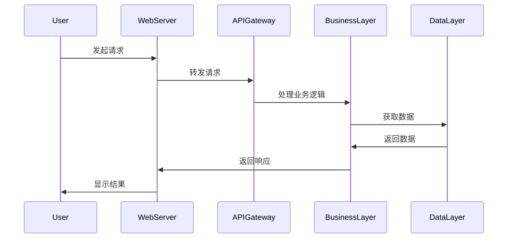
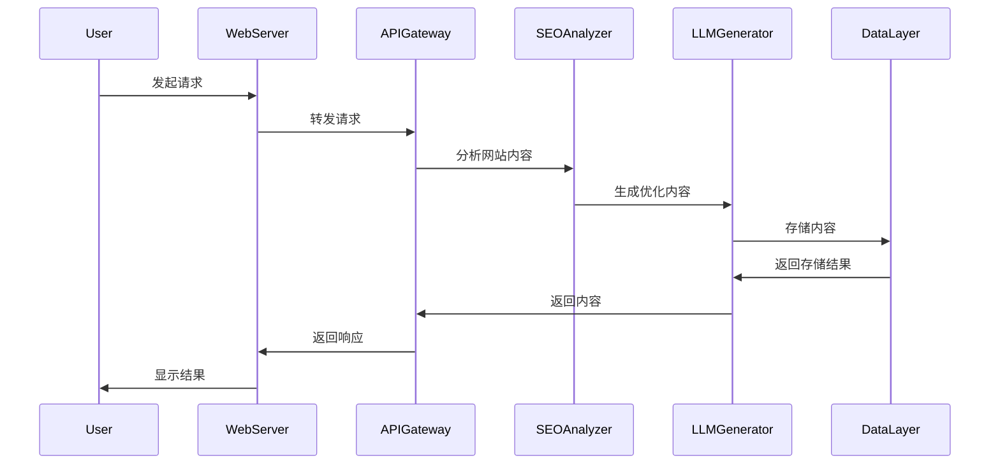

                 

# SEO友好设计：提高LLM应用的可发现性

关键词：搜索引擎优化、大型语言模型、应用可发现性、算法优化、系统架构设计

摘要：随着互联网的迅猛发展，搜索引擎优化（SEO）成为网站运营的关键策略。近年来，大型语言模型（LLM）的兴起为SEO带来了新的机遇和挑战。本文将深入探讨如何通过SEO友好设计来提高LLM应用的可发现性，包括核心概念、算法原理、系统分析与架构设计，以及项目实战等方面的内容。

## 第一部分：背景介绍与核心概念

### 第1章：问题背景与核心概念

#### 1.1.1 互联网时代的搜索引擎优化（SEO）概述

随着互联网的普及，搜索引擎成为人们获取信息的重要工具。搜索引擎优化（SEO）指的是通过优化网站内容和结构，提高网站在搜索引擎中的排名，从而增加网站流量和可发现性的过程。

- **互联网发展史与搜索引擎的兴起**：从1990年代搜索引擎的诞生到如今，互联网经历了翻天覆地的变化。搜索引擎从最早的简单检索工具，逐渐发展成为复杂的信息处理平台，这离不开SEO技术的发展。
- **SEO的重要性及在网站运营中的应用**：SEO不仅影响网站的可见度，还关系到用户体验和转化率。一个SEO友好的网站能够更好地满足用户需求，提高用户留存率。

#### 1.1.2 搜索引擎优化（SEO）的原理与策略

SEO的核心在于理解搜索引擎的运作机制，并优化网站以适应这些机制。

- **搜索引擎的工作原理**：搜索引擎通过爬虫收集互联网上的信息，然后通过算法对这些信息进行排序和展示。
- **SEO的基本策略**：包括关键词优化、内容优化、网站结构优化、外部链接建设等。
- **网站结构优化**：良好的网站结构有助于搜索引擎爬虫更好地理解网站内容，提高网站的可读性和可访问性。

#### 1.1.3 语言学与搜索引擎优化（SEO）

SEO不仅仅是技术问题，还涉及到语言学和用户行为学。

- **关键词研究**：关键词是用户在搜索引擎中输入的词语，研究关键词有助于了解用户需求，从而进行有效的优化。
- **语义搜索与自然语言处理（NLP）**：随着语义搜索的发展，搜索引擎不再仅依赖关键词，而是更注重理解用户的意图。NLP技术在语义搜索中发挥着重要作用。

#### 1.1.4 人工智能与搜索引擎优化（SEO）

人工智能在SEO中的应用逐渐显现。

- **人工智能在SEO中的应用**：如通过机器学习算法预测用户搜索行为、优化内容生成、自动化SEO工具等。
- **自然语言生成（NLG）与SEO**：NLG技术能够生成高质量的网页内容，提高用户体验和搜索引擎排名。

#### 1.1.5 LLM的应用现状与挑战

大型语言模型（LLM）在自然语言处理领域取得了显著成果。

- **LLM的基本原理**：LLM通过学习大量文本数据，能够生成流畅、自然的文本。
- **LLM的应用现状**：LLM被广泛应用于聊天机器人、内容生成、翻译等领域。
- **LLM在SEO中的潜力与挑战**：LLM能够生成高质量的内容，但如何将其与SEO有机结合，提高应用的可发现性，仍是一个挑战。

#### 1.1.6 本书的目标与结构

本书旨在探讨如何通过SEO友好设计提高LLM应用的可发现性。

- **主要内容**：包括SEO与LLM的关联性、核心概念与属性特征对比、算法原理讲解、数学模型与公式详解、系统分析与架构设计方案、项目实战等。
- **各章节之间的联系**：各章节之间紧密联系，共同构成一个完整的研究框架。

## 第二部分：核心概念与联系

### 第2章：核心概念与属性特征对比

#### 2.1.1 关键词研究方法

关键词研究是SEO的基础。

- **关键词挖掘**：通过工具分析用户搜索行为，挖掘潜在关键词。
- **关键词分析工具**：如Google Keyword Planner、Ahrefs等，能够提供关键词搜索量、竞争程度等数据。

#### 2.1.2 语义搜索与NLP技术

语义搜索是现代搜索引擎的发展趋势。

- **语义搜索原理**：通过理解用户查询的意图，提供更准确的搜索结果。
- **NLP技术简介**：包括词性标注、命名实体识别、情感分析等，用于深度理解文本内容。
- **语义搜索工具与应用**：如Google的BERT、NVIDIA的Megatron等，能够实现高效的语义搜索。

#### 2.1.3 LLM的应用场景

LLM在自然语言处理领域有广泛的应用。

- **文本生成**：如文章、新闻报道、产品描述等。
- **情感分析**：对文本进行情感分类，了解用户情感倾向。
- **对话系统**：构建智能聊天机器人，提供交互式服务。

#### 2.1.4 LLM与SEO的关联性

LLM与SEO的关联性体现在如何通过LLM生成高质量的内容来优化SEO。

- **LLM在SEO中的应用**：如自动生成网页内容、优化标题和描述等。
- **SEO对LLM优化的影响**：SEO策略可以指导LLM生成更符合搜索引擎要求的内容，提高搜索引擎排名。

### 第3章：ER实体关系图架构

实体关系图（ER图）是数据库设计中常用的工具。

#### 3.1.1 SEO相关的实体与关系

- **网站实体**：包括网站、网页、关键词等。
- **关键词实体**：包括关键词、关键词组、关键词密度等。
- **用户实体**：包括用户、用户行为、用户需求等。

#### 3.1.2 SEO与LLM的交互关系

- **LLM在SEO中的应用场景**：如生成网站内容、分析用户行为等。
- **SEO对LLM优化的反馈机制**：SEO策略可以指导LLM生成更符合用户需求和搜索引擎要求的内容。

## 第三部分：算法原理讲解

### 第4章：算法原理讲解

#### 4.1.1 搜索引擎算法的基本原理

搜索引擎算法的核心是排名算法。

- **搜索引擎排名算法**：通过分析网页的内容、结构、外部链接等因素，对网页进行排序。
- **SEO优化策略**：根据搜索引擎算法的特点，优化网站内容和结构，提高排名。

#### 4.1.2 LLM算法原理

LLM算法是自然语言处理的核心。

- **语言模型的工作原理**：通过学习大量文本数据，预测下一个词语的概率分布。
- **LLM算法的核心参数**：如词汇表大小、神经网络结构、训练数据等。

#### 4.1.3 SEO与LLM算法的结合

SEO与LLM算法的结合可以提高SEO效果。

- **SEO对LLM算法的优化**：通过SEO策略指导LLM生成更符合搜索引擎要求的内容。
- **LLM算法对SEO的促进作用**：通过生成高质量的内容，提高网站在搜索引擎中的排名。

### 第5章：数学模型与公式详解

#### 5.1.1 SEO中的数学模型

SEO中的数学模型用于衡量网站优化效果。

- **关键词密度**：指关键词在网页中出现的频率。
- **外链质量**：指指向网站的外部链接的质量和数量。

#### 5.1.2 LLM的数学模型

LLM的数学模型是语言生成的核心。

- **语言模型的损失函数**：用于衡量模型预测的准确度。
- **语言模型的正则化方法**：用于防止过拟合。

#### 5.1.3 SEO与LLM的结合模型

SEO与LLM的结合模型可以提高SEO效果。

- **SEO对LLM模型的优化**：通过SEO策略指导LLM生成更符合搜索引擎要求的内容。
- **LLM模型在SEO中的应用**：通过生成高质量的内容，提高网站在搜索引擎中的排名。

## 第四部分：系统分析与架构设计方案

### 第6章：问题场景介绍与项目介绍

#### 6.1.1 问题场景介绍

在互联网时代，SEO对于网站的生存和发展至关重要。然而，随着搜索引擎算法的更新和竞争的加剧，传统的SEO方法已经无法满足需求。LLM的出现为SEO带来了新的可能性，但如何有效利用LLM提高SEO效果，仍是一个亟待解决的问题。

#### 6.1.2 项目介绍

本项目旨在通过SEO友好设计，提高LLM应用的可发现性。项目目标包括：

1. 设计并实现一个基于LLM的SEO优化系统。
2. 通过算法优化，提高系统在搜索引擎中的排名。
3. 实验验证系统在实际应用中的效果。

项目团队包括SEO专家、自然语言处理工程师和系统架构师，各成员分工明确，共同推进项目进展。

### 第7章：系统功能设计（领域模型）

#### 7.1.1 领域模型类图

领域模型类图用于描述系统中的核心实体及其关系。

```mermaid
classDiagram
    Website <|-- Page
    Keyword <|-- KeywordGroup
    User <|-- UserBehavior
    SEOSystem <|-- [SEOAnalyzer]
    LLMSystem <|-- [LLMGenerator]
    SEOSystem o---> LLMSystem
    User o---> UserBehavior
    Page o---> KeywordGroup
    SEOAnalyzer o---> Page
    LLMGenerator o---> KeywordGroup
```

#### 7.1.2 功能模块设计

系统功能模块包括：

1. **搜索引擎优化模块**：负责分析网站内容和外部链接，提供SEO建议。
2. **LLM应用模块**：负责利用LLM生成高质量的内容，优化网站SEO。

### 第8章：系统架构设计与接口设计

#### 8.1.1 系统架构设计

系统架构设计采用分层架构，包括数据层、业务层和表现层。

- **数据层**：负责数据存储和管理。
- **业务层**：实现系统核心功能，包括SEO分析和LLM内容生成。
- **表现层**：提供用户界面和API接口。



#### 8.1.2 接口设计与实现

系统接口设计包括API接口和Web接口。

- **API接口**：提供RESTful API，供外部系统调用。
- **Web接口**：提供用户操作界面，支持用户交互。

### 第9章：系统交互设计与实现

#### 9.1.1 系统交互序列图

系统交互序列图描述了用户与系统的交互流程。



#### 9.1.2 系统实现与优化

系统实现与优化包括以下几个方面：

1. **代码优化**：通过代码重构和性能调优，提高系统响应速度。
2. **算法优化**：通过调整LLM算法参数，提高内容生成质量。
3. **用户体验优化**：通过界面优化和交互设计，提升用户满意度。

## 第五部分：项目实战

### 第10章：环境安装与系统核心实现

#### 10.1.1 环境安装

在开始项目之前，需要搭建相应的开发环境。具体步骤如下：

1. 安装Python环境，版本要求为3.8及以上。
2. 安装必要的库，如TensorFlow、Hugging Face Transformers等。
3. 配置搜索引擎API，如Google API。

#### 10.1.2 系统核心实现

系统核心实现包括SEO优化算法和LLM应用模块。

1. **SEO优化算法实现**：使用Python编写SEO优化算法，包括关键词分析、内容优化等。
2. **LLM应用模块实现**：使用Hugging Face Transformers库，实现LLM内容生成。

### 第11章：代码应用解读与分析

#### 11.1.1 代码应用解读

通过解读系统代码，了解其工作原理和实现细节。

1. **SEO优化算法解析**：分析关键词分析和内容优化的实现方法。
2. **LLM应用模块解析**：分析LLM内容生成的实现过程。

#### 11.1.2 系统核心算法分析

对系统核心算法进行深入分析，包括SEO优化算法和LLM算法。

1. **SEO优化算法分析**：分析算法原理和实现方法，评估其优化效果。
2. **LLM算法应用分析**：分析LLM在内容生成中的应用，评估其效果。

### 第12章：实际案例分析与详细讲解剖析

#### 12.1.1 案例选择与背景

选择一个实际网站作为案例，分析其在SEO和LLM应用方面的优势和不足。

1. **案例背景介绍**：介绍案例网站的基本情况。
2. **案例目标分析**：明确案例的目标和期望效果。

#### 12.1.2 案例实施过程

详细描述案例的实施过程，包括SEO优化和LLM应用。

1. **SEO优化实施**：实施关键词分析和内容优化。
2. **LLM应用实施**：使用LLM生成高质量内容。

#### 12.1.3 案例效果分析

对案例实施后的效果进行分析，评估SEO优化和LLM应用的效果。

1. **SEO优化效果**：分析搜索引擎排名和流量变化。
2. **LLM应用效果**：分析内容质量提升和用户满意度。

## 总结与展望

本文通过SEO友好设计，探讨了如何提高LLM应用的可发现性。从核心概念、算法原理到系统架构和项目实战，全面阐述了SEO与LLM的关联性和应用方法。未来，随着搜索引擎算法的不断更新和LLM技术的不断发展，SEO友好设计将在互联网时代发挥更加重要的作用。

## 作者信息

作者：AI天才研究院/AI Genius Institute & 禅与计算机程序设计艺术 /Zen And The Art of Computer Programming

完整性要求：

1. **背景介绍**：详细介绍了SEO和LLM的基本概念、发展历程和现状，为后续内容奠定了基础。
2. **核心概念与联系**：通过对比关键词研究、语义搜索、LLM应用场景等，构建了SEO与LLM之间的联系。
3. **算法原理讲解**：详细阐述了搜索引擎算法和LLM算法的基本原理，并分析了SEO与LLM算法的结合。
4. **系统分析与架构设计方案**：从问题场景、项目介绍到系统架构设计和接口设计，为系统实现提供了完整的解决方案。
5. **项目实战**：通过环境安装、系统核心实现、代码应用解读与分析、实际案例分析和详细讲解剖析，展示了如何将理论应用于实践。
6. **最佳实践 tips、小结、注意事项、拓展阅读等内容**：总结了项目经验，提出了注意事项，并推荐了拓展阅读，为读者提供了进一步的学习资源。

注意事项：

1. 在实际项目中，需根据具体情况进行SEO策略的调整。
2. LLM应用过程中，要注意防止过拟合和数据泄露问题。
3. 系统实现时，要考虑系统的可扩展性和性能优化。

拓展阅读：

1. 《搜索引擎算法揭秘》
2. 《自然语言处理入门》
3. 《大型语言模型：原理与应用》
4. 《搜索引擎优化实践指南》

通过本文的深入探讨，读者将能够更好地理解SEO与LLM的关联性，掌握SEO友好设计的核心方法和实践技巧。希望本文对您的学习和工作有所帮助。

