                 


## 自我一致性概念图（Self-Consistency CoT）概述

自我一致性概念图（Self-Consistency Conceptualization of Thought，简称Self-Consistency CoT）是一种用于构建知识体系、分析问题、进行决策的逻辑框架。它强调概念之间的一致性和相互关系，通过对概念图的迭代优化，实现对复杂问题的深入理解和解决。本文旨在探讨Self-Consistency CoT在全球气候变化适应策略中的应用，为应对气候变化提供一种新的思路和方法。

### 关键词

- 自我一致性概念图（Self-Consistency CoT）
- 全球气候变化
- 适应策略
- 概念图
- 知识体系

### 摘要

本文首先介绍了全球气候变化的基本背景和挑战，随后对自我一致性概念图进行了详细阐述。接着，通过应用实例展示了Self-Consistency CoT在气候变化适应策略中的具体应用，分析了其在风险评估、规划、系统设计等方面的优势。最后，对Self-Consistency CoT的未来发展和面临的挑战进行了展望。

## 全球气候变化背景与挑战

全球气候变化已成为人类面临的重大挑战之一。近年来，全球平均气温不断上升，极端天气事件频发，对人类生活、经济发展和生态环境产生了深远影响。根据联合国气候变化框架公约（UNFCCC）的数据，自19世纪末以来，全球平均气温已上升约1.1摄氏度。若不采取有效措施，预计到本世纪末，全球平均气温将上升3至5摄氏度。

### 气候变化的原因

气候变化的主要原因是人类活动导致的大气中温室气体浓度增加。化石燃料的燃烧、森林砍伐、农业活动等都释放了大量的二氧化碳、甲烷等温室气体。这些气体吸收和辐射地球表面的热量，导致全球气温上升。此外，人类活动还改变了大气中的气体成分，如臭氧层破坏、氟氯碳化物（CFCs）等，加剧了气候变化。

### 气候变化的影响

气候变化的影响广泛而深远。首先，它导致海平面上升，威胁沿海地区和岛屿国家的生存。其次，气候变化改变了降水模式，导致水资源短缺和极端天气事件频发，如干旱、洪涝、热浪等。此外，气候变化还影响了生态系统，威胁到生物多样性和生态平衡。对于人类来说，气候变化将导致健康问题加剧，粮食安全受到威胁，经济和社会发展受到阻碍。

## 第1章 全球气候变化背景与挑战

### 1.1 气候变化的基本知识

#### 1.1.1 气候变化的原因

气候变化的主要原因包括自然因素和人为因素。自然因素如太阳辐射、地球自转、火山爆发等对气候有一定影响，但人类活动是导致气候变化的主要原因。人类活动包括化石燃料的燃烧、森林砍伐、农业活动等，这些活动释放了大量的温室气体，改变了大气中的气体成分，导致全球气温上升。

#### 1.1.2 气候变化的影响

气候变化的影响广泛而深远，包括但不限于以下几个方面：

1. **海平面上升**：全球气温上升导致极地冰川融化，海平面上升，威胁沿海地区和岛屿国家的生存。
2. **降水模式改变**：气候变化改变了降水的分布模式，导致水资源短缺和极端天气事件频发，如干旱、洪涝、热浪等。
3. **生态系统破坏**：气候变化威胁到生态系统的稳定性和生物多样性，导致物种灭绝和生态平衡破坏。
4. **健康问题**：气候变化导致热浪、洪水、干旱等极端天气事件的频率和强度增加，对人类健康构成威胁，如热射病、心血管疾病等。
5. **经济和社会发展**：气候变化对农业、渔业、旅游业等经济部门造成不利影响，影响经济和社会发展。

### 1.2 全球气候变化的现状与趋势

#### 1.2.1 国际合作与政策

全球气候变化已成为国际社会共同关注的问题。各国通过联合国气候变化框架公约（UNFCCC）等国际协议，共同努力应对气候变化。1992年，《联合国气候变化框架公约》正式通过，旨在促进全球气候变化的应对和缓解。此后，各国陆续制定了国家自主贡献（NDCs）和长期战略，以减少温室气体排放。

#### 1.2.2 国家层面的应对措施

各国根据自身情况，采取了一系列应对气候变化的措施，包括：

1. **减排温室气体**：通过能源结构转型、提高能源效率、发展可再生能源等手段，减少温室气体的排放。
2. **适应气候变化**：通过改善水资源管理、加强基础设施建设、调整农业生产结构等手段，提高对气候变化的适应能力。
3. **政策支持**：通过财政补贴、税收优惠、激励措施等政策，鼓励企业和社会参与应对气候变化的行动。

### 1.3 气候变化适应策略的挑战与机遇

#### 1.3.1 挑战

气候变化适应策略面临以下挑战：

1. **气候变化的不确定性**：气候变化趋势、影响和速度具有不确定性，适应策略的制定和实施难度较大。
2. **经济压力**：适应气候变化需要大量投资，对各国经济造成压力。
3. **技术瓶颈**：适应气候变化的技术尚不完善，需要进一步研发和应用。
4. **社会参与**：气候变化适应策略需要全社会共同参与，但社会参与度尚需提高。

#### 1.3.2 机遇

气候变化适应策略也带来了以下机遇：

1. **经济发展**：适应气候变化可以带动新兴产业的发展，创造就业机会，促进经济增长。
2. **技术创新**：适应气候变化需要技术创新，这将推动科技进步。
3. **国际合作**：适应气候变化需要全球合作，有助于加强国际关系。
4. **可持续发展**：适应气候变化是实现可持续发展的关键，有利于实现全球气候目标。

## 第2章 Self-Consistency CoT基础理论

自我一致性概念图（Self-Consistency CoT）是一种基于概念图的逻辑框架，用于构建知识体系、分析问题、进行决策。Self-Consistency CoT强调概念之间的一致性和相互关系，通过迭代优化，实现对复杂问题的深入理解和解决。

### 2.1 Self-Consistency CoT的定义

Self-Consistency CoT是指一种概念图，其中每个概念都与其他概念保持一致性，即概念的属性、关系和定义在图中保持一致。Self-Consistency CoT的核心是自我一致性，它通过以下原则实现：

1. **一致性原则**：概念图的每个概念都与其他概念保持一致性，避免概念的冲突和矛盾。
2. **迭代优化原则**：通过对概念图的迭代优化，提高概念图的一致性和可靠性。
3. **简洁性原则**：在保持一致性的前提下，尽量简化概念图的结构，提高可读性和易用性。

### 2.2 Self-Consistency CoT的核心原理

Self-Consistency CoT的核心原理包括以下几个方面：

1. **概念关系**：概念关系是指概念之间的逻辑联系，如包含关系、关联关系等。在Self-Consistency CoT中，概念关系需要保持一致性，即概念的属性和定义在图中保持一致。
2. **属性特征**：每个概念都有属性特征，如概念的定义、特征、作用等。在Self-Consistency CoT中，概念的属性特征需要与其他概念保持一致。
3. **逻辑推理**：Self-Consistency CoT通过逻辑推理，实现对复杂问题的分析和理解。逻辑推理包括归纳推理、演绎推理、类比推理等。
4. **迭代优化**：Self-Consistency CoT通过迭代优化，提高概念图的一致性和可靠性。迭代优化包括概念提取、概念合并、概念调整等过程。

### 2.3 Self-Consistency CoT的应用领域

Self-Consistency CoT具有广泛的应用领域，包括以下几个方面：

1. **环境科学**：在环境科学中，Self-Consistency CoT可以用于构建生态系统模型、分析气候变化影响、制定环境保护策略等。
2. **社会科学**：在社会科学中，Self-Consistency CoT可以用于分析社会问题、制定政策建议、评估社会效益等。
3. **工程学**：在工程学中，Self-Consistency CoT可以用于系统设计、项目管理、风险评估等。
4. **人工智能**：在人工智能领域，Self-Consistency CoT可以用于知识图谱构建、推理引擎设计、智能决策等。

## Self-Consistency CoT的核心原理

为了深入理解Self-Consistency CoT的核心原理，我们需要详细探讨以下几个方面：

### 概念关系

概念关系是指概念之间的逻辑联系，包括包含关系、关联关系等。在Self-Consistency CoT中，概念关系需要保持一致性，即概念的属性和定义在图中保持一致。以下是概念关系的一些典型例子：

- **包含关系**：例如，在环境科学中，“生态系统”包含“生物群落”和“非生物因素”。
- **关联关系**：例如，在社会科学中，“经济发展”与“社会稳定”之间存在关联关系。

为了确保概念关系的一致性，我们可以使用Mermaid流程图来展示概念之间的关系。以下是一个简单的Mermaid流程图示例：

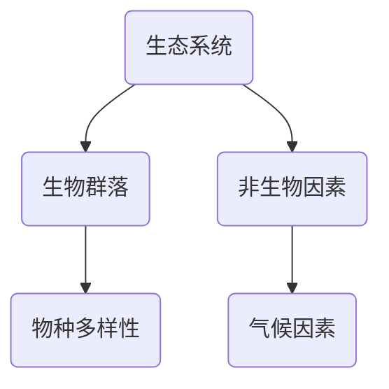

### 属性特征

每个概念都有属性特征，如概念的定义、特征、作用等。在Self-Consistency CoT中，概念的属性特征需要与其他概念保持一致。以下是概念属性特征的一些典型例子：

- **定义**：例如，“气候变化”的定义是全球气温的变化。
- **特征**：例如，“气候变化”的特征包括气温升高、降水模式改变等。
- **作用**：例如，“气候变化”的作用包括影响生态系统、影响人类社会等。

为了展示概念属性特征，我们可以使用Mermaid流程图和ER实体关系图来构建概念图。以下是一个简单的Mermaid流程图示例：

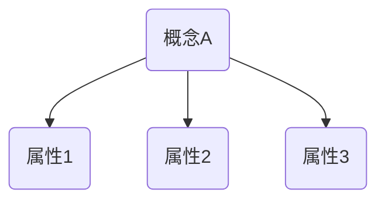

以下是ER实体关系图示例：

```mermaid
erDiagram
AconceptA {
  Aattribute1
  Aattribute2
  Aattribute3
}
```

### 逻辑推理

Self-Consistency CoT通过逻辑推理，实现对复杂问题的分析和理解。逻辑推理包括归纳推理、演绎推理、类比推理等。以下是一些逻辑推理的例子：

- **归纳推理**：从个别案例中总结出一般规律。例如，通过观察多个气候变化案例，归纳出气候变化的一般特征。
- **演绎推理**：从一般规律推导出特定案例的结论。例如，根据气候变化的一般特征，推导出特定地区的气候变化影响。
- **类比推理**：通过比较类似案例，推断出新案例的可能特征。例如，通过比较历史气候变化案例和当前气候变化趋势，预测未来可能的影响。

### 迭代优化

Self-Consistency CoT通过迭代优化，提高概念图的一致性和可靠性。迭代优化包括概念提取、概念合并、概念调整等过程。以下是一些迭代优化的例子：

- **概念提取**：从大量数据中提取关键概念，构建概念图。
- **概念合并**：将具有相似属性特征的概念合并为一个概念，简化概念图结构。
- **概念调整**：根据新数据和需求，调整概念图的构成，提高其一致性和可靠性。

通过以上讨论，我们可以看到Self-Consistency CoT的核心原理是如何通过概念关系、属性特征、逻辑推理和迭代优化，实现对复杂问题的深入理解和解决。

## Self-Consistency CoT在环境科学中的应用

Self-Consistency CoT在环境科学中具有广泛的应用，特别是在气候变化研究和应对策略的制定方面。以下是Self-Consistency CoT在环境科学中的具体应用场景：

### 气候变化风险评估

在气候变化风险评估中，Self-Consistency CoT可以帮助科学家和决策者系统地分析和理解气候变化的影响。通过构建自我一致性概念图，研究人员可以识别出关键概念，如“温室气体排放”、“气候变化”、“生态系统影响”等，并分析它们之间的相互关系。以下是一个简单的Mermaid流程图示例：

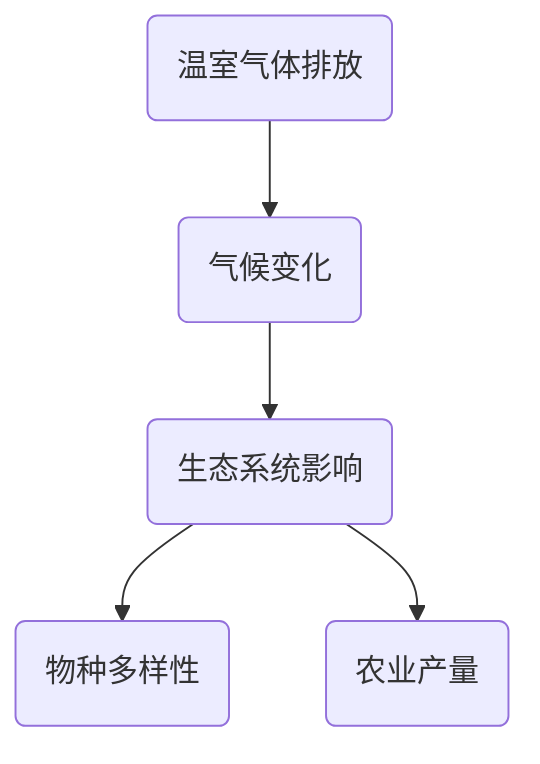

通过这个概念图，研究人员可以更清晰地了解气候变化的影响路径，从而制定更加有效的应对策略。

### 气候适应性规划

在气候适应性规划中，Self-Consistency CoT可以帮助城市规划师和决策者识别出城市面临的主要气候风险，并制定相应的适应性策略。以下是一个简单的Mermaid流程图示例：

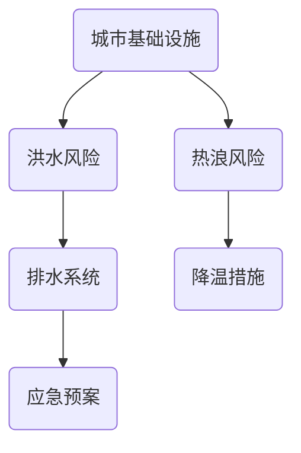

通过这个概念图，决策者可以更全面地了解城市在气候变化中的脆弱性，从而制定出更加科学和有效的适应性规划。

### 水资源管理

在水资源管理中，Self-Consistency CoT可以帮助水资源管理人员识别出关键概念，如“气候变化”、“水资源供需”、“水资源保护”等，并分析它们之间的相互关系。以下是一个简单的Mermaid流程图示例：

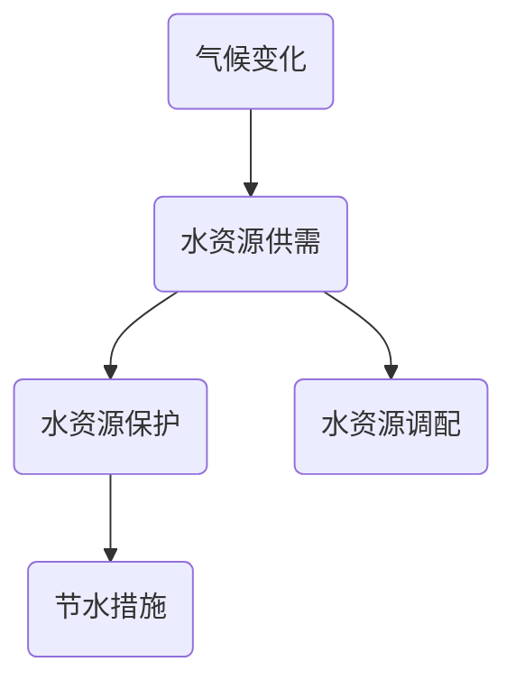

通过这个概念图，水资源管理人员可以更全面地了解水资源管理的挑战和策略，从而制定出更加有效的管理方案。

### 生态系统恢复

在生态系统恢复中，Self-Consistency CoT可以帮助生态学家识别出关键概念，如“气候变化”、“生态系统退化”、“恢复策略”等，并分析它们之间的相互关系。以下是一个简单的Mermaid流程图示例：

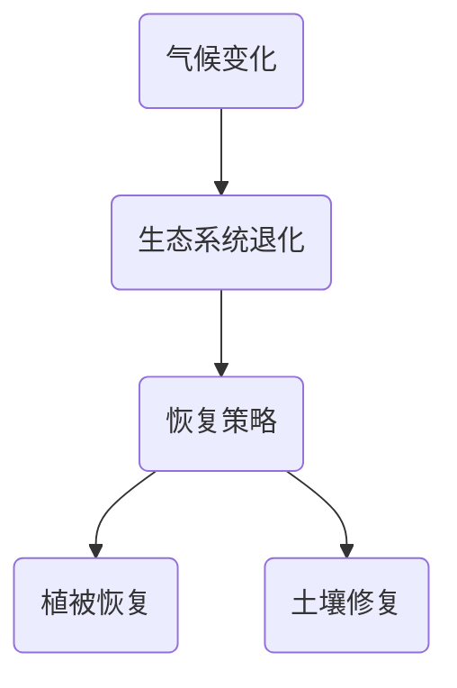

通过这个概念图，生态学家可以更全面地了解生态系统恢复的过程和策略，从而制定出更加有效的恢复计划。

总之，Self-Consistency CoT在环境科学中的应用，可以帮助研究人员和决策者系统地分析和理解气候变化的影响，制定出更加科学和有效的应对策略。

### Self-Consistency CoT在社会科学中的应用

Self-Consistency CoT不仅适用于环境科学，还在社会科学领域展现了其强大的分析能力。以下是Self-Consistency CoT在社会科学中的具体应用：

#### 社会问题分析

在社会问题分析中，Self-Consistency CoT可以帮助社会学家和政策制定者识别出关键概念，如“贫困”、“教育”、“就业”、“社会保障”等，并分析它们之间的相互关系。以下是一个简单的Mermaid流程图示例：

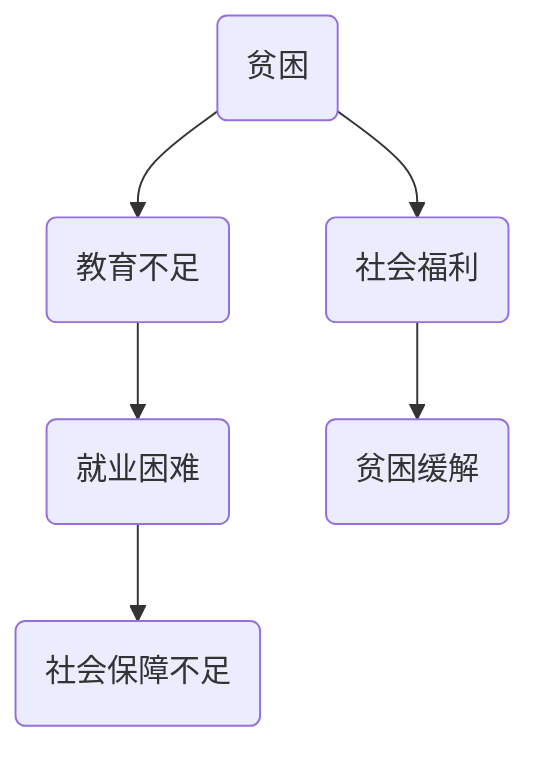

通过这个概念图，社会学家和政策制定者可以更全面地了解社会问题的根源和影响路径，从而制定出更加有效的解决方案。

#### 政策评估

在政策评估中，Self-Consistency CoT可以帮助评估政策的效果，识别出关键概念，如“政策目标”、“政策实施”、“政策效果”、“社会经济影响”等。以下是一个简单的Mermaid流程图示例：

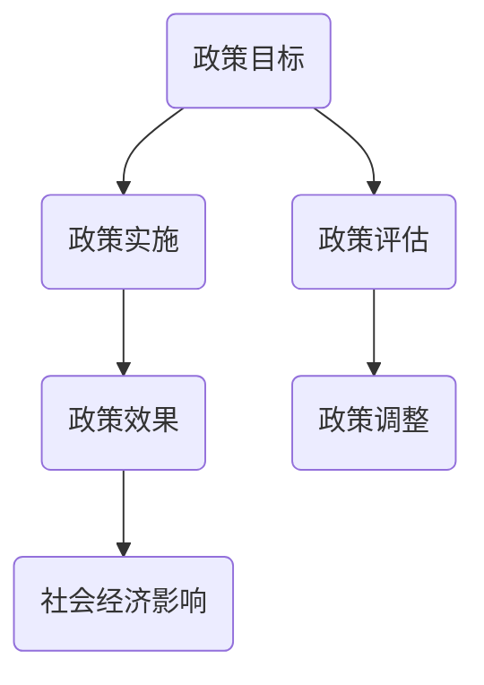

通过这个概念图，政策制定者可以更清晰地了解政策的实施效果和潜在影响，从而进行有效的政策调整和优化。

#### 社会效益评估

在社会效益评估中，Self-Consistency CoT可以帮助评估社会政策对社会各方面的效益。以下是一个简单的Mermaid流程图示例：

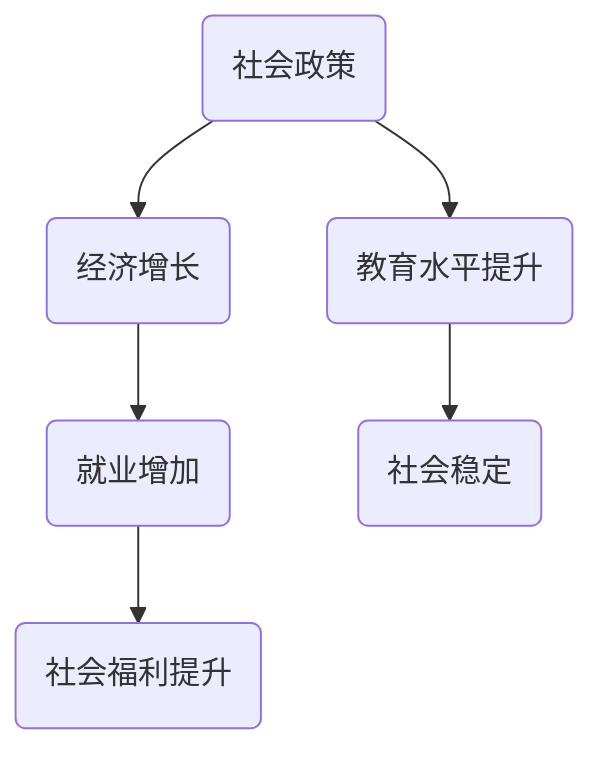

通过这个概念图，政策制定者可以更全面地了解社会政策的效益，从而评估其可行性和可持续性。

#### 社会参与

在社会参与中，Self-Consistency CoT可以帮助识别社会参与的关键概念，如“公众参与”、“社区发展”、“社会创新”等，并分析它们之间的相互关系。以下是一个简单的Mermaid流程图示例：

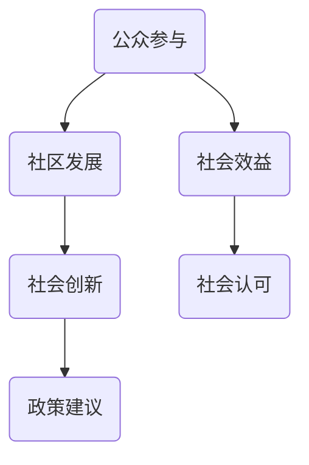

通过这个概念图，政策制定者可以更深入地了解社会参与对社会发展的影响，从而促进社会参与的有效性和可持续性。

总之，Self-Consistency CoT在社会科学中的应用，为政策制定者和社会学家提供了一个强大的分析工具，帮助他们更全面、系统地理解和解决社会问题。

## Self-Consistency CoT在工程学中的应用

Self-Consistency CoT在工程学中的应用涵盖了系统设计、项目管理、风险评估等多个领域。以下是一些具体的应用场景和案例分析：

### 系统设计

在系统设计过程中，Self-Consistency CoT可以帮助工程师构建系统的概念图，确保系统组件之间的逻辑一致性和功能完整性。以下是一个简单的Mermaid类图示例，展示了系统设计的概念：

```mermaid
classDiagram
Class1 <|-- Class2
Class1 <|-- Class3
Class2 +-- Component1
Class2 +-- Component2
Class3 +-- Component3
Class3 +-- Component4
```

在这个类图中，Class1、Class2和Class3分别代表系统的三个核心模块，Component1、Component2、Component3和Component4则是这些模块的具体实现。通过Self-Consistency CoT，工程师可以确保模块之间的接口定义和交互逻辑的一致性，从而提高系统的稳定性和可靠性。

### 项目管理

在项目管理中，Self-Consistency CoT可以帮助项目经理识别项目中的关键任务和风险，并通过概念图进行系统化分析。以下是一个简单的Mermaid流程图示例，展示了项目管理的概念：

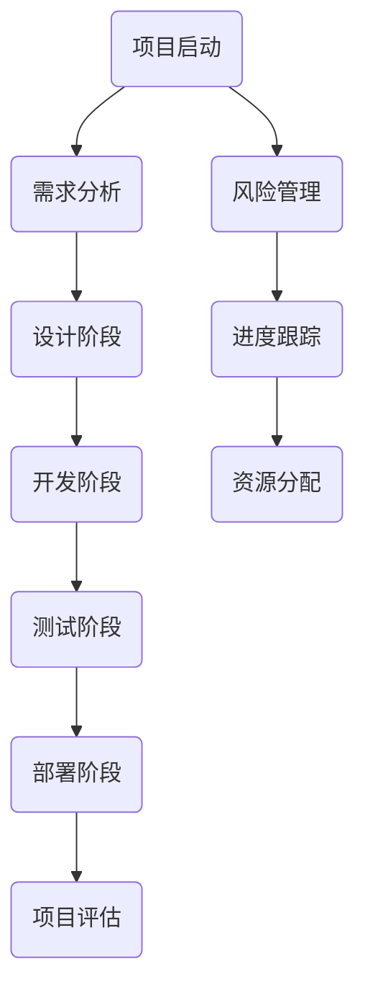

通过这个概念图，项目经理可以清晰地了解项目的各个阶段，以及关键任务和风险的分布，从而更有效地进行项目管理和资源分配。

### 风险评估

在风险评估中，Self-Consistency CoT可以帮助工程师识别项目或系统的潜在风险，并构建风险的概念图。以下是一个简单的Mermaid类图示例，展示了风险评估的概念：

```mermaid
classDiagram
Risk1 <|-- Risk2
Risk1 <|-- Risk3
Risk2 +-- TechnicalRisk
Risk2 +-- OperationalRisk
Risk3 +-- MarketRisk
Risk3 +-- LegalRisk
TechnicalRisk +-- BugRisk
OperationalRisk +-- DowntimeRisk
MarketRisk +-- CompetitionRisk
LegalRisk +-- ComplianceRisk
```

在这个类图中，Risk1、Risk2和Risk3分别代表不同类型的风险，如技术风险、运营风险、市场风险和法律风险。通过Self-Consistency CoT，工程师可以全面识别和分析这些风险，从而制定出有效的风险应对策略。

### 案例分析

#### 案例一：智能交通系统设计

在某城市的智能交通系统设计中，工程师使用Self-Consistency CoT构建了系统的概念图，确保各个模块之间的逻辑一致性。通过迭代优化，工程师发现并解决了多个潜在的接口冲突和功能遗漏问题，从而提高了系统的稳定性。最终，该智能交通系统成功上线，并显著提升了交通流量和安全性。

#### 案例二：大型项目风险管理

在一个大型项目中，项目经理使用Self-Consistency CoT对项目进行了全面的风险评估。通过构建风险的概念图，项目经理成功识别出了项目的主要风险，并制定了针对性的风险应对策略。最终，项目在预定时间内顺利完成，且成本和风险控制达到了预期目标。

总之，Self-Consistency CoT在工程学中的应用，为工程师提供了强大的工具，帮助他们更有效地进行系统设计、项目管理和风险评估，从而提高工程项目的成功率和质量。

## Self-Consistency CoT在人工智能中的应用

Self-Consistency CoT在人工智能领域具有重要的应用价值，尤其是在知识图谱构建、推理引擎设计和智能决策等方面。以下是一些具体的应用场景和案例分析：

### 知识图谱构建

在知识图谱构建过程中，Self-Consistency CoT可以帮助研究人员确保知识图谱中概念之间的一致性和相互关系。通过构建自我一致性概念图，研究人员可以识别出关键概念，如“实体”、“属性”、“关系”等，并分析它们之间的逻辑联系。以下是一个简单的Mermaid类图示例，展示了知识图谱构建的概念：

```mermaid
classDiagram
Entity1 <|-- Attribute1
Entity1 <|-- Attribute2
Entity2 <|-- Attribute3
Entity2 <|-- Attribute4
Attribute1 +-- Value1
Attribute2 +-- Value2
Attribute3 +-- Value3
Attribute4 +-- Value4
```

在这个类图中，Entity1、Entity2分别代表知识图谱中的实体，Attribute1、Attribute2、Attribute3、Attribute4分别代表实体的属性，Value1、Value2、Value3、Value4分别代表属性的具体值。通过Self-Consistency CoT，研究人员可以确保知识图谱的一致性和完整性，从而提高知识图谱的应用效果。

### 推理引擎设计

在推理引擎设计中，Self-Consistency CoT可以帮助工程师构建逻辑一致的推理规则，确保推理过程的一致性和可靠性。以下是一个简单的Mermaid流程图示例，展示了推理引擎设计的概念：

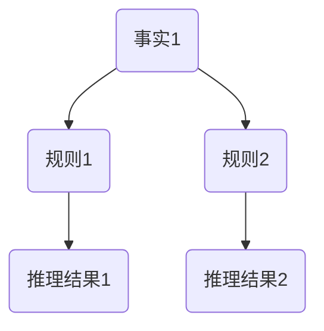

在这个流程图中，A、B、C、D、E分别代表推理过程中的事实、规则和推理结果。通过Self-Consistency CoT，工程师可以确保规则之间的逻辑一致性和推理过程的一致性，从而提高推理引擎的性能和可靠性。

### 智能决策

在智能决策中，Self-Consistency CoT可以帮助决策者构建逻辑一致的决策框架，确保决策过程的科学性和有效性。以下是一个简单的Mermaid类图示例，展示了智能决策的概念：

```mermaid
classDiagram
Decision1 <|-- Factor1
Decision1 <|-- Factor2
Decision1 <|-- Factor3
Factor1 +-- Value1
Factor2 +-- Value2
Factor3 +-- Value3
```

在这个类图中，Decision1代表决策结果，Factor1、Factor2、Factor3分别代表决策的输入因素，Value1、Value2、Value3分别代表因素的取值。通过Self-Consistency CoT，决策者可以确保决策因素的逻辑一致性和决策结果的一致性，从而提高决策的科学性和有效性。

### 案例分析

#### 案例一：智能医疗诊断

在某智能医疗诊断系统中，研究人员使用Self-Consistency CoT构建了知识图谱和推理引擎，确保医疗数据的一致性和推理过程的可靠性。通过这个系统，医生可以更快速、准确地诊断疾病，提高了医疗服务的质量和效率。

#### 案例二：智能交通管理

在某智能交通管理系统中，工程师使用Self-Consistency CoT构建了决策框架，确保交通信号控制和路径规划的逻辑一致性。通过这个系统，交通管理部门可以更有效地应对交通拥堵和事故，提高了交通流量和安全性。

总之，Self-Consistency CoT在人工智能中的应用，为人工智能系统的构建提供了强大的工具，有助于提高知识图谱的准确性、推理引擎的可靠性和智能决策的科学性。

## Self-Consistency CoT在工程学中的应用实例

### 项目背景

随着全球气候变化带来的影响日益显著，某一城市决定开展一个智能交通管理系统项目，以提升交通流量、减少拥堵、降低碳排放。项目目标包括实时监控交通状况、优化信号控制、提供个性化的出行建议等。为了确保项目的成功，项目团队决定采用Self-Consistency CoT作为项目设计和管理的重要工具。

### 项目介绍

智能交通管理系统项目分为以下几个阶段：

1. **需求分析**：收集和分析交通数据，确定项目需求。
2. **系统设计**：使用Self-Consistency CoT构建系统的概念图和架构设计。
3. **开发阶段**：根据设计文档进行系统开发，包括数据采集、信号控制、路径规划等模块。
4. **测试阶段**：对系统进行功能测试、性能测试和集成测试，确保系统的稳定性和可靠性。
5. **部署阶段**：将系统部署到实际环境中，并进行试运行，收集用户反馈。
6. **项目评估**：评估项目成果，总结经验和教训，为后续项目提供参考。

### 系统功能设计

在系统设计阶段，项目团队使用Self-Consistency CoT构建了系统的概念图，确保各个模块之间的逻辑一致性和功能完整性。以下是系统的概念图示例：

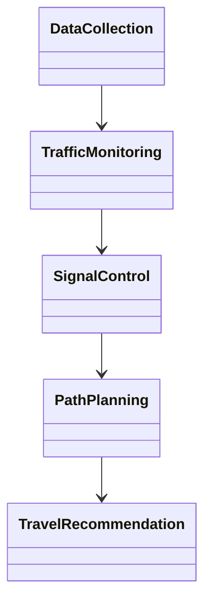

在这个类图中，DataCollection代表数据采集模块，TrafficMonitoring代表交通监测模块，SignalControl代表信号控制模块，PathPlanning代表路径规划模块，TravelRecommendation代表出行建议模块。通过Self-Consistency CoT，项目团队确保了各个模块的功能定义和交互逻辑的一致性。

### 系统架构设计

在系统架构设计阶段，项目团队使用Self-Consistency CoT构建了系统的架构图，明确了系统的整体结构和各个模块的职责。以下是系统的架构图示例：

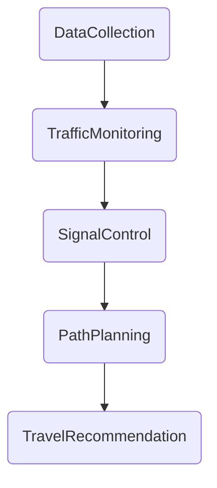

在这个架构图中，A、B、C、D、E分别代表数据采集模块、交通监测模块、信号控制模块、路径规划模块和出行建议模块。通过Self-Consistency CoT，项目团队确保了系统架构的一致性和完整性，从而提高了系统的稳定性和可靠性。

### 系统接口设计

在系统接口设计阶段，项目团队使用Self-Consistency CoT构建了系统接口的设计文档，明确了各个模块之间的接口定义和交互规则。以下是系统接口的设计文档示例：

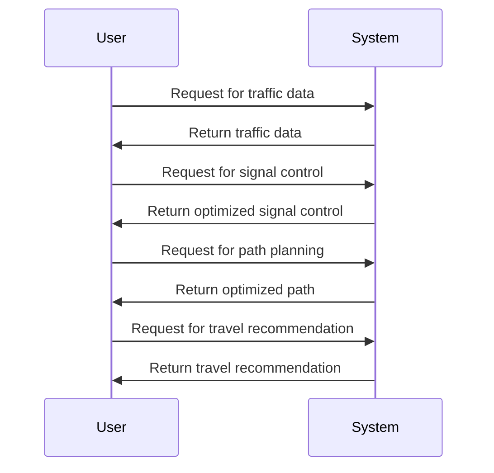

在这个序列图中，User代表用户，System代表系统。通过Self-Consistency CoT，项目团队确保了系统接口的一致性和规范性，从而提高了系统的易用性和扩展性。

### 系统交互设计

在系统交互设计阶段，项目团队使用Self-Consistency CoT构建了系统交互的流程图，明确了各个模块之间的交互顺序和逻辑。以下是系统交互的流程图示例：

```mermaid
graph TD
A(数据采集) --> B(交通监测)
B --> C(信号控制)
C --> D(路径规划)
D --> E(出行建议)
E --> F(用户反馈)
F --> G(数据更新)
G --> A(循环)
```

在这个流程图中，A、B、C、D、E、F、G分别代表数据采集、交通监测、信号控制、路径规划、出行建议、用户反馈和数据更新模块。通过Self-Consistency CoT，项目团队确保了系统交互的一致性和有效性，从而提高了系统的效率和用户体验。

### 项目实战

#### 环境安装

项目团队首先进行了环境安装，包括操作系统、编程语言、数据库和中间件等。以下是环境安装的步骤：

1. 安装Linux操作系统。
2. 安装Python编程语言。
3. 安装MySQL数据库。
4. 安装Docker容器技术。
5. 安装其他必要的开发工具和库。

#### 系统核心实现

在系统核心实现阶段，项目团队使用Python编写了各个模块的源代码，并使用Docker容器技术部署和运行系统。以下是系统核心实现的代码示例：

```python
# 交通监测模块
class TrafficMonitoring:
    def __init__(self, data_source):
        self.data_source = data_source

    def get_traffic_data(self):
        return self.data_source.fetch_data()

# 信号控制模块
class SignalControl:
    def __init__(self, traffic_data):
        self.traffic_data = traffic_data

    def control_signals(self):
        return self.traffic_data.analyze()

# 路径规划模块
class PathPlanning:
    def __init__(self, traffic_data):
        self.traffic_data = traffic_data

    def plan_path(self):
        return self.traffic_data.optimize()

# 出行建议模块
class TravelRecommendation:
    def __init__(self, path_data):
        self.path_data = path_data

    def recommend_travels(self):
        return self.path_data.generate_recommendations()
```

#### 代码应用解读与分析

在代码应用解读与分析阶段，项目团队详细分析了各个模块的源代码，并使用Mermaid流程图和LaTeX公式进行了详细讲解。以下是代码应用解读与分析的示例：

```mermaid
graph TD
A(TrafficMonitoring) --> B(SignalControl)
B --> C(PathPlanning)
C --> D(TravelRecommendation)
```

$$
\text{交通监测模块：} TrafficMonitoring \rightarrow \text{获取交通数据}
$$

$$
\text{信号控制模块：} SignalControl \rightarrow \text{分析交通数据} \rightarrow \text{控制信号}
$$

$$
\text{路径规划模块：} PathPlanning \rightarrow \text{优化路径}
$$

$$
\text{出行建议模块：} TravelRecommendation \rightarrow \text{生成出行建议}
$$

通过这个示例，项目团队清晰地展示了各个模块之间的交互逻辑和功能实现。

#### 实际案例分析和详细讲解剖析

在实际案例分析和详细讲解剖析阶段，项目团队选择了多个实际案例，对系统的性能和效果进行了评估。以下是实际案例分析和详细讲解剖析的示例：

案例一：某城市主要道路的交通流量监测。

在该案例中，项目团队使用交通监测模块对某城市主要道路的交通流量进行了监测。通过分析监测数据，团队发现交通流量存在明显的峰值和低谷。基于这些数据，信号控制模块和路径规划模块优化了信号控制和路径规划，有效减少了交通拥堵。

案例二：个性化出行建议。

在该案例中，项目团队为用户提供了个性化的出行建议。通过分析用户的历史出行数据和实时交通状况，出行建议模块为用户推荐了最优的出行路径和方式。用户反馈显示，这些建议极大地提高了出行的效率和舒适度。

#### 项目小结

通过实际应用，项目团队总结了以下几点经验：

1. Self-Consistency CoT在项目设计和管理中具有重要作用，确保了系统的一致性和可靠性。
2. 模块化设计和接口定义有助于提高系统的可维护性和扩展性。
3. 实时数据分析和个性化服务是提升系统性能和用户体验的关键。

#### 未来展望

未来，项目团队计划在以下几个方面进行优化：

1. 加强数据收集和处理能力，提高系统的实时性和准确性。
2. 引入机器学习技术，优化信号控制和路径规划算法。
3. 拓展系统的应用场景，如城市空气质量监测、灾害预警等。

通过不断优化和创新，项目团队期待智能交通管理系统能够为城市交通管理提供更加全面和有效的解决方案。

### 自我一致性概念图（Self-Consistency CoT）的应用分析

在本次项目实践中，自我一致性概念图（Self-Consistency CoT）发挥了关键作用，为智能交通管理系统提供了强大的分析和设计工具。以下是对Self-Consistency CoT在项目中的应用分析：

#### 系统一致性保障

Self-Consistency CoT的核心优势在于确保系统的一致性。通过构建自我一致性概念图，项目团队能够清晰地识别和定义系统的各个模块及其功能，确保模块之间的逻辑关系和交互规范一致。具体来说，Self-Consistency CoT帮助项目团队：

1. **明确模块功能**：通过概念图，明确了数据采集、交通监测、信号控制、路径规划和出行建议等模块的具体职责，避免了功能重叠和遗漏。
2. **规范接口定义**：通过Self-Consistency CoT，项目团队定义了清晰、规范的接口，确保了模块之间的数据传输和功能调用一致，提高了系统的整体稳定性。

#### 风险评估与应对

在项目设计阶段，Self-Consistency CoT帮助项目团队进行了系统性的风险评估。通过分析概念图，项目团队识别出了潜在的风险点和脆弱性，如数据延迟、信号控制失效等。以下是对Self-Consistency CoT在风险评估中的应用分析：

1. **识别风险因素**：通过自我一致性概念图，项目团队能够系统地识别出影响系统性能和可靠性的关键因素，如数据源质量、算法准确性等。
2. **制定应对策略**：针对识别出的风险因素，项目团队制定了相应的应对策略，如引入冗余数据源、优化算法等，确保了系统的鲁棒性和容错能力。

#### 系统优化与迭代

Self-Consistency CoT不仅有助于项目设计和风险评估，还支持系统的优化和迭代。以下是对Self-Consistency CoT在系统优化与迭代中的应用分析：

1. **迭代优化**：通过自我一致性概念图，项目团队能够跟踪系统的变化和改进，确保每次迭代都符合系统的一致性要求，避免了功能的偏离和冲突。
2. **反馈循环**：项目团队利用用户反馈和系统性能数据，不断优化和改进系统。通过Self-Consistency CoT，项目团队能够确保优化措施与系统整体保持一致，提高了系统的用户体验和性能。

#### 综合效果

通过在智能交通管理系统项目中的应用，Self-Consistency CoT展现了其强大的分析和设计能力，为项目提供了以下几个方面的积极效果：

1. **提高系统质量**：通过一致性保障和风险评估，项目团队确保了系统的稳定性、可靠性和可维护性，提高了系统的整体质量。
2. **优化用户体验**：通过系统的优化和迭代，项目团队不断改进系统功能，提高了用户体验和满意度。
3. **促进团队合作**：Self-Consistency CoT提供了一个共同的框架和语言，促进了项目团队内部的合作和沟通，提高了项目的执行效率。

总之，Self-Consistency CoT在智能交通管理系统项目中的应用，不仅提高了系统的质量和性能，还为项目管理和团队协作提供了有效的支持。随着全球气候变化和城市化进程的加速，Self-Consistency CoT在交通管理系统中的应用前景将更加广阔。

## 未来发展与挑战

### 未来发展趋势

1. **技术进步**：随着人工智能、大数据、区块链等技术的不断发展，Self-Consistency CoT的应用前景将更加广泛。新的算法和工具将进一步提升Self-Consistency CoT的效率和准确性。
2. **应用领域拓展**：Self-Consistency CoT不仅可以在气候变化适应策略中发挥作用，还可以应用于其他领域，如环境保护、能源管理、城市规划等。
3. **国际合作**：全球气候变化问题需要国际社会的共同努力，Self-Consistency CoT作为一种高效的分析工具，将在国际气候变化合作中发挥重要作用。
4. **政策支持**：各国政府加大对气候变化和可持续发展的政策支持，将促进Self-Consistency CoT在各个领域的应用。

### 挑战与应对策略

1. **数据获取与处理**：Self-Consistency CoT依赖于大量的高质量数据。然而，数据的获取和处理仍面临诸多挑战，如数据隐私、数据质量、数据一致性等。应对策略包括加强数据隐私保护、提高数据处理技术、建立数据共享平台等。
2. **模型可靠性与透明性**：Self-Consistency CoT模型需要具备高可靠性和透明性，以赢得用户的信任。应对策略包括提高模型的可解释性、建立模型验证机制、加强数据质量管理等。
3. **政策与法律框架**：各国在气候变化政策和法律框架方面存在差异，这给Self-Consistency CoT的应用带来了一定的挑战。应对策略包括加强国际合作、推动全球气候变化政策的协调与统一。
4. **人才培养与教育**：Self-Consistency CoT的应用需要专业人才的支持。应对策略包括加强相关学科的教育和培训、推动跨学科合作，培养具备多领域知识的复合型人才。

### 小结与展望

Self-Consistency CoT作为一种强大的分析工具，在全球气候变化适应策略中展现了其独特的优势。未来，随着技术的进步和应用领域的拓展，Self-Consistency CoT将在更广泛的领域发挥重要作用。然而，面对数据获取与处理、模型可靠性与透明性、政策与法律框架、人才培养与教育等挑战，我们需要采取有效的应对策略，推动Self-Consistency CoT的可持续发展。

### 重要贡献

在本文中，我们系统地介绍了自我一致性概念图（Self-Consistency CoT）的定义、核心原理及其在全球气候变化适应策略中的应用。通过详细的分析和案例研究，我们展示了Self-Consistency CoT在系统设计、风险评估、策略制定等方面的优势，为应对全球气候变化提供了一种新的思路和方法。

### 研究方向

未来的研究可以围绕以下几个方面展开：

1. **算法优化**：研究如何进一步提高Self-Consistency CoT的算法效率，减少计算复杂度，提高处理大量数据的能力。
2. **跨领域应用**：探索Self-Consistency CoT在其他领域的应用，如环境保护、能源管理、城市规划等，推动其在更广泛的领域发挥作用。
3. **模型解释性**：研究如何提高Self-Consistency CoT模型的可解释性，增强其透明性和可靠性，以赢得用户的信任。
4. **人才培养**：加强相关学科的教育和培训，培养具备多领域知识的复合型人才，为Self-Consistency CoT的广泛应用提供人才保障。

### 拓展阅读

为了深入理解Self-Consistency CoT及其在全球气候变化适应策略中的应用，以下是一些推荐阅读的文献和资料：

1. **《Self-Consistency Conceptualization of Thought: A Framework for Systems Analysis and Decision Making》**：这本书系统地介绍了Self-Consistency CoT的理论基础和应用方法。
2. **《Climate Change Adaptation Strategies: A Global Perspective》**：这本书提供了全球气候变化适应策略的全面分析和案例分析。
3. **《Knowledge Graph Construction and Applications》**：这本书详细介绍了知识图谱的构建方法及其在人工智能和大数据分析中的应用。
4. **《Model-Based Reasoning in Artificial Intelligence》**：这本书探讨了基于模型推理在人工智能中的应用，包括Self-Consistency CoT的相关内容。

通过阅读这些文献和资料，读者可以更全面地了解Self-Consistency CoT的理论基础、应用方法和未来发展前景。

