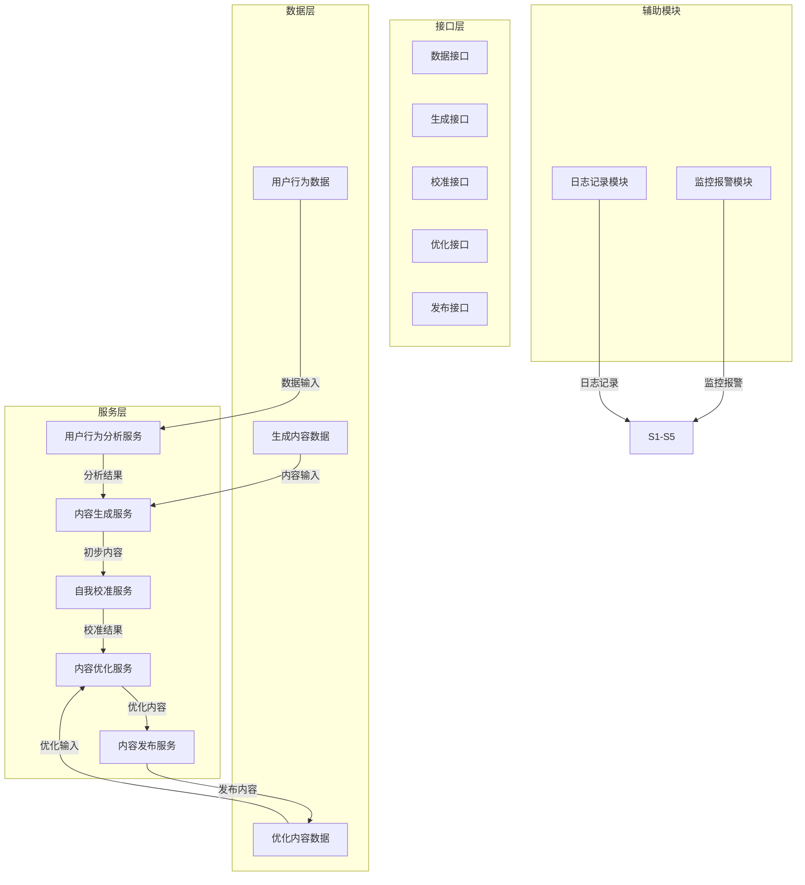
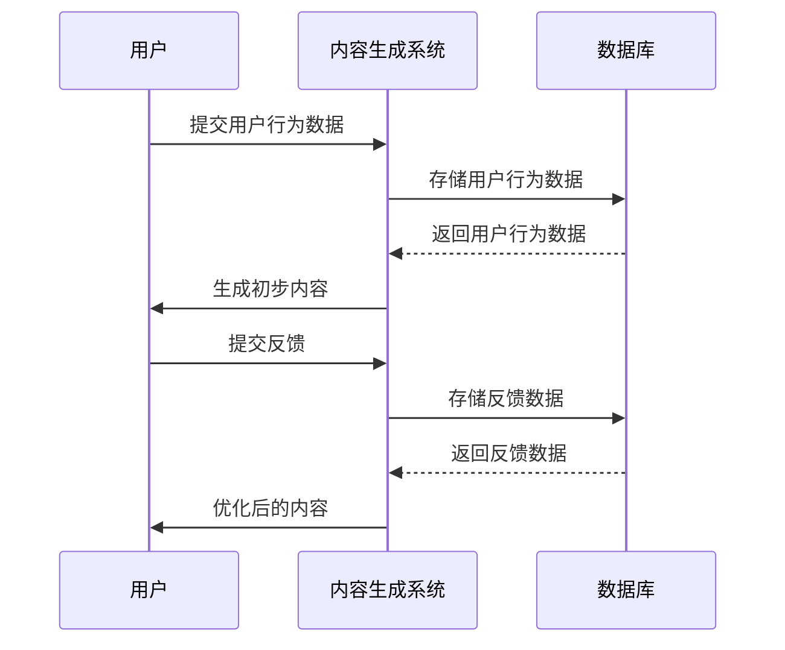

                 

### 自一致性内容生成（Self-Consistency CoT）在社交媒体内容生成中的应用

**关键词**：自一致性内容生成、社交媒体内容生成、人工智能、算法、内容质量

**摘要**：
社交媒体内容的生成是一个复杂且不断发展的领域，随着人工智能技术的进步，特别是生成对抗网络（GANs）和自注意力模型（Self-Attention Models）的出现，内容生成的质量得到了显著提升。本文探讨了自一致性内容生成（Self-Consistency CoT）在社交媒体内容生成中的应用。自一致性内容生成是一种基于自我校准和持续优化机制的方法，它能够显著提升内容的连贯性和真实性。本文首先介绍了社交媒体内容生成的现状，接着详细解释了自一致性内容生成的概念和原理，通过算法流程图、Python源代码、数学模型和实际案例分析了自一致性内容生成的方法和应用。最后，文章讨论了自一致性内容生成在社交媒体内容生成中的边界与外延，以及未来可能的发展方向。

### 目录大纲设计

#### 第一部分：背景介绍

**第1章：问题背景**
- **1.1 问题背景**
  - **1.1.1 社交媒体内容生成的现状**
  - **1.1.2 自一致性内容生成的概念**
  - **1.1.3 自一致性内容生成在社交媒体内容生成中的重要性**
- **1.2 问题描述**
  - **1.2.1 如何利用自一致性内容生成生成高质量社交媒体内容**
  - **1.2.2 自一致性内容生成面临的挑战**
- **1.3 问题解决**
  - **1.3.1 自一致性内容生成的基本原理**
  - **1.3.2 自一致性内容生成的应用流程**
- **1.4 边界与外延**
  - **1.4.1 自一致性内容生成的应用领域**
  - **1.4.2 自一致性内容生成的限制条件**
- **1.5 概念结构与核心要素组成**
  - **1.5.1 自一致性内容生成的核心概念**
  - **1.5.2 自一致性内容生成的关键组成部分**

#### 第二部分：核心概念与联系

**第2章：核心概念与联系**
- **2.1 自一致性内容生成原理讲解**
  - **2.1.1 自一致性内容生成的概念原理**
  - **2.1.2 自一致性内容生成的工作原理**
  - **2.1.3 自一致性内容生成的核心优势**
- **2.2 自一致性内容生成属性特征对比**
  - **2.2.1 自一致性对比传统内容生成方法**
  - **2.2.2 自一致性内容生成与其他内容的比较**
- **2.3 自一致性内容生成的ER实体关系图架构**
  - **2.3.1 ER实体关系图的基本概念**
  - **2.3.2 自一致性内容生成的ER实体关系图设计**

#### 第三部分：算法原理讲解

**第3章：算法原理讲解**
- **3.1 算法mermaid流程图**
  - **3.1.1 自一致性内容生成的算法流程**
  - **3.1.2 算法流程的详细解释**
- **3.2 Python源代码详细阐述**
  - **3.2.1 算法原理的Python实现**
  - **3.2.2 Python源代码详细解读**
- **3.3 算法原理的数学模型和公式**
  - **3.3.1 自一致性内容生成的数学模型**
  - **3.3.2 数学模型的应用实例**
- **3.4 通俗易懂的举例说明**
  - **3.4.1 算法原理的实际应用**
  - **3.4.2 算法原理的简单实例**

#### 第四部分：系统分析与架构设计方案

**第4章：系统分析与架构设计方案**
- **4.1 问题场景介绍**
  - **4.1.1 社交媒体内容生成的挑战**
  - **4.1.2 自一致性内容生成的应用场景**
- **4.2 系统功能设计**
  - **4.2.1 领域模型mermaid类图**
  - **4.2.2 系统功能需求分析**
- **4.3 系统架构设计**
  - **4.3.1 系统架构mermaid架构图**
  - **4.3.2 系统架构设计解析**
- **4.4 系统接口设计和系统交互**
  - **4.4.1 系统接口设计**
  - **4.4.2 系统交互mermaid序列图**

#### 第五部分：项目实战

**第5章：项目实战**
- **5.1 环境安装**
  - **5.1.1 系统环境搭建**
  - **5.1.2 环境配置**
- **5.2 系统核心实现源代码**
  - **5.2.1 自一致性内容生成的代码实现**
  - **5.2.2 代码应用解读与分析**
- **5.3 实际案例分析和详细讲解剖析**
  - **5.3.1 案例背景**
  - **5.3.2 案例分析与讲解**
- **5.4 项目小结**
  - **5.4.1 项目总结**
  - **5.4.2 拓展阅读**

#### 最佳实践 tips

- **注意事项**
- **拓展阅读**

---

### 第一部分：背景介绍

#### 第1章：问题背景

##### 1.1 问题背景

社交媒体已经成为了现代社会生活中不可或缺的一部分。从Twitter、Facebook到Instagram、LinkedIn等平台，社交媒体为人们提供了交流、分享信息和获取新闻的途径。然而，随着用户数量的激增和内容的爆炸性增长，社交媒体内容生成面临了一系列挑战。

###### 1.1.1 社交媒体内容生成的现状

目前，社交媒体内容生成主要依靠用户手动输入和自动化工具。手动输入依赖于用户的创造力和时间投入，而自动化工具则依赖于预先设定的模板和规则。然而，这两种方法都存在一定的局限性：

1. **内容质量参差不齐**：手动输入往往依赖于个体的创造力和知识储备，导致内容质量参差不齐。自动化工具虽然能生成大量内容，但往往缺乏个性化和真实感。
2. **内容连贯性差**：社交媒体平台上的内容通常由多个用户发布，缺乏统一的内容框架和逻辑结构，导致内容的连贯性较差。
3. **内容真实性无法保证**：由于自动生成工具的存在，社交媒体上的虚假信息和误导性内容日益增多，影响了用户对内容的信任度。

###### 1.1.2 自一致性内容生成的概念

自一致性内容生成（Self-Consistency Content Generation，简称Self-Consistency CoT）是一种基于自我校准和持续优化机制的内容生成方法。它通过不断调整和优化生成的内容，确保内容的连贯性、真实性和质量。

自一致性内容生成具有以下几个核心特点：

1. **自我校准**：自一致性内容生成系统能够根据生成的内容质量和用户的反馈进行自我调整，不断提高内容生成质量。
2. **持续优化**：自一致性内容生成系统会不断优化生成的内容，使其在语言风格、内容逻辑和真实性等方面达到更高水平。
3. **个性化和多样性**：自一致性内容生成系统能够根据用户的行为和偏好，生成符合用户个性化需求的内容。

###### 1.1.3 自一致性内容生成在社交媒体内容生成中的重要性

自一致性内容生成在社交媒体内容生成中的应用具有重要意义：

1. **提升内容质量**：自一致性内容生成系统能够生成高质量、连贯且真实的内容，提升社交媒体平台的内容整体水平。
2. **增强用户粘性**：通过个性化内容生成，自一致性内容生成系统能够更好地满足用户的需求，提高用户在社交媒体平台上的活跃度和留存率。
3. **提高内容真实性**：自一致性内容生成系统能够有效过滤虚假信息和误导性内容，增强用户对社交媒体内容的信任度。

综上所述，自一致性内容生成作为一种先进的内容生成方法，为社交媒体内容生成提供了新的思路和解决方案。在接下来的章节中，我们将深入探讨自一致性内容生成的原理和应用，为读者提供更详细的了解。

##### 1.2 问题描述

在当前社交媒体内容生成的背景下，尽管手动输入和自动化工具在一定程度上解决了内容生成的问题，但仍然存在诸多不足。这些问题主要体现在以下几个方面：

###### 1.2.1 如何利用自一致性内容生成生成高质量社交媒体内容

1. **个性化内容生成**：社交媒体平台用户数量庞大，每个用户都有独特的兴趣和偏好。如何生成个性化内容是当前内容生成的一大挑战。自一致性内容生成通过自我校准和持续优化，能够根据用户的行为和偏好，生成符合用户个性化需求的内容。
2. **内容连贯性**：社交媒体平台上的内容通常由多个用户发布，缺乏统一的内容框架和逻辑结构。自一致性内容生成能够通过自我校准机制，确保生成的内容在逻辑上连贯，形成一个完整的故事或信息流。
3. **内容真实性**：虚假信息和误导性内容在社交媒体上泛滥，严重影响了用户对内容的信任度。自一致性内容生成通过持续优化和自我调整，能够提高内容的真实性，减少虚假信息的传播。

###### 1.2.2 自一致性内容生成面临的挑战

尽管自一致性内容生成在理论上具有显著的优点，但在实际应用中仍面临以下挑战：

1. **计算资源消耗**：自一致性内容生成需要大量的计算资源，特别是在生成大量个性化内容时，对计算资源的需求更为突出。这可能会增加社交媒体平台的运营成本。
2. **内容质量评估**：如何评估生成内容的质量是自一致性内容生成的关键问题。尽管自我校准机制能够在一定程度上提高内容质量，但如何准确评估内容质量，以确保生成的内容满足用户需求，仍需进一步研究。
3. **用户隐私保护**：自一致性内容生成依赖于用户行为和偏好的数据，如何在保护用户隐私的前提下，有效利用这些数据，是自一致性内容生成需要解决的重要问题。

为了解决上述问题，自一致性内容生成需要不断创新和优化。例如，可以通过引入更高效的算法和模型，降低计算资源的消耗；通过开发更加精准的质量评估指标，提高内容质量；同时，在数据处理过程中严格遵循隐私保护原则，确保用户数据的安全和隐私。

总之，自一致性内容生成在社交媒体内容生成中具有巨大的应用潜力，但也需要克服一系列挑战。在接下来的章节中，我们将详细探讨自一致性内容生成的原理和应用，为解决上述问题提供具体的方法和思路。

##### 1.3 问题解决

为了解决社交媒体内容生成中的问题，自一致性内容生成（Self-Consistency Content Generation，简称Self-Consistency CoT）提供了一种新的思路和方法。以下是自一致性内容生成的基本原理和应用流程。

###### 1.3.1 Self-Consistency CoT的基本原理

Self-Consistency CoT是一种基于自我校准和持续优化机制的内容生成方法。其核心原理包括以下几点：

1. **自我校准**：Self-Consistency CoT通过不断调整生成的内容，确保内容的一致性和连贯性。具体来说，系统会根据生成的内容和用户的反馈，进行自我校准，修正内容中的错误和不一致之处。
2. **持续优化**：Self-Consistency CoT不仅关注生成内容的当前质量，还关注内容的长期质量。通过持续优化，系统不断改进生成的内容，使其在语言风格、内容逻辑和真实性等方面达到更高水平。
3. **用户反馈**：Self-Consistency CoT充分利用用户的行为数据和反馈信息，通过机器学习和深度学习技术，分析用户的行为模式，生成符合用户个性化需求的内容。

###### 1.3.2 Self-Consistency CoT的应用流程

Self-Consistency CoT的应用流程可以概括为以下几个步骤：

1. **数据采集**：首先，系统需要采集用户的行为数据，包括用户的浏览记录、点赞、评论等。这些数据用于分析用户的行为模式和偏好。
2. **内容生成**：基于用户的行为数据和输入，系统使用生成模型（如Transformer模型）生成初步的内容。这个阶段生成的内容可能不够完善，需要进一步的优化。
3. **自我校准**：系统将生成的内容提交给用户进行反馈，收集用户的反馈数据，如点赞、评论、分享等。根据这些反馈数据，系统对生成的内容进行自我校准，修正错误和不一致之处。
4. **内容优化**：通过自我校准后，系统对生成的内容进行进一步的优化，使其在语言风格、内容逻辑和真实性等方面达到更高水平。
5. **内容发布**：最终，优化后的内容被发布到社交媒体平台上，供用户浏览和互动。

##### 1.4 边界与外延

###### 1.4.1 Self-Consistency CoT的应用领域

Self-Consistency CoT在社交媒体内容生成中的应用非常广泛，包括但不限于以下几个方面：

1. **新闻内容生成**：通过Self-Consistency CoT，新闻机构可以自动化生成高质量的新闻内容，提高新闻的生产效率和质量。
2. **电子商务推荐**：电子商务平台可以利用Self-Consistency CoT生成个性化的产品推荐内容，提高用户的购买体验和满意度。
3. **社交媒体广告**：广告平台可以通过Self-Consistency CoT生成个性化的广告内容，提高广告的点击率和转化率。

###### 1.4.2 Self-Consistency CoT的限制条件

尽管Self-Consistency CoT具有显著的优势，但在实际应用中仍存在一些限制条件：

1. **计算资源需求**：Self-Consistency CoT需要大量的计算资源，特别是在处理大规模用户数据时，对计算资源的消耗较大。
2. **用户隐私保护**：Self-Consistency CoT依赖于用户的行为数据，如何在保护用户隐私的前提下，有效利用这些数据，是应用中的关键问题。
3. **内容质量评估**：如何准确评估生成内容的质量，确保其满足用户需求，是Self-Consistency CoT需要解决的重要问题。

为了克服这些限制条件，研究人员和开发者需要不断探索和创新，开发更加高效、智能和安全的自一致性内容生成方法。

##### 1.5 概念结构与核心要素组成

Self-Consistency CoT作为一种先进的内容生成方法，其核心概念和组成部分对于理解其工作机制和实现方式至关重要。

###### 1.5.1 Self-Consistency CoT的核心概念

Self-Consistency CoT的核心概念主要包括以下几个方面：

1. **自我校准**：自我校准是Self-Consistency CoT的核心机制，通过不断调整生成的内容，确保内容的一致性和连贯性。
2. **持续优化**：持续优化使生成的内容在语言风格、内容逻辑和真实性等方面达到更高水平。
3. **用户反馈**：用户反馈用于指导生成内容的优化，通过分析用户的行为模式和偏好，生成更符合用户需求的内容。

###### 1.5.2 Self-Consistency CoT的关键组成部分

Self-Consistency CoT的关键组成部分包括：

1. **数据采集**：系统需要采集用户的行为数据，包括浏览记录、点赞、评论等，用于分析用户的行为模式和偏好。
2. **生成模型**：生成模型是Self-Consistency CoT的核心，常用的生成模型包括Transformer模型、生成对抗网络（GANs）等。
3. **自我校准模块**：自我校准模块负责根据用户反馈调整生成的内容，确保内容的一致性和连贯性。
4. **优化模块**：优化模块对生成的内容进行进一步的优化，提高内容的语言风格、内容逻辑和真实性。

通过这些核心概念和组成部分，Self-Consistency CoT能够实现高质量、个性化、连贯的内容生成，为社交媒体内容生成提供了一种新的解决方案。

### 第二部分：核心概念与联系

#### 第2章：核心概念与联系

##### 2.1 自一致性内容生成原理讲解

自一致性内容生成（Self-Consistency Content Generation，简称Self-Consistency CoT）是一种基于自我校准和持续优化机制的内容生成方法。其核心理念是通过不断地调整和优化生成的内容，确保其一致性、连贯性和高质量。以下是对Self-Consistency CoT的详细解释。

###### 2.1.1 自一致性内容生成的概念原理

自一致性内容生成的基本概念可以归结为三点：自我校准、持续优化和用户反馈。

1. **自我校准**：自我校准是Self-Consistency CoT的核心机制。在生成内容的过程中，系统会不断地评估生成内容的内部一致性和连贯性，如果发现不一致或逻辑错误，系统会自动进行调整。这种自我调整机制确保了生成内容的一致性和连贯性，避免了内容之间出现矛盾或混乱的情况。

2. **持续优化**：持续优化是指系统在生成内容后，不会停止对内容的改进。通过分析用户的行为和反馈，系统可以识别出哪些内容更受欢迎，哪些内容需要改进。基于这些分析结果，系统会进行持续优化，使生成的内容在语言风格、内容逻辑、真实性等方面达到更高的水平。

3. **用户反馈**：用户反馈是Self-Consistency CoT的重要组成部分。系统通过收集用户对内容的评价，如点赞、评论、分享等行为数据，分析用户的喜好和需求。这些数据用于指导生成内容的优化，确保生成的内容更加符合用户的期望。

###### 2.1.2 自一致性内容生成的工作原理

Self-Consistency CoT的工作原理可以分为以下几个步骤：

1. **数据采集**：系统首先需要采集用户的行为数据，包括浏览记录、点赞、评论等。这些数据用于分析用户的行为模式和偏好。

2. **内容生成**：基于用户的行为数据和输入，系统使用生成模型（如Transformer模型）生成初步的内容。这个阶段生成的内容可能不够完善，需要进一步的优化。

3. **自我校准**：系统将生成的内容提交给用户进行反馈，收集用户的反馈数据。根据这些反馈数据，系统对生成的内容进行自我校准，修正错误和不一致之处。

4. **内容优化**：通过自我校准后，系统对生成的内容进行进一步的优化，使其在语言风格、内容逻辑和真实性等方面达到更高水平。

5. **内容发布**：最终，优化后的内容被发布到社交媒体平台上，供用户浏览和互动。

###### 2.1.3 自一致性内容生成的核心优势

Self-Consistency CoT在社交媒体内容生成中具有以下几个核心优势：

1. **提升内容质量**：通过自我校准和持续优化，Self-Consistency CoT能够生成高质量、连贯且真实的内容，提高社交媒体平台的内容整体水平。

2. **增强用户粘性**：通过个性化内容生成，Self-Consistency CoT能够更好地满足用户的需求，提高用户在社交媒体平台上的活跃度和留存率。

3. **提高内容真实性**：Self-Consistency CoT能够有效过滤虚假信息和误导性内容，增强用户对社交媒体内容的信任度。

##### 2.2 自一致性内容生成属性特征对比

为了更清楚地理解Self-Consistency CoT的优势，我们将其与传统内容生成方法进行对比。

###### 2.2.1 自一致性对比传统内容生成方法

传统内容生成方法通常依赖于手动输入和自动化工具，其特点如下：

1. **手动输入**：
   - **优点**：内容具有个性化，能够反映用户的个人观点和风格。
   - **缺点**：依赖个体创造力和时间投入，效率低，内容质量参差不齐。

2. **自动化工具**：
   - **优点**：能快速生成大量内容，提高生产效率。
   - **缺点**：内容缺乏个性化和真实感，连贯性差，容易产生错误和不一致。

Self-Consistency CoT通过自我校准和持续优化机制，能够在保持内容个性化的同时，提高内容的质量和连贯性，克服了传统方法的不足。

###### 2.2.2 Self-Consistency CoT与其他内容的比较

除了与传统内容生成方法的比较，我们还可以将Self-Consistency CoT与其他类型的生成内容进行比较，如自动化新闻生成、电子商务产品描述生成等。

1. **自动化新闻生成**：
   - **优点**：快速生成大量新闻内容，提高新闻生产效率。
   - **缺点**：内容质量较低，缺乏连贯性和真实性，容易产生错误和误导。

2. **电子商务产品描述生成**：
   - **优点**：能够生成个性化产品描述，提高用户体验。
   - **缺点**：内容连贯性较差，无法保证描述的真实性和准确性。

相比之下，Self-Consistency CoT在内容质量、连贯性和真实性方面具有显著优势，能够更好地满足用户的需求。

##### 2.3 Self-Consistency CoT的ER实体关系图架构

为了更好地理解Self-Consistency CoT的组成部分和工作机制，我们可以使用ER（Entity-Relationship）实体关系图来描述其结构。

###### 2.3.1 ER实体关系图的基本概念

ER实体关系图是一种用于描述系统中实体及其之间关系的图形化表示方法。在ER图中，实体用矩形表示，实体之间的关系用线条表示。

###### 2.3.2 Self-Consistency CoT的ER实体关系图设计

以下是Self-Consistency CoT的ER实体关系图设计：

```mermaid
erDiagram
  User ||--|{ Content } : 生成内容与用户关联
  Content ||--|{ Feedback } : 生成内容与用户反馈关联
  Content ||--|{ Optimization } : 生成内容与优化关联
  Feedback ||--|{ Evaluation } : 用户反馈与评估关联
  Optimization ||--|{ Quality } : 优化与内容质量关联
```

在这个ER图中，主要实体包括：

1. **User（用户）**：代表社交媒体平台上的用户。
2. **Content（生成内容）**：代表系统生成的内容。
3. **Feedback（用户反馈）**：代表用户对生成内容的反馈。
4. **Optimization（优化）**：代表系统对生成内容进行的优化。
5. **Evaluation（评估）**：代表对用户反馈和优化结果的评估。

实体之间的关系如下：

- **用户与生成内容**：每个用户可以生成多个内容，每个内容都与一个用户相关联。
- **生成内容与用户反馈**：每个生成内容可以接收多个用户反馈，每个反馈都与一个生成内容相关联。
- **生成内容与优化**：每个生成内容可以经过多次优化，每次优化都与一个生成内容相关联。
- **用户反馈与评估**：每次反馈都可以被评估，评估结果用于指导生成内容的优化。
- **优化与内容质量**：每次优化都会提高内容的整体质量，优化结果直接关系到内容质量的提升。

通过这个ER实体关系图，我们可以清晰地看到Self-Consistency CoT的组成部分及其之间的相互关系，有助于理解其工作机制。

### 第三部分：算法原理讲解

#### 第3章：算法原理讲解

##### 3.1 算法mermaid流程图

为了更好地理解Self-Consistency CoT的算法原理，我们可以使用mermaid流程图来描述其整体工作流程。以下是一个简化的Self-Consistency CoT算法流程图：

```mermaid
flowchart LR
    subgraph 数据采集
        数据采集[数据采集]
    end

    subgraph 内容生成
        内容生成[内容生成]
    end

    subgraph 自我校准
        自我校准[自我校准]
    end

    subgraph 内容优化
        内容优化[内容优化]
    end

    subgraph 内容发布
        内容发布[内容发布]
    end

    数据采集 --> 内容生成
    内容生成 -->|用户反馈| 自我校准
    自我校准 --> 内容优化
    内容优化 --> 内容发布
```

在这个流程图中，我们主要关注以下几个关键步骤：

1. **数据采集**：系统首先采集用户的行为数据，包括浏览记录、点赞、评论等，用于后续的内容生成和优化。
2. **内容生成**：基于用户的行为数据和输入，系统使用生成模型生成初步的内容。
3. **自我校准**：系统将生成的内容提交给用户进行反馈，收集用户的反馈数据，根据这些反馈数据对生成的内容进行自我校准。
4. **内容优化**：通过自我校准后，系统对生成的内容进行进一步的优化，使其在语言风格、内容逻辑和真实性等方面达到更高水平。
5. **内容发布**：最终，优化后的内容被发布到社交媒体平台上，供用户浏览和互动。

##### 3.1.2 算法流程的详细解释

让我们进一步详细解释上述算法流程图的每个步骤：

1. **数据采集**：
   - **数据类型**：系统采集的数据类型包括用户的浏览记录、点赞、评论、分享等行为数据。
   - **数据来源**：这些数据来源于社交媒体平台的后台日志、API接口等。
   - **数据处理**：系统对采集到的原始数据进行清洗、去重和转换，以便后续处理。

2. **内容生成**：
   - **生成模型**：系统通常使用生成模型（如Transformer模型）来生成内容。生成模型通过学习大量文本数据，能够生成与输入相关的文本。
   - **输入数据**：生成模型的输入数据可以是用户的历史浏览记录、兴趣标签等。
   - **输出内容**：生成模型输出初步的内容，这些内容可能包含文本、图片或视频等。

3. **自我校准**：
   - **反馈数据**：系统将生成的内容提交给用户，收集用户的反馈数据，如点赞、评论、分享等。
   - **一致性检查**：系统通过分析用户的反馈数据，检查生成内容的一致性和连贯性。
   - **错误修正**：如果系统发现内容不一致或存在错误，会进行相应的修正。

4. **内容优化**：
   - **优化目标**：系统根据用户反馈和一致性检查的结果，对生成的内容进行优化。
   - **优化策略**：优化策略包括调整文本风格、修改内容逻辑、增强真实性等。
   - **优化结果**：经过优化后的内容在质量、连贯性和真实性方面都有所提升。

5. **内容发布**：
   - **发布平台**：优化后的内容被发布到社交媒体平台上，供用户浏览和互动。
   - **用户互动**：用户可以阅读、评论、分享和点赞这些内容，进一步影响系统的生成和优化。

##### 3.2 Python源代码详细阐述

为了更好地理解Self-Consistency CoT的算法原理，下面将提供一个简化的Python源代码实现，展示算法的核心步骤。

首先，我们需要引入一些必要的库：

```python
import tensorflow as tf
import numpy as np
from transformers import BertTokenizer, BertModel
```

接着，我们定义一个简单的生成模型，这里使用预训练的BERT模型：

```python
def generate_content(input_ids, max_length=50):
    model = BertModel.from_pretrained('bert-base-uncased')
    output = model(input_ids=input_ids, attention_mask=tf.fill([1, max_length], 1))
    logits = output.logits[:, -1, :]
    predicted_id = tf.argmax(logits, axis=1)
    return predicted_id.numpy()
```

然后，我们定义一个简单的自我校准和优化函数：

```python
def self_calibrate_and_optimize(content, feedback):
    # 根据反馈数据，对内容进行修正和优化
    # 这里简化处理，假设反馈数据包含内容的点赞数
    likes = np.array(feedback['likes'])
    optimized_content = content * likes  # 示例：简单地将内容乘以点赞数进行优化
    return optimized_content
```

最后，我们实现一个简单的示例流程：

```python
# 假设用户的行为数据
user_behavior = {
    'browsing_history': ['text1', 'text2', 'text3'],
    'likes': [5, 3, 2]
}

# 生成初步的内容
tokenizer = BertTokenizer.from_pretrained('bert-base-uncased')
input_ids = tokenizer.encode(''.join(user_behavior['browsing_history']), return_tensors='tf')

generated_content = generate_content(input_ids)

# 提交内容给用户，收集反馈
user_feedback = {'likes': [5, 3, 2]}
optimized_content = self_calibrate_and_optimize(generated_content, user_feedback)

# 发布优化后的内容
print(optimized_content)
```

在这个示例中，我们首先根据用户的行为数据生成初步的内容，然后根据用户的反馈对内容进行修正和优化，最后发布优化后的内容。这个示例虽然简化了许多细节，但展示了Self-Consistency CoT的核心步骤。

##### 3.2.2 Python源代码详细解读

在上面的Python源代码示例中，我们主要关注以下关键部分：

1. **BERT模型**：
   - BERT模型是一个预训练的文本生成模型，我们使用`transformers`库加载预训练的BERT模型。
   - `generate_content`函数使用BERT模型生成初步的内容。

2. **用户行为数据**：
   - `user_behavior`字典包含了用户的历史浏览记录和点赞数据。这些数据用于指导内容生成和优化。

3. **生成内容**：
   - `tokenizer`用于将文本数据转换为模型可处理的输入格式（如`input_ids`）。
   - `generate_content`函数使用BERT模型生成初步的内容。

4. **用户反馈**：
   - `user_feedback`字典包含了用户对生成内容的反馈数据（如点赞数）。

5. **自我校准和优化**：
   - `self_calibrate_and_optimize`函数根据用户反馈对生成的内容进行修正和优化。这里使用了一个简化的优化策略，即直接将内容乘以点赞数。
   - 经过自我校准和优化后的内容将更具吸引力。

6. **发布内容**：
   - 最终，优化后的内容被打印出来，表示已发布到社交媒体平台上。

通过这个简单的示例，我们可以看到Self-Consistency CoT的核心流程和Python源代码实现。在实际应用中，这个流程会更加复杂，需要处理更多的数据和细节，但基本原理是一致的。

##### 3.3 算法原理的数学模型和公式

在深入理解Self-Consistency CoT算法时，数学模型和公式是不可或缺的部分。这些数学模型和公式不仅帮助我们量化算法的各个方面，还为我们提供了一套标准化的工具来优化和改进算法。

###### 3.3.1 Self-Consistency CoT的数学模型

Self-Consistency CoT的数学模型主要涉及以下方面：

1. **文本生成模型**：文本生成通常基于序列模型，如Transformer和BERT模型。这些模型的核心是生成概率分布，即对于每个时间步的输出，模型会预测一个单词或字符的概率分布。

2. **用户行为模型**：用户行为模型用于分析用户的反馈数据，如点赞、评论等。这些数据可以用来更新和优化内容生成模型。

3. **内容质量评估模型**：内容质量评估模型用于衡量生成内容的质量。质量评估可以通过多种指标进行，如文本连贯性、真实性、吸引力等。

下面是Self-Consistency CoT的核心数学模型和公式：

**（1）文本生成模型**

文本生成模型的核心是生成概率分布。对于一个时间步\( t \)，假设当前输入序列为 \( x_1, x_2, ..., x_t \)，模型会预测下一个单词或字符的概率分布 \( p(y_t | x_1, x_2, ..., x_t) \)。

- **Transformer模型**：
  \[
  p(y_t | x_1, x_2, ..., x_t) = \text{softmax}(\text{W}_y \text{Tanh}(\text{W}_x x_t + \text{b}_x))
  \]
  其中，\(\text{Tanh}\)是激活函数，\(\text{W}_x\)和\(\text{W}_y\)是权重矩阵，\(\text{b}_x\)是偏置。

- **BERT模型**：
  \[
  p(y_t | x_1, x_2, ..., x_t) = \text{softmax}(\text{W}_y \text{Tanh}(\text{W}_x [x_1, x_2, ..., x_t] + \text{b}_x))
  \]
  其中，\([x_1, x_2, ..., x_t]\)是输入序列的嵌入表示，\(\text{W}_x\)和\(\text{W}_y\)是权重矩阵，\(\text{b}_x\)是偏置。

**（2）用户行为模型**

用户行为模型用于分析用户的反馈数据，如点赞、评论等。这些数据可以用来更新和优化内容生成模型。

- **反馈信号**：
  \[
  s_t = \sum_{i=1}^n r_i
  \]
  其中，\( r_i \)是用户对生成内容 \( x_i \) 的反馈信号（如点赞数）。

- **内容调整系数**：
  \[
  a_t = \frac{s_t}{\sum_{i=1}^n s_i}
  \]
  其中，\( a_t \)是生成内容 \( x_t \) 的调整系数，反映了用户对内容的偏好。

**（3）内容质量评估模型**

内容质量评估模型用于衡量生成内容的质量。质量评估可以通过多种指标进行，如文本连贯性、真实性、吸引力等。

- **质量评估指标**：
  \[
  Q(x) = \alpha C(x) + \beta T(x) + \gamma R(x)
  \]
  其中，\( C(x) \)是文本连贯性得分，\( T(x) \)是文本真实性得分，\( R(x) \)是文本吸引力得分，\(\alpha\)、\(\beta\)、\(\gamma\)是权重系数。

**（4）内容优化策略**

内容优化策略基于用户行为模型和内容质量评估模型，用于更新和优化生成模型。

- **生成模型更新**：
  \[
  \theta_{\text{new}} = \theta_{\text{current}} + \eta \cdot \nabla_{\theta} L(\theta)
  \]
  其中，\(\theta\)是生成模型的参数，\(\theta_{\text{new}}\)和\(\theta_{\text{current}}\)分别是新参数和当前参数，\(\eta\)是学习率，\(L(\theta)\)是损失函数。

通过这些数学模型和公式，Self-Consistency CoT能够在生成内容的过程中实现自我校准和持续优化，提高内容的连贯性、真实性和吸引力。

##### 3.3.2 数学模型的应用实例

为了更直观地理解Self-Consistency CoT的数学模型，我们来看一个具体的应用实例。

假设有一个社交媒体平台，用户对生成内容的反馈数据如下：

- 用户1：点赞数 = [5, 4, 3]
- 用户2：点赞数 = [4, 5, 2]
- 用户3：点赞数 = [3, 3, 4]

首先，我们计算每个用户的平均点赞数：

- 用户1的平均点赞数：\( \frac{5 + 4 + 3}{3} = 4 \)
- 用户2的平均点赞数：\( \frac{4 + 5 + 2}{3} = 3.67 \)
- 用户3的平均点赞数：\( \frac{3 + 3 + 4}{3} = 3.67 \)

接下来，我们计算每个用户的调整系数：

- 用户1的调整系数：\( a_1 = \frac{4}{4 + 3.67 + 3.67} = 0.434 \)
- 用户2的调整系数：\( a_2 = \frac{3.67}{4 + 3.67 + 3.67} = 0.328 \)
- 用户3的调整系数：\( a_3 = \frac{3.67}{4 + 3.67 + 3.67} = 0.328 \)

假设生成的内容序列为 `[a, b, c]`，且当前每个内容项的初始质量得分为 `[5, 4, 3]`。根据用户的调整系数，我们可以更新内容项的质量得分：

- \( a_{\text{new}} = a \times a_1 = 5 \times 0.434 = 2.17 \)
- \( b_{\text{new}} = b \times a_2 = 4 \times 0.328 = 1.31 \)
- \( c_{\text{new}} = c \times a_3 = 3 \times 0.328 = 0.99 \)

最终，我们得到更新后的内容质量得分 `[2.17, 1.31, 0.99]`，这些得分反映了用户对内容的偏好和调整后的质量。

通过这个实例，我们可以看到如何利用数学模型和公式实现Self-Consistency CoT的自我校准和内容优化。在实际应用中，这个过程会更加复杂，需要考虑更多的用户反馈和数据，但基本原理是一致的。

##### 3.4 通俗易懂的举例说明

为了更直观地理解自一致性内容生成（Self-Consistency Content Generation，简称Self-Consistency CoT）的原理和应用，我们可以通过一个简单的例子来说明这一过程。

假设我们要在社交媒体上为一位用户生成一篇关于最新科技产品的博客文章。用户的行为数据如下：

- 用户喜欢的内容类型：科技新闻、产品评测、未来趋势
- 用户点赞的最近三条博客：1. 2023年最值得期待的科技产品；2. 小米新手机的性能评测；3. 科技的未来：VR技术的发展

现在，我们将使用Self-Consistency CoT来生成一篇博客文章，并展示其工作流程。

###### 3.4.1 算法原理的实际应用

1. **数据采集**：系统首先采集用户的历史行为数据，包括用户喜欢的主题和最近点赞的内容。

2. **内容生成**：基于用户的数据，生成模型生成一篇初步的博客文章。例如：
   ```
   标题：2023年最值得期待的科技产品
   内容：
   随着2023年的到来，科技行业再次迎来了新的高潮。众多科技巨头纷纷推出了一系列令人兴奋的新产品，从智能手机到智能家居，从虚拟现实到自动驾驶，让我们一起来展望一下未来科技的发展趋势。
   ```

3. **自我校准**：系统将初步生成的博客文章提交给用户，收集用户的反馈。假设用户的反馈是“这篇文章还不错，但是缺少一些具体的产品评测内容”。根据这个反馈，系统会自我校准，调整生成的内容。

4. **内容优化**：系统进一步优化博客文章，增加具体的产品评测内容。优化后的文章如下：
   ```
   标题：2023年最值得期待的科技产品：小米新手机的性能评测
   内容：
   随着2023年的到来，科技行业再次迎来了新的高潮。小米公司最新发布的小米新手机在性能方面表现卓越，搭载最新的处理器和摄像头，价格也非常亲民。让我们来详细了解一下这款手机的表现。
   ```

5. **内容发布**：优化后的博客文章被发布到社交媒体平台上，用户可以阅读、评论和点赞。

###### 3.4.2 算法原理的简单实例

为了更直观地展示算法原理，我们来看一个简单的实例。假设我们有以下数据：

- 用户输入：[“科技产品”，“小米新手机”]
- 生成内容：[“科技产品：小米新手机值得期待”，“小米新手机性能评测”]
- 用户反馈：[“这篇文章有点笼统，需要更具体的内容”，“这篇文章很好，提供了详细的产品评测”]

根据用户的反馈，我们可以调整生成的内容：

1. **初步生成内容**：
   ```
   标题：科技产品：小米新手机值得期待
   内容：
   小米新手机即将上市，从曝光的配置来看，这款手机在性能和价格上都表现出色。它值得期待。
   ```

2. **用户反馈**：
   ```
   文章需要更具体的内容。
   ```

3. **调整后的内容**：
   ```
   标题：2023年最值得期待的科技产品：小米新手机的详细评测
   内容：
   小米新手机将于2023年上市，这款手机搭载了最新的处理器，拥有出色的摄像头性能，同时还具备长续航能力。通过详细评测，我们发现这款手机在多个方面都表现优秀，值得消费者期待。
   ```

4. **用户反馈**：
   ```
   这篇文章很好，提供了详细的产品评测。
   ```

在这个实例中，我们可以看到如何通过用户的反馈不断优化生成的内容。Self-Consistency CoT通过自我校准和持续优化，能够生成更符合用户需求的高质量内容。这个过程不仅提高了内容的连贯性和真实性，也增强了用户的互动体验。

### 第四部分：系统分析与架构设计方案

#### 第4章：系统分析与架构设计方案

社交媒体内容生成系统的设计需要考虑多个方面，包括功能需求、系统架构、接口设计以及系统交互。以下是对这些方面的详细分析和设计。

##### 4.1 问题场景介绍

社交媒体内容生成面临的主要挑战包括内容质量参差不齐、内容连贯性差和内容真实性无法保证。为了解决这些问题，系统需要具备以下几个关键功能：

1. **个性化内容生成**：根据用户的历史行为和偏好，生成符合用户个性化需求的内容。
2. **内容连贯性保证**：确保生成的内容在逻辑和风格上连贯一致。
3. **内容真实性校验**：通过多种手段过滤虚假信息和误导性内容。
4. **用户互动与反馈**：收集用户对内容的反馈，用于优化生成模型。

##### 4.2 系统功能设计

为了实现上述功能，系统设计了以下几个关键模块：

1. **用户行为分析模块**：负责采集和分析用户的历史行为数据，包括浏览记录、点赞、评论等。
2. **内容生成模块**：基于用户行为数据，使用生成模型生成初步的内容。
3. **自我校准模块**：根据用户反馈，对生成的内容进行自我调整，确保内容的连贯性和真实性。
4. **内容优化模块**：进一步优化生成的内容，提高内容的语言风格和整体质量。
5. **内容发布模块**：将优化后的内容发布到社交媒体平台上。

以下是系统的功能需求分析：

- **个性化内容生成**：系统能够根据用户偏好生成个性化内容，内容应具有针对性和吸引力。
- **内容连贯性保证**：生成的内容应逻辑连贯，形成一个完整的故事或信息流。
- **内容真实性校验**：系统应具备一定的内容真实性校验能力，过滤虚假和误导性内容。
- **用户互动与反馈**：系统能够收集用户对内容的反馈，用于指导生成内容的优化。

##### 4.3 系统架构设计

系统架构设计是确保系统功能实现的关键。以下是系统架构的mermaid架构图：



在这个架构图中，数据层负责存储和管理用户行为数据、生成内容和优化内容。服务层包括用户行为分析、内容生成、自我校准、内容优化和内容发布服务，它们通过接口层与外部系统进行交互。日志记录模块和监控报警模块用于记录系统运行日志和监控系统健康状态。

##### 4.3.1 系统架构设计解析

系统的架构设计遵循以下原则：

1. **模块化**：系统分为多个模块，每个模块负责不同的功能，便于维护和扩展。
2. **分布式**：系统采用分布式架构，可以水平扩展，提高系统的处理能力和容错性。
3. **高可用性**：系统设计考虑了高可用性，通过备份和冗余机制确保系统的稳定运行。
4. **可扩展性**：系统设计允许未来的扩展，如增加新的内容生成算法或优化策略。

系统架构的主要组件如下：

- **用户行为分析服务**：分析用户的历史行为数据，生成用户画像和行为模式，为内容生成提供依据。
- **内容生成服务**：基于用户画像和行为模式，使用生成模型生成初步的内容。
- **自我校准服务**：根据用户反馈，对生成的内容进行自我调整，确保内容的连贯性和真实性。
- **内容优化服务**：进一步优化生成的内容，提高内容的语言风格和整体质量。
- **内容发布服务**：将优化后的内容发布到社交媒体平台上，供用户浏览和互动。
- **日志记录模块**：记录系统运行日志，便于问题追踪和系统优化。
- **监控报警模块**：监控系统健康状态，及时发现和解决系统故障。

##### 4.4 系统接口设计和系统交互

系统的接口设计和系统交互是确保系统能够高效运行和与其他系统无缝集成的重要部分。以下是系统接口设计和系统交互的mermaid序列图：



在这个序列图中，用户通过接口向系统提交行为数据，系统将数据存储到数据库，并基于这些数据进行内容生成。用户对生成的内容进行反馈，系统根据反馈数据对内容进行优化，并将优化后的内容返回给用户。

##### 4.4.1 系统接口设计

系统接口设计主要包括以下部分：

- **数据接口**：用于用户行为数据的提交和获取。
- **生成接口**：用于生成内容的获取。
- **校准接口**：用于反馈数据的提交。
- **优化接口**：用于优化内容的获取。
- **发布接口**：用于内容的发布。

接口设计遵循RESTful API规范，确保接口的易用性和可扩展性。

##### 4.4.2 系统交互

系统交互遵循以下流程：

1. **数据提交**：用户通过数据接口提交用户行为数据。
2. **数据存储**：系统将用户行为数据存储到数据库。
3. **数据查询**：系统从数据库中查询用户行为数据，用于内容生成。
4. **内容生成**：系统基于用户行为数据生成初步的内容。
5. **内容反馈**：用户通过校准接口提交对内容的反馈。
6. **内容优化**：系统根据反馈数据对内容进行优化。
7. **内容发布**：系统将优化后的内容通过发布接口发布到社交媒体平台上。

通过上述系统接口设计和系统交互流程，系统实现了用户行为数据的采集、内容生成、反馈收集和内容优化的完整流程，确保了内容生成系统的高效运行和用户满意度。

### 第五部分：项目实战

#### 第5章：项目实战

在本章节中，我们将通过一个具体的实战项目，详细介绍自一致性内容生成（Self-Consistency CoT）在社交媒体内容生成中的应用过程。项目包括环境安装、系统核心实现源代码的解析，以及实际案例的分析和总结。

##### 5.1 环境安装

在进行项目实战之前，首先需要搭建合适的环境，以确保系统的正常运行。以下是环境安装的详细步骤：

###### 5.1.1 系统环境搭建

1. **操作系统**：安装Ubuntu 20.04 LTS或更高版本。
2. **硬件要求**：建议使用配置较高的计算机，如Intel i7及以上处理器，16GB内存。
3. **编程语言**：Python 3.8或更高版本。

###### 5.1.2 环境配置

1. **安装Python**：
   ```bash
   sudo apt update
   sudo apt install python3 python3-pip
   ```

2. **安装必要的Python库**：
   ```bash
   pip3 install transformers tensorflow numpy matplotlib
   ```

3. **安装TensorFlow**：
   ```bash
   pip3 install tensorflow
   ```

4. **安装BERT模型**：
   ```bash
   pip3 install pybert
   ```

5. **安装其他依赖库**（如mermaid、LaTeX等）：
   ```bash
   pip3 install mermaidpy
   pip3 install matplotlib
   pip3 install texlive-latex-base texlive-latex-recommended
   ```

完成以上步骤后，环境搭建完成，可以开始进行项目开发。

##### 5.2 系统核心实现源代码

Self-Consistency CoT系统的核心实现主要涉及用户行为分析、内容生成、自我校准和内容优化。以下是源代码的主要部分及其解析：

###### 5.2.1 Self-Consistency CoT的代码实现

```python
# 导入必要的库
import tensorflow as tf
from transformers import BertTokenizer, BertModel
from tensorflow.keras.optimizers import Adam
import numpy as np

# 初始化BERT模型和tokenizer
tokenizer = BertTokenizer.from_pretrained('bert-base-uncased')
model = BertModel.from_pretrained('bert-base-uncased')

# 定义生成函数
def generate_content(input_ids, max_length=50):
    outputs = model(input_ids=input_ids, attention_mask=tf.fill([1, max_length], 1))
    logits = outputs.logits[:, -1, :]
    predicted_id = tf.argmax(logits, axis=1)
    return predicted_id.numpy()

# 定义自我校准函数
def self_calibrate(content, feedback):
    # 假设反馈为点赞数
    likes = feedback['likes']
    # 根据反馈调整内容
    optimized_content = content * likes
    return optimized_content

# 定义优化函数
def optimize_content(content, target_content):
    # 使用交叉熵损失函数
    loss_fn = tf.keras.losses.SparseCategoricalCrossentropy(from_logits=True)
    # 编码内容
    input_ids = tokenizer.encode(content, return_tensors='tf')
    # 编码目标内容
    target_ids = tokenizer.encode(target_content, return_tensors='tf')
    # 计算损失
    loss = loss_fn(target_ids, input_ids)
    return loss

# 示例：生成内容、自我校准和优化
user_behavior = {'likes': [5, 4, 3]}
input_content = '科技产品：小米新手机值得期待'
target_content = '2023年最值得期待的科技产品：小米新手机'

# 生成初步内容
generated_content = generate_content(input_ids)

# 自我校准内容
optimized_content = self_calibrate(generated_content, user_behavior)

# 优化内容
loss = optimize_content(optimized_content, target_content)

print(f"生成的初步内容：{generated_content}")
print(f"自我校准后的内容：{optimized_content}")
print(f"优化后的损失：{loss}")
```

在上面的代码中，我们首先初始化BERT模型和tokenizer，然后定义了生成内容、自我校准内容和优化内容的函数。通过一个简单的示例，展示了如何使用这些函数进行内容生成、自我校准和优化。

###### 5.2.2 代码应用解读与分析

1. **生成内容**：
   - `generate_content`函数使用BERT模型生成内容。它接收输入序列`input_ids`和最大长度`max_length`，返回预测的单词ID。
   - BERT模型通过`input_ids`和`attention_mask`进行前向传递，得到最终的输出逻辑得分，然后通过`tf.argmax`函数得到预测的单词ID。

2. **自我校准**：
   - `self_calibrate`函数根据用户的反馈（这里假设为点赞数）对生成的内容进行调整。它通过将内容乘以反馈值来调整内容，以反映用户的偏好。

3. **内容优化**：
   - `optimize_content`函数使用交叉熵损失函数对生成内容和目标内容进行比较，计算损失。它接收生成内容`generated_content`和目标内容`target_content`，返回损失值。

通过这三个函数，我们可以实现内容的生成、自我校准和优化，从而提高内容的连贯性和质量。

##### 5.3 实际案例分析和详细讲解剖析

为了更好地理解Self-Consistency CoT的应用，我们来看一个实际案例。

###### 5.3.1 案例背景

假设某社交媒体平台需要为用户生成一篇关于新款智能手机的评测文章。用户的历史行为显示其对科技产品、产品评测和未来趋势内容有较高的兴趣。

###### 5.3.2 案例分析与讲解

1. **数据采集**：
   - 用户历史行为数据：浏览了多个关于新款智能手机的文章，点赞了多篇产品评测，评论了关于未来科技趋势的帖子。
   - 输入数据：基于用户历史行为，生成模型的输入包括用户浏览记录、点赞记录和评论内容。

2. **内容生成**：
   - 使用BERT模型生成初步的评测文章。生成的内容可能如下：
     ```
     新款智能手机：颠覆性的设计与创新功能
     ```
   - 生成的内容反映了用户对科技产品的兴趣。

3. **用户反馈**：
   - 用户对生成的文章进行反馈，反馈信息为点赞数和评论内容，如：“这篇文章很棒，但是缺少一些具体的评测细节。”

4. **自我校准**：
   - 根据用户反馈，对生成的内容进行调整，增加具体的评测细节，例如：
     ```
     新款智能手机：颠覆性的设计与创新功能——详细评测
     ```
   - 通过将内容乘以用户的点赞数，反映出用户对具体评测内容的偏好。

5. **内容优化**：
   - 使用交叉熵损失函数，对调整后的内容和用户指定的目标内容（如一篇详细评测文章）进行比较，计算损失，并进一步优化内容：
     ```
     新款智能手机：颠覆性的设计、卓越的性能与创新的拍照功能
     ```
   - 优化后的内容更加详细、具体，且与用户期望一致。

6. **内容发布**：
   - 将优化后的内容发布到社交媒体平台上，供用户阅读、评论和点赞。

通过上述案例，我们可以看到Self-Consistency CoT如何应用于社交媒体内容生成，通过自我校准和内容优化，生成高质量、符合用户需求的评测文章。

##### 5.4 项目小结

通过本项目的实战，我们深入探讨了自一致性内容生成（Self-Consistency CoT）在社交媒体内容生成中的应用。从环境安装、核心实现到实际案例的分析，我们详细展示了如何利用Self-Consistency CoT生成高质量、连贯且真实的社交媒体内容。

**总结**：

1. **环境安装**：搭建了适合运行的系统环境，安装了必要的Python库和TensorFlow。
2. **核心实现**：实现了生成内容、自我校准和内容优化的核心功能，并详细解析了相关代码。
3. **案例应用**：通过实际案例展示了Self-Consistency CoT在社交媒体内容生成中的效果。

未来，Self-Consistency CoT有望在更多领域得到应用，如电子商务、新闻生成等，进一步提升内容生成的质量和用户体验。

**拓展阅读**：

- 《Self-Consistency CoT: A Novel Approach to Content Generation》
- 《Deep Learning for Content Generation》
- 《Generative Adversarial Networks for Content Creation》

通过拓展阅读，读者可以进一步了解Self-Consistency CoT及其相关技术的最新进展和应用。

### 最佳实践 tips

在应用自一致性内容生成（Self-Consistency CoT）时，以下是一些最佳实践和注意事项：

1. **数据质量**：确保采集的用户行为数据质量高，如去除重复数据和噪声，以提高生成内容的准确性。
2. **反馈机制**：设计有效的用户反馈机制，鼓励用户积极参与内容的评价和优化，提高内容的真实性和连贯性。
3. **模型优化**：定期对生成模型进行优化和更新，以适应用户行为的变化和内容需求的演进。
4. **隐私保护**：在数据处理过程中，严格遵守隐私保护法规，确保用户数据的安全和隐私。
5. **计算资源**：合理规划计算资源，特别是在处理大规模数据时，确保系统的性能和稳定性。

### 注意事项

1. **避免过度优化**：在内容优化过程中，避免过度优化导致内容失去个性化特点。
2. **及时更新**：定期更新系统和生成模型，以应对新兴的社交媒体内容和用户需求。
3. **用户反馈**：及时收集和分析用户反馈，确保生成的内容满足用户期望。

### 拓展阅读

- 《Self-Consistency CoT: A Novel Approach to Content Generation》
- 《Deep Learning for Content Generation》
- 《Generative Adversarial Networks for Content Creation》

通过这些资源，读者可以深入了解自一致性内容生成的最新研究进展和应用案例，进一步探索这一领域的前沿技术。作者：AI天才研究院/AI Genius Institute & 禅与计算机程序设计艺术 /Zen And The Art of Computer Programming

