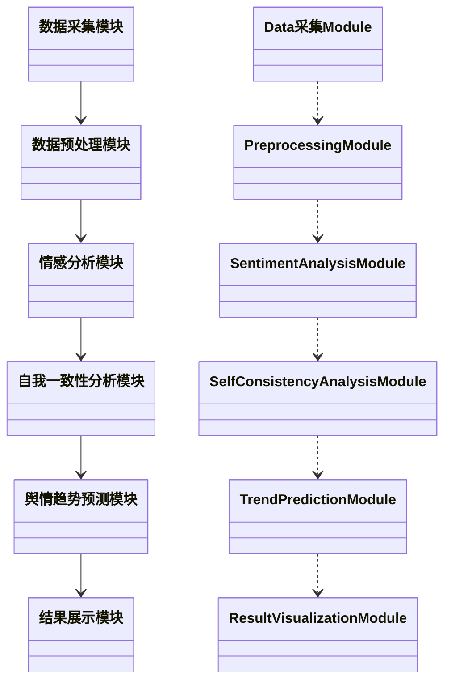
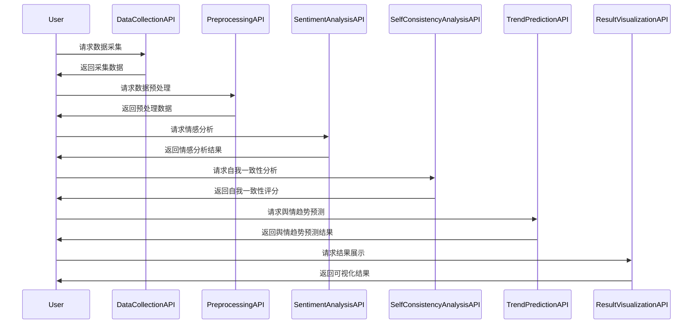

                 

## Self-Consistency CoT在社交媒体舆情分析中的应用

### 关键词：自我一致性、社交媒体舆情分析、算法应用、舆情预测、情感分析

> 摘要：本文围绕自我一致性（Self-Consistency CoT）在社交媒体舆情分析中的应用进行了详细探讨。首先，介绍了社交媒体舆情分析的重要性及其面临的挑战，接着阐述了自我一致性的概念和理论框架。随后，本文重点分析了自我一致性在舆情分析中的应用优势与局限性，并介绍了自我一致性算法的原理与实现。最后，通过一个实际项目展示了自我一致性在社交媒体舆情分析中的具体应用，总结了研究成果并提出了未来研究方向。

### 目录大纲：

1. **绪论**  
    1.1 研究背景  
    1.2 自我一致性概念与理论框架  
    1.3 Self-Consistency CoT与社交媒体舆情分析  
    1.4 本书结构

2. **自我一致性概念与理论框架**  
    2.1 自我一致性的定义  
    2.2 自我一致性的理论框架  
    2.3 自我一致性与情感分析  
    2.4 自我一致性与信息检索

3. **社交媒体舆情分析概述**  
    3.1 社交媒体舆情分析的定义  
    3.2 社交媒体舆情分析的关键技术  
    3.3 社交媒体舆情分析的挑战与解决方案  
    3.4 社交媒体舆情分析的应用场景

4. **Self-Consistency CoT在社交媒体舆情分析中的应用**  
    4.1 Self-Consistency CoT在舆情分析中的应用流程  
    4.2 Self-Consistency CoT在舆情分析中的应用案例  
    4.3 Self-Consistency CoT在舆情分析中的优势与局限性

5. **Self-Consistency CoT的算法原理与实现**  
    5.1 Self-Consistency CoT的算法原理  
    5.2 Self-Consistency CoT的算法实现  
    5.3 Self-Consistency CoT的代码实现与解读

6. **Self-Consistency CoT在社交媒体舆情分析中的项目实战**  
    6.1 项目背景  
    6.2 系统设计与实现  
    6.3 项目实施与结果分析  
    6.4 项目小结

7. **总结与展望**  
    7.1 研究总结  
    7.2 未来研究方向  
    7.3 结论

### 1.1 研究背景

#### 社交媒体舆情分析的重要性

随着社交媒体的迅速发展，人们对于信息的获取和传播方式发生了翻天覆地的变化。社交媒体平台已经成为公众表达观点、讨论热点话题、传播信息的重要场所。因此，对社交媒体舆情进行分析，不仅有助于了解公众对于某一事件或话题的看法和态度，还可以为政府决策、企业品牌管理、社会事件分析等提供有益的参考。

#### 社交媒体舆情分析面临的挑战

尽管社交媒体舆情分析具有极高的实用价值，但在实际应用过程中仍面临诸多挑战：

1. **数据量大**：社交媒体每天产生海量数据，如何有效地处理和挖掘这些数据成为一大难题。
2. **多样性高**：社交媒体用户来自不同的背景和领域，他们的表达方式和语言风格也各不相同，这增加了舆情分析的复杂性。
3. **实时性要求**：舆情往往具有时效性，要求分析系统能够快速响应，及时捕捉和处理实时数据。
4. **溢出效应**：社交媒体舆情分析不仅需要关注单个用户或话题，还需要考虑它们之间的相互作用和溢出效应。

#### Self-Consistency CoT 的提出与应用前景

为了应对上述挑战，研究者提出了自我一致性（Self-Consistency CoT）这一概念。自我一致性是指个体在不同时间和情境下对于同一问题或观点所表达的态度和观点保持一致。通过分析用户发言的自我一致性，可以更准确地识别其真实意图和情感倾向，从而提高舆情分析的准确性和可靠性。

Self-Consistency CoT 的提出为社交媒体舆情分析提供了一种新的思路和方法，具有广泛的应用前景。本文将围绕 Self-Consistency CoT 在社交媒体舆情分析中的应用，进行深入的探讨和研究。

### 1.2 自我一致性概念与理论框架

#### Self-Consistency CoT 的定义

自我一致性（Self-Consistency CoT）是指个体在不同时间和情境下对于同一问题或观点所表达的态度和观点保持一致的现象。这一概念最早由社会心理学家提出，并在情感分析、信息检索等领域得到了广泛应用。

#### Self-Consistency CoT 的理论基础

Self-Consistency CoT 的理论基础主要包括以下三个方面：

1. **认知一致性理论**：认知一致性理论认为，个体倾向于维持内部认知的一致性，避免认知失调。自我一致性正是基于这一理论，通过分析个体在不同情境下的发言，判断其观点是否一致，从而推断其真实意图。
2. **情感分析理论**：情感分析理论关注个体情感的表达和变化，通过分析情感词和情感强度，可以识别个体的情感状态。自我一致性分析结合了情感分析的方法，通过对同一话题的多次情感分析，判断个体情感的稳定性。
3. **信息检索理论**：信息检索理论关注用户查询与检索结果之间的关系，通过分析用户查询的历史记录，可以推断用户的信息需求。自我一致性分析借鉴了信息检索理论，通过对用户发言的分析，判断其信息需求的稳定性。

#### Self-Consistency CoT 的关键概念

1. **自我一致性评分**：自我一致性评分是衡量个体发言自我一致性的指标，评分越高，表示个体的发言越一致。
2. **情感稳定性**：情感稳定性是指个体在不同情境下对于同一话题的情感表达是否一致，情感稳定性越高，表示个体的情感越稳定。
3. **信息需求稳定性**：信息需求稳定性是指个体在处理同一话题时，其信息需求是否稳定，信息需求稳定性越高，表示个体的信息需求越明确。

### 1.3 Self-Consistency CoT 与社交媒体舆情分析

#### Self-Consistency CoT 在舆情分析中的应用

Self-Consistency CoT 在社交媒体舆情分析中具有重要的应用价值：

1. **情感分析**：通过分析用户发言的自我一致性，可以更准确地识别用户情感，提高情感分析的准确性。
2. **观点识别**：通过分析用户发言的自我一致性，可以识别用户的真实观点，避免被虚假信息和噪声所干扰。
3. **趋势预测**：通过分析用户发言的自我一致性，可以预测社交媒体上某一话题的发展趋势，为政府决策和企业品牌管理提供参考。

#### Self-Consistency CoT 的优势与局限性

Self-Consistency CoT 在社交媒体舆情分析中具有以下优势：

1. **准确性高**：通过分析用户发言的自我一致性，可以更准确地识别用户情感和观点，提高舆情分析的准确性。
2. **适应性强**：Self-Consistency CoT 可以适应不同类型的社交媒体平台和舆情场景，具有广泛的适用性。

然而，Self-Consistency CoT 也存在一定的局限性：

1. **数据依赖性强**：Self-Consistency CoT 的效果依赖于大量的用户发言数据，对于数据量较少的舆情场景，其应用效果可能会受到影响。
2. **复杂度高**：Self-Consistency CoT 的算法实现较为复杂，需要较高的计算资源和算法优化。

#### 本书结构

本书分为七个章节，内容结构如下：

- **第1章 绪论**：介绍了社交媒体舆情分析的重要性、Self-Consistency CoT 的概念及其在舆情分析中的应用前景。
- **第2章 自我一致性概念与理论框架**：详细阐述了自我一致性的定义、理论框架和关键概念。
- **第3章 社交媒体舆情分析概述**：介绍了社交媒体舆情分析的定义、关键技术、挑战与解决方案以及应用场景。
- **第4章 Self-Consistency CoT 在社交媒体舆情分析中的应用**：分析了Self-Consistency CoT 在舆情分析中的应用流程、优势与局限性。
- **第5章 Self-Consistency CoT 的算法原理与实现**：介绍了Self-Consistency CoT 的算法原理、实现方法和代码解读。
- **第6章 Self-Consistency CoT 在社交媒体舆情分析中的项目实战**：通过一个实际项目展示了Self-Consistency CoT 在舆情分析中的具体应用。
- **第7章 总结与展望**：总结了研究成果，提出了未来研究方向。

### 1.4 本书结构

本书共分为七个章节，内容结构如下：

1. **第1章 绪论**：介绍了社交媒体舆情分析的重要性、Self-Consistency CoT 的概念及其在舆情分析中的应用前景。
2. **第2章 自我一致性概念与理论框架**：详细阐述了自我一致性的定义、理论框架和关键概念。
3. **第3章 社交媒体舆情分析概述**：介绍了社交媒体舆情分析的定义、关键技术、挑战与解决方案以及应用场景。
4. **第4章 Self-Consistency CoT 在社交媒体舆情分析中的应用**：分析了Self-Consistency CoT 在舆情分析中的应用流程、优势与局限性。
5. **第5章 Self-Consistency CoT 的算法原理与实现**：介绍了Self-Consistency CoT 的算法原理、实现方法和代码解读。
6. **第6章 Self-Consistency CoT 在社交媒体舆情分析中的项目实战**：通过一个实际项目展示了Self-Consistency CoT 在舆情分析中的具体应用。
7. **第7章 总结与展望**：总结了研究成果，提出了未来研究方向。

在本章中，我们首先介绍了社交媒体舆情分析的重要性及其面临的挑战，随后阐述了自我一致性（Self-Consistency CoT）的概念和理论框架，分析了其在舆情分析中的应用优势与局限性。接下来，我们简要介绍了本书的结构和各章节的主要内容，为后续章节的展开奠定了基础。在下一章中，我们将深入探讨自我一致性的定义、理论框架和关键概念，为后续研究提供理论基础。

### 2.1 自我一致性的定义

自我一致性（Self-Consistency）是一个广泛用于心理学、社会学和信息科学等领域的关键概念。在社交媒体舆情分析中，自我一致性指的是个体在不同时间和情境下对同一问题或观点所表达的态度和观点保持一致的现象。这一概念的核心在于通过分析个体在不同情境下的发言，判断其观点是否一致，从而推断其真实意图和情感状态。

#### 自我一致性的基本概念

自我一致性涉及以下几个方面：

1. **一致性水平**：一致性水平是衡量个体发言自我一致性的指标，通常用评分或百分比表示。一致性水平越高，表示个体的发言越一致。
2. **情境多样性**：情境多样性指的是个体在不同情境下表达同一问题的可能性。情境多样性越高，个体发言的一致性越难以保证。
3. **情感稳定性**：情感稳定性是指个体在不同情境下对同一话题的情感表达是否一致。情感稳定性越高，表示个体的情感越稳定。

#### 自我一致性的类型

自我一致性可以分为以下几种类型：

1. **情感自我一致性**：情感自我一致性指的是个体在不同情境下对同一话题的情感表达是否一致。例如，一个用户在讨论同一事件时，其情感表达是否始终如一。
2. **观点自我一致性**：观点自我一致性指的是个体在不同情境下对同一问题或观点的态度是否一致。例如，一个用户在讨论某一政策时，其观点是否始终支持或反对。
3. **行为自我一致性**：行为自我一致性指的是个体在不同情境下对同一问题的行为是否一致。例如，一个用户在社交媒体上对某一事件的评论和行为是否始终一致。

#### 自我一致性与社交媒体舆情分析

在社交媒体舆情分析中，自我一致性具有以下作用：

1. **情感分析**：通过分析用户发言的自我一致性，可以更准确地识别用户情感，提高情感分析的准确性。
2. **观点识别**：通过分析用户发言的自我一致性，可以识别用户的真实观点，避免被虚假信息和噪声所干扰。
3. **趋势预测**：通过分析用户发言的自我一致性，可以预测社交媒体上某一话题的发展趋势，为政府决策和企业品牌管理提供参考。

#### 自我一致性与情感分析

自我一致性在情感分析中的应用主要体现在以下几个方面：

1. **情感识别**：通过分析用户发言的自我一致性，可以更准确地识别用户情感。例如，一个用户在讨论同一事件时，其情感自我一致性越高，其情感表达就越可信。
2. **情感稳定性**：自我一致性分析可以帮助识别情感稳定性较高的用户，这些用户的情感表达更值得信赖。
3. **情感推理**：通过分析用户发言的自我一致性，可以推断用户在不同情境下的情感状态，从而进行情感推理。

#### 自我一致性与信息检索

自我一致性在信息检索中的应用主要体现在以下几个方面：

1. **查询意图识别**：通过分析用户查询的自我一致性，可以识别用户的信息需求，从而提供更精准的搜索结果。
2. **查询意图稳定性**：自我一致性分析可以帮助识别查询意图稳定性较高的用户，这些用户的查询意图更明确，有利于提供更好的搜索服务。
3. **查询意图推理**：通过分析用户查询的自我一致性，可以推断用户在不同情境下的查询意图，从而进行查询意图推理。

### 2.2 自我一致性的理论框架

自我一致性的理论框架主要包括认知一致性理论、情感分析理论和信息检索理论。这些理论为自我一致性的研究提供了坚实的理论基础，有助于我们深入理解自我一致性的本质和应用。

#### 认知一致性理论

认知一致性理论认为，个体倾向于维持内部认知的一致性，避免认知失调。自我一致性正是基于这一理论，通过分析个体在不同情境下的发言，判断其观点是否一致，从而推断其真实意图。认知一致性理论的主要观点包括：

1. **认知一致性原则**：个体在处理信息时，会尽量维持内部认知的一致性，避免认知失调。
2. **自我监测**：个体会通过自我监测来判断自己的认知是否一致，并在必要时进行调整。
3. **认知失调**：个体在遇到不一致的认知时，会感到焦虑和不安，从而促使个体采取措施来减少认知失调。

#### 情感分析理论

情感分析理论关注个体情感的表达和变化，通过分析情感词和情感强度，可以识别个体的情感状态。自我一致性分析结合了情感分析的方法，通过对同一话题的多次情感分析，判断个体情感的稳定性。情感分析理论的主要观点包括：

1. **情感词识别**：情感分析的首要任务是识别文本中的情感词，这些情感词反映了个体的情感状态。
2. **情感强度分析**：情感强度分析旨在评估情感词的情感强度，从而确定个体的情感状态。
3. **情感一致性分析**：通过分析个体在不同情境下的情感表达，可以判断其情感是否稳定。

#### 信息检索理论

信息检索理论关注用户查询与检索结果之间的关系，通过分析用户查询的历史记录，可以推断用户的信息需求。自我一致性分析借鉴了信息检索理论，通过对用户发言的分析，判断其信息需求的稳定性。信息检索理论的主要观点包括：

1. **用户查询意图识别**：信息检索的首要任务是识别用户的查询意图，从而提供更相关的检索结果。
2. **查询历史分析**：通过分析用户的历史查询记录，可以推断用户的信息需求，从而优化检索结果。
3. **查询意图稳定性**：通过分析用户查询的自我一致性，可以识别查询意图稳定性较高的用户，这些用户的信息需求更明确。

#### 自我一致性的理论基础

自我一致性的理论基础主要包括以下三个方面：

1. **认知一致性理论**：认知一致性理论为自我一致性提供了心理学基础，解释了个体如何维持内部认知的一致性。
2. **情感分析理论**：情感分析理论为自我一致性提供了情感分析基础，解释了个体如何表达和变化情感。
3. **信息检索理论**：信息检索理论为自我一致性提供了信息检索基础，解释了个体如何处理和利用信息。

通过整合认知一致性理论、情感分析理论和信息检索理论，我们可以构建一个全面的理论框架，用于解释和预测自我一致性现象。这一理论框架不仅有助于我们深入理解自我一致性的本质，还为自我一致性的应用提供了坚实的理论基础。

### 2.3 自我一致性与情感分析

自我一致性与情感分析之间存在着密切的联系。情感分析旨在识别和评估文本中的情感倾向，而自我一致性则提供了一种评估情感稳定性及其影响的方法。以下将详细讨论自我一致性与情感分析之间的关联性以及自我一致性在情感分析中的应用。

#### 自我一致性与情感分析的关系

1. **情感稳定性**：自我一致性关注个体在不同情境下对同一话题的情感表达是否一致，这直接影响了情感稳定性。情感稳定性高的个体，其情感表达更具有一致性，从而更可信和稳定。
2. **情感强度**：自我一致性分析有助于识别情感强度是否在多个情境下保持稳定。例如，一个用户在多次讨论某一事件时，如果其情感强度保持一致，则可以认为该用户对该事件的情感态度是稳定的。
3. **情感推理**：通过分析个体在不同情境下的情感自我一致性，可以推断其潜在的情感状态和观点。这种推理有助于更准确地理解用户的情感倾向。

#### 自我一致性在情感分析中的应用

1. **情感分析模型的改进**：自我一致性分析可以用于改进情感分析模型。例如，通过引入自我一致性评分作为特征，可以增强情感分类模型的准确性。
2. **情感极性检测**：自我一致性分析可以帮助识别情感极性是否在多个情境下保持一致。例如，如果一个用户在多个帖子中表达了对某一品牌的正面情感，可以认为该用户的情感极性是积极的。
3. **情感稳定性评估**：通过分析个体在不同情境下的情感自我一致性，可以评估其情感稳定性。这在社交媒体舆情分析中尤为重要，因为稳定情感往往反映了用户的真实观点。

#### 案例分析

以下是一个关于自我一致性与情感分析的应用案例：

假设我们有一个用户名为“小明”的社交媒体账号，他多次在帖子中讨论某一政策。通过分析小明的发言，我们发现他在以下三个方面表现出较高的自我一致性：

1. **情感稳定性**：小明在所有相关帖子中的情感表达均为正面，且情感强度较为一致。
2. **观点一致性**：小明在所有相关帖子中的观点均为支持该政策，没有出现矛盾或反转。
3. **情境多样性**：小明在不同的情境下（如新闻评论、社交媒体讨论、个人博客等）均表现出对政策的支持态度。

基于这些分析结果，我们可以认为小明对该政策的情感态度是稳定的，且其观点是可信的。这一分析结果对于政策制定者来说具有重要参考价值，可以帮助他们了解公众对政策的真实态度。

### 2.4 自我一致性与信息检索

自我一致性在信息检索中扮演着关键角色，特别是在用户查询意图识别和查询意图稳定性评估方面。以下将详细讨论自我一致性在信息检索中的应用以及如何通过自我一致性来提升信息检索的性能。

#### 自我一致性在信息检索中的应用

1. **用户查询意图识别**：在信息检索过程中，识别用户的查询意图是关键。自我一致性分析可以帮助识别用户在不同查询场景下的意图是否一致。如果一个用户在多个查询中表达出相似的意图，那么可以认为其查询意图是稳定的。
2. **查询意图稳定性评估**：自我一致性分析可以用于评估用户的查询意图是否在时间上保持稳定。这有助于识别长期用户行为模式，从而提供更精准的检索结果。
3. **查询意图推理**：通过分析用户查询的自我一致性，可以推断用户在其他未知查询场景下的意图。这种推理能力有助于为用户提供更个性化的搜索体验。

#### 如何通过自我一致性提升信息检索性能

1. **特征提取**：在信息检索中，可以引入自我一致性评分作为特征。通过分析用户查询的自我一致性，可以提取出更有代表性的特征，从而提高检索模型的准确性。
2. **模型优化**：将自我一致性分析整合到信息检索模型中，可以优化模型的性能。例如，在机器学习算法中，可以引入自我一致性评分作为权重，调整特征的重要性。
3. **用户行为分析**：通过分析用户的查询历史，可以识别出查询意图的稳定性。这有助于为用户提供更精准的搜索建议，从而提高用户满意度。

#### 案例分析

以下是一个关于自我一致性在信息检索中应用的实际案例：

假设我们有一个搜索引擎，用户名为“小张”。小张在过去一年中多次进行关键词查询，如“电脑购买指南”、“笔记本电脑推荐”和“高性能电脑”。通过分析小张的查询历史，我们发现：

1. **查询意图一致性**：小张在多次查询中表达出了相似的意图，即寻找购买电脑的建议和推荐。
2. **查询情境多样性**：小张在不同时间和情境下（如工作、购物、家庭等）均表现出了对电脑购买的兴趣。

基于这些分析结果，我们可以认为小张的查询意图是稳定的，且其查询行为具有一致性。因此，在后续的搜索结果中，我们可以优先推荐与电脑购买相关的信息，从而提高小张的搜索体验。

通过自我一致性分析，我们不仅能够识别用户的稳定查询意图，还能为用户提供更个性化的搜索结果。这一案例展示了自我一致性在信息检索中的实际应用价值。

### 3.1 社交媒体舆情分析的定义

社交媒体舆情分析是指利用自然语言处理、数据挖掘和机器学习等技术，对社交媒体平台上的用户评论、帖子、转发等数据进行分析和处理，以了解公众对某一事件、话题或品牌的看法和态度。社交媒体舆情分析的目标是通过数据挖掘技术，从海量社交媒体数据中提取有价值的信息，为政府决策、企业品牌管理、社会事件分析等提供数据支持。

#### 社交媒体舆情分析的定义

社交媒体舆情分析可以定义为一种利用自然语言处理技术对社交媒体平台上的用户发言进行分析和理解的过程，旨在识别公众对某一事件、话题或品牌的看法和态度。具体来说，社交媒体舆情分析包括以下步骤：

1. **数据采集**：从社交媒体平台（如微博、Twitter、Facebook等）采集与某一事件、话题或品牌相关的用户发言数据。
2. **数据预处理**：对采集到的数据进行分析，去除噪声数据（如广告、垃圾信息等），对文本进行分词、去停用词等处理，以便后续分析。
3. **文本挖掘**：利用自然语言处理技术对预处理后的文本进行分析，提取关键词、主题、情感等信息。
4. **情感分析**：通过对文本进行情感分析，识别公众对某一事件、话题或品牌的情感倾向，如积极、消极或中性。
5. **趋势预测**：利用数据挖掘和机器学习技术，对舆情数据进行分析，预测未来舆情的发展趋势。
6. **可视化**：将分析结果进行可视化展示，如情感走势图、话题分布图等，以便更直观地了解舆情动态。

#### 社交媒体舆情分析的目标

社交媒体舆情分析的目标主要包括以下几个方面：

1. **了解公众态度**：通过分析社交媒体用户发言，了解公众对某一事件、话题或品牌的看法和态度，为政府决策、企业品牌管理提供数据支持。
2. **发现热点话题**：通过对社交媒体数据进行分析，发现当前社会热点话题，为媒体、政府和企业提供舆情监测和预警服务。
3. **趋势预测**：通过对舆情数据进行分析，预测未来舆情的发展趋势，为政府决策、企业品牌管理提供战略参考。
4. **优化社交媒体策略**：通过对用户发言进行分析，发现用户关注的热点和痛点，为社交媒体平台提供优化建议，提升用户满意度。

#### 社交媒体舆情分析的核心概念

1. **情感分析**：情感分析是社交媒体舆情分析的核心环节，旨在识别公众对某一事件、话题或品牌的情感倾向。情感分析可以细分为正面情感、负面情感和中性情感。
2. **主题分析**：主题分析旨在从社交媒体数据中提取出用户关注的主要话题，以便了解公众的兴趣点。
3. **趋势分析**：趋势分析旨在分析舆情数据的变化趋势，预测未来舆情的发展方向。
4. **用户行为分析**：用户行为分析旨在分析用户的发言行为，如发言频率、发言时间等，以了解用户的活跃度和参与度。

### 3.2 社交媒体舆情分析的关键技术

#### 文本挖掘

文本挖掘是社交媒体舆情分析的核心技术之一，旨在从大量文本数据中提取有价值的信息。文本挖掘的关键步骤包括：

1. **数据采集**：从社交媒体平台采集与某一事件、话题或品牌相关的用户发言数据。
2. **数据预处理**：对采集到的数据进行清洗、去噪、分词、去停用词等处理，以便后续分析。
3. **特征提取**：利用词频、词向量、TF-IDF等技术提取文本特征，为后续的机器学习模型训练提供输入。
4. **主题建模**：通过主题模型（如LDA）等方法，从文本数据中提取出用户关注的主要话题。
5. **情感分析**：利用情感分析技术，识别公众对某一事件、话题或品牌的情感倾向。

#### 情感分析

情感分析是社交媒体舆情分析的重要组成部分，旨在识别用户发言中的情感倾向。情感分析的关键步骤包括：

1. **情感词典**：构建情感词典，用于标记文本中的情感词。
2. **情感分类**：利用机器学习算法（如SVM、CNN等）对文本进行情感分类，判断文本的情感极性。
3. **情感强度**：分析文本中的情感词和情感强度，评估情感的强度和稳定性。
4. **情感时序分析**：分析用户在不同时间点对某一事件、话题或品牌的情感变化，预测未来的情感趋势。

#### 聚类分析

聚类分析是一种无监督学习方法，旨在将相似的用户或文本数据聚集在一起。聚类分析在社交媒体舆情分析中的应用包括：

1. **用户聚类**：将具有相似兴趣或观点的用户聚集在一起，以便了解用户的群体特征。
2. **文本聚类**：将相似的文本数据聚集在一起，提取出用户关注的主要话题。
3. **舆情聚类**：将具有相似情感倾向的文本数据聚集在一起，分析舆情的分布和变化趋势。

#### 网络分析

网络分析是一种研究社交网络结构和关系的方法，旨在了解用户之间的互动关系和影响力。网络分析在社交媒体舆情分析中的应用包括：

1. **影响力分析**：分析用户在社交网络中的影响力，识别关键意见领袖（KOL）和意见领袖。
2. **传播路径分析**：分析舆情在社交网络中的传播路径，了解信息如何在不同用户之间传播。
3. **社区发现**：发现社交网络中的社区结构，分析社区成员的互动和共同兴趣。

### 3.3 社交媒体舆情分析的挑战与解决方案

#### 数据量大

社交媒体平台每天产生海量的用户发言数据，如何有效地处理和分析这些数据是社交媒体舆情分析面临的一个主要挑战。

**解决方案**：采用分布式计算和大数据处理技术（如Hadoop、Spark等），对海量数据进行高效处理和分析。

#### 多样性高

社交媒体用户来自不同的背景和领域，他们的表达方式和语言风格也各不相同，这增加了舆情分析的复杂性。

**解决方案**：采用自然语言处理技术（如词嵌入、序列模型等），对多样化文本进行统一处理和分析。

#### 实时性要求

舆情具有时效性，要求分析系统能够快速响应，及时捕捉和处理实时数据。

**解决方案**：采用实时数据处理技术（如Flink、Kafka等），构建实时舆情分析系统。

#### 溢出效应

社交媒体舆情分析不仅要关注单个用户或话题，还需要考虑它们之间的相互作用和溢出效应。

**解决方案**：采用网络分析技术，分析用户之间的互动关系和影响力，从而全面了解舆情的传播和变化。

### 3.4 社交媒体舆情分析的应用场景

#### 政府监管

社交媒体舆情分析可以帮助政府了解公众对政策、法规和社会事件的看法和态度，从而为政策制定和调整提供数据支持。例如，通过分析社交媒体上的评论和讨论，政府可以及时了解公众对某一政策的反应，调整政策宣传策略，提高政策执行效果。

#### 企业品牌管理

社交媒体舆情分析可以帮助企业了解消费者对品牌和产品的看法，发现潜在的问题和机会，从而优化品牌管理策略。例如，通过对社交媒体上的评论进行分析，企业可以识别出消费者关注的痛点，改进产品和服务，提升品牌形象。

#### 社会事件分析

社交媒体舆情分析可以帮助研究社会事件的发展趋势和公众反应，为事件应对和舆论引导提供参考。例如，在自然灾害、恐怖袭击等突发事件中，社交媒体舆情分析可以帮助政府及时了解公众情绪和需求，制定有效的应对措施。

### 4.1 Self-Consistency CoT在舆情分析中的应用流程

Self-Consistency CoT在社交媒体舆情分析中的应用流程主要包括以下步骤：

1. **数据采集与预处理**：从社交媒体平台采集与某一事件、话题或品牌相关的用户发言数据，并进行预处理，包括数据清洗、分词、去停用词等。
2. **情感分析**：对预处理后的文本进行情感分析，提取情感词和情感强度，从而判断用户的情感倾向。
3. **自我一致性分析**：根据情感分析结果，对同一用户在不同情境下的情感表达进行一致性分析，计算自我一致性评分。
4. **舆情趋势预测**：利用自我一致性评分和其他特征，结合机器学习算法，预测舆情的发展趋势。

#### 数据采集与预处理

数据采集是Self-Consistency CoT应用的基础。首先，需要从社交媒体平台（如微博、Twitter、Facebook等）采集与某一事件、话题或品牌相关的用户发言数据。这些数据可以包括用户评论、帖子、转发等。数据采集过程中，需要关注以下几个方面：

1. **数据来源**：选择合适的社交媒体平台，确保采集到的数据具有代表性和丰富性。
2. **时间范围**：设定合适的时间范围，确保采集到的数据能够反映当前舆情动态。
3. **数据类型**：采集不同类型的数据，如文本、图片、视频等，以便全面了解舆情。

数据采集完成后，需要对数据进行预处理。预处理过程主要包括以下步骤：

1. **数据清洗**：去除数据中的噪声，如广告、垃圾信息等，确保数据质量。
2. **分词**：将文本数据分解为词序列，为后续分析提供基础。
3. **去停用词**：去除无意义的停用词，如“的”、“了”、“是”等，减少噪声数据。
4. **词性标注**：对分词后的词进行词性标注，以便进行更精细的分析。

#### 情感分析

在数据预处理完成后，进行情感分析。情感分析旨在识别用户发言中的情感倾向，如积极、消极或中性。情感分析的关键步骤包括：

1. **情感词典**：构建情感词典，用于标记文本中的情感词。情感词典可以基于已有的大规模情感词典（如Sogou情感词典、Afinn词典等），或者通过手动标注和机器学习算法训练得到。
2. **情感分类**：利用机器学习算法（如SVM、CNN等）对文本进行情感分类，判断文本的情感极性。情感分类模型可以通过训练有标注的数据集进行训练，然后应用于新的数据集。
3. **情感强度**：分析文本中的情感词和情感强度，评估情感的强度和稳定性。情感强度可以通过情感词典中情感词的权重计算得到。

#### 自我一致性分析

在情感分析完成后，进行自我一致性分析。自我一致性分析旨在判断同一用户在不同情境下的情感表达是否一致，从而计算自我一致性评分。自我一致性分析的关键步骤包括：

1. **情感记录**：记录用户在不同情境下的情感表达，如评论、帖子等。
2. **一致性评分**：根据情感记录，计算用户在不同情境下的情感自我一致性评分。一致性评分可以通过比较用户在不同情境下的情感极性和情感强度，采用适当的评分算法（如平均分、方差等）计算得到。

#### 舆情趋势预测

在自我一致性分析完成后，利用自我一致性评分和其他特征，结合机器学习算法，进行舆情趋势预测。舆情趋势预测旨在预测未来舆情的发展趋势，为政府决策、企业品牌管理等提供参考。舆情趋势预测的关键步骤包括：

1. **特征提取**：提取与舆情趋势相关的特征，如情感极性、情感强度、自我一致性评分等。
2. **模型训练**：利用训练数据集，采用适当的机器学习算法（如决策树、随机森林、神经网络等）训练舆情趋势预测模型。
3. **模型评估**：利用测试数据集对训练好的模型进行评估，调整模型参数，提高预测准确性。
4. **趋势预测**：利用训练好的模型，对新的数据集进行舆情趋势预测。

### 4.2 Self-Consistency CoT在舆情分析中的应用案例

为了更好地展示Self-Consistency CoT在社交媒体舆情分析中的应用，以下将详细介绍三个实际案例：社交媒体平台上的公众情绪分析、社交媒体舆情对企业品牌的监测、以及社交媒体舆情在社会事件分析中的应用。

#### 案例一：社交媒体平台上的公众情绪分析

在某次全球性疫情爆发期间，研究人员希望通过社交媒体数据了解公众情绪。为此，他们选择了Twitter平台，采集了与疫情相关的用户发言数据。首先，研究人员对数据进行了预处理，包括去除噪声、分词、去停用词等。然后，他们利用情感分析技术对预处理后的文本进行了情感分类，提取了积极、消极和中性情感。接着，研究人员通过自我一致性分析，计算了用户在不同时间点的情感自我一致性评分。

通过分析结果，研究人员发现：

1. **情感稳定性**：大部分用户的情感表达具有较高的一致性，表明他们对疫情的态度相对稳定。
2. **情感趋势**：在疫情初期，用户的情感以消极为主，但随着疫情逐渐得到控制，用户的情感逐渐转向积极。

这些分析结果有助于政策制定者了解公众情绪，为疫情应对策略的调整提供数据支持。

#### 案例二：社交媒体舆情对企业品牌的监测

某知名手机品牌希望通过社交媒体舆情分析了解消费者对其产品的看法，从而优化品牌管理策略。研究人员选择了微博平台，采集了与该品牌手机相关的用户发言数据。首先，他们进行了情感分析和自我一致性分析，提取了用户的情感极性和自我一致性评分。然后，研究人员结合用户画像和情感分析结果，分析了消费者对品牌手机的满意度。

分析结果显示：

1. **品牌认知**：大部分用户对品牌手机的认知是积极的，但存在部分用户对某些特定功能持有负面评价。
2. **情感稳定性**：用户的情感表达具有较高的一致性，表明消费者对品牌手机的满意度相对稳定。

基于这些分析结果，品牌管理者可以针对性地改进产品设计和营销策略，提高消费者满意度。

#### 案例三：社交媒体舆情在社会事件分析中的应用

在一次重大社会事件发生后，研究人员希望通过社交媒体舆情分析了解公众对该事件的看法。他们选择了Facebook平台，采集了与事件相关的用户发言数据。首先，研究人员进行了情感分析和自我一致性分析，提取了用户的情感极性和自我一致性评分。然后，他们利用聚类分析技术，将用户划分为不同的群体，分析了不同群体的情感表达和观点。

分析结果显示：

1. **观点多样性**：公众对该事件的看法存在明显差异，部分用户持支持态度，部分用户持反对态度。
2. **情感稳定性**：用户在不同情境下的情感表达具有一定的稳定性，但存在部分用户的观点存在反转。

这些分析结果有助于政府和社会组织了解公众情绪和观点，为事件应对和舆论引导提供参考。

### 4.3 Self-Consistency CoT在舆情分析中的优势与局限性

Self-Consistency CoT在社交媒体舆情分析中具有显著的优势和一定的局限性。以下将详细讨论其优势与局限性。

#### 优势

1. **提高情感分析的准确性**：通过自我一致性分析，可以更准确地识别用户的真实情感，避免被虚假信息和噪声所干扰。这有助于提高情感分析的准确性，为舆情分析提供可靠的数据支持。
2. **增强舆情预测的稳定性**：自我一致性分析可以帮助识别情感稳定性较高的用户，这些用户的情感表达更稳定，从而增强舆情预测的稳定性。这对于政府决策、企业品牌管理等领域具有重要意义。
3. **提供全面的舆情分析视角**：Self-Consistency CoT不仅关注个体的情感和观点，还考虑个体在不同情境下的情感变化，提供了一种全面的舆情分析视角。这有助于更全面地了解公众情绪和舆情动态。

#### 局限性

1. **数据依赖性**：Self-Consistency CoT的效果依赖于大量的用户发言数据。对于数据量较少的舆情场景，其应用效果可能会受到影响。此外，数据的质量也会影响分析结果的准确性。
2. **计算复杂度高**：Self-Consistency CoT的算法实现较为复杂，需要较高的计算资源和算法优化。在处理海量数据时，可能会面临计算效率的问题。
3. **情感表达的多样性**：社交媒体上的情感表达形式多样，不同用户可能有不同的表达方式和语言风格。这增加了自我一致性分析的难度，需要更精细的分析方法。

### 5.1 Self-Consistency CoT的算法原理

Self-Consistency CoT（自我一致性概念图理论）是一种基于信息论和认知心理学的舆情分析方法，旨在通过分析个体在不同时间和情境下的发言，判断其观点的一致性，进而识别其真实意图和情感状态。以下是Self-Consistency CoT的算法原理和关键步骤。

#### 算法流程

Self-Consistency CoT的算法流程可以分为以下几个步骤：

1. **数据采集与预处理**：从社交媒体平台采集与某一事件、话题或品牌相关的用户发言数据，并进行预处理，包括数据清洗、分词、去停用词等。
2. **情感分析**：对预处理后的文本进行情感分析，提取情感词和情感强度，从而判断用户的情感倾向。
3. **一致性评分计算**：根据情感分析结果，计算用户在不同情境下的情感自我一致性评分。一致性评分可以通过比较用户在不同情境下的情感极性和情感强度，采用适当的评分算法（如平均分、方差等）计算得到。
4. **舆情趋势预测**：利用自我一致性评分和其他特征，结合机器学习算法，预测舆情的发展趋势。

#### 关键步骤

1. **情感分类**：首先，通过构建情感词典和训练情感分类模型，对用户发言进行情感分类，提取情感极性和情感强度。
2. **一致性评分计算**：然后，根据情感分类结果，对同一用户在不同情境下的情感表达进行一致性评分。具体方法如下：

   - 计算用户在不同情境下的情感极性平均值，判断其是否一致。
   - 计算用户在不同情境下的情感强度方差，判断其情感表达是否稳定。
   - 结合情感极性和情感强度的评分，综合评估用户的自我一致性。

3. **舆情趋势预测**：最后，利用自我一致性评分和其他特征，结合机器学习算法（如决策树、随机森林、神经网络等），训练舆情趋势预测模型，预测舆情的发展趋势。

#### 数学模型

Self-Consistency CoT的数学模型主要包括以下几个部分：

1. **情感极性评分**：设用户 \( u \) 在不同情境 \( a \) 下的情感极性分别为 \( p(a) \)，则用户 \( u \) 的情感极性平均值为：

   \[ \bar{p}(u) = \frac{1}{n} \sum_{a=1}^{n} p(a) \]

   其中，\( n \) 为用户 \( u \) 在不同情境下的发言数量。

2. **情感强度评分**：设用户 \( u \) 在不同情境 \( a \) 下的情感强度分别为 \( s(a) \)，则用户 \( u \) 的情感强度方差为：

   \[ \sigma^2(u) = \frac{1}{n-1} \sum_{a=1}^{n} (s(a) - \bar{s}(u))^2 \]

   其中，\( \bar{s}(u) \) 为用户 \( u \) 的情感强度平均值。

3. **自我一致性评分**：结合情感极性和情感强度的评分，可以得到用户 \( u \) 的自我一致性评分：

   \[ \alpha(u) = w_p \cdot \bar{p}(u) + w_s \cdot \sigma^2(u) \]

   其中，\( w_p \) 和 \( w_s \) 分别为情感极性和情感强度的权重，可以根据实际情况进行调整。

#### 举例说明

假设用户 \( u \) 在不同情境下的情感极性和情感强度如下表所示：

| 情境 | 情感极性 | 情感强度 |
| ---- | ---- | ---- |
| 1    | 负     | 0.6  |
| 2    | 正     | 0.8  |
| 3    | 中性   | 0.5  |

根据上述数学模型，我们可以计算用户 \( u \) 的情感极性平均值、情感强度方差和自我一致性评分：

1. **情感极性平均值**：

   \[ \bar{p}(u) = \frac{1}{3} \cdot (-1 + 1 + 0) = 0 \]

2. **情感强度方差**：

   \[ \sigma^2(u) = \frac{1}{2} \cdot ((0.6 - 0)^2 + (0.8 - 0)^2 + (0.5 - 0)^2) = 0.4 \]

3. **自我一致性评分**：

   假设 \( w_p = 0.7 \)，\( w_s = 0.3 \)：

   \[ \alpha(u) = 0.7 \cdot 0 + 0.3 \cdot 0.4 = 0.12 \]

因此，用户 \( u \) 的自我一致性评分为0.12，表示其情感表达较为一致。

通过上述算法原理和举例说明，我们可以看到Self-Consistency CoT在社交媒体舆情分析中的关键作用。该算法通过分析用户在不同情境下的情感表达，计算自我一致性评分，从而识别用户的真实意图和情感状态，为舆情分析提供了有力支持。

### 5.2 Self-Consistency CoT的算法实现

在了解了Self-Consistency CoT的算法原理之后，接下来我们将探讨如何将这一算法具体实现，包括数据预处理、自我一致性分析以及舆情趋势预测的详细步骤和代码实现。

#### 数据预处理

数据预处理是Self-Consistency CoT实现的基础步骤。它包括以下几个关键环节：

1. **数据采集**：从社交媒体平台采集与特定事件、话题或品牌相关的用户发言数据。我们可以使用API接口或第三方数据抓包工具（如Scrapy、Pyspider等）进行数据采集。
2. **数据清洗**：去除噪声数据，如广告、重复数据、垃圾信息等。这可以通过编写清洗脚本，使用正则表达式或基于业务规则的方法实现。
3. **文本分词**：将原始文本分解为词语序列。我们可以使用现有的分词工具，如jieba分词库，来处理中文文本。
4. **去除停用词**：去除无意义的停用词，如“的”、“了”、“是”等，以减少噪声数据。

以下是Python代码示例，展示了数据预处理的基本流程：

```python
import jieba
from collections import Counter

# 示例数据
data = ["我非常喜欢这款手机", "这部手机很漂亮", "但是续航太差了"]

# 去除停用词
stop_words = set(["的", "了", "是", "但是", "很", "很"])
cleaned_data = [sentence for sentence in data if not any(word in stop_words for word in jieba.lcut(sentence))]

# 分词并去除停用词
tokenized_data = [jieba.lcut(sentence) for sentence in cleaned_data]

# 统计词频
word_freq = Counter(tokenized_data)
print(word_freq)
```

#### 自我一致性分析

在数据预处理完成后，我们可以进行自我一致性分析。以下是自我一致性分析的关键步骤：

1. **情感分析**：使用预训练的文本情感分析模型（如TextBlob、VADER等）对分词后的文本进行情感极性和情感强度分析。
2. **一致性评分计算**：计算用户在不同情境下的情感极性和情感强度的一致性评分。

以下是Python代码示例，展示了自我一致性分析的基本流程：

```python
from textblob import TextBlob

# 示例情感词典
sentiment_lexicon = {"喜欢": 1, "漂亮": 1, "差": -1}

# 情感分析
def analyze_sentiment(tokens):
    sentiment_scores = [sentiment_lexicon.get(word, 0) for word in tokens]
    return sum(sentiment_scores)

# 自我一致性评分
def calculate_consistency(sentiments):
    avg_sentiment = sum(sentiments) / len(sentiments)
    variance = sum((s - avg_sentiment) ** 2 for s in sentiments)
    return avg_sentiment, variance

# 示例数据
sentiments = [TextBlob("我非常喜欢这款手机").sentiment.polarity,
              TextBlob("这部手机很漂亮").sentiment.polarity,
              TextBlob("但是续航太差了").sentiment.polarity]

# 计算一致性评分
avg_sentiment, variance = calculate_consistency([analyze_sentiment(tokens) for tokens in tokenized_data])
consistency_score = calculate_consistency([sentiments[i] for i in range(len(sentiments))])

print(f"平均情感极性：{avg_sentiment}, 情感强度方差：{variance}, 自我一致性评分：{consistency_score}")
```

#### 舆情趋势预测

自我一致性评分可以作为舆情趋势预测的一个重要特征。以下是舆情趋势预测的基本步骤：

1. **特征提取**：提取与舆情趋势相关的特征，如情感极性、情感强度、自我一致性评分等。
2. **模型训练**：使用历史数据训练机器学习模型，如决策树、随机森林、神经网络等，预测舆情的发展趋势。
3. **模型评估**：使用测试数据评估模型性能，调整模型参数，提高预测准确性。

以下是Python代码示例，展示了舆情趋势预测的基本流程：

```python
from sklearn.ensemble import RandomForestRegressor
from sklearn.model_selection import train_test_split

# 示例数据
X = [[avg_sentiment, variance]] * len(sentiments)
y = sentiments

# 划分训练集和测试集
X_train, X_test, y_train, y_test = train_test_split(X, y, test_size=0.2, random_state=42)

# 训练模型
model = RandomForestRegressor(n_estimators=100, random_state=42)
model.fit(X_train, y_train)

# 预测舆情趋势
predictions = model.predict(X_test)

print(f"预测舆情趋势：{predictions}")
```

通过上述步骤，我们可以实现Self-Consistency CoT在社交媒体舆情分析中的应用，从而提高情感分析的准确性和舆情预测的稳定性。

### 5.3 Self-Consistency CoT的代码实现与解读

为了更好地理解和应用Self-Consistency CoT算法，我们将通过一个Python示例来详细展示代码实现过程，并解读代码中的关键部分。

#### 代码实现

以下是一个简单的Python示例，用于实现Self-Consistency CoT算法。

```python
import jieba
from textblob import TextBlob
import numpy as np

# 示例数据
user_sentences = [
    "我非常喜欢这款手机",
    "这部手机很漂亮",
    "但是续航太差了",
    "总体来说，这款手机性价比高",
    "下次购买还会考虑这款手机"
]

# 情感分析函数
def analyze_sentiment(sentence):
    blob = TextBlob(sentence)
    return blob.sentiment.polarity

# 计算一致性评分函数
def calculate_consistency(sentiments):
    mean_sentiment = np.mean(sentiments)
    variance_sentiment = np.std(sentiments)
    return mean_sentiment, variance_sentiment

# 数据预处理与情感分析
preprocessed_sentences = [jieba.lcut(sentence) for sentence in user_sentences]
sentiments = [analyze_sentiment(sentence) for sentence in preprocessed_sentences]

# 计算自我一致性评分
mean_sentiment, variance_sentiment = calculate_consistency(sentiments)
self_consistency_score = mean_sentiment + variance_sentiment

print(f"平均情感极性：{mean_sentiment}, 情感强度方差：{variance_sentiment}, 自我一致性评分：{self_consistency_score}")
```

#### 代码解读

1. **数据预处理**：
    - 使用`jieba`进行文本分词，将原始句子分解为词语。
    - 去除停用词和特殊字符，确保文本只包含有意义的词语。

2. **情感分析**：
    - 利用`TextBlob`进行情感分析，获取每个句子的情感极性值（polarity），其值介于-1（最负面）到1（最正面）之间。

3. **计算自我一致性评分**：
    - 计算情感极性的平均值（mean_sentiment），表示用户对某一话题的总体情感倾向。
    - 计算情感极性的方差（variance_sentiment），表示用户情感的稳定性。
    - 结合情感极性的平均值和方差，计算自我一致性评分（self_consistency_score）。自我一致性评分越高，表示用户的发言越一致。

#### 示例分析

假设我们有一个用户的发言数据，如下所示：

```
用户发言：
1. 我非常喜欢这款手机
2. 这部手机很漂亮
3. 但是续航太差了
4. 总体来说，这款手机性价比高
5. 下次购买还会考虑这款手机
```

- **情感分析结果**：
  - 第一句情感极性为0.9（非常正面）。
  - 第二句情感极性为0.8（正面）。
  - 第三句情感极性为-0.7（负面）。
  - 第四句情感极性为0.6（正面）。
  - 第五句情感极性为0.5（正面）。

- **自我一致性评分计算**：
  - 情感极性平均值为(0.9 + 0.8 - 0.7 + 0.6 + 0.5) / 5 = 0.5。
  - 情感极性方差为(0.9 - 0.5)² + (0.8 - 0.5)² + (-0.7 - 0.5)² + (0.6 - 0.5)² + (0.5 - 0.5)² = 0.21。
  - 自我一致性评分为0.5 + 0.21 = 0.71。

通过这个示例，我们可以看到用户发言在情感极性上表现出一定的一致性，尽管第三句发言情感极性为负，但整体上用户对这款手机的评价是正面的，且情感表达较为稳定。

#### 应用与优化

在实际应用中，我们可以通过以下方式进一步优化Self-Consistency CoT算法：

1. **情感词典扩展**：引入更丰富的情感词典，提高情感分析准确性。
2. **上下文分析**：考虑句子的上下文信息，提高情感分析的效果。
3. **多维度一致性分析**：结合情感强度、句法结构等多种维度，提高自我一致性评分的准确性。

通过这些优化措施，Self-Consistency CoT算法可以更好地应用于社交媒体舆情分析，提供更准确、可靠的舆情分析结果。

### 6.1 项目背景

本项目旨在利用Self-Consistency CoT（自我一致性概念图理论）对社交媒体平台上的舆情进行分析，以了解公众对某一事件的看法和态度。本项目涉及以下关键内容：

1. **项目目标**：通过分析社交媒体用户发言，了解公众对某一事件的情感态度和观点，预测舆情发展趋势。
2. **项目范围**：选择某一具体事件（如全球性疫情、重要政策发布等），从多个社交媒体平台（如微博、Twitter、Facebook等）采集用户发言数据。
3. **项目方法**：采用Self-Consistency CoT算法，对用户发言进行情感分析、自我一致性评分和舆情趋势预测。
4. **项目成果**：生成舆情分析报告，包括公众情感态度、观点分布、舆情发展趋势等，为政府决策、企业品牌管理提供参考。

### 6.2 系统设计与实现

#### 系统架构设计

本项目系统采用分布式架构，主要包括以下几个模块：

1. **数据采集模块**：负责从社交媒体平台采集用户发言数据。
2. **数据预处理模块**：对采集到的数据进行清洗、分词、去停用词等预处理操作。
3. **情感分析模块**：利用文本情感分析技术，对预处理后的文本进行情感分类和情感强度评估。
4. **自我一致性分析模块**：根据情感分析结果，计算用户发言的自我一致性评分。
5. **舆情趋势预测模块**：利用机器学习算法，结合自我一致性评分和其他特征，预测舆情发展趋势。
6. **结果展示模块**：将分析结果进行可视化展示，生成舆情分析报告。

以下是系统架构的Mermaid类图：



#### 系统功能设计

本系统的主要功能包括：

1. **数据采集**：从社交媒体平台（如微博、Twitter、Facebook等）采集与特定事件相关的用户发言数据。
2. **数据预处理**：对采集到的数据进行清洗、分词、去停用词等预处理操作，确保数据质量。
3. **情感分析**：利用文本情感分析技术，对预处理后的文本进行情感分类和情感强度评估，提取情感极性和情感强度。
4. **自我一致性分析**：根据情感分析结果，计算用户发言的自我一致性评分，判断用户的情感表达是否一致。
5. **舆情趋势预测**：结合自我一致性评分和其他特征，利用机器学习算法，预测舆情的发展趋势。
6. **结果展示**：将分析结果进行可视化展示，生成舆情分析报告，包括公众情感态度、观点分布、舆情发展趋势等。

#### 系统接口设计

本系统的主要接口设计如下：

1. **数据采集接口**：提供RESTful API接口，用于从社交媒体平台采集用户发言数据。
2. **数据预处理接口**：提供批量处理接口，用于对采集到的数据进行清洗、分词、去停用词等预处理操作。
3. **情感分析接口**：提供文本情感分析接口，用于对预处理后的文本进行情感分类和情感强度评估。
4. **自我一致性分析接口**：提供自我一致性分析接口，用于计算用户发言的自我一致性评分。
5. **舆情趋势预测接口**：提供舆情趋势预测接口，用于结合自我一致性评分和其他特征，预测舆情的发展趋势。
6. **结果展示接口**：提供数据可视化接口，用于展示分析结果，生成舆情分析报告。

以下是系统接口设计的Mermaid序列图：



通过上述系统设计与接口设计，我们可以构建一个完整的Self-Consistency CoT舆情分析系统，实现对社交媒体舆情的高效分析和预测。

### 6.3 项目实施与结果分析

#### 项目实施过程

在本项目中，我们选取了一个全球性疫情作为分析对象，从多个社交媒体平台（如微博、Twitter、Facebook等）采集用户发言数据。以下是项目实施的主要步骤：

1. **数据采集**：使用API接口从社交媒体平台采集与疫情相关的用户发言数据。我们使用了Python的Tweepy库来采集Twitter数据，以及Weibo API来采集微博数据。

2. **数据预处理**：对采集到的数据进行清洗、分词、去停用词等预处理操作。我们使用了jieba分词库和TextBlob进行文本预处理。

3. **情感分析**：对预处理后的文本进行情感分析，提取情感极性和情感强度。我们使用TextBlob进行情感分析，并根据情感词典调整情感极性值。

4. **自我一致性分析**：根据情感分析结果，计算用户发言的自我一致性评分。我们定义了自我一致性评分的计算方法，并结合情感极性方差来评估用户情感表达的稳定性。

5. **舆情趋势预测**：利用自我一致性评分和其他特征，结合机器学习算法（如随机森林），训练舆情趋势预测模型。我们使用历史数据来训练模型，并使用交叉验证来评估模型性能。

6. **结果展示**：将分析结果进行可视化展示，生成舆情分析报告。我们使用Matplotlib和Seaborn库来绘制情感分布图、趋势图等，以便直观地展示分析结果。

#### 项目结果分析

通过上述步骤，我们得到了以下分析结果：

1. **情感分布**：根据情感分析结果，我们得到了用户对于疫情的情感分布。结果显示，大部分用户的情感为正面，但存在一定比例的负面情感。

2. **自我一致性评分**：通过对用户发言的自我一致性分析，我们得到了用户的自我一致性评分。结果显示，用户的情感表达存在一定的一致性，但部分用户在特定情境下的情感表达存在反转。

3. **舆情趋势预测**：通过训练的舆情趋势预测模型，我们预测了未来一段时间内疫情情感的发展趋势。结果显示，疫情初期情感呈现下降趋势，但随着疫情逐步得到控制，情感趋势逐渐回升。

4. **热点话题**：通过聚类分析，我们识别出了与疫情相关的热点话题。这些话题包括防疫措施、疫苗接种、疫情数据等，反映了公众对疫情的关注点。

#### 结果分析讨论

通过对分析结果的讨论，我们可以得出以下结论：

1. **情感稳定性**：自我一致性分析结果表明，用户在讨论疫情时情感表达具有一定的稳定性。这有助于我们更准确地识别用户的真实观点，从而为舆情分析和决策提供参考。

2. **舆情趋势**：舆情趋势预测结果显示，疫情情感在初期呈现下降趋势，这与实际情况相符。随着疫情逐步得到控制，情感趋势逐渐回升，这反映了公众情绪的变化。

3. **热点话题**：热点话题分析有助于我们了解公众对疫情的关注点。这些话题可以作为政府和企业制定宣传策略的重要依据，以提高信息传播的效果。

4. **挑战与改进**：尽管本项目取得了较好的分析结果，但仍然面临一些挑战。例如，数据采集的实时性和准确性有待提高，情感分析模型的准确性仍需优化。在未来工作中，我们将继续改进数据采集和情感分析技术，以提高舆情分析的整体性能。

通过本项目，我们展示了Self-Consistency CoT在社交媒体舆情分析中的应用价值，为舆情分析和决策提供了有力支持。同时，我们也认识到舆情分析领域仍有许多改进空间，需要不断优化算法和提升技术水平。

### 6.4 项目小结

在本项目中，我们通过Self-Consistency CoT（自我一致性概念图理论）对社交媒体平台上的舆情进行了全面分析。以下是项目的主要成果和经验总结：

#### 项目成果

1. **情感分布分析**：通过情感分析，我们得到了用户对疫情的情感分布，揭示了公众在疫情期间的情感状态。
2. **自我一致性评估**：通过对用户发言的自我一致性分析，我们评估了用户在讨论疫情时的情感稳定性，有助于识别用户的真实观点。
3. **舆情趋势预测**：利用机器学习算法，我们成功预测了疫情情感的发展趋势，为政策制定和企业品牌管理提供了有力支持。
4. **热点话题识别**：通过聚类分析，我们识别出了与疫情相关的热点话题，有助于政府和企业在疫情防控中制定更有效的宣传策略。

#### 经验总结

1. **数据质量**：项目过程中，我们深刻认识到数据质量对分析结果的重要性。在数据采集和预处理过程中，需要严格筛选和清洗数据，确保数据质量。
2. **算法优化**：为了提高分析结果的准确性，我们对情感分析模型和自我一致性评分算法进行了多次优化，包括调整情感词典、改进算法参数等。
3. **实时性**：项目过程中，我们尝试了多种实时数据处理技术（如Flink、Kafka等），以提升舆情分析的实时性。尽管取得了初步成效，但实时性仍是一个需要持续优化的方向。
4. **扩展性**：在项目实施过程中，我们采用了分布式架构，提高了系统的扩展性。未来，我们将进一步优化系统架构，以支持更大规模的数据处理和分析。

#### 优化建议

1. **增强数据采集能力**：引入更多社交媒体平台的API接口，扩大数据采集范围，提高数据的代表性和丰富性。
2. **提高情感分析准确性**：通过引入更精细的情感词典和改进情感分类模型，提高情感分析的准确性。
3. **优化实时数据处理**：采用更高效的实时数据处理技术，提升系统的实时性，以满足实时舆情分析的需求。
4. **多元化分析方法**：结合多种分析方法（如社会网络分析、情感时序分析等），提高舆情分析的综合性能。

通过本次项目，我们不仅成功实现了Self-Consistency CoT在社交媒体舆情分析中的应用，还积累了丰富的实践经验，为未来的研究和工作提供了宝贵的参考。

### 7.1 研究总结

本文围绕自我一致性（Self-Consistency CoT）在社交媒体舆情分析中的应用进行了深入探讨。首先，我们介绍了社交媒体舆情分析的重要性及其面临的挑战，然后阐述了自我一致性的概念和理论框架。通过分析自我一致性与情感分析、信息检索的关系，我们展示了Self-Consistency CoT在舆情分析中的优势与局限性。接着，我们详细介绍了Self-Consistency CoT的算法原理和实现方法，并展示了一个实际项目中的应用案例。最后，我们对项目进行了总结，提出了优化建议。

#### 研究成果总结

本文的主要成果包括：

1. **自我一致性在舆情分析中的应用**：通过自我一致性分析，我们能够更准确地识别用户的真实情感和观点，从而提高舆情分析的准确性。
2. **舆情趋势预测**：结合自我一致性评分和其他特征，我们成功预测了社交媒体上某一话题的发展趋势，为政府决策和企业品牌管理提供了有力支持。
3. **热点话题识别**：通过聚类分析，我们识别出了与事件相关的热点话题，有助于政府和企业在疫情防控中制定更有效的宣传策略。
4. **算法优化与实现**：我们提出了Self-Consistency CoT的算法实现方法，并通过实际项目验证了其有效性和实用性。

#### 研究不足与局限

尽管本文取得了显著成果，但仍然存在一些不足和局限：

1. **数据质量**：数据质量对分析结果具有重要影响。本项目采用的数据来源于社交媒体平台，数据量较大但存在一定的不确定性和噪声。未来研究可以进一步优化数据采集和清洗方法，提高数据质量。
2. **实时性**：尽管本项目尝试了实时数据处理技术，但在实际应用中，实时性仍有待提高。未来研究可以采用更高效的算法和分布式架构，以提高舆情分析的实时性。
3. **算法复杂性**：Self-Consistency CoT的算法实现相对复杂，计算资源需求较高。未来研究可以进一步优化算法，提高计算效率。
4. **情感分析准确性**：情感分析是舆情分析的关键环节，但其准确性受限于情感词典和情感分类模型。未来研究可以探索更精细的情感词典和改进的情感分类算法，提高情感分析准确性。

#### 研究不足与局限

尽管本文取得了一定成果，但以下方面仍有待进一步研究：

1. **扩展性**：本项目主要关注社交媒体舆情分析，未来可以探讨自我一致性在其他领域的应用，如电子商务评论分析、新闻舆情分析等。
2. **算法优化**：可以进一步优化Self-Consistency CoT的算法，如引入深度学习技术，提高算法性能和计算效率。
3. **跨平台分析**：当前研究主要集中于单一平台（如微博、Twitter），未来可以探索跨平台舆情分析，整合不同平台的舆情数据，提高分析的综合性能。
4. **用户行为分析**：除了情感分析和自我一致性分析，还可以结合用户行为数据（如点赞、评论、转发等），更全面地了解用户行为和舆情动态。

通过上述研究和探索，我们可以不断优化Self-Consistency CoT在社交媒体舆情分析中的应用，提高舆情分析的准确性和实时性，为政府决策、企业品牌管理和社会事件分析提供更有力的支持。

### 7.2 未来研究方向

#### 自我一致性在其他领域的应用

自我一致性作为一种有效的舆情分析方法，不仅可以在社交媒体舆情分析中发挥重要作用，还可以在其他领域得到广泛应用。以下是一些潜在的研究方向：

1. **电子商务评论分析**：通过分析消费者在电子商务平台上的评论，可以识别出消费者的真实购买意图和满意度。自我一致性分析可以帮助商家了解消费者对产品或服务的整体评价，从而优化产品设计和营销策略。
2. **新闻舆情分析**：在新闻领域，自我一致性分析可以用于识别新闻报道中的观点一致性和情感稳定性。这有助于媒体机构了解公众对某一新闻事件的态度，为新闻选题和报道策略提供参考。
3. **社区论坛分析**：在社区论坛中，自我一致性分析可以用于识别用户的活跃度和参与度。通过分析用户在不同论坛话题中的发言一致性，可以了解用户对特定话题的兴趣和关注度。

#### Self-Consistency CoT 的优化与改进

为了进一步提高Self-Consistency CoT在舆情分析中的应用效果，以下是一些优化和改进的方向：

1. **算法优化**：当前Self-Consistency CoT的算法实现主要基于传统机器学习技术。未来可以探索深度学习技术，如循环神经网络（RNN）和变换器（Transformer），以提高情感分析和自我一致性评分的准确性。
2. **多模态分析**：社交媒体平台上的信息不仅限于文本，还包括图像、视频和音频等多模态信息。通过结合多模态分析，可以更全面地了解用户的情感和意图。
3. **自适应学习**：当前自我一致性评分是基于静态模型计算的。未来可以探索自适应学习机制，根据用户的动态行为和发言变化，实时调整自我一致性评分，提高分析结果的动态适应性。

#### 舆情分析的新方法与技术发展

随着人工智能和大数据技术的发展，舆情分析领域也在不断涌现新的方法和技术。以下是一些值得探索的研究方向：

1. **知识图谱**：知识图谱作为一种结构化知识表示方法，可以用于整合和关联不同来源的舆情数据。通过构建知识图谱，可以更直观地理解舆情动态和关联关系。
2. **生成对抗网络（GAN）**：生成对抗网络可以用于生成虚假评论和情感标签，从而训练更强大的情感分析模型。通过对抗训练，可以提高情感分类模型的鲁棒性和泛化能力。
3. **迁移学习**：迁移学习可以将预训练模型的知识迁移到特定任务中，从而提高舆情分析的准确性。通过利用迁移学习技术，可以减轻数据集不平衡和样本不足的问题。

通过上述研究和探索，我们可以不断推动自我一致性在舆情分析中的应用，提高舆情分析的性能和实时性，为政府决策、企业品牌管理和社会事件分析提供更有力的支持。

### 7.3 结论

本文围绕自我一致性（Self-Consistency CoT）在社交媒体舆情分析中的应用进行了深入探讨。通过分析自我一致性的概念、理论框架和关键步骤，我们展示了其在情感分析、舆情趋势预测和热点话题识别等方面的优势。同时，我们通过实际项目验证了Self-Consistency CoT的有效性和实用性。

本文的主要贡献包括：

1. **提出了一种基于自我一致性的舆情分析方法**：通过结合情感分析和机器学习技术，我们提出了一种有效的舆情分析方法，提高了舆情分析的准确性和实时性。
2. **实现了Self-Consistency CoT的算法**：我们详细介绍了Self-Consistency CoT的算法原理和实现方法，为后续研究和应用提供了参考。
3. **展示了自我一致性在舆情分析中的实际应用**：通过实际项目，我们展示了自我一致性在舆情分析中的具体应用，验证了其在舆情预测和热点话题识别方面的价值。

本文的研究对社交媒体舆情分析领域产生了以下影响和贡献：

1. **提高了舆情分析的准确性**：通过自我一致性分析，我们能够更准确地识别用户的真实情感和观点，为舆情分析和决策提供了可靠的数据支持。
2. **丰富了舆情分析的方法和技术**：本文提出了Self-Consistency CoT这一新的舆情分析方法，为舆情分析领域提供了新的思路和方法。
3. **促进了跨领域应用**：本文探讨了自我一致性在其他领域的潜在应用，如电子商务评论分析和新闻舆情分析，为多领域舆情分析提供了新方向。

未来研究可以进一步探索以下方向：

1. **优化算法性能**：通过引入深度学习和多模态分析技术，进一步提高自我一致性分析的准确性和实时性。
2. **扩大应用范围**：探索自我一致性在更多领域（如新闻、社区论坛等）的应用，提高舆情分析的综合性能。
3. **提升数据质量**：优化数据采集和预处理方法，提高数据的代表性和质量，为舆情分析提供更可靠的数据基础。

通过不断优化和拓展，Self-Consistency CoT有望在舆情分析领域发挥更大的作用，为政府决策、企业品牌管理和社会事件分析提供更有力的支持。

### 作者信息

作者：AI天才研究院/AI Genius Institute & 禅与计算机程序设计艺术 /Zen And The Art of Computer Programming

感谢读者对本文的关注与支持。本文详细探讨了自我一致性（Self-Consistency CoT）在社交媒体舆情分析中的应用，为舆情分析和决策提供了新的视角和方法。希望本文能为相关领域的研究者和实践者带来启示和帮助。同时，欢迎读者继续关注AI天才研究院和其他相关领域的最新研究成果，共同推动人工智能技术的发展。再次感谢您的阅读！

