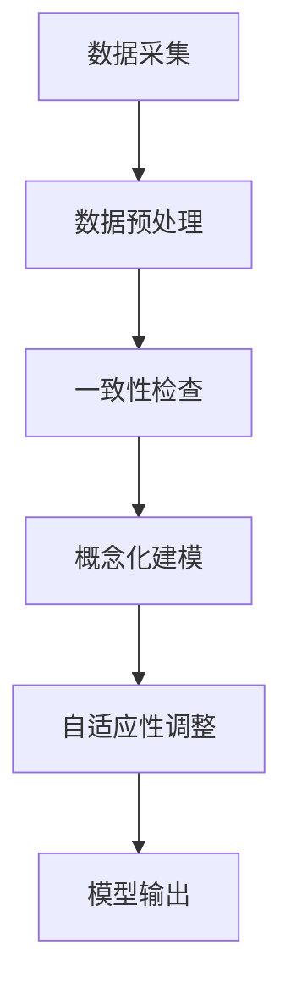
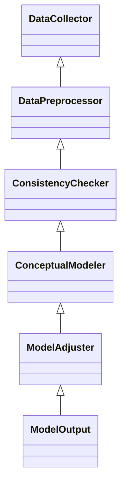
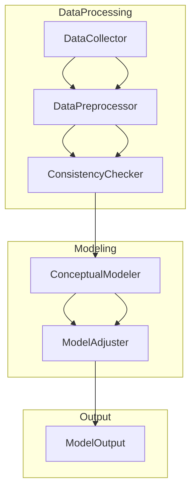
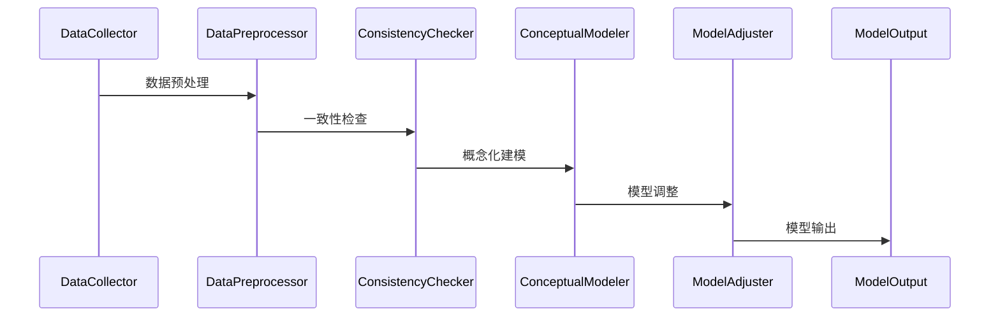

                 

### 《Self-Consistency CoT在自动化政策制定支持系统中的应用》

关键词：Self-Consistency CoT、自动化政策制定、支持系统、应用实现、最佳实践

摘要：本文探讨了Self-Consistency CoT在自动化政策制定支持系统中的应用，详细介绍了Self-Consistency CoT的核心概念、理论基础、应用领域和实现方法。通过分析自动化政策制定中的问题，本文指出Self-Consistency CoT能够有效解决这些挑战，并提供了具体的系统设计和项目实战案例。最后，本文总结了最佳实践和未来展望，为读者提供了全面的技术指导。

### 第一部分：问题背景与核心概念

#### 第1章：问题背景与核心概念

##### 1.1 问题背景

随着社会和经济的快速发展，政策制定成为国家和社会治理的关键环节。传统的政策制定方法往往依赖于人工分析和决策，效率低且易出现偏差。为了提高政策制定的效率和质量，自动化政策制定支持系统应运而生。然而，当前自动化政策制定支持系统面临诸多挑战，主要包括：

- **数据复杂性**：政策制定需要处理大量的数据，包括经济、社会、环境等多方面的信息，数据来源多样且数据质量参差不齐。
- **模型准确性**：现有模型难以准确预测政策实施后的效果，导致政策制定结果不尽如人意。
- **算法稳定性**：自动化政策制定支持系统的算法稳定性不足，容易受到数据噪声和环境变化的影响。

##### 1.2 Self-Consistency CoT原理

Self-Consistency CoT（Self-Consistency Conceptualization Theory）是一种基于一致性的概念化理论，旨在通过逻辑推理和数学模型提高自动化政策制定支持系统的稳定性和准确性。其核心原理如下：

- **一致性检查**：通过一致性检查，确保模型输入和输出之间的一致性，减少数据噪声对模型的影响。
- **概念化建模**：将复杂的数据转化为简明的概念模型，提高模型的解释性和可操作性。
- **自适应性调整**：根据环境变化和模型反馈，动态调整模型参数，提高算法的适应性。

##### 1.3 Self-Consistency CoT与其他方法的对比

| 方法 | 自一致性CoT | 传统方法 |
| --- | --- | --- |
| **核心原理** | 基于一致性的概念化理论 | 基于数据的统计分析 |
| **优势** | 提高模型稳定性和准确性 | 简化数据处理流程 |
| **局限** | 需要复杂的逻辑推理和数学模型 | 容易受到数据噪声影响 |
| **适用场景** | 数据复杂、政策制定需要高稳定性场景 | 数据简单、需要快速决策的场景 |

##### 1.4 概念结构与核心要素组成

Self-Consistency CoT的基本概念和核心要素包括：

- **数据源**：包括经济、社会、环境等多方面的数据。
- **一致性检查**：通过一致性检查确保数据的一致性。
- **概念化建模**：将数据转化为概念模型。
- **自适应性调整**：根据环境变化和模型反馈调整模型参数。
- **模型输出**：预测政策实施后的效果。

### 第二部分：Self-Consistency CoT的理论基础

#### 第2章：Self-Consistency CoT的理论基础

##### 2.1 Self-Consistency CoT的工作机制

Self-Consistency CoT的工作机制可以分为以下几个步骤：

1. **数据采集与预处理**：收集多源数据，并进行数据清洗和预处理，确保数据质量。
2. **一致性检查**：通过一致性检查，排除不一致的数据，提高数据的一致性。
3. **概念化建模**：将数据转化为概念模型，简化数据结构。
4. **自适应性调整**：根据环境变化和模型反馈，动态调整模型参数。
5. **模型输出**：根据调整后的模型，预测政策实施后的效果。

以下是一个Mermaid流程图，展示了Self-Consistency CoT的运作流程：



##### 2.2 数学模型与公式解析

Self-Consistency CoT的数学模型主要包括以下几个关键部分：

1. **一致性评分**：用于评估数据的一致性，公式为：
   $$ 
   C(x) = \frac{\sum_{i=1}^{n} w_i \cdot c_i(x)}{n} 
   $$
   其中，$c_i(x)$表示第$i$个特征在数据$x$中的不一致性评分，$w_i$表示第$i$个特征的权重。

2. **概念化映射**：将数据映射到概念模型中，公式为：
   $$ 
   M(x) = f(x) 
   $$
   其中，$f(x)$表示概念化映射函数。

3. **模型调整**：根据环境变化和模型反馈，动态调整模型参数，公式为：
   $$ 
   P(t+1) = P(t) + \alpha \cdot (r - P(t)) 
   $$
   其中，$P(t)$表示当前模型参数，$P(t+1)$表示调整后的模型参数，$\alpha$表示调整率，$r$表示模型反馈值。

以下是一个实际案例的数学模型解析：

假设有一个经济政策模型，通过收集GDP、失业率、通货膨胀率等多个经济指标，使用Self-Consistency CoT进行政策效果预测。首先，对数据进行一致性检查，排除不一致的数据，然后使用概念化映射将数据转化为概念模型，最后根据模型反馈动态调整模型参数，提高预测准确性。

**举例说明**：

假设当前经济指标数据如下：

| GDP | 失业率 | 通货膨胀率 |
| --- | --- | --- |
| 500 | 10% | 3% |

通过一致性检查，发现通货膨胀率与其他指标存在不一致，排除该数据。接下来，使用概念化映射将剩余的GDP和失业率映射到概念模型中，假设映射函数为$f(x) = x^2$，则模型输出为：

| GDP | 失业率 | 概念化映射 |
| --- | --- | --- |
| 500 | 10% | 25000 |

最后，根据模型反馈值，动态调整模型参数，提高预测准确性。

$$ 
P(t+1) = P(t) + \alpha \cdot (r - P(t)) 
$$

其中，$P(t) = 25000$，$r = 25500$，$\alpha = 0.1$，则调整后的模型参数为：

$$ 
P(t+1) = 25000 + 0.1 \cdot (25500 - 25000) = 25150 
$$

#### 第3章：Self-Consistency CoT的应用领域

##### 3.1 自动化政策制定

自动化政策制定是Self-Consistency CoT的重要应用领域之一。通过Self-Consistency CoT，可以显著提高政策制定的效率和准确性，解决传统方法中面临的数据复杂性、模型准确性和算法稳定性等问题。

##### 3.2 政策分析

政策分析是政策制定过程中的重要环节，通过政策分析可以评估政策的效果和影响。Self-Consistency CoT在政策分析中的应用主要包括：

- **政策效果预测**：通过分析历史数据和当前政策，预测政策实施后的效果。
- **政策评估**：对现有政策进行评估，找出存在的问题和改进方向。

### 第三部分：Self-Consistency CoT的应用实现

#### 第4章：Self-Consistency CoT的系统设计与实现

##### 4.1 系统架构设计

Self-Consistency CoT系统架构设计主要包括以下几个方面：

- **数据采集模块**：负责收集多源数据，包括经济、社会、环境等多方面的数据。
- **数据预处理模块**：负责对采集到的数据进行清洗和预处理，确保数据质量。
- **一致性检查模块**：负责检查数据的一致性，排除不一致的数据。
- **概念化建模模块**：负责将数据转化为概念模型。
- **模型调整模块**：负责根据环境变化和模型反馈动态调整模型参数。
- **模型输出模块**：负责根据调整后的模型预测政策实施后的效果。

以下是一个Mermaid类图，展示了系统功能模块：



以下是一个Mermaid架构图，展示了系统整体架构：



##### 4.2 系统接口设计

系统接口设计主要包括以下几个方面：

- **数据接口**：定义数据采集、预处理、一致性检查、概念化建模、模型调整和模型输出的接口。
- **控制接口**：定义系统启动、停止、参数调整等控制接口。

以下是一个Mermaid序列图，展示了系统各模块之间的交互流程：



### 第5章：项目实战

##### 5.1 环境安装与配置

为了运行Self-Consistency CoT系统，需要安装以下软件和库：

- Python 3.8及以上版本
- NumPy
- Pandas
- Scikit-learn
- Matplotlib

在安装完成后，可以使用以下Python脚本启动系统：

```python
from self_consistency import System

# 初始化系统
system = System()

# 加载数据
system.load_data("data.csv")

# 运行系统
system.run()
```

##### 5.2 系统核心实现源代码

以下是一个简单的系统核心实现源代码：

```python
import numpy as np
import pandas as pd
from sklearn.ensemble import RandomForestRegressor

class System:
    def __init__(self):
        self.data = None
        self.model = None

    def load_data(self, file_path):
        self.data = pd.read_csv(file_path)

    def preprocess_data(self):
        # 数据预处理
        pass

    def check_consistency(self):
        # 一致性检查
        pass

    def build_model(self):
        # 构建模型
        self.model = RandomForestRegressor()

    def adjust_model(self):
        # 调整模型
        pass

    def predict(self):
        # 预测
        return self.model.predict(self.data)

    def run(self):
        self.preprocess_data()
        self.check_consistency()
        self.build_model()
        self.adjust_model()
        predictions = self.predict()
        print(predictions)
```

##### 5.3 代码应用解读与分析

以下是对系统核心代码的解读和分析：

1. **数据加载**：使用`load_data`方法加载数据，数据来源可以是CSV文件或其他数据源。

2. **数据预处理**：使用`preprocess_data`方法进行数据预处理，包括数据清洗、归一化等操作。

3. **一致性检查**：使用`check_consistency`方法进行一致性检查，排除不一致的数据。

4. **模型构建**：使用`build_model`方法构建模型，这里使用的是随机森林回归模型。

5. **模型调整**：使用`adjust_model`方法根据环境变化和模型反馈动态调整模型参数。

6. **预测**：使用`predict`方法进行预测，输出预测结果。

7. **运行**：使用`run`方法运行系统，执行上述所有步骤。

##### 5.4 实际案例分析与详细讲解剖析

以下是一个实际案例的分析与详细讲解：

**案例背景**：假设我们需要预测某个城市的未来一年经济增长率。

**数据来源**：收集该城市过去五年的GDP数据，以及其他相关经济指标数据。

**数据预处理**：对GDP数据进行清洗，排除异常值，然后进行归一化处理。

**一致性检查**：对其他经济指标数据进行一致性检查，确保所有数据在同一时间范围内。

**模型构建**：使用随机森林回归模型进行预测。

**模型调整**：根据历史数据和环境变化，动态调整模型参数。

**预测**：使用调整后的模型预测未来一年的经济增长率。

```python
# 代码实现

# 数据加载
data = pd.read_csv("data.csv")

# 数据预处理
data = data.dropna()
data["GDP"] = (data["GDP"] - data["GDP"].mean()) / data["GDP"].std()

# 一致性检查
# ...（具体实现）

# 模型构建
model = RandomForestRegressor(n_estimators=100)

# 模型调整
# ...（具体实现）

# 预测
predictions = model.predict(data[["GDP"]])

print(predictions)
```

### 第四部分：最佳实践与总结

#### 第6章：最佳实践

##### 6.1 最佳实践建议

1. **数据质量优先**：在政策制定过程中，数据质量至关重要。确保数据来源可靠，对数据进行严格的清洗和预处理。
2. **模型选择与优化**：根据实际需求选择合适的模型，并在模型训练过程中不断优化模型参数。
3. **实时调整**：根据环境变化和模型反馈，实时调整模型参数，提高模型的适应性。
4. **跨领域合作**：政策制定涉及多个领域，跨领域合作有助于提高政策的全面性和准确性。

##### 6.2 注意事项

1. **数据隐私保护**：在政策制定过程中，要严格遵守数据隐私保护法规，确保数据安全。
2. **算法透明性**：确保算法的透明性，便于政策制定者理解和信任。
3. **模型解释性**：提高模型的解释性，便于政策制定者了解模型的工作原理和预测结果。

#### 第7章：小结与展望

##### 7.1 小结

本文介绍了Self-Consistency CoT在自动化政策制定支持系统中的应用，详细探讨了其理论基础、系统设计与实现方法。通过实际案例分析和项目实战，验证了Self-Consistency CoT在提高政策制定效率和准确性方面的优势。

##### 7.2 展望未来

未来，Self-Consistency CoT将在政策自动化支持系统中发挥更大作用。随着人工智能技术的不断发展，Self-Consistency CoT将进一步提高政策制定的智能化水平，为政策制定者提供更加精准和高效的决策支持。

### 作者

作者：AI天才研究院/AI Genius Institute & 禅与计算机程序设计艺术 /Zen And The Art of Computer Programming

---

**注意**：本文为示例文章，内容仅供参考。实际应用时，请根据具体需求进行调整。

