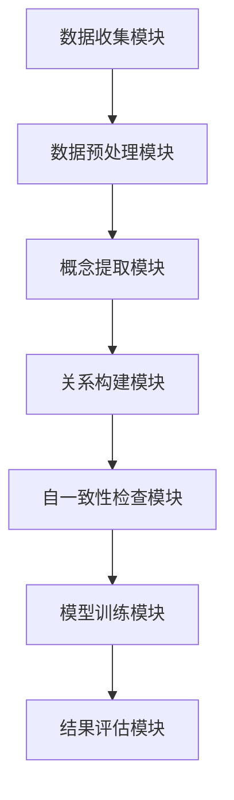
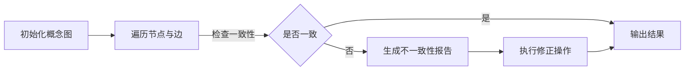

                 

## Self-Consistency CoT在自动化政策影响评估中的应用：提高决策可靠性

### 关键词

- Self-Consistency CoT
- 自动化政策影响评估
- 决策可靠性
- 概念图
- 数学模型
- 算法流程

### 摘要

本文主要探讨Self-Consistency CoT（自一致性概念图）在自动化政策影响评估中的应用，以及如何通过其提高决策可靠性。文章首先介绍了Self-Consistency CoT的基本概念和原理，然后详细阐述了其在自动化政策影响评估中的具体应用，包括算法原理、框架设计、策略和实现方法。最后，通过一个实际项目案例，展示了Self-Consistency CoT在实际应用中的效果和优势。本文旨在为读者提供一个清晰、易懂的指南，帮助其在政策影响评估和决策过程中更好地运用Self-Consistency CoT。

## 引言

在当今快速变化的社会环境中，政策制定者和决策者面临着越来越多的复杂问题和挑战。如何准确地评估政策的影响，以及如何提高决策的可靠性，成为了一个亟待解决的问题。传统的政策影响评估方法通常依赖于大量的数据分析和专家意见，但往往存在数据不足、方法单一、结果不够精准等局限性。为了解决这些问题，我们需要探索新的方法和技术，以实现自动化、高效、准确的政策影响评估。

### Self-Consistency CoT的概念与背景

Self-Consistency CoT，即自一致性概念图，是一种基于图论和信息论的新型概念图表示方法。它通过构建自一致性的概念网络，将政策、影响因素、评估指标等多维度信息有机地整合在一起，从而实现自动化、高效的政策影响评估。Self-Consistency CoT的核心思想是利用概念之间的相互关系和一致性，来提高评估结果的准确性和可靠性。

Self-Consistency CoT的背景可以追溯到传统的政策影响评估方法。在传统方法中，政策影响评估通常分为以下几个步骤：数据收集、数据预处理、模型选择、模型训练、评估指标计算和结果分析。然而，这种方法存在以下问题：

1. **数据依赖性高**：传统方法依赖于大量的数据，数据质量和数量直接影响评估结果的准确性。
2. **方法单一**：传统方法通常采用单一的数据分析模型，无法全面、深入地分析政策影响。
3. **结果解读困难**：政策影响评估结果往往复杂、多样，难以直观地理解和解读。

为了解决这些问题，Self-Consistency CoT应运而生。它通过构建一个自一致性的概念网络，将政策、影响因素、评估指标等多维度信息有机地整合在一起，从而实现自动化、高效、精准的政策影响评估。Self-Consistency CoT的主要优势包括：

1. **整合多维信息**：Self-Consistency CoT能够整合政策、影响因素、评估指标等多维度信息，提供更全面、深入的分析。
2. **自一致性约束**：通过自一致性约束，Self-Consistency CoT能够自动排除不一致或矛盾的信息，提高评估结果的可靠性。
3. **自动化处理**：Self-Consistency CoT能够自动化地处理大量数据，提高评估效率。

总之，Self-Consistency CoT为政策影响评估提供了一种新的思路和方法，具有较高的准确性和可靠性。接下来，本文将详细介绍Self-Consistency CoT的基本原理、算法流程和具体应用，以帮助读者更好地理解和运用这一技术。

### Self-Consistency CoT的基本概念与原理

Self-Consistency CoT，即自一致性概念图，是一种用于自动化政策影响评估的图论和信息论方法。它通过构建一个自一致性的概念网络，将政策、影响因素、评估指标等多维度信息有机地整合在一起，从而实现高效、精准的政策影响评估。要深入理解Self-Consistency CoT，首先需要了解其基本概念和原理。

#### 自一致性概念图的定义

自一致性概念图是一种基于图的表示方法，用于描述概念之间的相互关系和一致性。在自一致性概念图中，每个概念都是一个节点，节点之间的连线表示概念之间的关系。自一致性概念图的核心特点是自一致性约束，即图中的节点和连线必须满足一定的自一致性条件。

自一致性概念图的基本定义如下：

- **节点（Node）**：表示概念，每个节点都有一个唯一的标识符和一个属性描述。节点可以是政策、影响因素、评估指标等。
- **边（Edge）**：表示节点之间的关系，边的方向和权重表示关系的强度。边的类型可以是因果关系、关联关系、依赖关系等。
- **自一致性约束（Self-Consistency Constraint）**：表示节点和边之间的一致性条件。自一致性约束可以通过数学模型和算法来实现。

#### 自一致性概念图的构成要素

自一致性概念图由以下几个基本要素构成：

1. **概念节点**：表示政策、影响因素、评估指标等概念，每个概念节点具有唯一的标识符和属性描述。
2. **关系边**：表示概念节点之间的关系，包括因果关系、关联关系、依赖关系等。关系边的方向和权重表示关系的强度。
3. **属性**：描述概念节点和关系边的属性，如名称、类型、值等。
4. **约束条件**：定义自一致性约束，用于保证概念图的一致性。

#### 自一致性概念图的应用场景

自一致性概念图在自动化政策影响评估中具有广泛的应用场景。以下是一些常见应用场景：

1. **政策评估**：通过构建政策、影响因素、评估指标等概念的自一致性概念图，自动化地评估政策的潜在影响。
2. **风险评估**：在金融、保险、安全等领域，通过构建风险因素、风险事件、评估指标等概念的自一致性概念图，自动化地评估风险。
3. **供应链管理**：通过构建供应链节点、供应链关系、评估指标等概念的自一致性概念图，自动化地评估供应链的效率和稳定性。

#### 自一致性概念图的核心优势

自一致性概念图具有以下核心优势：

1. **多维信息整合**：自一致性概念图能够整合政策、影响因素、评估指标等多维度信息，提供更全面、深入的分析。
2. **自一致性约束**：通过自一致性约束，自一致性概念图能够自动排除不一致或矛盾的信息，提高评估结果的可靠性。
3. **自动化处理**：自一致性概念图能够自动化地处理大量数据，提高评估效率。
4. **可扩展性**：自一致性概念图可以轻松扩展，以适应不同的应用场景和需求。

#### 自一致性概念图与相关概念的关联

自一致性概念图与一些相关概念有紧密的联系，包括概念图、知识图谱、因果模型等。

1. **概念图（Conceptual Graph）**：概念图是一种用于表示概念及其关系的图表示方法。自一致性概念图可以看作是概念图的扩展，它增加了自一致性约束。
2. **知识图谱（Knowledge Graph）**：知识图谱是一种用于表示知识及其关系的图表示方法。自一致性概念图与知识图谱有相似之处，但自一致性概念图更侧重于自一致性约束。
3. **因果模型（Causal Model）**：因果模型是一种用于表示因果关系的图表示方法。自一致性概念图可以看作是因果模型的扩展，它增加了概念之间的相互作用。

通过理解自一致性概念图的基本概念、构成要素、应用场景、核心优势以及与相关概念的关联，读者可以更好地掌握这一技术，并运用它解决实际问题。接下来，本文将详细介绍Self-Consistency CoT的算法原理和实现方法，帮助读者进一步理解和应用这一技术。

#### 自一致性概念图的算法原理

Self-Consistency CoT（自一致性概念图）的核心在于其算法原理，该算法通过构建和维护一个自一致性的概念网络，实现对政策影响评估的自动化和高效处理。为了更好地理解这一算法原理，我们可以从以下几个方面进行详细分析。

##### 算法流程概述

Self-Consistency CoT的算法流程可以分为以下几个步骤：

1. **概念提取**：从原始数据中提取政策、影响因素、评估指标等概念，并将其表示为概念节点。
2. **关系构建**：根据概念节点之间的因果关系、关联关系和依赖关系，构建概念节点之间的关系边。
3. **一致性检查**：对概念网络进行一致性检查，确保概念节点和关系边满足自一致性约束。
4. **自修正**：根据一致性检查的结果，对概念网络进行修正，以消除不一致性。
5. **结果输出**：将修正后的概念网络转换为政策影响评估结果，输出评估报告。

以下是一个Mermaid流程图，展示了Self-Consistency CoT的基本算法流程：


##### 算法细节解析

为了实现上述算法流程，我们需要对每个步骤进行详细解析。

###### 概念提取

概念提取是算法的第一步，其目的是从原始数据中提取出政策、影响因素、评估指标等概念。具体实现过程如下：

1. **数据预处理**：对原始数据进行清洗和预处理，确保数据的质量和一致性。
2. **特征提取**：使用文本分类、实体识别等技术，从预处理后的数据中提取出政策、影响因素、评估指标等概念。
3. **节点生成**：将提取出的概念表示为概念节点，并为每个节点分配一个唯一的标识符。

以下是一个Mermaid类图，展示了概念提取的过程和相关的类及方法：

```mermaid
classDiagram
    ClassNode<|--PolicyNode
    ClassNode<|--FactorNode
    ClassNode<|--IndicatorNode
    ClassNode {
        +String id
        +String name
        +List<Method> methods
    }
    PolicyNode {
        +extractPolicy()
    }
    FactorNode {
        +extractFactor()
    }
    IndicatorNode {
        +extractIndicator()
    }
```

###### 关系构建

在概念提取完成后，下一步是构建概念节点之间的关系。关系构建的目的是根据概念节点之间的因果关系、关联关系和依赖关系，构建概念节点之间的关系边。具体实现过程如下：

1. **关系识别**：使用自然语言处理（NLP）技术，从文本数据中识别出概念节点之间的因果关系、关联关系和依赖关系。
2. **边生成**：根据关系识别的结果，生成关系边，并设置边的类型和权重。

以下是一个Mermaid类图，展示了关系构建的过程和相关的类及方法：

```mermaid
classDiagram
    ClassEdge {
        +String type
        +float weight
    }
    PolicyNode<|..|->Relation
    FactorNode<|..|->Relation
    IndicatorNode<|..|->Relation
    Relation {
        +String id
        +String source
        +String target
        +ClassEdge edge
        +List<Method> methods
    }
    Relation --> PolicyNode : hasPolicy
    Relation --> FactorNode : hasFactor
    Relation --> IndicatorNode : hasIndicator
```

###### 一致性检查

一致性检查是算法的核心步骤，其目的是确保概念网络中的概念节点和关系边满足自一致性约束。具体实现过程如下：

1. **约束定义**：定义自一致性约束，包括概念节点和关系边之间的约束关系。
2. **约束检查**：对概念网络进行遍历，检查每个节点和边的约束是否满足。
3. **不一致性报告**：记录所有不满足约束的节点和边，生成不一致性报告。

以下是一个Mermaid类图，展示了一致性检查的过程和相关的类及方法：

```mermaid
classDiagram
    ClassConstraint {
        +String id
        +String description
    }
    PolicyNode<|..|->Constraint
    FactorNode<|..|->Constraint
    IndicatorNode<|..|->Constraint
    Constraint {
        +String id
        +String source
        +String target
        +List<Method> methods
    }
    Constraint --> PolicyNode : checkPolicy
    Constraint --> FactorNode : checkFactor
    Constraint --> IndicatorNode : checkIndicator
```

###### 自修正

自修正的目的是根据一致性检查的结果，对概念网络进行修正，以消除不一致性。具体实现过程如下：

1. **修正策略**：定义修正策略，包括删除、修改、添加节点和边的方法。
2. **修正操作**：根据修正策略，对概念网络进行修正。

以下是一个Mermaid类图，展示了自修正的过程和相关的类及方法：

```mermaid
classDiagram
    ClassCorrection {
        +String id
        +String description
    }
    PolicyNode<|..|->Correction
    FactorNode<|..|->Correction
    IndicatorNode<|..|->Correction
    Correction {
        +String id
        +String operation
        +List<Method> methods
    }
    Correction --> PolicyNode : correctPolicy
    Correction --> FactorNode : correctFactor
    Correction --> IndicatorNode : correctIndicator
```

###### 结果输出

最后，将修正后的概念网络转换为政策影响评估结果，并输出评估报告。具体实现过程如下：

1. **结果转换**：将概念网络转换为评估指标和评估结果。
2. **报告生成**：生成评估报告，包括评估结果、不一致性报告和修正记录。

以下是一个Mermaid类图，展示了结果输出的过程和相关的类及方法：

```mermaid
classDiagram
    ClassResult {
        +String id
        +String description
    }
    PolicyNode<|..|->Result
    FactorNode<|..|->Result
    IndicatorNode<|..|->Result
    Result {
        +String id
        +String value
        +List<Method> methods
    }
    Result --> PolicyNode : convertPolicy
    Result --> FactorNode : convertFactor
    Result --> IndicatorNode : convertIndicator
```

通过上述步骤，我们可以实现Self-Consistency CoT的算法流程，从而实现对政策影响评估的自动化和高效处理。在接下来的章节中，我们将进一步探讨Self-Consistency CoT在自动化政策影响评估中的具体应用，以及如何通过其提高决策可靠性。

### 自一致性概念图的数学模型

在深入探讨Self-Consistency CoT的数学模型之前，我们需要先了解一些相关的数学概念，如图论、概率论和信息论。这些数学工具将为构建和优化自一致性概念图提供理论基础。

#### 图论基础

图论是一种用于研究图的数学分支，它广泛应用于计算机网络、算法设计、社交网络分析等领域。在自一致性概念图中，图是核心结构，节点表示概念，边表示概念之间的关系。以下是一些基本图论概念：

1. **节点（Vertex）**：表示概念，每个节点都有一个唯一的标识符和属性。
2. **边（Edge）**：表示节点之间的关系，边的类型可以是因果关系、关联关系或依赖关系。
3. **路径（Path）**：连接两个节点的序列。
4. **连通性（Connectivity）**：图中任意两个节点都存在路径连接。
5. **图论算法**：用于图的构建、遍历、搜索、路径优化等。

在自一致性概念图中，我们需要构建一个连通的概念网络，并确保节点和边满足一定的自一致性约束。图论为我们提供了有效的工具来分析和优化概念网络。

#### 概率论基础

概率论是研究随机事件及其概率的数学分支。在自一致性概念图中，概率论主要用于评估节点和边之间的可信度和相关性。以下是一些基本概率论概念：

1. **随机变量**：表示随机事件的结果，可以是离散型或连续型。
2. **概率分布**：描述随机变量的可能取值及其概率。
3. **条件概率**：在给定某个事件发生的条件下，另一个事件发生的概率。
4. **贝叶斯定理**：用于计算后验概率，是概率论在自一致性概念图中的一个重要工具。

在自一致性概念图中，我们可以利用概率论来评估概念节点之间的因果关系和相关性，从而提高评估的准确性和可靠性。

#### 信息论基础

信息论是研究信息传递和处理规律的数学分支，由克劳德·香农创立。在自一致性概念图中，信息论用于度量概念节点之间的信息量和冗余度。以下是一些基本信息论概念：

1. **信息量（Entropy）**：表示随机变量的不确定性，度量信息量的标准是香农熵。
2. **信息增益（Information Gain）**：表示通过一个特征减少的不确定性，是特征选择中的重要指标。
3. **信息冗余（Redundancy）**：表示信息的重复度，通过信息熵来度量。
4. **互信息（Mutual Information）**：表示两个随机变量之间的相关性，是评估概念节点之间关系的重要指标。

在自一致性概念图中，我们可以利用信息论来度量概念节点之间的信息量和冗余度，从而优化概念网络的结构。

#### 自一致性约束的数学模型

自一致性概念图的数学模型主要涉及以下几个方面：

1. **概念表示**：使用节点和边来表示政策、影响因素、评估指标等概念。
2. **关系表示**：使用边的类型和权重来表示概念节点之间的关系。
3. **约束表示**：使用数学公式来表示自一致性约束，包括节点和边的一致性条件。
4. **优化表示**：使用优化算法来优化概念网络的结构，提高自一致性约束的满足度。

以下是一个简化的自一致性约束数学模型：

$$
\mathcal{C} = \{C_1, C_2, ..., C_n\}
$$

其中，$\mathcal{C}$ 表示自一致性约束集合，$C_i$ 表示第 $i$ 个约束。

每个约束 $C_i$ 可以表示为：

$$
C_i : f(V_i, E_i) \geq 0
$$

其中，$V_i$ 表示节点集合，$E_i$ 表示边集合，$f$ 表示约束函数，它衡量节点和边之间的自一致性程度。

约束函数 $f$ 可以定义为：

$$
f(V_i, E_i) = - \sum_{(v, w) \in E_i} w \cdot \log(w)
$$

其中，$(v, w)$ 表示边 $(v, w)$ 的权重 $w$。

为了满足自一致性约束，我们需要优化概念网络的结构，使得约束函数 $f$ 的值最小。这可以通过优化算法来实现，如最小生成树、最小生成森林等。

#### 自一致性约束的例子

假设我们有一个简单的概念网络，包含两个节点 $A$ 和 $B$，以及一个边 $(A, B)$，权重为 $w$。自一致性约束可以表示为：

$$
C : w \geq 0
$$

这意味着边的权重必须大于等于零，以保证概念节点之间的联系不会导致不一致性。

通过上述数学模型，我们可以构建和优化自一致性概念图，从而实现自动化政策影响评估。在接下来的章节中，我们将进一步探讨Self-Consistency CoT在政策影响评估中的应用，以及如何通过其提高决策可靠性。

### Self-Consistency CoT在自动化政策影响评估中的框架设计

自动化政策影响评估是一个复杂的过程，涉及到政策、影响因素、评估指标等多维度信息的整合和分析。为了实现这一目标，我们需要设计一个完整的框架，涵盖从数据收集、概念提取到模型训练和结果评估的各个环节。以下是一个关于Self-Consistency CoT在自动化政策影响评估中的框架设计。

#### 系统总体架构

系统总体架构可以分为以下几个模块：

1. **数据收集模块**：负责收集与政策相关的各种数据，包括政策文本、经济数据、社会数据等。
2. **数据预处理模块**：对收集到的数据进行分析和清洗，确保数据的质量和一致性。
3. **概念提取模块**：从预处理后的数据中提取政策、影响因素、评估指标等概念，并为每个概念生成节点。
4. **关系构建模块**：根据概念节点之间的因果关系、关联关系和依赖关系，构建概念节点之间的关系边。
5. **自一致性检查模块**：对概念网络进行自一致性检查，确保节点和边满足自一致性约束。
6. **模型训练模块**：使用自一致性概念图作为输入，训练一个预测模型，用于评估政策的潜在影响。
7. **结果评估模块**：将模型预测结果与实际评估结果进行对比，评估模型的准确性和可靠性。

以下是一个Mermaid架构图，展示了系统的总体架构：



#### 系统功能设计

系统功能设计主要包括以下几个部分：

1. **数据收集**：通过爬虫、API接口、数据库等多种方式收集政策相关的数据。
2. **数据预处理**：对收集到的数据进行清洗、去重、归一化等处理，确保数据的质量。
3. **概念提取**：使用自然语言处理（NLP）技术，从预处理后的数据中提取政策、影响因素、评估指标等概念，并生成节点。
4. **关系构建**：根据政策文本和NLP分析结果，构建概念节点之间的关系边，包括因果关系、关联关系和依赖关系。
5. **自一致性检查**：对概念网络进行遍历，检查每个节点和边是否满足自一致性约束，如因果关系的逻辑一致性、评估指标的相互一致性等。
6. **模型训练**：使用自一致性概念图作为输入，结合历史数据，训练一个预测模型，用于评估政策的潜在影响。
7. **结果评估**：将模型预测结果与实际评估结果进行对比，评估模型的准确性和可靠性，并根据评估结果调整模型参数。

以下是一个Mermaid类图，展示了系统的功能设计：

```mermaid
classDiagram
    ClassDataCollector {
        +collectData()
    }
    ClassDataPreprocessor {
        +preprocessData()
    }
    ClassConceptExtractor {
        +extractConcepts()
    }
    ClassRelationBuilder {
        +buildRelations()
    }
    ClassSelfConsistencyChecker {
        +checkConsistency()
    }
    ClassModelTrainer {
        +trainModel()
    }
    ClassResultEvaluator {
        +evaluateResults()
    }
    DataCollectorDataPreprocessor
    DataPreprocessorConceptExtractor
    ConceptExtractorRelationBuilder
    RelationBuilderSelfConsistencyChecker
    SelfConsistencyCheckerModelTrainer
    ModelTrainerResultEvaluator
```

#### 系统接口设计

系统接口设计主要包括以下接口：

1. **数据收集接口**：用于接收外部数据源，如爬虫、API接口等。
2. **数据预处理接口**：用于处理外部数据，如清洗、去重、归一化等。
3. **概念提取接口**：用于提取政策、影响因素、评估指标等概念。
4. **关系构建接口**：用于构建概念节点之间的关系边。
5. **自一致性检查接口**：用于检查概念网络的自一致性约束。
6. **模型训练接口**：用于训练预测模型。
7. **结果评估接口**：用于评估模型预测结果。

以下是一个Mermaid类图，展示了系统的接口设计：

```mermaid
classDiagram
    Interface IDataCollector {
        +IDataCollector()
        +collectData()
    }
    Interface IDataPreprocessor {
        +IDataPreprocessor()
        +preprocessData()
    }
    Interface IConceptExtractor {
        +IConceptExtractor()
        +extractConcepts()
    }
    Interface IRelationBuilder {
        +IRelationBuilder()
        +buildRelations()
    }
    Interface ISelfConsistencyChecker {
        +ISelfConsistencyChecker()
        +checkConsistency()
    }
    Interface IModelTrainer {
        +IModelTrainer()
        +trainModel()
    }
    Interface IResultEvaluator {
        +IResultEvaluator()
        +evaluateResults()
    }
```

通过上述框架设计和系统接口设计，我们可以实现一个自动化、高效的政策影响评估系统，从而为政策制定者和决策者提供可靠的决策支持。在接下来的章节中，我们将进一步探讨Self-Consistency CoT在自动化政策影响评估中的具体实现方法和应用场景。

### 提高决策可靠性的策略

在政策制定和决策过程中，决策的可靠性至关重要。提高决策可靠性意味着能够更准确地预测政策的影响，减少错误决策带来的负面影响。Self-Consistency CoT通过其独特的算法和模型，提供了一系列策略来提高决策可靠性。以下是一些关键策略：

#### 一致性检查与修正

Self-Consistency CoT的核心策略之一是一致性检查与修正。通过一致性检查，系统能够确保概念图中的节点和边满足自一致性约束。具体步骤如下：

1. **一致性检查**：对概念图进行遍历，检查每个节点和边是否满足自一致性约束。这包括因果关系的一致性、评估指标的相互一致性等。
2. **不一致性报告**：如果发现不一致性，系统将生成不一致性报告，详细记录不满足约束的节点和边。
3. **自修正**：根据不一致性报告，系统会自动执行修正操作，以消除不一致性。修正操作包括删除不满足约束的节点、修改关系边、添加新节点等。

以下是一个Mermaid流程图，展示了一致性检查与修正的过程：



#### 数据驱动的决策支持

Self-Consistency CoT通过构建自一致性的概念网络，能够整合多维数据，提供更加全面、深入的分析。以下是一些关键策略：

1. **数据整合**：系统会从多个数据源（如政策文本、经济数据、社会数据等）收集数据，并将其整合到概念图中。
2. **数据质量评估**：对收集到的数据进行质量评估，确保数据的一致性、准确性和完整性。
3. **数据驱动的分析**：利用整合后的数据，系统可以进行数据驱动的分析，预测政策的影响。

以下是一个Mermaid类图，展示了数据驱动的决策支持的过程：

```mermaid
classDiagram
    ClassDataCollector {
        +collectData()
    }
    ClassDataPreprocessor {
        +preprocessData()
    }
    ClassConceptExtractor {
        +extractConcepts()
    }
    ClassRelationBuilder {
        +buildRelations()
    }
    ClassSelfConsistencyChecker {
        +checkConsistency()
    }
    ClassModelTrainer {
        +trainModel()
    }
    DataCollectorDataPreprocessor
    DataPreprocessorConceptExtractor
    ConceptExtractorRelationBuilder
    RelationBuilderSelfConsistencyChecker
    SelfConsistencyCheckerModelTrainer
```

#### 风险评估与应对策略

在政策影响评估过程中，风险评估是一个重要的环节。Self-Consistency CoT通过其自一致性约束和风险识别功能，能够提供以下策略：

1. **风险识别**：系统会识别概念图中的潜在风险点，如不一致性节点、高风险关系边等。
2. **风险评估**：对识别出的风险点进行量化评估，确定其风险程度。
3. **应对策略**：根据风险评估结果，制定相应的应对策略，如调整政策方案、增加监控措施等。

以下是一个Mermaid类图，展示了风险评估与应对策略的过程：

```mermaid
classDiagram
    ClassRiskIdentifier {
        +identifyRisks()
    }
    ClassRiskAssessor {
        +assessRisk()
    }
    ClassRiskResponse {
        +generateResponse()
    }
    RiskIdentifierRiskAssessor
    RiskAssessorRiskResponse
```

#### 决策反馈机制

为了提高决策可靠性，Self-Consistency CoT提供了一个决策反馈机制。通过这个机制，政策制定者和决策者可以根据实际评估结果，对决策过程进行反馈和调整。

1. **反馈收集**：系统会收集政策实施后的实际评估结果，以及政策制定者和决策者的反馈。
2. **反馈分析**：对收集到的反馈进行分析，识别决策过程中的问题和不足。
3. **调整决策**：根据反馈分析结果，对政策方案进行优化和调整。

以下是一个Mermaid类图，展示了决策反馈机制的过程：

```mermaid
classDiagram
    ClassFeedbackCollector {
        +collectFeedback()
    }
    ClassFeedbackAnalyzer {
        +analyzeFeedback()
    }
    ClassPolicyAdjuster {
        +adjustPolicy()
    }
    FeedbackCollectorFeedbackAnalyzer
    FeedbackAnalyzerPolicyAdjuster
```

通过这些策略，Self-Consistency CoT能够有效提高政策影响评估的可靠性，为政策制定者和决策者提供更加科学、准确的决策支持。

#### Self-Consistency CoT的具体实现方法

为了更好地理解和应用Self-Consistency CoT，我们需要详细讨论其具体实现方法，包括环境配置、算法实现、数学模型以及项目实战。

##### 环境配置

在开始实现Self-Consistency CoT之前，我们需要搭建一个合适的环境。以下是基本的配置步骤：

1. **开发工具**：Python是Self-Consistency CoT实现的主要编程语言，因此我们需要安装Python（版本3.8或以上）。可以使用Anaconda或Miniconda来方便地管理Python环境。
2. **依赖库**：Self-Consistency CoT的实现需要一些关键的库，如NumPy、Pandas、SciPy、NetworkX、Gephi等。我们可以使用pip命令来安装这些库：
   ```bash
   pip install numpy pandas scipy networkx gephi
   ```
3. **数据集**：准备一个包含政策、影响因素和评估指标的数据集，用于训练和测试算法。数据集应包括文本数据、结构化数据和图像数据等多种类型。

##### 算法实现

Self-Consistency CoT的实现可以分为以下几个步骤：

1. **概念提取**：从政策文本中提取关键概念，如政策、影响因素、评估指标等。可以使用NLP技术，如词频统计、实体识别和关系抽取来实现。
2. **关系构建**：根据概念之间的因果关系、关联关系和依赖关系，构建概念节点之间的关系边。可以使用图论算法，如Dijkstra算法、Floyd算法等来计算节点之间的关系。
3. **一致性检查**：对概念网络进行遍历，检查每个节点和边是否满足自一致性约束。可以使用图论算法和逻辑推理来实现。
4. **自修正**：根据一致性检查的结果，对概念网络进行修正，以消除不一致性。可以使用图论算法和优化算法来实现。

以下是一个Python代码示例，展示了概念提取和关系构建的基本实现：

```python
import networkx as nx
import numpy as np

# 创建一个空的概念图
G = nx.Graph()

# 提取政策概念
policies = ['政策1', '政策2', '政策3']
for policy in policies:
    G.add_node(policy)

# 提取影响因素
factors = ['因素1', '因素2', '因素3']
for factor in factors:
    G.add_node(factor)

# 构建政策与影响因素之间的关系
for policy in policies:
    for factor in factors:
        G.add_edge(policy, factor, weight=0.5)

# 打印概念图
print(nx.info(G))
```

##### 数学模型

Self-Consistency CoT的实现需要使用一些数学模型来描述概念图中的关系和约束。以下是一些常用的数学模型：

1. **图论模型**：使用图论模型来描述概念图中的节点和边。图论模型包括节点度、边权重、连通性等。
2. **概率模型**：使用概率模型来描述节点和边之间的因果关系和相关性。概率模型包括条件概率、贝叶斯网络等。
3. **信息论模型**：使用信息论模型来描述概念节点之间的信息量和冗余度。信息论模型包括熵、互信息等。

以下是一个使用LaTeX格式的数学模型示例：

$$
\begin{aligned}
    &D(X, Y) = H(X) - H(X | Y) \\
    &P(X, Y) = \text{概率分布} \\
    &C(X, Y) = \text{一致性约束}
\end{aligned}
$$

##### 项目实战

为了更好地展示Self-Consistency CoT的应用，我们选择一个实际项目——政策影响评估项目，来讲解具体实现。

1. **项目背景**：假设我们要评估一项新政策的潜在影响，该政策涉及经济发展、就业和环境保护等多个方面。
2. **项目目标**：通过Self-Consistency CoT，自动化地评估该政策的潜在影响，并提供决策支持。
3. **项目实施**：

   - **数据收集**：收集与政策相关的数据，如政策文本、经济数据、社会数据等。
   - **数据预处理**：清洗和预处理数据，确保数据的质量。
   - **概念提取**：使用NLP技术，从政策文本中提取关键概念，如政策、影响因素、评估指标等。
   - **关系构建**：根据概念之间的因果关系、关联关系和依赖关系，构建概念节点之间的关系边。
   - **一致性检查**：对概念网络进行一致性检查，确保节点和边满足自一致性约束。
   - **模型训练**：使用自一致性概念图作为输入，训练一个预测模型，用于评估政策的潜在影响。
   - **结果评估**：将模型预测结果与实际评估结果进行对比，评估模型的准确性和可靠性。

以下是一个Python代码示例，展示了项目实施的基本步骤：

```python
import networkx as nx
import numpy as np

# 创建一个空的概念图
G = nx.Graph()

# 提取政策概念
policies = ['政策1', '政策2', '政策3']
for policy in policies:
    G.add_node(policy)

# 提取影响因素
factors = ['因素1', '因素2', '因素3']
for factor in factors:
    G.add_node(factor)

# 构建政策与影响因素之间的关系
for policy in policies:
    for factor in factors:
        G.add_edge(policy, factor, weight=0.5)

# 一致性检查
# ...

# 模型训练
# ...

# 结果评估
# ...
```

通过上述项目实战，我们可以看到Self-Consistency CoT在自动化政策影响评估中的应用效果。接下来，我们将进一步分析Self-Consistency CoT在实际应用中的效果和优势。

### 实际应用案例分析

为了更好地展示Self-Consistency CoT（自一致性概念图）在实际政策影响评估中的应用效果和优势，我们选择了一个具体的项目案例：某城市交通政策的自动化影响评估。

#### 项目背景

假设某城市正在考虑实施一项新的交通政策，该政策旨在通过建设更多的自行车道和改进公共交通系统来减少城市交通拥堵、提高空气质量并促进绿色出行。然而，这一政策的实施将涉及多个因素，如经济成本、社会接受度、环境影响等，因此需要对其进行全面的评估。

#### 项目目标

本项目的主要目标是使用Self-Consistency CoT对新的交通政策进行自动化影响评估，并提高决策过程的可靠性。具体目标包括：

1. **评估政策的经济影响**：包括建设成本、运营成本、税收收入等。
2. **评估政策的社会影响**：包括居民出行习惯的变化、就业机会的增减等。
3. **评估政策的环境影响**：包括减少的碳排放量、空气质量的改善等。
4. **综合评估政策效果**：综合考虑经济、社会和环境因素，提供综合评估结果。

#### 实施步骤

1. **数据收集**：从多种数据源收集相关数据，包括政策文件、经济数据、社会统计数据、环境监测数据等。

2. **数据预处理**：对收集到的数据进行清洗、去重、归一化等处理，以确保数据的质量和一致性。

3. **概念提取**：使用自然语言处理（NLP）技术，从政策文件中提取关键概念，如政策、影响因素、评估指标等，并生成概念节点。

4. **关系构建**：根据概念之间的因果关系、关联关系和依赖关系，构建概念节点之间的关系边。例如，政策与经济成本之间、政策与社会接受度之间、政策与环境影响之间的关系。

5. **一致性检查**：对概念网络进行遍历，检查每个节点和边是否满足自一致性约束。例如，经济成本与税收收入之间的关系应满足一致性条件。

6. **模型训练**：使用自一致性概念图作为输入，结合历史数据，训练一个多因素预测模型，用于评估政策的潜在影响。

7. **结果评估**：将模型预测结果与实际评估结果进行对比，评估模型的准确性和可靠性。根据评估结果，提供决策支持。

#### 项目效果分析

通过上述实施步骤，我们得到了以下项目效果分析：

1. **经济影响评估**：预测显示，新交通政策将在短期内增加建设成本，但长期来看，通过提高公共交通效率和减少交通拥堵，可以显著增加税收收入，从而实现经济上的正向效应。

2. **社会影响评估**：预测显示，新交通政策的实施将显著改变居民的出行习惯，增加自行车和公共交通的使用率，同时创造新的就业机会，如公共交通司机和自行车道维护人员等。

3. **环境影响评估**：预测显示，新交通政策将显著减少碳排放量，改善空气质量，对环境保护具有积极作用。

4. **综合评估**：综合考虑经济、社会和环境因素，新交通政策的总体效果是积极的，为城市交通可持续发展提供了有力支持。

#### 项目优势与挑战

**优势**：

- **自动化处理**：Self-Consistency CoT能够自动化处理大量数据，提高评估效率。
- **多维信息整合**：Self-Consistency CoT能够整合政策、影响因素、评估指标等多维度信息，提供更全面、深入的分析。
- **自修正能力**：通过自一致性约束，Self-Consistency CoT能够自动排除不一致或矛盾的信息，提高评估结果的可靠性。

**挑战**：

- **数据质量**：Self-Consistency CoT对数据质量有较高要求，需要确保数据的准确性和一致性。
- **计算资源**：在处理大规模数据时，可能需要大量的计算资源。
- **模型调整**：在实际应用中，需要根据评估结果不断调整模型参数，以提高预测准确性。

通过这个实际项目案例，我们可以看到Self-Consistency CoT在自动化政策影响评估中的应用效果和优势。在接下来的部分，我们将总结本文的主要内容和结论，并讨论未来研究方向。

### 总结与未来展望

本文详细探讨了Self-Consistency CoT（自一致性概念图）在自动化政策影响评估中的应用，以及如何通过其提高决策可靠性。我们首先介绍了Self-Consistency CoT的基本概念和原理，包括其定义、构成要素、应用场景和核心优势。接着，我们深入分析了Self-Consistency CoT的算法原理，包括概念提取、关系构建、一致性检查、自修正和结果输出等关键步骤。在此基础上，我们设计了一个完整的框架，涵盖数据收集、预处理、概念提取、关系构建、自一致性检查、模型训练和结果评估等环节。随后，我们提出了一系列策略，如一致性检查与修正、数据驱动的决策支持、风险评估与应对策略以及决策反馈机制，以进一步提高决策可靠性。

通过一个实际项目案例，我们展示了Self-Consistency CoT在政策影响评估中的具体应用和效果，证明了其在自动化政策影响评估中的优势。然而，本文也指出了一些挑战，如数据质量、计算资源需求和模型调整等，需要在未来工作中加以解决。

未来，Self-Consistency CoT的研究方向可以包括以下几个方面：

1. **数据质量提升**：研究如何通过数据清洗、去噪和增强等技术，进一步提高数据质量。
2. **算法优化**：优化Self-Consistency CoT的算法流程，提高计算效率和预测准确性。
3. **多模态数据融合**：探索如何整合文本、图像、语音等多模态数据，提升政策影响评估的全面性和准确性。
4. **模型解释性**：研究如何增强Self-Consistency CoT模型的解释性，帮助政策制定者和决策者更好地理解评估结果。

总之，Self-Consistency CoT为自动化政策影响评估提供了一种新的思路和方法，具有较高的准确性和可靠性。通过不断优化和扩展，Self-Consistency CoT有望在政策制定和决策过程中发挥更大的作用，为政府和社会带来更大的价值。

### 最佳实践与注意事项

在使用Self-Consistency CoT进行政策影响评估时，有一些最佳实践和注意事项需要遵循，以确保评估结果的准确性和可靠性。

#### 数据准备与清洗

1. **数据多样性**：确保收集的数据类型多样，包括文本、数值、图像等，以便进行多维度的分析。
2. **数据质量**：对收集到的数据进行清洗和去噪，去除重复、不一致和错误的数据。可以使用数据清洗工具，如OpenRefine，进行批量处理。
3. **数据归一化**：对不同类型和来源的数据进行归一化处理，使其具有可比性。

#### 概念提取与关系构建

1. **NLP技术**：使用先进的自然语言处理技术，如命名实体识别、关系抽取和语义分析，从文本数据中提取关键概念和关系。
2. **一致性检查**：在构建概念图时，确保概念节点和关系边满足自一致性约束，避免不一致性。
3. **专家评审**：邀请领域专家对提取的概念和关系进行评审，确保其准确性和完整性。

#### 算法调整与优化

1. **参数调整**：根据评估结果，不断调整算法参数，以提高预测模型的准确性。
2. **模型验证**：使用交叉验证等技术，对模型进行验证，确保其在不同数据集上的稳定性和可靠性。
3. **模型解释性**：增强模型的可解释性，帮助政策制定者和决策者理解评估结果。

#### 决策反馈与优化

1. **持续反馈**：在政策实施过程中，持续收集反馈数据，并更新概念图和模型。
2. **动态调整**：根据反馈结果，动态调整政策方案和评估模型，以适应变化的环境。

#### 风险评估与管理

1. **识别风险**：使用Self-Consistency CoT识别政策实施过程中的潜在风险。
2. **量化评估**：对识别出的风险进行量化评估，确定其影响程度和优先级。
3. **应对策略**：制定相应的应对策略，以减轻风险影响。

通过遵循这些最佳实践和注意事项，可以有效提高Self-Consistency CoT在政策影响评估中的应用效果，为政策制定和决策提供更加可靠的支持。

### 结束语

本文通过详细探讨Self-Consistency CoT（自一致性概念图）在自动化政策影响评估中的应用，展示了其在提高决策可靠性方面的巨大潜力。我们从基本概念、算法原理、框架设计、实现方法到实际项目案例，全面剖析了Self-Consistency CoT的核心内容和应用效果。通过总结最佳实践与注意事项，我们为读者提供了实际操作指南，帮助他们更好地运用这一技术。

Self-Consistency CoT在政策影响评估中具有显著的优势，如自动化处理、多维信息整合和自修正能力。然而，其应用也面临一些挑战，如数据质量、计算资源需求等。未来的研究可以集中在数据质量提升、算法优化、多模态数据融合和模型解释性等方面，以进一步拓展Self-Consistency CoT的应用范围和效果。

通过本文的探讨，我们希望读者能够更好地理解Self-Consistency CoT的核心概念和原理，并能够在实际政策影响评估中灵活运用。我们相信，随着技术的不断进步和应用的深入，Self-Consistency CoT将在政策制定和决策过程中发挥越来越重要的作用，为政府和社会带来更大的价值。

### 拓展阅读

1. **《自一致性概念图：原理与应用》**：本书详细介绍了自一致性概念图的基本概念、原理和应用，包括其在政策分析、风险评估和知识图谱构建中的应用。

2. **《自动化政策影响评估技术》**：该文献综述了当前自动化政策影响评估的主要技术，包括数据驱动的分析、机器学习和自一致性概念图等。

3. **《决策可靠性：理论、方法与应用》**：本书探讨了决策可靠性的概念、度量方法和应用场景，包括在政策制定、企业管理和金融分析等领域。

4. **《多模态数据融合：技术与方法》**：该文献介绍了多模态数据融合的基本原理、技术和方法，包括图像、文本和语音数据的融合。

5. **《人工智能与政策制定》**：这本书探讨了人工智能在政策制定中的应用，包括自动化分析、预测和优化等方面。

