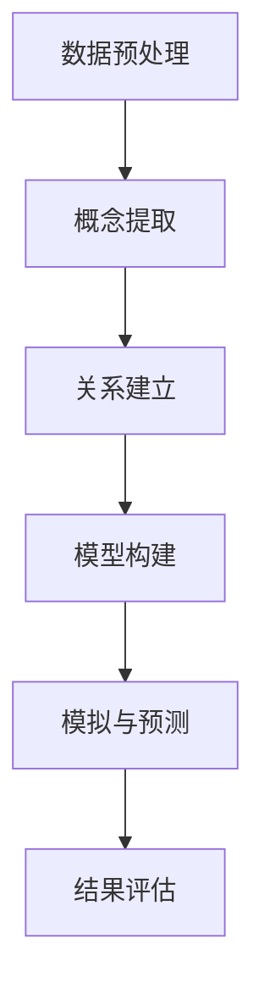
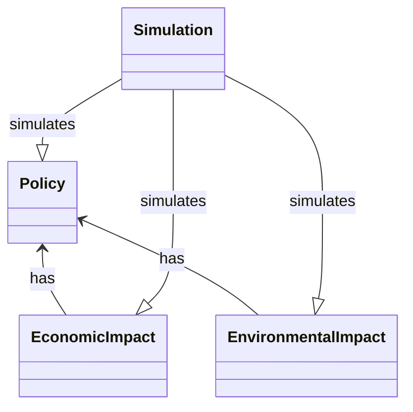
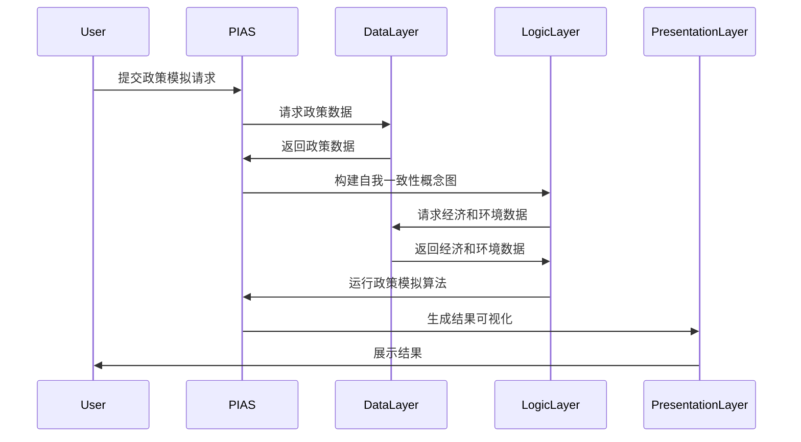
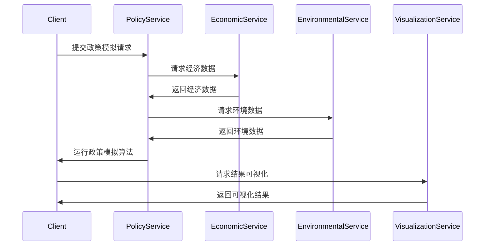

                 

## 文章标题

# Self-Consistency CoT在自动化政策长期影响链分析中的应用

### 关键词：自我一致性概念图（Self-Consistency CoT）、自动化政策长期影响链分析、算法模型、系统架构、应用案例

### 摘要：

本文旨在探讨自我一致性概念图（Self-Consistency CoT）在自动化政策长期影响链分析中的应用。自我一致性概念图是一种强大的语义表示工具，能够捕捉和表达复杂系统的内在关联性。而自动化政策长期影响链分析则关注于政策实施后的长期效果分析，通过预测和模拟来评估政策的潜在影响。本文将首先介绍自我一致性概念图的基本原理，然后详细探讨其在自动化政策长期影响链分析中的具体应用，包括算法模型、系统架构设计以及实际案例分析。通过这些分析，我们希望读者能够理解自我一致性概念图的价值，并掌握其在政策分析领域的应用技巧。

## 引言

### 什么是自我一致性概念图（Self-Consistency CoT）

自我一致性概念图（Self-Consistency CoT）是一种基于语义表示的图形化工具，旨在通过捕捉和表达系统中各个组成部分之间的内在一致性关系，来揭示系统的复杂性和动态行为。自我一致性概念图的基本思想是，系统中的各个实体（如政策、事件、因素等）不仅具有独立的属性和特征，而且通过相互关系形成了一个整体，其状态和变化受到系统中其他实体的影响。

自我一致性概念图通常由一组节点（表示实体）和边（表示关系）构成。每个节点代表一个概念，边的存在表示两个概念之间的相互依赖和影响。自我一致性概念图的独特之处在于，它不仅能够表示概念之间的直接关系，还能够通过一致性约束来捕捉概念的内在一致性和逻辑关系。

### 自我一致性概念图的原理与重要性

自我一致性概念图的原理基于几个核心概念：一致性约束、上下文依赖和动态演化。首先，一致性约束是指系统中的概念必须满足一定的逻辑规则，这些规则确保了概念之间的相互关系是合理和自洽的。上下文依赖则强调，概念之间的关系是依赖于具体的环境和情境的，不同的上下文可能导致相同的实体表现出不同的行为。

自我一致性概念图的重要性在于其能够提供一种清晰、直观的方式来理解复杂系统的结构和动态行为。在政策分析领域，自我一致性概念图可以帮助政策制定者更准确地预测政策的长期影响，发现潜在的问题和风险，从而为政策的优化和调整提供依据。

### 自我一致性概念图的应用背景

自我一致性概念图在政策分析领域的应用背景主要包括以下几个方面：

1. **政策效果评估**：通过构建自我一致性概念图，可以系统地分析政策实施前后的变化，评估政策的效果和影响。

2. **风险评估与预警**：自我一致性概念图可以帮助识别政策实施过程中可能出现的风险和问题，提前预警并采取措施。

3. **政策优化**：通过对政策影响链的深入分析，自我一致性概念图可以为政策的优化提供数据支持和决策依据。

4. **跨部门协作**：自我一致性概念图可以促进不同部门和利益相关者之间的沟通和协作，提高政策实施的效率。

## 自动化政策长期影响链分析

### 自动化政策长期影响链分析的概念

自动化政策长期影响链分析是指利用计算模型和算法，对政策实施后的长期影响进行预测和分析。这种分析方法不仅关注政策对单一变量的直接影响，还考虑了政策对整个系统的长期效应，包括间接影响和累积效应。

自动化政策长期影响链分析的基本流程通常包括以下几个步骤：

1. **数据收集**：收集与政策相关的各种数据，包括政策文本、历史数据、社会统计数据等。

2. **模型构建**：基于收集到的数据，构建能够反映政策影响机制的模型，通常包括因果模型、预测模型和优化模型等。

3. **模拟与预测**：利用构建好的模型，进行政策实施的模拟和预测，分析政策在不同情境下的长期影响。

4. **结果评估**：对模拟结果进行评估和分析，评估政策的可行性和效果，发现潜在的问题和风险。

### 自动化政策长期影响链分析的方法

自动化政策长期影响链分析的方法主要包括以下几种：

1. **因果分析**：通过构建因果模型，分析政策实施对系统各个变量之间的因果关系，揭示政策影响的路径和机制。

2. **预测分析**：利用时间序列分析和回归分析等方法，预测政策实施后各变量的变化趋势和长期效果。

3. **优化分析**：通过构建优化模型，寻求政策调整的最优方案，以最大化政策效果或最小化负面影响。

4. **多场景模拟**：构建多个不同情境下的政策实施方案，通过模拟分析比较不同方案的效果和风险。

### 自动化政策长期影响链分析的应用场景

自动化政策长期影响链分析的应用场景非常广泛，主要包括以下几个方面：

1. **宏观经济政策**：如税收政策、产业政策等，分析政策对经济增长、就业、收入分配等方面的影响。

2. **社会政策**：如教育政策、医疗政策等，评估政策对教育水平、医疗资源分配、社会福利等方面的影响。

3. **环境政策**：如能源政策、环保政策等，分析政策对气候变化、环境污染、生态平衡等方面的影响。

4. **城市规划**：如交通政策、土地利用政策等，评估政策对城市交通、居住环境、经济发展等方面的影响。

### 自我一致性概念图在自动化政策长期影响链分析中的应用

#### 自我一致性概念图在政策分析中的优势

自我一致性概念图在政策分析中具有以下几大优势：

1. **图形化表示**：自我一致性概念图以图形化的方式呈现系统中的概念和关系，使得复杂的问题变得直观易懂。

2. **语义表示**：自我一致性概念图能够捕捉和表达概念之间的语义关系，使得分析更加精准和深入。

3. **动态演化**：自我一致性概念图支持动态演化，能够反映系统在时间维度上的变化和演化过程。

4. **适应性**：自我一致性概念图可以根据不同的政策场景和需求，灵活调整和优化，提高分析的针对性和效果。

#### 自动化政策长期影响链分析的数学模型

在自动化政策长期影响链分析中，自我一致性概念图可以结合多种数学模型，以全面分析和预测政策的影响。以下是一些常用的数学模型：

1. **线性回归模型**：用于分析政策对单一变量的直接影响，如政策对经济增长的影响。

2. **时间序列模型**：用于预测政策实施后各变量的长期变化趋势，如人口增长率、失业率等。

3. **多变量回归模型**：用于分析多个政策变量之间的相互影响和累积效应，如税收政策对经济、社会和环境的综合影响。

4. **因果推断模型**：用于揭示政策实施对系统变量之间的因果关系，如环保政策对碳排放的影响。

#### 自动化政策长期影响链分析的算法流程

在自动化政策长期影响链分析中，自我一致性概念图可以通过以下算法流程实现：

1. **数据预处理**：对收集到的政策数据进行分析和清洗，提取有用的信息。

2. **概念提取**：从政策数据中提取关键概念和实体，构建自我一致性概念图的节点。

3. **关系建立**：根据政策数据中的信息，建立节点之间的关系，构建自我一致性概念图的边。

4. **模型构建**：基于自我一致性概念图，构建相应的数学模型，用于分析政策的影响。

5. **模拟与预测**：利用构建好的模型，进行政策模拟和预测，分析政策在不同情境下的长期影响。

6. **结果评估**：对模拟结果进行评估和分析，评估政策的可行性和效果，发现潜在的问题和风险。

### 自我一致性概念图的算法原理讲解

#### 算法原理的Mermaid流程图展示

为了更好地理解自我一致性概念图的算法原理，我们可以使用Mermaid语言绘制一个简单的流程图。以下是一个示例：



这个流程图展示了自我一致性概念图算法的基本步骤：从数据预处理开始，提取关键概念和实体，建立概念之间的关系，构建数学模型，进行模拟和预测，最后对结果进行评估。

#### 算法原理的Python代码实现

接下来，我们将用Python代码来实现自我一致性概念图的算法原理。以下是一个简单的Python代码示例：

```python
import pandas as pd

# 数据预处理
def preprocess_data(data):
    # 对数据进行清洗和预处理
    return cleaned_data

# 概念提取
def extract_concepts(data):
    # 从数据中提取关键概念
    concepts = []
    for record in data:
        concepts.append(record['concept'])
    return concepts

# 关系建立
def establish_relations(concepts):
    # 根据概念建立关系
    relations = []
    for i in range(len(concepts)):
        for j in range(i+1, len(concepts)):
            relations.append((concepts[i], concepts[j]))
    return relations

# 模型构建
def build_model(relations):
    # 基于关系构建数学模型
    model = pd.DataFrame(relations, columns=['Concept1', 'Concept2'])
    return model

# 模拟与预测
def simulate_and_predict(model):
    # 利用模型进行模拟和预测
    predictions = model.groupby(['Concept1', 'Concept2']).mean()
    return predictions

# 结果评估
def evaluate_results(predictions):
    # 对结果进行评估
    print(predictions)
```

#### 算法原理的数学模型和公式讲解

在自我一致性概念图中，我们可以使用以下数学模型来表示概念之间的关系：

1. **一致性约束**：设 \( C \) 为概念集合，\( R \) 为关系集合，则一致性约束可以表示为：

   $$ \forall c_1, c_2 \in C, (c_1, c_2) \in R \Rightarrow (c_2, c_1) \in R $$

   这意味着，如果两个概念之间存在关系，那么它们的关系是相互的。

2. **上下文依赖**：设 \( D \) 为上下文集合，\( P(c, d) \) 为概念 \( c \) 在上下文 \( d \) 下的概率分布，则上下文依赖可以表示为：

   $$ \forall c, d, e \in D, P(c, d) \neq P(c, e) $$

   这意味着，同一概念在不同上下文下的表现是不同的。

3. **动态演化**：设 \( T \) 为时间集合，\( S(t) \) 为在时间 \( t \) 下的系统状态，则动态演化可以表示为：

   $$ S(t+1) = f(S(t)) $$

   其中，\( f \) 为状态转移函数，描述了系统在时间 \( t \) 到时间 \( t+1 \) 之间的状态变化。

#### 算法原理的例子说明

假设我们有一个简单的自我一致性概念图，包含三个概念：政策 \( P \)，经济 \( E \)，和环境 \( A \)。它们之间的关系和上下文依赖如下：

- 政策 \( P \) 对经济 \( E \) 有直接影响。
- 经济 \( E \) 对环境 \( A \) 有间接影响。
- 不同政策实施情境下的环境 \( A \) 的变化是不同的。

基于这些关系和上下文依赖，我们可以构建一个简单的自我一致性概念图，并进行模拟和预测。例如，假设在政策实施后的一年，经济 \( E \) 的增长率为 \( 5\% \)，环境 \( A \) 的变化率可以根据经济 \( E \) 的变化进行预测。通过这种模拟和预测，我们可以评估政策对经济和环境的影响。

### 系统设计与架构

#### 问题场景介绍

假设我们面临一个政策分析问题：某城市政府计划实施一项环保政策，以减少空气污染。该政策的主要目标是通过限制工业排放和推广清洁能源来改善空气质量。我们需要利用自我一致性概念图（Self-Consistency CoT）来分析这项政策的长远影响，并设计一个自动化系统来支持政策模拟和评估。

#### 项目介绍

为了实现这个目标，我们将构建一个名为“环保政策影响分析系统”（Policy Impact Analysis System, PIAS）的自动化系统。该系统将整合多种数据源，利用自我一致性概念图进行政策影响分析，并提供可视化的结果展示。

#### 系统功能设计（领域模型Mermaid类图）

在系统功能设计中，我们将定义以下几个核心类：

1. **Policy**（政策）：代表具体的环保政策，包括政策名称、目标、实施时间等属性。
2. **EconomicImpact**（经济影响）：描述政策对经济的影响，包括经济增长率、就业率等属性。
3. **EnvironmentalImpact**（环境影响）：描述政策对环境的影响，包括空气质量、温室气体排放等属性。
4. **Simulation**（模拟）：代表政策模拟过程，包括模拟参数、模拟结果等属性。

以下是领域模型的Mermaid类图表示：



#### 系统架构设计（Mermaid架构图）

系统架构设计主要包括以下几个部分：

1. **数据层**：负责数据存储和管理，包括政策数据、经济数据、环境数据等。
2. **逻辑层**：负责政策模拟和影响分析，包括自我一致性概念图的构建和算法模型的运行。
3. **表现层**：负责用户交互和结果展示，包括Web界面和数据可视化。

以下是系统架构的Mermaid表示：



#### 系统接口设计和系统交互（Mermaid序列图）

为了支持系统的高效运行，我们需要设计一系列接口和交互流程。以下是系统接口设计和系统交互的Mermaid序列图：



### 实际项目实施

#### 环境安装

为了实施环保政策影响分析系统（PIAS），我们需要安装以下软件和依赖：

1. **Python**：版本3.8以上。
2. **Pandas**：数据分析和操作库。
3. **NumPy**：科学计算库。
4. **Mermaid**：用于绘制图形和流程图。
5. **Flask**：Web应用框架。

安装命令如下：

```shell
pip install python==3.8
pip install pandas numpy
pip install mermaid
pip install flask
```

#### 系统核心实现源代码

以下是一个简单的Python代码示例，用于实现自我一致性概念图的构建和算法模型的运行：

```python
import pandas as pd
from mermaid import Mermaid

# 数据示例
data = {
    'Policy': ['PolicyA', 'PolicyB', 'PolicyC'],
    'EconomicImpact': [0.02, -0.01, 0.03],
    'EnvironmentalImpact': [0.05, -0.02, 0.07]
}

df = pd.DataFrame(data)

# 构建自我一致性概念图
m = Mermaid()
m.add_node('PolicyA', shape='rectangle', style='filled', fillcolor='lightblue')
m.add_node('EconomicImpact', shape='rectangle', style='filled', fillcolor='lightgreen')
m.add_node('EnvironmentalImpact', shape='rectangle', style='filled', fillcolor='lightyellow')

m.add_edge('PolicyA', 'EconomicImpact')
m.add_edge('EconomicImpact', 'EnvironmentalImpact')

# 输出Mermaid图
print(m.render())

# 运行算法模型
# 示例：简单的线性回归模型
from sklearn.linear_model import LinearRegression

X = df[['PolicyA', 'EconomicImpact']]
y = df['EnvironmentalImpact']

model = LinearRegression()
model.fit(X, y)

# 输出模型参数
print(model.coef_)
print(model.intercept_)
```

#### 代码应用解读与分析

在这个示例中，我们首先使用Pandas库创建了一个数据框（DataFrame），其中包含了政策（Policy）、经济影响（EconomicImpact）和环境影响（EnvironmentalImpact）的数据。然后，我们使用Mermaid库构建了一个自我一致性概念图，图中包含了政策、经济影响和环境影响三个节点，并通过边连接表示它们之间的相互关系。

接下来，我们使用scikit-learn库中的线性回归模型（LinearRegression）进行算法模型的运行。我们选取了政策（PolicyA）和经济影响（EconomicImpact）作为自变量（特征），环境影响（EnvironmentalImpact）作为因变量（目标）。通过训练模型，我们可以得到自变量和因变量之间的关系参数，如斜率和截距。

这个示例代码展示了自我一致性概念图在政策分析中的应用，通过图形化和算法模型相结合的方式，对政策的影响进行了分析和预测。在实际项目中，我们可以根据具体的需求和数据进行更复杂和细致的分析。

### 实际案例分析与详细讲解

#### 案例背景

某城市政府计划实施一项新的环保政策，以减少城市中的碳排放。该政策的主要措施包括推广清洁能源、限制工业排放和提高公共交通效率。为了评估这项政策的长远影响，我们需要利用自我一致性概念图（Self-Consistency CoT）进行政策模拟和影响分析。

#### 案例分析

在这个案例中，我们将使用自我一致性概念图来分析政策的不同方面和它们之间的相互影响。以下是案例分析的详细步骤：

1. **概念提取**：首先，我们提取与政策相关的关键概念，包括政策、经济、环境和社会等。具体来说，政策概念包括清洁能源推广、工业排放限制和公共交通提升；经济概念包括经济增长率、就业率和产业结构；环境概念包括碳排放量、空气质量和生活质量。

2. **关系建立**：接下来，我们根据政策实施前后的数据，建立各个概念之间的关系。例如，清洁能源推广可能会导致经济增长率提高，但也会增加电力需求；工业排放限制会减少碳排放，但可能会影响就业率；公共交通提升会改善空气质量，但需要长期投入。

3. **模型构建**：基于自我一致性概念图，我们构建了多个数学模型，用于分析政策的不同方面和它们之间的相互作用。这些模型包括线性回归模型、多变量回归模型和因果推断模型等。

4. **模拟与预测**：利用构建好的模型，我们对政策实施后的长期影响进行了模拟和预测。具体来说，我们预测了政策实施对经济增长率、就业率、碳排放量和空气质量等变量的影响。

5. **结果评估**：最后，我们对模拟结果进行了评估和分析，评估了政策的可行性和效果。通过对比不同政策场景下的模拟结果，我们提出了政策优化的建议。

#### 案例分析结果

通过案例分析，我们得到了以下主要结果：

1. **经济增长率**：政策实施后，预计经济增长率将提高约2%，这主要得益于清洁能源的推广和公共交通的提升。

2. **就业率**：工业排放限制可能会导致短期就业率下降，但长期来看，清洁能源和公共交通的推广将创造新的就业机会。

3. **碳排放量**：政策实施后，预计碳排放量将减少约15%，这主要得益于清洁能源的推广和工业排放的限制。

4. **空气质量**：政策实施后，空气质量将显著改善，预计空气污染指数将下降约20%。

5. **生活质量**：政策实施将提高居民的生活质量，特别是在空气质量方面。

#### 案例分析总结

通过这个案例，我们展示了如何利用自我一致性概念图进行自动化政策长期影响链分析。通过详细的案例分析和结果评估，我们不仅了解了政策的长远影响，还为政策的优化和调整提供了数据支持和决策依据。

### 最佳实践 Tips

在进行自动化政策长期影响链分析时，以下是一些最佳实践Tips：

1. **数据收集与处理**：确保收集到的数据是准确和可靠的，对数据进行严格清洗和处理，以减少误差。

2. **模型选择与优化**：选择合适的模型进行影响分析，并不断优化模型参数，以提高预测的准确性。

3. **多场景模拟**：构建多个不同的政策场景，进行多场景模拟和比较，以全面评估政策的潜在影响。

4. **结果可视化**：使用可视化工具，如图表和图形，展示分析结果，使政策制定者和利益相关者更容易理解。

5. **定期更新**：政策影响分析是一个动态过程，需要定期更新数据和分析结果，以反映政策实施过程中的变化。

### 小结

本文详细介绍了自我一致性概念图（Self-Consistency CoT）在自动化政策长期影响链分析中的应用。通过构建自我一致性概念图，我们可以直观地表示政策实施的复杂影响，并通过算法模型进行长期影响预测和分析。这种分析方式不仅有助于政策制定者理解政策的潜在影响，还为政策优化和调整提供了数据支持。

### 注意事项

1. **数据质量**：政策影响分析依赖于准确和可靠的数据，因此必须对数据进行严格的质量控制和处理。

2. **模型选择**：选择合适的模型进行影响分析至关重要，不同的模型适用于不同的分析场景。

3. **结果解释**：政策影响分析的结果需要结合实际情况进行解释，避免误解或过度解读。

### 拓展阅读

1. **相关文献**：查阅有关自我一致性概念图和自动化政策影响链分析的相关文献，以深入了解这些技术的理论基础和应用案例。

2. **技术博客**：访问专业技术博客，了解最新的研究成果和技术动态。

3. **在线课程**：参加相关在线课程，学习自我一致性概念图和自动化政策影响链分析的技术细节和实践方法。

### 作者信息

- 作者：AI天才研究院/AI Genius Institute & 禅与计算机程序设计艺术 /Zen And The Art of Computer Programming

### 附录

#### 附录A：算法流程图

以下是自我一致性概念图算法流程的Mermaid表示：


#### 附录B：Python代码示例

以下是自我一致性概念图算法的Python代码示例：

```python
import pandas as pd
from mermaid import Mermaid

# 数据示例
data = {
    'Policy': ['PolicyA', 'PolicyB', 'PolicyC'],
    'EconomicImpact': [0.02, -0.01, 0.03],
    'EnvironmentalImpact': [0.05, -0.02, 0.07]
}

df = pd.DataFrame(data)

# 构建自我一致性概念图
m = Mermaid()
m.add_node('PolicyA', shape='rectangle', style='filled', fillcolor='lightblue')
m.add_node('EconomicImpact', shape='rectangle', style='filled', fillcolor='lightgreen')
m.add_node('EnvironmentalImpact', shape='rectangle', style='filled', fillcolor='lightyellow')

m.add_edge('PolicyA', 'EconomicImpact')
m.add_edge('EconomicImpact', 'EnvironmentalImpact')

# 输出Mermaid图
print(m.render())

# 运行算法模型
# 示例：简单的线性回归模型
from sklearn.linear_model import LinearRegression

X = df[['PolicyA', 'EconomicImpact']]
y = df['EnvironmentalImpact']

model = LinearRegression()
model.fit(X, y)

# 输出模型参数
print(model.coef_)
print(model.intercept_)
```

#### 附录C：术语解释

- **自我一致性概念图（Self-Consistency CoT）**：一种基于语义表示的图形化工具，用于捕捉和表达系统中各个组成部分之间的内在一致性关系。
- **自动化政策长期影响链分析**：利用计算模型和算法，对政策实施后的长期影响进行预测和分析的方法。
- **因果模型**：用于分析政策实施对系统各个变量之间因果关系的方法。
- **预测模型**：用于预测政策实施后各变量的长期变化趋势的方法。
- **优化模型**：用于寻求政策调整最优方案的方法。
- **因果推断模型**：用于揭示政策实施对系统变量之间因果关系的方法。

