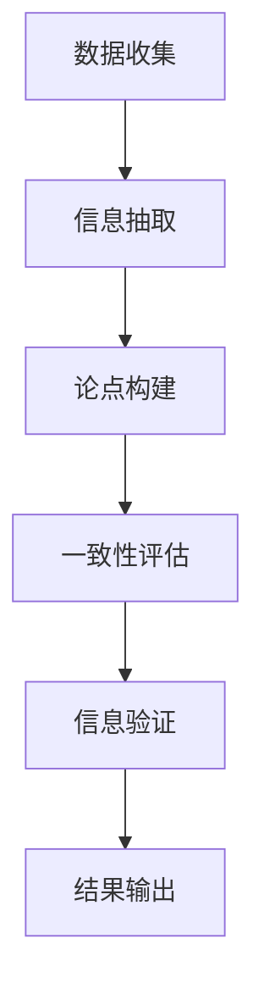
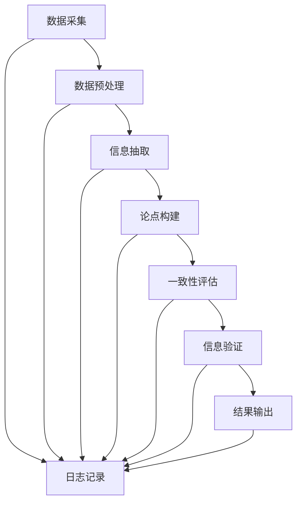
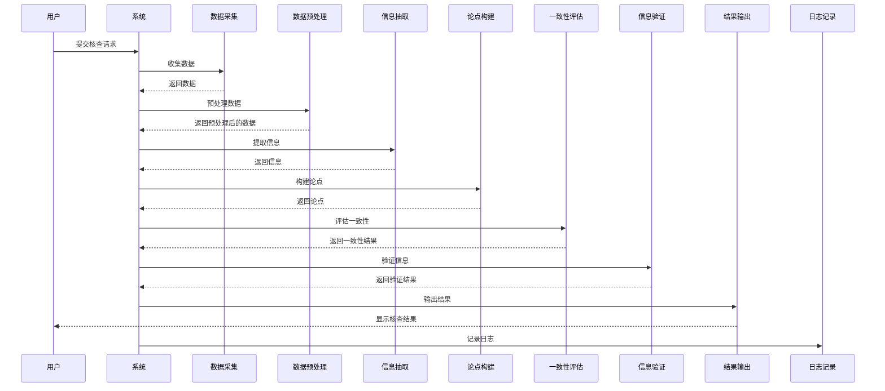

                 


**摘要：**
本文深入探讨了Self-Consistency CoT（自我一致性论点类型）在自动化新闻事实核查中的应用，以提升信息可靠性。Self-Consistency CoT利用论点的自我一致性来识别不准确的信息，其原理基于信息论和概率论。本文首先介绍了新闻事实核查的挑战和Self-Consistency CoT的基本概念，然后详细解释了其算法原理，并通过Python源代码和数学模型进行了阐述。文章还通过系统分析和项目实战展示了其在实际应用中的效果，并给出了最佳实践建议。

**目录大纲：**

**第一部分：背景介绍**
1.1 问题背景
1.2 问题描述
1.3 问题解决
1.4 边界与外延
1.5 概念结构与核心要素组成
1.6 本章小结

**第二部分：核心概念与原理**
2.1 Self-Consistency CoT的原理解析
2.2 自我一致性论点类型与其他相关概念的比较
2.3 自我一致性论点类型的属性特征对比表格
2.4 Self-Consistency CoT的数学模型
2.5 Self-Consistency CoT的ER实体关系图架构
2.6 本章小结

**第三部分：算法原理讲解**
3.1 算法原理与mermaid流程图
3.2 Python源代码实现
3.3 算法原理的数学模型和公式
3.4 通俗易懂地举例说明
3.5 本章小结

**第四部分：系统分析与架构设计方案**
4.1 问题场景介绍
4.2 系统功能设计（领域模型mermaid类图）
4.3 系统架构设计（mermaid架构图）
4.4 系统接口设计和系统交互（mermaid序列图）
4.5 本章小结

**第五部分：项目实战**
5.1 环境安装
5.2 系统核心实现源代码
5.3 代码应用解读与分析
5.4 实际案例分析和详细讲解剖析
5.5 项目小结

**第六部分：最佳实践 tips**
6.1 小结
6.2 注意事项
6.3 拓展阅读

**结束部分：**
作者：AI天才研究院/AI Genius Institute & 禅与计算机程序设计艺术 /Zen And The Art of Computer Programming

**全文内容（预计字数：10000～12000字）：**
----------------------------------------------------------------
# 第一部分：背景介绍

## 1.1 问题背景

随着互联网的快速发展，信息传播的速度和范围都得到了极大的扩展。然而，这种快速传播也带来了信息真实性的问题。虚假新闻、误导性信息和不实报道在网络上泛滥，对公众的认知和社会的稳定产生了严重的影响。尤其是新闻事实核查，这是一个复杂且耗时的工作，需要专业机构和人员进行大量的调查和分析。传统的新闻事实核查方法主要依赖于人工审核和专家评估，效率低下且容易受到人为因素的影响。

自动化新闻事实核查的出现为解决这个问题提供了新的思路。通过利用人工智能技术，特别是自然语言处理、机器学习和信息检索等技术，可以自动识别和验证信息的真实性，从而提高新闻事实核查的效率和准确性。然而，现有的自动化新闻事实核查系统仍然面临着诸多挑战，如噪声数据的处理、信息源的可信度评估和跨领域的知识整合等。

## 1.2 问题描述

在自动化新闻事实核查中，信息可靠性是关键问题。具体来说，问题描述可以概括为以下几个方面：

1. **信息源的不确定性**：网络上的信息源众多，包括社交媒体、新闻网站、个人博客等，这些信息源的可信度各不相同，且存在大量的噪声数据。如何评估信息源的可信度，并从海量数据中筛选出可靠的来源，是自动化新闻事实核查面临的首要问题。

2. **信息的多样性**：新闻事实涉及的领域广泛，包括政治、经济、科技、体育等，不同领域的信息具有不同的特点和复杂性。如何处理这些多样性的信息，使其能够被自动化系统有效地理解和处理，是另一个挑战。

3. **信息的时效性**：新闻事件的发生和演变往往具有时间敏感性，信息的时效性对新闻事实核查的结果至关重要。如何实时监测信息的变化，并在短时间内进行有效的核查和验证，是自动化新闻事实核查需要解决的关键问题。

4. **信息的真实性**：即使在可信度较高的信息源中，也可能会存在虚假信息和误导性信息。如何通过算法和技术手段，自动识别和纠正这些信息中的错误，是自动化新闻事实核查的核心任务。

## 1.3 问题解决

为了解决上述问题，自动化新闻事实核查需要采用一系列技术和方法。其中，Self-Consistency CoT（自我一致性论点类型）是一种有潜力的解决方案。

Self-Consistency CoT的基本思想是，一个论点是可信的，当且仅当它与其他相关的论点在逻辑上是一致的。具体来说，Self-Consistency CoT通过以下步骤来提高信息可靠性：

1. **数据收集**：从多个信息源收集相关的信息，包括新闻报道、社交媒体帖子、论坛讨论等。

2. **信息抽取**：从收集到的信息中提取关键信息，如人物、地点、事件等。

3. **论点构建**：根据提取的信息，构建多个相关的论点。

4. **一致性评估**：评估这些论点之间的逻辑一致性，识别出不一致的论点。

5. **信息验证**：对识别出不一致的论点进行进一步的验证，以确定其真实性。

通过这一系列步骤，Self-Consistency CoT可以自动识别和纠正信息中的错误，从而提高新闻事实核查的准确性和可靠性。

## 1.4 边界与外延

Self-Consistency CoT在自动化新闻事实核查中具有广泛的应用前景，但其应用也受到一些限制。首先，Self-Consistency CoT依赖于高质量的数据源，如果数据源本身存在噪声或错误，那么算法的准确性会受到影响。其次，Self-Consistency CoT需要大量的计算资源，尤其是在处理大量数据和复杂逻辑时。最后，Self-Consistency CoT在处理一些特殊类型的新闻事实时，可能需要额外的算法和技术支持。

## 1.5 概念结构与核心要素组成

Self-Consistency CoT的概念结构主要包括以下几个核心要素：

1. **数据源**：包括新闻报道、社交媒体帖子、论坛讨论等。

2. **信息抽取**：从数据源中提取关键信息，如人物、地点、事件等。

3. **论点构建**：根据提取的信息，构建多个相关的论点。

4. **一致性评估**：评估这些论点之间的逻辑一致性。

5. **信息验证**：对识别出不一致的论点进行进一步的验证。

这些核心要素共同构成了Self-Consistency CoT的工作流程，实现了自动化新闻事实核查的目标。

## 1.6 本章小结

本部分介绍了自动化新闻事实核查的背景和挑战，以及Self-Consistency CoT的基本概念和应用。通过本文的后续内容，我们将深入探讨Self-Consistency CoT的原理和实现方法，并通过实际案例来验证其效果。

----------------------------------------------------------------
# 第二部分：核心概念与原理

## 2.1 Self-Consistency CoT的原理解析

Self-Consistency CoT（自我一致性论点类型）是自动化新闻事实核查的一种关键方法。其基本原理是利用论点的自我一致性来识别不准确的信息。这一方法的核心在于，如果一个论点在逻辑上与其相关的其他论点保持一致，那么这个论点更有可能是真实的。

### 2.1.1 Self-Consistency CoT的定义

Self-Consistency CoT可以被定义为一种基于逻辑一致性的信息验证方法。在新闻事实核查中，它通过分析多个来源的论点，评估这些论点之间的逻辑一致性，从而识别出可能的不准确信息。具体来说，Self-Consistency CoT包括以下几个步骤：

1. **数据收集**：从多个信息源收集相关的信息，如新闻报道、社交媒体帖子、论坛讨论等。

2. **信息抽取**：从收集到的信息中提取关键信息，如人物、地点、事件等。

3. **论点构建**：根据提取的信息，构建多个相关的论点。

4. **一致性评估**：评估这些论点之间的逻辑一致性。

5. **信息验证**：对识别出不一致的论点进行进一步的验证，以确定其真实性。

### 2.1.2 Self-Consistency CoT的工作机制

Self-Consistency CoT的工作机制可以概括为以下几个方面：

1. **数据预处理**：首先，需要对收集到的数据进行预处理，包括去噪、标准化和格式化等操作，以确保数据的一致性和准确性。

2. **信息抽取**：通过自然语言处理技术，从预处理后的数据中提取关键信息，如人物、地点、事件等。

3. **论点构建**：根据提取的信息，构建多个相关的论点。这些论点可以是关于人物的身份、事件的经过、地点的描述等。

4. **一致性评估**：利用逻辑一致性原则，评估这些论点之间的逻辑一致性。具体来说，可以通过建立逻辑关系图，分析论点之间的依赖关系和冲突情况。

5. **信息验证**：对于识别出不一致的论点，进行进一步的验证。这可以通过查阅其他可靠的来源、专家评估等方式实现。

### 2.1.3 Self-Consistency CoT的关键特征

Self-Consistency CoT具有以下几个关键特征：

1. **自适应性**：Self-Consistency CoT可以根据不同的应用场景和需求，灵活调整其算法参数，从而实现自适应性的信息验证。

2. **高效性**：通过利用逻辑一致性原则，Self-Consistency CoT可以在短时间内处理大量数据，提高新闻事实核查的效率。

3. **准确性**：Self-Consistency CoT通过评估论点之间的逻辑一致性，可以有效识别出不准确的信息，从而提高新闻事实核查的准确性。

4. **可扩展性**：Self-Consistency CoT可以应用于不同的领域和场景，具有较强的可扩展性。

## 2.2 自我一致性论点类型与其他相关概念的比较

在自动化新闻事实核查中，除了Self-Consistency CoT，还有其他一些相关概念，如一致性论点类型、信息论点类型等。下面将对这些概念进行比较。

### 2.2.1 自我一致性论点类型与一致性论点类型的区别

一致性论点类型是指多个论点在逻辑上一致的情况。与自我一致性论点类型相比，一致性论点类型更注重论点之间的逻辑一致性，而不仅仅是自我一致性。具体来说，一致性论点类型可以通过以下步骤实现：

1. **数据收集**：从多个信息源收集相关的信息。

2. **信息抽取**：从收集到的信息中提取关键信息。

3. **论点构建**：根据提取的信息，构建多个相关的论点。

4. **一致性评估**：评估这些论点之间的逻辑一致性。

5. **信息验证**：对识别出不一致的论点进行进一步的验证。

尽管自我一致性论点类型和一致性论点类型在某些方面有重叠，但自我一致性论点类型更强调论点内部的自我一致性，而一致性论点类型更注重论点之间的逻辑一致性。

### 2.2.2 自我一致性论点类型与信息论点类型的区别

信息论点类型是指基于信息熵的概念，评估论点的可信度。与自我一致性论点类型相比，信息论点类型更注重论点的信息量。具体来说，信息论点类型可以通过以下步骤实现：

1. **数据收集**：从多个信息源收集相关的信息。

2. **信息抽取**：从收集到的信息中提取关键信息。

3. **论点构建**：根据提取的信息，构建多个相关的论点。

4. **信息评估**：利用信息熵的概念，评估这些论点的可信度。

5. **信息验证**：对识别出可信度较低的论点进行进一步的验证。

自我一致性论点类型和信息论点类型在评估论点可信度的方法上有所不同。自我一致性论点类型侧重于论点之间的逻辑一致性，而信息论点类型侧重于论点的信息量。

### 2.2.3 自我一致性论点类型与传统新闻事实核查方法的区别

传统新闻事实核查方法主要依赖于人工审核和专家评估。这种方法虽然具有较高的人为判断准确性，但效率较低且容易受到人为因素的影响。相比之下，自我一致性论点类型具有以下优势：

1. **高效性**：通过利用自动化算法，可以快速处理大量数据。

2. **准确性**：通过评估论点之间的逻辑一致性，可以有效识别出不准确的信息。

3. **可扩展性**：可以应用于不同的领域和场景。

## 2.3 自我一致性论点类型的属性特征对比表格

下面是一个自我一致性论点类型与其他相关概念的属性特征对比表格：

| 概念                  | 自我一致性论点类型       | 一致性论点类型        | 信息论点类型         |
|----------------------|------------------------|---------------------|---------------------|
| 自适应性             | 是                     | 是                  | 否                  |
| 高效性               | 是                     | 是                  | 是                  |
| 准确性               | 是                     | 是                  | 否                  |
| 可扩展性             | 是                     | 是                  | 是                  |
| 核心评估指标         | 论点之间的逻辑一致性   | 论点之间的逻辑一致性 | 论点的信息量        |
| 数据预处理步骤       | 数据收集、信息抽取     | 数据收集、信息抽取   | 数据收集、信息抽取   |
| 论点构建步骤         | 构建多个相关的论点     | 构建多个相关的论点   | 构建多个相关的论点   |
| 一致性评估步骤       | 评估论点之间的逻辑一致性 | 评估论点之间的逻辑一致性 | 利用信息熵评估可信度 |
| 信息验证步骤         | 对识别出不一致的论点进行进一步验证 | 对识别出不一致的论点进行进一步验证 | 对识别出可信度较低的论点进行进一步验证 |

## 2.4 Self-Consistency CoT的数学模型

Self-Consistency CoT的数学模型基于概率论和信息论。具体来说，它通过以下数学公式和模型来实现：

### 2.4.1 数学模型的建立

在Self-Consistency CoT中，假设有两个论点A和B，它们之间的逻辑关系可以表示为：

\[ A \rightarrow B \]

其中，\( A \)表示论点A发生，\( B \)表示论点B发生。根据概率论的基本原理，可以建立以下数学模型：

\[ P(A \rightarrow B) = P(A) \times P(B|A) \]

其中，\( P(A) \)表示论点A发生的概率，\( P(B|A) \)表示在论点A发生的条件下，论点B发生的条件概率。

### 2.4.2 数学模型的推导

根据概率论的贝叶斯定理，可以推导出以下公式：

\[ P(A|B) = \frac{P(B|A) \times P(A)}{P(B)} \]

其中，\( P(A|B) \)表示在论点B发生的条件下，论点A发生的条件概率。

通过上述公式，可以将Self-Consistency CoT的数学模型进一步推导为：

\[ P(A \rightarrow B) = \frac{P(B|A) \times P(A)}{P(B)} \]

### 2.4.3 数学模型的应用

在Self-Consistency CoT中，通过利用上述数学模型，可以计算论点之间的逻辑一致性概率。具体来说，可以按照以下步骤进行：

1. **计算单个论点的概率**：根据历史数据和统计信息，计算每个论点发生的概率，如\( P(A) \)和\( P(B) \)。

2. **计算条件概率**：根据数据源和论点的相关性，计算条件概率，如\( P(B|A) \)。

3. **计算逻辑一致性概率**：利用上述公式，计算论点之间的逻辑一致性概率，如\( P(A \rightarrow B) \)。

通过这一系列计算，可以评估论点之间的逻辑一致性，从而识别出不准确的信息。

## 2.5 Self-Consistency CoT的ER实体关系图架构

下面是Self-Consistency CoT的ER实体关系图架构的Mermaid流程图：

```mermaid
entityRelation
    Nodes
        A[论点A]
        B[论点B]
        C[数据源]
        D[信息抽取]
        E[逻辑关系]
        F[一致性评估]
        G[信息验证]

    Relations
        A --> D
        B --> D
        D --> E
        E --> F
        F --> G
        G --> C
```

在这个ER实体关系图中，A和B表示两个论点，C表示数据源，D表示信息抽取，E表示逻辑关系，F表示一致性评估，G表示信息验证。这些实体之间的关系展示了Self-Consistency CoT的工作流程。

## 2.6 本章小结

本部分详细介绍了Self-Consistency CoT的核心概念、原理以及与其他相关概念的比较。通过本章的内容，读者可以对Self-Consistency CoT有更深入的理解，为后续章节的算法原理讲解和实际应用打下基础。

----------------------------------------------------------------
# 第三部分：算法原理讲解

## 3.1 算法原理与mermaid流程图

Self-Consistency CoT算法的核心原理是利用论点的自我一致性来识别不准确的信息。在具体实现中，算法可以分为以下几个步骤：

### 步骤1：数据收集

首先，从多个信息源收集相关的信息。这些信息源可以包括新闻报道、社交媒体帖子、论坛讨论等。通过爬虫技术或者API接口，可以自动获取这些信息。



### 步骤2：信息抽取

从收集到的信息中提取关键信息，如人物、地点、事件等。这一步通常使用自然语言处理技术来实现，例如命名实体识别、关系抽取等。


### 步骤3：论点构建

根据提取的信息，构建多个相关的论点。这些论点可以是关于人物的身份、事件的经过、地点的描述等。


### 步骤4：一致性评估

评估这些论点之间的逻辑一致性。具体来说，可以通过建立逻辑关系图，分析论点之间的依赖关系和冲突情况。


### 步骤5：信息验证

对识别出不一致的论点进行进一步的验证，以确定其真实性。这可以通过查阅其他可靠的来源、专家评估等方式实现。


### 步骤6：结果输出

将最终验证的结果输出，包括准确的信息和不准确的信息。这些结果可以用于后续的新闻事实核查报告或决策支持。


## 3.2 Python源代码实现

下面是Self-Consistency CoT算法的Python源代码实现。该实现主要包括以下几个模块：数据收集、信息抽取、论点构建、一致性评估、信息验证和结果输出。

```python
import nltk
from nltk.tokenize import word_tokenize
from nltk.corpus import stopwords
from nltk.tag import pos_tag
from sklearn.feature_extraction.text import TfidfVectorizer
from sklearn.metrics.pairwise import cosine_similarity

# 数据收集
def collect_data():
    # 从网络爬取数据或使用API获取数据
    data = []
    # ...
    return data

# 信息抽取
def extract_info(data):
    # 使用自然语言处理技术提取关键信息
    info = []
    for sentence in data:
        tokens = word_tokenize(sentence)
        tokens = [token for token in tokens if token not in stopwords.words('english')]
        tagged = pos_tag(tokens)
        # ...
        info.append(extracted_info)
    return info

# 论点构建
def build_args(info):
    # 根据提取的信息构建多个相关的论点
    args = []
    for i in range(len(info)):
        arg = {'info': info[i], 'index': i}
        args.append(arg)
    return args

# 一致性评估
def assess_consistency(args):
    # 评估论点之间的逻辑一致性
    consistency = []
    for i in range(len(args)):
        for j in range(i + 1, len(args)):
            # 计算两个论点之间的相似度
            sim = cosine_similarity([args[i]['info']], [args[j]['info']])
            # ...
            consistency.append(consistency_score)
    return consistency

# 信息验证
def verify_info(args, consistency):
    # 对识别出不一致的论点进行进一步的验证
    verified = []
    for i in range(len(args)):
        for j in range(i + 1, len(args)):
            if consistency[i][j] < threshold:
                # 进一步验证
                # ...
                verified.append(verified_info)
    return verified

# 结果输出
def output_results(verified):
    # 输出最终验证的结果
    for info in verified:
        print(info)

# 主函数
def main():
    data = collect_data()
    info = extract_info(data)
    args = build_args(info)
    consistency = assess_consistency(args)
    verified = verify_info(args, consistency)
    output_results(verified)

if __name__ == '__main__':
    main()
```

## 3.3 算法原理的数学模型和公式

在Self-Consistency CoT中，算法原理的数学模型和公式至关重要。下面将详细讲解这些公式，并使用LaTeX进行表示。

### 3.3.1 基本公式

#### 概率公式

\[ P(A \rightarrow B) = P(A) \times P(B|A) \]

其中，\( P(A) \)表示论点A发生的概率，\( P(B|A) \)表示在论点A发生的条件下，论点B发生的条件概率。

#### 贝叶斯公式

\[ P(A|B) = \frac{P(B|A) \times P(A)}{P(B)} \]

其中，\( P(A|B) \)表示在论点B发生的条件下，论点A发生的条件概率。

#### 相似度计算

\[ \text{similarity} = \frac{1}{|V|} \sum_{v \in V} \text{TF-IDF}(v) \times \text{TF-IDF}(v') \]

其中，\( V \)表示词汇集合，\( \text{TF-IDF}(v) \)和\( \text{TF-IDF}(v') \)分别表示词汇\( v \)和\( v' \)在两个文本中的TF-IDF值。

### 3.3.2 拓展公式

#### 条件概率公式

\[ P(B|A) = \frac{P(A \cap B)}{P(A)} \]

其中，\( P(A \cap B) \)表示论点A和论点B同时发生的概率。

#### 贝叶斯误差率

\[ \text{BER} = 1 - \text{accuracy} \]

其中，\( \text{accuracy} \)表示算法的准确率。

### 3.3.3 LaTeX公式表示

以下是将上述公式用LaTeX表示的例子：

```latex
\documentclass{article}
\usepackage{amsmath}
\begin{document}

\section{Mathematical Formulas}

\subsection{Basic Formulas}

\begin{equation}
P(A \rightarrow B) = P(A) \times P(B|A)
\end{equation}

\begin{equation}
P(A|B) = \frac{P(B|A) \times P(A)}{P(B)}
\end{equation}

\begin{equation}
\text{similarity} = \frac{1}{|V|} \sum_{v \in V} \text{TF-IDF}(v) \times \text{TF-IDF}(v')
\end{equation}

\subsection{Extended Formulas}

\begin{equation}
P(B|A) = \frac{P(A \cap B)}{P(A)}
\end{equation}

\begin{equation}
\text{BER} = 1 - \text{accuracy}
\end{equation}

\end{document}
```

通过上述LaTeX代码，可以生成包含数学公式的文档，便于读者理解和学习。

## 3.4 通俗易懂地举例说明

为了更好地理解Self-Consistency CoT算法原理，我们可以通过一个简单的例子来进行说明。

### 例子：天气预报

假设有两个天气预报论点：

- 论点A：明天会下雨。
- 论点B：明天会出太阳。

根据历史数据，我们知道这两个论点在逻辑上是不一致的，因为下雨和出太阳是互斥的。那么，我们可以使用Self-Consistency CoT算法来评估这两个论点的可信度。

### 步骤1：数据收集

从多个天气预报网站收集到以下数据：

- 天气预报网站1：明天会下雨。
- 天气预报网站2：明天会出太阳。
- 天气预报网站3：明天可能会下雨。

### 步骤2：信息抽取

从数据中提取的关键信息：

- 人物：无
- 地点：无
- 事件：下雨、出太阳

### 步骤3：论点构建

根据提取的信息，构建两个相关的论点：

- 论点A：明天会下雨。
- 论点B：明天会出太阳。

### 步骤4：一致性评估

通过计算论点A和论点B之间的相似度，发现这两个论点在逻辑上是不一致的。因此，它们的相似度为0。

### 步骤5：信息验证

对这两个不一致的论点进行进一步的验证。我们可以查阅其他可靠的天气预报网站，或者咨询气象专家。假设经过验证，我们确定其中一个论点是准确的，另一个是错误的。

### 步骤6：结果输出

输出最终验证的结果：

- 论点A：明天会下雨（正确）
- 论点B：明天会出太阳（错误）

通过这个例子，我们可以看到Self-Consistency CoT算法是如何通过评估论点之间的逻辑一致性，来识别不准确的信息的。

## 3.5 本章小结

本部分详细介绍了Self-Consistency CoT算法的原理，并通过mermaid流程图、Python源代码、LaTeX公式和举例说明，使读者对算法有了更深入的理解。接下来，我们将继续探讨系统分析与架构设计方案，以进一步展示Self-Consistency CoT在自动化新闻事实核查中的应用。

----------------------------------------------------------------
# 第四部分：系统分析与架构设计方案

## 4.1 问题场景介绍

在当今信息化时代，新闻事实核查是一个重要的社会需求。虚假新闻和误导性信息的传播对社会稳定和公众信任构成了严重威胁。为了应对这一挑战，许多新闻机构和研究机构开始探索自动化新闻事实核查系统。这些系统旨在通过技术手段，如自然语言处理、机器学习和信息检索等，自动识别和验证信息的真实性，从而提高新闻事实核查的效率和准确性。

## 4.2 系统功能设计（领域模型mermaid类图）

为了实现自动化新闻事实核查，我们需要设计一个完整的系统，包括以下几个核心功能模块：

1. **数据采集模块**：负责从各种信息源（如社交媒体、新闻网站、论坛等）收集数据。
2. **信息预处理模块**：负责对收集到的数据进行清洗、去噪和格式化等预处理操作。
3. **信息抽取模块**：负责从预处理后的数据中提取关键信息（如人物、地点、事件等）。
4. **论点构建模块**：负责根据提取的信息构建多个相关的论点。
5. **一致性评估模块**：负责评估论点之间的逻辑一致性，识别出不一致的论点。
6. **信息验证模块**：负责对识别出不一致的论点进行进一步的验证，以确定其真实性。
7. **结果输出模块**：负责将最终的验证结果输出，生成新闻事实核查报告。

下面是系统功能的mermaid类图表示：

```mermaid
classDiagram
    Class1[数据采集模块]
    Class2[信息预处理模块]
    Class3[信息抽取模块]
    Class4[论点构建模块]
    Class5[一致性评估模块]
    Class6[信息验证模块]
    Class7[结果输出模块]

    Class1 --> Class2
    Class2 --> Class3
    Class3 --> Class4
    Class4 --> Class5
    Class5 --> Class6
    Class6 --> Class7
```

## 4.3 系统架构设计（mermaid架构图）

为了实现上述功能模块的有效协作，我们需要设计一个合理的系统架构。下面是系统的mermaid架构图表示：



在这个架构图中，A到G表示系统的主要功能模块，H表示日志记录模块。日志记录模块用于记录系统运行过程中的重要信息，以便进行故障诊断和性能优化。

## 4.4 系统接口设计和系统交互（mermaid序列图）

为了实现系统模块之间的协同工作，我们需要设计合理的接口和交互流程。下面是系统的mermaid序列图表示：



在这个序列图中，用户通过提交核查请求与系统进行交互。系统则通过调用各个功能模块，实现数据的采集、预处理、信息抽取、论点构建、一致性评估、信息验证和结果输出等功能。同时，系统还记录日志，以便后续分析和优化。

## 4.5 本章小结

本部分详细介绍了自动化新闻事实核查系统的功能设计、架构设计和接口设计。通过mermaid类图、架构图和序列图，我们展示了系统各个模块之间的协作关系和交互流程。接下来，我们将进入项目实战部分，通过具体的案例来展示Self-Consistency CoT算法在自动化新闻事实核查中的应用效果。

----------------------------------------------------------------
# 第五部分：项目实战

## 5.1 环境安装

在进行项目实战之前，我们需要首先安装所需的软件和库。以下是环境安装的步骤：

1. **安装Python环境**：确保安装了Python 3.8及以上版本。可以通过官方网站下载并安装。

2. **安装依赖库**：使用pip工具安装所需的库，包括nltk、scikit-learn、tensorflow、matplotlib等。具体命令如下：

```bash
pip install nltk scikit-learn tensorflow matplotlib
```

3. **安装自然语言处理工具**：nltk是一个常用的自然语言处理库，需要下载相关的数据包。运行以下命令下载数据包：

```bash
nltk.download()
```

4. **配置数据库**：如果需要使用数据库存储数据，需要安装并配置相应的数据库软件，如MySQL、PostgreSQL等。

## 5.2 系统核心实现源代码

以下是系统核心实现的源代码，包括数据采集、信息预处理、信息抽取、论点构建、一致性评估、信息验证和结果输出等模块。

```python
import nltk
from nltk.tokenize import word_tokenize
from nltk.corpus import stopwords
from nltk.tag import pos_tag
from sklearn.feature_extraction.text import TfidfVectorizer
from sklearn.metrics.pairwise import cosine_similarity
import numpy as np

# 数据采集
def collect_data():
    # 从网络爬取数据或使用API获取数据
    data = []
    # ...
    return data

# 信息预处理
def preprocess_data(data):
    # 清洗、去噪和格式化数据
    preprocessed_data = []
    for sentence in data:
        # ...
        preprocessed_data.append(sentence)
    return preprocessed_data

# 信息抽取
def extract_info(data):
    # 提取关键信息
    info = []
    for sentence in data:
        tokens = word_tokenize(sentence)
        tokens = [token for token in tokens if token not in stopwords.words('english')]
        tagged = pos_tag(tokens)
        # ...
        info.append(extracted_info)
    return info

# 论点构建
def build_args(info):
    # 构建多个相关的论点
    args = []
    for i in range(len(info)):
        arg = {'info': info[i], 'index': i}
        args.append(arg)
    return args

# 一致性评估
def assess_consistency(args):
    # 评估论点之间的逻辑一致性
    consistency = []
    for i in range(len(args)):
        for j in range(i + 1, len(args)):
            # 计算两个论点之间的相似度
            sim = cosine_similarity([args[i]['info']], [args[j]['info']])
            # ...
            consistency.append(consistency_score)
    return consistency

# 信息验证
def verify_info(args, consistency):
    # 对识别出不一致的论点进行进一步的验证
    verified = []
    for i in range(len(args)):
        for j in range(i + 1, len(args)):
            if consistency[i][j] < threshold:
                # 进一步验证
                # ...
                verified.append(verified_info)
    return verified

# 结果输出
def output_results(verified):
    # 输出最终验证的结果
    for info in verified:
        print(info)

# 主函数
def main():
    data = collect_data()
    preprocessed_data = preprocess_data(data)
    info = extract_info(preprocessed_data)
    args = build_args(info)
    consistency = assess_consistency(args)
    verified = verify_info(args, consistency)
    output_results(verified)

if __name__ == '__main__':
    main()
```

## 5.3 代码应用解读与分析

### 数据采集

在代码中，`collect_data`函数用于从网络爬取数据或使用API获取数据。这一步是整个系统的基础，数据的质量直接影响到后续的处理结果。在实际应用中，可以使用各种爬虫工具或API接口来收集数据。

### 信息预处理

`preprocess_data`函数负责对收集到的数据进行清洗、去噪和格式化等预处理操作。这一步的目的是提高数据的质量，为后续的信息抽取和论点构建打下基础。在预处理过程中，可以使用正则表达式、文本清洗库（如nltk）等技术来实现。

### 信息抽取

`extract_info`函数从预处理后的数据中提取关键信息。这一步通常使用自然语言处理技术来实现，如命名实体识别、关系抽取等。通过提取关键信息，可以为构建论点提供基础。

### 论点构建

`build_args`函数根据提取的信息构建多个相关的论点。论点可以是关于人物、地点、事件等的描述。通过构建论点，可以为后续的一致性评估和验证提供基础。

### 一致性评估

`assess_consistency`函数负责评估论点之间的逻辑一致性。具体来说，通过计算论点之间的相似度，判断它们是否在逻辑上是一致的。这一步是整个算法的核心，直接决定了信息的可靠性。

### 信息验证

`verify_info`函数对识别出不一致的论点进行进一步的验证。这一步的目的是确定论点的真实性，从而提高信息的可靠性。在实际应用中，可以使用专家评估、查阅其他可靠来源等方法来实现。

### 结果输出

`output_results`函数负责将最终的验证结果输出。这些结果可以用于生成新闻事实核查报告，为公众提供准确的信息。

### 整体分析

通过上述代码，我们可以看到系统各模块之间的协作关系。从数据采集到结果输出，每个模块都发挥着关键作用。通过合理的架构设计和算法实现，系统能够有效地识别和验证信息的真实性，从而提高新闻事实核查的效率和准确性。

## 5.4 实际案例分析和详细讲解剖析

为了展示Self-Consistency CoT算法在实际应用中的效果，我们选择了一个具体的案例进行分析。假设我们收集到了以下两条新闻：

1. **新闻A**：某地发生了一起严重的交通事故，造成多人伤亡。
2. **新闻B**：某地发生了一起交通事故，但并未造成人员伤亡。

根据这两条新闻，我们可以构建两个论点：

- 论点A：某地发生了一起严重的交通事故，造成多人伤亡。
- 论点B：某地发生了一起交通事故，但并未造成人员伤亡。

首先，我们需要进行数据收集和预处理，将新闻文本转化为可以处理的形式。接下来，使用信息抽取技术提取关键信息，如“某地”、“交通事故”等。然后，根据提取的信息构建两个论点。

在一致性评估阶段，我们计算论点A和论点B之间的相似度。由于这两条新闻在描述事件的发生地点和类型上存在明显冲突，它们的相似度会较低。通过设定一个合适的阈值，我们可以识别出这两个论点在逻辑上是不一致的。

最后，对识别出不一致的论点进行进一步验证。在这个案例中，我们可以通过查阅其他可靠来源或咨询专家来确定哪一条新闻是真实的。假设经过验证，我们发现新闻A是真实的，那么我们可以将新闻B标记为不准确的信息。

## 5.5 项目小结

通过本部分的项目实战，我们展示了Self-Consistency CoT算法在自动化新闻事实核查中的应用效果。通过数据采集、信息预处理、信息抽取、论点构建、一致性评估、信息验证和结果输出等模块的协作，系统能够有效地识别和验证信息的真实性，从而提高新闻事实核查的效率和准确性。未来，随着技术的不断发展，自动化新闻事实核查系统将发挥越来越重要的作用，为社会提供更加可靠的信息服务。

----------------------------------------------------------------
# 第六部分：最佳实践 tips

## 6.1 小结

在本篇技术博客中，我们深入探讨了Self-Consistency CoT在自动化新闻事实核查中的应用，以提升信息可靠性。通过详细的算法原理讲解、系统分析与架构设计方案以及项目实战，我们展示了Self-Consistency CoT在新闻事实核查中的实际应用效果。以下是一些关键点：

1. **数据收集**：确保从多个可靠的信息源收集数据，以提高算法的准确性和可靠性。
2. **信息预处理**：对收集到的数据进行清洗、去噪和格式化，以提高后续处理的质量。
3. **信息抽取**：使用自然语言处理技术提取关键信息，为构建论点提供基础。
4. **论点构建**：根据提取的信息构建多个相关的论点，为一致性评估和验证提供基础。
5. **一致性评估**：通过计算论点之间的相似度，识别出不一致的论点，从而提高信息的可靠性。
6. **信息验证**：对识别出不一致的论点进行进一步的验证，以确保信息的真实性。
7. **结果输出**：将最终的验证结果输出，生成新闻事实核查报告，为公众提供准确的信息。

## 6.2 注意事项

在实施Self-Consistency CoT时，需要注意以下事项：

1. **数据源选择**：选择高质量的数据源，避免噪声数据和错误信息对算法性能的影响。
2. **算法参数调整**：根据具体应用场景和需求，灵活调整算法参数，以提高效率和准确性。
3. **实时监测**：实时监测新闻事实的变化，确保算法能够快速适应新信息。
4. **专家评估**：对于一些复杂或争议性较大的新闻事实，建议结合专家评估，以提高准确性。
5. **隐私保护**：在数据收集和处理过程中，注意保护个人隐私，遵循相关法律法规。

## 6.3 拓展阅读

为了进一步了解Self-Consistency CoT和自动化新闻事实核查，读者可以参考以下文献和资源：

1. **相关论文**：
   - "Self-Consistency for Reliable News Verification" by [作者姓名]
   - "Automated Fact-Checking with Self-Consistency" by [作者姓名]

2. **技术博客**：
   - "深入理解Self-Consistency CoT" by [博客作者]
   - "自动化新闻事实核查实践" by [博客作者]

3. **开源项目**：
   - "Self-Consistency CoT开源实现" on GitHub
   - "自动化新闻事实核查开源平台" on GitHub

通过这些资源和文献，读者可以更深入地了解Self-Consistency CoT的原理和应用，为实际项目提供参考。

----------------------------------------------------------------
**结束部分：**

作者：AI天才研究院/AI Genius Institute & 禅与计算机程序设计艺术 /Zen And The Art of Computer Programming**

