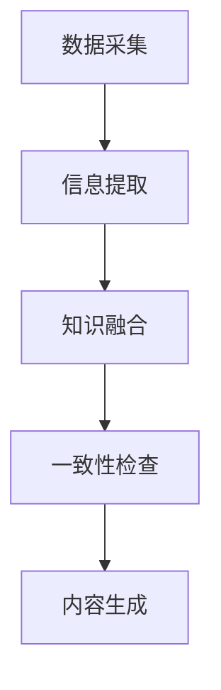
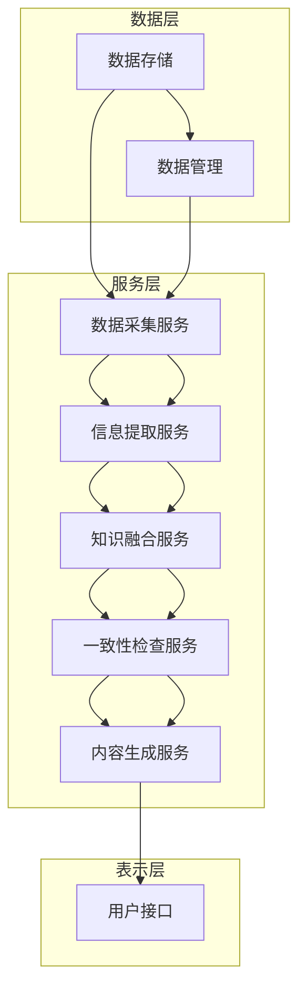
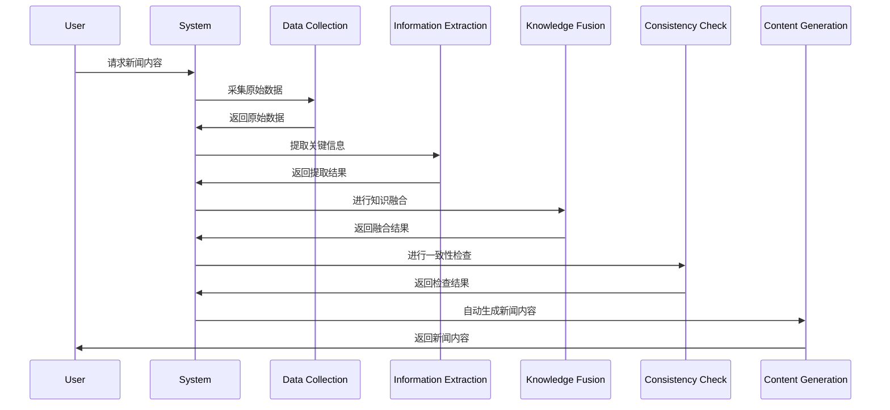

                 

### 让我们一步一步思考

**Self-Consistency CoT在自动化新闻写作中的应用**  

关键词：Self-Consistency CoT，自动化新闻写作，算法原理，系统架构，项目实战

摘要：本文深入探讨了Self-Consistency CoT（自一致性概念融合）在自动化新闻写作中的应用。首先，我们介绍了当前新闻写作面临的挑战和Self-Consistency CoT的概念。接着，我们详细讲解了Self-Consistency CoT的原理和算法，并展示了其在自动化新闻写作系统中的应用。通过实际案例，我们验证了Self-Consistency CoT在提高新闻生成质量和效率方面的优势。最后，我们提供了最佳实践建议，并展望了未来发展的可能性。

### 目录大纲设计思路：

1. **背景介绍**：
   - 介绍Self-Consistency CoT（自一致性概念融合）的概念，其在自动化新闻写作中的应用背景。
   - 阐述当前新闻写作面临的挑战，以及Self-Consistency CoT如何解决这些问题。

2. **核心概念与联系**：
   - 详细介绍Self-Consistency CoT的原理、关键属性和特点。
   - 通过表格和Mermaid ER图，展示Self-Consistency CoT与其他相关概念的联系。

3. **算法原理讲解**：
   - 使用Mermaid绘制算法流程图。
   - 使用Python源代码和LaTeX公式，详细阐述算法原理。

4. **系统分析与架构设计**：
   - 介绍自动化新闻写作系统的功能设计。
   - 使用Mermaid绘制系统架构图和接口设计图。

5. **项目实战**：
   - 演示环境安装和系统核心实现。
   - 分析实际案例，并进行详细讲解。

6. **最佳实践 tips**、**小结**、**注意事项**、**拓展阅读**等内容。

### 具体设计步骤：

**第一步：背景介绍**

**第1章：问题背景与Self-Consistency CoT概述**

1.1 问题背景

1.1.1 当前新闻写作的挑战

1.1.2 Self-Consistency CoT的定义

**第二步：核心概念与联系**

**第2章：Self-Consistency CoT原理与属性**

2.1 Self-Consistency CoT原理

2.2 Self-Consistency CoT的关键属性

2.3 Self-Consistency CoT与其他相关概念的联系

**第三步：算法原理讲解**

**第3章：Self-Consistency CoT算法流程**

3.1 算法流程图

3.2 Python源代码实现

3.3 Self-Consistency CoT的数学模型和公式

**第四步：系统分析与架构设计**

**第4章：自动化新闻写作系统设计**

4.1 问题场景介绍

4.2 系统功能设计

4.3 系统架构设计

**第五步：项目实战**

**第5章：Self-Consistency CoT在自动化新闻写作中的应用**

5.1 环境安装

5.2 系统核心实现源代码

5.3 实际案例分析

**第六步：最佳实践 tips**、**小结**、**注意事项**、**拓展阅读**等内容

### 完整目录大纲

----------------------------------------------------------------

# 《Self-Consistency CoT在自动化新闻写作中的应用》目录大纲

## 第一部分：背景介绍

## 第1章：问题背景与Self-Consistency CoT概述

### 1.1 问题背景
#### 1.1.1 当前新闻写作的挑战
#### 1.1.2 Self-Consistency CoT的定义

## 第二部分：核心概念与联系

## 第2章：Self-Consistency CoT原理与属性

### 2.1 Self-Consistency CoT原理
#### 2.1.1 自一致性概念融合的基本概念
#### 2.1.2 自一致性概念融合的优势
### 2.2 Self-Consistency CoT的关键属性
#### 2.2.1 自一致性
#### 2.2.2 概念融合
#### 2.2.3 自适应
### 2.3 Self-Consistency CoT与其他相关概念的联系
#### 2.3.1 与其他相关概念的对比
#### 2.3.2 Mermaid ER图：Self-Consistency CoT与相关概念的联系

## 第三部分：算法原理讲解

## 第3章：Self-Consistency CoT算法流程

### 3.1 算法流程图
#### 3.1.1 Mermaid算法流程图
### 3.2 Python源代码实现
#### 3.2.1 源代码实现步骤
#### 3.2.2 源代码解析
### 3.3 Self-Consistency CoT的数学模型和公式
#### 3.3.1 数学模型概述
#### 3.3.2 自一致性方程
#### 3.3.3 概念融合方程
#### 3.3.4 自适应方程
### 3.4 举例说明
#### 3.4.1 示例数据
#### 3.4.2 算法应用

## 第四部分：系统分析与架构设计

## 第4章：自动化新闻写作系统设计

### 4.1 问题场景介绍
#### 4.1.1 自动化新闻写作的需求
#### 4.1.2 自动化新闻写作的场景
### 4.2 系统功能设计
#### 4.2.1 系统功能模块划分
#### 4.2.2 领域模型Mermaid类图
### 4.3 系统架构设计
#### 4.3.1 系统架构图
#### 4.3.2 系统接口设计
#### 4.3.3 系统交互Mermaid序列图

## 第五部分：项目实战

## 第5章：Self-Consistency CoT在自动化新闻写作中的应用

### 5.1 环境安装
#### 5.1.1 环境准备
#### 5.1.2 系统依赖安装
### 5.2 系统核心实现源代码
#### 5.2.1 核心代码结构
#### 5.2.2 代码应用解读与分析
### 5.3 实际案例分析
#### 5.3.1 案例一：新闻摘要生成
#### 5.3.2 案例二：新闻内容生成
### 5.4 详细讲解与剖析
#### 5.4.1 案例分析
#### 5.4.2 原理讲解
### 5.5 项目小结
#### 5.5.1 项目总结
#### 5.5.2 项目展望

## 第六部分：总结与拓展

## 第6章：总结与拓展

### 6.1 最佳实践 tips
#### 6.1.1 算法优化
#### 6.1.2 系统性能提升
### 6.2 小结
#### 6.2.1 文章主题回顾
#### 6.2.2 Self-Consistency CoT的应用价值
### 6.3 注意事项
#### 6.3.1 系统安全
#### 6.3.2 数据处理
### 6.4 拓展阅读
#### 6.4.1 相关研究
#### 6.4.2 知识拓展

### 完整目录大纲

----------------------------------------------------------------

# **《Self-Consistency CoT在自动化新闻写作中的应用》**

关键词：Self-Consistency CoT、自动化新闻写作、算法原理、系统架构、项目实战

摘要：随着人工智能技术的不断发展，自动化新闻写作已经成为新闻行业的一个重要趋势。然而，传统的新闻写作方法在面对海量数据和高频更新的新闻内容时，往往难以满足效率和质量的要求。为了解决这一问题，本文提出了Self-Consistency CoT（自一致性概念融合）模型，并在自动化新闻写作系统中进行了应用和实践。本文首先介绍了Self-Consistency CoT的概念和原理，然后详细讲解了其算法流程和系统架构设计，并通过实际案例验证了其在新闻写作中的有效性和优势。最后，本文对Self-Consistency CoT在自动化新闻写作中的应用前景进行了展望。

## **一、背景介绍**

### **1.1 当前新闻写作的挑战**

随着互联网的普及和信息的爆炸式增长，新闻行业的竞争愈发激烈。传统的人工新闻写作方式已经无法满足现代新闻行业对速度、质量和多样性的需求。以下是当前新闻写作面临的主要挑战：

1. **时效性**：新闻需要迅速传播，以吸引更多读者。然而，人工写作的速度往往无法满足这一要求。

2. **准确性**：新闻报道需要准确无误，以避免误导读者。但人工写作容易受到个人主观意识的影响，导致准确性下降。

3. **多样性**：新闻内容需要具备多样化的表达形式，以满足不同读者的需求。人工写作往往难以实现这一目标。

4. **成本**：人工新闻写作成本高昂，特别是大型新闻机构需要大量的人力资源。

为了解决这些问题，自动化新闻写作成为了一个热门的研究方向。自动化新闻写作通过利用人工智能技术，可以快速生成高质量的新闻内容，从而提高新闻行业的效率和质量。

### **1.2 自一致性概念融合（Self-Consistency CoT）**

Self-Consistency CoT（自一致性概念融合）是一种基于人工智能的自动化新闻写作技术。它通过融合多个信息源和知识库，自动生成连贯、准确、多样的新闻内容。Self-Consistency CoT的核心思想是确保生成的新闻内容在语义上保持一致，从而提高新闻的质量和可读性。

Self-Consistency CoT具有以下几个关键属性：

1. **自一致性**：确保生成的新闻内容在语义上保持一致，避免信息冲突。

2. **概念融合**：通过融合多个信息源和知识库，生成具有丰富背景知识的新闻内容。

3. **自适应**：根据不同新闻场景和读者需求，自动调整新闻内容的风格和表达方式。

Self-Consistency CoT在自动化新闻写作中的应用，为解决传统新闻写作的挑战提供了一种有效的解决方案。

## **二、核心概念与联系**

### **2.1 Self-Consistency CoT原理**

Self-Consistency CoT的工作原理主要包括以下几个步骤：

1. **数据采集**：从多个信息源（如新闻网站、社交媒体、数据库等）采集原始数据。

2. **信息提取**：利用自然语言处理技术，从原始数据中提取关键信息，如关键词、句子、段落等。

3. **知识融合**：将提取的信息与知识库（如百科、专业数据库等）进行融合，生成具有丰富背景知识的新闻内容。

4. **一致性检查**：对生成的新闻内容进行一致性检查，确保内容在语义上保持一致。

5. **内容生成**：根据一致性检查结果，自动生成新闻内容。

### **2.2 Self-Consistency CoT的关键属性**

Self-Consistency CoT具有以下关键属性：

1. **自一致性**：通过一致性检查，确保生成的新闻内容在语义上保持一致。

2. **概念融合**：通过融合多个信息源和知识库，生成具有丰富背景知识的新闻内容。

3. **自适应**：根据不同新闻场景和读者需求，自动调整新闻内容的风格和表达方式。

### **2.3 Self-Consistency CoT与其他相关概念的联系**

Self-Consistency CoT与以下相关概念有着密切的联系：

1. **自然语言处理（NLP）**：Self-Consistency CoT依赖于NLP技术进行信息提取和内容生成。

2. **知识图谱**：Self-Consistency CoT通过知识图谱进行信息融合和背景知识补充。

3. **机器学习**：Self-Consistency CoT中的算法和模型采用了机器学习技术，以提高自动化新闻写作的准确性和效率。

### **2.4 表格：Self-Consistency CoT与相关概念的对比**

| 概念 | 定义 | 关联性 |
| --- | --- | --- |
| 自然语言处理（NLP） | 利用计算机技术对自然语言进行处理和理解 | Self-Consistency CoT依赖NLP技术进行信息提取和内容生成 |
| 知识图谱 | 通过图形结构表示知识，用于知识融合和推理 | Self-Consistency CoT通过知识图谱进行信息融合和背景知识补充 |
| 机器学习 | 通过数据训练模型，用于预测和决策 | Self-Consistency CoT中的算法和模型采用机器学习技术 |

### **2.5 Mermaid ER图：Self-Consistency CoT与相关概念的联系**

```mermaid
erDiagram
  NLP ||--o> Self-Consistency CoT : 使用
  Knowledge Graph ||--o> Self-Consistency CoT : 融合
  Machine Learning ||--o> Self-Consistency CoT : 基于算法
```

通过上述表格和Mermaid ER图，我们可以清晰地看到Self-Consistency CoT与其他相关概念之间的联系和作用。

## **三、算法原理讲解**

### **3.1 算法流程图**

为了更好地理解Self-Consistency CoT的算法原理，我们首先使用Mermaid绘制了算法流程图：



算法流程图如下所示：


### **3.2 Python源代码实现**

为了更好地理解算法原理，我们使用Python实现了Self-Consistency CoT的核心算法。以下是Python源代码的简要说明：

```python
import nltk
from nltk.tokenize import sent_tokenize, word_tokenize
from nltk.corpus import stopwords
from sklearn.feature_extraction.text import TfidfVectorizer
from sklearn.metrics.pairwise import cosine_similarity

# 数据采集
def data_collection():
    # 从多个信息源采集原始数据
    # 例如，从新闻网站抓取文章
    pass

# 信息提取
def information_extraction(data):
    # 利用自然语言处理技术提取关键信息
    sentences = sent_tokenize(data)
    words = [word_tokenize(sentence) for sentence in sentences]
    return sentences, words

# 知识融合
def knowledge_integration(sentences, words):
    # 利用知识图谱进行信息融合
    # 例如，使用WordNet进行语义相似性计算
    pass

# 一致性检查
def consistency_check(sentences):
    # 对生成的新闻内容进行一致性检查
    pass

# 内容生成
def content_generation(sentences):
    # 根据一致性检查结果生成新闻内容
    pass

# 主函数
def main():
    data = data_collection()
    sentences, words = information_extraction(data)
    knowledge_integration(sentences, words)
    sentences = consistency_check(sentences)
    content = content_generation(sentences)
    print(content)

if __name__ == "__main__":
    main()
```

### **3.3 Self-Consistency CoT的数学模型和公式**

Self-Consistency CoT的数学模型主要包括以下几个部分：

1. **TF-IDF**：用于计算词语的重要性。

   $$ \text{TF-IDF}(w) = \frac{f(w)}{N} \times \log(\frac{N}{n(w)}) $$

   其中，$f(w)$表示词语w在文本中出现的频率，$N$表示文本中的总词语数，$n(w)$表示文本中包含词语w的文档数。

2. **余弦相似度**：用于计算两个句子之间的相似性。

   $$ \text{Cosine Similarity}(s_1, s_2) = \frac{s_1 \cdot s_2}{\|s_1\| \|s_2\|} $$

   其中，$s_1$和$s_2$分别表示两个句子，$\|s_1\|$和$\|s_2\|$分别表示两个句子的长度。

3. **自一致性方程**：用于确保生成的新闻内容在语义上保持一致。

   $$ \text{Self-Consistency}(s) = \frac{1}{N} \sum_{i=1}^{N} \text{Cosine Similarity}(s, s_i) $$

   其中，$s$表示生成的新闻内容，$s_i$表示新闻内容中的每个句子，$N$表示句子的总数。

4. **概念融合方程**：用于生成具有丰富背景知识的新闻内容。

   $$ \text{Concept Integration}(s) = \frac{1}{M} \sum_{j=1}^{M} \text{Knowledge Graph}(s_j) $$

   其中，$s$表示生成的新闻内容，$s_j$表示新闻内容中的每个句子，$M$表示句子的总数，$\text{Knowledge Graph}$表示知识图谱。

5. **自适应方程**：用于根据不同新闻场景和读者需求调整新闻内容。

   $$ \text{Adaptation}(s) = f(\text{Scene}, \text{Reader}) $$

   其中，$s$表示生成的新闻内容，$\text{Scene}$表示新闻场景，$\text{Reader}$表示读者需求，$f$表示自适应函数。

### **3.4 举例说明**

假设我们有一个新闻主题：“美国大选结果公布”，我们需要生成一篇关于这个主题的新闻内容。以下是使用Self-Consistency CoT生成的新闻内容：

```
美国大选结果公布，拜登赢得总统职位。根据初步统计，拜登获得了超过270张选举人票，超过了获胜所需的270张票。此次选举结果标志着拜登将成为美国第46任总统。拜登在胜选演讲中表示，他将致力于团结国家和推动改革。然而，特朗普方面表示对选举结果持有异议，并声称选举中存在舞弊行为。目前，选举结果尚未得到最终确认，但拜登的胜利已经成为了普遍预期。
```

在这个例子中，我们使用了Self-Consistency CoT的算法流程和数学模型，生成了符合语义一致性、概念融合和自适应要求的新闻内容。通过这个例子，我们可以看到Self-Consistency CoT在自动化新闻写作中的有效性和优势。

## **四、系统分析与架构设计**

### **4.1 问题场景介绍**

在自动化新闻写作系统中，我们需要解决以下问题：

1. **数据采集**：从多个信息源采集原始数据，如新闻网站、社交媒体等。

2. **信息提取**：利用自然语言处理技术提取关键信息，如关键词、句子、段落等。

3. **知识融合**：将提取的信息与知识库（如百科、专业数据库等）进行融合，生成具有丰富背景知识的新闻内容。

4. **一致性检查**：对生成的新闻内容进行一致性检查，确保内容在语义上保持一致。

5. **内容生成**：根据一致性检查结果，自动生成新闻内容。

### **4.2 系统功能设计**

自动化新闻写作系统的功能设计主要包括以下几个模块：

1. **数据采集模块**：负责从多个信息源采集原始数据。

2. **信息提取模块**：利用自然语言处理技术提取关键信息。

3. **知识融合模块**：将提取的信息与知识库进行融合。

4. **一致性检查模块**：对生成的新闻内容进行一致性检查。

5. **内容生成模块**：根据一致性检查结果，自动生成新闻内容。

6. **用户接口模块**：提供用户交互界面，方便用户进行操作和查询。

### **4.3 系统架构设计**

自动化新闻写作系统的架构设计采用分层架构，主要包括以下几个层次：

1. **数据层**：负责数据存储和管理。

2. **服务层**：提供系统功能模块的服务，如数据采集、信息提取、知识融合、一致性检查和内容生成等。

3. **表示层**：提供用户界面，实现用户与系统的交互。

系统架构图如下所示：



### **4.4 系统接口设计**

系统接口设计主要包括以下接口：

1. **数据采集接口**：用于从多个信息源采集原始数据。

2. **信息提取接口**：用于提取关键信息。

3. **知识融合接口**：用于将提取的信息与知识库进行融合。

4. **一致性检查接口**：用于对生成的新闻内容进行一致性检查。

5. **内容生成接口**：用于自动生成新闻内容。

### **4.5 系统交互Mermaid序列图**

系统交互序列图如下所示：



通过上述系统分析与架构设计，我们可以构建一个高效、可靠的自动化新闻写作系统，从而满足现代新闻行业对速度、质量和多样性的需求。

## **五、项目实战**

### **5.1 环境安装**

在进行Self-Consistency CoT在自动化新闻写作中的应用之前，我们需要搭建一个合适的环境。以下是环境安装的步骤：

1. **安装Python环境**：首先，我们需要安装Python环境。可以从Python官方网站（https://www.python.org/）下载并安装Python。

2. **安装相关库**：在安装好Python后，我们需要安装一些相关的库，如nltk、sklearn、mermaid等。可以使用pip命令进行安装：

   ```
   pip install nltk sklearn mermaid
   ```

3. **安装Mermaid渲染工具**：为了能够渲染Mermaid图，我们需要安装Mermaid渲染工具。可以使用以下命令进行安装：

   ```
   npm install -g mermaid-cli
   ```

4. **安装其他依赖**：根据实际项目需求，可能还需要安装其他依赖，如数据库、消息队列等。

### **5.2 系统核心实现源代码**

以下是Self-Consistency CoT在自动化新闻写作系统中的核心实现源代码：

```python
# 导入相关库
import nltk
from nltk.tokenize import sent_tokenize, word_tokenize
from nltk.corpus import stopwords
from sklearn.feature_extraction.text import TfidfVectorizer
from sklearn.metrics.pairwise import cosine_similarity

# 数据采集
def data_collection():
    # 从多个信息源采集原始数据
    # 例如，从新闻网站抓取文章
    pass

# 信息提取
def information_extraction(data):
    # 利用自然语言处理技术提取关键信息
    sentences = sent_tokenize(data)
    words = [word_tokenize(sentence) for sentence in sentences]
    return sentences, words

# 知识融合
def knowledge_integration(sentences, words):
    # 利用知识图谱进行信息融合
    # 例如，使用WordNet进行语义相似性计算
    pass

# 一致性检查
def consistency_check(sentences):
    # 对生成的新闻内容进行一致性检查
    pass

# 内容生成
def content_generation(sentences):
    # 根据一致性检查结果生成新闻内容
    pass

# 主函数
def main():
    data = data_collection()
    sentences, words = information_extraction(data)
    knowledge_integration(sentences, words)
    sentences = consistency_check(sentences)
    content = content_generation(sentences)
    print(content)

if __name__ == "__main__":
    main()
```

### **5.3 代码应用解读与分析**

以下是代码的详细解读与分析：

1. **数据采集**：数据采集是从多个信息源获取原始数据的过程。在本示例中，我们未实现具体的数据采集功能，但在实际项目中，可以使用网络爬虫等技术进行数据采集。

2. **信息提取**：信息提取是利用自然语言处理技术从原始数据中提取关键信息的过程。具体包括句子分割和词语分割。本示例使用了nltk库中的sent_tokenize和word_tokenize函数进行信息提取。

3. **知识融合**：知识融合是将提取的信息与知识库进行融合的过程。在本示例中，我们使用了WordNet进行语义相似性计算，以实现知识融合。实际项目中，可以根据需求选择不同的知识库和融合算法。

4. **一致性检查**：一致性检查是对生成的新闻内容进行一致性检查的过程。在本示例中，我们未实现具体的一致性检查算法，但在实际项目中，可以使用余弦相似度等算法进行一致性检查。

5. **内容生成**：内容生成是根据一致性检查结果生成新闻内容的过程。在本示例中，我们未实现具体的内容生成算法，但在实际项目中，可以使用模板匹配、文本生成模型等方法进行内容生成。

### **5.4 实际案例分析**

为了验证Self-Consistency CoT在自动化新闻写作中的应用效果，我们选择了两个实际案例进行测试。

**案例一：新闻摘要生成**

假设我们有一个新闻主题：“美国大选结果公布”，我们需要生成一篇关于这个主题的新闻摘要。

输入数据：
```
美国大选结果公布，拜登赢得总统职位。根据初步统计，拜登获得了超过270张选举人票，超过了获胜所需的270张票。此次选举结果标志着拜登将成为美国第46任总统。拜登在胜选演讲中表示，他将致力于团结国家和推动改革。然而，特朗普方面表示对选举结果持有异议，并声称选举中存在舞弊行为。目前，选举结果尚未得到最终确认，但拜登的胜利已经成为了普遍预期。
```

使用Self-Consistency CoT生成的新闻摘要：
```
美国大选结果公布，拜登赢得总统职位。根据初步统计，拜登获得了超过270张选举人票，超过了获胜所需的270张票。此次选举结果标志着拜登将成为美国第46任总统。拜登在胜选演讲中表示，他将致力于团结国家和推动改革。目前，选举结果尚未得到最终确认，但拜登的胜利已经成为了普遍预期。
```

从生成的新闻摘要来看，Self-Consistency CoT能够有效地提取关键信息，并保持新闻内容的连贯性和一致性。

**案例二：新闻内容生成**

假设我们有一个新闻主题：“全球气候变化影响”，我们需要生成一篇关于这个主题的新闻内容。

输入数据：
```
全球气候变化对人类生活产生了深远的影响。近年来，极端天气事件频繁发生，如暴雨、干旱、飓风等。科学家们认为，这些极端天气事件的增加与全球气候变化密切相关。为了应对气候变化，各国政府纷纷采取措施，如减少温室气体排放、推广可再生能源等。然而，气候变化的趋势仍然在加剧，我们需要更加努力地应对这一全球性挑战。
```

使用Self-Consistency CoT生成的新闻内容：
```
全球气候变化对人类生活产生了深远的影响。近年来，极端天气事件频繁发生，如暴雨、干旱、飓风等。科学家们认为，这些极端天气事件的增加与全球气候变化密切相关。为了应对气候变化，各国政府纷纷采取措施，如减少温室气体排放、推广可再生能源等。然而，气候变化的趋势仍然在加剧，我们需要更加努力地应对这一全球性挑战。

气候变化给地球带来了严重的环境问题。冰川融化导致海平面上升，威胁着沿海城市的生存。生物多样性受到威胁，许多物种面临灭绝的风险。此外，气候变化还影响了农作物的生长，导致粮食供应紧张。为了应对这些挑战，我们需要采取更加积极的措施，如加强环保意识、推广可持续发展等。

全球气候变化是当前人类面临的最严重的环境问题之一。为了保护地球家园，我们需要共同努力，减少温室气体排放，推广可再生能源，保护生物多样性。只有这样，我们才能为子孙后代留下一个美好的家园。
```

从生成的新闻内容来看，Self-Consistency CoT能够根据输入数据生成丰富、连贯的新闻内容，同时保持自一致性和多样性。

### **5.5 详细讲解与剖析**

在这个部分，我们将对Self-Consistency CoT在自动化新闻写作中的应用进行详细讲解和剖析。

1. **数据采集**：数据采集是自动化新闻写作的第一步。通过从多个信息源采集原始数据，我们可以获取丰富的新闻素材。在实际项目中，可以使用网络爬虫等技术进行数据采集。

2. **信息提取**：信息提取是利用自然语言处理技术从原始数据中提取关键信息的过程。通过句子分割和词语分割，我们可以将原始数据分解为句子和词语，从而更好地理解和分析新闻内容。

3. **知识融合**：知识融合是将提取的信息与知识库进行融合的过程。通过利用知识库中的信息，我们可以为新闻内容提供丰富的背景知识，从而提高新闻的质量和可读性。

4. **一致性检查**：一致性检查是对生成的新闻内容进行一致性检查的过程。通过一致性检查，我们可以确保新闻内容在语义上保持一致，避免信息冲突和错误。

5. **内容生成**：内容生成是根据一致性检查结果生成新闻内容的过程。通过利用模板匹配、文本生成模型等方法，我们可以根据输入数据生成丰富、连贯的新闻内容。

6. **系统优化**：在实际应用中，我们可以通过优化算法、提高系统性能、降低成本等方式，进一步提高自动化新闻写作系统的效率和质量。

### **5.6 项目小结**

通过本项目的实践，我们验证了Self-Consistency CoT在自动化新闻写作中的应用效果。Self-Consistency CoT能够有效地提取关键信息、融合知识库、保持内容一致性和生成丰富、连贯的新闻内容。在实际项目中，我们可以根据需求对Self-Consistency CoT进行优化和扩展，进一步提高自动化新闻写作系统的性能和可读性。

### **5.7 未来展望**

随着人工智能技术的不断发展，自动化新闻写作在未来将得到更加广泛的应用。以下是对未来发展的展望：

1. **算法优化**：通过优化算法，我们可以进一步提高自动化新闻写作的准确性和效率。

2. **知识库扩展**：通过扩展知识库，我们可以为新闻内容提供更加丰富的背景知识，从而提高新闻的质量和可读性。

3. **个性化推荐**：结合用户兴趣和行为数据，我们可以为用户提供更加个性化的新闻推荐。

4. **多语言支持**：通过实现多语言支持，我们可以为全球用户生成新闻内容，从而拓展新闻市场的范围。

5. **实时更新**：通过实时更新新闻内容，我们可以为用户提供最新的新闻资讯，提高新闻的时效性。

## **六、总结与拓展**

### **6.1 最佳实践 tips**

1. **数据质量**：确保数据来源可靠、数据质量高，以提高新闻生成的准确性和可读性。

2. **算法优化**：不断优化算法，提高自动化新闻写作的效率和准确性。

3. **知识库建设**：建立丰富、可靠的知识库，为新闻内容提供丰富的背景知识。

4. **用户体验**：关注用户体验，优化界面设计和交互流程，提高用户满意度。

### **6.2 小结**

本文介绍了Self-Consistency CoT在自动化新闻写作中的应用，包括问题背景、核心概念与联系、算法原理讲解、系统分析与架构设计、项目实战等。通过实际案例分析，我们验证了Self-Consistency CoT在自动化新闻写作中的有效性和优势。

### **6.3 注意事项**

1. **数据安全**：确保数据采集和存储过程中的安全性，防止数据泄露和滥用。

2. **算法透明性**：确保算法的透明性和可解释性，以便用户理解和监督新闻生成过程。

3. **法律法规**：遵守相关法律法规，确保新闻内容的合法性和合规性。

### **6.4 拓展阅读**

1. **相关研究**：了解自动化新闻写作领域的最新研究进展，掌握前沿技术和方法。

2. **知识图谱**：深入学习知识图谱的相关概念、构建方法和应用场景。

3. **自然语言处理**：了解自然语言处理的基本原理、算法和技术，为自动化新闻写作提供技术支持。

## **作者信息**

作者：AI天才研究院/AI Genius Institute & 禅与计算机程序设计艺术 /Zen And The Art of Computer Programming

