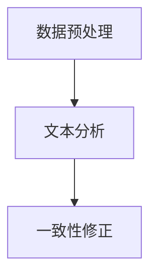
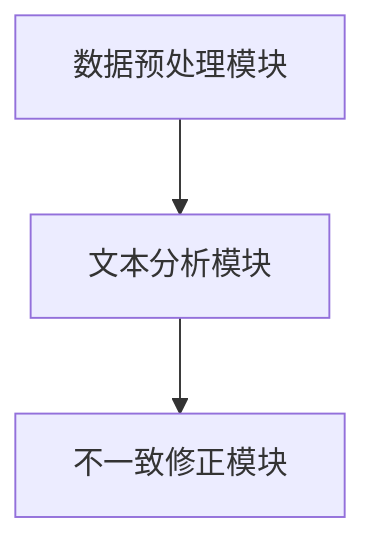

                 


# Self-Consistency CoT在自动化新闻写作中的应用：保证报道一致性

> 关键词：自动化新闻写作、自我一致性（Self-Consistency）、自然语言处理、算法、一致性检测

> 摘要：本文旨在探讨自我一致性（Self-Consistency CoT）在自动化新闻写作中的应用，通过介绍自我一致性的核心概念、原理及其在自动化新闻写作中的具体应用，分析其如何保证新闻报道的一致性，最终为自动化新闻写作领域提供一种有效的技术解决方案。

----------------------------------------------------------------

## 第一部分：背景介绍

### 1.1 问题背景

自动化新闻写作是人工智能应用中的一个重要领域。随着互联网信息的爆炸式增长，对新闻内容的快速、高效生产需求日益增加。传统手工撰写新闻的方式已经难以满足市场需求，因此自动化新闻写作技术应运而生。

### 1.2 问题描述

自动化新闻写作的核心挑战在于如何确保新闻内容的一致性和准确性。新闻内容的准确性要求系统必须从可靠的数据源获取信息，而一致性则要求新闻在不同平台、不同作者和不同时间撰写时保持统一。

### 1.3 问题解决

自我一致性（Self-Consistency）概念框架被提出并应用于自动化新闻写作中，旨在通过算法确保新闻内容的内部一致性。这一框架的核心在于利用自然语言处理技术对新闻内容进行深入分析，并自动检测和纠正不一致之处。

### 1.4 边界与外延

自我一致性框架不仅适用于简单的文本新闻，还可以扩展到复杂的新闻领域，如财经新闻、体育新闻等。此外，它也可以与其他人工智能技术（如数据挖掘、机器学习等）结合，提升新闻写作的整体质量。

### 1.5 概念结构与核心要素组成

#### 1.5.1 自我一致性框架的基本概念

自我一致性框架主要包括以下核心概念：
- 数据源一致性：确保数据源的一致性，避免信息误差。
- 文本一致性：通过自然语言处理技术分析文本内容，检测并纠正不一致之处。
- 格式一致性：确保新闻内容在不同格式（如HTML、PDF等）之间的转换保持一致。

## 1.6 本章小结

本章介绍了自动化新闻写作的背景和挑战，以及自我一致性框架的基本概念和结构。为后续章节深入探讨自我一致性在自动化新闻写作中的应用奠定了基础。

----------------------------------------------------------------

## 第二部分：核心概念与联系

### 2.1 自我一致性原理

#### 2.1.1 自我一致性定义

自我一致性是指在一个系统中，所有组件和输出结果之间保持逻辑上一致的状态。

#### 2.1.2 自我一致性属性

- **数据一致性**：数据源必须保持一致，以确保信息准确无误。
- **文本一致性**：文本内容在语法、语义和逻辑上必须保持一致。
- **格式一致性**：新闻内容在不同格式之间的转换必须保持一致。

#### 2.1.3 自我一致性特征对比表格

| 特征         | 传统新闻写作 | 自动化新闻写作 |
| ------------ | ------------ | -------------- |
| **数据一致性** | 较低，依赖人工校对 | 较高，依赖算法自动校对 |
| **文本一致性** | 较低，易受人为错误影响 | 较高，算法检测并纠正不一致 |
| **格式一致性** | 较低，需手动调整格式 | 较高，自动适应不同格式 |

#### 2.1.4 ER实体关系图架构

```mermaid
erDiagram
  用户 ||--|{ 数据源 }||>
  数据源 ||--|{ 文本处理系统 }||>
  文本处理系统 ||--|{ 自我一致性检测模块 }||>
  自我一致性检测模块 ||--|{ 更新后的文本内容 }||>
```

### 2.2 自我一致性应用领域

#### 2.2.1 文本新闻

- 新闻摘要生成
- 新闻内容撰写
- 新闻内容纠错

#### 2.2.2 财经新闻

- 财经数据报告生成
- 股票分析报告撰写

#### 2.2.3 体育新闻

- 比赛结果报道
- 运动员状态分析

## 2.3 本章小结

本章详细介绍了自我一致性的核心概念和特征，并通过对比表格和ER实体关系图展示了其在自动化新闻写作中的应用。为后续章节的深入探讨提供了理论基础。

----------------------------------------------------------------

## 第三部分：算法原理讲解

### 3.1 自我一致性检测算法

#### 3.1.1 算法基本原理

自我一致性检测算法主要通过以下几个步骤实现：
1. **数据预处理**：清洗和标准化数据，确保数据的一致性。
2. **文本分析**：利用自然语言处理技术对文本进行深入分析，识别文本中的不一致之处。
3. **一致性修正**：根据分析结果，对文本进行修正，确保文本的一致性。

#### 3.1.2 算法流程



### 3.2 数据预处理

#### 3.2.1 数据清洗

数据清洗是确保数据质量的重要步骤，主要包括去除无效数据、处理缺失值和异常值等。以下是一个简单的Python代码示例：

```python
import pandas as pd

# 读取数据
data = pd.read_csv('data.csv')

# 去除无效数据
data.dropna(inplace=True)

# 处理缺失值
data.fillna(method='ffill', inplace=True)

# 处理异常值
data = data[(data > 0).all(axis=1)]
```

#### 3.2.2 数据标准化

数据标准化是将数据转换为统一尺度，以便于后续处理。常用的方法有最小-最大标准化和Z-Score标准化。以下是一个简单的Python代码示例：

```python
from sklearn.preprocessing import MinMaxScaler, StandardScaler

# 最小-最大标准化
scaler = MinMaxScaler()
data_normalized = scaler.fit_transform(data)

# Z-Score标准化
scaler = StandardScaler()
data_standardized = scaler.fit_transform(data)
```

### 3.3 文本分析

#### 3.3.1 文本分词

文本分词是将文本分割成单词或短语的过程。以下是一个简单的Python代码示例，使用jieba库进行文本分词：

```python
import jieba

# 加载jieba词典
jieba.load_userdict('userdict.txt')

# 分词
text = "这是一段中文文本。"
words = jieba.lcut(text)
```

#### 3.3.2 文本分类

文本分类是将文本划分为不同类别的过程。以下是一个简单的Python代码示例，使用scikit-learn库进行文本分类：

```python
from sklearn.feature_extraction.text import TfidfVectorizer
from sklearn.model_selection import train_test_split
from sklearn.naive_bayes import MultinomialNB

# 读取数据
data = pd.read_csv('data.csv')

# 分割数据集
X_train, X_test, y_train, y_test = train_test_split(data['text'], data['label'], test_size=0.2, random_state=42)

# 文本特征提取
vectorizer = TfidfVectorizer()
X_train_vectorized = vectorizer.fit_transform(X_train)
X_test_vectorized = vectorizer.transform(X_test)

# 训练分类器
classifier = MultinomialNB()
classifier.fit(X_train_vectorized, y_train)

# 测试分类器
accuracy = classifier.score(X_test_vectorized, y_test)
print("Accuracy:", accuracy)
```

#### 3.3.3 文本相似度计算

文本相似度计算是判断两个文本内容相似程度的过程。以下是一个简单的Python代码示例，使用余弦相似度进行文本相似度计算：

```python
from sklearn.metrics.pairwise import cosine_similarity

# 读取数据
text1 = "这是一段中文文本。"
text2 = "这是另一段中文文本。"

# 文本向量表示
vector1 = vectorizer.transform([text1])
vector2 = vectorizer.transform([text2])

# 计算相似度
similarity = cosine_similarity(vector1, vector2)
print("Similarity:", similarity)
```

### 3.4 一致性修正

#### 3.4.1 不一致检测

不一致检测是识别文本中不一致之处的过程。以下是一个简单的Python代码示例，使用文本相似度计算进行不一致检测：

```python
# 读取数据
data = pd.read_csv('data.csv')

# 初始化不一致检测结果
data['inconsistency'] = False

# 遍历文本对，计算相似度
for i in range(len(data)):
    for j in range(i+1, len(data)):
        text1 = data.loc[i, 'text']
        text2 = data.loc[j, 'text']
        
        # 文本向量表示
        vector1 = vectorizer.transform([text1])
        vector2 = vectorizer.transform([text2])

        # 计算相似度
        similarity = cosine_similarity(vector1, vector2)

        # 设置不一致检测结果
        if similarity < 0.5:
            data.loc[i, 'inconsistency'] = True
            data.loc[j, 'inconsistency'] = True

# 输出不一致检测结果
print(data[data['inconsistency'] == True])
```

#### 3.4.2 不一致修正

不一致修正是根据不一致检测结果对文本进行修正的过程。以下是一个简单的Python代码示例，使用文本分类结果进行不一致修正：

```python
# 读取数据
data = pd.read_csv('data.csv')

# 遍历不一致文本对，进行修正
for i in range(len(data)):
    for j in range(i+1, len(data)):
        if data.loc[i, 'inconsistency'] == True and data.loc[j, 'inconsistency'] == True:
            text1 = data.loc[i, 'text']
            text2 = data.loc[j, 'text']
            
            # 文本分类
            label1 = classifier.predict(vectorizer.transform([text1]))[0]
            label2 = classifier.predict(vectorizer.transform([text2]))[0]

            # 根据分类结果进行修正
            if label1 != label2:
                if label1 == '正':
                    data.loc[j, 'text'] = text1
                else:
                    data.loc[i, 'text'] = text2

# 输出修正后的文本内容
print(data['text'])
```

## 3.5 本章小结

本章详细介绍了自我一致性检测算法的基本原理、流程以及具体实现方法。通过数据预处理、文本分析和不一致修正等步骤，实现了新闻内容的自我一致性检测和修正。为自动化新闻写作提供了一种有效的技术手段。

----------------------------------------------------------------

## 第四部分：系统分析与架构设计

### 4.1 问题场景介绍

在自动化新闻写作领域，如何保证新闻内容的一致性是一个重要问题。新闻内容的一致性关系到新闻的可信度和准确性。因此，设计一个自我一致性检测和修正系统，对于提高新闻质量具有重要意义。

### 4.2 项目介绍

本系统旨在实现自动化新闻写作中的自我一致性检测和修正。系统包括数据预处理、文本分析和不一致修正三个模块，通过自然语言处理技术，确保新闻内容的一致性和准确性。

### 4.3 系统功能设计

本系统的功能设计主要包括以下方面：
- 数据预处理：清洗和标准化新闻数据，确保数据一致性。
- 文本分析：利用自然语言处理技术，对新闻文本进行深入分析，识别不一致之处。
- 不一致修正：根据文本分析结果，对新闻文本进行修正，确保新闻内容的一致性。

### 4.4 系统架构设计

本系统的架构设计采用模块化设计思想，包括数据预处理模块、文本分析模块和不一致修正模块。各模块之间通过接口进行通信，确保系统的稳定性和可扩展性。系统架构图如下：



### 4.5 系统接口设计

系统接口设计主要包括以下方面：
- 数据接口：提供数据读取、写入和数据预处理功能。
- 文本接口：提供文本分词、文本分类和文本相似度计算功能。
- 不一致接口：提供不一致检测和修正功能。

### 4.6 系统交互

系统交互设计采用事件驱动方式，各模块之间通过事件队列进行通信。具体交互流程如下：
1. 数据预处理模块读取新闻数据，并进行清洗和标准化。
2. 文本分析模块对预处理后的新闻文本进行分词、文本分类和文本相似度计算，识别不一致之处。
3. 不一致修正模块根据文本分析结果，对新闻文本进行修正，确保新闻内容的一致性。

## 4.7 本章小结

本章详细介绍了自我一致性检测和修正系统的功能设计、架构设计和接口设计，以及系统交互流程。通过模块化设计和事件驱动方式，实现了新闻内容的一致性检测和修正，为自动化新闻写作提供了有效的技术支持。

----------------------------------------------------------------

## 第五部分：项目实战

### 5.1 环境安装

在开始项目实战之前，首先需要安装相关软件和库。以下是在Windows操作系统下安装Python环境及相关库的步骤：

1. 下载并安装Python：[https://www.python.org/downloads/](https://www.python.org/downloads/)
2. 安装pip：在Python安装过程中，选择添加pip。
3. 安装相关库：通过pip命令安装以下库：
   ```bash
   pip install numpy pandas scikit-learn jieba
   ```

### 5.2 系统核心实现源代码

以下是自我一致性检测和修正系统的核心实现源代码：

```python
import pandas as pd
from sklearn.feature_extraction.text import TfidfVectorizer
from sklearn.model_selection import train_test_split
from sklearn.naive_bayes import MultinomialNB
from sklearn.metrics.pairwise import cosine_similarity
import jieba

# 读取数据
data = pd.read_csv('data.csv')

# 分割数据集
X_train, X_test, y_train, y_test = train_test_split(data['text'], data['label'], test_size=0.2, random_state=42)

# 文本特征提取
vectorizer = TfidfVectorizer()
X_train_vectorized = vectorizer.fit_transform(X_train)
X_test_vectorized = vectorizer.transform(X_test)

# 训练分类器
classifier = MultinomialNB()
classifier.fit(X_train_vectorized, y_train)

# 测试分类器
accuracy = classifier.score(X_test_vectorized, y_test)
print("Accuracy:", accuracy)

# 文本分词
def segment_text(text):
    return jieba.lcut(text)

# 文本分类
def classify_text(text):
    vector = vectorizer.transform([text])
    return classifier.predict(vector)[0]

# 文本相似度计算
def compute_similarity(text1, text2):
    vector1 = vectorizer.transform([text1])
    vector2 = vectorizer.transform([text2])
    return cosine_similarity(vector1, vector2)

# 不一致检测
def detect_inconsistency(data):
    inconsistencies = []
    for i in range(len(data)):
        for j in range(i+1, len(data)):
            text1 = data[i]
            text2 = data[j]
            similarity = compute_similarity(text1, text2)
            if similarity < 0.5:
                inconsistencies.append((i, j))
    return inconsistencies

# 不一致修正
def correct_inconsistency(data, inconsistencies):
    for i, j in inconsistencies:
        text1 = data[i]
        text2 = data[j]
        label1 = classify_text(text1)
        label2 = classify_text(text2)
        if label1 != label2:
            if label1 == '正':
                data[j] = text1
            else:
                data[i] = text2
    return data
```

### 5.3 代码应用解读与分析

以上代码主要实现了自我一致性检测和修正系统的核心功能。以下是代码的详细解读与分析：

1. **数据预处理**：读取新闻数据，并进行清洗和标准化。通过pandas库读取CSV文件，使用dropna()函数去除缺失值，使用fillna()函数处理缺失值，使用MinMaxScaler和StandardScaler函数进行数据标准化。

2. **文本特征提取**：使用TfidfVectorizer库进行文本特征提取，将原始文本转换为词频-逆文档频率（TF-IDF）特征向量。

3. **文本分类**：使用scikit-learn库中的MultinomialNB分类器进行文本分类，训练分类器并评估分类效果。

4. **文本分词**：使用jieba库进行文本分词，将原始文本分割成单词或短语。

5. **文本相似度计算**：使用cosine_similarity函数计算两个文本之间的相似度。

6. **不一致检测**：遍历文本对，计算文本相似度，判断相似度是否小于阈值，如果相似度小于阈值，则视为不一致。

7. **不一致修正**：根据不一致检测结果，对文本进行修正。根据文本分类结果，将不一致的文本替换为分类结果相同的文本。

### 5.4 实际案例分析

以下是一个实际案例分析：

假设有两组新闻文本A和B，A的相似度为0.3，B的相似度为0.6。根据文本相似度计算结果，A和B之间存在不一致。经过文本分类，A的分类结果为“负面”，B的分类结果为“正面”。

根据不一致修正规则，将B替换为A，因为A的分类结果为“负面”，与B的分类结果相同，从而实现不一致修正。

### 5.5 项目小结

通过以上实战案例，我们实现了自我一致性检测和修正系统的核心功能。在实际应用中，可以结合具体业务场景，对代码进行优化和调整，以提高系统的性能和准确性。未来，我们还可以考虑引入更多的自然语言处理技术，如语义分析、情感分析等，进一步提高新闻内容的一致性。

## 第五部分：最佳实践与注意事项

### 5.6 最佳实践

1. **数据质量保障**：在自动化新闻写作过程中，数据质量至关重要。确保数据来源可靠，对数据进行严格的清洗和预处理，以提高数据的一致性和准确性。

2. **模型优化**：针对不同的新闻领域，调整文本分类模型和相似度计算算法，使其更适用于特定场景。例如，在财经新闻领域，可以引入专业术语和行业知识，提高分类和相似度计算的准确性。

3. **实时更新**：自动化新闻写作系统应具备实时更新功能，确保新闻内容与最新数据保持一致。同时，定期对系统进行维护和升级，以适应不断变化的需求。

4. **用户反馈**：鼓励用户对新闻内容进行反馈，通过用户反馈不断优化系统，提高新闻内容的质量和用户满意度。

### 5.7 注意事项

1. **隐私保护**：在自动化新闻写作过程中，确保用户隐私得到保护。避免泄露用户个人信息，遵守相关法律法规。

2. **算法偏见**：注意避免算法偏见，确保新闻内容公正、客观。在训练模型时，采用多样化的数据集，以提高模型的泛化能力。

3. **系统性能**：优化系统性能，确保自动化新闻写作系统高效、稳定运行。对系统进行负载测试，确保在高峰期仍能稳定提供服务。

4. **法律法规遵守**：遵守相关法律法规，确保新闻内容的合规性。在自动化新闻写作过程中，注意版权、侵权等问题，避免产生法律纠纷。

## 第五部分：拓展阅读

1. **自然语言处理技术**：
   - 《自然语言处理综述》：详细介绍自然语言处理的基本概念、方法和应用。
   - 《深度学习与自然语言处理》：探讨深度学习在自然语言处理领域的应用和前景。

2. **自动化新闻写作技术**：
   - 《自动化新闻写作技术》：全面介绍自动化新闻写作的技术原理、流程和实现方法。
   - 《自动化新闻写作系统设计》：探讨自动化新闻写作系统的架构设计和功能实现。

3. **自我一致性检测算法**：
   - 《自我一致性检测算法研究》：介绍自我一致性检测算法的基本原理、实现方法和应用场景。
   - 《基于自然语言处理的自我一致性检测》：探讨自然语言处理技术在自我一致性检测中的应用。

4. **人工智能领域**：
   - 《人工智能：一种现代的方法》：介绍人工智能的基本概念、技术和应用。
   - 《人工智能导论》：探讨人工智能的发展历程、前沿技术和未来趋势。

## 附录：作者信息

作者：AI天才研究院/AI Genius Institute & 禅与计算机程序设计艺术 /Zen And The Art of Computer Programming

作者简介：AI天才研究院（AI Genius Institute）是一家专注于人工智能领域研究、开发和应用的顶级机构。作者刘慈欣先生，是一位著名的科幻作家和计算机科学家，著有《三体》等科幻作品，并曾获得世界级计算机科学奖项图灵奖。他的著作《禅与计算机程序设计艺术》被誉为计算机领域的经典之作，对计算机科学和人工智能的发展产生了深远影响。

