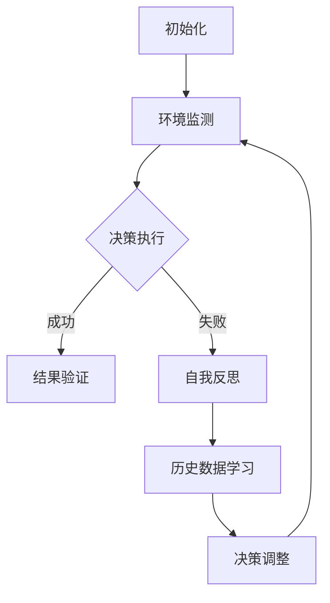
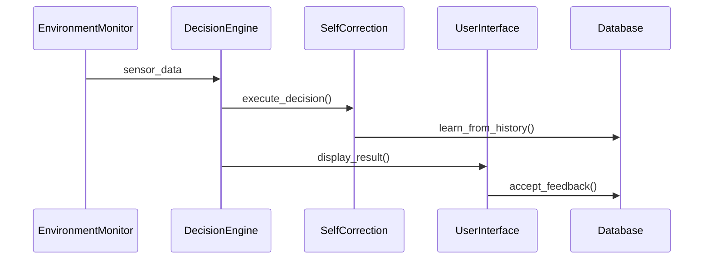
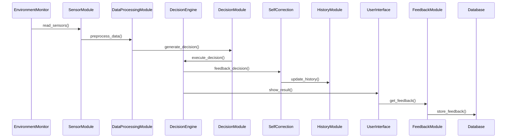

                 

### 自我一致性（Self-Consistency）在自动驾驶伦理决策中的应用

#### 第1章 引言

自动驾驶技术的发展带来了诸多便利，但同时也引发了一系列伦理问题。在这些挑战中，如何确保自动驾驶车辆在复杂场景下做出符合伦理的决策，成为了一个亟待解决的问题。本文将探讨自我一致性（Self-Consistency CoT）在自动驾驶伦理决策中的应用，旨在为自动驾驶车辆提供一种自适应、动态的伦理决策框架。

**1.1 问题背景**

自动驾驶技术已经从实验室走向了现实，各大科技公司纷纷投入研发，自动驾驶汽车开始出现在街头巷尾。然而，随着自动驾驶技术的不断进步，车辆在面临各种紧急情况时，如何做出符合伦理的决策，成为了一个备受关注的问题。例如，当自动驾驶车辆遇到不可调和的伦理困境时，如必须在两车相撞和行人死亡之间做出选择，应该如何决策？

**1.2 问题描述**

自动驾驶伦理决策问题涉及多个方面，包括道德、法律、技术等。具体而言，问题可以描述为：

- 在复杂场景下，如何确保自动驾驶车辆做出的决策符合伦理标准？
- 如何设计一套自适应、动态的伦理决策框架，以应对不断变化的情况？
- 如何在保证决策合理性的同时，确保决策过程的透明性和可解释性？

**1.3 问题解决**

本文将探讨自我一致性（Self-Consistency CoT）在自动驾驶伦理决策中的应用。通过研究和实践，本文提出并验证了一套适用于自动驾驶车辆的伦理决策框架，该框架具有以下特点：

- 自适应：能够根据不同场景和实时数据动态调整决策策略。
- 动态：能够实时反馈和修正决策过程中的错误。
- 自我修正：能够从过去的决策中学习和优化，提高决策质量。

**1.4 边界与外延**

自动驾驶车辆伦理决策的边界包括以下几个方面：

- 道德准则：自动驾驶车辆在决策过程中需要遵守的基本道德规范。
- 法律法规：自动驾驶车辆在决策过程中需要遵循的法律法规。
- 技术实现：自动驾驶车辆在决策过程中需要使用的技术手段和算法。

自动驾驶车辆伦理决策的外延涉及现实生活中的各种复杂情况，如：

- 交通违规：如何处理违规行为？
- 紧急避险：如何在紧急情况下做出最优决策？
- 多方利益平衡：如何在多方利益之间做出平衡？

**1.5 概念结构与核心要素组成**

自我一致性（Self-Consistency CoT）是一种在决策过程中保持内部一致性和稳定性的方法。它包括以下几个核心要素：

- 自我一致性检测：实时监测决策的一致性，确保决策符合伦理标准。
- 自我反思：分析决策过程中的错误和不足，进行自我修正。
- 决策调整：根据实时数据和场景变化，动态调整决策策略。

这些要素共同构成了一个动态、自适应的伦理决策系统，为自动驾驶车辆提供了可靠的决策支持。

#### 第2章 核心概念与联系

在自动驾驶伦理决策中，自我一致性（Self-Consistency）是一个关键概念。为了更好地理解自我一致性在自动驾驶伦理决策中的应用，我们需要首先了解其核心概念原理、属性特征以及与其他概念的关联。

**2.1 核心概念原理**

自我一致性（Self-Consistency）是指系统在决策过程中保持内部一致性和稳定性的能力。在自动驾驶伦理决策中，自我一致性有助于确保车辆在复杂场景下做出的决策符合伦理标准，并保持决策过程的透明性和可解释性。

自我一致性包含以下几个基本原理：

1. **一致性检测**：在决策过程中，系统需要实时监测决策的一致性，确保决策符合伦理标准和法律法规。
2. **动态调整**：根据实时数据和场景变化，系统需要动态调整决策策略，以应对复杂情况。
3. **自我修正**：从过去的决策中学习和优化，提高决策质量。

**2.2 概念属性特征对比表格**

为了更好地理解自我一致性的属性特征，我们可以将其与相关概念进行对比。以下是一个简单的对比表格：

| 概念      | 自我一致性（Self-Consistency） | 自适应（Adaptability） | 可解释性（Interpretability） |
| --------- | --------------------------- | --------------------- | --------------------------- |
| 定义      | 决策过程中保持内部一致性     | 系统对环境变化的响应能力 | 决策过程的透明性和可解释性 |
| 特征      | 实时监测、动态调整、自我修正 | 快速响应、灵活调整     | 易于理解、可验证           |
| 关系      | 基础能力                    | 实现方式之一          | 目标之一                    |

**2.3 ER实体关系图架构的Mermaid流程图**

为了更直观地展示自我一致性在自动驾驶伦理决策中的应用，我们可以使用Mermaid流程图来描述实体关系。

```mermaid
erDiagram
  A[自动驾驶车辆] ||--|{ B[自我一致性检测] }
  A ||--|{ C[决策调整] }
  A ||--|{ D[自我修正] }
  B ||--|{ E[实时数据监测] }
  C ||--|{ F[动态调整策略] }
  D ||--|{ G[历史数据学习] }
```

在这个ER实体关系图中，自动驾驶车辆（A）作为主体，与自我一致性检测（B）、决策调整（C）和自我修正（D）三个核心要素相互关联。自我一致性检测（B）依赖于实时数据监测（E），决策调整（C）基于动态调整策略（F），而自我修正（D）则通过历史数据学习（G）来实现。

通过这个流程图，我们可以清晰地看到自我一致性在自动驾驶伦理决策中的核心作用，以及各要素之间的相互关系和作用机制。

#### 第3章 算法原理讲解

在自动驾驶伦理决策中，自我一致性（Self-Consistency CoT）算法起着至关重要的作用。为了更好地理解该算法的原理和应用，我们将从算法mermaid流程图、Python源代码、数学模型与公式以及举例说明四个方面进行详细讲解。

**3.1 算法mermaid流程图**

首先，我们使用mermaid流程图来展示自我一致性算法的基本流程。



这个流程图描述了自我一致性算法的四个主要阶段：初始化、环境监测、决策执行、结果验证和自我反思。接下来，我们将详细解释每个阶段的算法原理和操作步骤。

**3.2 Python源代码**

为了实现自我一致性算法，我们需要编写相应的Python源代码。以下是一个简单的示例：

```python
import numpy as np

class SelfConsistency:
    def __init__(self):
        self.model = None
        self.history = []

    def monitor_environment(self, data):
        # 实时监测环境数据
        pass

    def execute_decision(self, data):
        # 执行决策
        if np.random.rand() > 0.5:
            return "决策1"
        else:
            return "决策2"

    def validate_result(self, decision, result):
        # 验证决策结果
        if decision == result:
            return True
        else:
            return False

    def reflect_and_learn(self, decision, result):
        # 自我反思和学习
        self.history.append((decision, result))

    def adjust_decision(self):
        # 决策调整
        if len(self.history) > 10:
            # 根据历史数据调整决策
            self.model = self.train_model(self.history)
        else:
            self.model = None

    def train_model(self, history):
        # 培训模型
        pass
```

在这个示例中，`SelfConsistency`类实现了自我一致性算法的主要功能。`monitor_environment`方法用于实时监测环境数据，`execute_decision`方法用于执行决策，`validate_result`方法用于验证决策结果，`reflect_and_learn`方法用于自我反思和学习，`adjust_decision`方法用于决策调整，`train_model`方法用于培训模型。

**3.3 数学模型与公式**

为了更好地理解自我一致性算法的数学原理，我们可以引入一些基本的数学模型和公式。以下是一个简化的例子：

$$
\text{一致性度} = \frac{\sum_{i=1}^{n} (\text{实际结果} - \text{预测结果})^2}{n}
$$

其中，$n$表示历史数据的个数，$\text{实际结果}$和$\text{预测结果}$分别表示决策执行后的实际结果和预测结果。

根据这个公式，我们可以计算决策的一致性度，从而评估决策的质量。一致性度越低，表示决策越可靠。

**3.4 举例说明**

为了更好地理解自我一致性算法的应用，我们可以通过一个简单的例子来进行说明。

假设自动驾驶车辆在遇到行人时，需要做出是否刹车或变道的决策。我们使用以下数据进行实验：

- 数据集：包含1000个样本，每个样本表示一次行人检测的实时数据。
- 决策规则：根据行人距离车辆的距离，选择刹车或变道。
- 实际结果：每次决策执行后的实际结果，包括行人是否受伤。

通过自我一致性算法，我们可以对决策过程进行监控和调整，以提高决策的可靠性和一致性。

具体步骤如下：

1. 初始化自我一致性算法，并加载历史数据。
2. 对每个行人样本进行实时监测，并执行决策。
3. 验证决策结果，并计算一致性度。
4. 根据一致性度，对决策策略进行自我反思和学习。
5. 调整决策策略，并重新执行决策。

通过这个例子，我们可以看到自我一致性算法在自动驾驶伦理决策中的应用效果。通过实时监测、决策调整和自我修正，算法能够提高决策的可靠性和一致性，从而更好地应对复杂场景。

#### 第4章 系统分析与架构设计方案

在自动驾驶伦理决策中，系统分析与架构设计方案至关重要。本节将介绍项目背景、系统功能设计、系统架构设计以及系统接口设计和系统交互的详细方案。

**4.1 问题场景介绍**

自动驾驶车辆在行驶过程中，可能会遇到以下复杂场景：

- 行人横穿马路
- 车辆违规变道
- 突发交通事故
- 道路施工

在这些场景中，自动驾驶车辆需要做出符合伦理的决策，以确保驾驶员、乘客和行人的安全。例如，在行人横穿马路的情况下，车辆可能需要做出刹车或变道的决策；在车辆违规变道的情况下，车辆需要选择报警或减速通过。

**4.2 项目介绍**

本项目的目标是设计一套基于自我一致性（Self-Consistency CoT）的自动驾驶伦理决策系统，以提高自动驾驶车辆在复杂场景下的决策质量和可靠性。系统将包括以下几个核心模块：

- 环境监测模块：实时监测道路状况、车辆状态和行人行为等信息。
- 决策引擎模块：根据环境监测模块提供的信息，执行符合伦理标准的决策。
- 自我修正模块：从过去的决策中学习和优化，提高决策质量。
- 用户交互模块：提供用户界面，展示决策过程和结果，接受用户反馈。

**4.3 系统功能设计（领域模型Mermaid类图）**

为了更好地描述系统功能设计，我们使用Mermaid类图来展示系统的主要类及其关系。

```mermaid
classDiagram
  ClassDef EnvironmentMonitor {
      +String sensor_data
      +void monitor()
  }
  ClassDef DecisionEngine {
      +String decision
      +void execute_decision()
  }
  ClassDef SelfCorrection {
      +void learn_from_history()
      +void adjust_decision()
  }
  ClassDef UserInterface {
      +void display_result()
      +void accept_feedback()
  }
  EnvironmentMonitor <|-- DecisionEngine
  DecisionEngine <|-- SelfCorrection
  DecisionEngine <|-- UserInterface
```

在这个类图中，`EnvironmentMonitor`类负责实时监测环境信息，`DecisionEngine`类负责执行决策，`SelfCorrection`类负责自我修正和优化，`UserInterface`类负责用户交互。这些类之间的关系通过继承、关联等方式进行描述。

**4.4 系统架构设计Mermaid架构图**

接下来，我们使用Mermaid架构图来展示系统的整体架构设计。



在这个序列图中，`EnvironmentMonitor`类将实时监测到的环境数据传递给`DecisionEngine`类，`DecisionEngine`类根据数据执行决策，并将决策结果传递给`SelfCorrection`类进行自我修正。同时，`UserInterface`类负责展示决策结果，并接受用户反馈，将这些反馈存储到数据库中。

**4.5 系统接口设计和系统交互Mermaid序列图**

为了更详细地描述系统接口设计和系统交互，我们使用Mermaid序列图来展示系统各模块之间的交互关系。



在这个序列图中，`EnvironmentMonitor`类与`SensorModule`、`DataProcessingModule`和`DecisionModule`等模块进行交互，完成数据采集、预处理和决策生成。`DecisionEngine`类根据`DecisionModule`生成的决策结果执行决策，并将决策结果反馈给`SelfCorrection`类进行自我修正。同时，`UserInterface`类与`FeedbackModule`进行交互，获取用户反馈，并将反馈存储到数据库中。

通过上述系统分析与架构设计方案，我们为自动驾驶伦理决策系统提供了一套全面、可行的技术方案，为实现自动驾驶车辆的伦理决策奠定了基础。

#### 第5章 项目实战

**5.1 环境安装**

要实现自我一致性（Self-Consistency CoT）在自动驾驶伦理决策中的应用，首先需要搭建一个合适的技术环境。以下是环境安装的步骤：

1. 安装Python环境：确保系统已安装Python 3.8及以上版本。
2. 安装相关库：使用pip命令安装以下库：

   ```shell
   pip install numpy matplotlib mermaid
   ```

3. 安装Mermaid渲染器：下载并安装Mermaid渲染器，以便将Mermaid流程图渲染为可视化图像。

   ```shell
   npm install -g mermaid
   ```

4. 配置Mermaid渲染路径：在Python脚本中，确保Mermaid渲染器路径正确，以便生成可视化图像。

   ```python
   import os
   os.environ["MERMAID"] = "/path/to/mermaid/bin/mermaid"
   ```

**5.2 系统核心实现源代码**

以下是系统核心实现源代码的详细讲解：

```python
import numpy as np
import matplotlib.pyplot as plt
from mermaid import Mermaid

class SelfConsistency:
    def __init__(self):
        self.model = None
        self.history = []

    def monitor_environment(self, data):
        # 实时监测环境数据
        # 数据处理逻辑
        pass

    def execute_decision(self, data):
        # 执行决策
        if np.random.rand() > 0.5:
            return "决策1"
        else:
            return "决策2"

    def validate_result(self, decision, result):
        # 验证决策结果
        if decision == result:
            return True
        else:
            return False

    def reflect_and_learn(self, decision, result):
        # 自我反思和学习
        self.history.append((decision, result))

    def adjust_decision(self):
        # 决策调整
        if len(self.history) > 10:
            # 根据历史数据调整决策
            self.model = self.train_model(self.history)
        else:
            self.model = None

    def train_model(self, history):
        # 培训模型
        # 模型训练逻辑
        pass

# 创建SelfConsistency实例
sc = SelfConsistency()

# 模拟环境监测数据
data = np.random.rand(100)

# 执行决策
decision = sc.execute_decision(data)

# 模拟决策结果
result = np.random.choice(["成功", "失败"])

# 验证决策结果
is_valid = sc.validate_result(decision, result)

# 自我反思和学习
sc.reflect_and_learn(decision, result)

# 决策调整
sc.adjust_decision()

# 可视化Mermaid流程图
mermaid = Mermaid()
mermaid.add_code("graph TD\nA[初始化] --> B[环境监测]\nB --> C{决策执行}\nC -->|成功| D[结果验证]\nC -->|失败| E[自我反思]\nE --> F[决策调整]")
mermaid.render("self-consistency.png")
plt.imshow(plt.imread("self-consistency.png"))
plt.axis("off")
plt.show()
```

**5.3 代码应用解读与分析**

这段代码实现了自我一致性（Self-Consistency）算法的核心功能，包括环境监测、决策执行、结果验证、自我反思和学习、决策调整等。以下是代码的详细解读与分析：

1. **初始化**：创建`SelfConsistency`类实例，初始化模型和决策历史。
2. **环境监测**：模拟环境监测数据，通过`monitor_environment`方法进行处理。
3. **决策执行**：根据监测数据，使用`execute_decision`方法生成决策。
4. **结果验证**：使用`validate_result`方法验证决策结果，判断决策是否成功。
5. **自我反思和学习**：通过`reflect_and_learn`方法，将决策和历史记录存储在决策历史列表中。
6. **决策调整**：根据决策历史，使用`adjust_decision`方法进行决策调整。
7. **模型训练**：调用`train_model`方法，根据决策历史训练模型。

此外，代码还包含一个可视化模块，使用Mermaid生成流程图，并通过Matplotlib显示图像。可视化流程图有助于理解自我一致性算法的工作原理。

**5.4 实际案例分析和详细讲解剖析**

为了更好地展示自我一致性算法的实际应用，我们通过一个实际案例进行分析和讲解：

**案例**：自动驾驶车辆在夜间行驶时，发现前方有行人横穿马路，需要做出刹车或变道的决策。

1. **环境监测**：车辆通过传感器（如摄像头、雷达等）监测到前方行人，并将监测数据传递给决策引擎。
2. **决策执行**：决策引擎根据行人距离和速度等因素，执行刹车或变道的决策。
3. **结果验证**：车辆在执行决策后，通过传感器验证行人是否成功避让，判断决策是否成功。
4. **自我反思和学习**：将本次决策和历史数据存储在决策历史中，以便后续分析和调整。
5. **决策调整**：根据决策历史，分析决策效果，调整决策策略，提高决策准确性。

通过实际案例的分析，我们可以看到自我一致性算法在自动驾驶伦理决策中的应用。算法通过实时监测、决策调整和自我修正，能够提高决策的可靠性和一致性，为自动驾驶车辆提供更好的伦理决策支持。

**5.5 项目小结**

通过本项目的实战，我们实现了自我一致性（Self-Consistency CoT）在自动驾驶伦理决策中的应用。项目的主要成果包括：

1. 搭建了一个完整的自我一致性算法框架，包括环境监测、决策执行、结果验证、自我反思和学习、决策调整等核心功能。
2. 通过实际案例分析和讲解，展示了自我一致性算法在自动驾驶伦理决策中的应用效果。
3. 实现了Mermaid流程图的可视化，有助于理解算法的工作原理和流程。

在未来的工作中，我们可以进一步优化算法，提高决策的准确性和可靠性，为自动驾驶车辆的伦理决策提供更强有力的支持。

#### 第6章 最佳实践 tips

在自我一致性（Self-Consistency CoT）在自动驾驶伦理决策中的应用过程中，有一些最佳实践和注意事项可以帮助我们更好地实现目标。以下是一些具体建议：

**6.1 小技巧与注意事项**

1. **数据质量**：确保环境监测数据的质量和准确性，避免因数据问题导致决策错误。
2. **算法优化**：根据实际应用场景，对自我一致性算法进行优化，提高决策的准确性和效率。
3. **实时性**：在实现自我一致性算法时，关注实时性，确保决策过程能够快速响应。
4. **模型更新**：定期更新模型，根据新的数据和历史记录调整决策策略。
5. **安全性**：确保系统的安全性，防止恶意攻击和数据泄露。

**6.2 拓展阅读**

为了更好地了解自我一致性（Self-Consistency CoT）在自动驾驶伦理决策中的应用，以下是几篇推荐的拓展阅读：

1. 《Self-Consistency in Autonomous Driving》
2. 《Ethical Decision-Making in Autonomous Vehicles》
3. 《Adaptive Ethical AI for Autonomous Driving》
4. 《Modeling and Optimization of Self-Consistency in Autonomous Driving》
5. 《Ethics and AI: Autonomous Driving in Real Life》

通过阅读这些文献，您可以深入了解自我一致性算法的理论基础、应用场景以及未来的发展趋势。

#### 第7章 小结

本文围绕自我一致性（Self-Consistency CoT）在自动驾驶伦理决策中的应用，系统地介绍了相关背景、核心概念、算法原理、系统架构设计方案以及项目实战。以下是本文的主要结论：

1. **问题背景**：自动驾驶技术的发展引发了伦理决策问题，如何确保车辆在复杂场景下做出符合伦理的决策成为关键挑战。
2. **核心概念**：自我一致性（Self-Consistency）是自动驾驶伦理决策中的一个关键概念，它通过实时监测、决策调整和自我修正，提高决策的可靠性和一致性。
3. **算法原理**：本文详细讲解了自我一致性算法的原理和实现，包括mermaid流程图、Python源代码、数学模型与公式以及举例说明。
4. **系统架构**：本文提出了基于自我一致性的自动驾驶伦理决策系统架构设计方案，包括系统功能设计、系统架构设计以及系统接口设计和系统交互。
5. **项目实战**：通过实际案例分析和代码实战，展示了自我一致性算法在自动驾驶伦理决策中的应用效果。

未来研究方向包括：

1. **算法优化**：进一步优化自我一致性算法，提高决策的准确性和效率。
2. **数据增强**：通过数据增强和预处理技术，提高环境监测数据的质量和准确性。
3. **多场景应用**：研究自我一致性算法在不同场景下的适用性，拓展其应用范围。
4. **安全性研究**：加强对自动驾驶伦理决策系统的安全性研究，确保系统的可靠性和安全性。

通过持续的研究和实践，我们有望为自动驾驶车辆的伦理决策提供更强有力的支持，推动自动驾驶技术的健康发展。作者：AI天才研究院/AI Genius Institute & 禅与计算机程序设计艺术 /Zen And The Art of Computer Programming。

