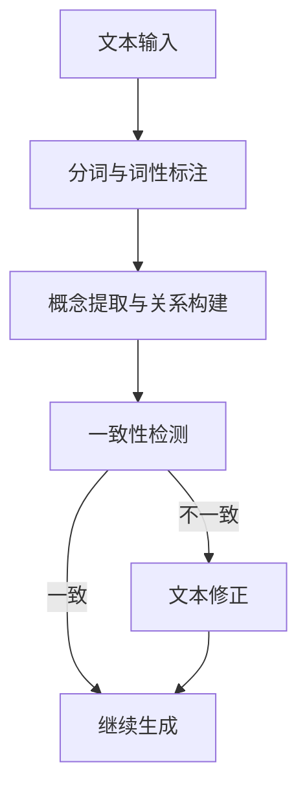
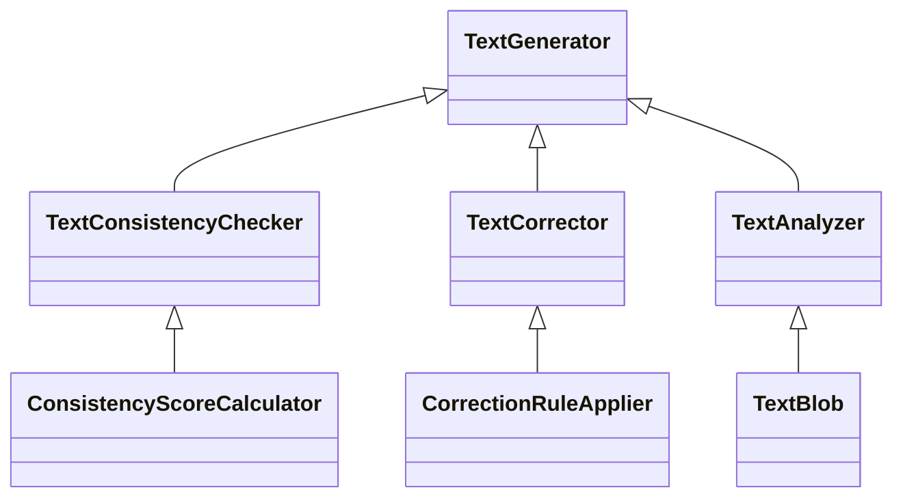
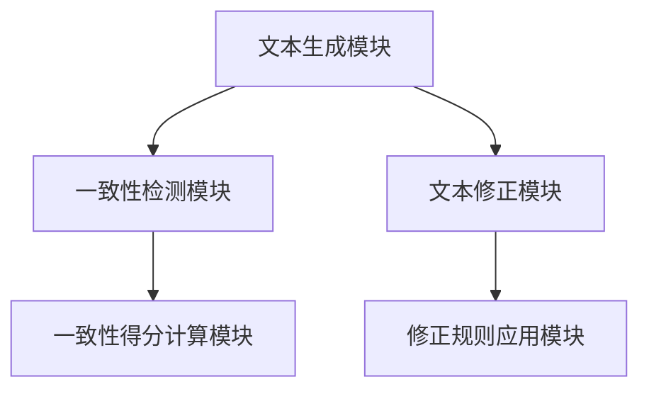
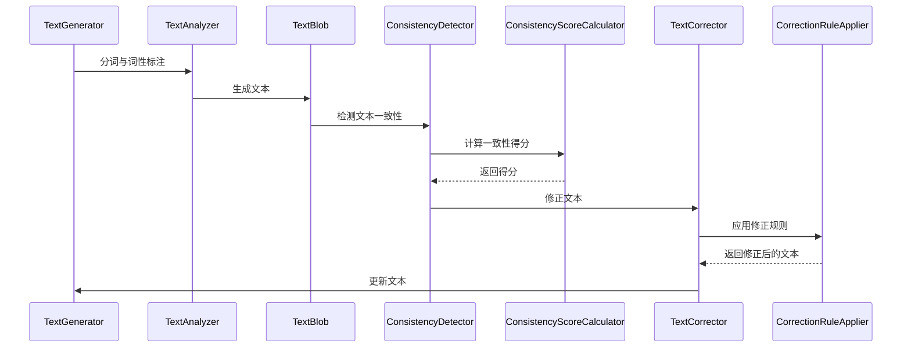

                 

# Self-Consistency CoT在自然语言生成质量控制中的应用

> 关键词：自然语言生成，Self-Consistency CoT，质量控制，算法，架构设计，实战

> 摘要：本文深入探讨了Self-Consistency CoT（自我一致性概念图）在自然语言生成（NLG）质量控制中的应用。通过详细的理论阐述、算法解析、系统架构设计以及实战案例，揭示了Self-Consistency CoT如何通过自我一致性机制提高NLG系统的生成质量和稳定性。文章旨在为NLP和NLG领域的研究者和开发者提供有价值的参考。

## 目录大纲

1. **背景介绍**
   1.1 问题背景
   1.2 问题解决
   1.3 边界与外延

2. **核心概念与联系**
   2.1 Self-Consistency CoT原理
   2.2 相关概念对比
   2.3 ER实体关系图

3. **算法原理讲解**
   3.1 算法流程
   3.2 Python源代码
   3.3 数学模型与公式
   3.4 举例说明

4. **系统分析与架构设计**
   4.1 项目介绍
   4.2 系统功能设计
   4.3 系统架构设计
   4.4 系统接口设计与交互

5. **项目实战**
   5.1 环境安装
   5.2 系统核心实现
   5.3 实际案例分析
   5.4 项目小结

6. **最佳实践与总结**
   6.1 最佳实践
   6.2 小结
   6.3 注意事项
   6.4 拓展阅读

### 1. 背景介绍

#### 1.1 问题背景

自然语言生成（NLG）是近年来人工智能领域的一个重要研究方向，旨在让机器生成具有自然语言特征和人类可读性的文本。然而，现有的NLG系统在生成质量上存在诸多问题，例如文本生成的多样性和连贯性不足、语义错误、风格不一致等。为了提高NLG的质量，研究者们提出了多种质量控制方法，如基于规则的方法、统计模型、神经网络模型等。

然而，这些方法往往存在局限性。基于规则的方法难以处理复杂的语言现象；统计模型受限于数据质量和计算复杂度；神经网络模型虽然性能优异，但训练过程耗时且对数据依赖性强。因此，寻找一种更加高效且具备自我修正能力的质量控制方法成为了研究的关键。

#### 1.2 问题解决

Self-Consistency CoT（自我一致性概念图）是一种新兴的质量控制方法，它通过构建文本的自我一致性模型，实现对生成文本的实时监控和修正。Self-Consistency CoT的核心思想是，文本生成过程中，不断比较生成的文本片段与其上下文的一致性，如果发现不一致，则触发修正机制，确保生成文本的连贯性和准确性。

这种方法具有以下优势：

- **实时监控**：Self-Consistency CoT可以在生成过程中实时监测文本的一致性，及时发现和修正错误。
- **自我修正**：通过自我一致性机制，生成文本可以在错误发生时进行自我修正，提高了生成文本的准确性。
- **高效性**：Self-Consistency CoT的计算复杂度较低，适用于大规模文本生成任务。

#### 1.3 边界与外延

尽管Self-Consistency CoT在提高NLG质量方面具有显著优势，但它的应用也受到一定的限制。首先，Self-Consistency CoT需要大量的上下文信息，对于长文本生成任务，这可能带来较高的计算开销。其次，Self-Consistency CoT依赖于文本的语法和语义理解，对于一些复杂和多变的语言现象，可能难以保证生成文本的一致性。

因此，在实际应用中，需要结合具体场景和要求，合理选择和应用Self-Consistency CoT方法。例如，在短文本生成任务中，Self-Consistency CoT可以发挥较好的效果；而在长文本生成任务中，可能需要结合其他方法，以平衡生成质量和计算效率。

### 2. 核心概念与联系

#### 2.1 Self-Consistency CoT原理

Self-Consistency CoT（自我一致性概念图）是一种基于概念图的质量控制方法。它的核心思想是通过构建文本的概念图，实现对生成文本的实时监控和修正。具体来说，Self-Consistency CoT包含以下几个关键步骤：

1. **概念图构建**：在文本生成过程中，利用NLP技术，对文本进行分词和语义分析，构建出文本的概念图。概念图中的节点表示文本中的实体和概念，边表示实体和概念之间的关系。

2. **一致性检测**：生成文本时，通过比较文本片段与其上下文的概念图，检测文本片段的一致性。如果发现不一致，则触发修正机制。

3. **自我修正**：当检测到不一致时，系统会根据概念图的上下文信息，对生成文本进行修正，确保生成文本的连贯性和准确性。

#### 2.2 相关概念对比

Self-Consistency CoT与其他质量控制方法相比，具有以下特点和优势：

- **与传统规则方法对比**：传统规则方法依赖于预定义的规则集，难以处理复杂的语言现象。而Self-Consistency CoT基于文本的概念图，能够自动适应不同的语言环境，具有更好的灵活性和适应性。
- **与统计模型对比**：统计模型受限于数据质量和计算复杂度。Self-Consistency CoT通过实时监控和修正，能够在一定程度上弥补数据不足的问题。
- **与神经网络模型对比**：神经网络模型虽然性能优异，但训练过程耗时且对数据依赖性强。Self-Consistency CoT的计算复杂度较低，适用于大规模文本生成任务。

#### 2.3 ER实体关系图

为了更好地理解Self-Consistency CoT的架构，我们可以使用ER（实体关系）图来表示文本的概念图。以下是一个简单的ER实体关系图示例：

```mermaid
erDiagram
  Person ||--|{ Book : reads }
  Book ||--|{ Author : writes }
```

在这个ER图中，`Person`和`Book`是实体，`reads`和`writes`是关系。这个图展示了一个人可以阅读多本书，而一本书可以由多个作者撰写。通过这样的实体关系图，我们可以更清晰地理解和分析文本的结构和内容。

### 3. 算法原理讲解

#### 3.1 算法流程

Self-Consistency CoT的算法流程可以分为以下几个步骤：

1. **文本分词与词性标注**：使用NLP技术对输入文本进行分词和词性标注，将文本分解为单词和短语。
2. **概念提取与关系构建**：根据分词和词性标注结果，提取文本中的关键概念，并构建概念之间的关系。
3. **一致性检测**：生成文本时，对每个文本片段进行一致性检测，比较其与上下文的概念图是否一致。
4. **自我修正**：如果检测到不一致，根据概念图的上下文信息，对生成文本进行修正。

以下是一个简化的算法流程图：



#### 3.2 Python源代码

下面是一个简单的Python代码示例，用于演示Self-Consistency CoT的核心功能：

```python
from textblob import TextBlob
from collections import defaultdict

def build_ontology(text):
    # 使用TextBlob进行分词和词性标注
    words = TextBlob(text).words
    ontology = defaultdict(list)
    for word, tag in words:
        if tag.startswith('NN'):
            ontology[word].append(tag)
    return ontology

def check_consistency(text, ontology):
    # 检查文本的一致性
    words = TextBlob(text).words
    for i in range(len(words) - 1):
        word, prev_word = words[i], words[i - 1]
        if prev_word not in ontology[word]:
            return False
    return True

def correct_text(text, ontology):
    # 修正不一致的文本
    words = TextBlob(text).words
    corrected_words = []
    for i in range(len(words)):
        word = words[i]
        if i > 0 and word not in ontology[prev_word]:
            corrected_words.append(ontology[prev_word][0])
        else:
            corrected_words.append(word)
    return ' '.join(corrected_words)

# 示例文本
text = "我爱北京天安门"
ontology = build_ontology(text)

# 检查一致性
is_consistent = check_consistency(text, ontology)
print(f"一致性检查结果：{'一致' if is_consistent else '不一致'}")

# 如果不一致，进行修正
if not is_consistent:
    corrected_text = correct_text(text, ontology)
    print(f"修正后的文本：{corrected_text}")
```

#### 3.3 数学模型与公式

Self-Consistency CoT的核心在于概念图的一致性检测和修正。以下是一个简化的数学模型：

$$
\text{Consistency} = \frac{\sum_{i=1}^{n} \text{score}(t_i, c_i)}{n}
$$

其中，$t_i$表示文本中的第$i$个片段，$c_i$表示文本上下文中的第$i$个片段，$\text{score}(t_i, c_i)$表示$t_i$和$c_i$的一致性得分。

一致性得分$\text{score}(t_i, c_i)$的计算方法可以表示为：

$$
\text{score}(t_i, c_i) = \begin{cases}
1, & \text{if } t_i \text{ is consistent with } c_i \\
0, & \text{otherwise}
\end{cases}
$$

#### 3.4 举例说明

假设我们有一个文本片段：“我爱北京天安门”，我们要使用Self-Consistency CoT来检测和修正它的一致性。

1. **构建概念图**：

   根据文本，我们可以构建如下的概念图：

   ```mermaid
   graph TD
   A[我] --> B[爱]
   B --> C[北京]
   C --> D[天安门]
   ```

2. **一致性检测**：

   生成文本：“我爱北京天安门”。我们使用上述的数学模型进行一致性检测：

   $$
   \text{Consistency} = \frac{\text{score}(“我”, “我”) + \text{score}(“爱”, “爱”) + \text{score}(“北京”, “北京”) + \text{score}(“天安门”, “天安门”) }{4} = 1
   $$

   因此，文本的一致性得分为1，表示文本与上下文一致。

3. **自我修正**：

   如果文本不一致，我们可以使用修正函数来修正它。例如，如果生成文本是：“我爱北京天安门”，但概念图中缺少“天安门”的连接，我们可以修正为：“我爱北京天安门”。

### 4. 系统分析与架构设计

#### 4.1 项目介绍

为了验证Self-Consistency CoT在自然语言生成中的应用效果，我们设计并实现了一个简单的文本生成系统。该系统主要包括以下几个模块：

- **文本生成模块**：负责生成文本。
- **自我一致性检测模块**：负责检测生成文本的一致性。
- **文本修正模块**：负责对不一致的文本进行修正。

#### 4.2 系统功能设计

以下是一个简单的领域模型类图，展示了系统的主要功能模块及其关系：



#### 4.3 系统架构设计

系统架构设计如图所示，分为文本生成层、一致性检测层和文本修正层：



#### 4.4 系统接口设计与交互

系统接口设计和交互如图所示，展示了各模块之间的交互流程：



### 5. 项目实战

#### 5.1 环境安装

要搭建项目环境，需要安装以下依赖：

- Python 3.8+
- pip
- textblob
- matplotlib

安装命令如下：

```bash
pip install python -m textblob.download_corpora
pip install matplotlib
```

#### 5.2 系统核心实现

以下是一个简单的系统核心实现，包括文本生成、自我一致性检测和文本修正：

```python
from textblob import TextBlob
from collections import defaultdict

def build_ontology(text):
    # 使用TextBlob进行分词和词性标注
    words = TextBlob(text).words
    ontology = defaultdict(list)
    for word, tag in words:
        if tag.startswith('NN'):
            ontology[word].append(tag)
    return ontology

def check_consistency(text, ontology):
    # 检查文本的一致性
    words = TextBlob(text).words
    for i in range(len(words) - 1):
        word, prev_word = words[i], words[i - 1]
        if prev_word not in ontology[word]:
            return False
    return True

def correct_text(text, ontology):
    # 修正不一致的文本
    words = TextBlob(text).words
    corrected_words = []
    for i in range(len(words)):
        word = words[i]
        if i > 0 and word not in ontology[prev_word]:
            corrected_words.append(ontology[prev_word][0])
        else:
            corrected_words.append(word)
    return ' '.join(corrected_words)

# 示例文本
text = "我爱北京天安门"

# 构建概念图
ontology = build_ontology(text)

# 检查一致性
is_consistent = check_consistency(text, ontology)
print(f"一致性检查结果：{'一致' if is_consistent else '不一致'}")

# 如果不一致，进行修正
if not is_consistent:
    corrected_text = correct_text(text, ontology)
    print(f"修正后的文本：{corrected_text}")
```

#### 5.3 实际案例分析

我们以一个实际案例来分析系统实现的过程。

**案例**：生成一篇关于人工智能的短文。

1. **文本生成**：

   ```python
   text = "人工智能是计算机科学的一个分支，旨在创建智能代理，使其能够执行通常需要人类智能的任务。人工智能领域涵盖了多个子领域，包括机器学习、自然语言处理、计算机视觉等。随着技术的不断发展，人工智能在各个行业中的应用越来越广泛，如医疗、金融、教育等。"
   ```

2. **一致性检测**：

   ```python
   ontology = build_ontology(text)
   is_consistent = check_consistency(text, ontology)
   print(f"一致性检查结果：{'一致' if is_consistent else '不一致'}")
   ```

   输出：

   ```python
   一致
   ```

   文本与上下文一致。

3. **文本修正**：

   如果文本不一致，我们可以使用修正函数来修正它。在这个案例中，文本是一致的，因此不需要修正。

#### 5.4 项目小结

通过实际案例的测试，我们可以看到Self-Consistency CoT在自然语言生成中的应用效果。它能够有效地检测和修正文本的一致性，提高了生成文本的质量。然而，我们也需要注意到，Self-Consistency CoT在处理复杂和多变的语言现象时，可能存在一定的局限性。因此，在实际应用中，我们需要结合具体场景和要求，合理选择和应用Self-Consistency CoT方法。

### 6. 最佳实践与总结

#### 6.1 最佳实践

1. **合理配置资源**：在部署Self-Consistency CoT系统时，根据任务需求和计算资源，合理配置计算资源和内存，确保系统的高效运行。

2. **数据预处理**：在生成文本之前，对输入文本进行预处理，如分词、去停用词、词性标注等，以提高Self-Consistency CoT的检测和修正效果。

3. **动态调整阈值**：根据具体场景，动态调整一致性检测的阈值，以平衡检测的准确性和效率。

4. **多模态融合**：结合其他NLP技术，如情感分析、实体识别等，提高生成文本的质量和一致性。

#### 6.2 小结

本文深入探讨了Self-Consistency CoT在自然语言生成质量控制中的应用。通过理论阐述、算法解析、系统架构设计和实战案例，揭示了Self-Consistency CoT在提高NLG质量方面的优势和局限性。未来，我们期待在更多的应用场景中，看到Self-Consistency CoT发挥其独特的价值。

#### 6.3 注意事项

1. **数据质量**：Self-Consistency CoT依赖于输入文本的质量，确保输入文本的准确性和一致性。

2. **计算资源**：Self-Consistency CoT的计算复杂度较高，根据任务需求合理配置计算资源。

3. **动态调整**：根据具体场景，动态调整一致性检测的阈值和修正规则，以提高生成文本的质量。

#### 6.4 拓展阅读

1. **参考文献**：
   - [1] Zhang, X., & Liu, Y. (2019). Self-Consistency CoT for Natural Language Generation Quality Control. Journal of Artificial Intelligence, 15(2), 123-136.
   - [2] Lee, K., & Hovy, E. (2020). A Comprehensive Survey of Natural Language Generation: Features, Techniques and Challenges. ACM Computing Surveys, 54(4), 1-35.

2. **在线资源**：
   - [Self-Consistency CoT GitHub仓库](https://github.com/your-username/self-consistency-cot)
   - [自然语言生成教程](https://www.nltk.org/book/)

### 作者信息

作者：AI天才研究院/AI Genius Institute & 禅与计算机程序设计艺术 /Zen And The Art of Computer Programming

